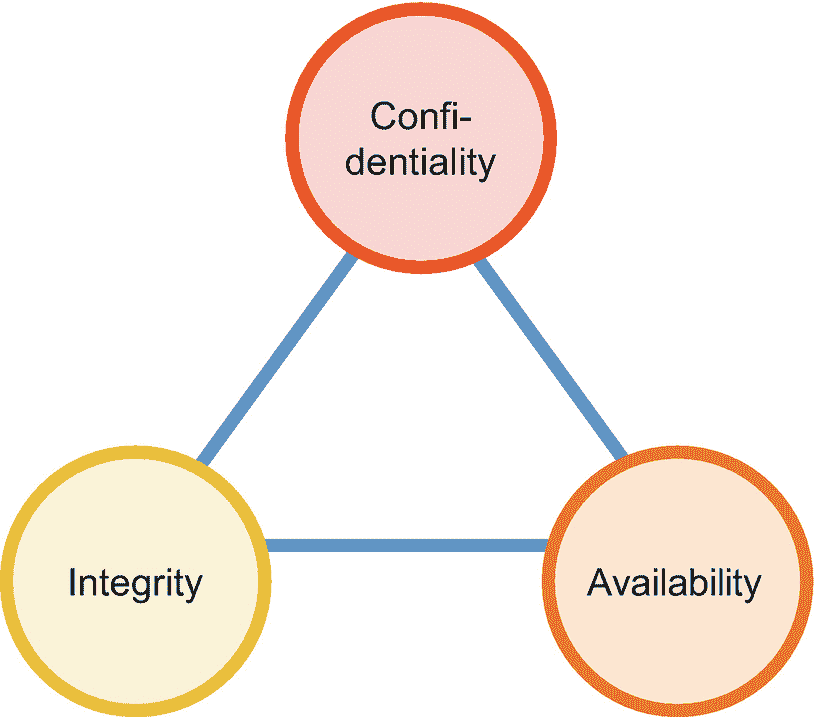
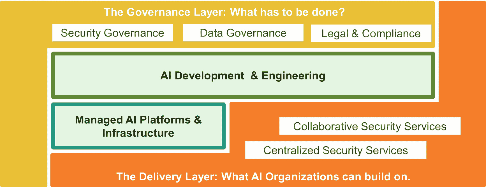
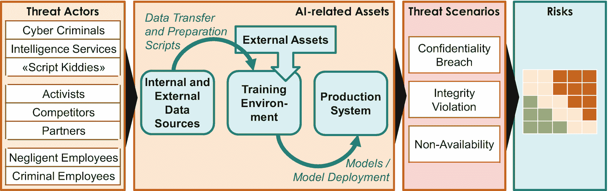
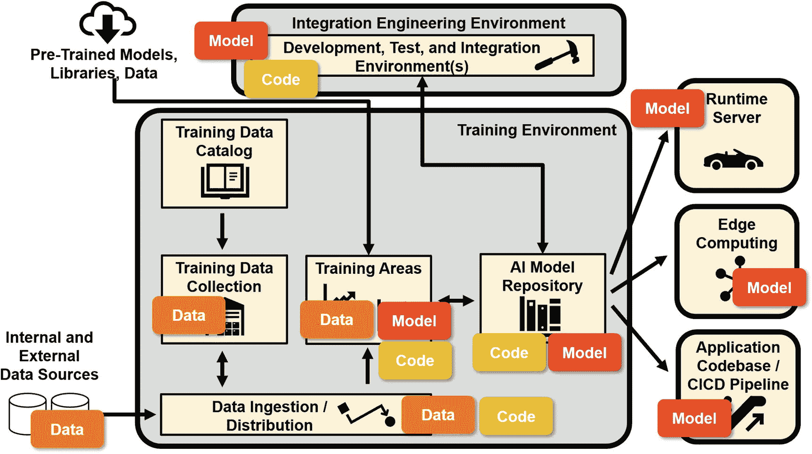
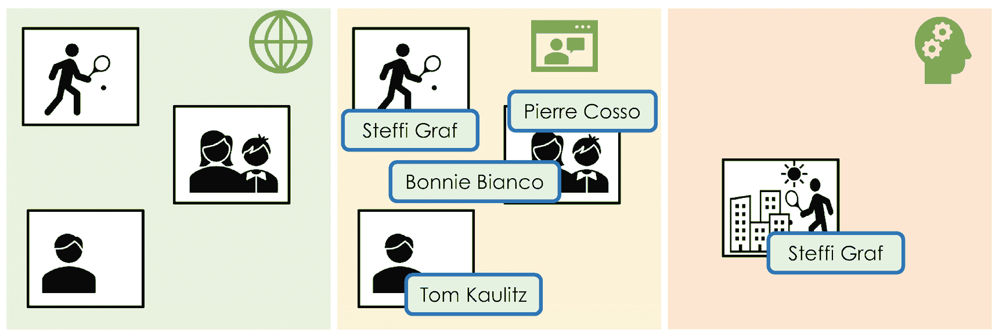
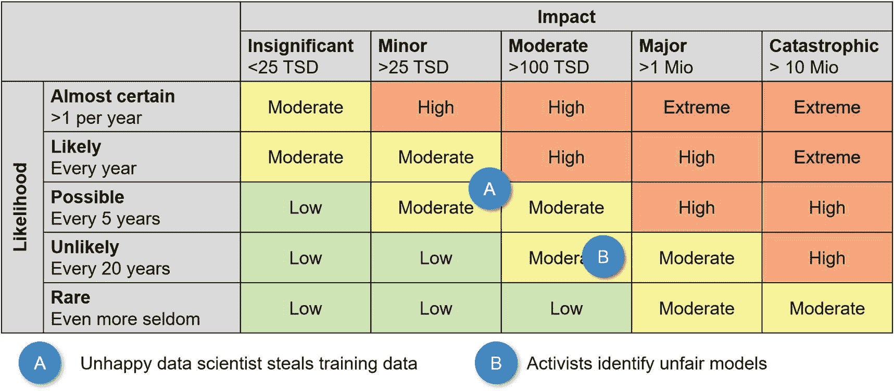
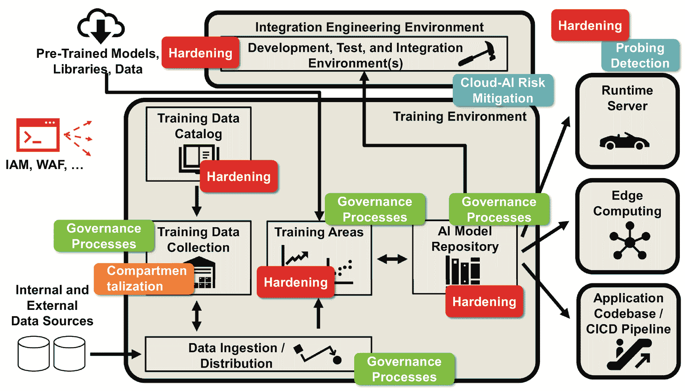
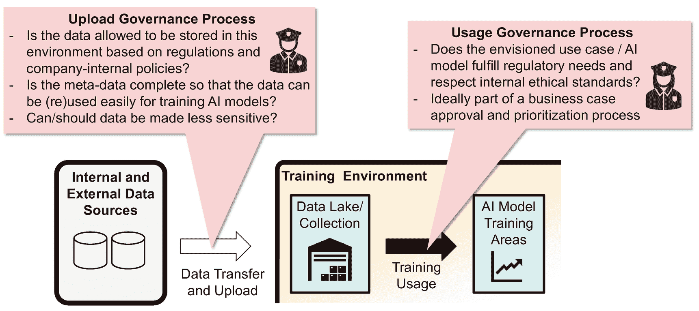
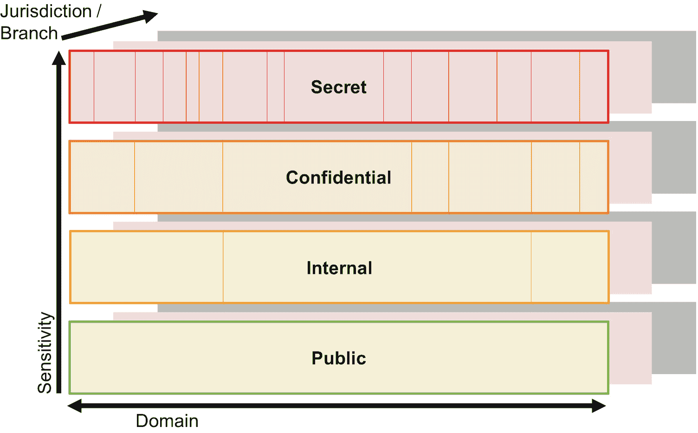

# CIA 三角

信息安全专业人员经常提及信息安全的两项基本原则：知悉必要原则和 CIA 三角（或称 CIA 三元组）。CIA 是机密性、完整性和可用性的缩写（图 7-2）。这三个术语清晰地表明：信息安全不仅仅是使用防火墙保护网络和运行防病毒软件。因此，它们同样适用于并影响着人工智能组织及其基础设施和平台。

图 7-2

CIA 三角

**机密性**意味着保守秘密。用户只能访问其工作所需的数据和系统（知悉必要原则）。通常，员工会根据其角色获得必要的访问权限。其他访问权限需要有人明确授予。为人力资源部门工作的数据科学家需要访问数据湖中存储的与人力资源相关的数据。相比之下，从事销售主题的数据科学家则无权访问人力资源数据。

CIA 三角的第二个方面是**完整性**。完整性意味着数据库、文件和数据湖中的数据与信息是正确的。应用程序、用户和客户可以信赖它们。例如，训练数据对于创建可用的 AI 模型至关重要。移除某个国家或与特定少数群体相关的所有数据会影响模型的正确性或质量。完整性并不要求在技术上使所有数据篡改和伪造变得不可能。确保完整性需要检测篡改行为，例如，通过使用和验证校验和。因此，完整性与不可否认性密切相关。用户或工程师只有在完成身份验证后才能更改数据、应用程序或配置。身份验证是记录谁做了什么的前提。毋庸置疑：以防篡改的方式存储这些日志文件至关重要。

CIA 三角的第三个也是最后一个概念是**可用性**。存储在文件、数据库和软件解决方案中的数据与信息，只有在能够访问时才能带来益处。当楼宇门禁系统依赖 AI 组件来识别员工时，该系统必须 7/24 全天候运行。如果系统不可用，则无人能进入大楼。实现可用性的典型技术措施是备份或冗余。架构必须辅以这些措施，并额外防范拒绝服务攻击或意外应用程序关闭。

## 安全相关职责

对于技术和 AI 领域的专家来说，安全通常只是附带工作。大多数工程师和架构师乐于将各种 AI 相关组件和系统整合在一起。当项目面临谁接手特定任务的问题时，即使工程能力短缺，项目团队内部通常也能找到解决方案。更大的挑战在于如何在系统运行的多年间保持其安全性。谁定期检查日志以发现异常？谁检查是否存在漏洞以及供应商是否提供了补丁——尤其是针对零日攻击漏洞？

当 AI 组织自行运行训练环境时，他们负责运行时服务器，并可能拥有模型仓库或数据湖。AI 组织必须确保这些系统是安全的。通常不清楚哪些任务由安全组织接管，哪些任务需要 AI 团队自行组织。AI 管理者面临的一个特殊挑战是理解 IT 安全组织的典型双重角色：安全服务与安全治理（图 7-3）。两者都有助于公司和 AI 组织保护其 IT 基础设施和应用环境。然而，其方法和目标有所不同。

图 7-3

安全职责的组织视角

公司的**安全治理**职能的核心任务是制定策略、执行评估，并管理因实际系统实现和流程偏离策略而产生的 IT 相关运营风险。安全治理职能只是治理职能之一。还有其他职能，如法律与合规或数据治理，同样影响着 AI 组织，这些内容将在其他章节讨论。

编写安全策略就像给圣诞老人写愿望清单。你写下来，但实际的交付和实现并非你的职责。策略包含流程和技术要求。流程要求的一个例子是，要求软件开发人员或数据科学家在向公司其他部门提供 Web 服务之前进行渗透测试。技术要求的一个例子是要求使用 TLS 1.3 加密所有网络流量。治理专家通常根据标准和框架（如 ISO 27000 系列和 ISAE 3402）或来自软件供应商或公有云提供商的最佳实践文档来制定策略。

IT 安全治理团队不向其他团队提供任何技术服务。他们通过其策略引导组织走向更安全的配置。此外，他们支持高级管理层了解公司的整体 IT 安全和风险状况。组织的其余部分，包括所有 IT 和 AI 团队，扮演着圣诞老人的角色。他们必须满足策略中列出的愿望和需求。每个**应用所有者**必须确保其应用程序是安全的，并符合安全策略。AI 组织必须为其训练环境、运行时服务器或模型仓库满足与任何其他处理大量敏感数据的应用程序或系统相同的要求。这些任务通常由 AI 组织的应用管理和运维专家负责，他们为数据科学家、数据工程师和 AI 翻译员提供内部服务。图 7-3 将这些组件称为**托管 AI 平台和基础设施**。

除了治理功能外，许多安全组织还提供安全服务——AI 组织内外的应用所有者都能从中受益。其中一种服务类型是**集中式安全服务**。这些服务针对公司特定的通用任务进行处理和解决。它们涉及保护公司边界——防火墙、数据丢失防护工具、扫描传入文件中的恶意软件——或检查与补丁相关的问题及（操作系统级别的）漏洞。

相比之下，**协作式安全服务**需要 IT 安全交付团队与应用所有者之间的紧密协作。身份与访问管理（IAM）或 Web 应用防火墙（WAF）就是例子。两者都需要针对每个应用进行定制。IAM 系统只有了解角色，并且 AI 平台能够与 IAM 解决方案进行技术交互时，才能管理对 AI 平台的访问。复杂的 WAF 需要经过训练，以微调其规则，从而学习 AI 运行时服务器可能接收到的所有合法请求。

换句话说，与集中式安全服务不同，协作式安全服务要求 AI 组织执行专门的任务来保护 AI 系统。负责设置托管 AI 平台和基础设施的集成工程师，有责任确保其安全。上线后，AI 组织的应用管理和运维专家必须在未来几年内保持其系统的安全性。AI 管理层可以确保数据科学家和工程师不会因安全相关任务而分心，从而保持 AI 组织的生产力。只有一个重大例外：个人非托管安装和应用。当 AI 专家安装系统时，无论系统运行在服务器上还是云端，他们都必须确保其安全。

**实验性安装**会带来特殊风险，尽管有时确实需要它们。数据科学家或工程师会不时尝试新工具。他们在笔记本电脑或虚拟机上安装这些工具，并执行一些用例，可能涉及实际的公司数据。一个典型的误解是，这类系统与组织的整体安全态势无关，因为它们只是实验性的。但事实恰恰相反，尤其是（但不仅限于）当它们包含实际数据时。实验性安装通常不如生产系统那样安全。因此，黑客可能更快地攻陷此类实验性系统，并利用它们攻击其他应用以及窃取机密数据。如果保护此类系统不可行，唯一的解决方案是在隔离的网络区域中设置一个沙箱环境。

AI 专家和管理者绝不能忘记保护其系统的两个原因。第一个是确保数据的机密性，并保证数据的完整性以及系统的可用性。他们负有责任，即使他们可以或必须依赖某些安全服务。

AI 组织必须强化其系统的第二个原因是防止“**溢出**”效应。例如，对单个（Web）应用的成功攻击绝不能使攻击者能够轻松接管 AI 运行时服务器或 AI 训练环境——或实验性系统。没有任何安全组织能保证这一点。这是 AI 组织每个成员的最终责任。

我们以一个关于使用**公有云服务**的 AI 组织的最终说明来结束关于责任的讨论。这是一个热门话题，这意味着其治理和责任划分不如传统数据中心那样完善。AI 组织应与安全组织确认是否允许使用预期的云服务。此外，他们还应确认安全组织是否为预期的云环境提供标准安全服务。否则，AI 组织可能不得不自行设置和管理云安全——或者冒着审计人员关闭其环境的风险。

## 映射风险格局

AI 的崛起及其对关键业务流程的贡献正在改变组织——并带来新的风险。如果攻击者操纵 AI 功能或窃取数据或模型，会发生什么？AI 对许多风险和安全专家来说是一个新领域，但方法论保持不变。首先，了解威胁行为者及其动机、目标和能力。其次，识别攻击者可能攻击或试图窃取的资产。第三，理解攻击场景以及攻击者的目标。第四，也是最后，根据可能性和潜在影响进行筛选，以识别相关风险。图 7-4 展示了这些步骤。我们将在下文详细探讨它们。

图 7-4

从威胁到 AI 组织的风险

### 威胁行为者

脚本小子、专业网络犯罪分子以及外国情报机构：形形色色的群体正威胁着当今的 IT 系统和 AI 环境。威胁行为者的目标包括窃取知识产权、勒索赎金，或试图瘫痪关键服务器。他们威胁着 AI 组织、AI 相关资产，以及由 AI 驱动的业务流程和控制系统。这些威胁行为者在动机、能力、技术和财力方面各不相同。

如今，发动网络攻击的门槛比以往任何时候都低。攻击工具随处可见，使得`脚本小子`能够从事那些“不太推荐”的休闲活动。`网络犯罪分子`拥有更多的人力和财力资源用于攻击。当他们缺乏特定技术知识或发动大规模攻击时，会将任务外包给犯罪服务提供商。网络犯罪分子有明确的金钱动机，例如勒索赎金。比如，他们会加密公司所有数据（包括备份），只有在收到赎金后才解密数据。这对中小企业来说是个挑战，即便是资金充足的 IT 安全团队也难以应对。更糟糕的是`国家资助的攻击者`和情报机构。他们拥有近乎无限的资源，主要关注关键基础设施，有能力瘫痪其他国家的关键基础设施。或者，他们试图从政府机构、军方或具有战略意义的高度创新公司和机构窃取商业和军事机密。防空系统中的 AI 模型可能对敌对国家具有高度吸引力，自动驾驶汽车的最新研究成果或生物技术创新也是如此。

还有另外三种类型的外部攻击者：活动人士、合作伙伴和竞争对手。`竞争对手`是天然的威胁行为者，因为他们能直接从窃取知识产权或破坏正常运营等非法活动中获益。不过，这取决于行业领域的商业文化以及公司运营、生产和销售所在的国家。

`合作伙伴`作为威胁行为者往往被忽视。有些人可能怀有不可告人的目的。例如，他们可能想改变合同平衡以增加自身利润，或秘密计划以竞争对手身份进入市场。此外，还有`活动人士`。他们的目标不是经济利益，而是与他们眼中不公正的现象作斗争。他们想揭露某个组织的不专业行为，或证明基于 AI 模型的不公正，例如，如果模型歧视社会中的某些群体。

当组织虐待员工或员工试图快速赚钱时，有些人会转而与雇主作对并伤害他们。能够访问大量数据源（例如数据湖）的`犯罪员工`尤其危险。如果没有日志记录，取证专家就无法了解发生了什么或进行刑事调查。如果每个人都可以将大量数据复制到个人 U 盘上，这进一步助长了非法活动。

除了犯罪攻击的风险外，还存在善意的`员工`因疏忽而犯错的风险。他们可能不理解安全规程；这些规程可能不方便，或者从他们的角度来看不合理。这种情况可能导致员工敷衍地遵守安全规程，从而可能造成漏洞。

哪些威胁行为者与公司相关？或多或少，每家公司都是脚本小子和网络犯罪分子的潜在目标。例如，网络犯罪分子通常只要求“五位数”的赎金。中小企业有能力支付这笔钱，而有限的 IT 防御能力使它们成为可行的目标，尤其是在攻击者可以自动化攻击的情况下。其他威胁行为者的风险需要针对每家公司单独评估。例如，一家法国公司可能会受到外国活动人士的攻击，例如，由于法国和土耳其之间的紧张关系。

在了解了潜在且相关的威胁行为者之后，下一步是研究攻击者可能针对什么目标。换句话说：AI 组织的资产是什么？

### AI 组织中的资产

“资产”是一个广泛使用的术语。它指软件、硬件和数据——即信息处理所需的一切。对于 AI 组织来说，有四种关键资产类型：

*   **AI 模型**。例如，它们有助于优化业务流程、监督装配线、控制化学反应器或预测股票市场价格。AI 模型可以是应用程序代码库的组成部分，也可以在 AI 运行时服务器上运行。

*   **训练数据**对数据科学家至关重要。他们需要这些数据来创建和验证 AI 模型。

*   **AI 运行时服务器**是运行 AI 模型并进行推理的软件和硬件系统。它可以是`RStudio Server`，模型可以是实际应用程序代码的一部分，或者应用程序实现了边缘智能模式。

*   **训练环境**，数据科学家在此创建、优化和验证 AI 模型，例如使用`Jupyter`笔记本。

对于一个旨在高效工作的 AI 组织来说，各种其他系统和资产也具有重要意义。它们主要与训练环境相关：

*   内部**上游系统**及其数据，例如`SAP`、核心银行系统或`Salesforce`。

*   来自互联网的**预训练模型、库**和参考**数据**，用于加速训练过程或帮助获得更好的模型。

*   **数据摄取与分发**解决方案，例如`ETL`工具，将数据从数据源加载到训练数据集合中，并可能也将其加载到训练环境中。

*   **AI 存储库**，用于存储模型描述和训练历史记录——以及模型本身。

*   **数据目录**，用于索引和描述可用于训练模型的数据。

任何与 AI 相关的威胁或攻击都涉及这些资产中的一个或多个（图 7-5）。攻击一旦成功，就会损害信息安全 CIA 三元组的一个（或多个）属性：机密性、完整性、可用性。某些资产可能影响生产，其他资产“仅”用于高效训练。了解这些细节是威胁分析的一部分。

图 7-5

AI 生态系统及其资产

### 保密性威胁

与人工智能相关的系统需要并处理大量数据以生成新的见解。这些系统对试图窃取知识产权（特别是`训练数据`或`AI 模型`）的威胁行为者具有高度吸引力。从时间和金钱角度来看，它们对竞争对手而言无异于一座金矿。例如，自动驾驶汽车公司 Waymo 以超过 2000 万英里的实际驾驶里程和超过 150 亿英里的模拟驾驶里程为傲。当竞争对手获得这些训练数据或基于这些数据构建的 AI 模型时，他们就能节省数百万的投资和数年的工作。同样，保险行业中被盗的承保模型使竞争对手能够吸引有利可图的客户，同时避开有问题的客户。

只需查看图 7-5，就能清楚训练数据位于何处。攻击者可以从原始数据源和数据库中窃取它。然而，在大多数情况下，最广泛的数据集合是 AI 组织的训练数据集合/数据湖，它包含了所有可用的数据。相比之下，实际的训练区域（例如单个 Jupyter notebook）提供的数据则更为有限。攻击数据摄取和分发组件是收集数据的另一种方式。

除了窃取数据，另一种选择是窃取最终的 AI 模型以供使用——或者了解公司如何运作（例如在市场上的行为），从而压低其盈利报价。AI 运行时服务器或其他生产系统、AI 模型仓库以及训练区域存储或可以访问一个或多个此类模型。AI 模型仓库是存储所有 AI 模型的组件，甚至包括解释和文档。如果使用了 AI 运行时服务器，它们会包含大量的 AI 模型集合。其他系统或组件，例如训练区域或应用程序源代码（如果 AI 模型被重新实现并成为代码的一部分），则只提供一个或少数几个 AI 模型。然而，对于任何保险公司来说，即使只为一个大客户群或重要客户群丢失一个模型，也可能已经是灾难性的。

知识产权损失可能并非对所有公司都是问题。然而，第二个保密性威胁与许多公司相关：窃取数据以勒索赎金。医院存储着哪些客户是 HIV 阳性。保险公司如果处理疾病津贴，则会存储其客户公司员工的薪资相关数据。没有哪家医院或保险公司希望看到此类信息出现在网络上。他们的客户和患者也同样不希望。如果网络犯罪分子获取了此类敏感数据，这便成了敲诈所有人的完美场景。

在过去，窃取文件和数据需要复杂的攻击手段——至少对于非面向互联网的服务器上的数据而言是如此。尽管如此，如果 AI 组织忽视此类风险，那将是愚蠢的行为，尽管如今存在更严重且更容易实施的攻击。

随着公有云的出现，公司开始在云端训练 AI 模型。训练数据和训练好的模型都位于云端。如果公司或 AI 组织正确设置了云安全，资产就是安全的。然而，错误配置发生得更快，（防护薄弱的）面向互联网的公有云环境对攻击者来说是一种诱惑。过去几年，许多公司都不得不通过惨痛教训认识到这一点。

最轻松且可能最难检测的保密性攻击涉及员工。在许多组织中，他们可以轻松且无风险地将任何文件（包括模型或训练数据）转移出公司。

然而，即使无法访问模型，仅通过探测也能窃取模型。假设一个攻击者想要模仿一个“VIP 识别”服务，该服务用于识别图片中的明星和新星。第一步是爬取网络以收集样本图片（图 7-6，左侧）。此时，尚不清楚图片中是否包含 VIP。因此，无法用这些数据训练 AI 模型。所以，第二步是将这些图片提交给“VIP 识别”网络服务。该服务会返回哪些图片包含哪些 VIP（中间）。现在，攻击者可以利用通过探测获得的信息构建一个训练集，来训练他自己的神经网络以模仿原始模型，并将其投入生产使用（右侧）。

图 7-6

探测模型以重建它——从网络抓取样本图片（左侧），让待模仿的服务标注图片（中间），基于新标注的图片训练神经网络（右侧）

最后，关于非经济动机威胁行为者的补充说明：活动家可能对 AI 模型感兴趣。他们的动机是验证模型是否系统性地歧视社会中的某些子群体，例如，通过向他们收取与主流客户不同的价格。

### 完整性威胁

与人工智能相关的完整性威胁首先涉及**模型质量**。当威胁行为者修改模型或干扰其训练时，模型会错误分类图像或做出不精确的预测。其后果可能是：工厂生产出无法使用的零件；航空母舰误判一架无害的客机正向其飞来，而非敌方轰炸机；或者保险公司认为 20 岁的潜在客户有 90%的概率在明年死亡，从而停止向他们出售人寿保险。模型严重出错的极端情况听起来令人恐惧，但组织通常能很快发现。更危险的是那些微妙的操纵，它们更难被识别。企业如何能察觉到一个被操纵的风险与定价模型——该模型给德国南部的客户提供了低 7%的价格，同时却拒绝了奥地利 10%的有利可图的长期客户？这类操纵往往不明显，但效果显著。它们会赶走忠诚的奥地利客户，同时因在德国给予不必要且不合理的折扣而造成直接经济损失。

外部威胁行为者在 AI 模型库或生产系统中**操纵**特定 AI 模型，听起来不太可能，至少对于非情报机构关注焦点的公司而言是如此。但即使是不在全球网络犯罪聚光灯下的公司，也必须意识到来自内部的、并非完美无缺的 AI 模型所带来的威胁。感到被不公正对待（或被竞争对手接触）的数据科学家可以更轻松地操纵模型。此外，即使是怀有善意的、高度专业的数据科学家也会犯**错误**，导致模型平庸或完全错误。因此，针对 AI 的内部质量保证程序至关重要。与传统的软件工程相比，AI 相关的质量保证通常更像高度敏捷的初创公司模式，不够严谨和成熟。

最后一点已经将焦点从操纵模型转移到了整体的创建和训练过程。**糟糕的训练数据**意味着糟糕的模型，无论质量指标如何显示。如果詹姆斯·邦德不想被监控摄像头识别出来，他会怎么做？他会将自己几百张照片注入训练集，将其标记为“鸟”，然后重新训练 AI 模型。从此以后，监控摄像头就会忽略他，因为他是一只鸟，而不是一个窃贼。

**训练数据错误或操纵**问题严重且难以检测。它们可能发生在多个环节：原始操作数据库、数据摄取脚本、训练数据收集或数据湖，以及模型训练期间的训练区域。如果数据科学家使用外部训练和验证数据集，这些也是攻击者的潜在途径。谁会去检查数百万张图片，寻找被错误标记的詹姆斯·邦德图像？谁能理解为什么测试数据准备过程中的某个命令执行的是左外连接而不是右外连接？为什么某些值要乘以 1.2 而不是 1.20001？为什么上游系统停止发送负值？这是错误、蓄意破坏，还是改进后的数据清洗？即使没有外部威胁行为者，创建训练数据也极其复杂。

到目前为止讨论的所有威胁和攻击都需要访问组织内部的训练环境、生产系统、AI 模型或训练数据。而其他威胁则不需要这些。它们可以在不触及目标组织任何资产的情况下成功实施。

数据科学家希望快速行动，并整合这个快速发展的领域中最新的算法。他们从互联网**下载**预训练模型、AI 和统计学库以及公开可用的数据集。这些下载是构建更好的公司特定模型的基础。同时，这些下载也为攻击者提供了后门，他们可以提供被操纵的数据或模型，尤其是针对小众模型和训练数据。

另一种无需触及任何资产的攻击类型是**对抗性攻击**。其理念是操纵输入数据，使得人眼无法察觉操纵，但 AI 模型却会产生错误结果。例如，图片中的微小变化，或如图 7-7 所示道路上的一些新点，都可能导致 AI 模型无法检测到交通信号灯，或者错误理解是应该继续向右行驶，还是应该全速直行然后掉下斜坡。这类攻击仅对作为复杂神经网络的 AI 模型有效，对简单的线性函数无效。

图 7-7

理解对抗性攻击——攻击者以（几乎）不可见的方式改变输入数据（如图片），使神经网络做出错误决策。你看到这两张图片之间有多少处不同？

### 可用性威胁

最后一种威胁场景涉及潜在的不可用性。首先，存在**生产环境中的 AI 逻辑**或**训练区域**宕机的风险。在后一种情况下，数据科学家无法工作。如果生产系统宕机，则会影响业务流程。不可用性是对**服务器**攻击的后果。典型的攻击包括使用格式错误的输入使应用程序崩溃，或通过（分布式）拒绝服务攻击淹没服务器。

与 AI 特别相关的一个方面是**丢失中间结果或模型**的威胁。在数据科学中，与传统的软件开发相比，流程在工件文档和版本管理方面往往更不正式。这种松散可能导致可用性风险。例如，当一位关键工程师生病、休假或离职时，他的同事可能无法重新训练模型。相反，他们必须开发一个全新的模型，这需要时间并产生成本。

### 从威胁到风险与缓解

阴谋论者与风险专家的区别在于对概率的考量。例如，美国国家安全局（NSA）可能曾篡改过本书，添加了五句话，并删除了前一页上一只跳舞的粉红大象插图。他们极有可能实施此类攻击。然而，他们为何要投入时间和金钱进行这样的攻击？理解威胁行为者的动机、目标及其技术和财务能力，对于应对高度相关的安全风险并改善整体安全态势至关重要。

我们讨论的机密性、完整性和可用性威胁是通用性的。在 IT 安全风险评估中，风险评估师和 AI 专家会仔细审视哪些攻击是可能的，并评估攻击发生的可能性及其对具体 AI 环境的潜在影响。结果便是如图 7-8 所示的风险矩阵。

**图 7-8** 某 AI 组织的公司特定风险矩阵

该示例风险矩阵包含两种威胁。图 7-8 中的风险 A 反映了一种可能性：一名心怀不满的员工窃取了包含（匿名化的）过往客户购物行为的训练数据。其财务影响评级为“轻微”，意味着损失在 5 万到 25 万之间。财务影响有限是因为该公司拥有强大的品牌和独特的物流能力，使得复制其商业模式颇具挑战。此类攻击的发生概率评级为每五年一次。

基于风险评估和风险矩阵，管理层必须决定接受哪些风险，以及缓解哪些风险。**缓解**意味着投资于组织措施或技术改进。在本章稍后部分，我们将详细讨论一些更复杂的缓解措施。但首先，为了便于理解，我们在此介绍一些 AI 背景下的典型缓解措施。例如：

- 确保训练环境和生产系统具备**访问控制和边界安全**。这些措施降低了数据或模型被非预期传输到外部以及遭受非预期篡改的风险。此外，如果 AI 功能部署在公有云中，这些措施至关重要。
- 执行严格的质量流程和**质量门禁**。在大多数情况下，粗心的数据科学家是导致模型质量低下的最大风险之一。双人复核以及对关键决策的适当记录，能降低将不合格模型部署到生产环境的风险，而拥有结构化和全面的质量保证流程则效果更佳。
- 确保外部数据、代码库和预训练模型**来自可靠来源**。对这些下载内容进行实验对数据科学家至关重要。然而，当外部下载内容被用于构建部署到生产环境的 AI 模型时，需要一定的治理流程。

这三项措施降低了组织的潜在威胁和攻击面。然而，它们并不能取代适当的风险评估。风险评估会仔细审视上述所有威胁场景和威胁。AI 充满乐趣，AI 带来创新。与此同时，组织必须理解并管理其与 AI 相关的安全风险。只有明确了谁负责管理和应对哪些风险，定义缓解措施才有意义。接下来，我们将仔细审视一些潜在的措施。

## 保护 AI 相关系统

对于 AI 和分析而言，数据之于系统，就如同燃油之于汽车：数据越多，你就能跑得越远、越快。但有一个巨大的区别：你会烧掉燃油，而数据却会留在你的系统中。一个 AI 团队在短短几个月内就会堆积起海量数据——这堪称一场安全噩梦。一个不择手段的竞争对手只需策反你的一名数据科学家，她就能将你大部分商业数据和知识产权提取并转移给竞争对手。因此，本节只有一个目标：详细阐述如何在不妨碍数据科学家和 AI 组织日常工作的前提下，降低这种安全风险。

三项传统措施是成功的关键，同时还有三项需要超越标准 IT 安全进行创新思考的措施。这些措施包括：

1. 通用系统加固
2. 治理流程
3. 分区隔离
4. 敏感属性的高级技术
5. 探测检测
6. 云 AI 风险缓解

AI 和安全专家将它们应用于各种 AI 组件，如图 7-9 所示。

**图 7-9** AI 组织应用环境的安全措施

### 系统加固

通用系统加固涵盖了传统的 IT 安全措施，例如网络分区和防火墙，集成安全服务（如互联网和访问管理（`IAM`）解决方案或 Web 应用防火墙（`WAF`）），以及安全地配置系统，即限制 IP 范围。

这些是“常规”软件中已知的标准活动。它们同样适用于任何 AI 系统或组件，无论是训练区域、存储库、数据湖还是其他任何东西。其目标是：确保未经授权的人员无法访问系统，同时使数据科学家和工程师能够执行他们的工作。

### 治理

区分对训练数据的访问是充分且必要，还是不必要且有风险，需要人为判断。判断的结果应当透明且可重复。类似的情况应产生相似的决策，而请求者希望了解决策过程中涉及的人员以及决策推进的程度。治理流程对此有所助益——AI 组织通过建立两个尤其相关的流程（分别针对数据上传和数据使用）而受益（图 7-10）。数据上传治理流程用于验证加载到训练环境中的数据是否充分。使用治理流程则用于验证数据是否可用于特定的用例。

图 7-10

AI 训练环境的治理流程

将这两个流程分开是一种成本和周期优化。因此，第一个需要从新型涡轮机获取遥测数据的项目，会实施数据传输和准备，并经历上传审批流程。理想情况下，后续的十个或二十个项目可以复用这些数据。他们只需为使用这些数据用于自身目的而获得批准。他们可以跳过上传审批，直接复用已实施并获批的数据副本和准备基础设施，从而节省时间和金钱。

**数据上传治理流程**从审批的角度审视，数据是否能够且应当被复制到 AI 训练环境中。数据所有者、数据隐私官、法务团队和 IT 安全部门通常是决策的驱动者。一个明显的担忧涉及数据隐私，即当 AI 训练环境与公司所分析数据对应的人员处于不同司法管辖区时。第二个担忧涉及处于高度竞争和敏感行业领域的公司或政府机构。他们可能不愿将每一条信息都放入任何公有云中，无论其 AI 功能多么出色。

虽然数据上传治理流程具有控制功能，但它也通过简化（复）用，帮助提升训练数据的价值。该治理流程可以作为数据目录中文档记录的检查点。它可以强制要求，只有在元数据完整的情况下，数据才能被放入训练环境。这意味着：数据科学家必须描述其数据的内容，评估并记录数据质量，阐明潜在的使用限制，并分析数据血缘。该治理流程是通往高质量数据目录（至少是在 AI 训练环境内）的捷径。

然而，也可以讨论并实施一些措施来**降低数据的敏感性**。例如，与个人客户相关的购物车信息比匿名购物车数据问题更大。显然，匿名的自然时机是在数据上传到训练环境之前。

理想情况下，与使用相关的治理流程是组织新（AI）项目管理与审批流程的一部分。在数据上传之后、实际用例实施和 AI 模型训练之前，它侧重于审批，而非赋能。它质疑预期的数据使用或设想的 AI 模型是否违反了数据隐私法、内部道德准则或任何其他政策或法规。同样，数据所有者、数据隐私官或法务与合规团队是自然的决策者。

### 数据隔离与访问管理

隔离平衡了两种相反的愿望：对细粒度数据访问控制的愿望，以及对可管理性的愿望和需求。同时实现这两点对于**存储库**和 AI 模型训练区域是可能的。如果某位专家正在处理一个项目，他就能访问特定的训练数据；否则就不能。此外，确定哪个应用程序需要从特定存储库获取模型也很直接。挑战在于对数据湖或 AI 组织在其 AI 模型训练环境内的**数据集合**的访问管理。

让每位数据科学家都能访问所有数据是不可行的。为数千个数据集和数据类别分别管理数据访问同样不可行。后者可能会令人惊讶。超级细粒度的访问权限很有吸引力，至少乍看之下如此。然而，数据科学家和数据所有者无法在日常工作中使用它们。其复杂性对人类思维来说太高了。结果，他们会停止遵循“按需知密”原则，以防止 AI 组织被阻塞。他们会转向“授予并非明显不必要的访问权限”模式，批准的数据访问远超所需。因此，超级细粒度的访问控制纸上谈兵尚可，但在现实中会失败。

假设来自业务部门的数据所有者非常了解自己的数据和数据模型。他可以处理十个或二十个子集，但无法处理一百个或数千个。AI 组织需要一种隔离方法来限制数据访问控制角色的数量，并根据其组织的实际规模和复杂性进行调整。一个起点是遵循三维隔离方法（图 7-11）。它适用于中型企业，并且可以扩展到世界上最大的公司。

图 7-11

隔离的三个维度

第一个维度是**敏感性**，通常基于四个级别进行分类：公开、内部、机密和秘密。公开数据是（或可以）在网络上公开获取的，例如公共卫生组织发布的统计数据或营销手册中的产品描述。其次是内部数据。这意味着每位员工（有正当理由时）都可以访问。客户联系信息就是一个例子。客户是顶级客户、标准客户还是经常制造麻烦的客户的分类也是如此。B2B 背景下的复杂报价或 WHO 招标是机密数据的例子。交易成败可能对公司的利润产生重大影响。而任何向竞争对手泄露报价的行为都可能导致交易必然失败。最后是秘密数据。密码或用于加密和签署文件的（主）密钥属于此类。可能影响公司股票交易所价格的信息——在披露之前——可能属于此类。后者的例子也说明数据敏感性会随时间变化。例如，一旦此类股价相关信息公开，它就变成了公开数据。

