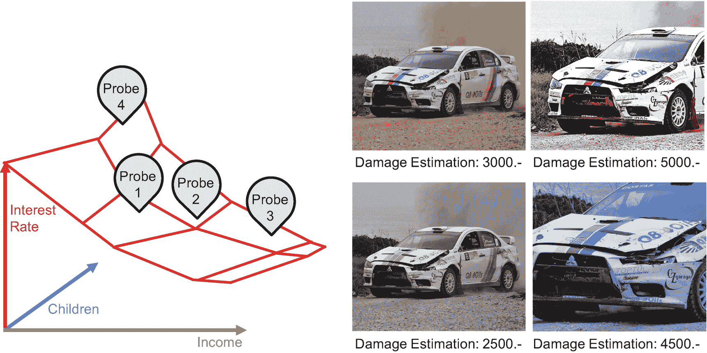
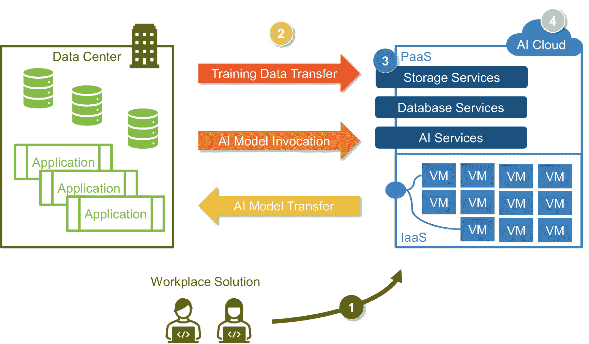
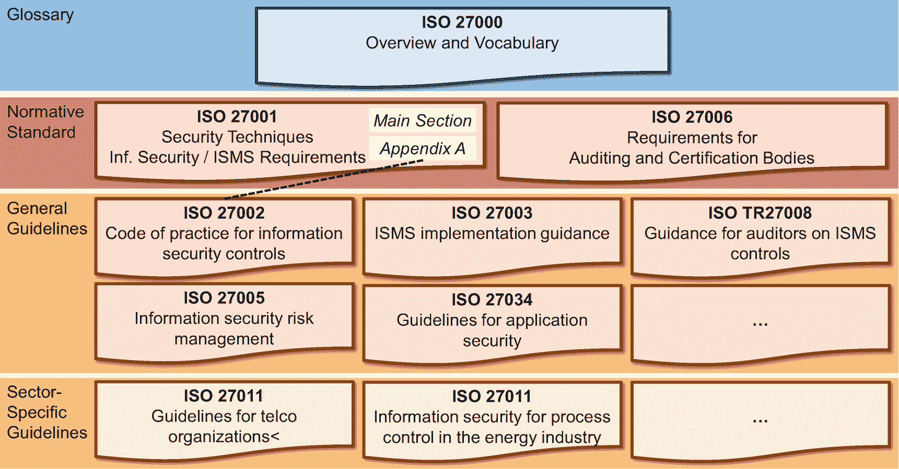

# 数据敏感度分类的附加标准与法规

某些行业领域的数据敏感度分类受到额外标准和法规的影响。例如已提及的`GDPR`、健康保险流通与责任法案（`HIPAA`）或支付卡行业数据安全标准（`PCI-DSS`）。组织可以通过不同方式建模这些影响。监管标准可能影响数据归属于四个类别中的哪一个。例如，新加坡和海峡群岛的银行客户数据属于“机密”，其他客户数据属于“保密”。或者，组织可以在四个敏感度级别之外，为每项标准和法规引入标记。这些标记表明数据是否属于额外的专用类别。例如，一条客户记录可能被标记为“保密类别”和“敏感个人数据（`GDPR`）”。

第二个维度是**数据或业务领域**。数据属于人力资源、市场营销还是研发相关领域？数据所有者负责一个或多个领域。该领域有助于在治理流程中让合适的人员参与进来。这也是公司规模影响最大的维度。规模决定了审批粒度。人力资源是一个大领域，还是组织在子领域层面工作，区分不同类型的人力资源数据，例如招聘、薪资、保险、绩效管理和培训？大型组织倾向于拥有更细粒度的审批级别。它们有更多员工来处理请求，拥有更多敏感数据，以及更复杂的数据模型。

第三个维度反映了公司的**组织结构以及公司运营所在且数据可能归属的不同司法管辖区**。不同的子公司可能有不同的内部规则。不同的司法管辖区对数据存储、使用以及人工智能有不同的监管规定。

总而言之，领域、组织结构和司法管辖区是划分工作、管理访问权限、在治理流程中路由请求以及快速确定适用哪些规则和法规的自然方式。数据敏感度维度允许快速评估一个请求是需要更深入的分析还是可以走捷径。

## 敏感属性的高级技术

某些数据类型在训练数据中尤为突出，因为一旦丢失或暴露，它们会带来高风险。首先，这些是能够识别个人的数据项，例如社会安全号码。其次，存在敏感的个人数据和受保护类别，例如工会会员身份或种族。在此，考虑超越典型访问控制的不同方法是合理的。可选方案包括：

- **不将其复制到 AI 环境**。如果受保护类别和敏感个人数据不得用于 AI 模型训练，为何要复制这些数据？同样适用于标识符。如果不需要，可以在将数据作为训练数据导入 AI 环境时将其移除。

- **匿名化数据**意味着完全无法识别数据所属的个人，即使使用额外信息或表格也无法识别。如果你将姓名替换为“XXXX”，结果就是匿名数据（至少在没有其他列（例如 ID）的情况下）。如果匿名化是强制性的，AI 组织必须详细检查。通常，这个术语也用于第三种选项——遮蔽。

- **遮蔽数据**，即增加确定数据所属个人的难度和时间成本。它反映了例如一个表包含合成姓名和账号，但最终仍存在一个将合成姓名和号码映射到真实姓名和号码的表（例如，为了便于修复问题）的情况。

## 探测检测

合作伙伴、竞争对手或客户：这些是潜在的攻击者，试图逆向工程或误导自动化评级或决策。一家拥有实体分支机构的传统银行可能想了解一家在线银行的定价模型，以便针对那些未获得“良好”在线报价的客户提供高利润信贷（图 7-12，左图）。一家汽车修理厂可能想了解哪种损坏汽车的照片能让保险公司为维修支付最高赔偿。是远景还是特写照片，应该是色彩鲜艳的——还是黑白图像更有利可图（图 7-12，右图）？

图 7-12

探测模型重建（左图）与寻找弱点或最佳点（右图），图片来源：Pixabay

如果攻击者无法直接访问 AI 模型，他们可以——如果模型暴露于互联网——对其进行探测，并发送大量具有不同值组合（例如收入、财产、年龄、子女抚养费或我们银行示例中的其他参数）的请求。攻击者收集回复，并使用这些数据训练一个行为类似于银行原始模型的模仿 AI 模型。攻击者无法访问原始模型，但他们可以分析自己的模仿 AI 模型。因此，AI 组织和 IT 安全专家必须防止对 AI 模型的探测——同时不干扰“正常”客户的请求。潜在的方法包括：

- 限制每个 IP 地址每小时的请求数量——甚至用错误结果迷惑攻击者。
- 限制对系统的匿名访问，并在提供任何评估之前要求注册。
- 使用验证码来至少防止自动化探测。
- 不直接在线提供评估结果，而仅通过电子邮件、信件或电话提供。

公司必须在失去潜在客户（例如，客户可能觉得等待信件的过程太不方便）的风险与竞争对手或合作伙伴探测模型的风险之间取得平衡。

总而言之：将 AI 模型暴露给公众或合作伙伴（例如作为业务流程的一部分）的公司，应监控流程和请求，以发现异常以及欺诈或间谍活动的迹象。

### 云-AI 风险缓解

许多 AI 组织在迁移上云方面走在了时代前列，这反而给他们带来了麻烦。海量数据、高度波动的计算需求，以及公有云中现成的先进 AI 框架，促使数据科学家和 AI 专家迅速采用云服务。而公司其他部门及 IT 安全组织可能仍在云迁移的途中。大多数 AI 组织已经身处云端。因此，与传统的本地部署环境相比，AI 组织不得不承担更多与安全相关的任务。因此，AI 管理者、数据科学家和工程师若能对主要安全风险有基本了解，将受益匪浅。

在详细阐述*在*云中的风险之前，我们先来看看迁移*到*云时，特别是迁移到全球大型云服务商时，所面临的独特**合规风险**。首先，公有云提供商提供众多不同的服务，从计算和存储到针对物联网或区块链的非常具体的利基服务。并非每项服务在每个区域都可用——而且，数据科学家和工程师的实际配置甚至决定了数据最终是否位于具有适当**司法管辖权**的数据中心内。配置时点错一次，数据科学家或数据工程师就可能将欧盟数据传输到美国，这通常是个大问题。其次，**《云法案》**意味着美国当局甚至可能访问非美国数据中心的数据。这些数据传输或潜在的数据暴露，对于监管机构来说可能是不可接受的。第三，存在**制裁**风险。在这种情况下，公司可能不得不立即切换到另一个司法管辖区的新的云服务提供商。在本地部署的世界中，当公司受到制裁时，即使安全补丁被扣留，软件仍能继续运行。相比之下，在云中，对所有数据和软件的访问会立即被封锁——这对于经合组织国家中即使是较小的公司和政府机构来说也是一个真实的风险，正如德国萨斯尼茨港的例子所示。该港口每年处理 220 万吨货物，与鹿特丹港的 4.69 亿吨相比微不足道。它由当地城市和一个德国联邦州共同拥有。经济上无关紧要，所有者背景稳固——却处于一场管道争议的中心，导致美国威胁要制裁该港口。如果这样一家公司的物流，例如，依赖于公有云中的 AI 框架，会发生什么？

一旦 AI 组织决定迁移到云，特定的安全风险就会出现并变得具有新的相关性。图 7-13 概述了需要云特定**技术安全措施**的风险领域。如果 AI 组织拥有独立的云或单独的租户，这些措施很重要；但如果与公司其他部门运行在同一个租户中，其重要性则较低。

图 7-13

AI 组织的云安全风险

第一个风险领域涉及用户访问。数据科学家和工程师必须连接并登录到云（图 7-10，1）。如果 AI 组织不使用与组织其他部门相同的云环境，他们可能会绕过公司的中央**用户和访问管理**及 Active Directory。因此，管理新员工、处理离职员工或调岗员工就变成了一个问题。比员工被保安带出大楼更麻烦的事情是：如果这位前员工在接下来的数周甚至数月内仍能访问云，从而有机会进行报复，因为 Active Directory 已被锁定，但“在外”的云账户却未被禁用。此外，大多数公司强制实施**多因素身份验证**。如今，仅使用用户名和密码登录已不被认可。员工需要 RSA 密钥或手机上的特殊应用程序。公有云也提供这些功能，但默认情况下并未强制执行。

**服务账户**是第二个领域，这是一个非常相似的话题（图 7-10，2）。本地部署环境或公司的其他云环境需要与 AI 组织的云租户进行交互：

*   训练数据必须传输到 AI 环境。
*   如果运行时环境在本地，或者模型成为应用程序代码的一部分，则可能需要将训练好的 AI 模型移回本地环境。
*   训练好的模型可能依赖云作为 AI 运行时环境。那么，公司的各种应用程序必须能够调用云上的 AI 模型进行推理。

服务账户面临的挑战是防止密码或访问密钥被盗用的问题。如果数据工程师离开公司，复制了密码，并在数周甚至数月内持续拥有云访问权限，那将是一场灾难。

**暴露于互联网的平台即服务**是第三个风险领域（图 7-10，3）——并且这是公有云独有的。数据库或对象存储是 Web 服务。应用程序——以及攻击者——可能从公共互联网访问它们。两者都可以以相同的方式调用 AI 模型以及更多服务和资源。工程师应将其配置为仅允许来自特定 IP 地址的经过身份验证的用户访问。然而，错误配置可能导致数据公开暴露。大多数云数据泄露都是此类错误配置的结果，而非复杂的攻击。

需要澄清的是，对于基础设施即服务（如虚拟机）来说，这种风险并不那么突出。意外地将虚拟机开放到互联网，需要比在 PaaS 世界中多得多错误配置。

第四个主题是云中的**安全运维**。谁负责处理安全事件、检查日志和分析警告？（图 7-10，4）

这些云风险领域并非 AI 组织所独有。每位工程师都应了解它们。然而，目前大多数公司正处于过渡阶段。AI 组织可能无法获得 IT 安全部门的常规支持。假设 AI 组织单方面决定建立一个 AI 云。在这种情况下，他们需要负责安全工程和安全运维。他们不能指望 IT 安全组织会帮助他们。AI 管理者可能很快会意识到：审计人员不会同情一个拥有大量数据但缺乏足够 IT 安全知识的 AI 云。最后，更糟糕的是，审计人员期望 AI 云遵循与组织其他部分相同的规范和标准，例如，包括 ISO 27000 信息安全标准。

### ISO 27000 信息安全标准

标准并非创意人员或 IT 专家的心头好。大多数工程师和数据科学家更倾向于在监管宽松、规范不严的领域工作。即便存在诸如 `Scrum`、`SAFe`、`Cobit`、`ITIL` 或 `TOGAF` 等工程或组织标准，它们也允许大幅度的定制和解读。`ISO 27000` 标准是一个普遍相关的例外。如果高级管理层决定认真对待这一规范，IT 安全部门和审计人员便会持续跟进。IT 规范过去并未影响传统的统计学家团队。但对于编写代码、提供网络服务、运行和托管软件的 AI 组织及数据科学家而言，情况则有所不同。他们与任何软件工程和系统集成团队遵循相同的规则。

`ISO 27000` 标准是一个**标准系列**，由一系列用途各异的文档组成（图 7-14）。`ISO 27000` 是词汇标准，它提供了基本概述并定义了术语。此外，还有具有约束力的标准文档：`ISO 27001` 和 `ISO 27006`。`ISO 27006` 与 AI 团队无关，因为它仅针对审计组织。相比之下，`ISO 27001` 是任何认证的“圣经”，它规定了所有认证要求。该标准包含一个主要章节和附录 A。主要章节定义了通用的信息安全框架。诸如高层管理参与或事件管理系统需求等主题，对高级管理层和 IT 安全部门而言，比对 AI 团队和软件工程师更为重要。附录 A 列出了需要实施的具体安全主题（“控制措施”）。其中一些直接适用于 AI 组织，包括以下需求：

图 7-14  
ISO 27000 规范系列

*   识别和分类资产（如代码、数据或文档），并定义访问控制机制
*   保护开发环境和测试数据的安全
*   执行验收测试和安全测试
*   在开发和生产环境中实施变更控制程序，以防止不必要的变更，并明确谁可以进行哪些安装的规则

符合 `ISO 27001` 的公司通常将这些要求转化为内部指南和指令，因此许多组织在工程师和 AI 专家未察觉的情况下就实施了这些要求。

如前所述，`ISO 27000` 标准系列包含更多规范和文档。虽然 `ISO 27001` 标准是 IT 组织唯一具有约束力的规范性文档，但 `ISO 27002` 也值得仔细研究，因为它有助于建立 `ISO 27001` 附录 A 中的控制措施。

**附加指南** 侧重于特定方面。例如，`ISO 27003` 关注信息安全管理体系，`ISO 27005` 关注风险管理。也存在针对特定行业的指南标准，例如针对金融服务行业（现已撤销）、电信行业或能源行业的标准。然而，大多数公司专注于 `ISO 27001`/`ISO 27002`，而对附加文档关注不多。

标准编号后的数字反映了发布年份，并允许区分不同版本，例如 `ISO27001:2013` 版本与旧版本 `ISO27001:2005`。目前，出现了一种特殊情况：`ISO 27002` 标准的新草案版本已经发布，但作为实际约束性规范的 `ISO 27001` 新草案尚未发布。然而，目前看来，似乎没有太多影响 AI 组织的变更。

对于大多数 AI 组织而言，遵守 `ISO 27001` 与其说是一个大问题，不如说是一种**情感冲击**，至少如果它们事先与 IT 安全组织保持联系并保持一致的话。

### 总结

保护 AI 环境的安全意味着确保 AI 环境及其训练数据和 AI 模型的机密性、完整性和可用性。虽然每家公司都有一位首席信息安全官及其规模不一的团队，但 AI 组织必须为保护其 AI 环境的安全做出实质性贡献，特别是当它们依赖组织其他部门（尚）未使用的云基础设施时。正确配置其 AI 组件并实施适当的访问控制机制，只是 AI 组织职责的两个示例。

AI 组织及其资产面临各种风险和威胁。首先，AI 模型和训练数据不应流出组织，因为它们通常是敏感且关键的知识产权。其次，攻击者（或不满的员工）可能会操纵训练数据，导致 AI 模型性能不佳。最后，如果 AI 组织运行一个执行公司所有 AI 模型的 AI 运行时服务器，那么该服务器的不可用将影响所有在某种程度上依赖向该不可用服务器请求 AI 模型推理服务的流程。

因此，AI 组织应与安全组织一起进行风险评估，以识别弱点，并实施技术和流程上的最佳实践，以保护其 AI 环境及其资产的安全。

