# 1. 机器学习

你很容易在媒体中找到将机器学习和深度学习的概念互换使用的例子。然而，专家们通常将它们区分开来。如果你已经决定学习这个领域，了解这些词的实际含义非常重要，更重要的是，了解它们之间的区别。

当你第一次听到“机器学习”这个术语时，你想到的是什么？你是否想到了与图 1-1 类似的东西？那么你必须承认你非常字面化。

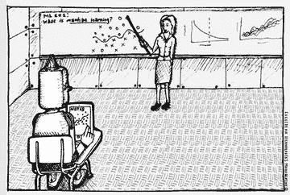

图 1-1。

机器学习或人工智能？感谢欧几里得技术管理公司（[www.euclidean.com](http://www.euclidean.com)）

图 1-1 展示的更多是人工智能而非机器学习。以这种方式理解机器学习将导致严重的混淆。尽管机器学习确实是人工智能的一个分支，但它传达的理念与这幅图像可能暗示的内容大相径庭。

通常，人工智能、机器学习和深度学习之间的关系如下：

+   “深度学习是一种机器学习，机器学习是一种人工智能。”

这是怎么样的？很简单，不是吗？这种分类可能不如自然法则那样绝对，但它被广泛接受。

让我们进一步挖掘。人工智能是一个非常常见的词，它可能意味着许多不同的事情。它可能指代任何包含一些智能方面的技术，而不是指明一个特定的技术领域。相比之下，机器学习指的是一个特定的领域。换句话说，我们使用机器学习来指代人工智能的一个特定技术群体。机器学习本身也包括许多技术。其中之一是深度学习，这是本书的主题。

深度学习是一种机器学习的事实非常重要，这就是为什么我们要通过这个冗长的回顾来了解人工智能、机器学习和深度学习之间的关系。深度学习最近一直处于聚光灯下，因为它成功地解决了人工智能面临的某些挑战。它在许多领域的表现无疑是卓越的。然而，它也面临着局限性。深度学习的局限性源于其从祖先机器学习继承的基本概念。作为一种机器学习，深度学习无法避免机器学习面临的基本问题。这就是为什么在讨论深度学习的概念之前，我们需要回顾机器学习。

## 什么是机器学习？

简而言之，机器学习是一种涉及数据的建模技术。这个定义可能对初学者来说太简短，无法捕捉其含义。所以，让我稍微详细地解释一下。机器学习是一种从“数据”中找出“模型”的技术。在这里，“数据”字面上指的是诸如文档、音频、图像等信息。而“模型”是机器学习的最终产品。

在我们进一步讨论模型之前，让我稍微偏离一下。机器学习的定义只涉及数据和模型的概念，而没有涉及到“学习”，这不是很奇怪吗？这个名字本身反映了这种技术是分析数据并自行找到模型，而不是由人类来完成。我们称之为“学习”，因为这个过程类似于用数据训练以解决找到模型的问题。因此，机器学习在建模过程中使用的数据被称为“训练数据”。图 1-2 阐述了机器学习过程中发生的情况。

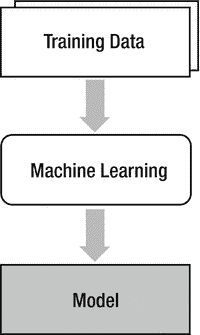

图 1-2。

机器学习过程中发生的情况

现在，让我们继续讨论模型。实际上，模型不过是我们要作为最终产品实现的东西。例如，如果我们正在开发一个自动过滤系统以删除垃圾邮件，那么垃圾邮件过滤器就是我们所说的模型。从这个意义上说，我们可以说模型是我们实际使用的。有些人把模型称为假设。这个术语对有统计背景的人来说似乎更直观。

机器学习并不是唯一的建模技术。在动力学领域，人们长期以来一直在使用一种特定的建模技术，该技术采用牛顿定律，将物体的运动描述为一系列称为运动方程的方程。在人工智能领域，我们有专家系统，这是一个基于专家知识和技能的问题解决模型。该模型的效果与专家本人一样好。

然而，在涉及智能的某些领域，法律和逻辑推理对于建模并不非常有效。典型的例子可以在涉及智能的领域找到，例如图像识别、语音识别和自然语言处理。让我给你举一个例子。看看图 1-3 并识别出数字。

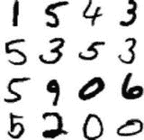

图 1-3。

当数字没有可识别的模式时，计算机是如何识别它们的？

我相信你很快就完成了任务。大多数人都是这样。现在，让我们让计算机做同样的事情。我们怎么做？如果我们使用传统的建模技术，我们需要找到一些规则或算法来区分手写的数字。嗯，为什么不应用你刚才用来识别大脑中数字的规则呢？这很容易，不是吗？实际上，这是一个非常具有挑战性的问题。曾经研究人员认为，对于计算机来说做这件事轻而易举，因为即使是人类也很容易做到，而且计算机的计算速度比人类快得多。然而，他们很快意识到自己的误判。

没有明确的指定或规则，你是如何识别这些数字的？这很难回答，不是吗？但是，为什么？这是因为我们从未学习过这样的指定。从很小的时候起，我们就只是学习了这是 0，这是 1。我们只是认为这就是它，并且随着我们面对各种各样的数字，我们变得更加擅长区分数字。我说的对吗？

那么，计算机呢？为什么我们不让计算机做同样的事情？就是这样！恭喜你！你刚刚掌握了机器学习的概念。机器学习是为了解决那些分析模型几乎不可用的问题而创建的。机器学习的主要思想是在方程式和法律不奏效的情况下，使用训练数据来实现模型。

## 机器学习的挑战

我们刚刚发现，机器学习是一种从数据中寻找（或学习）模型的技术。它适用于涉及智能的问题，如图像识别和语音识别，在这些领域中，物理定律或数学方程式无法产生模型。一方面，机器学习使用的方法使得这个过程得以工作。另一方面，它也带来了不可避免的问题。本节提供了机器学习面临的基本问题。

一旦机器学习过程从训练数据中找到模型，我们就将模型应用于实际领域数据。这个过程如图 1-4 所示。图中的垂直流程表示学习过程，而训练好的模型则描述为水平流程，这被称为推理。

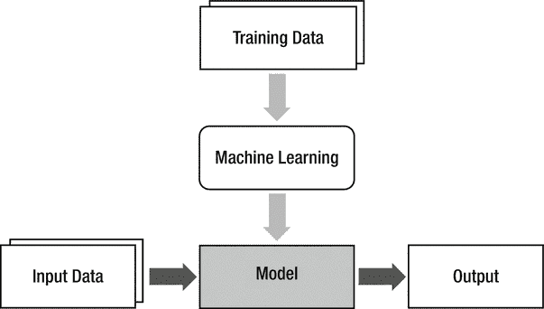

图 1-4。

基于现场数据应用模型

在机器学习和实际应用领域提供的数据是不同的。让我们在这个图像中添加另一个块，如图 1-5 所示，以更好地说明这种情况。

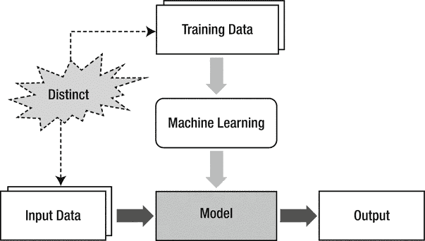

图 1-5。

训练数据和输入数据有时非常不同

训练数据和输入数据的区别是机器学习面临的结构性挑战。说每个机器学习问题都源于这一点并不夸张。例如，使用由单个人手写笔记组成的训练数据会怎样？模型能否成功识别其他人的手写笔迹？可能性非常低。

没有一种机器学习方法可以用错误的训练数据达到预期的目标。同样的理念也适用于深度学习。因此，对于机器学习方法来说，获取能够充分反映领域数据特征的、无偏见的训练数据至关重要。使模型性能在训练数据或输入数据变化时保持一致的过程称为泛化。机器学习的成功在很大程度上取决于泛化是否成功。

### 过度拟合

泛化过程腐败的一个主要原因是过度拟合。是的，另一个新术语。然而，没有必要感到沮丧。这根本不是什么新概念。通过案例研究比仅仅通过句子更容易理解。

考虑图 1-6 中显示的分类问题。我们需要将位置（或坐标）数据划分为两组。图上的点代表训练数据。目标是使用训练数据确定一条曲线，以定义两组数据的边界。

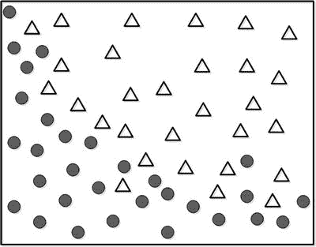

图 1-6。

确定一条曲线来划分两组数据

虽然我们看到一些偏离适当区域的异常值，但图 1-7 中显示的曲线似乎在两组之间充当了一个合理的边界。


图 1-7。

用于区分两种数据的曲线

当我们评估这条曲线时，有一些点根据边界没有被正确分类。那么，使用如图 1-8 所示的复杂曲线完美分组这些点怎么样？

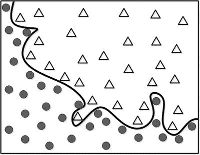

图 1-8。

更好的分组，但代价是什么？

这个模型为训练数据提供了完美的分组性能。它看起来怎么样？你是否更喜欢这个模型？它似乎正确反映了总体行为？

现在，让我们将这个模型应用于现实世界。模型的新输入用符号■表示，如图 1-9 所示。

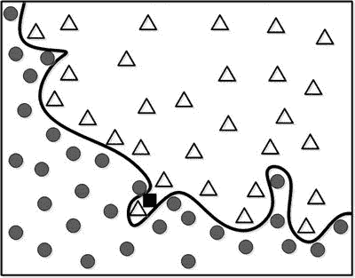

图 1-9。

新输入被放入数据中

这个无错误的骄傲模型将新数据识别为类别∆。然而，训练数据的一般趋势告诉我们这是可疑的。将其分组为类别•似乎更合理。那个为训练数据产生 100%准确率的模型怎么了？

让我们再次审视数据点。一些异常值穿透了其他组的区域并干扰了边界。换句话说，这些数据包含了很多噪声。问题是机器学习无法区分这些噪声。由于机器学习考虑了所有数据，包括噪声，最终产生了一个不恰当的模型（在这种情况下是一个曲线）。这将是小聪明，大愚蠢。正如你可能注意到的，训练数据并不完美，可能包含不同数量的噪声。如果你认为训练数据中的每个元素都是正确的，并且精确地符合模型，那么你将得到一个泛化能力较低的模型。这被称为过拟合。

当然，由于机器学习的本质，我们应该尽一切努力从训练数据中推导出一个优秀的模型。然而，训练数据的工作模型可能无法正确反映现场数据。这并不意味着我们应该故意使模型比训练数据更不准确。这将破坏机器学习的基本策略。

现在我们面临一个困境——减少训练数据的错误会导致过拟合，从而降低泛化能力。我们该怎么办？当然，我们要面对它！下一节将介绍防止过拟合的技术。

### 面对过拟合

过拟合显著影响了机器学习的性能水平。我们可以通过观察他们处理过拟合的方法来区分谁是专家，谁是业余爱好者。本节介绍了两种用于面对过拟合的典型方法：正则化和验证。

正则化是一种尝试构建尽可能简单模型结构的数值方法。简化的模型可以在牺牲性能的小代价下避免过拟合的影响。上一节中的分组问题可以用作一个好的例子。复杂的模型（或曲线）往往容易过拟合。相比之下，尽管它未能正确分类一些点，但简单的曲线能更好地反映组的整体特征。如果你理解它是如何工作的，那么现在就足够了。我们将在第三章的“代价函数和学习规则”部分进一步详细介绍正则化。

我们能够判断分组模型是否过拟合，因为训练数据简单，模型可以轻易可视化。然而，在大多数情况下并非如此，因为数据具有更高的维度。我们无法绘制模型并直观地评估过拟合对这类数据的影响。因此，我们需要另一种方法来确定训练的模型是否过拟合。这就是验证发挥作用的地方。

验证是一个保留部分训练数据并使用它来监控性能的过程。验证集不用于训练过程。因为训练数据的建模误差无法指示过度拟合，我们使用一些训练数据来检查模型是否过度拟合。当训练模型对保留的数据输入产生低水平的表现时，我们可以称模型为过度拟合。在这种情况下，我们将修改模型以防止过度拟合。图 1-10 阐述了验证过程中训练数据的划分。

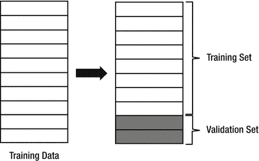

图 1-10.

验证过程中的训练数据划分

当涉及验证时，机器学习的训练过程按照以下步骤进行：

1.  将训练数据分为两组：一组用于训练，另一组用于验证。一般来说，训练集与验证集的比例为 8:2。

1.  使用训练集训练模型。

1.  使用验证集评估模型的性能。

    1.  如果模型产生令人满意的表现，完成训练。

    1.  如果性能没有产生足够的结果，修改模型并从步骤 2 重复过程。

交叉验证是验证过程的一种轻微变化。它仍然将训练数据分为用于训练和验证的组，但不断改变数据集。而不是保留最初划分的集合，交叉验证重复数据的划分。这样做的原因是，当数据集固定时，模型甚至可能过度拟合验证集。由于交叉验证保持了验证数据集的随机性，它可以更好地检测模型的过度拟合。图 1-11 描述了交叉验证的概念。深色阴影表示验证数据，在整个训练过程中随机选择。

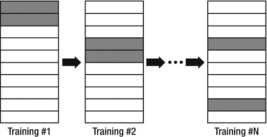

图 1-11.

交叉验证

## 机器学习的类型

已经开发了许多不同类型的机器学习技术来解决各个领域的问题。这些机器学习技术可以根据训练方法（见图 1-12）分为三种类型。

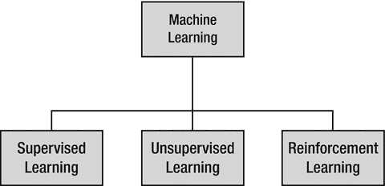

图 1-12.

三种机器学习技术类型

+   监督学习

+   无监督学习

+   强化学习

监督学习非常类似于人类学习的过程。考虑人类在解决练习问题时获得新知识。

1.  选择一个练习问题。应用当前知识解决问题。比较答案与解决方案。

1.  如果答案错误，修改当前知识。

1.  对所有练习问题重复步骤 1 和 2。

当我们将这个例子与机器学习过程进行类比时，练习问题和解决方案对应于训练数据，知识对应于模型。重要的是我们需要解决方案。这是监督学习的关键方面。它的名字甚至暗示了教师向学生提供解决方案以供记忆的辅导。

在监督学习中，每个训练数据集应包含输入和正确输出对。正确的输出是模型对于给定输入应该产生的结果。

```py
{ input, correct output }
```

在监督学习中，学习是模型的一系列修订，以减少正确输出和模型对于相同输入的输出之间的差异。如果一个模型被完全训练，它将产生与训练数据输入相对应的正确输出。

相比之下，无监督学习的训练数据只包含输入，没有正确输出。

```py
{ input }
```

乍一看，可能觉得很难理解没有正确输出如何进行训练。然而，已经开发了许多此类方法。无监督学习通常用于调查数据的特征和预处理数据。这个概念类似于一个学生只是通过构造和属性整理问题，而没有学习如何解决问题，因为没有已知的正确输出。

强化学习使用输入集、一些输出和评分作为训练数据。它通常用于需要最佳交互的情况，例如控制和游戏玩法。

```py
{ input, some output, grade for this output }
```

本书仅涵盖监督学习。与无监督学习和强化学习相比，它有更多的应用，更重要的是，它是进入机器学习和深度学习世界时首先学习的基本概念。

### 分类和回归

监督学习的两种最常见应用类型是分类和回归。这些词可能听起来不熟悉，但实际上并不那么具有挑战性。

让我们从分类开始。这可能是机器学习最普遍的应用。分类问题侧重于字面上找到数据所属的类别。一些例子可能会有所帮助。

垃圾邮件过滤服务 ➔ 根据常规或垃圾邮件对邮件进行分类

数字识别服务 ➔ 将数字图像分类为 0-9 之一

面部识别服务 ➔ 将面部图像分类为注册用户之一

在上一节中，我们提到监督学习需要输入和正确输出对作为训练数据。同样，分类问题的训练数据看起来是这样的：

```py
{ input, class }
```

在分类问题中，我们想知道输入属于哪个类别。因此，数据对中用类别代替了与输入对应的正确输出。

让我们用一个例子来继续。考虑我们一直在讨论的相同分组问题。我们希望机器学习回答的模型是用户的输入坐标（X, Y）属于两个类别（∆和•）中的哪一个（见图 1-13）。

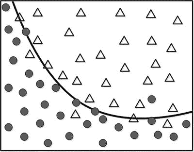

图 1-13。

从分类的角度看相同的数据

在这种情况下，N 组元素的训练数据将类似于图 1-14。

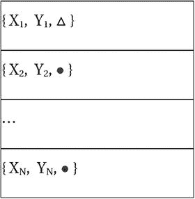

图 1-14。

对数据进行分类

相反，回归并不确定类别。相反，它估计一个值。例如，如果你有年龄和收入（用•表示）的数据集，并希望找到通过年龄估计收入的模型，那么它就变成了一个回归问题（见图 1-15）。¹

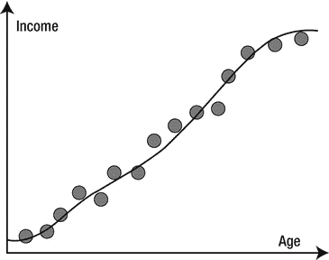

图 1-15。

年龄和收入数据集

本例的数据集将类似于图 1-16 中的表格，其中 X 和 Y 分别代表年龄和收入。

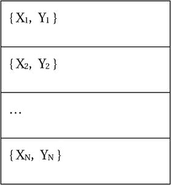

图 1-16。

对年龄和收入数据进行分类

分类和回归都是监督学习的一部分。因此，它们的训练数据都是以 `{输入，正确输出}` 的形式。唯一的区别是正确输出的类型——分类使用类别，而回归需要值。

总结来说，当分析需要模型来判断输入数据属于哪个组时，它就变成了分类；而当模型估计数据的趋势时，它就变成了回归。

仅作参考，无监督学习的一个代表性应用是聚类。它研究单个数据的特点，并对相关数据进行分类。聚类和分类很容易混淆，因为它们的结果相似。尽管它们产生相似的结果，但它们是完全不同的方法。我们必须记住，聚类和分类是不同的术语。当你遇到“聚类”这个术语时，只需提醒自己它侧重于无监督学习。

## 总结

让我们简要回顾一下本章我们讨论的内容：

+   人工智能、机器学习和深度学习是不同的。但它们以以下方式相互关联：“深度学习是一种机器学习，而机器学习是一种人工智能”。

+   机器学习是一种归纳方法，它从训练数据中推导出一个模型。它在图像识别、语音识别和自然语言处理等方面非常有用。

+   机器学习的成功很大程度上取决于泛化过程的实施效果。为了防止由于训练数据和实际输入数据之间的差异导致的性能下降，我们需要足够数量的无偏训练数据。

+   当模型过度定制于训练数据，以至于对实际输入数据的性能较差，而其训练数据的性能却很优秀时，就会发生过拟合。过拟合是降低泛化性能的主要因素之一。

+   正则化和验证是解决过拟合问题的典型方法。正则化是一种数值方法，旨在得到尽可能简单的模型。相比之下，验证试图在训练过程中检测过拟合的迹象，并采取措施防止其发生。交叉验证是验证的一种变体。

+   根据训练方法，机器学习可以分为监督学习、无监督学习和强化学习。这些学习方法的训练数据格式在此展示。

    | 训练方法 | 训练数据 |
    | --- | --- |
    | 监督学习 | `{ 输入, 正确输出 }` |
    | 无监督学习 | `{ 输入 }` |
    | 强化学习 | `{ 输入, 一些输出, 对这个输出的评分 }` |

+   根据模型的用途，监督学习可以分为分类和回归。分类确定输入数据属于哪个组别。分类的正确输出以类别形式给出。相比之下，回归预测值，并在训练数据中取正确的输出值。

脚注 1

“regress”这个词的原始含义是回到平均值。英国遗传学家弗朗西斯·高尔顿研究了父母身高与子女身高的相关性，并发现个体身高会收敛到总人口的平均值。他将自己的方法命名为“回归分析”。
