# 2. 神经网络

本章介绍了神经网络，它是作为机器学习模型的广泛应用。神经网络有着悠久的发展历史和大量的研究成果。有许多书籍专门关注神经网络。随着最近对深度学习的兴趣增长，神经网络的重要性也显著增加。我们将简要回顾相关和实用的技术，以便更好地理解深度学习。对于神经网络概念的新手，我们从基础知识开始。

首先，我们将了解神经网络与机器学习之间的关系。机器学习的模型可以以各种形式实现，神经网络就是其中之一。简单吗？图 2-1 展示了机器学习与神经网络之间的关系。请注意，我们将模型替换为神经网络，将机器学习规则替换为学习规则。在神经网络的情况下，确定模型（神经网络）的过程称为学习规则。本章解释了单层神经网络的学习规则。多层神经网络的学习规则将在第三章中讨论。

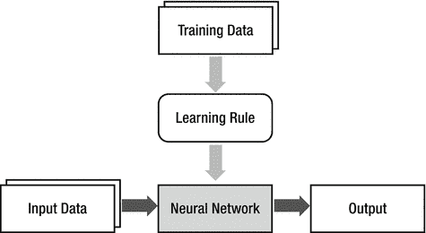

图 2-1。

机器学习与神经网络之间的关系

## 神经网络的节点

每当我们学习某样东西时，大脑会存储这些知识。计算机使用内存来存储信息。尽管它们都存储信息，但它们的机制非常不同。计算机在内存的指定位置存储信息，而大脑则改变神经元之间的关联。神经元本身没有存储能力；它只是将信号从一个神经元传输到另一个神经元。大脑是由这些神经元组成的巨大网络，神经元之间的关联形成了特定的信息。

神经网络模仿大脑的机制。由于大脑由众多神经元的连接组成，神经网络通过节点的连接构建，这些节点对应于大脑中的神经元。神经网络通过权重值模拟神经元之间的关联，这是大脑最重要的机制。以下表格总结了大脑与神经网络之间的类比。

| 大脑 | 神经网络 |
| --- | --- |
| 神经元 | 节点 |
| 神经元的连接 | 连接权重 |

如果用文字进一步解释可能会造成更多混淆。看看一个简单的例子，以更好地理解神经网络的机制。考虑一个接收三个输入的节点，如图 2-2 所示。

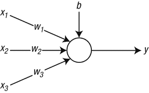

图 2-2。

接收三个输入的节点

图中的圆圈和箭头分别表示节点和信号流。x [1]、x [2] 和 x [3] 是输入信号。w [1]、w [2] 和 w [3] 是对应信号的权重。最后，b 是偏置，它是与信息存储相关联的另一个因素。换句话说，神经网络的信 息以权重和偏置的形式存储。

外部输入信号在到达节点之前乘以权重。一旦加权信号在节点上收集，这些值相加形成加权总和。本例中的加权总和计算如下：

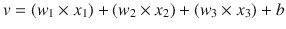

该方程表明，权重更大的信号具有更大的影响。例如，如果权重 w [1] 为 1，w [2] 为 5，那么信号 x [2] 的影响是 x [1] 的五倍。当 w [1] 为零时，x [1] 完全不会传递到节点。这意味着 x [1] 与节点断开连接。这个例子表明，神经网络的权重模仿了大脑如何改变神经元之间的关联。

加权总和的方程可以用矩阵表示：

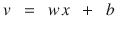

其中，w 和 x 的定义如下：

![$$ w\kern0.5em =\kern0.5em \left[\begin{array}{ccc}\hfill {w}_1\hfill & \hfill {w}_2\hfill & \hfill {w}_3\hfill \end{array}\right]\kern2em x\kern0.5em =\kern0.5em \left[\begin{array}{c}\hfill {x}_1\hfill \\ {}\hfill {x}_2\hfill \\ {}\hfill {x}_3\hfill \end{array}\right] $$](A448947_1_En_2_Chapter_Equb.gif)

最后，节点将加权总和输入到激活函数中，并产生其输出。激活函数决定了节点的行为。

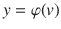

该方程中的 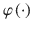 是激活函数。神经网络中有很多种激活函数。我们将在后面详细阐述。

让我们简要回顾一下神经网络的工作机制。以下过程在神经网络节点内部进行：

1.  计算输入信号的加权总和。

    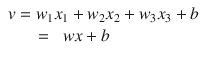

1.  激活函数到加权总和的输出传递到外部。

    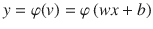

## 神经网络层

由于大脑是一个由神经元组成的巨大网络，神经网络是一个由节点组成的网络。根据节点的连接方式，可以创建各种神经网络。最常用的神经网络类型之一是采用如图 2-3 所示的节点分层结构。

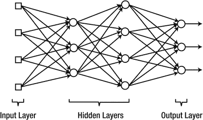

图 2-3。

节点的分层结构

图 2-3 中的方形节点组被称为输入层。输入层的节点仅仅充当将输入信号传输到下一个节点的通道。因此，它们不计算加权总和和激活函数。这就是为什么它们用方形表示，并与其他圆形节点区分开来。相比之下，最右侧的节点组被称为输出层。这些节点的输出成为神经网络的最终结果。输入层和输出层之间的层被称为隐藏层。它们之所以被称为隐藏层，是因为它们无法从神经网络的外部访问。

神经网络已经从简单的架构发展到越来越复杂的结构。最初，神经网络先驱们有一个非常简单的架构，只有输入层和输出层，这些被称为单层神经网络。当向单层神经网络添加隐藏层时，这会产生多层神经网络。因此，多层神经网络由输入层、隐藏层（s）和输出层组成。只有一个隐藏层的神经网络被称为浅层神经网络或香草神经网络。包含两个或更多隐藏层的多层神经网络被称为深层神经网络。在实用应用中使用的绝大多数当代神经网络都是深层神经网络。以下表格总结了根据层架构划分的神经网络分支。

| 单层神经网络 | 输入层 – 输出层 |
| --- | --- |
| 多层神经网络 | 浅层神经网络 | 输入层 – 隐藏层 – 输出层 |
| 深层神经网络 | 输入层 – 隐藏层 – 输出层 |

我们将多层神经网络按这两种类型分类的原因与其发展的历史背景有关。神经网络最初是单层神经网络，然后发展到浅层神经网络，接着是深层神经网络。直到 2005 年中期，浅层神经网络发展了 20 年后，深层神经网络才被真正重视。因此，长期以来，多层神经网络仅仅意味着单隐藏层神经网络。当需要区分多个隐藏层时，它们为深层神经网络赋予了单独的名称。见图 2-4。

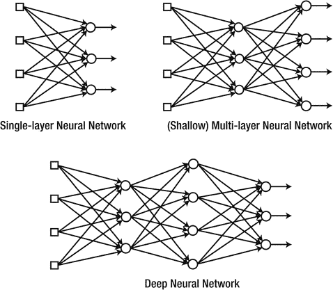

图 2-4。

神经网络的分支取决于层架构

在分层神经网络中，信号进入输入层，通过隐藏层，并通过输出层离开。在这个过程中，信号逐层前进。换句话说，同一层的节点同时接收信号，并将处理后的信号同时发送到下一层。

让我们通过一个简单的例子来了解输入数据在通过层时是如何被处理的。考虑图 2-5 中显示的具有单个隐藏层的神经网络。

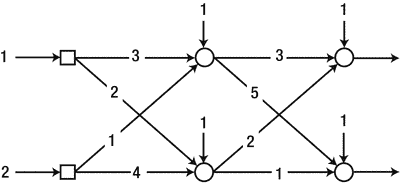

图 2-5。

具有一个隐藏层的神经网络

为了方便起见，假设每个节点的激活函数是图 2-6 中显示的线性函数。这个函数允许节点发送出加权求和本身。

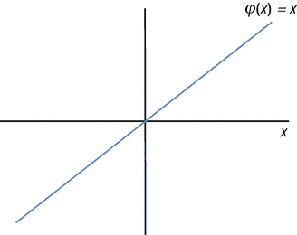

图 2-6。

每个节点的激活函数是线性函数

现在我们将计算隐藏层的输出（图 2-7）。正如之前提到的，对于输入节点不需要进行计算，因为它们只是传递信号。

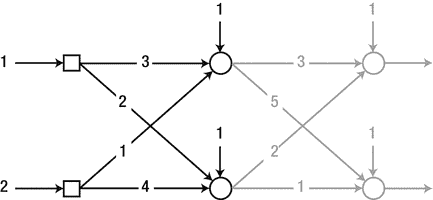

图 2-7。

计算隐藏层的输出

隐藏层的第一个节点计算输出如下：

+   加权求和：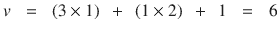

+   输出：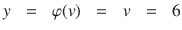

以类似的方式，隐藏层的第二个节点计算输出如下：

+   加权求和：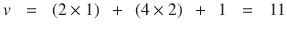

+   输出：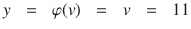

加权求和的计算可以组合成以下矩阵方程：

![$$ v=\left[\begin{array}{l}3\times 1+1\times 2+1\\ {}2\times 1+4\times 2+1\end{array}\right]=\left[\begin{array}{cc}\hfill 3\hfill & \hfill 1\hfill \\ {}\hfill 2\hfill & \hfill 4\hfill \end{array}\right]\left[\begin{array}{l}1\\ {}2\end{array}\right]+\left[\begin{array}{l}1\\ {}1\end{array}\right]=\left[\begin{array}{l}6\\ {}11\end{array}\right] $$](A448947_1_En_2_Chapter_Equf.gif)

（方程 2.1）

隐藏层第一个节点的权重位于第一行，第二个节点的权重位于第二行。这个结果可以概括为以下方程：

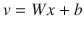

其中 x 是输入信号向量，b 是节点的偏置向量。矩阵 W 包含了隐藏层节点在对应行的权重。对于示例神经网络，W 给定为：

![$$ W\kern0.62em =\kern0.62em \left[\;\begin{array}{c}\hfill --\kern0.5em \mathrm{weights}\ \mathrm{of}\ \mathrm{the}\ \mathrm{first}\ \mathrm{node}\kern0.5em --\hfill \\ {}\hfill --\kern0.5em \mathrm{weights}\ \mathrm{of}\ \mathrm{the}\ \mathrm{second}\ \mathrm{node}\kern0.5em --\hfill \end{array}\;\right]\kern0.62em =\kern0.62em \left[\;\begin{array}{cc}\hfill 3\hfill & \hfill 1\hfill \\ {}\hfill 2\hfill & \hfill 4\hfill \end{array}\;\right] $$](A448947_1_En_2_Chapter_Equg.gif)

由于我们已经有了隐藏层节点的所有输出，我们可以确定下一层的输出，即输出层。所有计算都与之前相同，只是输入信号来自隐藏层。

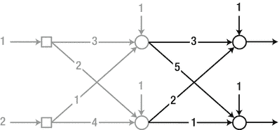

图 2-8。

确定输出层的输出

让我们使用方程 2.1 的矩阵形式来计算输出。

+   加权求和：![$$ v\kern0.62em =\kern0.62em \left[\;\begin{array}{cc}\hfill 3\hfill & \hfill 2\hfill \\ {}\hfill 5\hfill & \hfill 1\hfill \end{array}\;\right]\left[\;\begin{array}{c}\hfill 6\hfill \\ {}\hfill 11\hfill \end{array}\;\right]\kern0.5em +\kern0.5em \left[\;\begin{array}{c}\hfill 1\hfill \\ {}\hfill 1\hfill \end{array}\;\right]\kern0.62em =\kern0.62em \left[\;\begin{array}{c}\hfill 41\hfill \\ {}\hfill 42\hfill \end{array}\;\right] $$](A448947_1_En_2_Chapter_IEq7.gif)

+   输出：![$$ y\kern0.62em =\kern0.62em \varphi (v)\kern0.62em =\kern0.62em v\kern0.62em =\kern0.62em \left[\;\begin{array}{c}\hfill 41\hfill \\ {}\hfill 42\hfill \end{array}\;\right] $$](A448947_1_En_2_Chapter_IEq8.gif)

怎么样？这个过程可能有些繁琐，但计算本身并没有什么困难。正如我们刚才看到的，神经网络不过是一个层叠节点的网络，只进行简单的计算。它不涉及任何复杂的方程或架构。尽管它看起来很简单，但神经网络已经在图像识别和语音识别等主要机器学习领域打破了所有性能记录。这不是很有趣吗？这似乎印证了那句名言，“所有真理都是简单的”。

在结束本节之前，我必须留下最后的评论。我们使用线性方程来激活隐藏节点，只是为了方便。这在实践中是不正确的。对于节点使用线性函数会抵消添加层的效果。在这种情况下，该模型在数学上等同于单层神经网络，它没有隐藏层。让我们看看实际情况。将隐藏层的加权求和方程代入输出层的加权求和方程，得到以下方程：

![$$ \begin{array}{c} v\kern0.62em =\kern0.62em \left[\;\begin{array}{cc}\hfill 3\hfill & \hfill 2\hfill \\ {}\hfill 5\hfill & \hfill 1\hfill \end{array}\;\right]\left[\;\begin{array}{c}\hfill 6\hfill \\ {}\hfill 11\hfill \end{array}\;\right]\kern0.5em +\kern0.5em \left[\;\begin{array}{c}\hfill 1\hfill \\ {}\hfill 1\hfill \end{array}\;\right]\\ {}=\kern0.62em \left[\;\begin{array}{cc}\hfill 3\hfill & \hfill 2\hfill \\ {}\hfill 5\hfill & \hfill 1\hfill \end{array}\;\right]\left(\;\left[\;\begin{array}{cc}\hfill 3\hfill & \hfill 1\hfill \\ {}\hfill 2\hfill & \hfill 4\hfill \end{array}\;\right]\left[\;\begin{array}{c}\hfill 1\hfill \\ {}\hfill 2\hfill \end{array}\;\right]\kern0.5em +\kern0.5em \left[\;\begin{array}{c}\hfill 1\hfill \\ {}\hfill 1\hfill \end{array}\;\right]\;\right)\kern0.5em +\kern0.5em \left[\;\begin{array}{c}\hfill 1\hfill \\ {}\hfill 1\hfill \end{array}\;\right]\\ {}=\kern0.62em \left[\;\begin{array}{cc}\hfill 3\hfill & \hfill 2\hfill \\ {}\hfill 5\hfill & \hfill 1\hfill \end{array}\;\right]\left[\;\begin{array}{cc}\hfill 3\hfill & \hfill 1\hfill \\ {}\hfill 2\hfill & \hfill 4\hfill \end{array}\;\right]\left[\;\begin{array}{c}\hfill 1\hfill \\ {}\hfill 2\hfill \end{array}\;\right]\kern0.5em +\kern0.5em \left[\;\begin{array}{cc}\hfill 3\hfill & \hfill 2\hfill \\ {}\hfill 5\hfill & \hfill 1\hfill \end{array}\;\right]\left[\;\begin{array}{c}\hfill 1\hfill \\ {}\hfill 1\hfill \end{array}\;\right]\kern0.5em +\kern0.5em \left[\;\begin{array}{c}\hfill 1\hfill \\ {}\hfill 1\hfill \end{array}\;\right]\\ {}=\kern0.62em \left[\;\begin{array}{cc}\hfill 13\hfill & \hfill 11\hfill \\ {}\hfill 17\hfill & \hfill 9\hfill \end{array}\;\right]\left[\;\begin{array}{c}\hfill 1\hfill \\ {}\hfill 2\hfill \end{array}\;\right]\kern0.5em +\kern0.5em \left[\;\begin{array}{c}\hfill 6\hfill \\ {}\hfill 7\hfill \end{array}\;\right]\end{array} $$](A448947_1_En_2_Chapter_Equh.gif)

这个矩阵方程表明，这个示例神经网络相当于图 2-9 所示的单层神经网络。

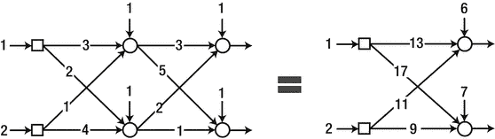

图 2-9。

这个示例神经网络相当于一个单层神经网络

请记住，当隐藏节点具有线性激活函数时，隐藏层变得无效。然而，输出节点可能，有时必须，采用线性激活函数。

## 神经网络的监督学习

本节介绍了神经网络监督学习的概念和过程。在第一章的“机器学习类型”部分有所阐述。在众多训练方法中，本书仅涵盖监督学习。因此，对于神经网络，也仅讨论监督学习。从整体来看，神经网络的监督学习按以下步骤进行：

1.  使用适当的值初始化权重。

1.  从训练数据中“输入”格式为 `{ 输入, 正确输出 }` 的数据，并将其输入到神经网络中。从神经网络中获取输出并计算与正确输出的误差。

1.  调整权重以减少误差。

1.  对所有训练数据重复步骤 2-3

这些步骤基本上与“机器学习类型”部分的监督学习过程相同。这很有道理，因为监督学习的训练是一个修改模型以减少正确输出和模型输出之间差异的过程。唯一的区别是模型的修改变成了神经网络权重的变化。图 2-10 阐述了到目前为止所解释的监督学习概念。这将帮助你清楚地理解之前描述的步骤。

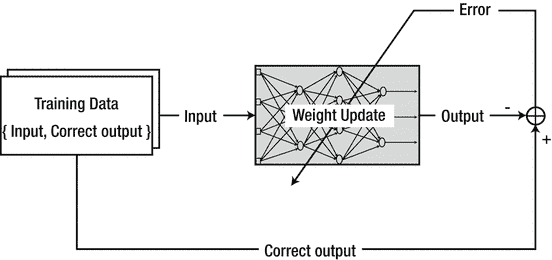

图 2-10。

监督学习概念

## 单层神经网络的训练：Delta 规则

如前所述，神经网络以权重的形式存储信息。¹ 因此，为了用新信息训练神经网络，权重应相应地改变。根据给定信息修改权重的系统方法称为学习规则。由于训练是神经网络系统存储信息的唯一方法，因此学习规则是神经网络研究中的一个重要组成部分。

在本节中，我们处理 delta 规则，² 单层神经网络的代表性学习规则。尽管它不能进行多层神经网络的训练，但它对于研究神经网络学习规则的重要概念非常有用。

考虑一个单层神经网络，如图 2-11 所示。在图中，d [i] 是输出节点 i 的正确输出。

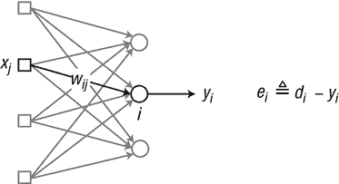

图 2-11。

单层神经网络

简而言之，delta 规则调整权重如下算法：

+   “如果一个输入节点对输出节点的误差有贡献，则两个节点之间的权重将按比例调整，与输入值 x [j] 和输出误差 e [i] 成正比。”

该规则可以用方程表示：

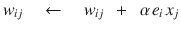

(方程 2.2)其中

+   x [j] = 输入节点 j 的输出，(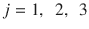)

+   e [i] = 输出节点 i 的误差

+   w [ij] = 输出节点 i 和输入节点 j 之间的权重

+   α = 学习率 (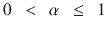)

学习率α决定了每次权重变化的大小。如果这个值太高，输出会在解周围徘徊并无法收敛。相反，如果这个值太低，计算达到解的速度会太慢。

为了具体说明，考虑由三个输入节点和一个输出节点组成的单层神经网络，如图 2-12 所示。为了方便，我们假设输出节点此时没有偏差。我们使用线性激活函数；即，加权求和直接传递到输出。

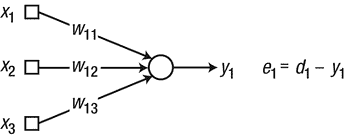

图 2-12.

具有三个输入节点和一个输出节点的单层神经网络

注意，下标中的第一个数字（1）表示输入进入的节点编号。例如，输入节点 2 和输出节点 1 之间的权重表示为 w[12]。这种表示法使得矩阵运算更容易；与节点 i 相关的权重分配在权重矩阵的第 i 行。

将方程 2.2 的 delta 规则应用于示例神经网络，得到权重的更新如下：

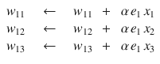

让我们使用单层神经网络的 delta 规则来总结训练过程。

1.  在合适的值上初始化权重。

1.  从训练数据 `{ 输入, 正确输出 }` 中获取“输入”，并将其输入到神经网络中。计算输出 y[i]从正确输出 d[i]到输入的错误。

    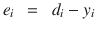

1.  根据以下 delta 规则计算权重更新：

    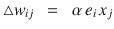

1.  按以下方式调整权重：

    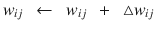

1.  对所有训练数据进行步骤 2-4 的操作。

1.  重复步骤 2-5，直到误差达到可接受的容差水平。

这些步骤几乎与“神经网络监督学习”部分中监督学习的过程相同。唯一的区别是增加了步骤 6。步骤 6 只是说明整个训练过程被重复。一旦步骤 5 完成，模型已经用每个数据点进行了训练。那么，为什么我们还要使用所有相同的训练数据进行训练呢？这是因为 delta 规则在重复过程中寻找解决方案，而不是一次性解决所有问题。³ 整个过程会重复，因为用相同的数据重新训练模型可能会改进模型。

仅作参考，每次所有训练数据都通过步骤 2-5 一次的训练迭代次数称为一个 epoch。例如，epoch = 10 意味着神经网络使用相同的训练集重复进行了 10 次训练过程。

你能跟上这一部分的内容吗？那么你已经学到了神经网络训练的大部分关键概念。尽管方程可能因学习规则的不同而有所变化，但基本概念相对相同。图 2-13 展示了本节中描述的训练过程。

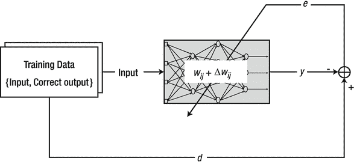

图 2-13。

训练过程

## 广义 Delta 规则

本节涉及了 delta 规则的一些理论方面。然而，你不必感到沮丧。我们将探讨最基本的内容，而不会过多地详细说明具体细节。

上一节的 delta 规则相当过时。后来的研究表明，存在 delta 规则的更广义形式。对于任意激活函数，delta 规则表示为以下方程。

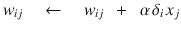

（方程 2.3）

它与上一节的 delta 规则相同，只是将 e[i]替换为δ[i]。在这个方程中，δ[i]定义为：

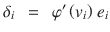

（方程 2.4）其中

+   e[i] = 输出节点 i 的错误

+   v[i] = 输出节点 i 的加权总和

+   φ′ = 输出节点 i 的激活函数φ的导数

回想一下，我们在示例中使用了线性激活函数 \( \varphi(x) = x \)。这个函数的导数是 \( \varphi'(x) = 1 \)。将这个值代入方程 2.4，得到 δ[i] 如下：

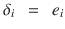

将此方程代入方程 2.3 得到的公式与方程 2.2 中的 delta 规则相同。这一事实表明，方程 2.2 中的 delta 规则仅适用于线性激活函数。

现在，我们可以使用 Sigmoid 函数推导出 delta 规则，该函数被广泛用作激活函数。Sigmoid 函数的定义如图 2-14 所示。⁴

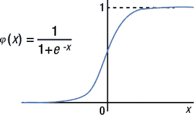

图 2-14.

定义 Sigmoid 函数

我们需要这个函数的导数，它给出如下：

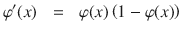

将此导数代入方程 2.4 得到 δ [i] 如下：

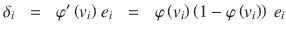

再次，将此方程代入方程 2.3 得到 Sigmoid 函数的 delta 规则如下：

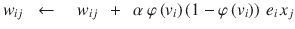

（方程 2.5）

尽管权重更新公式相当复杂，但它保持了相同的基本概念，即权重与输出节点误差 e [i] 和输入节点值 x [j] 成比例。

## SGD、批处理和迷你批处理

本节介绍了用于计算权重更新 ∆w [ij] 的方案。神经网络监督学习中有三种典型的方案可用。

## 随机梯度下降

随机梯度下降（SGD）计算每个训练数据的误差并立即调整权重。如果我们有 100 个训练数据点，SGD 会调整权重 100 次。图 2-15 展示了 SGD 的权重更新与整个训练数据的关系。

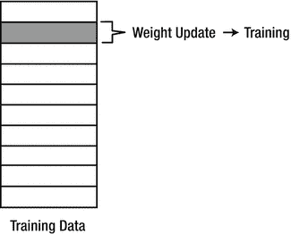

图 2-15.

SGD 的权重更新与整个训练数据的关系

由于 SGD 为每个数据点调整权重，神经网络在训练过程中的性能是曲折的。名称“随机”暗示了训练过程的随机行为。SGD 计算权重更新如下：

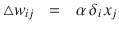

这个方程表明，前几节中所有 delta 规则都是基于 SGD 方法。

### 批处理

在批量方法中，每个权重更新都是针对训练数据中的所有错误计算的，并使用权重更新的平均值来调整权重。这种方法使用所有训练数据，并且只更新一次。图 2-16 解释了批量方法的权重更新计算和训练过程。

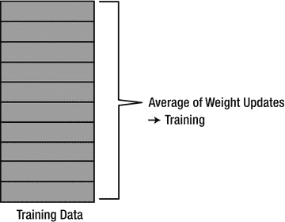

图 2-16。

批量方法的权重更新计算和训练过程

批量方法计算权重更新如下：

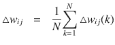

（公式 2.6）其中∆wij 是第 k 个训练数据的权重更新，N 是训练数据的总数。

由于平均权重更新的计算，批量方法在训练过程中消耗了大量的时间。

### 小批量

小批量方法是随机梯度下降法（SGD）和批量方法的结合。它选择训练数据集的一部分，并使用它们在批量方法中进行训练。因此，它计算所选数据的权重更新，并使用平均权重更新来训练神经网络。例如，如果从 100 个训练数据点中选择了 20 个任意数据点，则批量方法应用于这 20 个数据点。在这种情况下，总共进行了五次权重调整来完成所有数据点的训练过程（5 = 100/20）。图 2-17 显示了小批量方案如何选择训练数据和计算权重更新。

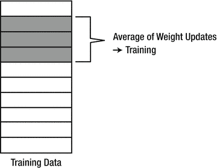

图 2-17。

小批量方案如何选择训练数据和计算权重更新

小批量方法，当它选择适当数量的数据点时，可以同时获得两种方法的优点：从随机梯度下降法（SGD）中获得速度，从批量方法中获得稳定性。因此，它经常被用于深度学习，深度学习处理大量的数据。

现在，让我们从 epoch 的角度深入探讨一下 SGD、批量和小批量。epoch 在“单层神经网络训练：Delta 规则”部分中简要介绍。作为回顾，epoch 是完成所有训练数据的训练周期数。在批量方法中，神经网络的训练周期数等于一个 epoch，如图 2-18 所示。这完全合理，因为批量方法使用所有数据来进行一次训练过程。

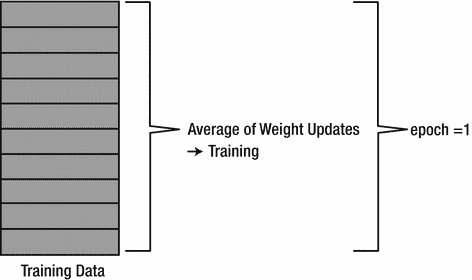

图 2-18。

神经网络的训练周期数等于一个 epoch

相比之下，在迷你批量中，每个 epoch 的训练过程数量取决于每个批量中的数据点数量。当我们有总共 N 个训练数据点时，每个 epoch 的训练过程数量大于一个，这对应于批量方法，小于 N，对应于 SGD。

## 示例：delta 规则

你现在可以开始将 delta 规则作为代码实现。考虑一个由三个输入节点和一个输出节点组成的神经网络，如图 2-19 所示。输出节点的激活函数使用 Sigmoid 函数。

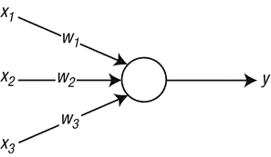

图 2-19。

由三个输入节点和一个输出节点组成的神经网络

我们有四个训练数据点，如下表所示。由于它们用于监督学习，每个数据点都由一个输入-正确输出对组成。每个数据集的最后一个是正确的输出。

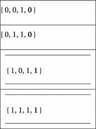

让我们用这些数据训练神经网络。Sigmoid 函数的 delta 规则，由方程式 2.5 给出，是学习规则。方程式 2.5 可以重新排列为以下逐步过程：


(方程式 2.7)

我们将使用随机梯度下降法（SGD）和批量方法来实现示例神经网络的 delta 规则。由于它是一个单层网络，并且包含简单的训练数据，因此代码并不复杂。一旦你跟随代码，你将清楚地看到 SGD 代码和批量代码之间的差异。正如之前所述，SGD 立即训练每个数据点，并且不需要权重更新的加和。因此，SGD 的代码比批量的代码更简单。

## SGD 方法的实现

函数`DeltaSGD`是方程式 2.7 给出的 delta 规则的 SGD 方法。它接受神经网络的权重和训练数据，并返回新训练的权重。

```py
W = DeltaSGD(W, X, D)
```

其中`W`是携带权重的参数。`X`和`D`分别携带训练数据的输入和正确输出。为了方便起见，训练数据被分为两个变量。以下列表显示了实现`DeltaSGD`函数的`DeltaSGD.m`文件。

```py
function W = DeltaSGD(W, X, D)
alpha = 0.9;
N = 4;
for k = 1:N
x = X(k, :)';
d = D(k);
v = W*x;
y = Sigmoid(v);
e     = d - y;
delta = y*(1-y)*e;
dW = alpha*delta*x;     % delta rule
W(1) = W(1) + dW(1);
W(2) = W(2) + dW(2);
W(3) = W(3) + dW(3);
end
end
```

代码执行过程如下：取一个数据点并计算输出`y`。计算此输出与正确输出之间的差异`d`。根据 delta 规则计算权重更新`dW`。使用此权重更新调整神经网络的权重。重复此过程`N`次，其中`N`是训练数据点的数量。这样，`DeltaSGD`函数为每个 epoch 训练神经网络。

`DeltaSGD`调用的函数`Sigmoid`列于下文。这概述了 sigmoid 函数的纯定义，并在`Sigmoid.m`文件中实现。由于这是一个非常简单的代码，我们省略了对其的进一步讨论。

```py
function y = Sigmoid(x)
y = 1 / (1 + exp(-x));
end
```

以下列表展示了`TestDeltaSGD.m`文件，该文件用于测试`DeltaSGD`函数。此程序调用`DeltaSGD`函数，训练 10,000 次，并显示使用所有训练数据输入的训练神经网络的输出。我们可以通过将输出与正确输出进行比较，来了解神经网络训练的效果。

```py
clear all
X = [ 0 0 1;
0 1 1;
1 0 1;
1 1 1;
];
D = [ 0
0
1
1
];
W = 2*rand(1, 3) - 1;
for epoch = 1:10000           % train
W = DeltaSGD(W, X, D);
end
N = 4;                        % inference
for k = 1:N
x = X(k, :)';
v = W*x;
y = Sigmoid(v)
end
```

此代码使用介于-1 和 1 之间的随机实数初始化权重。执行此代码会产生以下值。这些输出值与`D`中的正确输出非常接近。因此，我们可以得出结论，神经网络已经得到了适当的训练。


本书中的每个示例代码都由算法实现和测试程序分别存储在单独的文件中。这是因为将它们放在一起通常会使得代码更加复杂，并妨碍对算法的有效分析。测试程序的文件名以`Test`开头，后跟算法文件的名称。算法文件以函数名称命名，符合 MATLAB 的命名规范。例如，`DeltaSGD`函数的实现文件命名为`DeltaSGD.m`。

| 算法实现 | `example/ DeltaSGD.m` |
| --- | --- |
| 测试程序 | `example/ TestDeltaSGD.m` |

## 批量方法的实现

函数`DeltaBatch`使用批量方法实现了方程 2.7 的 delta 规则。它接受神经网络的权重和训练数据，并返回训练后的权重。

```py
W = DeltaBatch(W, X, D)
```

在此函数定义中，变量与函数`DeltaSGD`中的变量具有相同的意义；`W`是神经网络的权重，`X`和`D`分别是训练数据的输入和正确输出。以下列表展示了实现函数`DeltaBatch`的`DeltaBatch.m`文件。

```py
function W = DeltaBatch(W, X, D)
alpha = 0.9;
dWsum = zeros(3, 1);
N = 4;
for k = 1:N
x = X(k, :)';
d = D(k);
v = W*x;
y = Sigmoid(v);
e     = d - y;
delta = y*(1-y)*e;
dW = alpha*delta*x;
dWsum = dWsum + dW;
end
dWavg = dWsum / N;
W(1) = W(1) + dWavg(1);
W(2) = W(2) + dWavg(2);
W(3) = W(3) + dWavg(3);
end
```

此代码不会立即使用单个训练数据点的权重更新`dW`来训练神经网络。它将整个训练数据的单个权重更新加到`dWsum`上，并使用平均值`dWavg`调整权重一次。这是与 SGD 方法区分的基本差异。批处理方法的平均特性使得训练对训练数据不那么敏感。

回想一下，方程 2.6 给出了权重更新。当你使用前面的代码查看它时，理解这个方程会容易得多。为了方便起见，这里再次显示方程 2.6。


其中∆wij 是第 k 个训练数据点的权重更新。

以下程序列表显示了测试`DeltaBatch`函数的`TestDeltaBatch.m`文件。此程序调用`DeltaBatch`函数并训练神经网络 40,000 次。所有训练数据都输入到训练好的神经网络中，并显示输出。检查输出和从训练数据得到的正确输出，以验证训练的充分性。

```py
clear all
X = [ 0 0 1;
0 1 1;
1 0 1;
1 1 1;
];
D = [ 0
0
1
1
];
W = 2*rand(1, 3) - 1;
for epoch = 1:40000
W = DeltaBatch(W, X, D);
end
N = 4;
for k = 1:N
x = X(k, :)';
v = W*x;
y = Sigmoid(v)
end
```

接下来，执行此代码，你将在屏幕上看到以下值。输出与正确输出`D`非常相似。这证实了神经网络已经被正确训练。

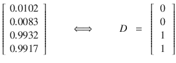

由于这个测试程序几乎与`TestDeltaSGD.m`文件相同，我们将跳过详细说明。关于这种方法的一个有趣点是它训练了神经网络 40,000 次。回想一下，SGD 方法只进行了 10,000 次训练。这表明批处理方法需要更多的时间来训练神经网络，以达到与 SGD 方法相似的水平精度。换句话说，批处理方法学习速度较慢。

## SGD 和批处理比较

在本节中，我们实际研究了 SGD 和批处理的收敛速度。这些方法在整个训练数据训练结束时的误差被比较。以下程序列表显示了比较两种方法平均误差的`SGDvsBatch.m`文件。为了进行公平的比较，两种方法的权重都初始化为相同的值。

```py
clear all
X = [ 0 0 1;
0 1 1;
1 0 1;
1 1 1;
];
D = [ 0
0
1
1
];
E1 = zeros(1000, 1);
E2 = zeros(1000, 1);
W1 = 2*rand(1, 3) - 1;
W2 = W1;
for epoch = 1:1000           % train
W1 = DeltaSGD(W1, X, D);
W2 = DeltaBatch(W2, X, D);
es1 = 0;
es2 = 0;
N   = 4;
for k = 1:N
x = X(k, :)';
d = D(k);
v1  = W1*x;
y1  = Sigmoid(v1);
es1 = es1 + (d - y1)²;
v2  = W2*x;
y2  = Sigmoid(v2);
es2 = es2 + (d - y2)²;
end
E1(epoch) = es1 / N;
E2(epoch) = es2 / N;
end
plot(E1, 'r')
hold on
plot(E2, 'b:')
xlabel('Epoch')
ylabel('Average of Training error')
legend('SGD', 'Batch')
```

此程序针对每个函数 `DeltaSGD` 和 `DeltaBatch` 训练神经网络 1,000 次。在每个时期，它将训练数据输入神经网络并计算输出的均方误差 (`E1`，`E2`)。一旦程序完成 1,000 次训练，它将生成一个图表，显示每个时期的平均误差。如图 2-20 所示，SGD 比批量方法更快地减少学习误差；SGD 学习得更快。

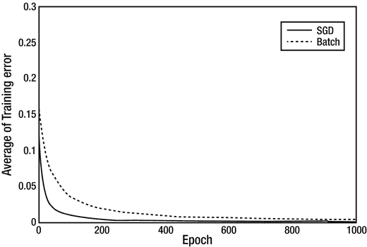

图 2-20.

SGD 方法比批量方法学习得更快

## 单层神经网络的局限性

本节介绍了单层神经网络必须演变成多层神经网络的关键原因。我们将尝试通过一个特定案例来展示这一点。考虑与上一节中讨论的相同神经网络。它由三个输入节点和一个输出节点组成，输出节点的激活函数是 sigmoid 函数（图 2-21）。

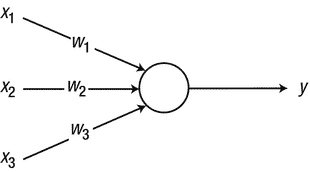

图 2-21.

我们相同的神经网络

假设我们这里有四个训练数据点，如图所示。它与“示例：Delta 规则”部分的不同之处在于，第二个和第四个正确输出被交换了，而输入保持不变。嗯，这种差异几乎不明显。它不应该引起任何麻烦，对吧？


我们现在将使用 SGD 通过 delta 规则对其进行训练。由于我们考虑的是相同的神经网络，我们可以使用“示例：Delta 规则”部分中的 `DeltaSGD` 函数来训练它。我们只需将其名称更改为 `DeltaXOR`。下面的程序列表显示了 `TestDeltaXOR.m` 文件，该文件测试 `DeltaXOR` 函数。此程序与“示例：Delta 规则”部分的 `TestDeltaSGD.m` 文件相同，除了它具有不同的 `D` 值，并且它调用 `DeltaXOR` 函数而不是 `DeltaSGD`。

```py
clear all
X = [ 0 0 1;
0 1 1;
1 0 1;
1 1 1;
];
D = [ 0
1
1
0
];
W = 2*rand(1, 3) - 1;
for epoch = 1:40000           % train
W = DeltaXOR(W, X, D);
end
N = 4;                        % inference
for k = 1:N
x = X(k, :)';
v = W*x;
y = Sigmoid(v)
end
```

当我们运行代码时，屏幕将显示以下值，这些值包括训练神经网络对应于训练数据的输出。我们可以将它们与由 `D` 给出的正确输出进行比较。

![$$ \left[\kern0.1em \begin{array}{c}\hfill 0.5297\hfill \\ {}\hfill 0.5000\hfill \\ {}\hfill 0.4703\hfill \\ {}\hfill 0.4409\hfill \end{array}\kern0.1em \right]\kern2em \iff \kern2em D\kern0.5em =\kern0.5em \left[\;\begin{array}{c}\hfill 0\hfill \\ {}\hfill 1\hfill \\ {}\hfill 1\hfill \\ {}\hfill 0\hfill \end{array}\;\right] $$](A448947_1_En_2_Chapter_Equt.gif)

发生了什么？我们得到了两组完全不同的结果。训练神经网络更长时间并没有区别。与“示例：Delta 规则”部分的代码相比，唯一的区别是正确的输出变量，`D`。实际上发生了什么？

通过展示训练数据可以帮助阐明这个问题。让我们将输入数据的三个值分别解释为 X、Y 和 Z 坐标。由于第三个值，即 Z 坐标，固定为 1，因此训练数据可以在如图 2-22 所示的平面上进行可视化。

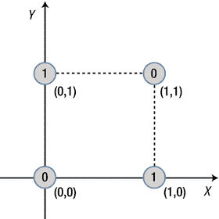

图 2-22。

将输入数据的三个值解释为 X、Y 和 Z 坐标

圆圈中的`0`和`1`的值是分配给每个点的正确输出。从这张图中可以注意到的一件事是我们不能用直线来划分`0`和`1`的区域。然而，我们可以用复杂的曲线来划分，如图 2-23 所示。这种类型的问题被称为线性不可分。


图 2-23。

我们只能用复杂的曲线来区分 0 和 1 的区域

在相同的过程中，X-Y 平面上的“示例：Delta 规则”部分中的训练数据出现在如图 2-24 所示的图中。


图 2-24。

Delta 规则训练数据

在这种情况下，可以很容易地找到一个将`0`和`1`的区域分开的直线边界。这是一个线性可分问题（如图 2-25 所示）。


图 2-25。

这组数据呈现了一个线性可分问题

简单来说，单层神经网络只能解决线性可分问题。这是因为单层神经网络是一个线性划分输入数据空间的模型。为了克服单层神经网络的这一限制，我们需要网络中更多的层。这种需求导致了多层神经网络的出现，它可以实现单层神经网络无法实现的功能。由于这部分内容较为数学化；如果你不熟悉这部分内容，可以跳过这部分。只需记住，单层神经网络适用于特定类型的问题。多层神经网络没有这样的限制。

## 概述

本章涵盖了以下概念：


+   Delta 规则是一种迭代方法，它逐渐达到解决方案。因此，网络应该用训练数据反复训练，直到误差减少到令人满意的水平。

+   单层神经网络仅适用于特定类型的问题。因此，单层神经网络的应用非常有限。为了克服单层神经网络的本质限制，已经开发了多层神经网络。

+   根据训练数据调整权重的称为学习规则。

+   存在三种主要的错误计算类型：随机梯度下降、批量和迷你批量。

+   Delta 规则是神经网络的代表性学习规则。其公式根据激活函数的不同而变化。

+   神经网络是由节点组成的网络，它模仿了大脑中的神经元。节点计算输入信号的加权总和，并输出加权总和的激活函数结果。

+   大多数神经网络都是用分层节点构建的。对于分层神经网络，信号通过输入层进入，通过隐藏层传递，并通过输出层退出。

+   在实践中，线性函数不能用作隐藏层的激活函数。这是因为线性函数抵消了隐藏层的效果。然而，在某些问题如回归中，输出层节点可能会使用线性函数。

+   对于神经网络，监督学习实现了调整权重并减少正确输出与神经网络输出之间差异的过程（图 2-26）。

    

    图 2-26。

    监督学习综述

脚注 1

除非另有说明，本书中的权重包括偏差。

2

它也被称为 Adaline 规则以及 Widrow-Hoff 规则。

3

Delta 规则是一种称为梯度下降的数值方法。梯度下降从初始值开始，继续到解。它的名字来源于它的行为，就像一个球沿着最陡峭的路径滚下山一样寻找解。在这个类比中，球的位置是模型偶尔的输出，底部是解。值得注意的是，梯度下降方法不能只抛一次就将球扔到底部。

4

Sigmoid 函数的输出范围在 0-1 之间。这种 Sigmoid 函数的行为在神经网络产生概率输出时非常有用。
