# 3. 多层神经网络的训练

为了克服单层神经网络的实际局限性，神经网络演变成了多层架构。然而，仅仅在单层神经网络上添加隐藏层就花了大约 30 年的时间。很难理解为什么花了这么长时间，但问题涉及学习规则。因为训练过程是神经网络存储信息的唯一方法，无法训练的神经网络是无用的。为多层神经网络开发适当的学习规则花费了相当长的时间。

之前介绍的 delta 规则对于多层神经网络的训练是无效的。这是因为，应用 delta 规则进行训练的基本元素——误差，在隐藏层中未定义。输出节点的误差定义为正确输出与神经网络输出的差异。然而，训练数据并不为隐藏层节点提供正确的输出，因此无法使用与输出节点相同的方法来计算误差。那么，真正的难题不在于如何定义隐藏节点的误差吗？你明白了。你刚刚提出了反向传播算法，这是多层神经网络的代表性学习规则。

1986 年，反向传播算法的引入最终解决了多层神经网络的训练问题。¹反向传播算法的重要性在于它提供了一种系统的方法来确定隐藏层的误差。一旦确定了隐藏层误差，就应用 delta 规则来调整权重。见图 3-1。

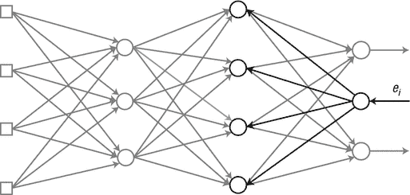

图 3-1。

反向传播的示意图

神经网络的输入数据通过输入层、隐藏层和输出层。相比之下，在反向传播算法中，输出误差从输出层开始，向后移动直到达到正确的下一个隐藏层到输入层。这个过程被称为反向传播，因为它类似于输出误差向后传播。即使在反向传播中，信号仍然通过连接线和权重相乘。唯一的区别是输入和输出信号流动的方向相反。

## 反向传播算法

本节通过简单多层神经网络的例子解释了反向传播算法。考虑一个由输入和输出层各两个节点以及一个同样有两个节点的隐藏层组成的神经网络。为了方便，我们将省略偏差。示例神经网络如图 3-2 所示，其中上标描述了层指示符。

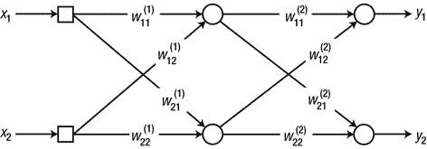

图 3-2。

由两个输入和输出节点以及一个包含两个节点的隐藏层组成的神经网络

为了获得输出误差，我们首先需要从输入数据中获得神经网络的输出。让我们试试。由于示例网络只有一个隐藏层，我们在输出计算之前需要进行两次输入数据处理。首先，计算隐藏节点的加权求和：

![$$ \begin{array}{c}\left[\kern0.1em \begin{array}{c}\hfill {v}_1^{(1)}\hfill \\ {}\hfill {v}_2^{(1)}\hfill \end{array}\kern0.1em \right]\kern0.62em =\kern0.62em \left[\kern0.1em \begin{array}{cc}\hfill {w}_{11}^{(1)}\hfill & \hfill {w}_{12}^{(1)}\hfill \\ {}\hfill {w}_{21}^{(1)}\hfill & \hfill {w}_{22}^{(1)}\hfill \end{array}\kern0.1em \right]\left[\kern0.1em \begin{array}{c}\hfill {x}_1\hfill \\ {}\hfill {x}_2\hfill \end{array}\kern0.1em \right]\\ {}\triangleq \kern0.62em {W}_1\kern0.1em x\end{array} $$](A448947_1_En_3_Chapter_Equ1.gif)

（方程式 3.1）

当我们将这个加权求和（方程式 3.1）放入激活函数中时，我们获得隐藏节点的输出。

![$$ \left[\;\begin{array}{c}\hfill {y}_1^{(1)}\hfill \\ {}\hfill {y}_2^{(1)}\hfill \end{array}\;\right]\kern0.62em =\kern0.62em \left[\;\begin{array}{c}\hfill \varphi \left({v}_1^{(1)}\right)\hfill \\ {}\hfill \varphi \left({v}_2^{(1)}\right)\hfill \end{array}\;\right] $$](A448947_1_En_3_Chapter_Equa.gif)

其中 y [1]^((1)) 和 y [2]^((1)) 是相应隐藏节点的输出。以类似的方式，计算输出节点的加权求和：

![$$ \begin{array}{c}\left[\;\begin{array}{c}\hfill {v}_1\hfill \\ {}\hfill {v}_2\hfill \end{array}\kern0.1em \right]\kern0.62em =\kern0.62em \left[\;\begin{array}{cc}\hfill {w}_{11}^{(2)}\hfill & \hfill {w}_{12}^{(2)}\hfill \\ {}\hfill {w}_{21}^{(2)}\hfill & \hfill {w}_{22}^{(2)}\hfill \end{array}\;\right]\left[\;\begin{array}{c}\hfill {y}_1^{(1)}\hfill \\ {}\hfill {y}_2^{(1)}\hfill \end{array}\kern0.1em \right]\\ {}\triangleq \kern0.62em {W}_2\kern0.2em {y}^{(1)}\end{array} $$](A448947_1_En_3_Chapter_Equ2.gif)

（方程式 3.2）

当我们将这个加权求和放入激活函数中时，神经网络就会产生输出。

![$$ \left[\;\begin{array}{c}\hfill {y}_1\hfill \\ {}\hfill {y}_2\hfill \end{array}\kern0.1em \right]\kern0.62em =\kern0.62em \left[\;\begin{array}{c}\hfill \varphi \left({v}_1\right)\hfill \\ {}\hfill \varphi \left({v}_2\right)\hfill \end{array}\kern0.1em \right] $$](A448947_1_En_3_Chapter_Equb.gif)

现在，我们将使用反向传播算法来训练神经网络。首先需要计算每个节点的 delta（δ）。你可能问：“这是否是 delta 规则中的 delta？”是的！为了避免混淆，图 3-3 中的图已经被重新绘制，不必要的连接已被淡化。

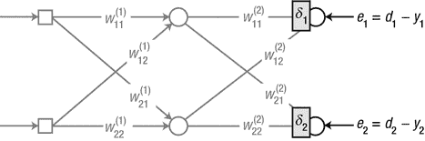

图 3-3.

使用反向传播算法训练神经网络

在反向传播算法中，输出节点的 delta 被定义为与第二章“广义 delta 规则”部分中的 delta 规则相同，如下所示：

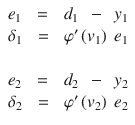

（方程 3.3）其中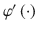是输出节点激活函数的导数，y[i]是输出节点的输出，d[i]是训练数据的正确输出，v[i]是对应节点的加权求和。

由于我们有了每个输出节点的 delta，让我们从隐藏节点向左进行并计算 delta（图 3-4）。再次，为了方便，不必要的连接被暗淡处理。

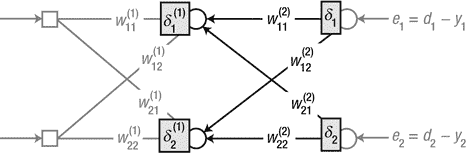

图 3-4。

从隐藏节点向左进行，并计算 delta

如本章开头所述，隐藏节点的问题是如何定义误差。在反向传播算法中，节点的误差被定义为从紧邻的层（在这种情况下，输出层）反向传播的 delta 的加权和。一旦获得误差，从节点计算 delta 的计算与方程 3.3 相同。这个过程可以表示如下：

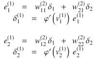

（方程 3.4）其中和是相应节点的前向信号的权重和。从这个方程中可以看出，前向和反向过程同样应用于隐藏节点和输出节点。这表明输出节点和隐藏节点经历了相同的反向过程。唯一的区别是误差计算（图 3-5）。

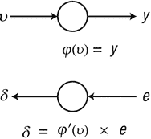

图 3-5。

误差计算是唯一的区别

总结来说，隐藏节点的误差是通过 delta 的反向加权求和来计算的，而节点的 delta 是误差和激活函数导数的乘积。这个过程从输出层开始，并重复应用于所有隐藏层。这基本上解释了反向传播算法的内容。

公式 3.4 的两个误差计算公式被合并成一个矩阵方程，如下所示：

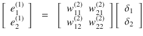

(公式 3.5)

将这个方程与公式 3.2 的神经网络输出进行比较。公式 3.5 的矩阵是公式 3.2 中权重矩阵 W 的转置结果。² 因此，公式 3.5 可以重写为：

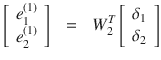

(公式 3.6)

这个公式表明，我们可以通过转置权重矩阵和 delta 向量的乘积来获得误差。这个非常有用的属性使得算法的实现更加容易。

如果我们还有额外的隐藏层，我们只需对每个隐藏层重复相同的反向过程，并计算所有 delta。一旦所有 delta 都被计算出来，我们就可以准备训练神经网络了。只需使用以下方程来调整各层的权重。


(公式 3.7) 其中 x [j] 是对应权重的输入信号。为了方便，我们从这个公式中省略了层指示符。你现在看到了什么？这个公式不是和上一节中 delta 规则的公式一样吗？是的，它们是相同的。唯一的区别是隐藏节点的 delta，它是通过使用神经网络的输出误差进行反向计算得到的。

我们将进一步推导出使用公式 3.7 调整权重的方程。以权重为例。

图 3-6 中的权重可以使用公式 3.7 来调整：

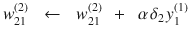

其中 y [1]^((1)) 是第一个隐藏节点的输出。这里还有一个例子。

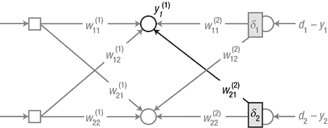

图 3-6。

推导调整权重的方程

图 3-7 中的权重 w [11]^((1)) 使用方程 3.7 进行调整：

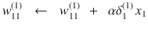

其中 x [1] 是第一个输入节点的输出，即神经网络的第一个输入。

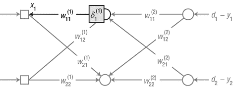

图 3-7。

再次推导调整权重的方程

让我们组织使用反向传播算法训练神经网络的流程。

1.  使用适当的值初始化权重。

1.  输入训练数据 `{ input, correct output }` 并获得神经网络的输出。计算输出与正确输出之间的误差以及输出节点的 delta，δ。

    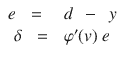

1.  将输出节点的 delta，δ，向后传播，并计算紧邻的（左侧）节点的 delta。

    

1.  重复步骤 3，直到达到输入层右侧的紧邻隐藏层。

1.  根据以下学习规则调整权重。

    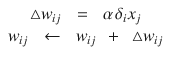

1.  对每个训练数据点重复步骤 2-5。

1.  重复步骤 2-6，直到神经网络得到适当的训练。

除了步骤 3 和 4，其中输出 delta 向后传播以获得隐藏节点的 delta 之外，这个过程基本上与之前讨论的 delta 规则相同。尽管这个例子只有一个隐藏层，但反向传播算法适用于训练多个隐藏层。只需重复前一个算法的步骤 3 即可为每个隐藏层。

## 示例：反向传播

在本节中，我们实现反向传播算法。训练数据包含以下表格所示的四个元素。当然，由于这是关于监督学习，数据包括输入和正确输出对。数据中加粗的最右边的数字是正确输出。如您所注意到的，这些数据与我们在第二章节中用于训练单层神经网络的相同；单层神经网络未能学会的那个。


忽略输入的第三个值，即 Z 轴，这个数据集实际上提供了 XOR 逻辑运算。因此，如果我们用这个数据集训练神经网络，我们就会得到 XOR 运算模型。

考虑一个由三个输入节点和一个输出节点组成的神经网络，如图 3-8 所示。它有一个包含四个节点的隐藏层。sigmoid 函数被用作隐藏节点和输出节点的激活函数。


图 3-8。

由三个输入节点和一个输出节点组成的神经网络

本节使用 SGD 实现反向传播算法。当然，批量方法也可以工作。我们必须做的是使用权重更新的平均值，如第二章节中“示例：delta 规则”部分的例子所示。由于本节的主要目标是理解反向传播算法，我们将坚持使用更简单、更直观的方法：SGD。

### XOR 问题

函数 `BackpropXOR`，使用 SGD 方法实现反向传播算法，接收网络的权重和训练数据，并返回调整后的权重。

```py
[W1 W2] = BackpropXOR(W1, W2, X, D)
```

其中 `W1` 和 `W2` 分别携带各自层的权重矩阵。`W1` 是输入层和隐藏层之间的权重矩阵，`W2` 是隐藏层和输出层之间的权重矩阵。`X` 和 `D` 分别是训练数据的输入和正确输出。以下列表展示了 `BackpropXOR.m` 文件，该文件实现了 `BackpropXOR` 函数。

```py
function [W1, W2] = BackpropXOR(W1, W2, X, D)
alpha = 0.9;
N = 4;
for k = 1:N
x = X(k, :)';
d = D(k);
v1 = W1*x;
y1 = Sigmoid(v1);
v  = W2*y1;
y  = Sigmoid(v);
e     = d - y;
delta = y.*(1-y).*e;
e1     = W2'*delta;
delta1 = y1.*(1-y1).*e1;
dW1 = alpha*delta1*x';
W1  = W1 + dW1;
dW2 = alpha*delta*y1';
W2  = W2 + dW2;
end
end
```

代码从训练数据集中获取点，使用 delta 规则计算权重更新 `dW`，并调整权重。到目前为止，这个过程几乎与第二章节示例代码中的过程相同。略有不同的是，输出计算时对函数 `Sigmoid` 的两次调用，以及使用输出 delta 的反向传播添加 delta (`delta1`) 计算如下：

```py
e1     = W2'*delta;
delta1 = y1.*(1-y1).*e1;
```

其中，误差计算`e1`是方程 3.6 的实现。由于这涉及到 delta 的反向传播，我们使用转置矩阵`W2'`。delta（`delta1`）计算有一个元素级乘法运算符`.*`，因为变量是向量。MATLAB 的元素级运算符在正常运算符前有一个点（圆点），并对向量的每个元素执行操作。此运算符使得可以从许多节点同时计算 delta。

`BackpropXOR`代码调用的`Sigmoid`函数，也将除法替换为元素级除法`./`以处理向量。

```py
function y = Sigmoid(x)
y = 1 ./ (1 + exp(-x));
end
```

修改后的`Sigmoid`函数可以像以下示例所示使用向量。

```py
Sigmoid([-1 0 1])    ➔    [0.2689    0.5000    0.7311]
```

下面的程序列表显示了`TestBackpropXOR.m`文件，该文件用于测试`BackpropXOR`函数。此程序调用`BackpropXOR`函数，并对神经网络进行 10,000 次训练。输入被提供给训练好的网络，其输出显示在屏幕上。我们可以通过将输出与训练数据的正确输出进行比较来验证训练性能。进一步的细节被省略，因为程序几乎与第二章中的程序相同。

```py
clear all
X = [ 0 0 1;
0 1 1;
1 0 1;
1 1 1;
];
D = [ 0
1
1
0
];
W1 = 2*rand(4, 3) - 1;
W2 = 2*rand(1, 4) - 1;
for epoch = 1:10000           % train
[W1 W2] = BackpropXOR(W1, W2, X, D);
end
N = 4;                        % inference
for k = 1:N
x  = X(k, :)';
v1 = W1*x;
y1 = Sigmoid(v1);
v  = W2*y1;
y  = Sigmoid(v)
end
```

执行代码，并在屏幕上找到以下值。这些值非常接近正确输出`D`，表明神经网络已经得到了适当的训练。现在我们已经确认多层神经网络解决了 XOR 问题，这是单层网络未能正确建模的问题。

![$$ \left[\kern0.1em \begin{array}{c}\hfill 0.0060\hfill \\ {}\hfill 0.9888\hfill \\ {}\hfill 0.9891\hfill \\ {}\hfill 0.0134\hfill \end{array}\kern0.1em \right]\kern2em \iff \kern2em D\kern0.5em =\kern0.5em \left[\;\begin{array}{c}\hfill 0\hfill \\ {}\hfill 1\hfill \\ {}\hfill 1\hfill \\ {}\hfill 0\hfill \end{array}\;\right] $$](A448947_1_En_3_Chapter_Equh.gif)

### 动量

本节探讨了权重调整的变体。到目前为止，权重调整依赖于方程 2.7 和 3.7 的最简单形式。然而，有各种权重调整形式可供选择。³使用高级权重调整公式的优点包括神经网络训练过程中的更高稳定性和更快速度。这些特性对于深度学习特别有利，因为深度学习很难训练。本节仅涵盖包含动量的公式，这些公式已经被使用了很长时间。如果需要，你可以通过脚注中显示的链接进一步研究。

动量，m，是一个用于调整权重的规则中的术语。动量项的使用在一定程度上将权重调整驱动到某个方向，而不是产生即时变化。它类似于物理动量，阻碍了身体对外部力的反应。

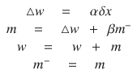

（公式 3.8）其中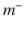是先前的动量，β是一个小于 1 的正常数。让我们简要地看看为什么我们以这种方式修改权重调整公式。以下步骤展示了动量随时间的变化：

![$$ \begin{array}{c} m(0)\kern0.62em =\kern0.62em 0\\ {} m(1)\kern0.62em =\kern0.62em \triangle w(1)+\beta m(0)\kern0.62em =\kern0.62em \triangle w(1)\\ {} m(2)\kern0.62em =\kern0.62em \triangle w(2)+\beta m(1)\kern0.62em =\kern0.62em \triangle w(2)+\beta \triangle w(1)\\ {} m(3)\kern0.62em =\kern0.62em \triangle w(3)+\beta m(2)\kern0.62em =\kern0.62em \triangle w(3)+\beta \left\{\triangle w(2)+\beta \triangle w(1)\right\}\kern0.62em =\kern0.62em \triangle w(3)+\beta \triangle w(2)+{\beta}²\triangle w(1)\\ {}\vdots \end{array} $$](img/A448947_1_En_3_Chapter_Equi.gif)

从这些步骤中可以看出，先前的权重更新，即∆w(1)，∆w(2)，∆w(3)等，被添加到每个动量过程中。由于β小于 1，旧的权重更新对动量的影响较小。尽管影响随时间减弱，但旧的权重更新仍然存在于动量中。因此，权重不仅仅受特定权重更新值的影响。因此，学习稳定性得到提高。此外，动量随着权重更新而越来越大。因此，权重更新变得越来越大。因此，学习率增加。

下面的列表展示了`BackpropMmt.m`文件，该文件实现了带有动量的反向传播算法。`BackpropMmt`函数与上一个示例中的操作方式相同；它接受权重和训练数据，并返回调整后的权重。此列表使用与`BackpropXOR`函数中定义的相同变量。

```py
[W1 W2] = BackpropMmt(W1, W2, X, D)
function [W1, W2] = BackpropMmt(W1, W2, X, D)
alpha = 0.9;
beta  = 0.9;
mmt1 = zeros(size(W1));
mmt2 = zeros(size(W2));
N = 4;
for k = 1:N
x = X(k, :)';
d = D(k);
v1 = W1*x;
y1 = Sigmoid(v1);
v  = W2*y1;
y  = Sigmoid(v);
e     = d - y;
delta = y.*(1-y).*e;
e1     = W2'*delta;
delta1 = y1.*(1-y1).*e1;
dW1  = alpha*delta1*x';
mmt1 = dW1 + beta*mmt1;
W1   = W1 + mmt1;
dW2  = alpha*delta*y1';
mmt2 = dW2 + beta*mmt2;
W2   = W2 + mmt2;
end
end
```

代码在开始学习过程时将动量`mmt1`和`mmt2`初始化为零。权重调整公式被修改以反映动量如下：

```py
dW1  = alpha*delta1*x';
mmt1 = dW1 + beta*mmt1;
W1   = W1 + mmt1;
```

下面的程序列表展示了`TestBackpropMmt.m`文件，该文件测试`BackpropMmt`函数。此程序调用`BackpropMmt`函数并训练神经网络 10,000 次。训练数据被输入到神经网络中，输出显示在屏幕上。通过将输出与训练数据的正确输出进行比较来验证训练的性能。由于此代码几乎与上一个示例相同，因此省略了进一步的解释。

```py
clear all
X = [ 0 0 1;
0 1 1;
1 0 1;
1 1 1;
];
D = [ 0
1
1
0
];
W1 = 2*rand(4, 3) - 1;
W2 = 2*rand(1, 4) - 1;
for epoch = 1:10000           % train
[W1 W2] = BackpropMmt(W1, W2, X, D);
end
N = 4;                        % inference
for k = 1:N
x  = X(k, :)';
v1 = W1*x;
y1 = Sigmoid(v1);
v  = W2*y1;
y  = Sigmoid(v)
end
```

## 成本函数和学习规则

本节简要解释了成本函数⁴是什么以及它如何影响神经网络的学习规则。成本函数是一个相当数学的概念，与优化理论相关联。你不必了解它。然而，如果你想要更好地理解神经网络的学习规则，了解它是很有帮助的。这是一个不难理解的概念。

成本函数与神经网络的监督学习相关。第二章讨论了神经网络的监督学习是一个调整权重以减少训练数据误差的过程。在这种情况下，神经网络误差的度量是成本函数。神经网络的误差越大，成本函数的值就越高。对于神经网络的监督学习，有两种主要的成本函数类型。

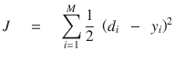

（方程 3.9）

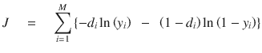

（方程 3.10）其中 y[i]是输出节点的输出，d[i]是训练数据的正确输出，M 是输出节点的数量。

首先，考虑方程 3.9 中显示的平方误差和。这个成本函数是神经网络输出 y 与正确输出 d 之间差异的平方。如果输出和正确输出相同，误差变为零。相反，两个值之间的差异越大，误差就越大。这如图 3-9 所示。

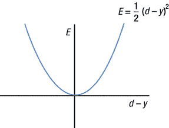

图 3-9。

输出与正确输出之间的差异越大，误差就越大

成本函数的值明显与误差成正比。这种关系如此直观，以至于无需进一步解释。大多数早期的神经网络研究都使用这个成本函数来推导学习规则。不仅上一章的 delta 规则是从这个函数推导出来的，反向传播算法也是如此。回归问题仍然使用这个成本函数。

现在，考虑方程 3.10 的成本函数。括号内的以下公式被称为交叉熵函数。

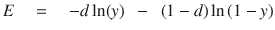

直观地捕捉交叉熵函数与误差之间的关系可能很困难。这是因为方程被简化以表达得更简单。方程 3.10 是以下两个方程的连接：

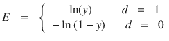

由于对数函数的定义，输出 y 应在 0 和 1 之间。因此，交叉熵代价函数通常与 sigmoid 和 softmax 激活函数一起在神经网络中使用。⁵ 现在我们将看到这个函数与误差的关系。回想一下，代价函数应该与输出误差成正比。那么这个呢？

图 3-10 展示了 d = 1 时的交叉熵函数。

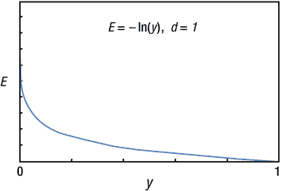

图 3-10。

d = 1 时的交叉熵函数

当输出 y 为 1，即误差 (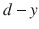) 为 0 时，代价函数的值也为 0。相反，当输出 y 接近 0，即误差增加时，代价函数的值急剧上升。因此，这个代价函数与误差成正比。

图 3-11 展示了 d = 0 时的代价函数。如果输出 y 为 0，误差为 0，代价函数的值为 0。当输出接近 1，即误差增加时，函数值急剧上升。因此，在这种情况下，这个代价函数也与误差成正比。这些情况证实了方程 3.10 的代价函数与神经网络的输出误差成正比。

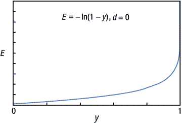

图 3-11。

d = 0 时的交叉熵函数

交叉熵函数与方程 3.9 的二次函数的主要区别是其几何增长。换句话说，交叉熵函数对误差的敏感性要高得多。因此，从交叉熵函数推导出的学习规则通常被认为能产生更好的性能。建议在不可避免的情况下（如回归）之外，使用交叉熵驱动的学习规则。

我们对代价函数进行了长篇介绍，因为代价函数的选择会影响学习规则，即反向传播算法的公式。具体来说，输出节点的 delta 计算略有变化。以下步骤详细说明了使用交叉熵驱动的反向传播算法在输出节点使用 sigmoid 激活函数训练神经网络的过程。

1.  使用适当的值初始化神经网络的权重。

1.  将训练数据的输入 `{ input, correct output }` 输入神经网络，并获取输出。将此输出与正确输出进行比较，计算误差，并计算输出节点的 delta，δ。

    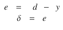

1.  将输出节点的 delta 向后传播，并计算后续隐藏节点的 delta。

    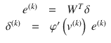

1.  重复步骤 3，直到达到紧邻输入层的隐藏层。

1.  使用以下学习规则调整神经网络的权重：

    

1.  对每个训练数据点重复步骤 2-5。

1.  重复步骤 2-6，直到网络得到充分训练。

你注意到这个过程与“反向传播算法”部分之间的差异了吗？它是步骤 2 中的 delta，δ，已经被修改如下：

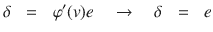

其他一切保持不变。从外表上看，差异似乎微不足道。然而，它包含了基于优化理论的成本函数的巨大主题。大多数深度学习的神经网络训练方法都采用交叉熵驱动的学习规则。这是由于它们优越的学习速率和性能。

图 3-12 展示了本节到目前为止所解释的内容。关键是，当学习规则基于交叉熵和 sigmoid 函数时，输出层和隐藏层使用不同的 delta 计算公式。

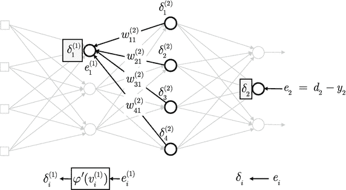

图 3-12。

输出层和隐藏层使用不同的 delta 计算公式。

在此过程中，我们还将讨论关于成本函数的另一个问题。你在第一章节中看到，过拟合是机器学习面临的一个挑战性问题。你也看到了，克服过拟合的主要方法之一是使用正则化使模型尽可能简单。从数学的角度来看，正则化的本质是将权重的和添加到成本函数中，如此处所示。当然，应用以下新的成本函数会导致不同的学习规则公式。

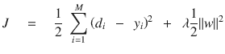

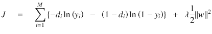

其中 λ 是系数，它决定了连接权重中有多少会反映在损失函数上。

当输出误差和权重中有一个保持较大值时，这个损失函数会保持一个较大的值。因此，仅仅将输出误差降到零并不能充分减少损失函数。为了降低损失函数的值，误差和权重都应该被控制在尽可能小。然而，如果一个权重变得足够小，相关的节点实际上会被断开连接。结果，不必要的连接被消除，神经网络变得更加简单。因此，通过将权重之和添加到损失函数中，可以改善神经网络的过拟合问题，从而减少它。

总结来说，神经网络的监督学习的学习规则是从损失函数中导出的。学习规则和神经网络的性能取决于损失函数的选择。交叉熵函数最近受到了关注，用作损失函数。用于处理过拟合的正则化过程被实现为损失函数的一种变化。

## 示例：交叉熵函数

本节回顾了反向传播的示例。但这次，使用交叉熵函数导出的学习规则。考虑由一个包含四个节点、三个输入节点和一个输出节点的隐藏层组成的神经网络训练。sigmoid 函数被用于隐藏节点和输出节点的激活函数。

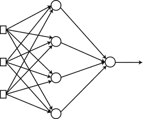

图 3-13。

具有四个节点、三个输入节点和一个输出节点的隐藏层的神经网络

训练数据包含以下表格中显示的相同四个元素。当我们忽略输入数据的第三个数字时，这个训练数据集呈现了一个 XOR 逻辑运算。每个元素加粗的最右边的数字是正确的输出。

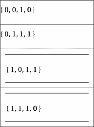

## 交叉熵函数

`BackpropCE` 函数使用交叉熵函数训练 XOR 数据。它接受神经网络的权重和训练数据，并返回调整后的权重。

```py
[W1 W2] = BackpropCE(W1, W2, X, D)
```

其中 `W1` 和 `W2` 分别是输入-隐藏层和隐藏-输出层的权重矩阵。此外，`X` 和 `D` 分别是数据的输入和正确输出矩阵。以下列表显示了 `BackpropCE.m` 文件，它实现了 `BackpropCE` 函数。

```py
function [W1, W2] = BackpropCE(W1, W2, X, D)
alpha = 0.9;
N = 4;
for k = 1:N
x = X(k, :)';        % x = a column vector
d = D(k);
v1 = W1*x;
y1 = Sigmoid(v1);
v  = W2*y1;
y  = Sigmoid(v);
e     = d - y;
delta = e;
e1     = W2'*delta;
delta1 = y1.*(1-y1).*e1;
dW1 = alpha*delta1*x';
W1 = W1 + dW1;
dW2 = alpha*delta*y1';
W2 = W2 + dW2;
end
end
```

此代码提取训练数据，使用 delta 规则计算权重更新（`dW1`和`dW2`），并使用这些值调整神经网络的权重。到目前为止，这个过程几乎与之前的示例相同。区别在于我们计算输出节点的 delta 时：

```py
e     = d - y;
delta = e;
```

与之前的示例代码不同，sigmoid 函数的导数不再存在。这是因为，对于交叉熵函数的学习规则，如果输出节点的激活函数是 sigmoid，delta 等于输出误差。当然，隐藏节点遵循与之前反向传播算法相同的流程。

```py
e1     = W2'*delta;
delta1 = y1.*(1-y1).*e1;
```

以下程序列表显示了测试`BackpropCE`函数的`TestBackpropCE.m`文件。此程序调用`BackpropCE`函数并训练神经网络 10,000 次。训练好的神经网络为训练数据输入提供输出，并将结果显示在屏幕上。我们通过比较输出与正确输出来验证神经网络的正确训练。进一步的解释被省略，因为代码几乎与之前相同。

```py
clear all
X = [ 0 0 1;
0 1 1;
1 0 1;
1 1 1;
];
D = [ 0
1
1
0
];
W1 = 2*rand(4, 3) - 1;
W2 = 2*rand(1, 4) - 1;
for epoch = 1:10000                    % train
[W1 W2] = BackpropCE(W1, W2, X, D);
end
N = 4;                                 % inference
for k = 1:N
x  = X(k, :)';
v1 = W1*x;
y1 = Sigmoid(v1);
v  = W2*y1;
y  = Sigmoid(v)
end
```

执行此代码会产生此处显示的值。输出非常接近正确输出`D`。这证明了神经网络已经成功训练。

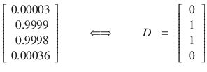

## 成本函数比较

与上一节中的`BackpropCE`函数和“XOR 问题”节中的`BackpropXOR`函数之间的唯一区别是输出节点 delta 的计算。我们将研究这个微小的差异是如何影响学习性能的。以下列表显示了比较两个函数平均误差的`CEvsSSE.m`文件。该文件的架构几乎与第二章中“SGD 与批处理比较”节中的`SGDvsBatch.m`文件相同。

```py
clear all
X = [ 0 0 1;
0 1 1;
1 0 1;
1 1 1;
];
D = [ 0
0
1
1
];
E1 = zeros(1000, 1);
E2 = zeros(1000, 1);
W11 = 2*rand(4, 3) - 1;      % Cross entropy
W12 = 2*rand(1, 4) - 1;      %
W21 = W11;                   % Sum of squared error
W22 = W12;                   %
for epoch = 1:1000
[W11 W12] = BackpropCE(W11, W12, X, D);
[W21 W22] = BackpropXOR(W21, W22, X, D);
es1 = 0;
es2 = 0;
N   = 4;
for k = 1:N
x = X(k, :)';
d = D(k);
v1  = W11*x;
y1  = Sigmoid(v1);
v   = W12*y1;
y   = Sigmoid(v);
es1 = es1 + (d - y)²;
v1  = W21*x;
y1  = Sigmoid(v1);
v   = W22*y1;
y   = Sigmoid(v);
es2 = es2 + (d - y)²;
end
E1(epoch) = es1 / N;
E2(epoch) = es2 / N;
end
plot(E1, 'r')
hold on
plot(E2, 'b:')
xlabel('Epoch')
ylabel('Average of Training error')
legend('Cross Entropy', 'Sum of Squared Error')
```

此程序调用`BackpropCE`和`BackpropXOR`函数，并对神经网络进行 1,000 次训练。每个神经网络的输出误差的平方和（`es1`和`es2`）在每个 epoch 时都会计算，并计算它们的平均值（E1 和 E2）。`W11`、`W12`、`W21`和`W22`是相应神经网络的权重矩阵。一旦完成 1,000 次训练，就会在图上比较每个 epoch 上的平均误差。如图 3-14 所示，交叉熵驱动的训练以更快的速度减少了训练误差。换句话说，交叉熵驱动的学习规则产生了一个更快的学习过程。这就是为什么大多数深度学习的成本函数都采用交叉熵函数的原因。

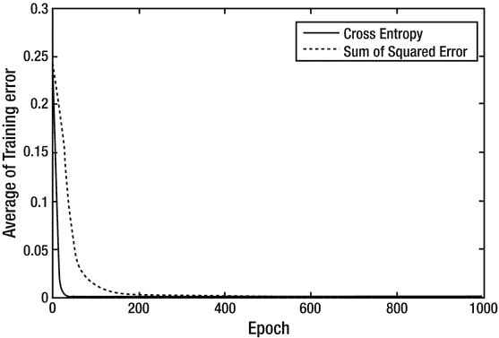

图 3-14。

交叉熵驱动的训练以更快的速度减少训练误差

这就完成了反向传播算法的内容。如果你觉得难以理解，不要气馁。实际上，在研究和开发深度学习时，理解反向传播算法并不是一个关键因素。因为大多数深度学习库已经包含了这些算法；我们只需使用它们即可。振作起来！深度学习只是差一章而已。

## 摘要

本章涵盖了以下概念：

+   多层神经网络不能使用 delta 规则进行训练；它应该使用反向传播算法进行训练，该算法也被用作深度学习的学习规则。

+   反向传播算法在传播输出误差从输出层反向传播时定义隐藏层误差。一旦获得隐藏层误差，就使用 delta 规则调整每一层的权重。反向传播算法的重要性在于它提供了一种系统的方法来定义隐藏节点的误差。

+   单层神经网络仅适用于线性可分问题，而大多数实际问题都是线性不可分的。

+   多层神经网络能够模拟线性不可分的问题。

+   在反向传播算法中，有多种类型的权重调整方法可用。各种权重调整方法的发展是为了追求网络学习更加稳定和快速。这些特性对于难以学习的深度学习尤其有益。

+   成本函数处理神经网络的输出误差，并且与误差成正比。交叉熵在最近的应用中已被广泛使用。在大多数情况下，交叉熵驱动的学习规则已知能产生更好的性能。

+   神经网络的学习规则根据成本函数和激活函数的不同而变化。具体来说，输出节点的 delta 计算会发生变化。

+   正则化，作为克服过拟合的方法之一，也被实现为将权重项添加到损失函数中。

脚注 1

“通过反向传播错误学习表示”，David E. Rumelhart, Geoffrey E. Hinton, Ronald J. Williams, 自然，1986 年 10 月。

2

当两个矩阵的行和列互换时，它们互为转置矩阵。

3

`sebastianruder.com/optimizing-gradient-descent`

4

它也被称为损失函数和目标函数。

5

如果使用其他激活函数，交叉熵函数的定义也会略有变化。
