# 4. 神经网络与分类

如第一章所述，主要需要监督学习的机器学习应用是分类和回归。分类用于确定数据所属的组。分类的一些典型应用包括垃圾邮件过滤和字符识别。相比之下，回归从数据中推断值。它可以举例说明预测给定年龄和教育水平的收入。

尽管神经网络适用于分类和回归，但它很少用于回归。这并不是因为它性能不佳，而是因为大多数回归问题都可以使用更简单的模型来解决。因此，我们将在这本书中坚持使用分类。

在神经网络应用于分类时，输出层的公式通常根据数据应分为多少组而有所不同。当使用更多组时，用于两组分类的节点数量和合适的激活函数的选择是不同的。请记住，这仅影响输出节点，而隐藏节点保持不变。当然，本章的方法并非唯一可用的方法。然而，它们可能是最好的起点，因为它们已经通过许多研究和案例得到了验证。

## 二元分类

我们将从二元分类神经网络开始，它将输入数据分类为两个组之一。这种分类器实际上比您可能预期的应用更多。一些典型应用包括垃圾邮件过滤（垃圾邮件或正常邮件）和贷款批准（批准或拒绝）。

对于二元分类，神经网络只需要一个输出节点就足够了。这是因为输入数据可以通过输出值来分类，该值要么大于阈值，要么小于阈值。例如，如果使用 sigmoid 函数作为输出节点的激活函数，数据可以通过输出是否大于 0.5 来分类。由于 sigmoid 函数的范围是 0-1，我们可以将组在中间划分，如图 4-1 所示。

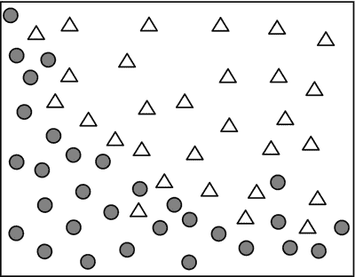

图 4-1。

二元分类问题

考虑图 4-1 中所示的二元分类问题。对于给定的坐标 (x, y)，模型的目的是确定数据属于哪个组。在这种情况下，训练数据以图 4-2 中所示的形式给出。前两个数字分别表示 x 和 y 坐标，符号表示数据所属的组。数据包括输入和正确输出，正如它用于监督学习一样。

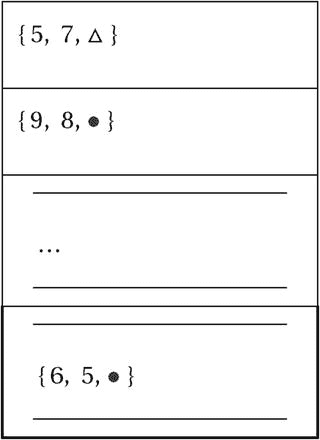

图 4-2。

训练数据二元分类

现在，让我们构建神经网络。输入节点的数量等于输入参数的数量。由于本例的输入由两个参数组成，网络采用两个输入节点。我们需要一个输出节点，因为这将实现之前提到的两组分类。激活函数使用 sigmoid 函数，隐藏层有四个节点。¹ 图 4-3 显示了所描述的神经网络。

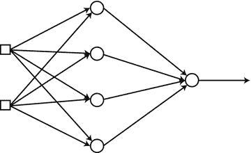

图 4-3。

训练数据用的神经网络

当我们用给定的训练数据训练这个网络时，我们可以得到我们想要的二元分类。然而，存在一个问题。神经网络产生的是 0-1 范围内的数值输出，而我们有的是作为△和●给出的符号正确输出。我们无法以这种方式计算误差；我们需要将符号转换为数值代码。我们可以将 sigmoid 函数的最大值和最小值分配给两个类别，如下所示：

+   类别△   →   1

+   类别●   →   0

类别符号的变化产生了图 4-4 中所示的训练数据。

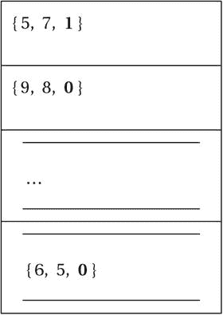

图 4-4。

改变类别符号和数据被不同地分类

图 4-4 中所示的训练数据是我们用来训练神经网络的。二元分类神经网络通常采用前一个方程的交叉熵函数进行训练。你不必每次都这样做，但这对于性能和实现过程有益。二元分类神经网络的训练过程总结如下。当然，我们使用交叉熵函数作为损失函数，sigmoid 函数作为隐藏和输出节点的激活函数。

1.  二元分类神经网络在输出层有一个节点。激活函数使用 sigmoid 函数。

1.  使用 sigmoid 函数的最大值和最小值将训练数据的类别标题转换为数字。类别△  →  1 类别●  →  0

1.  使用适当的值初始化神经网络的权重。

1.  将训练数据 `{ 输入, 正确输出 }` 输入神经网络并获取输出。计算输出与正确输出之间的误差，并确定输出节点的 delta，δ。

    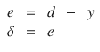

1.  将输出 delta 反向传播并计算后续隐藏节点的 delta。

    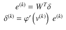

1.  重复步骤 5，直到达到输入层右侧的下一隐藏层。

1.  使用这个学习规则调整神经网络的权重：

    

1.  对所有训练数据点重复步骤 4-7。

1.  重复步骤 4-8，直到神经网络被正确训练。

尽管由于步骤众多而显得复杂，但这个过程基本上与第三章节中所述的反向传播过程相同。详细的解释被省略了。

## 多类分类

本节介绍了如何利用神经网络处理三个或更多类别的分类。考虑将给定的坐标 (x, y) 输入分类到三个类别之一（见图 4-5）。

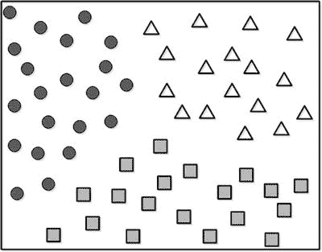

图 4-5.

具有三个类别的数据

我们首先需要构建神经网络。由于输入由两个参数组成，我们将使用两个节点作为输入层的输入。为了简化，我们暂时不考虑隐藏层。我们还需要确定输出节点的数量。众所周知，将输出节点的数量与类别的数量相匹配是最有希望的方法。在这个例子中，我们使用三个输出节点，因为问题需要三个类别。图 4-6 展示了配置好的神经网络。

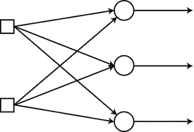

图 4-6.

为三个类别配置的神经网络

一旦使用给定数据训练了神经网络，我们就得到了我们想要的多元分类器。训练数据如图 4-7 所示。对于每个数据点，前两个数字分别是 x 和 y 坐标，第三个值是对应的类别。数据包括输入和正确的输出，因为它用于监督学习。

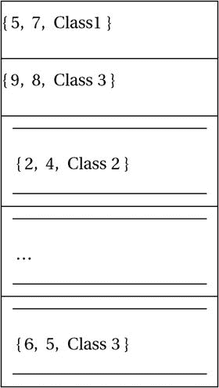

图 4-7.

多元分类器的训练数据

为了计算误差，我们将类别名称转换为数值代码，就像我们在上一节中所做的那样。考虑到我们从神经网络中有三个输出节点，我们创建以下向量作为类别：

+   类 1  →  [ 1 0 0 ]

+   类 2  →  [ 0 1 0 ]

+   类 3  →  [ 0 0 1 ]

这种转换意味着每个输出节点都映射到类向量中的一个元素，该元素只为相应的节点输出 1。例如，如果数据属于类别 2，则输出只为第二个节点输出 1，其他节点为 0（见图 4-8）。

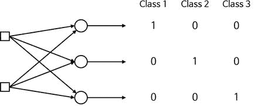

图 4-8.

每个输出节点现在映射到类向量中的一个元素

这种表达式技术称为 one-hot 编码或 1-of-N 编码。我们匹配输出节点数量与类别数量的原因是为了应用这种编码技术。现在，训练数据以图 4-9 所示的格式显示。

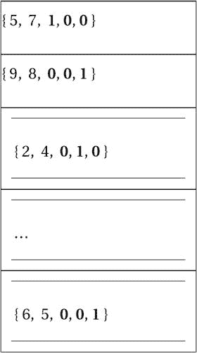

图 4-9。

训练数据以新的格式显示

接下来，应该定义输出节点的激活函数。由于转换后的训练数据的正确输出范围从零到一，我们是否可以像在二分类中那样直接使用 sigmoid 函数？一般来说，多类分类器使用 softmax 函数作为输出节点的激活函数。

我们之前讨论的激活函数，包括 sigmoid 函数，仅考虑输入的加权总和。它们不考虑其他输出节点的输出。然而，softmax 函数不仅考虑输入的加权总和，还考虑其他输出节点的输入。例如，当三个输出节点的输入的加权总和分别为 2、1 和 0.1 时，softmax 函数计算如图 4-10 所示的输出。所有输入的加权总和都在分母中。

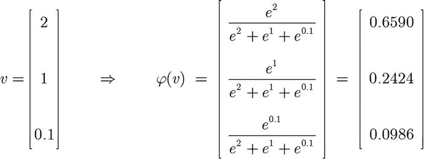

图 4-10。

Softmax 函数计算

为什么我们坚持使用 softmax 函数？考虑用 sigmoid 函数代替 softmax 函数。假设神经网络在给定输入数据时产生了图 4-11 所示的输出。由于 sigmoid 函数只关注其自身的输出，这里的输出将会生成。

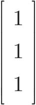

图 4-11。

使用 sigmoid 函数时的输出

第一个输出节点以 100%的概率看起来属于类别 1。那么数据是否属于类别 1 呢？不一定。其他输出节点也表明属于类别 2 和类别 3 的概率为 100%。因此，对多类分类神经网络输出的充分解释需要考虑所有节点输出的相对大小。在这个例子中，属于每个类别的实际概率是 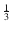。Softmax 函数提供了正确的值。

Softmax 函数保持输出值的总和为 1，并且将单个输出限制在 0-1 的值之间。因为它考虑了所有输出的相对大小，所以 softmax 函数是多类分类神经网络的一个合适选择。Softmax 函数的第 i 个输出节点的输出计算如下：

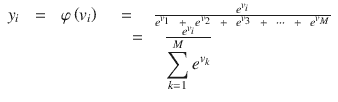

其中，υ[i] 是第 i 个输出节点的加权求和，M 是输出节点的数量。根据此定义，softmax 函数满足以下条件：

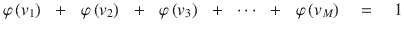

最后，应确定学习规则。多类分类神经网络通常采用与二分类网络相同的交叉熵驱动的学习规则。这是由于交叉熵函数提供的高学习性能和简单性。

简而言之，多类分类神经网络的 learning rule 与上一节中二分类神经网络的 learning rule 相同。尽管这两个神经网络采用了不同的激活函数——二分类使用 sigmoid，多类分类使用 softmax——但学习规则的推导导致了相同的结果。嗯，对我们来说，记住的东西越少越好。

多类分类神经网络的训练过程总结如下步骤。

1.  构建输出节点，使其值与类别数量相同。使用 softmax 函数作为激活函数。

1.  通过独热编码方法将类别的名称转换为数值向量。类别 1 → [ 1 0 0 ]类别 2 → [ 0 1 0 ]类别 3 → [ 0 0 1 ]

1.  使用适当的值初始化神经网络的权重。

1.  将训练数据 `{ 输入, 正确输出 }` 输入神经网络并获取输出。计算输出与正确输出之间的误差并确定输出节点的 delta，δ。

    

1.  将输出 delta 反向传播并计算后续隐藏节点的 delta。

    

1.  重复步骤 5，直到达到输入层右侧的下一隐藏层。

1.  使用此学习规则调整神经网络的权重：

    

1.  对所有训练数据点重复步骤 4-7。

1.  重复步骤 4-8，直到神经网络被正确训练。

当然，多类分类神经网络也适用于二进制分类。我们只需要构建一个具有两个输出节点的神经网络，并使用 softmax 函数作为激活函数。

## 示例：多类分类

在本节中，我们实现了一个多类分类器网络，用于识别输入图像中的数字。在第三章中已经实现了二进制分类，其中输入坐标被分为两组。由于它将数据分类为 0 或 1，因此是二进制分类。

考虑数字图像识别。这是一个多类分类，因为它将图像分类为指定的数字。输入图像是五乘五像素方格，显示 1 到 5 的五个数字，如图 4-12 所示。

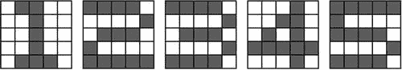

图 4-12。

显示 1 到 5 五个数字的五乘五像素方格

神经网络模型包含一个单独的隐藏层，如图 4-13 所示。由于每个图像被设置在一个矩阵上，我们设置了 25 个输入节点。此外，由于我们有五个数字需要分类，网络包含五个输出节点。输出节点的激活函数使用 softmax 函数。隐藏层有 50 个节点，激活函数使用 sigmoid 函数。

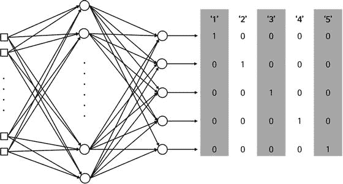

图 4-13。

该新数据集的神经网络模型

函数 `MultiClass` 使用 SGD 方法实现了多类分类的学习规则。它接受权重和训练数据的输入参数，并返回训练后的权重。

```py
[W1, W2] = MultiClass(W1, W2, X, D)
```

其中 `W1` 和 `W2` 分别是输入-隐藏层和隐藏-输出层的权重矩阵。`X` 和 `D` 分别是训练数据的输入和正确输出。以下列表显示了实现 `MultiClass` 函数的 `MultiClass.m` 文件。

```py
function [W1, W2] = MultiClass(W1, W2, X, D)
alpha = 0.9;
N = 5;
for k = 1:N
x = reshape(X(:, :, k), 25, 1);
d = D(k, :)';
v1 = W1*x;
y1 = Sigmoid(v1);
v  = W2*y1;
y  = Softmax(v);
e     = d - y;
delta = e;
e1     = W2'*delta;
delta1 = y1.*(1-y1).*e1;
dW1 = alpha*delta1*x';
W1 = W1 + dW1;
dW2 = alpha*delta*y1';
W2 = W2 + dW2;
end
end
```

此代码遵循第三章中“交叉熵函数”部分示例代码的相同程序，它将 delta 规则应用于训练数据，计算权重更新 `dW1` 和 `dW2`，并调整神经网络的权重。然而，此代码略有不同，因为它使用 `softmax` 函数进行输出计算，并调用 `reshape` 函数从训练数据中导入输入。

```py
x = reshape(X(:, :, k), 25, 1);
```

输入参数`X`包含堆叠的二维图像数据。这意味着`X`是一个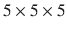的三维矩阵。因此，函数`reshape`的第一个参数`X(:, :, k)`表示的矩阵，它包含第 k 个图像数据。由于这个神经网络只兼容向量格式输入，二维矩阵应该被转换成一个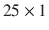的向量。函数`reshape`执行这个转换。

使用交叉熵驱动学习规则，输出节点的 delta 计算如下：

```py
e     = d - y;
delta = e;
```

与第三章的例子类似，不需要进行其他计算。这是因为，在采用 softmax 激活函数的交叉熵驱动学习规则中，delta 和误差是相同的。当然，之前的反向传播算法适用于隐藏层。

```py
e1     = W2'*delta;
delta1 = y1.*(1-y1).*e1;
```

`MultiClass`函数调用的`Softmax`函数在下面的列表中所示的`Softmax.m`文件中实现。该文件直接实现了`softmax`函数的定义。它足够简单，因此省略了进一步的解释。

```py
function y = Softmax(x)
ex = exp(x);
y  = ex / sum(ex);
end
```

下面的列表显示了测试函数`MultiClass`的`TestMultiClass.m`文件。这个程序调用`MultiClass`并训练神经网络 10,000 次。一旦训练过程完成，程序将训练数据输入神经网络并显示输出。我们可以通过比较输出与正确输出来验证训练结果。

```py
clear all
rng(3);
X  = zeros(5, 5, 5);
X(:, :, 1) = [ 0 1 1 0 0;
0 0 1 0 0;
0 0 1 0 0;
0 0 1 0 0;
0 1 1 1 0
];
X(:, :, 2) = [ 1 1 1 1 0;
0 0 0 0 1;
0 1 1 1 0;
1 0 0 0 0;
1 1 1 1 1
];
X(:, :, 3) = [ 1 1 1 1 0;
0 0 0 0 1;
0 1 1 1 0;
0 0 0 0 1;
1 1 1 1 0
];
X(:, :, 4) = [ 0 0 0 1 0;
0 0 1 1 0;
0 1 0 1 0;
1 1 1 1 1;
0 0 0 1 0
];
X(:, :, 5) = [ 1 1 1 1 1;
1 0 0 0 0;
1 1 1 1 0;
0 0 0 0 1;
1 1 1 1 0
];
D = [ 1 0 0 0 0;
0 1 0 0 0;
0 0 1 0 0;
0 0 0 1 0;
0 0 0 0 1
];
W1 = 2*rand(50, 25) - 1;
W2 = 2*rand( 5, 50) - 1;
for epoch = 1:10000           % train
[W1 W2] = MultiClass(W1, W2, X, D);
end
N = 5;                        % inference
for k = 1:N
x  = reshape(X(:, :, k), 25, 1);
v1 = W1*x;
y1 = Sigmoid(v1);
v  = W2*y1;
y  = Softmax(v)
end
```

代码的输入数据`X`是一个二维矩阵，它将白色像素编码为零，将黑色像素编码为一。例如，数字`1`的图像编码在图 4-14 中显示的矩阵中。

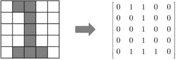

图 4-14。

数字 1 的图像编码在矩阵中

相反，变量`D`包含正确的输出。例如，对第一个输入数据，即数字`1`的图像的正确输出位于变量`D`的第一行，它是使用每个五个输出节点的一热编码方法构建的。执行`TestMultiClass.m`文件，你会看到神经网络在输出与`D`之间的差异方面已经得到了适当的训练。

到目前为止，我们只验证了神经网络对训练数据的处理。然而，实际数据并不一定反映训练数据。正如我们之前讨论的，这是一个机器学习的基本问题，需要解决。让我们通过一个简单的实验来检查我们的神经网络。考虑图 4-15 中显示的略微污染的图像，并观察神经网络对它们的响应。

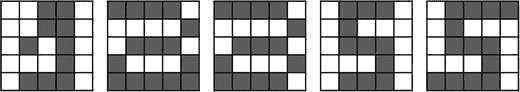

图 4-15.

让我们看看神经网络对这些受污染的图像的反应

下面的列表显示了`RealMultiClass.m`文件，该文件对图 4-15 中显示的图像进行分类。这个程序从执行`TestMultiClass`命令开始，并训练神经网络。这个过程产生了权重矩阵`W1`和`W2`。

```py
clear all
TestMultiClass;                 % W1, W2
X  = zeros(5, 5, 5);
X(:, :, 1) = [ 0 0 1 1 0;
0 0 1 1 0;
0 1 0 1 0;
0 0 0 1 0;
0 1 1 1 0
];
X(:, :, 2) = [ 1 1 1 1 0;
0 0 0 0 1;
0 1 1 1 0;
1 0 0 0 1;
1 1 1 1 1
];
X(:, :, 3) = [ 1 1 1 1 0;
0 0 0 0 1;
0 1 1 1 0;
1 0 0 0 1;
1 1 1 1 0
];
X(:, :, 4) = [ 0 1 1 1 0;
0 1 0 0 0;
0 1 1 1 0;
0 0 0 1 0;
0 1 1 1 0
];
X(:, :, 5) = [ 0 1 1 1 1;
0 1 0 0 0;
0 1 1 1 0;
0 0 0 1 0;
1 1 1 1 0
];
N = 5;                        % inference
for k = 1:N
x  = reshape(X(:, :, k), 25, 1);
v1 = W1*x;
y1 = Sigmoid(v1);
v  = W2*y1;
y  = Softmax(v)
end
```

这段代码与`TestMultiClass.m`文件中的代码相同，除了它有不同的输入`X`并且不包括训练过程。执行此程序会产生五个受污染图像的输出。让我们逐一查看。

对于第一幅图像，神经网络以 96.66%的概率判断它是`4`。比较图 4-16 中的左右图像，分别是输入图像和神经网络选择的数字。输入图像确实包含了数字`4`的重要特征。尽管它看起来像`1`，但它更接近`4`。这种分类似乎是合理的。

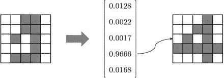

图 4-16.

左右图像分别是输入图像和神经网络选择的数字

接下来，第二幅图像以 99.36%的概率被分类为`2`。当我们比较输入图像和训练数据`2`时，这似乎是合理的。它们之间只有一个像素的差异。见图 4-17。

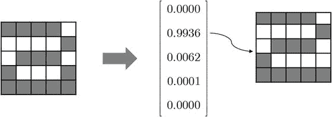

图 4-17.

第二幅图像被分类为 2

第三幅图像以 97.62%的概率被分类为`3`。当我们比较图像时，这似乎也是合理的。见图 4-18。

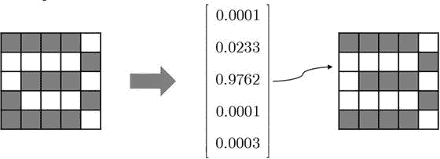

图 4-18.

第三幅图像被分类为 3

然而，当我们比较第二和第三输入图像时，差异仅有一个像素。这个微小的差异导致了两种完全不同的分类。你可能没有注意到，但这两张图像的训练数据之间只有一个像素的差异。神经网络能够捕捉到这个小的差异并将其应用于实际实践，这不是很神奇吗？

让我们看看第四幅图像。它以 47.12%的概率被分类为`5`。同时，它也有 32.08%的高概率被分类为`3`。让我们看看发生了什么。输入图像看起来像是一个被挤压的`5`。此外，神经网络发现了一些类似于`3`特征的横向线条，因此给出了较高的概率。在这种情况下，神经网络应该通过在训练数据中增加多样性来训练，以提高其性能。

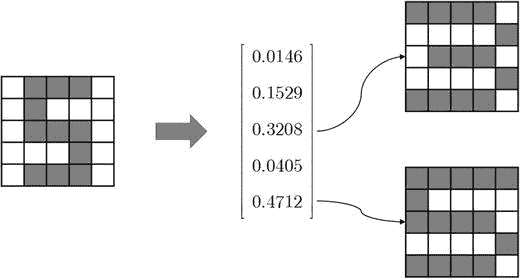

图 4-19.

为了提高其性能，神经网络可能需要通过在训练数据中增加多样性来训练。

最后，第五张图像以 98.18%的概率被分类为`5`。当我们看到输入图像时，这并不奇怪。然而，这张图像几乎与第四张图像相同。它只是在图像的顶部和底部多了两个像素。仅仅扩展水平线就导致成为`5`的概率显著增加。在第四张图像中，`5`的水平特征并不那么显著。通过强制这一特征，第五张图像被正确分类为`5`，如图 4-20 所示。

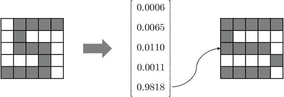

图 4-20。

第五张图像被正确分类为 5

## 摘要

本章涵盖了以下概念：

+   对于神经网络分类器，输出节点数量和激活函数的选择通常取决于它是否用于二分类（两个类别）或用于多分类（三个或更多类别）。

+   对于二分类，神经网络由一个输出节点和 sigmoid 激活函数构成。训练数据的正确输出被转换为激活函数的最大和最小值。学习规则的成本函数采用交叉熵函数。

+   对于多分类，神经网络包含与类别数量相等的输出节点。输出节点的激活函数采用 softmax 函数。训练数据的正确输出使用 one-hot 编码方法转换为向量。学习规则的成本函数采用交叉熵函数。

脚注 1

隐藏层不是我们的关注点。根据类别数量变化的层是输出层，而不是隐藏层。隐藏层的组成没有标准规则。
