# 5. 深度学习

深度学习时代到来了。尽管如此，你不必紧张。因为深度学习仍然是神经网络的扩展，你之前读到的很多东西都是适用的。因此，你不需要学习很多额外的概念。

简而言之，深度学习是一种机器学习技术，它使用深度神经网络。正如你所知，深度神经网络是包含两个或更多隐藏层的多层神经网络。尽管这听起来可能令人失望地简单，但这正是深度学习的真正本质。图 5-1 阐述了深度学习的概念及其与机器学习的关系。

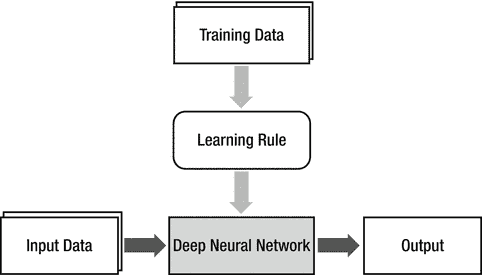

图 5-1.

深度学习的概念及其与机器学习的关系

深度神经网络位于机器学习的最终产品位置，学习规则变成了从训练数据生成模型（深度神经网络）的算法。

现在，了解到深度学习只是使用更深（更多隐藏层）的神经网络后，你可能想知道，“是什么让深度学习如此吸引人？有没有人想过让神经网络的层更深？”为了回答这些问题，我们需要回顾神经网络的历史。

单层神经网络，神经网络的第一代，在解决机器学习面临的实际问题时很快揭示了其基本局限性。¹ 研究人员已经知道多层神经网络将是下一个突破。然而，直到大约 30 年后，单层神经网络才增加了另一层。可能很难理解为什么仅仅增加一层需要这么长时间。这是因为没有找到多层神经网络的适当学习规则。由于训练是神经网络存储信息的唯一方式，无法训练的神经网络是没有用的。

多层神经网络的训练问题最终在 1986 年得到了解决，当时引入了反向传播算法。神经网络再次登台。然而，它很快又遇到了另一个问题。它在实际问题上的表现没有达到预期。当然，人们尝试了各种方法来克服这些限制，包括增加隐藏层和隐藏层中的节点。然而，这些方法都没有奏效。其中许多甚至导致了更差的表现。由于神经网络具有非常简单的设计和概念，没有太多可以改进的地方。最终，神经网络被认为没有改进的可能，并被遗忘了。

直到 2000 年代中期深度学习被引入，这个问题大约被遗忘了 20 年，打开了一扇新的大门。由于训练深层神经网络困难重重，深层隐藏层需要一段时间才能产生足够的性能。无论如何，当前深度学习的技术在性能上令人眼花缭乱，不仅优于其他机器学习技术，也优于其他神经网络，在人工智能的研究中占据主导地位。

总结来说，多层神经网络花了 30 年才解决单层神经网络的问题，是因为缺乏学习规则，这个问题最终通过反向传播算法得到了解决。相比之下，直到深度神经网络和深度学习引入的 20 年后，另一个 20 年的原因是性能不佳。添加额外隐藏层的反向传播训练通常会导致性能下降。深度学习为解决这个问题提供了解决方案。

## 深度神经网络改进

尽管深度学习取得了卓越的成就，但实际上并没有任何关键的技术可以展示。深度学习的创新是许多小技术改进的结果。本节简要介绍为什么深度神经网络性能不佳以及深度学习是如何克服这个问题的。

深层神经网络性能不佳的原因是网络没有得到适当的训练。反向传播算法在深层神经网络的训练过程中遇到以下三个主要困难：

+   梯度消失

+   过度拟合

+   计算负载

### 梯度消失

在这个背景下，梯度可以被视为与反向传播算法中的 delta 类似的概念。在使用反向传播算法的训练过程中，当输出误差更可能无法达到更远的节点时，会出现梯度消失现象。反向传播算法通过将输出误差向后传播到隐藏层来训练神经网络。然而，由于误差几乎无法达到第一隐藏层，权重无法调整。因此，靠近输入层的隐藏层没有得到适当的训练。如果它们无法得到训练，添加隐藏层就没有意义（见图 5-2）。

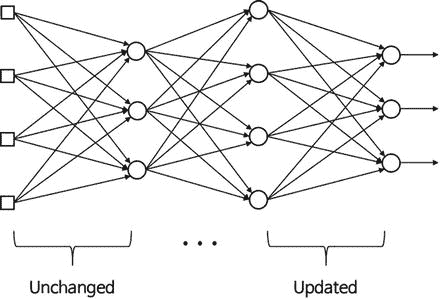

图 5-2。

梯度消失

梯度消失的代表性解决方案是使用修正线性单元（`ReLU`）函数作为激活函数。众所周知，它比 sigmoid 函数更好地传递误差。`ReLU`函数的定义如下：

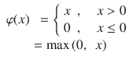

图 5-3 展示了`ReLU`函数。对于负输入，它产生零；对于正输入，它传递输入。²它的实现也非常简单。

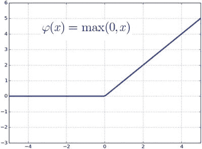

图 5-3。

ReLU 函数

sigmoid 函数将节点的输出限制为 1，无论输入的大小如何。相比之下，ReLU 函数没有这样的限制。这样一个简单的变化却导致了深度神经网络学习性能的显著提升，这不是很有趣吗？

我们还需要用于反向传播算法的 ReLU 函数的导数。根据 ReLU 函数的定义，其导数如下：


此外，如第三章所述，由交叉熵驱动的学习规则也可能提高性能。此外，高级梯度下降³，这是一种更好的实现最优值的数值方法，对深度神经网络的训练也有益。

### 过拟合

深度神经网络特别容易过拟合的原因是，随着包含更多隐藏层和更多权重，模型变得更加复杂。正如第一章所述，复杂的模型更容易过拟合。这里有一个困境——为了提高性能而加深层，驱使神经网络面临机器学习的挑战。

最具代表性的解决方案是 dropout，它只训练随机选择的节点而不是整个网络。这种方法非常有效，而其实现并不复杂。图 5-4 解释了 dropout 的概念。在某个百分比下随机选择一些节点，并将它们的输出设置为零以禁用这些节点。

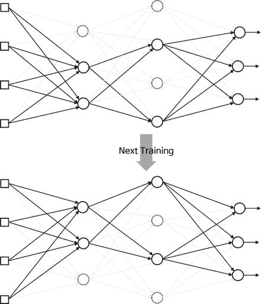

图 5-4。

Dropout 是指随机选择一些节点，并将它们的输出设置为零以禁用这些节点。

Dropout 通过在训练过程中持续改变节点和权重，有效地防止了过拟合。dropout 的适当百分比分别为隐藏层和输入层的 50%和 25%。

另一种常用的防止过拟合的方法是在损失函数中添加正则化项，这些项提供了权重的幅度。这种方法之所以有效，是因为它尽可能地简化了神经网络的结构，从而减少了过拟合的可能发生。第三章解释了这一点。此外，使用大量训练数据也非常有帮助，因为它减少了特定数据可能带来的偏差。

### 计算负载

最后的挑战是完成训练所需的时间。随着隐藏层数量的增加，权重的数量呈几何级数增长，因此需要更多的训练数据。这最终需要更多的计算。神经网络执行的计算越多，训练所需的时间就越长。这个问题在神经网络的实际开发中是一个严重的问题。如果一个深度神经网络需要一个月的时间来训练，那么一年中只能修改 20 次。在这种情况下，进行有用的研究几乎是不可能的。通过引入高性能硬件，如 GPU，以及算法，如批量归一化，这个问题在很大程度上得到了缓解。

本节介绍的一些小改进是使深度学习成为机器学习英雄的驱动因素。通常认为机器学习的三个主要研究领域是图像识别、语音识别和自然语言处理。这些领域都曾分别使用特定适合的技术进行研究。然而，深度学习目前在这三个领域的所有技术中都表现出色。

## 示例：ReLU 和 Dropout

本节通过示例实现了 `ReLU` 激活函数和 dropout，这是深度学习的代表性技术。它重用了第四章的数字分类示例。训练数据是相同的五乘五方形图像。

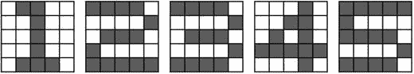

图 5-5。

五乘五方形图像中的训练数据

考虑具有三个隐藏层的深度神经网络，如图 5-6 所示。每个隐藏层包含 20 个节点。该网络有 25 个输入节点用于矩阵输入，以及五个输出节点用于五个类别。输出节点使用 softmax 激活函数。

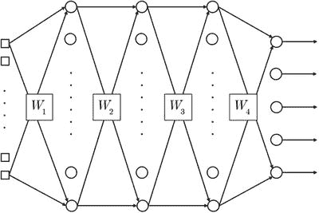

图 5-6。

具有三个隐藏层的深度神经网络

### ReLU 函数

本节通过示例介绍了 `ReLU` 函数。函数 `DeepReLU` 使用反向传播算法训练给定的深度神经网络。它接受网络的权重和训练数据，并返回训练后的权重。

```py
[W1, W2, W3, W4] = DeepReLU(W1, W2, W3, W4, X, D)
```

其中 `W1`、`W2`、`W3` 和 `W4` 分别是 `input-hidden1`、`hidden1-hidden2`、`hidden2-hidden3` 和 `hidden3-output` 层的权重矩阵。`X` 和 `D` 是训练数据的输入和正确输出矩阵。以下列表显示了实现 `DeepReLU` 函数的 `DeepReLU.m` 文件。

```py
function [W1, W2, W3, W4] = DeepReLU(W1, W2, W3, W4, X, D)
alpha = 0.01;
N = 5;
for k = 1:N
x  = reshape(X(:, :, k), 25, 1);
v1 = W1*x;
y1 = ReLU(v1);
v2 = W2*y1;
y2 = ReLU(v2);
v3 = W3*y2;
y3 = ReLU(v3);
v  = W4*y3;
y  = Softmax(v);
d     = D(k, :)';
e     = d - y;
delta = e;
e3     = W4'*delta;
delta3 = (v3 > 0).*e3;
e2     = W3'*delta3;
delta2 = (v2 > 0).*e2;
e1     = W2'*delta2;
delta1 = (v1 > 0).*e1;
dW4 = alpha*delta*y3';
W4  = W4 + dW4;
dW3 = alpha*delta3*y2';
W3  = W3 + dW3;
dW2 = alpha*delta2*y1';
W2  = W2 + dW2;
dW1 = alpha*delta1*x';
W1  = W1 + dW1;
end
end
```

此代码导入训练数据，使用 delta 规则计算权重更新（`dW1`、`dW2`、`dW3`和`dW4`），并调整神经网络的权重。到目前为止，这个过程与之前的训练代码相同。它只不同之处在于隐藏节点使用的是函数`ReLU`，而不是 sigmoid。当然，使用不同的激活函数也会导致其导数的变化。

现在，让我们看看函数`DeepReLU`调用的函数`ReLU`。这里展示的`ReLU`函数列表是在`ReLU.m`文件中实现的。由于这只是一个定义，所以省略了进一步的讨论。

```py
function y = ReLU(x)
y = max(0, x);
end
```

考虑到反向传播算法部分，它使用反向传播算法调整权重。以下列表展示了从`DeepReLU.m`文件中提取的 delta 计算部分。这个过程从输出节点的 delta 开始，计算隐藏节点的误差，并用于下一个误差。它通过`delta3`、`delta2`和`delta1`重复相同的步骤。

```py
...
e     = d - y;
delta = e;
e3     = W4'*delta;
delta3 = (v3 > 0).*e3;
e2     = W3'*delta3;
delta2 = (v2 > 0).*e2;
e1     = W2'*delta2;
delta1 = (v1 > 0).*e1;
...
```

从代码中可以注意到函数`ReLU`的导数。例如，在计算第三隐藏层`delta3`的 delta 时，ReLU 函数的导数被编码如下：

```py
(v3 > 0)
```

让我们看看这一行是如何成为 ReLU 函数的导数的。MATLAB 在括号内的表达式为`true`时返回 1，为`false`时返回 0。因此，这一行变为`v3 > 0 时为 1`，否则为`0`。这与这里展示的 ReLU 函数导数的定义产生相同的结果：

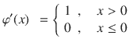

以下列表展示了`TestDeepReLU.m`文件，该文件测试了`DeepReLU`函数。这个程序调用`DeepReLU`函数并训练网络 10,000 次。它将训练数据输入到训练好的网络中并显示输出。我们通过比较输出和正确输出来验证训练的充分性。

```py
clear all
X  = zeros(5, 5, 5);
X(:, :, 1) = [ 0 1 1 0 0;
0 0 1 0 0;
0 0 1 0 0;
0 0 1 0 0;
0 1 1 1 0
];
X(:, :, 2) = [ 1 1 1 1 0;
0 0 0 0 1;
0 1 1 1 0;
1 0 0 0 0;
1 1 1 1 1
];
X(:, :, 3) = [ 1 1 1 1 0;
0 0 0 0 1;
0 1 1 1 0;
0 0 0 0 1;
1 1 1 1 0
];
X(:, :, 4) = [ 0 0 0 1 0;
0 0 1 1 0;
0 1 0 1 0;
1 1 1 1 1;
0 0 0 1 0
];
X(:, :, 5) = [ 1 1 1 1 1;
1 0 0 0 0;
1 1 1 1 0;
0 0 0 0 1;
1 1 1 1 0
];
D = [ 1 0 0 0 0;
0 1 0 0 0;
0 0 1 0 0;
0 0 0 1 0;
0 0 0 0 1
];
W1 = 2*rand(20, 25) - 1;
W2 = 2*rand(20, 20) - 1;
W3 = 2*rand(20, 20) - 1;
W4 = 2*rand( 5, 20) - 1;
for epoch = 1:10000           % train
[W1, W2, W3, W4] = DeepReLU(W1, W2, W3, W4, X, D);
end
N = 5;                        % inference
for k = 1:N
x  = reshape(X(:, :, k), 25, 1);
v1 = W1*x;
y1 = ReLU(v1);
v2 = W2*y1;
y2 = ReLU(v2);
v3 = W3*y2;
y3 = ReLU(v3);
v  = W4*y3;
y  = Softmax(v)
end
```

由于此代码几乎与之前的测试程序相同，所以省略了详细说明。此代码偶尔无法正确训练并产生错误输出，而 sigmoid 激活函数从未出现过这种情况。`ReLU`函数对初始权重值的敏感性似乎导致了这种异常。

### Dropout

本节展示了实现 dropout 的代码。我们为隐藏节点使用 sigmoid 激活函数。此代码主要用于查看 dropout 是如何编码的，因为训练数据可能过于简单，以至于我们无法感知过度拟合的实际改进。

函数`DeepDropout`使用反向传播算法训练示例神经网络。它接受神经网络的权重和训练数据，并返回训练后的权重。

```py
[W1, W2, W3, W4] = DeepDropout(W1, W2, W3, W4, X, D)
```

变量的表示法与上一节中函数 `DeepReLU` 的表示法相同。以下列表显示了 `DeepDropout.m` 文件，该文件实现了 `DeepDropout` 函数。

```py
function [W1, W2, W3, W4] = DeepDropout(W1, W2, W3, W4, X, D)
alpha = 0.01;
N = 5;
for k = 1:N
x  = reshape(X(:, :, k), 25, 1);
v1 = W1*x;
y1 = Sigmoid(v1);
y1 = y1 .* Dropout(y1, 0.2);
v2 = W2*y1;
y2 = Sigmoid(v2);
y2 = y2 .* Dropout(y2, 0.2);
v3 = W3*y2;
y3 = Sigmoid(v3);
y3 = y3 .* Dropout(y3, 0.2);
v  = W4*y3;
y  = Softmax(v);
d     = D(k, :)';
e     = d - y;
delta = e;
e3     = W4'*delta;
delta3 = y3.*(1-y3).*e3;
e2     = W3'*delta3;
delta2 = y2.*(1-y2).*e2;
e1     = W2'*delta2;
delta1 = y1.*(1-y1).*e1;
dW4 = alpha*delta*y3';
W4  = W4 + dW4;
dW3 = alpha*delta3*y2';
W3  = W3 + dW3;
dW2 = alpha*delta2*y1';
W2  = W2 + dW2;
dW1 = alpha*delta1*x';
W1  = W1 + dW1;
end
end
```

此代码导入训练数据，使用 delta 规则计算权重更新（`dW1`、`dW2`、`dW3` 和 `dW4`），并调整神经网络的权重。这个过程与之前的训练代码相同。它不同于之前的代码之处在于，一旦从隐藏节点的 Sigmoid 激活函数计算出输出，`Dropout` 函数就会修改节点的最终输出。例如，第一隐藏层的输出计算如下：

```py
y1 = Sigmoid(v1);
y1 = y1 .* Dropout(y1, 0.2);
```

执行这些行将第一个隐藏节点的输出从 20% 切换到 0；它丢弃了第一个隐藏节点的 20%。

下面是函数 `Dropout` 的实现细节。它接受输出向量和丢弃率，并返回将乘以输出向量的新向量。

```py
ym = Dropout(y, ratio)
```

其中 `y` 是输出向量，`ratio` 是输出向量的丢弃率。函数 `Dropout` 的返回向量 `ym` 与 `y` 具有相同的维度。`ym` 包含与 `ratio` 相同数量的零，其余元素为 。考虑以下示例：

```py
y1 = rand(6, 1)
ym = Dropout(y1, 0.5)
y1 = y1 .* ym
```

函数 `Dropout` 实现了丢弃。执行此代码将显示图 5-7 中所示的结果。

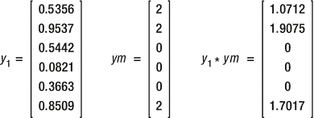

图 5-7。

Dropout 函数的实际应用

向量 `ym` 有三个元素：向量 `y1` 的六个元素的一半（0.5），用零填充，其余的用 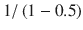 填充，等于 `2`。当这个 `ym` 乘以原始向量 `y1` 时，修改后的 `y1` 按指定比例有零。换句话说，`y1` 丢弃了指定部分元素。

我们将其他元素乘以  的原因是补偿由于丢弃元素而导致的输出损失。在先前的例子中，一旦向量 `y1` 的一半被丢弃，该层的输出幅度显著减小。因此，存活节点的输出通过适当的比例放大。

函数 `Dropout` 在 `Dropout.m 文件` 中实现：

```py
function ym = Dropout(y, ratio)
[m, n] = size(y);
ym     = zeros(m, n);
num     = round(m*n*(1-ratio));
idx     = randperm(m*n, num);
ym(idx) = 1 / (1-ratio);
end
```

解释虽然长，但代码本身非常简单。代码准备了一个与 `y` 维度相同的零矩阵 `ym`。它根据给定的丢弃率 `ratio` 计算生存者数量 `num`，并从 `ym` 中随机选择生存者。具体来说，它选择 `ym` 元素的索引。这是通过代码中的 `randperm` 部分完成的。现在代码已经拥有了非零元素的索引，将这些元素中的 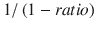 放入。其他元素已经填充为零，因为从开始 `ym` 向量就是一个零矩阵。

以下列表展示了测试 `DeepDropout` 函数的 `TestDeepDropout.m` 文件。该程序调用 `DeepDropout` 并训练神经网络 20,000 次。它将训练数据输入到训练好的网络中，并显示输出。我们通过比较输出和正确输出来验证训练的充分性。

```py
clear all
X  = zeros(5, 5, 5);
X(:, :, 1) = [ 0 1 1 0 0;
0 0 1 0 0;
0 0 1 0 0;
0 0 1 0 0;
0 1 1 1 0
];
X(:, :, 2) = [ 1 1 1 1 0;
0 0 0 0 1;
0 1 1 1 0;
1 0 0 0 0;
1 1 1 1 1
];
X(:, :, 3) = [ 1 1 1 1 0;
0 0 0 0 1;
0 1 1 1 0;
0 0 0 0 1;
1 1 1 1 0
];
X(:, :, 4) = [ 0 0 0 1 0;
0 0 1 1 0;
0 1 0 1 0;
1 1 1 1 1;
0 0 0 1 0
];
X(:, :, 5) = [ 1 1 1 1 1;
1 0 0 0 0;
1 1 1 1 0;
0 0 0 0 1;
1 1 1 1 0
];
D = [ 1 0 0 0 0;
0 1 0 0 0;
0 0 1 0 0;
0 0 0 1 0;
0 0 0 0 1
];
W1 = 2*rand(20, 25) - 1;
W2 = 2*rand(20, 20) - 1;
W3 = 2*rand(20, 20) - 1;
W4 = 2*rand( 5, 20) - 1;
for epoch = 1:20000           % train
[W1, W2, W3, W4] = DeepDropout(W1, W2, W3, W4, X, D);
end
N = 5;                        % inference
for k = 1:N
x  = reshape(X(:, :, k), 25, 1);
v1 = W1*x;
y1 = Sigmoid(v1);
v2 = W2*y1;
y2 = Sigmoid(v2);
v3 = W3*y2;
y3 = Sigmoid(v3);
v  = W4*y3;
y  = Softmax(v)
end
```

这段代码几乎与其它测试代码相同。唯一的区别在于，它在计算训练网络的输出时调用了 `DeepDropout` 函数。进一步的解释被省略。

## 摘要

本章涵盖了以下主题：

+   深度学习可以简单地定义为一种采用深度神经网络的机器学习技术。

+   之前的神经网络存在一个问题，即越深（更多）的隐藏层越难训练，并且会降低性能。深度学习解决了这个问题。

+   深度学习的杰出成就并非由关键技术所创造，而是由于许多小的改进。

+   深度神经网络性能不佳是由于训练不当造成的。有三个主要障碍：梯度消失、过拟合和计算负担。

+   通过采用 `ReLU` 激活函数和由交叉熵驱动的学习规则，大大改善了梯度消失问题。使用高级梯度下降法也有益。

+   深度神经网络更容易过拟合。深度学习通过丢弃法或正则化来解决此问题。

+   由于计算量大，需要显著的训练时间。这在很大程度上得到了 GPU 和各种算法的缓解。

脚注 1

如第二章所述，单层神经网络只能解决线性可分问题。

2

它之所以得名，是因为其行为类似于整流器，这是一种将交流电转换为直流电的电气元件，它在切断负电压时起作用。

3

`sebastianruder.com/optimizing-gradient-descent/`
