# 6. 卷积神经网络

第五章说明了不完整训练是深度神经网络性能不佳的原因，并介绍了深度学习如何解决这个问题。深度神经网络的重要性在于它打开了复杂非线性模型和知识分层处理系统方法的门。

本章介绍了卷积神经网络（ConvNet），这是一种专门用于图像识别的深度神经网络。这项技术展示了深度层在信息（图像）处理中的显著改进。实际上，ConvNet 是一种老技术，它在 20 世纪 80 年代和 90 年代开发出来。¹然而，由于它在处理复杂图像的实际应用中不切实际，它一度被遗忘。自 2012 年它被戏剧性地复兴²以来，ConvNet 已经征服了大多数计算机视觉领域，并且正在快速发展。

## ConvNet 架构

ConvNet 不仅仅是一个具有许多隐藏层的深度神经网络。它是一个深度网络，模仿大脑视觉皮层处理和识别图像的方式。因此，即使是神经网络专家在第一次接触时也往往难以理解这一概念。这就是 ConvNet 在概念和操作上与之前的神经网络有多么不同。本节简要介绍了 ConvNet 的基本架构。

基本上，图像识别是分类。例如，识别图片中的图像是猫还是狗，等同于将图像分类为猫或狗类别。同样适用于字母识别；从图像中识别字母等同于将图像分类为字母类别之一。因此，ConvNet 的输出层通常采用多类分类神经网络。

然而，直接使用原始图像进行图像识别会导致结果不佳，无论采用何种识别方法；图像应该经过处理以突出特征。第四章中的例子使用了原始图像，并且效果良好，因为它们是简单的黑白图像。否则，识别过程将导致非常差的结果。因此，已经开发了各种图像特征提取技术。³

在 ConvNet 之前，特征提取器是由特定领域的专家设计的。因此，它需要大量的成本和时间，而其性能水平却不一致。这些特征提取器与机器学习无关。图 6-1 展示了这一过程。

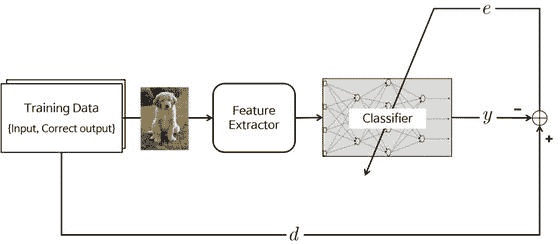

图 6-1。

特征提取器曾经独立于机器学习

卷积神经网络在训练过程中包含特征提取器而不是手动设计。卷积神经网络的特征提取器由特殊类型的神经网络组成，其权重通过训练过程确定。卷积神经网络将手动特征提取设计转化为自动化过程是其主要特征和优势。图 6-2 展示了卷积神经网络的训练概念。

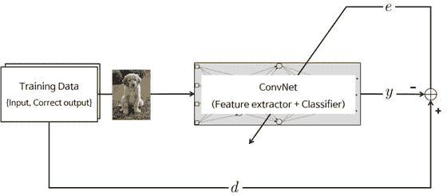

图 6-2.

卷积神经网络的特征提取器由特殊类型的神经网络组成

当卷积神经网络的特征提取神经网络更深（包含更多层）时，卷积神经网络在图像识别方面表现更好，但这以训练过程中的困难为代价，这使得卷积神经网络一度变得不实用并被遗忘。

让我们进一步探讨。卷积神经网络由一个提取输入图像特征的神经网络和另一个对特征图像进行分类的神经网络组成。图 6-3 展示了卷积神经网络的典型架构。

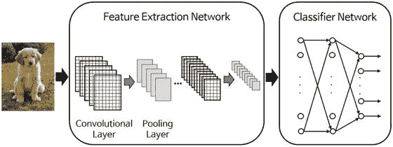

图 6-3.

卷积神经网络的典型架构

输入图像进入特征提取网络。提取的特征信号进入分类神经网络。然后，分类神经网络根据图像的特征进行操作并生成输出。第四章中讨论的分类技术在这里适用。

特征提取神经网络由一系列的卷积层和池化层对组成。卷积层，正如其名所示，通过卷积操作转换图像。它可以被视为一系列数字滤波器的集合。池化层将相邻的像素合并成一个像素。因此，池化层减少了图像的维度。由于卷积神经网络的主要关注点是图像；卷积和池化层的操作在概念上是在一个二维平面上进行的。这是卷积神经网络与其他神经网络之间的一个区别。

总结来说，卷积神经网络由特征提取网络和分类网络的串联连接组成。通过训练过程，这两层的权重都被确定。特征提取层由一系列的卷积和池化层对组成。卷积层通过卷积操作转换图像，池化层减少图像的维度。分类网络通常采用普通的多元分类神经网络。

## 卷积层

本节解释了特征提取神经网络的一侧——卷积层是如何工作的。这对的另一侧——池化层将在下一节中介绍。

卷积层生成新的图像，称为特征图。特征图强调原始图像的独特特征。与其它神经网络层相比，卷积层的工作方式非常不同。这一层不使用连接权重和加权求和。⁴ 相反，它包含将图像转换的滤波器。我们将这些滤波器称为卷积滤波器。通过卷积滤波器输入图像的过程产生特征图。

图 6-4 显示了卷积层的过程，其中圆形的`*`标记表示卷积操作，φ标记是激活函数。这些操作符之间的方形灰度图标表示卷积滤波器。卷积层生成的特征图数量与卷积滤波器的数量相同。因此，例如，如果卷积层包含四个滤波器，它将生成四个特征图。

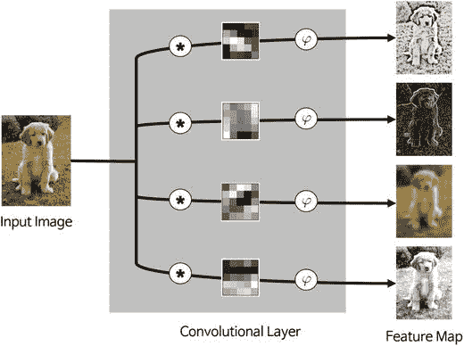

图 6-4.

卷积层过程

让我们进一步探讨卷积滤波器的细节。卷积层的滤波器是二维矩阵。它们通常是  或 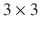 矩阵，甚至在最近的应用中已经使用了 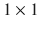 卷积滤波器。图 6-4 显示了 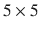 滤波器在灰度像素中的值。正如前一小节所述，滤波器矩阵的值是通过训练过程确定的。因此，这些值在整个训练过程中持续训练。这一方面与普通神经网络的连接权重更新过程相似。

卷积是一种在文本中很难解释的操作，因为它位于二维平面上。然而，其概念和计算步骤比看起来要简单。⁶ 一个简单的例子将帮助你理解它是如何工作的。考虑一个  像素图像，如图 6-5 所示，我们将通过这个图像的卷积滤波器操作生成一个特征图。

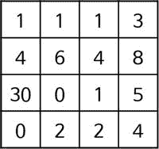

图 6-5.

四像素图像

我们使用这里显示的两个卷积滤波器。需要注意的是，实际卷积神经网络（ConvNet）的滤波器是通过训练过程确定的，而不是通过人工决策。

![$$ \left[\;\begin{array}{cc}\hfill 1\hfill & \hfill 0\hfill \\ {}\hfill 0\hfill & \hfill 1\hfill \end{array}\right],\kern1em \left[\;\begin{array}{cc}\hfill 0\hfill & \hfill 1\hfill \\ {}\hfill 1\hfill & \hfill 0\hfill \end{array}\;\right] $$](A448947_1_En_6_Chapter_Equa.gif)

让我们从第一个滤波器开始。卷积操作从与卷积滤波器大小相同的子矩阵的左上角开始（见图 6-6）。

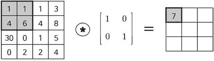

图 6-6。

卷积操作从左上角开始

卷积操作是两个矩阵相同位置上元素乘积的和。图 6-6 中 7 的结果计算如下：

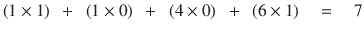

对下一个子矩阵进行另一次卷积操作（见图 6-7）。⁷

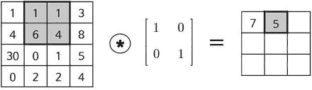

图 6-7。

第二次卷积操作

以同样的方式，进行第三次卷积操作，如图 6-8 所示。

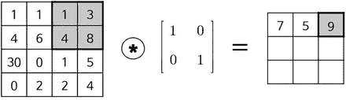

图 6-8。

第三次卷积操作

完成最上面一行后，下一行从左侧重新开始（见图 6-9）。

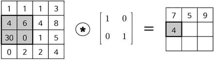

图 6-9。

卷积操作从左侧重新开始

它重复相同的操作，直到生成给定滤波器的特征图，如图 6-10 所示。

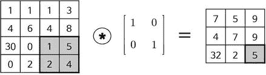

图 6-10。

给定滤波器的特征图已经完成

现在，让我们更仔细地看看特征图。图中 (3, 1) 的元素显示最大值。这个单元格发生了什么？这个值是图 6-11 中所示卷积操作的结果。

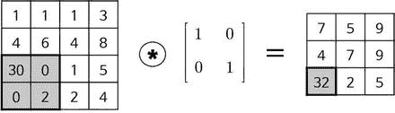

图 6-11。

图像的子矩阵与卷积滤波器匹配

从图中可以看出，图像的子矩阵与卷积滤波器匹配；它们都是对角矩阵，且显著数字位于相同的单元格中。当输入与滤波器匹配时，卷积操作产生大值，如图 6-12 所示。

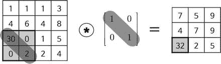

图 6-12。

当输入与滤波器匹配时，卷积操作产生大值

相比之下，在图 6-13 所示的情况下，同样的显著数字 30 并不影响卷积结果，结果仅为 4。这是因为图像矩阵与滤波器不匹配；图像矩阵的显著元素排列在错误的方向。

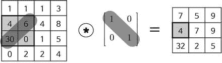

图 6-13。

当图像矩阵与滤波器不匹配时，显著元素没有对齐

以同样的方式，处理第二个卷积滤波器产生如图 6-14 所示的特征图。

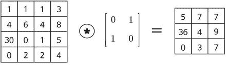

图 6-14.

这些值取决于图像矩阵是否与卷积滤波器匹配

与第一次卷积操作类似，这个特征图中的元素值取决于图像矩阵是否与卷积滤波器匹配。

总结来说，卷积层对输入图像应用卷积滤波器并生成特征图。在卷积层中提取的特征由训练好的卷积滤波器决定。因此，卷积层提取的特征取决于使用的卷积滤波器。

卷积滤波器创建的特征图在层输出之前通过激活函数进行处理。卷积层的激活函数与普通神经网络相同。尽管在最近的应用中大多数使用 `ReLU` 函数，但 sigmoid 函数和 tanh 函数也经常被使用。⁸

仅作参考，移动平均滤波器，在数字信号处理领域广泛使用，是一种特殊的卷积滤波器。如果你熟悉数字滤波器，将它们与这个概念联系起来可能会帮助你更好地理解卷积滤波器背后的思想。

## 池化层

池化层通过将图像的某个区域的相邻像素组合成一个单一的代表值来减小图像的大小。池化是许多其他图像处理方案中已经采用的典型技术。

为了在池化层中进行操作，我们需要确定如何从图像中选择池化像素以及如何设置代表值。相邻像素通常从正方形矩阵中选择，组合的像素数量因问题而异。代表值通常设置为所选像素的平均值或最大值。

池化层的操作非常简单。由于它是一个二维操作，文字解释可能会导致更多的混淆，让我们通过一个例子来解释。考虑一个 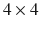 像素输入图像，它由图 6-15 中所示的矩阵表示。

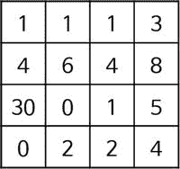

图 6-15.

四乘四像素输入图像

我们将输入图像的像素组合成一个 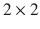 矩阵，元素之间没有重叠。一旦输入图像通过池化层，它就会缩小成一个  像素图像。图 6-16 展示了使用均值池化和最大池化的池化结果。

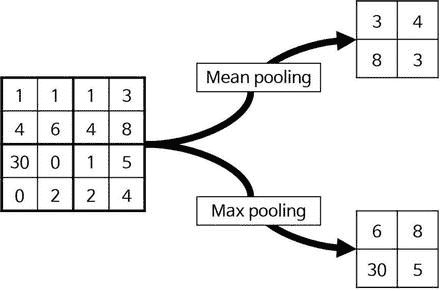

图 6-16.

使用两种不同方法进行池化的结果案例

实际上，从数学的角度来看，池化过程是一种卷积操作。与卷积层不同的是，卷积滤波器是静止的，卷积区域不重叠。下一节提供的示例将详细阐述这一点。

池化层在一定程度上补偿了偏心和倾斜的对象。例如，池化层可以提高对可能位于输入图像中心偏移的猫的识别。此外，由于池化过程减小了图像大小，它对于减轻计算负担和防止过拟合非常有好处。

## 示例：MNIST

我们实现了一个神经网络，它接受输入图像并识别它所代表的数字。训练数据是 MNIST⁹ 数据库，其中包含 70,000 张手写数字图像。一般来说，60,000 张图像用于训练，剩余的 10,000 张图像用于验证测试。每个数字图像是一个 28-by-28 像素的黑白图像，如图 6-17 所示。

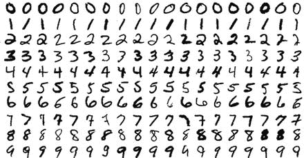

图 6-17.

MNIST 数据库中的一个 28-by-28 像素的黑白图像

考虑到训练时间，本例仅使用 10,000 张图像作为训练数据和验证数据，比例为 8:2。因此，我们有 8,000 张 MNIST 图像用于训练，2,000 张图像用于验证神经网络性能。正如您现在可能非常清楚的那样，MNIST 问题是由将 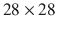 像素图像多类分类为 0-9 十个数字类别之一引起的。

让我们考虑一个识别 MNIST 图像的 ConvNet。由于输入是一个  像素的黑白图像，我们允许 784(=28x28) 个输入节点。特征提取网络包含一个具有 20 个  卷积滤波器的单个卷积层。卷积层的输出通过 `ReLU` 函数，然后通过池化层。池化层采用 2x2 子矩阵的平均池化过程。分类神经网络由单个隐藏层和输出层组成。这个隐藏层有 100 个节点，使用 ReLU 激活函数。由于我们有 10 个类别要分类，输出层由 10 个节点构成。我们为输出节点使用 softmax 激活函数。以下表格总结了示例神经网络。

| 层 | 备注 | 激活函数 |
| --- | --- | --- |
| 输入 |  个节点 | - |
| 卷积 | 20 个卷积滤波器 (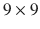) | `ReLU` |
| 池化 | 1 个平均池化 () | - |
| 隐藏 | 100 个节点 | `ReLU` |
| 输出 | 10 个节点 | `Softmax` |

图 6-18 展示了这个神经网络的架构。尽管它有很多层，但只有其中的三层包含需要训练的权重矩阵；它们是方形块中的 W [1]、W [5] 和 W [o]。W [5] 和 W [o] 包含分类神经网络的连接权重，而 W [1] 是卷积层的权重，它被卷积滤波器用于图像处理。

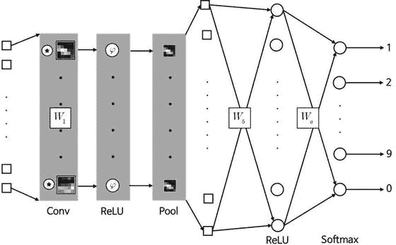

图 6-18。

这个神经网络的架构

池化层和隐藏层之间的输入节点，即 W [5] 块左侧的方形节点，是将二维图像转换为向量的变换。由于这一层不涉及任何操作，这些节点被标记为方形。

使用反向传播算法训练网络的函数 `MnistConv`，接收神经网络的权重和训练数据，并返回训练后的权重。

```py
[W1, W5, Wo] = MnistConv(W1, W5, Wo, X, D)
```

其中 `W1`, `W5`, 和 `Wo` 分别是卷积滤波器矩阵、池化-隐藏层权重矩阵和隐藏-输出层权重矩阵。`X` 和 `D` 分别是训练数据的输入和正确输出。以下列表展示了 `MnistConv.m` 文件，它实现了 `MnistConv` 函数。

```py
function [W1, W5, Wo] = MnistConv(W1, W5, Wo, X, D)
%
%
alpha = 0.01;
beta  = 0.95;
momentum1 = zeros(size(W1));
momentum5 = zeros(size(W5));
momentumo = zeros(size(Wo));
N = length(D);
bsize = 100;
blist = 1:bsize:(N-bsize+1);
% One epoch loop
%
for batch = 1:length(blist)
dW1 = zeros(size(W1));
dW5 = zeros(size(W5));
dWo = zeros(size(Wo));
% Mini-batch loop
%
begin = blist(batch);
for k = begin:begin+bsize-1
% Forward pass = inference
%
x  = X(:, :, k);                 % Input,           28x28
y1 = Conv(x, W1);                % Convolution,  20x20x20
y2 = ReLU(y1);                   %
y3 = Pool(y2);                   % Pool,         10x10x20
y4 = reshape(y3, [], 1);         %                   2000
v5 = W5*y4;                      % ReLU,              360
y5 = ReLU(v5);                   %
v  = Wo*y5;                      % Softmax,            10
y  = Softmax(v);                 %
% One-hot encoding
%
d = zeros(10, 1);
d(sub2ind(size(d), D(k), 1)) = 1;
% Backpropagation
%
e      = d - y;                   % Output layer
delta  = e;
e5     = Wo' * delta;             % Hidden(ReLU) layer
delta5 = (y5 > 0) .* e5;
e4     = W5' * delta5;            % Pooling layer
e3     = reshape(e4, size(y3));
e2 = zeros(size(y2));
W3 = ones(size(y2)) / (2*2);
for c = 1:20
e2(:, :, c) = kron(e3(:, :, c), ones([2 2])) .* W3(:, :, c);
end
delta2 = (y2 > 0) .* e2;          % ReLU layer
delta1_x = zeros(size(W1));       % Convolutional layer
for c = 1:20
delta1_x(:, :, c) = conv2(x(:, :), rot90(delta2(:, :, c), 2), 'valid');
end
dW1 = dW1 + delta1_x;
dW5 = dW5 + delta5*y4';
dWo = dWo + delta *y5';
end
% Update weights
%
dW1 = dW1 / bsize;
dW5 = dW5 / bsize;
dWo = dWo / bsize;
momentum1 = alpha*dW1 + beta*momentum1;
W1        = W1 + momentum1;
momentum5 = alpha*dW5 + beta*momentum5;
W5        = W5 + momentum5;
momentumo = alpha*dWo + beta*momentumo;
Wo        = Wo + momentumo;
end
end
```

这段代码似乎比之前的例子复杂得多。让我们逐部分来看它。函数 `MnistConv` 通过 `minibatch` 方法训练网络，而之前的例子使用了 SGD 和 `batch` 方法。以下列表展示了代码中的 `minibatch` 部分：

```py
bsize = 100;
blist = 1:bsize:(N-bsize+1);
for batch = 1:length(blist)
...
begin = blist(batch);
for k = begin:begin+bsize-1
...
dW1 = dW1 + delta2_x;
dW5 = dW5 + delta5*y4';
dWo = dWo + delta *y5';
end
dW1 = dW1 / bsize;
dW5 = dW5 / bsize;
dWo = dWo / bsize;
...
end
```

批次数量 `bsize` 被设置为 100。由于我们有总共 8,000 个训练数据点，每个 epoch 中权重调整 80 次（=8,000/100）。变量 `blist` 包含第一个要放入小批量的训练数据点的位置。从这个位置开始，代码将引入 100 个数据点，形成小批量的训练数据。在这个例子中，变量 `blist` 存储以下值：

```py
blist = [ 1, 101, 201, 301, ..., 7801, 7901 ]
```

通过 `blist` 找到小批量 `begin` 的起始点后，每 100 个数据点计算一次权重更新。将 100 次权重更新求和并平均，然后调整权重。重复此过程 80 次完成一个 epoch。

函数 `MnistConv` 的另一个显著特点是它使用动量来调整权重。这里使用了变量 `momentum1`, `momentum5`, 和 `momentumo`。以下代码部分实现了动量更新：

```py
...
momentum1 = alpha*dW1 + beta*momentum1;
W1        = W1 + momentum1;
momentum5 = alpha*dW5 + beta*momentum5;
W5        = W5 + momentum5;
momentumo = alpha*dWo + beta*momentumo;
Wo        = Wo + momentumo;
...
```

我们现在已经捕捉到了代码的大致轮廓。现在，让我们看看学习规则，这是代码中最重要的一部分。这个过程本身并不与之前的不同，因为 ConvNet 也使用反向传播训练。首先必须获得的是网络的输出。以下列表展示了函数`MnistConv`的输出计算部分。可以从神经网络的架构中直观地理解它。此代码中的变量`y`是网络的最终输出。

```py
...
x  = X(:, :, k);                   % Input,           28x28
y1 = Conv(x, W1);                  % Convolution,  20x20x20
y2 = ReLU(y1);                     %
y3 = Pool(y2);                     % Pool,         10x10x20
y4 = reshape(y3, [], 1);           %                   2000
v5 = W5*y4;                        % ReLU,              360
y5 = ReLU(v5);                     %
v  = Wo*y5;                        % Softmax,            10
y  = Softmax(v);                   %
...
```

现在我们已经得到了输出，可以计算错误。由于网络有 10 个输出节点，正确的输出应该是一个向量，以便计算错误。然而，MNIST 数据将正确的输出作为相应的数字给出。例如，如果输入图像指示一个`4`，则正确的输出将是`4`。以下列表将数值正确的输出转换为向量。进一步的解释被省略。

```py
d = zeros(10, 1);
d(sub2ind(size(d), D(k), 1)) = 1;
```

过程的最后部分是错误的反向传播。以下列表展示了从输出层到后续层再到池化层的反向传播过程。由于本例使用交叉熵和 softmax 函数，输出节点的 delta 与网络输出错误相同。下一隐藏层使用`ReLU`激活函数。这里没有什么特别之处。隐藏层和池化层之间的连接层只是信号的重新排列。

```py
...
e      = d - y;
delta  = e;
e5     = Wo' * delta;
delta5 = e5 .* (y5> 0);
e4     = W5' * delta5;
e3     = reshape(e4, size(y3));
...
```

我们还有两层要完成：池化层和卷积层。以下列表展示了通过池化层-ReLU-卷积层的反向传播过程。这部分内容的解释超出了本书的范围。未来需要时，请参考代码。

```py
...
e2 = zeros(size(y2));           % Pooling
W3 = ones(size(y2)) / (2*2);
for c = 1:20
e2(:, :, c) = kron(e3(:, :, c), ones([2 2])) .* W3(:, :, c);
end
delta2 = (y2 > 0) .* e2;
delta1_x = zeros(size(W1));
for c = 1:20
delta1_x(:, :, c) = conv2(x(:, :), rot90(delta2(:, :, c), 2), 'valid');
end
...
```

以下列表展示了函数`Conv`，这是函数`MnistConv`调用的。该函数接收输入图像和卷积滤波矩阵，并返回特征图。此代码位于`Conv.m`文件中。

```py
function y = Conv(x, W)
%
%
[wrow, wcol, numFilters] = size(W);
[xrow, xcol, ∼         ] = size(x);
yrow = xrow - wrow + 1;
ycol = xcol - wcol + 1;
y = zeros(yrow, ycol, numFilters);
for k = 1:numFilters
filter = W(:, :, k);
filter = rot90(squeeze(filter), 2);
y(:, :, k) = conv2(x, filter, 'valid');
end
end
```

此代码使用 MATLAB 内置的二维卷积函数`conv2`执行卷积操作。关于函数`Conv`的更多细节被省略，因为它们超出了本书的范围。

函数`MnistConv`还调用了以下列表中实现的函数`Pool`。该函数接收特征图，并在`2\times 2`平均池化过程之后返回图像。此函数位于`Pool.m`文件中。

```py
function y = Pool(x)
%
% 2x2 mean pooling
%
[xrow, xcol, numFilters] = size(x);
y = zeros(xrow/2, xcol/2, numFilters);
for k = 1:numFilters
filter = ones(2) / (2*2);    % for mean
image  = conv2(x(:, :, k), filter, 'valid');
y(:, :, k) = image(1:2:end, 1:2:end);
end
end
```

这段代码有一些有趣的地方；它调用了二维卷积函数`conv2`，就像函数`Conv`一样。这是因为池化过程是一种卷积操作。本例中的平均池化是通过以下滤波器实现的卷积操作：

![\(W\kern0.62em =\kern0.62em \left[\kern0.22em \begin{array}{cc}\hfill {\scriptscriptstyle \frac{1}{4}}\hfill & \hfill {\scriptscriptstyle \frac{1}{4}}\hfill \\ {}\hfill {\scriptscriptstyle \frac{1}{4}}\hfill & \hfill {\scriptscriptstyle \frac{1}{4}}\hfill \end{array}\kern0.22em \right]\)](A448947_1_En_6_Chapter_Equc.gif)

池化层的过滤器是预定义的，而卷积层的过滤器是通过训练确定的。代码的更详细信息超出了本书的范围。

以下列出的是 `TestMnistConv.m` 文件，该文件测试了 `MnistConv` 函数。¹⁰ 此程序调用 `MnistConv` 函数并训练网络三次。它将 2,000 个测试数据点提供给训练好的网络，并显示其准确率。此示例的测试运行在 2 分钟 30 秒内达到了 93% 的准确率。请注意，此程序运行需要相当长的时间。

```py
clear all
Images = loadMNISTImages('./MNIST/t10k-images.idx3-ubyte');
Images = reshape(Images, 28, 28, []);
Labels = loadMNISTLabels('./MNIST/t10k-labels.idx1-ubyte');
Labels(Labels == 0) = 10;    % 0 --> 10
rng(1);
% Learning
%
W1 = 1e-2*randn([9 9 20]);
W5 = (2*rand(100, 2000) - 1) * sqrt(6) / sqrt(360 + 2000);
Wo = (2*rand( 10,  100) - 1) * sqrt(6) / sqrt( 10 +  100);
X = Images(:, :, 1:8000);
D = Labels(1:8000);
for epoch = 1:3
epoch
[W1, W5, Wo] = MnistConv(W1, W5, Wo, X, D);
end
save('MnistConv.mat');
% Test
%
X = Images(:, :, 8001:10000);
D = Labels(8001:10000);
acc = 0;
N   = length(D);
for k = 1:N
x = X(:, :, k);                   % Input,           28x28
y1 = Conv(x, W1);                 % Convolution,  20x20x20
y2 = ReLU(y1);                    %
y3 = Pool(y2);                    % Pool,         10x10x20
y4 = reshape(y3, [], 1);          %                   2000
v5 = W5*y4;                       % ReLU,              360
y5 = ReLU(v5);                    %
v  = Wo*y5;                       % Softmax,            10
y  = Softmax(v);                  %
[∼, i] = max(y);
if i == D(k)
acc = acc + 1;
end
end
acc = acc / N;
fprintf('Accuracy is %f\n', acc);
```

此程序与之前的程序也非常相似。关于相似部分的解释将被省略。以下列出的是一个新的条目。它比较了网络的输出和正确的输出，并计算匹配的案例。它将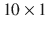向量输出转换回数字，以便可以与给定的正确输出进行比较。

```py
...
[∼, i] = max(y)
if i == D(k)
acc = acc + 1;
end
...
```

最后，让我们研究图像在通过卷积层和池化层时的处理方式。MNIST 图像的原始尺寸是。一旦图像经过卷积滤波器的处理，它就变成了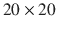特征图。¹¹由于我们有 20 个卷积滤波器，该层产生了 20 个特征图。通过平均池化过程，池化层将每个特征图缩小到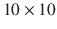图。该过程如图 6-19 所示。

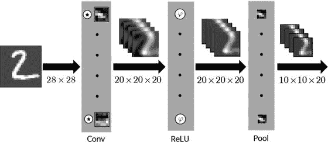

图 6-19.

图像在通过卷积和池化层时的处理方式

通过卷积和池化层后的最终结果是与卷积滤波器数量一样多的较小图像；ConvNet 将输入图像转换为多个小特征图。

现在，我们将看到图像在 ConvNet 的每一层实际上是如何演变的。通过执行 TestMnistConv.m 文件，然后是 `PlotFeatures.m` 文件，屏幕将显示五幅图像。以下列出的是 `PlotFeatures.m` 文件中的内容。

```py
clear all
load('MnistConv.mat')
k  = 2;
x  = X(:, :, k);                  % Input,           28x28
y1 = Conv(x, W1);                 % Convolution,  20x20x20
y2 = ReLU(y1);                    %
y3 = Pool(y2);                    % Pool,         10x10x20
y4 = reshape(y3, [], 1);          %                   2000
v5 = W5*y4;                       % ReLU,              360
y5 = ReLU(v5);                    %
v  = Wo*y5;                       % Softmax,            10
y  = Softmax(v);                  %
figure;
display_network(x(:));
title('Input Image')
convFilters = zeros(9*9, 20);
for i = 1:20
filter            = W1(:, :, i);
convFilters(:, i) = filter(:);
end
figure
display_network(convFilters);
title('Convolution Filters')
fList = zeros(20*20, 20);
for i = 1:20
feature     = y1(:, :, i);
fList(:, i) = feature(:);
end
figure
display_network(fList);
title('Features [Convolution]')
fList = zeros(20*20, 20);
for i = 1:20
feature     = y2(:, :, i);
fList(:, i) = feature(:);
end
figure
display_network(fList);
title('Features [Convolution + ReLU]')
fList = zeros(10*10, 20);
for i = 1:20
feature     = y3(:, :, i);
fList(:, i) = feature(:);
end
figure
display_network(fList);
title('Features [Convolution + ReLU + MeanPool]')
```

将测试数据的第二幅图像（k = 2）输入到神经网络中，并显示所有步骤的结果。屏幕上矩阵的显示是通过函数`display_` `network`完成的，该函数最初来自与`TestMnistConv.m`文件中的`loadMNISTImages`和`loadMNISTLabels`相同的资源。

屏幕上显示的第一幅图像是输入图像，如图 6-20 所示。

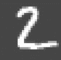

图 6-20。

屏幕上显示的第一幅图像

图 6-21 是屏幕上的第二幅图像，由 20 个训练好的卷积滤波器组成。每个滤波器是像素图像，并以灰度阴影显示元素值。值越大，阴影越亮。这些滤波器是 ConvNet 确定可以从 MNIST 图像中提取的最佳特征。你认为呢？你看到了数字的独特特征吗？

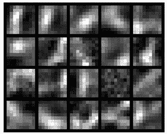

图 6-21。

展示 20 个训练好的卷积滤波器

图 6-22 是屏幕上的第三幅图像，提供了卷积层图像处理的结果（y1）。这个特征图由 20 个像素图像组成。从这张图中可以明显看出由于卷积滤波器引起的输入图像的各种变化。

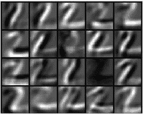

图 6-22。

卷积层图像处理的结果（y1）

图 6-23 中展示的第四个图像是 ReLU 函数对卷积层特征图的处理结果。前一个图像中的暗像素被移除，当前图像在字母上大部分是白色像素。当我们考虑 ReLU 函数的定义时，这是一个合理的结果。现在，再次看看图 6-22。值得注意的是，第三行第四列的图像包含一些亮像素。经过 ReLU 操作后，这个图像变得完全黑暗。实际上，这不是一个好的迹象，因为它未能捕捉到输入图像`2`的任何特征。它需要通过更多数据和更多训练来改进。然而，分类仍然有效，因为特征图的其它部分工作正常。

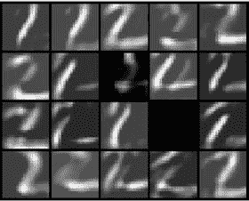

图 6-23。

展示 ReLU 函数对卷积层特征图处理的图像

图 6-24 展示了第五个结果，它提供了 ReLU 层产生的均值池化过程后的图像。每个图像继承了前一个图像在像素空间中的形状，这是前一个尺寸的一半。这显示了池化层可以减少多少所需资源。

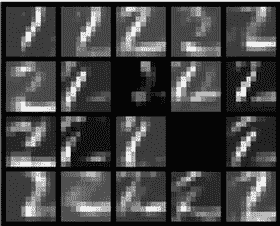

图 6-24.

均值池化过程后的图像

图 6-24 是特征提取神经网络最终的结果。这些图像被转换为一维向量并存储在分类神经网络中。

这完成了示例代码的解释。尽管示例中只使用了卷积和池化层的一对；但在大多数实际应用中通常使用很多。包含网络主要特征的较小图像越多，识别性能越好。

## 摘要

本章涵盖了以下概念：

+   为了提高机器学习的图像识别性能，应该提供强调独特特征的特征图，而不是原始图像。传统上，特征提取器是手动设计的。ConvNet 包含一种特殊的神经网络用于特征提取，其权重通过训练过程确定。

+   ConvNet 由特征提取器和分类神经网络组成。其深层层架构曾是一大障碍，使得训练过程变得困难。然而，自从深度学习作为解决这一问题的方法被引入以来，ConvNet 的使用已经迅速增长。

+   ConvNet 的特征提取器由交替堆叠的卷积层和池化层组成。由于 ConvNet 处理二维图像，其大多数操作都是在二维概念平面上进行的。

+   使用卷积滤波器，卷积层生成强调输入图像特征的图像。此层的输出图像数量与网络中包含的卷积滤波器数量相同。卷积滤波器实际上只是一个二维矩阵。

+   池化层减小了图像大小。它将相邻像素绑定并替换为代表性值。代表性值是像素的最大值或平均值。

脚注 1

LeCun, Y.，等人，“使用反向传播网络进行手写数字识别”，载《神经信息处理系统进展》，第 396–404 页（1990 年）。

2

Krizhevsky, Alex，“[使用深度卷积神经网络进行 ImageNet 分类，](http://www.image-net.org/challenges/LSVRC/2012/supervision.pdf)”2013 年 11 月 17 日。

3

典型的方法包括 SIFT、HoG、Textons、Spin image、RIFT 和 GLOH。

4

它通常从普通神经网络的局部感受野和共享权重角度进行解释。然而，这对初学者可能并不有帮助。本书并不坚持它与普通神经网络的关系，而是将其解释为一种数字滤波器。

5

也称为核。

6

`deeplearning.stanford.edu/wiki/images/6/6c/Convolution_schematic.gif`

7

设计者决定每个操作要跨越多少个元素。如果滤波器较大，这个值可以大于一。

8

有时根据问题，激活函数可以省略。

9

混合 [国家标准与技术研究院](https://en.wikipedia.org/wiki/National_Institute_of_Standards_and_Technology)

10

`loadMNISTImages` 和 `loadMNISTLabels` 函数来自 `github.com/amaas/stanford_dl_ex/tree/master/common`。

11

此尺寸仅适用于此特定示例。它取决于卷积滤波器的应用方式而变化。
