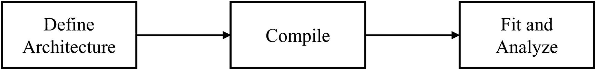
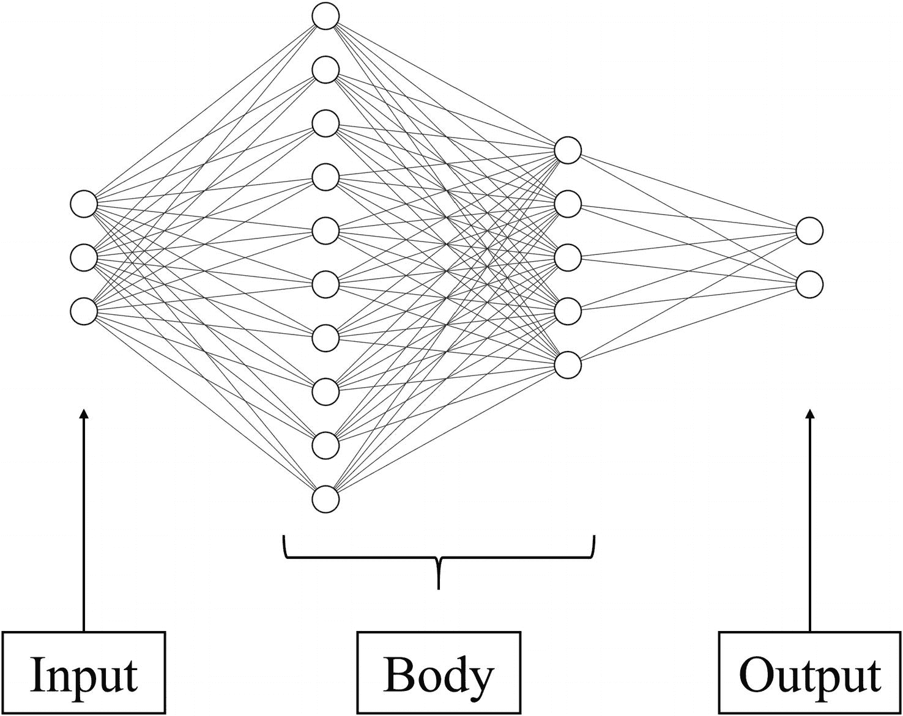
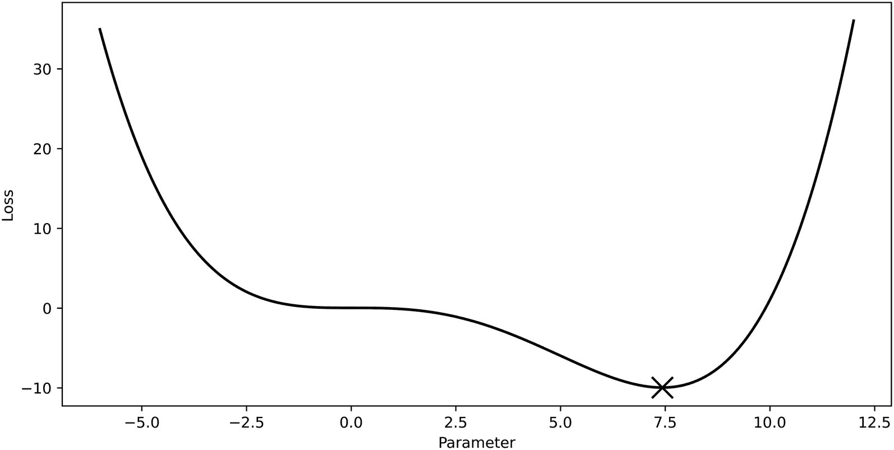
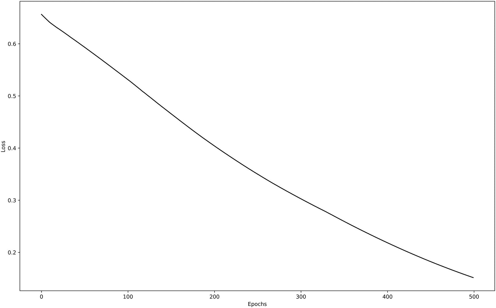
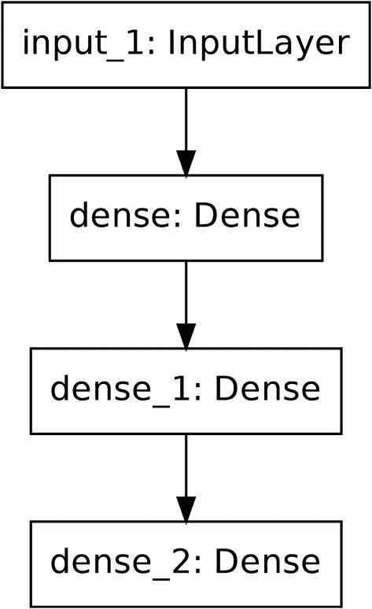
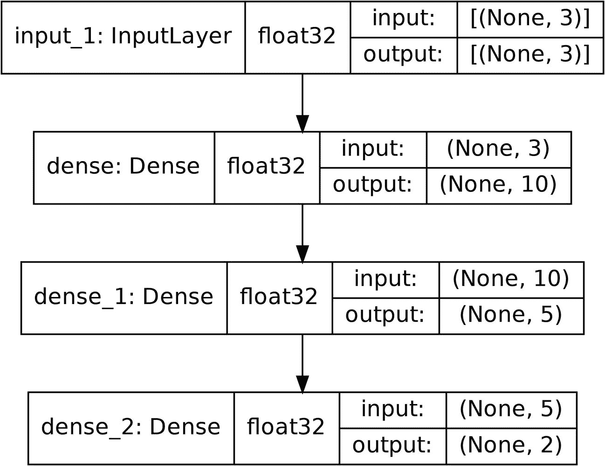
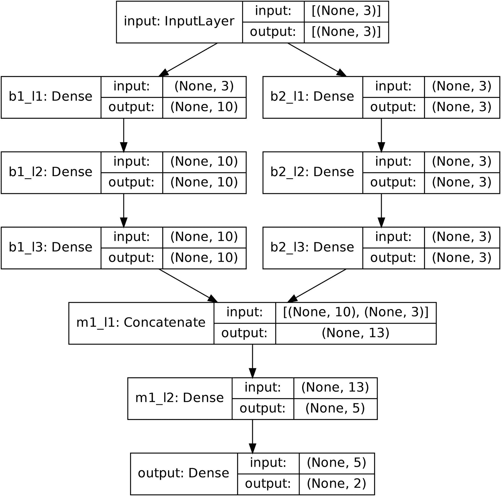

# 1. 深入探讨 Keras

> *想象力比知识更重要。因为知识是有限的，而想象力则包容整个世界。*
> 
> —阿尔伯特·爱因斯坦^(1)

本书的一个关键目标是探索深度学习的概念作为一种分析艺术——计算环境是你的画布，深度学习设计是你的画笔。对分析创造力和想象力的深刻理解对于本能和直观地理解深度学习至关重要。本书旨在为您提供这种理解。随着深度学习领域的不断变化，那些只将深度学习知识局限于今天工具的人，在引入新的语法和库时，会发现与深度学习工作的难度。然而，一种直觉的嬉戏感和智力自由以及好奇心，可以使我们更接近于与深度学习紧密、个人化和成功的工作，而不仅仅是依赖于任何特定的模型架构或框架。

当然，相互依存是一个崇高的理想；然而，针对爱因斯坦的著名引言，想象力和创造力必须建立在某些具体的知识体系之上才能存在。首先能够探索和理解深度学习的分析艺术，需要为实施搭建框架，就像为房屋奠定基础一样。从概念到代码的知识将使我们能够在后续章节中探索更抽象和复杂的深度学习理念。

本章将深入探讨 Keras，这是理解如何构建和实现我们将要开发的概念所选择的框架。本章涵盖的内容并不旨在替代易于访问的在线语法文档——Keras 和 TensorFlow API 文档是这些目的的最佳选择。相反，它旨在作为 Keras 关键构建块的快速介绍，以便构建我们稍后将要工作的更复杂结构，并作为概念参考指南，可能在以后有参考价值。除了涵盖 Keras 的语法——如大多数在线代码教程或 API 文档所做的那样——我们还将深入研究框架，以了解技巧、窍门和概念，确保 Keras 和思考过程的高效和精通使用。

## 为什么选择 Keras？

在希腊语中，Keras（κέρας）意为“角”，这指的是《奥德赛》。它最初是为项目 ONEIROS（开放式神经电子智能机器人操作系统）开发的，但后来在广泛的深度学习应用和环境中变得极为流行。

可用的深度学习框架有很多，但 Keras 在简洁性和多功能性方面尤为突出。Keras 将自己定位为“为人类设计的深度学习”，但其易用性不言而喻。Keras 的设计最大限度地减少了将想法与实现之间差距所需的时间和精力。

2019 年的一项调查询问了 Kaggle 竞赛中的高分团队他们使用了哪些机器学习框架，并发现 Keras 排名第一.^(2) Keras 的创造者弗朗西斯·肖莱特在 Quora 上的一篇帖子中关于为什么是这样写的想法：

> *开发良好的模型需要反复迭代你的初始想法，直到截止日期；你总是可以进一步改进你的模型…Keras 被设计成快速原型化许多不同模型的方式，重点是尽可能减少从有想法到实验结果所需的时间。*
> 
> —弗朗西斯·肖莱特^(3)

Keras 的开发速度和多功能性也使其成为 Netflix 和 Instacart 等公司、研究人员以及 CERN 和 NASA 等科学组织的流行选择。截至 2021 年初，Keras 已有超过 40 万用户.^(4)

这本书并非根本上是关于 Keras 的——它是一本关于现代深度学习设计的书。然而，正如讨论的那样，设计的一个基本组成部分是实施。Keras 将成为我们通过它来构建和实现所讨论想法的有价值的中介。有了 Keras，我们可以更自由地探索深度学习的可能性，而无需被繁琐且漫长的实施所束缚。

## 安装和导入 Keras

Keras 可以通过`pip`单独安装，命令为`pip install keras`，导入时使用`import keras`。这（以及所有未来的版本）可以直接在命令提示符界面中安装，或者在 Jupyter Notebook 中通过在命令前添加感叹号（!）来安装。然而，Keras 已成为 Google 的深度学习框架 TensorFlow 的一部分，它允许进行更底层的定制。自这次合并以来，Keras 用户可以同时利用 Keras 的用户友好性和 TensorFlow 的底层定制能力。

由于 TensorFlow 包含了 Keras，因此单独安装 Keras 是多余的。因此，通常只安装 TensorFlow，并从 TensorFlow 中导入 Keras（列表 1-1）。

```py
!pip install tensorflow       # only install TF
import tensorflow as tf       # import TF
from tensorflow import keras # import keras from TF
Listing 1-1
Installing and importing TensorFlow and Keras
```

如果你还没有工作空间，可以考虑以下步骤开始：

+   *Jupyter Notebook*：Jupyter Notebook 特别受数据科学者的欢迎，因为其基于单元格的输入输出结构允许快速实验和整洁的组织。通过 Anaconda 安装会自动安装重要的数据科学库。

+   *Kaggle*：Kaggle 是一个在线数据科学平台，提供竞赛、数据集、数据科学论坛和代码笔记本。Kaggle 笔记本支持 Jupyter Notebook 和 Python 或 R 脚本。尽管 Kaggle 无法处理高度计算或内存密集型操作，因为它基于网络，它提供了易于访问的 GPU 和 TPU。此外，Kaggle 允许你轻松地在自己的服务器上运行数小时的笔记本，这是设置虚拟机或其他计算工作流程的简单替代方案。截至 2021 年，Kaggle 通常将每周 GPU 使用量限制在 30 至 42 小时（每周变化），TPU 使用量限制在 30 小时。

+   *Google Colab*：Google Colab 也允许使用 GPU 和 TPU，这在技术上是无限制的，但当可用的计算资源无法处理需求且你已经消耗了相当长一段时间资源时，可能会被切断。Google Colab 适用于共享和进行快速的高性能计算实验。

## 简单的 Keras 工作流程

当使用 Keras 构建任何模型时，深度学习工作流程通常包括三个步骤：定义架构、编译和拟合及分析（图 1-1）。从最简单到最复杂的模型都遵循这个工作流程。在本节中，我们将详细回顾这个工作流程中的每个步骤。



图 1-1

神经网络的输入-体-输出模型

### 第 1 步：定义架构

神经网络架构有三个关键部分（图 1-2）。



图 1-2

神经网络的输入-体-输出模型

+   *输入*：这部分定义并接收神经网络将用于预测基础的输入数据格式。

+   *体*：这部分对输入进行一系列操作，将其转换为输出。体由神经网络的层组成。

+   *输出*：这部分定义了神经网络输出结果的数据格式。

注意

在本节中，我们将使用 Sequential Keras API 来说明 Keras 工作流程。Sequential 模型允许用户通过线性或顺序堆叠层来构建模型。它适用于更简单的架构，但对于更复杂的设计则需要后续讨论的 Functional API。

让我们考虑一个非常简单的数据集来定义神经网络的架构（表 1-1）。这个样本数据集包含三个二进制特征 – *A*、*B* 和 *C* – 以及两个二进制标签。标签 1 仅在任一特征为 1 时为 1，标签 2 仅在至少两个特征值为 1 时为 1。

表 1-1

具有三个特征和两个标签的样本虚拟数据集

| A | B | C | 标签 1 | 标签 2 |
| --- | --- | --- | --- | --- |
| 0 | 0 | 0 | 0 | 0 |
| 1 | 0 | 0 | 1 | 0 |
| 0 | 1 | 0 | 1 | 0 |
| 0 | 1 | 1 | 1 | 1 |
| 1 | 1 | 0 | 1 | 1 |
| 1 | 1 | 1 | 1 | 1 |

这个数据集有三个特征，这意味着输入是三维的。让我们首先导入 Keras、Sequential 模型和 Input 层；我们可以创建一个模型并定义输入（代码列表 1-2）。

```py
import keras
from keras.models import Sequential
from keras.layers import Input
model = Sequential() # initializes sequential model
model.add(Input((3,)))
Listing 1-2
Building the input component of a Sequential model
```

注意

如果模型需要处理图像，输入形状可能看起来像 `Input((128,128,3))`，这是一个 128x128 像素的彩色图像，其中每个像素包含三个值，对应于颜色。您图像形状的具体细节，例如`(3,)`和`(3,1)`之间的区别，取决于您如何处理数据。您始终可以使用`x_data[0].shape`来找到您数据的特定形状。您将在后续章节中看到更多此类示例，这些章节展示了基于图像的深度学习方法。

现在我们已经指定了输入的形状，我们可以开始添加层来形成神经网络的主体。这个简单的神经网络将只有`Dense`层，这些是常规的密集连接神经网络层（见 1-3）。通常，使用`Dense`层时提供两个参数——层的单元数（神经元、节点）和激活函数。

```py
from keras.layers import Dense
# layer with 10 nodes and ReLU activation
model.add(Dense(10, activation='relu'))
# layer with 5 nodes and ReLU activation
model.add(Dense(5, activation='relu'))
Listing 1-3
Building the body component of a Sequential model
```

注意

`Dense`层在激活函数的范围上有限。要使用高级激活函数，不要在标准密集连接层中提供激活函数（它将默认不应用），然后跟一个`Activation`类层，例如`model.add(keras.layers.LeakyReLU())`。

这两个层构成了神经网络的主体——它们执行学习关系的繁重工作，以理解输入和输出之间的映射。在这种情况下，数据相对简单，所以这个小主体就足够了，但更复杂的问题将需要更大、更复杂的主体。在接下来的章节中，我们将熟悉更复杂神经网络架构的设计。

注意

您可以在神经网络的第一个层中将`input_shape=(...)`作为参数传递，以避免使用`Input`层。虽然风格选择因人而异，但通常使用`Input`层而不是`input_shape=(...)`更好，因为它在代码组织方面更清晰。此外，`Input`层提供了更多处理数据的选择（参见 Keras 文档）。

您可能会发现这些其他层在添加到神经网络架构中时通常很有帮助，无论具体应用如何，都可以增加更多复杂性和稳定性；这些层的添加通常会增加网络性能（见表 1-2）。

表 1-2

有用的正则化和归一化层的表格。卷积层将在后面讨论

| 层 | 实现 | 描述 |
| --- | --- | --- |
| Dropout | `keras.layers.Dropout(rate=0.1)` | 在 dropout 层之前和之后，该层随机丢弃一些百分比的前后层之间的连接。这个百分比可以通过`rate`参数指定。尽管 dropout 很简单，但它是最有效的正则化方法之一，可以防止大型神经网络过拟合。 |
| 批标准化 | `keras.layers.BatchNormalization()` | 批标准化将层的输出归一化，使得均值为 0，标准差为 1。它最初是为了解决称为内部协变量偏移的现象而设计的，在这种现象中，随着模型参数的更新，深度神经网络中隐藏层的输入分布会不规则地变化。然而，内部协变量偏移已被证明对模型性能影响不大。尽管如此，批标准化显著平滑了损失景观（优化器必须导航以最小化损失的地形），这似乎是它有助于模型性能如此之多的原因。许多现代神经网络采用批标准化，因为它在大多数问题中为大多数模型提供了巨大的提升。 |
| 高斯噪声 | `keras.layers.GaussianNoise(stddev=1)` | 高斯噪声层将零均值的高斯噪声添加到之前层的输出。类似于 dropout，高斯噪声层为神经网络添加了噪声元素，以防止过拟合。然而，高斯噪声层提供了一种不同的噪声形式。通常，将噪声层放置在输入附近可以使神经网络对噪声数据更加鲁棒。我们将在第二章节中探讨如何有效地使用此类层以及类似层进行自监督学习。 |

现在输入和主体已经构建好了，我们可以构建输出。模型应该输出两个数字，对应于虚拟数据集中的目标，*标签 1* 和 *标签 2*。此外，这两个数字应该在 0 到 1 之间，这意味着我们应该对其输出应用 sigmoid 函数。sigmoid 函数允许输出被限制在 0 到 1 之间，表示输入具有标签 *1* 的概率。最后的`Dense`层允许我们定义两个输出和一个 sigmoid 激活函数：model.add(Dense(2, activation='sigmoid'))。

因此，我们的完整小型神经网络如下（列表 1-4）。

```py
import keras
from keras.models import Sequential
from keras.layers import Input, Dense
model=Sequential()
model.add(Input((3,)))
model.add(Dense(10, activation='relu'))
model.add(Dense(5, activation='relu'))
model.add(Dense(2, activation='sigmoid'))
Listing 1-4
Building the complete Sequential neural network
```

应该注意的是，有很多人可能觉得不同的导入方式更有效或更无效，这取决于他们的编码风格。例如，在前面的例子中，层被导入为`from keras.layers import a, b, ...`。然而，当构建需要许多不同层的大型神经网络时，导入单个层是不必要的。在这种情况下，可以使用`import keras.layers as L`并将每个层引用为`L.layer_name`。使用这种方法，神经网络可以重写，而无需在开头按名称导入每个层，如下所示（列表 1-5）。

```py
import keras
from keras.models import Sequential
import keras.layers as L
model=Sequential()
model.add(L.Input((3,)))
model.add(L.Dense(10, activation='relu'))
model.add(L.Dense(5, activation='relu'))
model.add(L.Dense(2, activation='sigmoid'))
Listing 1-5
Rewriting method of imports to avoid needing to import all layers explicitly
```

注意，本书将使用 L.Layer 格式，除非有必要单独展示每个层以解释其目的，在这种情况下，使用`from keras.layers import a, b`语法（这种情况主要出现在早期章节中）。

现在我们已经使用输入-主体-输出框架定义了模型的架构，在模型可以在数据上拟合之前，我们需要提供有关模型其他方面的信息。

### 第 2 步：编译

现在我们已经使用输入-主体-输出框架定义了模型的架构，我们需要提供有关模型其他方面的信息。

Keras 模型的 `.compile()` 方法需要三个关键参数：

+   *损失函数*：损失函数是一个数学函数，它接受真实标签和预测标签，并输出相应的误差。损失函数量化了误差的“特征”——例如，它是否不成比例地惩罚某些类型的误差。

+   *优化器*：优化器决定了神经网络如何改变其权重以最小化损失函数。不同的优化器更适合不同的损失地形；例如，一些优化器可能在平滑且平坦的损失地形中表现更好。其他优化器可能在更崎岖的地形中更成功。

+   *指标*：此参数不会影响神经网络的训练方式，但它让 Keras 知道你想要使用哪些指标来监控神经网络的性能。默认情况下，Keras 将记录并提供有关损失（以及如果提供了验证数据集，则验证损失）的信息。然而，它还可以提供其他误差指标，以提供对神经网络性能的更全面的理解。

例如，一个简单的模型可以使用均方误差作为损失函数，Adam 优化器（Adam 通常用作默认优化器），并提供有关平均绝对误差和准确性的信息：model.compile(loss='binary_crossentropy', optimizer='adam', metrics=['mae', 'accuracy']).

理解编译步骤的一个好方法是了解这三个参数与损失地形的关系。损失地形是模型每个参数与具有这些参数的模型将获得的相应损失之间的关系。

例如，考虑以下损失地形。神经网络的目标是在损失地形中找到具有最小损失值的点。



图 1-3

带有全局最小值标记的示例损失地形

在大多数损失地形中，有一些属性是值得注意的：

+   存在一个很大的参数范围。在此范围之外的参数将产生巨大的损失，这可以通过损失急剧增加的陡峭侧面来证明。在这种情况下，可行范围大约在 -4.0 到 11.0 之间。这意味着在此范围内的参数值会导致模型产生与数据集相关的合理行为。

+   有一个用十字标记的全局最优/最小值。这是最小化损失函数并优化性能的参数。在这个示例损失函数中，优化假设模型性能的参数大约是 7.5。

+   在参数范围从-2.5 到 0.0 之间有一个局部最小/平台区域。这是一个在任意方向移动都会增加错误或导致错误不增加的区域。神经网络在这些区域中导航可能很困难，因为该点曲线的斜率没有给出全局最小值所在位置的指示。

这些特征在损失景观中很常见，尽管在现代具有数百万或数十亿参数的神经网络中，这些景观比这个例子中更加高维和难以解释/可视化。

让我们更好地理解与损失景观概念相关的编译 Keras 模型中的每个元素。

#### 损失函数

损失函数对于确定神经网络如何达到其最优解至关重要。它通过接收模型预测和真实标签，然后返回一个数字来量化模型预测的“良好”程度，从而定义损失景观的形状。

设计损失函数的目标是最好地用计算或数学方式表示“最佳”、“较好”和“较差”模型的特征。一个好的损失函数应该在模型最佳时达到最低值。如果一组模型参数较好，损失应该更低；如果模型较差，损失应该更高。此外，损失的增减应该与模型的“较好”或“较差”程度成比例。例如，如果我们认为某些行为对模型性能的损害远大于其他行为，那么我们的损失函数应该对这种行为进行不成比例的惩罚，以反映我们对什么更好和什么更差的看法。

例如，均方误差（MSE）损失背后的逻辑是，大错误比小错误具有不成比例的更大损害。平方机制迫使任何大错误都变得特别突出，模型在关注较小的错误之前，必须解决这些大错误以实现损失的最显著减少。

在许多情况下，在不同的损失函数上优化模型会导致不同的解（即训练后最终神经网络拥有的参数集）。有几个通用的损失函数通常足以解决大多数问题，并且可以从这些函数开始。这些函数组织在表 1-3 中。

应该注意的是，可以通过将字符串作为`.compile()`方法的参数传递来明确地提及一些默认损失函数的名称，例如`.compile(loss='mse')`或`.compile(loss='mae')`。然而，如果您想使用具有特定参数的更复杂的损失，请将`keras.losses`对象传递到`loss`参数，而不是字符串。例如，如果想要使用标签平滑（一种防止过度自信的方法）与二元交叉熵损失，则模型可以这样编译（列表 1-6）。

```py
import keras.losses as L
model.compile(loss=L.BinaryCrossEntropy(l_smoothing=0.1),
...)
Listing 1-6
Example of passing a keras.losses object rather than a string as an argument when compiling. The parameter label_smoothing is abbreviated as l_smoothing for length
```

然而，即使是 TensorFlow/Keras 的默认损失也是有限的。TensorFlow Addons 是一个社区贡献的代码集合，它与 TensorFlow/Keras 一起工作，并在此基础上扩展其功能。TensorFlow Addons 支持许多更复杂的损失，这些损失通常用于某些类型的问题。可以通过`pip install tensorflow-addons`安装 TensorFlow Addons，并作为`import tensorflow_addons as tfa`导入。

表 1-3 中`实现名称`列解释了有用的损失函数和用例，包含字符串（`'loss_name'`）、`keras.losses`对象（`keras.losses.loss_name()`）或`tfa.losses`对象（`tfa.losses.loss_name()`）。这些可以传递到`.compile`命令的`loss`参数。当不需要`keras.losses`对象时，只提供字符串，因为没有用户可以提供的参数。

表 1-3

回归和分类问题的常见损失函数列表

| 损失函数 | 问题类型 | 实现名称 | 描述 |
| --- | --- | --- | --- |
| 均方误差 | 回归 | `'mse'` | 均方误差是预测标签与真实标签之间平均平方差的平均值。MSE 具有对较大误差进行不成比例惩罚的优势。例如，如果一个模型预测输出为 1，而真实标签是 3，则 MSE 将是 4。如果模型将预测增加一个单位到 2 而不是 1，则 MSE 将是 1。将模型预测增加一个单位导致错误减少四倍。随着模型预测越来越接近真实预测，MSE 将减少得较少。 |
| 均方绝对误差 | 回归 | `'mae'` | 均方绝对误差可能是最简单的损失函数——它只是预测值与实际值之间的平均距离。由于这种简单性，它几乎从未在深度学习中使用，尽管它可能适用于某些更简单的任务和架构。 |
| Huber 损失 | 回归 | `'huber'` (默认 delta 值为 1.0)`keras.losses.huber(y_true, y_pred, delta=1.0)` | Huber 损失旨在结合 MSE 和 MAE，并使用 delta 参数。当 delta 参数等于 0 时，Huber 损失等于 MAE；当它等于无穷大时，Huber 损失等于 MSE。当数据高度变化且有多个异常值时，使用较低的 delta 值；当数据变化较少时，使用较高的 delta 值。 |
| 均方对数误差 | 回归 | `'msle'` | 均方对数误差是真实值对数与预测值对数之间均方差的平均值。它关注真实值与预测值之间的比率；它衡量目标与预测之间的百分比差异。MSLE 特别惩罚低估比高估更严重。 |
| 余弦相似度 | 回归 | `'cosine_similarity'` | 余弦相似度计算两个向量（真实 *y* 值和预测 *y* 值）之间的余弦值。Keras 中的余弦相似度损失实现方式是，余弦相似度损失为 1 表示两个向量直接相反（最不相似），损失为 –1 表示两个向量指向完全相同的方向（最相似），损失为 0 表示两个向量相互垂直，即正交。当向量表示的方向比其幅度更重要时，使用余弦相似度损失。 |
| 交叉熵损失/负对数似然 | 分类 | `keras.losses.BinaryCrossentropy(y_true, y_pred)` 用于二分类`keras.losses.CategoricalCrossentropy(y_true, y_pred)` 用于多于两个标签的分类。标签是独热编码的.`keras.losses.SparseCategoricalCrossentropy(y_true, y_pred)` 用于多于两个标签的分类。标签是整数。 | 交叉熵损失是分类中最受欢迎和默认的损失之一。它是校正概率对数的负平均值。也就是说，如果预测正确，则表示为 *p*，如果预测错误，则表示为 1 – *p*。校正概率越高，性能越好。对这些概率取负对数使得低校正概率的错误比高校正概率的错误不成比例地高。这些对数的平均值是交叉熵的结果。利用概率和对数也与信息论和熵作为分布不确定性的度量有关。 |
| 焦点损失 | 分类 | `tfa.losses.SigmoidFocalCrossEntropy()` | 焦点损失最常用于高度不平衡的数据集的分类。它是对交叉熵的一种修改形式，对较少见的示例赋予更高的权重，对较常见的示例赋予较低的权重。焦点损失是为密集目标检测任务设计的，其中特定类别与其他类别之间存在非常大的不平衡，但它有许多其他用途。 |

表格中未涵盖的其他许多损失对于某些问题子集可能很有用。它们可以在 Keras/TensorFlow/Tensorflow-Addons 文档中找到。

然而，即使是 Keras 和 TensorFlow/Tensorflow Addons 在损失函数的选择上也是有限的。你可以创建*自定义损失函数*来使用尚未实现或为了自己的目的更改现有损失函数，而这些方法无法通过现有方法实现。

创建自定义损失函数通常采用以下形式（1-7）。我们将在后续章节中使用自定义损失函数来解决需要专用损失函数的问题，这些损失函数超出了目前现有的函数。

```py
import keras.backend as K
def custom_loss(y_true, y_pred):
result = do_something(y_true, y_pred)
return result
Listing 1-7
The general form of a custom loss function
```

注意，由于损失函数正在处理 Keras 张量，因此使用 Keras 后端或`tf.math`函数执行数学运算（如`K.sum()`或`K.square()`）最为简便。例如，考虑以下自定义均方误差的实现（1-8）。

```py
import keras.backend as K
def custom_mse(y_true, y_pred):
return K.mean(K.square(y_pred-y_true))
Listing 1-8
Example of writing the mean squared error loss as a custom loss function
```

然而，如果损失函数更复杂，仅使用后端函数编写损失函数可能会很困难。在这种情况下，TensorFlow 的`.py_function()`允许将 Python 函数编写为 TensorFlow 图，这些图可以用作神经网络中的损失函数。例如，我们可以在损失函数中编写`if/else`关系，否则需要使用 TensorFlow 函数如`tf.cond()`来编写，这允许条件语句，但难以操作且不直观（1-9）。

使用 TensorFlow 的`.py_function()`将 Python 操作写入损失函数至少涉及两个函数：

+   一个处理 Python 操作（如 if/else/elif、for 循环等）的 Python 函数。它必须接受一个`tf.Tensor`输入列表并输出一个张量列表。

+   一个正式作为“真实”损失函数运行的函数，该函数被传递到`loss`参数的编译中。此函数完全使用 TensorFlow/Keras 对象和操作运行。

```py
def py_func(y_true, y_pred):
if condition():
return something(y_true, y_pred)
else:
return something_else(y_true, y_pred)
def custom_loss(y_true, y_pred):
result = tf.py_function(func=py_func,
inp=[y_true, y_pred],
Tout=tf.float32)
return result
Listing 1-9
One example of the structure of writing Python functions as TensorFlow operations capable of functioning as a loss
```

`py_function`中的 Tout 参数有助于指定 Python 函数的输出类型。通常，定义自定义损失函数与类型错误相关；这些问题通常可以通过在函数开头放置`var = tf.cast(var, tf.float32)`（或某些其他数据类型，如`tf.float64`）来解决，以确保该函数的所有输入参数都符合某种数据类型。

此外，你的自定义损失函数需要能够处理批处理数据。一种容纳批处理的方法是使用以下结构：`[func(batch) for batch in y_true]`。这将对每个批次应用操作。

值得注意的是，损失函数不能包含来自外部库的函数，除非它们被转换为 Keras/TensorFlow 可适应的函数，因为损失函数需要可微分，而非 Keras/TensorFlow 函数不可微分。尽管代码可能仍然运行，但模型将无法访问有意义的梯度并表现不佳。

通常，大多数自定义损失函数设计得足够简单，以至于编写一个自定义损失函数并从中获得更好的性能是值得的。损失函数最直接地决定了损失地形的形状，这控制了神经网络收敛到哪个解。选择和/或调整损失函数以适应特定问题对于高性能尤为重要。

#### 优化器

虽然损失函数决定了损失地形的形状，但优化器的选择决定了神经网络如何更新其权重以穿越损失地形找到其最小值。哪种优化器效果最好取决于损失地形的形状，这最直接由损失函数决定，如前所述，但也由各种其他因素决定，包括网络架构。

与损失函数类似，在编译时，优化器可以作为字符串名称传递，例如 `'adam'`，这会初始化默认的优化器对象或 TensorFlow/Keras 优化器对象，例如 `keras.optimizers.Adam()`。TensorFlow Addons 还包含许多在核心 TensorFlow/Keras 库中没有实现的优化器，这些优化器可能比默认可用的优化器更适合特定问题。

几乎所有现代神经网络优化器都是基于梯度的，这意味着它们依赖于损失函数在某个点的导数或斜率来判断移动的方向。这样，优化器可以朝着“向下”的方向移动，希望达到全局最小值。

基于梯度的方法的主要问题是复杂数据集和模型的损失地形有许多局部最小值，优化器可能会陷入其中。通常，优化器通过它们处理局部最小值和平坦区域的方式来进行区分。处理这些问题的方法包括

+   *动量*：想象优化器就像一个在丘陵地形上滚动的球，试图找到最低的地面区域。最小值位于两座山之间的空间。一旦球达到最小值，它不会立即停止，因为它从山上滚下来时具有动量——这种动量会允许它继续滚上下一座山一小段时间。如果下一座山太高，球会滚下来并振荡，直到达到最小值。如果下一座山不是太高，球的动量可能允许它滚过下一座山进入可能更低的最低点。Nesterov 加速梯度（NAG）和其他基于动量的优化策略使用这种逻辑来“跳出”局部最小值。

+   *更新波动性*：在每次拟合过程中，模型评估损失函数并确定移动的方向。如果每次更新都高度波动——变化不规则且显著——优化器可以“跳出”局部最小值，仅仅是因为这种高度活跃的行为。然而，这也意味着它可能会从好的局部最小值跳到更差的解。

+   *调整学习率*：虽然导数告诉优化器应该朝哪个方向走，但学习率决定了步长应该有多远。高学习率会导致大的步长，这可能导致跳过低学习率可能难以摆脱的局部最小值。然而，需要注意的是，如果模型已经找到了真正的全局最小值，设置高学习率可能会使模型跳出该全局最小值。

请参阅以下常见优化器及其在 Keras 模型中的实现（表 1-4）。

表 1-4

常见优化器的列表

| 优化器 | Keras 实现 | **描述** |
| --- | --- | --- |
| 随机梯度下降 (SGD) | `'sgd'` `keras.optimizers.SGD()` | 随机梯度下降对每个训练示例的权重进行更新，因此比“vanilla”（标准）梯度下降更快。由于 SGD 频繁更新权重，训练可能会波动。这意味着 SGD 可以跳跃并发现新的局部最小值，但也可能难以收敛到解决方案。具有 Nesterov 加速梯度的 SGD 在浅层网络中表现良好。 |
| Adagrad | `'adagrad'` `keras.optimizers.Adagrad()` | Adagrad 自动调整学习率，使得频繁出现的特征以较小的学习率（更谨慎）更新，而较少出现的特征以较大的学习率更新。由于这种自动学习率调整，Adagrad 非常适合稀疏数据。然而，随着时间的推移，学习率会稳步下降，直到它功能上等于 0，此时无法学习新内容。 |
| 均方根传播 (RMSProp) | `'rmsprop'` `keras.optimizers.RMSProp()` | RMSProp 通过减少其衰减速率来缓解 Adagrad 的学习率持续衰减的问题。RMSProp 是深度神经网络的一个常见选择，因为其衰减学习率的方法在大多数损失景观中都是有效的。 |
| 自适应动量估计 (Adam) | `'adam'` `keras.optimizers.Adam()` 查看 `tfa.optimizers.LazyAdam()` 以处理稀疏数据。查看 `tfa.optimizers.RectifiedAdam()` 以解决（校正）自适应学习率的高方差问题。 | Adam 以类似于 RMSProp 的方式解决了 Adagrad 的激进学习率问题。然而，Adam 考虑梯度更新历史，这意味着更新不仅基于当前梯度，还基于之前的更新。我们不需要依赖于当前梯度，但可以根据几个步骤来告知更新行为。Adam 在深度网络中常用。 |

选择一个合适的损失函数进行优化对于良好的模型性能至关重要。

#### 指标

度量标准与改变或导航损失景观无关。相反，它们有助于更全面地理解模型的好坏。尽管度量标准和损失在结构上相似，即它们接受预测标签和真实标签并输出一个数字来量化错误，但它们应该被设计得不同。损失的目的在于引导优化器到达最佳解，而度量标准的目的在于让人类了解模型是否良好。

因此，在设计损失函数时，强调的是移动（即引导优化器向理想解移动），这可能以可解释性为代价。也就是说，我们更关心引导网络，而不是在训练过程中实际解释其性能。另一方面，在深度学习的背景下，一个好的*度量标准*必须满足适合您的问题（问题和数据集类型——分类/回归、平衡/不平衡等）的基本要求，并且必须易于解释。理想情况下，度量标准可以提供更丰富的数据集，以支持人类对如何处理模型的决定。例如，如果模型达到了非常低的损失值*并且*几个其他有意义的度量标准确认了模型的高性能，您就可以相信该模型不仅在*损失函数*方面表现良好，而且在多个度量标准上总体表现良好。一个在损失和度量标准上都表现良好的模型很可能在建模数据集所代表的*现象*时取得成功，而不仅仅是数据集本身（即过拟合）。

如果模型在损失函数上表现良好，但在其他度量标准上表现不佳，有几种可能性需要考虑：

+   *损失函数是否代表了一个“好的解”？* 如果损失函数构建不当，它可能会引导神经网络到一个最小化损失但其他度量标准表现不佳的解。

+   *这些度量标准与问题相关吗？* 可能是某些度量标准与神经网络试图建模的现象不相关。如果您认为这是事实，您可以选择其他与问题更相关的度量标准。

将度量指标与模型性能进行比较可以揭示模型性能的重要见解。记住，深度学习和机器学习通常关注建模*现象*，或数据的来源，而不是实际的数据集本身（尽管我们必须建模数据集来建模现象）。也就是说，我们希望模型能够区分猫和狗的图像，而不是——作为其最终目标目的——记住一个图像数据集，尽管为了做到这一点，模型需要在图像数据集中学习表示。度量标准使我们能够比仅使用损失更广泛、更丰富地考虑模型的表现和行为。

您可以将之前讨论的许多损失函数作为指标传递，例如均方误差或交叉熵。然而，还有一些额外的指标不能用作损失函数，或者不应该用作损失函数，或者非常难以用作损失函数，但作为监控网络性能的指标仍然很有价值（如表 1-5 所示）。

与损失函数和优化器一样，在 Keras 中，可以将指标作为字符串、`keras.metrics` 对象或 `tfa.metrics` 对象传递给编译时的 `metrics` 参数。

表 1-5

分类中常用的指标样本列表。几乎所有回归的损失函数都可以用作指标

| 指标 | Keras 名称 | 描述 |
| --- | --- | --- |
| 准确率 | `keras.metrics.BinaryAccuracy()` 用于二元标签`keras.metrics.CategoricalAccuracy()` 用于分类 one-hot 标签 | 准确率是最基本的指标之一，计算为预测正确的标签数量除以总标签数量。 |
| 曲线下面积 (AUC) | `keras.metrics.AUC()` | AUC（或 AUROC，或接收器操作曲线下的面积）是用于二元分类的指标，其范围从 0 到 1。AUC 表示随机抽取的正样本模型输出高于随机抽取的负样本模型输出的概率。 |
| F1 分数 | `tfa.metrics.F1Score` | F1 分数是精确率和召回率的调和平均值，范围从 0 到 1。在功能上，它与准确率类似，在平衡考虑模型的正确性和错误性时具有相似性，但在处理不平衡数据集时表现更好。 |

您也可以使用与创建自定义损失函数相同的方法创建自定义指标。构建适合特定问题的自定义指标是很好的，因为通用指标通常存在弱点，可能在具有某些属性的数据集上具有误导性，例如不平衡或存在许多异常值。然而，请确保自定义指标是可解释的。

### 第 3 步：拟合和评估

现在模型架构已经定义，模型也已编译，模型可以拟合到数据上。拟合通常采用以下形式：model.fit(x=x_data, y=y_data, epochs=30, callbacks=[callback1, callback2])。

在这种情况下，`x_data` 和 `y_data` 被提供以拟合模型。这些可以采用 `numpy` 数组或 `pandas` DataFrame 的形式。然而，对于许多大型数据集，例如图像数据集，使用这些显式方法通常会导致内存问题。稍后将会讨论其他更高效的数据流方法。

`epochs` 参数表示模型将遍历整个提供的数据集的次数。例如，如果 epochs=5，则模型将运行整个数据集五次。

虽然拟合模型不需要回调函数，但使用它们是一种良好的实践。回调函数是在每个时代结束后执行的操作，因此允许在模型训练过程中记录或更改模型。常用的三个回调函数是：保存模型权重、提前停止和平台期降低学习率。

`ModelCheckpoint` 回调函数（列表 1-10）在每个时代结束后将模型权重保存到指定的 `filepath`；如果 `save_best_only` 设置为 `True`，则只将最佳模型权重存储到该位置。最佳权重可以通过 `monitor` 参数的参数指定，该参数指定要监控的度量或损失，以及 `mode` 参数指定最佳模型是使度量或损失最小化还是最大化的模型。例如，如果 `monitor` 设置为 `'accuracy'`（并且准确度是在编译期间提供的度量），则 `mode` 应该是 `'max'`。

```py
import keras.callbacks as C
mc = C.ModelCheckpoint(filepath='output/folder',
save_weights_only=True,
monitor='val_loss',
mode='min',
save_best_only=True)
Listing 1-10
Model checkpoint callback syntax
```

`ModelCheckpoint` 回调函数允许模型在停止改进后停止训练。这有助于节省计算资源。`monitor` 参数指定了用于改进的度量或损失。监控度量或损失的更改小于 `min_delta` 将被视为没有改进。默认情况下，`min_delta` 将被视为 `0`。最后，`patience` 决定了需要多少个没有改进的时代，模型才会停止训练。它可以在 Keras 中这样使用：es = C.EarlyStopping(monitor="val_loss", min_delta=0, patience=3)。

`ReduceLROnPlateau` 回调函数还会检查模型是否停止改进（达到“平台期”），但与 `EarlyStopping` 不同，它会降低学习率而不是停止训练。`monitor` 和 `patience` 参数与 `EarlyStopping` 扮演相同的角色；`ReduceLROnPlateau` 回调函数还有一个参数 `factor`，它决定了每次模型确定停止改进时学习率乘以的因子。它可以在 Keras 中这样使用：rp = C.ReduceLROnPlateau(monitor="val_loss", patience=3, factor=0.1)。

在模拟数据集上运行这个神经网络的 `.fit()` 方法 1000 个时代会产生如显示的进度输出。损失函数和度量的值显示在进度输出中（列表 1-11）。

```py
Epoch 1/1000
1/1 [==============================] - 1s 610ms/step - loss: 0.6230 - mae: 0.4616 - accuracy: 1.0000
Epoch 2/1000
1/1 [==============================] - 0s 4ms/step - loss: 0.6209 - mae: 0.4604 - accuracy: 1.0000
Epoch 3/1000
1/1 [==============================] - 0s 2ms/step - loss: 0.6188 - mae: 0.4592 - accuracy: 1.0000
Listing 1-11
Example output for a neural network on the sample dataset when the model is fitted. Note the decreasing loss just in the first three epochs. Additionally, because our dummy dataset is so small, it is counted only as one batch. Batches are groups of data that are processed simultaneously to better inform gradient updates. With larger datasets, the progress bar will indicate how many batches have been processed in the current epoch
```

虽然这些都是模型性能的良好指标，但可以通过将模型.fit() 的输出分配给变量来存储进度以供分析和可视化，如下所示：history = model.fit(...)。

`history.history` 是一个字典，其中每个键是损失或度量名称，如 `'loss'`、`'mae'` 和 `'accuracy'`，相应的值是每个时代这些值的数组。损失可以可视化，例如如下（列表 1-12，图 1-4）。



图 1-4

示例模型在各个时代中的训练性能

```py
import matplotlib.pyplot as plt
plt.plot(history.history['loss'])
plt.xlabel('Epochs')
plt.ylabel('Loss')
plt.show()
Listing 1-12
Plotting the history
```

可视化可以提供对训练行为的洞察，以及未来的训练决策。模型似乎在损失上稳步且一致地下降，尽管下降速度有所减慢。因此，可能还需要进行几轮额外的训练才能导致损失微小的下降。您可以再次调用 `model.fit(...)`，模型将继续从拟合终止前的地方继续拟合。

使用 `model.predict(X_sample)` 可以计算模型预测，使用 `model.evaluate(X_test, y_test)` 可以计算模型在验证数据上的性能。评估计算了在编译步骤中为提供的数据集传递的损失和度量。

根据训练结果，可以在编译步骤中调整模型架构和训练参数以优化性能。第五章将讨论自动化此优化的方法。

## 可视化模型架构

在构建大型和复杂的神经网络架构时，可能会难以进行概念化。Keras 提供了一个有用的工具来可视化模型的架构，这在构建神经网络时非常有价值。我们可以从绘制我们刚刚构建的模型的架构（列表 1-13，图 1-5）开始。



图 1-5

默认 `plot_model` 命令输出

```py
from keras.utils import plot_model
plot_model(model)
Listing 1-13
Plotting an example model with Keras
```

Keras 将每个层可视化为一个矩形；每个层都标注为“名称：层类型”。如果用户需要引用特定的层，Keras 会自动将每个层与一个名称关联。然而，通过启用 Keras 显示每个层的形状转换和数据类型，我们可以获取更多关于模型的信息：`plot_model(model, show_shapes=True, show_dtype=True)`。输出在图 1-6 中可视化。



图 1-6

显示数据类型和形状的 `plot_model` 命令输出

本例中所有四层的数据类型均为 `float32`。了解数据类型允许您调试可能遇到的数据类型问题，尤其是在更复杂的数据类型和流程中。

了解每一层如何转换数据的形状特别有价值，尤其是在处理需要复杂转换的高维数据，如图像或文本时。例如，通过查看图表，我们可以看到“`dense_1`”层接收形状为`(None, 10)`的数据，并输出形状为`(None, 5)`的数据。因此，该层将十维数据投影到五维空间中。

注意

在深度学习中，“维度”一词有很多含义。在传统意义上，具有五个特征的数据库被认为是“五维的”。然而，在图像数据中，例如，通常有三个*空间*维度，因为每个图像的形状类似于`(a, b, 3)`。尽管数据有三个空间维度，但神经网络在技术上是在`a*b*3`维空间中操作的。单独的“维度”一词将指每个数据实例中的元素数量，而不考虑它们是如何组织的，而“空间维度”一词则指每个数据实例中元素组织的轴的数量。

我们将看到一些例子，在这些例子中，可视化模型对于非线性拓扑结构立即有帮助，在第三章 3 中也有自动编码器设计。

最后，如果您需要高分辨率的架构图，例如，在非常大的架构中，这使得查看特定组件更加困难的情况下，请使用`to_file='path/image.png'`和`dpi`参数。后者控制每英寸的点数；200 到 400 通常对于清晰和锐利的图像是好的。

## 功能 API

`Sequential`模型通过`.add()`方法顺序添加层。然而，这种类型的模型在许多方面都是有限的，更复杂的神经网络结构使用功能 API。

在功能 API 中，各个层被定义为前一个层的函数（见列表 1-14）。

```py
import keras.layers as L
input_layer = L.Input(shape)
second_layer = L.Layer_Name(params)(input_layer)
third_layer = L.Layer_Name(params)(second_layer)
output_layer = L.Layer_Name(params)(third_layer)
Listing 1-14
General syntax of the Functional API
```

每个层最初都是一个独立的变量，每个层都是相对于另一个层（除了第一个输入层）进行初始化的，这与`Sequential`模型不同，在`Sequential`模型中，层是通过代码直接与`keras.models`对象相关联来定义的。重要的是要注意，这种有时被初学者称为“双重括号符号”的分解，实际上是两部分——第一组括号是 Python 初始化层对象的符号的一部分，第二组括号用于将前一个层传递给这个初始化的层对象。您不需要同时执行这两个操作（有时因为实现需要分离，所以不能同时执行，但通常将它们链接在一起更容易；例如，您可以一行写出`curr_layer = L.Layer_Name(params)`来初始化某个当前层，然后写出`curr_layer = curr_layer(prev_layer)`来将其与前一个层连接起来。

一旦每个层在功能上定义，它们需要被聚合到一个模型对象中：`model = keras.Model(inputs=input_layer, outputs=output_layer)`。

将每个层分配给一个独特且适当命名的变量的好处是，它们可以在以后单独引用。然而，如果这不是必需的，通常使用像`x`这样的变量来重新定义层。这种方法在功能上构建神经网络，就像先前的方法一样，但没有能力引用单个层（见列表 1-15）。

```py
import keras.layers as L
input_layer = L.Input(shape)
x = L.Layer_Name(params)(input_layer)
x = L.Layer_Name(params)(x)
x = L.Layer_Name(params)(x)
model = keras.Model(inputs=input_layer, outputs=x)
Listing 1-15
Defining architectures functionally with repeated variable assignment for simplicity
```

这种变量重新定义的表示法可能会令人困惑。让我们来分解一下：在列表 1-15 的第 3 行，x 被定义为与输入层相连的层。在第 4 行，x 被定义为与 x 相连的层；然而，对象`L.Layer_Name(params)(x)`是在第 4 行中变量 x 实际赋值之前初始化并连接的。因此，当对象正在初始化时，x 持有第 3 行定义的先前层。在对象初始化并连接到先前定义的层之后，该对象本身被定义为 x。在第 5 行，一个新层连接到第 4 行定义的层，并将其重新定义为 x，依此类推。在第 6 行，x 持有架构中的最后一层，因此持有输出；除了输入层之外的所有中间层都没有被分配给变量（我们可以通过名称检索它们；层命名将在本章中讨论，非变量层检索方法将在第二章中讨论，那里更为相关）。

一旦创建模型对象，基于功能 API 的模型在训练、预测和评估过程中的过程与`Sequential`模型相同。您可以可视化这个功能定义的模型，并将其与顺序定义的模型架构进行比较，以验证它们的等价性。

在接下来的章节中，我们将看到更多例子，其中功能 API 变得极其有用。

### 将顺序模型转换为功能模型

之前，我们按顺序构建了以下模型（见列表 1-16）。

```py
from keras.models import Sequential
import keras.layers as L
model = Sequential()
model.add(L.Input((3,)))
model.add(L.Dense(10, activation='relu'))
model.add(L.Dense(5, activation='relu'))
model.add(L.Dense(2, activation='sigmoid'))
Listing 1-16
Previous Sequential model
```

现在，我们可以在不使用`Sequential`模型中使用的`.add()`方法的情况下功能性地构建模型（见列表 1-17）。

```py
import keras.layers as L
# define all layers
input_layer = L.Input((3,))
dense_1 = L.Dense(10, activation='relu')(input_layer)
dense_2 = L.Dense(5, activation='relu')(dense_1)
output_layer = L.Dense(2, activation='sigmoid')(dense_2)
# aggregate into model
model = keras.Model(inputs=input_layer, outputs=output_layer)
Listing 1-17
Rewriting the Sequential model functionally
```

我们也可以通过使用变量重新定义方法（见列表 1-18）来编写顺序定义模型的架构。请注意，由于将层聚合到模型中的第二步需要一个输入层和输出层，我们不能将输入层定义为 x。

```py
import keras.layers as L
# define all layers
input_layer = L.Input((3,))
x = L.Dense(10, activation='relu')(input_layer)
x = L.Dense(5, activation='relu')(x)
x = L.Dense(2, activation='sigmoid')(x)
# aggregate into model
model = keras.Model(inputs=input_layer, outputs=x)
Listing 1-18
Rewriting the Sequential model functionally with repeated variable assignment
```

### 构建非线性拓扑

在上一节中，我们将顺序定义的模型转换/重写为功能定义的模型。尽管如此，功能 API 在非线性拓扑中特别有价值，这些拓扑是那些不能也不能按顺序定义的神经网络架构。非线性拓扑使用*复制*，其中一个层的输出被复制并发送到两个或更多单独的层，以及*连接*或其他合并形式，其中一个层的输入是它之前多个层的聚合。这与线性、顺序定义的拓扑形成对比，其中每个层的输入仅是单个层的输出，一个层的输出仅传递给一个层的输入。

非线性拓扑非常有价值，因为它们允许对数据进行更复杂和差异化的表示。例如，假设我们想要训练一个神经网络来分类图像是猫还是狗。如果我们训练了一个顺序构建的卷积神经网络，图像将通过一系列过滤器，并且从这种过滤器形式提取的特征将被传递到下一层。也就是说，每一层都受限于决定先前提取信息方式的参数集。您可以在第六章中找到关于架构非线性更详细和技术的讨论。

在这个例子中，我们可以通过三个不同的过滤器传递输入来提取三个不同且有意义的图像表示和提取：

+   *小尺寸过滤器*：这一层捕捉较小的细节，如鼻子的形状。

+   *中等大小过滤器*：这一层捕捉较大的细节，如毛发的纹理或面部结构。

+   *大尺寸过滤器*：这一层捕捉宏观模式，如动物身体的形状。

虽然说顺序构建的模型会经历这些相同的步骤（即可以发展自己的“大”、“中”和“小”过滤器内部表示），但它们在拓扑结构上更为有限和受约束。几乎所有的现代深度神经网络设计都使用某种形式的非线性拓扑。

使用功能 API 构建非线性拓扑非常直观。让我们从拓扑的视觉表示（图 1-7）开始，并使用功能 API 编写代码来创建模型。



图 1-7

需要重建的非线性拓扑的示例图

应该注意的是，该图遵循一个命名过程：

+   `b` (分支)：这是复制之后合并之前的连续层。因此，“`b1`”表示“`branch1`”。

+   `l` (层)：因此，“`l1`”表示“`layer1`”。

+   `m` (合并)：这是分支合并期间和之后的连续层。

这种命名过程当然是任意的，并且无法处理更复杂的架构，如存在多个合并点。在处理非线性拓扑时，最好建立一种命名过程以进行组织。

让我们先定义输入层（列表 1-19）。尽管 Keras 会自动为您命名层，但在复杂的拓扑结构中实现自己的命名过程是一个好习惯，这可以通过将`name='name'`传递到每个层来实现。您也可以在层初始化后通过调用`layer._name = 'name'`来更改名称。

```py
import keras.layers as L
input_layer = L.Input((3,), name='input')
Listing 1-19
Defining the input of a nonlinear functional model and specifying the name of layers
```

第一个分支可以构建如下（列表 1-20）。

```py
b1_l1 = L.Dense(10, name='b1_l1')(input_layer)
b1_l2 = L.Dense(10, name='b1_l2')(b1_l1)
b1_l3 = L.Dense(10, name='b1_l3')(b1_l2)
Listing 1-20
Defining one branch of a nonlinear functional model
```

第二个分支可以类似地构建（列表 1-21）。

```py
b2_l1 = L.Dense(3, name='b2_l1')(input_layer)
b2_l2 = L.Dense(3, name='b2_l2')(b2_l1)
b2_l3 = L.Dense(3, name='b2_l3')(b2_l2)
Listing 1-21
Defining another branch of a nonlinear functional model
```

现在两个分支已经创建，我们需要实现一个合并。合并层的形式为 `merging_layer()([l1,l2,...])`，其中 `l1`、`l2` 等是输出正在合并的前层。

Keras 提供了许多合并方法：

+   `Concatenate()`: 将前一层输出的结果并排放置。例如，如果一个层输出 `[0,1]`，另一个层输出 `[2,3,4]`，则连接将产生 `[0,1,2,3,4]`。

+   `Average()`: 对前一层输出的结果进行平均。例如，如果一个层输出 `[0,1]`，另一个层输出 `[2,3]`，则平均将产生 `[1,2]`。与连接不同，在平均中所有输出必须具有相同的长度。

+   `Maximum()`: 返回前一层输出对应元素的极大值。例如，如果一个层输出 `[0,5]`，另一个层输出 `[4,2]`，则取最大值将产生 `[4,5]`。与平均类似，在取最大值时所有输出必须具有相同的长度。

Keras 还有类似的 `Minimum()`、`Add()`、`Subtract()`、`Multiply()` 和 `Dot()` 层。通常，使用 `Concatenate()` 层，因为它可以处理不同长度的前层，并且可以保留所有元素。网络可以训练来自动在连接后执行其自身的聚合。然而，在您对某些分支或合并点想要执行的角色有明确想法的情况下，使用其他合并方法可能比信任模型自己通过连接发现这些关系更成功。

注意

如果处理图像数据，请确保所有要合并的特征图具有相同的维度（例如，您不能将输出形状为（100，100）的卷积层与另一个输出形状为（105，105）的层合并）。对于图像数据的连接式合并，Keras 默认执行深度连接，其中特征图沿着深度/过滤器/通道轴堆叠。如果形状为（100，100，32）的特征图与默认参数连接到形状为（100，100，64）的特征图，则连接输出形状为（100，100，96）。

图表表明，该网络的合并方法是连接。在分支合并后，我们可以完成网络的其余部分（见列表 1-22）。

```py
m1_l1 = L.Concatenate(name='m1_l1')([b1_l3, b2_l3])
m1_l2 = L.Dense(5, name='m1_l2')(m1_l1)
output_layer = L.Dense(2, name='output')(m1_l2)
Listing 1-22
Merging and completing the nonlinear model
```

完成的模型可以聚合到一个 `Model` 对象中：model = keras.Model(inputs=input_layer, outputs=output_layer)。

在整本书中，我们将首先概念化网络架构，然后使用功能 API 来实现它。功能 API 的简单设计允许使用循环和条件语句构建复杂的非线性拓扑。我们将在后面的章节中看到这一点的演示。

## 处理数据

之前提到，使用 `x_data` 和 `y_data` 作为 `numpy` 数组或 `pandas` DataFrame 进行训练是可能的，但通常对于需要深度学习应用的大多数数据类型来说效率太低。有几个关键迹象或原因说明为什么人们想要利用替代数据流来强制执行显式数据加载：

+   通过显式暴力方法加载数据花费太多时间。

+   原始数据形式足够复杂，编写脚本将其转换为所需格式将是艰巨的任务，而且有更简单的替代方案。

+   模型遇到 OOM（内存不足）错误。

+   原始数据集在物理上无法适应分配的内存。

因为大多数深度学习应用至少会涉及这些问题中的一个，所以通常最好的做法是使用替代数据流来显式加载数据。然而，数据流方法有很多，选择一个适合你特定问题的方法很重要。对于所有问题来说，并没有一个通用的最佳解决方案，选择一个不适合你特定问题的专业数据流方法可能比仅仅编写一个显式脚本还要糟糕。

注意

“显式”这个术语用来指代非常明确地以原始形式加载数据的方法，没有任何针对数据结构进行特殊格式化或压缩以适应效率的特殊处理。有时，显式方法是最佳解决方案，尤其是在较小的数据集上，设置数据流可能需要比它们带来的价值更多的时间投入。

### 从加载的数据创建 TensorFlow 数据集

如果你已经将数据集加载到内存中，有一个简单的方法可以将数据放入 TensorFlow 数据集的形式。这允许比原始形式更有效地处理数据。它可以解决在使用原始数据训练模型时可能遇到的 OOM 错误。

注意，我们需要在这里导入 TensorFlow 以利用其后端功能。

假设你已经有两个 `numpy` 数组，`X_train` 和 `y_train`；你可以使用 `from_tensor_slices` 函数将这些两个 `numpy` 数组转换为 TensorFlow 数据集（见列表 1-23）。

```py
import tensorflow as tf
from tf.data import Dataset as d
train_data = d.from_tensor_slices((X_train, y_train))
Listing 1-23
Constructing a TensorFlow dataset from already loaded arrays
```

注意，*x* 和 *y* 数据被组合成一个数据集。当将 TensorFlow 数据集对象传递给 Keras 模型进行训练时，只能使用一个，而不能使用两个。

使用 `train_data.shuffle(l)` 打乱数据集是一种好的实践，其中 `l` 是数据集的长度。这意味着网络看到数据的顺序——这可能会影响其学习——不会受到你如何加载数据的影响。例如，如果一个猫狗分类数据集被组织成前 50%的数据项都是猫的图片，后 50%的数据项都是狗的图片，那么网络将学习得不好，因为它不能在没有两个类别在彼此附近的情况下直接区分狗和猫的图片。此外，在训练之前，使用 `train_data.batch(n)` 批量处理数据集，其中每个批次包含 `n` 个数据实例。这不是一个可选步骤——不这样做将导致拟合时出错。

当拟合 Keras 模型时，可以通过传入数据集来相应地拟合模型：`model.fit(train_data, epochs=10, ...)`.

有许多方法可以直接将数据从数组加载到 TensorFlow 数据集中，例如文本文件或目录中组织的图像文件，这些将在下一节中讨论。

### TensorFlow 数据集从图像文件

如果你正在处理图像数据集，它很可能被组织在一个目录中。没有必要手动使用像 `cv2` 或 `matplotlib` 这样的库将图像加载到内存中，然后使用先前的方法将它们转换为 TensorFlow 数据集格式。TensorFlow 允许我们通过 `.map` 方法一步自动读取图像并将它们转换为 TensorFlow 数据集的元素，这允许我们对数据集的每个元素应用一个函数。

理想的情况是有一个数据集，其中 *x* 是图像的文件名，*y* 是真实标签。然后，将应用一个解析函数到数据集上，使得每个文件名被其对应的图像所替换：`unparsed_data = d.from_tensor_slices((filenames, labels))`.

让我们定义一个函数，它接受文件名并输出其图像。它遵循以下步骤：

1.  读取文件内容。

1.  解码文件格式（jpeg、png 等）。

1.  转换为浮点值。

1.  将图像调整到所需的大小。

幸运的是，TensorFlow 实现了所有这些操作（列表 1-24）。

```py
def parse_files(filename, label):
raw_image = tf.io.read_file(filename)
image = tf.image.decode_jpeg(raw_image, channels=3)
image = tf.image.convert_image_dtype(image, tf.float32)
image = tf.image.resize(image, [512,512])
return image, label
Listing 1-24
Creating a function to parse a TensorFlow dataset with filenames and labels
```

关于此函数的一些注意事项：

+   你可以使用 `decode_png` 或其他特定图像格式的解码函数来代替 `decode_jpeg`。

+   注意，`label` 参数在函数中是原样传入和传出的。我们仍然需要包含这个参数，因为数据集包含标签，这个标签需要在映射整个数据集的函数中考虑到。

+   在调整大小并在返回图像和标签之前，你还可以添加许多 `tf.image` 函数来执行图像预处理，例如添加随机变化、翻转、裁剪、调整饱和度、亮度和色调等。

此函数可以映射到未解析的数据集，然后批量、打乱并用于训练：parsed_data = unparsed_data.map(parse_files)。

您可以使用在 TensorFlow 数据集上应用函数映射的逻辑来加载和组织图像以外的其他数据。使用映射函数允许在组织数据到某些期望的格式时具有高度的控制权。

由于其效率和易用性，TensorFlow 数据集通常用于所有类型的复杂数据。

### 从目录自动生成图像数据集

Keras 提供了一个有用的函数，`.image_dataset_from_directory`，它可以根据图像被组织到对应类别的文件夹中的目录自动构建一个`tf.data.Dataset`（参见列表 1-25）。如果您需要将数据自动重新排列成这种格式，可以使用 Python 库如`os`和`cv2`。如果数据已经以这种格式组织，则无需操作。

```py
data/
... class_1/
...... img_01.png
...... img_02.png
... class_2/
...... img_50.png
...... img_51.png
Listing 1-25
Directory structure for Keras’ automated creation of a TensorFlow dataset from a directory
```

以下代码可以快速将目录转换为图像数据集（列表 1-26）。`directory`参数传递一个字符串，其中包含直接包含对应每个类别的子文件夹的目录的名称。

```py
from keras.preprocessing import image_dataset_from_directory
train_data = image_dataset_from_directory(
directory='data',
batch_size=32,
image_size=(256, 256)
)
Listing 1-26
Creating an image TensorFlow dataset from a directory
```

该数据集可以像任何标准的 TensorFlow 数据集一样使用。然而，由于数据和标签已经打包在一起，为了应用转换，数据集需要解压。

### ImageDataGenerator

TensorFlow 数据集格式的流行替代品是`ImageDataGenerator`对象，它以张量形式生成图像数据，并在实时中增强它们，而不是首先加载所有数据并生成图像数据。因此，`ImageDataGenerator`（列表 1-27）因其高效处理大型数据集和不断提供新的随机增强来源而受到欢迎。尽管 TensorFlow 数据集也可以高效处理大型数据，但它不能在训练期间向数据添加随机性。

要使用生成器，首先初始化一个`ImageDataGenerator`对象。初始化对象时，提供有关图像的增强或预处理信息。例如，`rotation_range`接受一个度数范围，从中随机选择一个度数来旋转图像。`width_shift_range`和`height_shift_range`随机上下移动图像一定数量的像素。`horizontal_flip`随机水平翻转图像。还有许多其他参数可以通过增强、归一化、剪切、缩放等方式来增强图像——您可以在 Keras 文档中找到具体信息。如果这些可用的转换不足以满足您的需求或不符合您的目的，您可以将自定义函数传递给`preprocessing_function`。

```py
from keras.preprocessing.image import ImageDataGenerator
data_gen = ImageDataGenerator(rotation_range = 20,
width_shift_range = 30,
height_shift_range = 30,
horizontal_flip = True,
preprocessing_function = func)
Listing 1-27
Setting up an Image Data Generator
```

生成器就像一个模具，数据通过它被转换和塑造成所需的形式。请注意，图像数据生成器实际上并不是通过增加数据集的大小来生成新数据——它就像一个自动转换，每次训练前都会在数据上运行。技术上它是在不断生成新数据，但不是占用更多空间的方式；这使得它在大型数据集问题中成为一种流行的增强形式。

现在你已经指定了数据应该如何改变，有三个方法可以通过这些方法向生成器提供数据。

如果你的数据已经加载到数组格式，但想利用`ImageDataGenerator`的实时随机增强功能，你可以使用`.flow()`方法，该方法接受一个*x*数据集和一个*y*数据集，并通过数据生成器的指定参数传递。当拟合模型时，数据生成器充当数据集：`model.fit(data_gen.flow(x_train, y_train), ...)`。

如果图像的目录路径及其对应的标签在一个 DataFrame 中，你可以使用`.flow_from_dataframe`方法在将其作为参数传递给拟合之前“填充”数据（列表 1-28）。

```py
data_gen_filled = data_gen.flow_from_dataframe(
dataframe,
x_col = 'filenames',
y_col = 'label'
)
model.fit(data_gen_filled, ...)
Listing 1-28
Using the image data generator with data from a DataFrame to fit the model
```

如果图像组织在一个目录中，每个子目录包含一个类别的所有图像（如前面讨论的 TensorFlow 数据集格式），你可以使用`.flow_from_directory`方法（列表 1-29）。

```py
data_gen_filled = data_gen.flow_from_directory(
directory='data'
)
model.fit(data_gen_filled, ...)
Listing 1-29
Using the image data generator with data from a directory to fit the model
```

## 关键点

在本章中，我们讨论了使用 Keras 实现神经网络的概念和代码：

+   Keras 易于上手，并且功能极其强大。

+   Keras 工作流程有三个步骤：定义模型架构、编译和拟合。

    +   在顺序模型中，模型架构是通过堆叠神经网络层定义的。输入和输出必须设计成适应你数据的形状。

    +   编译步骤应至少接受三个参数：损失函数、优化器和指标。每个参数都涉及理解模型与损失景观的关系。对于这些参数中的每一个，你可以传递一个字符串、一个 Keras 损失/优化器/指标对象，或者一个 TensorFlow Addons 损失/优化器/指标对象。

    +   当拟合模型时，提供数据、回调和训练的 epoch 数。你可以收集和可视化模型性能以确定后续步骤。

+   Keras 提供了可视化模型架构的实用工具，这在构建层之间的复杂关系或分析数据形状如何随着通过神经网络的变化时非常有价值。

+   功能 API 允许你定义非线性拓扑，这鼓励神经网络发展更复杂的数据表示。

+   虽然你可以将数据以 numpy 数组或 pandas DataFrame 的形式传递到神经网络中，但你还可以使用两种更高效的格式：TensorFlow 数据集和 Keras 图像数据生成器（用于图像数据）。

在下一章中，我们将基于对 Keras 工作原理的了解，讨论如何利用预训练作为构建复杂、强大且成功模型的一种更简单、更快捷的方式。
