# 2. 预训练策略和迁移学习

> *从任何能激发灵感或激发你想象力的地方偷取……并且不要担心隐藏你的盗窃行为——如果你愿意，就庆祝吧。无论如何，记住让-吕克·戈达尔说过的话：“重要的不是你从哪里拿东西，而是你把它们带到哪里。”*
> 
> ——吉姆·贾木许，美国电影导演^(1)

对于大多数现代数据集，获得一个好的深度神经网络是一个困难的任务。优化器需要穿越极其高维、崎岖的损失景观，并使用有限的工具区分好的和一般化的解决方案。因此，你很少看到现代深度学习设计直接在初始化后的数据上训练神经网络来解决相对研究较深的问题类型——直接从头开始训练以获得好的结果在现实中是过于困难的。

深度学习设计内嵌的部分分析创造力，因此，需要将这个困难的任务——使用深度神经网络模拟复杂现象——转变为更易于接近和更高效的过程。

在本章中，我们将讨论预训练策略和迁移学习：本质上，创造性地从数据集和其他模型的权重中获取知识来解决问题。

## 开发创意训练结构

模型的 *训练结构* 由其训练的“流程”组成——它训练的数据集、它训练的实体的顺序、这些数据集是如何得到的等。在这里，我们假设标准的监督学习模式，其中模型被呈现一个包含输入数据（*x*——模型所接受的）和标签（*y*——对应于模型应该输出的）的数据集（图 2-1）。模型的 *最终任务* 是接受输入数据并输出正确的标签；这个数据集是 *任务数据集*。尽管我们可能在其他数据集上训练模型以执行其他任务，但这些辅助任务都是出于帮助模型在最终任务上取得成功的目的。这种术语上的区分将在以后证明是有帮助的。

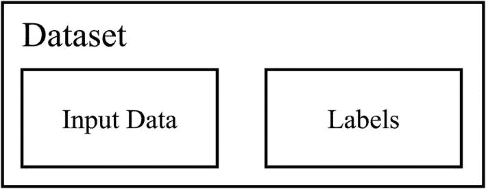

图 2-1

任务数据集结构

最简单的训练结构是第一章中讨论的初始化-训练-完成流程（图 2-2）。模型在初始化后立即开始训练，输入数据并预测标签。训练完成后，我们选择一个最终模型，这可以是训练完成后的模型，或者像恢复表现最佳模型的权重（类似于 Keras 的 `ModelCheckpoint` 回调）。

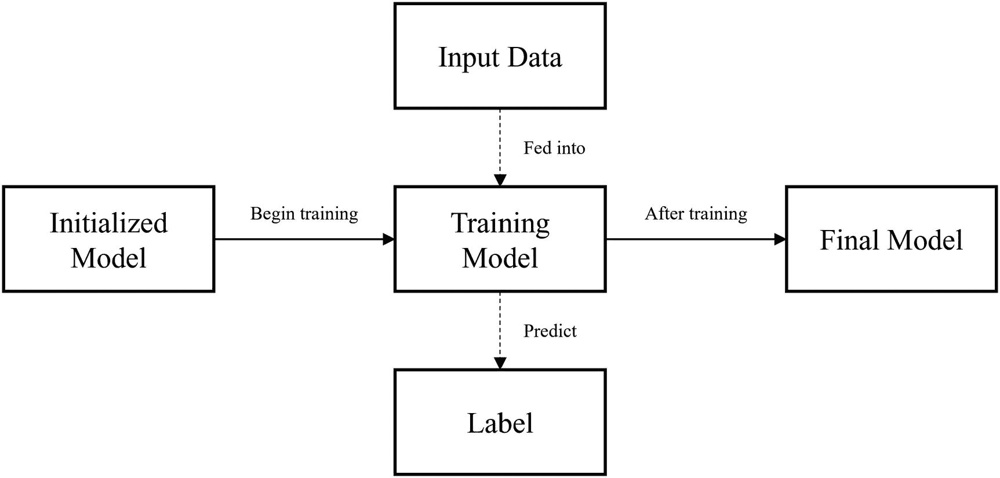

图 2-2

初始化和训练的简单训练结构

让我们看看如何修改这个简单的训练结构，以便更容易地提高训练性能。

### 预训练的力量

“预”在“预训练”中的含义是指它指的是在数据集上对模型进行正式训练之前发生的过程（图 2-3）。

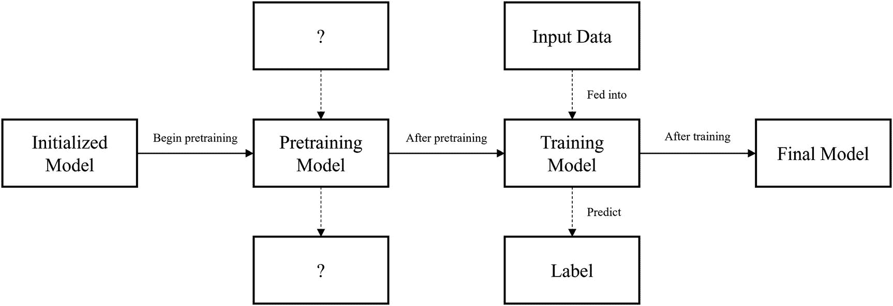

图 2-3

预训练的训练结构表示

由于我们希望预训练对训练有益，预训练应该以使训练“更容易”的方式进行模型导向。在预训练步骤中，模型的性能应该比没有预训练时更好。如果预训练使模型性能变差，你应该重新评估你的预训练方法。

在预训练中，模型必须被训练以执行与其最终任务（根据输入数据预测标签）不同的任务。这个预训练任务理想地提供了对最终任务重要的“上下文”和技能，从而使模型能够在最终任务上获得更好的性能。

在我们讨论具体的预训练方法之前，我们需要对模糊术语“更容易”和“更好的性能”有一个直观的理解；这将使我们更好地理解如何使用和设计预训练策略。预训练通常与它的两个主要优势相关讨论：

+   *时间*：预训练可以减少神经网络收敛到某个解所需的时间。

+   *更好的度量分数*：模型获得的度量分数比没有预训练时更高/更低（取决于度量标准）。例如，它获得了更低的交叉熵分数或更高的准确率。

虽然这些都是预训练的两个主要属性，但它们是潜在现象的结果：从概念上讲，预训练的过程将优化器“更接近”损失景观中的真实解。

考虑以下损失景观：神经网络优化器的目标是找到一组参数，使得相应的损失最小化。这个景观具有大多数现代损失景观的共同特征：它有几个局部最小值，但只有一个全局最小值，并且有倾斜、锯齿状的波动（图 2-4）。

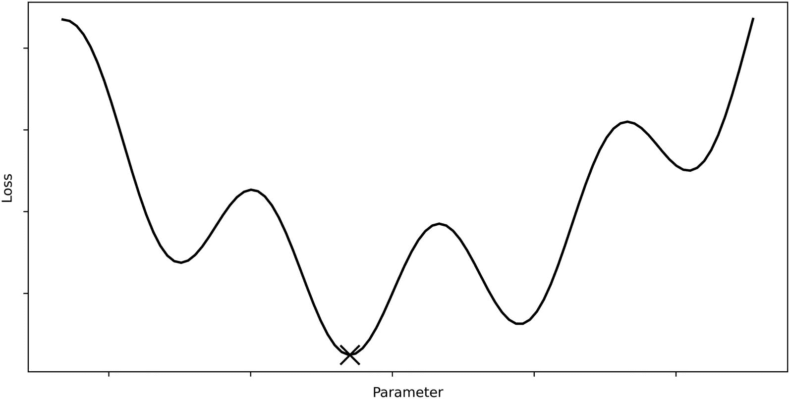

图 2-4

标记全局最小值的样本损失景观

没有预训练的模型可能初始化并遵循以下路径。由于它遇到的第一个最小值或多或少是浅的，比如说优化算法克服了它并发现了下一个最小值。由于这个最小值位于一个更深的地方，并且优化器已经走了很长的距离，它可能会判断这是全局最优解，并在该位置收敛（图 2-5）。

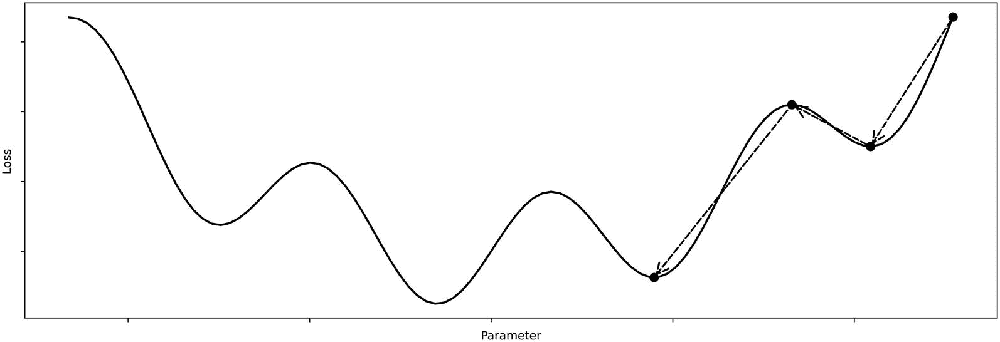

图 2-5

无预训练的优化器移动示例

然而，通过预训练，我们能够使模型“更接近”损失景观的真实全局最小值，从而使它更快地收敛到一个更优的解，因为它已经从一个“接近”全局最优的位置开始。相应地，我们可以使用一个风险更低或行为更稳定的优化器，因为它从一个方便的位置开始（见图 2-6）。

请记住，预训练并不一定在字面上使模型“更接近”最优解的距离，而是使模型找到最优解比没有经过预训练时更加方便或“容易”。一个接近全局最优但有几个非常深的局部最小值和非常高的局部最大值的优化器，比一个距离更远但路径更平滑且更容易下降的优化器更难到达全局最优。究竟“接近”意味着什么取决于损失景观的形状、优化器的行为以及许多其他因素。不过，为了简单起见，将“接近”理解为“导航到全局最优解有多容易”就足够了。

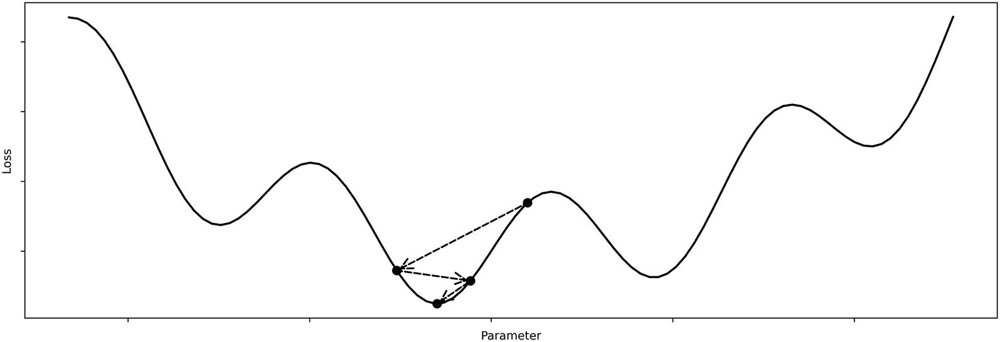

图 2-6

预训练的优化器移动示例

注意，预训练任务的损失景观与最终任务的损失景观是不同的（如图 2-6 所示）。并不是预训练在最终任务的损失景观内操作并将模型移动到方便的位置——那只是对任务数据集的训练，而不是预训练。

相反，在预训练中，我们依赖于预训练任务的损失景观与模型旨在执行的任务的损失景观之间的相似性。因此，在预训练任务中取得成功的模型应该在最终任务的损失景观中处于一个一般成功的位置，从那里它可以进一步改进。这也意味着，如果你认为预训练数据集和任务数据集的损失景观非常“不同”，那么预训练可能没有帮助。因为技术原因，这两个通常无法进行定量比较，因此，在特定情况下，预训练的必要性和性能提升取决于你自己的决定。

这种视觉描述旨在更多地作为一种理解预训练意图的概念方法，以帮助您设计和使用预训练策略。当然，它并不完全代表现代神经网络优化器操作的高维空间或转移学习损失景观形状和操作的技术细节。例如，预训练不太可能将模型带到优化器遇到没有局部最小值的位置，如图 2-6 所示。尽管如此，我们可以使用这个概念框架来证明和解释预训练的两个关键观察到的益处——速度和更好的度量分数。

+   *速度*：预训练使模型“更接近”一个优化器会“满意”的解（可能收敛到），因为它已经完成了大部分工作。此外，大多数现代优化策略都涉及学习率的递减。没有预训练优势的神经网络需要走得更远（可能在距离上，也可能在克服局部最小值或最大值等障碍上）才能接近真实解。到那时，其学习率可能会显著下降，它可能无法摆脱局部最小值。另一方面，如果一个预训练模型一开始就接近真实解，其学习率开始时“清新”且未衰减；它可以快速克服位于其与真实解之间的局部最小值。

+   *更好的度量分数*：预训练减少了模型与真实解之间的障碍数量。因此，模型更有可能收敛到真实解。此外，如前所述，优化器在真实解附近的 学习率比没有预训练的优化器“更清新”，因此对可能欺骗没有预训练的优化器的微小障碍更不敏感。

接下来，我们将在此基础上讨论两种预训练方法的直觉：转移学习和自监督学习。

### 转移学习直觉

转移学习基于这样的观点，即从解决一个问题的知识可以用于或转移到解决另一个问题。通常，从更一般的问题中得出的知识用于帮助模型解决更具体的问题。

考虑两个数据集：一个通用数据集和一个任务数据集。通用数据集用于预训练，而模型最终的目的是在任务数据集上表现良好（图 2-7）。

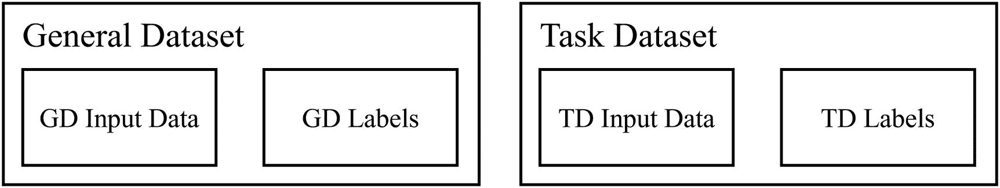

图 2-7

通用数据集和任务数据集的可视表示。GD = 通用数据集，TD = 任务数据集

在迁移学习中，首先在通用数据集上对一个初始化的模型进行训练，以提供在任务数据集上成功所需的上下文和技能。在模型在通用数据集上预训练后，它随后在任务数据集上进行训练。这种训练结构在图 2-8 中进行了可视化。由于权重从预训练的末尾保留到预训练的开始，模型已经获得了在通用数据集上训练时可以使用的重要技能和表示。

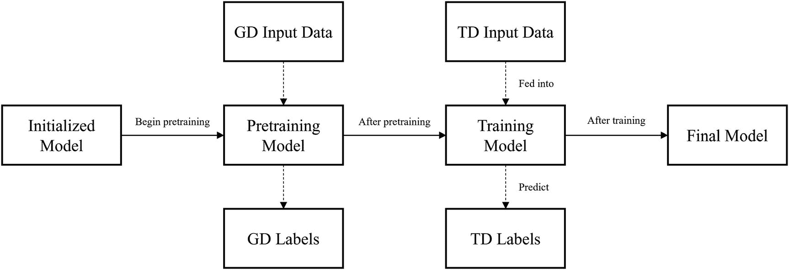

图 2-8

转移学习的训练结构可视化表示

通常，迁移学习的预训练部分不是在内部（由你自己）完成的。选择一个合适的一般数据集，并构思、实现和训练一个模型以在该通用数据集上表现良好，这是一项大量工作，而且并非必要。大多数深度学习框架（如图 2-9 中的 Keras/TensorFlow 和 PyTorch）以及其他来源，如 pypi 库、在线代码论坛和托管站点，都提供了预训练模型的存储库。每个预训练模型都是在某个通用数据集上训练的，可供你使用。

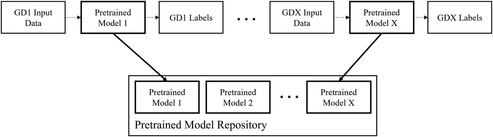

图 2-9

模型存储库中的预训练模型。GD = 通用数据集。GD1、GD2、…、GDX 表示在多个不同的通用数据集上进行了相应训练的几个不同的通用数据集。请注意，在实际操作中，通用数据集与预训练模型之间的关系是一对多（许多具有不同架构的预训练模型在同一个通用数据集上进行了训练）。

然后，你可以选择一个已经预训练的模型，并开始在特定的任务数据集上对其进行训练（图 2-10）。

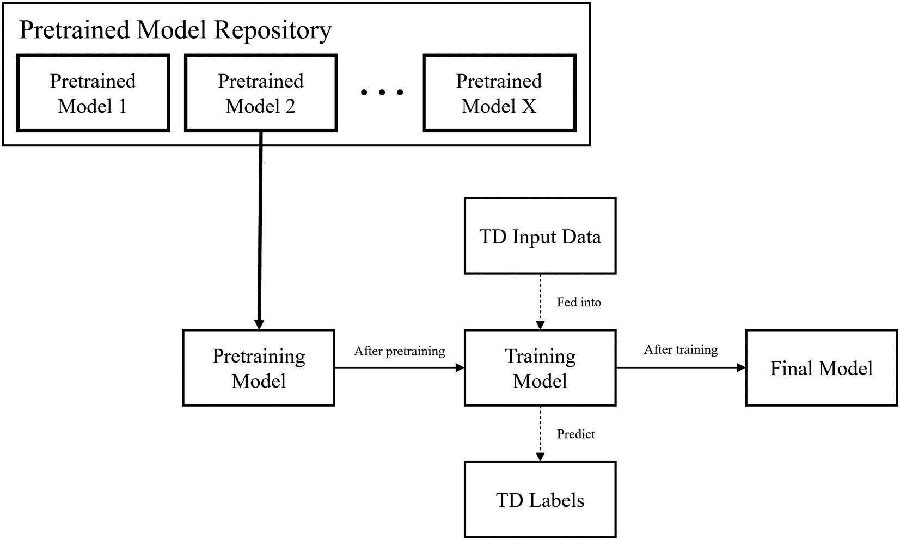

图 2-10

使用预训练模型存储库中的模型直接开始任务数据集上的训练

这套预训练模型可用于解决的问题数量远远超过了存储库中预训练模型的数量。然而，这并没问题，因为我们预期每个预训练模型都能够应用于广泛的多种问题类型，因为每个模型都应具备某种形式的“通用知识”。

例如，假设我们想要训练一个模型来分类狗和猫的图像（图 2-11）。我们决定使用迁移学习，并选择一个包含各种真实物品和对象的通用数据集，如鹦鹉、飞机、汽车、番茄、鱼等。为了本例的目的，让我们假设狗和猫的图像不在通用数据集中。

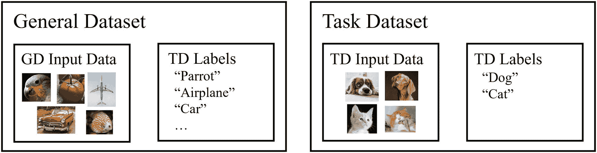

图 2-11

示例任务数据集和通用数据集

通用数据集和任务数据集之间可能看起来没有多少联系。然而，如果我们摆脱基于本能的人类基于主题的思考——“这是一辆车，那是一只狗；它们属于不同的类别（即交通和动物）”——我们可以看到许多相似之处。

+   *有很多边缘*：边缘定义了飞机、汽车和鱼的形状；同样，它们在定义狗或猫的头部形状时也很重要。

+   *光很重要*：由于这两个数据集都是三维物体的二维表示，因此光很重要，因为它有助于确定物体的形状和轮廓。

+   *纹理很重要*：现实生活中的物体通常形状相似，但通过其表面的纹理来区分。同样，这似乎对于区分狗和猫的图像也很重要。

一个在通用数据集上取得成功的模型必须已经适应并考虑了通用数据集的这些特征。从某种意义上说，它“理解”了如何“解释”边缘、光的动态、纹理和其他重要品质。之后所有必要的只是将这些学到的技能和表征适应到类似但更具体的工作任务中。

你可能会问：“为什么不直接处理任务数据集？为什么在模型能够为任务数据集更具体和直接地发展这些技能时，还要开发这些辅助技能？”确实，在某些情况下，迁移学习不是一个合适的选择。然而，在大多数足够困难的任务中，通过迁移学习进行预训练有助于为模型自己难以构建的学习打下基础。

想象你正在通过重复的例子教一个小孩如何加两位数。你有两种一般的教学策略：

+   通过反复展示例子（例如，23+49=72）直接教孩子加两位数。

+   首先，通过反复展示例子（例如，3+9=12，2+6=8）来教孩子如何加一位数。然后，通过反复展示例子（例如，23+49=72）来教孩子如何加两位数。

后者更有可能是一个成功的策略，因为从对加法一无所知到加一位数再到加两位数的平均跳跃长度，比从对加法一无所知到加两位数的平均跳跃长度要小得多。迁移学习应该通过这种教学模型的通用任务的直觉来运作，从而使更具体、最终的任务更容易接近。

### 自监督学习直觉

自监督学习遵循预训练的逻辑——在将模型在任务数据集上训练之前，先执行某种预训练任务，以使其更好地获得完成任务所需的表示和技能。

自监督学习和迁移学习之间的区别在于，在迁移学习中，预训练数据集与任务数据集不同，而在自监督学习中，预训练数据集是从任务数据集的输入数据中构建的。因此，虽然您需要两个数据集来构建完整的迁移学习训练结构，但技术上只需要一个数据集来构建完整的自监督学习训练结构（图 2-12）。

注意

在这里，我们使用一个独特的定义来界定“不同的”数据集构成。如果数据集 A 可以完全从数据集 B 中派生出来（例如，通过翻转图像或改变图像颜色），为了这个概念的目的，这两个数据集不算不同，尽管在技术层面上，一个数据集中存在无法在另一个数据集中找到的训练实例。另一方面，如果数据集 A 不能完全从数据集 B 中派生出来（例如，从 CelebA 中派生 ImageNet），那么这两个数据集就是不同的。这里构成“不同”的主要焦点是数据集的信息内容，而不是单个特定的训练实例。这使我们能够区分迁移学习和自监督学习。

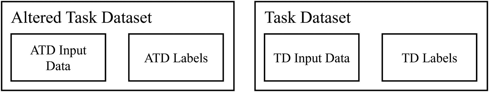

图 2-12

自监督学习数据集。ATD = 改变的任务数据集

重要的是要注意，改变的任务数据集通常仅从任务数据集的输入数据中派生。例如，如果模型的任务是识别图像是狗还是猫，那么改变的任务数据集只能基于图像（任务数据集的输入数据）构建，而不能基于标签（任务数据集的标签）。

设计改变的任务数据集是成功深度学习解决方案中嵌入的创造力的一个迷人展示。有许多例子说明您可以从任务数据集中构建标签以形成改变的任务数据集：

+   对部分数据添加噪声，对其他数据不添加。训练模型以分类哪些数据实例添加了噪声（这是一个二元分类问题：噪声/无噪声）。这可以帮助模型更好地分离噪声和数据，使其能够发展出对数据关键特征外观的潜在表示。

+   向数据集中的所有实例添加不同级别的噪声。训练模型对噪声程度进行分类（这是一个回归问题）。例如，如果您改变了高斯噪声的标准差，模型会预测标准差。这不仅帮助模型检测是否存在噪声，还检测噪声存在的程度。虽然这是一个更困难的预训练任务，但模型会被鼓励发展对数据的关键特征和结构的复杂表示。

+   假设有一个彩色图像数据集，颜色对模型的最终任务很重要。将图像转换为灰度并训练模型从相应的灰度图像构建彩色图像（这是一个图像到图像的任务）。在这种情况下，修改后的任务数据集输入数据是灰度图像，标签是彩色图像。通过这种自监督预训练练习，模型能够理解某些物体应该是什么颜色。

+   假设有一个模型需要执行 NLP（自然语言处理）任务中的文本分类。取文本样本（任务数据集的输入数据）并随机隐藏其中一个单词。训练模型预测隐藏的单词是什么。例如，当给出“it’s raining ____ and dogs.”时，模型会预测“cats”。这使模型能够理解单词如何相互双向作用——它需要利用隐藏单词前后信息。这种自监督学习方法在现代 NLP 架构中常用。

在这些示例中，不需要使用任务数据集的任何标签——仅使用任务数据集的输入数据，或*x*，来构建这些监督数据集。作为深度学习工程师，您可以修改任务数据集的输入数据，并从这些变化中构建标签。

一旦从任务数据集的输入数据中导出了修改后的任务数据集，它就可以用于预训练训练结构（图 2-13）。

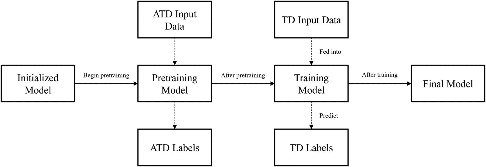

图 2-13

自监督学习训练结构

注意，在自监督学习（以及一般预训练中），达到高性能指标并不是最终目标。事实上，如果一个模型在预训练任务上表现得太好，可能是因为预训练任务过于简单，因此没有支持有价值技能和数据表示的增长。另一方面，如果模型表现非常糟糕，预训练任务可能过于困难。

应该注意的是，自监督学习在技术上是无监督学习，因为我们从输入数据中提取见解，而不了解标签。然而，自监督学习是一个更常用且合适的术语：这种操作无疑具有监督特征，这使其与传统无监督机器学习算法（如 K-means）区分开来，因为在数据生成（构建修改后的任务数据集）技术上是无监督的，而学习过程（梯度更新等）是监督的。

自监督学习同样很有价值，因为它允许我们在不需要标签的情况下捕捉到有价值的信息。数据资产管理公司 Datamation 估计，每年非结构化数据量增加 55%至 65%^(2)，国际数据公司（International Data Corporation）预测到 2025 年将有 80%的数据是非结构化的.^(3) 非结构化数据是指无法轻易适应标准数据库模型的数据。因此，非结构化数据的一个辅助特征是，很少有相应的标签来训练大规模的深度学习模型。然而，自监督学习的逻辑允许我们在没有标签的情况下发现非结构化数据中的隐藏结构，并利用这些知识来解决监督问题。

因此，自监督学习对于在小型数据集上进行训练特别有价值，在这些数据集中标签很少。通过自监督学习进行预训练可以使模型得出它可能仅通过传统的训练结构而没有获得的重要见解。

与迁移学习不同，没有自监督预训练模型的存储库，因为在自监督学习中，预训练任务必须基于任务数据集来设计。然而，如果你对编程和数据流有很好的掌握，为自监督学习修改任务数据集通常并不困难（参见第一章）。

Yann LeCun 在 2020 年 AAAI（人工智能协会）会议上，用人类和动物学习的方式为自监督学习提供了一个类比：

> *自监督学习…基本上是学习填补空白。基本上，它是学习在执行任务之前先表示世界。这正是婴儿和动物所做的事情。我们在世界中奔跑，在我们学习任何任务之前，我们先学习它的工作方式。一旦我们对世界的表示很好，学习一个任务就需要很少的尝试和样本。*
> 
> —Yann LeCun，Facebook 首席人工智能科学家，在 AAAI 20 上发表演讲^(4)

迁移学习和自监督学习都属于预训练的一般策略，并且相似之处在于模型在训练任务数据集之前参与了一些监督任务。然而，这两种预训练方法不仅在技术细节（即“不同”数据集与“相同”数据集）上有所不同，如之前所讨论的，而且在结果和所发展的知识方面也有所不同。

+   迁移学习倾向于发展“预测技能”。也就是说，迁移学习的权重是从通用数据集中推导出来的，通常来自与任务数据集（在主题/内容方面）显著不同的上下文。迁移学习的很大一部分价值在于它所发展的预测技能——学习如何识别边缘、寻找纹理、处理颜色等，而不是数据集的内容或主题的实际知识。

+   自监督学习倾向于发展“世界表示知识”。它构建了模型在任务数据集上表现良好所需的基本“世界”或上下文表示。实际上预测——例如——是否向训练实例添加了噪声的技能可能并不那么有用，但获得这种技能的过程需要理解数据“世界”。自监督学习允许模型对构建基本表示和“探索”数据集的内容和主题有所了解。

当然，这并不是说迁移学习不发展世界表示知识，或者自监督学习不发展重要技能。相反，这些是迁移学习和自监督学习的根本“精神”或“性格”，可以用来指导直觉和预期从这两种方法中能得到什么。

你可能会注意到，我们一直在通过相对流畅和艺术化的描述和想法来探索这些概念——“提取洞察力”、“发展表示”、“世界表示”。虽然教科书可能试图用方程和数学关系来表述这些想法，但事实是，即使是最新型的深度学习知识也无法完全解释和理解神经网络行为的深度。对神经网络如何运作和“学习”有直观的理解——即使它不是数学上严谨的——对于成功和高效的设计也是很有价值的。

接下来，我们将探讨预训练中的实际概念，以了解如何操纵神经网络架构以实现迁移学习和自监督学习的实施。

## 迁移学习实用理论

之前，我们讨论了概念框架，以获得对迁移学习直观的理解，包括它做什么，以及它是如何运作的。然而，由于在实施迁移学习时存在许多“隐藏”的考虑因素，在本节中，我们将探讨理论的更实际方面——概念和思想，以帮助您实施迁移学习。

本节的目的不是提供特定的代码或讨论示例（这些将在下一节中留出），而是提供实现预训练的重要概念介绍，如预训练模型的结构以及预训练模型在 Keras 中的组织方式。

### 迁移学习模型和模型结构

有几个重要的预训练模型和数据集需要了解。在本节中，我们将主要探索基于图像的模型，尽管您可以将许多逻辑应用于其他上下文。基于图像的预训练模型通常遵循一个标准结构，包括两个关键步骤：特征提取和特征解释（图 2-14）。

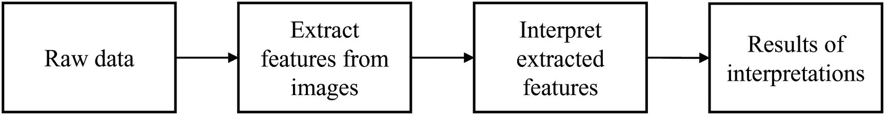

图 2-14

图像预训练模型的概念组件

特征提取的作用是将信息组装成有意义的观察，例如识别和增强（或减少）某些边缘、形状或颜色模式的存在。一个调优良好的特征提取组件能够识别和增强与问题相关的特征。例如，如果问题是分类各种形状的灰度图像，特征提取组件必须非常擅长检测和增强边缘的形状。

特征解释通过解释编译后的提取特征来对图像做出最终判断。它接受有关图像特征的提取信息，并能够在图像的各个区域执行比较和其他复杂分析。一个调优良好的特征解释组件能够有效地聚合并理解提取特征与目标输出之间的关系。

在实践中，“特征提取”和“特征解释”的角色由卷积和全连接组件（图 2-15）扮演。卷积组件通常包括卷积、池化和其他基于图像的特征提取层。全连接组件通常包括全连接或密集（在 Keras 术语中）层。

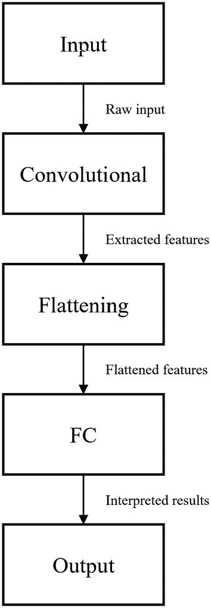

图 2-15

图像预训练模型的实际组件

1.  原始输入被传递到卷积组件以进行特征提取。

1.  预训练模型的卷积组件接收原始输入并执行卷积、池化和其他图像处理层以提取图像特征。然后，它将提取的特征传递给展平组件。

1.  展平组件接收二维（空间上，不计颜色深度），因为卷积组件执行的操作接收和输出图像形式的数据。展平将二维提取的特征转换为单维数据，以便完全连接层可以对这些特征进行操作。

1.  完全连接组件，也称为神经网络的“顶部”或“头部”，接收包含从提取的特征中获取的信息的一维展平数据。通过一系列完全连接层（以及其他相应的层，如激活、dropout 等）解释提取的特征后，完全连接层输出神经网络的输出。

我们将在后面的章节中深入讨论某些架构，但在这里我们将对重要的模型进行非常快速的概述。

在 Keras 中，预训练模型被组织成模块，可以在`keras.applications.module_name`中找到该模型和相关函数。例如，如果您想找到与 InceptionV3 模型相关的预训练模型和预处理函数，您可以在`keras.applications.inception_v3`中找到它。除了预训练模型对象外，这些模块通常还包含应用于您的数据或模型输出的处理函数。我们将在稍后看到这些处理函数是如何与模型相关的。

#### ImageNet 数据集

ImageNet 是图像识别中最重要数据集之一。李飞飞教授于 2007 年初在普林斯顿开始研究 ImageNet。在整个神经网络在图像领域的应用发展中，ImageNet 一直是新方法和设计构思、测试和重新发明的核心数据集。

ImageNet 数据集根据 WordNet 层次结构组织，其中对象以相互之间的层次关系排列（图 2-16）。

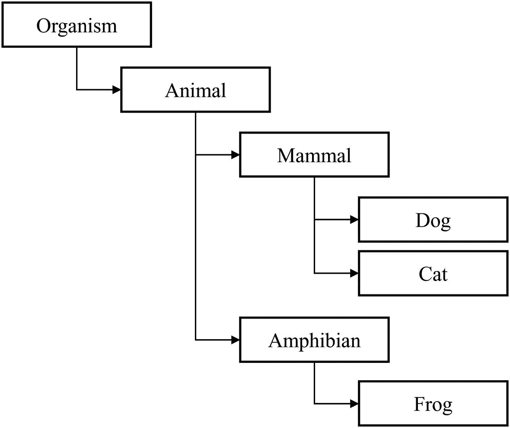

图 2-16

假设的 WordNet 层次结构组织示例分支

ImageNet 中的每个“有意义的概念”被称为“同义词集”或“synset”。每个“synset”可以用多个单词或一系列单词来描述。ImageNet 包含超过 10 万个 synset；每个 synset 平均包含 1000 张图片。在 22,000 个对象中，ImageNet 包含超过 1400 万张图片。

> *ImageNet 项目受到计算机视觉研究中两个重要需求的启发。第一个需求是在计算机视觉中建立一个清晰的北极星问题……第二个需求是迫切需要更多的数据来使机器学习方法更具普遍性。自从数字时代的诞生和可用的网络规模数据交换以来，这些领域的学者们一直在努力设计越来越复杂的算法来索引、检索、组织和注释多媒体数据。但好的研究需要好的资源……这两个智力原因的交汇促使我们构建 ImageNet。*
> 
> —ImageNet 研究团队^(5)

ImageNet 大规模视觉识别挑战赛从 2010 年持续到 2017 年，对图像处理深度学习工作的开发起到了关键作用。因此，Keras/TensorFlow 和其他深度学习框架中可用的许多预训练模型都是在 ImageNet 数据集上预训练的。在 ImageNet 数据集上预训练的模型已经发展出了识别三维空间和物体图像的边缘、纹理和其他属性的能力。

#### ResNet

ResNet 架构，或残差神经网络，于 2015 年被提出。ResNet 在 2015 年 ImageNet 挑战中获得第一名，在测试数据集上实现了 3.57% 的错误率。ResNet 使用残差连接，或跳过连接，这些是跳过至少一个中间层的层间连接。我们将在后面的章节中探讨这些设计类型和策略在神经网络架构中的应用。

Keras/TensorFlow 提供了 ResNet 架构的几个不同版本：ResNet50、ResNet101、ResNet152、ResNet50V2、ResNet101V2 和 ResNet152V2。在“ResNet”之后（例如，“ResNet50”中的“50”）表示该架构中的层数。因此，ResNet152V2 的层数比 ResNet101V2 多。

ResNet 也有两个版本，两个（非常普遍）的关键区别：

+   ResNetV1 比 ResNetV2 添加了更多的非线性。因此，V2 架构允许在整个网络中为数据流提供更直接和清晰的路径。

+   ResNetV1 在批量归一化和激活层之前通过卷积层传递数据，而 ResNetV2 在卷积层之前通过批量归一化和激活层传递数据（反转）。

你可以在 `keras.applications` 中的相应模块中找到 Keras ResNet 模型架构：

+   ResNet50: `keras.applications.resnet50.ResNet50()`

+   ResNet101: `keras.applications.resnet.ResNet101()`

+   ResNet152: `keras.applications.resnet50.ResNet152()`

+   ResNet50V2: `keras.applications.resnet_v2.ResNet50V2()`

+   ResNet101V2: `keras.applications.resnet_v2.ResNet101V2()`

+   ResNet152V2: `keras.applications.resnet_v2.ResNet152V2()`

我们将在稍后探讨如何使用给定的模型对象来探索该架构。

#### InceptionV3

2015 年的 InceptionV3 模型是 Inception 系列模型中的一种流行模型，它使用基于模块/单元的结构，其中某些层的集合被重复使用。Inception 网络通过减少必要的参数数量和限制所需的内存和资源消耗，从而提高了计算效率。InceptionV3 的设计主要侧重于最小化计算成本，而 ResNet 则侧重于最大化准确性。

你可以在`keras.applications.inception_v3.InceptionV3()`中找到 InceptionV3 模型架构。

受 ResNet 高性能的启发，Inception-ResNet 架构通过结合残差引入了混合模块。相应地，Inception-ResNet 通常具有低计算成本和高性能。

你可以在`keras.applications.inception_resnet_v2.InceptionVResNet2()`中找到 Inception-ResNetV2 架构。

关于残差连接、基于单元的结构和 InceptionV3 架构的更具体和技术的讨论，请参阅第六章。

#### MobileNet

2017 年的 MobileNet 模型旨在在移动手机深度学习应用中表现出色。MobileNets 使用深度可分离卷积，这是一种不仅空间上应用，而且在深度上也应用的卷积。MobileNet 的参数数量比 Inception 多，但比 ResNet 少；相应地，MobileNet 通常观察到在性能上比 ResNet 差，但比 Inception 好。

注意

当我们比较模型（例如，“MobileNet 与 ResNet”）时，请记住我们指的是完整的架构系列。大多数模型都有不同版本和深度的架构。当比较模型系列时，我们指的是可比版本和层的架构。

Keras/TensorFlow 提供了四种 MobileNet 版本，包括 MobileNetV1、MobileNetV2、MobileNetV3Small 和 MobileNetV3Large。MobileNetV2 与 MobileNetV1 类似，使用深度可分离卷积，但还引入了瓶颈之间的线性瓶颈和快捷连接。MobileNetV2 可以有效地提取用于目标检测和分割的特征，并且通常比 MobileNetV1 更快地达到相同的性能。MobileNetV3Small 和 MobileNetV3Large 是针对低资源和高资源消耗场景设计的 MobileNet 架构，它们源自神经架构搜索算法（我们将在后续章节中讨论神经架构搜索和其他方法）。

你可以在`keras.applications`中的相应模块中找到 Keras ResNet 模型架构：

+   MobileNetV1: `keras.applications.mobilenet.MobileNet()`

+   MobileNetV2: `keras.applications.mobilenet_v2.MobileNetV2()`

+   MobileNetV3Small: `keras.applications.MobileNetV3Small()`

+   MobileNetV3Large: `keras.applications.MobileNetV3Large()`

#### EfficientNet

深度卷积神经网络一直在不断增大，试图变得更强大。然而，这种增大的具体执行方式却各不相同。一些方法通过增加网络处理的图像中的像素数量来提高图像的分辨率。其他方法通过增加更多层或增加每层的节点数量来增加网络的深度或宽度。

2019 年的 EfficientNet 模型系列是通过复合缩放来扩大神经网络的新方法，其中网络的分辨率、深度和宽度都进行了等比例缩放。通过在名为 EfficientNetB0 的小型基础模型上使用这种缩放方法，生成了七个复合缩放架构，分别命名为 EfficientNetB1、EfficientNetB2、…、EfficientNetB7，随着缩放幅度的增加。EfficientNet 模型系列在计算和时间上都既强大又高效。复合缩放使得 EfficientNet 能够在 ImageNet 数据集上优于 MobileNet 和 ResNet 等模型的性能。

您可以在 `keras.applications` 中相应模块中找到 EfficientNet 模型架构的 Keras 实现：

+   EfficientNetB0: `keras.applications.efficientnet.EfficientNetB0()`

+   EfficientNetB1: `keras.applications.efficientnet.EfficientNetB1()`

+   EfficientNetB2: `keras.applications.efficientnet.EfficientNetB2()`

    …

+   EfficientNetB6: `keras.applications.efficientnet.EfficientNetB6()`

+   EfficientNetB7: `keras.applications.efficientnet.EfficientNetB7()`

在第六章的案例研究中可以找到对 EfficientNet 的更具体和技术的讨论。

#### 其他模型

Keras/TensorFlow 在 `keras.applications` 中提供了一系列其他预训练模型。要查看它们，请参考 TensorFlow 文档，它不仅提供了使用、参数和方法的信息，还包括每个预训练模型对应论文的链接：[`www.tensorflow.org/api_docs/python/tf/keras/applications`](http://www.tensorflow.org/api_docs/python/tf/keras/applications)。在本章的后面部分，我们还将介绍如何将 PyTorch 模型转换为 Keras/TensorFlow 模型，以利用 PyTorch 的预训练模型库。

### 更改预训练模型架构

要更改预训练模型架构，通常只需转移预训练模型的卷积组件。回想一下，迁移学习主要关注将从一个通用数据集学到的技能转移到特定任务数据集的应用。由于任务数据集与通用数据集不同，尽管在任务数据集上运行的模型仍将从迁移学习转移的特征提取技能中受益，但它还需要发展自己的解释。

作为一种概念上的类比，想象你是一名受过印象派时期作品分析训练的艺术学生——莫奈、雷诺阿、马蒂斯等人的艺术。如果你现在要接近毕加索和波洛克等人的当代作品，你将想要

+   *…保留特征提取技能*：你作为艺术学生学到的基本特征提取能力对于发展和组织有意义的、敏锐的观察至关重要，这些观察可以用于解释。如果不理解如何观察和提取艺术作品的观察（实际上不进行解释），就没有观察可以作为解释的基础。

+   *…但发展一套新的解释方法*：既然你已经保持了你的特征提取技能并发展了一套观察（提取出的特征），在大多数情况下，通过印象派解释来分析当代作品似乎并不合理。相反，这种新的数据需要一套适合当代艺术背景的新解释方法。

因此，虽然提取特征的技能很有价值，并且几乎可以无差别地转移到大多数类似的问题上，但通常这些特征的解释差异很大，因此最成功的策略是构建一个定制的全连接组件，而不是迁移它（见图 2-17）。

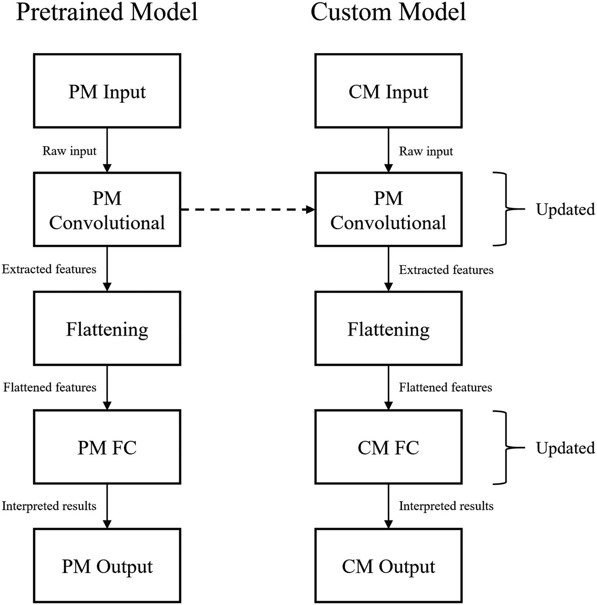

图 2-17

从预训练模型到定制模型迁移权重的过程。PM = 预训练模型，CM = 定制模型。“更新”表示相应的组件正在重新训练/更新。

然而，在某些情况下，问题集可能足够相似，以至于全连接层的权重也可以被迁移（见图 2-18）。这种方法不需要对预训练模型进行架构操作，因为所有来自预训练模型的权重都被迁移了。要使用这种方法，只需实例化预训练模型，并在任务数据集上对其进行训练，而不进行任何架构操作。

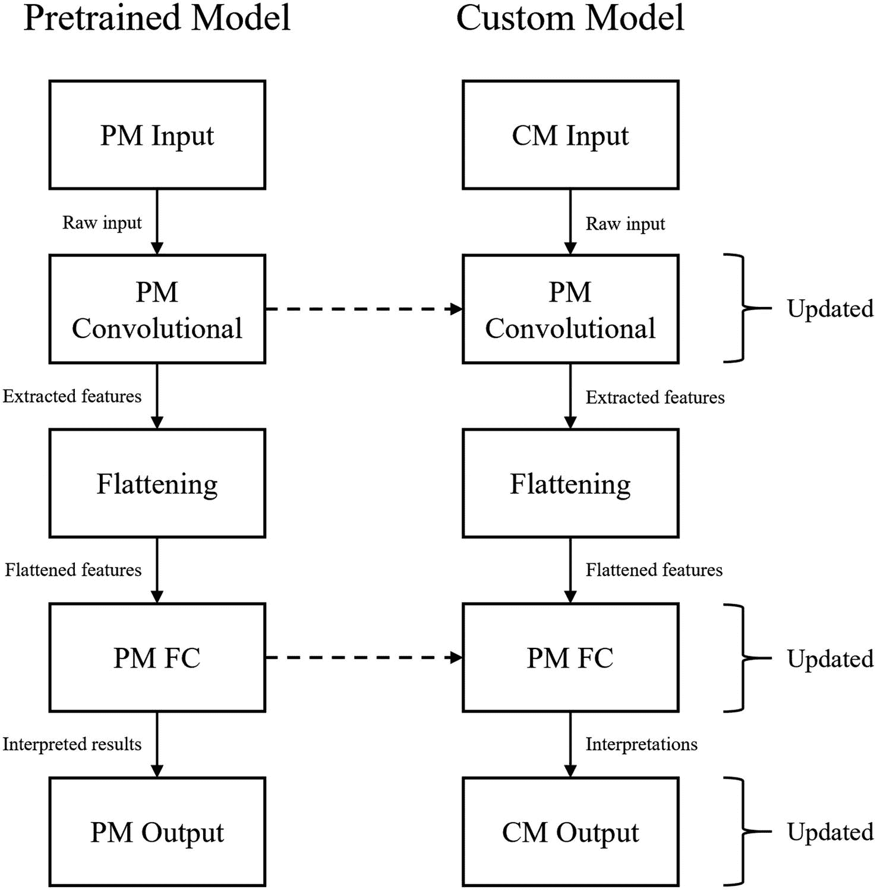

图 2-18

从预训练模型到定制模型迁移权重的替代过程，其中预训练模型的卷积和 FC 组件都被迁移

另一种选择是保留预训练模型的完全连接组件，并在之后添加更多自定义层（见图 2-19）。回想一下艺术生的类比：你从训练中获得的印象派风格的解释性视角开始，但同时也发展了新的解释 *方式* 来应对新的问题类型。然而，这种方法通常不如仅转移卷积组件中的权重常用，因为为了有效，神经网络必须显著加深（添加更多层），这可能会对更新权重、时间和模型性能造成问题。但在某些条件下，它可能是最佳策略。

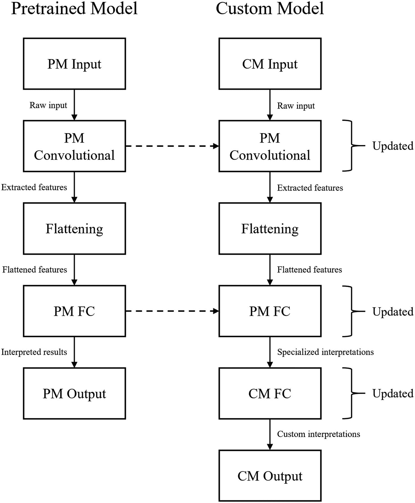

图 2-19

从预训练模型转移到自定义模型的一种替代过程，其中预训练模型的卷积和 FC 组件都被转移，并在自定义模型中添加新的完全连接层

尽管我们将通过示例仅探索第一种方法，但所有方法都可以通过第一章中介绍的工具来实现，例如功能 API。模型可以被当作功能层来处理，表示为输入的函数。参见第三章以了解更多关于神经网络架构操作的复杂探索。

### 神经网络“顶部”包含性

所有 Keras/TensorFlow 预训练模型都有一个重要的参数，名为 `include_top`，它允许我们轻松实现更改预训练模型架构以进行训练的第一种方法。

回想一下，基于图像的神经网络架构的完全连接组件通常被称为其“顶部”。因此，如果将 `include_top` 参数设置为 `True`，实例化的预训练模型对象将保留完全连接组件。另一方面，如果将 `include_top` 参数设置为 `False`，则不会保留完全连接组件，实例化的预训练模型对象将只包含输入和卷积组件。

重要的是要意识到，当没有顶部时，输入图像的形状或多或少是任意的（见注意），因为卷积层不依赖于绝对形状。一个卷积层可以作用于几乎任何形状的图像（见注意中对“几乎”的限定），因为它只是简单地“滑动”过滤器在图像上。另一方面，完全连接组件中的密集层只能作用于特定形状的输入。因此，如果将 `include_top` 参数设置为 `True`，你的输入数据形状也将受到限制，只能与模型预训练的数据形状相匹配。

注意

输入图像的形状并非完全任意。如果图像形状太小，图像可能不足以让整个网络的深度都有效，因为过滤器依赖于最小图像尺寸。在一个 16x16 像素的图像上无法执行大小为(3,3)的十个卷积操作，因为在序列的中间，特征图已经被大大减小，变得太小以至于无法进行卷积。如果你使用的是具有小输入尺寸的模型架构，在定义架构时抛出错误，这很可能是罪魁祸首。

还应注意的是，没有顶部意味着输入尺寸是某种程度上的任意性，这并不意味着你应该过于极端地改变你图像的输入形状。比如说，一个模型是在 512x512 像素的图像上训练的，而你使用了迁移学习，提取了该模型的卷积组件（及其权重）。如果你要在 32x32 像素的图像上训练该模型（可能需要图像缩放），尽管从技术上讲是有效的，但迁移的权重几乎毫无用处，因为原始模型中的技能是在更高分辨率的像素图像上开发的。简而言之，利用没有顶部的图像尺寸的相对任意性，但也要对你的图像尺寸的自由度持保留态度。

### 层冻结

层冻结是实现迁移学习的一个有用工具。当一个层被“冻结”时，其权重是固定的，它不能被训练。迁移学习的目的是利用预训练模型已经开发的重要技能。因此，通常冻结预训练模型的卷积组件，只训练定制的全连接组件（图 2-20）。这样，卷积组件中学习并存储的特征提取技能保持不变，但解释性的全连接组件被训练以最佳地解释提取的特征。之后，有时整个网络也会进行微调。这允许卷积组件根据全连接组件中发展的解释进行更新。请注意，过多的微调可能导致过拟合。

将层冻结与艺术学生类比联系起来思考。最初，你希望利用你在艺术训练中发展的特征提取技能，并构建与提取的特征相对应的新当代艺术解释。然而，在你为特定问题构建了新的解释之后，你可能发现回过头来稍微更新你的特征提取技能以更好地服务于你的新解释能力是有帮助的。

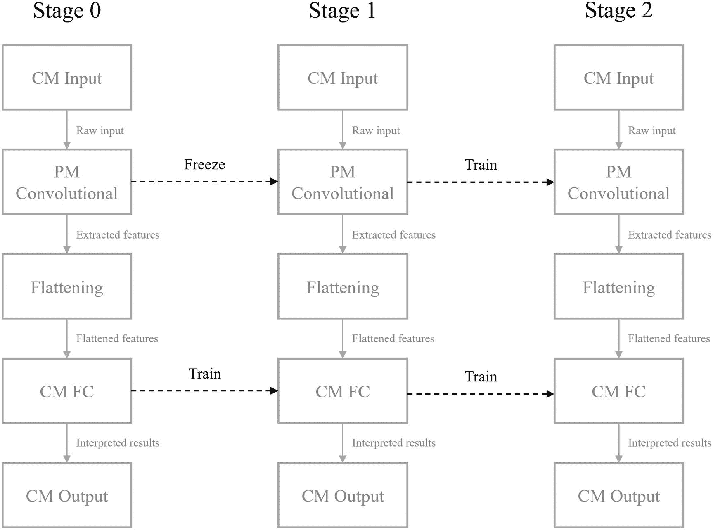

图 2-20

多步骤层冻结过程

在实际层面，层冻结对于实际成功非常有帮助。尽管随着计算能力的增强，构建大规模神经网络并调用`.fit()`变得容易，但仍然很难通过暴力优化数亿（甚至数十亿）个参数并实现良好的性能。层冻结允许神经网络一次专注于优化其架构的一部分，并通过限制神经网络可以偏离学习到的预训练权重的程度，更好地利用从预训练中获得的权重。

## 实现迁移学习

在本节中，我们将讨论使用 Keras/TensorFlow 实现迁移学习的三个示例：

1.  *无架构或权重更改*：这是一个使用（ImageNet）预训练模型实现其原始目的的练习——预测图像中的物体。这也有助于处理输入重塑和使用与预训练模型模块相关的编码和解码函数

1.  *无层冻结的迁移学习*：使用从卷积组件中转移权重并构建自定义全连接组件的标准程序，不进行层冻结。这对于使用功能 API 和使用`include_top`参数来操作模型架构都很有帮助。

1.  *有层冻结的迁移学习*：使用从卷积组件中转移权重并构建自定义全连接组件的标准程序，进行层冻结

我们还将讨论如何通过将它们转换为 Keras/TensorFlow 模型来利用 PyTorch 的预训练模型库。

### 一般实现结构：一个模板

在我们构建迁移学习模型之前，让我们首先编译之前讨论的主题和方法，为迁移学习的一般实现结构制定一个模板：

1.  从 Keras/TensorFlow 的预训练模型存储库或另一个来源（如提供预训练模型实现的 pypi 库或 PyTorch）中选择一个合适的模型。

1.  使用所需的架构设置实例化模型（包括或不包括顶层）。

1.  设置模型输入和输出流，使其与数据匹配。这可能需要使用重塑层，使用输入层，添加一个全连接组件，以便提取的特征被解释并输出，或其他机制，或某些组合。

1.  根据需要冻结层。

1.  编译和拟合。

1.  如有必要，更改冻结的层，然后重新编译和拟合。

应该注意的是，尽管在这个上下文中我们讨论的是基于图像的预训练模型，因为迁移学习在图像领域开始广泛发展，但特征提取段和解释段的逻辑也可以应用于其他问题领域。

### 无架构或权重更改

如果我们不更改架构，我们无法调整预训练模型的输入或输出。因此，如果我们不想更改架构，我们必须使用预训练模型进行其原始用途。

InceptionV3 模型是在 ImageNet 数据集上训练的。因此，它接受大小为`(299,299,3)`的图像，并返回一个输出向量，表示图像属于 1000 个类别中的一个的概率。

让我们从加载一个示例图像开始，以演示 InceptionV3 将如何工作（列表 2-1）。我们将使用`requests`读取 URL，使用`PIL`读取相应的图像（图 2-21），并使用`numpy`将图像转换为数组。


图 2-21

样本图像，将由在 ImageNet 数据集上训练的模型架构进行分类

```py
import PIL, requests, numpy as np
from PIL import Image
url = 'https://cdn.pixabay.com/photo/2018/04/13/21/24/lion-3317670_1280.jpg'
im = np.array(Image.open(requests.get(url, stream=True).raw))
Listing 2-1
Loading image of a lion
```

让我们从导入必要的层、应用程序和函数开始（列表 2-2）：

+   `keras.layers.Input` 层定义了输入大小，对于构建神经网络（或以其他形式，如`input_shape`参数）是必需的。

+   `keras.layers.experimental.preprocessing.Resizing`层将图像调整到新的形状。我们可以使用它将任何大小的图像调整为形状`(299,299,3)`，这样它就符合 InceptionV3 的正确输入形状。

+   `keras.applications.inception_v3.InceptionV3` 模型是核心的 InceptionV3 模型，可以用于并操作与其他层相关联。

+   `keras.applications.inception_v3.preprocess_input` 对数据进行预处理，使其与 InceptionV3 训练时的格式相同。如果输入没有进行预处理，预训练的权重可能不适合未经处理的输入，并产生不准确的结果。

```py
from keras.layers import Input
from keras.layers.experimental.preprocessing import Resizing
from keras.applications.inception_v3 import InceptionV3
from keras.applications.inception_v3 import preprocess_input
Listing 2-2
Importing necessary libraries
```

我们可以使用这些层来设置一系列数据输入和预处理（列表 2-3）。首先，`Input`层接受形状为`(None, None, 3)`的数据；`None`表示该维度的确切值没有确切指定。这允许我们将任何大小的图像传递到神经网络输入。`Resizing`层将输入图像调整为 InceptionV3 所需的正确形状。第三层将调整大小后的数据预处理为 InceptionV3 格式。

```py
input_layer = Input((None, None, 3))
reshape_layer = Resizing(299,299)(input_layer)
preprocess_layer = preprocess_input(reshape_layer)
Listing 2-3
Building input of a transfer learning neural network
```

`preprocess_layer` 的输出（调整大小并预处理后的输入数据的结果）被传递到`InceptionV3`模型中。请注意，我们没有更改模型架构或权重，因此我们设置`include_top=True`和`weights='imagenet'`。我们可以将模型视为一个接受前一层输出的层，并将其作为输入传递给下一层：Inceptionv3 = InceptionV3(include_top=True, weights="imagenet")(preprocess_layer)。

注意，你可以将权重设置为`None`，仅使用模型架构，而不使用预训练权重。虽然这并不完全算作迁移学习，但当任务数据集与预训练数据集差异很大，任何预训练权重都不会带来很大好处，但想利用某些架构的特性时，你可能想使用这种方法，比如效率或性能。

我们可以使用`keras.models.Model`从这组层创建一个模型（请注意，预训练模型被当作一个层处理，因此被视为一个`outputs`层）：`model = keras.models.Model(inputs=input_layer, outputs=Inceptionv3)`。

现在模型已经创建，我们可以用它来进行预测（见列表 2-4）。我们将使用`decode_predictions`函数来帮助我们解析 InceptionV3 模型的输出，其原始形式是一个数字列表。将存储在变量`im`中的图像预测传递给`decode_predictions`可以获得可解释的结果。

```py
from keras.applications.inception_v3 import decode_predictions
reshaped_im = np.array([im])
print(decode_predictions(model.predict(reshaped_im)))
Listing 2-4
Running and decoding predictions for a pretrained model
```

注意，模型期望的是四维数据——例如，形状为`(100,299,299,3)`的数据，表示它由 100 个 299x299 像素的 RGB 彩色图像组成。即使我们提交单个图像进行预测，它仍然需要是四维的。通过使用`np.array([im])`将图像作为另一个数组中的元素来包装是一种简单的方法。

解码预测的结果中的每个元素都采用`(class name, class description, probability)`的格式。解码预测的结果显示，InceptionV3 已经正确识别了图像中的对象——一只狮子，置信度为 91%（见列表 2-5）。

```py
[[('n02129165', 'lion', 0.91112673),
('n02112137', 'chow', 0.008575964),
('n02130308', 'cheetah', 0.0024228022),
('n04328186', 'stopwatch', 0.00097137265),
('n02106030', 'collie', 0.00083191396)]]
Listing 2-5
Results of InceptionV3 decoded predictions on an image of a lion
```

可以将类似的过程应用于通过 Keras 提供的其他预训练模型。大多数 Keras 预训练模型都有相关的`preprocess_input`和`decode_predictions`函数。

### 无层冻结的迁移学习

如果我们想要将预训练模型适应我们自己的任务数据集，我们需要进行一些最小的架构更改，以便输入和输出可以容纳我们的数据集。这遵循与之前不进行架构或权重更改的应用非常相似的结构。

让我们从导入必要的层和模型开始（见列表 2-6）：

+   `keras.layers.Input`层定义了输入形状。

+   `keras.layers.Dense`层提供了神经网络的“解释性”或“预测性”能力。

+   `keras.layers.GlobalAveragePooling2D` 层将图像数据“折叠”为其元素的平均值。例如，形状为 `(a, b, c, d)` 的图像数据在之后将具有形状 `(a, d)`，其中 `(b, c, d)` 是每个图像元素的形状，并且有 `a` 个训练实例。全局平均池化的替代方案是原始的展平层。展平层（`keras.layers.Flatten()`），与全局平均池化层不同，保留了多维数据的所有元素，并通过将它们首尾相连转换为单维数据。因此，形状为 `(a, b, c, d)` 的图像数据将具有形状 `(a, b*c*d)`。

+   `keras.applications.inception_v3.InceptionV3` 模型为 InceptionV3 模型提供了架构和预训练权重。

```py
from keras.layers import Input, Dense, GlobalAveragePooling2D
from keras.applications.inception_v3 import InceptionV3
Listing 2-6
Importing important layers for transfer learning
```

让我们从定义输入层和它所馈入的 InceptionV3 模型开始（列表 2-7）。

```py
input_layer = Input((512,512,3))
inceptionv3 = InceptionV3(include_top=False,
weights='imagenet')(input_layer)
Listing 2-7
Building the input and pretrained model of a transfer learning model
```

注意，我们保留了 ImageNet 权重，但不包括顶层。虽然我们希望保留卷积层中的特征提取技能，因为我们正在将预训练模型用于自己的目的，所以我们不需要用于解释性全连接组件的权重。

由于我们不在保留神经网络的上层，截断的 InceptionV3 模型的输出是一个图像。全局平均池化模型允许我们将数据从图像形式压缩出来（这是展平组件）。之后，我们可以放置两个额外的密集层来“解释”提取的特征，以及一个额外的层来形成输出层（列表 2-8）。

```py
pooling = GlobalAveragePooling2D()(inceptionv3)
custom_dense_1 = Dense(256, activation='relu')(pooling)
custom_dense_2 = Dense(64, activation='relu')(custom_dense_1)
output_layer = Dense(1, activation='sigmoid')(custom_dense_2)
Listing 2-8
Building the flatten and custom FC components of the transfer learning model
```

我们可以形成这样的模型（列表 2-9）。

```py
model = keras.models.Model(inputs = input_layer, outputs = output_layer)
Listing 2-9
Compiling the transfer learning model into a Keras model
```

通过 keras.utils.plot_model(model, show_shapes=True) 可视化模型，显示了数据随时间变化的形状（图 2-22）。可视化还表明，InceptionV3 模型被处理得非常像标准层。

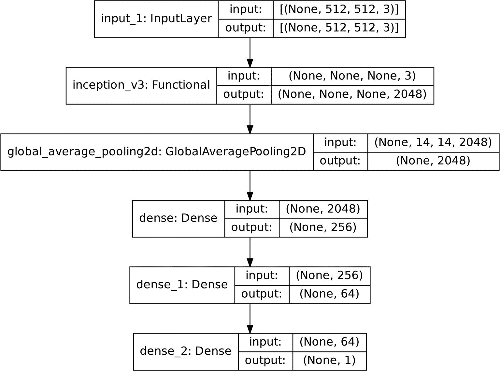

图 2-22

使用迁移学习示例模型架构的图示

模型可以相应地编译和训练。需要注意的是，通常全连接组件要长得多且复杂，以适应现代深度学习数据集的复杂性质。

### 使用层冻结进行迁移学习

为了冻结一个层，设置 `layer_obj.trainable=False`。

我们需要首先实例化层，将 `trainable` 属性设置为 `False`（列表 2-10）。

```py
inception_model = InceptionV3(include_top = False, weights = 'imagenet')
Listing 2-10
Instantiating the pretrained model as a layer without directly taking in inputs
```

然后，我们可以使用这个预训练模型对象作为标准层，与其他层一起使用 Functional API 的语法（列表 2-11）。

```py
input_layer = Input((512,512,3))
inceptionv3 = inception_model(input_layer)
pooling = GlobalAveragePooling2D()(inceptionv3)
...
Listing 2-11
Compiling layers into a transfer learning model
```

在构建模型的其余部分并将层聚合到使用 `keras.models.Model` 的模型中之后，你可以调用 `model.summary()` 来获取模型参数的概述（列表 2-12）。请注意，大多数参数都是可训练的。一小部分不可训练的参数是构建在模型架构中的。

```py
Total params: 22,343,841
Trainable params: 22,309,409
Non-trainable params: 34,432
Listing 2-12
Number of trainable and non-trainable parameters before layer freezing
```

你现在可以调用 `inception_model.trainable = False` 来冻结层。通过将层重新聚合到一个新模型中并调用 `model.summary()`，你可以看到层冻结的结果（见列表 2-13）。由于完整模型中的大多数参数都是来自预训练模型的迁移权重，层冻结后，大多数参数都是不可训练的。

```py
Total params: 22,343,841
Trainable params: 541,057
Non-trainable params: 21,802,784
Listing 2-13
Number of trainable and non-trainable parameters after layer freezing
```

调用 `model.summary()` 是检查层冻结是否成功的好方法。当进行多种形式和系列的神经网络操作时，很难跟踪和区分不同的函数形式和实例化对象。

你可以使用 `inception_model.trainable = True` 来解冻，并继续进行微调。

你也可以使用类似的方法或通过将层聚合到模型中并解冻层组来冻结单个层。

### 访问 PyTorch 模型

Keras/TensorFlow 提供了大量的预训练模型，平台如模型库 ([`modelzoo.co/`](https://modelzoo.co/)) 或 pypi 库提供了广泛的预训练模型和/或架构。

PyTorch，作为 Keras/TensorFlow 的重要替代框架，提供了更多预训练模型的选择。如果一个 PyTorch 预训练模型尚未在 Keras/TensorFlow 中实现，有一个简单的方法可以将 PyTorch 模型转换为 Keras 模型对象，这样你就可以使用熟悉的方法和步骤来处理模型。

PyTorch 和 Keras/TensorFlow，以及大多数其他框架，都是建立在 Open Neural Network Exchange (ONNX) 之上的，这是一个建立各种 AI 算法表示标准的 AI 生态系统。ONNX 的制定目的是通过在框架之间转换算法表示来鼓励创新。相应地，要将模型从 PyTorch 转换为 Keras/TensorFlow，首先将 PyTorch 模型转换为 ONNX 格式，然后从 ONNX 格式转换为 Keras/TensorFlow 框架（见图 2-23）。

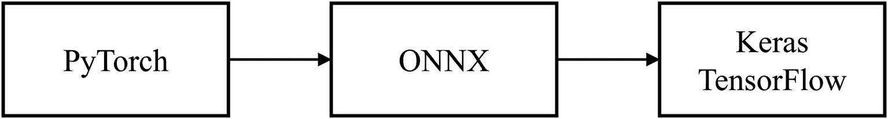

图 2-23

将 PyTorch 模型转换为 Keras/TensorFlow 模型的图示

让我们从使用 `pip install torch` 安装 PyTorch 开始。它可以导入为 `import torch`。

你可以在 [`pytorch.org/vision/stable/models.html`](https://pytorch.org/vision/stable/models.html) 找到 PyTorch 基于图像的预训练模型列表（注意，你也可以访问其他非图像的预训练模型）。这些基于图像的预训练模型可以通过 `torchvision.models.model_name` 访问。你可以使用 pip 安装 TorchVision：`pip install torchvision`。

在本例中，我们将把 SqueezeNet 模型的 PyTorch 实现转换为 Keras。2016 年的 SqueezeNet 模型专注于在降低计算成本的同时保持模型性能，特别是通过使用 1x1 卷积来减少参数数量。第一步是实例化 PyTorch 模型（列表 2-14）。

```py
from torchvision import models
pytorch_model = models.squeezenet1_0(pretrained=True)
Listing 2-14
Using PyTorch to instantiate a PyTorch pretrained model
```

现在我们已经实例化了 PyTorch 模型，我们可以使用 `pytorch2keras` 模型将其转换为 Keras 模型，该模型可以通过 pip 安装：`pip install pytorch2keras`。

让我们从导入 `pytorch_to_keras` 函数（列表 2-15）开始。

```py
from pytorch2keras.converter import pytorch_to_keras
Listing 2-15
Importing the necessary function to convert a PyTorch model to a Keras model
```

`pytorch_to_keras` 函数接受三个参数：PyTorch 模型、输入张量以及输入张量的形状（列表 2-16）。

```py
from torch.autograd import Variable
from torch import FloatTensor
input_np = np.random.uniform(0, 1, (1, 3, 256, 256))
input_var = Variable(FloatTensor(input_np))
keras_model = pytorch_to_keras(pytorch_model,
input_var,
[(3, None, None,)])
Listing 2-16
Converting a PyTorch model to a Keras model. Note that we did not explicitly import it, but np refers to numpy; this can be imported as import numpy as np
```

`input_np` 变量定义了输入的形状，以通道优先格式列出，其中图像的“深度”被列为形状的第一个元素。`torch.FloatTensor` 和 `torch.autograd.Variable` 函数将 numpy 数组的形状转换为有效的张量格式。

生成的 Keras 模型可以可视化以确认架构已正确转换，然后编译和拟合。

注意，并非所有 PyTorch 架构都可以转换为 Keras/TensorFlow，如果某些层或操作不支持由 ONNX 导出。请参阅 `pytorch2keras` GitHub 上的可转移层列表：[`https://github.com/gmalivenko/pytorch2keras`](https://github.com/gmalivenko/pytorch2keras)。

## 实现简单自监督学习

在本节中，我们将讨论自监督学习基本层次的实现。你会发现许多深度学习概念是相互交织的，因此我们需要等待直到第三章，因为在我们理解它们在预训练中的有效使用之前，我们首先需要深入了解什么是自编码器。

在更复杂的自监督学习形式中，架构的修改通常在预训练任务之后进行，通常是通过添加更多层来实现的，通常是为了将输出调整到所需的形状以便在任务数据集上训练，或者为了增加更多的处理能力。在自监督学习的简单应用中，我们将设计我们的自监督预训练策略，以便在预训练和正式在任务数据集上训练之前不需要进行架构更改。

为了设计一个不需要任何架构更改的自监督预训练策略，我们需要主要关注输入和输出。如果预训练任务的 *x* 和 *y* 的形状与最终任务的形状相匹配，那么就没有必要更改架构来适应它。

考虑到对图像中的人进行性别分类的任务。在这里，我们有*x* = 图像和*y* = 一维向量（一个值：0 或 1，表示性别）。因此，我们的自监督预训练任务应该同样要求模型接收一个图像并输出一个值。

对于这个例子，自监督预训练任务将是识别噪声的程度。对于每个训练示例，我们将添加具有特定标准差σ的高斯噪声。预训练模型的目的是根据噪声图像预测噪声程度σ。为了执行这样的任务，模型需要识别哪些模型特征算作噪声，哪些不算，因此它致力于发现和表示面部中的基本结构和模式。添加高斯噪声会改变图像的颜色，而不是某些特征的位置；然而，由于颜色决定了阴影、边缘和其他定义女性和男性面部一般外观的特征的存在，因此对图像像素之间颜色之间常见关系的良好理解将非常有价值。此外，它使模型更接近能够对小的扰动和噪声具有鲁棒性。

在本质上，在基本层面上，不改变架构，构建自监督学习预训练策略主要关注数据。我们可以构建两个数据集——用于预训练的增强任务数据集和用于正式训练的任务数据集——并按照这个顺序在这两个数据集上拟合模型。在训练了增强任务数据集之后，理想情况下，模型将已经发展出关于它即将进入的“世界”的表示，并且比没有经过预训练的情况下，对最终任务有更多的意识和更复杂的理解。

为了构建增强任务数据集，我们将使用加载图像到高效的 TensorFlow 数据集格式的`.map`方法（见第一章）。为了简洁起见，这里我们将只提供构建修改后的数据集时需要映射的函数。

让我们先定义一个函数，`parse_file`，它接收一个文件的路径，并使用 TensorFlow 输入/输出和图像操作来读取图像并将其转换为适当的格式（清单 2-17）。该函数返回包含图像信息的张量，我们可以在此基础上进行操作。

```py
def parse_file(filename):
raw_image = tf.io.read_file(filename)
image = tf.image.decode_png(raw_image, channels=3)
image = tf.image.convert_image_dtype(image, tf.float32)
image = tf.image.resize(image, [512,512])
return image
Listing 2-17
Function to parse a file path using TensorFlow functions
```

`alter_data` 函数将是 `.map()` 中使用的“终极函数”（见列表 2-18）。首先，我们使用 `parse_file` 函数从图像中收集信息。接下来，我们将使用 TensorFlow 的 `tf.random.uniform()` 函数从 0 到 0.5 的均匀分布中随机选择一个数字；这将作为应用高斯噪声的标准差。使用标准差和均值 0.0，我们将生成与图像相同形状的高斯噪声张量。可以通过将图像张量和噪声张量相加来将噪声应用于图像。最后，我们返回修改后的图像（现在已应用噪声）和标准差（标签）。任务数据集已被修改，使得预训练任务是预测应用于图像的噪声程度。

```py
def alter_data(filename, label):
image = parse_file(filename)
std = tf.random.uniform(shape=[1], minval=0, maxval=0.5)
noise = tf.random.normal(shape=tf.shape(image),
mean=0.0, stddev=std, dtype=tf.float32)
image = tf.add(image, noise)
return image, std
Listing 2-18
TensorFlow function to implement an alteration to the dataset for pretraining
```

如果你有一个多维输出，模型也可以预测亮度、色调等变化——这些特征对于这个任务很重要。TensorFlow 提供了一系列图像处理和数学操作，你可以使用它们来修改数据。在构建映射到函数时，最好坚持使用 TensorFlow 函数和对象，以避免错误或计算效率低下。

我们可以看到我们修改的视觉结果（见图 2-24）。


图 2-24

修改后的任务数据集的示例图像。从左到右的图像噪声（标签）标准差为 0.003、0.186 和 0.304。

然后，你可以在两个数据集上拟合模型（在编译和执行其他必要步骤之后）（见列表 2-19）。请注意，模型在修改后的任务数据集上拟合所使用的周期数与在任务数据集上拟合所使用的周期数相比，根据任务的复杂性和修改后的任务数据集的设计以及其他因素（如可用的计算资源和数据集的大小）有显著差异。如果任务极其复杂，并且修改后的任务数据集提供了难以获得但有意义且深入的表示（例如，现代自然语言处理问题），那么在修改后的任务数据集上训练模型一段时间可能是有益的。另一方面，在像这个例子中分类图像中的人的性别这样的简单任务中，以及提供有意义的表示但不是表示任务数据集世界整体的部分的修改后的任务数据集中，预训练可能不需要持续很长时间。了解预训练和正式训练之间的关系需要经验和时间，但实验你独特的条件和环境是好的。

```py
model.fit(altered_task_dataset, epochs=10)
model.fit(task_dataset, epochs=40)
Listing 2-19
Performing pretraining and ultimate training
```

应当注意的是，修改后的任务数据集和本例中的任务数据集是不同类型的问题——前者是一个回归问题（预测一个连续值），而后者是一个分类问题（对图像进行分类）。在这种情况下，这种差异并不是问题，因为两个数据集中的所有标签都位于 0 到 1 之间，这意味着一个具有 sigmoid 激活函数输出的标准模型可以在两者上运行。对于介于 0 和 1 之间的回归问题，二元交叉熵也是一个有效的损失函数，尽管如果您愿意，您可以在修改后的任务数据集上训练模型之前，使用正式的基于回归的损失函数（例如，MSE，Huber）来编译模型，然后在任务数据集上训练模型之前，使用二元交叉熵（或用于分类的其他损失函数）重新编译模型。在更高级的情况下，从修改后的任务数据集调整到任务数据集需要做出架构上的修改。您可以在本章的第二案例研究中找到这方面的例子，以及在第三章关于自编码器的章节中。利用自编码器的工具，我们可以执行更复杂的预训练策略，例如使用图像到图像的预训练任务（例如，着色、去噪、分辨率恢复）来预训练一个模型以执行图像到向量或图像到图像的任务。

## 案例研究

这三个案例研究使我们能够探索迁移学习和自监督学习的新思想和最新研究。一些想法在实施方面可能超出了本书的范围，但提供了新的视角，在设计您的深度学习方法时值得思考。

### 迁移学习案例研究：迁移学习的对抗利用

随着深度学习模型越来越多地部署到常见的生产环境中，将日益增长的对抗学习领域的发现纳入深度学习设计变得越来越重要。对抗学习关注的是如何利用深度学习模型的弱点，通常是通过进行人类肉眼难以察觉的小幅改动，但这些改动完全改变了模型的输出。深度学习中的漏洞可能导致危险的结果——例如，想象一下，如果对交通标志的恶意或意外更改导致自动驾驶汽车突然加速或刹车。

在 2020 年的一篇论文《针对深度模型的非目标攻击：利用迁移学习的安全漏洞》中，Shahbaz Rezaei 和 Xin Liu^(6)探讨了如何将对抗学习应用于迁移学习。由于许多现代深度学习应用都使用迁移学习，恶意黑客可以分析预训练模型的架构和权重，以利用部署模型的弱点。

Rezaei 和 Liu 表明，黑客仅凭对应用模型中使用的预训练模型的知识，就可以开发出导致任何期望结果的对抗性输入。因为黑客不需要知道应用模型或其重新训练的数据的权重或架构，攻击方法是**目标非对抗性**的，这允许它利用大量部署的深度学习模型，这些模型使用了公开可用的预训练模型。

考虑以下模型结构，它使用了一种简单的迁移学习形式（见图 2-25）。模型的输入通过预训练模型（包括卷积和全连接组件）传递。预训练模型的输出（一个三维向量）通过一个自定义（新添加）的全连接层，得到输出（一个二维向量）。全连接层的权重被标记出来——例如，预训练模型输出顶节点与自定义全连接层底节点之间的连接权重为 4。为了简化，忽略每个节点的偏置项。

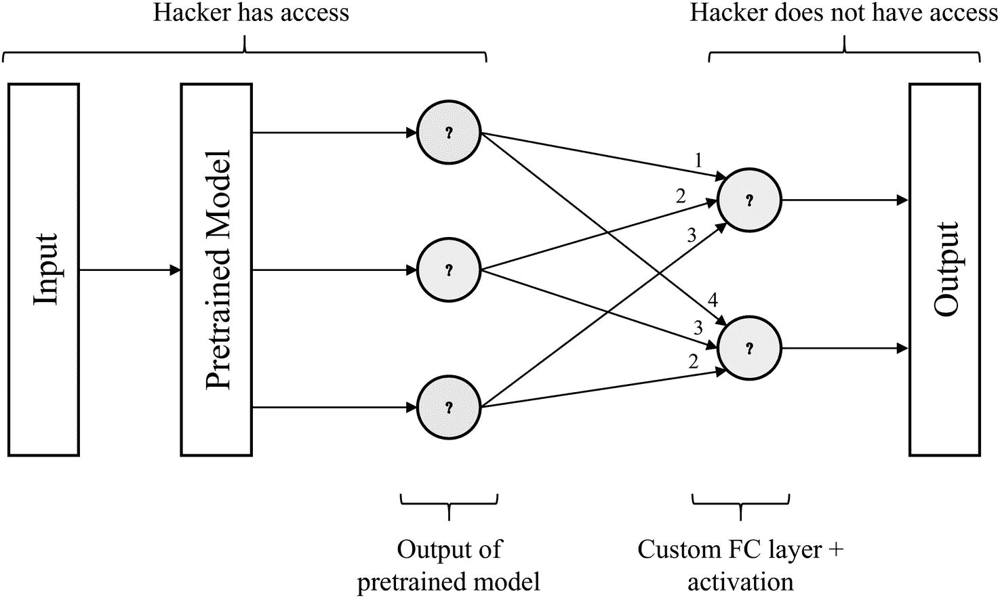

图 2-25

带有黑客可见性标记的示例迁移学习模型架构

黑客只能访问预训练模型，而不能访问自定义全连接层以及处理预训练模型输出的任何操作。

假设黑客想要构建一个输入，以触发特定的输出神经元，比如自定义全连接层底部的神经元。黑客可以构建一个输入，使得预训练模型的顶层神经元输出是一个非常大的数，而其他所有输出神经元都是 0。当乘以相应的权重时，完整模型的输出为 10 和 40；通过 softmax 激活函数放大这个差异，完整模型的底部输出神经元就是模型最终的决定，正如所期望的那样，因为它具有最大的关联值/概率（见图 2-26）。

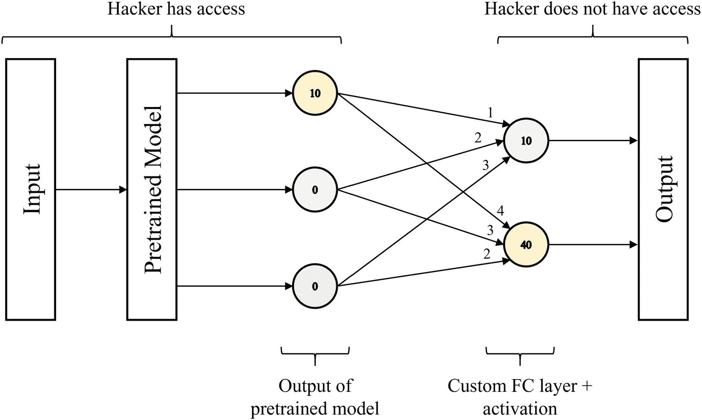

图 2-26

带有预训练模型输出神经元激活的示例迁移学习模型架构，以触发模型的具体输出

或者，如果黑客想要激活完整模型的顶层输出神经元，它可以设计一个输入，使得预训练模型的输出神经元都为零，除了最底层的，它可以是任意大的数（见图 2-27）。

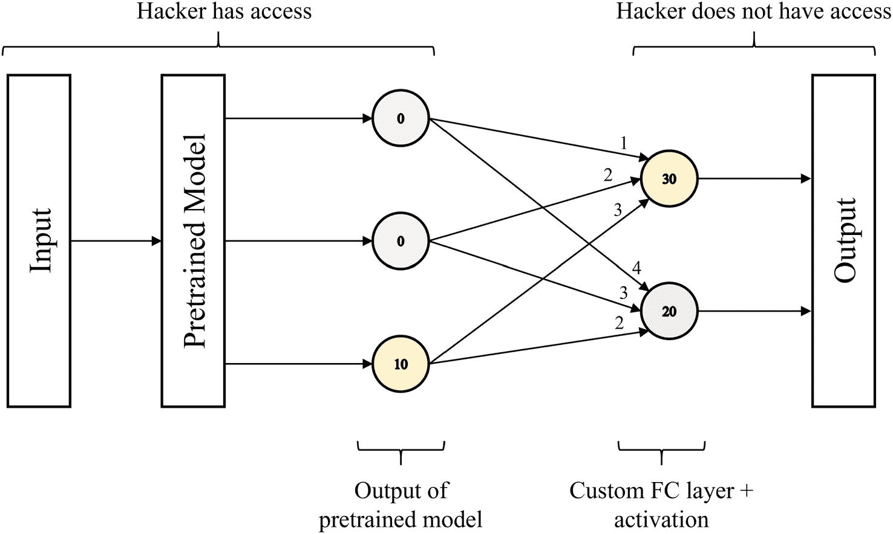

图 2-27

带有预训练模型输出神经元激活的示例迁移学习模型架构，以触发模型的具体输出

然而，因为黑客不知道预训练模型之外的自定义全连接层中的权重，他们可以执行穷举搜索，试图迫使模型输出特定的结果。在这个搜索中，黑客的目标是构建一个输入，使得预训练模型的输出第一次是[*a*，0，…，0，0]，第二次是[0，*a*，…，0，0]，依此类推，直到最后一次，[0，0，…，0，*a*]，其中*a*是某个任意大的数。对于每个期望的输出，完整网络输出中的某个节点将被激活。黑客只需记录对于预训练模型的每个设计输出，完整网络输出节点中哪一个被激活。

应该注意的是，为了使这种策略能够激活完整模型的每个输出节点，对于完整模型的每个输出节点，必须存在一个从预训练模型输出节点（其权重大于从该预训练模型输出节点到完整模型中任何其他输出节点的连接）的连接。这在更复杂的数据集中可能不成立，特别是重多类问题，但在大多数网络中，这种策略可以“迫使”网络预测几乎任何期望的结果。

因为问题现在已经被简化为找到会导致预训练组件产生特定输出的模型输入，黑客可以使用梯度下降等方法来解决以下优化问题：*调整输入图像的值，使得预训练模型的输出尽可能接近期望的输出（最小化预训练模型输出和期望输出之间的误差）*。在这种情况下，期望的输出是所有输出节点除了一个之外都是零，而那个非零节点是一个非常大的数。优化算法从一个标准的输入图像开始，对图像进行小的调整，使得预训练模型的输出是期望的输出，构建一个对抗图像。将这个对抗图像通过一个使用该预训练模型进行迁移学习的模型，即使对人类眼睛来说没有显著的变化，也能欺骗它（图 2-28）。


图 2-28

左：优化算法的示例输入图像。右：生成以产生特定网络输出的示例对抗图像。（由 Shahbaz Rezaei 和 Xin Liu 提供。）

对原始输入图像进行小的、专业的扭曲会导致模型在第一张和第二张图像之间做出不同的分类。此外，这可以在没有任何关于完整网络权重或架构的知识的情况下完成——这是一个令人印象深刻的成就。

随着目标类别（完整神经网络中的）数量的增加，攻击方法的性能下降——但仍然令人震惊。考虑在麻省大学 LFW 数据集上使用 VGG 面部预训练模型进行攻击的神经网络性能（见表 2-1）。

表 2-1

不同目标类数量攻击性能的指标。目标类：完整神经网络中的目标类数量/输出节点。NABAC：尝试破解所有类别的次数，指攻击需要进行的查询次数以“破解”一个类别（迫使模型将来自该类别的项目错误分类为另一个类别）。有效性（x%）：触发目标类并具有 x% 置信度的对抗输入与对抗输入总数之比。（由 Shahbaz Rezaei 和 Xin Liu 提供。）

| 目标类别 | NABAC | 有效性（95%） | 有效性（99%） |
| --- | --- | --- | --- |
| 5 | 48.25 ± 42.5 | 91.68% ± 5.69 | 87.82% ± 6.98 |
| 10 | 149.97 ± 132.15 | 88.87% ± 2.46 | 83.07% ± 3.31 |
| 15 | 323.36 ± 253.56 | 87.79% ± 2.42 | 82.08% ± 2.74 |
| 20 | 413 | 87.17% | 79.16% |

随着目标类数量的增加，攻击需要进行的查询次数以破解所有类别，其有效性降低。

在简化的例子中，在预训练模型之后只添加了一个全连接层。虽然这是将预训练模型集成到模型结构中的方法之一，但通常还会添加更多层。随着后续添加的层数增加，性能也会下降（见表 2-2）。

表 2-2

不同层数攻击性能的指标。（由 Shahbaz Rezaei 和 Xin Liu 提供。）

| **# 新层** | **NABAC** | **有效性（95%）** | **有效性（99%）** |
| --- | --- | --- | --- |
| 1 | 48.25 ± 42.5 | 91.68% ± 5.69 | 87.82% ± 6.98 |
| 2 | 51.87 ± 39.94 | 91.57% ± 4.87 | 86.45% ± 5.35 |
| 3 | 257.26 ± 387.16 | 89% ± 8.20 | 85.67% ± 8.88 |

尽管目标类别和新层数量增加，但有效性仍然很高。这项研究是对迁移学习在现实世界应用中部署模型的影响的有趣调查。在设计深度学习方法时，重要的是要关注部署以及模型在现实世界中的作用，而不仅仅是密封的实验环境。

这是一篇研究的概述；要了解更多信息，您可以在[`https://openreview.net/pdf?id=BylVcTNtDS`](https://openreview.net/pdf%253Fid%253DBylVcTNtDS)找到论文。

### 自监督学习案例研究：预测旋转

在“通过预测图像旋转进行无监督表示学习”一文中，Spyros Gidaris、Praveer Singh 和 Nikos Komodakis^(7) 提出了一种简单的自监督学习方法，该方法能够发展出强大的数据表示，并产生有效的结果。

Gidaris 等人提出了一种预训练策略，其中图像被随机旋转 0 度、90 度、180 度或 270 度，模型预测图像旋转的角度。旋转基于自监督学习预训练策略设计的核心直觉是，模型必须首先理解图像中描绘的模型的概念，以便识别对图像应用的旋转。此外，一个成功的模型对物体的“自然朝向”有感觉，因此重力和其他力应该作用于图像中的物体。

> *…对于一个卷积神经网络模型来说，除非它首先学会了识别和检测图像中物体的类别及其语义部分，否则基本上不可能有效地执行上述旋转识别任务。更具体地说，为了成功预测图像的旋转，卷积神经网络模型必须学会在图像中定位显著物体，识别它们的朝向和物体类型，然后将物体朝向与每种类型物体在可用图像中倾向于被描绘的主导朝向联系起来。*
> 
> —Gidaris 等人，“通过预测图像旋转进行无监督表示学习”

在没有访问原始未旋转图像的情况下，给定一个旋转了θ度（从θ = 0°，90°，180°，270°中选择）的图像，网络必须最大化图像旋转θ度的概率（图 2-29）。

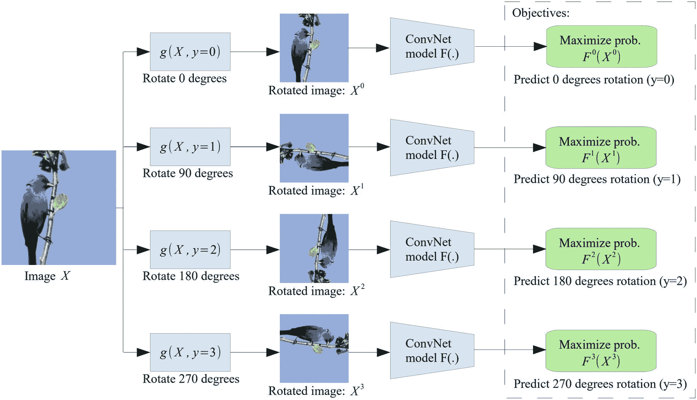

图 2-29

通过预测旋转进行自监督学习的卷积神经网络预测目标。（由 Gidaris 等人提出。）

为了直观地看到自监督学习与标准监督学习（仅在任务数据集上训练模型，而不构建预训练任务）所学习到的表示之间的差异，Gidaris 等人可视化了使用标准监督程序训练的模型和采用自监督程序训练的模型的注意力图（图 2-30）。

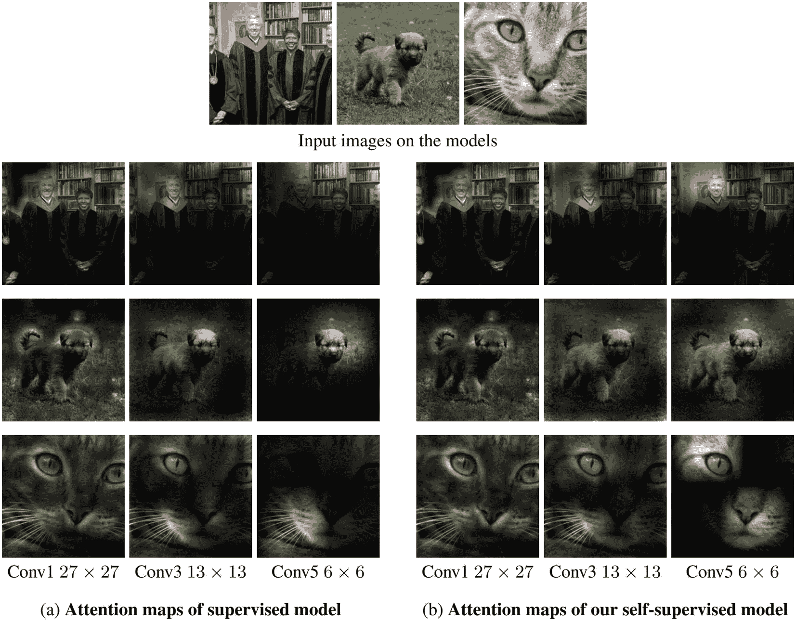

图 2-30

来自监督模型和自监督模型在不同层级的注意力图，以及三个示例输入图像。（由 Gidaris 等人提出。）

通过计算该层的特征图并汇总它们，可以找到卷积层的注意力图。你可以直观地看到，自监督模型的注意力图更多地关注高级物体，如眼睛、鼻子、尾巴和头部——这些是与执行物体识别所需的重要特征相符合的。

注

您可以通过参考单个层（假设每个层都与您使用 Functional API 定义的变量相关联）从 Keras 神经网络中间层提取特征来执行类似操作。可视化层权重和特征有助于理解自监督学习提供的表示能力提升。

有趣的是，Gidaris 等人发现，对 0°-90°-180°-270° 旋转进行分类比其他旋转（如 0°-180° 旋转、90°-270° 旋转、0°-45°-90°-135°-180°-225°-270°-315°）表现更好（见表 2-3）。这一结果突出了实验自监督策略变体的重要性，以探索哪些策略对您特定的问题和方法表现最佳。

表 2-3

预测所需不同旋转的 CIFAR-10 分类性能。（由 Gidaris 等人提供。）

| # 旋转 | 旋转 | CIFAR-10 分类准确率 |
| --- | --- | --- |
| 8 | 0°-45°-90°-135°-180°-225°-270°-315° | 88.51 |
| 4 | 0°-90°-180°-270° | **89.06** |
| 2 | 0°-180° | 87.46 |
| 2 | 90°-270° | 85.52 |

我们可以通过相对容易地预测旋转来实现自监督学习。我们将使用 CIFAR-10 数据集，该数据集可以直接从 Keras 数据集加载，使用 (x_train, y_train), (x_test, y_test) = keras.datasets.cifar10.load_data()。加载数据后的第一步是生成自监督的修改任务数据，在这种情况下是预测图像旋转了多少度（列表 2-20）。尽管有更高效的方法，但我们将简单地遍历 x_train 中的每个数据实例，随机将其旋转 0、90、180 或 270 度，并将旋转后的图像及其相应的标签保存到一个新列表中。scipy 库的 scipy.ndimage.rotate(img, deg) 允许我们轻松地进行旋转。

```py
from scipy.ndimage import rotate
ss_x_train, ss_y_train = [], []
for ind in range(len(x_train)):
rot = np.random.choice([0, 90, 180, 270])
if rot==0:
ss_x_train.append(rotate(x_train[ind], rot))
ss_y_train.append([1,0,0,0])
elif rot==90:
ss_x_train.append(rotate(x_train[ind], rot))
ss_y_train.append([0,1,0,0])
elif rot==180:
ss_x_train.append(rotate(x_train[ind], rot))
ss_y_train.append([0,0,1,0])
elif rot==270:
ss_x_train.append(rotate(x_train[ind], rot))
ss_y_train.append([0,0,0,1])
ss_x_train = np.array(ss_x_train)
ss_y_train = np.array(ss_y_train)
Listing 2-20
Constructing rotation-based altered task dataset
```

我们将使用 EfficientNetB4 架构（不使用其权重）来预测应用了哪四种旋转之一（列表 2-21）。请注意，EfficientNetB4 架构的输出是 100 维的，通过最终层投影到四个期望的输出。乍一看，一个更有效的方法似乎只需简单地定义基础 EfficientNetB4 模型中的输出类别数量为 4。我们很快就会看到为什么这种设计对于这种自监督学习操作是必需的。

此外，我们使用 input_tensor=inp 而不是之前讨论的 input_shape=(a,b,c) 和 base_model(params)(inp) 语法。如果我们使用后者，变量 base 将存储一个张量（即模型的输出）而不是模型本身。我们需要能够在自监督过程完成后访问 EfficientNet 基础模型，并将其转移到新的架构中。

```py
inp = L.Input((32,32,3))
base = EfficientNetB4(input_tensor=inp,
weights=None,
classes=100)
out = L.Dense(4, activation='softmax')(base.output)
model = Model(inputs=inp,
outputs=out)
Listing 2-21
Constructing model architecture
```

该模型可以在调整后的任务数据集上编译和拟合（见列表 2-22）。在这种情况下，由于数据集非常小（很大程度上是由于图像分辨率低而不是数据集中的项目数量），传递 numpy 数组就足够了，不需要 TensorFlow 数据集转换。

```py
model.compile(optimizer='adam',
loss='categorical_crossentropy',
metrics=['accuracy'])
model.fit(ss_x_train, ss_y_train,
epochs=100)
Listing 2-22
Constructing model architecture
```

然而，在调整后的任务数据集上进行拟合后，我们遇到了一个问题：当前模型只输出四个值，因为调整后的任务数据集有四个唯一的标签，但任务数据集（即正式的 CIFAR-10 数据集）有十个类别。这需要架构上的修改。

正是在这里，我们定义了专门用于调整后任务数据集的输出层，并且在训练调整后任务数据集时没有在基 EfficientNetB4 模型中指定`classes=4`的原因：我们可以提取基模型并将其附加到一个新的包含十个类别的输出层上，如下所示（见列表 23）。此外，因为我们定义`base`为一个模型而不是输出张量，我们可以通过输入轻松地通过`base(inp)`连接它。

```py
inp = L.Input((32,32,3))
base_out = base(inp)
out = L.Dense(10, activation='softmax')(base_out)
model = Model(inputs=inp,
outputs=out)
Listing 2-23
Constructing model architecture
```

如果我们用输出四个类别的基模型进行训练，然后在后面附加一个输出层，包含十个类别，这也是一种技术上可行的选择（因为代码可以运行），但由于四个类别的输出瓶颈，性能可能会很差。在这种情况下，不要将 EfficientNet 模型视为输出 100 个类别，而应将其视为输出 100 个特征，这些特征被编译并用于输出层中的决策。基模型仍然包含从自监督学习中学习到的所有权重。然后，新模型可以编译并在任务数据集上训练。

这种自监督学习方法显著提高了各种目标检测任务（包括 ImageNet、PASCAL 和 CIFAR-10）的无监督特征学习方面的最先进结果。

Gidaris 等人的一项工作指出，存在简单而有效的方法将自监督学习应用于提升深度学习模型性能。

### 自监督学习案例研究：学习图像上下文和设计非平凡预训练任务

之前，我们讨论了相对简单的自监督学习示例，例如向任务数据集中添加噪声并预训练模型以预测噪声程度。其他示例在概念上可能很简单（尽管可能难以实现或完成），例如预训练模型以着色灰度图像。虽然有时像预测旋转程度这样的简单自监督策略是有效的，但在其他情况下，为了获得更大的性能提升，需要使用更复杂的预训练任务。

Carl Doersch、Abhinav Gupta 和 Alexei A. Efros 在他们 2016 年的论文“通过上下文预测的无监督视觉表示学习”（^(8）中提出了一种复杂、创新且有效的自监督学习预训练任务。他们的设计是成功设计自监督预训练策略需要考虑的影响和可能性的绝佳案例研究。

在上下文预测预训练任务中，模型必须预测一个补丁相对于另一个补丁的相对位置或上下文（图 2-31）。补丁是图像中的小、正方形区域。模型被输入一个基础补丁（用蓝色勾勒）和从基础补丁周围的八个区域中选择的一个相邻补丁（用虚线红色勾勒），并训练以预测相邻补丁相对于基础补丁的位置。在示例中，标签将是“左上角”。

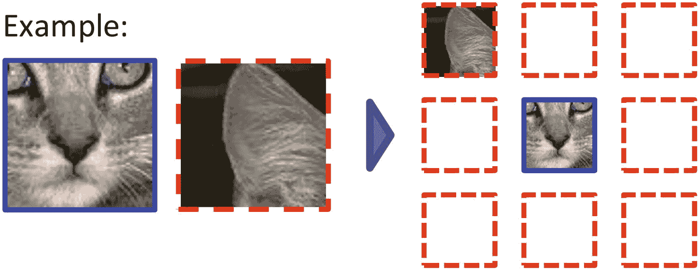

图 2-31

上下文和补丁关系的示例

每个可以描述相邻补丁相对于基础补丁位置的通用方向都与一个数字相关联。因此，模型接受两个图像（基础补丁和相邻补丁）并输出一个向量，指示相邻补丁最有可能位于相对于基础补丁的哪个区域（图 2-32）。

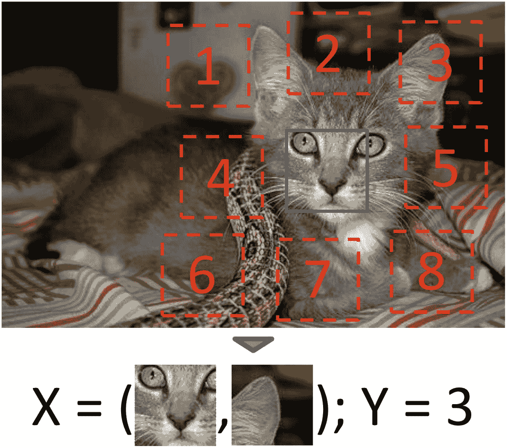

图 2-32

为相邻补丁方向分配数字

为了执行这个预训练任务，Doersch 等人构建了一个多输入网络，该网络接受两个输入，通过一系列基于图像的层在各自的“分支”中处理图像，合并两个分支，处理合并后的结果，并输出一个输入相对于另一个输入的位置（图 2-33）。图 2-33 中的虚线表示共享权重，这意味着两个层的权重是相同的。我们将在后面的章节中讨论多输入网络、分支和权重共享。

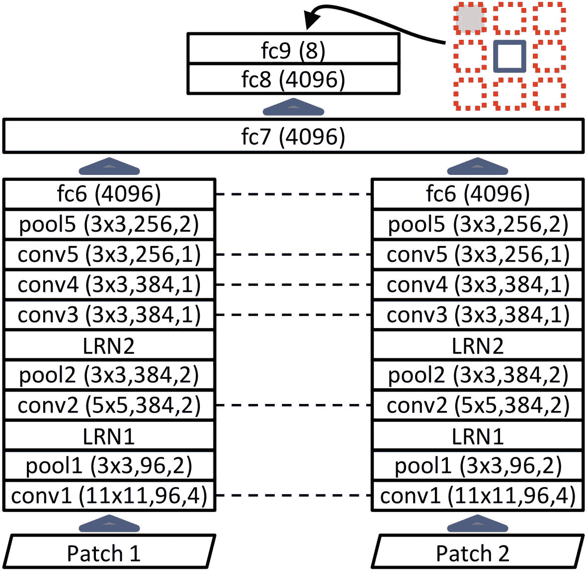

图 2-33

用于执行预训练任务的双输入架构

这个预训练任务，至少在理论上，需要深刻理解某些物品的核心特征以及物体属性之间的高级关系。这使得即使是人类也难以做到。尝试回答这两个视觉问题（图 2-34）。

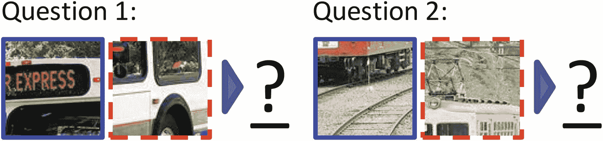

图 2-34

两个补丁对输入的“问题”示例

然而，Doersch 等人发现神经网络正在学习“简单解决方案”——也就是说，它正在找到与 Doersch 等人希望它学习的概念无关的预训练任务的捷径和简单方法。

例如，像边界模式或纹理在块之间的延续这样的低级线索，是神经网络可以不学习它理想中应该学习的高级关系而利用的简单捷径。为了解决这个问题，Doersch 等人增加了块之间大约一半宽度的间隙，并为每个块位置添加了最多 7 像素的随机“抖动”。（这些修改在图 2-32 中有所展示。）通过这些修改，网络无法可靠地利用像纹理和线条延续这样的简单捷径。

然而，另一个意想不到的问题出现了：一种称为色差的现象，其中光线穿过透镜时，根据其波长在不同的点上聚焦。因此，在受色差影响的相机镜头中，一种颜色——通常是绿色——相对于其他颜色通道（红色和蓝色）向图像中心“收缩”。因此，网络可以通过检测绿色和洋红色（由非绿色颜色通道红色和蓝色组成的颜色）之间的分离形状和位置来解析块的绝对位置。因此，在知道两个块的绝对位置的情况下，找到相对位置变得是一项简单任务。

为了解决这个问题，Doersch 等人从每个块中随机丢弃了两个颜色通道，并用高斯噪声替换了丢弃的通道。这种方法防止神经网络利用颜色通道中的信息，而是专注于其预训练任务中的更高级特征——形状和边缘。 

通过对架构进行修改，例如只使用一个“分支”并添加更多卷积层，Doersch 等人将两个图像到向量的架构转换为图像到向量的架构。作者在 PASCAL 视觉对象类别（VOC）挑战赛上测试了这个预训练架构，并发现这种自监督学习策略是无需使用数据集中未包含的标签（据他们所知，在论文发布时）的最佳结果。作者在其他数据集中发现，这个上下文预测任务显著提高了模型性能。

这篇论文既是一个精心设计的自监督学习预训练任务的例子，也是通过阻止简单解决方案来修改预训练任务以实现最终目标的过程的例子。自监督学习为我们提供了一种巧妙的方法，可以在不搜索昂贵的标签和超出数据集范围的情况下找到、提取和利用丰富的见解和信息。

## 关键点

在本章中，我们讨论了预训练、迁移学习和自监督学习背后的直觉和实现：

+   预训练是在模型正式训练之前执行的任务，可以使模型朝着在最终任务上表现更好的方向。

+   由于预训练将模型移动到损失景观中更方便的位置，它比没有预训练的模型更快地到达更好的解决方案。因此，预训练通常有两个关键优势，可以提升模型性能：减少时间和更好的度量分数。

+   迁移学习使用两个独立的数据库集——一个通用数据库集和一个任务数据库集。模型首先在通用数据库集上训练，然后将任务学习到的权重和“技能”转移到在任务数据库集上训练的另一个模型上。预训练模型通常保存在公开可用的存储库中，可以在自己的模型中访问和使用。

    +   基于图像的预训练模型通常由两个组件组成：一个特征提取组件和一个全连接组件（“顶部”）。您可以选择以下操作：(a) 仅保留特征提取组件并构建自定义 FC 组件，(b) 保留特征提取组件和全连接组件，或者(c) 保留特征提取组件和 FC 组件，但之后添加更多层。

    +   层冻结允许您通过迁移学习选择性地训练模型的一部分，以更好地利用预训练权重。通常，预训练模型的权重被冻结，而自定义添加的层被训练。在此步骤之后，有时预训练模型被解冻，整个网络被训练以在数据上进行微调。

    +   Keras/TensorFlow 内置了一个预训练模型库，这些模型组织成模块，其中每个模块包含预训练模型和相关函数（通常用于编码和解码）。重要的预训练模型包括 ResNet 系列、InceptionV3 模型、MobileNet 系列和 EfficientNet 系列。Keras/TensorFlow 模型在 ImageNet 数据集上进行了预训练。您还可以将 PyTorch 模型转换为 Keras/TensorFlow 模型，以利用 PyTorch 庞大的预训练模型库。

+   自监督学习在从任务数据库集的输入数据派生出的修改后的任务数据集上进行预训练。修改后的任务数据集的*x*和*y*完全来自任务数据集的*x*，通常通过执行扭曲或操作来生成标签。自监督学习有助于使模型面向表示和理解数据集的“世界”，以便它准备好理解任务数据集的动态和核心特征。

    +   自监督学习对于在小型数据集上训练，标签很少，或者当有大量未标记数据而其他情况下不会使用时，特别有价值。

+   转移学习和自监督学习之间有两个关键区别。首先，在转移学习中，预训练数据集和任务数据集通常来自完全不同的来源，而在自监督学习中，预训练数据集是从任务数据集的输入数据中派生出来的。其次，转移学习的目标是开发“技能”，而自监督学习鼓励“世界的表示”。

尽管我们在本章中实现了相对简单的模型和方法，但有了这些概念工具以及转移学习和自监督学习的设计直觉，你将能够构建更多更复杂的训练结构，例如堆叠预训练模型（“双重转移学习”）或设计创新的自监督预训练方法。

在下一章中，我们将扩展我们对高级神经网络结构和使用自动编码器进行操作的研究，自动编码器是一种常用于开发成功训练结构的通用工具。
