# 3. 自动编码器的多功能性

> *一个恰当的词胜过千言万语。*
> 
> ——爱德华·艾比，美国作家和散文家^(1)

编码和解码实体（如思想、图像、物理材料、信息等）的概念特别深刻且重要，因为它深深地嵌入到我们体验和理解周围环境的方式中。编码和解码信息是沟通和学习过程中的关键步骤。每次你与人交流、观察天气、阅读这本书——就像这样——或以某种方式与信息互动时，你都在进行编码和解码、观察和解释的过程。我们可以利用这个想法与深度学习的自动编码器概念相结合。

本章将首先探讨自动编码器的直觉和理论，以及它们如何被应用。它还将涵盖 Keras 神经网络操作方法和神经网络设计，这些方法对于实现自动编码器以及后续章节中更复杂的神经网络设计至关重要。本章的另一大部分将致力于通过五个应用来探索自动编码器的多功能性。虽然自动编码器是一个简单的概念，但将其融入解决深度学习问题的努力中，可以在平庸和成功解决方案之间产生差异。

## 自动编码器的直觉和理论

尽管我们将更具体地阐明编码和解码的含义，与自动编码器的直觉相关，但就目前而言，它们可以被视为紧密相连的抽象操作。在我们的目的中，编码一个对象就是以损失可量化信息的方式表示它。例如，我们可以通过总结来编码一本书，或者通过关键感官方面（如显著的触觉或听觉）来编码一次经历。解码就是接收对象的编码表示并重建该对象。编码和解码的目标是“协同工作”，以便重建尽可能准确。例如，一个有效的书籍摘要（编码）是读者可以从中大致构建出书籍主要思想的摘要，并且准确性相当高。

假设有人给你展示了一张狗的图片。他们让你看那幅图片几秒钟，然后拿走它，并要求你通过绘画来重建那幅图片。在这几秒钟内，理想情况下，你会提取出该图像的关键特征，以便通过某种有效的方法尽可能准确地绘制出来。也许你会记得狗是面向右侧的，头部直立，它很高，看起来像是静止不动的。

有趣的是，这些都是高级抽象概念——例如，要推断一个对象面向某个方向，你必须知道该对象各个部分的方位关系（例如，如果头部朝一个方向，尾巴应该朝另一个方向），并且能够在一个空间环境中表示它们。或者，知道一只狗很高需要知道“标准”或“矮小”的狗是什么样子。识别运动缺失需要知道这个特定类别对象的运动是什么样的。

这里关键的思想是，在复杂对象和关系的背景下，为了有效地压缩和重建一个对象，该对象必须相对于其他对象进行压缩。孤立地压缩一个对象，即使具有高重建性能，也比压缩可以访问到额外相关知识集的对象更困难或表现更差。这就是为什么恢复狗的图像比恢复不熟悉物体的图像更容易。有了狗的图像，你首先识别出这个对象是一只狗，从而确定与“狗”实体相关的知识是相关的，然后可以观察图像如何偏离狗的模板。在解码时，如果你已经知道图像是狗的（技术细节：这个信息可以通过编码传递），你可以通过首先初始化与狗相关的知识——它的标准解剖结构、它的行为和它的性格——来完成大部分繁重的工作。然后，根据需要添加偏差和具体细节。

由于高效压缩复杂实体需要构建高度有效的知识表示和快速检索，因此这对编码-解码操作在深度学习中非常有用。这组操作通常被称为自动编码器结构，尽管我们将更深入地探讨它所包含的内容。由于编码和解码的过程对学习和促进知识有效表示的发展至关重要，自动编码器在深度学习中找到了许多应用。

同样，应该指出的是，这种对上下文的依赖使得自编码器通常不适合像图像压缩这样的任务，这些任务需要更通用的信息提取方法。自编码器作为数据压缩工具受到限制，仅限于它们处理的数据上下文，并且即使在这种上下文中，其性能也最多与现有的更通用的压缩算法相当。例如，如果你给它提供成千上万的菠萝图像，你只能训练一个标准的自编码器来有效地编码几个菠萝图像；例如，自编码器将无法重建 X 光图像。这是一个批判性地评估深度学习作为解决某些问题的方法可行性的好例子，也是一个必要的提醒，即深度学习不是一个万能的解决方案，需要与其他组件一起工作才能产生完整的产品。

考虑以下由自编码器对 MNIST 数字数据集中的图像进行的重构，该自编码器被迫将每个图像编码为仅四个数字，然后从这四个数字中解码图像（图 3-1）。我们可以观察到网络依赖于数字的“模板”。例如，原始数字“5”具有非常独特的形状，边缘和接合处都很锋利，但网络的重建图像看起来像另一幅不同的图像——尽管它表达了相同的“5”概念，但它要圆滑得多，风格感也弱得多。对于数字“0”、“4”、“1”和“9”也可以观察到类似的模式。在这里，我们看到自编码器不仅仅是寻找图像的高效压缩算法，它还在执行聚类和一点“幕后”的“软”分类，以帮助重建输入图像的一般概念。

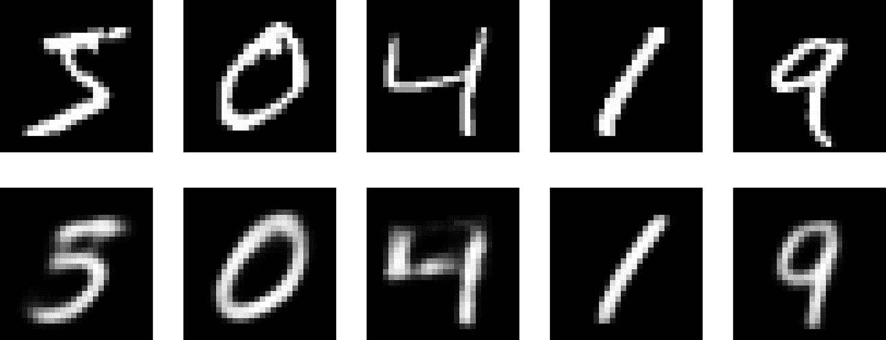

图 3-1

顶部行：输入/原始图像。底部行：重构的输入

尽管自编码器是一个无监督任务——没有标签——但它能够执行高度有效的聚类并学习数据的关键特征、属性和结构。

形式上，自编码器由三个一般组件组成：编码器、瓶颈和解码器（图 3-2）。这些组件不是相互排斥的；它们是重叠的。编码器接收输入并输出编码表示，解码器接收编码表示并将其解码为输出。“瓶颈”指的是编码器和解码器之间共享的节点：它是编码器的输出和解码器的输入。它可以被认为是保存输入的编码表示。它也被称为潜在空间，“潜在”一词来自拉丁语中的“to be hidden”——它是一个包含“隐藏”表示的空间，这些表示对于压缩/编码数据来说是可解的，只有解码器才能解密。

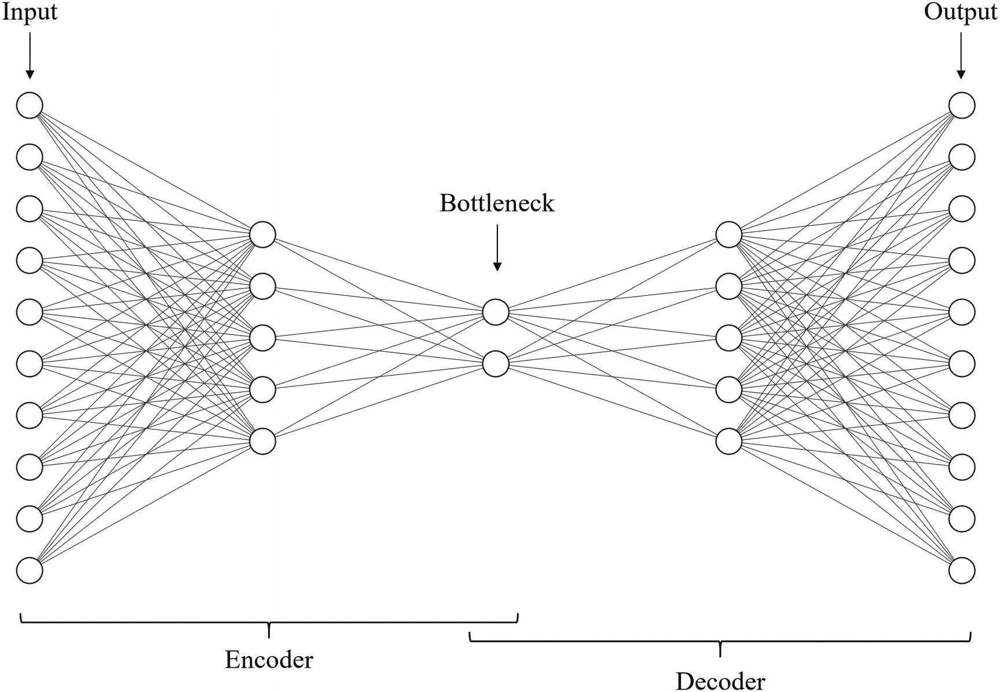

图 3-2

自动编码器图的组成部分

自动编码器的输入和输出大小相同，因为自动编码器是在重建任务上训练的——给定一个输入项，目标是尽可能高精度地重建输出。这是自动编码器的一个关键特性，将是我们设计这些结构的核心。

训练一个神经网络“什么都不做”——输出任何输入的内容——对于许多架构来说是一个简单的任务。然而，自动编码器之所以对各种应用如此有意义和有用，关键在于瓶颈。与原始形式中表示输入数据所需的节点数量相比，瓶颈层中节点数量的减少（或用任何其他数据存储单元替换节点）使得重建任务变得困难，迫使自动编码器发展有效的编码和解码方法。图 3-3 和 3-4 展示了在 MNIST 数字数据集上训练的两个自动编码器的重建表示，一个瓶颈更大。虽然第一个自动编码器显然瓶颈太小，无法发展出合理的准确重建，但另一个自动编码器能够发展出一定程度的细节——五的尖锐度，九的茎的轻微卷曲——这可能会引起对任务是否过于简单的担忧。但这取决于你使用自动编码器的应用。

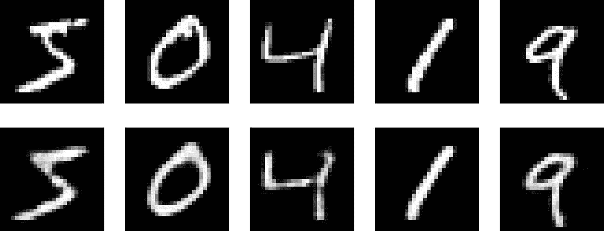

图 3-4

原始图像及其由大瓶颈尺寸的自动编码器重建

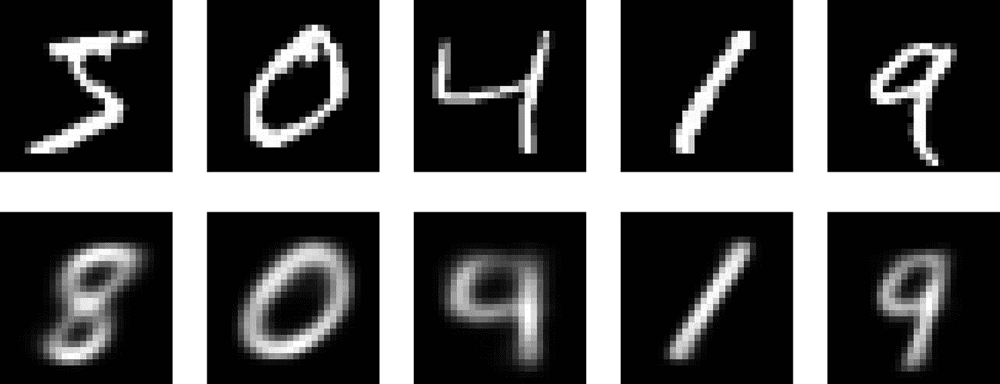

图 3-3

原始图像及其由小瓶颈尺寸的自动编码器重建

自动编码器的“主要内容”主要在于其应用。我们将首先讨论自动编码器如何设计并实现用于表格数据和图像数据。然后，我们将探讨自动编码器五个应用的直觉和实现。

## 自动编码器实现的方案设计

在自动编码器的实现中，需要考虑许多因素，这取决于其应用的形式。在本节中，我们将通过示例广泛讨论设计一维（向量）和二维（表格）数据自动编码器的考虑因素。

### 表格数据的自动编码器

对于我们的目的而言，表格数据指的是可以表示为`(n, s)`形式的数据，其中`n`表示数据点的数量，`s`表示每个数据点中的元素数量。整个数据集可以放入一个二维表中，其中每一行表示一个特定的数据点，每一列表示该数据点的特征。

为表格数据构建自动编码器是一个合适的起点，因为可以通过简单地改变该层的节点数来轻松地操作任何一层的数据形状。其他形式的数据，如图像，的形状更难处理。能够操作形状对于自动编码器设计至关重要，因为编码和解码实体的概念在编码前、编码后和解码前对数据的形状有相对严格的要求。

标准自动编码器（通常简称为“AE”）与“深度自动编码器”之间的区别也应该在此处注意。尽管确切的术语似乎还没有稳定下来，但通常自动编码器指的是浅层自动编码器结构，而深度自动编码器包含更多的深度。通常，这是由输入数据的复杂性决定的，因为更复杂的数据形式通常需要更大的深度。由于可以以表格格式排列的数据通常比图像或文本数据（或神经网络擅长建模的其他高度专业化和复杂的数据）更简单，因此通常可以将用于高分辨率图像集或文本的自动编码器结构称为深度自动编码器，而将用于表格数据的自动编码器结构称为简单的自动编码器。

在这个例子中，我们将构建一个 784 维数据的自动编码器。也就是说，每个数据点由 784 个特征组成。让我们首先导入必要的模型和模块。我们将使用`import keras.layers as L`方法来处理导入层，而不是为了方便而逐个按名称导入每个层（见 3-1）。此外，由于在这种情况下不需要使用功能 API——我们不是构建非线性拓扑，也不需要如此强大的对某些层的访问权限，以至于需要为其分配自己的变量——我们将选择更简单的序列模型结构。

```py
import keras.layers as L
from keras.models import Sequential
Listing 3-1
Importing important layers and models
```

一旦我们初始化了序列模型结构，我们就可以添加输入层，该层接收 784 维度的输入数据。

现在，我们将构建自动编码器的编码组件（见 3-2）。编码器应该依次减小数据的大小，以指导编码过程。在这种情况下，第一次减小大小是从 784 个节点到 256 个节点；第二次是从 256 个节点到 64 个节点；第三次是从 64 个节点到 32 个节点。通过减少每个`Dense`层中的节点数，我们正在减少自动编码器表示输入数据所需的空间。

```py
model = Sequential()
model.add(L.Input((784,)))
model.add(L.Dense(256, activation='relu'))
model.add(L.Dense(64, activation='relu'))
model.add(L.Dense(32, activation='relu'))
Listing 3-2
Building a simple encoder using Dense layers for tabular data
```

编码器的最后一层包含 32 个节点，这意味着瓶颈将是 32 个节点宽。这意味着，在最极端的情况下，自动编码器必须找到包含 32 个值的 784 个特征的表示。

应当注意的是，每个层的节点数通常是 2 的幂次方，这一规则在本书的示例以及研究人员设计的神经网络架构中都有体现（其中一些在案例研究中展示）。许多人认为这种规则对内存管理方便，并且是有效扩展节点数量的好方法（当节点数量较多时，有效变化是*成比例的*而不是累加的）。然而，如果你的设计需要无法适应这种规则的节点数量，那么这种规则并非必需。

然后，我们可以添加解码器层，这些层应该依次扩展神经网络从其编码表示解码数据的空间（见清单 3-3）。虽然这对自动编码器的成功并非严格必要，但通常为了方便，解码器是按照与编码器对称的方式构建的。在这里，解码器执行与编码器相同的步骤，但“相反”。第一次扩展是从 32 个节点的编码表示到 64 个节点；第二次是从 64 个节点到 256 个节点；最后是从 256 个节点到 600 个节点，这是原始输入数据的形状。

```py
model.add(L.Dense(64, activation='relu'))
model.add(L.Dense(256, activation='relu'))
model.add(L.Dense(784, activation='sigmoid'))
Listing 3-3
Building a simple decoder using Dense layers for tabular data
```

注意，在这个例子中，模型的最后一层的激活函数是 sigmoid 激活函数。我们传统上在分类问题的神经网络中放置 sigmoid 激活（或其他相关曲线和有界函数及其适应）以限制神经网络。但这可能或可能不适合你的特定任务。

如果你的输入数据完全由二进制数据组成或可以适当地转换为这种形式，sigmoid 可能是一个合适的激活函数。确保你的输入数据被正确缩放是很重要的；例如，如果一个特征是二进制的，它只包含值 10 和 20，那么你需要调整该特征，使其只包含值 0 和 1。或者，如果你的特征不是严格二进制的但倾向于围绕两个界限聚集，sigmoid 也可能是一个合适的选择。

另一方面，如果一个特征在较宽的范围内相对均匀地分布，可能不适宜使用 sigmoid 激活函数。sigmoid 函数的斜率使得在 0.5 附近输出中间值比在 0 或 1 附近更“棘手”；如果这不足以代表特征的分布，还有其他选项可用。例如，ReLU（归一化线性单元，定义为 *y* = max(*x*, 0)）可能更合适。然而，如果您的特征范围包括负输出，则使用线性激活（简单地说，*y = x*）。请注意，根据表格数据中特征的特征，您需要选择不同的损失和度量标准——主要考虑回归或分类。

对于表格数据的自动编码器来说，一个挑战是表格数据通常不是由与图像或文本相同的上下文统一因素结合在一起的。一个特征可能来自与另一个特征完全不同的上下文，因此您可能同时拥有一个连续特征和一个分类特征，而表格自动编码器必须同时适应这两个特征。在这里，需要特征工程（例如，将分类特征编码为连续值）来“统一”特征的问题类型。

使用 `plot_model()` 绘制模型显示，在编码步骤中尺寸连续减小，在解码步骤中尺寸连续增加，正如预期的那样（图 3-5）。

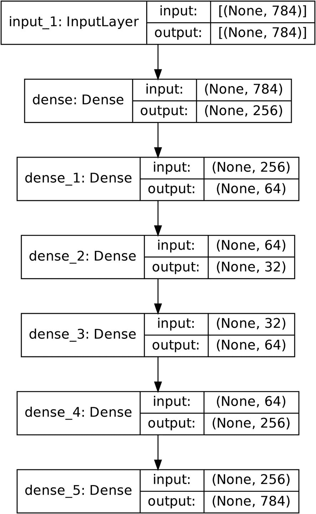

图 3-5

仅使用 Dense 层进行表格数据的示例自动编码器

然而，在构建自动编码器时，通常更倾向于模块化设计而不是顺序堆叠层。模块化设计指的是将模型实现为几个子模型之间的关系。通过使用模块化设计，我们可以轻松访问和操作子模型。此外，它更清楚地说明了模型的功能及其组件。在自动编码器中，两个子模型是编码器和解码器。

要构建模块化设计，首先定义每个子模型的架构。然后，使用 Functional API 定义每个子模型作为另一个对象的输入，并使用 `keras.models.Model` 将子模型聚合到一个总模型中。

让我们构建与之前相同的架构，但采用模块化设计（代码列表 3-4）。请注意，您可以将 `name='name'` 参数传递给模型，以便为其附加一个名称，以便稍后引用。

```py
encoder = Sequential(name='encoder')
encoder.add(L.Input((784,)))
encoder.add(L.Dense(256, activation='relu'))
encoder.add(L.Dense(64, activation='relu'))
encoder.add(L.Dense(32, activation='relu'))
decoder = Sequential(name='decoder')
decoder.add(L.Input((32,)))
decoder.add(L.Dense(64, activation='relu'))
decoder.add(L.Dense(256, activation='relu'))
decoder.add(L.Dense(784, activation='sigmoid'))
Listing 3-4
Building a simple encoder and decoder using Dense layers for tabular data with compartmentalized design
```

一旦我们定义了子模型（即 `encoder` 和 `decoder`），我们可以将它们视为层，并使用 Functional API 将它们聚合到一个总模型中（代码列表 3-5）。回想一下，我们可以通过将它们写成前一个对象的函数来将模型视为 Functional API 中的层。

```py
ae_input = L.Input((784,), name='input')
ae_encoder = encoder(ae_input)
ae_decoder = decoder(ae_encoder)
from keras.models import Model
ae = Model(inputs = ae_input,
outputs = ae_decoder)
Listing 3-5
Compiling sub-models into an overarching model – the autoencoder – with compartmentalized design and the Functional API
```

当绘制总体模型的架构（图 3-6）时，Keras 现在只显示组成它的直接层和子模型。这有助于理解具有许多层的自动编码器的一般架构和数据流，而无需看到每个单独层的具体操作。

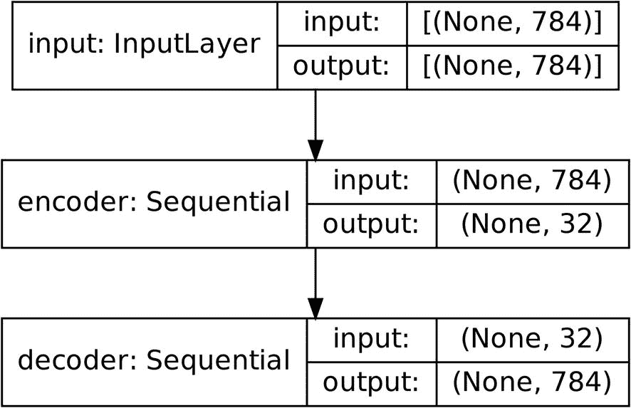

图 3-6

使用分区设计构建的自动编码器架构的可视化

使用分区设计为自动编码器的主要实际好处是，在编译和拟合后，我们可以调用 `encoder.predict(input_data)` 来获取学习到的编码。如果您不使用分区设计，您也可以使用第二章中讨论的层检索方法（例如，get_layer()）来创建一个由编码层组成的模型对象，但这比必要的要多，并且可移植性较差。访问编码器对数据的编码对于我们将在本章后半部分讨论的许多自动编码器应用是必要的。

如第二章所述，您可以使用这种实现设计方法与所有 sorts of 其他结构结合使用，以轻松冻结整个层的组，或者为了这里提到的分区设计的其他好处，如更好的组织或更容易引用模型。例如，这种分区设计可以用来将使用迁移学习的模型分成两个子模型：预训练的卷积组件和定制的全连接层。通过调用 submodel.trainable = False 可以轻松地冻结预训练的卷积组件。

### 图像数据的自动编码器

为图像数据构建自动编码器遵循与构建表格数据自动编码器相同的逻辑：编码器应通过使用“减少”操作将输入压缩成编码表示，解码器应通过使用“扩大”操作将编码表示扩展成输出。然而，我们需要考虑额外的因素以适应数据形状增加的复杂性。

“扩大”操作需要是“减少”操作的某种“逆”操作。在 Dense 层中，这并不是一个大问题，因为扩大和减少操作都可以通过简单地增加或减少后续层的节点数来执行。然而，由于常见的基于图像的层，如卷积层和池化层，只能执行减少操作，我们需要明确指出解码组件不仅是对编码组件“反向”的（正如在构建表格数据的自动编码器中所述），而且是在逐步逆转编码操作。这给构建编码器和解码器带来了复杂性。

尽管在语言和高级表格数据中使用深度自编码器方面有所发展，但自编码器主要用于图像数据。正因为如此，对自编码器有广泛的知识是成功处理大多数图像相关深度学习任务所必需的。

### 图像数据形状结构及其变换

因为形状对于卷积自编码器设计非常重要，所以首先，我们必须简要讨论图像形状及其变换方法。

一张图像的形状为 `(a, b, c)`。使用常用的通道最后表示法，`a` 和 `b` 代表图像的空间维度，而 `c` 代表通道数或深度（图 3-7）。例如，标准彩色图像有三个通道，对应于 RGB 图像中的红色、绿色和蓝色值。基于图像的层通常可以通过改变其形状的三个元素来操纵图像。

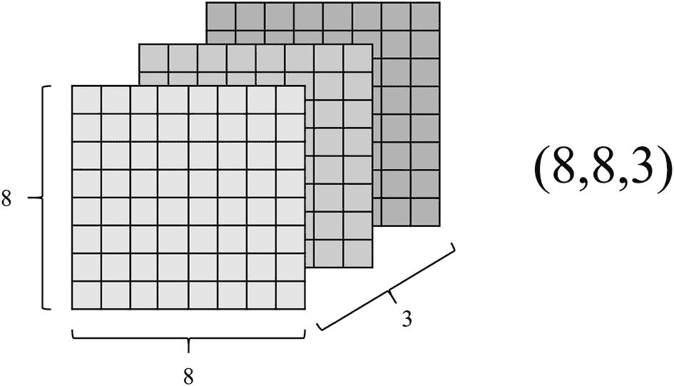

图 3-7

图像三个维度的示意图

表 3-1 列出了在卷积神经网络中使用的四个关键层。请注意，通常图像的高度和宽度是相同的（图像是正方形），这使得探索变换变得简单。此表假设形状为正方形，尽管你可以将类似的逻辑应用于矩形输入。此外，此表假设使用步长为 1，并且输入是空间二维的，尽管逻辑同样适用于其他形式。

表 3-1

卷积神经网络中的重要层及其对图像形状的变换

| **层** | **参数** | **给定输入形状的输出** `(a, a, c)` | **描述** |
| --- | --- | --- | --- |
| 卷积 | 核形状 = `(x, y)` 过滤器数量 = `n` 填充 = “same” 或 “valid” | 如果 `padding = 'valid'`: `(a-(x-1), a-(x-1), n)` 如果 `padding = 'same'`: `(a, a, n)` | 二维卷积将形状为 `(x, y)` 的核在图像上滑动。因此，它将图像的空间维度减少 `x-1` 和 `y-1` 像素。通常 `x=y`（因此核是正方形形状），但某些架构利用矩形核形状，这在某些领域可能很成功。参见第六章节中的 InceptionV3 架构案例研究，以探索卷积分解和非正方形核形状。然而，如果填充设置为“same”，则图像会被填充（向其大小添加额外的“空白”维度），使得在执行卷积时，结果图像的形状与之前相同。我们将在稍后看到这是为什么有帮助。 |
| 池化 | 池化大小 = `(x, x)`填充 = “same”或`'valid'` | 如果`a`能被`x`整除且`padding='same'`或`'valid'`：`(a/x, a/x, c)`如果`a`不能被`x`整除且`padding='valid'`：`(floor(a/x), floor(a/x), c)`如果`a`不能被`x`整除且`padding='same'`：`(ceil(a/x), ceil(a/x), c)`^(2) | 二维池化操作提供了一种更快的方法来通过在图像上放置大小为`(x, x)`的非重叠窗口（与卷积不同，卷积是重叠的）来“总结”重要的发现。池化通常以平均池化（池化窗口中的所有元素平均）或最大池化（池化窗口中的最大元素传递）的形式使用。池化将图像大小除以池化窗口的相应维度。然而，因为图像有时可能不是窗口相应维度的精确倍数，您可以使用填充模式来帮助确定输出的确切形状。 |
| 转置卷积 | 核形状 = `(x, y)`滤波器数量 = `n`填充 = “same”或“valid” | 如果`padding = 'valid'`：`(a+(x-1), a+(x-1), n)`如果`padding = 'same'`：`(a, a, n)` | 转置卷积可以被视为卷积的“逆”。如果你通过一个卷积层然后是一个转置卷积层（具有相同的核形状）传递输入，你最终会得到相同的形状。在构建解码器时，使用转置卷积层代替编码器中的卷积层以增加图像尺寸。与卷积层一样，你也可以选择填充模式。 |
| 上采样 | 上采样因子：`(x, y)` | `(a*x, a*y, n)` | 上采样层简单地通过一定的因子“放大”图像，而不改变图像的实际值。例如，数组`[[1, 2], [3, 4]]`在上采样因子为`(2,2)`的情况下会简单地上采样为`[[1, 1, 2, 2], [1, 1, 2, 2, ], [3, 3, 4, 4], [3, 3, 4, 4]]`。上采样层可以被视为池化操作的逆操作——当池化通过在图像尺寸中除以某个数量（假设没有使用填充）时，上采样通过该数量乘以图像尺寸。上采样时不能使用填充。在构建解码器时，使用上采样层代替编码器中的池化层以增加图像尺寸。 |

注意，只有卷积层和转置卷积层包含权重；池化和上采样是简单的聚合提取特征的方法，不包含任何特定的可学习参数。此外，请注意默认的填充方法是“valid”。

构建卷积自编码器有许多方法。我们将介绍许多方法，从没有池化的简单卷积自编码器开始，以介绍这一概念。

### 无池化的卷积自编码器

如前所述，自编码器通常是对称构建的，但对于基于图像的自编码器来说，这一点更为明显。在这种情况下，*不*对称构建自编码器需要大量的形状跟踪和处理。

让我们从构建一个接受形状为 `(256, 256, 3)` 的数据的编码器开始，并依次使用卷积层对其进行编码（列表 3-6）。在许多卷积自编码器设计中，随着图像尺寸的减小，过滤器的数量会增加。确保过滤器的增加不会超过网络可用的存储量，这样在整个编码器（以及相应地在整个解码器）中数据的存储容量都会减少。

```py
encoder = Sequential()
encoder.add(L.Input((64, 64, 3)))
encoder.add(L.Conv2D(8, (3, 3)))
encoder.add(L.Conv2D(8, (3, 3)))
encoder.add(L.Conv2D(16, (3, 3)))
encoder.add(L.Conv2D(16, (3, 3)))
encoder.add(L.Conv2D(32, (3, 3)))
encoder.add(L.Conv2D(32, (3, 3)))
Listing 3-6
Building an encoder for image data using convolutions without pooling
```

在这个例子中，我们依次增加过滤器的数量（从最初的 3 个通道增加到 8、16 和 32），同时保持滤波器大小为 `(3,3)`。

通过使用 `plot_model` 进行可视化（图 3-8），我们可以看到图像的形状如何随时间变化，这与卷积层相对应。编码器的输出是一个形状为 (52, 52, 32) 的压缩图像。然而，你会注意到这个模型违反了不使用池化时过滤器数量不应超过图像尺寸减少的要求——“编码表示”比输入大（`64*64*3` < `52*52*32`）！这是因为卷积并不是快速减小图像大小的良好方法。我们需要池化来解决这个问题。目前，为了保持简单，我们将忽略这个问题。

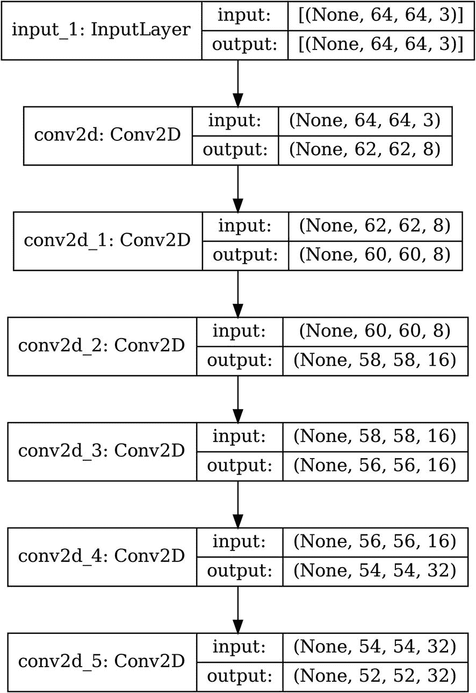

图 3-8

一个示例卷积编码器架构，没有使用池化层，仅使用卷积层

我们可以将解码器构建为“镜像”编码器，通过反转层顺序并使用逆层来“撤销”编码（列表 3-7，图 3-9）。我们知道解码器将接受一个大小为 (52, 52, 32) 的编码表示。

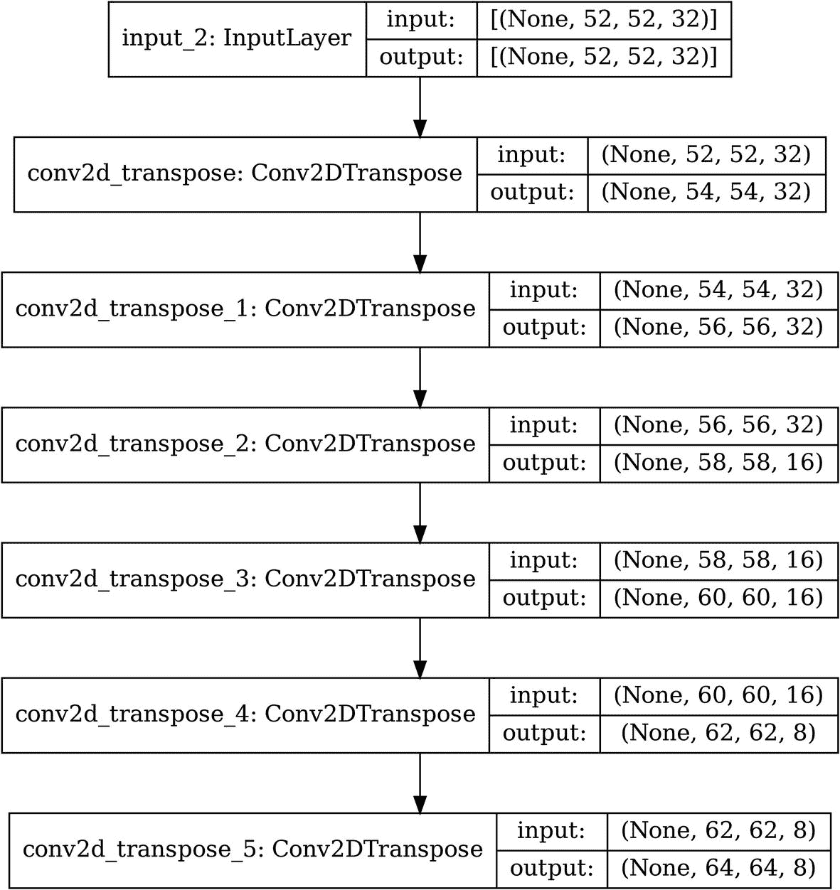

图 3-9

一个示例卷积解码器架构，没有使用池化层，仅使用卷积层

```py
decoder = Sequential()
decoder.add(L.Input((52, 52, 32)))
decoder.add(L.Conv2DTranspose(32, (3, 3)))
decoder.add(L.Conv2DTranspose(32, (3, 3)))
decoder.add(L.Conv2DTranspose(16, (3, 3)))
decoder.add(L.Conv2DTranspose(16, (3, 3)))
decoder.add(L.Conv2DTranspose(8, (3, 3)))
decoder.add(L.Conv2DTranspose(8, (3, 3)))
Listing 3-7
Building a decoder for image data using convolutions without pooling
```

存在一个问题——解码器的输出形状为 (64, 64, 8)，而输入的形状为 (64, 64, 3)。有两种方法可以解决这个问题。你可以将最后一层改为 `L.Conv2DTranspose(3, (3, 3))` 以使其具有三个通道。或者，你可以在解码器的末尾添加另一个层：`L.Conv2DTranspose(3, (1, 1))`。因为它具有 (1,1) 的滤波器大小，所以图像的宽度和高度不会改变，但通道数从 8 减少到 3。

因为卷积自编码器（以及一般的网络）依赖于重复的卷积和其他操作，所以通常一个好的做法是使用循环和必要的参数索引列表来构建它们。例如，我们可以更有效地重写编码器，如下所示（见列表 3-8）。

```py
num_filters = [8, 16, 32]
encoder = Sequential()
encoder.add(L.Input((64, 64, 3)))
for i in range(3):
encoder.add(L.Conv2D(num_filters[i], (3,3)))
encoder.add(L.Conv2D(num_filters[i], (3,3)))
Listing 3-8
Building long, repeated architectures using for loops and lists of parameters accordingly referenced within the loop
```

在这种情况下，由于每一层的滤波器数量有一个明显的模式，甚至可以不索引参数列表来编写它（见列表 3-9）。

```py
encoder = Sequential()
encoder.add(L.Input((64, 64, 3)))
for i in range(3):
encoder.add(L.Conv2D(2**(i+3), (3,3)))
encoder.add(L.Conv2D(2**(i+3), (3,3)))
Listing 3-9
Building long, repeated architectures using for loops without lists of parameters accordingly referenced within the loop
```

这种设计的主要好处是，你可以通过简单地增加层添加代码循环的迭代次数来轻松扩展网络的深度，从而节省你手动输入大量代码的需要。

### 卷积自编码器向量瓶颈设计

通常，瓶颈（编码器的输出和解码器的输入）不会保留为图像——它通常被扁平化为一个向量并重塑为图像。它们的主要好处是我们能够获得与任何空间维度无关的图像向量表示，这使得它们更“干净”且易于处理。此外，它们可以更容易地用于像预训练这样的应用（关于这一点稍后讨论）。

要做到这一点，我们需要在编码器的末尾添加一个扁平化层（见列表 3-10，图 3-10）。由于扁平化图像通常会导致一个非常大的向量，因此通常会在其上应用一些密集层以进一步处理并减小其大小。另一种选择是 GlobalAveragePooling2D 或 GlobalMaxPooling2D 层，它产生一个更小的输出向量（对每个滤波器进行平均/取最大值）；这个层与扁平化层具有相同的语法。

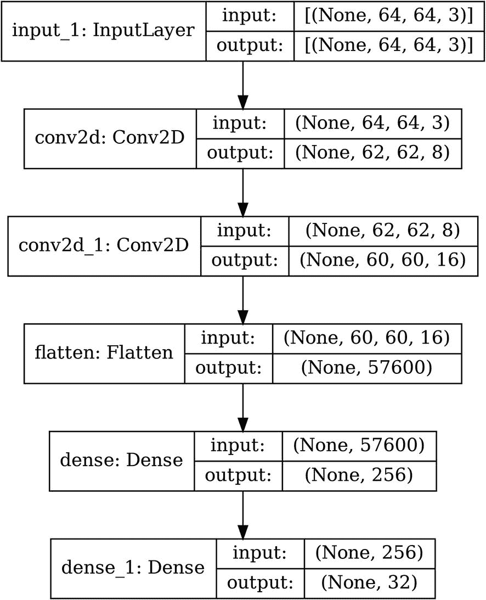

图 3-10

使用向量瓶颈设计的无池化示例卷积编码器架构

```py
encoder = Sequential()
encoder.add(L.Input((64, 64, 3)))
#convolutional component
encoder.add(L.Conv2D(8, (3,3)))
encoder.add(L.Conv2D(16, (3,3)))
#flattening and processing
encoder.add(L.Flatten())
encoder.add(L.Dense(256, activation='relu'))
encoder.add(L.Dense(32))
Listing 3-10
The architecture of an example convolutional encoder without pooling and only using convolutional layers with a vector-based bottleneck. For simplicity, the convolutional component has been reduced to two convolutional layers
```

可视化特别有助于帮助我们理解形状的转换。我们看到，在扁平化之前，编码器已经将图像编码为形状为(60, 60, 16)的图像，该图像被扁平化为 57,600 维的向量。编码器的输出是一个 32 维的向量。

我们需要这些信息来构建解码器（见列表 3-11，图 3-11）。编码器接收编码后的表示，它是一个 32 维的向量。然后它使用密集层将其大小增加到与编码器扁平化后的数据相同的大小，即(57600,)。从那里，我们可以将向量重塑为形状为(60, 60, 16)的图像，这样就可以对其应用逆卷积操作。

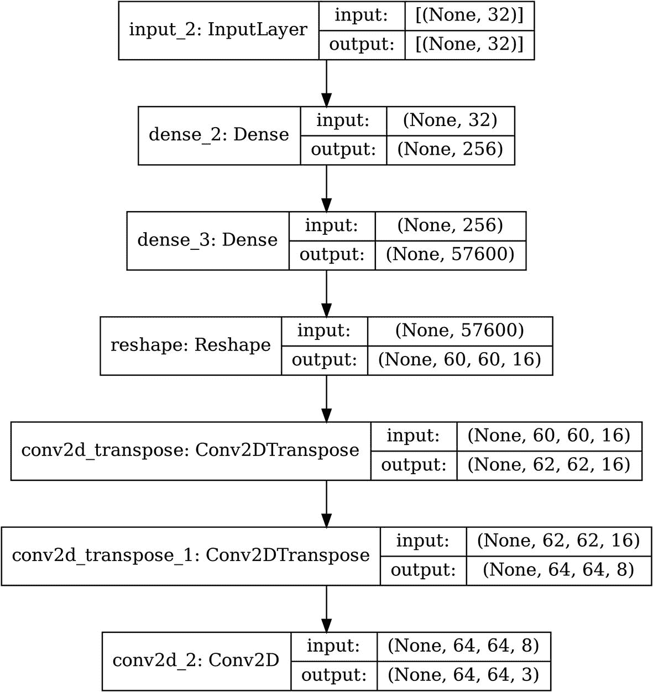

图 3-11

没有池化且仅使用卷积层的示例卷积编码器架构，采用向量瓶颈设计

```py
decoder = Sequential()
decoder.add(L.Input((32,)))
#processing and reshaping
decoder.add(L.Dense(256, activation='relu'))
decoder.add(L.Dense(57_600, activation='relu'))
decoder.add(L.Reshape((60, 60, 16)))
#applying transpose-convolutional layers
decoder.add(L.Conv2DTranspose(16, (3,3)))
decoder.add(L.Conv2DTranspose(8, (3,3)))
decoder.add(L.Conv2D(3, (1,1)))
Listing 3-11
The architecture of an example convolutional decoder without pooling and only using convolutional layers with a vector-based bottleneck
```

回想一下，为了处理输入图像中的通道数，在这种情况下，我们添加了一个额外的卷积层，滤波器大小为（1,1），以保持图像大小但减少通道数。

### 带有池化和填充的卷积自编码器

虽然我们在技术上成功地构建了一个卷积自编码器，因为输入和输出在形状上相同，但我们未能遵守自编码器设计的基本原则：编码器应逐步减小数据的大小。我们需要池化来快速减小图像大小。

卷积神经网络通常在模块（图 3-12）中构建，模块包括卷积层 - 卷积层 - 池化层（卷积层的数量可变）。这些模块可以一次又一次地重复。通过跟随几个特征提取的卷积层和一个池化层，这些提取的特征可以聚合，并将关键亮点传递到下一个卷积层进行进一步的特征提取和处理。（你可以在第六章中找到关于基于模块/单元的架构设计的更详细讨论。）

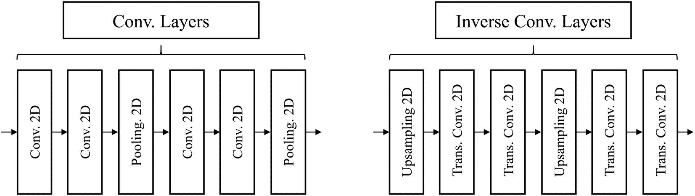

图 3-12

基于重复模块/单元的卷积自编码器设计示例

然而，当使用卷积层与池化层结合时，我们会遇到图像大小不能被池化因子整除的问题。例如，考虑一个形状为（64, 64, 3）的图像。在应用滤波器大小为（2, 2）的卷积层后，图像的新形状为（63, 63, 3）。如果我们想应用大小为（2, 2）的池化，我们需要使用填充来确定池化后的输出将是（31, 31, 3）还是（32, 32, 3）。这对于标准的卷积神经网络来说几乎不是问题。然而，在自编码器中，我们需要考虑的不仅是编码器中的操作，还有解码器中相应的逆“撤销”操作。上采样层没有填充层。因此，如果我们对大小为（31, 31, 3）的图像应用大小为（2, 2）的上采样，我们会得到一个大小为（62, 62, 3）的图像；如果我们对大小为（32, 32, 3）的图像应用它，我们会得到一个大小为（64, 64, 3）的图像。在这种情况下，我们无法简单地获得原始图像大小（63, 63, 3）。

你可以尝试使用特定的填充并手动添加填充层，但这需要大量工作，并且难以系统地操作和组织。

为了解决这个问题，构建具有池化和卷积层的卷积自编码器的一种方法是在所有卷积层上使用`padding='same'`。这意味着卷积层对图像形状没有影响——在执行卷积之前，图像的两侧会填充，使得输入和输出图像具有相同的形状。卷积仍然在改变图像的内容，但图像大小保持不变。去除卷积层的影响显著简化了图像形状的管理。除了这种简化之外，填充还允许卷积处理图像边缘的特征，这些特征在没有填充的情况下可能会被忽略，通过添加更多的缓冲空间，使得边缘特征可以被核的中心处理。

让我们为所有卷积层使用`padding='same'`构建一个自编码器的编码器（见列表 3-12）。

```py
encoder = Sequential()
encoder.add(L.Input((64, 64, 3)))
#convolutional component
for i in range(3):
encoder.add(L.Conv2D(2**(i+3), (3,3),
padding='same'))
encoder.add(L.Conv2D(2**(i+3), (3,3),
padding='same'))
encoder.add(L.MaxPooling2D((2,2)))
#flattening and processing
encoder.add(L.Flatten())
encoder.add(L.Dense(256, activation='relu'))
encoder.add(L.Dense(32))
Listing 3-12
The architecture of an example convolutional encoder with pooling and padding, using a vector-based bottleneck
```

从可视化（图 3-13）中，我们可以看到，尽管我们阻止了卷积层减小大小，但随着池化的加入，我们能够显著降低特征图分辨率。展平向量（在任何处理之前）是 2048 维的——与没有池化的展平后向量 57600 维进行比较！

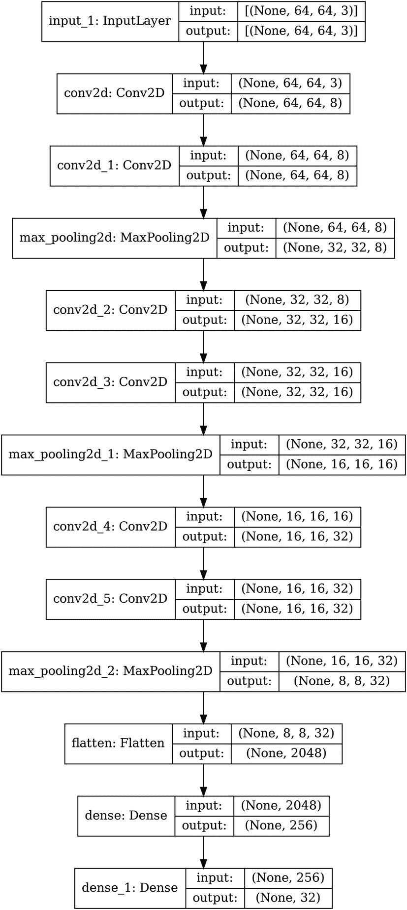

图 3-13

完整的卷积编码器，带有池化和填充

我们可以相应地构建解码器（见列表 3-13，图 3-14）。与编码器中的卷积层类似，解码器中的转置卷积层也必须使用`padding='same'`以确保对称性。

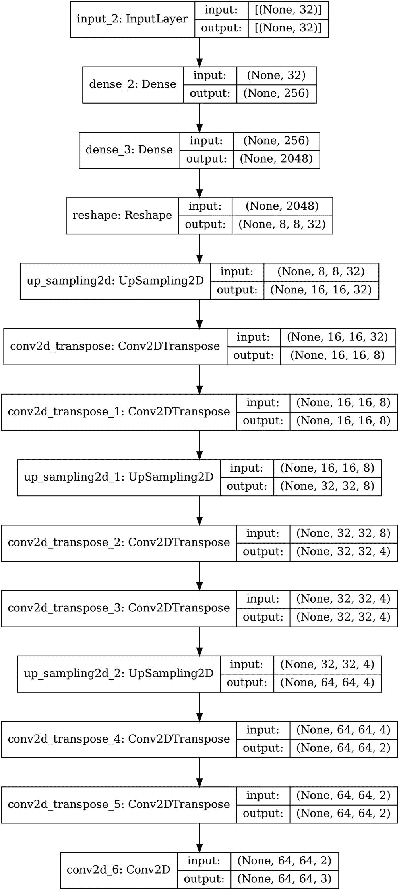

图 3-14

完整的卷积解码器，带有池化和填充

```py
decoder = Sequential()
decoder.add(L.Input((32,)))
#processing and reshaping
decoder.add(L.Dense(256, activation='relu'))
decoder.add(L.Dense(2048, activation='relu'))
decoder.add(L.Reshape((8, 8, 32)))
#applying transpose-convolutional layers
for i in range(3):
decoder.add(L.UpSampling2D((2,2)))
decoder.add(L.Conv2DTranspose(2**(3-i), (3,3),
padding='same'))
decoder.add(L.Conv2DTranspose(2**(3-i), (3,3),
padding='same'))
#adding additional layer to collapse channels
decoder.add(L.Conv2D(3, (1,1)))
Listing 3-13
The architecture of an example convolutional decoder with pooling and padding, using a vector-based bottleneck
```

当然，这种方法依赖于你的输入具有特定的大小。在这种情况下，输入大小必须是 2 的幂，因为每个池化因子将图像的空间维度减少 2 倍。你可以在输入之后立即插入一个重塑层，或者重新整理你的数据集以适应这一点。这种方法的主要优点是它使得组织形状变换的对称性变得更加简单。例如，如果你知道你想要在展平之前编码图像的形状为(16, 16, x)^(3)，并且你想要有三个大小为(2,2)的池化层和三个大小为(3,3)的池化层，你可以计算出相应的输入形状为宽度高度为 16·2³·3³像素。

## 其他数据形式的自编码器

使用这种逻辑，你可以为所有形式的数据构建自编码器。例如，你可以使用循环层来编码和解码文本形式的数据，只要每个编码层都有一个精确的逆解码层。尽管自编码器的大部分工作都是围绕图像进行的，但最近的研究正在探索自编码器在非图像数据类型中的许多应用。参见本章的第三个案例研究，了解自编码器在非图像数据中的应用示例。

## 自编码器应用

正如我们所见，自编码器的概念相对简单。然而，由于需要保持输入和输出大小相同，我们看到了实现自编码器架构对于复杂数据形式可能需要大量的预先思考和规划。不过，好消息是，在大多数自编码器中，实现自编码器架构是最耗时的步骤。一旦自编码器结构（采用首选的模块化设计）建立起来，你就可以轻松地将其适应于多种应用以满足你的需求。

### 使用自编码器进行降噪

降噪自编码器的目的是很大程度上由其名称所暗示的：“de”前缀在这里意味着“离开”或“相反”，因此降噪就是移动“相反的”或去除噪声。降噪易于实现，可用于许多目的。

#### 直觉和理论

在标准自编码器中，模型被训练来重建它所接收的任何输入。降噪自编码器与此相同，但模型必须重建一个噪声输入的降噪版本（图 3-15）。与标准自编码器中的编码器只需要开发一个可以以低重建误差解码的输入图像表示（这本身就是一项非常困难的任务）相比，降噪自编码器中的编码器还必须开发一个对任何噪声都具有鲁棒性的表示。降噪自编码器可以应用于降噪杂乱的信号、图像、文本、表格数据以及其他形式的数据。

注意

降噪自编码器通常缩写为 DAE。你可能注意到，这与“深度自编码器”的缩写相冲突。由于“降噪自编码器”这个术语相对更成熟且定义明确，因此，当你在大多数情况下看到“DAE”这个缩写时，可以安全地假设它指的是降噪自编码器。为了清晰起见，在这本书中，我们将倾向于不使用“DAE”这个缩写；如果使用，它将指的是降噪自编码器而不是深度自编码器。

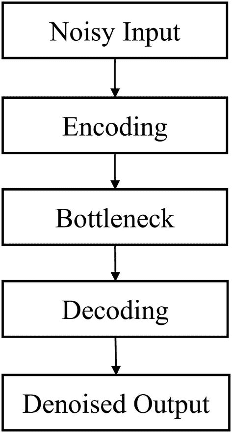

图 3-15

降噪自编码器组件的概念图

当然，去噪自动编码器的概念假设你的数据最初相对无噪声。因为去噪自动编码器依赖于原始数据作为真实数据来对原始数据的噪声版本进行去噪，如果原始数据本身噪声很大，自动编码器将学会大量任意和噪声的表示过程。如果你用于训练去噪自动编码器的数据具有很高的噪声度，在许多情况下，使用去噪自动编码器和标准自动编码器之间几乎没有区别。事实上，使用前者可能会对你的工作流程造成更大的损害，因为你可能是在假设去噪自动编码器正在学习对噪声具有鲁棒性的数据的有意义表示，而实际上并非如此。

输入的噪声可以通过三种方法构建（见图 3-16）：作为一层插入，直接添加到数据集中，或者作为数据生成器。使用哪种方法取决于你的问题类型：

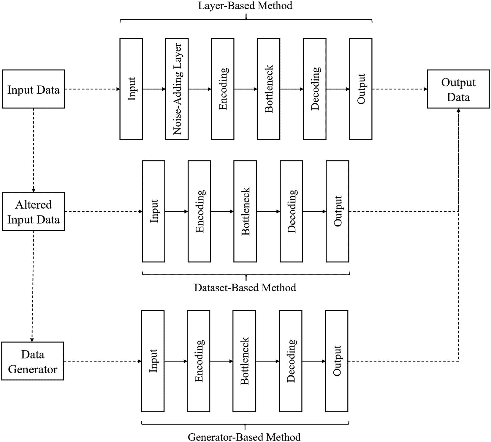

图 3-16

去噪自动编码器中引入噪声的三个方法

+   *将噪声作为一层应用*：在自动编码器的输入之后直接插入一个随机噪声添加层，这样噪声在编码和解码之前就被应用到输入上了。这种方法的主要优势是模型学会对同一原始图像的多个噪声版本具有鲁棒性，因为每次模型通过模型时，都会应用不同的噪声。然而，在使用去噪自动编码器之前，需要移除噪声添加层；它仅在训练期间作为一个人工工具，在实际应用中，我们期望输入已经“自然”地包含噪声。当使用这种方法时，你可以创建数据集，就像为自动编码器创建数据集一样——输入和输出是相同的。

+   *直接向数据集添加噪声*：在训练之前，直接在其构建过程中向数据集添加噪声，使得数据包含 *x* 作为噪声数据，*y* 作为原始数据。使用这种方法的主要优势是可定制性：你可以使用任何你想要的函数来构建数据集，因为它超出了神经网络的范畴，因此不受 Keras 和 TensorFlow 的限制。你可能想要添加一些默认层或生成器中不可用的复杂噪声形式。此外，无需操作自动编码器的单个噪声添加层。然而，你面临过拟合的风险（尤其是在小数据集和大架构的情况下），因为自动编码器只能看到每个原始输入实例的一种噪声形式。当然，你也可以手动生成每个实例的几种噪声形式，尽管这可能需要更多时间且效率较低。

+   *通过数据生成器添加噪声*：Keras/TensorFlow 包含一个 `ImageDataGenerator` 对象，可以对图像执行各种增强和其他形式的噪声，如调整亮度、进行小旋转和剪切，或扭曲色调。此外，图像数据生成器与基于层的类似，网络暴露于输入数据的许多不同噪声表示——数据在每次前向传递时通过随机生成器，并在正式由网络处理之前被扭曲。使用数据生成器的主要优势是你可以应用比层更自然或更可能出现在数据中的噪声形式，层可以实现更“人工”的噪声形式，如向图像添加高斯噪声。此外，在训练去噪自动编码器后无需操作噪声添加层。然而，图像数据生成器仅限于图像，这意味着你需要使用其他方法来处理其他形式的数据。

去噪自动编码器主要用于去除我们预期将会是噪声的输入数据。你可以直接在输入之后插入去噪自动编码器，这样执行某些监督任务的神经网络就会接收到输入的降噪版本（图 3-17）。

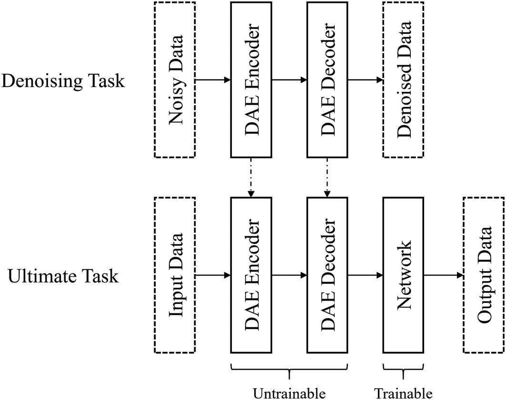

图 3-17

使用去噪自动编码器对输入数据进行降噪的一种方法是在处理降噪输入之前。你还可以解冻去噪自动编码器以进行后续的微调。

考虑一个任务，其中模型必须对音频输入的声音进行分类。例如，如果音频输入是鸟鸣，模型应该能够输出标签“bird”的表示；如果音频输入是狮子的咆哮，它应该能够输出标签“lion”的表示。正如人们可能想象的那样，在这个真实音频数据集中，一个挑战是许多音频输入将包含重叠的声音。例如，如果鸟鸣音频片段来自一个被都市喧嚣包围的公园，背景将包含汽车行驶和人们交谈的声音。为了成功，模型需要能够去除这些背景噪声源并隔离核心、主要的声音。

要做到这一点，比如说，你获得了一个没有背景噪声的实时声音数据集。你人为地添加一些类似于你在嘈杂数据集中遇到的噪声。例如，你可以使用 Python 中的音频处理库，将没有背景噪声的声音与较小的、调暗的背景噪声叠加。对于去噪自动编码器的成功至关重要的是，你人为生成的噪声与数据中预期的噪声形式相似。例如，向图像添加高斯噪声可能对去噪任务帮助不大，除非你想要去噪的数据集中包含高斯噪声。（你可能会发现添加某种形式的噪声比完全不添加噪声更有利于创建自监督预训练任务，但这将在稍后进行讨论。）你训练一个去噪自动编码器从噪声叠加的信号中重建原始的无噪声声音信号，然后使用去噪自动编码器在它们被分类之前对实时声音进行去噪。

噪声去除也可以以其他形式发生。例如，你可以在对最终任务进行建模之前，使用去噪自动编码器对整个数据集进行去噪，而不是在最终任务操作模型中架构性地插入去噪自动编码器。如果你预期“最终”模型在部署时将应用于相对干净的数据，但知道可用的训练数据是嘈杂的，这可能很成功。理解你特定的难题非常重要，这样你才能成功实施并操作你的去噪自动编码器设计。

#### 实现

在我们讨论去噪自动编码器的实现时，我们将假设自动编码器被用于表格数据。逻辑和语法仍然可以应用于去噪自动编码器在其他数据上的使用，例如图像或序列数据，但需要考虑该特定数据格式。

##### 引入噪声

正如讨论的那样，有三种实际的方法可以引入噪声。

一种方法是在输入之后直接插入一个噪声层（见列表 3-14，图 3-18）。这种方法最有用的层可能是`keras.layers.GaussianNoise`层，它可以通过指定的标准差添加高斯噪声。对于非常强烈的噪声形式，你也可以使用 dropout 或其他修改（尽管这已经接近了我们认为的严格意义上的去噪自动编码器的极限）。你也可以编写自己的自定义层来进行更复杂的噪声添加操作。

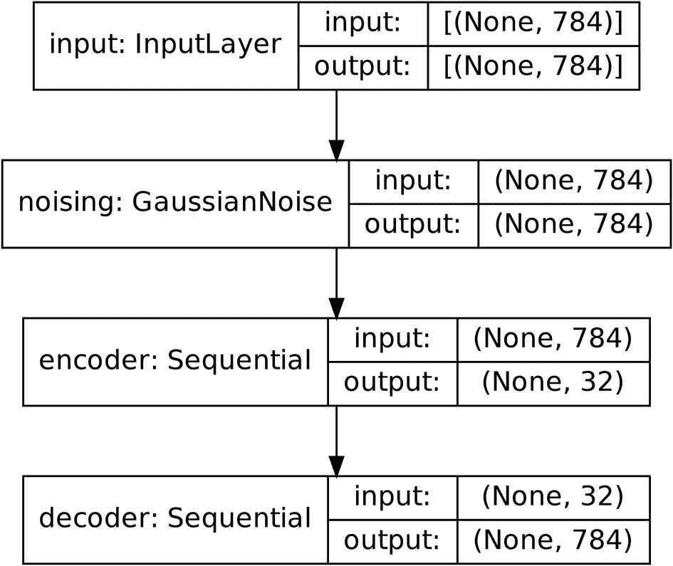

图 3-18

通过层方法诱导噪声的示例实现

```py
ae_input = L.Input((784,), name='input')
ae_noising = L.GaussianNoise(0.1, name='noising')(ae_input)
ae_encoder = encoder(ae_noising)
ae_decoder = decoder(ae_encoder)
ae = Model(inputs = ae_input,
outputs = ae_decoder)
Listing 3-14
Layer-based method of inducing noise into a denoising autoencoder
```

诱导噪声的另一种方法是将噪声直接应用于数据集，理想情况下是在创建 TensorFlow 数据集时进行解析（见列表 3-15）。在创建解析函数时，你可以使用各种 TensorFlow 图像操作来诱导随机形式的噪声。在这个例子中，未解析的 TensorFlow 数据集由每个实例的文件名和标签组成（尽管如果你知道你只会用它进行无监督学习，你可能希望以另一种格式安排未解析的数据集）。

在这个例子中，我们使用了两个有用的`tf.image.random_x`操作来向图像中引入随机噪声，这些操作会改变亮度和 JPEG 质量噪声。（后者指的是 JPEG 图像中的一种现象，由于压缩算法，视觉伪影会扭曲图像。如果你的数据集包含 JPEG 格式的图像或包含可能曾经是 JPEG 格式的电子传输的图像，这特别有帮助。）需要注意的是，在指定噪声范围时——例如，在 JPEG 质量中，示例中的“80”和“100”是 JPEG 质量的最低和最高值——你应该留出可能不向图像应用噪声的情况。这允许模型不仅能够去噪噪声图像，而且还能首先识别噪声的存在。我们通过将 JPEG 质量的上限设置为 100%来构建这种可能性，其中`random_jpeg_quality`函数的输出与输入相同。像`random_brightness`这样的函数只需要一个最大噪声界限，因此你可以假设将会有一些噪声水平极低的示例满足这一良好实践。

```py
def parse_file(filename, label):
orig_img = do_preprocessing_stuff(filename)
rand_img = tf.image.random_brightness(image, 0.01)
rand_img = tf.image.random_jpeg_quality(image, 80, 100)
return rand_img, orig_img
Listing 3-15
Example function to pre-alter the dataset with noise using .map() on a TensorFlow dataset
```

在图像数据中引入一定噪声的第三种方法是使用 Keras/TensorFlow 的 `ImageDataGenerator`（见列表 3-16）。我们首先通过实例化一个带有噪声增强参数的 `ImageDataGenerator` 对象来开始，这些参数包括随机调整亮度的范围、轻微的剪切等。为了向图像数据生成器对象提供数据，请使用 `.flow` 或 `.flow_from_x`。如果使用 `.flow_from_directory`，请确保设置 `class_mode='input'`，这样图像数据生成器就不会假设标签并将数据生成器作为分类问题来安排。

```py
from keras.preprocessing.image import ImageDataGenerator
idg = ImageDataGenerator(rotation_range=30,
width_shift_range=5,
...)
idg_flow = idg.flow_from_directory(
directory = '/directory/data',
class_mode = 'input'
)
Listing 3-16
Using the Image Data Generator method of inducing noise into an image dataset. Substitute augmentation_params for augmentation parameters. See Chapter 1 for a detailed discussion of Image Data Generator usage
```

您还可以使用 `ImageDataGenerator` 并将 `class_mode='input'` 作为自编码器的一般替代数据源（不仅限于降噪），而不是使用 TensorFlow 数据集。如果您决定为自编码器使用图像数据生成器，请确保仔细控制您特定目的的增强参数。例如，如果您正在训练一个标准自编码器，其中输入与理想输出相同，请确保通过相应调整增强参数来消除所有人工噪声的来源。

##### 使用降噪自编码器

如果您正在使用向降噪自编码器中引入噪声的层方法，当您在其他应用中使用降噪自编码器时，您需要移除噪声添加层（见列表 3-17）。假设变量 `ae` 指的是带有噪声添加层、分室设计和适当命名的降噪自编码器。我们可以使用 `.get_layer(name)` 方法通过名称检索一个层或一组层，并将它们构建成一个没有噪声添加层的“最终降噪自编码器”模型。示例中只检索了编码和解码层，这些层存储了在降噪和解码过程中执行关键编码步骤的权重，从而在最终模型中消除了噪声添加层。在这里，您可以看到命名、分室设计和其他组织良好实践在操作网络结构时可以提供的许多好处。

```py
final_dae_input = L.Input((784,), name='input')
final_dae_encoder = ae.get_layer('encoder')(final_dae_input)
final_dae_decoder = ae.get_layer('decoder')(final_dae_encoder)
final_dae = Model(inputs=final_dae_input,
outputs=final_dae_decoder)
Listing 3-17
Removing the noise-inducing layer in a denoising autoencoder
```

如果您正在处理一个没有分室或有很多需要转移的层的模型，您也可以通过其索引来引用每个层（见列表 3-18）。首先定义输入层和输入层之后的层。在这种情况下，我们希望在最终降噪自编码器模型中跟随输入层的层/层组是编码器，我们可以将其引用为 `ae.layers[2]`，因为它是在原始降噪自编码器架构中包含噪声添加层的第三层/组件。从那里，我们可以迭代地遍历剩余的层，并使用 Functional API 语法将每一层附加到前一层。

```py
inp = L.Input((784,), name='input')
x = ae.layers2
for layer in ae.layers[3:]:
x = layer(x)
final_dae = Model(inputs=inp, outputs=x)
Listing 3-18
Alternate method of removing the noise-inducing layer in a denoising autoencoder
```

请记住，在使用非线性拓扑时，这种方法存在一些复杂性。

通过使用这两种方法中的任何一种，您可以将相关权重转移到最终模型中，而不需要中间层。您会发现这种方法从模型中“外科手术”地移除不需要的层在其他应用中很有帮助，尤其是在迁移学习中。移除噪声层后的结果模型（图 3-19）可用于验证测试。

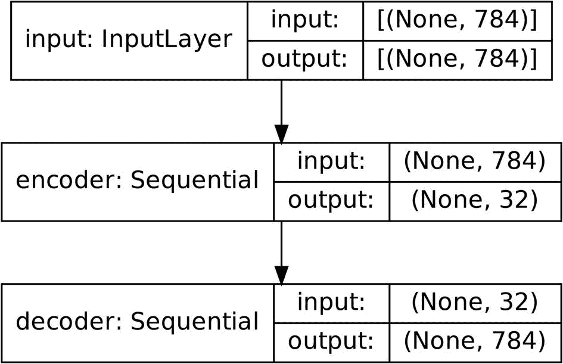

图 3-19

移除高斯噪声层后的去噪自编码器

一旦您获得了一个“清洁”的自编码器，您可以将它插入到另一个模型中作为预处理段来去噪输入数据（图 3-20，代码列表 3-19）。

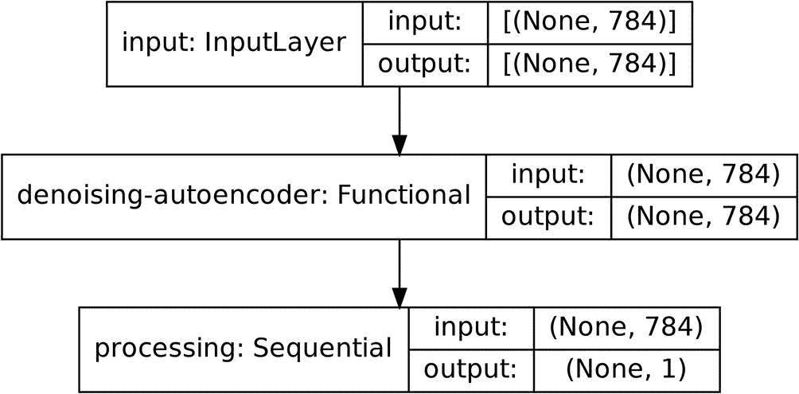

图 3-20

在将输入传递到后续层进行处理的之前，使用去噪自编码器对其进行解码

```py
process = Sequential(name='processing')
process.add(L.Input((784,)))
process.add(L.Dense(256, activation='relu'))
process.add(L.Dense(1, activation='sigmoid'))
inp = L.Input((784,), name='input')
denoising = ae(inp)
processing = process(denoising)
ult_model = Model(inputs=inp,
outputs=processing)
Listing 3-19
Using a denoising autoencoder to denoise inputs before they are passed onto another model for further processing
```

您可以根据需要设置自己的层冻结策略（参见第二章），以适应您的目的。例如，您可能决定在大多数训练中冻结去噪自编码器的权重，然后解冻整个网络并在之后进行一些微调。

### 使用自编码器进行预训练

自编码器的另一个应用是预训练。回想一下，预训练是用来提供“上下文”，以便它发展某些技能或表示，使其能够成功执行其最终任务。在第二章中，我们讨论了各种预训练方法和策略。我们将在此基础上进一步讨论，以展示在预训练的背景下何时以及如何使用自编码器。在此时，您将发现自编码器用于预训练的直觉和实现相当直接。

#### 直觉

自编码器在预训练中的应用属于自监督学习的范畴。您可以将自编码器视为自监督学习最简单的形式。回想一下，在自监督学习中，模型是在一个经过修改的数据集上训练的，这个数据集仅基于任务数据集的输入数据构建，而不是标签。一些自监督学习任务，例如，涉及预测图像旋转的程度或添加到某些数据集的噪声程度。然而，在标准自编码器中，除了将数据实例移动到数据集中，使得每个实例的输入和输出相同之外，不需要对数据进行任何修改。

通常，当使用自动编码器进行预训练时，整个自动编码器在预训练数据集上训练，提取编码器，附加更多层到编码器上，然后在新形成的模型上训练任务数据集（见图 3-21）。由于编码器从无监督预训练任务中提取了数据的重要表示，因此使用编码器进行预训练的期望是它开始于表示和编码输入关键特征的基本能力。附加的层可以将编码的关键特征处理成任务数据集的输出。

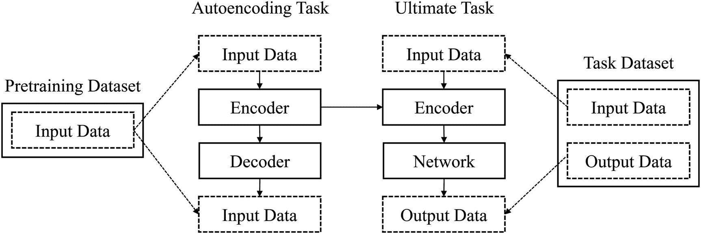

图 3-21

使用自动编码器进行预训练的概念图。自动编码器的输入数据是相同的。“网络”用于指代附加到编码器的层。这并不完全准确，但它代表了存在另一个“微型网络”，该网络处理编码器的输出，将编码器输出的任何编码表示映射到输出

如果你计划使用自动编码器进行预训练，重要的是要考虑一个关键因素，即如何构建瓶颈的大小（以及相应地编码器和解码器组件的宽度）：编码器之后附加的层需要处理的信息量。如果你的瓶颈很大，任务可能变得简单，网络可能不会发展出有意义的表示和理解输入的过程。在这种情况下，编码器之后的处理层将接收到大量的特征，但每个特征可能不包含很多有价值的信息。另一方面，如果瓶颈太小，模型可能发展出有意义的表示，但后续的处理层可能没有足够多的特征来处理。这是一个需要经验和实验来平衡的过程。

与预训练类似，最好有策略地冻结组件，以充分利用从预训练中得到的编码器权重（见图 3-22）。像许多预训练任务一样，通常冻结预训练组件——在这种情况下，编码器——并训练后续组件以更好地解释编码器的输出，然后解冻预训练组件，这样整个网络就可以进行微调。

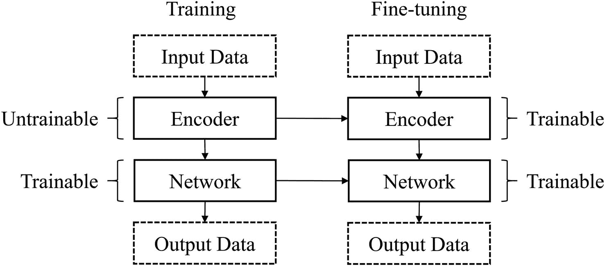

图 3-22

预训练自动编码器的组件在整个训练和微调过程中的冻结或解冻情况

如果你使用这种方法与图像数据一起使用自动编码器进行预训练，并且遵循在瓶颈周围对数据进行展平和重塑的设计，使得瓶颈是一个向量而不是图像，你会发现数据转换的结构特别清晰。编码器将图像转换为向量，接下来的处理组件处理这个向量（其中包含输入的编码表示）以生成所需的输出。因此，在这种情况下，编码器充当卷积组件，接下来的处理层充当基于图像的深度学习模型的完全连接组件。这不仅增加了概念和组织上的清晰度，还允许你进一步操作这些类型的自动编码器，以预训练设计获得更好的性能，并使用迁移学习工具（见第二章）。

注意，在使用自动编码器进行预训练时，你可以使用除标准自动编码器之外的各种自动编码器训练结构，其中输入等于所需的输出。

例如，去噪是一个强大的自监督任务，可以使用去噪自动编码器来解决（见图 3-23）。

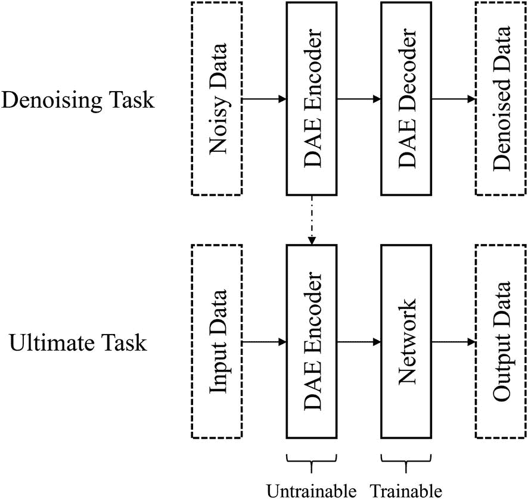

图 3-23

使用非标准自动编码器任务进行预训练的示例，如去噪自动编码器

然而，当你选择自监督任务来训练你的自动编码器时，了解该自监督任务将实现什么是很重要的。在这个自监督的背景下，去噪自动编码器主要提供了对数据关键特征的理解，这是通过识别和纠正人工插入的噪声来实现的，而其次才是实际的去噪能力。这意味着在开发用于预训练的去噪自动编码器时，你不需要非常小心地确保人工噪声与数据集中的真实噪声相似。当然，对去噪自动编码器的设置保持警觉可以让你最大化去噪（即，编码器发展出对噪声相对鲁棒的表示）和自监督学习（即，编码器通过学习将噪声伪迹与真实有意义的目标分开来发展关键特征和思想的抽象表示）的好处。

注意

应当注意的是，去噪和自监督学习的概念并不是完全独立的。为了正确地去噪输入，模型必须发展出对输入中关键特征和概念的表示，这正是自监督学习的目标。

这种在操作自动编码器进行预训练时的简单性和概念上的便利性使得它们在现代深度学习设计中特别受欢迎。

#### 实现

在使用模块化设计的前提下，实现自动编码器的预训练是简单的。回想一下为演示表格数据的自动编码器构建而构建的自动编码器结构，它接收具有 784 个特征的数据，并在瓶颈层将其压缩为 32 个神经元，然后再重建 784 个特征。

在模块化设计的 spirit 下，让我们构建一个组件，该组件接收编码器的输出并通过一系列密集层进行处理，以推导出输出（在这种情况下，对于二分类问题，列表 3-20）。请注意，这个组件接收 32 维数据，因为编码器输出的编码表示是 32 维的。

```py
process = Sequential(name='processing')
process.add(L.Input((32,)))
process.add(L.Dense(16, activation='relu'))
process.add(L.Dense(10, activation='sigmoid'))
Listing 3-20
Building a sub-model to process the outputs of the encoded features
```

尽管我们将编码器和解码器模型编译成了自动编码器，我们仍然可以单独引用编码器和解码器，同时保留它们的权重。仅包含预训练编码器和处理组件的最终模型可以使用功能 API（列表 3-21）构建。

```py
inp = L.Input((784,), name='input')
encoding = encoder(inp)
processing = process(encoding)
ult_model = Model(inputs=inp,
outputs=processing)
Listing 3-21
Using the processing sub-model with the encoder in an overarching model for a supervised task
```

确保根据需要冻结层。

### 使用自动编码器进行维度降低

自动编码器的概念最初被提出作为一种维度降低的方法。由于维度降低的应用几乎“内置于”自动编码器的设计中，你会发现使用自动编码器进行维度降低非常简单易行。然而，在为自动编码器执行维度降低时，仍有许多需要考虑的因素；通过适当的设计，自动编码器可以提供一种独特且比其他现有方法更强大、更通用的维度降低方法。

#### 直觉

维度降低通常作为一个无监督任务来执行，其中数据必须用比当前存在的更少的维度来表示。许多维度降低算法，如主成分分析（PCA）和 t-随机近邻嵌入（t-SNE），试图根据某些数学表述将数据投影到较低的空间，这些表述确定了在降低过程中数据哪些特征应该被最重视。例如，PCA 试图保留全局方差，而 t-SNE 则试图捕捉局部方差。由于不同的维度降低算法旨在优先保留数据的不同特征，因此它们在本质上不同，因此在广泛的数据集上的有效性受到限制。

然而，在自动编码器方法进行维度降低时，自动编码器被训练在通过瓶颈后重建输入。自动编码器拟合后，编码器被分离，任何输入的维度降低都可以通过通过编码器并接收其输出（图 3-24）来获得。

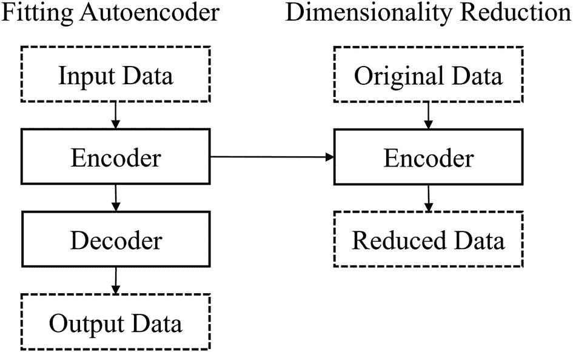

图 3-24

使用自编码器进行降维的概念图

因此，自编码器在两个关键方面与其它降维算法明显不同：适应性和对有价值特征的阐述。

+   *适应性*：PCA 和 t-SNE 等算法允许用户通过调整几个参数来调整算法以适应其数据集，但这个数量远远少于自编码器的适应性。因为自编码器更是一个概念而不是一个算法，它可以以更大的适应度来构建以适应你特定的问题。你可以改变自编码器结构的深度和宽度、每一层的激活、损失函数、正则化以及神经网络架构和训练设计中的许多其他特性，以改变自编码器在执行降维时的行为。这也意味着，如果你不了解对自编码器结构的不同操作如何转化为其行为以及处理你数据集的降维算法行为的变化，那么使用自编码器进行降维可能不会成功。

+   *对有价值特征的阐述*：自编码器优先考虑数据的一些特征，并以不同于 PCA 和 t-SNE 等算法的方式优化数据的降维。自编码器试图最小化重建损失，而 PCA 和 t-SNE 试图最大化一些相对明确的数学公式，以确定优先考虑的内容，例如保留局部或全局结构（例如，方差）。这些公式试图捕捉降维背景下“信息”所包含的内容。另一方面，自编码器似乎至少在表面上并没有将这些优先级明确地构建到其设计中——它们只是使用任何允许最可靠地重建原始输入的降维方法。也许自编码器是捕捉广泛、概念意义上的“信息”最忠实的代表之一——而不是与任何特定的明确假设（即构成信息保留的*手段*）相关联，它采用必要的程序和假设来重建原始项目（即使用必要的手段来获得最优的*结果*）。

这两个特性既可以成为优势也可以成为劣势。例如，如果您的数据集过于复杂或难以理解，适应性可能成为一种诅咒而不是工具。此外，增加适应性并不一定意味着增加对适应性的可解释性；也就是说，虽然自动编码器具有更广泛的可能行为范围，但并不一定简单就能识别出哪些架构的变化将对应于某些变化（或无变化）。请注意，自动编码器对有价值特征的表述是由其损失函数决定的，该函数将模型预测作为其中一个组成部分，而模型预测依赖于模型架构（以及其他建模细节）。在这条考虑链中找到自己的路可能比在其他维度缩减方法上调整相对可解释的参数更为艰巨。

现代用于降维的自动编码器通常用于非常高维的数据，因为深度学习已经发展到在复杂数据形式上最成功。为降低维数数据开发的更传统算法，如 PCA，可能不适合用于基于 NLP 的模型中的词嵌入或高分辨率图像。t-SNE 是高维数据的一个流行选择，但主要用于可视化。如果您希望最大化降维的信息丰富性并愿意牺牲一些可解释性，自动编码器通常是最佳选择。

#### 实现

使用自动编码器进行降维不需要从构建和训练原始自动编码器中获取更多代码（参见之前关于构建自动编码器的表格和二维数据的章节）。假设自动编码器是按照模块化设计构建的，您只需调用 `encoder.predict(input_data)` 即可，其中 `encoder` 对应于编码器架构，`input_data` 代表您希望编码的数据。

### 使用自动编码器进行特征生成

特征生成和特征工程通常被认为是经典机器学习的遗迹，其中通过构建一些新的特征可以提升机器学习模型的性能。然而，在涉及相对更复杂数据形式的深度学习应用中，在许多情况下，使用标准特征工程方法，如找到一组列的行均值或分箱，往往是不成功的或只提供了微小的改进。

然而，使用自动编码器，我们能够利用具有深度学习方法力量和深度的实体来执行深度学习的特征生成。

#### 直觉

自编码器的编码组件可以用来为模型生成新的特征，以便在执行任务时接收和处理。因为编码器已经学会了接收标准输入并将其压缩，使得编码表示中的每个特征都包含了标准输入的最重要信息，因此这些编码特征可以被利用来帮助预测另一个模型。

从功能上讲，这个想法几乎与用于降维的自编码器相同。然而，使用自编码器进行特征生成需要额外的步骤来生成新特征并将新特征输入到模型中。

我们之前已经看到，在利用自编码器进行预训练时，采用了类似的概念，其中编码器从训练好的自编码器中分离出来，并直接插入到另一个网络的输入之后，这样编码器之后的模型组件就能接收丰富、关键的特征和输入的表示。然而，特征生成的目的是生成或添加特征，而不是替换它们。因此，当使用自编码器进行特征生成时，编码器提供了一组编码的、信息丰富的特征，这些特征与原始特征集一起被考虑。

以这两个小型数据集为例，它们由一个假设的自编码器在原始特征上拟合产生的原始特征和生成特征组成（见图 3-25）。

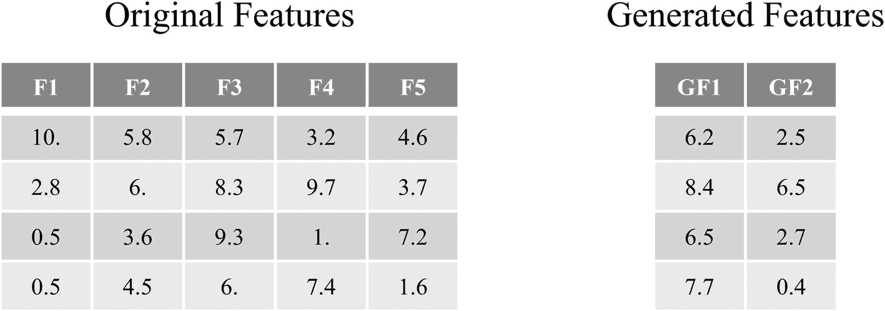

图 3-25

假设的数据集：原始特征和生成的特征（由训练好的自编码器的输出编码器产生）。这些表中的确切数字是假设的（随机生成的）。

当使用自编码器进行预训练时，自编码器被训练来重建原始特征，编码器被转移到新模型中，以在输入之后直接提供特征提取机制（见图 3-26）。因此，网络剩余部分，它执行了这些特征的许多解释工作，不能直接访问原始特征。相反，它通过编码器模型的压缩和“解释”来理解原始特征。

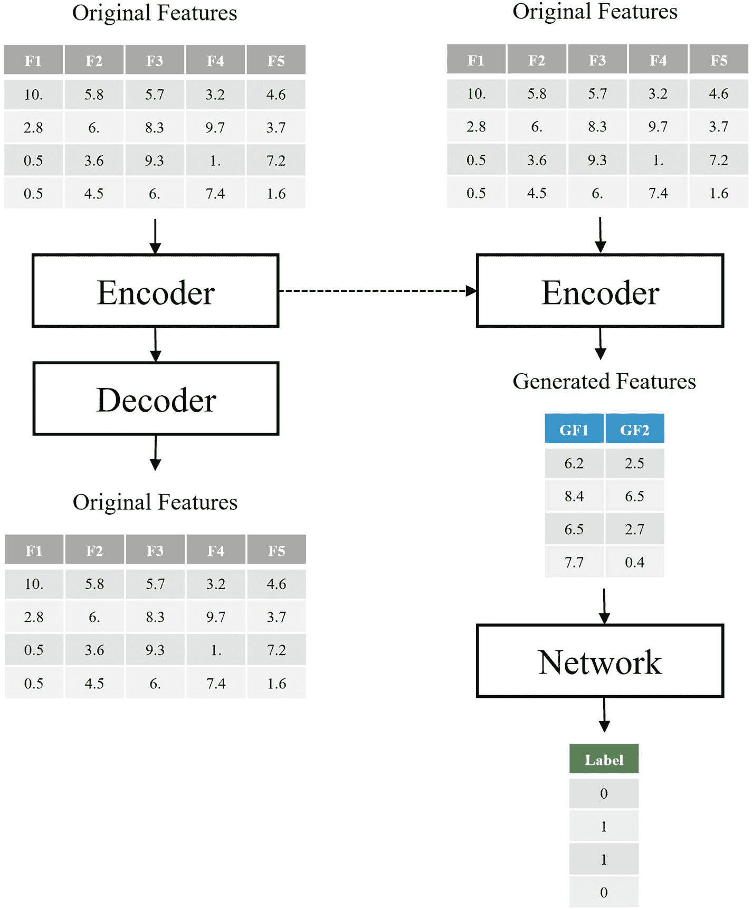

图 3-26

仅使用编码器生成的特征作为网络的输入。

然而，这种特定方法引发了一个担忧：尽管来自自动编码器的编码器几乎总是会给模型带来提升（如果设计和训练得当），编码器是否通过迫使模型严格通过自动编码器的视角获取信息，从而限制了模型的性能？有时，在训练后进行一点微调（其中编码器权重被解冻，整个模型被重新训练）就足以解决这个担忧。

然而，在几种情况下，即使进行微调也可能不足以解决这个担忧。如果自动编码器在重建方面没有获得相对较高的性能（即，中等、平庸的性能），迫使模型仅接受平庸级别的特征可能会限制其性能。或者，如果数据不是极其复杂的，如表格数据或低分辨率图像，那么编码器压缩原始输入可能是有价值的，但并非完全必要。在许多情况下，旨在处理更简单数据的模型从处理原始输入和编码特征中受益。

当使用自动编码器进行特征生成时，编码器的输出与原始输入数据连接（或通过某种其他机制合并），使得网络的其余部分可以考虑到并处理这两组特征（见图 3-27）。这种特征生成方法可以被认为是给网络的其余部分提供了“两者兼得”的好处——即访问原始的、原始的、未改变的数据，以及对该原始数据的一种发展解释。在这里，网络试图决定如何权衡和处理每一组特征以优化其性能。

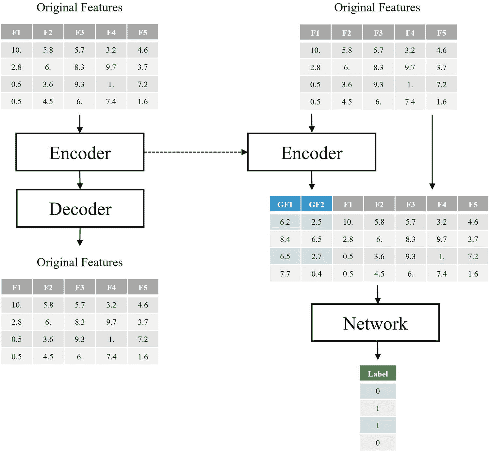

图 3-27

使用编码器生成的特征和原始特征作为网络的输入

在架构上，我们可以用非线性拓扑来表示这一点，其中输入层既连接到编码器，也连接到编码器的输出（见图 3-28）。

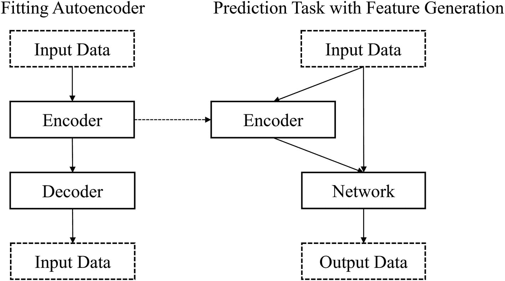

图 3-28

适配自动编码器在预测任务中使用的概念图，其中特征生成时，原始特征和生成的特征都输入到剩余的网络层进行处理

这与在训练变分自动编码器时引入噪声的基于层的方法在性质上相似。你可以将数据通过编码器传递，并将编码后的特征连接到原始数据集上，然后将合并后的数据集输入到标准网络架构中。然而，这种在神经网络外部对数据进行更改的方法比必要的还要多——使用功能 API 添加编码器比处理预测和数据组织要容易得多，尤其是如果你的数据集较大时。将编码器模型直接添加到新模型中会自动建立这些关系和数据流。

#### 实现

与许多自动编码器应用一样，使用我们之前开发的工具实现特征生成型的自动编码器非常简单。使用功能 API 的三个代码行就可以定义输入层、编码器以及原始数据和生成特征合并的连接点（见列表 3-22）。

```py
inp = L.Input((784,))
encoding = encoder(inp)
merge = L.Concatenate()([inp, encoding])
Listing 3-22
Creating the feature generation component of the autoencoder, in which inputs are passed through the encoder and concatenated to those outputs
```

之后，我们可以添加更多的 Dense 层来处理合并后的特征（见图 3-29，列表 3-23）。

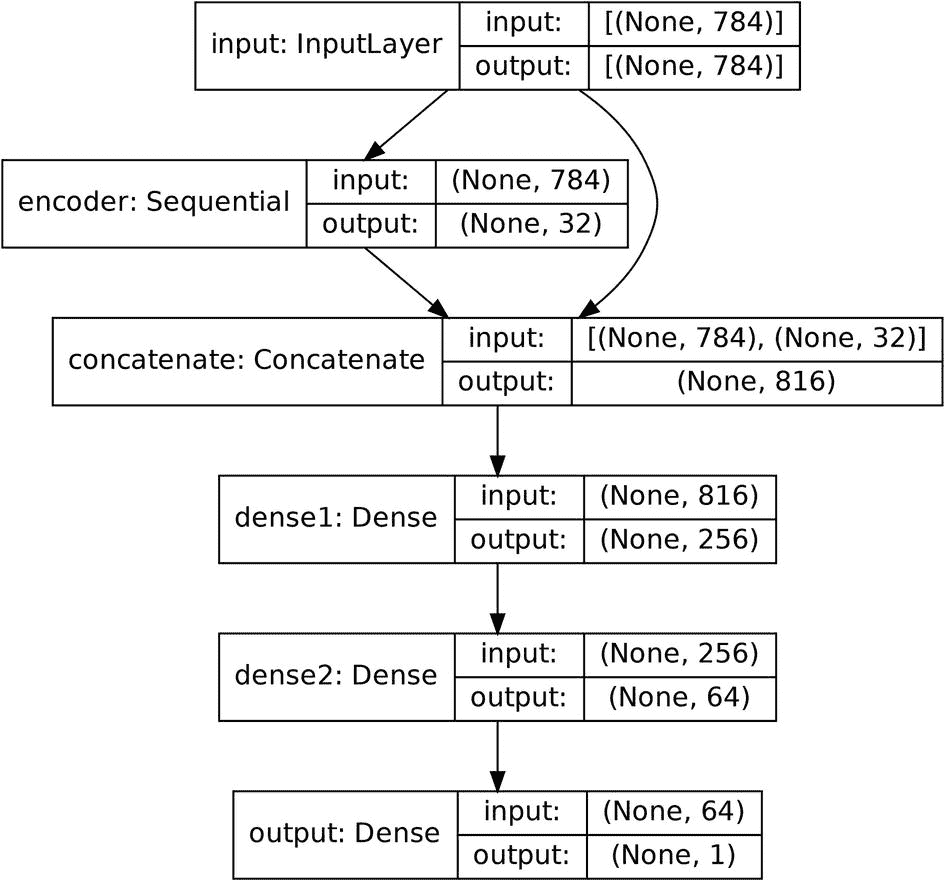

图 3-29

用于特征生成的自动编码器架构的假设图

```py
dense1 = L.Dense(256, activation='relu')(merge)
dense2 = L.Dense(64, activation='relu')(dense1)
output = L.Dense(1, activation='sigmoid')(dense2)
model = Model(inputs=inp, outputs=output)
Listing 3-23
Processing the concatenated features
```

一定要设置 `encoding.trainable = False`，因为编码器的权重——它是提取核心特征和表示的基础方法——在训练期间应该被冻结。与使用自动编码器进行预训练相比，微调的需求不那么显著。

你还可以通过首先独立处理原始特征和生成特征，然后在合并和进一步处理之前，构建更复杂的拓扑结构，以更好地利用编码器的编码特征（见图 3-30，列表 3-24）。

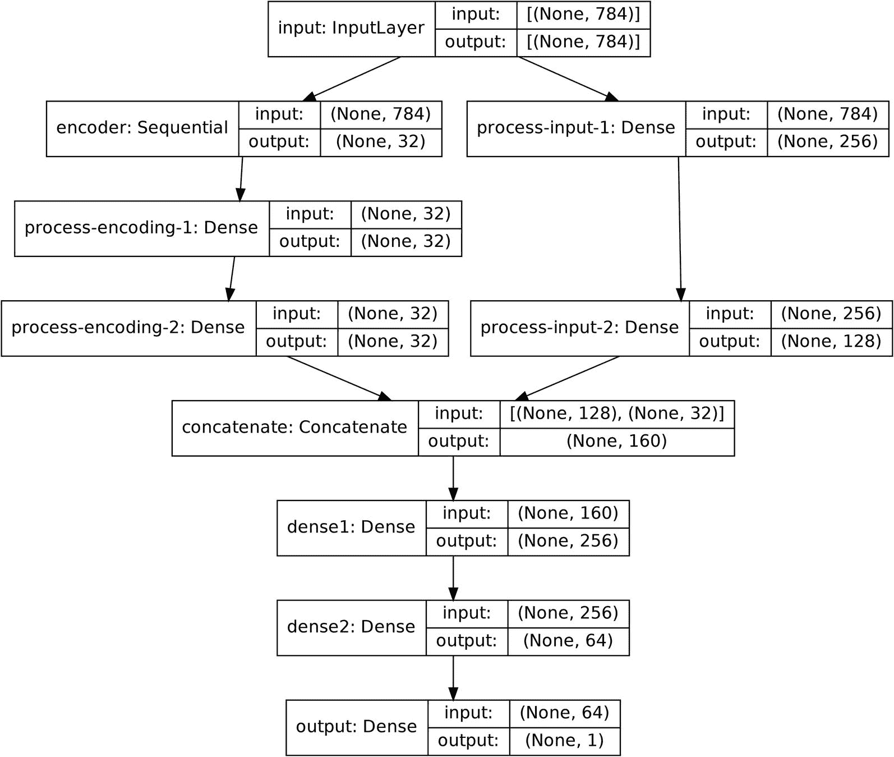

图 3-30

在连接之前对编码器的输出和原始特征进行进一步处理，用于特征生成的自动编码器架构的假设图

```py
inp = L.Input((784,))
encoding = encoder(inp)
# processing the input independently
p_inp_1 = L.Dense(256, activation='relu')(inp)
p_inp_2 = L.Dense(128, activation='relu')(p_inp_1)
# processing the encoder output independently
p_encoding_1 = L.Dense(32, activation='relu')(encoding)
p_encoding_2 = L.Dense(32, activation='relu')(p_encoding_1)
# merge and process
merge = L.Concatenate()([p_inp_2,
p_encoding_2])
dense1 = L.Dense(256, activation='relu')(merge)
dense2 = L.Dense(64, activation='relu')(dense1)
output = L.Dense(1, activation='sigmoid')(dense2)
# aggregate into model
model = Model(inputs=inp, outputs=output)
# freeze encoder weights
encoding.trainable = False
Listing 3-24
Processing the encoded representation and the original input separately before they are concatenated
```

从广义上讲，你可以使用这类架构操作来构建各种复杂的非线性拓扑结构，以利用预训练方法。

### 使用变分自动编码器进行数据生成

变分自动编码器是自动编码器中较新的概念之一。它服务于深度学习中的一个相对较新的子领域：数据生成。虽然变分自动编码器最常用于图像生成，但它们也适用于生成语言数据和表格数据。尽管图像生成可以用来生成逼真的图像，但更实际的是，变分自动编码器通常用于生成更多数据来训练另一个模型，这对于小数据集来说可能很有用。由于变分自动编码器高度依赖于潜在空间的概念，因此我们可以通过以某种方式遍历潜在空间来操纵它们的输出。这使得它比其他数据生成方法，如生成对抗网络（GANs），在生成的输出中提供更多的控制和稳定性。

#### 直觉

自动编码器的目标是尽可能忠实地重建原始输入数据。另一方面，变分自动编码器的目标是生成具有合理变化的相似图像——因此得名“*变分*” *自动编码器*。

使用变分自动编码器进行生成的根本思想并不复杂：不仅潜在空间中的单个点（对应于数据集中的数据点）被有意义地排列，以便可以解码成其原始形式，而且潜在*空间*本身——由所有现有数据点及其周围的空间组成——也被编码器映射，使其包含与数据集相关的关联。因此，我们可以从潜在空间中采样那些未被现有数据点的编码表示占据的点，并将它们解码以生成一个原始数据集中不存在的新数据项。

例如，考虑两类数据（可能是狗和猫的图像，或者是手写数字“0”和“1”的图像）。当然，在训练时，自动编码器并没有得到这些标签，但它很可能能够对这些图像进行分离和定位，使得这两类图像通常被分开（见图 3-31）。因此，如果我们想要一个类似狗的图像，我们可以从数据集中传递一个实际的狗的图像，对潜在空间中相应位置进行一些修改以引入变化，然后将偏差/变化点解码以输出一个略微不同的狗的图像。

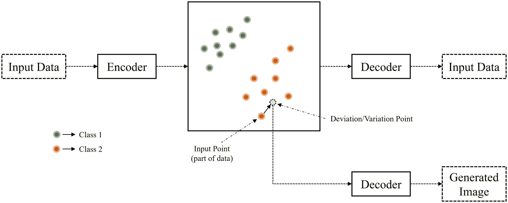

图 3-31

将数据点的潜在空间附近的解码区域解码以生成数据的变化——不同的数据，但具有相似的特征。中间的框代表潜在空间——输入数据被映射到的瓶颈区域的点，这些点将被映射回重建版本

或者，你也可以从潜在空间中随机选择几个点并解码它们以生成相应的图像（图 3-32）。这种方法更常用于生成大量和多样化的数据集，因为对现有点进行小的偏差或变化仍然会限制生成的图像与原始图像相对相似。通过在潜在空间内完全随机选择几个点，你可以产生一个更加多样化的生成数据集。

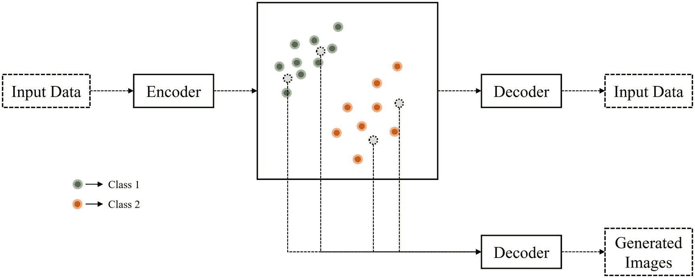

图 3-32

从潜在空间中随机采样以生成广泛、多样化的生成数据集

我们现在可以写出使用自动编码器生成数据的通用过程如下：

1.  在重建任务上训练一个自动编码器。

1.  随机选择潜在空间中的几个点，通过改变现有数据点（确保它在合理范围内）。

1.  将这些点解码成相应的生成图像。

虽然这种一般逻辑和直觉是有效的，但我们所做的一个假设存在问题：在标准自动编码器中，潜在空间不是连续的；相反，它更有可能高度离散，分成簇。连续性在重建输入的任务中可能不会很有帮助，因为它放大了小“失误”和“错误”的影响；相反，具有离散设计可以提供一些最小的“保证”成功（图 3-33）。

例如，考虑一个试图重建数字“0”和“1”图像的自动编码器。假设自动编码器的潜在空间是离散的，这意味着有意的间隔将图像簇分开（在这种情况下，看起来包含数字“0”的图像与看起来包含数字“1”的图像）。即使编码器没有很好地编码包含数字“0”的图像（它没有在潜在空间中处于最佳位置），它仍然很可能位于标记为“0”的图像簇中，因为潜在空间中有大的间隔将包含“0”的图像与包含“1”的图像分开。这意味着解码器仍然会重建一个与“0”形状相似的图像——即使它没有捕捉到图像的具体细节，它也捕捉到了主要思想。

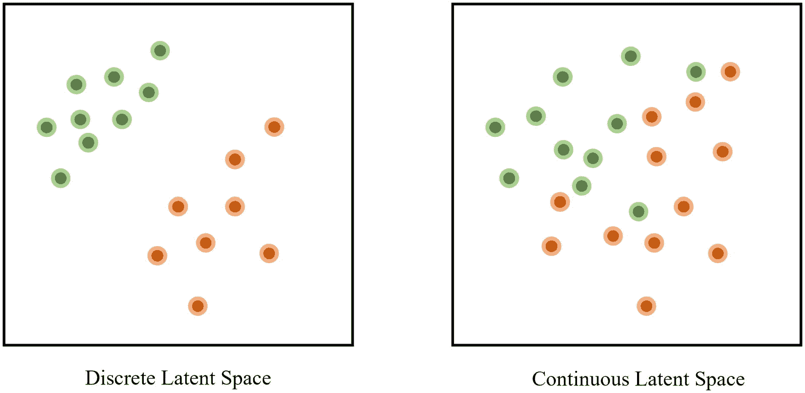

图 3-33

自动编码器中的离散与连续潜在空间

另一方面，假设潜在空间是连续的，这意味着没有有意的间隔将图像簇分开。如果一个包含数字“0”的编码图像的位置存在类似的偏差，它可能被解码器重建为“1”——没有间隔或障碍将“0”和“1”的概念分开。

因此，自动编码器内的离散性是自动编码器通过分割主要思想来提高重建性能的有用工具。经验观察表明，成功的自动编码器往往会产生离散的潜在空间。

然而，这给数据生成带来了挑战，因为当我们从潜在空间中随机采样时，我们假设空间是连续的。例如，如果我们采样了一个位于离散簇之间的“间隙”中的潜在空间点，会发生什么呢？（图 3-34）

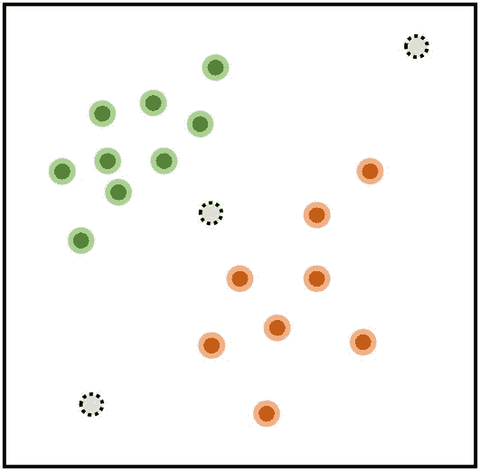

图 3-34

从解码器尚未学习解码的潜在空间的“间隙”区域进行采样会导致奇特且极端不切实际的输入

你可能会假设解码这个“间隙”中随机采样的点将产生某种“介于”两个类别之间的图像。然而，解码器从未接触过来自该区域的潜在空间中的点，因此没有经验和知识来解释它。因此，解码器很可能会输出一些与原始数据集毫不相关的乱码。

因此，变分自动编码器采用了两个关键变化来迫使自动编码器发展连续的潜在空间，这样潜在空间既可以随机采样（使生成的数据集多样化），解码的潜在空间点将产生真实/合理的输出（使生成的数据集可信）。从根本上说，这些变化迫使自动编码器学习连续分布，而不是潜在空间中的离散位置：

+   编码器学习潜在空间中变量的最佳均值和标准差，从这个空间中采样编码表示，并将其传递给解码器进行解码。

+   变分自动编码器在一个自定义损失函数上进行了优化：重建损失（这是交叉熵、均方误差或任何其他标准自动编码器损失函数）和 KL 散度的混合，以防止模型“作弊”（关于这种“作弊”的更多内容将在后面介绍）。

在输入通过几个处理层进行编码后，它被分成两个向量，代表均值向量和标准差向量。假设潜在变量来自正态分布，我们可以使用均值和标准差来随机采样编码表示。这意味着相同的输入可以编码两次，产生不同的编码表示。这个编码表示——现在带有一些变化——被解码并作为输出进行训练（图 3-35）。

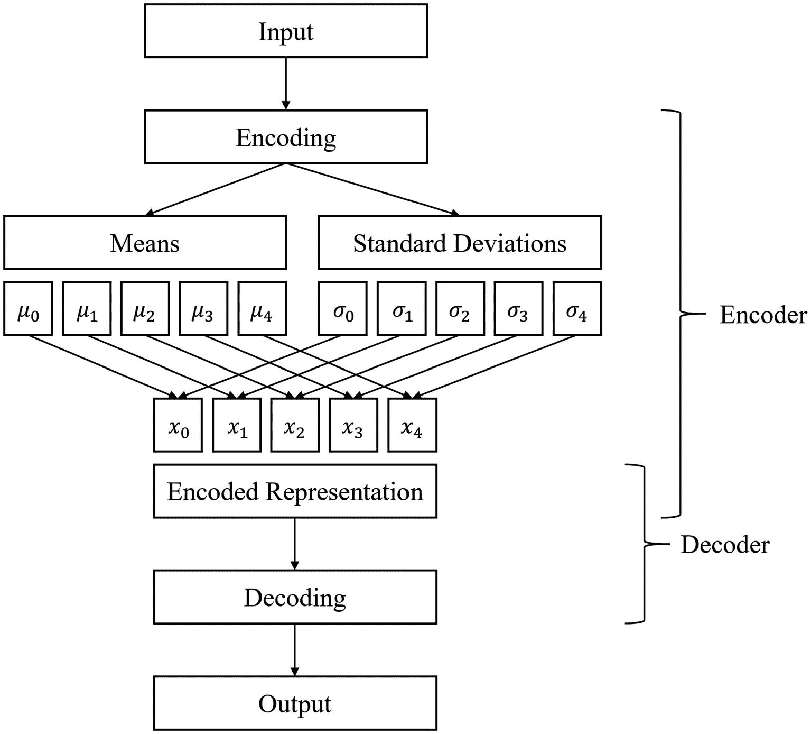

图 3-35

变分自动编码器的架构

变分自动编码器的架构在深度学习中展现了一定的美感：我们可以通过一些恰到好处的推动，深刻地塑造神经网络的思想过程以符合我们的愿望。例如，你可能想知道：如果某些潜在变量不是正态分布的，会怎样？随着时间的推移，网络将适应编码和解码过程以适应正态分布，因为我们使用正态分布假设来选择编码表示。如果它没有适应，它就不会达到最佳性能。我们可以有很高的信心预期变分自动编码器会学习这种适应，因为现代神经网络具有可靠的高处理能力。这反过来又允许我们在模型中更自由地施加（合理的）期望，作为实现某些目的的手段。

同样，尽管我们希望编码后的分支代表潜在变量的均值和标准差，但我们在这两个分支之前并没有建立任何实际机制来手动告诉网络均值或标准差是什么。相反，我们假设每个分支在生成编码表示（期望）时扮演分布的均值和标准差的角色，并允许网络适应这种期望。这种基于期望的设计允许你更快、更轻松地实现深度学习思想。

经过足够的训练，自动编码器逐渐理解了每个潜在变量的概率分布，使得潜在空间通过设计是连续的（图 3-36）。自动编码器不是学习点的绝对位置，而是学习围绕每个原始输入的概率“云”，以获得对原始输入变化的经验。这使得自动编码器在潜在空间中更平滑地插值。

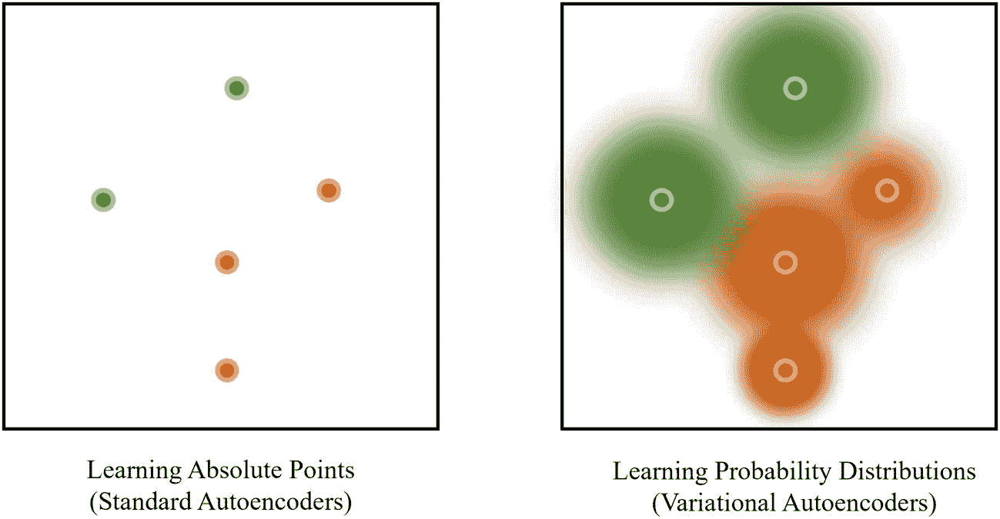

图 3-36

标准自动编码器学习潜在空间中数据的绝对位置，而变分自动编码器学习概率分布

然而，网络仍然有一种欺骗的方式：通过将表示标准差的分支设置为任意小，网络可以减少潜在空间中每个学习点的变化，使其在功能上等同于学习绝对点的位置（图 3-37）。由于我们知道自动编码器倾向于构建离散空间，变分自动编码器实现了一种机制来强制自动编码器学习连续空间：KL 散度。

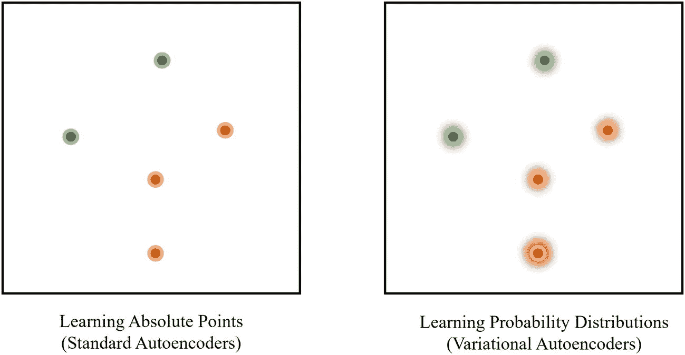

图 3-37

在实践中，变分自编码器可以通过形成聚类模式和降低标准差来“作弊”，并复制标准自编码器的绝对点学习。

KL 散度，或库尔巴克-莱布勒散度，衡量两个概率分布之间的差异或差异水平（大致来说）。对于变分自编码器而言，当均值是 0 且标准差是 1 时，KL 散度最小化，因此它充当正则化项，惩罚网络进行聚类或降低标准差。

如果仅对变分自编码器进行 KL 散度优化，它将倾向于将所有点聚类到中心，而不考虑解码能力，因为 KL 散度关注的是编码器输出的分布参数，而不是解码器的解码能力。因此，就像仅使用重建损失一样，潜在空间不能进行插值（图 3-38）。

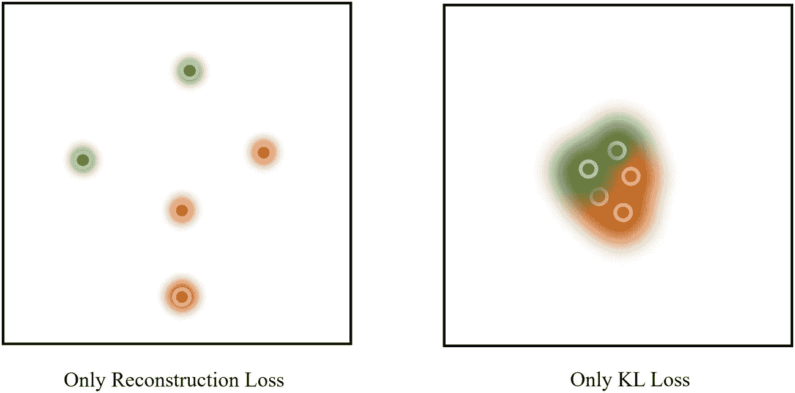

图 3-38

仅使用重建损失与仅使用 KL 损失的潜在空间表示结果

为了解决这个问题，变分自编码器在重建损失和 KL 损失的总和上训练。因此，变分自编码器必须同时开发出可以解码成原始表示的编码表示，但如果这些表示使用了聚类、低标准差和其他离散空间的标志，将会受到惩罚。变分自编码器是一个独特的模型，因为其目标不能由任何现有的损失函数明确表达，因此被表述为两个函数的组合。

现在，你可以在学习表示的域内随机均匀地采样潜在空间，并生成一组多样化和逼真的生成图像。此外，我们的插值直观逻辑也适用：如果你想可视化两个图像“之间”的内容（例如，一只猫和一只狗或数字“1”和“9”），你可以在潜在空间中找到对应两个点之间的点并对其进行解码。

#### 实现

实现变分自编码器比实现其他自编码器应用更困难，因为我们需要访问和操作自编码器本身（潜在空间）内的组件，而在此之前，唯一重要的步骤是改变输入和输出流。幸运的是，这可以作为在 Keras 中构建更复杂神经网络结构的有效练习。

小贴士

回想一下，在 Functional API 中，每个层都分配给一个变量。尽管您应该始终对变量命名保持谨慎和具体，但对于像变分自编码器这样的复杂和非线性神经网络架构，这一点尤为重要。您需要跟踪多个组件中几个层之间的关系，因此请建立最适合您的命名约定和代码组织。如果您出错，您会遇到图构建错误。如果您需要指导以调试这些错误，请经常使用`plot_model`并设置`show_shapes=True`来显示出了什么问题。

让我们从实现编码器开始。在此之前，我们使用 Sequential 模型构建结构来构建编码器和解码器，因为编码器和解码器在拓扑上不是非线性，我们不需要参考任何中间层。然而，在变分自编码器中，这两个条件都是成立的；因此，我们将使用 Functional API 构建编码器（见列表 3-25）。

```py
enc_inputs = L.Input((784,), name='input')
enc_dense1 = L.Dense(256, activation='relu',
name='dense1')(enc_inputs)
enc_dense2 = L.Dense(128, activation='relu',
name='dense2')(enc_dense1)
Listing 3-25
Implementing the first layers of the encoder for a variational autoencoder
```

在输入经过几个密集层（或卷积层或任何适合您数据类型的层）处理后，网络分为两个分支，分别表示潜在变量分布的均值和标准差（见列表 3-26）。请注意，在实际应用中，网络学习的是对数标准差而不是原始标准差，以防止出现负数解。您也可能看到一些使用对数方差的方法，这在功能上与使用标准差没有区别（方差只是标准差的平方）。回想一下，基于期望的设计，只要我们设定它们（并且期望不是太难达到），我们就可以期望网络学习期望值，因此您可以或多或少地指导模型学习您想要的任何属性。

```py
means = L.Dense(32, name='means')(enc_dense2)
log_stds = L.Dense(32, name='log-stds')(enc_dense2)
Listing 3-26
Creating the branches to represent the mean and log standard deviations of the latent variable distributions
```

我们构建了两个分支，分别表示潜在变量分布的均值和对数标准差。在这种情况下，我们的潜在空间有 32 个维度（类似于具有 32 个瓶颈节点的标准自编码器），每个分布有一个均值和一个对数标准差值来描述。为了获得编码器的输出——输入的编码表示——我们需要同时获取均值和标准差，从这个分布中随机采样，并输出这个随机样本（见列表 3-27）。这种操作在 Keras/TensorFlow 中不是作为默认层构建的，因此我们将不得不自己构建它。

要构建自定义层，我们可以利用`keras.layers.Lambda()`方法来构建执行操作的层。它可以如下使用。

```py
def custom_func(args):
param1, param2 = args
perform_tf_operation(param1, param2)
...
return result
custom_layer = L.Lambda(custom_func)([inp1, inp2])
Listing 3-27
Structure of creating a custom layer that performs TensorFlow operations on inputs using Lambda layers
```

在这个例子中，`custom_layer`接收两个先前层的输出。然而，Keras 将此数据作为一个包含所有自定义函数参数的单个参数变量一起传递，这些参数可以在自定义函数内部解包。此外，所有操作都必须是 Keras/TensorFlow 操作（参见 Keras 后端以了解 Keras 的低级操作）。请注意，如果需要，你可以使用像 TensorFlow 的`py_func`（见第一章）这样的方法将 Python 函数转换为 TensorFlow 操作。

变分自动编码器的自定义采样层接收均值和对数标准差。在自定义采样函数中，我们接收一个参数变量并将其解包成一个包含每个潜在变量的均值和对数标准差的张量。然后，我们生成一个形状与`means`和`log_stds`对象相同的随机正态分布张量作为`eps`，或称为 epsilon。我们可以使用公式 *μ* + *e*^(*ln*(*σ*)) · *ϵ*，这个公式可以简洁直观地简化为 *μ* + *σ* · *ϵ*（见代码清单 3-28）。

```py
def sampling(args):
means, log_stds = args
eps = tf.random.normal(shape=(tf.shape(means)[0], 32),
mean=0, stddev=0.15)
return means + tf.exp(log_stds) * eps
x = L.Lambda(sampling, name='sampling')([means, log_stds])
Listing 3-28
Creating a custom layer to sample encoded representations from the mean and log standard deviations of latent variables
```

在创建 epsilon 变量时使用的`shape`参数在这个例子中表达为`(tf.shape(means)[0], 32)`。其他方法包括`(tf.shape(log_stds)[0], 32)`和`(tf.shape(means)[0], tf.shape(means)[1])`：它们都表达了相同的概念。为了使实际的采样(*μ* + *σ* · *ϵ*)成功，均值、标准差/对数标准差和 epsilon 正态分布随机性的张量需要具有相同的大小。因为此数据是一维的，我们知道采样层的输入形状将是`(batch_size, latent_space_size)`的形式。我们没有指定批大小，所以我们简单地使用了`tf.shape(mean)[0]`。然而，我们知道潜在空间的大小是 32 维。对于更复杂的数据类型，了解你正在处理的采样数据的输入形状非常重要。

还应注意的是，虽然生成 epsilon 张量的均值应保持在 0，但标准差可以根据你愿意引入多少变化而改变。更多的变化可能允许模型更好地插值并产生更真实、多样化的结果，但过多可能会引入过多的噪声，从而难以合理解码。另一方面，较少的变化允许解码器更好地解码图像，但可能会导致潜在空间中的“间隙”探索不足和光滑插值。

我们现在可以将这些层聚合到自动编码器中（见代码清单 3-29）。

```py
encoder = keras.Model(inputs=enc_inputs,
outputs=[means, log_stds, x],
name='encoder')
Listing 3-29
Aggregating the encoder model
```

注意，我们输出`means`、`log_stds`和`x`，而在原始设计中，编码器只真正输出`x`，即采样的编码表示。回想一下，变分自动编码器的损失函数是专门的：重建损失和 KL 散度的混合。为了计算 KL 散度损失，损失函数需要访问均值和标准差。因此，为了提供这种访问，我们将`means`和`log_stds`列为编码器模型的输出。虽然我们不会在解码器中使用它们，但这使得我们的损失函数能够工作。编码器架构如下（图 3-39）。

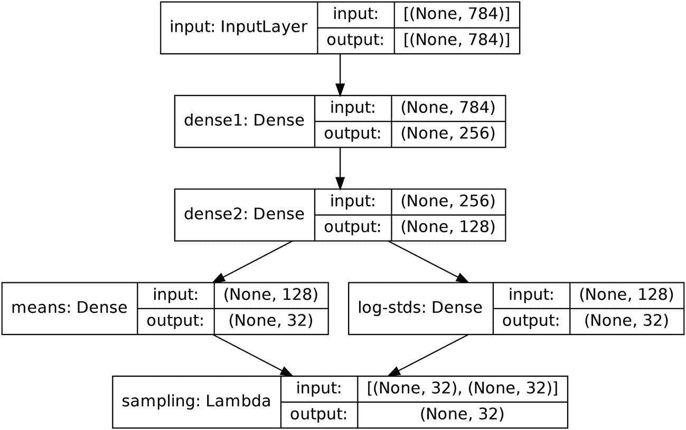

图 3-39

构建变分自动编码器的编码器

构建解码器相对简单：就像标准自动编码器一样，它接收一个编码表示（在这种情况下，一个 32 维向量）并逐步对其进行解码（代码列表 3-30）。

```py
dec_inputs = L.Input((32,), name='input')
dec_dense1 = L.Dense(128, activation='relu',
name='dense1')(dec_inputs)
dec_dense2 = L.Dense(256, activation='relu',
name='dense2')(dec_dense1)
output = L.Dense(784, activation='sigmoid',
name='output')(dec_dense2)
decoder = keras.Model(inputs=dec_inputs,
outputs=output,
name='decoder')
Listing 3-30
Creating and aggregating the decoder model
```

我们可以将这两个组件组合成一个变分自动编码器模型（代码列表 3-31）。

```py
vae_inputs = enc_inputs
encoded = encoder(vae_inputs)
decoded = decoder(encoded[2])
vae = keras.Model(inputs=vae_inputs,
outputs=decoded,
name='vae')
Listing 3-31
Aggregating the encoder and decoder sub-models into an overarching variational autoencoder model
```

将组件组合成模型的方法类似于标准自动编码器所使用的方法，但有两个关键区别。首先，变分自动编码器的输入不是一个独特的`keras.layers.Input`或`keras.Input`输入机制，而是编码器的输入（`enc_inputs`）。这是因为变分自动编码器损失函数的设计：因为模型必须能够访问编码器的输出，所以编码器的输入也必须与变分自动编码器本身处于相同的“级别”。请注意，这是一个有效的操作，因为我们没有进行任何实际的架构更改（即重新路由层或向一个层添加多个分支），只是简化了一个技术上冗余（但可能对组织有帮助）的过程，即通过两个输入层传递数据。其次，解码器不接收整个编码器输出，而是对其进行索引（`decoded = decoder(encoded[2])`）。回想一下，为了使损失函数的 KL 散度部分能够访问分布参数，编码器输出包含均值和日志标准差的张量，以及实际的编码表示。解码器只接收编码表示，这是编码器的第三个输出，因此相应地进行索引。

在拟合之前，剩下要做的就是构建损失函数。回想一下，我们的损失函数是重建损失（在这种情况下我们将使用二元交叉熵）和 KL 散度损失的组合。创建重建损失很容易，因为它已经在 Keras 中实现（代码列表 3-32）。

```py
from keras.losses import binary_crossentropy
reconst_loss = binary_crossentropy(vae_inputs, decoded)
Listing 3-32
Building the reconstruction loss component of the variational autoencoder’s custom loss function
```

构建 KL 散度更困难。尽管 KL 散度已在 Keras/TensorFlow 中实现，但在我们的情况下，我们需要构建一个自定义简化的 KL 散度，它不接收预测和真实标签，而是接收均值和标准差，测量分布与均值为 0、标准差为 1 的分布的距离（见清单 3-33）。

```py
kl_loss = 1 + log_stds - tf.square(means) - tf.exp(log_stds)
kl_loss = tf.square(tf.reduce_sum(kl_loss, axis=-1))
Listing 3-33
Building the KL divergence loss component of the variational autoencoder’s custom loss function
```

注意，`tf.reduce_sum` 允许您对指定轴上的每个项目损失进行求和；这对于处理批处理是必要的，在批处理中，每个批次包含多个数据点。

最终的变分自动编码器损失可以表示为重建损失和 KL 散度损失的加和（见清单 3-34）。`tf.reduce_mean` 对每个数据点的损失进行平均，以产生最终的损失值。

```py
vae_loss = tf.reduce_mean(reconst_loss + kl_loss)
Listing 3-34
Combining reconstruction and KL divergence loss into the VAE loss
```

我们还需要对变分自动编码器的独特损失函数做出一项调整：通常，损失函数会被传递到模型的 `.compile()` 函数中。然而，在这种情况下我们无法这样做，因为我们的损失函数的输入不是 Keras 数据流在编译时假设损失函数接收的预测和真实标签，而是特定层的输出。因此，我们使用 `vae.add_loss(vae_loss)` 将损失函数附加到变分自动编码器上。

然后，模型可以编译（不包含损失函数，因为损失函数已经附加），并在数据上拟合。由于有许多关键参数决定了变分自动编码器的行为（架构大小、采样标准差等），您可能需要调整模型参数几次，才能达到相对最佳的性能。

我们已经采取了几项措施来调整我们的模型结构和实现，以适应变分自动编码器损失函数的独特性质。虽然这本书——以及许多教程——将以线性格式展示这些类型架构的构建，但实际构建这些模型的过程根本不是顺序的。真正了解您正在处理的独特情况是否需要某种解决方案或需要以某种方式重写或重新表达，唯一的方法是进行实验。在这种情况下，首先写下编码器和解码器的基本架构，实现自定义损失函数，然后测试和实验对架构和/或损失函数的哪些更改是必要的，以便使其全部工作，根据需要查阅文档和在线论坛。

## 案例研究

在这些案例研究中，我们将讨论在最近的研究中，自动编码器在广泛应用中的使用。一些可以通过现有实现访问，而另一些可能超出了我们当前的实施技能范围——然而，这些案例研究提供了丰富且有趣的自动编码器多功能性的例子，并提出了它们在现代深度学习中的相关性的实证证据。

### 预训练案例研究：TabNet

深度学习在处理表格数据方面并不常用，这一点广为人知。常见的批评是，对于简单的表格数据集，深度学习“过度强大”，神经网络的巨大拟合能力会在没有发展出任何有意义的表示的情况下对数据集进行过拟合。通常，会使用基于树的机器学习模型和框架，如 XGBoost、LightGBM 和 CatBoost 来处理表格数据。

然而，特别是对于较大的表格数据集，深度学习有很多可提供的优势。其复杂性允许它以多模态方式使用表格数据（考虑表格数据与图像、文本和其他数据一起），在其自身上优化特征工程，并在深度学习领域如生成建模和半监督学习中使用表格数据（见第七章）。

在 2020 年的论文“TabNet：注意力可解释的表格学习”中，Sercan O. Arik 和 Tomas Pfister 提出了一种名为 TabNet 的用于表格数据的深度学习架构。Arik 和 Pfister 强调了 TabNet 架构和设计的三个关键方面：

+   *端到端设计*: TabNet 在使用表格数据进行其他方法时，不需要特征处理和其他预处理方法。

+   *顺序注意力*: 注意力是一种在语言模型中常用的机制，它允许模型在序列中发展并理解各种实体之间的关系。在 TabNet 中，顺序注意力允许模型在每一步选择它应该考虑的特征。此外，这还使得模型决策过程的可解释性更高。

+   *无监督预训练*: TabNet 使用基于自动编码器的架构进行预训练，以表格形式预测掩码列值。这导致了显著的性能提升。TabNet 首次展示了在表格数据上的自监督预训练带来的巨大改进。

在本案例研究中，通过自动编码器结构进行无监督预训练是重点。

使用编码器和解码器，TabNet 通过自监督学习训练以重建掩码列值（图 3-40）。预训练完成后，编码器被分离并调整以适应监督任务。通过预训练，解码器根据 TabNet 编码器的编码表示提取和聚合关键信息，TabNet 编码器发展出高效的过程。此外，它必须对表格数据集的每一列之间的关系有深刻的理解。这些表示和知识使 TabNet 更容易适应某种决策，其中信息丰富的编码表示只需要进一步解释和调整以适应特定的分类任务。

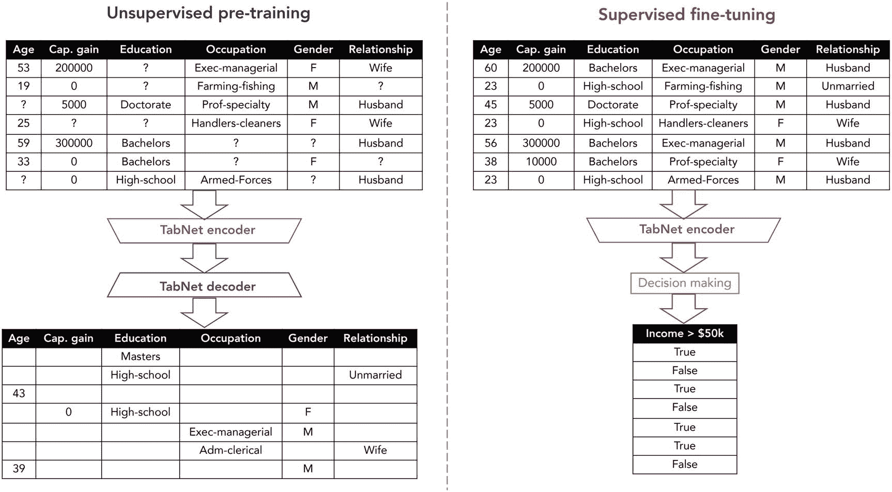

图 3-40

TabNet 方法在监督微调前的无监督预训练。由 Arik 和 Pfister 制作

当在广泛的问题上进行测试时，TabNet 的表现与标准基于决策树的深度学习方法相同或更好（见表 3-2）。2017 年引入的 Forest Cover Type 数据集是一个分类任务；TabNet 比 XGBoost、LightGBM 和 CatBoost 有显著的性能优势。它也优于 AutoML Tables 自动搜索框架，而不需要像 AutoML Tables 所需的那样彻底的参数搜索。

表 3-2

Forest Cover Type 数据集的性能

| 模型 | 测试准确率（%） |
| --- | --- |
| XGBoost | 89.34 |
| LightGBM | 89.28 |
| CatBoost | 85.14 |
| AutoML Tables | 94.95 |
| TabNet | 96.99 |

Sarcos 数据集是一个与类人机器人臂动力学相关的问题，其中需要将 7 个关节位置、7 个关节速度和 7 个关节加速度（一个 21 维的输入空间）映射到 7 个关节扭矩。一个只有 6300 个参数的 TabNet 模型在这个数据集上的均方误差（MSE）低于任何其他测试的非 TabNet 模型（见表 3-3）。一个拥有 1.75 百万个参数的大型 TabNet 模型实现了远低于其他模型的令人惊讶的低测试误差。

表 3-3

Sarcos 数据集的性能

| 模型 | 测试 MSE | 模型大小 |
| --- | --- | --- |
| 随机森林 | 2.39 | 16.7 K |
| 随机决策树 | 2.11 | 28 K |
| MLP | 2.13 | 0.14 M |
| 自适应神经网络树 | 1.23 | 0.60 M |
| 梯度提升树 | 1.44 | 0.99 M |
| 小型 TabNet | 1.25 | 6.3 K |
| 中型 TabNet | 0.28 | 0.59 M |
| 大型 TabNet | 0.14 | 1.75 M |

此外，比较 TabNet 在有和无预训练情况下性能的实验表明，预训练显著提高了性能，尤其是在未标记数据集远大于标记数据集的情况下（表 3-4）。这很有道理——自监督预训练允许模型利用纯监督训练过程无法利用的无标签数据。预训练既提高了测试准确率，也提高了收敛速度。

表 3-4

使用中等大小的 TabNet 模型在希格斯玻色子数据集上的性能。在其他数据库中也观察到预训练带来的类似改进

| 训练数据集大小 | 测试准确率 (%) |
| --- | --- |
| 未预训练 | 预训练 |
| --- | --- |
| 1 K | 57.47 ± 1.78 | 61.37 ± 0.88 |
| 10 K | 66.66 ± 0.88 | 68.06 ± 0.39 |
| 100 K | 72.92 ± 0.21 | 73.19 ± 0.15 |

要使用 TabNet 模型，请使用 pip install tabnet 安装 tabnet 库。实现了两个相关的现成 TabNet 模型：tabnet.TabNetClassifier 和 tabnet.TabNetRegressor，分别用于分类和回归任务（列表 3-35）。这些模型可以像标准的 Keras 模型一样进行编译和拟合。

TabNet 分类器模型中有几个关键特性需要注意：feature_columns 接受一个特征列的列表或元组，以指示特征数量，但也可以通过 num_features 指定；num_classes 指示输出类的数量；feature_dim 确定特征变换块中隐藏表示的维度；output_dim 确定每个决策步骤输出的维度。

```py
from tabnet import TabNetClassifier
model = TabNetClassifier(feature_columns=None,
num_classes=10,
num_features=784,
feature_dim=32,
output_dim=16)
model.compile(optimizer='adam',
loss='sparse_categorical_crossentropy',
metrics=['accuracy'])
model.fit(x_train, y_train, epochs=100)
Listing 3-35
Instantiating a TabNet classifier from the tabnet library
```

使用一个初始学习率较高且逐渐衰减的模型，以及一个大小在训练数据集大小的 1%到 10%之间的大批量，只要内存允许，对模型进行拟合是很重要的。有关更具体建模的语法信息，请参阅文档。

### 消噪自编码器案例研究：中文拼写检查器

英语，像许多其他欧洲语言一样，依赖于将字母类实体按顺序拼接成单词。英语中的拼写错误可以通过简单的基于规则的方 法得到相对较好的解决，其中规则手册将常见的拼写错误单词映射到它们的正确拼写。然而，深度学习模型能够考虑周围文本的上下文，从而做出更明智的决策，确定用户意图使用的单词，以及纠正语法错误和其他语言错误。

然而，中文的“字”是由字符而非字母组成的。中文中的错误通常是由两种主要错误引起的：视觉相似性（两个字符具有相似的外观特征）和语音相似性（两个字符发音相似或相同）。由于中文和英语的结构不同，因此对拼写校正的要求也不同，许多为英语和其他欧洲语言设计的深度学习方法不能轻易地转移到中文上。

在“FASPell：基于 DAE-解码器范式的快速、可适应、简单、强大的中文拼写检查器”一文中，Yuzhong Hong、Xianguo Yu、Neng He、Nan Liu 和 Junhui Liu^(5)提出了一种基于去噪自动编码器架构的深度学习方法来校正中文拼写。

该方法由两个组件组成：一个掩码语言模型和一个置信度-相似度解码器。掩码语言模型接收样本文本并输出几个替换候选词。置信度-相似度解码器从这些候选词中选择替换词，以形成完整的、经过拼写检查的句子。

作为去噪自动编码器（解析“噪声”——拼写错误）的掩码语言模型使用类似 BERT 的结构。在 BERT 等模型中，通常通过随机掩码某些单词并训练模型来预测掩码单词来进行预训练。然而，使用随机掩码引起的错误并不代表中文拼写中实际看到的真实世界错误。FASPell 中预训练的掩码语言模型在由三个过程构建的复合数据集上进行微调：

+   *标准掩码*：数据集的一部分使用与 BERT 相同的随机掩码：某些字符被`

+   *错误自掩码*：文本中的错误被“掩码”为自身。目标标签对应于正确的字符。模型必须识别出存在错误，并执行校正以获得完美性能。

+   *非错误自掩码*：文本中的正确字符也被“掩码”为自身，目标标签是那个字符。这是为了防止过拟合。在这种情况下，模型必须识别出没有错误，并允许它通过模型而不做任何改变。

虽然掩码语言模型为拼写校正提供了基础，但仅凭自身是一个弱中文拼写检查器——添加置信度-相似度解码器以提高性能。

解码器试图处理和理解由掩码语言模型生成的去噪候选词。解码器接收掩码语言模型对每个字符的置信度以及字符之间的相似度。两个字符之间的相似度是通过它们的视觉和语音相似度的组合来计算的。

比较掩码语言模型的置信度和字符相似度的逻辑如下（图 3-41）。假设掩码语言模型提出的一个字符替换具有高置信度，并且与原始错误字符非常相似。高置信度表明掩码语言模型确信该修正正确。因为原始错误字符与修正非常相似，所以我们更有信心修正正确，因为错误更可能比正确字符更不相似。

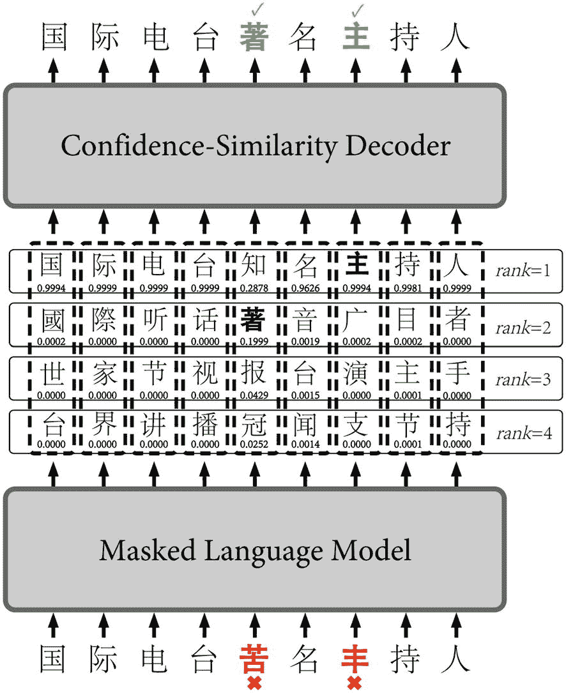

图 3-41

FASPell 模型中的架构和示例数据流，包括掩码语言模型和置信度-相似度解码器。由 Hong 等人制作

另一方面，如果掩码语言模型对修正具有高置信度，但修正与原始字符相似度很小，这两个信号必须密切比较。如果掩码语言模型的置信度足够高，以至于可以抵消原始字符与修正之间的低相似度，则接受该修正。对于句子中的每个字符，接受最大化模型置信度和与原始字符相似度的修正，并将其插入最终输出。

FASPell 设计在错误检测和修正方面都达到了最先进的性能（见表 3-5），超过了王等人（2018 年）和 Yeh 等人（2013 年）提出的先前中文拼写校正系统。

表 3-5

使用三个不同指标测量的 FASPell 在各种拼写任务中的性能

| 模型 | 检测 | 修正 |
| --- | --- | --- |
| 精确度 | 召回率 | F1 | 精确度 | 召回率 | F1 |
| --- | --- | --- | --- | --- | --- |
| 王等人 | 54.0 | 69.3 | 60.7 | 未报告 | 未报告 | 52.1 |
| Yeh 等人 | 未报告 | 未报告 | 未报告 | 70.3 | 62.5 | 66.2 |
| FASPell | 76.2 | 63.2 | 69.1 | 73.1 | 60.5 | 66.2 |

此外，移除对掩码语言模型的微调和移除置信度-相似度解码器通常都会显著降低性能，这证明了这两个元素在适应中文文本的独特挑战时对传统去噪自编码风格掩码语言模型的重要作用（见表 3-6）。

表 3-6

使用三个不同指标测量的 FASPell 在各种拼写任务中的版本性能

| 模型 | 检测 | 修正 |
| --- | --- | --- |
| 精确度 | 召回率 | F1 | 精确度 | 召回率 | F1 |
| --- | --- | --- | --- | --- | --- |
| FASPell | 76.2 | 63.2 | 69.1 | 73.1 | 60.5 | 66.2 |
| 无微调的 FASPell | 75.5 | 40.9 | 53.0 | 73.2 | 39.6 | 51.4 |
| 无置信度-相似度解码器的 FASPell | 42.3 | 41.1 | 41.6 | 32.2 | 31.3 | 31.8 |
| FASPell 未进行微调或置信度相似度解码器 | 65.2 | 47.8 | 55.2 | 48.4 | 35.4 | 40.9 |

FASPell 展示了将自动编码器适应特定任务的重要性。通过改变去噪自动编码器训练的内容和方法，并添加置信度相似度解码器以将字符相似性的知识纳入对去噪自动编码器输出的理解，FASPell 能够解决标准预训练自动编码器设计中的一项关键不足。

### 变分自动编码器案例研究：文本生成

之前，我们探讨了图像数据的变分自动编码器。回想一下，变分自动编码器特别有价值，因为我们可以通过改变潜在空间中采样的位置来控制生成数据。这允许对文本的情感和写作风格等属性进行精细控制，这是其他生成方法所不可能实现的。

变分自动编码器通常在图像上通过适当的设计表现良好。然而，将变分自动编码器应用于文本生成，其中卷积层被循环层所取代，则更为困难。回想一下，变分自动编码器的损失是一个重建损失和 KL 散度的总和。KL 散度作为一个正则化项，可以通过将潜在变量分布聚类得更紧密来优化。

当使用基于循环结构的结构（图 3-42）训练用于自然语言任务的变分自动编码器时，损失函数的 KL 散度项往往会*崩溃*或降至 0。这意味着所有潜在变量分布都几乎重叠在一起，尽可能地紧密聚类。因为这些重叠的分布非常难以解码和理解，所以生成文本的解码器完全忽略了这些潜在表示。相反，由于基于 RNN（循环神经网络）的解码器具有显著建模能力，解码器可以生成得分相对较低的重建错误的文本，而不依赖于解码器提供的编码表示。

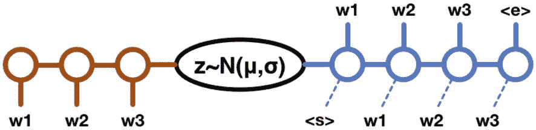

图 3-42

基于传统 LSTM 的文本生成变分自动编码器，它受到 KL 散度项崩溃的问题

这导致重复且缺乏原创性的输出，如这些样本生成的推文。

```py
@userid @userid @userid @userid @userid
@userid thanks for the follow
@userid @userid @userid @userid @userid @userid @userid @userid @userid
@userid @userid thanks for the follow
```

在“用于文本生成的混合卷积变分自动编码器”中，Stanislau Semeniuta、Aliaksei Severyn 和 Erhardt Barth^(6)提出了一种基于变分自动编码器的结构来解决此问题。使用他们的方法，生成的输出既更真实又更多样化：

```py
@userid All the best!!
@userid you should come to my house tomorrow
I wanna go to the gym and I want to go to the beach
@userid and it's a great place
@userid I hope you're feeling better
```

架构包括卷积层和循环层的混合；编码器完全由卷积层组成，而解码器结合了解卷积（如转置卷积）和传统的 RNN。选择解卷积层而不是循环层有两个关键原因：解卷积层有更高效的 GPU 实现，并且前馈架构比循环架构更容易优化，因为需要更多一致性和更少的步骤。

通过在变分自动编码器格式中使用标准的卷积和解卷积层，可以学习序列的关键特征并将其映射到连续的潜在空间（图 3-43）。通过一系列解卷积可以将采样的编码表示解码。这个卷积变分自动编码器的输出通过一个传统的 LSTM 网络进行进一步处理（图 3-44）。循环组件专门用于通过考虑序列来考虑各种文本实体之间的依赖关系。这减轻了从卷积/解卷积层中减轻这一任务的负担，因为这些层不是为成功执行这一任务而构建的。

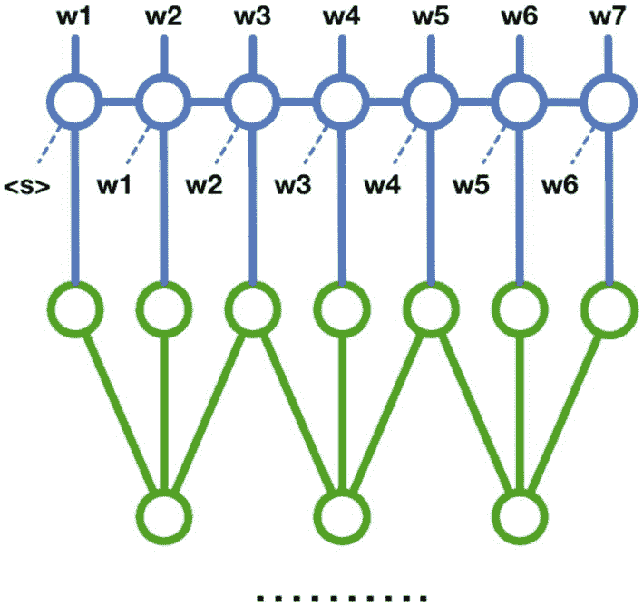

图 3-44

混合方法中的 LSTM 组件，其中生成的特征通过 LSTM 风格的模型进一步解码为文本，以捕捉句子中实体之间的复杂序列依赖关系

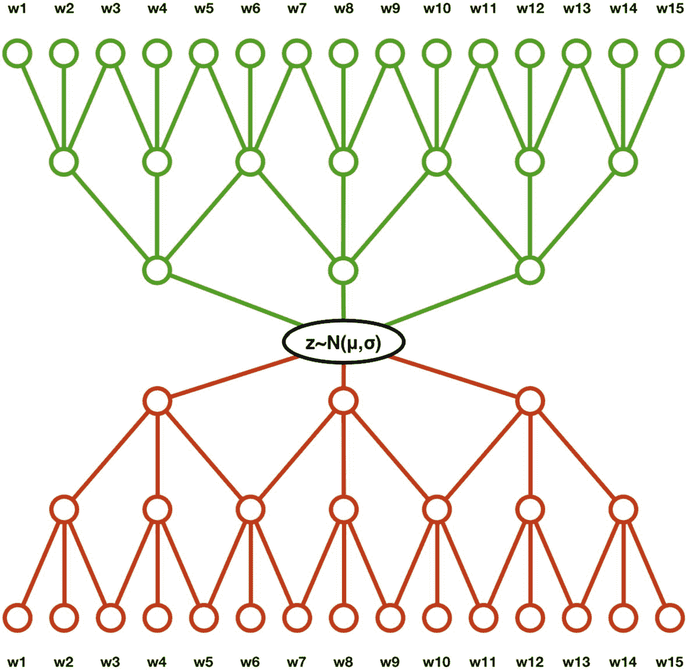

图 3-43

变分自动编码器的前馈组件。输入从底部进入并通过卷积和解卷积处理，以生成一组生成的特征

这种架构允许在没有使用压倒性的循环层堆叠的情况下进行有意义的文本生成。然而，还需要三种其他机制来完全解决 KL 散度崩溃问题：

+   *输入丢弃*：在输入上应用了一个丢弃层，使得输入在编码之前就已经以随机方式被破坏。

+   *KL 项退火*：通过逐渐增加损失函数中 KL 散度项的权重，神经网络从标准自动编码器转变为变分自动编码器。

+   *辅助重建项*：在损失函数中添加了一个专用项，这个项只能通过有意义的重建和编码来优化。这加剧了损失函数中重建部分的重要性。

通过对优化策略进行适当的修改，使用卷积循环混合变分自编码器可以得到一个更成功的模型，该模型能够产生多样化和逼真的输出。通过在潜在空间中的两个点之间进行线性插值，我们能够从一个推文过渡到完全不同的推文：

```py
@userid I do that too. I have to wait a lot of people too
@userid I do not know about it and then I can find a contest
@userid I am so excited for this summer I hope you are well
@userid i don't know what to do in the morning i love you so much for the shoutout
@userid i don't know what to do if you don't mind follow me i love you so much xx
@userid it would be awesome to hear it's a great place to see you around the weekends
@userid it would be awesome to hear I'm so excited for the summer I'm going to see them
```

Semeniuta、Severyn 和 Barth 的工作展示了如何通过层组合的创造性结合以及超越某些模型类型应该看起来如何的预包装边界，以及针对特定挑战的明确、具体的机制，可以显著提高性能。

## 关键点

在本章中，我们讨论了用于表格和图像数据的自编码器的直觉和实现，以及五个关键的自编码器应用：通过降噪自编码器进行降噪、预训练、降维、特征生成以及通过变分自编码器进行数据生成。

+   自编码器在开发数据集的重要表示和从数据中提取关键信息和特征的高效过程的过程中进行编码和解码数据。自编码器依赖于数据集的上下文来支持其高效的表示。因此，尽管它们不是好的通用压缩算法，但它们有许多利用自编码器独特能力的学习数据复杂关系和表示的应用，这种学习是无监督的。

+   自编码器设计中一个关键的权衡是瓶颈的大小：瓶颈太小可能会使任何编码任务过于困难而无法实用，而瓶颈太大则可以轻易解决，无需开发有意义的表示。

+   在实现自编码器和其他复杂的神经网络结构时，使用模块化设计，通过定义模型为子模型之间的一系列关系来构建模型。这使得实现自编码器应用变得显著更容易，并且在概念上更清晰，便于理解和操作。

+   要构建用于表格数据的自编码器，只需在编码器中堆叠具有递减神经元数量的密集层，在解码器中堆叠具有递增神经元数量的密集层。要构建用于图像数据的自编码器，在编码器中使用卷积层和池化层，在解码器中使用转置卷积层和上采样层。卷积自编码器通常在瓶颈周围的区域进行展平和重塑，使得编码器的输出（编码表示）是一个向量。在卷积层中使用`padding='same'`以便于形状大小的操作。只要每个编码层都有一个逆解码层，自编码器也可以用于其他数据类型。

+   去噪自动编码器是经过训练以从损坏、噪声的输入中重建原始数据的自动编码器。如果你使用去噪自动编码器对数据集进行去噪，请确保噪声的形式是现实的，并且存在于数据集中。在实现去噪自动编码器时，噪声可以作为一个层，应用于数据集，或者作为一个图像数据生成器（在图像的情况下）。

+   当使用自动编码器进行预训练时，自动编码器首先在无监督数据上训练以提取关键思想和表示。然后，编码器被分离出来，并在其后添加自定义处理层以改变模型结构，使其能够执行监督任务。编码器权重通常被冻结，以便以下层可以训练以解释编码表示的输出；这可以随后进行一些微调以优化性能。

+   自动编码器在两个关键方面与其他降维算法不同：更高的适应性和以模型为中心的值特征阐述。这可以通过让编码器预测某些数据输入的编码表示来实现。

+   使用自动编码器进行特征生成类似于使用它们进行降维，但编码后的特征是连接到原始数据集而不是替换原始数据集。这可以通过一个非线性架构实现，其中输入既通过编码器传递，又连接到编码器的输出；然后，这些丰富化的数据可以通过一系列处理层进行解释和使用，以产生输出。

+   变分自动编码器允许通过在潜在空间中选择位置并解码它们来生成新的数据。然而，由于标准自动编码器倾向于产生离散空间，无法随机采样，因此变分自动编码器实现了两个关键变化，以强制发展连续的潜在空间：学习潜在变量的*概率分布*而不是绝对位置，并将 KL 散度添加到损失函数中，以在潜在空间的形成中提供正则化。变分自动编码器依赖于相对较低级别的操作，但可以通过良好的组织和积极的实验来实现。

自动编码器是非常灵活的结构，你可以将其融入几乎任何深度学习设计中。当你面对一个新的深度学习问题并需要开始的地方时，请记住它们——自动编码器为开发知识和构建重要表示提供了一个良好的起点。

在下一章中，我们将讨论模型压缩及其对未来深度学习的激动人心的含义。
