# 7. 重新定义困难的深度学习问题

> *成功的转换重新定义了问题，使得解决方案成为可能。它们消除了现有的边界，并从头开始。*
> 
> ——马尔科姆·格拉德威尔，记者和作家

大致来说，深度学习过程可以用三个中心、依次连接的组件来表示：架构的创建、训练程序和方法的定义以及模型的训练本身。这是深度学习的一般建模工作流程。本书到目前为止所涵盖的每一章都可以大致归类为至少这些类别之一。关于迁移学习和预训练的第二章讨论了从原始数据集以外的来源训练模型以转移和开发知识的方法。关于自编码器的第三章讨论了多才多艺的自编码器概念和架构的各种用途。关于模型压缩的第四章讨论了神经网络架构的多种修改，以及训练程序中的变更。关于元优化的第五章讨论了神经网络架构和训练程序中参数的自动化。关于成功神经网络设计的第六章讨论了神经网络架构和模型实现中的成功设计模式和技巧。

在最后一章——第七章——我们将退后一步，从严格研究构建成功且高效的神经网络系统转向更广泛的视角，即在实际问题中*使用*而不是仅仅*执行*深度学习。为了做到这一点，我们需要对重新定义那些通常不适合深度学习成功应用格式的困难现实世界问题感到舒适。尽管深度学习是一个极其强大且多功能的工具，但它通常需要人类在困难任务面前解决问题的技巧。

本章我们将探讨的关键主题是*数据*。数据是深度学习问题的基础，它是影响一个人如何处理深度学习关键组件的关键因素（图 7-1）。

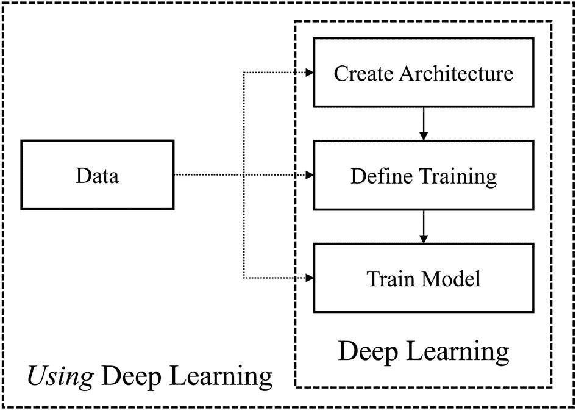

图 7-1

深度学习与深度学习：数据在影响深度学习各个组件中的作用

我们已经到达了一个难以将“重新定义问题”的概念抽象化为一个通用理论或一系列简单要点。本章将提供三个案例研究，作为成功重新定义困难深度学习问题的例子，这些问题与数据相关：数据表示的实验、损坏的数据和有限的数据。虽然这些案例研究不应被视为严格代表你将面临并需要重新定义的问题，但它们表明创新伴随着推动和突破边界。在这样做的同时，希望它们能激发你的创造力，开始自己解决新的和未见过的问题。

## 数据表示：深度洞察

数据是一种有价值的商品，其纯度在深度学习发展的过程中变得越来越受到重视。而传统的机器学习方法通常严重依赖人类特征清洗、工程化和修改，现代深度学习则推动向人类对数据进行预处理的持续降低依赖，通过自动化数据的准备来实现，这通常是通过巧妙的神经网络架构设计来完成的。

深度学习正在自动化数据形式之间的越界；不同的数据表示方法正在以自动化的方式被连接起来。然而，数据中仍然存在一个深度学习仍然需要人类指导来导航的分歧——数据的*上下文维度*。通过这种方式，我们不仅意味着数据的维度（即形状）或它所表示的编码知识，而且还意味着数据在其来源的各个上下文维度上的组织，例如图像的宽度、高度和通道的空间维度，音频输入的时间维度，以及文本输入的序列维度。数据的上下文维度最好地描述了我们在深度学习背景下理解的有意义不同的“类型”或“形式”的数据。

所说的“专用”数据形式，如图像，通常被简化为深度学习的基本组成部分——向量，它们可以作为标准层和操作中的主要元素进行处理。这已经成为深度学习发展过程中的一个普遍惯例：特征提取的概念意味着复杂数据向简单性的趋势；复杂数据的重要元素被提取出来，然后从这些元素中提取出更加重要的元素，等等。因此，复杂的数据形式被简化为向量的处理单元。

这在深度学习的发展中是一个相当不明确的假设或传统，从重新构架设计范式和跨越边界中可能会产生新的创新和有效的方法。我们可以将传统将图像数据流向向量形式重新构架为向量数据流向 *图像* 形式。卷积操作提供了一种局部特征提取的方法——也就是说，通过局部滤波器逐步平滑复杂的数据排列，从而使信息 *逐步* 概化——这是全连接层所不具备的，全连接层一次处理所有信息。直观地，我们可能假设局部特征提取可能对除了图像以外的领域也很有价值。

Alok Sharma、Edwin Vans、Daichi Shigemizu、Keith A. Boroevich 和 Tatsuhiko Tsunoda 在他们 2019 年的论文“DeepInsight：一种将非图像数据转换为图像以用于卷积神经网络架构的方法”中重新构架了这种传统设计范式^(1)。DeepInsight 方法是一个将结构化/表格数据（这并不排除序列或基于文本的数据，只要它以结构化数据格式呈现）转换为基于图像数据的管道，然后用于在标准卷积神经网络中进行训练。

DeepInsight 的第一步是获取一个特征矩阵，用于将结构化数据中的单个特征映射到相应图像中的空间坐标。这个特征密度矩阵被用作“模板”来为每个向量生成单个图像。每个特征都与“模板”矩阵中的一个像素相关联。这种关联是通过一种巧妙的方法实现的，即数据被 *转置* 并通过核主成分分析（Kernel PCA）或 t-Stochastic Neighbor Embedding 等方法进行降维。传统上，在包含 *n* 个样本和 *d* 个特征的样本集中，降维到两个空间维度会产生一个包含 *n* 个样本和两个特征的样本集。然而，如果我们对这样的数据集的 *转置* 应用降维，我们将每个 *d* 个特征视为一个样本，每个 *n* 个样本视为一个特征，从而得到一个包含 *d* 个样本和两个特征的降维数据集。因此，每个 *d* 个特征都已被映射到“模板”矩阵中的二维点。

使用像核主成分分析（Kernel PCA）和 t-SNE 这样的变换方法，这些方法可以保持局部关系，我们可以将彼此行为相似的特征映射到特征矩阵中物理上更近的位置（图 7-2）。这使得生成的图像中的相似特征可以通过卷积更有效地处理。

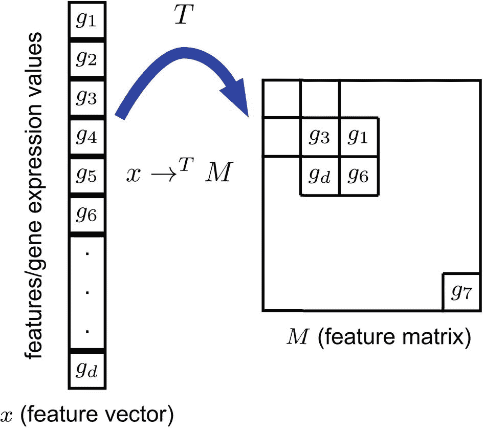

图 7-2

将特征映射到模板矩阵 *m* 中的位置。*g*[*i*] 用于表示一个特定的特征。→^(*T*) 表示变换过程

一旦建立了“模板”特征矩阵，我们就可以通过在图像中建立一个对应于该特定特征分配位置的点来为输入向量创建一个图像（见图 7-3）。（你可以从这一点看出，DeepInsight 是基于高维数据设计的；需要大量的特征来填充图像，因为图像中的每个点都是一个特征。）为了防止图像表示中的冗余，使用了凸包算法来选择包含所有数据的最大矩形，裁剪掉不必要的空白边缘。数据相应地旋转，并将空间映射到基于像素的图像格式，然后可以通过标准的卷积神经网络进行处理。

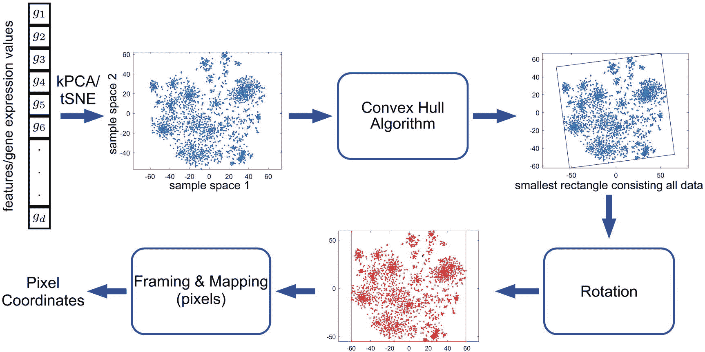

图 7-3

DeepInsight 流程：将向量映射到像素坐标

Sharma 等人使用一个模型来处理这种结构化的图像数据，该模型结合了本书中之前讨论的许多内容。用于处理图像的架构（如图 7-4 所示）使用具有两个基数度的并行表示，其中每个分支都是一个简单的线性堆叠的线性单元，遵循标准的卷积池化动态（包括额外的批量归一化和 ReLU 层）。两个分支合并并处理以产生分类输出。两个分支之间的区别在于图像操作的滤波器大小；通过使用一个能够明确捕捉图像中不同大小模式的架构，模型能够更有效地同时寻找更广泛的模式和更小的细微差别，并将这两个视角的发现结合起来，形成更准确的判断。使用贝叶斯优化调整了单元重复次数、滤波器大小、学习率和其他超参数。

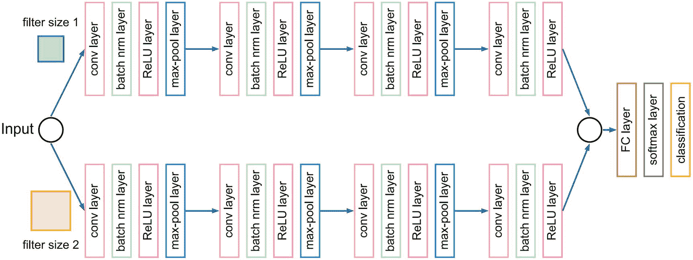

图 7-4

DeepInsight 流程使用的架构

结果显示，DeepInsight 管道在模型最初设计的遗传数据以及其他高维数据环境中表现都非常出色。Sharma 等人对五个基准数据集进行了方法评估：RNA-seq，来自 NIH TCGA 数据集的生物 RNA 序列数据集；TIMIT 语料库的一个子集，一个语音数据集；Relathe 数据集，来自新闻文档；Madelon 数据集，一个合成的二元分类问题；以及 ringnorm DELVE，另一个合成的二元分类问题。这五个数据集代表了广泛的问题背景和数据空间；DeepInsight 方法的表现远优于其他在建模结构化/表格数据集方面已成功成为主流方法的算法（见表 7-1）。请参阅图 7-5 以了解 DeepInsight 如何生成这些数据集的有意义视觉表示。

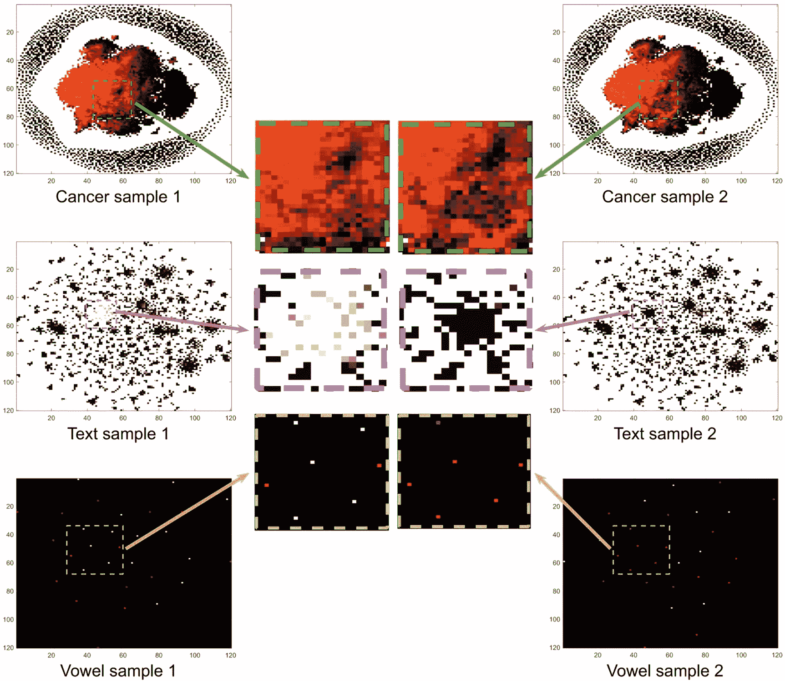

图 7-5

DeepInsight 映射的图像模式可视化。来自癌症、文本和元音数据集的样本差异显示在中间列的小块中。这些差异通过卷积滤波器提取，以实现比其他方法更有效的分类。

表 7-1

DeepInsight 与其他常见结构化数据处理方法的性能对比，使用各种数据集

| 数据集 | 决策树 | AdaBoost | 随机森林 | DeepInsight |
| --- | --- | --- | --- | --- |
| RNA-seq | 85% | 84% | 96% | 99% |
| 元音 | 75% | 45% | 90% | 97% |
| 文本 | 87% | 85% | 90% | 92% |
| Madelon | 65% | 60% | 62% | 88% |
| Ringnorm DELVE | 90% | 93% | 94% | 98% |

我们可以反思 DeepInsight 的关键优势及其在处理结构化数据方面对传统图像到向量管道的颠覆：

+   CNNs 不需要任何额外的特征提取技术，这些技术通常用于结构化数据。它们通过一系列卷积和池化操作自动从原始输入数据中推导出高级且信息丰富的特征，无需预处理。用于处理图像的模型的非线性架构有助于开发高级且丰富的表示。

+   卷积神经网络在局部子区域内处理图像数据。这允许网络具有更大的深度，同时参数量相对较小，从而促进了网络的健康理解和泛化。如果使用全连接网络，这种性能会更难实现，因为增加模型的深度以增强建模能力会导致参数数量更快地增加，从而增加过拟合的风险，这在结构化数据上训练的神经网络尤其容易发生。

+   CNN 的独特结构允许它在利用 GPU 等硬件进步的最近技术下非常高效地运行。

+   与传统上在建模结构化数据方面表现出成功的基于树的算法相比，卷积神经网络（CNNs）和 DeepInsight 管道更具有可定制性/可优化性。除了调整模型架构、向量到模板矩阵映射、学习率等超参数之外，还可以轻松使用图像增强方法来生成“新”图像数据。这种数据增强在表格数据中难以实现，因为其表示空间的低维性相对于图像来说缺乏固有的鲁棒性；也就是说，旋转图像不应该影响它所代表的现象，而改变结构化数据可能会。

在实践中，DeepInsight 应该是其他决策模型集成中的一个贡献成员。将 DeepInsight 的局部特性与其他建模方法的更全局方法相结合，可能会产生更明智的预测。

为了实现 DeepInsight，我们将使用由 Sharma 等人创建的代码，可以从 GitHub 仓库安装（列表 7-1）。

```py
!pip install git+git://github.com/alok-ai-lab/DeepInsight.git#egg=DeepInsight
Listing 7-1
Installing code provided by Alok et al. for DeepInsight
```

我们将使用的数据是来自臭名昭著的加州大学欧文分校机器学习库的 Mice Protein Expression Dataset，这是一个包含 1080 个实例和 80 个特征的分类数据集，这些特征模拟了受到情境恐惧条件作用的小鼠大脑皮层中 77 种蛋白质的表达。该数据集的清洗版本包含在此书的源代码中，可供下载。

假设数据已经被加载到变量 `data` 中的 pandas DataFrame，第一步是将数据分为训练集和测试集，这是机器学习中的标准流程（列表 7-2）。我们还需要将标签转换为 one-hot 格式，在它们的原始组织结构中是表示类别的整数。这可以通过使用 `keras.util` 的 `to_categorical` 函数轻松实现。

```py
import pandas as pd
# download csv from online source files
data = pd.read_csv('mouse-protein-expression.csv')
from sklearn.model_selection import train_test_split
X_train, X_test, y_train, y_test = train_test_split(data.drop('class',axis=1),
data['class'], train_size=0.8)
y_train = keras.utils.to_categorical(y_train)
y_test = keras.utils.to_categorical(y_test)
Listing 7-2
Selecting a subset of data and converting to one-hot form as necessary
```

我们需要使用 DeepInsight 库中的 `LogScaler` 对象来使用 L2 范数将数据缩放到 0 到 1 之间（列表 7-3）。我们将转换训练集和测试集，只在训练集上拟合缩放器。所有用于 DeepInsight 模型预测的新数据都应该首先通过这个缩放器。

```py
from pyDeepInsight import LogScaler
ln = LogScaler()
X_train_norm = ln.fit_transform(X_train)
X_test_norm = ln.transform(X_test)
Listing 7-3
Scaling data
```

`ImageTransformer` 对象通过首先使用传递给 `feature_extractor` 的降维方法生成“模板”矩阵来执行图像变换，`feature_extractor` 接受 `'tsne'`、`'pca'` 或 `'kpca'` 中的任意一个。此方法用于确定输入向量中特征到 `pixels` 维度图像的映射。我们可以使用核主成分分析（Kernel PCA）降维方法实例化一个 ImageTransformer 来生成 32x32 的图像（`feature_extractor='kpca', pixels=32`）（列表 7-4）。

```py
from pyDeepInsight import ImageTransformer
it = ImageTransformer(feature_extractor='kpca', pixels=32)
tf_train_x = it.fit_transform(X_train_norm)
tf_test_x = it.transform(X_test_norm)
Listing 7-4
Training and transforming with the ImageTransformer
```

由于数据的相对低维性和数量，使用核 PCA 而不是 t-SNE。PCA 没有被采用，因为其线性限制了它捕捉的细微差别。选择 32 像素的图像长度作为平衡点，既不会使生成的图像过于稀疏（图像长度过高），也不会太小（图像长度过低），以至于无法有意义和准确地表示特征之间的空间关系。随着图像大小的减小，DeepInsight 管道中距离的概念——即根据它们的相似性将特征放置在彼此更远或更近的位置——变得更加近似，以至于变得任意。

我们可以使用`matplotlib.pyplot.imshow()`轻松可视化 ImageTransformer 生成的图像，以了解降维方法和图像大小如何影响特征的排列和成功的可能性（见图 7-6）。图像之间的差异微妙，但通过一系列卷积操作识别并放大了区分因素。请注意，32x32 像素空间允许相似特征聚类，并将不太相关的特征在角落处分离得更远。

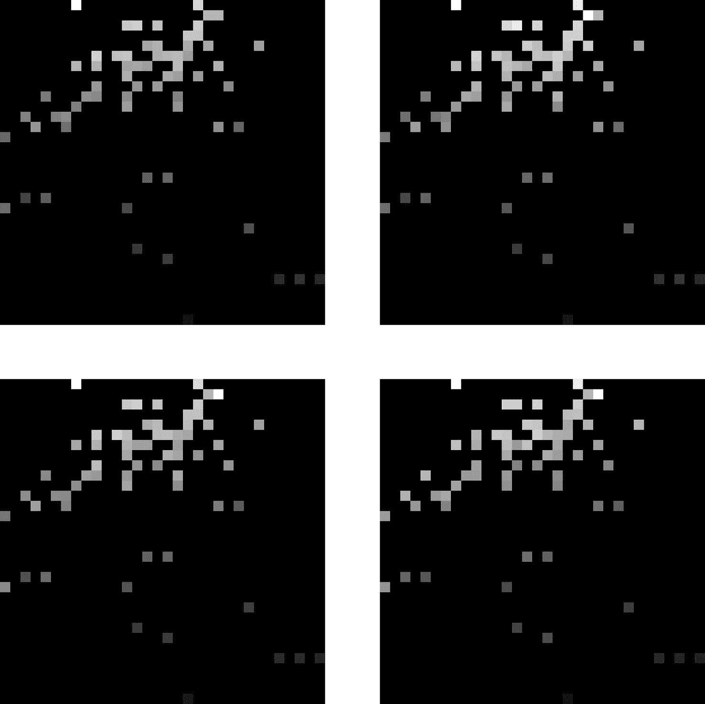

图 7-6

使用 DeepInsight 方法从结构化数据生成的四个示例图像

我们将构建一个类似于 DeepInsight 论文中使用的双分支细胞设计的架构，并进行三个关键改进：InceptionV3 风格的滤波器分解/扩展、细胞中的 dropout 以及更长的全连接组件（见列表 7-5）。这些改进有助于开发具有较小区域的更具体滤波器，以更好地解析密集特征，通过防止过拟合进一步促进泛化，并更好地处理派生特征。一个分支使用大小为(2,2)的核处理图像，另一个分支使用大小为(5,5)的核（例如，额外的分解，如 5x1 和 1x5）。

```py
# input
inp = L.Input((32,32,3))
# branch 1
x = inp
for i in range(3):
x = L.Conv2D(2**(i+3), (2,1), padding='same')(x)
x = L.Conv2D(2**(i+3), (1,2), padding='same')(x)
x = L.Conv2D(2**(i+3), (2,2), padding='same')(x)
x = L.BatchNormalization()(x)
x = L.Activation('relu')(x)
x = L.MaxPooling2D((2,2))(x)
x = L.Dropout(0.3)(x)
x = L.Conv2D(64, (2,2), padding='same')(x)
x = L.BatchNormalization()(x)
branch_1 = L.Activation('relu')(x)
# branch 2
x = inp
for i in range(3):
x = L.Conv2D(2**(i+3), (5,1), padding='same')(x)
x = L.Conv2D(2**(i+3), (1,5), padding='same')(x)
x = L.Conv2D(2**(i+3), (5,5), padding='same')(x)
x = L.BatchNormalization()(x)
x = L.Activation('relu')(x)
x = L.MaxPooling2D((2,2))(x)
x = L.Dropout(0.3)(x)
x = L.Conv2D(64, (5,5), padding='same')(x)
x = L.BatchNormalization()(x)
branch_2 = L.Activation('relu')(x)
# concatenate + output
concat = L.Concatenate()([branch_1, branch_2])
global_pool = L.GlobalAveragePooling2D()(concat)
fc1 = L.Dense(32, activation='relu')(global_pool)
fc2 = L.Dense(32, activation='relu')(fc1)
fc3 = L.Dense(32, activation='relu')(fc2)
out = L.Dense(9, activation='softmax')(fc3)
# aggregate into model
model = keras.models.Model(inputs=inp, outputs=out)
Listing 7-5
Sample implemented architecture in Keras. You can, of course, optimize the architecture using the meta-optimization methods discussed in Chapter 5
```

当模型在数据上编译并训练了数十个 epoch 后，几乎达到了完美的训练和准确率以及测试准确率（见列表 7-6）。

```py
model.compile(optimizer='adam', loss='categorical_crossentropy',
metrics=['accuracy'])
model.fit(tf_train_x, y_train, epochs=100, validation_data=(tf_test_x,y_test))
Listing 7-6
Compiling and fitting the model
```

通过扩展卷积和其他基于图像的图像可以到达的结构化数据的数据类型，DeepInsight 连接了整个深度学习领域，在这种情况下，产生了一个极其成功的模型。

## 损坏数据：带有噪声标签的负学习

标签错误的数据比我们想象的要普遍，尤其是在标注数据集的背景下，样本通常由人工标注员手动标注，他们往往行动迅速且可能犯错。另一方面，可能对数据集进行对抗攻击，以将某些训练样本的标签切换，以最大限度地破坏神经网络性能。由于不忠实于所代表现象的数据会导致训练出的模型无法正确地模拟这些现象，通常会导致过度拟合和“混乱”的表示（即 GIGO（垃圾输入，垃圾输出）），因此需要开发处理带有损坏标签的数据的方法，而不必手动搜索整个数据集来纠正它们。

Youngdong Kim、Junho Yim、Juseung Yun 和 Junmo Kim 提出了一种新颖、简单但成功的学习流程来处理损坏的标签.^(2)他们的方法重新定义了传统的多类图像分类任务方法，即**正学习**，其中神经网络被“教导”将图像与标签关联——也就是说，这张图像**是**[标签]。另一方面，**负学习**是指神经网络被“教导”**不**将图像与标签关联——也就是说，这张图像**不是**[标签]（图 7-7）。

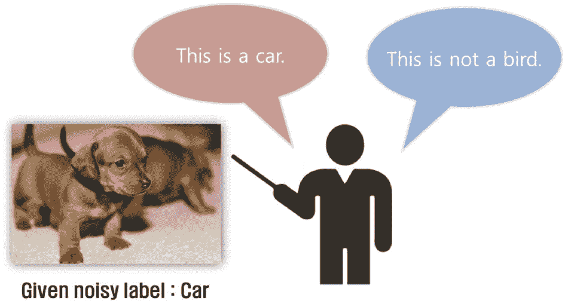

图 7-7

正学习和负学习之间的视觉差异

在多类背景下，负学习是一种间接的学习方法。需要学习多个负学习关联才能等同于一个正学习关联。例如，如果我们正在训练一个模型来分类从 0 到 9 的 MNIST 风格的数字，为了表示某些图像代表数字“3”的知识，我们需要九个负学习关联：这张图像**不是**数字“0”，这张图像**不是**数字“1”，……，这张图像**不是**数字“9”。然而，在这个背景下，负学习的目的并不是等效地表示正学习，因为我们知道许多正学习关联已经被损坏。

假设我们正在对一个有*k*个类的多类问题上的模型进行训练。我们不是通过将一些训练输入*x*与正标签*y*[*p*]关联来进行正学习，我们知道这些标签可能被损坏，而是随机选择*k* - 1 个其他类别中的一个作为负标签*y*[*n*]。如果原始的正标签*确实*被损坏（即*y*[*p*]与*x*不匹配），那么随机选择的负标签是真实的概率是 1-\frac{1}{k-1}（即，当应用于*x*时，只有其他*k* - 1 个负标签中的一个是不正确的，因为它对应于正标签）。随着*k*的增加，随机选择的负标签是真实的概率越来越接近 1。对于现代数据集，当*k* = 100 或甚至*k* = 1000 时，负标签不正确的概率是可以忽略不计的。另一方面，如果原始的正标签*没有*被损坏（即它是正确的），那么随机选择的替代负标签是真实的概率是 100%。

在负标签上训练模型需要不同的损失函数。假设一个五类分类问题的真实 one-hot 向量是[1, 0, 0, 0, 0]（即，负标签是类索引 0 表示）并且预测是[0.3, 0.4, 0.2, 0.0, 0.1]。我们的损失函数不需要考虑除了负标签以外的其他类别的预测。我们只关心模型对索引 0 的类（即 0.3 的预测）的预测值降低到零，因为我们希望模型对该类别的置信度尽可能低。模型不是通过增加正确类别的概率来训练，而是训练模型最小化随机选择的错误类别的置信度（即对应于负标签）。

除了确保标签的真实性增加外，这种负学习的方法通过引入间接关联来阻止对噪声数据的过度拟合。在一个足够大的数据集中，通过负学习学到的这些间接关联会累积起来，形成与正学习相当的知识（如果标签没有被损坏）。通过比较在正学习和负学习上训练的模型的置信度概率分布来证明没有过度拟合的证据——使用负学习的模型置信度更低，并能更准确地识别损坏的示例（图 7-8）。

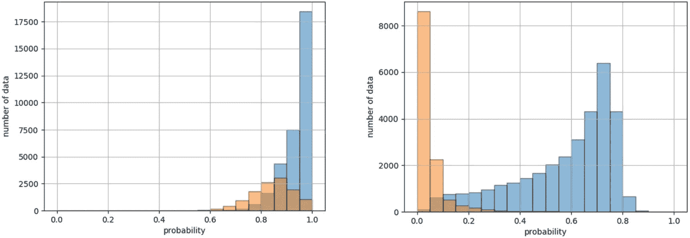

图 7-8

左：仅使用正学习时，表示模型在数据集（左，橙色：损坏数据；右，蓝色：未损坏数据）中的置信度的两个概率分布。右：仅使用负学习

为了提高收敛性，作者引入了 *选择性负学习*（SelNL），其中卷积神经网络仅在模型预测标签置信度大于 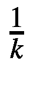（大于随机性）的数据上进行进一步训练。这意味着可能不正确的负标签与其他正确负标签的学习知识相矛盾，因此可以从训练数据集中过滤出来。SelNL 帮助模型变得更加自信，并更准确地分离损坏数据与未损坏数据的概率分布（图 7-9）。

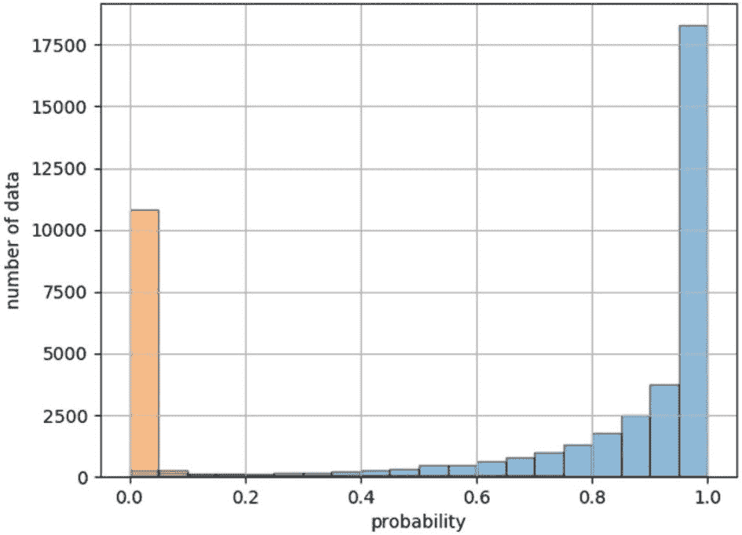

图 7-9

表示模型在数据集上置信度的两个概率分布（左侧，橙色：损坏数据；右侧，蓝色：未损坏数据），带有 *NL* → *SelNL*

Kim 等人基于正学习在给定正确标签的情况下比负学习更快、更准确的基础上，引入了另一种训练范式，*选择性正学习*（SelPL）。现在，负学习和选择性负学习范式已经允许在一定程度上准确地分离损坏和未损坏的数据，我们可以过滤掉模型预测置信度低于 *γ* 的数据。通过这个阈值要求的数据被认为是干净的，并且使用干净数据的 *正标签* 进行网络上的进一步训练。

在此流程的末端 – *NL* → *SelNL* → *SelPL*，称为 SelNLPL 流程 – 模型能够清楚地分离损坏和未损坏的数据，对前者分配低概率，对后者分配高概率（图 7-10）。

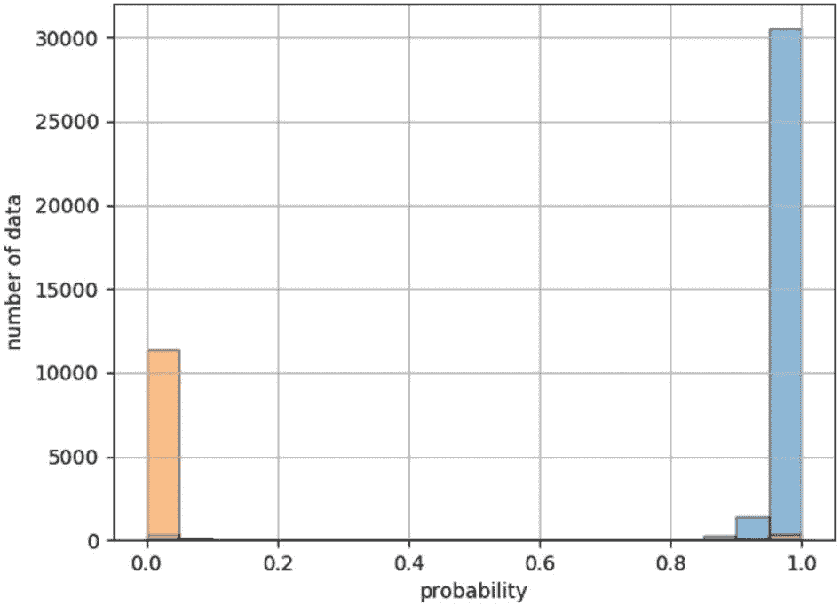

图 7-10

表示模型在数据集上置信度的两个概率分布（左侧，橙色：损坏数据；右侧，蓝色：未损坏数据），带有 *NL*→ *SelNL*→ *SelPL*

注意，网络在 *SelNL* → *SelPL* 阶段从负学习到正学习的转变可能看起来有些突然，但根据经验观察，这个过程是平滑的。网络只需要重新排列和重新格式化它已经获得的知识，以适应正学习模式。这可以通过模型在不同阶段（负学习、选择性负学习和选择性正学习）的训练曲线来证明（图 7-11）。

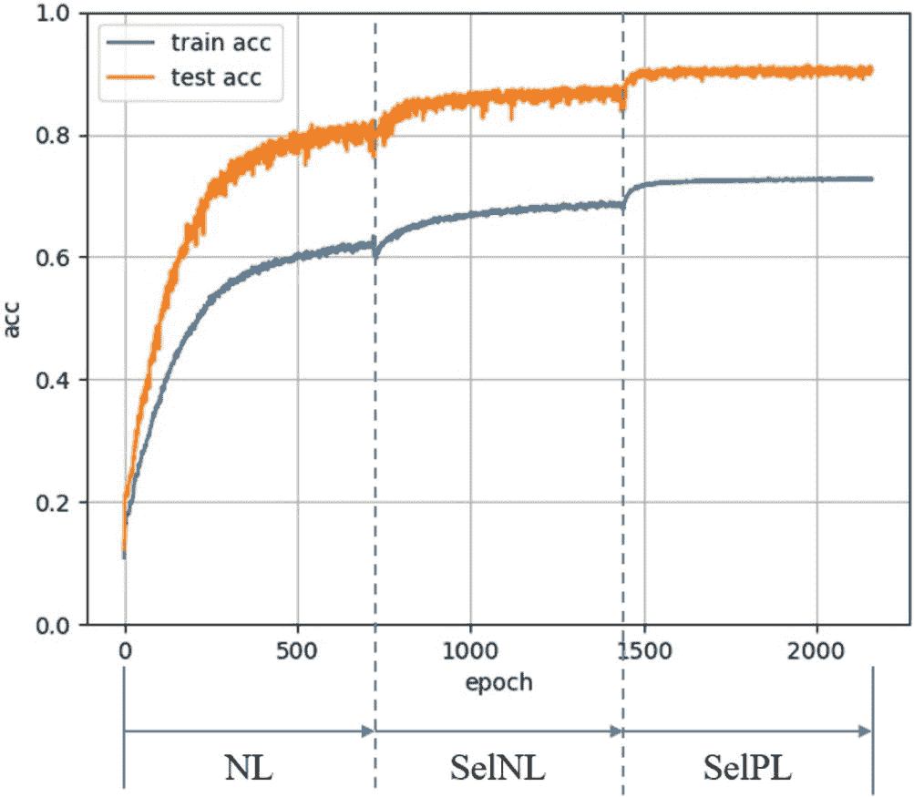

图 7-11

在 *NL* → *SelNL* → *SelPL* 流程中的性能

该模型的过滤能力不仅可以用于识别损坏的数据，还可以对其进行纠正。一个新的分类网络在干净的数据集（前一个模型已识别为未损坏的数据集）上训练。然后它预测损坏数据的标签以更新它们的标签。整个数据集——包括原始未损坏的和更新的数据——都用于训练最终的分类网络。最终的分类网络可以访问一个修正的、几乎完全真实的数据集（图 7-12）。因此，它可以更真实地模拟数据所代表的现象。

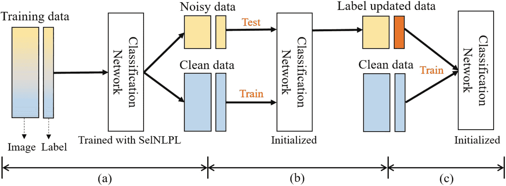

图 7-12

完整的 NLNL 管道 – SelNLPL 管道将噪声数据和干净数据分离到标签更新再到最终模型分类

此管道在解决数据损坏问题的领域实现了最先进的性能，在广泛的模型和数据集上优于其他数据损坏方法（表 7-2）。

表 7-2

NLNL 管道与其他方法的性能比较

| 数据集 | 模型 | 方法 | 噪声水平 | 性能 |
| --- | --- | --- | --- |
|   |   | 20% | 40% | 60% |
| --- | --- | --- | --- | --- |
| FashionMNIST | ResNet18 | CEMAETruncated *L*[*q*]NLNL | 93.2480.3993.21**94.82** | 92.0979.3092.60**94.16** | 90.2982.4191.56**92.78** |
| CIFAR-10 | ResNet14 | CEBootstrap – softBootstrap – hardNLNL | 83.784.383.6**89.85** | –––– | –––– |
| ResNet34 | CEMAETruncated *L*[*q*]NLNL | 86.9883.7289.70**94.23** | 81.8867.0087.62**92.43** | 74.1464.2182.70**88.32** |
| CIFAR-100 | ResNet34 | CEMAETruncated *L*[*q*]NLNL | 58.7215.8067.61**71.52** | 48.209.0362.64**66.39** | 37.417.7454.04**56.51** |
| MNIST | LeNet | CEBoot – hardBoot – softD2LNLNL | 88.0287.6988.5098.84**99.35** | 68.4669.4970.1998.49**99.27** | 45.5150.4546.0494.73**98.91** |

通过将传统的正学习范式重新定义为负学习，然后使用它构建一个完整的学习和过滤管道，负学习用于噪声标签的方法巧妙地解决了标签损坏的难题。

我们将实现 Kim 等人提出的 NLNL 管道的略微修改/简化版本。我们将使用 CIFAR-10 数据集，该数据集包含来自十个不同动物和交通工具类别的数千个 32x32 像素的图像。此数据集可以直接从 Keras 数据集加载（列表 7-7）。

```py
(x_train, y_train), (x_test, y_test) = keras.datasets.cifar10.load_data()
Listing 7-7
Load CIFAR-10 dataset
```

首先，我们需要向数据集中注入噪声（列表 7-8）。我们将通过随机切换一定子集的标签到另一个不同的标签来完成此操作。通过 numpy 的随机选择函数最初随机选择一组索引，并将用于确定哪些数据实例将被损坏。

```py
perc = 0.2
from np.random import choice
selected_indices = choice(np.arange(len(x_train)),
int(round(perc*len(x_train))), replace=False))
Listing 7-8
Selecting random indices for corruption. We specify replace=False in the np.random.choice function to indicate that we are drawing from the list of indices, created by np.arange(len(x_train)), without replacement. This avoids random selection of duplicate indices
```

要执行腐败操作（列表 7-9），我们可以遍历每个随机选择的索引。对于每一个，我们生成一个可能的索引列表（除了真实类别之外的所有类别）并从这组可能性中随机选择。这些更改应用于`cy_train`，用于存储训练的腐败*y*标签。这应该通过`cy_train = np.copy(y_train)`而不是`cy_train = y_train`来创建。在后一种方法中，两个变量仍然纠缠在一起，对`cy_train`的任何更改都会出现在`y_train`中。通过显式地复制变量，我们“解开”了这两个变量。

```py
new_values = []
for ind in selected_indices:
true_label = y_train[ind][0]
possibilities = [i for i in range(10) if i!=true_label])
corrupted = np.random.choice(possibilities)
new_values.append(corrupted)
new_values = np.array(new_values).reshape((len(new_values),1))
cy_train[selected_indices] = new_values
Listing 7-9
Corrupting labels
```

在此配置中，20%的标签已被破坏。为整个数据集生成负标签（列表 7-10）与破坏数据相对类似。我们选择与每个训练项当前关联的标签不同的标签，并将其用作该项目的随机选择的*负标签*。负标签存储在`ny_train`变量中。

```py
ny_train = np.copy(cy_train)
for ind in tqdm(range(len(ny_train))):
listed_label = cy_train[ind][0]
possibilities = ([i for i in range(10) if i!=listed_label]
negative_label = choice(possibilities)
ny_train[ind] = negative_label
Listing 7-10
Generating negative labels
```

NLNL 管道的第一阶段是执行负学习。我们将使用没有架构修改的标准 EfficientNetB3 模型以保持简单（列表 7-11）。

```py
from keras.applications.efficientnet import EfficientNetB3
inp = L.Input((32,32,3))
base_model = EfficientNetB3(
include_top=True, weights=None,
input_tensor=inp, classes=10
)
nl_model = keras.models.Model(inputs=inp, outputs=base_model.output)
Listing 7-11
Train model on initial negative learning stage. We cannot use ImageNet weights because we’re not building a custom top
```

回想一下，我们需要一个专门的损失函数来训练负学习。我们希望降低模型对训练项属于负标签对应类别的信心。如果我们采用替代方法，即最大化模型对训练项与负标签对应类别的信心，然后进行后处理否定（例如，信心最低的类别是真实类别），表面上看似相同，但我们面临的问题是迫使模型学习一个基本随机现象——随机选择了哪个负标签，这会鼓励过拟合和性能不佳。

通用交叉熵损失方程以简单形式表示为 *l*(*y*[*t*], *y*[*p*]) = -*y*[*t*] · *log*(*y*[*p*])（对所有 *y*[*t*] - *y*[*p*] 训练对进行平均），其中 *y*[*t*] 是真实标签，*y*[*p*] 是一组概率预测。这个损失函数旨在最大化模型对真实类别的信心。这相应地降低了其他类别对于同一训练项的信心，因为 softmax 输出确保所有概率之和为 1。

在这种情况下，因为我们想*最小化*模型对负标签类别的信心，所以我们使用(*y*[*t*], *y*[*p*]) = -*y*[*t*] · *log*(1 - *y*[*p*])。唯一的区别是预测*y*[*p*]被 1 - *y*[*p*]所取代，这样对负标签的更高信心就会受到惩罚。

在 Keras 中实现此类自定义损失函数很简单；我们定义一个函数，该函数接受`y_true`和`y_pred`作为输入，并使用 Keras/TensorFlow 后端风格的函数返回跨所有项目的平均损失（见列表 7-12）。由于对数函数在输入为 0 时返回 NaN，我们确保使用 TensorFlow 的`tf.clip_by_value`来确保输入至少为`1e-5`（或某些其他任意 epsilon 值）。`tf.reduce_mean`平均所有项目的交叉熵损失；通过传递`axis=-1`来确保这一点。我们还确保将`y_true`和`y_pred`转换为 float 32，以防止未来的类型问题。

```py
import keras.backend as K
def special_loss(y_true, y_pred):
y_true, y_pred = tf.cast(y_true, tf.float32),
tf.cast(y_pred, tf.float32)
log_inp = tf.clip_by_value(1-y_pred, 1e-5, 1.-1e-5)
return tf.reduce_mean(-y_true * K.log(log_inp), axis=-1)
Listing 7-12
Building a specialized loss function for negative learning
```

然后，可以使用我们的特殊损失函数编译模型，并用负标签进行拟合（见列表 7-13）。请注意，当前形式的标签不是 one-hot 编码；我们利用这一点使在添加噪声和生成负标签时的标签处理更加方便。通常，对于多类问题，我们可以传递整数风格的标签并使用“`sparse_categorical_crossentropy`”损失，该损失在执行分类交叉熵之前自动将标签转换为 one-hot 表示。由于我们的自定义损失函数没有构建此功能，因此我们手动使用`keras.utils.to_categorical`将标签转换为 one-hot 形式，以与损失函数兼容。

```py
import keras.backend as K
from keras.optimizers import SGD
sgd = SGD(learning_rate=0.025, momentum=0.1, nesterov=True)
nl_model.compile(optimizer=sgd loss=special_loss),
nl_model.fit(x_train, keras.utils.to_categorical(ny_train), epochs=100)
Listing 7-13
Compiling and fitting model for negative learning. We also use a different optimizer – SGD rather than Adam and with particular parameters. This is simply because it seems to perform better. This is a good place to use hyper-optimization. For optimal success, use callbacks and other deep learning good practices
```

注意，每个模型版本在每个阶段都需要进行大量的训练，以发展足够的知识表示；一个阶段的训练不足将阻碍后续阶段的发展。这是在所有非端到端多阶段管道设计中需要注意的事项。

管道的第二阶段是执行*选择性负学习*——进一步的负学习以过滤掉初始的潜在问题输入（见列表 7-14）。虽然有许多可能的过滤器来确定哪些数据是有问题的或不是，但为了简单起见，我们将选择与正标签相关的置信度大于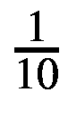的训练项。这种方法开始过滤掉损坏的数据，这可能导致概率低于随机概率。我们可以通过创建布尔掩码并将其应用于`x_train`和`ny_train`来选择这个数据子集，以创建`selnl_x_train`和`selnl_y_train`。

```py
predictions = nl_model.predict(x_train)
mask = [True if predictions[ind][cy_train[ind][0]] > 0.1 else False for ind in range(len(x_train))]
selnl_x_train = x_train[mask]
selnl_y_train = ny_train[mask]
Listing 7-14
Filter out problematic data. For optimal success, use callbacks and other deep learning good practices
```

我们可以在更新的数据上继续训练模型（见列表 7-15）。

```py
nl_model.fit(selnl_x_train, selnl_y_train,
epochs=100)
Listing 7-15
Continue to fit data in the selective negative learning phase. For optimal success, use callbacks and other deep learning good practices
```

管道模型的第三阶段是向**选择性正学习**（列表 7-16）过渡。选择用于选择性正学习的数据与选择用于选择性负学习的数据类似，但在这里我们希望使用更加严格的准则，以确保模型是在未损坏的标签上进行训练。我们只包括模型至少将 40%的置信度分配给正标签类的数据点。请注意，标签（`selpl_y_train`）是从`cy_train`中获取的——损坏的正学习标签，而不是负学习标签。

```py
predictions = nl_model.predict(x_train)
mask = [True if predictions[ind][ny_train[ind][0]] > 0.4 else False for ind in tqdm(range(len(x_train)))]
selpl_x_train = x_train[mask]
selpl_y_train = cy_train[mask]
Listing 7-16
Filter out data for selective positive learning
```

由于我们正在从负学习范式切换到正学习范式，我们需要更改损失函数，以便对标签中指示的类别的更高置信度进行奖励而不是惩罚。这可以通过重新编译模型来实现，该模型仍然保留了其权重（列表 7-17）。

```py
nl_model.compile(optimizer='adam', loss=’sparse_categorical_crossentropy’)
nl_model.fit(selpl_x_train, selpl_y_train, epochs=100)
Listing 7-17
Train for the selective positive learning stage. For optimal success, use callbacks and other deep learning good practices
```

SelNLPL 管道完成后，此模型可用于将数据集分为损坏和未损坏的数据集（列表 7-18）。损坏的数据更有可能对分配的正标签具有低置信度，而未损坏的数据更有可能具有高置信度。我们可以将此阈值设为 50%以区分损坏和未损坏的数据。

```py
predictions = nl_model.predict(x_train)
mask = [True if predictions[ind][cy_train[ind][0]] > 0.5 else False for ind in range(len(x_train))]
clean_x_train = x_train[mask]
clean_y_train = cy_train[mask]
unclean_x_train = x_train[[not boolean for boolean in mask]]
Listing 7-18
Separating corrupted and uncorrupted datasets
```

现在已经确定了干净的数据集，我们将在干净标签上训练一个新的模型（列表 7-19）。在这种情况下，它与之前 SelNLPL 管道中使用的模型相同，但不必如此。

```py
inp = L.Input((32,32,3))
base_model = EfficientNetB3(
include_top=True, weights=None, input_tensor=inp, classes=10
)
model = keras.models.Model(inputs=inp, outputs=base_model.output)
model.compile(optimizer=’adam’, loss='sparse_categorical_crossentropy',
metrics=['accuracy'])
model.fit(clean_x_train, clean_y_train, epochs=100)
Listing 7-19
Training a model on the clean data to label the unclean data
```

此模型的预测用于纠正标签（列表 7-20）。我们可以通过使用`np.where()`识别每个预测中最大概率的索引来从模型的概率预测中提取整数标签。原始不干净、现在已清理的数据集被拟合到一个 numpy 数组中，并重塑成所需的形状。

```py
pred_labels = model.predict(unclean_x_train)
unclean_y_train = []
for ind in range(len(unclean_x_train)):
label = np.where(pred_labels[ind] == np.max(pred_labels[ind]))
unclean_y_train.append(label)
unclean_y_train = np.array(unclean_y_train)
desired_shape = (len(unclean_y_train),1))
unclean_y_train = unclean_y_train.reshape(desired_shape)
Listing 7-20
Cleaning the unclean data
```

现在可以将两个数据集连接在一起形成一个最终的干净数据集，该数据集可用于训练最终的模型（列表 7-21）。

```py
final_clean_x_train = np.concatenate([clean_x_train,unclean_x_train])
final_clean_y_train = np.concatenate([clean_y_train, unclean_y_train])
Listing 7-21
Concatenating data to form the final cleaned dataset
```

在整个管道中跟踪数据和模型可能会很费力，但组织很重要，可以防止错误。变量名输入错误可能导致模型在错误的数据集上进行训练，这可能会导致结果令人误解地出色或令人沮丧地糟糕。

NLNL 管道展示了如何将一个初始的重构发展成为解决困难问题的完整管道。

## 数据有限：对偶网络

深度学习应用以其对数据的渴求而闻名。现代神经网络通常需要消费和处理每个类别的数千个数据实例，以获得对该类别的相关主要特征和属性的有力表示和理解。在这本书中，我们探讨了各种方法来减少神经网络成功训练所需的新数据的原始数量。图像增强可以提供模型以前从未以这种确切形式见过的“新数据”。迁移学习允许将特征提取技能从一组通用数据集转移到更具体的数据集，在那里可以使用较小的数据集来微调/适应技能以适应特定上下文。自监督学习使模型在接触到标签之前就熟悉数据集的基本关系和特征。如果你愿意，甚至可以训练一个变分自动编码器来生成新数据以增加数据集的大小。虽然这些方法在处理*小数据集*方面是有效的，但它们在处理非常小的数据集时也会遇到困难。

*少样本学习*是机器学习和深度学习领域的一个新兴领域，随着具有大量类别但每个类别中训练样本数量很少的应用变得越来越重要，其重要性也日益上升。例如，考虑一下内置在基于面部登录的手机应用程序中的面部识别模型——该模型必须能够验证你的面部属于你，同时识别出你的面部不属于众多其他可能存在的人之一。它必须以非常高的性能完成这一任务——在登录应用程序中使用具有 95%准确率的模型还不够安全——并且需要非常少的训练样本——如果用户需要生成数百个训练样本，那么用户体验将不会很好！

在少样本学习领域，有一种更为极端的研究，即*单样本学习*。单样本学习关注的是仅给定每个类别的单个实例的输入分类。例如，如果我们在一个单样本模式下训练一个模型来识别动物，数据集将包括每个类别的单个图像（狗、猫、马、鸡等），并且模型被期望能够从提供的代表该类别的单个图像中泛化该类别的所有实例。这当然是一个非常困难的任务。然而，单样本学习和少样本学习的一般进步有可能缩小深度学习和人类心智之间的差距，人类心智能够从更小的一组实例中泛化概念和思想。

2000 年代初，Li Fei-Fei 等人进行的一次学习早期工作使用了变分贝叶斯框架，该框架依赖于这样一个原则：以前学习的类可以用少量来自给定类的示例来预测未来的类。后来，Lake 等人在 2013 年提出了**分层贝叶斯程序学习**方法，可以通过系统地分解图像和为观察到的像素提出结构解释来学习绘制的图形（即，线条、曲线和点的组合）。尽管卷积神经网络的使用越来越多，但最有希望的一次学习方法并没有使用传统的卷积神经网络架构，而是依赖于一定程度的领域知识来填补训练数据不足留下的知识空白。例如，如果一个模型被训练来分类 MNIST 风格的数字（10 个类别，从 0 到 9），我们可以将数据结构——线条组成、判别特征等——的知识构建到系统的设计中，就像 HBPL 所做的那样。

因此，在单次图像识别的基础上，进一步挑战是朝着**通用单次学习**迈进，在这种学习中，一个系统可以自动从各种问题域的单次数据集中发展知识表示（即，不需要在系统的设计中隐式地编码领域知识）。

Gregory Koch、Richard Zemel 和 Ruslan Salakhutdinov 在 2015 年的论文“Siamese Neural Networks for One-Shot Image Recognition。”中，通过重新定义单次图像**分类**问题为相似性问题来努力解决这个具有挑战性的问题。3 而不是试图通过其自身的——在稀疏知识空间中漂浮的抽象特征——来表示每个类的特征，我们迫使模型学习类与类之间的关系，使得一个类的知识建立在其他类的知识之上。这种方法允许更稳定、可靠和丰富的理解构建。

假设你第一次看到苹果、橘子和葡萄。你被告知必须为这三个实体发展知识表示，并在遇到新物体时应用它们（即，识别新物体是苹果、橘子的还是葡萄）。你可以为每个物体发展一个长长的特征列表：苹果是圆的——几乎是球形的，但略微细长——红色的，顶部有茎，外皮相对坚硬。橘子是圆的——几乎是球形的，但略微细长——橙色的，顶部有蒂，外皮柔软但结实。葡萄是圆的且小——几乎是球形的，但略微细长——紫色的，顶部有细小的茎，外皮薄而纸质。

这种知识表示存在两个关键问题：首先，我们的特征中存在明显的冗余，这些特征对于区分类别没有帮助。所有物体都是圆形的——几乎是球形的，但略微细长，因此这个特征可以被丢弃，因为它对分类目的没有提供任何信息。其次，它依赖于构建非常难以单独获得的属性。例如，“软”的定义只有在存在“硬”物体的存在下才有意义。同样，颜色只有在与其他颜色对比时才有意义。因此，用如此少的每个类别的项目来表示各种品质的独立识别是不切实际的。

相反，我们设计我们的知识表示方法来捕捉每个项目之间的相似性和差异性——我们正在明确那些在先前知识表示形式中被隐含和隐藏的东西。橙子和苹果在大小上相似，而葡萄则不同。橙子、苹果和葡萄在颜色和质地上都不同。苹果和葡萄在具有茎这一特性上相似，而橙子则有一个小柄。这些特性更有意义，因为我们明确地将它们表示为具有这些特性的对象之间的相似性或差异性。因此，我们能够开发出更稳定的知识表示；它是基于关系的。当我们面对一个新对象时，我们将其与之前看到的每个项目进行比较，并将该对象分配给被认为与其最相似的项目所属的类别。

另一个可能更熟悉的例子是：如果你曾经因为不确定何时使用“who”和“whom”而感到困惑，并在网上查找过，你可能会找到两个答案。一个通常是这样的：“who”指的是句子的主语；“whom”指的是动词或介词的宾语。”另一个是：“当你可以用‘he’或‘she’替换时使用‘who’；当你可以用‘him’或‘her’替换时使用‘whom’。”第一种方法试图用明确、非关系、语法术语来定义这个新概念——谁与谁的用法——使用语言客观的支柱来支持新的句法理解。另一种是关系性的，利用上下文空间中的其他想法来建立对这个新概念的理解。虽然前者可能更学术和正式，但后者通常更有效。

在 Koch 等人提出的暹罗网络系统中，网络被训练来分类两个输入是否相同（图 7-13）。由于这实际上是二分类问题，网络输出两个输入属于同一类的概率。

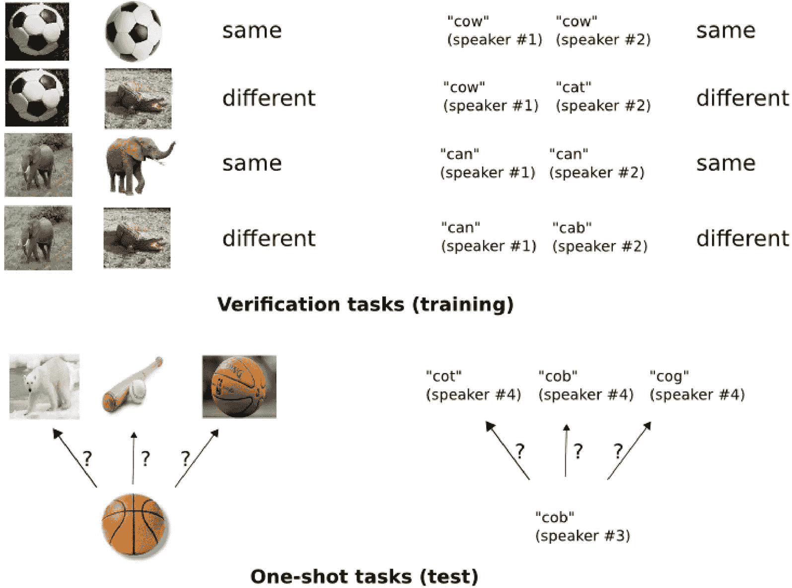

图 7-13

将分类问题范式重新构造成单样本学习的相似性问题。在这种情况下，网络展示了来自同一类别的多个图像；即少样本学习。单样本学习通常通过图像增强来实现。

模型在这些 *验证任务* 上进行训练。请注意，由于验证任务是由数据对构建的，因此我们也可以扩大数据集的大小，因为训练 Siamese 网络的一个数据实例是由每个数据对实例构建的。训练后，模型预测测试输入与每个训练实例之间的相似度。具有最高概率属于与测试输入相同类别的训练实例被认为是测试输入的类别。请注意，这种范式既适用于单样本分类也适用于少样本分类。

为了实现这一概念，使用了 *Siamese 网络* 架构（见图 7-14）。就像连体婴儿一样，该网络有两个头部来接收两个输入。这两个输入并行处理，以提取比较所需的关键特征。这两个并行分支通过 *权重共享* 相互连接，其中（回顾第五章，高效神经网络架构搜索案例研究）网络不同部分的权重相同且更新方式相同。这种权重共享确保了输入顺序无关紧要，并且两个输入以相同的方式处理。在并行处理输入之后，它们的编码特征通过距离层进行比较，该层计算编码表示之间的距离。然后，通过输出层进一步处理这个距离，以得到最终的概率/相似度。

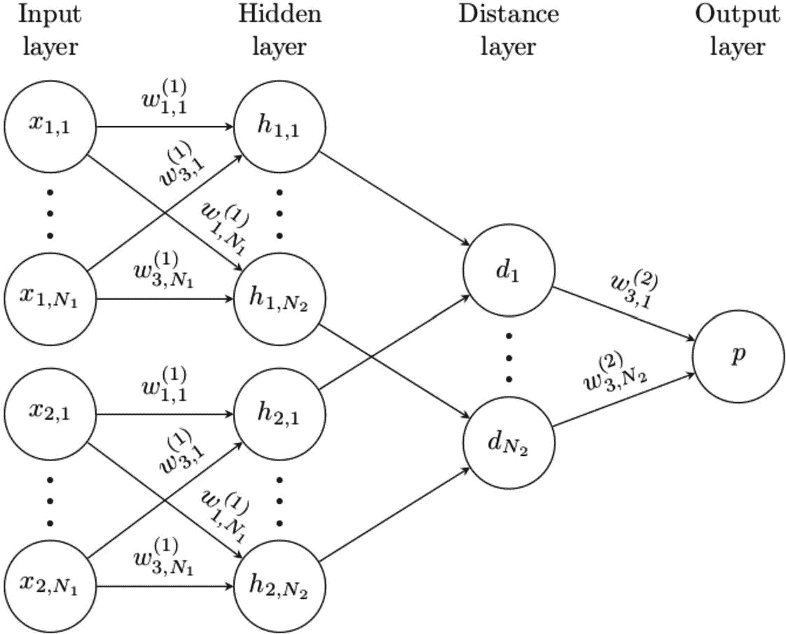

图 7-14

简化的 Siamese 网络架构

Koch 等人使用的 Siamese 网络设计采用了标准的交替卷积和池化操作的序列（见图 7-15）。

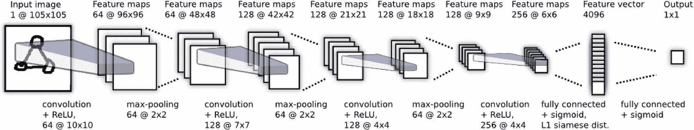

图 7-15

原文中 Koch 等人使用的 Siamese 网络的卷积分支

Siamese 网络系统在多个场景中表现良好。例如，考虑 Omniglot 数据集（见图 7-16），其中包含各种字母表（如 Aurek-Besh、希腊语、希伯来语、韩语、拉丁语、马来语等）的字符图像。在 Omniglot 数据集上的单样本学习中，卷积 Siamese 网络的性能优于几乎所有其他算法和模型（见表 7-3）。

表 7-3

与其他单样本学习方法相比的 Siamese 网络方法

| 方法 | 单样本测试准确率 |
| --- | --- |
| 人类 | 95.5% |
| 分层贝叶斯程序学习 | 95.2% |
| 斜率模型 | 81.8% |
| 分层深度 | 65.2% |
| 深度玻尔兹曼机 | 62.0% |
| 简单笔画 | 35.2% |
| 1-最近邻 | 21.7% |
| Siamese 网络 | 92.0% |

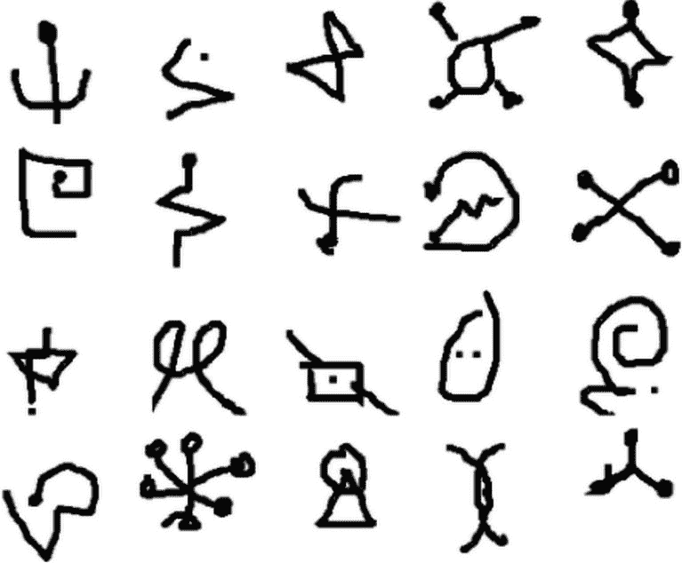

图 7-16

Omniglot 数据集的 20 个类别的样本

如前所述，Siamese 网络的性能略逊于分层贝叶斯程序学习，但其优势在于适用于各种其他数据集和场景。

让我们从构建 Siamese 网络的数据集 MNIST 数据集开始（列表 7-22）。我们将从每个类别中采样一小部分项目——在这种情况下，每个十进制类有十个训练实例。我们首先通过选择所有与数字标签匹配的 *y* 值的索引来完成此操作，然后使用 `np.random.choice` 从索引列表中随机选择一定数量的索引。

```py
# configurations
class_size = 10
# load MNIST data
(X_train, y_train), (X_test, y_test) = keras.datasets.mnist.load_data()
# select x instances from each class
samp_x_train, samp_y_train = [], []
for digit in range(10):
indices = (y_train == digit).nonzero()[0]
selected = np.random.choice(indices, size=class_size)
samp_x_train.append(X_train[selected])
samp_y_train.append(y_train[selected])
Listing 7-22
Loading and sampling MNIST data
```

我们需要对数据集进行一些修改。首先，我们将两个数据列表转换为 numpy 数组，并将数据从 0 到 255 的范围缩放到 0 到 1 之间。之后，我们将数据重塑成适当的形式，使得有 *number classes* × *class size* 个数据实例，并且图像只有一个通道（列表 7-23）。

```py
samp_x_train = np.array(samp_x_train)/255
samp_x_train = samp_x_train.reshape((10*class_size, 28, 28, 1))
samp_y_train = np.array(samp_y_train)/255
samp_y_train = samp_y_train.reshape((10*class_size, 1))
Listing 7-23
Scaling and reshaping data
```

我们遍历所有唯一的索引组合（列表 7-24）；第二个索引是从第一个采样索引之后存在的所有索引中选择，以防止组合重复两次。如果两个索引数据点的标签相等，我们使用标签 1 来表示两个图像属于同一类。否则，标签为 0。

```py
# generate pairs
fs_x_train_1, fs_x_train_2, fs_y_train = [], [], []
indices = list(range(10*class_size))
for ind_1 in indices:
label1 = samp_y_train[ind_1]
for ind_2 in indices[ind_1:]:
label2 = samp_y_train[ind_2]
# append x
fs_x_train_1.append(samp_x_train[ind_1])
fs_x_train_2.append(samp_x_train[ind_2])
# append similarity label
if label1 == label2:
fs_y_train.append(1)
else:
fs_y_train.append(0)
Listing 7-24
Generating Siamese network-style pairs
```

我们可以将这三组数据转换为 numpy 数组，以便在 Siamese 网络中使用（列表 7-25）。

```py
fs_x_train_1 = np.array(fs_x_train_1)
fs_x_train_2 = np.array(fs_x_train_2)
fs_y_train = np.array(fs_y_train)
Listing 7-25
Converting to numpy arrays
```

我们将使用模块化设计来构建 Siamese 网络（列表 7-26）。两个并行分支将被构建为独立的子模型，然后一起组合成一个更大的 Siamese 网络。这样做是为了实现权重共享，我们将在后面讨论。每个并行分支将在卷积和池化层之间进行标准交替。在卷积处理后，数据被展平并映射到一个 16 维的编码表示。分支被安排成一个模型，它接受一个输入图像并将其映射到一个向量编码表示，这可以后来与另一个向量编码表示一起用于计算编码表示之间的距离。

```py
def parallel_branch():
inp_layer = L.Input((28,28,1))
x = L.BatchNormalization()(inp_layer)
x = L.Conv2D(32, (3,3), activation='relu')(x)
x = L.Conv2D(32, (3,3), activation='relu')(x)
x = L.MaxPooling2D((2,2))(x)
x = L.Conv2D(64, (3,3), activation='relu')(x)
x = L.Conv2D(64, (3,3), activation='relu')(x)
x = L.MaxPooling2D((2,2))(x)
x = L.Flatten()(x)
x = L.Dense(16, activation='relu')(x)
branch = keras.models.Model(inputs=inp_layer, outputs=x)
return branch
Listing 7-26
Function to create a parallel branch model
```

接下来，我们将实现距离层（代码列表 7-27），这在 Keras/TensorFlow 中尚不存在。幸运的是，我们可以利用`keras.layers.Lambda`函数，它允许我们使用后端函数定义一个作为层的函数。距离函数接收两个编码向量表示，并使用 Keras 后端函数返回这两个表示之间的 L2 欧几里得距离，定义为两个编码表示 *e*[1] 和 *e*[2] 的 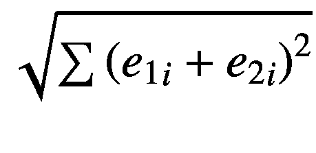。由于在 *x* = 0（即当两幅图像相同且 *e*[1] = *e*[2] 时）计算函数 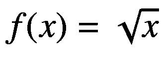 的梯度存在复杂性，我们在开方之前将 *x* 设置为 *max* (*s*, *ϵ*)，其中 *s* 是平方差的和，*ϵ* 是一个非常小的非零数。如果我们不采取这种措施，当两个输入相同且编码表示相同时，第一次计算梯度时损失将变为 `NaN`。

```py
import keras.backend as K
def distance(representations):
reps1, reps2 = representations
squared = K.sum(K.square(reps1-reps2), axis=1, keepdims=True)
return K.sqrt(K.maximum(squared,K.epsilon()))
Listing 7-27
Function to calculate distance between representations
```

我们可以使用这些组件和函数相对简单地构建 Siamese 网络（代码列表 7-28）。要构建多输入模型，我们在将层聚合到模型时，构建两个输入层并将输入列在一个列表中。为了实施权重共享，我们首先实例化一个模型，该模型用于处理每个输入。我们使用相同的实例化模型来处理两个输入，从而实现权重共享。结果表示被传递到距离函数中，该函数的输出进一步被处理成输出。

```py
inp1 = L.Input((28,28,1), name='inp1')
inp2 = L.Input((28,28,1), name='inp2')
branch = parallel_branch()
reps1 = branch(inp1)
reps2 = branch(inp2)
dist = L.Lambda(distance)([reps1, reps2])
out = L.Dense(1, activation='sigmoid')(dist)
model = keras.models.Model(inputs=[inp1, inp2], outputs=out)
Listing 7-28
Creating Siamese network with weight sharing
```

绘制 Siamese 网络架构图可以可视化 Keras 如何解释我们的权重共享实现（图 7-17）。

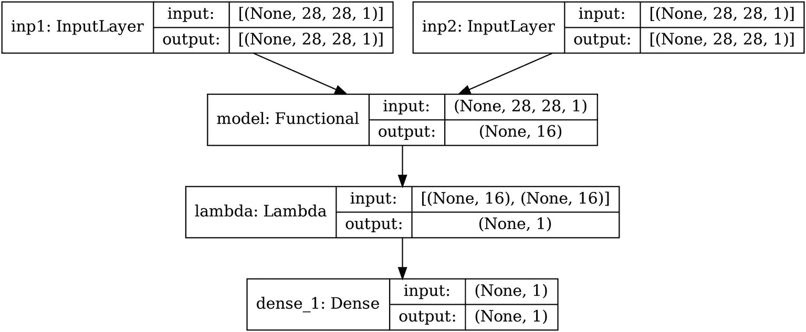

图 7-17

Siamese 网络架构的 Keras 图

为了训练模型，我们编译并拟合模型（代码列表 7-29）。为了指示哪些数据对应于哪个输入分支，我们传递一个字典，其中键是输入层的名称，值是对应的数组。

```py
model.compile(optimizer='adam', loss=’binary_crossentropy’,
metrics=['accuracy'])
model.fit({'inp1':fs_x_train_1, 'inp2':fs_x_train_2}, fs_y_train, epochs=100)
Listing 7-29
Compiling and fitting the Siamese network
```

经过数十个 epoch 的训练，可以得到几乎完美的 Siamese 网络，该网络可用于在少样本和单样本学习场景中执行分类任务。Siamese 网络在相似性问题（如文本或图像匹配）中也有应用。

Siamese 网络的设计展示了如何通过相对简单的调整优雅地重新表述问题，以适应现有方法的不足。此外，它再次强调了在成功重新表述困难问题时必须采取的实验和智力自由。

## 关键点和结语

在本章中，我们通过三个例子深入探讨了使用深度学习的创造性问题解决方法：DeepInsight，它重新定义了传统结构化数据如何表示为图像；负学习标签（NLNL）管道，它将正学习范式重新定义为负学习；以及孪生网络，它将分类重新定义为相似性问题。本章的主要目标是强调数据在*使用*深度学习在真实应用中的关键作用。通常，是数据决定了深度学习系统如何发展，而不是相反——但我们可以利用解决问题的技能和深度学习方法中嵌入的灵活性来重新定义现有方法，以适应数据的情况。

本章中涵盖的成功案例研究的关键主题是*重新定义*的精神。重新定义的第一步是确定一个存在的无声边界，它是一个障碍，但尚未被挑战，要么是因为没有人尝试过，要么是因为乍一看可能似乎无法或不应被挑战。在这里，当你阅读这些文字时，你被鼓励认真思考在庞大的、不断扩大的深度学习领域内存在的无声、隐含的边界——不要过多地考虑实现，因为那是一个后续的任务——重新定义的想法将会绽放。

本章以及本书的结尾都在这最后几页。在这本书中，我们涵盖了目前深度学习领域前沿的广泛方法和技巧。最终，这些是供你不仅使用而且可以结合、分解、拼接、实验和创新的思想和工具。如果你足够深入地挑战一个隐含的边界，你可能会在重新定义它时发现一些有意义的东西。深度学习仍在飞速发展，它将不是由那些仅仅使用现有发现的人推动，而是由那些在先前进步的基础上建立新思想的人推动。
