# 1. 经典机器学习原理与方法

> 真正的智慧是通过那些能够看到模式，并理解这些模式与其他模式之间联系的人获得的——并且从这些相互关联的模式中，学习生活的密码——并且从学习生活密码的过程中，成为与上帝共同创造者的人。
> 
> ——亨德里奇·范隆·史密斯小，作者和商人

这本书的重点是表格数据的*深度学习*（别担心——你拿到了正确的书！），但有许多很好的理由首先对经典机器学习有一个坚实的基础理解。

深度学习建立在机器学习的基本原理之上。在许多情况下，现代深度学习体系结构的公理和行为是不同且扭曲的——这些扭曲和范式转变将进一步讨论和探索。尽管如此，对经典机器学习的深入了解是理解并使用深度学习所必需的，就像微积分需要我们对代数有深刻理解，尽管它在新的、不熟悉的无穷环境中操作。

此外，对于那些寻求将深度学习应用于表格数据的人来说，理解经典机器学习甚至比那些寻求将深度学习应用于其他类型数据（图像、文本、信号等）的人更为重要，因为经典机器学习的许多内容都是为表格数据和围绕表格数据构建的，后来才适应其他类型的数据。经典机器学习的核心算法和原理通常假设某些数据特征和属性的存在，这些特征和属性通常只存在于表格数据中。为了理解表格数据的建模，必须了解这些特征和属性，为什么经典机器学习算法可以假设和建模它们，以及它们如何可能通过深度学习得到更好的建模。

此外——尽管围绕它的炒作非常巨大——深度学习并不是万能的解决方案，也不应该被视为万能的解决方案！在专门的数据应用中，通常唯一可行的解决方案是基于深度学习的。然而，对于涉及表格数据的问题，经典机器学习可能提供更好的解决方案。因此，了解这一系列经典方法的原理和实现是很重要的。在整个书中，你将继续磨练你对哪种技术家族最适合你需要解决的问题的判断。

本章将广泛概述经典机器学习的基本原则、理论和实现。它分为四个部分：“建模的基本原理”，通过直觉、数学、可视化和代码实验探索关键统一概念；“指标与评估”，提供常用模型评估方法的概述和实现；“算法”，涵盖广泛基础和流行经典机器学习算法的理论和实现（从头开始和从现有库中实现）；以及“超越经典机器学习”，介绍进入新的深度学习领域。本章假设对 Python 和 NumPy 有基本的了解，但会介绍建模库 scikit-learn 的基本用法。请参阅第二章，以深入了解 NumPy、Pandas 和 TensorFlow Datasets 的概念和实现。

## 建模的基本原理

在本节中，我们将探讨建模的几个基本思想、概念和原则，特别是与表格数据制度和上下文相关的内容。即使你对这些主题熟悉或有经验，你也可能会发现对新概念方法或框架的讨论，以巩固和深化你的理解。

### 什么是建模？

从数据科学领域一般性地思考，建模指的是构建适当且“较小”的近似或“较大”现象的表示或代表的过程。例如，时装模特的角色是展示时装品牌的关键元素和趋势。当设计师选择时装模特穿着的衣服时，他们不能让她穿上时装品牌所拥有的每一件衣服——他们必须选择最具代表性的物品，最能捕捉品牌精神、性格和哲学的物品。在人文和社会科学（哲学、社会学、历史、心理学、政治学等）中，模型（或类似地，“理论”）作为一个统一框架，将思想和经验观察联系起来。爱情的心理理论不能解释或包含爱情可能出现的所有可能的原因和条件，但它可以通过探索爱情的普遍轮廓和动态来近似它。

类似地，一个科学模型阐述了一个对它所衍生环境具有普遍影响的概念。尽管自然世界是嘈杂的，科学模型是近似值，但模型可以用来得出有用的近似预测。哥白尼的太阳系模型提出太阳是宇宙的中心，地球和其他行星围绕它沿圆形轨道运行。这个模型可以用来理解和预测行星的运动。

在化学动力学中，静态近似是一种模型，通过假设所有状态变量都是常数来获得多步化学反应的速率定律；反应物的产生量等于该反应物消耗的量。这捕捉了模型的另一个主题：因为模型是概括的，所以它们必须做出某些假设。

静态近似和哥白尼模型，以及所有模型，都不*完美*地工作，而是在“大多数”情况下“足够好”。

如简要探讨所示，模型在各个领域都很有用。在这些情况下，模型相对于所建模现象的“小”主要体现在表示大小上。例如，哥白尼模型允许我们——在一定的假设和简化下——预测行星的轨迹，而不是等待宇宙（所建模的现象）自行发展并观察结果。重申一下，它们之所以有用，是因为它们更容易理解。人们可以在不观察现象本身的情况下操纵和理解现象的表示。（我们不想真的需要观察一颗流星撞击地球来知道流星正在撞击地球——至少，我们希望如此。）然而，在数据科学和计算机科学的背景下，“小”还有一个关键属性：*模型创建和部署的简便性*。

设计师整理时尚模特的服装、心理学家收集不同的想法并将它们统一成人类心理的理论、科学家从经验数据中开发模型，都需要花费大量的时间和精力。相反，我们希望有一种方法能够*自主地*将观察结果统一到一个模型中，以概括从观察中得出的现象的理解。在这种情况下，*自主地*意味着“在模型创建过程中没有显著的人类干预或监督。”在这本书中，以及数据科学的背景下，术语*建模*通常与某些自动化维度相关联。

*自动化*建模需要一种计算/数学/符号方法来“理解”和概括一组给定的观察结果，因为计算机是人类已知的最强大和可扩展的自动化工具。即使是行为最复杂的人工智能模型——通常模拟语言或视觉的动态——也是建立在数学单元和计算之上的。

此外，由于必须采取计算/数学/符号化的自动化方法，观察本身必须以 *定量* 格式组织。大部分科学数据是定量的，而人文学科中的“数据”（可能更恰当地称为“思想”）通常是定性的和文本的。这意味着自动化建模不能处理人文学科中的大多数数据或任何在原始形式中不呈现为定量的数据吗？不，这仅仅意味着我们需要另一个步骤将数据转换为定量形式。我们将在后面的子节中进一步讨论这一点。

我们可以给这个自动化建模的概念起个名字：*学习*。在这个上下文中，学习是在给定关于它的一组观察或从中导出的观察的基础上，自动发展概念或现象的表示过程，而不是需要另一个实体（通常是人类）的广泛参与来为他们“拼凑”概括。

### 学习模式

有两种一般的学习模式：监督学习和无监督学习。请注意，我们将探讨更复杂的学习范式，特别是深度学习，因为其独特的框架和动态允许更大的复杂性。

监督学习直观易懂：给定一组输入 *x*，模型试图预测 *y*。在监督学习模式下，我们试图捕捉各种影响因素（特征）如何影响输出（标签）的变化。数据必须相应地组织：我们必须有一个 *特征集*（简称为“*x*”）和一个 *标签集*（简称为“y”）。特征集中的每个“行”或“项”都是来自同一实例的 *事物*（例如，同一图像的像素，同一用户的统计行为，同一人的人口信息）的特征组织，并且与标签集中的标签相关联（图 1-1）。*标签*通常也被称为“真实值”。

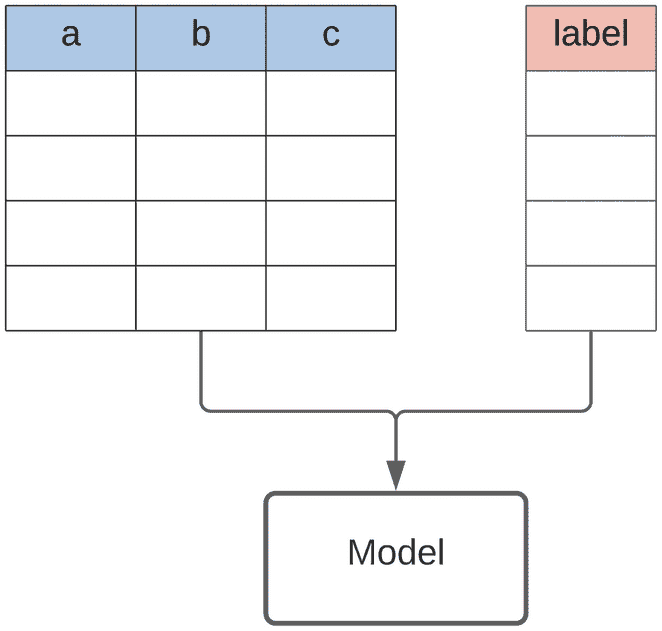

一个 5 行 3 列的表格，包含 a、b 和 c 列，以及一个 5 行 1 列的标签表，导致一个模型。

图 1-1

监督学习中的数据与模型关系

为了完成给定一组输入建模输出的任务，模型必须理解输入特征如何相互作用并产生特定的输出。这些关联可以是简单的，如相关特征的加权线性求和，也可以更复杂，涉及多次复制和连接来模拟提供的特征与标签的相关性（图 1-2）。输入和输出之间的关联复杂性既取决于模型，也取决于被建模的数据集/问题的固有复杂性。

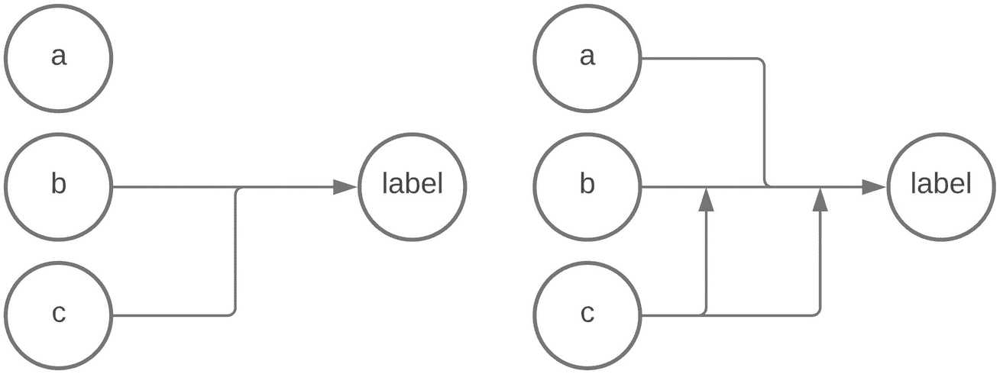

一个插图显示了 a、b 和 c 的两组三个圆圈，其中 b 和 c 导致标签，a、b 和 c 分别导致标签。

图 1-2

在发现特征与标签之间关系时，复杂性的不同层次

这里有一些监督学习的例子，来自各个领域和复杂程度：

+   *评估糖尿病风险*：提供患者信息数据集（年龄、性别、身高、病史等）及其相关标签（如果他们有糖尿病/严重程度或糖尿病类型），模型自动学习关系并可以预测新患者的糖尿病概率/严重程度/类型。

+   *预测股票*：提供最近的时间窗口数据（例如，过去*n*天的股票价格）及其相关标签（第*n*+1 天的股票价格），模型可以将数据序列中的某些模式与预测下一个值关联。

+   *面部识别*：给定几张人脸图像（特征是图像的像素）和相应的标签（人的身份，可以是任何类型的个人标识符，如唯一编号），模型可以制定和识别面部识别特征并将其与那个人关联。

注意

尽管在这个早期介绍性的背景下，我们将执行学习和预测的所有算法都称为“模型”，但每个上下文中使用的模型类型差异很大。本章的“算法”部分对不同的机器学习算法进行了更严格的探索。

无监督学习，另一方面，则稍微抽象一些。无监督学习的目标是无需标签集的存在，对数据集的信息和趋势进行建模（见图 1-3）。因此，无监督模型或系统的唯一输入是特征集，*x*。

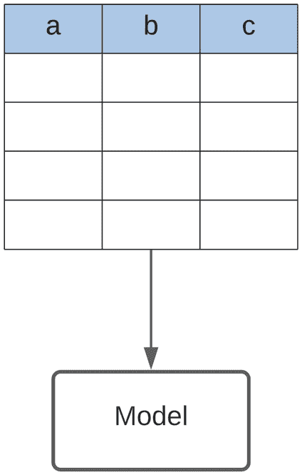

一个 5 行 3 列的表格，列出了 a、b 和 c 导致模型。

图 1-3

无监督学习与模型之间的数据关系

无监督算法不是学习特征与标签之间的关系，而是学习特征集本身之间的交互（见图 1-4）。这是监督学习和无监督学习之间的基本区别。与监督学习一样，这些交互可以从简单到复杂。

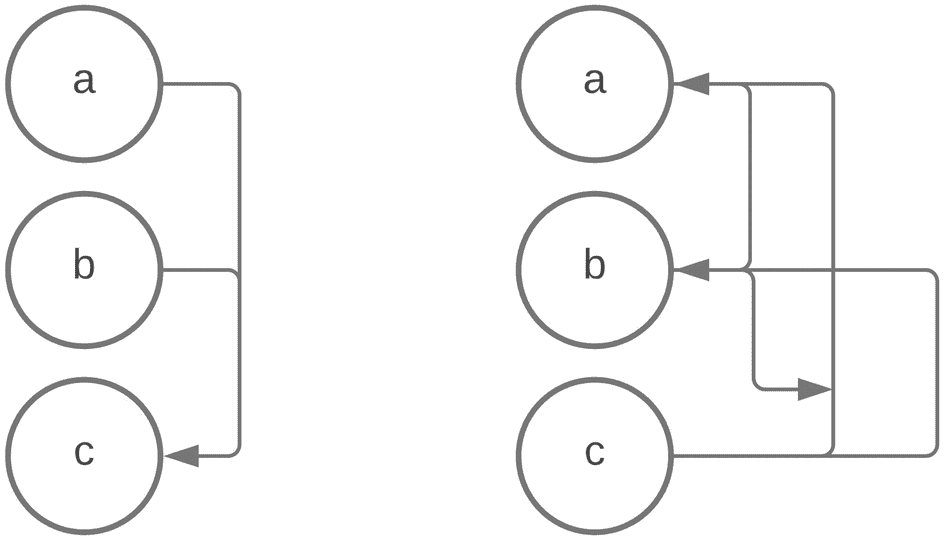

一个插图显示了 a、b 和 c 的两组三个圆圈，其中 a 和 b 导致 c，c 导致 a 和 b，以及 c 到 a 的链接。

图 1-4

在发现特征之间关系时，复杂性的不同层次

这里有一些无监督学习的例子：

+   *客户细分*：一家企业拥有描述其用户行为的特征数据集。虽然他们没有特定的标签/目标，但他们想识别客户基础中的关键细分或*聚类*。他们使用无监督的*聚类算法*将客户基础分成几个组，其中同一组内的客户具有相似的特征。

+   *可视化高维特征*：当数据集中只有一两个特征时，可视化是简单的。然而，引入额外的维度使得可视化任务变得复杂。随着新特征的添加，必须添加额外的分离维度（例如，颜色、标记形状、时间）。在某个数据集维度上，有效可视化数据变得不可能。*降维*算法将高维数据投影到低维空间（用于可视化的二维空间），以最大化数据的“信息”或“结构”。这些算法在数学上定义，不需要标签特征的存在。

本书将主要关注监督学习，但我们将看到许多实例，其中无监督学习和监督学习方法结合在一起，创造出比任何单独部分都强大的系统。

### 数据的定量表示：回归和分类

之前讨论过，数据必须以某种*定量形式*存在，才能被自动学习模型使用。一些数据以“自然”或“原始”的定量形式出现，如年龄、长度测量或图像中的像素值。然而，还有许多其他类型的数据我们希望纳入模型，但它们在原始形式中并不以数字出现。这里的主要数据类型是分类的（基于类或标签的数据），如动物类型（狗、猫、乌龟）或国家（美国、智利、日本）。基于类的数据特征是元素之间的离散分离，没有内在的排序。也就是说，我们不能像 5 比 3 大那样将“狗”视为“高于”猫（尽管许多狗主人可能不同意）。

当特征或标签集中只有两个类别时，它是*二元的*。我们可以简单地将一个类别与定量表示“0”相关联，另一个类别与定量表示“1”相关联。例如，考虑一个样本数据集中的特征“动物”，它只包含两个唯一值：“狗”和“猫”。我们可以将数值表示“0”附加到“狗”上，将数值表示“1”附加到“猫”上，这样数据集就转换如下（图 1-5）。

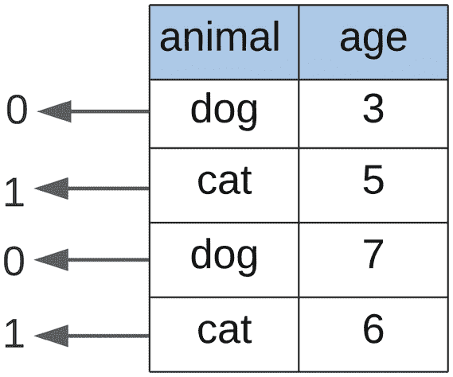

一个 5 行 2 列的表格，包含动物和年龄两列。狗、猫、狗和猫分别指向 0、1、0 和 1。

图 1-5

分类特征“动物”的示例定量转换/表示

你可能想指出，因为 1 比 0 大，所以我们把“猫”标签放在“狗”标签之上。然而，请注意，当我们把数据形式转换为定量表示时，定量测量并不总是（而且通常不是）意味着相同的事情。在这种情况下，新的特征应该被解释为“这个动物是猫吗？”而不是仍然作为“动物”，其中 0 代表“没有”，1 代表“有”。我们也可以形成一个表示“这个动物是狗吗？”的定量表示，其中所有“狗”值都替换为“1”，所有“猫”值都替换为“0”。这两种方法与原始数据（图 1-6）具有相同的信息（即动物类型的分离），但它是定量表示的，因此可以读得出来/与自动学习模型兼容。

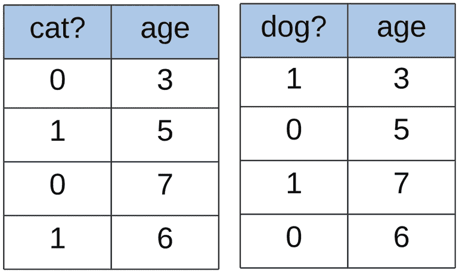

两个 5 行 2 列的表格，列分别为猫问号和年龄，以及狗问号和年龄，显示以下值：0，3；1，5；0，7；和 1，6 以及 1，3；0，5；1，7；和 0，6。

图 1-6

类别变量的等效二进制表示

然而，当特征或标签中有超过两个唯一值时，事情变得更加复杂。在第二章中，我们将更深入地探讨在建模表格数据背景下的有效数据表示、操作和转换。我们在整本书中会遇到并探索的一个挑战是将所有形式的特征转换为更易于阅读和具有信息量的表示，以进行有效的建模。

监督问题可以根据期望输出/标签的形式分为*回归*或*分类*问题。如果输出是连续的（例如，房价），则该问题是一个回归任务。如果输出是分组的（例如，动物类型），则该问题是一个分类任务。对于*有序输出*——那些量化/离散/分组但本质上也是排序/有序的特征，如成绩（A+，A，A–，B+，B 等）或教育水平（小学，中学，高中，本科，研究生等——回归和分类之间的区别更多地取决于你采取的方法，而不是本质上是与问题本身相关联。例如，如果你将教育水平转换为有序整数的形式（小学到 0，中学到 1，高中到 2 等），并且模型输出的是这个有序整数（例如，输出“3”表示模型预测了“本科”教育水平），则模型执行的是回归任务，因为输出被放置在连续输出上。另一方面，如果你将每个教育水平指定为其自己的类别而没有内在的等级（参见第二章 “数据编码”部分），则模型执行的是分类任务。

许多分类算法，包括神经网络（本书的主要研究内容），输出的是输入样本属于某一类别的概率，而不是自动将标签分配给输入。例如，一个模型可能返回一个 0.782 的概率，表示一只猿猴的图像属于“猿猴”这一类别，一个 0.236 的概率表示它属于“长臂猿”这一类别，以及其他所有可能类别的概率都较低。然后我们将概率最高的类别解释为指定的标签；在这种情况下，模型正确地选择了标签“猿猴”。尽管在技术上输出是连续的，因为在实践中几乎总是不是整数 0 或 1，但*理想*的行为/期望的标签是；因此，这个任务属于分类而不是回归。

理解你的问题和方法是进行分类还是回归任务，是构建功能模型系统的一项基本技能。

### 机器学习数据周期：训练集、验证集和测试集

一旦我们将模型拟合到数据集上，我们想要评估它的表现如何，以便我们可以确定适当的下一步。如果模型表现非常糟糕，在部署之前需要更多的实验。如果它在特定领域内表现合理，它可能被部署到应用程序中。如果它表现*过于*好（即完美表现），结果可能过于完美而不真实，需要额外的调查。未能评估模型的真正表现，在最坏的情况下可能是危险的。例如，考虑一个部署给真实人群进行诊断的医学模型，它错误地看起来完美地模拟了数据。

如前所述，建模的目的是表示一个*现象*或概念。然而，因为我们只能通过观察和数据来访问这些现象和概念，我们必须通过*建模现象的数据*来近似*建模现象*。换句话说，由于我们无法直接建模现象，我们必须通过从现象中记录的信息来理解现象。因此，我们需要确保近似和最终目标是相互一致的。

考虑一个正在学习加法的孩子。他们的老师给他们上一堂课，并给了六张闪卡进行练习（图 1-7），并告诉他们第二天将进行一次测验，以评估孩子对加法的掌握程度。

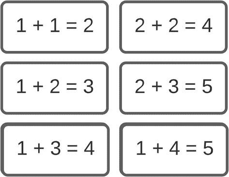

六张闪卡显示了 1 和 1、1 和 2、1 和 3、2 和 2、2 和 3、1 和 4 的和，分别是 2、3、4、4、5 和 5。

图 1-7

闪卡“训练数据集”的示例。特征（输入）是加法提示（例如，“1+1”，“1+2”）；标签（期望输出）是和（例如，“2”，“3”）

教师可以使用在测验（测验 1）中给出的闪卡上的相同问题，或者他们可以编写一套不同的问题，这些问题没有明确给出给学生，但难度和概念相同（测验 2）（图 1-8）。哪一个更能真正评估学生的知识？

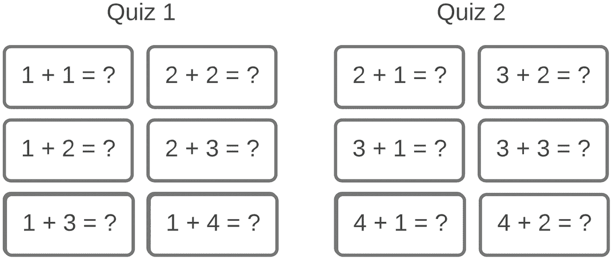

两个测验各有六张闪卡。两个测验集的总和是未知的。

图 1-8

两个可能的测验：等于训练数据集（左）或稍微不同的例子，代表相同的概念

如果老师出了测验 1，一个学生只需通过记忆“x + y”提示和答案“z”之间的六个关联就能得到满分。这表明了**近似目标不一致**：测验的目标是评估学生对加法概念的理解程度，但近似评估却检查了学生是否能够记忆六个任意的关联。

另一方面，一个仅仅记忆了闪卡上给出的六个关联的学生在测验 2 中表现不佳，因为他们面对的问题在形式上不同，尽管在概念上非常相似。测验 2 展示了**近似目标一致性**：只有在学生理解加法概念的情况下，他们才能在测验中得分。

测验 1 和测验 2 之间的区别在于，测验 2 中的问题没有呈现给学生学习。这种信息分离允许教师更真实地评估学生的学习情况。因此，在机器学习中，我们总是希望将模型训练的数据与模型评估/测试的数据分开。

更多关于“记忆”和“真正学习”这些概念的严格探讨，请参阅本章的“偏差-方差权衡”小节。

在（监督/预测）机器学习问题中，我们通常遇到以下数据设置（图 1-9）：一个带有标签的数据集（即特征集和标签集，相互关联）以及一个未标记的数据集。后者通常包含特征可用但标签尚未附加的残留数据，这可能是出于故意或其他目的。

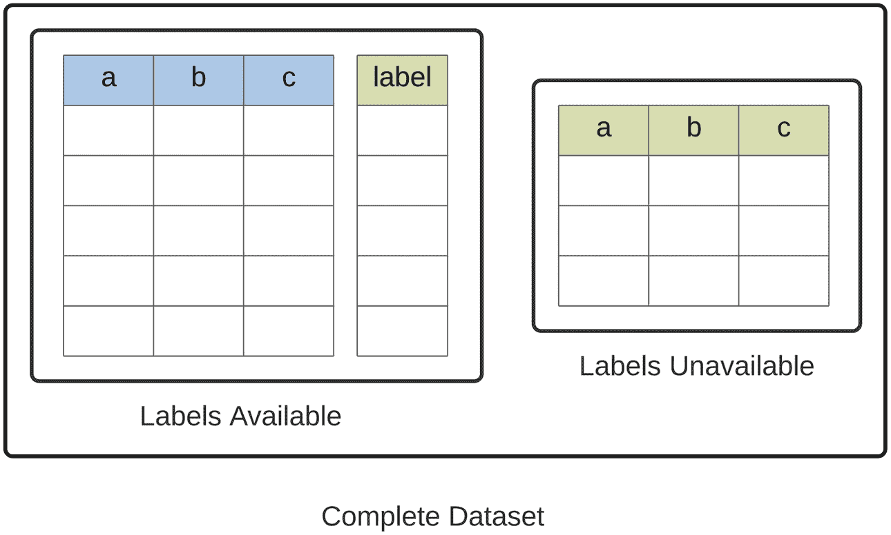

一个 6 行 3 列的表格，包含 a、b 和 c 列，以及一个 6 行 1 列的表格，左侧有一个标签列。右侧有一个 4 行 3 列的表格，包含 a、b 和 c 列。

图 1-9

数据类型层次结构

模型在学习（“学习”）时接触到的数据集是*训练集*。*验证集*是模型评估的数据集，包含与特征相关联的标签的数据集，但尚未向模型展示。验证集用于在结构层面上调整模型——例如，使用哪种类型的算法或算法应该有多复杂。

*测试集*是有争议的，存在两种主要的定义。一种是这样的：*测试集*是模型应用以获得预测的数据集；测试集包含特征，但与任何标签无关——因为目标是通过对模型预测来获得标签。另一种解释是，测试集用于形成对模型的“客观评估”，因为它在以任何方式（无论是通过训练还是通过结构调整）告知模型开发方面都没有被使用。

例如，考虑一个用于电子商务平台的机器学习模型，该模型预测客户是否会购买特定产品（图 1-10）。该平台有一个所有之前客户信息的数据库（特征）以及他们是否购买了该产品（标签），这些信息可以输入到预测机器学习模型中。电子商务平台还有关于尚未购买任何东西的网站访客的数据；平台希望确定哪些访客有很高的可能性购买特定产品，以便针对他们的特定偏好定制营销活动（测试集）。

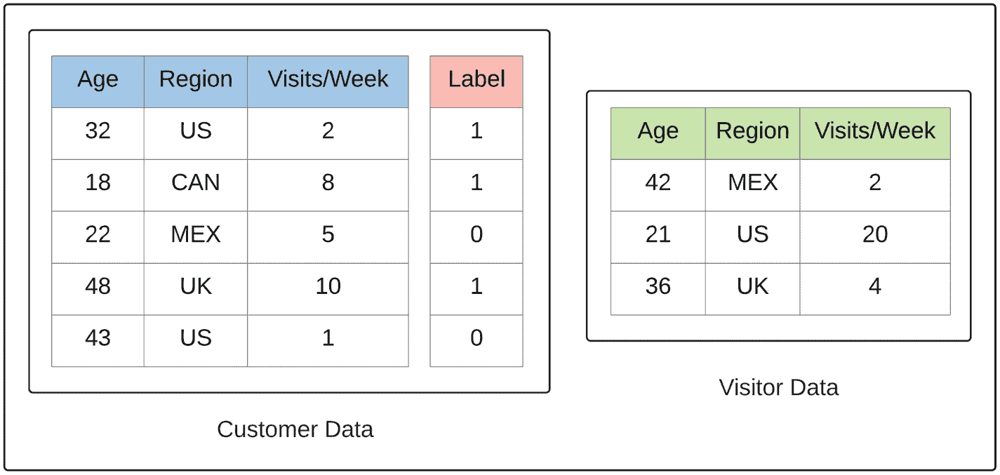

一个 6 行 3 列的表格，包含年龄、地区和每周访问次数的列，以及一个 6 行 1 列的表格，包含客户数据下的标签列。一个 4 行 3 列的表格，包含年龄、地区和每周访问次数的列，位于访客数据下。

图 1-10

电子商务数据集的示例层次结构

电子商务平台将客户数据随机分为*训练集*和*验证集*（在这个例子中，使用 0.6 的“训练分割”，意味着原始数据集中带有标签的 60% 被放入训练集）。他们在训练集上训练模型，并在验证数据上评估它，以获得其性能的真实报告（图 1-11）。如果他们对模型的验证性能不满意，他们可以调整建模系统。

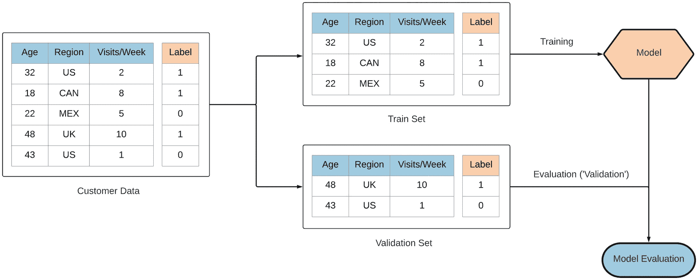

流程图描述如下。由两个表格组成的客户数据导致训练集和验证集，这两个表格又导致模型评估。

图 1-11

将完整数据集分离为训练集和验证集

当模型获得令人满意的验证性能时，平台将在访客数据上部署模型以识别有潜力的客户（见图 1-12）。平台针对模型识别出有高购买产品概率的客户启动定制营销活动，基于之前的客户数据。

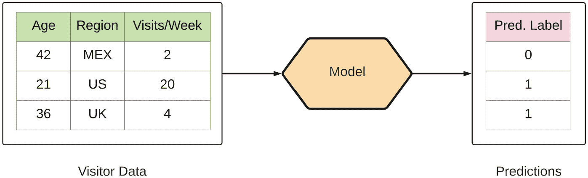

流程图展示了以下内容。访客数据以一个包含年龄、地区和每周访问次数数据的表格形式呈现，通过模型预测到预测标签的表格。

图 1-12

展示了训练数据集与模型之间的关系

注意

你经常会看到验证集在其他资源中被称作“测试集”。有些人可能会将“验证”和“测试”混用。本书使用“训练”、“验证”和“测试”来指代三种由关联标签和使用场景定义的不同类型的数据。使用这种命名方法是有用的，因为它提供了一个有意义的系统来引用现代数据管道的主要组件——训练、评估和部署。

在 Python 中，将数据分离到训练和验证的最快和最常用的方法之一是使用 scikit-learn 库。让我们首先创建一个包含虚拟数据的 Pandas DataFrame（见列表 1-1，图 1-13）。

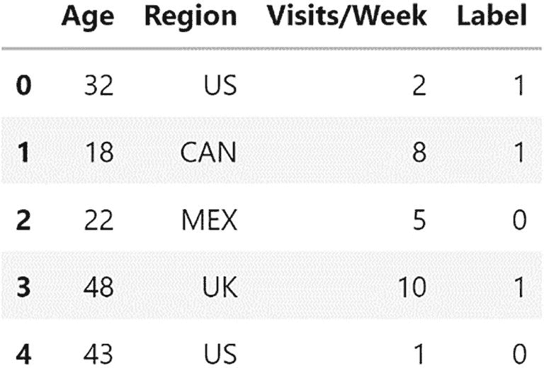

一个 6 行 5 列的数据表，包含年龄、地区、每周访问次数和标签列，以及 0、1、2、3 和 4 的行。

图 1-13

以 DataFrame 形式展示的完整数据集示例

```py
ages = [32, 18, 22, 48, 43]
regions = ['US', 'CAN', 'MEX', 'UK', 'US']
visitsWeek = [2, 8, 5, 10, 1]
labels = [1, 1, 0, 1, 0]
data = pd.DataFrame({'Age':ages,
'Region':regions,
'Visits/Week':visitsWeek,
'Label':labels})
Listing 1-1
Loading a dummy dataset as a DataFrame
```

现在，我们可以将数据分为 *特征*（简称为 *X/x*，或模型中的“独立变量”）和 *标签*（即 *y*，或因变量）（见列表 1-2）。

```py
features = data[['Age', 'Region', 'Visits/Week']]
label = data['Label']
Listing 1-2
Separating the dataset into a feature set and a label set. Note that the feature set can more efficiently be indexed via data.drop('Label', axis=1) – this returns a collection of all columns except for the “dropped” column
```

`sklearn.model_selection.train_test_split` 函数（注意 scikit-learn 使用“测试集”来指代验证集）接受三个重要参数：特征集、标签集和训练集的大小（见列表 1-3）。它返回四组数据——训练特征集（见图 1-14）、验证特征集（见图 1-15）、训练标签集（见图 1-16）和验证标签集（见图 1-17）。

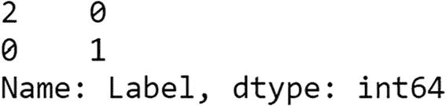

验证标签集在 1 到 3 行分别显示 2 和 0、0 和 1，名称：标签，数据类型：int 64。

图 1-17

`y_val` 结果示例

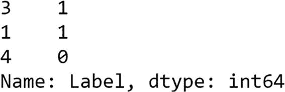

训练标签集在 1 到 4 行分别显示 3 和 1、1 和 1、4 和 0，名称：标签，数据类型：int 64。

图 1-16

`y_train` 结果示例

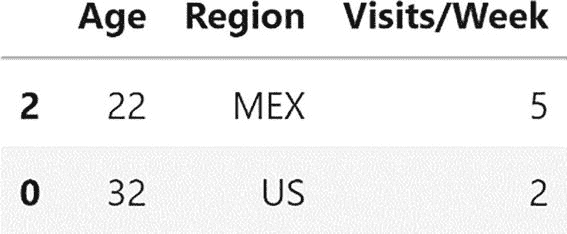

一个 3 行 4 列的数据表，包含年龄、地区和每周访问次数列，以及 2 和 0 的行。第 2 到 3 行读作，22，MEX，5；和 32，US，2，分别。

图 1-15

`X_val` 示例结果

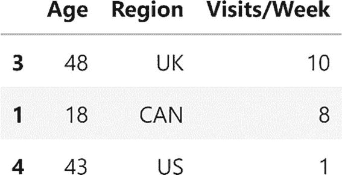

一个 4x4 的数据表，包含年龄、地区和每周访问次数的列，以及 3、1 和 4 的行。第 2 到 4 行分别是：48，U K，10；18，CAN，8；和 43，U S，1。

图 1-14

`X_train` 示例结果

```py
from sklearn.model_selection import train_test_split as
tts
X_train, X_val, y_train, y_val = tts(features, label,
train_size = 0.6)
Listing 1-3
Splitting into training and validation sets
```

注意，scikit-learn 会随机化数据集的顺序和分割，以确保训练集和验证集包含相似的“主题”或“数据类型”。如果原始数据集已经随机化，随机化不会造成伤害；如果原始数据集是有序的（这通常是情况——例如，按字母顺序或按日期排序），则训练集可能不是验证集中数据的最佳代表性。随机化只能有所帮助。

`train_test_split` 函数接受标准的 Python 数据形式，包括原生 Python 列表和 NumPy 数组——只要它们以顺序列表格式排列，其中每个项目都是一个数据实例。请注意，特征和标签数据集必须具有相同的长度，因为它们需要相互对应。

您也可以使用 NumPy 手动实现训练-验证集分割。考虑以下数据集，其中特征是一个单独的整数，标签是 0 或 1，对应于偶数（0）或奇数（1）（列表 1-4）。

```py
x = np.array([1, 2, 3, 4, 5, 6, 7, 8, 9])
y = np.array([1, 0, 1, 0, 1, 0, 1, 0, 1])
Listing 1-4
Example dummy dataset construction
```

如果手动输入基于简单模式的简单数据让你感到不适，也可以用如下逻辑结构来表示数据（列表 1-5）。

```py
x = np.array(list(range(1, 10)))
y = np.array([0 if i % 2 == 0 else 1 for i in x])
Listing 1-5
Another example of dummy dataset construction
```

我们将使用以下过程来随机分割数据集（列表 1-6）：

1.  将特征和标签数据集一起压缩。在 Python 中，压缩操作将来自不同列表的相同索引的元素配对。例如，将列表 [1, 2, 3] 和 [4, 5, 6] 压缩会产生 [(1, 4), (2, 5), (3, 6)]。压缩的目的是将单个特征和标签关联起来，以便在打乱过程中它们不会变得“脱钩”。

1.  打乱特征-标签对（配对是通过压缩操作完成的）。

1.  解压缩特征-标签对。

1.  获取“分割索引”。这是所有先前元素都将属于训练集，所有后续元素都将属于验证集的索引。该索引是训练集大小的长度（一个分数，如 80% 的 0.8）乘以数据集大小，然后从该数量中减去 1 以考虑零索引。

1.  使用“分割索引”来索引 *x* 训练集、*x* 验证集、*y* 训练集和 *y* 验证集。

```py
train_size = 0.8
zipped = np.array(list(zip(x, y)))
np.random.shuffle(zipped)
shuffled_x = zipped[:, 0]
shuffled_y = zipped[:, 1]
split_index = np.ceil(len(x) * train_size) - 1
X_train = shuffled_x[:split_index]
y_train = shuffled_y[:split_index]
X_valid = shuffled_x[split_index:]
y_valid = shuffled_y[split_index:]
Listing 1-6
“Manual” implementation of train-validation split with NumPy
```

注意，通常训练集的大小要大于验证集的大小，这样当模型进行训练时，它就可以访问大部分数据集。

在训练验证分割阶段经常犯的一个非常重要的潜在错误，但只有在模型训练完成后才会注意到的是*数据泄露*。数据泄露发生在训练数据的一部分在验证数据中表示，或者反之亦然。这破坏了训练集和验证集之间期望的完全分离，导致不诚实的度量结果。

例如，考虑一个你在多个训练阶段工作的实例。这可能适用于需要很长时间训练的大型模型（例如，重量级的神经网络），因此需要分几个会话进行训练，或者如果训练好的模型正在团队成员之间传递以进行微调和检查。在每次会话中，数据被随机分成训练集和验证集，模型继续在该数据上微调。经过几次会话后，评估模型的验证性能，令人惊讶的是，它完美无缺！

你在空中挥舞拳头，与队友击掌。然而，你的热情却不幸地误入歧途——你已经成为数据泄露的受害者。因为训练验证分割操作在每个会话中都会重新运行，而这个操作是随机的，所以每次的训练集和验证集都不同（见图 1-18）。这意味着在整个会话中，模型几乎看到了整个数据集。因此，获得高验证性能变得微不足道，这仅仅是一个记忆任务，而不是更困难、更重要的泛化和“真正学习”的任务。

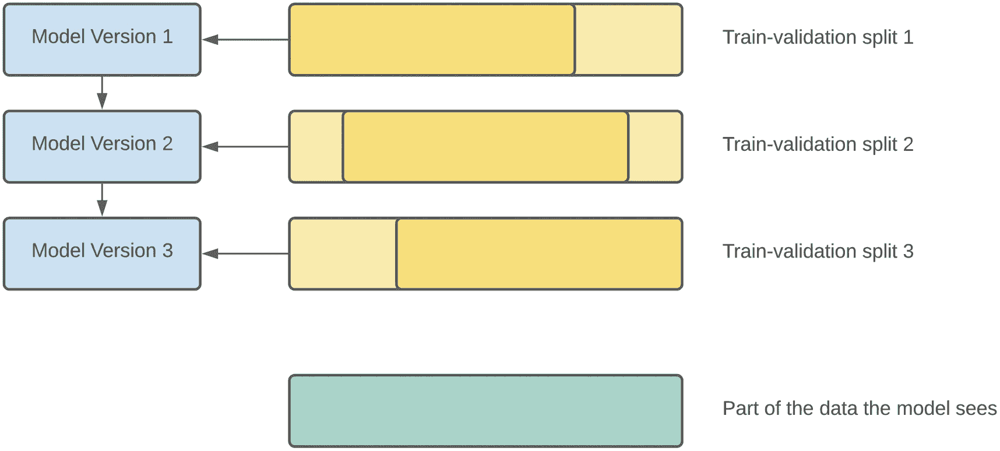

上图展示了 1 到 3 的训练验证分割，导致模型版本 1 到 3。以下是模型看到的数据的一部分。

图 1-18

由重复的训练验证分割引起的数据泄露问题

在多个会话中训练验证集分割的差异也可能导致度量结果的不一致。从一组训练数据从头开始拟合的模型可能比从另一组训练数据从头开始拟合的相同类型的模型表现略好，即使训练数据的形成是随机的。这种细微的差异在比较模型结果时可能会引入错误。

为了避免这些问题，我们使用*随机种子*。通过在程序中设置种子，任何随机过程在每次运行时都会产生相同的结果。要使用随机种子，将`random_state=101`（或某个其他值）传递给 scikit-learn 的`train_test_split`，或者在程序开始时使用`np.random.seed(101)`（以及其他可能接受随机种子参数的`numpy.random`函数，参见 NumPy 文档）进行自定义实现。

此外，对于小数据集，随机划分训练集和验证集可能无法精确反映模型性能。当样本数量较少时，选定的验证示例可能无法在训练集中准确表示（即表示“过于完美”或“不够好”），从而导致模型性能指标偏差。

为了解决这个问题，可以使用 k 折评估（图 1-19）。在这个评估方案中，数据集被随机划分为 k 折（大小相等的集合）。对于每一折的 k 个折，我们在其他 k-1 折上从头开始训练一个模型，并在该折上评估它。然后，我们对每个 k 折的验证性能进行平均（或通过其他方法进行汇总）。

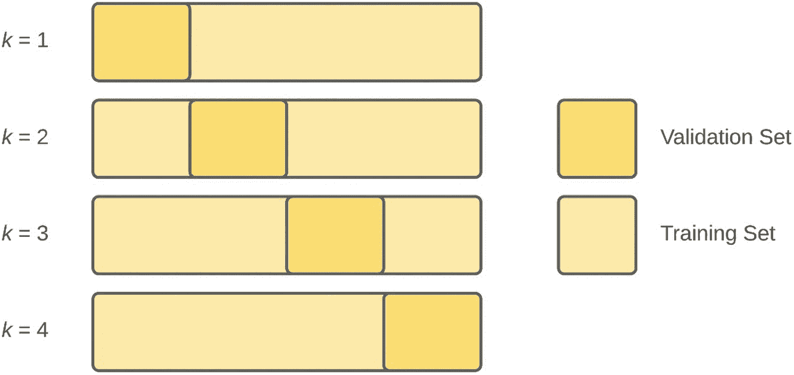

一幅插图展示了当 k 等于 1 到 4 时的 K 折评估。随着 k 的增加，验证集的位置从左到右移动，剩余部分表示训练集。

图 1-19

K 折评估

此方法允许我们在“整个”数据集上获得模型验证性能。然而，请注意，训练 k 个模型可能成本高昂——一个替代方案是简单地随机划分训练集和验证集，给定次数，不考虑数据集的具体部分分配到哪个集合。

这种方法也被称为 k 折交叉验证，因为它允许我们在整个数据集上验证我们的模型。

Sci-kit learn 提供了 sklearn.model_selection.KFold 对象，它通过在每一折返回训练集和验证集的适当索引来帮助实现 k 折交叉验证（列表 1-7）。

```py
n = 5
from sklearn.model_selection import KFold
folds = KFold(n_splits = n)
performance = 0
for train_indices, valid_indices in kf.split(X):
X_train = X[train_indices]
X_valid = X[valid_indices]
y_train = y[train_indices]
y_valid = y[valid_indices]
model = InitializeModel()
model.fit(X_train, y_train)
performance += model.evaluate(X_valid, y_valid)
performance /= n
Listing 1-7
Template code to evaluate models on small datasets with scikit-learn’s k-fold methods
```

在选择 k 的值和训练-验证集划分大小上存在平衡——我们希望有足够的数据来正确训练模型，但同时也需要在验证集中留出足够的数据来正确评估模型。在“指标和评估”部分，你将了解有关不同指标和评估方法的更多信息。重点是评估远非客观操作；模型没有“真实性能”。像大多数机器学习方法一样，我们需要根据操作环境做出不同的选择，以尽可能全面地了解我们的模型。任何作为指标给出的数字都只显示了一个多面、复杂模型的一面！

### 偏差-方差权衡

考虑以下五个点的集合（图 1-20）：你将如何绘制一条平滑的曲线来模拟数据集？

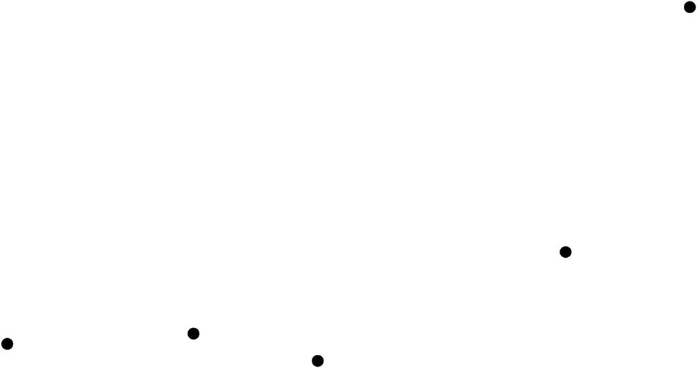

五个点显示了一个上升、下降然后急剧上升的趋势。

图 1-20

数据点示例集

可以采取许多可能的方法（图 1-21）。最简单的方法可能是只在大致方向上画一条直线——在“点”的“中间”。另一种方法可能是用轻微的曲线连接点，这样导数不会有必要的突然变化（即二阶导数保持接近零）。更复杂的一种方法是连接点，但在每个点之间绘制大而夸张的山峰和山谷。

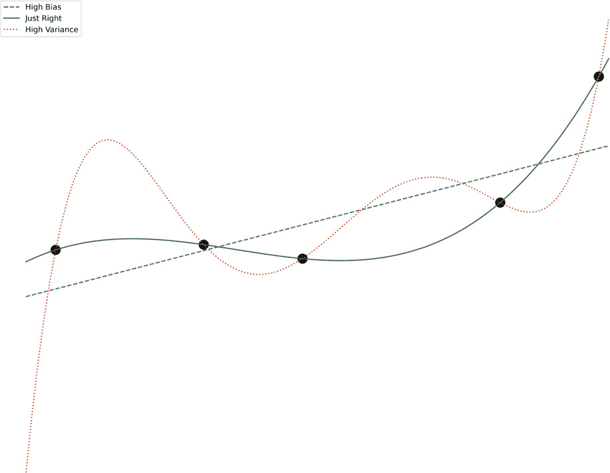

一条有 5 个点的实线，先上升后下降，然后陡峭上升。振荡曲线和虚线表示趋势。

图 1-21

可能的曲线来拟合图 1-20 中展示的数据点

哪一个最能模拟给定的数据集？在这种情况下，大多数人会基于直觉认为第二个选择（在图 1-21 中以连续绿色线可视化）是最“自然”的模型。第二个曲线很好地模拟了*给定*的*训练数据*（即它穿过每个点），但对其其他中间位置的“预测”也似乎合理。第一个曲线看起来过于一般不准确，而第二个曲线穿过所有训练数据，但在中间值上偏差过大。

将这种直觉形式化会有所帮助。在建模环境中，我们处理的问题比连接点更复杂，必须构建数学/计算模型而不是绘制曲线。"偏差-方差权衡"可以帮助我们比较不同模型在建模数据时的行为。

*偏差*是模型识别数据集中一般趋势和思想的能力，而*方差*是建模高精度数据的能力。由于我们将偏差和方差视为误差，因此较低的偏差或方差更好。偏差-方差关系通常以靶心上的飞镖投掷来表示（图 1-22）。理想的投掷集是一组围绕中心环的命中点，这表示*低偏差*（投掷的“中心”没有偏移/偏差）和*低方差*（命中点的集合聚集在一起而不是远离，表明一致的良好性能）。

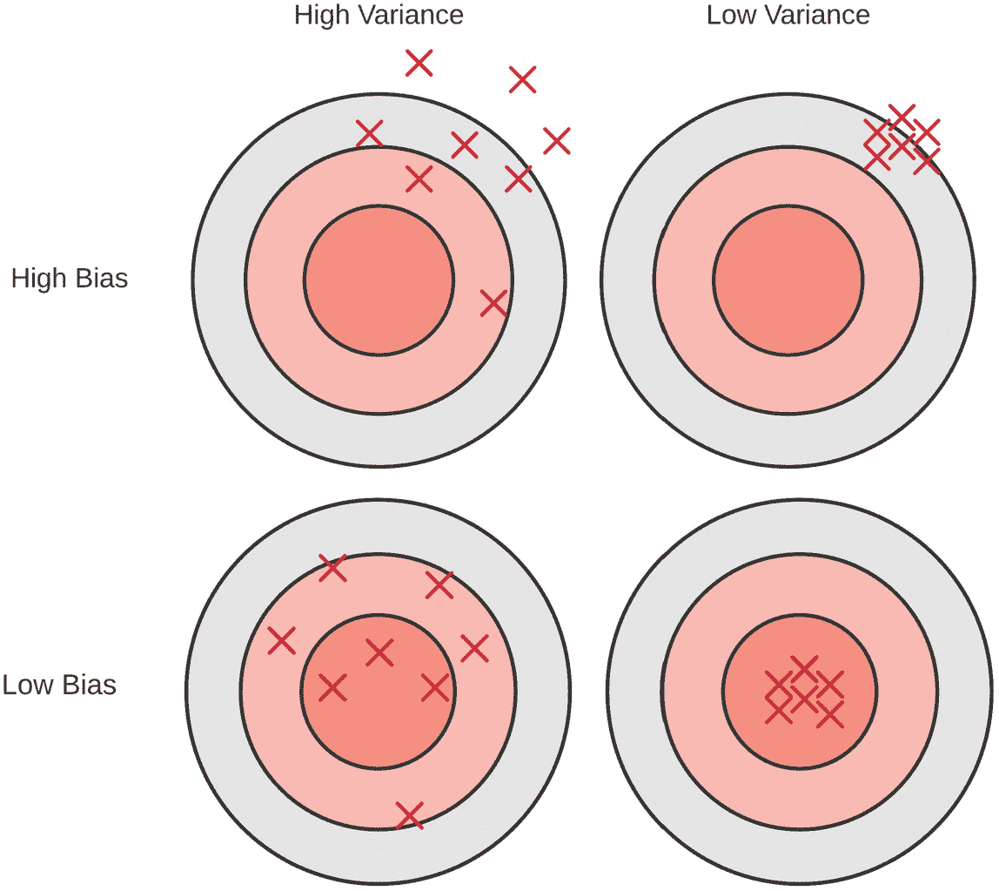

一幅插图展示了四排同心圆，分别代表高偏差和低偏差的行以及高方差和低方差的列。对于高偏差，飞镖投掷在中心周围和远离中心；对于低偏差，飞镖投掷在中心和周围。

图 1-22

方差/偏差权衡的靶心表示。理想模型是方差和偏差误差都低的模型，其中所有飞镖投掷都集中在理想的中心靶环中

另一方面，高偏差低方差的一组投掷点高度集中在远离期望中心环的非常区域，而低偏差高方差的一组投掷点则围绕期望环但非常分散。高偏差高方差的一组投掷点既没有正确居中，又非常分散。

给定一个参数 *θ* 的点估计值 （简单来说，是针对总体中未知参数值的估计）时，偏差可以定义为参数期望值与真实值之间的差异：

![偏差=期望值[估计值]-真实值](img/525591_1_En_1_Chapter/525591_1_En_1_Chapter_TeX_Equa.png)

如果参数的期望值等于真实值 (![$$ E\left[\hat{\theta}\right]=\theta $$](img/525591_1_En_1_Chapter/525591_1_En_1_Chapter_TeX_IEq2.png))，则偏差误差项为 0（因此是完美的）。我们可以将模型解释为“无偏”的——参数的真实值反映了它“应该”具有的值。

方差定义为期望估计参数值与真实参数值之间差异的期望值，平方：

![方差=期望值[期望值[估计值]-估计值]²](img/525591_1_En_1_Chapter/525591_1_En_1_Chapter_TeX_Equb.png)

如果参数值差异波动剧烈，方差将会很高。另一方面，如果差异更加一致，方差将会较低。

给定这些定义，我们可以证明均方误差（MSE）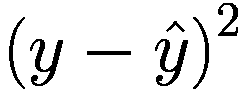（其中 *y* 是真实值， 是预测值）可以 *分解* 为偏差和方差误差项之间的关系：MSE = 偏差² + 方差。（数学证明可以轻松访问，但超出了本书的范围。）*偏差-方差* *分解* 告诉我们，我们可以将模型的误差理解为偏差和方差误差之间的关系。

偏差-方差关系适用于 *欠拟合* 与 *过拟合* 的概念。当模型的偏差过高而方差过低时，模型 *欠拟合*；模型对数据集的具体数据实例的适应/弯曲不够，因此对训练数据集的建模较差。另一方面，当模型的偏差过低而方差过高时，模型 *过拟合*；模型对呈现给它的具体数据实例非常敏感，穿过每一个点。

过拟合的模型在训练集上表现极好，但在验证数据集上表现很差，因为它们“记住”了训练数据集而没有进行泛化。

通常，随着模型复杂度的增加（可以大致用参数数量来衡量——尽管其他因素也很重要），偏差误差会减少，而方差误差会增加。这是因为参数数量的增加使得模型有更大的“移动”或“自由度”来适应给定的训练数据集的具体情况。（因此，具有更多系数的高阶多项式通常与更高的方差过拟合行为相关联，而具有较少系数的低阶多项式通常与更高的偏差欠拟合行为相关联。）

对于一个问题的理想模型是那种通过平衡偏差和方差误差来最小化总体误差的模型（图 1-23）。

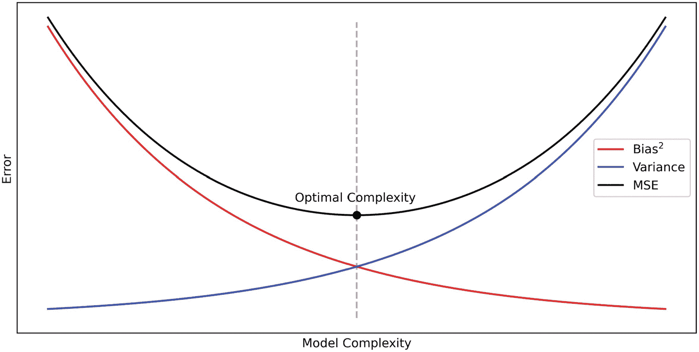

一个图表将误差与模型复杂度进行对比，曲线从左到右上升、下降并向上开口，与垂直线在最佳复杂度处相交。

图 1-23

偏差/方差权衡曲线表示。随着偏差的减少，方差增加，反之亦然。偏差平方和方差的总和是模型的总误差。最佳模型是能够平衡这种权衡的模型。

### 特征空间和维度的诅咒

随着我们讨论更复杂的数学建模概念和表示，将数据集不仅视为一系列跨越一组列的行集合，也视为位于 *特征空间* 中的点集合变得有用。

例如，以下数据集（表 1-1）可以定位在三维空间中（图 1-24）。

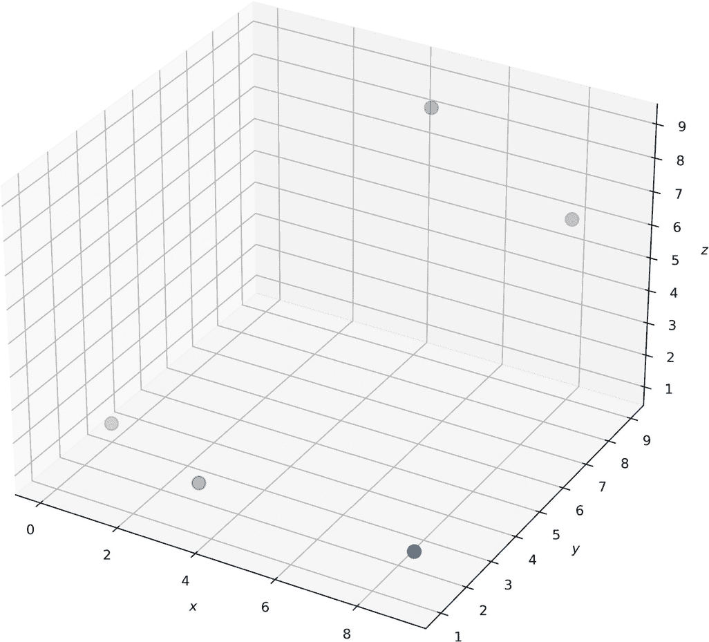

一个三维平面显示了点 (0, 4, 1)，(3, 3, 1)，(9, 1, 2)，(8, 9, 6) 和 (5, 8, 9)。值被估计。

图 1-24

表 1-1 中数据的特征空间表示

表 1-1

一个具有三个特征对应三个维度的示例数据集

| ***x*** | *y* | *Z* |
| --- | --- | --- |
| 0 | 3 | 1 |
| 3 | 2 | 1 |
| 9 | 1 | 2 |
| 8 | 9 | 6 |
| 5 | 8 | 9 |

在建模概念中，特征空间非常有用，因为我们可以把模型想象成在空间中寻找点之间的空间关系。例如，某些将“0”或“1”标签附加到每个数据点的二元分类模型可以想象成在概念上绘制一个超平面来分离空间中的点（图 1-25）。（在本章的“算法”部分了解更多关于这些类型模型的信息。）

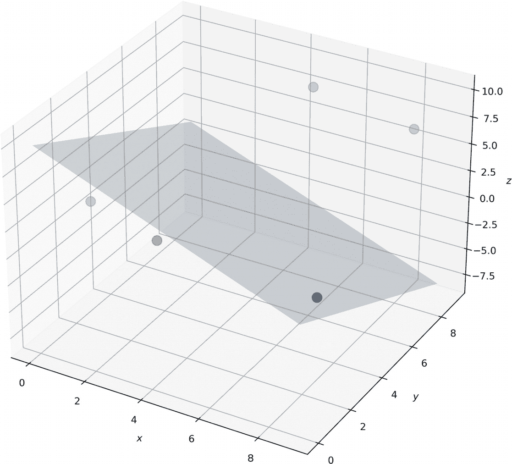

一个用 5 个点绘制的三维矩形平面。

图 1-25

表 1-1 中数据在特征空间内的超平面分离示例

通过特征空间的概念，我们可以理解模型在任意输入下的总体行为，而不仅仅是受限于可用的数据点。

在低维度的特征空间中，建模和理解相对容易。然而，高维空间的数学很快就会变得奇特，常常与我们的直觉相矛盾——我们存在的低维度非常熟练，但在理解高维动态方面却不太擅长。为了证明这一点，让我们考虑一个更简单的变化，这是一个常见的但相当数学化的奇特高维行为插图，通过探索超立方体的体积如何随着维度变化来展示这一点。

超立方体是将三维立方体推广到所有维度的一种形式。二维超立方体是一个正方形，一维超立方体是一条线段。我们可以定义一个以原点为顶点，边长为*l*的超立方体，它由所有形式为(*x*[1]，*x*[2]，...，*x*[*n*])的*n-*维点组成，这些点满足 0 ≤ *x*[1] ≤ *l*，0 ≤ *x*[2] ≤ *l*，...，0 ≤ *x*[*n*] ≤ *l*。也就是说，点在每个维度上都被限制在一定的范围内（范围的长度相同），与其他所有维度无关。与超球体等其他几何推广相比，处理超立方体使得数学更加简单，超球体是通过轴/维度之间的相互作用来定义的。

我们可以在原始超立方体内部绘制一个“较小的”超立方体，使得较小超立方体的边长是原始超立方体的 90%。我们可以在原始超立方体的整个空间中以均匀随机的方式采样点，并计算有多少点落在内部超立方体中，以获得体积的近似值。较小和较大超立方体的示例在图 1-26 中展示，包括第一、第二和第三维度。

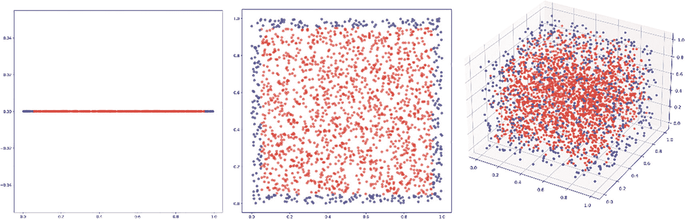

三个散点图显示了内部和外部超立方体的两个彩色点。这些图沿着水平线，在左侧；穿过二维平面，在中间；穿过三维平面，在右侧。

图 1-26

内部和外部超立方体，在一维、二维和三维特征空间中可视化

为了生成可视化效果，我们需要使用 NumPy 和 matplotlib 库，分别通过`import numpy as np`和`import matplotlib.pyplot as plt`导入。这段代码将成为我们推广到高维超立方体的基础（列表 1-8，1-9，1-10）。

```py
# set number of points to generate
n = 3000
# generate random points in the space
features = np.random.uniform(0, 1, (3, n))
# condition for 'inside' or 'outside' point
labels = np.array(['red' if (features[0, i]  0.95)
or (features[1, i]  0.95)
or (features[2, i]  0.95)
else 'blue' for i in range(n)])
# show on a three-dimensional hypercube
fig = plt.figure(figsize=(10, 10), dpi=400)
ax = fig.add_subplot(projection='3d')
ax.scatter(features[0], features[1], features[2],
color = labels)
plt.show()
Listing 1-10
Code to generate a three-dimensional nested hypercube set (right panel in Figure 1-26)
```

```py
# set number of points to generate
n = 2000
# generate random points in the space
features = np.random.uniform(0, 1, (2, n))
# condition for 'inside' or 'outside' point
labels = np.array(['blue' if (features[0, i]  0.95)
or (features[1, i]  0.95)
else 'red' for i in range(n)])
# show on a two-dimensional hypercube
plt.figure(figsize=(10, 10), dpi=400)
plt.scatter(features[0], features[1], color = labels, alpha = 0.5)
plt.show()
Listing 1-9
Code to generate a two-dimensional nested hypercube set (center in Figure 1-26)
```

```py
# set number of points to generate
n = 500
# generate random points in the space
features = np.random.uniform(0, 1, (500))
# condition for 'inside' or 'outside' point
labels = np.array(['blue' if i  0.95
else 'red' for i in features])
# show on a one-dimensional hypercube
plt.figure(figsize=(10, 10), dpi=400)
plt.scatter(features, np.zeros(500), color = labels,
alpha = 0.5)
plt.show()
Listing 1-8
Code to generate a one-dimensional nested hypercube set (left panel in Figure 1-26). Note that we can generate a relatively small number of points because the one-dimensional space is more compact relative to other higher-dimensional spaces
```

我们想要跟踪“外部点”（即，落在较小超立方体外的采样点）占总点的百分比，随着空间维度的增加或较小和较大超立方体体积之间的差异（图 1-27）。

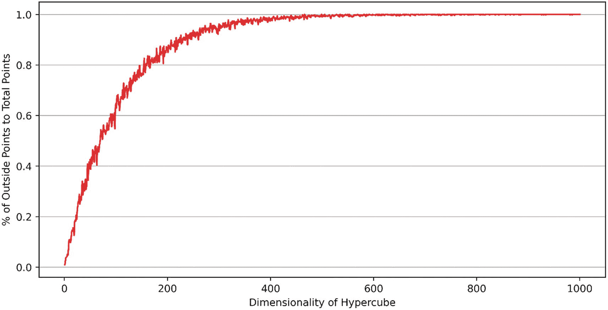

一个图表显示了外部点占总点的百分比与超立方体维度之间的关系。它显示了一条上升并水平延伸的曲线。

图 1-27

在比例计算中使用的超立方体的维数与外部点的比例绘制。锯齿状或噪声是由于采样中的随机性

在低维度下，这个比例似乎是合理的，并证实了我们的直觉：一维中为 0.01，二维中为 0.01，三维中为 0.04，五维中为 0.05。内部超立方体的边长是外部超立方体的 90%——似乎完全合理地预期大多数点会落在内部超立方体中，从而使得外部点与总点数的比例很低。

然而，200 维超立方体的比例约为 0.85，在 400 维时几乎为 1。这意味着在一个 400 维的超立方体中，*几乎每一个采样点都落在以 90%的边长定义的内部超立方体之外*。

超球体也会得到类似的结果。一种常见的解释是，在一个非常高维度的橙子的质量几乎全部在皮上，而不是在果肉中！

注意

你可能想知道我们为什么采样点并计算有多少落在“内部”超立方体“之外”，而不是使用简单的数学体积公式来确定比例。虽然后者是一种方法，但采样使我们能够将发现推广到更复杂的形状，在这些形状中，定义形状的*边界*很简单，但评估*体积*要困难得多——就像超球体。

在高维空间中，有许多方法可以理解奇异性和不直观的行为。一方面，这个超立方体特定例子中的数学支持了观察结果。给定超立方体的维度*d*，外部超立方体的边长*s*，以及表示内部超立方体边长与外部超立方体边长比值的比例常数*p*，我们可以计算体积比例：

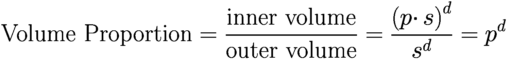

由于 0 < *p* < 1，我们有 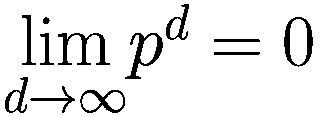 – 任何在 0 和 1 之间的分数值，如果反复指数化，必然会减小到零。

通过实现生成曲线的过程（列表 1-11），可以揭示类似的理解。在每一个点上，我们遍历该点的每个维度，并为该维度随机生成一个值。如果随机生成的值满足必须落在某个范围内的条件，它“通过”该维度，然后我们继续评估下一个维度。如果它没有“通过”（即，它落在“内部”超立方体的边长之外），我们将该点标记为“外部”点，并评估下一个点。

```py
def hyperCube(dims = 1, num = 500, prop = 0.99):
outsidePoints = 0
for point in range(num):
for dim in range(dims):
randPos = np.random.uniform(0, 1)
if randPos  1 –
1-prop)/2:
outsidePoints += 1
break
return outsidePoints/num
Listing 1-11
Generalized function to count proportion of “outside” to total points in the nested hypercube example
```

随着采样点的维度增加，一个点被判定为“外部”点的条件需要被评估更多次。这相当于在 0 到 1 之间的值*p*上重复进行指数运算。因此，更多均匀采样的点满足“外部”点的条件，因此在高维空间中分布得更靠近“外部”。当我们定义高维空间中的表面时，我们必须考虑到这种扭曲效应。在高维度下，高维橙子的皮变得如此之大，以至于在体积上超过了“果肉”。

这种现象，以及其他关于高维空间的数学和经验观察，统称为“维度诅咒”。简单来说，高维空间中点的密度/分布与低维空间大不相同。这对距离的测量方法有重要影响。

两个点(*a*[1]，*a*[2]，..., *a*[*n*])和(*b*[1]，*b*[2]，..., *b*[*n*])之间的欧几里得距离，或 L2 范数，定义为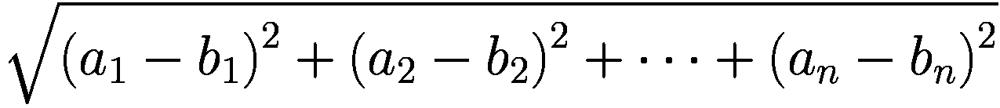。这是我们关于两点之间距离的最“直观”或“本能”的感觉。然而，在高维空间中，欧几里得距离变得如此稀释和“模糊”，以至于它不再有用。

考虑一个具有*n*维的单位超立方体。我们将观察超立方体两个角之间*第二长距离*与*最长距离*之间的差异如何随着*n*趋向于无穷大而变化（见 1-12，图 1-28）。从原点（0, 0, ..., 0）开始，最远的点可以通过“翻转”从 0 到 1 的所有维度找到：（1, 1, ..., 1）。第二远的点可以通过任意“翻转”从 0 到 1 的所有维度，除了一个：（0, 1, ..., 1）。从原点到最远点的距离是 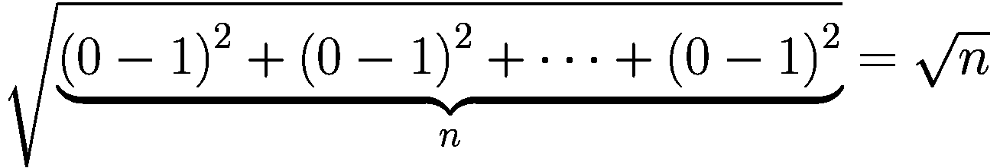，而从原点到最近点的距离是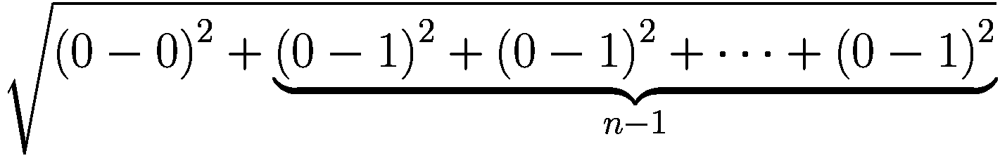 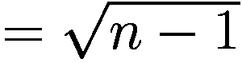。这两个距离之间的差异是 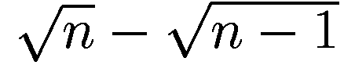。

```py
features = np.linspace(1, 100, 500)
labels = np.sqrt(features) - np.sqrt(features - 1)
plt.figure(figsize=(10, 5), dpi=400)
plt.plot(features, labels, color='red')
axes = plt.gca()
axes.yaxis.grid()
plt.ylabel('Distance ($\sqrt{n} - \sqrt{n-1}$)')
plt.xlabel('Dimensionality ($n$)')
plt.show()
Listing 1-12
Plotting sample difference in distance of two selected points on a hypercube as dimensionality increases
```

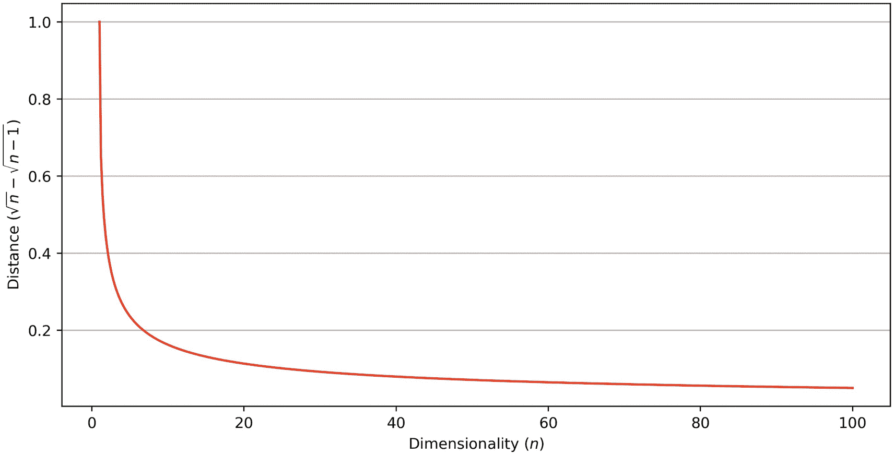

线形图绘制距离与维度之间的关系。它显示一条从(3, 1.0)开始，急剧下降并向右移动，几乎水平延伸的曲线。数值是近似的。

图 1-28

在维度 n 下，原点到超立方体最远点和第二远点之间的距离差异

我们可以找到 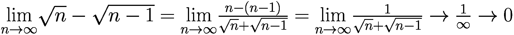. 因此，随着超立方体维度的增加，超立方体最远和第二远角的相邻两点与原点的距离基本相同。实际上，在更高维度中，原点与 *所有其他角* 之间的距离趋近于相同的值，因为在我们这个背景下，一般化 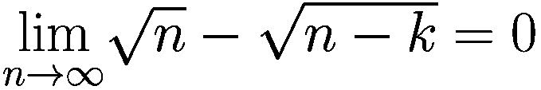 是成立的 (*k* < *n*，表示原点到 *k* + 1 个最远角之间的距离)。这影响了在传统直观定义的几何形状中距离分布的极化和扭曲。

虽然欧几里得距离是我们对几何距离最直观的感觉，但我们可以将其推广到不同的范数（表 1-2，列表 1-13，图 1-29）。第 *k* 个范数距离是 ![$$ \sqrt[k]{\sum \limits_{i=1}^n{\left|{a}_i-{b}_i\right|}^k} $$](img/525591_1_En_1_Chapter/525591_1_En_1_Chapter_TeX_IEq13.png)。*曼哈顿距离* 使用 L1 范数 (*k* = 1) 并表现为每个维度绝对差分的总和。其名称来源于纽约曼哈顿的网格状布局——我们严格沿着与维度平行的路径测量距离，就像在繁忙都市的街区中导航一样。*切比雪夫距离*，在另一极端，使用 L-无穷范数 (*k* = ∞)，它只返回任何维度的最长距离，因为将最大差分项提高到“无穷大”将“超过”所有其他项。切比雪夫距离通常用于计算其他范数距离成本过高的情境中（即，只有非常高维的空间）。

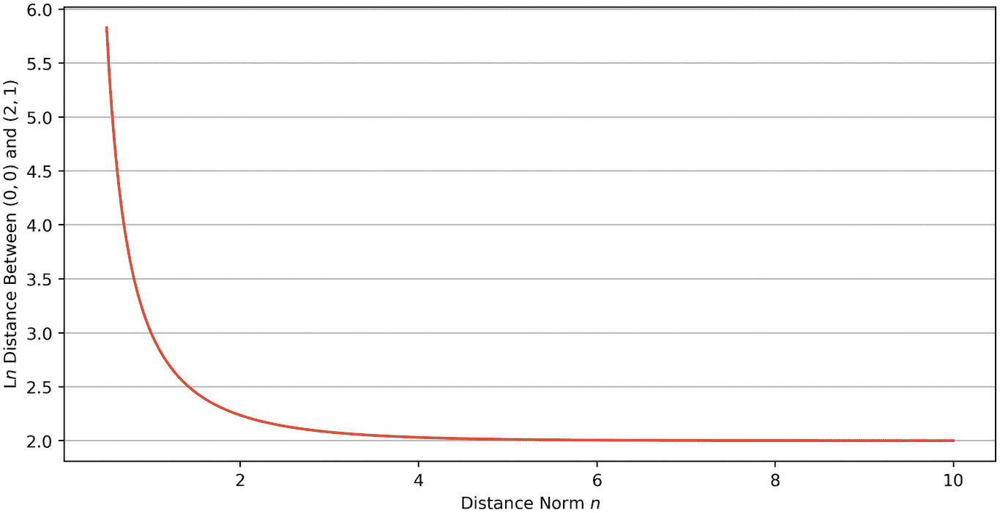

一条线图显示了 (0, 0) 和 (2, 1) 之间的 L n 距离与距离范数的关系。它显示了一条从 (1.4, 5.8) 开始，急剧下降然后水平运行的曲线。数值为估算值。

图 1-29

使用范数 n 计算的 (0, 0) 和 (2, 1) 之间的距离

表 1-2

不同范数下点 (0,0) 和 (2,1) 之间的距离样本值

| 范数 | (0, 0) 和 (2, 1) 之间的距离 |
| --- | --- |
|  | 5.83 |
| 1 (曼哈顿距离) | 3 |
| 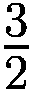 | 2.45 |
| 2 (欧几里得距离) | 2.24 |
| 3 | 2.08 |
| 4 | 2.03 |
| 5 | 2.01 |
| 10 | 2.0002 |
| ∞ (切比雪夫) | 2 |

```py
features = np.linspace(0.5, 10, 500)
labels = np.power((2**features) + 1, 1/features)
plt.figure(figsize=(10, 5), dpi=400)
plt.plot(features, labels, color='red')
axes = plt.gca()
axes.yaxis.grid()
plt.ylabel('L$n$ Distance Between $(0, 0)$ and $(2, 1)$')
plt.xlabel('Distance Norm $n$')
plt.show()
Listing 1-13
Plotting sample distance between (0,0) and (2,1) in different norms
```

除了 L2 范数之外，在高维空间中，其他范数变得有用，因为它们可以更好地“模拟”或“处理”这些环境中的距离性质。正如你将在后续算法讨论中看到的那样，许多机器学习模型需要一个定义明确的“距离”定义——这不一定是在它们经常操作的高维空间中的欧几里得距离（参见“算法”➤“K 最近邻”）。

维度灾难是一个强大的理论工具，当我们思考神经网络——无疑是当前最常用的最高维度的机器学习算法——如何泛化和学习时，它将特别相关。

### 优化和梯度下降

监督机器学习模型（即，给定输入预测输出的模型）“学习”是通过*优化*它们的*参数*来实现的。每个算法都有一组参数，这些参数决定了它如何处理或“解释”输入以产生输出。例如，简单线性回归模型*f*(*x*[1], *x*[2], *x*[3]) = *β*[0] + *β*[1]*x*[1] + *β*[2]*x*[2] + *β*[3]*x*[3]的参数是{*β*[0], *β*[1], *β*[2], *β*[3]}。这个非常基础的机器学习模型中每个参数的具体值决定了输入{*x*[1], *x*[2], *x*[3]}对最终输出的权重有多重。

为了找到“最佳”的参数集，我们首先需要定义“最佳”是什么意思。一个*损失函数*接受两个输入——预测输出（来自模型）和真实输出（理想的期望，即真实值）——并返回一个数字，表示模型性能的“好坏”。（更复杂的损失函数可以考虑这两个主要输入之外的更多输入。）由于“损失”大致等同于“误差”，越小越好。我们将在接下来的“指标和评估”部分进一步巩固对损失函数的理解。

在优化过程中，模型通常按照以下步骤操作：

1.  参数最初以随机值初始化。根据所使用的*初始化方案/策略*，参数可以全部设置为 0，从正态分布中随机抽取，或通过其他过程初始化。有时统计或领域知识，例如，可以提供初始化值。

1.  模型的损失是通过损失函数来评估的。

1.  根据模型表现不佳的程度（通过损失来指示），*优化算法*会对参数进行更改。

1.  步骤 2 和 3 会重复多次（从简单问题的约十次迭代到更复杂问题的数百万次循环），直到满足停止条件。这个条件可以是基于计数器的（达到一定数量的迭代），基于时间的（自训练开始以来已过去*x*小时），或基于性能的（模型已获得一定的满意验证分数）。

从概念上讲，我们可以理解这个过程，即从不良的“猜测”开始，并通过损失函数通过损失景观提供的反馈，迭代地改进参数集。损失景观是一个 n+1 维空间，其中 n 是模型中的参数数量。景观将模型可以采取的每个可能的参数值组合（n 维）与具有该参数集的模型将承担的损失（额外维度）相关联。

例如，图 1-30 中可视化的损失景观表明，在它所代表的假设单参数模型中，参数值为 4 将承担略小于 2 的损失（单位在这里不一定重要；重要的是比较损失的高低）。它还表明，此模型的最佳参数值约为-1.5，因为它最小化了损失（此位置用“X”标记）。

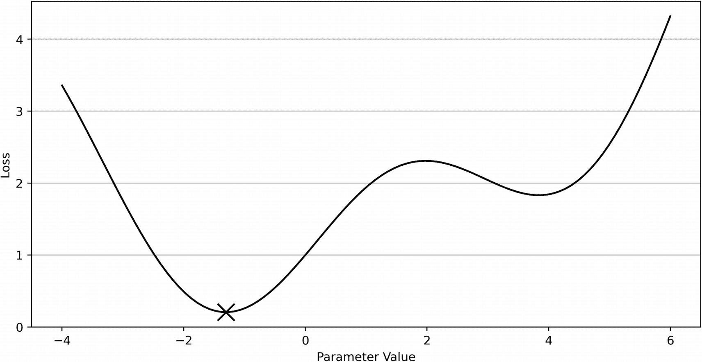

线形图绘制了损失与参数值的关系，并描绘了一个不规则振荡的曲线。X 在曲线上的点（-1.5，0.25）处被标记。数值是估计的。

图 1-30

示例损失景观图，其中标记了全局最小值（理想解）

在优化过程中，我们可以将模型视为“穿越”损失景观，寻求找到最低点（图 1-31）。每次它通过损失函数评估其错误（步骤 2）时，模型都在衡量它在景观中的“高度”。每次它更新其参数（步骤 3）时，它都在景观中改变其位置，目标是最终到达**全局****最小值**，即损失景观中损失最低的点。

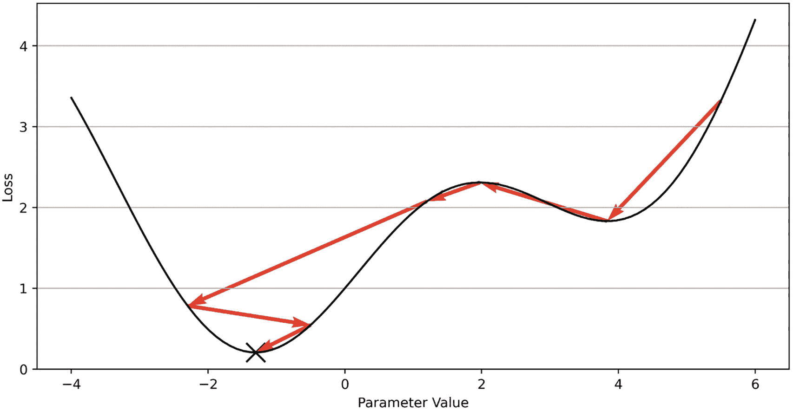

线形图绘制了损失与参数值的关系。它有一个不均匀振荡的曲线，以及沿着曲线的箭头，这些箭头指向点 X，坐标为（-1.5，0.25）。数值是近似的。

图 1-31

从初始参数值约 5.5 下降到参数值约为-1.5 的理想解的示例

在深度学习中，确定更新策略（即模型如何在景观中改变其位置）的代码和数学被称为**优化器**。存在多种不同类型的优化器，它们具有不同的优缺点。

深度学习中用于优化的最流行框架是 *梯度下降*。梯度下降的基本思想是使用我们试图最小化的函数的 *梯度*，即导数，来确定移动的方向。如果当前位置的导数是 *正的*，那么这意味着向前移动会增加成本函数，而向后移动会减少成本函数。另一方面，如果导数是负的，那么向前移动会减少成本函数，而向后移动会增加它。由于目标是整体减少成本函数，我们希望朝着导数的相反方向移动。此外，如果某个位置的梯度较大，我们希望迈出更大的步伐；如果梯度较小，我们希望迈出更小的步伐，这样我们就可以更有效地到达解，并避免过度射击解（因为导数在局部最小值附近接近零）。

我们可以用以下数学公式来表示这个想法：在每一步实例中，我们通过更新当前位置 *x* 为 −*α* · *c*^′(*x*) 来更新当前位置，或者说是成本函数 *c*(*x*) 的负导数乘以一个 *学习率参数 α*。*α* 是一个正的常数，它决定了每一步的大小。

让我们考虑最小化函数 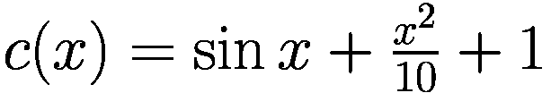。其导数 *c*^′(*x*) 是 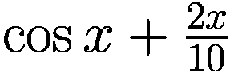。经过几次迭代后，位置 *收敛*（即达到一个位置，其位置不再显著变化）非常接近真实的极小值约为 *x* =  − 1.037（列表 1-14，图 1-32，图 1-33，图 1-34）。

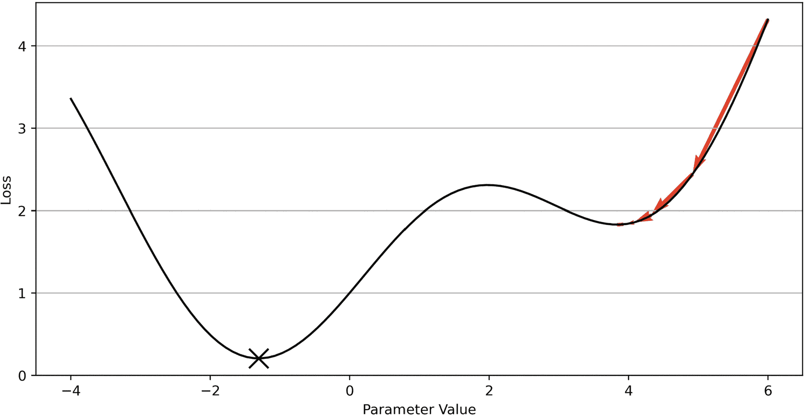

一条线图将损失与参数值的关系绘制出来。它描绘了一个曲线，该曲线以不均匀的方式振荡，箭头从点 (6, 4.5) 指向 (4, 1.8)。点 X 标记在曲线上的 (负 1.5, 0.25)。

图 1-34

从初始参数值 6 开始的损失景观的梯度下降减少

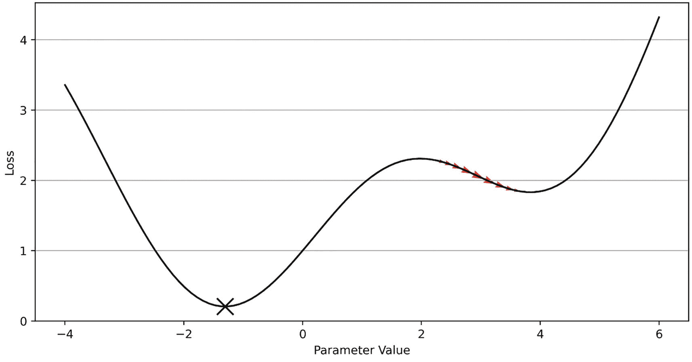

一条线图将损失与参数值的关系绘制出来，并描绘了一个曲线，该曲线以不均匀的方式振荡，箭头从点 (2.2, 2.5) 指向 (3.5, 1.75)。数值是估计的。

图 1-33

从大约 2 的初始参数值开始的损失景观的梯度下降减少

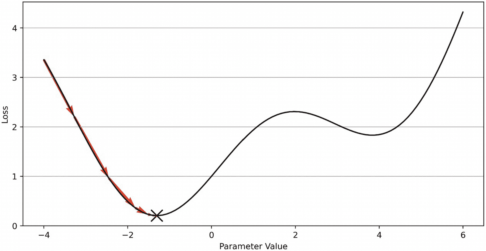

一条线图将损失与参数值的关系绘制出来。它显示了一个曲线，先下降，然后上升，再下降，最后上升。一系列箭头从左上角的一个点沿着曲线指向点 X。

图 1-32

从初始参数值 -4 开始，提供的损失景观的梯度下降减少。我们没有访问完整的成本函数（如果那样的话，我们根本不需要运行梯度下降！）因此存在初始化不良的风险。

```py
cost = lambda x: np.sin(x) + x**2 / 10 + 1
gradient = lambda x: np.cos(x) + 2*x / 10
learn_rate = 0.5
curr_x = -4
for iteration in range(10):
curr_x += -learn_rate * gradient(curr_x)
Listing 1-14
Minimizing c(x) with gradient descent
```

有许多机制，从简单到极其复杂，用以解决这个简单梯度下降算法的问题。我们将在后续章节关于神经网络的章节中进一步探讨这些问题，当它们变得更加相关时。

还应注意的是，虽然在这些示例中为了可视化，损失景观是二维的（即一个参数与损失之间的关系），但它几乎总是更高维数，因此更复杂。由于成功的机器学习模型至少有多个参数（在非平凡问题中），损失景观就受到维度的诅咒。1

让我们探索另一个用于建模的梯度下降演示。我们有一系列数字 `[0, 2, 5, 6, 7, 11]`，其中每个数字都与一个时间步长相关联：`[0, 1, 2, 3, 4, 5]`。由于序列似乎与时间步长线性相关，我们可以构建一个简单的近似模型，该模型从时间 0 的预测 0 开始，并在每个后续时间步长简单地添加一些常数 *β*。例如，如果 *β* = 3，生成的序列是 `[0, 3, 6, 9, ...]`。换句话说，我们正在构建一个没有 *y*-截距的线性模型，其中 *y* = *βx*。

目标是最小化损失函数。在这种情况下，我们将使用均方误差（MSE；参见本章的“指标和评估”部分以获取更详细的介绍），它被定义为预测值与真实标签之差的平方。因此，*c*(params) = (*y*[true] - prediction(params))²，或 *c*(*β*) = (*βx* - *y*)²。对 *β* 求导得到 *c*^′(*β*) = 2(*βx* - *y*) · *x*。由于在这种情况下 *x* 和 *y* 是数组，我们需要取序列中每个样本的所有梯度的平均值，并从这个平均值更新参数 *β*。

让我们定义我们的 *x* 和 *y* 数据集（清单 1-15）。

```py
x = np.array([0, 1, 2, 3, 4, 5])
y = np.array([0, 2, 5, 6, 7, 11])
Listing 1-15
Initializing sample x and y datasets for Linear Regression fit
```

我们将使用两个有用的函数，predict 和 gradient，分别返回给定 beta 参数和输入集的预测以及给定 beta 参数、输入集和真实集的平均梯度（清单 1-16）。

```py
def predict(beta, x):
return beta * x
def gradient(beta, x, y):
diffs = predict(beta, x) - y
gradients = 2 * diffs * x
return np.mean(gradients)
Listing 1-16
Defining prediction and gradient functions
```

然后，我们将使用梯度下降迭代优化 beta 参数（清单 1-17，图 1-35 和 1-36）。

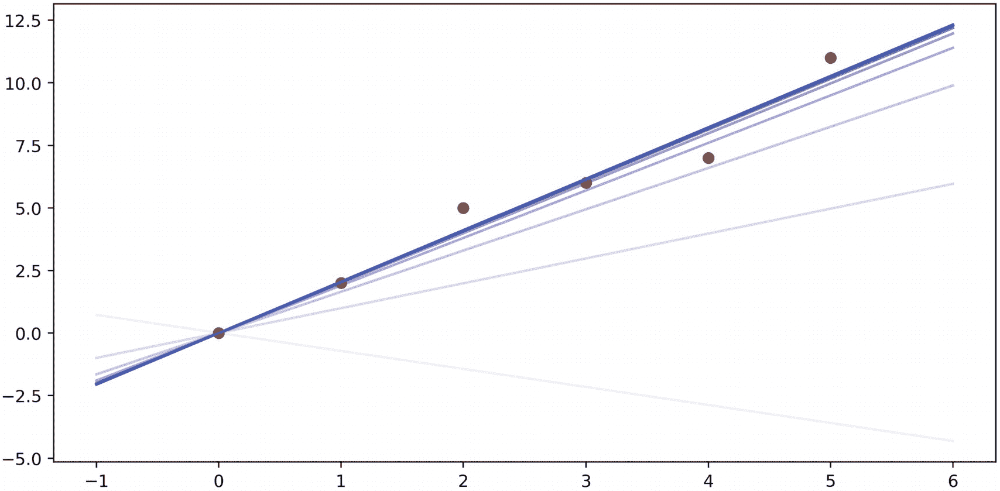

一张图描绘了几乎位于一条实线上的六个点。五条更多的线从上到下依次相交于点 (0, 0)，透明度逐渐降低。

图 1-36

随着时间推移，简单线性回归的梯度下降优化。在优化过程中，样本线变得越来越不透明。

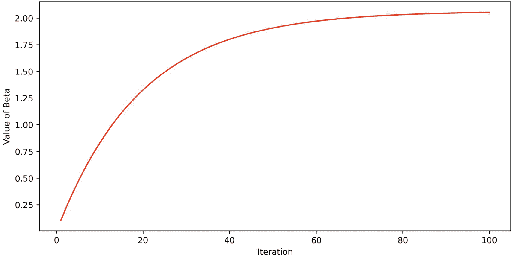

线形图绘制了 beta 值与迭代的关系，并描绘了一条在点（40，1.75）之后逐渐增加并水平延伸的曲线。数值是估计的。

图 1-35

通过梯度下降法在每次迭代中优化 beta 参数的值

```py
learn_rate = 0.005
curr_beta = -1
for iteration in range(100):
curr_beta += -learn_rate * gradient(curr_beta, x, y)
Listing 1-17
Iteratively updating the beta parameter
```

beta 参数非常快地收敛到大约 2.05，这很好地模拟了序列。

梯度下降是一个强大的概念，它支撑着许多现代机器学习应用，从最简单的统计模型到最先进的神经网络系统。

## 指标与评估

从一般意义上讲，指标是设定标准和评估模型性能的工具。在机器学习和数据科学领域，仅仅获得一个功能模型远远不够。我们需要开发方法和评估指标来确定模型在给定任务上的表现如何。机器学习中使用的指标是提供特定定量测量的公式和方程，这些测量值说明了开发的方法在提供的数据上表现如何。评估是指通过比较指标来区分更好和更差的模型的过程。

如前节所述，通常描述大多数数据集的问题可以分为两大类：回归和分类。由于对于每种类型的问题，模型产生的预测结果差异很大，因此分类指标和回归指标之间有明显的区别。回归指标评估连续值，而分类处理离散值。然而，这两种类型的评估方法都需要两种类型的输入：真实值（期望的正确预测）和模型输出的预测值。

与指标类似，还有损失函数。损失函数实现了与指标相同的目标：它们测量某些模型预测的性能或在某些情况下，误差。尽管损失函数可以用作指标，但当我们提到损失函数时，通常代表一个可微分的函数，可以用于训练基于梯度的模型。如前所述，梯度下降通过利用损失函数的可微性，使模型收敛到局部最优。损失函数的目的是提供一个信息丰富的公式，可以描述模型误差，并可以被梯度下降利用。它们通常对梯度下降是最优的，但并不一定完全符合我们的直观理解。另一方面，指标优先考虑对模型在给定任务上表现有效性的直观解释，而不是设计一个专门针对梯度下降优化的公式。

正如我们将在后面的章节中看到的，一些指标由于不可微性，根本不能作为损失函数。虽然有时损失函数在人类尺度上很容易理解，并且一些指标由于其可微性可以被认为是损失函数，但损失函数和指标通常被视为具有某种相似功能的不同工具。

### 平均绝对误差

最常见的回归指标之一是平均绝对误差（MAE）。简单来说，它计算了真实标签与模型预测之间的差异，并平均到所有预测中：

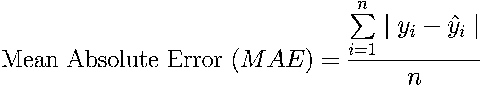

例如，想象一下一个有 50 名学生参加的考试，考试满分为 100 分。老师根据学生过去的学习情况，对每个学生的预期分数做出假设。在批改完试卷后，老师发现他们的预测并不完全准确。他们想知道自己与实际分数的差距有多大，或者说学生实际得到的分数。在直觉的引导下，他们简单地计算了预测分数与学生成绩之间的差异。老师发现，看到每个学生与预测的差距很有帮助，但他们还希望有一个总结性的、总体层面的想法，了解预测总体上有多大的错误。他们通过计算每个误差的平均值来实现这一点（图 1-37）。

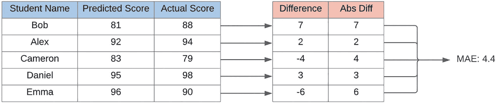

一个表格包含 6 行和 3 列，包括学生姓名、预测分数和实际分数作为列标题，这指向另一个表格，该表格描述了差异和绝对差异以及 MAE：4.4。

图 1-37

学生考试成绩的平均绝对误差（MAE）示例

虽然有时看到每个预测的误差有多大很有帮助，但如果将这些差异的平均值表示为一个值，结果将更容易理解。这就是平均绝对误差（Mean Absolute Error）。

这种方法简单易懂，告诉我们标签和模型预测之间的平均差异。然而，当我们处理某些类型的预测/数据时，它可能会引起一些担忧，我们将在后面的章节中讨论。

虽然 Python 库 scikit-learn 提供了易于使用的实现，但始终了解每个库的原理至关重要，因为只有当你直觉上理解算法/公式的过程时，你才能完全利用它。因此，对于以下每个指标，都将提供 scikit-learn 的实现以及从头开始使用 NumPy 库的完整实现过程。

在编写任何特定代码之前，我们将简要概述 NumPy 数组。简单来说，NumPy 数组是 Python 列表，由于 NumPy 库的基础是用编程语言 `C` 编写的，因此它们运行得更快。NumPy 数组的一个主要用途是执行线性代数运算，将嵌套的一维列表作为结构化矩阵。当我们定义函数时，我们假设输入、模型预测和真实标签是一维 NumPy 数组，它们的形状是数据中的条目数。对于每个真实标签，必须存在一个预测。

```py
import numpy as np
def mean_absolute_error(y_true, y_pred):
# check if y_true and y_pred are the same shape
assert y_pred.shape == y_true.shape
Listing 1-18
The basic definition of a function
```

我们首先定义函数及其参数，`y_true` 和 `y_pred`，分别代表真实标签和模型预测。在定义之后，我们编写一个 `assert` 语句来确保两个输入的形状相同，因为在预处理数据或检索模型预测时可能会出错（列表 1-18）。

```py
import numpy as np
def mean_absolute_error(y_true, y_pred):
# check if y_true and y_pred are the same shape
assert y_pred.shape == y_true.shape
return np.sum(np.absolute(y_true-y_pred))/len(y_pred)
Listing 1-19
MAE function in NumPy
```

在理解这些嵌套的返回语句时，从内部开始并逐步向外工作非常有帮助。回顾 MAE 的公式，第一步是计算每个元素的真实标签和模型预测之间的差异，这在代码中通过 y_pred-y_true 反映出来。然后，对于结果数组中的每个项目，我们取结果的绝对值，表示为 np.absolute(y_true-y_pred)。最后，通过首先对所有元素求和，np.sum，然后除以数组的长度 len(y_pred)，即数据中的条目数，来计算输出的平均值（列表 1-19）。注意我们在顶部导入了 NumPy 作为 np；因此，当我们提到 np 时，我们是在调用 NumPy 库中的函数。

```py
# implementation in Scikit-Learn
from sklearn.metrics import mean_absolute_error
# usage
mean_absolute_error(y_reg_true, y_reg_pred)
Listing 1-20
MAE in scikit-learn and its usage, where y_reg_true = ground-truth labels and y_reg_pred = model predictions
```

如前所述，Python 库 sklearn 提供了一个方便的一行函数用于计算 MAE，它可以像我们从零开始实现的方式（列表 1-20）一样使用。

### 均方误差（MSE）

均方绝对误差（MAE）可能很简单，但也有一些缺点。MAE 的一大问题是它不会惩罚异常预测。考虑两个样本 *A*[1] 和 *A*[2]，模型在这两个样本上的误差分别是 1% 和 6%（绝对误差除以总可能域值）。使用均方绝对误差，*A*[2] 的权重比 *A*[1] 差 5%。现在，考虑另外两个样本 *B*[1] 和 *B*[2]，模型在这两个样本上的误差分别是 50% 和 55%。使用均方绝对误差，*B*[2] 的权重比 *B*[1] 差 5%。我们应该问自己：从 1% 到 6% 的模型退化是否与从 50% 到 55% 的模型退化相同？50-55% 的误差变化比 1-6% 的误差变化要糟糕得多，因为在后一种情况下，模型仍然表现良好。

我们可以使用均方误差不成比例地惩罚更大的错误：

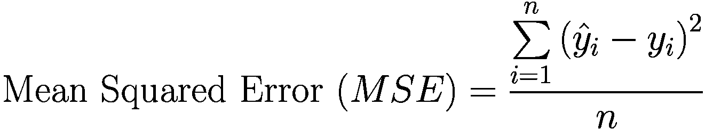

如其名所示，均方误差将模型预测与真实标签之间的差异提升到平方而不是取绝对值。

为了进一步说明，继续使用之前的学生考试成绩示例，老师预测学生 Cameron 的分数为 58 而不是 83。使用 MSE 的公式，我们得到 107.8（见图 1-38）。然而，我们没有直观地了解模型是如何错误的。由于我们平方了结果而不是取绝对值，我们得到的分数没有缩放到测试分数的范围，因为 107.8 的平均误差对于分数在 0 到 100 之间的测试是不可能的。为了解决这种问题，我们可以对结果开平方根以“反转”平方操作，将误差放入上下文中，同时仍然强调任何异常预测。这个指标是均方根误差（RMSE）：

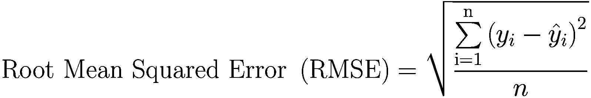

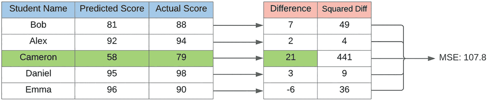

一个表格有 6 行和 3 列，包含列标题、学生姓名、预测分数和实际分数，这指向一个包含差异和平方差异的表格，这些差异和平方差异导致均方误差（MSE）为 107.8。

图 1-38

MSE 示例

使用前面的方程，我们得到学生考试成绩示例的 10.38 RMSE。另一方面，如果我们使用 MAE，得到的分数是 7.8。在不查看任何预测的情况下，RMSE 给我们提供了更多关于极端错误预测的信息。

```py
def mean_squared_error(y_true, y_pred):
assert y_pred.shape == y_true.shape
return np.sum((y_pred-y_true)**2)/len(y_pred)
# RMSE
def root_mean_squared_error(y_true, y_pred):
assert y_pred.shape == y_true.shape
mse = mean_squared_error(y_true, y_pred)
return mse**0.5
Listing 1-21
MSE and RMSE implementations
```

MSE 和 RMSE 的实现与 MAE 非常相似。正如我们在函数中看到的那样，真实标签与模型预测之间的差异使用双星号符号提升到平方。最后，通过将数组中的所有元素相加然后除以数组的总长度或元素数量来取平均值，使用`np.sum`和`/len(y_pred)`。要获得 RMSE 的值，我们只需像之前那样对 MSE 的结果开平方根；我们将 MSE 的输出提升到 1/2 次幂或取其平方根（见列表 1-21）。

```py
# implementation in sklearn
from sklearn.metrics import mean_squared_error
# usage
mean_squared_error(y_reg_true, y_reg_pred)
# RMSE
mean_squared_error(y_reg_true, y_reg_pred)**(1/2)
Listing 1-22
Scikit-learn implementation of RMSE and MSE, where y_reg_true = ground-truth labels and y_reg_pred = model predictions
```

Scikit-learn 仅提供了 MSE 的实现。对于 RMSE，我们只需像之前那样开平方根（见列表 1-22）。

尽管有其他回归指标，但 MAE、MSE 和 RMSE 是最重要的几个。其他回归指标，如 Tweedie 偏差或确定系数，围绕与之前提到的指标类似的概念。

### 混淆矩阵

与基于 MAE 概念的回归度量一样，大多数分类度量都依赖于混淆矩阵的概念，它以方便的视觉方式描述了错误程度和错误类型。

混淆矩阵有四个组成部分，描述了模型预测与真实标签的比较；它们是真阳性、假阳性、真阴性和假阴性。让我们分解这个术语：第一个词表示模型预测是否正确（如果正确则“真”，如果不正确则“假”）；第二个词表示真实标签值（对于标签 1 是“正”，对于标签 0 是“负”）。

让我们通过现实生活中的例子更好地理解这些概念。假设一位医生根据筛查结果诊断可能的癌症患者。如果医生推断出实际患有癌症的患者确实患有癌症，那么这是一个真阳性的例子。当模型，在这种情况下是医生，预测患者为癌症阳性，而患者的实际真实标签最终也是阳性时，这被称为真阳性。然而，医生并不是每次都准确无误。当医生预测患者没有癌症，而患者实际上确实患有癌症时，这是一个假阴性的例子。当医生断定患者患有癌症，而实际上患者是健康的，这是一个假阳性的例子。如果一个患者是健康的，而医生也预测为健康，那么这是一个真阴性的例子。

让我们将这些概念总结成数字语言：

+   当模型预测为 1 且真实标签为 1 时，它是一个真阳性。

+   当模型预测为 1 且真实标签为 0 时，它是一个假阳性。

+   当模型预测为 0 且真实标签为 0 时，它是一个真阴性。

+   当模型预测为 0 且真实标签为 1 时，它是一个假阴性。

在我们识别出模型预测与真实标签之间的所有此类情况后，我们可以方便地将这些值组织成矩阵形式，因此得名混淆矩阵（图 1-39）。

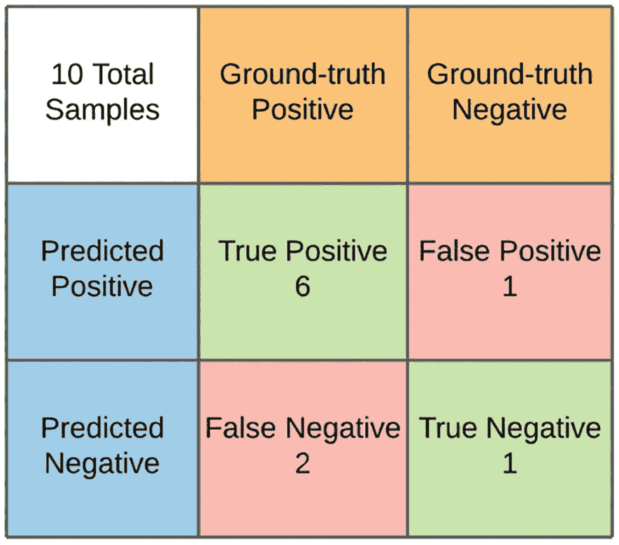

一个 3x3 的矩阵，由 10 个总样本组成，显示真实标签的正负作为列标题，预测的正负作为行标题。

图 1-39

混淆矩阵示例

### 准确率

评估分类模型性能的最直接方法之一是准确率。准确率简单地说就是模型预测正确的值的百分比。在更技术性的术语中，它是真阳性加上真阴性的数量除以所有预测值的数量：

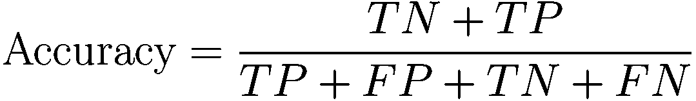

准确率可能方便且直观，但它确实有一定的代价。想象一下，如果有 100 个样本，其中 90 个属于正类，其余 10 个属于负类。如果没有其他关于数据的信息，如果模型预测所有样本为正类，它将获得 0.9 的准确率，即 90% 正确。考虑一个发展良好的模型，对于 90 个正样本，它正确预测了 81 个样本；另一方面，对于 10 个负类，模型正确预测了 9 个样本。显然，第二个模型对数据的理解更好，而不是像第一个模型那样盲目猜测，但它们都获得了相同的准确率得分 0.9。当数据中一个类别的样本数量显著多于另一个类别时，这被称为不平衡数据。因此，在处理不平衡数据时，准确率不是一个反映性的指标。

```py
def accuracy(y_true, y_pred):
assert y_true.shape == y_pred.shape
# returns a boolean array(of 1s and 0s) indicating if element of both arrays match
return np.average(y_true == y_pred)
Listing 1-23
Implementation of accuracy
```

NumPy 中准确率的实现非常直接：`y_true == y_pred` 返回一个布尔数组，表示数组的元素是否匹配。在 Python 中，布尔值可以解释为整数；因此，我们计算数组中所有元素的平均值，因为从技术上讲，每个布尔值代表该元素的准确率（见列表 1-23）。

```py
from sklearn.metrics import accuracy_score
accuracy_score(y_class_true, y_class_pred)
Listing 1-24
Scikit-learn implementation of accuracy, where y_class_true = ground-truth labels and y_class_pred = model predictions
```

再次强调，sklearn 提供了一个简单的准确率函数；它可以以与我们从头实现自己的准确率分数相同的方式使用，通过输入模型预测和真实标签（见列表 1-24）。

### 精确率

相反，精确率考虑了数据集中类别不平衡的问题。精确率只计算所有预测为正类的准确率，或者真实正例数除以真实正例数和假正例数之和。这将惩罚在类别不平衡的数据集中对正类表现不佳的模型，其中包含大量负值：

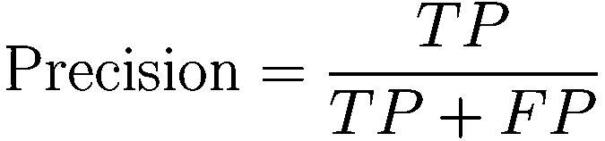

精确率给出了模型对正类准确性的感觉，同时解决了类别不平衡的准确率问题。精确率得分作为一个指标非常有用，因为在许多现实生活中的数据集中，例如疾病诊断，负样本的数量超过了正样本的数量，精确率会产生关于模型在预测罕见正类时可能有多准确的直观理解。

```py
# precision
# number of correctly classified positive values/number of all predicted positive values
def precision(y_true, y_pred):
assert y_true.shape == y_pred.shape
# y_true * y_pred
return ((y_pred == 1) & (y_true == 1)).sum() / y_pred.sum()
Listing 1-25
Implementation of precision
```

从精确度的方程出发，我们首先找到真正例的数量。回想一下，真正例是当模型正确预测正类时；在代码中，`(y_pred == 1) & (y_true == 1)` 返回 `y_true` 和 `y_pred` 都相等的元素。然后为了找到真正例的数量，我们简单地使用 `sum()` 对数组求和，然后除以所有预测的正例值，这可以通过对预测数组求和获得，因为所有负预测用 0 表示，不会对总和做出贡献（列表 1-25）。

```py
from sklearn.metrics import precision_score
precision_score(y_class_pred, y_class_pred)
Listing 1-26
Scikit-learn implementation of precision, where y_class_true = ground-truth labels and y_class_pred = model predictions
```

在 sklearn 中，我们可以从 `sklearn.metrics` 中导入 `precision score` 函数，并像我们自己的实现一样使用它（列表 1-26）。

### 召回

召回分数，或真正例率，与精确度略有不同，因为它不是计算模型预测正例的准确性，而是返回整个正类的准确性。召回巧妙地解决了准确性的问题，它只计算正类中的正确性或所有正标签中真正例的百分比。当只关心模型准确预测正类时，召回指标是有用的。例如，在诊断癌症和大多数疾病时，当资源有限，无法开发出完美的模型时，避免假阴性比避免假阳性更为关键。在这种情况下，我们会优化更高的召回率，因为我们希望模型在预测正类时尽可能准确：

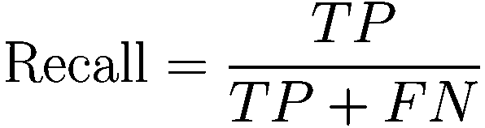

在 NumPy 中的实现与精确度非常相似，只有细微的差别：现在我们寻找所有真实正例值，所以我们有 `y_true.sum()` 而不是 `y_pred.sum()`。在代码中，`(y_pred == 1) & (y_true == 1)` 返回 `y_true` 和 `y_pred` 都相等的元素。然后为了找到真正例的数量，我们只需使用 `sum()` 对数组求和，然后除以所有预测的正例值，这可以通过对预测数组求和获得，因为所有负预测用 0 表示，不会对总和做出贡献（列表 1-27）。

```py
# recall
# number of correctly classified positive values/number of all true positive values
def recall(y_true, y_pred):
assert y_true.shape == y_pred.shape
return ((y_pred == 1) & (y_true == 1)).sum() / y_true.sum()
# sklearn recall
from sklearn.metrics import recall_score
recall_score(y_class_true, y_class_pred)
Listing 1-27
Recall implementation in sklearn and NumPy, where y_class_true = ground-truth labels and y_class_pred = model predictions
```

在 sklearn 中，调用 `sklearn.metrics` 中的 `recall_score` 函数将完成我们刚刚实现的功能（列表 1-27）。

### F1 分数

F1 分数的直觉在于创建一个通用的指标，它衡量正类正确性的同时，具有精确度和召回率的优点。因此，F1 分数是精确度和召回率的调和平均数。注意我们在这里使用调和平均数，因为精确度和召回率是以百分比/比率的形式表示的：

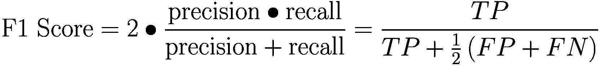

与精确度和召回率相比，F1 分数通常能更好地说明正类被正确分类的程度。F1 分数可以推广到 F-beta 分数，其中 beta 代表对精确度和召回率的权重或关注程度。当 beta 等于 1 时，它等同于 F1 分数：

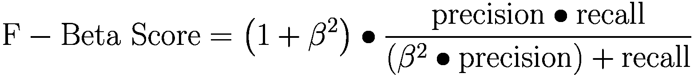

将 beta 设置低于 1 会给精确率更多的权重，这意味着在调和平均数中精确率分数会被更重视。另一方面，将 beta 设置为一个大于 1 的值会强调召回率分数。这为精确率和召回率分数的组合提供了更多的灵活性，因为根据情况可以调整关注的程度。

```py
# F1 Score
# Harmonic Mean of Precision and Recall
def f1_score(y_true, y_pred):
num = (2*precision(y_true, y_pred)*recall(y_true, y_pred))
denom = (precision(y_true, y_pred)+recall(y_true, y_pred))
return  num / denom
Listing 1-28
F1 score implementation
```

在这里，我们实现 F1 分数，因为大多数时候使用的是 F1 分数而不是其他 F-beta 变体。然而，这可以很容易地扩展到 F-beta 分数。遵循调和平均数的公式，我们可以将观察值的数量 2 除以每个观察值的倒数之和，即精确率的倒数和召回率的倒数。请注意，公式和实现与这个公式不同，因为我们简化了表达式，使其以一个分数表示。我们可以利用之前实现过的精确率和召回率函数：在分子中，精确率和召回率的乘积乘以 2，而在分母中它们相加，然后除以它们计算两个之间的调和平均数（列表 1-28）。

```py
from sklearn.metrics import f1_score
f1_score(y_class_true, y_class_pred)
Listing 1-29
Sklearn implementation of the F1 score, where y_class_true = ground-truth labels and y_class_pred = model predictions
```

在 sklearn 中，我们可以使用`f1_score`函数达到相同的结果（列表 1-29）。

### 接收者操作特征曲线下的面积（ROC-AUC）

虽然 F1 分数考虑了精确率和召回率的优点，但它只衡量正类。F1 分数与精确率和召回率一起的另一个主要问题是我们在评估时输入的是二元值。这些二元值由一个阈值决定，通常在模型预测期间将概率转换为二元目标。在大多数情况下，0.5 被选为将概率转换为二元目标的阈值。这不仅可能不是最佳阈值，而且还会减少我们从输出中作为概率所获得的信息量，因为概率也显示了模型对其预测的信心。接收者操作特征（ROC）曲线巧妙地解决了这些问题：它绘制了不同阈值下的真阳性率与假阳性率的关系：

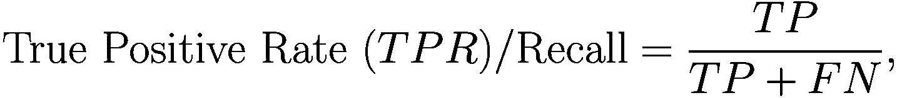

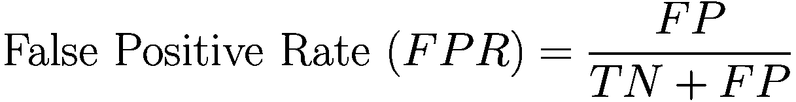

真阳性率，或称为召回率，告诉我们所有预测为正的标签中正确预测的数量，或者当预测为正时模型正确的概率。假阳性率计算负预测中的假阴性数量。在某种意义上，它给出了当预测为负时模型可能错误的概率。ROC 曲线将这两个测量值在不同阈值下的值可视化，生成一个图表，我们可以看到哪个阈值给出了真阳性率/假阳性率的最优值（图 1-40）。

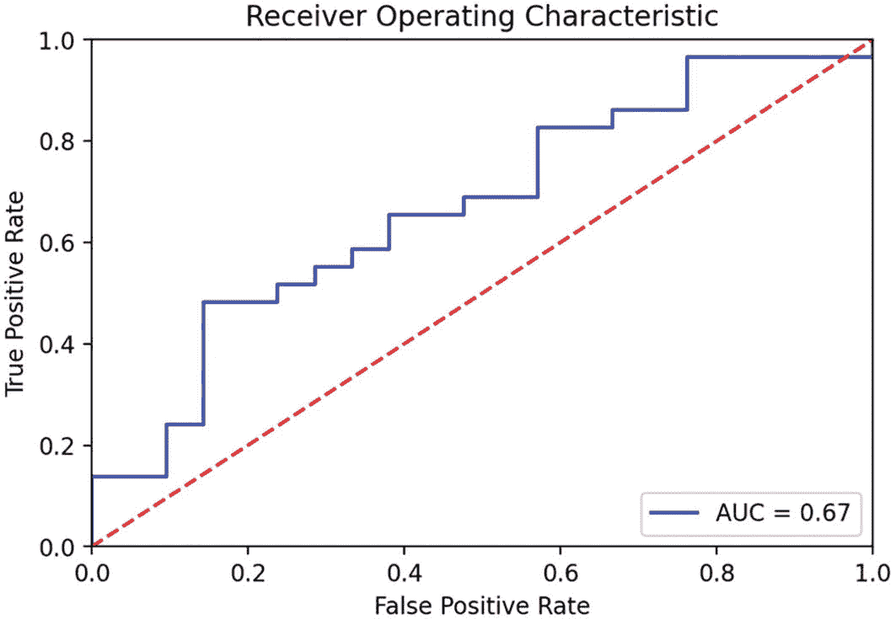

接收者操作特征（ROC）曲线的线图显示了真阳性率与假阳性率的对比，并描绘了 AUC 等于 0.67 的阶梯曲线和从原点开始的斜线。

图 1-40

一个 ROC 曲线及其面积=0.67 的示例

此外，计算曲线下面积（AUC）提供了一个衡量模型区分类别好坏的指标。面积为 1 表示类别之间完美的区分，从而产生正确的预测。面积为 0 表示完全相反的预测，意味着在 1 和 0 之间所有预测都被反转（标签-1）。面积为 0.5 表示完全随机的预测，其中模型根本无法区分类别（图 1-41）。

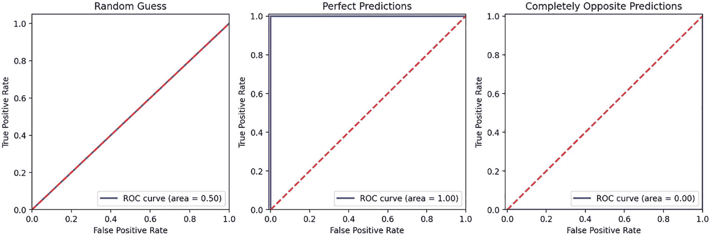

左侧、中间和右侧分别展示了随机猜测、完美预测和完全相反预测的三个图表。所有图表都绘制了真阳性率与假阳性率的对比图。每个图表显示了一条 ROC 曲线，其面积分别为 0.50、1.00 和 0.00。

图 1-41

ROC 曲线的三个极端情况

```py
def get_tpr_fpr(y_pred, y_true):
tp = (y_pred == 1) & (y_true == 1)
tn = (y_pred == 0) & (y_true == 0)
fp = (y_pred == 1) & (y_true == 0)
fn = (y_pred == 0) & (y_true == 1)
tpr = tp.sum() / (tp.sum() + fn.sum())
fpr = fp.sum() / (fp.sum() + tn.sum())
return tpr, fpr
Listing 1-30
The function that retrieves the TPR and FPR
```

ROC-AUC 的实现稍微复杂一些，因为我们首先需要绘制 ROC 曲线，然后计算其下的面积。前面的函数首先通过检索真实阳性、假阳性、真实阴性和假阴性数组来计算真阳性率（TPR）和假阳性率（FPR），然后将其作为单独的数组返回（代码列表 1-30）。

```py
def roc_curve(y_pred, y_true, n_thresholds=100):
fpr_thresh = []
tpr_thresh = []
for i in range(n_thresholds + 1):
threshold_vector = (y_true >= i/n_thresholds)
tpr, fpr = get_tpr_fpr(y_pred, y_true)
fpr_thresh.append(fpr)
tpr_thresh.append(tpr)
return tpr_thresh, fpr_thresh
Listing 1-31
ROC curve function
```

为了绘制 ROC 曲线，我们需要各种阈值下的 TPR 和 FPR。在前面提到的函数中，我们从 0 到 1 之间选择了 100 个等间隔的阈值。对于每个选择的阈值，函数根据某些模型提供的预测概率计算该特定阈值下的 TPR 和 FPR。然后，每个值被添加到单独的列表中。最后，返回包含指定阈值下 TPR 和 FPR 的列表（代码列表 1-31）。

使用我们前面函数返回的点，我们可以绘制 ROC 曲线，其中 x 轴是 FPR（假正率），y 轴是 TPR（真正率）。由于我们没有能够每次用不同的 TPR 和 FPR 值代表绘制曲线的确切函数，因此直接使用积分来计算曲线下的面积是困难的。然而，我们可以通过在图表下切割矩形区域，然后求和这些矩形的面积来估计面积。随着我们切割越来越多的矩形，每个矩形变得越来越薄，这些矩形面积的总和越来越接近图表下的确切面积（图 1-42）。这种估计图表下面积的方法被称为黎曼和。

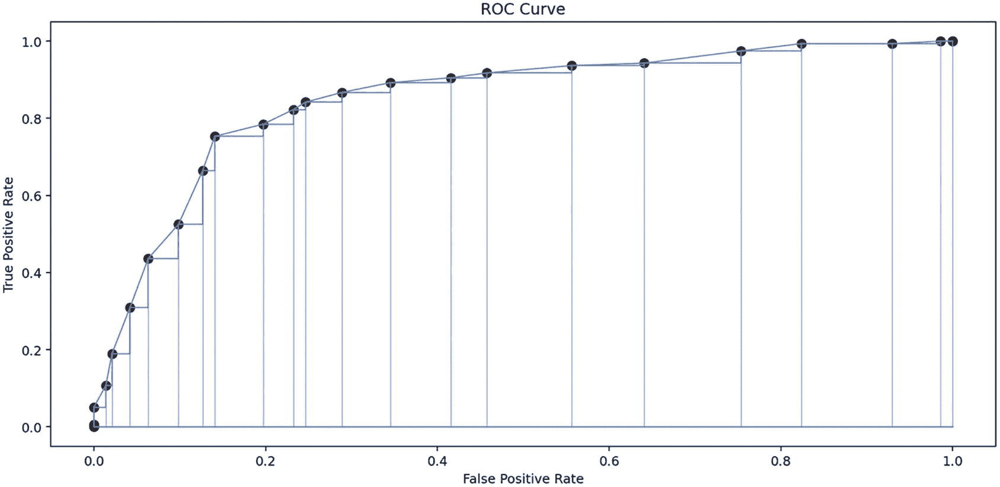

ROC 曲线图显示了真实值与假正率的关系，描绘了一个在左上角边缘连接并垂直切割的阶梯曲线。

图 1-42

曲线下面积计算示例

```py
def area_under_roc_curve(y_true, y_pred):
fpr, tpr = roc_curve(y_pred, y_true)
rectangle_roc = 0
for k in range(len(fpr) - 1):
rectangle_roc += (fpr[k]- fpr[k + 1]) * tpr[k]
return 1 - rectangle_roc
Listing 1-32
The area under the ROC curve
```

对于计算面积，我们可以想象两点之间的间隙作为矩形的宽度，而让高度是到图表底部的点。尽管矩形的顶部和图表绘制的线之间会有一个微小的间隙，但随着点的数量或矩形的增加，这个间隙将变得可以忽略不计。在前面的函数中，我们在获得包含不同阈值的不同值的 TPR 和 FPR 列表后，列表中的每个值都会被循环遍历，并计算相应的矩形面积（代码列表 1-32）。当阈值的数量大于 10,000 时，得到的 ROC-AUC 分数通常会接近 sklearn 实现的分数。

```py
from sklearn.metrics import roc_auc_score
print(f"Scikit-Learn implementation of ROC-AUC: {roc_auc_score(y_class_true, y_class_pred)}")
Listing 1-33
Scikit-learn implementation of the ROC-AUC score
```

sklearn 的实现非常简单，只需调用`roc_auc_score`函数，输入模型预测和真实标签（代码列表 1-33）。

## 算法

在深入研究任何深度学习相关主题之前，理解经典机器学习算法至关重要，其中许多是深度学习模型的竞争对手。这些经典机器学习算法中的一些已经存在了 70 年之久，并且当正确使用时，它们的性能相当高，与各种深度学习方法相比，计算时间惊人地快。

到目前为止，经典机器学习算法在现代工业和机器学习相关竞赛中仍然发挥着重要作用。这些算法的训练速度比深度学习方法快，而且像梯度提升这样的强大方法也可以在表格数据上超越标准的深度学习方法。此外，XGBoost（极端梯度提升）和 LightGBM（轻梯度提升机器）等模型仍然是用于基准测试表格数据集的最受欢迎的通用选择。许多经典机器学习的进步为现代深度学习技术奠定了基础。神经网络——深度学习的基础——依赖于线性回归和梯度下降的概念和数学基础。因此，在进入深度学习之前，理解和实现这些方法是至关重要的。在本节中，你将介绍六种流行且重要的经典机器学习算法，包括 K-Nearest Neighbors（KNN）、线性回归和逻辑回归、决策树、随机森林和梯度提升。

### K-Nearest Neighbors

K-Nearest Neighbors，或 KNN，是简单且直观的经典机器学习算法之一。KNN 最早由 Evelyn Fix 和 Joseph Lawson Hodges Jr.在 1951 年为美国空军进行技术分析时提出。在当时，它提出的方法是非参数的：算法不对数据的统计特性做出任何假设。尽管由于工作的机密性，该论文从未发表，但它为第一个非参数分类方法 K-Nearest Neighbors 奠定了基础。KNN 的美丽之处在于其简单性，并且与大多数其他算法不同，KNN 不包含训练阶段。由于算法基于内存，可以无缝地整合额外数据，因此可以轻松适应任何新数据。七十年后，KNN 仍然是一个流行的分类算法，并且围绕它仍然不断有创新被提出。

K-Nearest Neighbors（KNN）仅仅是一个算法概念。尽管它最初是为了分类任务而提出的，但它也可以适应回归任务。KNN 的一个主要缺点是其速度。随着样本数量的增加，推理所需的时间会显著增长。前面提到的维度诅咒也会拖累 KNN 的性能；当数据特征的数量增加时，算法难以正确预测样本。然而，由于 KNN 易于实现，只有一个单超参数的便利性以及互操作性，它成为了快速上手并快速预测相对小规模数据的最佳算法之一。

#### 理论与直观

KNN 背后的主要直觉是将未标记的数据点与现有的、已标记的数据点分组，并根据它们与标记数据点的距离对数据进行分类。随着未标记数据点的输入，计算它们与其他训练数据点的距离。然后，最近的数据点的标签成为新数据点的模型预测。我们可以用一个简单的二维示例（图 1-43）来可视化这一点。

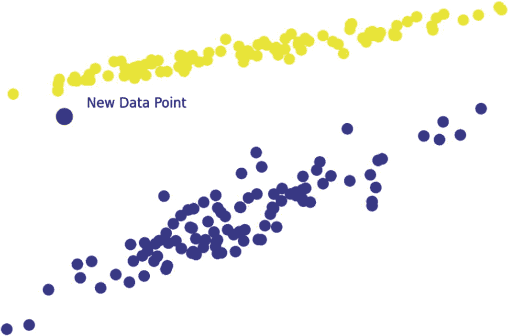

两个不同阴影的数据点集，它们倾向于从左到右上升，以及一个靠近上组数据点的新的数据点。

图 1-43

KNN 直觉的可视化

假设标记的数据集有两个特征，它们处于相同的尺度，我们根据其特征绘制每个数据点，一个在 x 轴上，另一个在 y 轴上。在这里，不同的标签用不同的颜色区分。当输入一个新的、未标记的数据点时，我们首先根据其特征绘制数据点。然后我们计算新数据点到每个标记数据点的距离。一旦我们获得与数据集中每个点相关联的距离列表，该列表按升序排序，并选择前*K*个元素。*K*是一个可以调整以改进性能的超参数。K 的选择将在稍后讨论。最后，我们对点的标签进行多数投票，以确定最终的预测。KNN 利用了具有相同标签的数据点很可能具有相似的特征值的这一事实。这个想法可以进一步扩展到更高维或具有两个以上特征的数据。

在深入 KNN 算法的实现之前，让我们退一步来讨论可用于算法的距离函数。许多距离公式的基方程是 Minkowski 距离，如下所示：

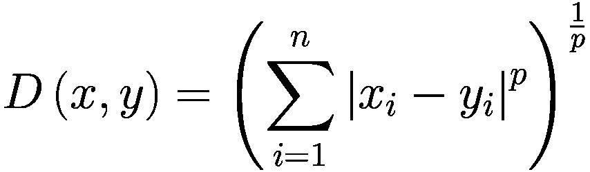

对于向量*x*和*y*，*n*代表向量的维度，其值为(*x*[1]，*x*[2]，*x*[3]，...，*x*[*n*])和(*y*[1]，*y*[2]，*y*[3]，...，*y*[*n*])，其中每个值是每个样本的特征。两个向量中每个值的绝对差被提升到*p*次方。然后这些值之间的差异被求和并取*p*次方根。对于不同的*p*值，该函数会导致不同的距离计算形式。当*p* = 1 时，该函数被称为曼哈顿距离；当*p* = 2 时，该函数变为欧几里得距离；当*p* → ∞时，该函数变为切比雪夫距离。为了使结果反映对距离的传统理解，*p*应该大于或等于 1。

如前节所述，曼哈顿距离受到纽约曼哈顿街道形状的启发，其中每条街道都形成从一点到另一点的正交路径。两点之间的曼哈顿距离可以解释为在 n 维网格上绘制的两点之间的最短正交路径的距离（图 1-44）。

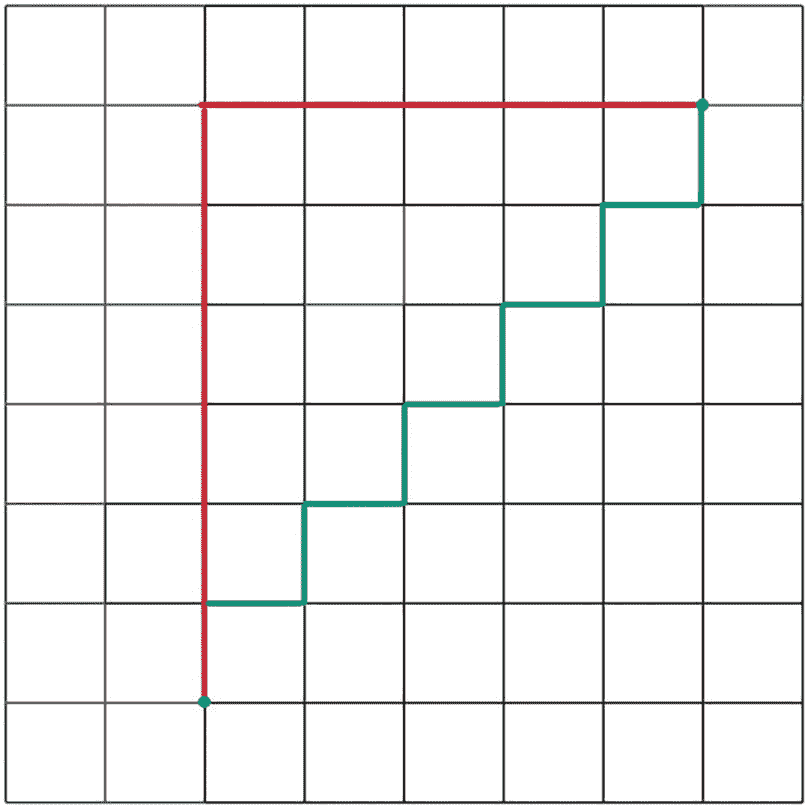

网格显示一条连接两点的红色正交路径和一条由更小的正交路径组成的绿色路径。

图 1-44

2D 曼哈顿距离。红色线和绿色线都展示了具有相同距离值的曼哈顿距离

曼哈顿距离的公式是闵可夫斯基距离，其中 *p* = 1，或者两个向量之间每个值绝对差分的总和。曼哈顿距离通常描述了在特征值描述的范围内可以实际采取的路径。在具有二元/离散特征的 KNN 中，它比更受欢迎的欧几里得距离更受欢迎。然而，请注意，当在更高维度计算时，曼哈顿距离变得不太容易理解，并且随着空间维度的增加，结果距离值显著增加：

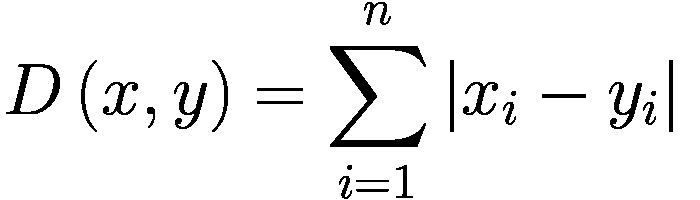

欧几里得距离是 n 维空间中两点之间的最短路径；它是 KNN 中最常用的距离公式。欧几里得距离只是高维空间中勾股定理的扩展（图 1-45）。

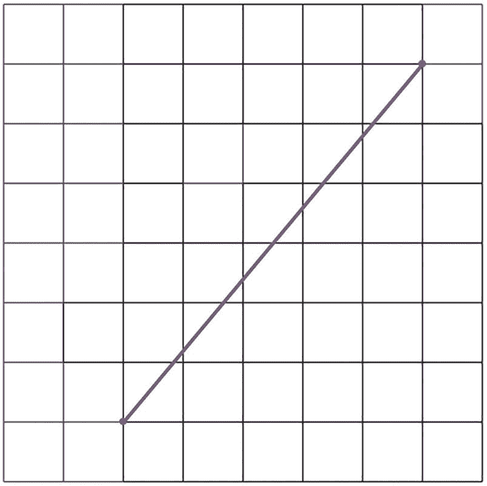

网格显示一条直线，连接位于左下角和右上角的两个点。

图 1-45

2D 欧几里得距离

当闵可夫斯基距离中的 *p* = 2 时，得到欧几里得距离的公式。它也可以被视为在更高维度中寻找斜边的高斯定理。欧几里得距离的一个主要缺点是维度诅咒，如前几节所述：当数据维度增加时，欧几里得距离的意义变得越来越小：

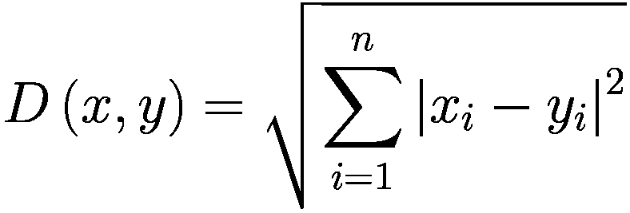

当我们在 Minkowski 距离中增加*p*的值，接近无穷大时，我们得到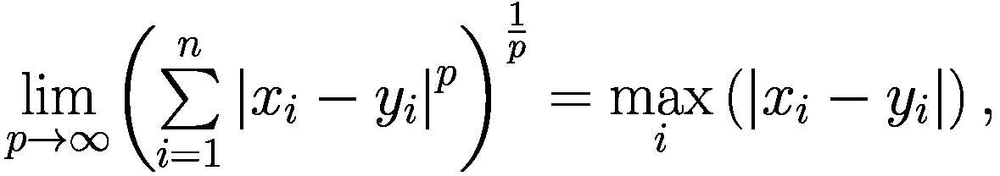 这就变成了 Chebyshev 距离。如前所述，Chebyshev 是单轴上两点之间的最大距离。在二维中，Chebyshev 距离也可以理解为国王棋子从一个点到另一个点所需的步数：

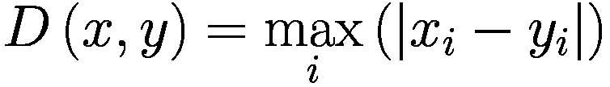

在 KNN 中，Chebyshev 距离的使用很少，因为在各种场景中，它通常被其他距离函数所超越。在 KNN 中，Chebyshev 距离计算两个数据点之间所有特征值之间的最大差异。它提出了一个关键问题，因为两个数据点可能在每个特征上都非常相似，除了一个特征外，属于同一类但在这个特征上显著不同；基于这个单一特征，Chebyshev 距离将输出一个很大的值，这可能导致模型预测错误。

在选择 KNN 时，有一些关键点需要考虑。首先，所有特征必须在同一尺度上。更具体地说，在计算点之间的距离时，一个特征中的某个距离值必须对所有其他特征具有相同的意义。建议在应用 KNN 之前对数据进行归一化或标准化。归一化是指将特征值改变到公共尺度内的过程。标准化是缩放特征的过程，完成两件事：将数据的平均值改变为 0，并确保结果分布具有单位标准差。根据数据，标准化可以用来确保高斯分布，而归一化可以限制数据到一定范围，减少异常值的影响。对于数据集的大小，由于维度诅咒和计算速度，特征数量和样本数量最好都保持较低。

#### 实现和使用

使用 NumPy 从头实现 KNN 涉及两个主要组件，计算距离和选择前 K 个“邻居”，以及通过多数投票进行预测。在写下任何代码之前，始终列出算法中的步骤流程是一个好习惯，如下所示，用于 KNN：

1.  获取训练数据或标记样本；获取测试数据或未标记样本。

1.  使用选定的距离函数计算测试数据点与每个训练数据点之间的距离。

1.  将测试数据点与最近的距离排序到最远的距离，并选择前 K 个值。

1.  进行多数投票以确定最终预测。

1.  对所有测试数据点重复此操作。

我们可以假设训练数据和测试数据都是以 NumPy 数组的形式输入的，形状为`(num_samples, num_features)`，而训练数据的标签是形状为`(num_samples, 1)`的 NumPy 数组。按照前面的步骤，我们可以定义一个函数，用于计算单个测试数据样本与每个训练数据样本之间的距离。

```py
def calculate_distance(train_data, single_test):
distances = []
for single_train in train_data:
single_distance = distance_function(single_train, single_test)
distances.append(single_distance)
return distances
Listing 1-34
The basic definition of function
```

在前一个函数中，我们接受整个训练数据数组和单个测试样本作为输入。然后我们遍历训练数据的每一行，应用一个预定义的距离函数，我们暂时称之为“`distance_function`”，输入为`x`和`y`，并将结果值追加到一个列表中，以供后续使用。一旦我们遍历完整个训练数据，我们只需返回包含距离函数产生的所有值的列表。现在，我们已经完成了之前提到的 KNN 的第一个主要组件；对于第二部分，我们将定义另一个函数，该函数对列表进行排序，选择前 K 个元素，并执行多数投票以确定预测（见列表 1-34）。

```py
from collections import Counter
def knn_predict_single(distances, y_train, k=7):
# Convert distances to series with the index being the index of y_train
distances = pd.Series(distances, index=list(range(len(y_train))))
# Sort values and select first K elements while preserving index
k_neighbors = distances.sort_values()[:k]
# Create Counter object with the lables of each `k_neighbor`
counter = Counter(y_train[k_neighbors.index])
# Most common label in the list by majority voting
prediction = counter.most_common()[0][0]
return prediction
Listing 1-35
Function to predict a single test data sample in KNN
```

结合 KNN 的两个主要组件，前一个函数对单个测试数据样本进行操作。我们首先将`calculate_distance`产生的距离值组织成一个 Pandas 系列，索引为`y_train`的索引，使用`list(range(len(y_train)))`。然后我们按升序排序列表，并选择前 K 个最近的“邻居”，同时保留之前分配的索引。对于每个距离值，我们通过在排序后的系列中使用索引来索引`y_train`，找到其相应的标签。最后，我们使用 Python 库`collections`中的`Counter`对象进行多数投票，决定测试数据样本的最终预测，并将其作为单个值返回（见列表 1-35）。

```py
def knn_pred(X_train, y_train, X_test, distance_function, k):
predictions = np.array([])
# Loop through every test sample
for test in X_test:
distances = calculate_distance(X_train, test, distance_function)
single_pred = knn_predict_single(distances, X_train, y_train, k)
predictions = np.append(predictions, [single_pred])
return predictions
Listing 1-36
KNN function
```

前一个函数本质上是对整个测试数据数组进行循环，并对每个单独的测试数据点应用 KNN。对于每个测试数据点，我们首先使用`calculate_distance`函数检索距离列表，然后使用`knn_predict_single`函数进行预测。之后，我们将单个预测追加到一个数组中，该数组将存储来自测试数据的所有预测。最后，我们返回这个数组（见列表 1-36）。

```py
# p=2, Euclidian Distance
def minkowski_distance(x, y, p=2):
return (np.abs(x - y)**p).sum(axis=1)**(1/p)
Listing 1-37
Minkowski distance
```

对于距离函数，我们将实现具有可调整参数`p`的 Minkowski 距离。然而，这个距离函数可以是任何其他具有输入`x`和`y`的距离函数（见列表 1-37）。

```py
from sklearn import datasets
iris = datasets.load_iris()
# assign X(features) and y(targets)
X = iris.data
y = iris.target
from sklearn.model_selection import train_test_split
X_train, X_test, y_train, y_test = train_test_split(X, y, test_size=0.3, random_state=42)
# predict using knn
predictions = knn_pred(X_train, y_train, X_test, minkowski_distance, k=5)
from sklearn.metrics import accuracy_score
# returns 1.0
accuracy_score(y_test, predictions)
Listing 1-38
Example usage of KNN
```

我们可以在 Iris 数据集上测试我们的 KNN 实现。该数据集旨在根据花的物理特征（花瓣长度、花瓣宽度、萼片长度和萼片宽度）对鸢尾花类型进行分类——Setosa、Versicolour 或 Virginica。我们可以方便地从 scikit-learn 库中加载该数据集，然后使用 `train_test_split` 函数将其分为训练集和测试集。然后我们只需调用 `knn_pred` 函数并输入相应的参数（见列表 1-38）。为了评估我们模型的性能，我们可以使用 scikit-learn 中的准确率评分。当 K 设置为 5 时，我们的模型在数据上表现完美，准确率达到 1.0。

```py
from sklearn.neighbors import KNeighborsClassifier
# create object
neigh = KNeighborsClassifier(n_neighbors=5)
# call fit on training data
neigh.fit(X_train, y_train)
# predict on testing data
sklearn_pred = neigh.predict(X_test)
# returns 1.0
accuracy_score(y_test, sklearn_pred)
Listing 1-39
Scikit-learn implementation of KNN
```

如前所述，scikit-learn 库为 KNN 提供了一个现成的实现：只需创建 `KNeighborsClassifier` 对象，然后在测试数据上调用 `fit` 和 `predict`（见列表 1-39）。我们获得了与自己的实现相同的结果，当 `n_neighbors` 或 `k` 在我们的实现中设置为 5 时，准确率达到 1.0。

注意，没有单一的“方法”来找到最佳的“K”值。大多数情况下，必须进行试验和调整，以找到最佳 K 值，从而获得最佳性能。通常，一种常见的搜索在训练数据和潜在测试数据上表现良好的最佳 K 值的技术被称为肘部方法。肘部方法指出，当 KNN 的性能与不同的 K 值绘制在一起时，测试数据的最佳 K 值位于两个 K 值之间性能急剧增加的位置。请注意，通常肘部方法与交叉验证一起使用，性能是针对验证数据集来衡量的。这种选择方法的一个示例如图 1-46 所示。

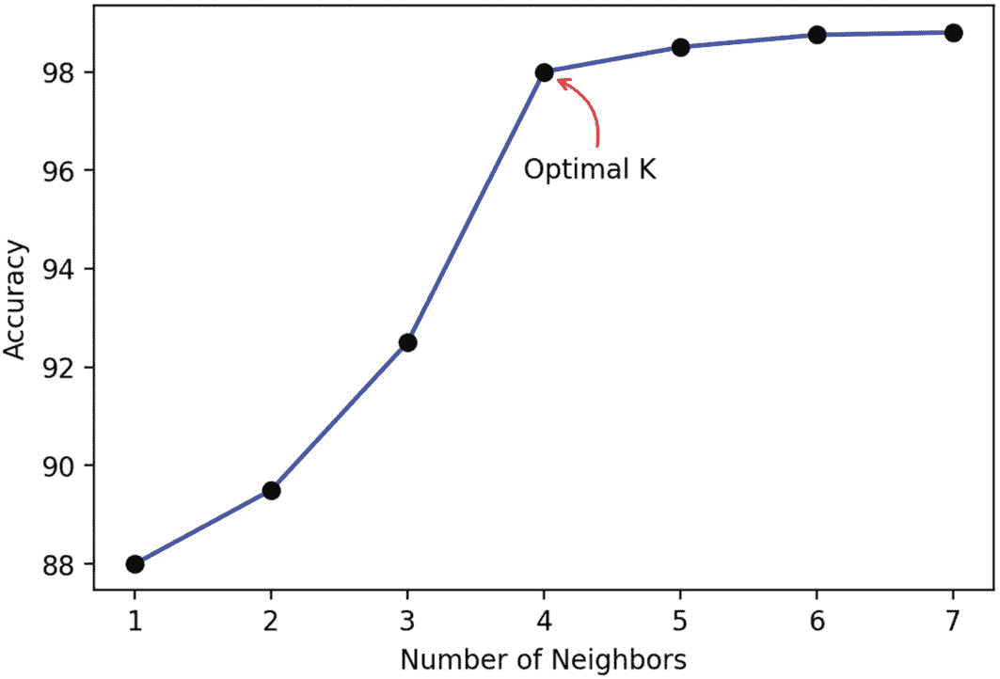

线形图显示了准确率与邻居数量之间的关系。它描绘了一条上升并水平延伸的线。最佳 K 点标记在 (4, 98)。数值为近似值。

图 1-46

KNN 的肘部方法

在前面的任意数据集示例中，最佳 K 值为 4，因为性能在 3 和 4 之间急剧上升。这种方法可以与任何衡量预测性能的指标一起使用，无论目标是最小化还是最大化。

KNN 可能简单易用，但请注意其局限性，例如无法扩展到更大的数据集，以及计算时间较长。在后面的章节中，将介绍一些算法，它们比 KNN 更好地处理这个问题，并且通常表现更好。尽管 KNN 是最简单的机器学习算法之一，但其缺点通常超过了优点，使其对于大多数数据科学家来说仅仅是一个快速且简单的测试算法。

### 线性回归

“线性回归”这个术语对大多数人来说可能很熟悉，因为它是一种在统计学中用来建模变量之间关系的常用技术。最早形式的回归分析，即使用最小二乘法的线性回归，最早由阿德里安-玛丽·勒让德在 1805 年发表，后来卡尔·弗里德里希·高斯在 1809 年再次发表。他们都用它们来预测天体轨道，特别是围绕太阳运行的物体。后来在 1821 年，高斯发表了他在最小二乘理论方面的继续工作；然而，“回归”这个术语直到 19 世纪末由弗朗西斯·高尔顿提出。高尔顿发现，在多代之间，母种子和女儿种子的重量之间存在线性关系。对高尔顿来说，回归只是一个描述生物现象的术语。直到乌德尼·尤尔和卡尔·皮尔逊将这种方法扩展到更一般的统计学观点，回归才被广泛接受。

到今天，线性回归已经发展出许多变体和解决方法，但算法的有用性保持不变。线性回归不仅用于机器学习和数据科学领域，还用于流行病学、金融、经济学等领域。实际上，在呈现连续变量之间关系的任何情况下，线性回归都可以以某种方式建模这种关系。概括来说，线性回归的应用属于基于相关解释特征预测或预测某些响应变量的使用；线性回归还可以用来量化或测量两个变量之间的线性关系，并识别数据集中可能存在冗余或误导性的特征。

#### 理论与直观

线性回归模型描述了一个响应变量或目标变量与一个或多个特征或解释变量之间的关系，这些解释变量可能以线性方式与目标变量相关。具有两个变量（其中一个特征描述目标变量）的线性回归称为简单线性回归。另一方面，将多个特征变量与一个目标变量建模的线性回归被称为多元线性回归。线性回归的目标是找到一个函数，该函数产生“最佳拟合线”，最佳地描述了特征与目标变量之间的关系。有许多方法可以确定“最佳拟合线”，然而，最常见且最成功的方法是通过前面章节中提到的梯度下降法。

让我们从只有一个变量的简单线性回归的基本例子开始：解释变量，即某人脚的大小，以及目标变量，即该人的身高（图 1-47）。在这种情况下，我们的目标是根据某人脚的长度预测其身高。给出了一些数据样本；我们的任务是编写一个函数，该函数产生一条最佳拟合线，以描述两个变量之间的关系。

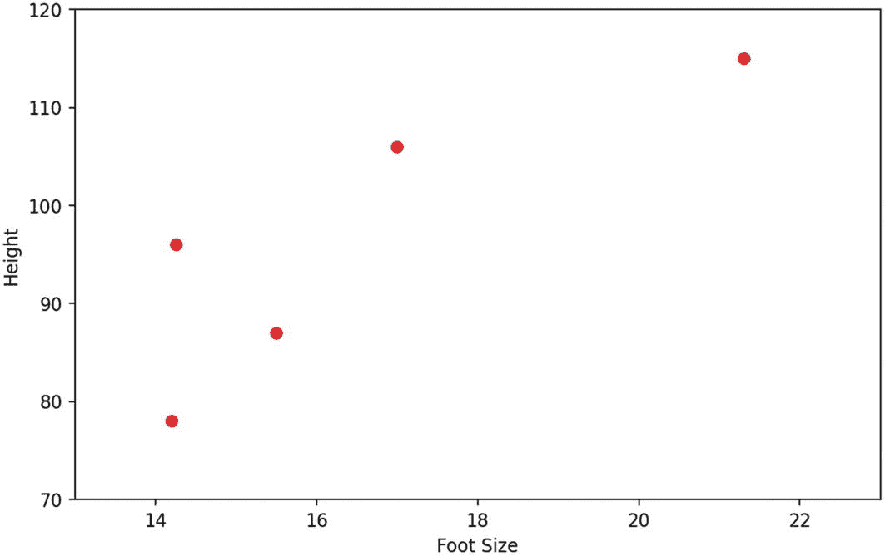

一张图表显示了身高与脚长之间的关系，并描绘了点（14.2, 78）、（15.7, 88）、（14, 97）、（17, 106）和（21.5, 115）。数值为近似值。

图 1-47

基于脚长预测身高的示例数据

在观察数据后，我们可能假设一个函数的估计，该函数可能可以模拟两个变量之间的关系。在二维图中，直线的通用方程以斜率截距形式给出：

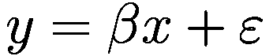

其中 *β* 是斜率，*ε* 是 y 轴截距。在机器学习和数据科学领域，我们将斜率称为模型的权重，y 轴截距称为偏差。在估计一条可能适合数据的直线方程后，例如 *y* = 5*x* + 3，我们希望通过某种方法计算我们的估计性能。用于优化线性回归的最常见指标是均方误差（MSE）。误差计算为真实数据样本的 y 值（在我们的例子中是身高）与真实 x 值处的直线 y 值（模型预测）之间的差值的平方，然后对每个数据点求和。这种误差计算方法也称为残差平方和。

在前面的图中，蓝色线表示模型的估计，表示为输入函数。前面图中的绿色线表示每个点与预测值之间的误差。将每个差异相加，我们就可以得到最终的误差。平方该值将给出残差平方和（图 1-48）。在梯度下降的过程中，MSE 被称为模型的成本函数或损失函数。再次强调，MSE 的公式如下：

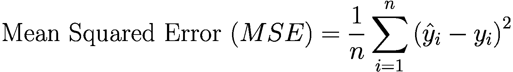

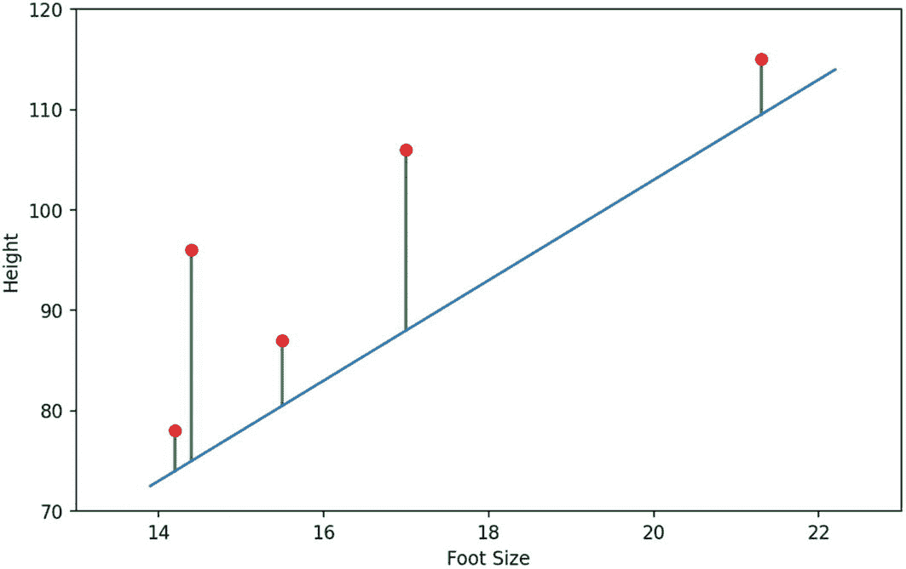

一张图表显示了身高与脚长之间的关系，并描绘了一条从左下角到右上角上升的直线，以及从顶部五个实心点出发的直线。

图 1-48

估计直线与数据点之间的 MSE 误差计算

我们的目标是通过找到一个更精确的线性函数来表示我们的数据，从而最小化这个函数，这反过来又提高了我们“模型”的性能。我们可能通过暴力搜索找到这条线，根据误差调整权重和偏差的值；然而，当样本数量或特征数量增加时，这种方法很快就会失败。这就是梯度下降出现的地方。梯度下降的概念与暴力搜索类似，都是根据前一个值产生的误差来调整权重和偏差的值，但梯度下降是以一种更复杂的方式根据公式来进行的。

假设我们绘制不同权重和偏差值与损失函数值的关系图。我们就能可视化权重和偏差的变化如何影响损失函数的值。这种可视化将在三维空间中进行。我们可以考虑通过这个空间的一个截面（比如说将偏差固定为零）来可视化一个更简单的二维情况，只显示权重值，如图 1-49 所示。

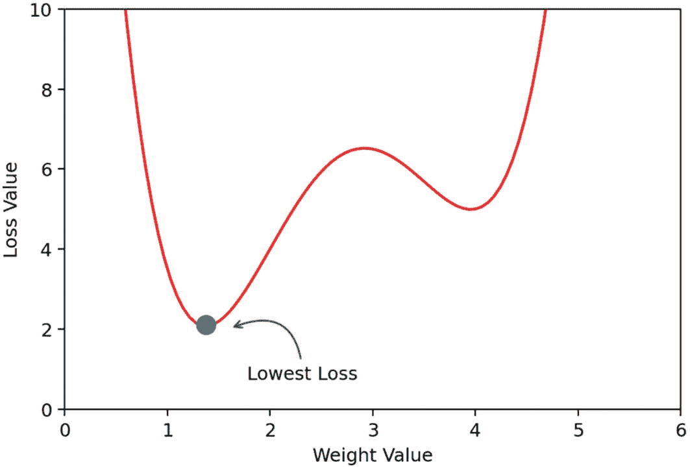

一条线形图展示了损失值与权重值的关系，并描绘了一个具有一个顶峰和两个谷底的曲线，其中最小的一个被标记为最低损失。

图 1-49

损失值与权重值的关系图

最小的损失值位于函数的最低 y 值处，或者当函数的导数为 0 时。有人可能会认为将函数的导数设置为 0 会给我们提供最优的权重值。这对于像 MSE 这样的凸函数是有效的；然而，对于之前展示的示例损失函数，这就不适用了，因为函数的导数为 0 的点有多个。正如之前所介绍的，机器学习中寻找函数全局最小值的一种常见技术是梯度下降。梯度下降旨在使用梯度，或其偏导数，采取适当的步骤下降到全局最小值。梯度下降小心翼翼地向全局最小值迈进，并且通过合适的超参数，它能够“提升”自己通过局部最小值达到期望的全局最小值。这些技术和参数将在第三章中讨论。回顾“优化和梯度下降”部分，其中展示了梯度下降如何寻找函数全局最小值的一个简单例子。线性回归对梯度下降的采用涉及一些额外的步骤，因为我们还需要优化偏差，并且损失函数 MSE 的推导并不直观。注意，对于书中后面的章节，理解以下推导不是必要的。同样的，这也适用于逻辑回归的梯度下降版本。

如本章前面所述，算法使用成本函数的负梯度来确定下降方向，学习率 *α* 决定了算法将迈出多大的步长。然而，与本章前面的方程不同，我们有一个偏差项 *ε*。因此，我们不是将成本函数的导数乘以 *α*，而是将其与权重关于 *α* 的偏导数相乘，其中 *c* 是我们的成本函数，MSE。通过前面的方程获得的值将加到当前权重上，从而成为下一次迭代的新的权重。注意，在 MSE 中，我们的  项是由直线 *y* = *βx* + *ε* 模型的模型预测，并且在微分过程中将替换 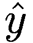：

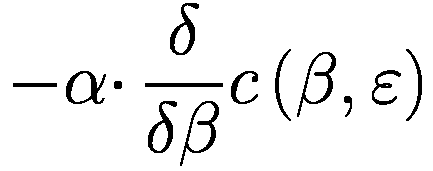

我们将在梯度下降结束时只对权重进行微分并计算偏差项，在梯度下降过程中，偏差将被设置为 0。让我们对 *β* 关于成本函数 *c* 进行微分。

我们有方程

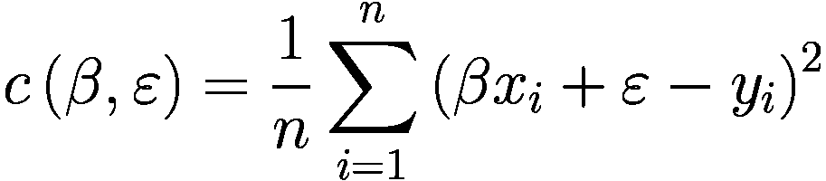

让我们把括号内的表达式视为一个单独的函数，并作为复合函数进行微分，其中 *f*(*β*, *ε*)[*i*] = *βx*[*i*] + *ε* - *y*[*i*]：

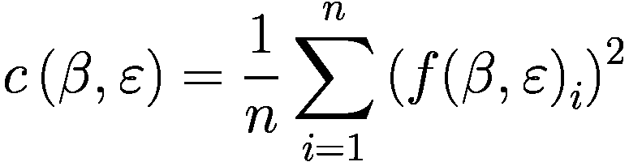

让我们应用链式法则：

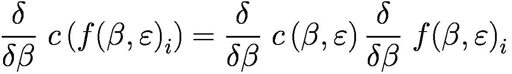

让我们计算每个函数的导数：

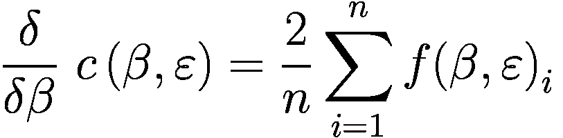

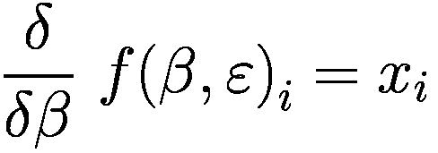

我们最终的答案是

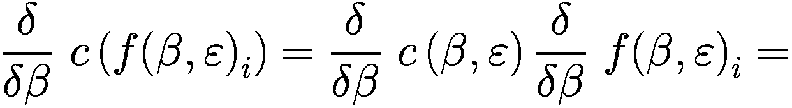

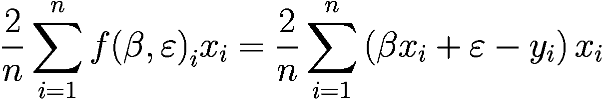

然后，我们可以将这个值代入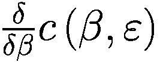并乘以-*α*来更新权重。

最后，我们不再对偏差进行微分，而是通过将偏差设置为在训练权重后，我们的预测值与真实值之间的平均差来估计这个值：

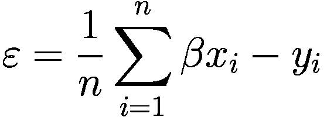

#### 实现和使用

沿着前面提供的示例数据集和公式继续，我们可以写下以下代码（列表 1-40）。

```py
# define our example dataset
foot_size = np.array([14.2, 21.3, 17, 15.5, 14.4])
height = np.array([78, 115, 106, 87, 96])
# foot_size is `x` while height is `y_true`
# MSE cost function
def mse_loss_func(y_true, y_pred):
return np.sum((y_pred-y_true)**2)/len(y_pred)
# prediction function, namely the equation for the line, y=beta*x+epsilon
def predict(beta, epsilon, x):
return beta*x + epsilon
# calculates the partial weight derivative
def weight_deriv(beta, epsilon, x, y_true):
error = predict(beta, epsilon, x) - y_true
return np.mean(2 * error * x)
# calculates the bias term
def calculate_bias(beta, x, y_true):
return np.mean(y_true - beta * x)
Listing 1-40
Implementing Linear Regression
```

回顾“优化和梯度下降”部分中介绍的梯度下降方程，以及本节前面提到的内容，我们可以写下以下代码（列表 1-41）。

```py
def gradient_descent(beta, epsilon, x, y_true, alpha):
weight_derivative = weight_deriv(beta, epsilon, x, y_true)
new_beta = -alpha * weight_derivative
return new_beta
Listing 1-41
Gradient descent equation
```

最后，我们通过梯度下降过程迭代，根据该函数更新权重。使用之前定义的示例数据集，我们可以使用 MSE 计算成本，以查看每次迭代的改进程度（列表 1-42）。

```py
epsilon = 0
beta = 1
# usually a value between 0.001 and 0.0001 works well
alpha = 0.0001
# Can be adjusted to affect performance, the more #iterations usually means better but not always
iterations = 200
for i in range(1, iterations + 1):
beta += gradient_descent(beta, epsilon, foot_size, height, alpha)
# evaluate every 20 iterations
if i%20 == 0:
pred = predict(beta, epsilon, foot_size)
mse = mse_loss_func(height, pred)
print(f"Error at iteration {i}: {mse}")
# Calculate the bias
epsilon = calculate_bias(beta, foot_size, height)
final_pred = predict(beta, epsilon, foot_size)
final_mse = mse_loss_func(height, final_pred)
print(f"Final Prediction with bias has error: {final_mse}")
Listing 1-42
Linear Regression with gradient descent
```

β或权重值可以随机初始化或设置为某个值（s）以产生确定性结果。在这种情况下，我们将权重设置为 1，最终 MSE 约为 46。将我们的结果以“最佳拟合线”的形式绘制出来，我们看到我们的线比初始猜测更好地拟合了数据的趋势（图 1-50）。

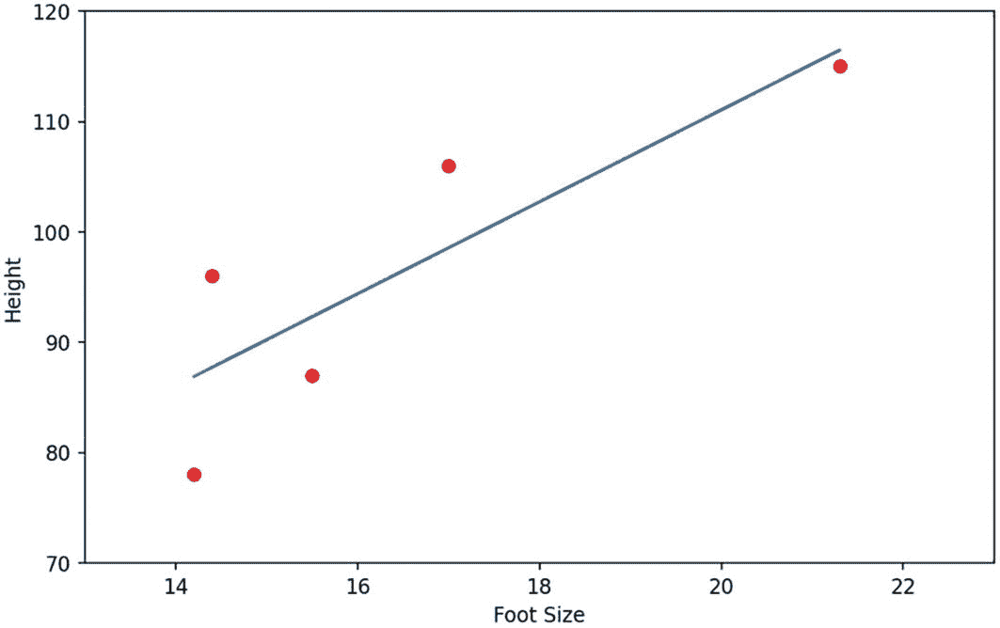

一个图表将身高与脚长进行对比，并描绘出从左到右逐渐上升、下降然后再次上升的实心点。

图 1-50

我们自己实现的线性回归产生的最佳拟合线

scikit-learn 的线性回归实现简单易用，由于计算权重和偏差的方法略有不同，scikit-learn 的线性回归将获得比我们自己的实现略好的结果。

```py
from sklearn.linear_model import LinearRegression
lr = LinearRegression()
lr.fit(foot_size.reshape(-1, 1), height)
# get the weight and bias
beta = lr.coef_
epsilon = lr.intercept_
# Predict function
lr_pred = lr.predict(foot_size.reshape(-1, 1))
Listing 1-43
Scikit-learn’s implementation of Linear Regression
```

注意，我们在`foot_size`上使用了`reshape(-1, 1)`，因为在 scikit-learn 的实现中，当我们只有一个特征时（在我们的例子中），数据必须以`(num_samples, 1)`的形状存在，而`reshape(-1, 1)`正是这样做的（列表 1-43）。使用带有特征和标签的`fit`函数执行训练过程，使用带有特征的`predict`函数输出预测结果。

我们自己的实现远非完美。在损失函数是凸函数（如均方误差损失函数）的情况下，使用普通最小二乘法（OLS）可能会产生稍微更好的结果。本质上，OLS 通过将成本函数的导数设置为 0 来一步获得最优结果。这确保了从计算中获得的参数是损失景观的全局最小值处的值。另一个可以实施改进的是，我们可以尝试对偏差和权重一起求导，并以相同的方式更新它；这可能会产生更好的结果。

#### 简单线性回归的其他变体

如前所述，多元线性回归指的是具有多个特征或解释变量的回归。与特征的单个值不同，我们可以将它们视为长度为特征数量的向量，整个训练数据则是一个形状为*样本数量* × *特征数量*的矩阵。接下来，而不是单个权重值，它将是一个长度为特征数量的向量（它被视为列矩阵，以便与*X*进行点积）。因此，在这种情况下，维度大于 2 的直线或超平面的方程应该是

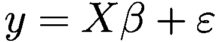

其中*X*是特征矩阵，*β*是权重向量。如果我们以矩阵的形式求导，而不是逐项求导，我们最终获得的导数变为

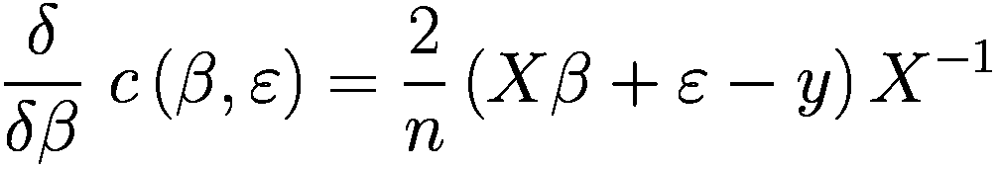

为了实现多元线性回归，只需对之前编写的代码进行一些小的修改。

```py
# MSE cost function
def mse_loss_func(y_true, y_pred):
return np.sum((y_pred-y_true)**2)/len(y_pred)
# prediction function, namely the equation for the line, y=beta*x+epsilon
def predict(beta, epsilon, x):
return np.dot(x, beta) + epsilon
# calculates the partial weight derivative
def weight_deriv(beta, epsilon, x, y_true):
error = predict(beta, epsilon, x) - y_true
return np.mean(2 * np.dot(x.T, error))
# calculates the bias term
def calculate_bias(beta, x, y_true):
return np.mean(y_true - np.dot(x, beta))
Listing 1-44
Modified gradient descent functions for Multiple Linear Regression
```

注意，所有的乘号都已被改为`np.dot`，以反映矩阵之间的点积（列表 1-44）。在`weight_deriv`函数中，`x.T`转置矩阵`x`。同样，如果我们仍然使用之前的示例数据集，则梯度下降过程需要调整，因为我们需要将特征重塑为向量和矩阵的正确形状（列表 1-45）。

```py
epsilon = 0
beta = np.array([1.]).reshape(1, -1)
# usually a value between 0.001 and 0.00001 works well
alpha = 0.00001
iterations = 200
for i in range(1, iterations + 1):
beta += gradient_descent(beta, epsilon, foot_size.reshape(-1, 1), height, alpha)
# evaluate every 20 iterations
if i%20 == 0:
pred = predict(beta, epsilon, foot_size.reshape(-1, 1))
mse = mse_loss_func(height, pred)
print(f"{epsilon}, {beta}")
print(f"Error at iteration {i}: {mse}")
# Calculate the bias
epsilon = calculate_bias(beta, foot_size.reshape(-1, 1), height)
final_pred = predict(beta, epsilon, foot_size.reshape(-1, 1))
final_mse = mse_loss_func(height, final_pred.flatten())
print(f"Final Prediction with bias has error: {final_mse}")
Listing 1-45
Modified gradient descent process for Multiple Linear Regression
```

当在`reshape`中传入-1 时，这仅仅意味着设置了其他维度，-1 维度必须满足数组的原始形状。函数`flatten`正如其名，将数组展平为单维向量。请注意，scikit-learn 的实现自动兼容多元线性回归。除非特征数量超过一个，否则不需要`reshape(-1, 1)`。

在现实生活中的机器学习应用中，很少会有一个单一变量能够与目标变量形成完美的线性关系。大多数情况下，有成百上千个特征，因此多重线性回归成为了许多数据科学家的默认选择。

线性回归的其他变体包括 LASSO（最小绝对收缩和选择算子）、岭回归和弹性网络回归，它们引入了一个正则化项，可以防止训练数据上的过拟合，导致测试数据性能不佳。

岭回归在均方误差成本函数中引入了一个 L2 正则化项：

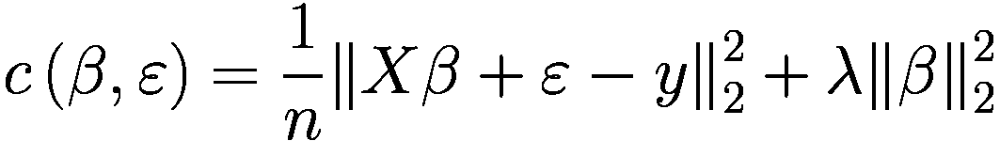

这些项作为惩罚，使得如果模型的权重变得过大，成本函数的值将根据 lambda 参数增加。岭回归通过降低模型复杂度来减少过拟合。

另一方面，LASSO 回归在均方误差成本函数中引入了一个 L1 正则化项：


L1 正则化可能导致系数为 0，这取决于 lambda 的值，从而减少过拟合，并在某些系数为 0 时实现特征选择。

弹性网络回归同时使用 L1 和 L2 正则化，实现了 LASSO 和岭回归的双重目标，进一步正则化模型并防止过拟合：

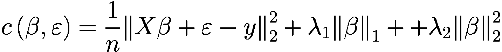

scikit-learn 实现的所有三种回归都可以像线性回归一样使用，同时在对象的初始化时指定 lambda 参数（列表 1-46）。

```py
from sklearn.linear_models import Ridge, Lasso, ElasticNet
# alpha is the lambda value
ridge = Ridge(alpha=1.0)
lasso = Lasso(alpha=1.0)
# alpha is the penalty term for both while the l1_ratio controls how much penalty is weighted toward l1, the closer to 1 the higher weight to l1
elr = ElasticNet(alpha=1.0, l1_ratio=0.5)
# Fit and predict as normal where X and y are training features and training targets, respectively
# Replace X and y with your own data
# ridge.fit(X, y)
# lasso.fit(X, y)
# elr.fit(X, y)
# ridge.predict(X_test)
# lasso.predict(X_test)
# elr.predict(X_test)
Listing 1-46
Regularization Linear Regressions in scikit-learn
```

最后，线性回归的另一个重要变体是逻辑回归。简单来说，逻辑回归改变了线性回归的成本函数，将输出限制在 1 和 0 之间，以产生分类任务的二元预测。逻辑回归将在下一节中更详细地介绍。

线性回归作为成百上千个数据科学家的入门算法，有其原因。不仅梯度下降在许多机器学习算法中被广泛使用，而且根据特征建模数据趋势至今仍然是机器学习的关键用途之一，其应用包括预测、商业、医学等多个领域。

### 逻辑回归

对数逻辑函数首次出现在皮埃尔·弗朗索瓦·弗赫尔斯特（Pierre Francois Verhulst）于 1838 年发表的出版物《数学与物理通信》（“Correspondance mathmematique et physique”）中。然后在 1845 年，他发表了更详细的对数逻辑函数版本。然而，这种函数的第一个实际应用直到 1943 年才显现出来，当时威尔逊（Wilson）和沃彻斯特（Worcester）在生物测定中使用了对数逻辑函数。在接下来的几年里，该函数取得了各种进展，但原始的对数逻辑函数用于逻辑回归。逻辑回归模型不仅在其与生物学相关的领域中得到应用，而且在社会科学领域也得到了广泛应用。

在许多变体中，逻辑回归的一般目标保持不变：基于解释变量或特征进行分类。它利用线性回归的样本原理。

#### 理论与直观

对数逻辑函数是一个广义术语，指的是具有各种可调整参数的函数。然而，逻辑回归只使用一组参数，将函数转变为所谓的 S 型函数：

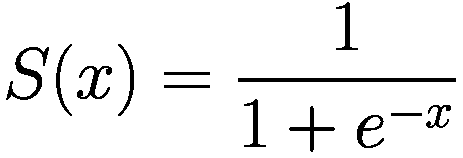

S 型函数众所周知具有“S”形曲线，在*y* = 1 和*y* = 0 处有两个水平渐近线，如图 1-51 所示。换句话说，输入到函数中的任何值都将被“挤压”在 1 和 0 之间。

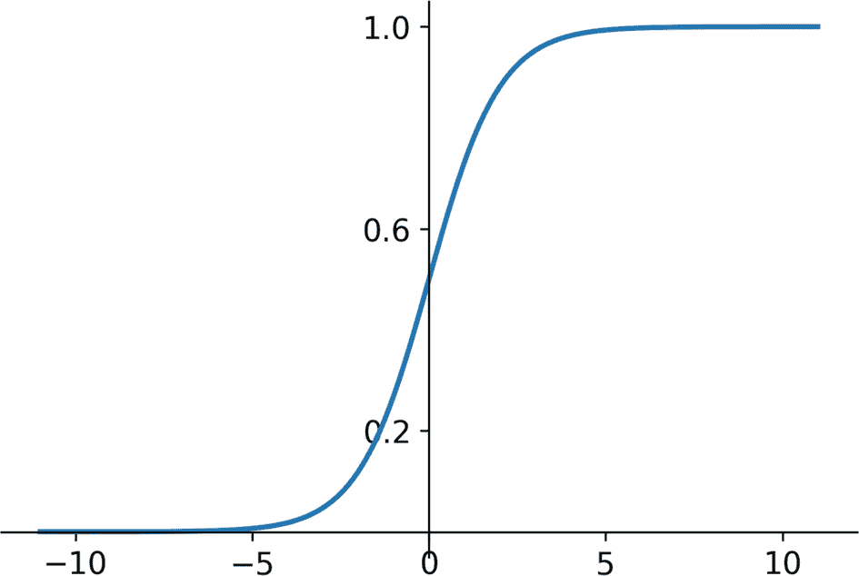

曲线图表示 S 曲线，与垂直轴相交，左端位于第二象限，右端位于第一象限，且与水平轴平行。

图 1-51

S 型函数

尽管存在其他变体的 S 型函数，它们在不同的值上限制了输出，例如双曲正切函数，其中输出值被限制在-1 和 1 之间，但在逻辑回归的二元分类中，使用的是 S 型函数。

逻辑回归遵循与线性回归相同的原理，找到一个方程，该方程在数据上绘制出“最佳拟合线”。在这种情况下，“最佳拟合线”将呈现 S 型函数的形状，而标签是位于*y* = 0 或*y* = 1 的二进制标签。

二元分类的目标是预测输出为 1（正类）或 0（负类）。一个例子可能是根据提供的数值数据预测动物是否为猫。逻辑回归的预测将通过 sigmoid 函数输入并输出介于 1 和 0 之间的概率，这表示模型对某些数据样本属于某一类的置信度（见图 1-52）。然后可以通过设置阈值将概率转换为二元输出。通常，选择是 0.5；然而，如果阈值选择不当，模型的性能可能会变化。在“指标和评估”部分查看 ROC-AUC 以获取更多详细信息。

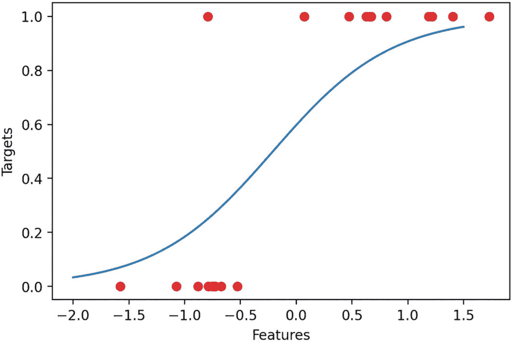

一条线图，散点图显示了目标值与特征之间的关系。图中有上升的曲线，实心点水平沿垂直值 1.0 和 0.0 绘制。数值是近似的。

图 1-52

逻辑回归的“最佳拟合线”

虽然逻辑回归的梯度下降过程与线性回归相同，但损失函数会有所不同。MSE 计算回归情况中两个值之间的差异。虽然它可能在分类情况下学习，但还有更适合问题的更好的损失函数。

从前面的 sigmoid 函数中回忆起，*x*项将是模型通过线性函数*y* = *Xβ* + *ε*输出的预测，因此逻辑回归的预测函数变为

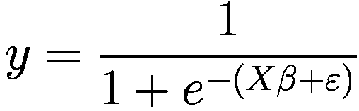

该函数的输出是介于 0 到 1 之间的概率值，而我们的标签是离散的二进制值。与 MSE 不同，我们的损失函数将是 log 损失，有时也称为二元交叉熵（BCE）：

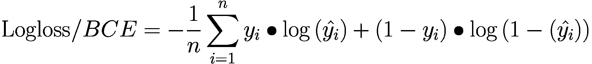

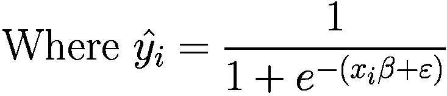

注意，在前面的 log 损失中，*x*变量或特征是单个值，而不是 sigmoid 函数中写成的矩阵。概率表示预测为 1 的可能性；反之，1 - 概率将表示预测为 0 的可能性。根据标签，损失函数计算模型预测对每个样本的负对数似然。然后这些值的平均值是最终成本。

为了最小化这个成本函数，我们采取与线性回归完全相同的方法，即使用梯度下降。与线性回归不同，在梯度下降后不能计算偏差项。因此，我们将权重和偏差一起微分，并以相同的方式更新它们。现在我们已经熟悉了梯度下降，我们将直接进入多重逻辑回归，或者说是具有多个特征的训练数据的逻辑回归。作为提醒，特征 *X* 将以矩阵形式存在，其形状如多重线性回归中提到的样本数量 × 特征数量；真实值或标签将是一个长度为样本数量的向量；权重或 *β* 将是一个长度为特征数量的向量；最后，我们不会包括损失函数中的求和部分，因为它只是结果的平均值，不会影响微分。

首先对权重进行微分，我们有

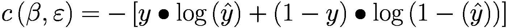

其中

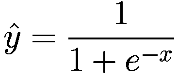

我们将这个函数称为 *s*(*β*, *ε*) 用于 sigmoid 函数，其中 *x* = *Xβ* + *ε*。

这我们将称之为预测用的 *p*(*β*, *ε*)。使用链式法则，成本函数的导数变为

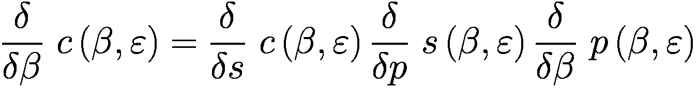

让我们计算每个函数的导数：

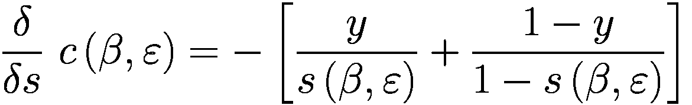

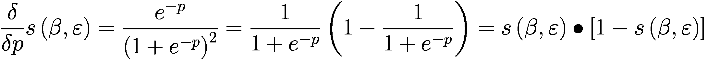

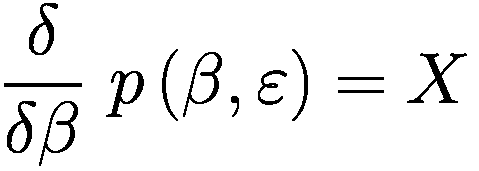

让我们将导数代入回去：

![$$ \frac{\delta }{\delta \beta}\ c\left(\beta, \varepsilon \right)=-\left[\frac{y}{s\left(\beta, \varepsilon \right)}+\frac{1-y}{1-s\left(\beta, \varepsilon \right)}\right]\bullet s\left(\beta, \varepsilon \right)\bullet \left[1-s\left(\beta, \varepsilon \right)\right]\bullet X $$](img/525591_1_En_1_Chapter/525591_1_En_1_Chapter_TeX_Equar.png)

这里是我们的最终导数：

![$$ -\left[s\left(\beta, \varepsilon \right)-y\right]\bullet X=-\left[\frac{1}{1+{e}^{-\left( X\beta +\varepsilon \right)}}-y\right]\bullet X $$](img/525591_1_En_1_Chapter/525591_1_En_1_Chapter_TeX_Equas.png)

这里是偏差项的微分：


![$$ \frac{\delta }{\delta s}\ c\left(\beta, \varepsilon \right)=-\left[\frac{y}{s\left(\beta, \varepsilon \right)}+\frac{1-y}{1-s\left(\beta, \varepsilon \right)}\right] $$](img/525591_1_En_1_Chapter/525591_1_En_1_Chapter_TeX_Equau.png)

![$$ \frac{\delta }{\delta p}s\left(\beta, \varepsilon \right)=\frac{e^{-p}}{{\left(1+{e}^{-p}\right)}²}=\frac{1}{1+{e}^{-p}}\left(1-\frac{1}{1+{e}^{-p}}\right)=s\left(\beta, \varepsilon \right)\bullet \left[1-s\left(\beta, \varepsilon \right)\right] $$](img/525591_1_En_1_Chapter/525591_1_En_1_Chapter_TeX_Equav.png)

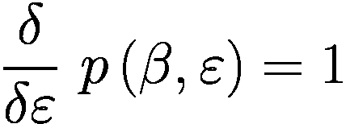

![$$ \frac{\delta }{\delta \varepsilon}c\left(\beta, \varepsilon \right)=-\left[\frac{y}{s\left(\beta, \varepsilon \right)}+\frac{1-y}{1-s\left(\beta, \varepsilon \right)}\right]\bullet s\left(\beta, \varepsilon \right)\bullet \left[1-s\left(\beta, \varepsilon \right)\right]\bullet 1 $$](img/525591_1_En_1_Chapter/525591_1_En_1_Chapter_TeX_Equax.png)

偏差的导数变为

![$$ -\left[s\left(\beta, \varepsilon \right)-y\right]\bullet 1=-\left[\frac{1}{1+{e}^{-\left( X\beta +\varepsilon \right)}}-y\right] $$](img/525591_1_En_1_Chapter/525591_1_En_1_Chapter_TeX_Equay.png)

我们可以根据梯度下降的方程更新权重和偏差：

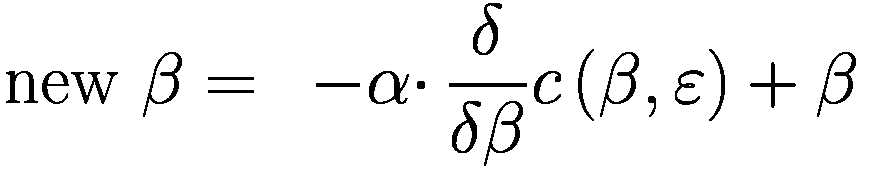

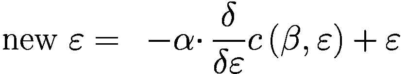

#### 实现和使用

逻辑回归的代码结构与线性回归非常相似，只是成本函数和导数根据前面显示的方程进行了相应的修改（列表 1-47）。

```py
# for log loss, we will be using the sklearn implementation
from sklearn.metrics import log_loss
# the sigmoid function
def sigmoid(x):
return 1 / (1 + np.exp(-x))
# logloss/BCE cost function
def bce_loss_func(y_true, y_pred):
return log_loss(y_true, y_pred)
# prediction function, namely the equation for the line, y=sigmoid(beta*x+epsilon)
def predict(beta, epsilon, x):
linear_pred = np.dot(x, beta) + epsilon
return sigmoid(linear_pred)
# calculates the partial weight derivative
def weight_deriv(beta, epsilon, x, y_true):
error = predict(beta, epsilon, x) - y_true
return np.mean(np.dot(x.T, error))
# calculates the partial bias derivative
def bias_deriv(beta, epsilon, x, y_true):
error = predict(beta, epsilon, x) - y_true
return np.mean(np.sum(error))
Listing 1-47
Functions for Logistic Regression
```

梯度下降过程与线性回归非常相似，只是我们还更新了偏差（列表 1-48）。

```py
def gradient_descent(beta, epsilon, x, y_true, alpha):
# Update weight
weight_derivative = weight_deriv(beta, epsilon, x, y_true)
new_beta = beta - alpha * weight_derivative
#Update bias
bias_derivative = bias_deriv(beta, epsilon, x, y_true)
new_epsilon = epsilon - alpha * bias_derivative
return new_beta, new_epsilon
Listing 1-48
Logistic Regression gradient descent
```

将所有内容结合起来，Logistic 回归的实现如下所示。我们可以使用 scikit-learn 的函数创建一个具有单个特征和 20 个样本的分类示例数据集（列表 1-49）。

```py
from sklearn.datasets import make_classification
X, y = make_classification(n_samples = 20, n_features = 1, n_informative = 1, n_redundant = 0, flip_y=0.05, n_clusters_per_class=1)
epsilon = 0
beta = 1
# usually a value between 0.001 and 0.0001 works well
alpha = 0.0001
iterations = 200
for i in range(1, iterations + 1):
beta, epsilon = gradient_descent(beta, epsilon, X, y, alpha)
# evaluate every 20 iterations
if i%20 == 0:
pred = predict(beta, epsilon, X)
bce = bce_loss_func(y, pred.flatten())
print(f"Error at iteration {i}: {bce}")
final_pred = predict(beta, epsilon, X)
final_bce = bce_loss_func(y, final_pred.flatten())
print(f"Final Prediction has error: {final_bce}")
Listing 1-49
Implementation of Logistic Regression
```

由于实现上的某些差异，scikit-learn 的逻辑回归比我们的结果更好。使用方法很简单，只需实例化对象并调用 fit（列表 1-50）。在此处需要注意的一点是，在我们的实现中，`predict` 函数从 sigmoid 函数返回原始概率，而 scikit-learn 的 `predict` 函数返回二进制标签。要获取概率，我们需要调用 `predict_proba`。

```py
from sklearn.linear_model import LogisticRegression
lr = LogisticRegression()
lr.fit(X.reshape(-1, 1), y)
# Retreives the weight and bias
w = lr.coef_
b = lr.intercept_
#Returns probability
pred_prob = lr.predict_proba(X)
#Returns binary labels
pred_binary = lr.predict(X)
Listing 1-50
Scikit-learn Logistic Regression
```

#### 逻辑回归的其他变体

L1 和 L2 正则化都可以应用于逻辑回归，并执行与正则化线性回归相同的功能，以防止过拟合。Scikit-learn 支持 L1、L2 和弹性网络正则化。它使用一个名为 C 的参数，该参数控制逆正则化强度，即 *C* = 1/*λ*，其中 *λ* 是 L1 和 L2 正则化中的超参数。可以通过 `penalty` 参数指定具体的正则化类型（列表 1-51）。

```py
regularization_lr = LogisticRegression(penalty="L1", C=0.5)
# Penalty can be either 'L1', 'L2', or 'elasticnet' #or 'none'
Listing 1-51
Scikit-learn’s regularization Logistic Regression
```

另一个重要的变体称为多项式逻辑回归。通常，二项式或我们一直在使用的逻辑回归概念处理包含两个类别的数据。然而，在多项式逻辑回归中，标签以“多类形式”给出，其中类别超过两个。为了说明，模型可能需要预测十种不同的动物类型，而不是在猫和狗之间进行预测。

多类分类中的标签以样本数量×类别数量的形式给出。接下来，权重以特征数量×类别数量的矩阵形式存在。通常，我们在将权重和偏差插入到 *y* = *Xβ* + *ε* 后使用 sigmoid 函数。然而，由于多类分类的性质，输出的不是长度为样本数量的向量，而是一个形状为样本数量×类别的矩阵。因此，sigmoid 函数不适用。相反，使用 softmax 函数。Softmax 函数输出预测矩阵，其中每个类别都包含其自身的概率，最终类别是概率最高的类别：

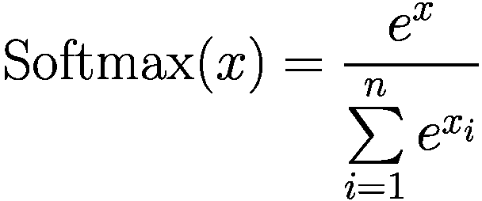

在 scikit-learn 中，当实例化对象时，多项式逻辑回归通过参数`multi_class="multinomial"`定义（列表 1-52）。

```py
regularization_lr = LogisticRegression(penalty="L1", C=0.5)
Listing 1-52
Scikit-learn regularization LR
```

线性回归和逻辑回归与更复杂的深度学习方法相比，都有明显的缺点，这些缺点超过了它们自身的价值。线性回归假设特征和标签之间存在线性关系，而逻辑回归假设特征通过对数几率与目标相关，这为许多现实世界的数据集设定了一个主要边界，因为其中大部分不能仅用线性或对数关系来建模。特别是逻辑回归，线性可分的数据在现实世界场景中很少见。稍后，我们将探讨一些新的经典机器学习算法，这些算法引入了全新的概念，以解决回归方法的一些缺点。

### 决策树

决策树的概念在 20 世纪 60 年代出现在心理学领域，用于模拟人类学习概念，以可视化的方式呈现由一个提示引起的潜在情况的可能结果。大约在那个时期，人们发现了决策树在编程和数学中的有用性。1959 年，威廉·贝尔森发表了一篇能够从数学上发展“决策树”概念的论文。1977 年，伯克利和斯坦福大学的几位教授开发了一种称为分类和回归树（CART）的算法，正如其名，它由分类树和回归树组成。时至今日，CART 仍然作为数据分析的一个重要算法。在机器学习领域，决策树是解决现实世界数据科学问题中最受欢迎的算法之一。

#### 理论与直觉

决策树是一种工具，它以可视化的方式呈现观察结果的模型。它由节点和分支组成，这些节点和分支从根节点开始。考虑以下一系列选择的例子。第一个问题“硬币是什么颜色？”被称为树的根节点。每个问题的可能结果都由从根节点分支出来的节点表示。想象一下抛硬币。有两种可能的结果，正面或反面。根据“银色”这个问题的结果，我们可以通过再问另一个问题来继续分割过程：“硬币的大小是多少？”对于不是根节点的问题，它们被认为是父节点。一旦我们回答了所有可能的问题并创建了每个节点对应的所有可能结果，最终的节点被称为叶节点（图 1-53）。

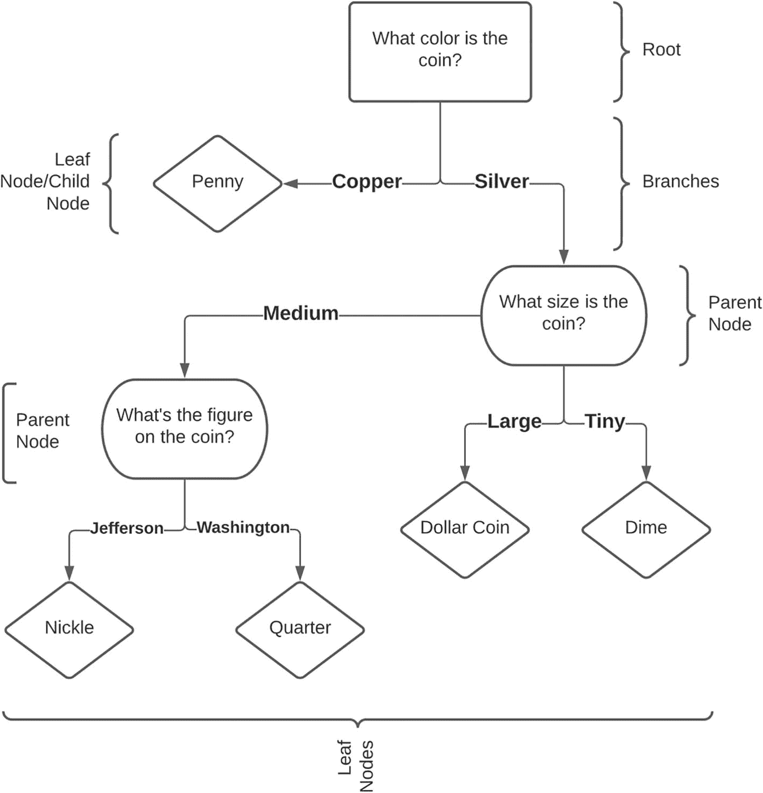

决策树展示了根节点、分支、父节点和叶节点，以确定硬币是便士、镍币、四分之一硬币、美元硬币还是一角硬币。

图 1-53

决策树示例

在某种意义上，决策树可以根据其属性存储和组织数据。决策树机器学习概念利用这种直觉根据特征的模式对数据进行分类或分类。通过根据关联特征分割样本，决策树可以训练学习数据中的不同模式。使用这种方法，决策树可以轻松处理高维数据，因为它们的处理方法与 KNN 和回归方法大不相同。决策树相对于回归方法的一个主要优点是它们如前所述的可互操作性。在可视化高维数据的梯度下降过程可能会很困难，但对于决策树来说则不然。

在特征和目标之间，决策树寻求最佳“问题”的顺序，以分割类似于目标分配的数据。以泰坦尼克号数据集为例。它包含有关泰坦尼克号旅客的特征，例如他们的年龄、性别、船舱、船票等。目标是根据给定的属性预测某人是否幸存。决策树将数据分割如下；该过程在图 1-54 中演示：

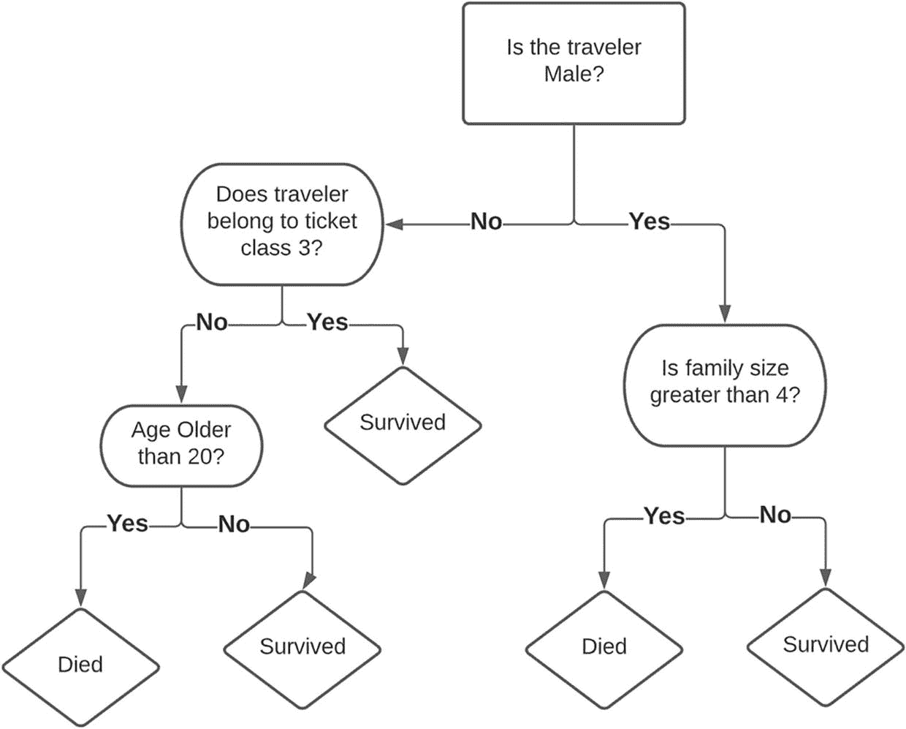

决策树图说明了寻找男性旅客是否幸存所涉及的步骤。

图 1-54

泰坦尼克号数据集上的一个示例决策树

1.  选择一个最佳特征来分割数据。

1.  对于该特性，选择一个最佳阈值，以便根据其标签将数据分割得最好。分类特征的阈值可以是真/假，或者如果该特征包含多个类别，它将被转换为表示每个类别的数字，并被视为连续特征。

1.  对于每个分割产生的节点，重复前面的步骤，直到数据被完美分割，这意味着每个节点恰好包含一个类别或用户定义的最大分割深度。

简单地说“选择最佳特征来分割数据”是不够的。决策树使用衡量数据“不纯度”的指标，这决定了数据分割得有多好。如果数据样本只包含一个类别，它是纯净的；另一方面，如果数据样本包含一半的一个类别和一半的另一个类别，它被认为是混合的，介于两者之间。在决策树中用于确定不纯度的两个常用指标是 Gini 不纯度和熵，如下所示：

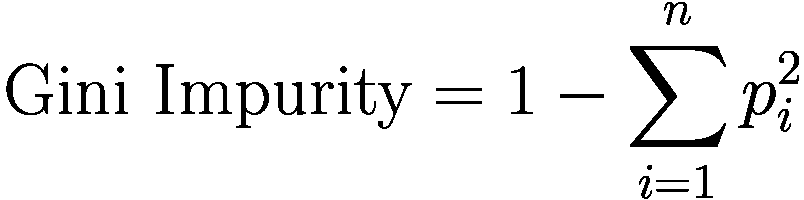

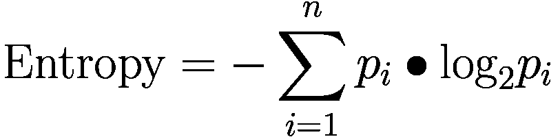

在这两个方程中，*p* 是类别 *i* 的概率，或者是在分割后的节点中属于类别 *i* 的样本的百分比。Gini 不纯度位于区间 [0, 0.5] 内，而熵的值位于区间 [0, 1] 内。然而，如以下所示，两者之间的差异最小。当 Gini 不纯度×2（与熵相匹配）和熵的值与类别的概率作图时，它们的输出在输入范围从 0 到 1 变化时变化很小（图 1-55）。

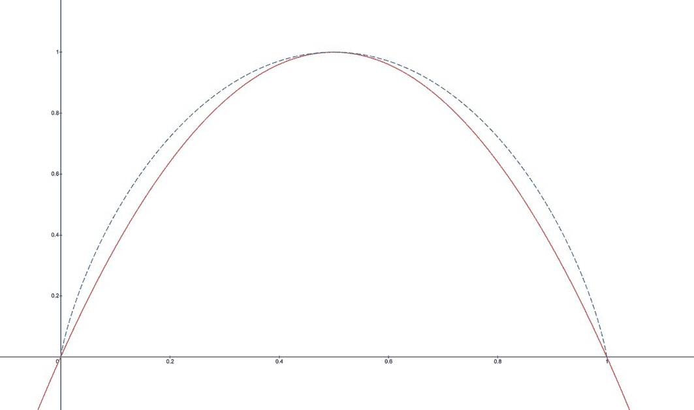

一个图表绘制了一个实线和虚线的向下开口的抛物线，它们在原点、点 (0.45, 1) 和 (1, 0) 处相交。数值是近似的。

图 1-55

Gini 不纯度与熵的比较，其中实线是 Gini x 2，虚线是熵

然而，从计算的角度来看，熵更复杂，因为它需要使用对数，所以 Gini 不纯度通常是决策树中用来确定分割的指标。在分割每个节点时，我们将特征的唯一值视为一个阈值，遍历所有阈值，并计算其相应的 Gini 不纯度。我们对每个特征执行上述过程，然后确定最佳的 Gini 不纯度，我们将根据其阈值来分割数据。如前所述，分割会继续进行，直到每个节点纯净或达到用户指定的超参数“深度”。

深度超参数决定了决策树中应该有多少“层级”的节点。从技术上讲，决策树越深，性能通常会越高，因为分割变得更加具体。尽管增加深度可能会提高性能，但大多数情况下，它仅适用于训练数据，因为树很容易因为深度过高而过度拟合，导致在未见过的测试数据上的性能变差。

#### 实现和使用

注意，遍历每个特征的每个特定阈值并计算其 Gini 不纯度是非常慢的，因为其时间复杂度为 *O*(*N*²)。相反，我们可以对特征进行排序，将每个唯一值视为一个阈值，然后计算 Gini 不纯度作为左右分割之间的加权平均值，同时跟踪分割两边的每个类别的样本数量。当我们移动到下一个阈值时，我们可以增加/减少两边的类别计数。更多细节在以下代码（列表 1-53）中展示。在决策树实现中，我们将定义类而不是独立的函数，因为这使事情更容易处理。

```py
class DecisionTree:
def __init__(self):
pass
def fit(X, y):
self.num_features = X.shape[1]
# Returns the index of the best feature and the threshold of the best split of that feature
def find_best_split(self, X, y):
# cant split if there's only 1 sample
if y.size <= 1:
return None, None
#keeping track of the best threshold and index
best_index, best_thresh = None, None
# Get the number of positive and negative samples in this node
num_pos, num_neg = (y == 1).sum(),(y == 0).sum()
# Calculate the Gini Impurity of current node, if no other splits exceeds this, no further split will be performed
best_impurity = 1 - ((num_pos/len(y))**2 + (num_neg/len(y))**2)
for i in range(self.num_features):
# Sort features values along with their respective labels
# Threshold associated with their index
threshold = pd.Series(X[:, 0]).sort_values()
# Grab the labels in the order of thresholds
labels = y[threshold.index]
# Convert threshold to numpy arrays
threshold = threshold.values
#Keep track of the number of pos, neg samples on both sides with a matrix, [[left_pos, right_pos], [left_neg, right_neg]]
classes_count = np.array([[0, num_pos], [0, num_neg]])
#len(X) is the number of samples
for j in range(1, len(y)):
# get the current sample's label
curr_label = labels[j-1]
# change class count accordingly
classes_count[curr_label, 0] -= 1
classes_count[curr_label, 1] += 1
# Calculate Gini Impurity for both sides, then combine with weighted average where the weight is the number of samples on each side,
# this cleverly gives us the Gini Impurity for the split
left_gini = 1 - ((classes_count[0, 0]/j)**2 + (classes_count[1, 0]/j)**2)
right_gini = 1 - ((classes_count[0, 1]/(len(y)-j))**2 + (classes_count[1, 1]/(len(y)-j))**2)
gini_combined = left_gini * (j/len(y)) + right_gini * ((len(y)-j)/len(y))
# Make sure we dont use the same threshold
if threshold[j] == threshold[j-1]:
continue
# Set the best threshold to current threshold if we do better than our best gini impurity
if gini_combined < best_impurity:
best_impurity = gini_combined
best_index = i
best_thresh = (threshold[j-1] + threshold[j])/2
return best_index, best_thresh
Listing 1-53
DecisionTree Class
```

每次调用`find_best_split`函数时，它都会根据节点的数据执行一次分割，使用在上一个步骤中分割的样本，在当前节点上一级的节点上。然后我们将定义一个节点类，该类将跟踪所有数据、阈值和分割的特征，我们可以递归地构建决策树（列表 1-54）。

```py
class Node:
def __init__(self, best_feature, best_threshold,):
self.best_feature = best_feature
self.best_threhold = best_threshold
# represents the node on the left and the right of the split
self.left = None
self.right = None
Listing 1-54
Node class
```

注意，以下方法将包含在决策树类中（列表 1-55）。

```py
def __init__(self, max_depth):
self.max_depth = max_depth
def fit(self, X, y):
self.num_features = X.shape[1]
self.decision_tree = split_tree(X, y, 0)
return self
def split_tree(self, X, y, current_depth):
# Find majority_class first
num_pos, num_neg = (y == 1).sum(),(y == 0).sum()
majority_class = np.argmax(np.array([num_neg, num_pos]))
best_ind, best_thresh = self.find_best_split(X, y)
curr_node = Node(best_ind, best_thresh, majority_class)
if current_depth  best_thresh
X_right, y_right, X_left, y_left = X[right_split], y[right_split], X[~right_split], y[~right_split]
curr_node.left = self.split_tree(X_left, y_left, current_depth + 1)
curr_node.right = self.split_tree(X_right, y_right, current_depth + 1)
return curr_node
Listing 1-55
Fit and other methods to build the tree recursively
```

对于预测方法，我们将根据分割沿着树的适当一侧继续向下，直到我们到达没有左节点或右节点的叶子节点。我们简单地返回多数类作为我们的预测（列表 1-56）。预测方法也将属于决策树类。在 _predict 方法中，我们根据训练的阈值对数据进行分割，而在 predict 方法中，我们遍历整个 X 数据集，对每个样本进行预测。

```py
def _predict(self, X):
curr_node = self.decision_tree
while curr_node.right:
if X[curr_node.best_feature] > curr_node.best_threshold:
curr_node = curr_node.right
else:
curr_node = curr_node.left
return curr_node.majority_class
def predict(self, X):
return np.array([self._predict(i) for i in X])
Listing 1-56
Prediction functions
```

要使用我们实现的决策树，我们只需实例化对象，并使用相应的数据集调用 fit，然后调用 predict 进行推理（列表 1-57）。

```py
dt = DecisionTree(mac_depth=12)
dt.fit(X, y)
predictions = dt.predict(X)
Listing 1-57
Usage of Decision Tree
```

对于 scikit-learn 的实现（列表 1-58），其用法与我们的实现完全相同。

```py
from sklearn.tree import DecisionTreeClassifier
dt = DecisionTreeClassifier(max_depth = 6)
dt.fit(X, y)
dt.predict(X)
Listing 1-58
Scikit-learn implementation of Decision Tree
```

我们之前编写的实现不支持多类分类。然而，scikit-learn 的实现原生支持多类分类，无需指定任何额外参数。Scikit-learn 还提供了一个回归树的实现，可以预测连续值（列表 1-59）。回归树与分类树的本质直觉相同，只是我们使用均方误差（MSE）来评估每个分割的好坏，而不是使用基尼不纯度，每个节点的预测由数据样本的平均值决定。

```py
from sklearn.tree import DecisionTreeRegressor
dt = DecisionTreeRegressor(max_depth = 6)
dt.fit(X, y)
dt.predict(X)
Listing 1-59
Scikit-learn implementation of Regression Tree
```

#### 随机森林

随机森林是一种算法，它对决策树的设计提供了一些关键改进。简单来说，随机森林是由许多较小的决策树组成的集成。随机森林使用这样一个简单概念：群众的智慧总是优于单个强大个体。通过使用低相关性的小决策树，它们的预测集成可以优于任何单个决策树。随机森林用来集成较小决策树的技术称为 bagging。Bagging，也称为自助聚合，是从训练数据中随机抽取不同的子集，并带有替换，最终预测由多数投票决定。

随机森林从整个训练数据中选取数据子集，并在每个子集上单独训练决策树，然后根据多数投票或平均分类或回归结果进行组合（图 1-56）。在构建随机森林时，重要的是要注意，并非每个特征都会被选中用于构建每个决策树，以创造多样性并解决维度诅咒问题。多个决策树的集成使随机森林在性能上非常稳定。然而，随机森林确实有一些缺点，因为它相当难以解释，并且比决策树慢得多。由于它们的速度和互操作性，决策树通常在快速测试较小数据集时被选择。当不需要互操作性且数据集较大时，随机森林是合适的。

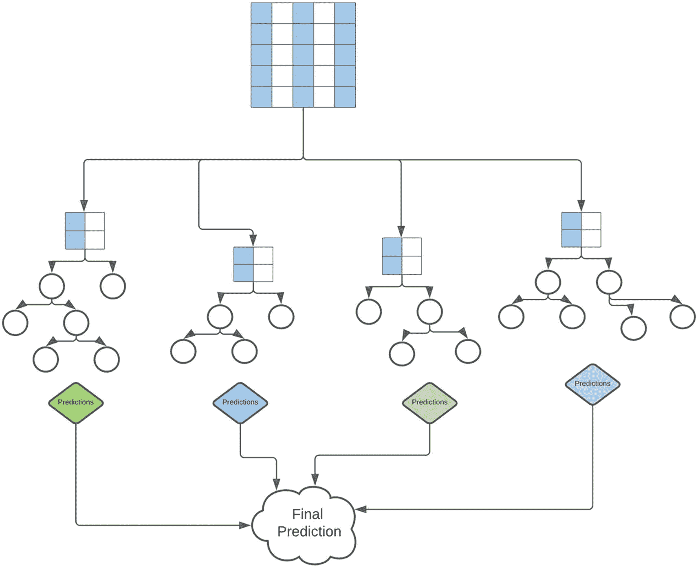

一个部分阴影的 5x5 表格被分成四个 2x2 的表格，这些表格进一步被四个预测细分，最终导致最终的预测。

图 1-56

随机森林概念

广义上，这种技术被称为袋装法，或*b*ootstrap *a*ggregat*ing*。这是一个有趣的想法：不添加任何新的数据、知识或独特的学习算法，我们只需通过向系统中注入随机性，就可以简单地提高模型的表现。我们训练一个模型集，其中每个模型都在随机选择的数据子集上训练；训练完成后，该集成模型的预测被汇总以形成最终的预测。

有趣的是，随机森林在大多数情况下都能可靠地比决策树表现得更好。即使给出了“多样性”和“许多思考者比一个人好”的常用解释，如果它实际上没有引入独特的新的学习结构，那么理解为什么袋装法可以提高性能可能会令人困惑。

决策树算法通常是高方差算法（回想一下“建模的基本原则”部分中讨论的偏差-方差权衡）。一个未受监管的决策树将继续构建节点和分支以适应噪声数据，而几乎不努力于泛化或识别广泛趋势。我们可以直观地理解决策树的行为，就像图 1-57 中显示的非常噪声的正弦波一样。

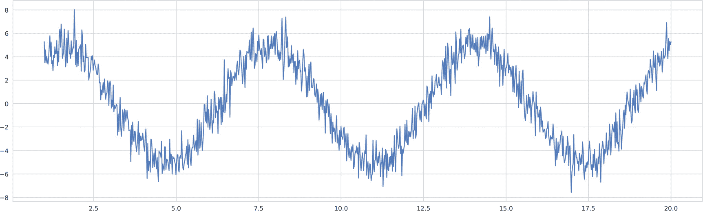

一个不均匀的波形图显示了一个振荡并形成了一个均匀振荡且类似于正弦波的波形。

图 1-57

高方差直觉的可视化

现在，我们将绘制十个“自助”正弦波。每个自助正弦波（以透明显示）由从原始正弦波中随机抽取的 20%的点组成。然后，我们将这些自助正弦波“聚合”在一起，形成一个“袋装”正弦波，其中每个点都是通过从自助波中平均附近的值来确定的。结果波看起来更平滑，比之前的自助聚合（图 1-58）更类似于一个更通用和稳定的曲线。

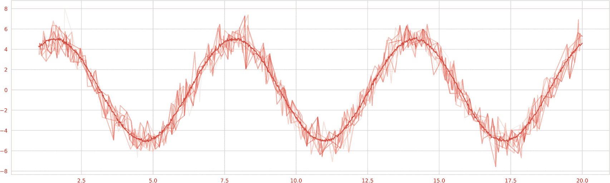

图形显示了一个不均匀的光波，它在均匀振动的正弦波上振荡。

图 1-58

袋装缓解方差直觉的可视化

因此，我们可以将袋装理解为基础模型通过引入偏差效应来*缓解方差*。利用这一点，我们还可以推断出，袋装通常不适用于已经具有高偏差的模型；这一点确实已经通过经验观察得到证实。

scikit-learn 中随机森林的实现如列表 1-60 所示。

```py
from sklearn.ensemble import RandomForestClassifier
# n_estimators is the number of tree that should be trained
rf = RandomForestClassifier(n_estimators = 30, max_depth = 12)
rf.fit(X, y)
predictions = rf.predict(X)
Listing 1-60
Scikit-learn implementation of Random Forest
```

树方法，如随机森林和决策树，在解决先前算法中的许多问题时，引入了完全不同的技术，从而为经典的机器学习领域带来了许多多样性。基于树的方法是性能最快的高效算法之一，其概念被应用于更优的算法，包括梯度提升和一些深度学习算法。第二部分的最后一章专门介绍了从基于树模型中汲取灵感的深度学习模型。

### 梯度提升

梯度提升描述了使用多种不同算法进行建模的某种技术，这些算法基于它。第一个成功利用梯度提升的算法是 1998 年由 Leo Breiman 提出的 AdaBoost（自适应梯度提升）。1999 年，Jerome Friedman 将当时出现的各种提升算法，如 AdaBoost，归纳为一种单一的方法：梯度提升机。很快，梯度提升机的想法变得极为流行，并在许多现实生活中的表格数据集上证明了其高性能。时至今日，各种梯度提升算法，如 AdaBoost、XGBoost 和 LightGBM，都是许多在大型、复杂数据集上工作的数据科学家的首选。

#### 理论与直觉

梯度提升与随机森林有类似的思想，使用一系列较弱的模型来构建一个强大的预测。梯度提升与随机森林的不同之处在于，它不是拥有独立的、不相关的模型，而是构建基于其他模型误差的模型，以持续地“提升”性能。

假设你正在挑选五个人代表你的学校、组织或国家参加一个知识竞赛，在这个竞赛中，能够回答最多关于音乐、历史、文学、数学、科学等问题的小组获胜。你的策略是什么？你可以挑选五个对大多数可能涵盖的主题都有广泛且重叠知识的人（一种随机森林风格的集成方法）。也许更好的方法是挑选一个在某个领域非常出色的人 A，然后挑选并训练人 B 在 A 不是专家的主题上，然后挑选并训练人 C 在 B 不是专家的主题上，依此类推。通过在彼此之上提升学习器，我们可以构建复杂和自适应的集成。

梯度提升的概念可以适应许多不同的机器学习模型，例如线性回归、决策树，甚至深度学习方法。然而，梯度提升最常见的使用是与决策树或基于树的通用方法结合。尽管已经出现了各种流行的梯度提升模型，但它们的初始和核心直觉依赖于相同的算法；因此，我们将分析原始的梯度提升过程，同时简要介绍每种特定类型提升模型之间的差异。

梯度提升天真地适应回归和分类。我们可以从理解图 1-59 中展示的回归方法开始。

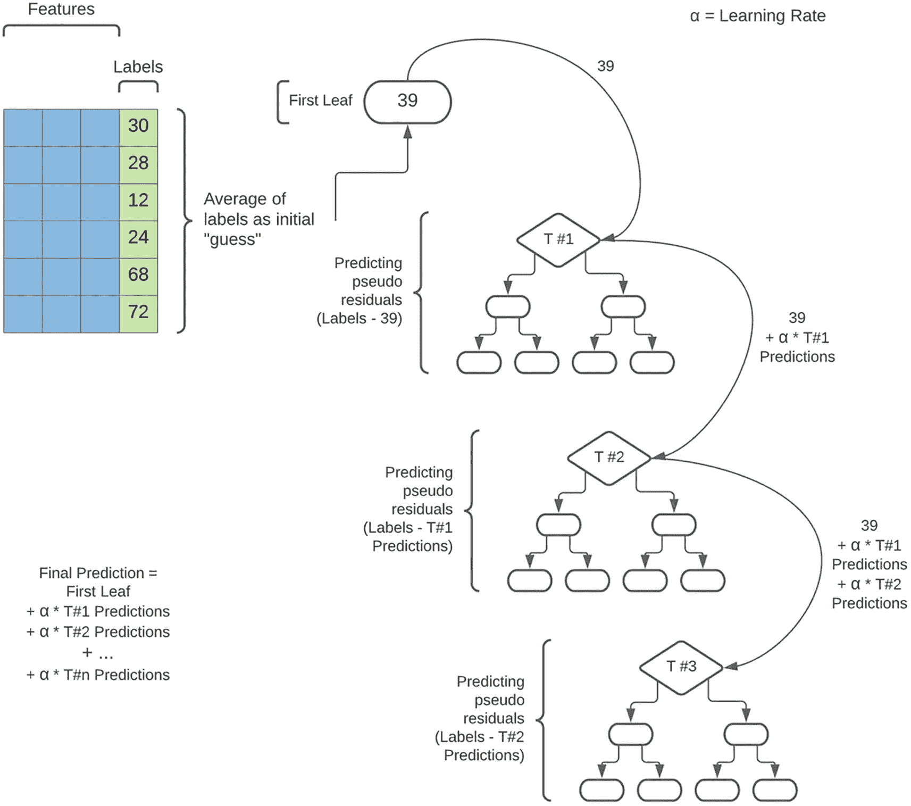

一幅插图展示了一个具有特征和标签的表格，这些特征和标签导致第一个叶，并使用标签 39、T hash 1 和 T hash 2 预测伪残差。

图 1-59

梯度提升的可视化

1.  假设目标变量是连续的，创建一个叶，其代表目标变量的平均值，这代表我们对标签的初始猜测。

1.  基于第一个叶子的误差构建回归树。更具体地说

    1.  计算我们初始预测与每个样本的真实标签之间的误差，我们称之为伪残差。

    1.  构建一个回归树来预测具有限制性叶数的样本的伪残差。将具有多个标签的叶替换为该叶中所有标签的平均值，这将作为该叶的预测。

1.  使用训练好的决策树预测目标变量如下：

    1.  从初始预测开始，即所有标签的平均值。

    1.  使用我们训练的决策树预测伪残差。

    1.  将预测添加到初始猜测中，乘以一个我们称之为学习率的因子，这将成为最终的预测。

1.  根据先前模型（的）的预测计算新的伪残差。

1.  构建一个新的树来预测新的伪残差，重复步骤 2–4。对于步骤 3，我们只需将新树的预测值加上，并乘以相同的学习率，以及之前迭代中创建的其他树。

1.  重复步骤 2–4，直到达到最大指定的模型数量或预测开始变差。

梯度提升分类的方法与回归极为相似。在我们的第一次初始“猜测”中，我们不是计算目标值的平均值，而是计算标签上的对数几率。为了计算伪残差，我们使用 sigmoid 函数将对数几率转换为概率：

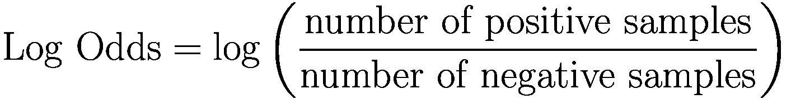

在二进制标签中，我们将正样本视为 1，负样本视为 0。然后，使用我们计算的概率，我们从各自的标签中减去每个值以获得伪残差。就像回归一样，我们根据特征构建一个树来预测伪残差。同样，由于叶子节点的数量有限，将会有叶子节点中存在多个值。由于我们的叶子值来自概率，而我们的预测值在逻辑概率中，我们需要使用以下公式对叶子预测值应用变换。求和符号表示在相同叶子节点上的所有值的总和，如果有的话。*P* 指的是前一个树或叶子的预测概率：

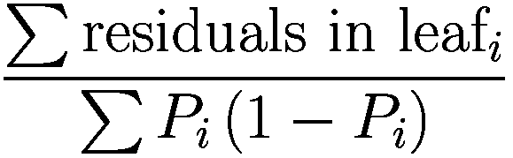

在每个叶子节点更新预测值之后，我们基本上执行与回归中相同的程序，不断地构建基于前一个错误的新树，直到达到用户指定的参数或我们的预测不再改进。

之前描述的方法是许多基于梯度提升算法的泛化。在接下来的章节中，我们将简要介绍其中一些最受欢迎的算法及其相应的实现。

#### AdaBoost

自适应梯度提升，或 AdaBoost，是梯度提升最早的形式之一。它在提出梯度提升机泛化之前就已经发表。AdaBoost 的主要思想在于它使用加权树桩，这些树桩组合成最终预测。树桩是一个具有根和仅两个叶子的决策树。训练 AdaBoost 模型的过程如下：

1.  将每个样本分配相同的权重，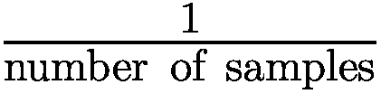。

1.  使用上述提到的只有一个分割的树桩或决策树进行训练，预测目标。

1.  计算训练好的树桩产生的误差量。误差量定义为所有错误分类样本权重的总和。

1.  计算训练好的树桩的权重，定义如下：

    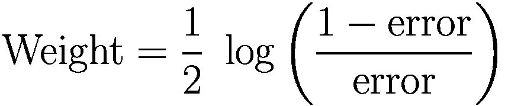

在实践中，为了防止除以 0，会添加一小部分额外的误差。

1.  根据训练数据相应地调整样本权重。我们将每个错误分类样本的样本权重增加为原始样本权重 ∙ *e*^(树桩权重)。另一方面，我们将每个正确分类样本的权重减少为原始样本权重 ∙ *e*^(−树桩权重)。

1.  调整或归一化样本权重，使其总和为 1。我们将每个样本权重除以所有样本权重的总和。

1.  使用加权基尼不纯度重复步骤 2-6，直到达到用户指定的参数或模型性能停止增加。

1.  当样本通过预测时，最终预测由分类一个类别的树决定，这些树的权重总和超过分类其他类别的树。

scikit-learn 中的实现如列表 1-61 所示。

```py
from sklearn.ensemble import AdaBoostClassifier
from sklearn.datasets import make_classification
X, y = make_classification(n_samples=1000, n_features=4, n_informative=2, n_redundant=0, random_state=42)
# n_estimator is the amount of stumps
clf = AdaBoostClassifier(n_estimators=100, random_state=0)
# Fit and predict
clf.fit(X, y)
clf.predict(X)
Listing 1-61
Implementation of AdaBoost in scikit-learn
```

如果将 AdaBoost 中的树桩替换为回归树桩，AdaBoost 也能够执行回归任务。AdaBoost 回归器的实现如列表 1-62 所示。

```py
from sklearn.ensemble import AdaBoostRegressor
from sklearn.datasets import make_regression
X, y = make_regression(n_samples=1000, n_features=4, n_informative=2, n_redundant=0, random_state=42)
# n_estimator is the amount of stumps
clf = AdaBoostRegressor(n_estimators=100, random_state=0)
# Fit and predict
clf.fit(X, y)
clf.predict(X)
Listing 1-62
Implementation of AdaBoost Regressor in scikit-learn
```

#### XGBoost

XGBoost，即极端梯度提升，是在 2010 年代初作为梯度提升机的正则化变体开发的。XGBoost 的发展始于陈天奇作为分布式机器学习社区一部分的研究项目。后来，在 2014 年的希格斯玻色子机器学习竞赛中，它被推广到机器学习和数据科学社区。与 AdaBoost 相比，XGBoost 在速度和性能方面进行了大量优化，并且与梯度提升机的原始方法非常相似。

训练 XGBoost 的一般步骤如下：

1.  初始化一个随机的预测值。这可以是任何数字，无论分类还是回归；一个典型的值是 0.5。

1.  与梯度提升类似，我们构建一个决策树来预测伪残差。

    1.  从一个包含所有伪残差的单个叶子开始，使用以下公式计算所有残差的相似度得分，其中 *r*[*i*] 是第 *i* 个伪残差，*λ* 是一个正则化项：

        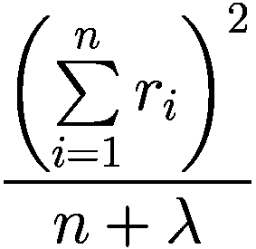

    1.  寻找与决策树类似的最佳分割。然而，我们用来评估分割有效性的指标与基尼不纯度不同。选择产生最大“增益”的分割：

        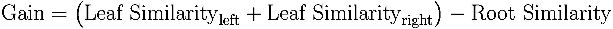

    1.  继续构建树，直到达到用户指定的参数。

    1.  指定了一个剪枝参数*γ*，如果分割的增益小于*γ*，则会移除某些节点。这有助于正则化。

1.  使用以下公式计算每个叶节点的预测输出：

    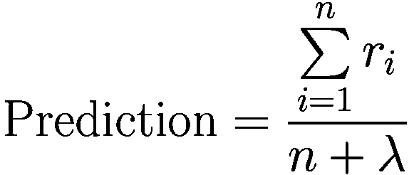

1.  与梯度提升类似，我们的最终预测是初始叶节点加上我们定义的学习率乘以树的输出。在构建第一棵树之后，其预测将被用来计算新的残差并构建新的树，直到满足用户指定的参数。

与使用 scikit-learn 进行实现不同，XGBoost 有自己的库，它提供了与 scikit-learn 模型类似的功能和语法结构（列表 1-63）。

```py
import xgboost as xgb
X, y = make_regression(n_samples=1000, n_features=4, n_informative=2, n_redundant=0, random_state=42)
# train test split
from sklearn.model_selection import train_test_split
X_train, X_test, Y_train, Y_test = train_test_split(X, y, test_size=0.2)
# covert data to xgboost data types
dtrain = xgb.DMatrix(X_train, label=y_train)
dtest = xgb.DMatrix(y_test, label=y_test)
# specify parameters via map
param = {
'max_depth': 4,
# learning rate
'eta': 0.3,
# gamma, pruning term
'gamma': 10,
# lambda, regularization term
'lambda': 1,
# subsample, the percentage of samples selected to train each tree
'subsample': 0.8,
# tasks types, some common ones including reg:squarederror, regression with squared loss,
# multi:softmax, multiclass classification using softmax, binary:logistic, binary classification
'objective':'binary:logistic',
# use GPU
'tree_method': 'gpu_hist',
}
# number of boosted trees
num_round = 200
# train
bst = xgb.train(param, dtrain, num_round)
# make prediction
preds = bst.predict(dtest)
Listing 1-63
XGBoost implementation
```

#### LightGBM

LightGBM，即 Light Gradient Boosting Machines，是一种优化的梯度提升算法，旨在在保持高性能的同时减少内存使用和速度。由微软于 2016 年开发，LGBM 因其上述优点以及能够通过在 GPU 上并行计算处理大规模数据的能力而迅速获得普及。

LGBM 与其他类似的梯度提升算法之间的一大区别是，在 LGBM 中决策树是按叶节点方式生长的，而在其他情况下则是按层方式生长。叶节点方式生长比层方式生长更好地处理过拟合，并且在处理大型数据集时速度更快。此外，层方式生长会产生许多不必要的叶节点和节点。相比之下，叶节点方式生长仅扩展具有高性能的节点，从而保持决策节点数量的恒定。

此外，LGBM 使用两种称为基于梯度的单侧采样（GOSS）和独家特征捆绑（EFB）的两种新颖技术来采样数据集，这些技术在不影响性能的情况下减少了数据集的大小。

GOSS 通过采样数据集，旨在使模型关注那些误差较大的数据点。通过梯度下降的概念，梯度较低的数据点会产生较低的训练误差，反之亦然。GOSS 选择具有较大绝对梯度的样本。请注意，GOSS 还会选择具有相对较低梯度的样本，因为它保持了输出数据的分布，就像 GOSS 之前一样。

EFB 的目标是消除，或者更合适地说合并，特征。该算法将互斥的特征捆绑在一起，这意味着它们不可能同时具有相同的值。然后，捆绑的特征被转换为单个特征，从而减少了数据集的大小和维度。

最后，LGBM 对连续特征进行分箱处理，以减少在决策树构建过程中的可能分裂数，为算法引入了另一个主要的加速。

微软有自己的库来实现 LGBM，并提供类似于 scikit-learn 的简单语法，如列表 1-64 所示。

```py
import lightgbm as lgbm
X, y = make_regression(n_samples=1000, n_features=10, n_informative=10, random_state=42)
# train test split
from sklearn.model_selection import train_test_split
X_train, X_test, y_train, y_test = train_test_split(X, y, test_size=0.2)
train_set = lgbm.Dataset(X_train, label=y_train)
params = {
# number of leafs
'num_leaves': 15,
# max depth, counters overfitting when training data is small, but the tree still grows leaf wise
'max_depth': 12,
# max number of bins to seperate continuous features
'max_bin':200,
# task type, some other common ones: binary, multiclass, regression_l1
'objective': 'regression',
# change to gpu for training on gpu
'device_type':'cpu',
# learning rate
'learning_rate':0.01,
# amount of logging
'verbose':0,
# set random seed for reproducibility
'random_seed':0
}
model = lgbm.train(params, train_set,
# number of boosted trees
num_boost_round=100,)
predictions = model.predict(X_test)
Listing 1-64
Scikit-learn implementation of LGBM
```

### 算法总结

| **算法名称** | **描述** | **优点** | **缺点** |
| --- | --- | --- | --- |
| KNN | 基于 K-Nearest Neighbors 的值确定最终分类 | 简单，不需要训练阶段 | 在大数据集上表现不佳，训练和找到最佳 K 值需要很长时间 |
| Linear Regression | 寻找线性关系，即给定回归数据集的最佳拟合线 | 简单，可解释 | 无法建模复杂的非线性关系 |
| Logistic Regression | 寻找给定分类数据集的最佳拟合线 | 简单，可解释 | 无法建模复杂的非线性关系 |
| Decision Tree | 根据属性分割数据以产生结果 | 免受维度灾难的影响，可以建模非线性关系 | 容易过拟合，需要大量的超参数调整 |
| Random Forest | 小决策树的集成 | 免受维度灾难的影响，可以建模非线性关系，并且泛化良好 | 训练时间较长，需要大量的超参数调整 |
| Gradient Boosting | 弱学习者的集成，每个都在尝试纠正前一个的错误 | 免受维度灾难的影响，可以建模非线性关系，并且在建模方面灵活 | 对异常值敏感，需要大量的超参数调整 |

## 超越经典机器学习

在本章中，我们全面审视了许多关键的经典机器学习原则、概念和算法。这些原则和概念支配着自动化学习在广泛学科领域中的许多重要应用，并且仍然是不断发展的自我学习计算机愿景的重要基石。

然而，在某个时刻，经典机器学习对于雄心勃勃的新方向和想法变得过于有限。随着更复杂的数据形式，如图像和文本的增多，需要有效地建模经典机器学习无法满足的高维*专用*数据形式。

*深度学习*在非常一般的意义上，是关于*神经网络*的研究。神经网络更多的是一个想法或指导概念，而不是一个具体的算法。（第三章专门探讨了标准前馈神经网络的运行技术细节以及如何将它们应用于表格数据。）由于它们非常灵活且易于操作，自 2000 年代后期和 2010 年代初计算能力和数据可用性使得快速实验成为可能以来，深度学习从未缺乏应用和新研究方向。

深度学习为许多重要应用提供了动力，例如以下内容：

+   *物体识别*：深度学习模型可以识别图像中是否存在一个或多个物体。这应用于安全领域（自动检测不受欢迎的实体）、自动驾驶汽车和其他机器人技术、生物学（识别非常小的生物物体）等领域。

+   *图像标题生成*：类似于 Microsoft Word 这样的应用程序会为文档中插入的图像提供自动的替代描述。要为图像添加标题，深度学习模型需要从图像中提取视觉信息，发展出对图像“含义”的内部表示，并将这种表示翻译成自然语言。

+   *图像着色*：在彩色捕捉相机发明之前，世界上的照片都是以黑白形式拍摄的。深度学习可以通过从图像中推断颜色，以及执行类似任务（如修复损坏的图像或对损坏的照片进行校正）来使这些灰度图像“复活”。

+   *艺术生成*：深度学习可以通过几种不同的、有详细记录的方法，在几乎不需要人类参与每个单独艺术作品的创作的情况下，创建有意义的计算机生成艺术。

+   *蛋白质折叠预测*：蛋白质是由氨基酸链组成的，在生物体中发挥着重要的生物学作用。蛋白质的功能取决于其形状，而形状又由组成序列的氨基酸如何相互排斥或吸引来形成复杂的蛋白质折叠所决定。了解蛋白质的形状为生物学家提供了关于其功能和如何操纵它的巨大信息（例如，禁用恶意蛋白质或设计蛋白质来禁用其他恶意生物物体）。蛋白质折叠是一个未解决的问题，直到 DeepMind 在 2020 年发布了 AlphaFold 模型，该模型在预测未知蛋白质的形状方面取得了非凡的高精度。

+   *文本生成*：神经网络可以生成文本以提供信息和娱乐。说话模型的一个应用是在对话聊天机器人中，例如基于人工智能的治疗服务，它提供了一个自然的界面来获取建议和陪伴，可能比与真人交谈更加隐秘和轻松。这些也可以用来帮助开发者通过推断开发者的意图并帮助自动完成代码，有时一次可以完成几行代码（参见 Kite 和 Github Copilot）。

深度学习被用于解决现代的、困难的以及极其复杂的问题。相应地，深度学习模型通常非常大。对于图像识别模型来说，数万个参数是标准配置，而最先进的自然语言模型参数数量达到*数百亿*。在这些情况下，参数的数量通常几乎总是大于训练数据集中的样本数量。在低维空间中，一个（技术上不恰当但多少有些说明性的）类比是在两个数据点上拟合一个十维多项式，例如。

尽管这些深度学习模型规模庞大，但在基准数据集上获得了非凡的验证性能。此外，观察到增加深度学习模型的大小几乎总是会增加其验证性能。这与经典机器学习中的偏差-方差/过拟合-欠拟合范式相冲突，该范式表明在模型中持续增加参数数量将导致过拟合，从而泛化能力变差。这里发生了什么？

为了扩展理论以解释或整合这些观察结果，OpenAI 的研究人员提出了*深度双下降*理论，该理论表明臭名昭著的偏差-方差 U 形曲线（图 1-23）仅在*经典状态*下说明了泛化与模型复杂度之间的关系，并且这只是更完整曲线的一部分。如果我们继续沿着*x*轴远行，逐渐增加模型复杂度，我们最终会到达一个模型性能再次*提升*的点（图 1-60）。

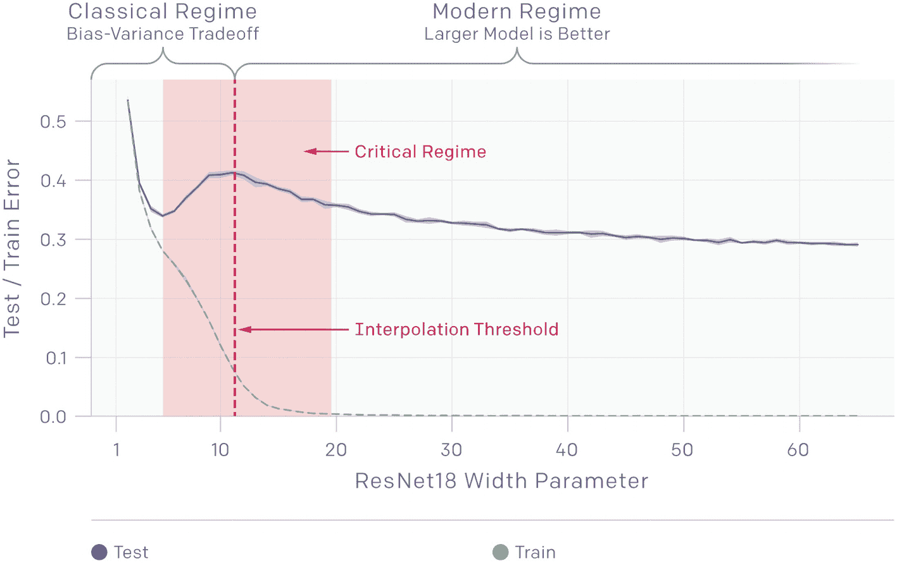

一张图展示了测试误差与训练误差对 ResNet 18 宽度参数的关系。它显示了一个矩形临界区域内的插值阈值。插值阈值之前和之后区域分别标记为经典状态和现代状态。图中展示了测试和训练的 2 条下降曲线。

图 1-60

深度双下降，来自 Nakkiran 的“深度双下降”论文

深度双重下降现象是许多观察到的模式之一，表明经典和现代体系之间存在根本性的转变。鉴于两者之间的差距如此之明显，似乎不适宜在这两种范式之间进行跨越。本书的主题本身——表格数据的深度学习——就跨越了这两者：深度学习，现代体系的研究，以及表格数据，它一直被认为最适合用经典体系的技巧来建模。

这种观点之所以广泛传播，主要是因为它有道理，并且由于在相当长的一段时间里，它已经被经验所验证。在表格数据上训练神经网络几乎从未表现得像梯度提升等算法那样好。给出的主要（可以说是事后诸葛亮）解释是，表格数据在复杂性和数量上可能比高维度的图像和文本数据少得多。神经网络，由于其庞大而压倒性的参数量，本能地通过偏差-方差权衡似乎过度，导致过拟合（即泛化能力差）。

然而，深度学习的最新发展表明，深度学习在表格数据中具有作为同等或在某些情况下更优越的机器学习方法的潜力。深度双重下降现象暗示，神经网络可能不受相同经典机器学习体系范式的影响，并且如果我们足够深入且方向正确，我们可能会达到比之前想象的更好的地方。

本书致力于探索表格数据和深度神经网络之间不太可能结合的婚姻，希望将深度学习确立为标准数据科学家工具箱中一个坚实的竞争者，而不是仅限于专门从事图像、语言和信号应用的专业深度学习工程师。这是将现代与经典相结合的尝试——重新理解深度学习前沿的专门发展，以及它们在结构化数据应用中的有用性。你会发现，与深度学习一起工作，在许多方面比标准的经典机器学习工作流程更加自由，也更少有重复性。随着数据科学的发展，我们必须使用的工具也必须进步。

## 关键点

在本章中，我们讨论了经典机器学习的几个关键原则、概念和算法：

+   在机器学习的背景下，*建模*是从数据中开发现象表示的自动化过程。

+   当一个模型被训练来将输入与标签关联时，它使用监督学习。另一方面，当一个模型被训练来在数据本身中找到关联，而不需要任何标签时，它使用无监督学习。

+   回归发生在目标连续时，而分类发生在目标离散/分箱时。

+   训练集是模型拟合的数据；验证集是模型评估的数据，但在训练期间没有看到；测试集是模型预测的数据（没有相关的真实标签）。

+   一个方差过高的模型对它所呈现的特定数据实例极其敏感，并调整/“弯曲”其一般预测能力以精确地表示提供的数据；这被称为*过拟合*。另一方面，一个偏差过高的模型不会太多地调整/“弯曲”其一般预测能力以适应数据集的特定实例；这被称为*欠拟合*。在经典的机器学习领域，参数数量的增加（“自由度”的增加）通常与过拟合行为的增加有关；模型的最佳大小介于欠拟合和过拟合之间。

+   维度诅咒描述了涉及高维空间中的距离、表面和体积的一系列现象，这些现象在低维空间中与我们的直觉相反/相反。

+   梯度下降是机器学习优化中的一个重要概念，其中参数的更新方向与损失函数相对于参数的导数的相反方向。这指向了最小化损失的方向。梯度下降的一个弱点是最终的收敛结果通常严重依赖于初始化；这通常可以通过更高级的机制来克服。

+   深度双下降现象试图通过将经典的偏差-方差 U 形曲线扩展到单脊下降来解释高度参数化的深度学习模型相对于传统机器学习模型的成功，当模型复杂性足够高时，错误会减少。这一现象是许多表明深度学习的操作范式和原则与机器学习根本不同的现象之一。

+   深度学习的现代发展表明，表格数据有很有前景的应用。

在第二章中，我们将介绍成功建模流程中重要的表格数据存储、操作和提取方法。这些技能将使你能够处理本书其余部分主题中所需的不同形式的数据。
