# 2. 数据准备和工程

> 目标是将数据转化为信息，将信息转化为洞察。
> 
> ——卡莉·费奥莉娜，惠普公司前首席执行官

我们将数据准备，或数据预处理，定义为应用于从数据源直接收集的原始数据的一系列转换，以更好地表示信息。我们这样做是为了能够更好地对其进行建模（图 2-1）。

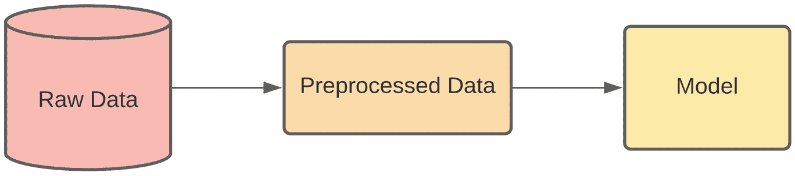

流程图如下所示，原始数据经过预处理后进一步发展为模型。

图 2-1

从原始数据到模型的预处理流程

深度学习与数据准备和预处理的关系复杂。众所周知，经典机器学习或统计学习算法通常需要大量的预处理才能成功。使用神经网络进行建模最令人兴奋的优势之一是其据说能够可靠地从原始数据中学习。众所周知，神经网络比标准机器学习算法具有显著更强的预测能力。因此，从理论上讲，神经网络可以学习数据建模的最优预处理方案集，这些方案与人类选择或设计的方案相当或更好。

然而，这并不意味着深度学习消除了数据准备和预处理的需求。尽管从理论上讲不需要数据预处理，但在实践中，应用复杂或领域指导的预处理方案仍然可以改善神经网络的表现。一个理论状态的存在，其中深度学习模型可以表示最优的预处理方案，本身并不表明深度学习模型在训练过程中可以可靠地*收敛到这种状态*。（在第十章关于元优化的讨论中，我们将看到本章讨论的技术在通过机器学习优化神经网络数据预处理流程中的应用。）

无论您使用的是经典机器学习还是深度学习方法，数据准备和预处理仍然是与表格数据工作相关的宝贵技能。机器学习算法在从数据中提取关联时表现最佳，这些关联已经相当清晰或至少不是模糊的。本章的目标是为您提供实现这一目标的想法和工具。

大概来说，我们可以识别数据预处理的主要三个组成部分：数据编码、特征提取和特征选择（见图 2-2）。这些组成部分之间相互关联：数据编码的目的是使原始数据既可读又“忠实于其自然特性”；特征提取的目的是从数据空间中识别抽象或更相关的特征；特征选择的目的是确定哪些特征与预测过程无关，并且可以被移除。通常，数据编码优先于后两个组件，因为在我们尝试从数据中提取特征或选择哪些特征相关之前，数据必须是可读的并且能够代表自身。

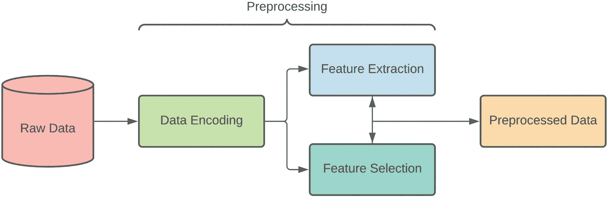

流程图描述了以下阶段：原始数据；预处理，包括数据编码、特征提取和特征选择；以及预处理后的数据。

图 2-2

预处理流程的关键组件：数据编码、特征提取和特征选择

本章将从讨论用于存储和操作表格数据集的各种库和工具开始，特别是关注大型和难以存储的数据。然后，它将涵盖数据预处理流程中讨论的三个组件——数据编码、特征提取和特征选择——并应用于几个示例表格数据集。

## 数据存储和管理

在本节中，我们将探讨 TensorFlow Datasets，这是一个强大的子模块，用于数据集存储、管道和操作，以及几个用于加载大型表格数据集的库。

本章以及本书的其余部分假设读者对 NumPy 和 Pandas 有实际操作的知识。如果您不熟悉这些库，请参阅附录，以获得这两个库的全面概述。

### TensorFlow Datasets

TensorFlow Datasets 对于图像和文本表格数据尤为重要，因为它们是非常高维度的专用数据格式，占用大量空间。表格数据通常更紧凑，所以在许多情况下，Pandas 和 NumPy 就足够了，不需要使用 TensorFlow Datasets。然而，对于高频表格数据（例如，高精度股票市场数据），TensorFlow Datasets 提供了显著的加速和空间效率优势。

### 创建 TensorFlow 数据集

为了创建一个 TensorFlow 数据集，首先必须有一个数据源。

如果您已经将数据存储在内存中，例如，作为一个 NumPy 或 Pandas 数组，您可以使用`from_tensor_slices`函数将信息复制到 TensorFlow 数据集中（见列表 2-1）。

```py
arr1 = [1, 2, 3]
data1 = tf.data.Dataset.from_tensor_slices(arr1)
arr2 = np.array([1, 2, 3])
data2 = tf.data.Dataset.from_tensor_slices(arr2)
Listing 2-1
Creating a TensorFlow dataset from a NumPy array
```

当我们调用 `data1` 的值（例如，通过打印它）时，我们得到的结果是 `<TensorSliceDataset shapes: (), types: tf.int32>`。然而，`data2` 产生的结果是 `<TensorSliceDataset shapes: (), types: tf.int64>`。注意张量中数据类型的差异，技术上应该是相同类型——这里发生了什么？

当 TensorFlow 接收原始整数时，它默认将它们转换为 32 位整数。然而，NumPy 默认将原始整数转换为 64 位；当 TensorFlow 接收 64 位整数的 NumPy 数组时，它保留其表示并按 `tf.int64` 类型存储。在通过不同容器传递数据时，重要的是要意识到这种“隐藏”的数据转换。

你可以通过在数据源中转换/设置某些元素类型来控制 TensorFlow 数据集元素表示，TensorFlow 将忠实地保留这些类型，或者使用 TensorFlow 的 `tf.cast`。

你可能也会注意到，在所有创建的 TensorFlow 数据集中显示的形状似乎为空。让我们创建一个形状为 (2, 3, 4) 的多维数组，并将数据传递给 `.from_tensor_slices`（列表 2-2）。

```py
arr = np.arange(2*3*4).reshape((2, 3, 4))
data = tf.data.Dataset.from_tensor_slices(arr)
Listing 2-2
Creating a TensorFlow dataset from a multidimensional NumPy array
```

结果是 `<TensorSliceDataset shapes: (3, 4), types: tf.int64>`。这是因为 `.from_tensor_slices` 创建了一个 `TensorSliceDataset`，它按照 *切片* 的存储方式组织。所指示的形状是每个切片的大小。你可以将切片想象成一个数据样本或项目，它们按列表排列；例如，`.from_tensor_slices` 构造函数将形状为 `(2, 3, 4)` 的输入数据解释为两个形状为 `(3, 4)` 的数据样本。这种数据存储机制明确地捕捉了区分不同数据样本的维度，这是 NumPy 数组所不具备的。

如果你想要标准的数组-like 存储或以更宽松的格式（`TensorSliceDatasets` 不太可修改，因为它们是“准备”/“预置”好以供模型输入的）处理 TensorFlow 存储的数据，你可以使用 `TensorDataset`。与存储 *切片* 不同，`TensorDataset` 存储一个原始张量（列表 2-3）。

```py
arr = np.arange(2*3*4).reshape((2, 3, 4))
data = tf.data.Dataset.from_tensors(arr)
Listing 2-3
Creating a TensorFlow dataset from a multidimensional NumPy array using “from_tensors” instead of “from_tensor_slices”
```

列表 2-3 中的代码产生 `<TensorDataset shapes: (2, 3, 4), types: tf.int64>`。

你通常会向模型提供 TensorSliceDatasets 而不是 TensorDatasets，因为它们被明确设计为有效地捕捉数据样本之间的分离。TensorFlow 模型将接受设置正确的数据集，例如：`model.fit(data, other parameters...)`。

TensorFlow 提供了许多将文件（例如，`.csv`）或存储在其他工具（例如，Pandas DataFrames）中的数据转换为 TensorFlow 兼容格式的实用工具。你可以在 TensorFlow 输入/输出 (`tf.io`) 文档页面上探索这些工具。

通常，为了表格数据建模的目的，TensorFlow 数据集对于非常大的数据集（例如，每几秒钟收集数十年的高精度股票市场数据）是必要的。在本书使用的所有示例中，我们不会使用 TensorFlow 数据集作为默认选项，因为它对于大多数表格上下文来说不是必需的。

### TensorFlow 序列数据集

“传统”的 TensorFlow 数据集配置要求您一次性将所有数据安排到一个紧凑的数据集对象中，然后将该对象传递给模型进行训练。这种方法通常相当僵化和不灵活，尤其是如果您正在处理无法一次性加载到内存中的大型数据集或具有多个输入和/或输出的复杂数据集。

TensorFlow *序列数据集* 是 TensorFlow 和开发者之间的一种更灵活的协议：而不是被迫一次性在聚合级别组装和操作整个数据集，开发者同意在需要时按需向 TensorFlow 提供数据集的部分。这些数据集因其灵活的结构和相应的数据管道开发便利性而非常有价值。

自定义定义的序列数据集（列表 2-4，图 2-3）继承自 `tf.keras.utils.Sequence` 类，并且必须实现两个方法：`__len__()` 和 `__getitem__(index)`。前者指定数据集中的批次数；这可以计算为 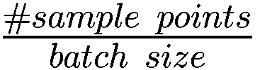。后者返回与索引对应的 *x* 和 *y* 数据子集，该索引指示模型请求哪个批次。在模型训练期间，模型将请求 `__len__() – 1` 的最大索引。您还可以添加一个方法 `__on_epoch_end__()`，该方法在每个周期结束后执行。如果您想在整个训练过程中动态更改数据集参数或以自定义方式衡量模型性能，这个特性非常有帮助。如果您熟悉 PyTorch，您可能会观察到这种自定义 TensorFlow 数据集结构反映了 PyTorch 模型所需的所需数据集定义。

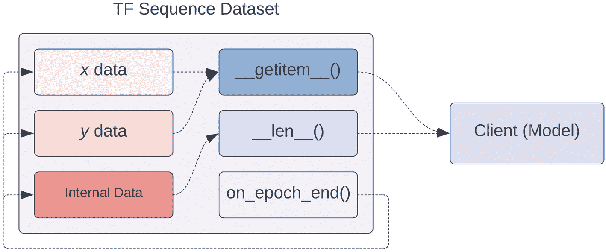

块图展示了 T F 序列数据集，该数据集由导致行为的各个状态组成，进而导致客户端模型。

图 2-3

状态（x 数据、y 数据和内部数据）与行为（__getitem__()、__len__() 和 on_epoch_end() 函数）之间几种可能的安排之一

```py
class CustomData(tf.keras.utils.Sequence):
def __init__(self):
# set up internal variables
def __len__(self):
# return the number of batches
def __getitem__(self, index):
# return a request chunk of the data
Listing 2-4
The general structure of a TensorFlow Sequence dataset inheriting from tf.keras.utils.Sequence
```

通常，自定义序列数据集包含以下特性（参见列表 2-5 中的代码示例）：

+   在初始化时设置的内部数据参数，这些参数在训练过程中要么保持静态，要么发生变化，例如批大小（常量）和图像增强严重程度参数，如模糊核大小或亮度（常量或动态）。

+   一个变量用于跟踪当前周期，该变量在每个 `on_epoch__end()` 调用后更新。

+   内部 x 和 y 字段用于存储数据集或数据集的引用。例如，如果我们的数据集相对紧凑，我们可以在自定义序列数据集中存储数据本身，并在模型请求时简单地索引并返回所需的数据批次。或者，它可能存储图像路径、文本文件或其他形式的引用，这些引用在 `__getitem__(index)` 调用中加载。

+   需要跟踪训练和验证索引的字段（假设这些字段在数据集外部没有处理）。

```py
class CustomData(tf.keras.utils.Sequence):
def __init__(self, param1, param2, batch_size):
self.param1 = param1
self.param2 = param2
self.batch_size = batch_size
self.x_data = ...
self.y_data = ...
self.train_indices = ...
self.valid_indices = ...
self.epoch = 1
def __len__(self):
return len(self.x_data) // self.batch_size
def __getitem__(self, index):
start = index*self.batch_size
end = (index+1)*self.batch_size
relevant_indices = self.train_indices[start:end]
x_ret = self.x_data[relevant_indices]
y_ret = self.y_data[relevant_indices]
return x_ret, y_ret
def on_epoch_end(self):
self.param1 = update(param1)
self.epoch += 1
Listing 2-5
Example filler code for building successful TensorFlow Sequence datasets
```

如果您想跟踪模型性能随时间的变化，定义一个数据集，用模型对象初始化，并在每个周期（或每个周期的倍数）评估模型在内部数据集上的性能。这种伪代码的示例在列表 2-6 中。

```py
class CustomData(tf.keras.utils.Sequence):
def __init__(self, model, k, ...):
self.model = model
self.epochs = 1
self.k = k
self.train_hist = []
self.valid_hist = []
...
def on_epoch_end(self):
if self.epochs % k == 0:
self.train_hist.append(model.eval(train))
self.valid_hist.append(model.eval(valid))
self.epochs += 1
Listing 2-6
One way to track history internally in the custom dataset
```

我们将在第四章和第五章中看到 TensorFlow 序列数据集的示例，当我们构建需要同时将表格和图像输入馈送到两个输入头的模型时。

### 处理大型数据集

生物医学数据代表了现代表格数据集的大部分，例如包含 RNA、DNA 和蛋白质表达等遗传信息的数据集。由于数据的高精度，典型的生物医学数据集通常非常大。因此，通常难以或无法使用 Pandas DataFrames 在内存中操作数据。

使用 TensorFlow 数据集，将已加载到内存中的数据集转换为紧凑的模型数据提供器非常简单。或者，使用序列数据集，可以根据需要从内存或磁盘加载数据的一部分。然而，还有其他工具可以处理大型表格数据集，这些工具可能比 TensorFlow 数据集更方便。我们将从两个方面探讨处理大型数据集的方法——首先探讨可装入内存的数据集，然后是那些不可装入内存的数据集。

#### 可装入内存的数据集

能够装入内存的数据集可以直接在会话中加载。然而，由于硬件限制，使用大型模型进行训练等进一步操作往往会导致内存不足错误。以下方法可用于减少勉强装入内存的数据集的内存占用。这可以允许在不担心内存问题的情况下对数据集进行复杂操作。

##### Pickle

将大型内存中的 Pandas DataFrame 转换为 pickle 文件是减少任何 .csv 数据集文件大小的通用方法。Pickle 文件使用 “.pkl” 扩展名，并且是 Python 特定的文件格式。话虽如此，任何 Python 对象都可以像在列表 2-7 中展示的 Pandas DataFrame 那样以相同的方式进行保存。Pickle 通常是将基于 sklearn 的模型保存和加载的默认方法（因为缺乏保存和加载功能的原始支持）。由于 pickle 采用了高效的存储方法，它不仅可以减少原始 .csv 文件的大小，而且可以比 Pandas DataFrame 快 100 倍的速度加载。

```py
import pickle
# saving
with open("path/to/file", "wb") as f:
pickle.dump(dataframe, f)
# loading
with open("path/to/file", "rb") as f:
loaded_dataframe = pickle.load(f)
Listing 2-7
Saving and loading Pandas DataFrames using pickle files
```

或者，也可以使用 `pd.load_pickle` 加载 pickle 文件。

##### SciPy 和 TensorFlow 稀疏矩阵

如果您的数据集特别稀疏——一个常见的原因是存在许多独热编码的列——您可以使用 SciPy 或 TensorFlow 稀疏矩阵存储对象。

SciPy 提供了多种不同的稀疏矩阵方法。压缩稀疏行（CSR）格式支持高效的行切片，并可能成为高效样本访问的首选数据存储对象。您可以从 `from scipy.sparse import csr_array` 导入 CSR 对象，并将其用作其他数组对象（如 NumPy 数组、元组或列表）的包装器。另外，`csc_array` 支持高效的列索引。在幕后，非零元素通过它们的索引、列和值进行存储；稀疏矩阵支持高效的数学运算和转换。在 `scipy.sparse` 中还有五种其他类型的稀疏数组/矩阵，它们的实例化过程稍微复杂一些。有关更多信息，请参阅 SciPy 稀疏矩阵文档。请注意，大多数 scikit-learn 模型都接受 SciPy 稀疏矩阵作为输入。

虽然 SciPy 矩阵确实高效且与许多其他操作兼容，但它们不能直接传递给 TensorFlow/Keras 模型，除非进行额外的工作。TensorFlow 支持稀疏张量格式，可以通过 `tf.sparse.from_dense` 调用。与 SciPy 类似，稀疏张量以三个标准（密集）张量的组合形式存储：索引（位置）、值和张量形状。这提供了高效存储稀疏数据所需的信息。您可以使用标准的 `tf.data.Dataset.from_tensor_slices` 将稀疏张量转换为 TensorFlow 数据集，这仍然保留了稀疏性，并且可以用于更高效的训练。

#### 无法装入内存的数据集

内存无法容纳的数据集无法在一次会话中一次性加载。由于每个单独的图像都存储在其自己的文件中，我们可以分批加载大型图像数据集。在 TensorFlow 中（我们将在未来的章节中看到），图像可以轻松地从磁盘以小批量加载。然而，大多数表格数据集并不是按样本样本的方式组织的；相反，整个数据集通常存储在一个文件中。在以下方法中，我们将探讨可以将整个数据集“预加载”到磁盘上的方法，同时能够通过典型方式访问数据。

##### Pandas 分块器

如果你有一个太大而无法直接加载到内存中的 CSV 文件，你可以通过指定`iterator=True`参数来使用迭代器。你可以指定块大小，这决定了每次迭代将加载多少行。我们可以直接将其构建到 TensorFlow 自定义数据集中，如下所示（2-8），其中迭代器被保留为数据集内部变量，每次调用索引数据时都会返回下一个块。请注意，虽然 TensorFlow 将使用索引，但这个索引对于函数内部编写的代码来说是无关紧要的。这意味着每个块只能调用一次；下一次调用时，将返回下一个块。

```py
class CustomData(tf.keras.utils.Sequence):
def __init__(self, filename, chunksize):
self.csv_iter = pd.read_csv(filename,
iterator=True,
chunksize=chunksize)
def __getitem__(self, index):
for chunk in self.csv_iter:
return chunk
Listing 2-8
A custom TensorFlow Sequence dataset using Pandas chunking
```

这使我们能够通过直接从文件中读取，以更小的内存占用将数据流式传输到模型中。

##### h5py

当数据集太大而无法加载到内存中时，我们希望有一种方法可以按需分批加载其部分。然而，说起来容易做起来难。例如，无法直接加载到 Pandas DataFrame 中的大型 CSV 文件，按需分块就变得困难。之前介绍的 Pandas 分块器只能用作迭代器，其中每个块只返回一次，并按顺序返回。同样，许多其他类型的大型数据也适用。

Python 库 h5py 提供了保存和加载分层数据格式（h5）文件的能力。与 .csv 文件相比，h5 是一种更压缩的存储格式，并且不能被典型的电子表格/文档程序解释/打开。h5py 通过变量在程序和磁盘之间创建直接引用，这使得程序可以直接索引和访问磁盘上存储的（通常比内存大小大得多）数据集的选定部分。本质上，一旦在程序中定义的变量和磁盘上存储的数据集之间建立引用链接，链接的变量就可以像任何其他 NumPy 数组一样处理。为了理解和应用对 h5 文件的操作，我们首先将使用 `create_dataset` 方法实例化一个 h5 数据集。该方法需要两个参数：（a）文件内数据集的名称和（b）数据的形状。如列表 2-9 所示，我们编写了一个包含两个名为“`group_name1`”和“`group_name2`”的组的 h5 文件，这两个组都包含形状为 `(100, 100)` 的二维矩阵。

```py
import h5py
import numpy as np
# the hdf5 extension simply means the 5th version of the h5 format
with h5py.File("path/to/file.hdf5", "w") as f:
group1 = f.create_dataset("group_name1", (100, 100),
dtype="i8") # int8
group2 = f.create_dataset("group_name2", (100, 100),
dtype="i8") # int8
# optional argument "data" to create dataset from np arrays
Listing 2-9
Creating a h5 dataset
```

要将数据插入空数据集，我们可以使用类似 NumPy 的索引符号访问数据集的某些部分（或使用“`[:]`”访问整个数据集）。

```py
group1[10, 10] = 10
group1[2, 50:60] = np.arrange(10)
Listing 2-10
Inserting contents into a h5 dataset
```

我们可以以类似的方式读取 h5 文件并访问其“数据集键”。

```py
f = h5py.File("path/to/file.hdf5", "r")
Listing 2-11
Reading a h5 file
```

我们之前创建的“数据集键”（`group1` 和 `group2`）可以看作是字典中的键值对。可以通过“`f.keys()`”访问 h5 文件中存在的键列表。请注意，键可以是嵌套的，这意味着可能存在更多与顶级键下的数据对应的键。在键下包含的值（例如我们为 `group1` 和 `group2` 定义的 `(100, 100)` 矩阵）可以通过与从 Python 字典中检索值相同的方式检索。

```py
# access a certain dataset using key-value pairs
f["group1"][:] # retrieves everything from group 1
Listing 2-12
Retrieving values from keys in a h5 file
```

索引值将被加载到内存中。我们可以使用这一点与 TensorFlow 数据集结合，以便对大型表格数据集进行训练。

h5py 库提供了方便且通用的解决方案，用于加载不适合内存的数据以及显著减小文件的实际大小。有关操作 h5 文件的其他详细信息，请参阅 h5py 文档。

##### NumPy 内存映射

NumPy 内存映射可以看作是 h5 的快速且简单的替代方案，用于将程序中的变量映射到磁盘上存储的数据。通过将文件路径包装在 `np.memmap` 中，创建了一个将 `np.memmap` 返回值的变量分配与磁盘上存储的文件之间的链接。`np.memmap` 接受的两个流行的文件路径是 `.npy` 和 `.npz` 文件，分别存储 NumPy 数组和 SciPy 稀疏矩阵。具体来说，NumPy 内存映射的简单用法可以是这样的：`arr = np.memmap("path/to/arr")`。变量“`arr`”将包含对由 `memmap` 调用指定的磁盘上存储的文件的引用。有关其他可选参数的详细信息，请参阅 NumPy 内存映射的文档。

## 数据编码

我们将数据编码定义为使数据仅对任何算法（特征提取、特征选择、机器学习模型等）可读的过程，这些算法可能随后应用于数据集（图 2-4）。在这里，“可读”不仅意味着“定量”（如第一章所述，机器学习模型需要以某种方式以数值形式表示输入）而且意味着“代表数据的本质。”例如，我们可以技术上使包含世界各国特征的特性“可读”，这样就不会因为随机将一个国家与一个唯一的数字关联而产生代码运行错误——美国为 483.23，加拿大为-84，印度为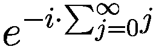，等等。然而，这种任意的数值转换并不代表特性的本质：这些表示之间没有反映所表示事物之间关系的相关关系。为了“可读”，特征数值表示必须忠实于其属性。

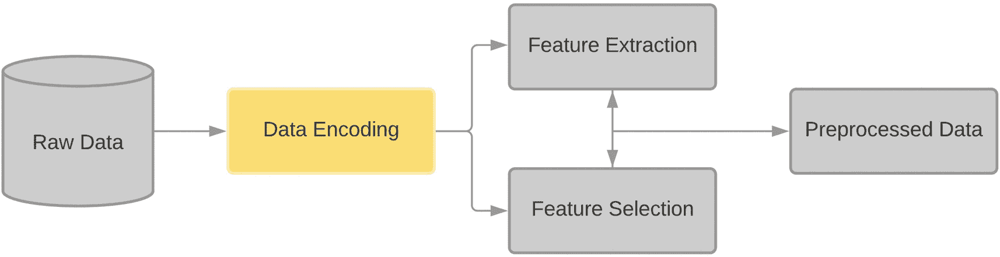

流程图如下所示，原始数据；数据编码，分为特征提取和特征选择；这进一步导致预处理数据。

图 2-4

数据预处理管道中的数据编码组件

### 离散数据

我们将“离散”数据定义为只能理论上取有限集合值的数。这些可以是二元特征（例如，“是”或“否”的响应），多类特征（例如，动物类型）或有序数据（例如，教育等级或分层特征）。有许多不同的机制来表示离散数据中包含的信息，称为*分类编码*。本节将探讨这些方法的原理和实现。

我们将使用 Ames 住房数据集的一部分（图 2-5）来演示这些分类编码方法。您可以按以下方式加载它（代码列表 2-13）。

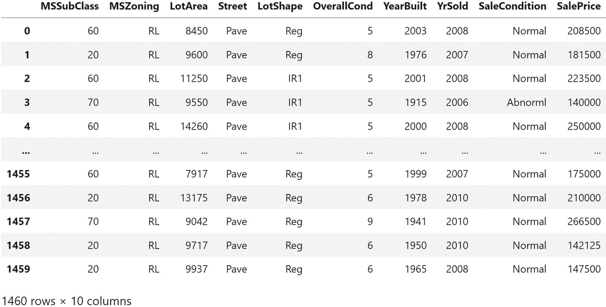

一个表格由 1460 行和十个列组成，描述了住房数据集的分类特征。

图 2-5

可视化 Ames 住房数据集的一部分

```py
df = pd.read_csv('https://raw.githubusercontent.com/
hjhuney/Data/master/AmesHousing/train.csv')
df = df.dropna(axis=1, how='any')
df = df[['MSSubClass', 'MSZoning', 'LotArea', 'Street',
'LotShape', 'OverallCond', 'YearBuilt',
'YrSold', 'SaleCondition', 'SalePrice']]
Listing 2-13
Reading and selecting part of the Ames Housing dataset
```

该数据集具有许多分类特征。虽然我们只会对数据集中的单个分类特征进行一致的分类编码，但鼓励您尝试数据集中的每个不同特征。

#### 标签编码

标签编码可能是编码离散数据最简单、最直接的方法——每个独特的类别都与一个单独的整数标签相关联（见图 2-6）。这几乎永远不是你应该用于分类变量的最终编码，因为以这种方式附加编码迫使我们做出*任意决策*，从而导致*有意义的后果*。如果我们把类别值“Dog”与 1 关联，而“Snake”与 2 关联，那么模型就可以访问到显式编码的定量关系，即“Snake”在数量上是“Dog”的两倍，或者“Snake”比“Dog”大。此外，没有充分的理由说明为什么“Dog”应该被标记为 1，而“Snake”应该被标记为 2，而不是相反。

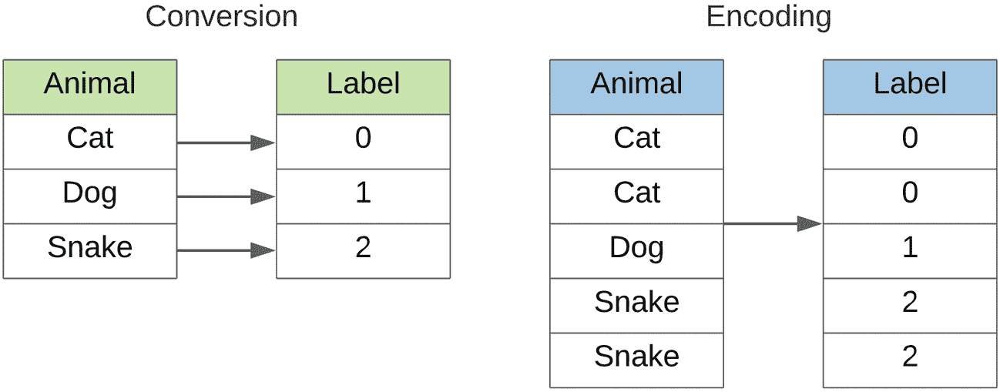

一个插图说明了以下两步过程：转换和编码。在第 1 步中，每个动物的名字被标记为一个整数。在第 2 步中，动物名字的重复导致分配给它的整数。

图 2-6

标签编码

然而，标签编码是许多其他编码的基础/主要步骤。因此，了解如何实现它是很有用的（见列表 2-14）。

我们可以通过使用`np.unique()`收集唯一元素，将每个唯一元素映射到一个索引，然后将映射应用于原始数组中的每个元素，从头开始实现标签编码。为了创建映射，我们使用 Python 的一个优雅特性——字典推导式，它允许我们快速构建具有逻辑结构的字典。我们通过`enumerate()`函数遍历，该函数接受一个数组并返回一个包含元素及其相应索引的列表（例如，`enumerate(['a','b','c'])`产生`[('a', 0), ('b', 1), ('c', 2)]`）。这可以被解包并重新组织成一个字典，以创建所需的映射。

```py
def label_encoding(arr):
unique = np.unique(arr)
mapping = {elem:i for i, elem in enumerate(unique)}
return np.array([mapping[elem] for elem in arr])
Listing 2-14
Label encoding “from scratch”
```

将从头开始实现的标签编码应用于数据集的`LotShape`特征，得到了令人满意的结果（见列表 2-15）。

```py
lot_shape = np.array(df['LotShape'])
# array(['Reg', 'Reg', 'IR1', ..., 'Reg', 'Reg', 'Reg'])
encoded = label_encoding(lot_shape)
# array([3, 3, 0, ..., 3, 3, 3])
Listing 2-15
Applying label encoding
```

然后，我们可以使用`df['LotShape'] = encoded`更新/替换原始 DataFrame 中的编码特征。

`sklearn`库提供了一个标签编码的实现（见列表 2-16）。这比自行实现编码方法更高效、更方便，通常足以满足需求，除非你的问题需要一个非常专门的编码方法。

在 scikit-learn 中，使用`sklearn.preprocessing.LabelEncoder()`对象来存储关于编码过程的信息。初始化对象后，可以使用`.fit(feature)`在提供的特征上进行拟合，然后使用`.transform(feature)`来转换任何给定的输入；或者，这两个步骤可以合并为一个命令，即`.fit_transform(feature)`。

```py
from sklearn.preprocessing import LabelEncoder
encoder = LabelEncoder()
encoded = encoder.fit_transform(df['LotShape'])
Listing 2-16
Applying label encoding using sklearn
```

这种面向对象的设计是有帮助的，因为它允许额外的可访问功能，例如逆编码（inverse encoding），我们希望从编码表示中获取原始输入：`classes = encoder.inverse_transform(encoded)`。当我们有一个编码形式的预测（例如，“2”）并希望通过“逆转换/编码”来解释它时（例如，“猫”被编码为“2”，因此对“2”进行逆转换的结果是“猫”）非常有用。

一个缺少这种额外逆功能的功能更轻量级的函数是`pandas.factorize(feature)`。

#### One-Hot Encoding

在无法附加明确定量标签的类别变量情况下，通常最简单令人满意的选项是**独热编码**。如果有*n*个唯一类别，我们创建*n*个二进制列，每列代表项目是否属于该类别。因此，对于每一行（以及所有其他行），每个*n*列中都将有一个“1”（其余为“0”）（见图 2-7）。

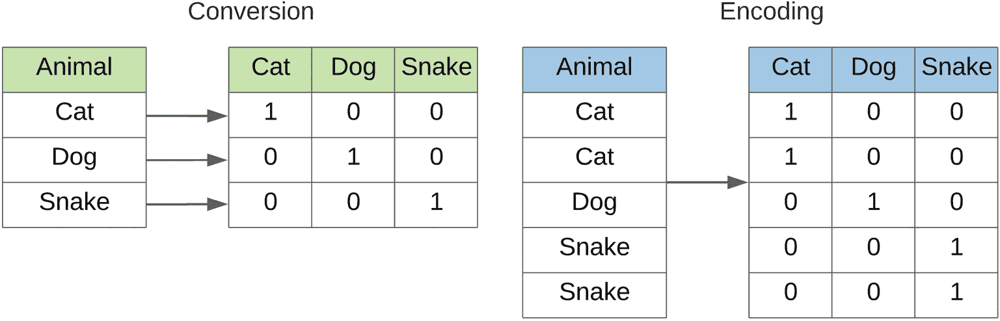

以下是一个展示两步过程的说明，即转换和编码。在第一步中，每个动物的名字被标记为 1，其他为 0。在第二步中，动物的名字和其他类别的重复导致 1 和 0。

图 2-7

独热编码

我们可以将独热编码视为首先应用标签编码为每个项目获得一些整数标签*i*，然后生成一个矩阵，其中与每个项目关联的向量的*i*个索引被标记为“1”（其余为“0”）（见清单 2-17）。这可以通过初始化形状为`(项目数量, 唯一类别数量)`的零数组来实现。对于每个项目，我们索引适当的值并将其设置为 1。处理完所有项目后，我们返回编码矩阵。

```py
def one_hot_encoding(arr):
labels = label_encoding(arr)
encoded = np.zeros((len(arr), len(np.unique(arr))))
for i in range(len(arr)):
encoded[i][labels[i]] = 1
return encoded
Listing 2-17
One-hot encoding “from scratch”
```

编码后的结果允许我们以原始原始列中存在的方式表示相同的信息，而无需向任何可能处理它的模型或方法任意传达有影响的定量假设：

```py
[[0\. 0\. 0\. 1.]
[0\. 0\. 0\. 1.]
[1\. 0\. 0\. 0.]
...
[0\. 0\. 0\. 1.]
[0\. 0\. 0\. 1.]
[0\. 0\. 0\. 1.]]
```

因为独热编码（one-hot encoding）被广泛使用，所以有很多库提供了实现：

+   `pandas.get_dummies(feature)`接受一个表示分类特征的数组，并自动返回相应的独热编码。函数名称中的“dummies”指的是编码结果中的虚拟变量/特征，它们是“人为创建”的属性——在某种意义上——允许我们以定量形式忠实捕捉数据。Keras 深度学习库（使用`pip install keras`安装）也提供了一个类似轻量级的函数：`keras.to_categorical(feature)`。虽然使用起来很快，但缺点是，像解码这样的更高级功能可能无法访问。

+   `sklearn.preprocessing.OneHotEncoder()`是 scikit-learn 对独热编码的实现。像标签编码器一样，它必须被初始化，然后可以在输入数据上拟合，并使用`encoder.fit_transform(features)`一条命令进行编码。可以使用`encoder.inverse_transform(encoded)`将独热编码数据转换为其原始的类别单特征表示。

+   TensorFlow/Keras 也提供了文本的独热编码。参见本节“文本数据”小节以了解更多信息。

然而，使用独热编码可能引发的一个问题是*多重共线性*。当几个特征高度相关，以至于其中一个可以可靠地被预测为其他特征的线性关系时，就会发生多重共线性。在独热编码中，每行的特征值之和总是 1；如果我们知道某行所有其他特征值，我们也就知道了剩余特征值。

这可能成为问题，因为每个特征不再独立，而许多机器学习算法（如*K*最近邻（KNN）和回归）假设数据集的每个维度都不与其他维度相关。虽然多重共线性可能只会对模型性能产生轻微的负面影响（这通常可以通过正则化和特征选择来解决——参见本章的“特征选择”部分），但更大的问题是参数解释的影响。如果一个线性回归模型中的两个独立变量高度相关，那么在训练后得到的参数几乎毫无意义，因为模型可能使用另一组参数也能表现得一样好（例如，交换两个参数，解的多重性不明确）。高度相关的特征充当近似重复项，这意味着相应的系数也会减半。

解决独热编码中多重共线性的一种简单方法是在编码的特征集中随机删除一个（或几个）特征。这会破坏每行均匀的 1 之和，同时仍然保留每个项目的唯一值组合（由于标记为“1”的特征被删除，其中一个类别将由所有零定义）。缺点是编码类之间的表示平等现在不平衡，这可能会破坏某些机器学习模型——特别是那些利用正则化的模型。为了获得最佳性能的要点：选择正则化+特征选择或列删除，但不要两者都选。

可以通过在初始化`OneHotEncoder`对象时传递`drop='first'`来实现`sklearn`中的列删除。或者，你可以使用`encoded[:, 1:]`索引形状为`(number_items, number_unique_classes)`的独热编码数组；这会删除第一个独热编码列。

另一个问题是*稀疏性*：信息与空间的比例非常低。为每个唯一值创建一个新列。一些机器学习模型可能难以在如此稀疏的数据上学习。

在现代深度学习中，独热编码是一个广泛接受的标准。（许多库，如 Keras/TensorFlow - 我们将使用它进行神经网络建模 - 接受标签编码的输入以进行类别区分，并在幕后为您执行独热编码。）今天使用的神经网络通常很深且足够强大，可以有效地处理独热编码。然而，在许多情况下 - 尤其是与传统的机器学习模型和浅层神经网络一起使用时 - 可能需要更好的替代分类编码技术。

#### 二进制编码

独热编码的两个弱点 - 稀疏性和多重共线性 - 可以通过二进制编码来解决，或者至少可以改善。分类特征被标签编码（即，每个唯一的类别都与一个整数相关联）；标签被转换为二进制形式，并转移到一组特征中，其中每一列代表一个位值（图 2-8）。也就是说，为二进制表示的每个位位置创建一个列。

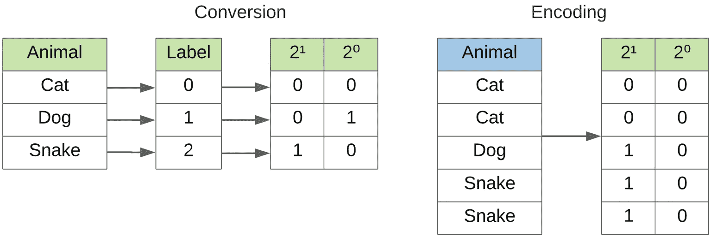

两个用于转换和编码的表格集。在转换中，每个动物的名字都被标记并进行了二进制编码。在编码中，动物名字的重复导致相应的整数。

图 2-8

二进制编码

由于我们使用二进制表示而不是为每个唯一类别分配一列，所以我们更紧凑地表示相同的信息（即，相同的类别在特征中具有相同的“1”和“0”组合），这以降低可解释性（即，不清楚每一列代表什么）为代价。此外，用于表示分类信息的每个特征之间没有可靠的多重共线性。

我们可以通过首先获取给定数组的标签编码，然后将它们转换为二进制来实现从头开始的二进制编码（列表 2-18）。以下是逐步给出的伪代码：

1.  获取数组的整数标签编码。

1.  找到二进制表示的“最大位数” - 这是我们存储标签的二进制表示所需的最大位数。例如，数字“9”是 1001（1 · 2³ + 0 · 2² + 0 · 2¹ + 1 · 2⁰）；这意味着我们需要四个位置来表示它。我们需要找到最大位数以确定编码矩阵的大小：（元素数量，最大位数）。这可以通过计算⌊*v* ⌋得出，其中*v*是一个标签编码整数的列表。对*v*的基 2 对数取整返回 2 可以提升的最大幂，以产生小于*v*的值。我们加 1 是为了考虑到*c* · 2⁰额外占用的位置。

1.  分配一个形状为（元素数量，最大位数）的零数组。

1.  对于数组中的每个项目

    1.  将当前标签编码值除以当前位的 2，这将得到 0 或 1，表示当前标签编码值是否大于 2 的当前位。这个值将在相关的编码矩阵中标记。

    1.  将当前标签编码值设置为除以 2 的当前位的余数。这允许我们“去除”当前位，并专注于“下一个”位。

    1.  获取相关的标签编码。

    1.  从最大位开始计数，逆序到 0。

```py
def binary_encoding(arr):
labels = label_encoding(arr)
max_place = int(np.floor(np.math.log(np.max(labels), 2)))
encoded = np.zeros((len(arr), max_place+1))
for i in range(len(arr)):
curr_val = labels[i]
for curr_place in range(max_place, -1, -1):
encoded[i][curr_place] = curr_val // (2 ** curr_place)
curr_val = curr_val % (2 ** curr_place)
return encoded
Listing 2-18
Binary encoding “from scratch”
```

样本数组`['a', 'b', 'c', 'c', 'd', 'd', 'd', 'e']`的二进制编码结果如下：

```py
array([[0., 0., 0.],
[1., 0., 0.],
[0., 1., 0.],
[0., 1., 0.],
[1., 1., 0.],
[1., 1., 0.],
[1., 1., 0.],
[0., 0., 1.]])
```

二进制编码由`category_encoders`支持（列表 2-19，图 2-9）。

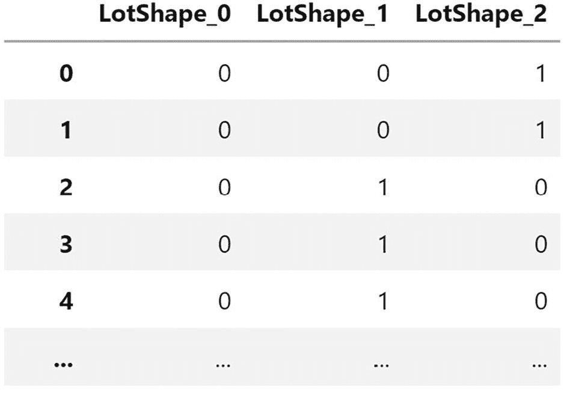

一个表格由三列组成，表示房屋的特征和行中的数据集。

图 2-9

在 Ames 房屋数据集上的二进制编码

```py
from category_encoders.binary import BinaryEncoder
encoder = BinaryEncoder()
encoded = encoder.fit_transform(df['LotShape'])
Listing 2-19
Binary encoding using category_encoders
```

#### 频率编码

标签编码、独热编码和二进制编码各自提供了一种编码方法，以反映每个唯一类别的“纯粹身份”；也就是说，我们设计定量方法为每个类别分配一个唯一的身份。

然而，我们既可以一次性为每个类别分配唯一值，也可以同时传达每个类别的额外信息。为了频率编码一个特征，我们将每个分类值替换为该类别在数据集中出现的比例（图 2-10）。使用频率编码，我们传达该类别在数据集中出现的频率，这可能对正在处理它的任何算法有价值。

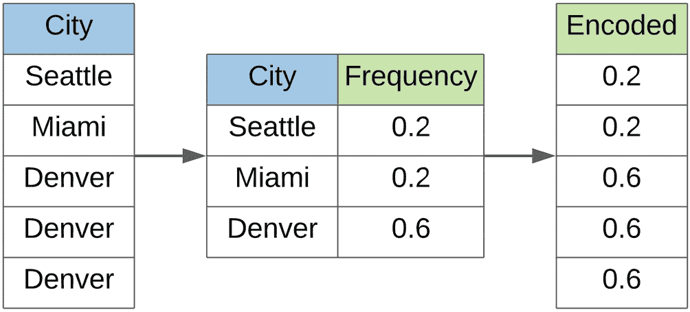

一组表格表示频率编码过程，其中城市名称重复的次数给出其频率，从而导致编码。


频率编码

与独热编码和二进制编码一样，我们为每个类别附加一个唯一的定量表示（尽管频率编码不保证唯一的定量表示，尤其是在小数据集中）。然而，这种编码方案的实际值位于一个连续的尺度上，编码之间的定量关系不是任意的，而是传达了一些信息。在前面的例子中，“丹佛”是“三次”迈阿密，因为它在数据集中出现的频率是迈阿密的 3 倍。

当数据集具有代表性且无偏差时，频率编码是最强大的。如果情况不是这样，实际的定量编码可能没有意义，即在建模目的上不提供相关和真实/代表性的信息。

要实现频率编码（见列表 2-20），我们可以首先使用`np.unique(arr, return_counts=True)`获取提供的特征中唯一标签及其出现频率。然后，我们将频率缩放到 0 到 1 之间，创建一个映射字典将每个标签映射到频率，创建一个映射函数应用该字典，并将数组推入向量化映射函数中。

```py
def frequency_encoding(arr):
labels, counts = np.unique(arr, return_counts=True)
counts = counts / np.sum(counts)
mapping_dic = {labels[i]:counts[i] for i in range(len(counts))}
mapping = lambda label:mapping_dic[label]
return np.vectorize(mapping)(arr)
Listing 2-20
Frequency encoding “from scratch”
```

我们可以在`df['LotShape']`上调用`frequency_encoding()`，得到`array([0.63, 0.63, 0.33, ..., 0.63, 0.63, 0.63])`（值已使用`np.round(arr, 2)`四舍五入到两位小数）。

类别编码器库（`pip install category_encoders`）包含频率编码等额外分类编码方案的 scikit-learn 风格实现。语法看起来很熟悉（见列表 2-21）。

```py
from category_encoders.count import CountEncoder
encoder = CountEncoder()
encoded = encoder.fit_transform(df['LotShape'])
Listing 2-21
Frequency encoding using category_encoders
```

结果是一个包含一列的 DataFrame（见图 2-11）。这是使用`category_encoders`的一个优点：它被设计为可以接受和返回多种不同的常见数据科学存储对象。因此，我们可以传递一个 DataFrame 列并返回一个 DataFrame 列，而不是在之后需要将编码后的 NumPy 数组与原始 DataFrame 集成。如果您希望得到 NumPy 数组输出，请在编码器对象的初始化中设置`return_df = False`（默认为`True`）。

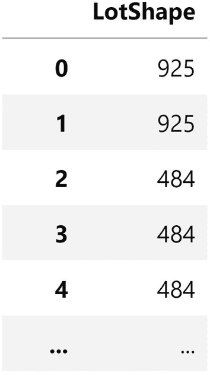

一个表格包含两个列，标题为 lotshape，列出数据集及其频率。

图 2-11

对 Ames 住房数据集中的特征进行频率编码

注意，`category_encoders`实现的频率编码不会将频率缩放到 0 到 1 之间，而是将每个类别与原始计数（在数据集中出现的次数）关联起来。您可以通过在`CountEncoder()`初始化中传递`normalize = True`来强制缩放。

您也可以将整个 DataFrame 传递给`encoder.fit_transform`或`encoder.fit`。如果您不希望所有分类列自动通过频率编码进行编码，请通过`cols = ['col_name_1', 'col_name_2', ...]`指定要编码的列。

#### 目标编码

频率编码通常不令人满意，因为它通常不能直接反映与使用它的模型直接相关的类中的信息。目标编码是一种尝试更直接地建模分类类 *x* 和要预测的因变量 *y* 之间的关系的方法，通过用该类中 *y* 的平均值或中值（分别）值来替换每个类。假设目标类已经以定量形式存在，尽管目标不一定需要是连续的（即回归问题）才能用于目标编码。例如，对二元分类标签取平均值，这些标签要么是 0 要么是 1，可以揭示数据集中具有该类的项目中有多少与类 0 相关（见图 2-12 和 2-13）。这可以解释为仅给定一个独立特征时项目属于目标类的概率。

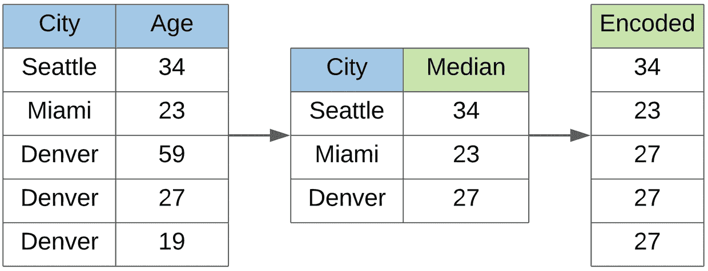

一组表格显示了目标编码过程，其中每个城市名称被分配一个年龄，这导致计算中值，进而导致编码值。

图 2-13

使用中值进行目标编码


一组表格描述了目标编码过程，其中每个城市名称被分配一个年龄，这导致计算平均值，进而导致编码值。

图 2-12

使用平均值进行目标编码

注意，如果编码在训练集和验证集分割之前执行，目标编码可能会导致数据泄露，因为平均函数结合了训练集和验证集的信息。为了防止这种情况，在分割后分别对训练集和验证集进行编码。如果验证数据集太小，独立地对集合进行目标编码可能会导致偏差、不具代表性的编码。在这种情况下，可以使用训练数据集中每个类的平均值。这种“数据泄露”形式本身并不是问题，因为我们使用训练数据来指导验证集上的操作，而不是使用验证数据来指导训练集上的操作。

要实现目标编码（见代码列表 2-22），我们需要接受分类特征（我们将称之为 `x`）和目标特征（我们将称之为 `y`）。我们将创建一个映射字典，将每个唯一的分类值映射到与该分类值相对应的 `y` 中所有值的平均值或中值。然后，我们将定义一个函数，使用映射来返回给定类的编码，并将它的向量化版本应用于给定的特征 `x`。

```py
def target_encoding(x, y, mode='mean'):
labels = np.unique(x)
func = np.mean if mode=='mean' else np.median
mapping_dic = {label:func(y[x==label]) for label in labels}
mapping = lambda label:mapping_dic[label]
return np.vectorize(mapping)(x)
target_encoding(df['Lot Shape'], df['SalePrice'])
# returns array([164754.82, 164754.82, 206101.67, ...])
Listing 2-22
Target encoding “from scratch”
```

`category_encoders` 库也支持目标编码（见代码列表 2-23，图 2-14）。

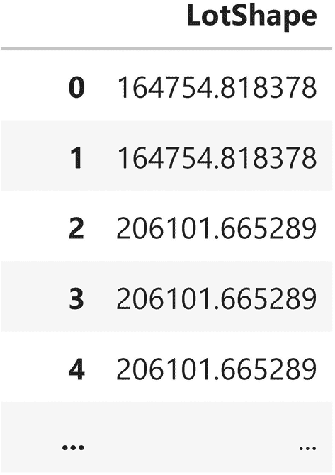

一个表格列出了使用目标编码在各种数据集上得到的最终值。

图 2-14

使用 category_encoders 进行目标编码的结果

```py
from category_encoders.target_encoder import TargetEncoder
encoder = TargetEncoder()
encoded = encoder.fit_transform(df['LotShape'], df['SalePrice'])
Listing 2-23
Target encoding using category_encoders
```

注意，此实现提供了更高级的功能，包括对多类别目标的支持。要编码的特征被替换为给定特定标签的目标的后验概率和目标在整个数据集中的先验概率的组合。将其视为将类别值与连续目标之间的关系推广到用“期望值”替换每个类别值的思想。

与所有 `category_encoders` 编码对象一样，如果你提供了一个带有 `cols = [...]` 的 DataFrame，你可以选择要编码的列，并通过 `return_df = True/False` 确定返回类型。这个特定的编码器提供了两个额外的规范：`min_samples_leaf`，这是考虑类别平均值的所需最小数据样本数（将其设置得高一些，以理想地消除表示不良数据点的负面影响），以及平滑，这是一个大于零的浮点值，它控制着类别平均数和类别目标先验之间的平衡。更高的值会更强地正则化平衡。通常，无需调整此值。

#### 留一法编码

基于平均值的目标编码可能非常强大，但它受到异常值的影响。如果存在异常值，它们会扭曲平均值，其影响会在整个数据集中留下印记。留一法编码是目标编码方案的一种变体，在计算该类所有项目的平均值时，不考虑“当前”项/行（见图 2-15）。与目标编码一样，编码应在训练集和验证集上分别执行，以防止数据泄露。

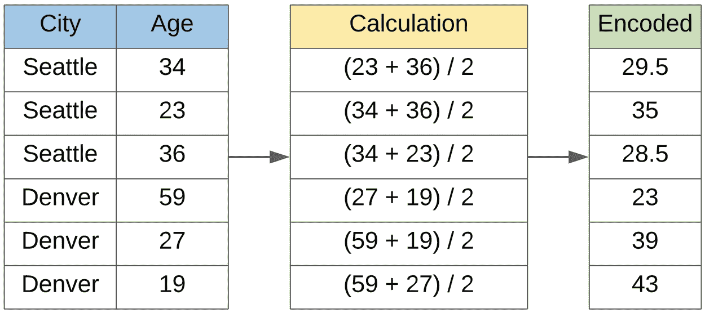

一系列表格描述了以下三个步骤的过程。在第一步中，每个城市名称被分配了不同的年龄。在第二步中，确定平均值。在第三步中，对值进行编码。

图 2-15

使用平均值的留一法编码

留一法编码可以解释为 *k*-折数据分割方案的极端情况，其中 *k* 等于数据集长度，因此“模型”（在这种情况下是一个简单的平均函数）应用于除一个以外的所有相关项（见列表 2-24）。

```py
def leave_one_out_encoding(x, y, mode='mean'):
labels = np.unique(x)
func = np.mean if mode=='mean' else np.median
encoded = []
for i in range(len(x)):
leftout = y[np.arange(len(y)) != i]
encoded.append(np.mean(leftout[x == x[i]]))
return np.array(encoded)
Listing 2-24
Leave-one-out encoding “from scratch”
```

`category_encoders` 支持留一法编码（见列表 2-25，图 2-16）。

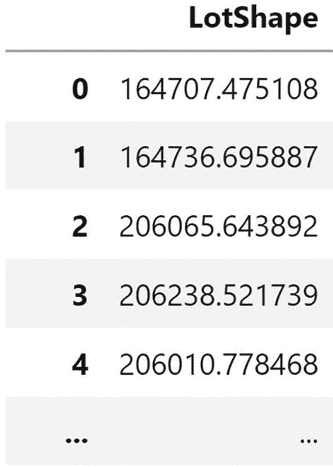

一个表格列出了来自住房数据集的特征的编码值。

图 2-16

在 Ames 住房数据集的特征上进行留一法编码

```py
from category_encoders.leave_one_out import LeaveOneOutEncoder
encoder = LeaveOneOutEncoder ()
encoded = encoder.fit_transform(df['LotShape'], df['SalePrice'])
Listing 2-25
Leave-one-out encoding using category_encoders
```

#### James-Stein 编码

目标编码和留一法编码假设每个分类特征直接且线性地与因变量相关。我们可以通过结合特征的整体均值和每个类别的个体均值来采用更复杂的编码方法，即 James-Stein 编码（图 2-17）。这是通过定义类别的编码为整体均值 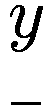 和每个类别的个体均值 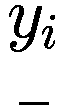 的加权总和来实现的，通过参数 *β*，其范围为 0 ≤ *β* ≤ 1：

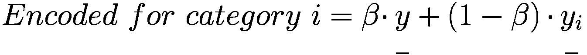

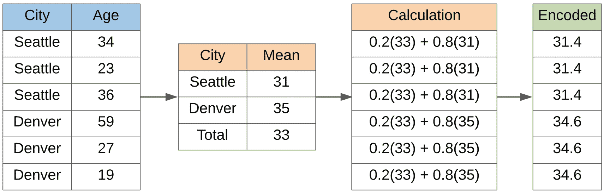

一组表格显示了以下四个步骤的过程。在第 1 步中，每个城市名称被分配了各种年龄。在第 2 步中，确定平均值。在第 3 步和第 4 步中，分别计算和编码值。

图 2-17

James-Stein 编码

当*β* = 0 时，James-Stein 编码与基于均值的目标编码相同。另一方面，当*β* = 1 时，James-Stein 编码将列中的所有值替换为平均因变量值，无论个体类别值如何。

斯坦福大学统计学家和统计学教授 Charles Stein 提出了一个公式来寻找*β*，而不是手动调整它。组方差是在相关类别内因变量的方差，而总体方差是不考虑类别的因变量的总体方差：

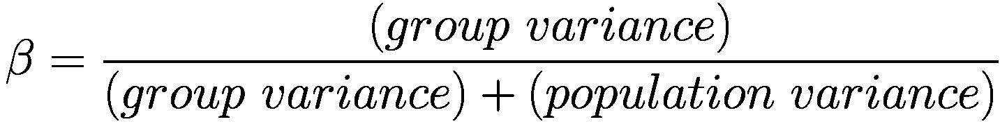

方差对于理解均值作为类别代表或*不确定性*的相关性非常重要。理想情况下，当我们不确定均值对某个类别的代表性时，我们希望设置一个高的*β*值。这允许整体因变量的均值相对于特定类别的均值具有更高的权重。同样，当与某个类别的均值相关的不确定性较低时，我们希望一个低的*β*值。这通过 Stein 的公式进行量化：如果组方差显著低于总体方差（即，特定类别的值变化较小，因此我们更有“确定性”/“确定性”地认为该类别的均值具有代表性），则*β*接近 0；否则，它更接近 1。

James-Stein 编码在 `category_encoders` 库中实现（列表 2-26，图 2-18）。

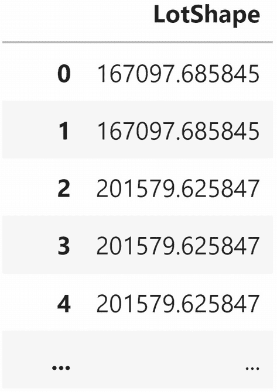

表格有两个列标题 lotshape，列出了来自住房数据集的特征的编码值。

图 2-18

Ames 住房数据集上的 James-Stein 编码

```py
from category_encoders import JamesSteinEncoder
encoder = JamesSteinEncoder()
encoded = encoder.fit_transform(df['LotShape'], df['SalePrice'])
Listing 2-26
James-Stein encoding using category_encoders
```

#### 证据权重

证据权重（WoE）技术起源于信用评分；它被用来衡量一组 *i* 中好客户（偿还了贷款）与坏客户（违约了贷款）的“可分离性”如何（这可能像客户位置、历史等）：

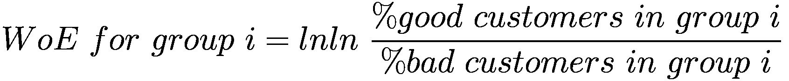

例如，假设在每天至少刷三次牙的客户子集中（我们不会考虑贷款者是如何得到这个信息的），75% 偿还了贷款（好客户），25% 违约了（坏客户）。那么，关于特征/属性“每天至少刷三次牙”的组权重为 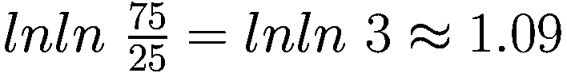。这是一个适度的权重，意味着建议的特征/属性很好地将好客户和坏客户分开。

这个概念可以用作具有二元-分类因变量的分类特征的编码：

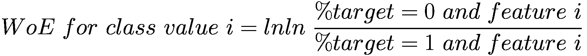

证据权重通常表示证据削弱或支持假设的程度。在分类编码的上下文中，“假设”是选定的分类特征可以干净地划分类别，以至于我们可以可靠地预测一个项目属于哪个类别，仅根据其是否包含在组 *i* 中的信息。而“证据”是目标值在某个组 *i* 中的实际分布。

我们还可以通过为每个类别找到 WoE 来将此推广到多类问题，其中“类别 0”是“在类别中”，“类别 1”是“不在类别中”；然后可以通过某种方式聚合个别类特定的 WoE 计算，例如，通过取平均值来找到整个数据集的权重。

使用这种多类 WoE 逻辑，我们还可以通过将目标离散化为 *n* 个分类桶来将 WoE 应用于连续目标/回归问题。这把连续目标转换成了分类目标。桶可以是等长的范围（例如，从 *a* ≤ *x* < *a* + *b* → 类别 1，*a* + *b* ≤ *x* < *a* + 2*b* → 类别 2，*a* + 2*b* ≤ *x* < *a* + 3*b* → 类别 3 等）或等大小的箱（例如，类别 1 的第 0-10 个百分位，类别 2 的第 10-20 个百分位等）。

权重编码器由`category_encoders`支持；然而，目标变量必须是二进制分类变量。如果您希望将权重编码应用于多类或连续目标变量上下文，您必须执行您自己需要的预处理。

由于明显的原因，权重编码在训练-验证分割之后通常效果不佳——如果没有一个非常大且具有代表性的样本组，我们就无法计算该组的准确权重编码。因此，最好在整个数据集上执行权重编码，然后分开。为了防止目标泄露，`category_encoders`实现引入了额外的正则化方案（列表 2-27，图 2-19）。

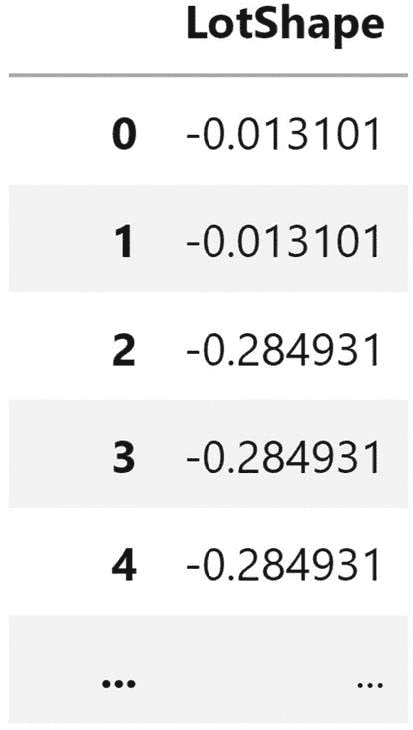

表格包含两个列标题为 lotshape，列出了来自住房数据集的特征的编码值。

图 2-19

来自 Ames 住房数据集的特征的权重编码

```py
from category_encoders.woe import WOEEncoder
encoder = WOEEncoder()
y = df['Street'].map({'Pave':0, 'Grvl':1})
encoded = encoder.fit_transform(df['LotShape'], y)
Listing 2-27
Weight of evidence encoding using category_encoders. We use the “Street” column because it is binary-categorical and use mapping to integer-encode it, as required by the function
```

### 连续数据

连续定量数据通常已经处于技术上可读的状态，但许多算法假设我们需要满足一定的形状或分布。

#### Min-Max 缩放

Min-max 缩放通常指的是将数据集的范围缩放到 0 到 1 之间——数据集的最小值是 0，最大值是 1，但点之间的相对距离保持不变。

数组 *x* 的缩放版本是 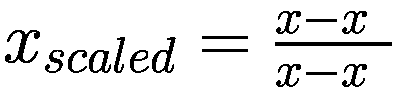。分子，*x* − *x* ，将数据集移动，使得最低值在 0，最高值在 *x* − *x* 。除以最高值得到最低值（仍然）在 0，最高值在 1。因为缩放只移动和拉伸/收缩数组中的元素，所以我们不会改变点之间的相对距离。由于机器学习算法基于点之间的相对距离（即通过特征空间绘制边界和景观），我们保留了数据集的建模信息容量。然而，我们并不显式地居中数据并破坏稀疏性，而是控制端点。

Min-max 缩放可以使用 NumPy 实现为`min_max(arr) = lambda arr: (arr – np.min(arr)) / (np.max(arr) – np.min(arr))`。

`sklearn`还支持使用`MinMaxScaling`对象实现 min-max 缩放的实现；您可以为特殊案例（如标准图像缩放，使用[0, 255]整数范围）传递自定义范围（默认为 0 到 1 之间，包括 0 和 1）。对于已经以 0 为中心的分布，可能更明智的是在[–1, 1]而不是[0, 1]之间缩放，以保留 0 为中心。

```py
from sklearn.preprocessing import MinMaxScaler
scaler = MinMaxScaler(feature_range=(lower, higher))
scaled = scaler.fit_transform(data)
orig_data = scaler.inverse_transform(scaled)
Listing 2-28
Min-max scaling using sklearn
```

我们可以可视化最小-最大缩放对平均值为 5 和标准差为 1 的随机分布的影响（列表 2-29（#PC31），图 2-20（#Fig20））。

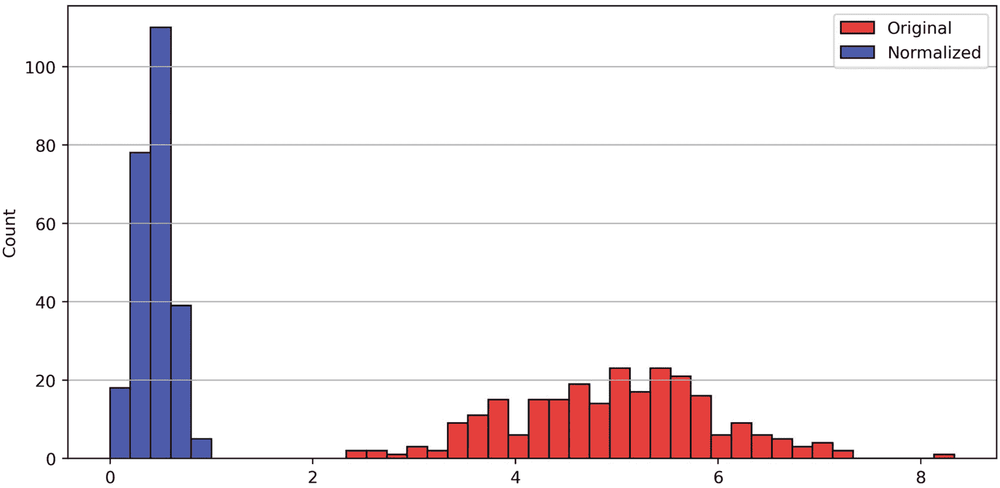

柱状图显示了原始和归一化分布。归一化和原始分布的值分别绘制在 0 到 1 和 2 到 8 之间。数值是近似的。

图 2-20

原始分布与归一化/最小-最大缩放分布对比

```py
arr = np.random.normal(loc=5, scale=1, size=(250,))
adjusted = (arr - arr.min()) / (arr.max() - arr.min())
plt.figure(figsize=(10, 5), dpi=400)
axes = plt.gca()
axes.yaxis.grid()
sns.histplot(arr, color='red', label='Original', alpha = 0.8, binwidth=0.2)
sns.histplot(adjusted, color='blue', label='Normalized', alpha = 0.8, binwidth=0.2)
plt.legend()
plt.show()
Listing 2-29
Visualizing the original vs. normalized/min-max scaled distribution
```

#### 鲁棒缩放

从最小-最大缩放公式的角度来看，我们可以看到数据集的每个缩放值都直接受到最大值和最小值的影响。因此，异常值对缩放操作有显著影响。我们可以通过在我们的先前列表 2-30（#PC32）和图 2-21（#Fig21）中给出的平均值为 5 和标准差为 1 的分布中引入五个“30”的实例来展示它们的影响。

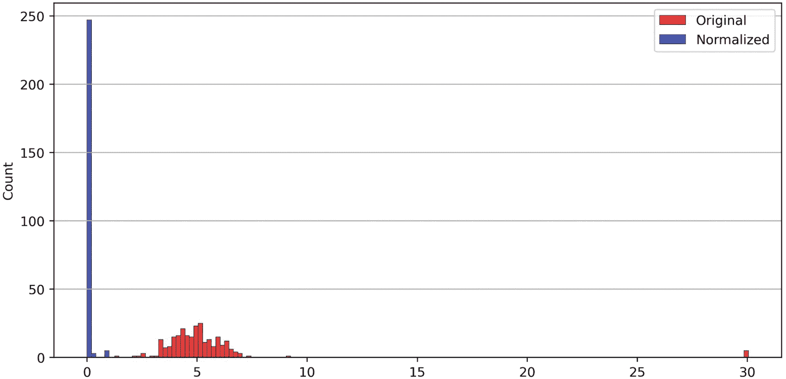

柱状图显示了原始和归一化分布的异常值。原始分布的值接近 5，归一化分布的值接近 0。数值是近似的。

图 2-21

展示异常值对最小-最大缩放的有害影响

```py
arr = np.random.normal(loc=5, scale=1, size=(250,))
arr = np.append(arr, [30]*5)
Listing 2-30
Appending outliers to a normal distribution
```

通过放大以进一步理解添加几个异常值的影响，我们发现整个分布的剩余部分被挤压到一端，以便整个数据集在[0, 1]范围内（图 2-22（#Fig22））。

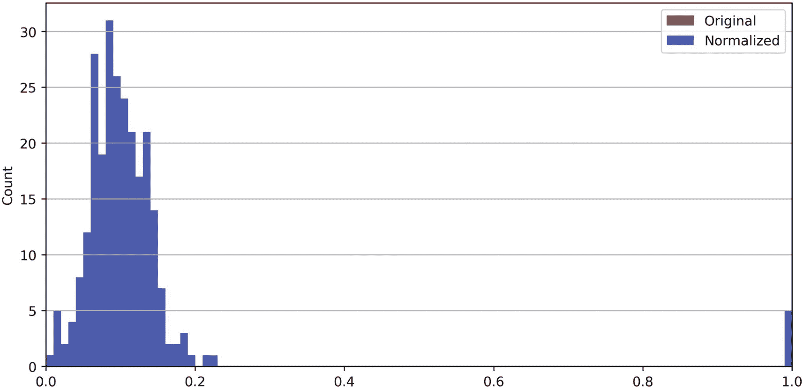

柱状图显示了原始和归一化分布的异常值。原始分布的值可以忽略不计，归一化分布的值绘制在 0.0 到 0.2 之间。数值是近似的。

图 2-22

展示异常值对最小-最大缩放的有害影响，放大查看

然而，有时我们不需要值严格介于 0 和 1 之间。我们只想让数据集在特定的局部范围内；为了使我们的缩放方法对异常值不那么敏感，我们可以使用数据集内部而不是外部的第一、第二和第三四分位数来操作数据集：

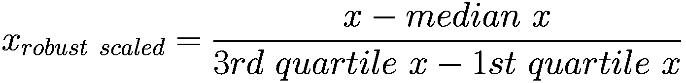

鲁棒缩放从数据集中的所有值中减去中位数，并除以四分位距（图 2-23（#Fig23））。

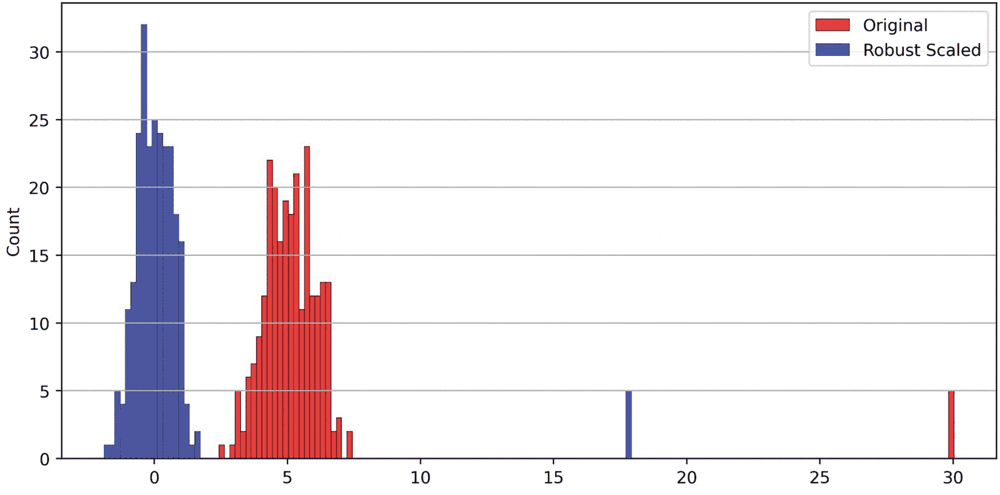

柱状图显示了原始和鲁棒缩放分布的异常值。原始分布和鲁棒缩放分布的值分别密集地聚集在 5 和 0 附近。数值是近似的。

图 2-23

原始分布与鲁棒缩放分布对比

放大查看分布的主要“主体”或“质量”，我们看到即使稳健缩放大致将分布中心化在 0，数值分布相对均匀，并未受到异常值的影响。虽然异常值相对于分布的主要“质量”仍然是异常值，但缩放后的分布不再依赖于少数几个异常值（见图 2-24 和 2-25）。

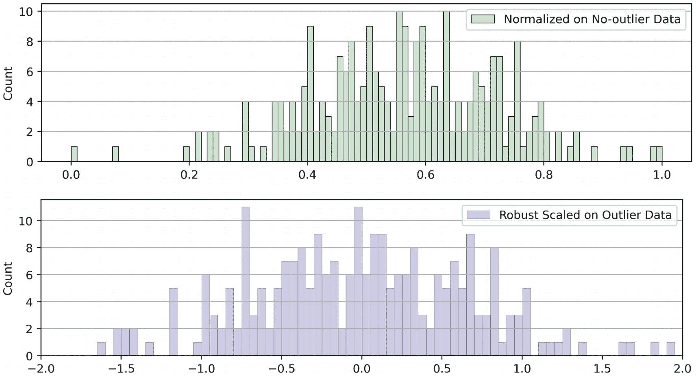

两个柱状图绘制了异常数据上归一化和稳健缩放后的值。在第一和第二个图中，值在 0.2 到 0.8 之间更密集，分别对应负 1.5 和 1.5。数值为近似值。

图 2-25

移除异常值后的标准化分布与（放大后的）包含异常值的稳健缩放数据对比

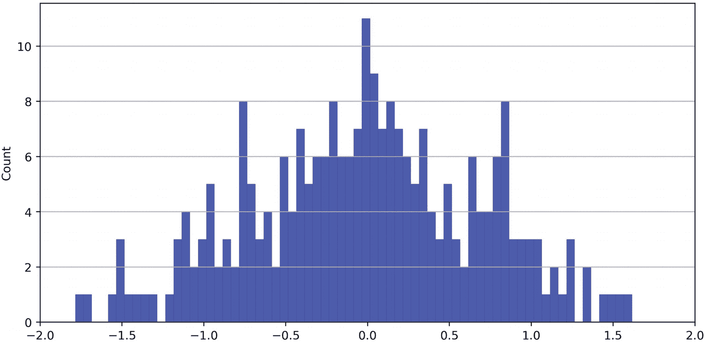

柱状图绘制了原始分布的值。绘制的值从 x 轴上的负 2.0 逐渐增加，达到峰值 0.0，然后逐渐减少到 1.5。数值为估算值。

图 2-24

原始分布

稳健缩放可以通过以下 NumPy 函数实现：`robust(arr) = lambda arr: (arr – np.median(arr)) / (np.quantile(arr, 3/4) – np.quantile(arr, 1/4))`。

`sklearn`支持使用`RobustScaler`对象进行稳健缩放（见代码列表 2-31）。

```py
from sklearn.preprocessing import RobustScaler
scaler = RobustScaler(feature_range=(lower, higher))
scaled = scaler.fit_transform(data)
orig_data = scaler.inverse_transform(scaled)
Listing 2-31
Implementing robust scaling using sklearn
```

#### 标准化

更常见的是，机器学习算法假设数据是**标准化**的——也就是说，以单位方差（标准差为 1）和零均值（中心在 0）的正态分布形式。假设输入数据已经基本呈正态分布，标准化会从数据集的均值中减去并除以数据集的标准差。这会将数据集的均值移至 0，并将标准差缩放至 1（见图 2-26）。

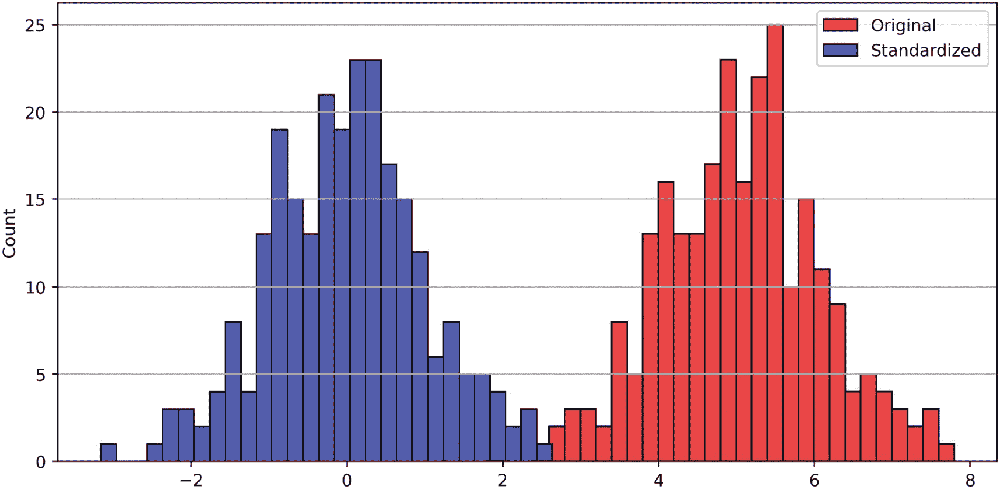

柱状图绘制的是计数与分布的关系。标准化分布的绘图值介于负 2 和 2 之间。原始分布的绘图值介于 3 和 8 之间。数值为估算值。

图 2-26

原始分布与标准化分布对比

首先，让我们证明从数据集中减去均值 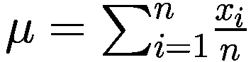 会得到新的均值为 0：

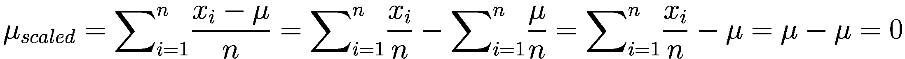

标准差定义为以下：

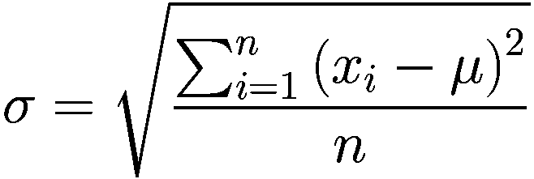

然而，当我们根据标准差将数据集进行划分时，由于在之前的步骤中减去了均值，均值已经移至 0。因此，可以将公式重写如下，假设 *x*[*i*] = *x*[*i*] - *μ*（即一个已经平移的量）：

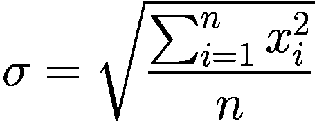

当我们将每个均值平移元素 *x*[*i*] 除以标准差 *σ* 时，得到的结果标准差（和方差）为 1：

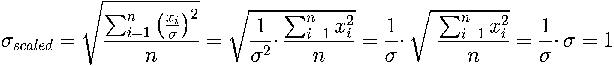

标准化可以通过 `standardize(arr) = lambda arr: (arr – np.mean(arr)) / np.std(arr)` 使用 NumPy 实现。

`sklearn` 支持使用 `StandardScaler` 对象进行标准化（见列表 2-32）。

```py
from sklearn.preprocessing import StandardScaler
scaler = StandardScaler(feature_range=(lower, higher))
scaled = scaler.fit_transform(data)
orig_data = scaler.inverse_transform(scaled)
Listing 2-32
Implementing standard standardization with the sklearn Standard Scaler
```

注意，标准差和均值的估计可能会受到异常值的影响，这使得稳健缩放成为标准化的良好替代方案。在稳健缩放中，使用对异常值稳健的统计替代方案：中位数代替均值，四分位数范围代替标准差。

### 文本数据

人类最自然地通过文本和语言进行互动，因此非分类文本在许多表格数据集中占据重要部分并不令人惊讶。文本可以表现为客户评论、Twitter 个人资料或网站数据。

注意

“非分类文本”指的是无法通过分类编码方法进行定量编码的文本，因为文本样本彼此之间差异太大（即，有太多的唯一类别或每个类别的样本太少）。

我们希望将文本数据的信息纳入我们的模型。在未来的章节中，我们将展示如何构建高级的多模态多头模型，这些模型同时考虑文本输入和其他形式的数据。然而，本节将探讨各种定量表示（*向量化*）方法以及它们如何与第一章中引入的经典机器学习模型结合使用。

在本节中，我们将使用加州大学欧文分校机器学习库（UCIMLR）的知名 SMS 垃圾邮件收集数据集。它可在 Kaggle 上找到，网址为 [`www.kaggle.com/uciml/sms-spam-collection-dataset`](https://www.kaggle.com/uciml/sms-spam-collection-dataset)，或在 UCIMLR 网站上找到，网址为 [`https://archive.ics.uci.edu/ml/datasets/SMS+Spam+Collection`](https://archive.ics.uci.edu/ml/datasets/SMS%252BSpam%252BCollection)。

在基本的清理之后，数据集应存储在名为 `data` 的 Pandas DataFrame 中，包含两列，`isSpam` 和 `text`（见图 2-27）。


表格列出了为各种数据集收集的垃圾邮件和文本。

图 2-27

SMS 垃圾邮件收集数据集部分的可视化

由于我们将评估在不同的文本编码方案上训练的模型的输出结果，我们还需要执行训练-验证拆分（列表 2-33）。

```py
from sklearn.model_selection import train_test_split as tts
X_train, X_val, y_train, y_val = tts(data['text'], data['isSpam'],
train_size = 0.8)
Listing 2-33
Train/validation splitting of the spam dataset
```

注意，在本节中，我们将介绍处理文本的简化方法。虽然通常应该使用更彻底的方法，如彻底的清理、词干提取、停用词去除等，但深度学习模型通常足够复杂，可以处理这些具体问题，因此这样的考虑不那么必要。你将在第五章（循环神经网络）和第六章（注意力机制和转换器）中亲手应用深度学习处理文本数据。

#### 关键词搜索

获取文本数据的定量表示的一种最简单的方法是确定某些预定的关键词是否出现在文本中（列表 2-34）。这是一个非常简单、有限且天真方法。然而，在适当的条件下，它可能足够用，并可以作为良好的基准模型。

一些常出现在试图推广产品的垃圾邮件中的关键词是“buy”、“free”和“win”。我们可以构建一个简单的模型来检查这些关键词中的任何一个是否出现在给定的文本样本中。如果存在，该文本被指定为垃圾邮件；否则，被指定为 ham（安全）。

```py
def predict(text):
keywords = ['buy', 'free', 'win']
for keyword in keywords:
if keyword in text.lower():
return 1
return 0
Listing 2-34
A sample simple keyword search function
```

我们可以评估这种模型的准确性来了解其性能（列表 2-35）。

```py
from sklearn.metrics import accuracy_score
accuracy_score(data['isSpam'], data['text'].apply(predict))
Listing 2-35
Evaluating the accuracy of our simple keyword search model
```

得到的准确率约为 88.1%，这似乎相当不错。然而，总是返回“0”的模型（`predict = lambda x:0`）的准确率约为 86.6%。由于数据集不平衡，一个更反映实际情况的指标是 F1 分数（列表 2-36）。

```py
from sklearn.metrics import f1_score
f1_score(data['isSpam'], data['text'].apply(predict))
Listing 2-36
Evaluating the F1 accuracy of our simple keyword search model
```

关键词搜索模型的 F1 分数约为 0.437，而预测任何实例标签为 0 的模型得分是 0.0（正如预期的那样）。

#### 原始向量化

原始向量化可以被视为文本的“独热编码”：它是文本中包含信息的显式定量表示（图 2-28）。而不是为每个文本分配一个唯一的类别，文本通常被向量化为一个由*语言单元*（如字符或单词）组成的序列。这些也被称为*标记*。这些单词或字符中的每一个都被视为一个独特的类别，可以进行独热编码。然后，一段文本就是一个独热编码的序列。

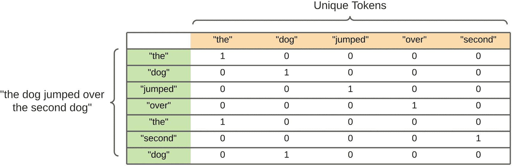

一个表格由 5 列和 7 行组成。列标题是 the、dog、jumped、over 和 second。行标题如下：the、dog、jumped、over、the、second 和 dog。相同标题的值是 1，其他的是 0。

图 2-28

原始向量化

考虑以下小型示例文本数据集，其中已去除标点符号并转换为小写（见 2-37）。

```py
texts = np.array(['the dog jumped over the second dog',
'a dog is a dog and nothing else',
'a dog is an animal'])
Listing 2-37
Collecting an array of text samples
```

一种提出的实现方法（见 2-38）如下：我们遍历每个项目，并使用“离散数据”部分中定义的 `one_hot_encoding` 函数单独对列表表示进行独热编码。然后，我们将 `raw_vectorize` 函数应用于 `texts` 数组中的每个文本，并将 NumPy 数组转换为列表。使用列表推导，我们将独热编码聚合到一个嵌套列表中，这可以重新表示为一个 NumPy 数组。

```py
def raw_vectorize(text):
return one_hot_encoding(text.split(' '))
raw_vectorized = np.array([raw_vectorize(text).tolist() for text in texts])
Listing 2-38
Attempting to apply raw vectorization to the text samples
```

当运行此代码时，我们收到一个 `VisibleDepreciationWarning`，这已经应该引起警钟：

```py
/opt/conda/lib/python3.7/site-packages/ipykernel_launcher.py:11: VisibleDeprecationWarning: Creating an ndarray from ragged nested sequences (which is a list-or-tuple of lists-or-tuples-or ndarrays with different lengths or shapes) is deprecated. If you meant to do this, you must specify 'dtype=object' when creating the ndarray # This is added back by InteractiveShellApp.init_path()
```

这表明数组中的每个元素长度都不相同；标准的 *n*-维数组只支持具有相同形状的元素。因此，NumPy 以一种相当尴尬的方式存储数据，作为列表对象数组，以适应不同元素的大小。

进一步调查后，我们发现第一个元素使用五个二进制特征来表示：`len(raw_vectorized[0][0])` 返回 `5`。在这里，`raw_vectorized[0]` 是 `texts` 的第一个元素的编码，而 `raw_vectorized[0][0]` 是第一个元素第一个标记的编码。第二个元素使用六个二进制特征表示，而第三个元素再次使用五个特征！如果我们的向量表示没有使用相同数量的特征来表示每个样本，这将是非常成问题的。

注意

虽然这种方法使用不同数量的二进制特征来表示每个样本是有问题的，但每个样本具有不同的形状并不是一个问题。这是因为不同的文本样本本质上具有不同数量的标记；虽然我们希望确保在所有样本中都以相同的方式表示标记，但标记数量的差异是可以接受的。我们将在后面的章节中讨论可以处理可变大小序列输入的模型（循环模型）以及解决向量化样本长度变化的技术，如 *padding*，它会在短序列的末尾添加“空白”标记。

这里的错误在于我们是在样本的基础上确定映射，但每个样本的词汇表几乎不可能代表整个文本的词汇表。这不仅会导致表示每个标记的二进制特征数量不同（这是症状），更重要的是，会导致每个唯一标记与唯一二进制列匹配的方式不同。在一个文本样本中，“dog”标记可能在一个元素的一维热编码矩阵的第三列中用“1”表示，但在另一个元素中可能标记在第二列。这种列表示的不一致性完全破坏了更大数据集的信息价值。

为了解决这个问题，我们首先将所有文本合并在一起，以获得全局词汇表，并创建一个适用于所有元素的通用映射字典（见列表 2-39）。

```py
complete_text = ' '.join(texts)
unique = np.unique(complete_text.split(' '))
mapping = {i:token for i, token in enumerate(unique)}
Listing 2-39
Obtaining a mapping between each token and an integer
```

这种向量化方法在深度学习中很受欢迎，因为神经网络的复杂性和能力可以处理并理解这些非常高维的文本表示。然而，像第一章中介绍的经典机器学习算法很难产生好的结果（除非在文本样本很短且词汇量/独特语言单元数量很少的罕见情况下）。

TensorFlow/Keras 提供了一个使用`Tokenizer`对象进行 one-hot 编码的实现（见列表 2-40）。`Tokenizer`会自动移除停用词（在语义上“无意义”的词，如“a”、“an”、“the”等，它们对语法/惯例的贡献大于内容）并为你执行其他预处理。在这个实现中，每个标记都与一个整数相关联，而不是该整数的 one-hot 表示（即一个标记为 1 的 0 数组）。虽然你可以根据需要显式地对这种表示进行 one-hot 编码，而不需要太多代码，但用于构建可以处理原始向量化文本的模型的深度学习库通常可以自动执行此转换，因此序数表示就足够了。

```py
from tf.keras.preprocessing.text import Tokenizer
tk = Tokenizer(num_words=10)
tk.fit_on_texts(texts)
tk.texts_to_sequence(texts)
"'
Returns:
[[3, 1, 5, 6, 3, 7, 1],
[2, 1, 4, 2, 1, 8, 9],
[2, 1, 4]
"'
Listing 2-40
Using TensorFlow/Keras’s text processing facilities to automatically perform raw label encoding
```

#### Bag of Words

为了减少原始向量化文本表示的维度/大小，我们可以使用 Bag of Words（BoW）模型来“折叠”原始向量化。在 Bag of Words 中，我们计算每个语言单元在文本样本中出现的次数，同时忽略语言单元被使用的具体顺序和上下文（见图 2-29）。

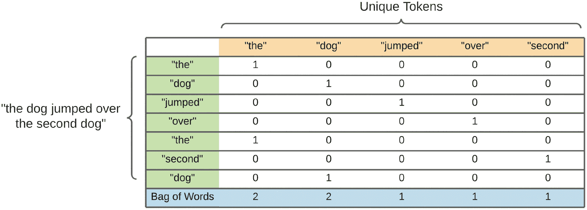

一个表格由 5 列和 8 行组成。列标题分别是 the、dog、jumped、over 和 second。行标题如下：the、dog、jumped、over、the、second、dog 和 bag of words。相同标题的值是 1，其他的是 0。

图 2-29

Bag of Words 模型作为沿序列轴的原始向量化的总和

可以通过调用`np.sum(one_hot, axis=0)`来实现 Bag of Words 模型，假设原始向量化已经计算并存储在一个名为`one_hot`的变量中。这会计算标记在整个标记中的出现次数。然而，存在许多更好的选择。

`sklearn`实现了一个易于使用的`CountVectorizer`对象，它执行词袋编码，其语法与其他编码方法类似（见代码清单 2-41）。与 Keras `Tokenizer`一样，您可以设置最大词汇量/特征；如果没有指定，scikit-learn 将包括所有检测到的单词作为词汇表的一部分。请注意，我们在转换文本数据后调用`.toarray()`，因为转换的结果是 NumPy 压缩稀疏数组格式，而不是标准的*n*-d 数组。此外，观察`CountVectorizer()`没有`inverse_transform()`函数，这与许多其他`sklearn`编码器不同，因为词袋转换是不可逆的；不同的文本序列仍然可以编码为相同的 BoW 表示。

```py
from sklearn.feature_extraction.text import CountVectorizer
vectorizer = CountVectorizer(max_features = n)
encoded = vectorizer.fit_transform(X_train).toarray()
Listing 2-41
Applying Bag of Words using sklearn
```

Keras 分词器还提供了使用`texts_to_matrix()`函数的词袋功能，参数`mode = 'count'`（见代码清单 2-42）。您也可以使用`mode = 'freq'`来反映词频。

```py
from keras.preprocessing.text import Tokenizer
tk = Tokenizer(num_words=3000)
tk.fit_on_texts(X_train)
X_train_vec = tk.texts_to_matrix(X_train, mode='count')
X_val_vec = tk.texts_to_matrix(X_val, mode='count')
Listing 2-42
Applying Bag of Words using Keras
```

让我们用一个最大词汇量为 3000 个标记的原始向量化数据集来展示模型的表现。我们将首先对训练和验证文本样本进行编码（见代码清单 2-43）。请注意，我们在*x*-train 数据集上构建分词器的词汇表，并将其直接应用于*x*-validation 数据集，这样任何不属于训练文本语料库的验证文本语料库中的单词都将被忽略。虽然这不是理想的情况（我们希望所有单词都被表示），但我们必须在评估验证集时保持与在训练集上拟合时相同的编码技术。

```py
from sklearn.feature_extraction.text import CountVectorizer
vectorizer = CountVectorizer(max_features = 3000)
X_train_vec = vectorizer.fit_transform(X_train).toarray()
X_val_vec = vectorizer.transform(X_val).toarray()
Listing 2-43
Applying Bag of Words using sklearn to the spam dataset
```

我们将使用随机森林模型来评估向量化方法（见代码清单 2-44）；它基于决策树对非线性空间的高精度适应性，并通过袋装（如第一章“随机森林”中所述）减少过拟合行为。

```py
model = RandomForestClassifier()
model.fit(X_train_vec, y_train)
pred = model.predict(X_val_vec)
f1_score(pred, y_val)
Listing 2-44
Training a Random Forest classifier on the raw-vectorized dataset
```

在原始向量化文本数据上训练的随机森林模型的 F1 分数约为 0.914，这比关键词搜索有显著改进。请注意，虽然这种性能当然并不差，但神经网络能更好地理解稀疏的、非常高维的数据。

#### N-Grams

我们可以通过计算独特的*两词*组合的数量，即 bigrams，比词袋模型更复杂。这有助于揭示上下文和词义的多样性；例如，在去除标点符号和大小写（除了“paris france”）的文本中，“巴黎”与“paris hilton”中的“巴黎”非常不同。我们可以将每个 bigram 视为一个单独的术语，并以此方式编码它（见图 2-30）。

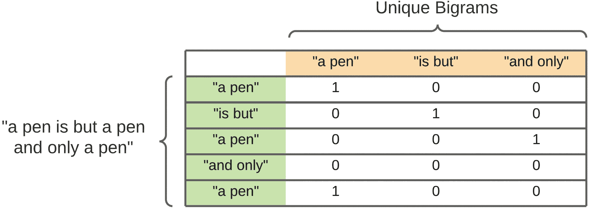

一个表格由 3 列和 5 行组成。列标题是 pen、is but 和 and only。行标题包括单词，如 pen、is but、a pen 和 only、a pen。表格中的每个单词都由一个二进制数编码。

图 2-30

计算二元组。技术上这里涉及更多的二元组，但我们为了简化表示并没有计算它们。

我们可以将二元组推广到*n*-gram，其中每个单元由*n*个连续的单词组成（列表 2-45）。当增加*n*时，会遇到一个重要的权衡：精度提高，但编码也变得更加稀疏。三元组能够表达比单语元更精确、更具体的思想，但在文本中这种特定三元组的实例比单语元要少。如果编码变得过于稀疏，由于唯一*n*-gram 的样本数量很少，模型难以泛化。你可以在表 2-1 中观察到这些动态。

表 2-1

使用 n-gram 训练的随机森林模型在 n-gram 范围（行）和上界（列）范围内的性能。注意最佳性能是在下界 1 到上界 4 的 n-gram 上，这是最宽的范围。

|   | 1 | 2 | 3 | 4 |
| --- | --- | --- | --- | --- |
| 1 | 0.914 | 0.903 | 0.890 | 0.898 |
| 2 |   | 0.822 | 0.822 | 0.794 |
| 3 |   |   | 0.658 | 0.601 |
| 4 |   |   |   | 0.580 |

```py
model = RandomForestClassifier()
vectorizer = CountVectorizer(max_features = 3000,
ngram_range = (1, 2))
X_train_vec = vectorizer.fit_transform(X_train).toarray()
X_val_vec = vectorizer.transform(X_val).toarray()
Listing 2-45
Training a Random Forest classifier on n-gram data
```

#### TF-IDF

词袋模型另一个弱点是，一个单词在文本中出现的次数可能不是衡量其重要性和相关性的好指标。例如，这个段落中“the”这个词出现了七次，比其他任何词都多。这难道意味着“the”这个词是最重要的或包含最多的意义吗？

不，单词“the”主要是语法/句法结构的产物，在至少我们通常关心的语境中反映的语义意义很少。我们通常通过在编码之前从语料库中移除所谓的“停用词”来解决文本饱和的句法标记的问题。

然而，在停用词筛选后还剩下许多单词具有语义价值，但它们又受到“the”这个词造成的另一个问题的困扰：由于语料库的结构，某些单词在文本中自然出现得非常频繁。这并不意味着它们更重要。考虑一个关于夹克客户评价的语料库：自然地，“jacket”这个词会非常频繁地出现（例如，“我买了这件夹克…”，“这件夹克到了我家…”），但实际上它与我们的分析并不非常相关。我们知道这个语料库是关于夹克的，我们更关注那些出现较少但意义更重要的单词，比如“bad”（例如，“这件夹克很糟糕”）、“durable”（例如，“这样的夹克很耐用！”）或“good”（例如，“这次购买很划算”）。

我们可以通过使用 TF-IDF，即*词频-逆文档频率*编码来形式化这种直觉。TF-IDF 编码背后的逻辑是我们更关心在单个文档中经常出现但在整个语料库中不太经常出现的术语（词频）以及逆文档频率。TF-IDF 通过权衡这两个效果来计算：

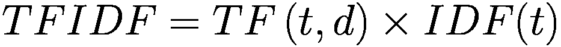

词频 *TF*(*t*, *d*) 是一个术语 *t* 在一个文档/文本样本 *d* 中出现的次数。虽然有许多计算逆文档频率 *IDF*(*t*) 的方法，但一个简单而有效的方法是 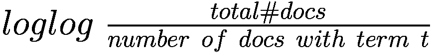。考虑一个在文档中非常常见但在收集的语料库中非常罕见的单词。词频将很高，因为该术语在文档中经常出现；逆文档频率也会很高，因为只有少数文档包含术语 *t*（即，分母很小）。因此，TF-IDF 编码的整体值将很高，这表明具有高重要性或原创性。另一方面，一个在文档中经常出现但在整个收集的语料库中也丰富的单词具有较低的 TF-IDF 加权。

Scikit-learn 支持与词袋模型（列表 2-46）类似的具有最大特征功能的 TF-IDF。 

```py
from sklearn.feature_extraction.text import TfidfVectorizer
vectorizer = TfidfVectorizer(max_features = 3000)
X_train_vec = vectorizer.fit_transform(X_train).toarray()
X_val_vec = vectorizer.transform(X_val).toarray()
Listing 2-46
Applying TF-IDF using sklearn
```

使用 TF-IDF 向量化数据训练的随机森林模型在验证数据集上获得了 0.898 的 F1 分数，这比词袋模型略差。这更多地说的是数据集的性质，而不是编码方法的性能；这个垃圾邮件数据集可能不会从引入逆文档频率项中受益，该逆文档频率项根据其在整个语料库中的出现频率来降低术语的权重。

你还可以传递一个 `ngrams_range` 参数来考虑由多个单词组成的术语，即对于不同的 *n* 值。

#### 情感提取

在某些问题中，使用更具体的文本编码可能会有所帮助。*情感提取*是将定量标签与表示其情感各种质量的文本相关联，如情绪或客观性。如果你正在构建一个经典的机器学习模型，你可以将文本编码为其定量情感表示，或者将语义提取作为另一组特征包含到其他文本编码方法中。请注意，情感提取通常不太可能为深度学习模型增加太多价值，因为深度学习模型通常足够强大，可以开发出比由人类手动定义和选择的情感提取函数更复杂和相关的内部语言理解机制。

`textblob` 库提供了一个简单的情感提取实现。首先，使用你想要获取情感分析的短语或句子初始化一个 `textblob.TextBlob` 对象（见列表 2-47）。

```py
from textblob import TextBlob
text = TextBlob("Feature encoding is very good")
Listing 2-47
Creating a TextBlob object
```

然后，调用 `.sentiment` 方法来获取情感，该情感被分解为 *极性*（负面与正面语调，从 –1 到 +1 量化）和 *主观性*（短语是陈述为观点还是更事实性的，从 0 到 1 量化）。例如，在列表 2-47 中调用 `text.sentiment` 在给定示例上产生极性为 0.9099 和主观性为 0.7800。这意味着 `textblob` 情感分析实现将句子“特征编码非常好”关联为极性非常积极且主观性适中。这是一个合理的评估。

你可以创建返回输入字符串的极性和主观性的函数；这些函数可以应用于 NumPy 数组、Pandas 序列、TensorFlow 数据集等（见列表 2-48）。

```py
def get_polarity(string):
text = TextBlob(string)
return text.sentiment.polarity
def get_subjectivity(string):
text = TextBlob(string)
return text.sentiment.subjectivity
Listing 2-48
Extracting the polarity and subjectivity sentiment components from text
```

`textblob` 使用语义标签来确定文本样本的极性；每个相关单词都与某种固有的极性相关联（例如，“bad”与 –0.8 的极性，“good”与 +0.8 的极性，“awesome”与 +1 的极性）。整体极性是这些个别极性的单一聚合。

否定词如“not”或“no”会翻转受影响的相关单词的符号。句子“特征编码不是非常好”的极性为 –0.2692。

`textblob` 除了考虑字母数字字符外，还考虑标点和表情符号。例如，“特征编码非常好！”的极性为 +1.0，而带有感叹号时的极性为 +0.9。

如果一个句子是中性的，如“特征编码是一种技术。”，`textblob` 将产生接近或达到 0 的极性和主观性。

`textblob` 通过强度修饰语的存在来确定主观性，如“非常”。

虽然 `textblob` 在简单情况下表现良好，但其算法相当简单，且非常有限。它不考虑多词之间的上下文，以及影响极性和主观性的更复杂句法和语义语言结构。

VADER（情感推理的效价感知词典）是一个模型，通过将给定的文本样本与极性和主观性（称为强度或强度）相关联，执行与 `textblob` 类似的函数。与 `textblob` 类似，VADER 模型也通过聚合个别情感来计算极性和强度。然而，它更为复杂；它考虑了否定缩写（例如，wasn’t 与 was not）、高级标点符号的使用、大写（例如，ALL CAPS 与小写）、俚语词汇和首字母缩略词（“lmao”，“lol”，“brb”）。VADER 在社交媒体数据上进行了优化，因此比大多数其他情感分析器具有更广泛和更现代的词汇。

你可以使用 `pip install vaderSentiment` 命令导入 `vaderSentiment` 库。使用方法如下（见列表 2-49）。

```py
import vaderSentiment
from vaderSentiment.vaderSentiment import SentimentIntensityAnalyzer
analyzer = SentimentIntensityAnalyzer()
sentence = "Feature encoding is very good"
scores = analyzer.polarity_scores(sentence)
Listing 2-49
Getting the polarity of a text using VADER
```

情感分数（在这个例子中，存储在`scores`中）表示为一个字典，键为`'neg'`、`'neu'`、`'pos'`和`'compound'`。分别代表文本样本的负面、中性、正面和整体情感（复合分数）的评分，范围从 0 到 1。负面、中性和正面评分的总和等于 1。VADER 模型与其他文本情感模型的不同之处在于，它将中性标记为独立的语义类别，而不是介于负面和正面之间。

如果您正在寻找更复杂的功能，请考虑 Flair，这是一个强大的自然语言处理框架（使用`pip install flair`安装）。Flair 包含了一个名为*Task-Aware Representation of Sentences for Generic Text Classification*（或 TARS）的实现。TARS 有一个令人兴奋的特性，称为*零样本学习*，这意味着它可以学习将文本与它从未接触过的某些标签和类别相关联（图 2-31 到 2-34）。

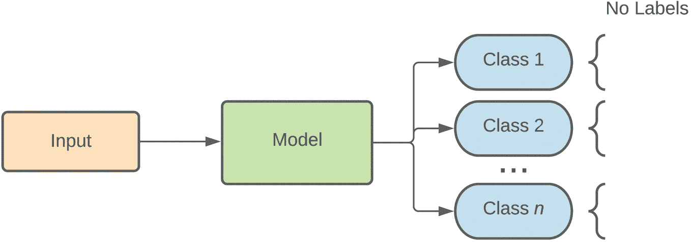

块图如下所示，输入引出模型，进而引出类别 1、2 以及 n，每个类别都没有标签表示。

图 2-34

零样本学习方案。请注意，这反映了零学习系统的理想行为，而不是它的训练方式。

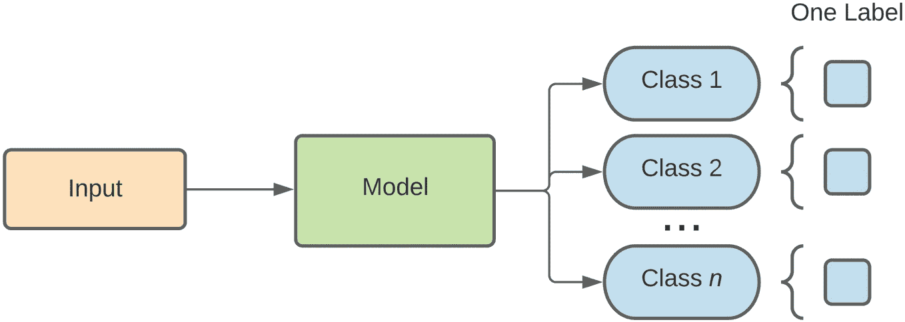

块图如下所示，输入引出模型，进而引出类别 1、2 以及直到 n，每个类别都由一个标签表示。

图 2-33

单样本学习方案

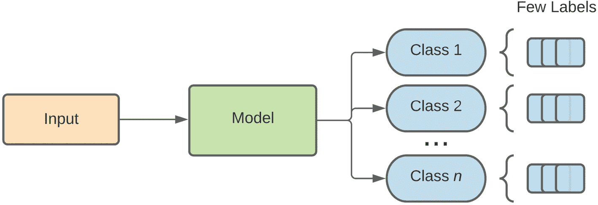

块图如下所示，输入引出模型，进而引出类别 1、2 以及直到 n，每个类别都由几个标签表示。

图 2-32

少样本学习方案

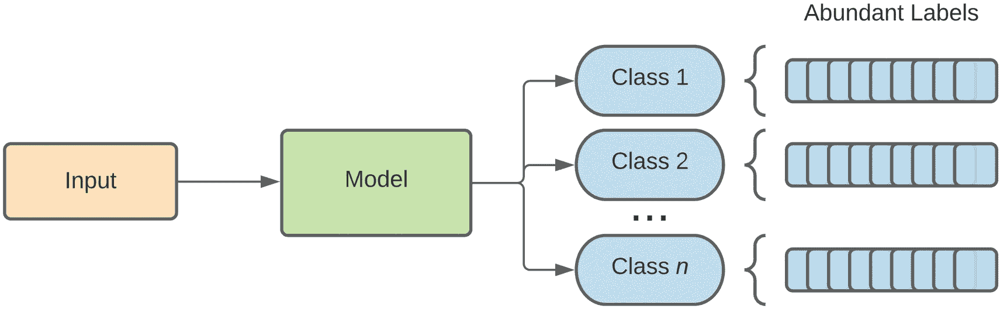

块图如下所示，输入引出模型，进而引出类别 1、2 以及直到 n，每个类别都由丰富的标签表示。

图 2-31

标准监督学习方案

这意味着您可以定义自己的类别，TARS 将自动分配一个概率，表示给定的文本属于这些类别中的任何一个。类别需要使用描述类别代表的自然语言字符串来定义。TARS 模型能够“解释”这个定义并将其用作类别。

首先创建一个`TARSClassifier`模型。您需要加载模型权重，这大约需要一分钟，具体时间取决于环境条件。然后，创建一个`flair.data.Sentence`对象并定义一个自定义类别的列表。最后，在句子对象和自定义类别上运行`TARSClassifier`的`predict_zero_shot()`函数。

例如，我们可以定义两个类`'positive'`和`'negative'`来执行类似于`textblob`和 VADER 的功能（列表 2-50）。

```py
import flair
from flair.models import TARSClassifier
from flair.data import Sentence
tars = TARSClassifier.load('tars-base')
sentence = Sentence("Feature encoding is very good")
classes = ['positive', 'negative']
tars.predict_zero_shot(sentence, classes)
Listing 2-50
Using TARS with Flair to obtain deep sentiment analysis extraction
```

模型预测会自动修改`Sentence`对象并将其与句子标签关联。您可以通过打印原始句子对象来查看这些标签。在这种情况下，Flair 以 0.9726 的概率将句子分配到“positive”类别。

您可以使用 Flair 来定义更复杂的自定义类。例如，您可能想要量化一个文本听起来是“焦虑的”、“紧张的”、“兴奋的”、“矛盾的”、“中性的”、“同理心的”、“悲观的”还是“乐观的”。您还可以使用更描述性的类定义，例如“乐观但谨慎”。此外，您还可以评估文本内容除了情感之外的内容；例如，要评估文本是否以某种方式谈论动物，您可以请求 TARS 模型分配一个句子属于类描述`'animals'`的概率。它非常有效：例如，“小狗真可爱”获得一个非常高的概率，但“植物真可爱”获得一个非常低的概率。

这些是 TARS 模型能够解释和量化的更复杂的概念。因为 TARS 是一个深度学习模型，而不是基于规则的系统（`textblob`和 VADER 使用的是基于规则的系统），它通常更能反映文本样本的特征和内容，这使得它成为当您对文本的相关品质有强烈预感时，一个强大的文本编码器。

#### Word2Vec

之前关于编码方法的讨论集中在相对简单的尝试上，通过尝试提取一个“维度”或视角来捕捉文本样本的意义。例如，词袋模型通过简单地计算一个词在文本中出现的频率来捕捉意义。词频-逆文档频率编码方法试图通过平衡一个词在文档中的出现频率与整个语料库中的出现频率来定义一个稍微复杂一些的意义水平。在这些编码方案中，我们总是遗漏文本的一个视角或维度，并且无法捕捉。

然而，使用深度神经网络，我们可以捕捉文本样本之间更复杂的关系——词语使用的细微差别（例如，“巴黎”、“希尔顿”和“巴黎希尔顿”都意味着非常不同的事情！）、语法例外、惯例、文化意义等。Word2Vec 算法系列将每个词与一个固定长度的向量关联，该向量代表*潜在*（“隐藏的”、“隐含的”）特征（图 2-35）。

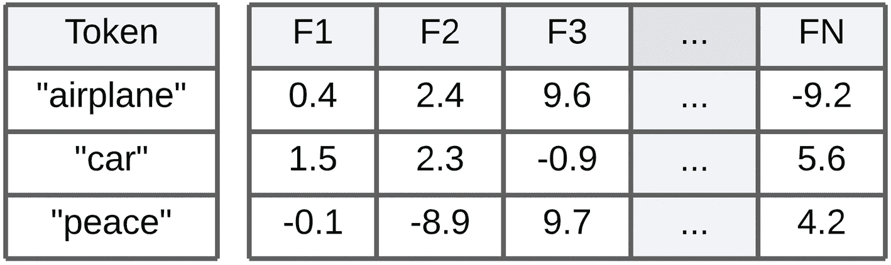

一个表格描述了对于单词飞机、汽车和和平的标记词，对于特征 1 到 n 所到达的向量值。

图 2-35

Word2Vec 学习到的假设嵌入/向量关联

嵌入是通过神经网络学习的，它将标记映射到嵌入，并使用学习到的嵌入来执行任务。所使用的特定任务各不相同，但所有嵌入任务都迫使网络以某种方式理解文本的内部结构。一个常用的任务是填充标记序列中的缺失标记。例如，“他如此 <掩码标记> 以至于他把深度学习书扔在地上踩踏”应该引发一个输出标记，如“愤怒”或“沮丧”。为了完成任务，网络需要学习与每个标记关联的最佳潜在特征集。然后从网络中提取嵌入层（见图 2-36）。学习到的嵌入可以非常复杂，捕捉语言中的语法、文化和逻辑关系。（阅读第六章，以获得关于掩码语言建模作为预训练任务的更详细概述。）

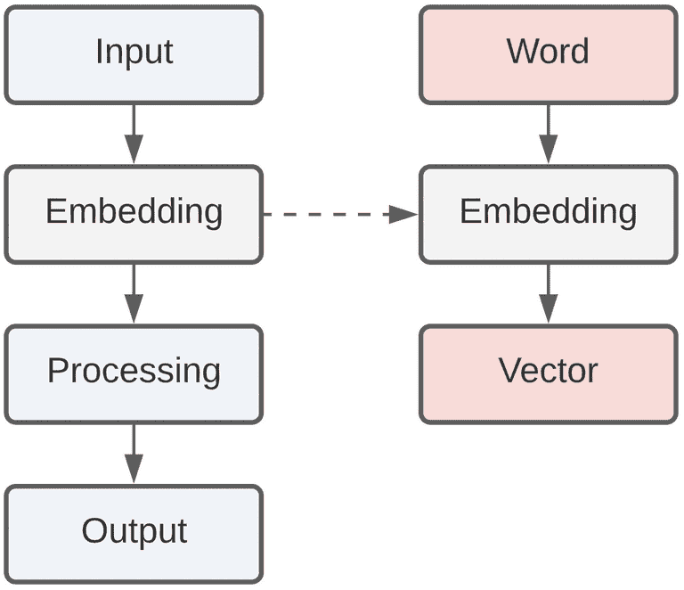

流程图具有以下流程：输入、嵌入、处理和输出。在流程图的右侧，另一个流程图如下所示：单词、嵌入和向量。

图 2-36

在神经网络模型中学习嵌入并提取学习到的嵌入以获得 Word2Vec 表示的过程

Word2Vec 的一个缺点是可解释性丧失。在词袋表示法中，我们知道向量化中的每个数字代表什么以及为什么会出现。即使使用像情感提取或 TARS 的零样本分类这样的方法，我们也理解向量化应该代表什么，即使其推导过程更复杂。然而，对于 Word2Vec，我们既不知道向量表示是如何获得的^(1)，也不知道这些数字本身代表什么。

流行的 `genism` 库提供了一个方便的接口来访问 Word2Vec。让我们首先安装并导入它，以及用于文本清理和检索的其他相关库（见列表 2-51）。

```py
import gensim
!pip install clean-text
from cleantext import clean
import urllib.request
Listing 2-51
Installing and importing relevant libraries
```

我们将在列夫·托尔斯泰的《战争与和平》上训练 Word2Vec。让我们将来自 Project Gutenberg 的全文清洗版本加载为一个单独的字符串。

```py
NUM_LINES = 25_000
wnp = ""
data = urllib.request.urlopen('https://www.gutenberg.org/files/2600/2600-0.txt')
counter = 0
for line in tqdm(data):
if counter == NUM_LINES:
break
wnp += clean(line, no_line_breaks=True)[1:] + " "
counter += 1
Listing 2-52
Reading War and Peace from the Project Gutenberg text file
```

由于这个文本相当长，我们将创建一个生成器类，逐句生成文本样本的部分（见列表 2-53）。另一种选择是一次性将所有句子加载到列表中，这会消耗内存和速度。

```py
class Sentences():
def __init__(self, text):
self.text = text
def __iter__(self):
for sentence in wnp.split('.'):
yield clean(wnp.split('.')[0], no_punct = True).split(' ')
Listing 2-53
A generator class that yields parts of the text sample for memory feasibility
```

要在数据生成器上训练 Word2Vec 模型，我们首先实例化我们的数据生成器，实例化一个 Word2Vec 模型，构建词汇表，然后在数据集上训练模型。

```py
sentences = Sentences(wnp)
model = gensim.models.Word2Vec(vector_size = 50,
min_count = 50,
workers = 4)
model.build_vocab(sentences)
model.train(sentences,
total_examples=model.corpus_count,
epochs=5)
Listing 2-54
Training a Word2Vec model on the data generator
```

我们可以通过 `model.wv` 访问单词向量。例如，我们可以这样获得单词“战争”的潜在特征：

```py
model.wv['war']
array([ 0.39098194, -2.5320148 , -1.9733142 ,  0.5213574 , -1.2734774 ,
1.8427355 ,  1.7073737 ,  0.62725115, -1.4480844 ,  0.3382644 ,
0.70060515,  2.1146834 , -1.7749621 , -0.06704506, -0.48678803,
1.1092212 ,  0.4158653 ,  0.8432404 ,  0.68553066, -0.60199624,
0.6334864 , -2.5865083 ,  1.0051454 ,  2.1787288 , -1.643258  ,
-0.1480552 ,  0.13485388,  1.7048551 , -1.6034617 ,  0.86792046,
-0.04222116, -0.55365515, -0.47291237, -3.26655   ,  2.2691224 ,
-1.2338068 ,  0.40476575, -2.0867212 , -0.30338973,  1.663073  ,
0.20157905, -0.12529533, -1.8289042 ,  0.38934758,  1.2312702 ,
2.0223777 ,  0.49417907, -2.7465372 ,  0.67504585, -0.5818529 ],
dtype=float32)
```

这里是单词“和平”的潜在特征：

```py
model.wv['peace']
Out[141]:
array([ 1.5082303e+00, -2.4013765e+00,  1.8905263e+00,  8.9056486e-01,
-4.0251561e-02,  1.2571076e+00, -1.0280321e+00, -1.4973698e+00,
-2.8854045e-01, -1.5057240e+00,  7.9542255e-01,  6.1033070e-01,
5.5785489e-01,  1.4599910e+00, -2.3478435e-01,  1.3725284e+00,
1.1054497e+00,  1.8628756e+00,  8.6687636e-01,  2.7426331e+00,
-9.0635484e-01, -2.1095347e+00, -8.1300849e-01,  7.9262280e-01,
-3.9320162e-01, -4.6035236e-01, -2.0904967e-01,  2.5718777e+00,
9.7089779e-01, -5.6960899e-01, -1.8032173e+00, -3.3043328e-01,
-4.5295760e-01, -2.6447701e+00, -1.0341860e+00, -1.7019720e+00,
7.6734972e-01, -1.8100220e+00, -8.8125312e-01, -1.6304412e-03,
1.4674787e-01, -1.4068457e+00,  4.1266233e-01, -2.2529347e+00,
1.2005507e+00,  1.2053030e+00,  9.5373660e-01, -1.5332963e+00,
6.0380501e-01, -1.3509953e+00], dtype=float32)
```

嵌入也可以用来计算词语之间的相似度。这是通过找到与每个词语关联的嵌入表示的坐标点之间的距离来实现的：

```py
model.wv.similarity('war', 'peace') -> 0.35120293
```

然后，您可以使用此查找方法将您的文本向量化。

我们将在第四章（部分：“多模态图像和表格模型”）和第五章（部分：“循环模型理论”）中看到类似的嵌入技术示例，特别是在第五章，我们将大量处理文本。

### 时间数据

时间/时间数据通常出现在实际的表格数据集中。例如，一个在线客户评论的表格数据集可能包含精确到秒的时间戳，表明评论何时发布。或者，一个医疗数据的表格数据集可能与收集的日期相关联，但不包括确切的时间。一个季度公司收益报告的表格数据集将包含按季度的时间数据。时间是动态且复杂的数据类型，具有许多不同的形式和大小。幸运的是，由于时间既信息丰富又易于理解，因此编码时间或时间特征相对容易。

有几种方法可以将时间数据转换为定量表示，使其对机器学习和深度学习模型可读。最简单的方法是将时间单位作为基本单位，并将每个时间值表示为从起始时间开始的基本单位的倍数。基本单位通常应该是与预测问题最相关的单位；例如，如果时间以月份、日期和年份存储，并且预测任务是预测销售额，则基本单位是日，我们将每个日期表示为自起始日期（如 1900 年 1 月 1 日或数据集中的最早日期）以来的天数。另一方面，在物理实验室中，我们可能需要一个纳秒作为基本单位，因为需要高精度，时间可能表示为自某个确定的起始时间以来的纳秒数。

让我们看看亚马逊美国软件评论数据集，其中包含软件产品的客户评论（这是亚马逊评论数据集的一个子集）。在加载和处理后，我们发现我们想要量化/编码日期列：

```py
0        2015-06-23
1        2014-01-01
2        2015-04-12
3        2013-04-24
4        2013-09-08
...
341926   2012-09-11
341927   2013-04-05
341928   2014-02-09
341929   2014-10-06
341930   2008-12-31
Name: data/review_date, Length: 341931, dtype: datetime64[ns]
```

在日期特征上调用 `.min()` 返回 1998-09-21，这是列中的第一个日期。`dates - dates.min()` 返回日期列与第一个日期之间的天数差。这会将每个日期与自第一个日期以来经过的天数关联起来：

```py
0        6119 days
1        5581 days
2        6047 days
3        5329 days
4        5466 days
...
341926   5104 days
341927   5310 days
341928   5620 days
341929   5859 days
341930   3754 days
Name: data/review_date, Length: 341931, dtype: timedelta64[ns]
```

虽然这种方法是明确的，但它假设任何新数据都将落在给定的范围内。例如，如果数据集包含从 2015 年 1 月 1 日到 2021 年 12 月 31 日的客户评论，我们不应该期望将模型应用于 2015 年 1 月 1 日之前的任何客户评论或 2021 年 12 月 31 日之后的任何客户评论。这是因为这里的时间表示限制了模型对特征的理解/解释仅限于提供的域。如果采样到域外的任何时间，我们不应该期望模型能够外推到不熟悉的域（图 2-37）。

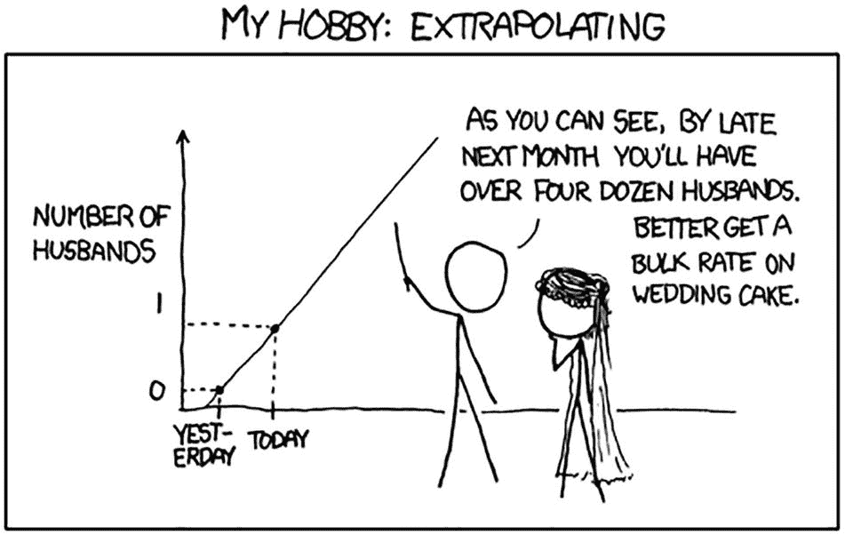

一幅草图描绘了一个图表，显示了丈夫数量与天数的关系。一个男人指向图表上的线条，告诉一个女人她下个月将有超过四十多位丈夫。

图 2-37

“我的爱好：外推”，由 Randall Munroe 在[xkcd.com](http://xkcd.com)发表。

通常，我们感兴趣的是在时间数据中识别周期性模式。时间是充满周期和单位的：一分钟有 60 秒，一小时有 60 分钟，一天有 24 小时，一周有 7 天，等等。捕捉时间周期性的一个简单方法是将时间表示为多个有界特征的组合。

有其他周期性方法来跟踪时间的重要属性（列表 2-55，图 2-38）。

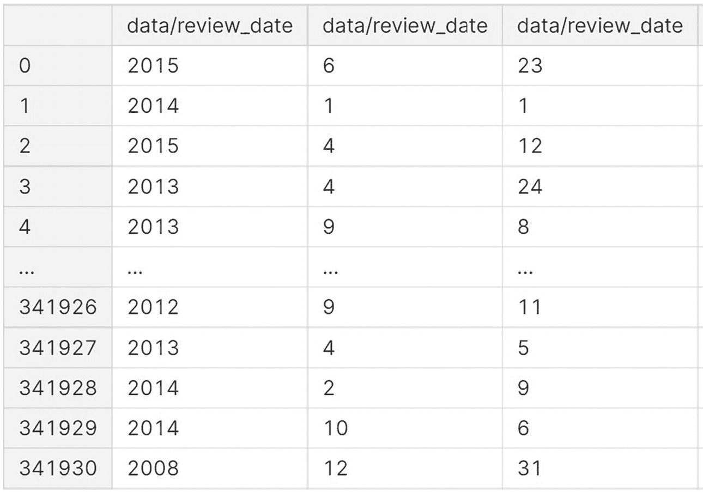

一个表格列出了不同数据集的年、月和日。

图 2-38

从原始日期对象中提取年、月和日作为单独的特征

```py
year = dates.apply(lambda x:x.year)
months = dates.apply(lambda x:x.month)
day = dates.apply(lambda x:x.day)
pd.concat([year, months, day], axis=1)
Listing 2-55
Extracting the year, month, and day from a date feature
```

当我们构建机器学习模型从该数据集中学习时，我们可能会移除“年份”列，因为它不是周期性的。虽然我们可以预期我们收集的任何新数据样本都可以合理地由月份和日期列表示（例如，月份 12 和日期 7 在时间中多次出现），但我们不能假设年份也是如此，因为它不会重复。如果您将年份列作为机器学习模型的输入信号，您必须保证模型评估的新数据落在训练时间数据的范围内。

另一个周期性特征是这一天是星期几。Python 时间对象的`.weekday`属性返回一个从 0 到 6 的整数，其中 0 代表星期日，6 代表星期一：`weekdays = dates.apply(lambda x:x.weekday).`

另一个可能的特征是包括该日是否为假日。Pandas 有包含观察到的假日列表的时间序列功能（列表 2-56）。请参阅 Pandas 文档了解如何指定自定义或更高级的假日规则。

```py
from pandas.tseries.holiday import USFederalHolidayCalendar
cal = USFederalHolidayCalendar()
allHolidays = cal.holidays(start=dates.min(),
end=dates.max()).to_pydatetime()
isHoliday = dates.apply(lambda x:x in allHolidays)
Listing 2-56
Detecting if a date falls on a holiday or not
```

时间数据在编码领域知识方面具有很大的灵活性。其他技术包括标记季节、相关商业事件（例如，光棍节、黑色星期五）、白天与夜晚、工作时间以及高峰时段。另一种方法是识别或获取离散的时间表示，并应用分类编码，例如，对一天中的小时或一周中的某一天进行编码。

此外，考虑数据集中不同时区的影响。在某些情况下，确保时间数据在其所有值中使用相同的通用系统（例如，UTC）是很重要的；在其他情况下，使用当地时间可能更有益。一种将模型暴露于通用时间和本地时间好处的方法是，如果可用时区数据，包括本地时间和从本地时间收集的时区相对于通用时间的偏移量。

### 地理数据

许多表格数据集将包含地理数据，其中位置以某种方式在数据集中指定。与时间/时间数据类似，地理数据可以存在于几个不同的范围级别上——按大陆、国家、州/省、城市、邮政编码、地址或经纬度等。由于地理数据信息丰富且高度依赖上下文，因此在编码地理数据方面没有建立良好的、全面的指导方针。然而，你可以使用之前讨论过的许多编码工具和策略来发挥优势。

如果你的数据集中包含以分类形式表示的地理数据，如按国家或州/省，你可以使用之前讨论过的分类编码方法，如独热编码或目标编码。

纬度和经度已经是精确的地理空间位置指标，并且已经以定量形式存在，因此不需要进一步编码。然而，你可能觉得在数据集中添加从纬度和经度推导出的相关信息很有价值，比如该位置属于哪个国家。

当处理特定地址时，你可以提取多个相关特征，如国家、州/省、邮政编码等。你还可以从地址中推导出确切的经纬度，并将两者都附加到数据集中，作为地址位置的连续定量表示。

## 特征提取

特征提取是从现有特征集中推导出新的特征，试图通过提供数据集的潜在有用解释来协助模型（图 2-39）。尽管许多人可能认为特征提取已被神经网络自动化或消除，但在实践中，对表格数据进行复杂的特征提取方法通常有助于性能。

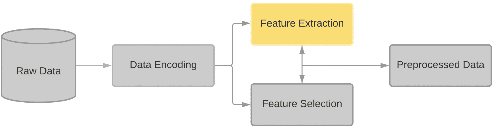

下图展示了流程图。原始数据导致数据编码，进一步细分为特征提取和特征选择，它们导致预处理数据。

图 2-39

预处理流程中的特征提取组件

### 单特征和多特征转换

统计学习流程的一个重要组成部分是对特征应用转换，以更好地反映和增强其相关性。这类转换中最简单的是单特征转换，其中单个特征值被映射到另一组值（图 2-40）。例如，如果一个函数随着其值的增加对目标变量有指数效应，我们可以用指数函数 *f* (*x*) = *e*^(*x*) 或根据领域知识修改的指数函数对其进行转换。或者，我们可以应用三角函数来模拟周期性关系，对数或平方根函数来模拟递减回报关系，或者二次函数来模拟双向关系（即，相关范围两端或极端的值对应于一个结果局部性，而“中间”的值对应于不同的结果局部性）。特征可以单独转换，也可以附加到原始特征之外的数据集中（图 2-41）。

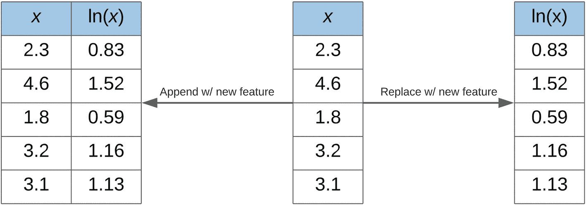

表格列出了特征 x 的值，这些值转换后包含替换特征和附加特征。

图 2-41

两种特征转换选项：用转换后的特征替换原始特征或将它附加到原始特征上

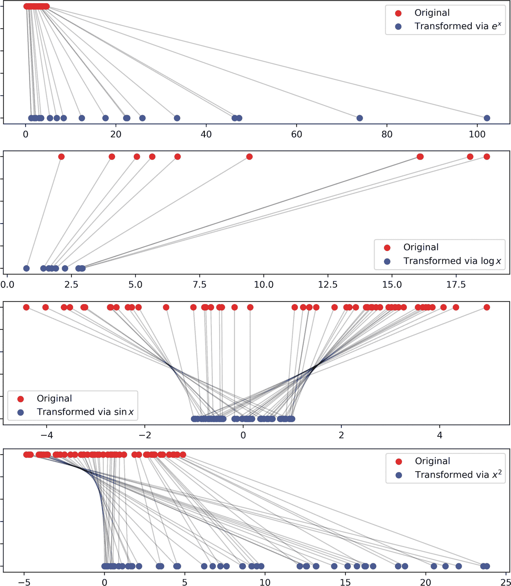

四个点图描绘了原始值与通过 e 的 x 次方转换、通过 log x 转换、通过 sin x 转换和通过 x 平方转换的值。

图 2-40

使用各种数学单特征转换转换一组一维数据点的影响

波士顿房价数据集是一个著名的基准数据集，它来自美国人口普查局，由 Harrison 和 Rubinfeld 在 1978 年编制，用于使用波士顿地区的住房数据来估计对清洁空气的需求。该数据集首次发表在《经济学与管理》杂志第 5 期上的论文“Hedonic Prices and the Demand for Clean Air”中。该数据集已被包含在主要的科学数据集和机器学习库中，如 scikit-learn 和 TensorFlow。

数据集中包含的一些特征

+   CRIM: 每个城镇的人均犯罪率

+   INDUS: 每个城镇非零售企业的比例

+   PRATIO: 学校城镇区的师生比例

+   CHAS: 如果城镇边界是查尔斯河，则为 1，否则为 0

+   NOX: 一氧化氮浓度

+   PART: 颗粒物浓度

+   B: 1000(*Bk* − 0.63)²，其中 *Bk* 是每个城镇非洲裔美国人的比例

最后这个特征，B，最近受到了很多讨论。不用说，在住房数据集中包含种族特征存在许多伦理和公平问题。现在，大多数仍然支持或使用它的数据科学库和教科书都包含一个警告，即数据集存在问题特征，并建议使用更合适的住房数据集，如艾姆斯住房数据集和加利福尼亚住房数据集。B 特征是关于特征转换如何放大不平等的社会条件并给特征校正带来问题的有趣案例研究。

注意，特征 B 是另一个特征的单特征转换，即每个城镇非洲裔美国人的比例。这种转换使用一个顶点/对称轴在 *Bk* = 0.63 的抛物线。在 *Bk* = 0.63 时，特征“B”处于最低点，特征在任一方向上以二次方式增加（见图 2-42）。哈里森和鲁宾菲尔德试图通过这种转换来模拟系统性种族主义。在城镇中非洲裔美国人的比例较低到中等时，哈里森和鲁宾菲尔德认为白人邻居会将 *Bk* 的增加视为不理想，从而对房价产生负面影响。在 *Bk* 的较高值时，哈里森和鲁宾菲尔德指出市场歧视导致房价更高。因此，哈里森和鲁宾菲尔德假设城镇中非洲裔美国人的比例与房价之间存在抛物线关系，选择 0.63 作为“贫民窟点”，在此点上 *Bk* 的增加开始增加而不是减少房价。

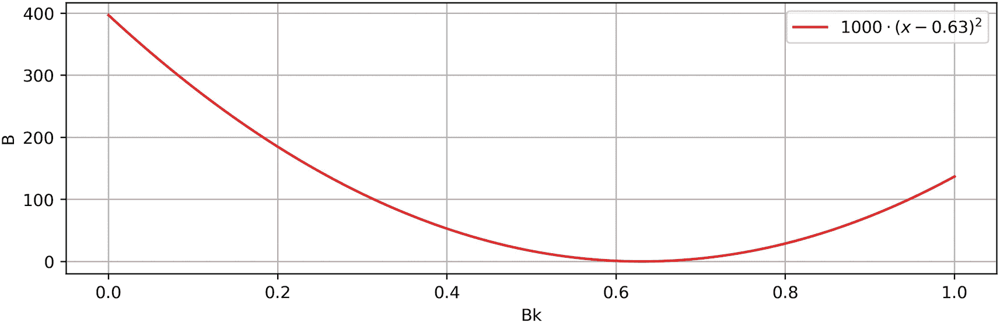

一条线图描绘了 B 与 Bk 的关系。线图绘制了 1000 次 x 减去 0.63 的平方。线图显示了一个下降趋势。

图 2-42

可视化用于转换 Bk 变量的二次单特征转换

哈里森和鲁宾菲尔德选择特征转换是为了模拟社会/制度化种族主义对房价评估与城镇中非洲裔美国人比例之间的关系的影响。因此，任何在这个数据集上训练的模型都会接受这种转换后的数据，并做出假设，认为哈里森和鲁宾菲尔德试图表示的逻辑。

因此，最近有努力更深入地研究这个特征，并了解其包含在数据集中的优点。一方面，研究这个特征的人需要知道原始、未转换的特征值（即城镇中非洲裔美国人的比例而不是“B”）。然而，“B”使用了一个 *不可逆的函数* 进行转换，这意味着多个输入可以映射到相同的输出值。这会部分破坏原始数据（见图 2-43）。

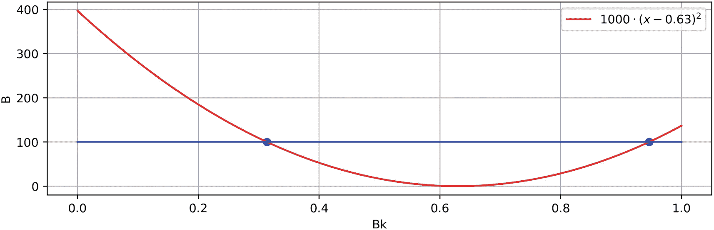

线形图绘制了 B 与 B k 的关系。曲线是针对 1000 次的 x 减去 0.63 的平方绘制的。曲线呈现下降趋势。曲线在水平线 100 处的两个点上相交。

图 2-43

使用非一对一函数作为变换可视化部分数据破坏的效果

这展示了特征变换替换原始特征的重要属性：如果只发布不可逆变换的特征，可能无法恢复数据。因此，强烈建议所有学科的数据集创建者在发布任何后续应用的特征变换之外，单独发布原始数据集。

研究人员和独立调查人员后来能够获取原始特征并将其映射到数据集，尽管有些困难（因为映射需要逆向工程哈里森和鲁宾菲尔德的数据聚合程序）。

虽然单特征变换可以在统计建模中放大特征的相关方面，我们也可以将变换应用于多个特征集以放大特征 *交互* 的相关方面。

许多多特征变换利用基本的操作，如添加、减去、乘以和除以特征集（图 2-44）。例如，可能包括一个特征，该特征包含一组可比较列的平均分数或值，如每年的收入回报。为了使多特征变换在统计学习和经典机器学习管道中有效，了解多特征变换的目的很重要。如果你只是为了添加两列而将两列相加，你不应该期望模型能从新特征中得出有意义的结论。简单的模型通常会被复杂且难以解释的特征所“困惑”或扭曲。

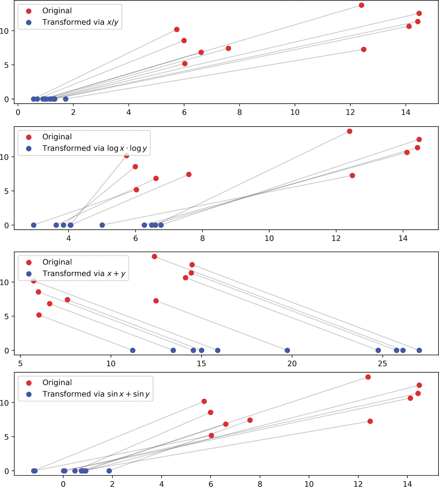

四个图表展示了原始数据与通过 x/y 变换、通过 log x 乘以 log y 变换、通过 x 加 y 变换和通过 sin x 加 sin y 变换后的转换数据。

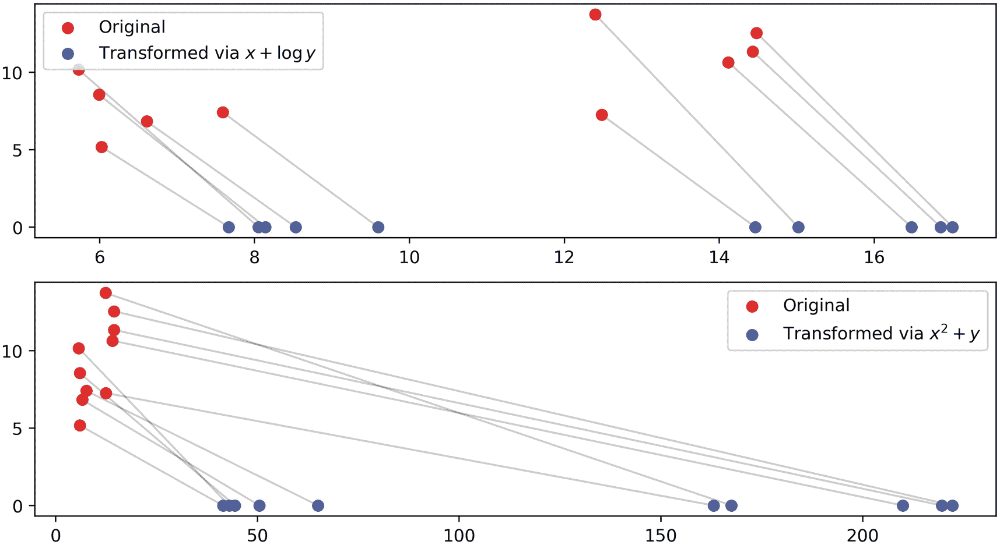

图 2-44

使用各种数学多特征变换将原始二维数据点集转换为一个新特征的效果

简单的单特征变换和多特征变换都是统计学习和经典机器学习的重要组成部分，但在深度学习的背景下，它们通常是多余的。神经网络完全有能力自己学习这些变换；此外，它们通常能够学习比手动设计更好和更复杂的变换。这是深度学习之美和力量的部分。

然而，这并不意味着如果使用的方法足够介绍并提供非平凡的价值，人类操作的特征工程在深度学习中就没有位置，尤其是在表格数据的情况下。接下来的几节将探讨各种技术，以将有助于深度学习数据集的有用输入信号引入其中。

### 主成分分析

特征工程和提取也可以采取检索信息的形式，这些信息以较低维度重建原始数据。降维技术减少了数据量和训练时间，同时综合了在原始数据中不易获取的见解。

降维技术有许多优点。当应用于训练数据时，它可以减少维度诅咒对模型性能的影响。在预处理和分析过程中，理解并可视化数据至关重要，因为它能更好地帮助我们发现可以据此构建模型的模式。然而，许多现代数据集包含数百甚至数千个特征，因此对于人类眼睛来说无法完全可视化。即使是最简单的数据集，如鸢尾花数据集，也包含四个无法一次性完全查看的特征。通过降低数据的维度，我们可以用人类可解释的视觉方式查看数据集的复杂结构。此外，在大多数情况下，我们还可以保留数据集在更高维度中拥有的关键信息。

最受欢迎且有效的降维方法之一是主成分分析（PCA）。PCA 从其最初作为探索性数据分析的便捷工具的设计演变而来，已经发展出多种用途和变体。

执行主成分分析就像为一本长书写摘要。在我们能够总结之前，我们需要理解我们在读什么，并掌握最重要的组成部分。同样，PCA 可以从数学上确定数据集的哪个部分对其最终的“摘要”贡献最大。

通过一个现实世界的例子更容易理解这一点。假设我们买了三本书，页数不同，我们的目标是仅通过观察它们的厚度来区分它们。如果第一本书有 50 页，第二本有 200 页，第三本有 500 页，它们的厚度将明显不同；因此，我们将很容易确定哪本书是哪一本。另一方面，如果第一本书有 100 页，第二本有 105 页，第三本有 110 页，由于它们的厚度相似，我们将很难区分一本书和另一本书。在我们的场景中，当这三本书的页数分布更广时，它为我们提供了更多信息，因此方差更大。相反，当数据更接近时，它包含的信息更少，转化为方差更小。在“特征选择”部分稍后，我们将介绍方差的更技术性概述，因为我们将使用这个概念来选择特征。

基于前面的示例，我们可以将方差理解为数据集提供的信息量或分布程度。主成分分析（PCA）的过程保留了具有最大方差的变量。我们可以用一个简单的数据集来说明这一概念。

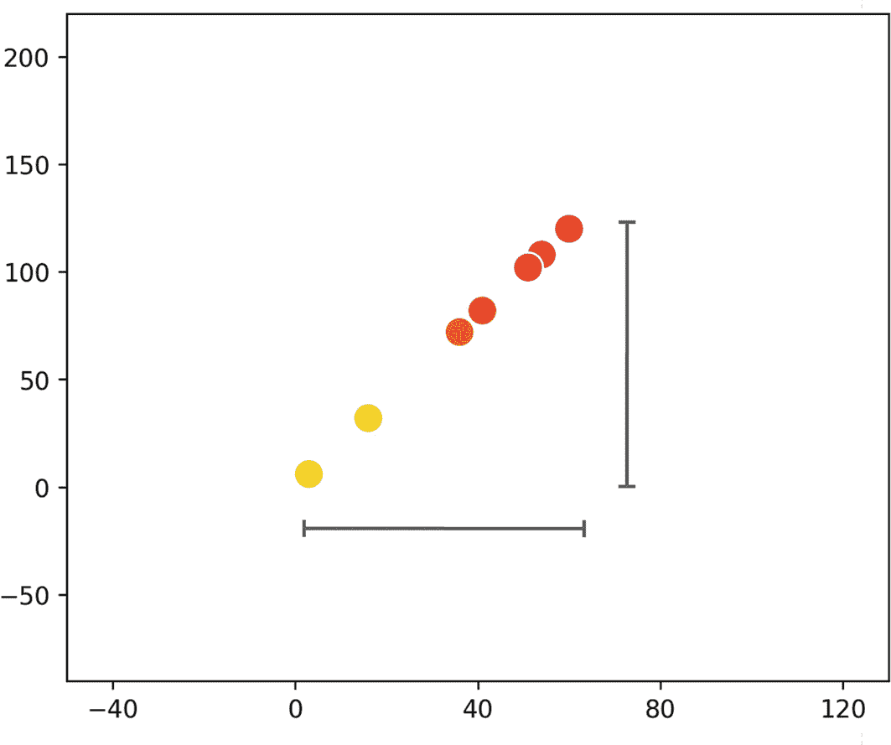

散点图描绘了两个变量值的增加趋势。

图 2-45

双变量方差值相似的数据集

PCA 不仅仅简单地删除或选择特征。如前所述，两个特征具有相似方差（如图 2-45）。删除任何一个都会与原始数据相比显著减少信息。然而，PCA 不仅考虑变量本身的方差。而不是看垂直和水平轴，我们注意到对角轴包含的方差至少与它们一样多。

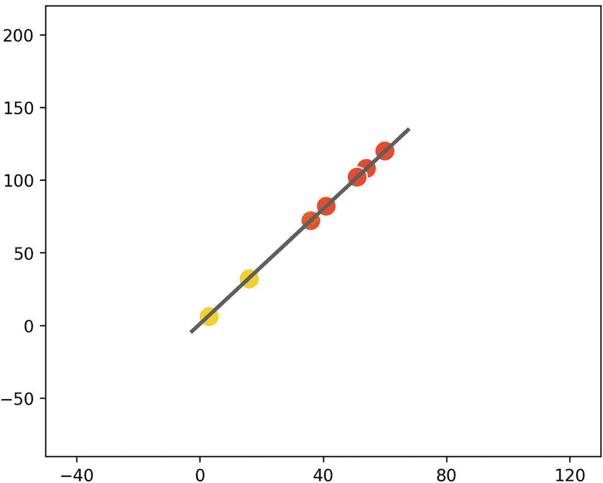

散点图显示了两个变量值的增加趋势。

图 2-46

对角轴上的方差

PCA 随后基于原始两个变量的组合创建了两个不同的变量。在我们的例子中，我们根据对角轴及其垂直线作为我们的两个新轴来转换数据（如图 2-46）。

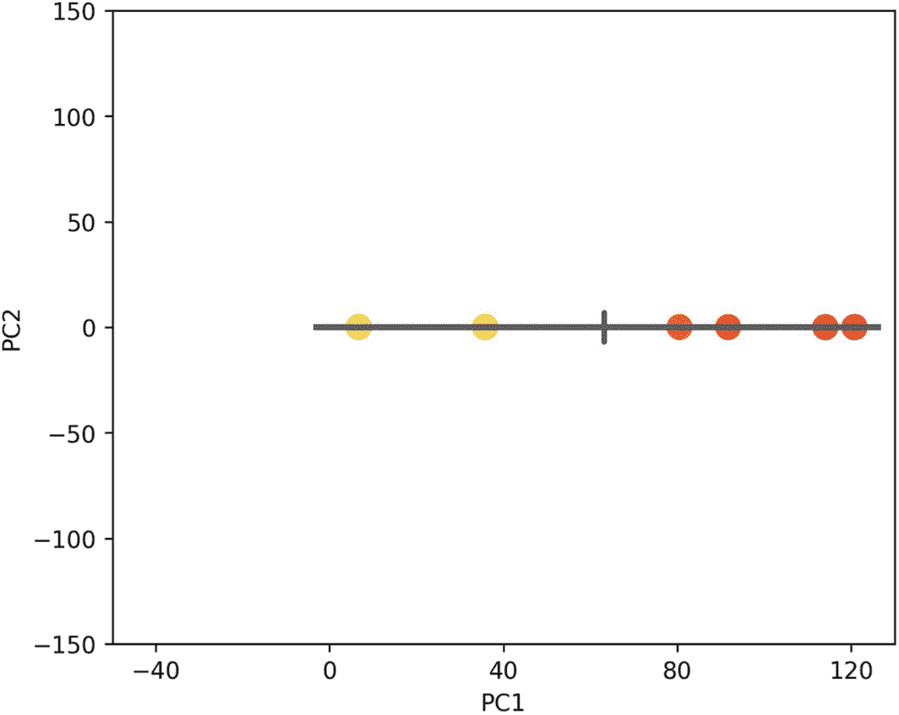

散点图显示了 P C 2 和 P C 1 之间的值。这两个变量的绘图值几乎呈水平状态。

图 2-47

相对于对角轴旋转的数据

我们将这两个新变量称为主成分。从图中，我们可以清楚地看到 PC1 比 PC2 具有更多的方差（图 2-47）。保留 PC1 将保留最多的方差，或者说从原始数据中保留最多的信息，这正是 PCA 所做到的。如果我们进一步挖掘，从我们的例子中，我们发现 PC1 完全解释了原始数据中的所有方差。然而，情况并不总是如此。我们可以使用 Scree 图（图 2-48）来直观地表示每个成分解释的方差量。

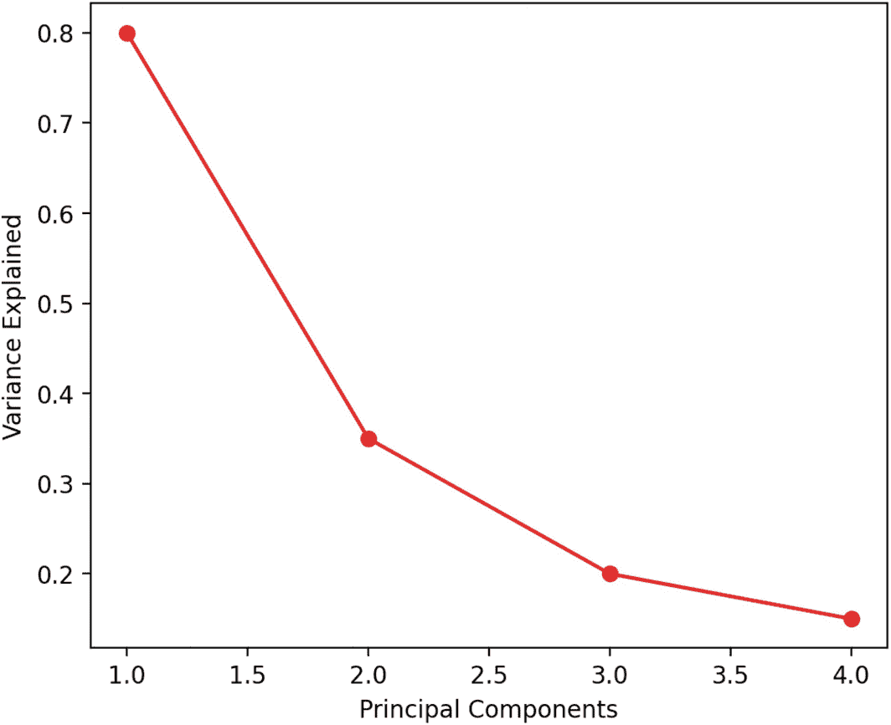

一条线图显示了解释的方差与主成分的关系。线通过(1.0, 0.8)，(2.0, 0.35)，和(4.0, 0.1)。所有数据都是近似的。

图 2-48

假设数据集的 Scree 图

该图显示了每个主成分解释的方差与总方差的比率。在我们的先前的例子中，显示了四个主成分；第一个解释了相对于原始数据集的 80%的总方差。

PCA 作为特征选择技术的一个主要缺点是围绕变换后每个数据点的规模或距离。在寻找主成分并将它们转换为新变量时，我们只是在旋转轴并改变数据点的方向。然而，当我们开始去除维度时，一个维度上的空间限制将影响每个数据点通过欧几里得距离相互关联的方式。这个问题在某些情况下可能会影响模型性能，而在其他时候则可以忽略。PCA 是否有助于用例只能通过经验和测试来确定。

使用 PCA 进行特征提取有两种方法。第一种是我们可以设置算法将数据减少到一定数量的“成分”，从而得到一个较小的数据集，同时保留原始数据中的大部分信息。第二种是 PCA 也可以用于添加新特征。在某些情况下，除了使用 PCA 提供的特征外，保留原始特征并添加一定数量的 PCA“成分”作为新特征可能更有益。在某些情况下，使用 PCA 创建更多特征可以为模型提供更多信息，这些信息可能是或可能不是模型认为至关重要的。对于模型来说，主成分是一种紧凑的方式，用于存储关键信息，并且根据模型的需要，它也可以使用原始特征，因为它们包含最准确的价值。

以下使用 scikit-learn 演示了 PCA 在特征工程/提取中的两种用途（见列表 2-57）。在执行 PCA 之前标准化数据至关重要，因为新的数据投影和新轴将基于原始变量的标准差。当一个变量的标准差高于另一个时，它可能导致不同特征分配不均匀的权重。

```py
# Dummy Dataset where the goal to predict diagnosis of breast cancer
from sklearn.datasets import load_breast_cancer
# PCA
from sklearn.decomposition import PCA
# standardization
from sklearn.preprocessing import StandardScaler
breast_cancer = load_breast_cancer()
breast_cancer = pd.DataFrame(data=np.concatenate([breast_cancer["data"], breast_cancer["target"].reshape(-1, 1)], axis=1),
columns=np.append(breast_cancer["feature_names"],"diagnostic"))
# standardize
scaler = StandardScaler()
breast_cancer_scaled = scaler.fit_transform(breast_cancer.drop("diagnostic", axis=1))
# the data originally have 30 features, for visualization purposes later on,
# we're only going to keep 2 principal components
pca = PCA(n_components=2)
# transform on features
new_data = pca.fit_transform(breast_cancer_scaled)
# reconstruct dataframe
new_data = pd.DataFrame(new_data, columns=[f"PCA{i+1}" for i in range(new_data.shape[1])])
new_data["diagnostic"] = breast_cancer["diagnostic"]
Listing 2-57
Example of using PCA to select components
```

如果添加那些计算出的主成分更好，我们可以像以下所示那样做（见列表 2-58）。

```py
# we're dropping the target column in new_data and not
# the original to keep the ordering of columns
combined_data = pd.concat([new_data.drop("diagnostic", axis=1), breast_cancer], axis=1)
Listing 2-58
Combined data with features extracted from PCA
```

最后，主成分分析（PCA）对于可视化和分析高维数据集下的模式至关重要。我们可以通过在二维或三维中分别绘制两个或三个主成分来实现这一点。此外，对于每个数据点，我们可以根据它们的标签以不同的颜色进行着色，以更好地进行可视化分析（见列表 2-59）。

```py
plt.figure(figsize=(6, 5), dpi=200)
plt.xlabel("PCA1")
plt.ylabel("PCA2")
plt.scatter(new_data.PCA1, new_data.PCA2, c=new_data.diagnostic, cmap='autumn_r')
plt.show()
Listing 2-59
Code for displaying principal components
```

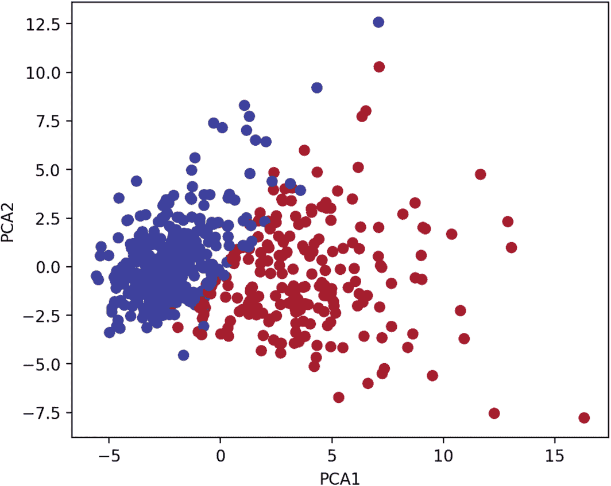

散点图展示了主成分分析（PCA）的 PC2 与 PC1 之间的关系。主成分的图在图表的中心密集聚集。

图 2-49

主成分的可视化

从观察图表中，注意标签是根据颜色分开的（见图 2-49）。这几乎就像两个标签位于两个可分离的簇中。这种现象表明，仅用两个主成分或两个特征就已经解释了大量的方差。从这个可视化中，我们可以得出结论，通过显著降低数据集的维度，我们仍然可以保留大量信息，同时降低模型复杂度。还可以通过在拟合的`PCA`对象上调用`.explained_variance_ratio_`来获得组件的解释方差的确切值。

主成分分析（PCA）有时很有用，可以在降低模型复杂性的同时可能提高性能，但像许多其他特征提取技术一样，它也有其缺点。因此，数据科学家必须决定如何应用适合情况的算法，同时最小化计算成本。

### t-SNE

如前所述，许多现代数据集存在于高维空间中；我们可以利用 PCA 等算法将数据集降低到较低维度。然而，PCA 仅在线性可分数据上表现良好。对于 PCA 来说，将非线性可分数据投影到较低维度并保留大部分有助于模型区分标签的信息是困难的。

流形是一系列降维技术，专注于分离非线性可分数据（见图 2-50）。具体来说，t-SNE（t 分布随机近邻嵌入）是其中最常用且最有效的算法之一。

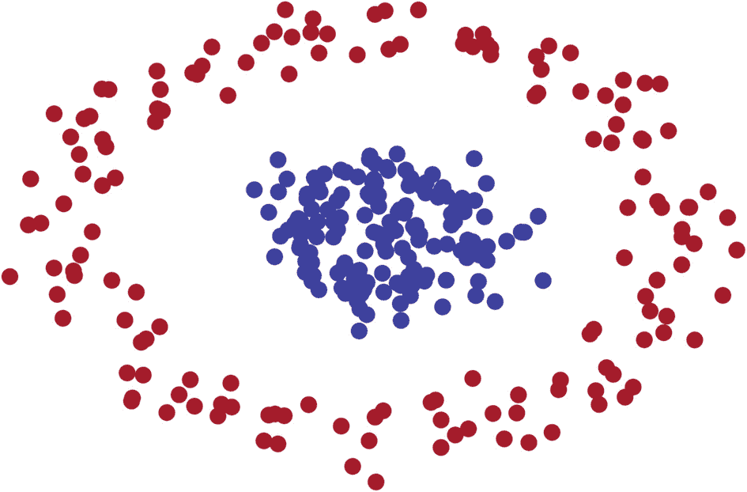

一张图像展示了两个数据集。第一个数据集的图集中在中心，而第二个数据集的图围绕着第一个数据集。

图 2-50

非线性可分数据

t-SNE，或称 t-分布随机邻域嵌入，是用于高维可视化的最受欢迎的无监督算法之一。尽管 t-SNE 不一定用于特征选择，但它对于许多复杂的深度学习流程来说是一个重要的步骤，并且通常用于神经网络解释。与 PCA 不同，t-SNE 侧重于局部结构，保留点之间的局部距离而不是优先考虑全局结构。该算法将原始空间中的关系转换为 t 分布，即具有小样本量和相对未知标准差的正态分布。

t-SNE 不是依赖于方差来确定有用信息，而是侧重于对局部聚类数据进行分组。该算法使用 Kullback-Leibler 散度，作为联合概率的统计距离的度量，作为数据分离的测量。梯度下降被应用于优化该度量。

在 t-SNE 中，通过用户指定的超参数可以调整转换数据的困惑度。此参数对最终的可视化有显著影响，因此在使用 t-SNE 时应进行调整和考虑。困惑度可以解释为 t-SNE 将考虑用于投影数据的最近邻的数量。我们预计在较小的困惑度下会看到更稀疏的可视化，反之亦然。

Scikit-learn 提供了 t-SNE 的实现，如下所示。我们可以生成一个示例三维瑞士卷数据集；这是一个非线性可分数据的经典例子（列表 2-60）。数据生成器还返回一个数组，表示每个样本在主维度中的单变量位置。我们可以根据这个返回的数组给每个点着色，并基于此评估 t-SNE 的性能（见图 2-51）。

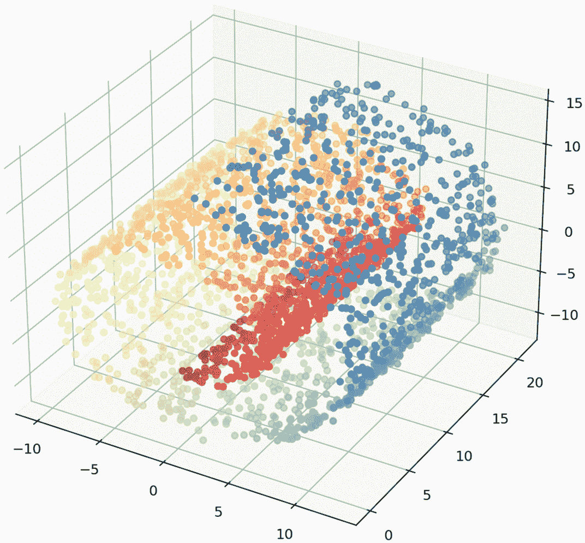

一个 3D 散点图描绘了不同变量所绘制的值。这些图呈卷状。

图 2-51

瑞士卷数据

```py
# generate a nonlinearly separable data in the shape of a swiss roll
# 3-dimensions
swiss_roll, color = datasets.make_swiss_roll(n_samples=3000, noise=0.2, random_state=42)
fig = plt.figure(figsize=(8, 8))
# visualize original data, results shown below
ax = fig.add_subplot(projection="3d")
ax.scatter(swiss_roll[:, 0], swiss_roll[:, 1], swiss_roll[:, 2], c=color, cmap=plt.cm.Spectral)
# t-SNE training
from sklearn.manifold import TSNE
embedding = TSNE(n_components=2, perplexity=40)
X_transformed = embedding.fit_transform(swiss_roll)
# visualize t-SNE results, graph shown below
plt.scatter(X_transformed[:, 0], X_transformed[:, 1], c=color)
Listing 2-60
Code for generating Swiss roll data and training t-SNE
```

与此相比，t-SNE 在保留原始数据中大多数结构的同时将数据降至二维，很好地分离了不同的颜色（见图 2-52）。

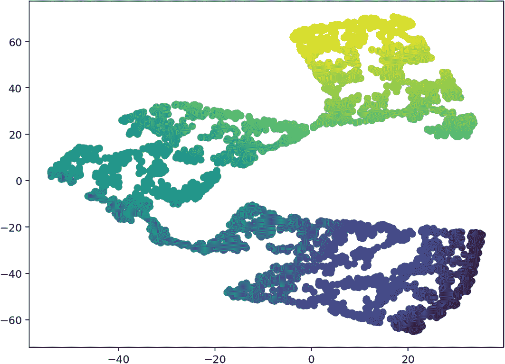

一张图展示了将数据转换为二维后的卷数据。y 轴的值在-60 到 60 之间。x 轴的值在-40 到 20 之间。

图 2-52

瑞士卷数据降至二维

尽管 t-SNE 比 PCA 更好地处理非线性数据，但该算法有一些主要缺点应予以考虑。由于 t-SNE 在梯度下降中使用的随机初始化，种子选择可以影响结果。此外，t-SNE 的计算成本极高。当在包含数百万个样本的数据集上运行时，t-SNE 可能比 PCA 花费更长的时间来完成。

如果用于特征选择，它可以像 PCA 一样使用。通常，t-SNE 在模型解释和特征提取中扮演着关键角色，但不在特征选择中。一些常见用途包括将图像数据转换为表格数据以及可视化各种深度学习算法。

### 线性判别分析

主成分分析（PCA）是一种无监督算法，这意味着在转换数据时，它不考虑标签。PCA 基于假设大方差包含更多信息，因此在转换为低维空间时能更好地代表原始数据，将高维数据投影到低维空间。另一方面，线性判别分析（LDA）旨在最大化标签簇之间的分离。虽然看起来 LDA 只能用于分类，但由于它是一个监督学习算法，它可能比 PCA 更好地将高维数据转换为人类可理解的可视化。

注意，虽然 LDA 也可以用作分类数据集的算法，但这超出了我们的范围。我们将只关注 LDA 的降维和特征选择部分。对于二元分类任务，LDA 试图最大化每个标签簇中心点之间的距离。相反，在多类分类中，LDA 最大化簇到整体中心点的距离。

LDA 假设特征是正态分布的，并且每个特征必须具有相似方差。具体来说，LDA 的过程可以总结为三个步骤。

1.  计算每个标签的类间方差。类间方差量化了每个标签簇均值之间的距离。

1.  计算每个标签的类内方差。类内方差是每个类均值与该标签簇中每个样本之间的距离。

1.  根据要保留的组件数量，该数量作为超参数指定，数据被投影到该数量的维度。投影应最大化类间方差，同时最小化类内方差。这可以通过奇异值分解或使用特征值来实现。

Scikit-learn 实现了 LDA，其语法与 PCA 类似（列表 2-61）。注意，在降维过程中，可以保留的最大组件数限制为(*num* _ *classes* − 1, *num* _ *features*)。

```py
# Dummy Dataset where the goal to predict diagnosis of breast cancer
from sklearn.datasets import load_breast_cancer
# LDA
from sklearn.discriminant_analysis import LinearDiscriminantAnalysis
# standardization
from sklearn.preprocessing import StandardScaler
breast_cancer = load_breast_cancer()
breast_cancer = pd.DataFrame(data=np.concatenate([breast_cancer["data"], breast_cancer["target"].reshape(-1, 1)], axis=1),
columns=np.append(breast_cancer["feature_names"],"diagnostic"))
# standardize
scaler = StandardScaler()
breast_cancer_scaled = scaler.fit_transform(breast_cancer.drop("diagnostic", axis=1))
# the data originally have 30 features, for visualization purposes later on,
# we're only going to keep 2 principal components
lda = LinearDiscriminantAnalysis(n_components=1)
# transform on features
new_data = lda.fit_transform(breast_cancer_scaled, breast_cancer["diagnostic"])
# reconstruct dataframe
new_data = pd.DataFrame(new_data, columns=[f"LDA{i+1}" for i in range(new_data.shape[1])])
new_data["diagnostic"] = breast_cancer["diagnostic"]
Listing 2-61
Code for dimensionality reduction in LDA
```

如果我们将转换后的数据以颜色区分不同的类别标签，如图所示，LDA 在仅一个维度上就能很好地分离类别（图 2-53）。

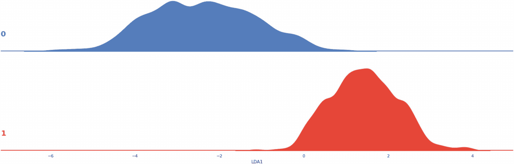

两个图表绘制了 LDA 1 的值。图表值在特定范围内达到峰值，否则保持平坦。

图 2-53

将 LDA 降维到一维

LDA 在现代机器学习领域也不常用，无论是作为分类算法还是降维技术。如前所述，LDA 的一个主要缺点是它假设所有特征都服从正态分布，并且它们的方差相似。此外，PCA 和 LDA 都是线性降维算法，这意味着它们只能对线性可分的数据进行操作。

与 PCA 相比，LDA 更难使用，并且它是一种较少使用的降维方法。LDA 更适合多类分类问题，因为标签有超过两个类别，这意味着降维后的数据仍将超过两个维度，从而保留了更多原始数据的信息。此外，由于 LDA 是一种监督学习算法，它可能比 PCA 表现得更好。

### 基于统计的工程

特征工程的核心目的是从原始特征集中提取对模型有价值的信息。这可以通过在“单特征和多特征转换”部分讨论的转换来实现。特征提取也可以通过推导样本的统计属性来实现。我们可以获取每个样本在整个行中的统计度量，创建新的特征。然而，这种方法只适用于那些值处于相同尺度的特征集，因此从这些特征产生的统计度量才有实际意义，并为模型提供有用的信息。

此外，利用这种技术为模型理解数据提供了不同的视角。而不是提供将相关性从特征扩展到目标或增加其相关性的特征，每个样本的统计度量让模型将其视为独立的，而不是更大数据集的一部分。

我们可以计算简单的度量，如每个样本的平均值、中位数或众数。然而，计算与分布相关的任何统计信息，如标准差或偏度，对模型有更大的积极影响。我们可以在一个包含约 250 个基因组序列作为特征，并基于其遗传序列预测细菌类型的遗传数据集上展示这一概念。

```py
# only take first 2000 rows as the whole data is too large
gene_data = pd.read_csv("../input/cleaned-genomics-data/cleaned.csv", nrows=2000)
Listing 2-62
Loading data
```

在加载数据（列表 2-62）之后，我们可以根据该行特征值可视化每个样本的分布，如下所示（图 2-54）。

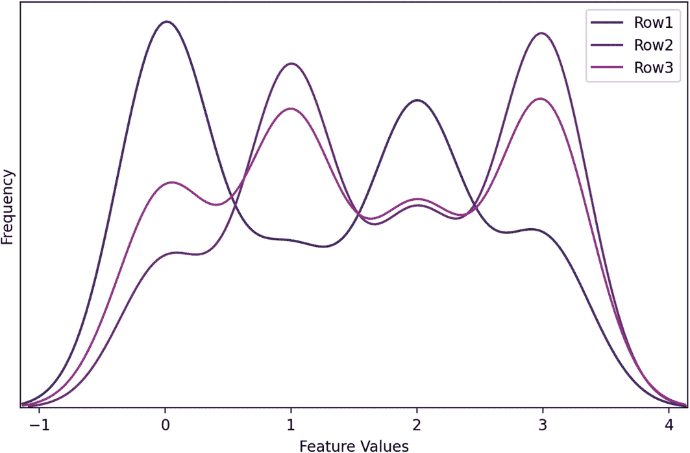

线形图绘制频率与特征值之间的关系。线条绘制在 1、2 和 3 行。所有线条都描绘出波动模式。

图 2-54

前三个样本的每行特征分布

根据每行的分布，然后可以计算每行的标准差、偏度、峰度和均值以及中位数（列表 2-63）。

```py
gene_feature = gene_data.drop(["Unnamed: 0", "label"], axis=1).columns.to_list()
for stats in ["mean", "std", "kurt", "skew", "median"]:
gene_data[f"{stats}_feat"] = getattr(gene_data[gene_feature], stats)(axis = 1)
Listing 2-63
Calculating the statistics for each row
```

在应用转换后，我们可以观察到不同类别之间这些度量之间的差异，而模型可能会在内部发现一个模式并将其与目标相关联，从而提高性能。

记住，我们分组并计算其属性的这些特征必须在同一尺度上；它们在结合和使用时必须具有实际意义。也就是说，特征必须是*同质的*。在后续章节中，我们将看到某些技术需要或假设特征内部具有同质性。在我们的案例中，由于每个氮键形成一个 DNA 序列，因此自然可以将每个单独的氮键组合在一起。在不是每个特征都能很好地与其他特征结合，并且它们的组合分布没有用时（即特征异质性）的情况下，我们可以尝试将相似的特征分组，并计算每个组的统计度量。

这种将每个样本视为特征内的一个组而不是一个数据点的想法可以扩展，例如根据领域知识或简单地通过试错计算每行的总和或乘积。当特征数量较少时，也可以利用每个样本的总和或乘积，而计算与单个样本上所有特征的分布相关的度量不会提供太多额外信息。

根据数据集的大小，当特征数量较多时，使用深度学习方法比使用经典机器学习算法更受欢迎，这正是本书的核心，也是这种方法取得大部分成功的原因。这两种方法的使用将在后续章节中演示。

## 特征选择

特征选择是指从数据集中过滤或删除特征的过程（图 2-55）。执行特征选择有两个主要原因：去除冗余（信息内容非常相似）的特征和过滤掉不相关（与目标无关的信息内容）的特征，这些特征可能会降低模型性能。特征提取与特征选择之间的区别在于，选择减少了特征的数量，而提取则创建新的特征或修改现有特征。特征选择的一个通用方法通常包括为每个特征获得一个“有用性”度量，然后消除那些未达到阈值的特征。请注意，无论使用哪种特征选择方法，最佳结果很可能是通过试错得到的，因为最优技术和工具因数据集而异。

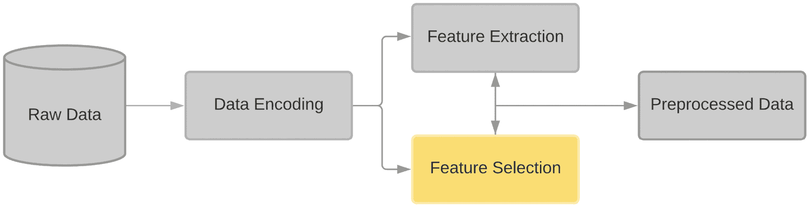

流程图如下所示。原始数据经过数据编码，编码过程分为特征提取和特征选择，进而得到预处理数据。

图 2-55

预处理管道中的特征选择组件

### 信息增益

信息增益，与 Kullback-Leiber 散度同义，可以定义为衡量某个特征告诉我们关于目标类多少信息的度量。在讨论其在特征选择中的应用之前，请注意，信息增益可以作为另一个“指标”与基尼不纯度和熵一起在决策树中找到最佳分割。信息增益在决策树中使用的一个主要缺点是它倾向于选择具有更多唯一值的特征。一个例子是，如果数据集包含像日期这样的特定属性，在通常情况下，对于决策树来说，利用这样的特征可能没有用，因为其值与目标无关。然而，信息增益可能会为日期特征输出比其他更有用的特征更高的分数。此外，当处理分类特征时，信息增益倾向于选择具有更多类别的特征，这可能并不理想。尽管在决策树分割中作为“指标”使用的信息增益可能在罕见情况下是有用的，但大多数时候，由于其主要的缺点，它不被考虑。

在技术术语中，信息增益产生的是变换前后的熵的差异。当应用于分类特征选择时，它计算两个变量之间的统计依赖性，或者两个变量共享多少信息；有时也被称为互信息。在统计学中，*信息*这一术语指的是某个事件有多么令人惊讶。当一个事件具有更平衡的概率分布和更高的熵时，它被认为比另一个事件更令人惊讶。熵衡量的是数据集的“纯度”，即属于类别的样本的概率分布。例如，具有完美平衡目标（50-50 分割）的数据集会导致熵为 1，而具有不平衡目标（90-10 分割）的数据集会产生较低的熵。信息增益通过根据数据集中每个唯一值来分割数据集来评估对纯度的影响。本质上，它根据特征如何分割目标来计算一个特征相对于目标的有用性。信息增益的方程如下所示：

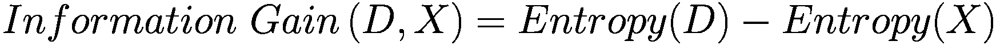

第二次计算的熵是在数据集 *D* 中关于特征 *X* 的条件熵，定义为

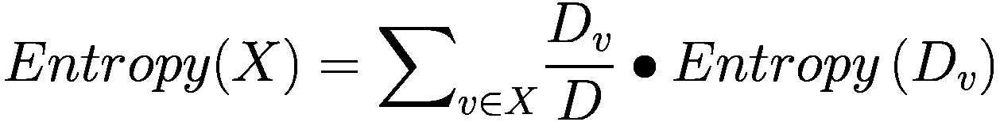

对于求和中的每个项，我们根据特征中的唯一值 *v* 将数据集分割，计算该子集的熵 *D*[*v*]；然后乘以子集与整个数据集的比例（*D*[*v*]中的样本数除以数据集 *D* 中的总样本数）以及这些子集中的每个子集的总和。最后，我们计算起始熵和结束熵之间的差异。结果值越高，特征为我们提供的目标信息就越多。

我们可以通过以下示例在模拟数据集上展示这种特征选择技术，目的是根据各种属性对葡萄酒类型进行分类。

```py
from sklearn.datasets import load_wine
# load dummy dataset
wine_data = load_wine()
# get X and y
X = wine_data[“data”]
y = wine_data[“target”]
Listing 2-64
Loading dataset
```

在加载数据集（见列表 2-64）之后，我们可以首先训练一个不带特征选择的决策树，以便稍后进行比较（见列表 2-65）。

```py
# Train a simple Decision Tree on the Dataset without feature selection
from sklearn.tree import DecisionTreeClassifier
from sklearn.model_selection import train_test_split as tts
# train test split so we can evaluate our performance on unseen test data
X_train, X_test, y_train, y_test = tts(X, y, test_size=0.3, random_state=42)
# Decision Tree
dt = DecisionTreeClassifier(max_depth=5)
dt.fit(X_train, y_train)
# Predict on unseen test dataset
predictions = dt.predict(X_test)
# evaluate performance
from sklearn.metrics import classification_report
print(classification_report(y_test, predictions))
Listing 2-65
Training baseline model with Decision Tree
```

我们获得了 0.94 的总准确率，但有一个小小的警告：类别 1 的性能显著低于其他类别。我们可以通过使用信息增益来去除对模型没有正面影响的特征，从而进一步提高结果（见列表 2-66）。

```py
# already good enough performance, but can it be better with feature selection?
from sklearn.feature_selection import SelectKBest
from sklearn.feature_selection import mutual_info_classif
# mutual info classif calculates the mutual information between two variables, aka Information Gain
# select K best chooses the k top features based on the feature selection method provided
# select top 11 features
X_new = SelectKBest(mutual_info_classif, k=8).fit_transform(X, y)
Listing 2-66
Feature selection with Information Gain
```

我们通过信息增益选择了前八个特征，得到了`X_new`数组。现在我们使用相同的训练-测试分割和相同的参数训练一个新的决策树模型（见列表 2-67）。

```py
# Decision Tree with Feature selection
# train test split so we can evaluate our performance on unseen test data
X_train, X_test, y_train, y_test = tts(X_new, y, test_size=0.3, random_state=42)
# Decision Tree
dt = DecisionTreeClassifier(max_depth=5)
dt.fit(X_train, y_train)
# Predict on unseen test dataset
predictions = dt.predict(X_test)
# evaluate performance
from sklearn.metrics import classification_report
print(classification_report(y_test, predictions))
# BETTER PERFORMANCE!
Listing 2-67
Retrain Decision Tree and evaluate performance
```

我们看到我们的准确率提高到了惊人的 0.98，类别 2 的性能与之前未进行特征选择的训练模型相比有了显著改善。

信息增益作为特征选择技术对于相对较小的数据集非常有用，因为随着数据集增大和特征值的唯一性增加，计算成本会大幅上升。

### 方差阈值

特征选择实现的一个关键目标是移除对预测目标没有任何实际用途的过多信息；因此，删除它们可以减小模型大小，同时提高模型性能。统计量方差告诉我们关于特征分布变异性方面的信息。简单来说，它衡量数据分散的程度。通常情况下，当有更多唯一值或数据包含与平均值不同的值时，特征包含更多对目标有用的信息。例如，具有恒定值的特征将具有 0 的标准差和 0 的方差：数据中没有变化。因此，我们的目标是去除方差低的特征。然而，测量某些特征的方差并不考虑特征与目标的相关性；它假设具有更多唯一值的特征通常比具有较少变异性的特征表现更好，因为这种情况通常如此。数据集的方差定义为以下公式，其中  是所有观察值或值的平均值，*n* 是值的数量：

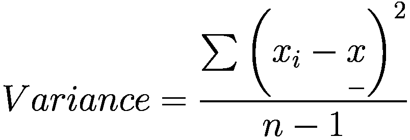

与信息增益相比，方差阈值提供了一种显著更快且更简单的特征选择方法，对模型有相当大的改进。方差阈值通常用作基线特征选择器，以过滤掉不合适的特征，而不会产生显著的计算成本。以下展示了使用方差阈值选择特征的简单演示。请注意，当使用方差阈值通过比较和移除超过某个值的列来选择特征时，所有列的值必须在同一尺度上。不同尺度的值产生的方差只能与其自身尺度相比较。在我们的例子中，我们使用了`MinMaxScaler`对计算方差之前的所有特征进行缩放（列表 2-68）。

```py
# we can perform Variance Threshold solely using Pandas
# example dataset, using patient's data to predict their breast cancer diagnostic
from sklearn.datasets import load_breast_cancer
breast_cancer = load_breast_cancer()
breast_cancer = pd.DataFrame(data=np.concatenate([breast_cancer["data"], breast_cancer["target"].reshape(-1, 1)], axis=1), columns=np.append(breast_cancer["feature_names"],"diagnostic"))
# diagnostic is our target column
# Scale the data before calculation
from sklearn.preprocessing import MinMaxScaler
# Get the name of all the features
features = load_breast_cancer()["feature_names"]
scaler = MinMaxScaler()
breast_cancer[features] = scaler.fit_transform(breast_cancer[features])
Listing 2-68
Loading the Breast Cancer dataset and performing scaling
```

在对数据进行缩放后，训练了一个最大深度设置为 7 的决策树作为基线比较（列表 2-69）。分类器达到的准确率为 0.94，但负类的准确率可能低至 0.90。

```py
from sklearn.model_selection import train_test_split as tts
from sklearn.metrics import classification_report
from sklearn.tree import DecisionTreeClassifier
X_train, X_test, y_train, y_test = tts(breast_cancer[features], breast_cancer["diagnostic"], random_state=42, test_size=0.3)
rf = LogisticRegression()
rf.fit(X_train, y_train)
predictions = rf.predict(X_test)
print(classification_report(y_test, predictions))
Listing 2-69
Baseline model
```

在帮助去除低方差特征之后，我们可以看到模型性能的改善，如下所示（列表 2-70）。

```py
# returns the variance of each column that's more than 0.015
var_list = breast_cancer[features].var() >= 0.015
var_list = var_list[var_list == True]
# Select those features from the dataset
features = var_list.index.to_list()
from sklearn.model_selection import train_test_split as tts
from sklearn.metrics import classification_report
from sklearn.tree import DecisionTreeClassifier
X_train, X_test, y_train, y_test = tts(breast_cancer[features], breast_cancer["diagnostic"], random_state=42, test_size=0.3)
rf = LogisticRegression()
rf.fit(X_train, y_train)
predictions = rf.predict(X_test)
print(classification_report(y_test, predictions))
Listing 2-70
Retrain model with removed features
```

我们观察到准确率略有提高，达到 0.95，而真正负预测的精确率增加到 0.92。根据阈值值，可能会产生更差或更好的结果。最佳值只能通过试错来确定。

然而，有时方差阈值提供的结果并不令人满意，因为它没有考虑到特征与目标之间的相关性。由于特征表示的性质，分类和二进制特征往往具有极低的方差；整个数据集可能只包含少数几个独特的值，但它为预测目标提供了关键线索。建议在执行方差阈值时排除分类或二进制特征。此外，一些数据集包含具有高变异性的特征，但并不一定有助于预测目标，这又回到了方差阈值没有考虑目标与特征之间关系的事实，因此使其成为一种无监督特征选择技术。

最后，确定“截止点”的阈值取决于所使用的数据集。有些数据集可能具有全面的高方差特征；在这种情况下，方差阈值将毫无用处。没有确定阈值的通用规则；最佳值只能通过试错得出。

### 高相关性方法

确定某些特征是否将成为目标的有效指标的最直接方法之一是通过相关性。在统计学中，相关性定义了两个变量之间的相关性；它通常产生一个度量，指定两个变量之间关系的好坏。特征与目标之间的关系可以说是决定训练模型是否能够很好地预测目标的最重要因素之一。与目标相关性低的特征将表现为噪声，并可能降低训练模型的性能。使用皮尔逊相关系数计算的两个变量之间的线性相关性通常用于衡量两个变量或它们的相关性有多接近。其方程如下，其中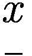和分别代表*x*和*y*变量的平均值：

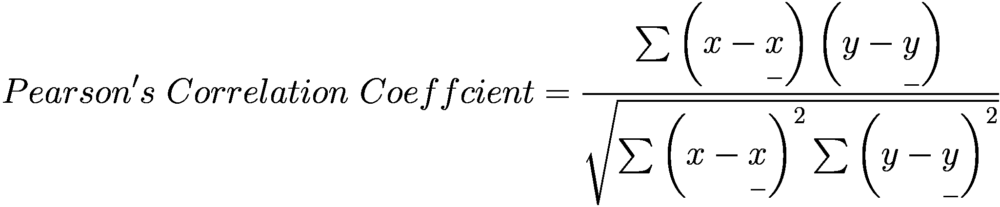

皮尔逊相关系数产生一个介于-1 和 1 之间的值；-1 表示两个变量之间存在负相关性，而 1 表示两个变量之间存在完美的正相关性。0 的值表示变量之间完全没有相关性。一般来说，当值在 0.5 以上或-0.5 以下时，两个变量被认为具有强烈的正/负相关性。

以前面介绍的波士顿房价数据集为例。我们可以将每个特征与目标之间的相关性可视化，如下所示，以热图形式呈现（图 2-56）。

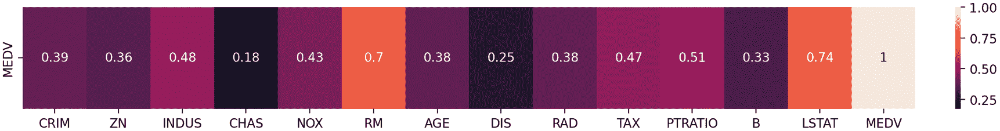

一个彩色编码的地图展示了不同的特征及其对应的目标值。右侧的刻度表示从 0.25 到 1 的强度。

图 2-56

波士顿房价数据集的特征与目标的相关性

目标列，“MEDV”，代表业主拥有的房屋的中位价值，单位为千美元。我们可以看到，LSTAT 与目标列的相关性值极高，达到 0.74。接下来，列“INDUS”、“RM”和“PTRAIO”的相关性值都大于或等于 0.5。合理地推测，代表人口中低层状态的 LSTAT 特征与目标列的相关性最高，因为在大多数情况下，你的社会地位会转化为你的财务状况。

利用我们的相关性值，我们可以删除与目标低相关性的特征。为了系统地移除这些特征，我们选择一个阈值为 0.35，丢弃任何相关性值低于阈值的特征。让我们使用一个简单的 KNN 回归模型（邻居数为 3）来比较带有和不带有这些特征的模型性能（列表 2-71）。

```py
# KNNRegressor without removeval of lowly correlated features
from sklearn.neighbors import KNeighborsRegressor
from sklearn.model_selection import train_test_split as tts
from sklearn.metrics import mean_absolute_error
features = ["CRIM", "ZN", "INDUS", "CHAS", "NOX", "RM", "AGE", "DIS", "RAD", "TAX", "PTRATIO", "B", "LSTAT"]
target = ["MEDV"]
X_train, X_test, y_train, y_test = tts(boston_data[features], boston_data[target], random_state=42, test_size=0.3)
knn = KNeighborsRegressor(n_neighbors=3)
knn.fit(X_train, y_train)
no_corr_pred = knn.predict(X_test)
print(mean_absolute_error(y_test, no_corr_pred))
# 3.9462719298245608
# Remove feartures with correlation less than to 0.35
lowly_corr_feat = ["CHAS", "DIS", "B"]
# Remove those features
features = list(set(features) - set(lowly_corr_feat))
X_train, X_test, y_train, y_test = tts(boston_data[features], boston_data[target], random_state=42, test_size=0.3)
knn = KNeighborsRegressor(n_neighbors=3)
knn.fit(X_train, y_train)
no_corr_pred = knn.predict(X_test)
print(mean_absolute_error(y_test, no_corr_pred))
# 3.7339912280701753
Listing 2-71
Code example for using the high-correlation method to filter features
```

移除三个最低相关性的特征后，我们观察到 MAE 提高了约 0.212。然而，如果我们开始提高阈值以移除更多特征，模型性能将急剧下降，这表明我们移除了模型在学习和使用中至关重要的特征。没有完美的方法来选择最佳通用阈值；选择是通过试错来进行的。

虽然线性相关性可以是一个有用的工具来衡量特征的有效性，但它所呈现的复杂性与其他方法相比微不足道。此外，皮尔逊相关系数只能在数据呈高斯分布时使用。当数据不满足分布时，应使用秩相关。秩相关方法不是使用特征的实际值，而是计算两个变量之间的序数关联：每组相似值被替换为一个“秩”或“顺序”，不假设任何数据分布。这些方法产生的值与皮尔逊相关系数的趋势相似，但可以在任何分布的数据上使用，因此有时被称为非参数相关。以下使用斯皮尔曼秩系数（图 2-57）展示了波士顿住房数据集的相关值。

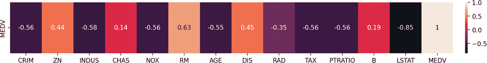

一个彩色编码的地图描绘了不同的特征及其相应的系数。右侧的刻度表示从负 0.5 到 1 的强度。

图 2-57

使用斯皮尔曼秩系数的波士顿住房数据集的特征与目标的相关性

最后，无论使用什么相关性方法，高相关性并不总是意味着一个特征对目标有因果关系。测量相关性和根据其值过滤特征是有用的。然而，许多现代大型数据集模型的关系比线性或甚至二次关系要复杂得多；因此，在这些情况下，相关性过滤方法可能被认为是无用的。

计算这些值可能仍然可以提供一个很好的视觉和基本概念，了解与目标直接相关的特征，但是否会提高模型性能则取决于模型产生的结果。

注意

波士顿住房数据集包含一个有问题的特征，B。参见 B 的前瞻性探索。不建议在现实世界的应用中使用在波士顿住房数据集上训练的模型。

### 递归特征消除

在前面的章节中，介绍的所有特征选择技术都是以测量每个特征相对于某些个体属性的形式出现的，然后根据它们的“测量”来确定特征的移除。这些方法是通用的，可以应用于任何数据集，使用相同的管道和流程。但最终，特征选择的目标是提高模型性能，因此观察每个特征对模型性能的具体贡献是至关重要的。递归特征消除（RFE）是一个过程，其中特征是基于它们对训练模型贡献的大小而被移除（消除）的。

由于其有效性和灵活性，RFE 是使用最广泛的特征选择算法之一。RFE 不是一个单一的方法或工具；它是一个包装器，可以根据用例适应任何模型。在下面的例子中，我们将使用随机森林作为特征选择的模型；然而，它可以被任何其他模型替换以提高性能。

就像之前介绍的波士顿房价数据集一样，森林覆盖数据集是另一个用于基准测试表格分类模型的流行数据集。数据收集自科罗拉多州罗斯福国家公园的四个荒野地区。定义 30 米×30 米区域的地图数据用于预测每个观测点的森林类型。数据包括 54 个特征和 7 个类别，共有 581 万个样本，因此它被构建为一个多类分类问题。

我们将首先使用随机森林建立一个基线模型，并使用 ROC-AUC 来衡量我们的性能。然后，我们将使用递归特征消除（RFE）来移除特征，以降低模型复杂性同时提高模型预测（见列表 2-72）。

```py
# internet is required to fetch dataset
from sklearn.datasets import fetch_covtype
from sklearn.ensemble import RandomForestClassifier
from sklearn.metrics import roc_auc_score
from sklearn.model_selection import train_test_split as tts
# load data
forest_cover = fetch_covtype()
forest_cover = pd.DataFrame(data=np.concatenate([forest_cover["data"], forest_cover["target"].reshape(-1, 1)], axis=1))
# rename target column
forest_cover = forest_cover.rename(columns={54:"cover_type"})
# feature name is from 0 to 53
features = range(54)
X_train, X_test, y_train, y_test = tts(forest_cover[features], forest_cover["cover_type"], random_state=42, test_size=0.3)
rf = RandomForestClassifier(max_depth=7, n_estimators=50, random_state=42)
rf.fit(X_train, y_train)
predictions = rf.predict_proba(X_test)
print(roc_auc_score(y_test.values, predictions, multi_class="ovr"))
Listing 2-72
The baseline model using Random Forest
```

在初步建模后，使用所有 54 个特征，ROC-AUC 分数大约为 0.939。从这里开始，我们可以通过迭代建模和比较性能来递归地移除特征。对于每个特征，训练好的模型都会根据训练结果给它分配一个权重或重要性值。这个特征重要性值的确定对于不同的算法有所不同。例如，在回归算法中，特征重要性就是权重乘以与权重相关的特征。回归算法中的系数充当权重，告诉每个特征应该对最终预测贡献多少。另一方面，在决策树和随机森林等基于树的算法中，特征重要性是通过计算一个特征带来的标准总减少量来计算的。

在 scikit-learn API 中，可以通过在拟合的模型上调用`coef_`或`feature_importances_`属性来获取模型的特征重要性。通过排序重要性值并通过条形图（图 2-58）可视化它们，我们可以移除对模型贡献较差的特征（列表 2-73）。然而，每次移除一个特征时，系数或重要性值都会改变。因此，我们需要逐个移除特征并重新训练模型来重新计算特征重要性。

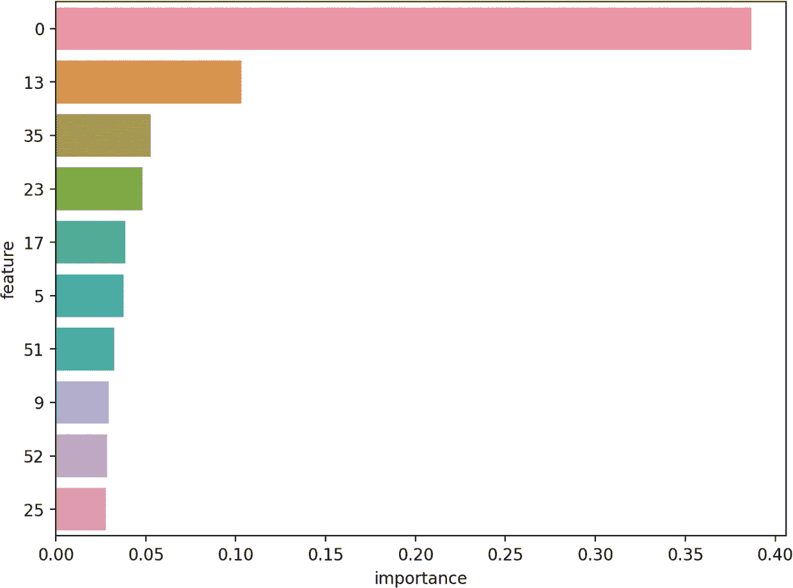

水平条形图显示了特征与重要性的关系。特征 0 和 25 分别具有最大值和最小值。

图 2-58

最重要特征前十名

```py
# top 15 important features
feat_import = pd.DataFrame(zip(rf.feature_importances_, features), columns=["importance", "feature"]).sort_values("importance", ascending=False)
feat_import_top = feat_import[:10].reset_index(drop=True)
# plot as bar graph
plt.figure(figsize=(8, 6), dpi=200)
sns.barplot(x=feat_import_top.importance,y=feat_import_top.feature, data=feat_import_top, orient="h", order=feat_import_top["feature"])
Listing 2-73
Code to obtain and graph feature importance
```

要执行 RFE，scikit-learn 实现了一个名为`RFE`（列表 2-74）的包装类。该对象使用类似于 scikit-learn 的模型和多个超参数进行实例化。RFE 的一个主要缺点是它的计算成本很高。对于 RFE 的每一次迭代，都会使用完整的数据集训练一个新的模型，这导致计算时间和成本很高。RFE 可以通过参数步长略有改进：它定义了每次迭代要移除多少个特征。而不是逐个移除特征，如果需要，可以一次移除多个特征以减少训练时间。

```py
from sklearn.feature_selection import RFE
# select top 20 features by 3
rfe = RFE(estimator=RandomForestClassifier(max_depth=7, n_estimators=50, random_state=42), n_features_to_select=20, step=3)
rfe.fit(X_train, y_train)
# all the kept features
X_train.columns[rfe.support_]
# evaluate performance with removed feature
X_train_rfe = rfe.transform(X_train)
X_test_rfe = rfe.transform(X_test)
rf = RandomForestClassifier(max_depth=7, n_estimators=50, random_state=42)
rf.fit(X_train_rfe, y_train)
predictions = rf.predict_proba(X_test_rfe)
print(roc_auc_score(y_test.values, predictions, multi_class="ovr"))
Listing 2-74
Retraining RandomForest with RFE
```

通过保留前 20 个特征并移除其他 34 个特征，我们的 ROC-AUC 分数没有下降；甚至增加到 0.94！但 RFE 的问题很明显：对于一个只有 50 个特征和几十万个样本的数据集，训练时间已经非常高。将 RFE 扩展到包含数千个特征和数百万个样本的大型数据集非常困难。即使使用现代 GPU，一次训练迭代也可能需要数小时。

应该考虑性能和训练时间之间的权衡，并保持平衡。有时，RFE 会消耗大量的计算能力和时间，而使用更快的算法可以提供略微降低的精度，但速度要快得多。这取决于数据科学家做出决定。

### 排列重要性

排列重要性可以看作是计算特征重要性的另一种方法。排列重要性和特征重要性都衡量一个特征对整体预测的贡献程度。然而，排列重要性的计算与模型无关，这意味着无论使用什么机器学习模型，算法都保持不变。排列重要性的速度取决于模型预测率，但仍然比其他特征选择算法如 RFE 要快。

排列重要性从特征到目标产生一个相关性度量。从逻辑上讲，具有低排列重要性的特征可能对模型来说是不必要的，而具有较高排列重要性的特征可能被认为对模型更有用。

算法首先在验证数据集的一个特征行中打乱行顺序。打乱后，我们使用训练好的模型进行预测，并观察打乱对性能的影响。理论上，如果一个特征对模型至关重要，它将显著降低模型预测的准确性。另一方面，如果打乱的特征对模型预测的贡献不大，那么它对模型性能的影响也不会很大。通过计算与真实值相比的损失函数，我们可以通过打乱特征的性能下降来获得特征重要性的度量。

仍然使用 RFE 中的 Forest Cover 数据集作为特征重要性的比较，我们可以使用以下代码作为基线模型（代码列表 2-75）。

```py
# internet is required to fetch dataset
from sklearn.datasets import fetch_covtype
from sklearn.ensemble import RandomForestClassifier
from sklearn.metrics import roc_auc_score
from sklearn.model_selection import train_test_split as tts
# load data
forest_cover = fetch_covtype()
forest_cover = pd.DataFrame(data=np.concatenate([forest_cover["data"], forest_cover["target"].reshape(-1, 1)], axis=1))
# rename target column
forest_cover = forest_cover.rename(columns={54:"cover_type"})
# feature name is from 0 to 53
features = range(54)
X_train, X_test, y_train, y_test = tts(forest_cover[features], forest_cover["cover_type"], random_state=42, test_size=0.3)
rf = RandomForestClassifier(max_depth=7, n_estimators=50, random_state=42)
rf.fit(X_train, y_train)
predictions = rf.predict_proba(X_test)
print(roc_auc_score(y_test.values, predictions, multi_class="ovr"))
Listing 2-75
Code for baseline model
```

Scikit-learn 没有为排列重要性提供简单的实现；相反，我们可以使用与 scikit-learn 模型兼容的 eli5 库。

要计算和显示排列重要性，我们可以简单地调用 `fit` 和 `feature_importances_`（代码列表 2-76）。

```py
import eli5
from eli5.sklearn import PermutationImportance
from sklearn.metrics import make_scorer
# convert metric to scorer for eli5
scocer_roc_auc = make_scorer(roc_auc_score, needs_proba=True, multi_class="ovr")
perm = PermutationImportance(rf, scoring=scocer_roc_auc,random_state=42).fit(X_test, y_test)
# top 15 important features
feat_import = pd.DataFrame(zip(perm.feature_importances_, features), columns=["importance", "feature"]).sort_values("importance", ascending=False)
feat_import_top = feat_import[:10].reset_index(drop=True)
# plot as bar graph
plt.figure(figsize=(8, 6), dpi=200)
sns.barplot(x=feat_import_top.importance,y=feat_import_top.feature, data=feat_import_top, orient="h", order=feat_import_top["feature"])
Listing 2-76
Permutation Importance with eli5
```

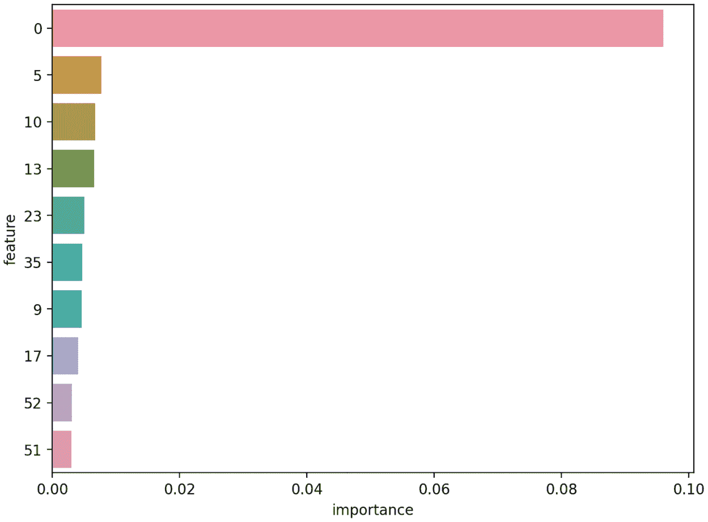

特征与重要性之间的水平条形图。特征 0 和 51 分别具有最大值和最小值。

图 2-59

使用排列重要性计算的前十个最重要的特征

在“递归特征消除”部分中，我们将计算的特征重要性与随机森林的特征重要性进行比较，我们发现重要性的顺序遵循相似的模式，但并不完全相同（图 2-59）。为了与 RFE 及其特征重要性的计算进行比较，我们将取前 20 个特征并重新训练我们的随机森林模型（代码列表 2-77）。

```py
# retrain model with top 20 features
rf = RandomForestClassifier(max_depth=7, n_estimators=50, random_state=42)
X_train_permu = X_train[feat_import[:20]["feature"].values]
X_test_permu = X_test[feat_import[:20]["feature"].values]
rf.fit(X_train_permu, y_train)
predictions = rf.predict_proba(X_test_permu)
print(roc_auc_score(y_test.values, predictions, multi_class="ovr"))
Listing 2-77
Retraining Random Forest with top 20 features selected
```

我们获得大约 0.9416 的 ROC-AUC 分数，略高于使用 RFE。RFE 和排列重要性在算法方法上极为相似，但它们的使用场景却相当不同。排列重要性需要测试数据有标签，并且特征打乱是随机的。有时，确定性结果可能比计算成本更重要。相反，有时在计算时间不易获得的情况下，排列重要性提供了一种更快的方法来进行特征选择，并产生具有竞争力的结果。

### LASSO 系数选择

回想一下，在线性回归中，每个特征都会被分配一个系数，这个系数作为一个权重，决定了该特征对最终预测的贡献程度。理想情况下，一个完全训练好的回归模型也会拥有完美的系数，从而拥有完美的特征重要性。正如 RFE 和置换重要性所展示的概念，我们可以根据特征的重要性来选择和移除特征。那些权重低或为零的特征是不重要的或者对预测没有贡献，因此我们不需要它们进行训练，因为它们只会增加训练时间，甚至可能降低我们模型的性能。幸运的是，LASSO 回归正是这样做的。根据可调整的超参数，不重要特征的权重会缩小到零。

如前一章所述，最小绝对收缩和选择算子（LASSO）回归为线性回归添加了一个惩罚项以进行正则化：

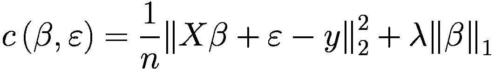

我们可以利用 LASSO 回归将某些特征的权重缩小到零的事实作为一种特征选择技术，移除那些权重为零的特征。*λ*参数控制应该有多少收缩。*λ*越大，正则化导致权重为零的可能性就越大。

LASSO 回归本身可能不适合对数据集进行预测，因为它太简单，无法模拟每个复杂数据集中存在的复杂关系。然而，我们可以利用其系数来选择有用的特征，并用另一个可能更适合数据集的模型来训练这些特征。这个过程在以下内容中用与 RFE 和置换重要性相同的过程进行演示：训练一个基线模型，执行特征选择，然后重新训练模型并观察改进（列表 2-78）。

```py
# internet is required to fetch dataset
from sklearn.datasets import fetch_covtype
from sklearn.ensemble import RandomForestClassifier
from sklearn.metrics import roc_auc_score
from sklearn.model_selection import train_test_split as tts
# load data
forest_cover = fetch_covtype()
forest_cover = pd.DataFrame(data=np.concatenate([forest_cover["data"], forest_cover["target"].reshape(-1, 1)], axis=1))
# rename target column
forest_cover = forest_cover.rename(columns={54:"cover_type"})
# feature name is from 0 to 53
features = range(54)
X_train, X_test, y_train, y_test = tts(forest_cover[features], forest_cover["cover_type"], random_state=42, test_size=0.4)
rf = RandomForestClassifier(max_depth=7, n_estimators=50, random_state=42)
rf.fit(X_train, y_train)
predictions = rf.predict_proba(X_test)
print(roc_auc_score(y_test.values, predictions, multi_class="ovr"))
Listing 2-78
Baseline model
```

在训练一个基线模型之后，我们在数据上训练一个带有某些值作为*λ*的 LASSO 回归模型。随着*λ*值的增加，越来越多的特征倾向于获得零权重。除了试错之外，没有找到*λ*的最佳方法。在以下示例中，*λ*被设置为 0.005，训练后移除了 26 个特征（列表 2-79）。

```py
from sklearn.linear_model import Lasso
lasso = Lasso(alpha=0.005)
lasso.fit(X_train, y_train)
# convert all weights to positive values,
# feature importance
feat_import_lasso = abs(lasso.coef_)
# select features with coeffcient greater than 0
features = np.array(features)[feat_import_lasso > 0]
# retrain model with selected features
X_train, X_test, y_train, y_test = tts(forest_cover[features], forest_cover["cover_type"], random_state=42, test_size=0.4)
rf = RandomForestClassifier(max_depth=7, n_estimators=50, random_state=42)
rf.fit(X_train, y_train)
predictions = rf.predict_proba(X_test)
print(roc_auc_score(y_test.values, predictions, multi_class="ovr"))
Listing 2-79
Feature selection using LASSO and retraining after selection
```

我们模型的 ROC-AUC 分数提高到了大约 0.9406，只使用了 54 个原始特征中的 28 个。记住，这个结果可以通过调整超参数 alpha，或者我们前面方程中的*λ*来进一步改进。最后，我们可以使用条形图可视化 LASSO 计算出的某些最重要的特征。

注意，在我们的特征重要性图（图 2-60）中，我们的顶级特征与 RFE 和置换重要性中由随机森林产生的特征有所不同。随机森林和 LASSO 回归之间的一个主要区别是它们建模关系的能力。LASSO 回归只能建模线性关系，而随机森林可以处理特征与目标关系非线性的数据。LASSO 回归可能无法解释现代数据集中的复杂关系，但与其他算法（包括信息增益、RFE 和置换重要性）相比，其速度非常快。LASSO 系数选择通常可以作为对特征选择的快速洞察，或作为基线选择工具。然而，应谨慎使用，因为它可能会从可以建模非线性关系的模型中删除重要特征。

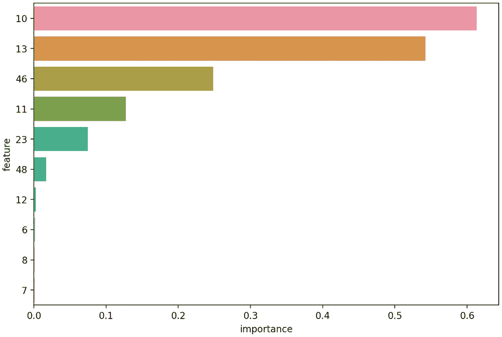

特征与重要性之间的水平条形图。特征 10 具有最大值，而特征 6、8 和 7 的值几乎可以忽略不计。

图 2-60

使用 LASSO 回归的前十个最重要的特征

## 重点

在本章中，我们讨论了数据准备和工程的关键组件：TensorFlow 数据集、数据编码、特征提取和特征选择。

+   TensorFlow 数据集用于大型数据集，旨在为神经网络模型提供内存可行性。TensorFlow 序列数据集是用户定义的数据加载类，它提供了在数据加载和传递到模型中的灵活性。

+   并非所有表格数据集都小且便于操作，尤其是与现代生物医学领域相关的现代表格数据集。介绍了五种方法，旨在减少数据集大小或避免将整个数据集文件加载到内存中：

    +   Pickle 文件是 Python 特定的文件格式。将 Pandas DataFrames 保存到 pickle 文件中可以减少加载时间和减小文件大小。

    +   SciPy 和 TensorFlow 稀疏矩阵都是压缩稀疏数据的方法。这允许在数据集上进行更轻松的操作，而不用担心 OOM 错误。

    +   Pandas Chunker 允许 Pandas DataFrames 以用户指定的块大小作为迭代器加载。这可以与 TensorFlow 数据集结合使用，以一次只加载一个数据批次。

    +   将数据存储在 h5 文件中会以二进制格式压缩数据。Python 库 h5py 可以在程序内定义的变量与存储在磁盘上的文件之间创建一个“链接”。与 Pandas Chunker 相比，这要灵活得多，因为可以访问任何数量或数据的一部分。

    +   NumPy 内存映射提供了与 pyh5 相似的功能，即在程序和数据存储在磁盘之间创建引用。然而，NumPy 内存映射可以在不使用 h5py 语法的情况下使用，并且可以在一行内完成。

+   通常，我们收集的原始数据不适合模型训练。数据的主要先决条件是它必须是定量的，但我们还希望数据的定量形式能够代表其本质或属性（即，我们希望将数据的属性*编码*成模型看到的样子）。

    +   *离散数据的编码策略*：标签编码（每个类别任意关联一个整数）、独热编码（在独热向量中对应类别的位置用一个 1 标记，而其他所有位置都标记为 0）、二进制编码（使用标签编码的每个类的二进制表示）、频率编码（类别与数据集中该类别的频率相关联）、目标编码（类别与该类别的聚合目标值相关联）、留一法编码（目标编码但当前行不在聚合计算中考虑）、James-Stein 编码（类似于目标编码，但考虑了每个类别的整体均值和个体均值）、证据权重编码（使用 WoE 公式确定一个类别帮助区分目标多少）。

    +   *连续数据的编码策略*：最小-最大缩放（数据缩放，使得最低值是 0，最高值是 1 或其他一些边界值）、鲁棒缩放（类似于最小-最大缩放，但使用第一和第三四分位数作为相关分布标记而不是最小和最大值）、标准化（在减去均值后除以标准差）。

    +   *文本数据的编码策略*：关键词搜索、原始向量化（将每个单词/标记视为一个类别并执行独热编码）、词袋模型（计算序列中单词/标记的数量）、*n*-gram（计算序列中* n*个单词/标记的连续组合数量）、TF-IDF（平衡一个术语在文档中出现的频率与整体频率以评估其相关性）、情感提取（文本情感质量的定量标记）、Word2Vec（神经网络学习到的嵌入作为执行语言任务的优化方式）。

    +   *时间/时间数据的编码策略*：将每个时间点表示为起始时间之后的基单位数量（仅用于插值），提取时间的周期性特征（季节、月份、星期几、小时等），并检测是否为重要的日期/时间（假日、高峰时段等）。

    +   *地理数据的编码策略*：获取位置如国家或州/省的定量抽象子组件以及获取纬度和经度。

+   特征提取/工程方法是应用任何模型之前需要考虑的关键技术。特征提取算法旨在以低维度的形式找到原始数据的表示，同时保留最多的信息。

    +   PCA 和 t-SNE 等算法是无监督的降维技术，在尽可能保留数据整体结构的同时，将数据投影到较低维度。

    +   与 t-SNE 相比，PCA 速度快，但并不关注点之间的局部距离。虽然 t-SNE 确实更加关注局部点之间的空间，但该算法的计算量极大，在特征提取中的用例很少，尽管，正如我们稍后将看到的，t-SNE 在深度学习管道中的模型解释中起着重要作用。

    +   另一方面，LDA 是监督学习，并假设数据是正态分布的，并且具有相似方差。LDA 是一种分类算法，但它也可以用作降维技术，保持组件数量等于或低于类别数量。再次强调，当用于特征提取时，LDA 不如 PCA 流行，但它在大多数情况下表现相当不错。

    +   最后，基于统计的工程通过提取数据集中每行的更高阶统计量来创建新特征。这可以帮助模型查看每个单个特征如何与目标相关联，以及每个样本的特征作为一个整体如何影响目标。

+   特征选择方法不仅可以提高模型性能，还可以通过减少数据集的大小来缩短训练时间。大多数（如果不是所有）特征选择方法遵循两个基本步骤：获取某个指标的值，并根据该指标的阈值选择特征。

    +   变量阈值、高相关性方法和 LASSO 系数选择等算法即使在大型数据集上执行也很快。然而，这些方法都不是针对特定模型的，这意味着它们适用于任何数据集，无论使用什么模型进行训练。

    +   特征选择技术，如 RFE 和排列重要性，是针对特定模型的，因为它们依赖于训练模型的输出。它们通常比之前提到的那些方法表现更好，但它们的计算成本显著更高，因为它们需要多次迭代模型训练。

    +   信息增益比变量阈值和高相关性方法提供更好的结果，但像那些针对特定模型的方法一样，它也是计算密集型的。

在下一章中，我们将开始探索使用神经网络进行深度学习。
