# 3. 神经网络和表格数据

> 所有技术的基石是火。
> 
> —艾萨克·阿西莫夫，波士顿大学教授

深度学习方法完全不同于之前介绍的古典机器学习算法。神经网络是深度学习的核心和基础，并解决了古典机器学习在第一章末讨论的许多弱点。本章将向您介绍深度学习的核心理论和数学，它基于与古典机器学习不同的范式，以及其在流行的、易于接触的深度学习框架 Keras 中的相应实现。

本章将从数学角度向您介绍神经网络，以及其在流行的、易于接触的深度学习框架 Keras 中的相应实现。我们将从探索神经网络是什么以及使它们具有强大表示能力的结构开始。您将了解定义和训练 Keras 模型，但也会发现它们的性能远远没有达到它们的潜力。之后，本章将深入探讨前向传播和反向传播过程背后的理论和数学。同时，您将了解激活函数的细节以及为什么它们在释放神经网络全部力量中扮演如此关键的角色。在章节的第二部分，我们将深入探讨更高级的神经网络使用和操作，包括训练回调、Keras 功能 API 和模型权重共享。最后，我们将回顾几篇研究论文，展示了提高神经网络在表格数据上性能的简单机制。

本章为本书的深度学习奠定了基础！接下来的章节都依赖于本章讨论的理论和工具的扎实知识。

## 神经网络究竟是什么？

机器学习围绕着泛化的概念。适应和从类似但不相同的情况中学习的能力是区分机器学习和硬编码算法的关键。

以我们自身为例：如果我们看到两张都像猫的图片，即使这两张图片在外观上略有不同，我们仍然可以自信地说它们都是猫。我们的心智可以区分这两张图片，并确定它们都是猫——这是一种泛化。大脑通过学习在其一生中呈现给它的模式来实现这一点。机器学习模仿了这个概念：算法从数据中学习并识别模式，以便对它们从未见过的数据进行泛化。

人类大脑由数十亿个通过突触相互连接的神经元组成，形成一个非常大的网络，控制我们的思维并指导我们的行动。我们的感官接收信息并将其传递到大脑；神经元通过电脉冲和化学信号相互处理和传递信息。之后，数据通过我们的身体传递到神经系统，神经系统作用于输出的信息。

我们体内的每个神经元都接收输入并输出其处理过的信息。感知器，一种受神经元信息处理模型启发的数学模型，由弗兰克·罗森布拉特于 1958 年提出（在超级计算机的现代时代之前很久）。然而，由于当时的技术限制，感知器的全部潜力并未被发现。直到 20 世纪 80 年代，当更多的研究投入到人工智能和机器学习时，感知器网络的想法才出现。现在这被称为人工神经网络（见图 3-1）。

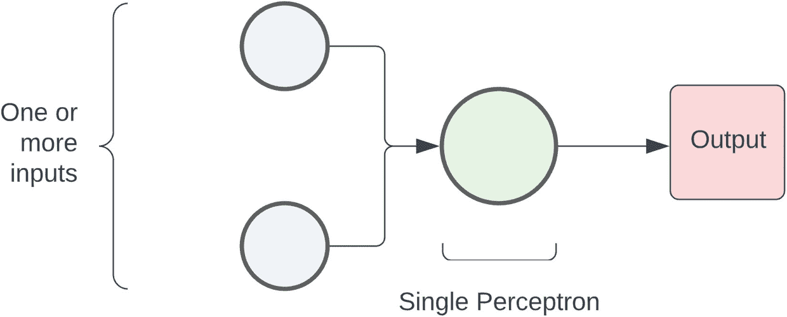

一张图解展示了将一个或多个输入转换为单个感知器以及输出结果的过程。

图 3-1

感知器模型

神经网络的核心概念模仿了人类神经元如何连接和处理信息。而不是电脉冲，想象每个神经元存储一个值，代表其将信息传达给其他相邻神经元的能力和强度（见图 3-2）。

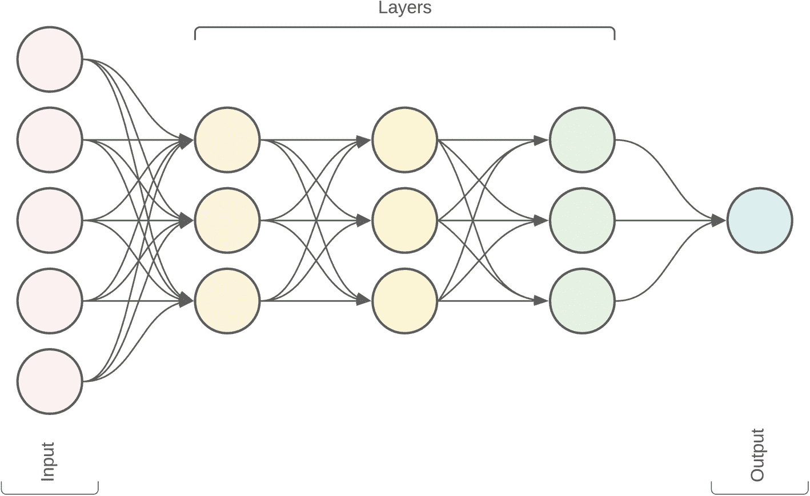

一张图展示了大量神经元，这些神经元描绘了多个输入层，从五个神经元开始高度互联，最终减少到一个输出神经元。

图 3-2

神经网络的简单示意图

网络结构成层，第一层接收输入，最后一层输出结果。通常，每一层的每个神经元都与前一层的每个神经元和下一层的每个神经元相连。信息从第一层流向第 *n* 层。每个连接都与其他连接不同；一些神经元可能对最终预测的贡献更大，而其他神经元可能只影响一点点。信息从一层传递到另一层，从输入到输出。神经网络的训练通过称为反向传播的过程进行，我们将在后面的章节中详细讨论。

## 神经网络理论

标准的或所谓的“经典”神经网络有无数种变体。本书将涵盖其中一些，而其他则留给你自己去探索。支持所有这些变体的基础被称为人工神经网络（ANN）。ANN 的别名包括多层感知器（MLP）和全连接网络（FCN）；这些术语将在本书中交替使用。理解和学习如何利用 ANN 的力量是进入深度学习无尽领域的先决条件。

### 从单个神经元开始

我们从神经网络的最简单数学模型——一个具有两个输入和一个输出的单个感知器——开始理解。该神经元代表某种函数，它结合两个输入的信息并输出一个有意义的结果（图 3-3）。

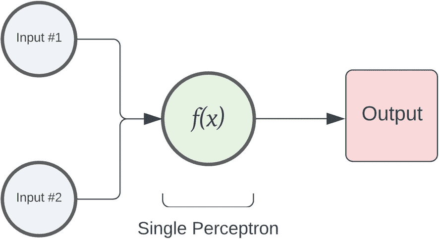

输入一和输入二的两个神经元转换成一个单个感知器并导致输出。

图 3-3

感知器模型的演示

实际上，感知器模型会有某种方法从其错误中学习并纠正输出值。我们可以引入可调整的权重，这些权重与每个输入值相乘，最终输出将由每个输入乘以其权重的总和决定。我们的“模型”的权重可以迭代更新以产生预测的正确值。权重更新的过程目前对我们当前的环境来说并不重要。（我们将在本章后面讨论如何更新权重。）我们可以实施的一个额外改进是可训练的偏差值。通过将加权总和输出移动一个最佳量，我们可以确保网络能够达到广泛的值，从而具有建模更复杂函数的能力（图 3-4）。

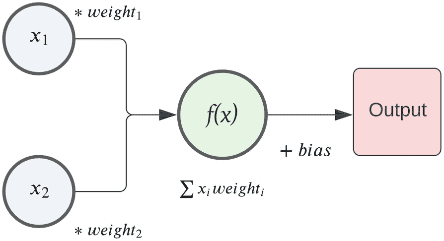

权重一和权重二的两个神经元产生权重的总和以及偏差，从而得到输出。

图 3-4

带权重和偏差的感知器模型

我们可以将通过单个感知器产生输出的泛化扩展到一个数学公式中，其中 *x*[*i*] 是特征，*n* 是特征的数量，*w*[*i*] 是权重，*b* 是偏差：

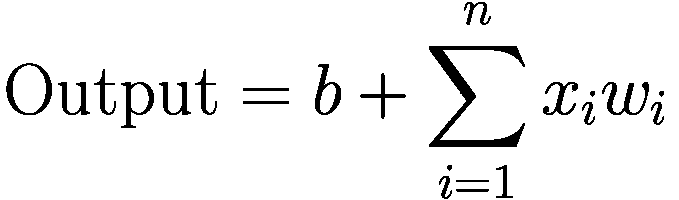

有些人可能会认识到线性回归与之前描述的感知器模型具有相似的概念。线性回归的能力极其有限，因为它只能模拟和理解变量之间的线性关系，就像我们之前描述的简单感知器模型一样。这就是神经网络中的“网络”发挥作用的地方。通过将成百上千的神经元堆叠成数十层，每一层处理数据的不同部分，识别局部模式，并组合每一层或每个神经元获得的信息。

### 前馈操作

从单个神经元的想法扩展到多层感知器模型或人工神经网络（图 3-5）。

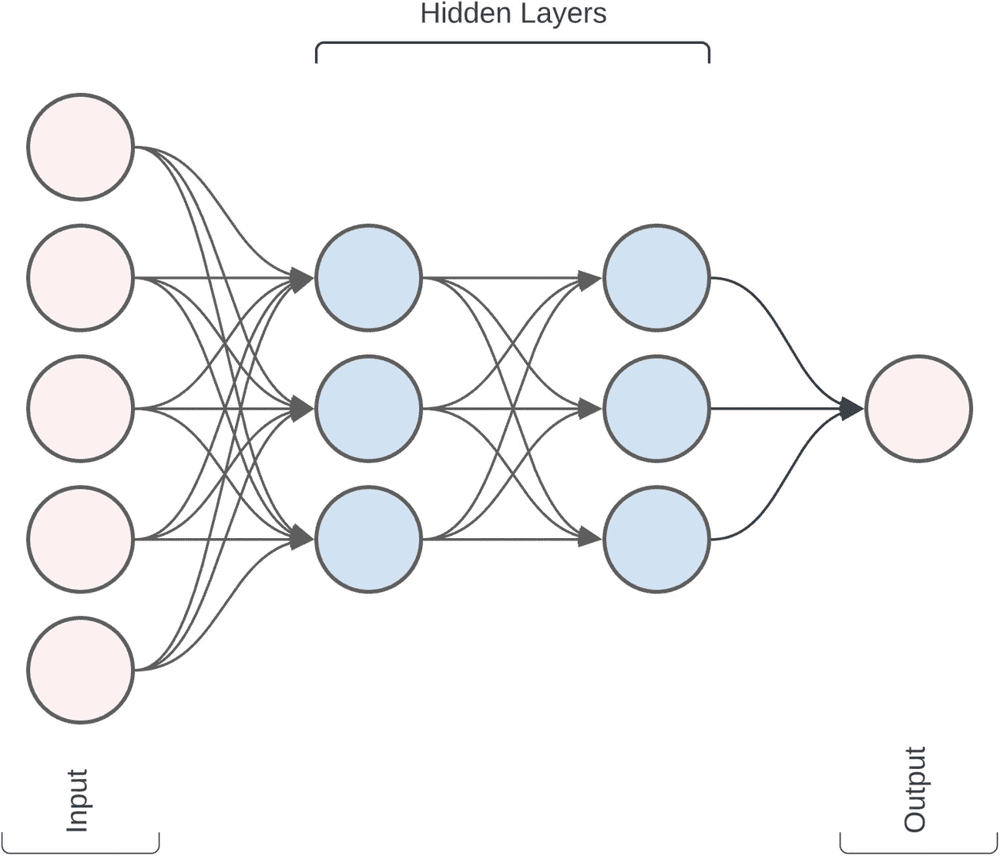

一个图表展示了多个神经元，这些神经元描绘了几个输入的隐藏层，它们从五个神经元高度互联并减少到一个神经元输出。

图 3-5

一个简单的神经网络示例

我们将每个神经元的列视为网络中的一个层，其中第一层接收输入，最后一层输出预测。特征的数量，或者说数据集的维度，对应于输入层中的神经元数量。在回归的情况下，输出层将包含一个产生预测值的单个神经元。同样，对于二元分类，输出层也只有一个神经元，但这次它的值将通过激活函数限制在 1 和 0 之间。激活函数将在后续章节中进一步探讨。它们可以暂时被视为帮助神经元调整其值以适应输出范围的工具。例如，分类任务要求输出在[0, 1]范围内，表示为概率。因此，我们可以使用 sigmoid 激活函数将原始输出值转换为介于 0 和 1 之间。

输入层和输出层之间的层被称为“隐藏层”。在之前显示的图表中，我们有两个隐藏层，每个层有三个神经元。隐藏层和神经元的数量是超参数，可以调整以改善神经网络的性能。

我们可以想象神经网络通过将其分解为不同的部分来分析数据。此外，我们可以将每个权重值解释为一个助手，它操纵来自前一层输入数据/中间结果的输入，以适应每个神经元训练以识别的任务。例如，第一隐藏层中的每个神经元可能被训练去发现数据中的某些潜在统计分布，而第二隐藏层处理从第一层传下来的信息，并为最终隐藏层计算预测生成中间结果。

根据输入层权重，第一隐藏层中的每个神经元都可能接收到原始输入的“修改版”，从而能够从不同的角度解释数据集（图 3-6）。如果我们把每个权重或连接视为一个可训练的参数，我们的简单四层网络（五个输入和一个输出）将有 5 × 3 + 3 × 3 + 3 × 1 = 27 个参数。然而，记住在每个神经元中，在上一层的权重求和之后还会添加一个偏差。因此，从先前的例子网络中，我们的总参数将是 27 + 3 + 3 + 1 = 34。

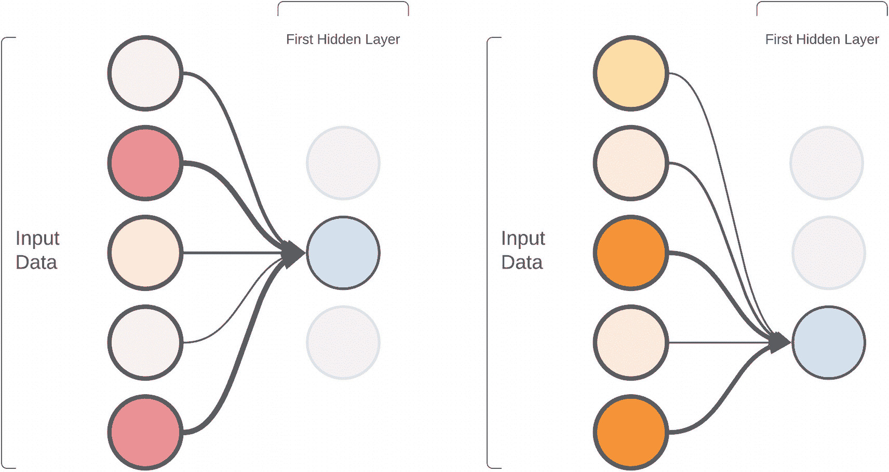

五个输入神经元中的两个与第一隐藏层中的三个神经元之一相连。

图 3-6

不同权重如何改变输入数据

将信息从第一层传递到最后一层的过程被称为前向操作。这不仅神经网络训练的起点，也是预测的方式。训练神经网络的通用过程可以概括为五个步骤：

1.  初始化随机权重和偏差。

1.  通过前向传播计算初始预测。

1.  根据可微分的指标计算网络的误差，这实际上告诉我们网络在数据上的表现如何。

1.  根据使用反向传播产生的错误调整权重和偏差的值。

1.  重复操作，直到达到所需的准确度。

在深入探讨神经网络如何使用前向传播和反向传播学习背后的复杂但迷人的数学之前，我们将使用 Python 构建一个简单的神经网络，通过一个具体的例子熟悉之前引入的概念。现在，将反向传播过程视为一个调整网络参数以根据错误增加性能的算法。

## Keras 简介

由弗朗索瓦·肖莱特创建的流行深度学习库 Keras，允许直接实现从简单到复杂和卷积的任何类型的神经网络。由于其卓越的可用性和性能，我们选择 Keras 作为本书中开发和发展深度学习概念的框架。

在法语中意为“角”，名称 *Keras* 来自于《奥德赛》中呈现的文学意象。最初作为 ONEIROS（开放式神经电子智能机器人操作系统）的研究项目开发，Keras 很快扩展到为深度学习领域的通用用途和提供支持。Keras 通过专注于“渐进式复杂性披露”的理念，提供了与现代标准相当的性能和强度。Keras 框架在全球范围内得到广泛应用，知名公司如 NASA 和 Google 都在使用它。虽然可以通过清晰的过程实现高级建模和工作流程，但简单的想法可以以最小的努力实现。

Keras 本身是一个高级库，设计用于在许多底层深度学习包之上运行，例如 TensorFlow、Theano 和认知工具包。该库背后的核心动机是提供一个易于使用的接口，以更好地连接思想和实现。默认情况下，Keras 是建立在谷歌开发的深度学习平台 TensorFlow 之上的。在其早期版本中，TensorFlow 提供了详细但复杂的系统和类来开发深度学习模型。到 2.0 版本，Keras 的流行使其成为 TensorFlow 的官方 API。尽管 Keras 仍然是一个独立的库，但 TensorFlow 可以填补 Keras 缺乏的任何底层训练控制。建议安装 TensorFlow 而不是 Keras 的独立包，以充分利用 TensorFlow 与 Keras 一起的无尽定制能力（列表 3-1）。

+   TensorFlow 可以通过命令行使用 pip 安装，也可以通过在命令前添加感叹号直接从 Jupyter Notebook 安装。请注意，在 Jupyter Notebooks 中，在任意一行前插入感叹号 (!) 等同于在命令行中运行该命令。

```py
!pip install tensorflow
import tensorflow as tf # import tensorflow as a whole
from tensorflow import keras # only import Keras
Listing 3-1
TensorFlow installation
```

### 使用 Keras 进行建模

在我们开始之前，请记住，到目前为止，并非所有数学概念和神经网络组件都得到了解释。然而，你不需要理解所有内容就能在 Keras 中构建一个可工作的网络。在简要介绍 Keras 之后，将深入解释神经网络在幕后是如何工作的。

考虑 Fashion MNIST 数据集。该数据集包含 70,000 张 28x28 像素分辨率的灰度图像。Fashion MNIST 是一个多类别分类任务，将各种服装图像分类到十个类别中（图 3-7）。

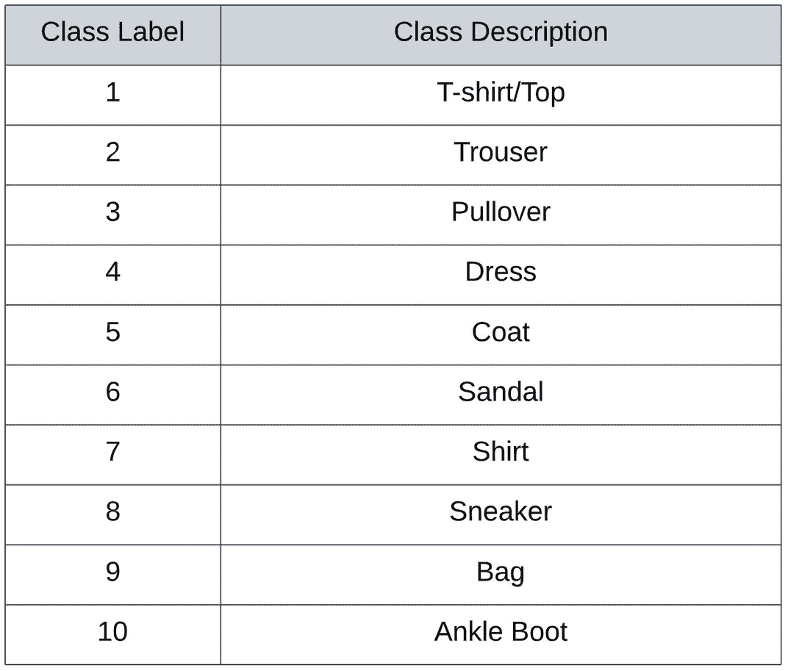

一个两列十行的表格展示了类别标签和描述，列出了 10 项。

图 3-7

Fashion MNIST 类别描述

数据集是自动与 TensorFlow 一起安装的，可以通过 Keras API 中的 `tf.keras.datasets.fashion_mnist.load_data()` 导入，它返回训练图像、训练标签、测试图像和测试标签，所有这些都以 NumPy 数组的形式返回（列表 3-2）。与常用的基准数据集相比，Fashion MNIST 提供了多样性和相对具有挑战性的任务。

```py
# retrieving Fashion MNIST
# needs internet
(X_train, y_train), (X_test, y_test) = tf.keras.datasets.fashion_mnist.load_data()
Listing 3-2
Retrieving the Fashion MNIST dataset
```

通过从 matplotlib 调用 `imshow()`，我们可以将数据作为图像显示，每个值代表该像素的亮度（列表 3-3）。

```py
# description of each target
targets = ['T-shirt/top', 'Trouser', 'Pullover', 'Dress', 'Coat', 'Sandal', 'Shirt', 'Sneaker', 'Bag', 'Ankle boot']
# Display images on a 3x3 grid
plt.figure(figsize=(8,7), dpi=130)
# 9=3x3
for i in range(9):
# placing the image in the ith position of a 3 by 3 grid
plt.subplot(3,3,i+1)
plt.xticks([])
plt.yticks([])
plt.grid(False)
# extract data from training images, shown in grayscale
plt.imshow(X_train[i], cmap="gray")
# get the respective target for the image
plt.xlabel(targets[y_train[i]])
plt.show()
Listing 3-3
Using matplotlib to visualize data
```

注意，图像存储在三维数组中，每个样本有 28 列和 28 行像素，总共有 60,000 张 28x28 的训练图像（图 3-8）（列表 3-4）。

```py
X_train.shape
# (60000, 28, 28)
Listing 3-4
The shape of training data
```

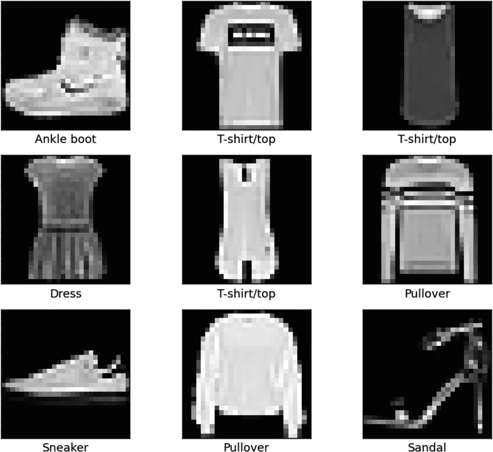

九张各种衬衫上衣和鞋类模型的照片。

图 3-8

训练数据前九个图像的可视化

人工神经网络只能处理一维输入。输入层将每一行视为一个单独的样本。通过将每个二维数组展平并重新塑形为单行，我们可以获得全连接神经网络所需的输入形状（见清单 3-5）。这样做虽然牺牲了二维图像中存在的任何结构信息，但就我们的 ANN 上下文而言，这是一个可行的解决方案。专门设计用于执行图像识别任务的模型将在第四章中讨论，包括如何利用它们处理表格数据。但到目前为止，将 Fashion MNIST 视为具有 784 个特征的表格数据集。

```py
# shape into (num_samples, 784)
X_train = X_train.reshape(X_train.shape[0], 28*28)
# shape into (num_samples, 784)
X_test = X_test.reshape(X_test.shape[0], 28*28)
Listing 3-5
Flattening 2D array into 1D
```

图像中的每个像素都是一个介于 0 到 255 之间的数字，0 代表最深的黑色，255 代表最亮的白色。常见的做法是将这些值归一化到 1 和 0 之间，以加快模型收敛并稳定训练（见清单 3-6）。

```py
X_train = X_train / 255.
X_test = X_test / 255.
Listing 3-6
Normalize data
```

Keras 中的建模过程遵循三个基本步骤：定义架构、编译时添加额外参数，最后使用提供的数据进行训练（见图 3-9）。

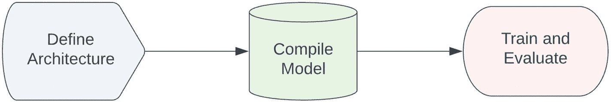

流程图说明了将架构定义到编译模型的过程，并最终导致训练和评估。

图 3-9

Keras 工作流程

#### 定义架构

由于展平的图像数据包含 784 个输入特征，因此我们的第一个输入层将有 784 个神经元，每个特征一个。我们可以通过从`keras.models`中的`Sequential`类初始化模型来开始。Keras 的顺序工作流程允许我们以有序的方式线性堆叠层（见清单 3-7）。这种方法构建神经网络被认为是足够且方便的，适用于简单的预测任务，如 Fashion MNIST。

```py
# import the dense and input layer
from keras.layers import Dense, Input
# the sequential model object
from keras.models import Sequential
# initialize
fashion_model = Sequential()
Listing 3-7
Initialize the Keras sequential model
```

通过在初始化后的序列模型对象上调用`add()`方法来添加层（见清单 3-8）。我们首先添加输入层，指定输入数据的形状。

```py
# add input layer, specify the input shape of one sample as a tuple
# in our case it would be (784, ) as it's one-dimensional
fashion_model.add(Input((784,)))
Listing 3-8
Adding the input layer
```

接下来，我们将添加隐藏层。为了简化架构，我们的模型将有两个隐藏层，每个层有 64 个神经元（见清单 3-9）。您可以尝试这些参数，并观察模型可能出现的改进。回想一下，在 ANN 中，每个隐藏层中的每个神经元都与前一层的每个神经元和下一层的每个神经元相连。这样的层被称为全连接层，可以通过`keras.layers`中的`Dense`层导入。

```py
fashion_model.add(Dense(64))
fashion_model.add(Dense(64))
Listing 3-9
Adding the dense layers in the network by specifying the number of neurons in Dense calls
```

最后，输出层包含十个神经元，因为共有十个类别，并且与隐藏层类似，输出层也将是一个`Dense`层。理想情况下，该模型能够输出一个介于 1 到 10 之间的整数，每个数字对应于 Fashion MNIST 数据集中的一个类别。然而，所有神经网络和现代机器学习模型都输出连续值。因此，我们可以插入一个激活函数，将值规范化到我们的输出范围内。在多类分类任务中，使用 softmax 激活函数。在输出层有十个神经元的情况下，逻辑上，我们的网络在预测时将输出一个包含十个值的数组。然后 softmax 将这些值转换为介于 1 和 0 之间的概率，这代表预测图像属于十个类别中的每一个类别的可能性，而所有概率之和为 1（与 sigmoid 不同，其中每个输出神经元会被解释为一个单独的概率，与其他输出没有关系）。最终的预测可以通过找到这些值中的最大值来确定，最大值的位位置将是我们的结果，一个介于 1 到 10 之间的数字（图 3-10）。再次强调，激活函数的细节将在后面的章节中探讨。

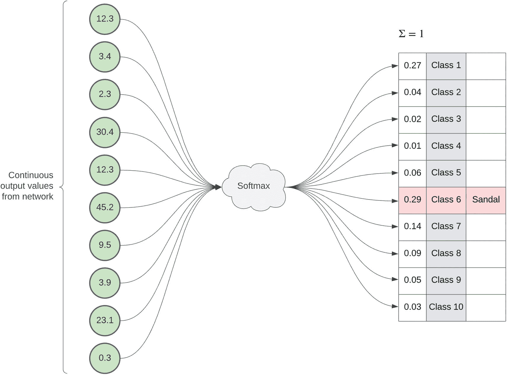

一个图表展示了许多神经元，这些神经元从连接到 Softmax 的网络中具有连续的输出值，并从 1 到 10 产生许多类别，具有相应的值。

图 3-10

Softmax 的直觉

因此，定义我们简单网络架构的完整代码在列表 3-10 中这样编写。

```py
# import the dense and input layer
from keras.layers import Dense, Input
# the sequential model object
from keras.models import Sequential
# initialize
fashion_model = Sequential()
# add input layer, specify the input shape of one sample # as a tuple
# in our case it would be (784, ) as it's one-dimensional
fashion_model.add(Input((784,)))
# add dense layers, the only parameter that we need to
# worry about right now is the number of neurons, which
# we set to 64
fashion_model.add(Dense(64))
fashion_model.add(Dense(64))
# add output layer
# softmax activation can be specified by the "activation"
# parameter
fashion_model.add(Dense(10, activation="softmax"))
Listing 3-10
Complete code for defining the architecture
```

#### 编译模型

在训练之前，我们的模型需要一些额外的设置来指定如何进行训练。在编译期间应定义三个关键参数：

+   *优化器*：通过告诉反向传播如何调整权重和偏置的值来控制“学习”的方法。不同的优化器可以影响训练的速度和结果。默认情况下，使用 Adam（自适应矩估计）优化器。在了解反向传播之后，优化器的直觉才能最好地理解。

+   *损失函数*：用于衡量模型性能的可微函数。正如第一章所述，指标和损失函数之间的关键区别在于损失函数必须是可微的，以便与梯度下降兼容。然而，指标不一定满足可微性；它只是一个用于评估以评估模型性能的正确性度量。对于多类分类，通常使用交叉熵作为损失函数，而对于回归任务，通常使用均方误差。适用于同一任务的不同损失函数可以产生不同的训练结果。

+   *指标*：与损失函数不同，神经网络的训练不依赖于指标；它只是作为另一个更好的监控模型性能的工具。指标通常可以从与损失函数不同的角度理解模型。在某些情况下，指标和损失函数可以是相同的。

列表 3-11 中的以下代码使用 Adam 优化器、分类交叉熵损失和准确率作为指标来编译模型。分类交叉熵损失是经典二元交叉熵损失的修改版本，适用于多类分类任务。更多内容将在“损失函数”部分介绍。

```py
# import loss function
from keras.losses import SparseCategoricalCrossentropy
# sparse categorical cross entropy simply converts one-
# hot encoded vector(results from the network)
# to the index position at which the probability is the highest (actual target)
# we need to do this since the y_train is not one-hot
# encoded but instead the targets are represented by
# numbers 1-10
# if the target it one-hot encoded (i.e. in our case it
# would be in the shape of (60000,10))
# then just using "CategoricalCrossentropy" would be fine
fashion_model.compile(optimizer="adam",loss=SparseCategoricalCrossentropy(), metrics=["accuracy"])
Listing 3-11
Compiling the model
```

#### 训练和评估

编译后，我们的模型就准备好进行训练了。再次强调，在训练过程中需要考虑一些关键参数：

+   *训练数据*：作为`x`和`y`传递到 fit 方法中。类似于 scikit-learn 模型，`x`和`y`位置的数据可以是 NumPy 数组或 Pandas DataFrame。

+   *轮数*：这是模型遍历训练数据的次数。更具体地说，这代表网络评估的次数，因为每次遍历数据集都算作一个轮次，在每个轮次结束时，所选指标将在网络上计算以跟踪性能。该参数以`epoch=num_epochs`的形式传递。

+   *批量大小*：此参数控制每个训练步骤中一次处理多少个样本。对于模型批量大小等于 1，这意味着为了遍历整个数据集一次，需要 60,000 个学习步骤，因为训练数据集中有 60,000 个样本。对于更大的批量大小，训练速度将显著提高，并且通常较大的批量大小不仅会增加训练速度，而且与较小的批量大小相比，性能也会得到改善。这种模式因数据集而异，没有确定的方法来计算训练的理想批量大小。请注意，具有大批量大小可能会导致内存溢出。该参数以`batch_size=num_batch`的形式传递。

虽然还有许多其他参数可以影响训练或减少过拟合，但这三个是最相关的考虑因素，其余将在后面的章节中讨论。在列表 3-12 和 3-13 中展示了训练的代码和结果，以及以进度条形式显示的结果。请记住，每次调用`.fit()`时，训练结果可能会有所不同，因为每次神经网络都会使用随机权重初始化。

```py
Epoch 1/15
10/10 [==============================] - 0s 6ms/step - loss: 2.0185 - accuracy: 0.3140
Epoch 2/15
10/10 [==============================] - 0s 6ms/step - loss: 1.1346 - accuracy: 0.6298
Epoch 3/15
10/10 [==============================] - 0s 6ms/step - loss: 0.8539 - accuracy: 0.6997
Epoch 4/15
10/10 [==============================] - 0s 6ms/step - loss: 0.7443 - accuracy: 0.7387
Epoch 5/15
10/10 [==============================] - 0s 6ms/step - loss: 0.6778 - accuracy: 0.7676
Epoch 6/15
10/10 [==============================] - 0s 6ms/step - loss: 0.6344 - accuracy: 0.7867
Epoch 7/15
10/10 [==============================] - 0s 6ms/step - loss: 0.6000 - accuracy: 0.7967
Epoch 8/15
10/10 [==============================] - 0s 6ms/step - loss: 0.5769 - accuracy: 0.8060
Epoch 9/15
10/10 [==============================] - 0s 6ms/step - loss: 0.5625 - accuracy: 0.8083
Epoch 10/15
10/10 [==============================] - 0s 6ms/step - loss: 0.5420 - accuracy: 0.8153
Epoch 11/15
10/10 [==============================] - 0s 6ms/step - loss: 0.5271 - accuracy: 0.8226
Epoch 12/15
10/10 [==============================] - 0s 5ms/step - loss: 0.5145 - accuracy: 0.8246
Epoch 13/15
10/10 [==============================] - 0s 6ms/step - loss: 0.5060 - accuracy: 0.8268
Epoch 14/15
10/10 [==============================] - 0s 8ms/step - loss: 0.5015 - accuracy: 0.8253
Epoch 15/15
10/10 [==============================] - 0s 6ms/step - loss: 0.4942 - accuracy: 0.8291
Listing 3-13
Model training results
```

```py
# batch_size is randomly chosen at 1024 here,
# reader can change it and observe changes in training results
fashion_model.fit(X_train, y_train, epochs=15, batch_size=1024)
Listing 3-12
Model training code
```

我们观察到，在 15 个 epoch 后，模型的准确率缓慢收敛到大约 0.82，而损失值为 0.49。可以通过`fashion_model.predict(X_testdata)`进行模型预测。在验证或测试数据上的性能度量，正如在我们的例子中变量命名为 X_test 和 y_test，可以通过`fashion_model.evaluate(X_test, y_test)`进行。性能是通过损失和编译时传入的指标来计算的。

随着我们扩展对神经网络的知识，我们将通过调整学习率、添加激活函数等方式改进我们的模型，不仅提高训练性能，还能改善验证结果。

在深入探索 Keras 及其在构建神经网络和开发深度学习管道方面的能力之前，让我们退一步，更深入地了解神经网络数学和直觉。在 Keras 之前，神经网络被引入为这些“组件”，它们通过乘法和加法操作数字来形成预测，并且以某种方式调整那些“权重和偏差”以通过“反向传播”提高性能。随着实际学习过程的进行，损失函数、激活函数和优化器将通过直观和数学的角度介绍，以全面理解它们如何对网络做出贡献。

## 损失函数

在第一章中简要定义了损失函数，并将其与指标进行了比较。这两个术语都定义了一个函数，用于衡量模型预测与真实数据之间的性能。损失函数和指标之间的区别源于函数的可微性。

在深度学习的严格语境中，损失函数是可微分的，或者其导数在函数的定义域内的任何点上都是定义好的。我们可以利用其可微性进行梯度下降，因为它帮助我们有效地、有序地搜索损失景观。

再次强调，损失函数需要两个输入，即模型的预测和真实值，并输出一个衡量指标，作为预测与真实值之间“好坏”程度的指示器。与回归方法类似，神经网络学习的核心概念依赖于梯度下降。反向传播的目标是通过梯度下降的迭代过程最小化高维非凸损失函数。

从理论上讲，损失景观可以在维度中可视化，其中参数的数量和增加的维度代表实际的损失值。但与神经网络背景中的数百万维度相比，我们的感官和视觉能力限制了我们只能进行三维可视化。看到网络在训练过程中实际“穿越”的“景观”对几个原因来说是有帮助的。首先，一些网络已知会产生“更平滑”或更易于训练的损失函数。能够对损失景观有视觉感知可以让我们更好地理解神经网络结构和训练结果之间的关系。其次，比较损失景观可以成为评估模型性能及其实际拟合数据能力的另一个工具，这基于损失景观的复杂性。除了评估模型的能力外，可视化在模型解释和理解方面也大有帮助。将像神经网络这样复杂的模型解释出来是很有价值的，因为它让你洞察到训练的进展以及模型“学习”的方式。

有几种方法可以可视化神经网络中损失函数的“景观”。其中，Hao Li、Zheng Xu、Gavin Taylor、Christoph Studer 和 Tom Goldstein 在他们的论文“可视化神经网络损失景观”中提出的技巧^(1) 被证明是有效且视觉上吸引人的。使用一种称为“滤波器归一化”的方法，通过一个与神经网络参数相对应的范数的随机高斯方向向量生成损失函数的图表。我们可以将这种方法应用于我们之前使用 Fashion MNIST 数据集训练的网络。

使用 Landscapeviz 库，我们可以用三行简单的代码实现论文中提出的绘图方法。过程如代码清单 3-14 所示。

```py
# https://www.kaggle.com/datasets/andy1010/landscapeviz
# package used, link above, original code by
# by Artur Back de Luca on github
# (https://github.com/artur-deluca/landscapeviz),
# modified to speed up calculations
import landscapeviz
landscapeviz.build_mesh(fashion_model, (X_train, y_train), grid_length=40, verbose=True, eval_batch_size=1024)
landscapeviz.plot_3d(key="sparse_categorical_crossentropy", dpi=150, figsize=(12, 12))
Listing 3-14
Model training results
```

注意，由于时间和内存限制，以下（图 3-11）所示的图形仅训练在训练数据的第一个 10,000 个样本上。整个训练数据的实际损失景观可能与这里显示的不同。

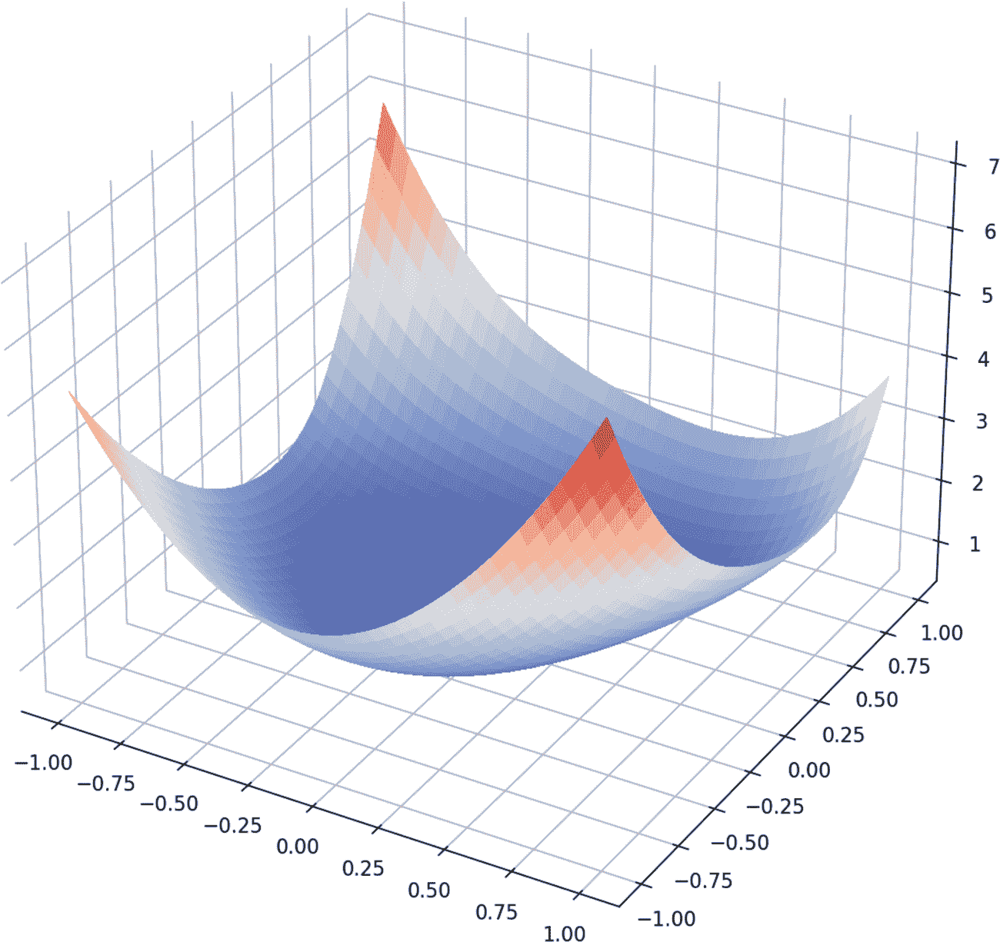

描述三维表面图的表示，该图描绘了景观状态。

图 3-11

在 Fashion MNIST 部分训练的模型的损失景观

颜色的梯度代表图上的不同值，蓝色代表最低值，红色代表最高值。网络参数的最佳值位于图的最低点。请记住，所绘制的图形仅仅是三维实际景观的投影，数字并不与神经网络中实际的最佳值相关。这里唯一有意义的轴是 z 轴，它代表损失值，而 x 轴和 y 轴是任意的参数值。这种可视化是为了分析和解释；通过修改网络的架构，损失景观的网格会发生变化。图 3-12 展示了相同数据的损失景观，但网络结构从两个各含 64 个神经元的层改变为含 512 个神经元的单层。

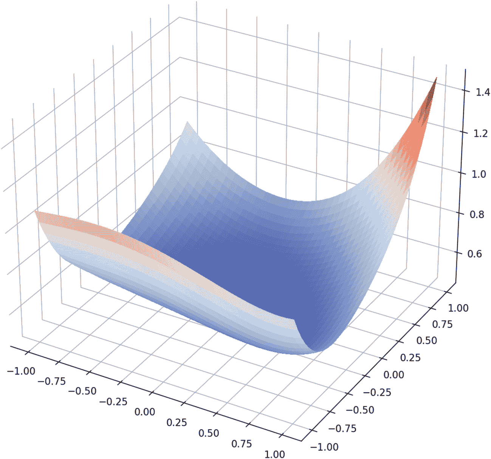

一个三维表面图的插图提供了景观的状态。

图 3-12

在 Fashion MNIST 数据部分训练的含 512 个神经元的单层模型的损失景观

模型解释与理解模型背后的机制同样重要。能够不仅学习和理解模型的工作原理，还能看到各个部分如何相互作用并改变结果，可以提供关键见解。请注意，含有一个 512 个神经元的隐藏层的网络产生的景观相对于含有两个各含 64 个神经元的隐藏层的网络来说相对更平坦和温和。这可能表明，在含有两个隐藏层的网络中，模型收敛更快，可能更优。请记住，可视化仅仅是我们用来简要理解和解释模型可能采取的一般训练路径的工具，而不是关于全局最小值的具体指南。

除了在 Fashion MNIST 示例中使用的分类交叉熵损失之外，这里还有一些在训练神经网络中更常用的损失。

+   *二元交叉熵*：在 Keras 中可以用字符串“`binary_cross_entropy`”替换损失参数。损失函数用于二元分类；它计算预测值和标签之间的对数损失。二元交叉熵背后的数学是第一章中介绍的逻辑回归中使用的确切函数。

+   *分类交叉熵/稀疏分类交叉熵*：在 Keras 中，可以使用字符串“`categorical_cross_entropy`”/“`sparse_categorical_cross_entropy`”替换损失参数。这两个损失函数都用于多类分类；它们计算预测和标签之间的交叉熵损失或对数损失。稀疏和非稀疏分类熵之间的区别在于，稀疏版本仅在目标不是 one-hot 编码时使用。在类别被 one-hot 编码到表示每个类别的单个列中时，应使用分类交叉熵。

+   *平均绝对误差/平均平方误差*：在 Keras 中，可以使用字符串“`mean_squared_error`”/“`mean_absolute_error`”替换损失参数。MAE 和 MSE 都是用于回归任务的常见损失函数。由于它们的简单性和易于解释，MSE 和 MAE 在大多数情况下都表现出色，无论数据是表格形式还是图像形式。

## 前馈操作的数学原理

之前关于前馈的解释更侧重于直观理解，而不是技术细节。我们可以用线性代数的语言来表述输入、权重和偏置之间的计算。

记住，第一层（称为输入层）中的神经元数量等于特征的数量。每个特征都输入到一个神经元中。我们将输入层的值组织成一个形状为 1×n _ features 的列向量。然后，权重被排列成一个矩阵，其中行数是第一隐藏层中的神经元数量，列数是输入层中的神经元数量。注意，权重矩阵的每一行对应于从输入层到下一层特定神经元的权重。从感知器模型来看，输出是通过“前馈”过程计算的，其中输入层中的每个神经元都乘以其权重，然后与其他每个神经元乘以其权重求和。这个和，加上偏置的加和，成为下一层中一个神经元的输入。因此，使用我们的特征向量和权重矩阵，计算变得像将权重矩阵与特征向量点积，并为下一层中每个神经元添加一个偏置向量一样简单（图 3-13）。

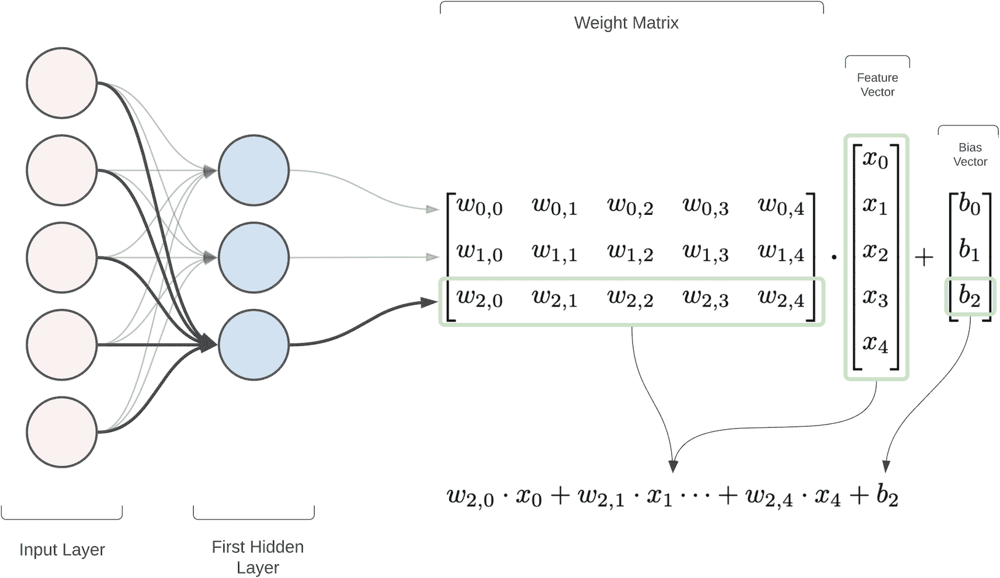

流程图展示了输入层转换为以下内容：第一隐藏层、权重矩阵、特征向量和偏置向量的加和。

图 3-13

在输入层和第一隐藏层中演示的前馈操作

操作在第一隐藏层和第二层之间继续，第二层和第三层之间，以此类推，直到达到最后一层。为了更简洁的方程和可读性，我们可以将权重矩阵表示为 *W*，特征向量表示为 *X*，偏差向量表示为 *b*。但特征向量仅在通过输入层时存在于第一层。对于层输出，我们将它表示为 *L*^((*n*))，其中 *n* 代表从左到右计数的层号。因此，第一层的值被定义为形状为 *n*[神经元] × *one* 的向量；输出可以通过 *L*^((1)) = *W*^((0)) ∙ *X* + *b*^((0)) 获得。每一层包含连接每个神经元的不同的权重和偏差；因此，我们以区分层输出的相同方式表示不同的权重和偏差集。

对于每一层后续层，其输出将通过 *L*^((*n*)) = *W*^((*n* − 1)) ∙ *L*^((*n* − 1)) + *b*^((*n* − 1)) 来计算。前馈操作继续这一计算，直到达到网络的末端，产生最终的输出（图 3-14）。

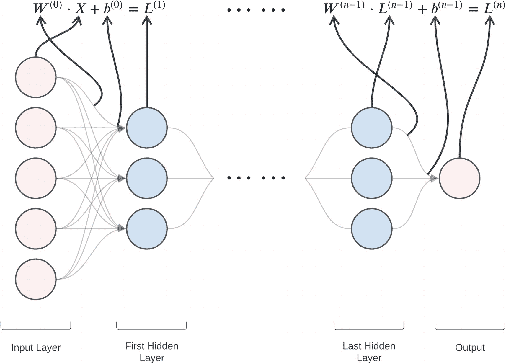

一张图展示了输入层神经元连接到第一隐藏层，并与连接到输出的最后一隐藏层交互。

图 3-14

在整个网络中使用先前定义的符号演示的前馈操作

然而，在大多数现代神经网络中，我们仍然在前馈操作以及整个网络的结构中缺少一个重要的部分。数据中的非线性是常见的。即使在神经网络中，成百上千的神经元堆叠在多层中，当涉及到单个神经元的计算时，它仍然是一个线性方程。引入激活函数是为了给模型增加非线性。

### 激活函数

激活函数应用于网络中每个神经元的最终输出。通过修改或限制最终输出值，模型在预测非线性可分数据方面变得更好。

直观地说，激活函数可以看作是开关，控制每个神经元“活跃”的程度，而不管其权重和偏差。在生物环境中，神经元只有当树突上的信号达到某个阈值时才会传递信息。从技术角度讲，我们之前构建的神经网络在每个神经元和每层的每个神经元中都包含激活函数。但激活并不是任何复杂的非线性函数，而是简单的 *y* = *x*。因此，它的名字是“线性激活”。

非线性激活函数为网络提供了几个关键改进：

1.  *添加非线性*: 这提高了模型在非平凡数据集上的性能。堆叠层中的神经元和神经元本身就是一个仿射变换的事实并没有改变。仿射变换的组合仍然导致仿射变换，无法建模变量之间的任何复杂关系。通过一个使用标量的基本示例，我们可以展示线性函数的组合仍然导致线性函数。设 *f* (*x*) = *ax* + *b* 和 *g*(*x*) = *cx* + *b*；那么 (*f* ∘ *g*)(*x*) = *a*(*cx* + *b*) + *b* = (*ac*)*x* + *ab* + *b*。我们知道 *a*，*b* 和 *c* 都是标量；因此，最终，方程仍然以 *y* = *ax* + *b* 的形式出现。同样的概念也适用于矩阵运算。设 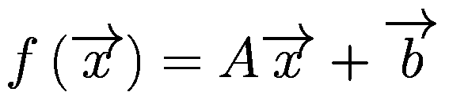 和 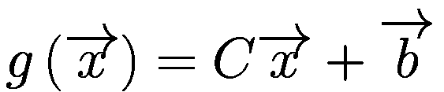；那么 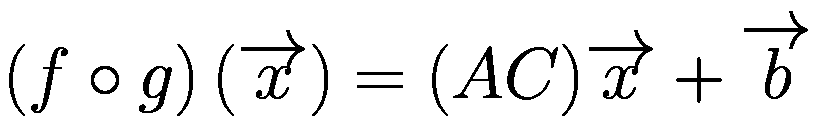。由于 *A* 和 *C* 都是可逆矩阵，*AC* 也必须是可逆的。因此 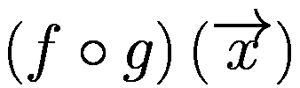 仍然是一个仿射变换。没有激活函数，多层网络本质上会塌缩成一个单层网络，因为最终，数百个仿射变换组合成一个单一的仿射变换。另一方面，在神经网络中引入非线性提高了表示能力。

1.  *解决梯度问题*: 某些限制值在特定边界的激活函数解决了梯度消失和梯度爆炸的问题。在每次迭代中，反向传播根据梯度下降获得的指标改变网络的参数。在某些情况下，由于将在后续章节中讨论的计算，梯度下降的指标可能要么太小要么太大。在第一种情况下，网络参数几乎不改变，网络将无法达到接近最优值的值。在第二种情况下，参数值可以迅速增长，导致溢出或“无限”损失。一些专门设计的激活函数可以帮助解决梯度消失和梯度爆炸问题，同时向网络添加非线性。

1.  *限制输出值*：如图第一个例子所示，在分类任务中，神经元的输出值必须在 0 和 1 的范围内。sigmoid 激活函数将任何输入限制为 0 和 1，而 softmax 将所有输出值限制在 0 和 1 之间，同时保持它们的和为 1（对多类分类很有用）。双曲正切激活函数将值限制在-1 和 1 之间，并在循环模型中使用（见第五章）。在大多数回归任务中，使用线性激活函数作为输出值不受限制。

在添加激活函数后，前馈操作略有修改。在将每个神经元与其权重相乘并加上偏置项之后，对每一层应用激活函数。因此，从输入层开始计数的神经网络第 n 层的方程变为 *L*^((*n*)) = *σ*(*W*^((*n* − 1)) ∙ *L*^((*n* − 1)) + *b*^((*n* − 1))) 其中 *σ*(*x*) 表示某种激活函数。

在以下小节中，我们将介绍五种常用的激活函数。

#### Sigmoid 和双曲正切

sigmoid 激活函数主要用于限制输出值，而不是在神经元层之间添加非线性。sigmoid 激活是逻辑回归中使用的逻辑函数，如第一章所述。由于梯度消失问题，sigmoid 激活不建议在隐藏层之间使用，这个问题比梯度爆炸更常见。再次强调，梯度消失导致神经网络几乎不更新其参数，实际上没有从数据中学习到任何东西。

与 sigmoid 类似，如图 3-15 所示的 hyperbolic tangent (tanh)激活函数不建议用于隐藏层之间的激活，而应用于限制输出值。

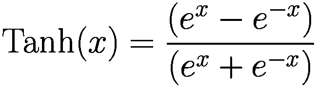

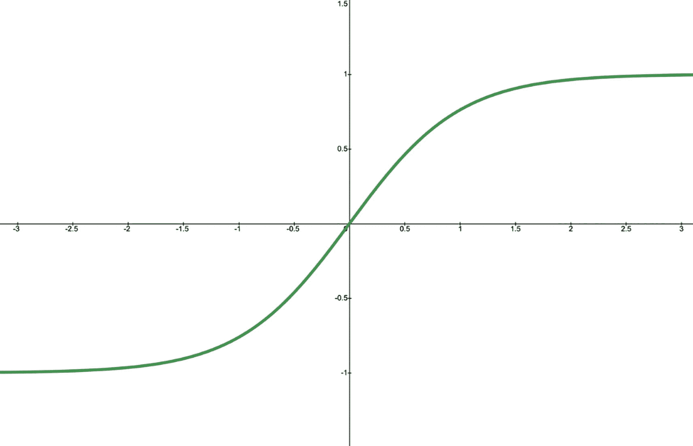

一条线图表示延伸到第一象限和第三象限并通过原点的曲线。

图 3-15

Tanh 激活函数

与 sigmoid 相比，tanh 激活函数在用作隐藏层之间的激活时表现更好，因为它是一个以零为中心的函数，而 sigmoid 的输出值被限制在 0 和 1 之间。但 tanh 和 sigmoid 都严重受到梯度消失问题的影响，在几乎所有情况下，应选择 ReLU（修正线性单元）等激活函数而不是它们。

#### 修正线性单元

修正线性单元，通常简称为 ReLU，是向网络引入非线性的最简单激活函数。它的目的是增加网络的复杂性以及解决梯度消失问题。它如下定义，并在图 3-16 中展示。

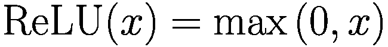

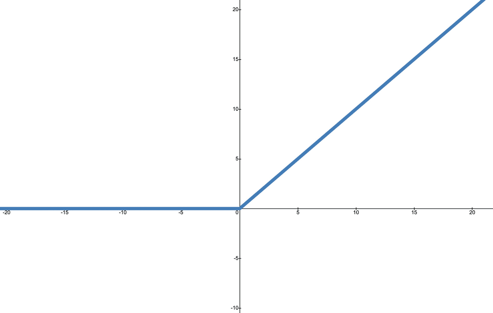

一条线图表示一条与 x 轴的负半轴重叠的线，穿过原点，并在第一象限向上倾斜。

图 3-16

ReLU 的图

尽管 ReLU 简单，但它避免了梯度消失问题，同时增加了非线性。与其他激活函数相比，ReLU 使用的空间更少，时间复杂度相对较低。然而，对于负输入的扁平尾部，有时过多的权重和偏置保持不变，导致“死亡”ReLU 问题。尽管已经证明，ReLU 在神经网络中引起的稀疏性（当许多激活等于 0 时）可以提高性能，但在某些情况下，这确实成为一个问题，导致收敛问题。最后，ReLU 没有解决梯度爆炸问题。

#### LeakyReLU

LeakyReLU 是 ReLU 的一个修改版本，具有可调整的参数*α*，与 ReLU 的扁平线相比，它创建了一个向下尾部。该函数解决了 ReLU 的一些问题，但也存在一些缺点（见图 3-17）。

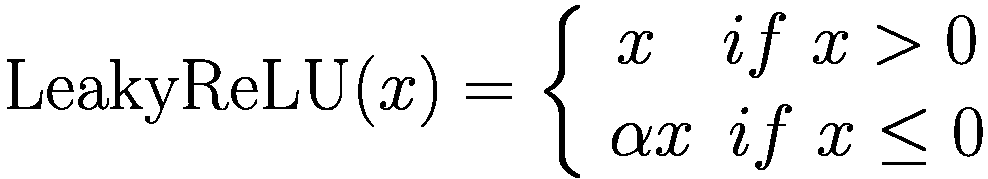

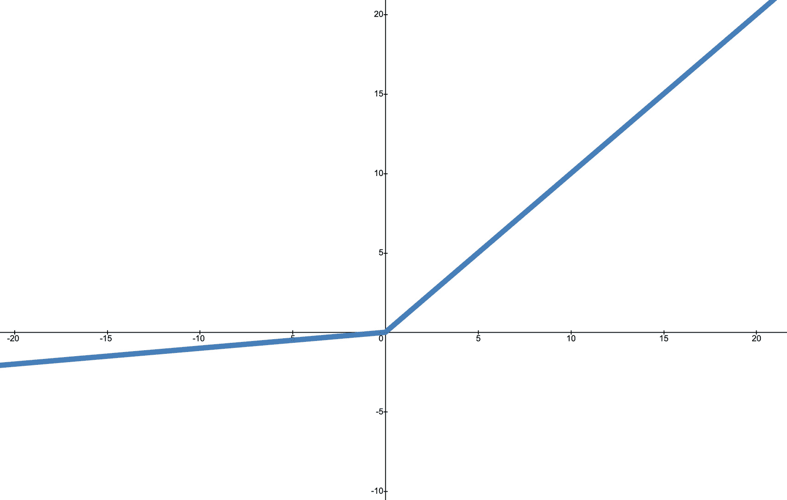

一条线图表示一条穿过原点，在第一象限向上倾斜的线，延伸在第三象限和第一象限之间。

图 3-17

*α* = 0.1 的 LeakyReLU

当*α*大于零时，死亡 ReLU 问题得到解决，因为对于任何小于零的输入，其值被调整，使其不会保持在零，从而能够通过极小的量更新网络参数。超参数*α*通常选择在 0 到 0.3 之间。然而，LeakyReLU 没有解决梯度爆炸问题。此外，为了实现最佳性能，我们需要手动调整参数。

#### Swish

Swish 呈现为一种更新但更有效的激活函数（见图 3-18）。由 Google Brain 的研究人员开发，^(2)，它在图像识别任务中表现出色，后来也在表格数据预测中表现出色。

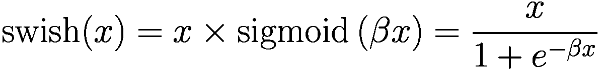

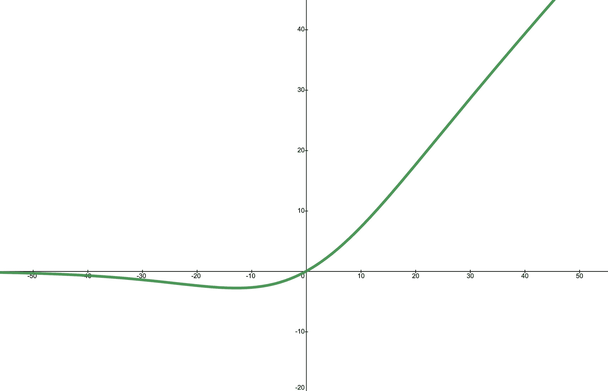

一条线图表示一条与 x 轴的负半轴重叠的曲线，穿过原点，并在第一象限向上倾斜。

图 3-18

Swish 激活函数

与 ReLU 类似，swish 激活函数在上方是无界的，即 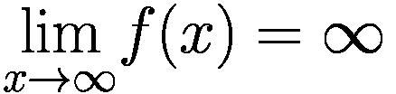，但在下方是有界的，这意味着当函数的定义域接近负无穷大时，*f* (*x*) 会趋向于一个确定的值。然而，与 ReLU 不同，由于 sigmoid 的组合，swish 函数平滑且没有突然的变化或顶点，这防止了输出值中的不必要跳跃。更重要的是，无界性避免了在反向传播产生的梯度收缩过程中的训练时间缓慢。

从视觉上看，swish 基本上是 ReLU 的一个“更平滑”的版本，有一个“凸起”，正如原始论文所示，在训练过程中，在激活函数之前插入的大多数输出值都落在“凸起”的定义域范围内，这表明与 ReLU 等形状相似的激活函数相比，添加“凸起”的重要性。这个向下“凸起”的重要性在于函数的微分。swish 函数是非单调的，这意味着在导数中不存在持续为负或正的值。swish 的这个特性解决了梯度消失问题，因为值在反向传播过程中永远不会被限制或由某个特定极限所界定，这会导致梯度产生极小的值。

通过调整超参数 *β*，我们可以看到当 *β* = 0 时，函数变成了一个缩放的线性激活 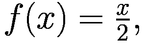，而当 *β* → ∞ 时，函数的 sigmoid 部分变得类似于 0-1 函数，使得整个 swish 函数的形状类似于 ReLU（图 3-19）。

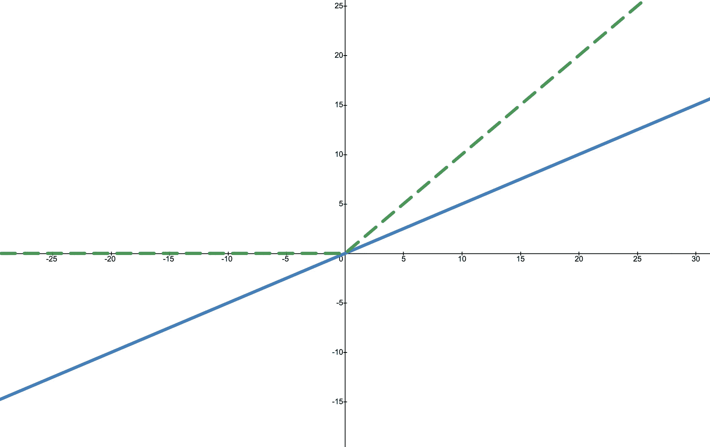

一条线图通过分别穿过第二象限和第三象限来比较与原点相交的两条线。这两条线的斜率向上。

图 3-19

比较β的值。虚线绿色线代表β = 10000，实线蓝色线代表β = 0 时的 swish。

因此，swish 可以被视为线性激活和 ReLU 激活之间的非线性插值，其中数量由超参数 *β* 控制。通常，*β* 在整个训练过程中被设置为某个特定值。然而，它可以在训练过程中作为一个可训练的参数进行调整。

最后，由于其平滑性和能够优化比 ReLU 具有更多层和批量大小的网络，swish 激活函数已被证明具有良好的泛化能力。

#### 激活函数的非线性和可变性

通过一个简单的演示可以进一步证明激活函数的非线性和差异。想象一下最简单的神经网络：一个输入神经元，一个隐藏层中的两个神经元，和一个输出神经元。我们将使用神经网络来近似二次函数 f(x) = x²。线性函数无法完成这个任务。

网络将使用 swish 激活函数进行训练，目前这是结构化数据集上表现最好的函数之一。之后，我们将网络的激活函数从 swish 改为 ReLU、Sigmoid、线性（不使用激活函数）等。网络的预测结果与输入数据集范围内的*x*²函数进行可视化比较。以下是启动的基本代码，见列表 3-15。

```py
# demonstration of activation's non linearity on NNs
# simple dataset that models a quadratic function
demo_x = np.array([i for i in range(-10, 11)])
# smooth out the data points for later graphing
demo_x = np.linspace(demo_x.min(), demo_x.max(), 300)
demo_function = lambda x: ((1/2)*x)**2
demo_y = np.array([demo_function(i) for i in demo_x])
Listing 3-15
Defining the dataset
```

与上一节中的网络类似，我们首先定义了`Sequential`对象，然后添加`Dense`层，指定神经元数量，并将激活函数设置为 swish。在编译模型后，它以均方误差（MAE）作为损失函数进行 20 个 epoch 的训练，因为它直观地展示了模型与目标之间的误差大小（见列表 3-16）。

```py
# construct a simple one hidden layer with two neuron network with activations
# import the dense and input layer
from keras.layers import Dense, Input
# the sequential model object
from keras.models import Sequential
# optimizer, don't worry about it now
from tensorflow.keras.optimizers import Adam
# model with activation
nonlinear_model = Sequential()
nonlinear_model.add(Input((1,)))
# beta parameter is learned in this case
nonlinear_model.add(Dense(2, activation="swish"))
nonlinear_model.add(Dense(1, activation="linear"))
# learning rates will be discussed later
nonlinear_model.compile(optimizer=Adam(learning_rate=0.9), loss="mean_absolute_error",)
nonlinear_model.fit(demo_x, demo_y, epochs=20, verbose=0)
print(f"Nonlinear model with swish activation function results: {nonlinear_model.evaluate(demo_x, demo_y)}")
Listing 3-16
Defining the network with the swish activation function
```

最终的 MAE 值约为 1.1287；考虑到我们的数据集范围以及我们网络的简单性，模型的性能相当不错。接下来，我们可以将神经网络作为函数绘制出来，其中输入是我们输入值范围，输出是产生的预测（见列表 3-17）。我们可以将这个图与近似函数 f(x) = x²的图进行比较，以直观评估模型的性能（见图 3-20）。

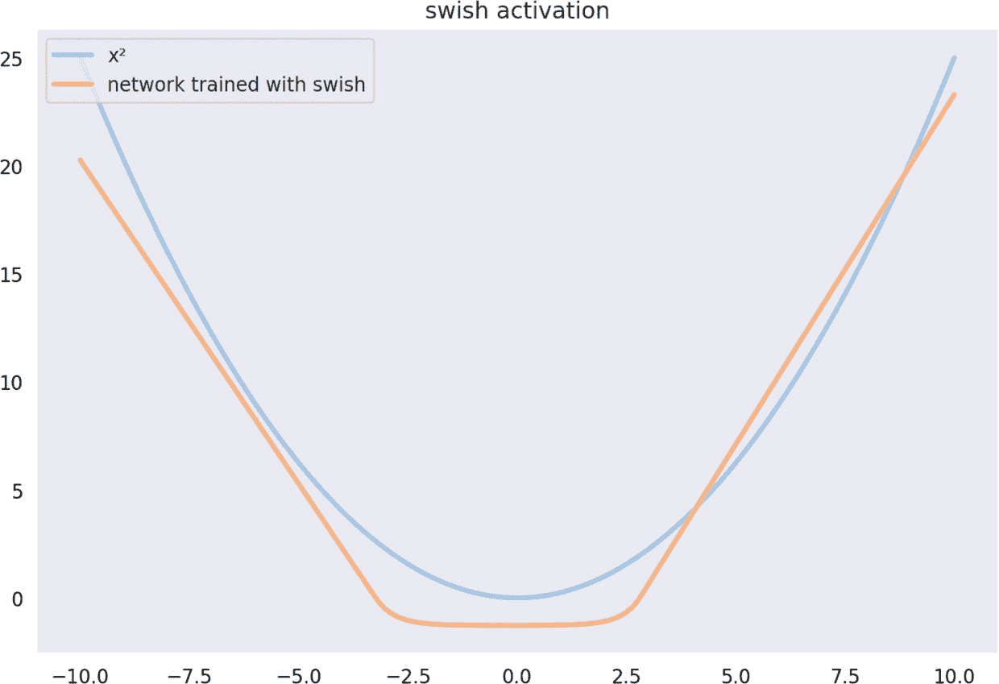

一条线形图展示了 x 平方和用 swish 训练的网络的两条线，描绘了一个呈上升趋势的抛物线。

图 3-20

f(x) = x²与使用 swish 激活函数训练的网络图形

```py
nonlinear_y = nonlinear_model.predict(demo_x)
plt.figure(figsize=(9, 6), dpi=170)
plt.plot(demo_x, demo_y, lw=2.5, c=sns.color_palette('pastel')[0], label="x2")
plt.plot(demo_x, nonlinear_y, lw=2.5, c=sns.color_palette('pastel')[1], label=f"network trained with swish")
plt.title('swish activation')
plt.legend(loc=2)
Listing 3-17
Plotting f(x) = x2 against the network trained with the swish activation function
```

训练好的网络能够相当好地复制函数 f(x) = x²的一般抛物线形状，仅使用两个神经元和仅七个可训练参数（不包括 swish 激活函数中的参数）。在网络的相同权重下，我们可以用其他激活函数替换激活函数，甚至移除它并观察结果（见图 3-21）。

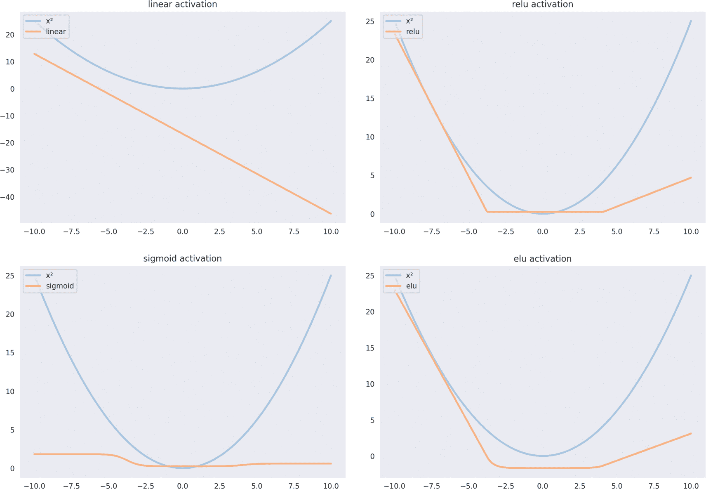

四条线形图展示了激活函数：线性、ReLU、Sigmoid 和 ELU 与另一条线，x 平方之间的比较。

图 3-21

使用 ReLU、sigmoid、线性（不使用激活函数）和 ELU 训练的网络的绘图

注意

ELU 代表指数线性单元，这是一种与 ReLU 和 swish 一样不常见的激活函数。它定义为 ELU(*x*) = *x* 如果 *x* > 0，以及 ELU(*x*) = *α*(*e*^(*x*) − 1) 如果 *x* ≤ 0，其中 *α* 是一个通常介于 0.1 和 0.3 之间的超参数。ELU 包含了 ReLU 在 *x* > 0 时的优点，并解决了 *x* ≤ 0 时的死 ReLU 问题。然而，与其它激活函数相比，ELU 的计算成本较高，且 *α* 值需要根据训练结果手动调整。

从视觉角度来看，ReLU 似乎表现最好，其次是 ELU，然后是 sigmoid，最后是没有激活函数训练的网络。正如前节所证明的，无论有多少神经元，没有激活函数的网络都会塌缩成线性函数。大多数，如果不是所有，现实生活中的数据集都无法用简单的线性关系来建模。

注意到 swish 和 ELU 的图表都包含没有尖锐转折的平滑曲线，而 ReLU 有顶点和角度，这会导致输出值的突然变化。Swish 和 ELU 的平滑性使它们在逼近包含曲线和软转折的函数时具有优势。鉴于许多现实世界的数据集具有逐渐变化而不是突然跳跃的值，swish 和 ELU 在这些情况下往往表现更好。

激活函数的池子远比这里展示的更广泛；在大多数情况下，使用 ReLU 或 swish 就足够了，但选择特定的激活函数并没有严格的规定，这个选择将留给数据科学家。

好奇的读者也许会发现，本章“精选研究”部分讨论的 SELU 激活函数，是这一系列函数家族中一个有趣的新增成员。

## 神经网络学习的数学原理

前馈操作是神经网络训练步骤中的第一步。随机初始化权重和偏差，然后将输入数据通过网络传递。由于网络的参数是随机生成的，它们不会适合输入数据。因此，我们必须告诉网络它的表现有多差，以及我们如何调整参数来提高其性能。

损失函数完成了第一部分，而梯度下降完成了第二部分。为了计算网络的“损失”，我们只需从前馈操作的结果中获取，考虑到随机生成的参数，这很可能是初始化时的乱码。然后算法将其用作初始“预测”，计算与目标的损失。损失计算后，使用梯度下降来优化损失函数，尝试在网络可能数百万个参数中寻找全局最小值。

### 神经网络中的梯度下降

回想第一章，梯度下降旨在在非凸函数中寻找全局最小值。通过迭代地朝着最大下降方向采取越来越小的步骤，我们最终可以达到全局最小值或损失景观中相对接近理论“全局最小值”的点。

注意

对于全局最小值，或者凸函数的最小值，我们可以简单地设置该函数的导数为零，并求解其参数。这种寻找最小值的方法通常被称为普通最小二乘法（OLS），许多线性回归算法在梯度下降法之上使用这种方法，因为它计算成本更低，并且产生更准确的结果。然而，这种方法对于神经网络问题来说是不可行的。

在神经网络的情况下，由于它们通常包含数百万可调整和优化的参数，而不是在二维或三维图中寻找全局最小值，目标转向在超曲面上寻找最低点（图 3-22）。

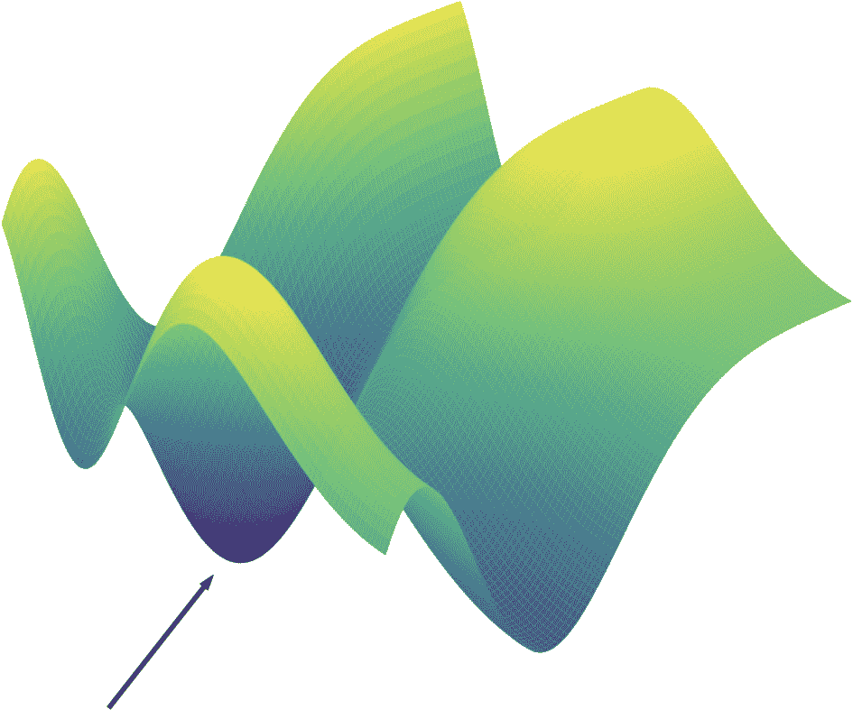

一个三维图形的示意图，在超曲面寻找最低点。

图 3-22

梯度下降在 3D 中寻找超曲面上的最低点

该算法旨在寻找一组参数，以降低成本函数的值到最低。在沿着损失景观斜坡“下降”的过程中，算法试图调整参数，这可以使函数的值向“向下”方向移动。微积分告诉我们，函数的梯度得到的是最陡增量的方向。直观上，负梯度给出了“下降”或损失景观中下山方向的方向。

通过函数的负梯度，简单地得到一个梯度向量，它告诉我们如何根据网络参数的变化对成本函数的敏感性来改变网络的参数，这在某种程度上将使我们“向下”在损失景观中移动。反向传播指的是计算网络包含的数百万参数的成本函数梯度的算法。

### 反向传播算法

我们可以从演示一个简单模型开始，一个包含一个输入神经元、两个每个隐藏层有一个神经元的网络和一个输出神经元。在这个微小的神经网络中，总共有六个参数，三个权重和三个偏置（图 3-23）。

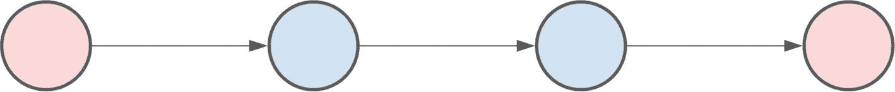

一个图示展示了四个神经元连接到连续的神经元。

图 3-23

简单的四层神经网络

如前所述，在调整网络参数之前，我们需要生成一个初始预测并计算其成本，以了解网络表现有多“糟糕”，从而为我们提供优化的起点。我们可以将每个神经元，或者在我们的情况下本质上每个层，表示为 *a*^((*L* − *n*)))，其中 *a*^((*L*)) 是最后一层，*a*^((*L* − 1))) 是倒数第二层，依此类推（见图 3-24）。反向传播从末端开始，即网络输出，然后向前推进。在从随机权重生成初始“猜测”后，我们可以计算预测和真实标签之间的损失。在此例中，使用均方误差（MSE）作为成本函数。

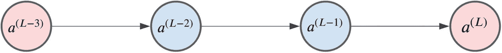

一张图展示了四个连续神经元之间的连接。

图 3-24

网络层表示法

我们可以进一步扩展 *a*^((*L*))) 的值，即最后一个神经元的输出：

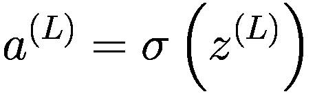

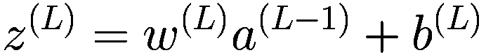

在前面的方程中，*σ*(*z*^((*L*))) 表示最后一层的激活。*z*^((*L*))) 是当前层权重 *w*^((*L*)) 乘以前一层激活输出 *a*^((*L* − 1))) 得到的加权总和，然后加上当前层或神经元的偏差 *b*^((*L*)*)。将损失/成本函数表示为 *C*，前向传播后网络的损失可以定义为 *C*(…) = (*a*^((*L*)) − *y*)²。回想一下，损失函数的输入是网络中的所有参数，而输出是实际损失或真实标签和预测之间的“成本”。

为了获得告诉我们如何调整网络权重和偏差的“指标”，我们需要计算成本函数相对于该层权重的导数。从 *w*^((*L*)) 开始，我们知道改变权重的值也会改变 *z*^((*L*)) 的值。然后，*z*^((*L*))) 的微小变化会影响 *a*^((*L*))) 的值，这直接改变 *C* 的值，即成本函数（见图 3-25）。

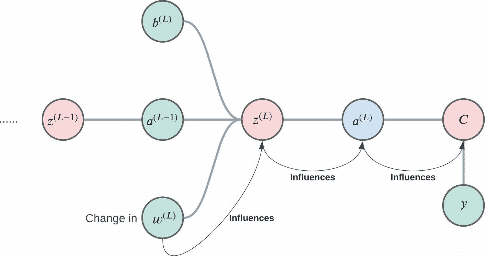

一张图通过连接影响最终结果的神经元来表示变化。

图 3-25

最后层权重值变化对成本函数的影响

使用链式法则扩展关于最后一层权重的成本函数的导数，我们得到 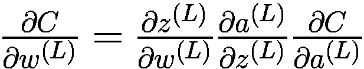。请注意，在我们这个例子中，计算出的导数仅适用于一个特定的训练示例。为了获得所有训练示例的全导数，计算每个单独导数的平均值。同样的概念也应用于对成本函数求偏导，得到 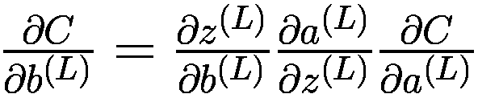。这个过程可以迭代地应用于网络的每一层。对于我们在网络中向后移动的每个“步骤”或层，导数中会添加一个“链”。

例如，倒数第二层的权重导数，*L* − 1，可以表示为 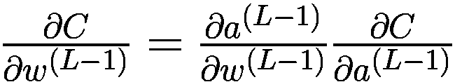；这实际上告诉我们，*w*^((*L* − 1)) 的变化会影响 *a*^((*L* − 1)) 的值，而 *a*^((*L* − 1)) 的变化会直接影响成本函数。我们可以像之前一样使用链式法则扩展导数，以获得完整的方程。

我们可以将我们的例子扩展到每层有多个神经元的网络，如图 3-26 所示。

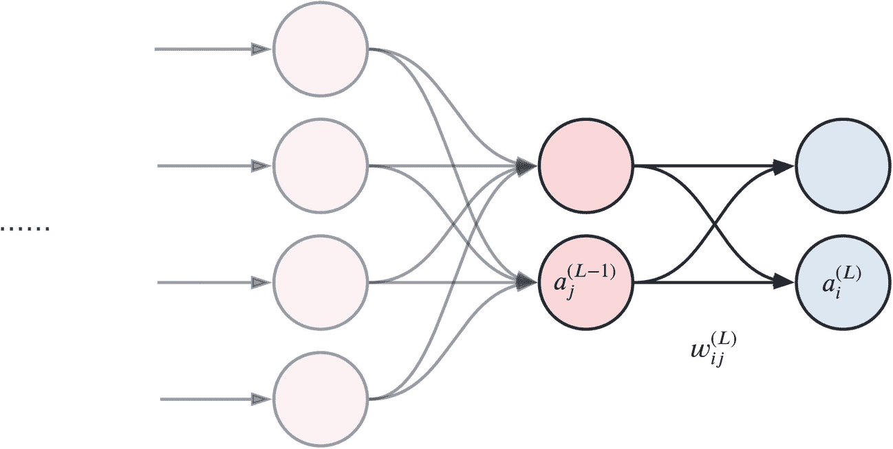

一个图表展示了四个高度相互连接到两个神经元的神经元与另一组两个神经元的相互作用。

图 3-26

具有多层和神经元的网络

为了说明，我们只需关注 *L* 和 *L* − 1 层；对于每个后续的 *L* − *n* 层，应用相同的计算概念。请注意，对于每一层，神经元用下标表示，其中 *i* 代表 *L* 层的神经元，*j* 代表 *L* − 1 层的神经元。

某个特定权重 *w*[*ij*] 的导数与之前描述的简单单神经元网络相同：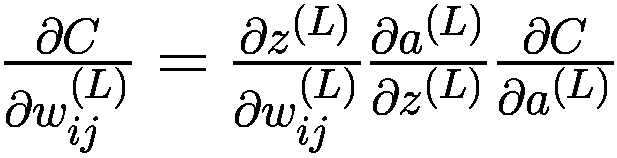. 然而，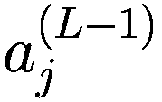 的导数变成了层 *L* 中每个神经元的导数之和：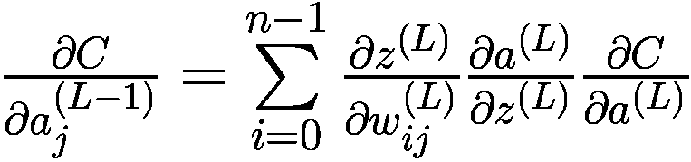 其中 *n* 是层 *L* 中的神经元数量。这不仅适用于多个输出神经元，也适用于隐藏层，其中神经元连接到下一层中超过一个神经元（这在大多数网络架构中都是这种情况），因为激活状态的变化将影响下一层中神经元的两个输出。

该算法用于迭代地计算导数，回溯到网络的开始，因此得名反向传播。一旦获得成本函数的梯度——一个关于成本函数的每个参数的导数的向量——每个参数的更新规则与回归模型中的梯度下降相同。选择一个学习率参数，并将其乘以该参数的导数；得到的结果成为网络的新权重/偏差。

## 优化器

优化器是指用于更新网络参数的算法。回想一下，在前面和第一章中，梯度下降的更新规则如下：

1.  对于每个训练样本，对网络中的每个参数对成本函数进行微分。

1.  对所有训练样本的平均导数。

1.  通过 *θ* ≔ *θ* − *α* ∙ ∇[*θ*]*C*(*θ*) 更新网络中的每个参数，其中 *θ* 是正在更新的参数，而 *α* 是学习率，*C*(*θ*) 是成本函数。

1.  重复进行所需数量的轮次。

在实际应用中，计算每个样本在每一步的“影响”的总和是非常计算密集的。更不用说每个参数在模型看到整个数据集之后才更新一次，这证明是低效的，并且非常慢。一个可能的解决方案是通过随机打乱数据集来更新每个样本的参数。对于每次梯度下降步骤，只计算那个数据点的梯度。然而，一次只取一个样本会产生一个非常不稳定的下降。这可能是因为每个样本之间的差异会导致模型对每个样本变得过于特定，因此忽略了全局趋势，对我们来说，这会表现为不稳定的训练。不稳定的训练可能导致错过全局最小值或偏离它，因为这种方法过于关注“局部优化”而不是观察整个数据集的“大局”，就像梯度下降法一样。

注意

为了明确这里使用的术语，反向传播指的是计算损失函数梯度的算法，它通知模型如何改变每个参数以减少损失函数。另一方面，一次梯度下降步骤指的是在所有训练数据样本上执行反向传播的过程，并使用梯度来更新网络的参数。

### 小批量随机梯度下降法（SGD）和动量

小批量随机梯度下降法在传统梯度下降法和逐样本更新之间走了一条中间道路，妥协了两种算法的优点和缺点。它不是仅仅关注一个样本对损失的影响有多大，也不是简单地累加每个样本的影响，而是将数据集分成相对较小的批次，并计算每个批次的梯度。小批量随机梯度下降法的更新规则比梯度下降法多两个步骤：

1.  随机将数据集分成子集或小批量。

1.  对于每个小批量，对网络中的每个参数对损失函数进行微分。

1.  在整个小批量中平均导数。

1.  通过以下公式更新网络中的每个参数：*θ* ≔ *θ* − *α* ∙ ∇[*θ*]*C*(*θ*)，其中*θ*是正在更新的参数，而*α*是学习率，*C*(*θ*)是损失函数。

1.  对所有小批量重复执行。

1.  重复执行所需数量的时代。

将神经网络的训练想象成一个人在蒙着眼睛下山。使用传统的梯度下降法，这个人会考虑可能影响他们下一步的每一个参数。在仔细计算了所有可能影响他们下山步子的因素之后，他们采取了一个保守的步子，并一直这样做，直到他们慢慢地到达山底（图 3-27）。

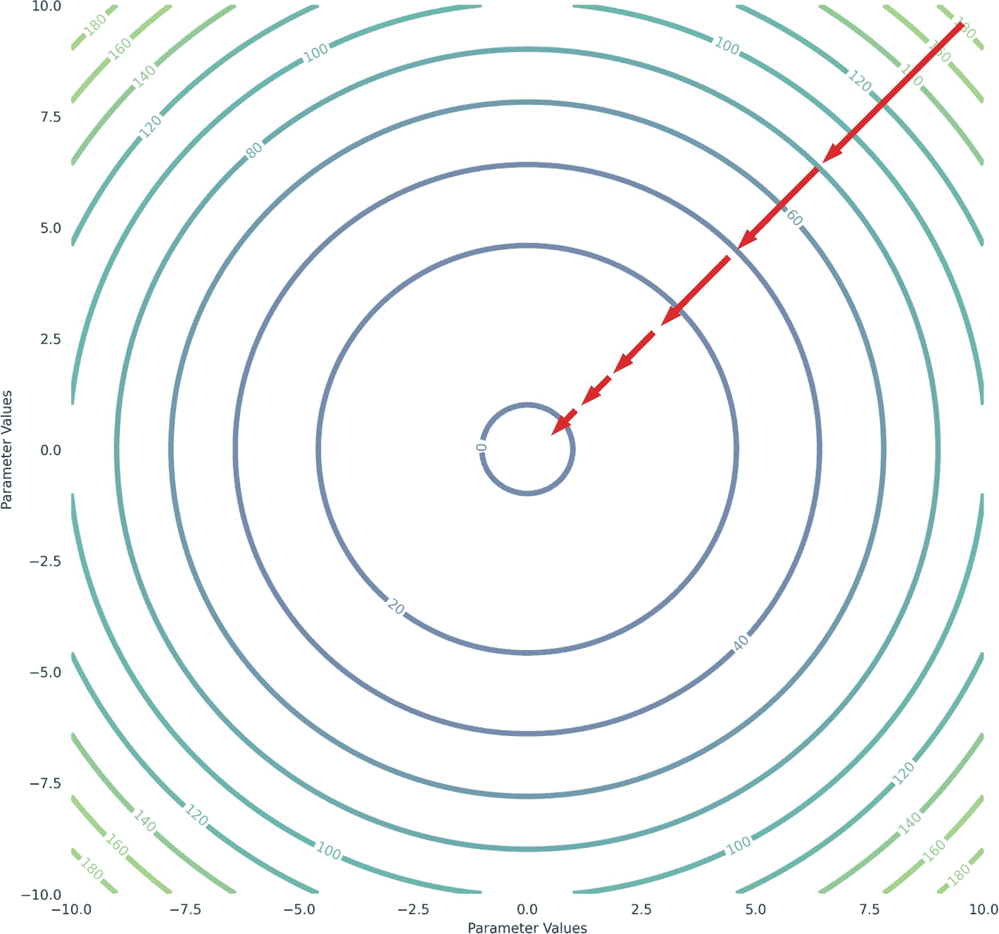

一个表示参数值的正负值圆形刻度，一条直线从 180 度方向指向中间的零值。

图 3-27

传统梯度下降可能采取的路径

相反，mini-batch SGD 就像一个醉酒的人，在正确的方向上左右摇摆，同时沿着整体路径向下（见图 3-28）。由于在 mini-batch SGD 中，网络参数的变化并不反映数据的整体趋势，而是一个子集，尽管在大多数情况下它提供了正确的下降方向，但这个过程可能会有噪声，但与传统的梯度下降相比，它更加节省时间和计算效率。此外，对于 mini-batch SGD 来说，逃离鞍点——在这些点上，一个方向上有局部最大值，而另一个方向上有局部最小值——几乎是不可能的，因为大多数围绕地形的梯度都接近于零。

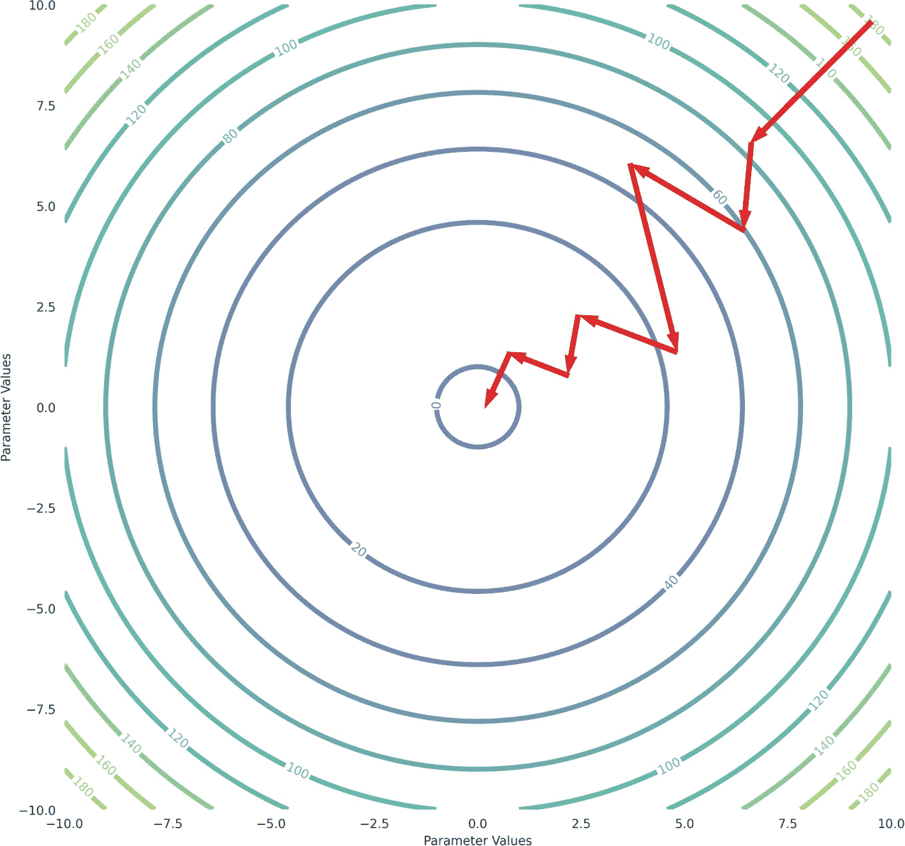

一个表示参数值的正负值圆形刻度，一条波动线从 180 度方向指向零值。

图 3-28

mini-batch SGD 可能采取的路径

SGD 通常面临的另一个挑战是克服那些在一方向上比另一方向更陡峭的“山谷”。SGD 倾向于在山谷的斜坡周围振荡，而没有取得任何实际进展。引入一种称为“动量”的技术可以帮助“推动”SGD 在相关方向上前进而不振荡。动量通过以下方程修改更新规则，将前一步的部分更新向量包含到当前更新向量中：*ν*[*t*] = *γν*[*t* − 1] − *α*∇[*θ*]*C*(*θ*)，其中*γ*通常设置为 0.9，*ν*[*t* − 1]是前一个更新向量。然后我们通过*θ* = *θ* + *ν*[*t*]更新当前参数。当两个更新向量的梯度指向同一方向时，动量会增加步长，而当梯度指向不同方向时，会减少更新大小。

### Nesterov 加速梯度（NAG）

我们可以将带有动量的 S G D 比作一个滚下山的球，当斜率变陡时加速，当斜率减小或变为向上方向时减速。Nesterov 加速梯度可以增加球的“精度”，让它知道当“地形”前方开始向上倾斜时何时减速。在涉及动量的方程中，我们知道更新向量或成本函数的梯度被添加的动量项*γν*[*t* − 1]“推动”，使其进入最小值方向，抑制任何振荡。因此，通过将*γν*[*t* − 1]添加到当前参数值，我们可以近似其下一个位置；估计值不如梯度项精确，因为成本函数的梯度项-*α*∇[*θ*]*C*(*θ*)被排除（我们没有这个项，因为我们还没有在当前步骤中计算它），但这个值足够精确，足以提供一个接近我们最终到达位置的点（图 3-29）。然后我们可以利用这种“前瞻”技术，计算相对于近似参数而不是当前参数的梯度：*ν*[*t*] = *γν*[*t* − 1] − *α*∇[*θ*]*C*(*θ* + *γν*[*t* − 1])。参数的更新方式与之前相同：*θ* = *θ* + *ν*[*t*]。

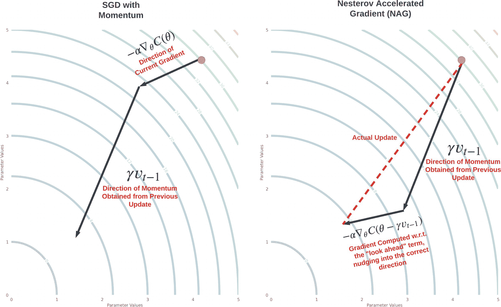

两个插图展示了 S G D 与动量以及 N A G 在先前和当前更新方向上的比较。

图 3-29

NAG 的更新运动与动量比较

Nesterov 加速梯度更新可以解释为两个阶段。在第一阶段，上一步的累积梯度作为动量，在该方向上迈出大步。然后，在第二阶段，计算相对于“前瞻”项的梯度；它随后微调或纠正动量所采取的方向，从而得到最终的更新。本质上，这允许“球”在采取下一步之前先看看它在损失景观中滚动到何处，因此比仅基于动量更加高效和准确。

通过将 S G D 和迷你批处理结合到传统的梯度下降中，我们能够在减少计算工作量同时加快下降速度。向 S G D 添加动量和 NAG 可以提高下降的精度，同时自适应地调整步长以适应损失景观的斜率。根据参数的值，一些被认为比其他更重要；因此，可以根据参数的重要性进行更新。

### 自适应矩估计（Adam）

Adam 优化器根据每个参数对网络服务的重要性计算自适应学习率。每个参数的学习率根据其在步骤中计算的梯度进行调整。在一些较老的优化器中，如 AdaGrad，前一步的梯度被累积并加到当前梯度上，然后该项被平方以用作学习率的除数。遵循过去梯度的趋势，AdaGrad 对与频繁出现的特征相关的参数执行较小的更新，通过降低学习率。相反，AdaGrad 对与较少频繁出现的特征相关的参数执行较大的更新，通过增加学习率。然而，AdaGrad 出现了一个主要缺陷。这是因为训练过程中累积的梯度增长到极大的值。这使学习率缩小到无穷小值，以至于模型无法获得额外的变化。

Adam 算法不是存储所有过去累积的梯度，而是对过去所有平方梯度的指数衰减平均值。为了符号的简洁性，将 ∇[*θ*]*C*(*θ*[*t*]) 表示为 *g*[*t*]，过去平方梯度的衰减平均值可以定义为 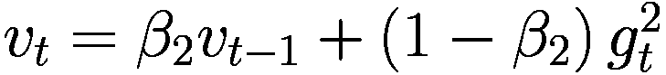 其中 *β*[2] 通常设置为 0.999，正如作者在论文中所述。此外，当前步骤计算的梯度被过去梯度的衰减平均值所替代，而不对梯度项进行平方：*m*[*t*] = *β*[1]*m*[*t* − 1] + (1 − *β*[1])*g*[*t*]。*β*[1] 通常设置为 0.9，正如论文中所述。*m*[*t*] 和 *v*[*t*] 都估计梯度的第 n 阶矩；具体来说，*m*[*t*] 是均值或第一矩，而 *v*[*t*] 是未中心化的方差，或梯度的第二矩，因此得名“矩估计”。

由于 *m*[*t*] 和 *v*[*t*] 都初始化为零向量，这两个值都倾向于偏向 0，尤其是在训练的初期阶段。作者计算了梯度的偏置校正第一和第二矩，这略微修改了计算衰减平均值后的两个值。

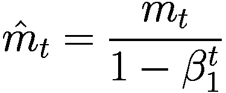

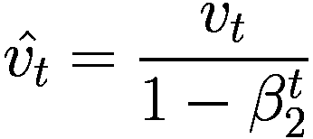

然后将这些值纳入 Adam 更新规则中，该规则如下定义：

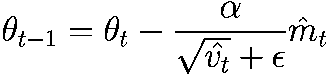

为了避免除以 0，添加了一个缓冲项 *ϵ*，通常设置为 10^(-9) 左右的值。

如果带有动量的 SGD 代表一个球沿着斜坡滚动，那么 Adam 可以看作是一个带有摩擦的重球沿着斜坡滚动。由于与 SGD with NAG 和 AdaGrad 等优化器相比，在最新的（SOTA）模型上性能显著提高，因此 Adam 是现代深度学习中应用最广泛的优化器之一，无论任务是什么。

Adam 家族中还有许多其他优化器，例如 AdaMax，它将平方梯度项推广到`l`[∞]范数，或者 Nadam（Nesterov 加速动量估计），它结合了 NAG 和 Adam 的概念，或者 AdaBelief，这是一种考虑损失景观曲率信息的优化器，并通过当前梯度方向的“信念”调整其步长。

自适应方法会导致收敛速度更快，但可能会导致泛化能力较差，而 SGD 家族可能收敛较慢，但通常更稳定且泛化能力更好。尽管有一些优化器试图结合两者的优点，例如 AdaBound 或 AMSBound，但目前，Adam 仍然是使用最广泛且性能最佳的优化器之一。

## 深入了解 Keras

在“使用 Keras 建模”部分，仅介绍了涉及构建用于分类的功能性神经网络的基本操作和技术。现在，我们将更深入地探讨高级 Keras 建模技术，涵盖 Keras 的一些最有用的功能。我们试图改进我们的初始模型，该模型对 Fashion MNIST 数据集中的常见服装图像进行分类。

回想一下，我们的模型在列表 3-18 中定义为如下。

```py
# import the dense and input layer
from keras.layers import Dense, Input
# the sequential model object
from keras.models import Sequential
# initialize
fashion_model = Sequential()
# add input layer, specify the input shape of one sample # as a tuple
# in our case it would be (784, ) as it's one-dimensional
fashion_model.add(Input((784,)))
# add dense layers, the only parameter that we need to
# worry about right now is the number of neurons, which
# we set to 64
fashion_model.add(Dense(64))
fashion_model.add(Dense(64))
# add output layer
# softmax activation can be specified by the "activation"
# parameter
fashion_model.add(Dense(10, activation="softmax"))
Listing 3-18
The model architecture defined in the “Modeling with Keras” section
```

注意，在我们之前构建的隐藏层中没有激活函数。在 Keras 语法中，有两种添加激活函数的方法；如果没有使用任何激活函数，则默认激活函数为线性。

第一种方法是作为字符串将激活函数的名称输入到`Dense`调用中的“activation”参数（见列表 3-19）。在 Keras 中，可以通过字符串使用以下激活函数：`elu`、`exponential`、`gelu`、`hard_sigmoid`、`relu`、`selu`、`sigmoid`、`softmax`、`softplus`、`softsign`、`swish`和`tanh`。

```py
fashion_model.add(Dense(64, activation="swish"))
fashion_model.add(Dense(64, activation="swish"))
Listing 3-19
Inserting activation as a string passed into the Dense call
```

第二种方法是在`Dense`调用之间插入一个激活层。通过将激活层作为对象导入，它们可以被调用并添加到顺序模型中，就像添加密集层一样。对于大多数激活函数，除了代码的可读性和简洁性之外，使用字符串在密集层中使用和使用单独的激活层之间没有明显的优势。然而，对于具有用户定义的超参数，如 LeakyReLU 的激活函数，它们必须作为单独的层添加到模型中，因为其超参数是在层调用期间定义的，如列表 3-20 所示。

```py
from keras.layers import LeakyReLU
fashion_model.add(LeakyReLU(alpha=0.2))
Listing 3-20
Example activation layer using LeakyReLU
```

我们可以修改初始模型，使其在隐藏层中都有 swish 激活函数，并可能观察到性能。模型定义和训练的完整代码在列表 3-21 中显示。

```py
from keras.layers import Dense, Input
from keras.models import Sequential
fashion_model = Sequential()
fashion_model.add(Input((784,)))
fashion_model.add(Dense(64, activation="swish"))
fashion_model.add(Dense(64, activation="swish"))
fashion_model.add(Dense(10, activation="softmax"))
from keras.losses import SparseCategoricalCrossentropy
from tensorflow.keras.optimizers import Adam
fashion_model.compile(optimizer=Adam(learning_rate=1e-3),loss="sparse_categorical_crossentropy", metrics=["accuracy"])
fashion_model.fit(X_train, y_train, epochs=25, batch_size=1024)
fashion_model.evaluate(X_test, y_test, batch_size=2048)
Listing 3-21
Complete code for training the Fashion MNIST network with added swish activation (without comments to reduce space usage)
```

与之前的训练结果相比，在添加激活函数后，准确率从 0.82 提高到 0.90，证明了它们在任何神经网络中存在的重要性。请注意，由于权重是随机初始化的，因此结果可能在不同运行中略有不同。

接下来，我们将讨论内置的验证方法和技术，以改进过拟合问题。

### 训练回调和验证

在 fit 调用期间，Keras 通过在调用中包含一些额外的参数来内置验证功能。在训练过程中，对于每个 epoch 在验证集上评估模型是有用的。我们不必根据`model.evaluate`的结果调整每个训练周期的 epoch 数和学习率，而只需将 epoch 数设置为验证集具有最高准确率或所用指标的 epoch 即可。具体来说，验证特征和目标可以作为元组传递到 fit 调用中的`validation_data`参数。建议使用交叉验证而不是简单地将数据分成训练和验证块；`validation_data`参数通常用于快速测试（列表 3-22）。

```py
fashion_model.fit(X_train, y_train, epochs=25, batch_size=1024, validation_data=(X_test, y_test))
Listing 3-22
Fit example with validation data passed in
```

虽然训练不需要回调，但 Keras 回调是在每个 epoch 之后执行的过程，使用户能够更深入和详细地控制训练以及模型调整。以下是一些常用的回调：

+   *模型检查点：导入为* `tensorflow.keras.callbacks.ModelCheckpoint`：根据用户指定保存模型。选项包括在每个训练或验证指标改进的每个 epoch 保存整个模型或仅保存模型权重。回调函数也可以设置为在每个 epoch 保存。

+   *早停法：导入为* `tensorflow.keras.callbacks.EarlyStopping`：基于某些标准（例如训练或验证指标在一定的 epoch 数内没有改进）在达到期望的`epoch`数之前终止训练过程。

+   *在平台期降低学习率：导入为* `tensorflow.keras.callbacks.ReduceLROnPlateau`：当训练或验证损失在一定`epoch`数内停止改进时，通过用户指定的因子降低学习率。

早停回调通常与模型检查点一起使用——在保存模型最佳版本的同时自动停止长时间的训练会话。它避免了在长时间未监控的训练过程中可能出现的进度损失，这种训练可能持续数小时到数天。以下是基于我们的`fashion_model`示例（列表 3-23）显示这两个回调的基本语法。

```py
from tensorflow.keras.callbacks import EarlyStopping, ModelCheckpoint
checkpoint = ModelCheckpoint(filepath="path_to_weights", monitor="val_accuracy",
save_weights_only=True, save_best_only=True)
early_stop = EarlyStopping(patience=3, monitor="val_accuracy",
min_delta=1e-7, restore_best_weight=True)
Listing 3-23
Early Stopping and Model Checkpoint example
```

模型检查点会将模型权重（根据“`save_weights_only=True`”设置），保存到参数“`filepath`”中指定的文件路径。除非“`save_best_only`”设置为 true，如前所述，否则模型在每个 epoch 都会保存，在这种情况下，只有那些显示对“`monitor`”参数设置的监控指标有改进的 epoch 才会保存。

提前停止仅在“`monitor`”参数设置的指标在“`patience`”参数指定的某些 epoch 内停止改善时结束训练。此外，使用`min_delta`，可以设置一个量，只有当改善量超过设置的值时，改善才算数。最后，通过将“`restore_best_weight`”参数设置为 true，提前停止将从监控指标表现最佳的 epoch 恢复模型权重。

在 Keras 的 fit 调用中，返回一个对象，其“history”属性返回一个详细的训练日志，包括所有损失和指标在所有 epoch 的值。返回一个包含所有信息的字典，其中每个键是监控的损失/指标，而键内的每个值是在一个 epoch 该特定损失/指标的值。我们可以利用这些数据并通过绘制指标/损失值与 epoch 数的关系来可视化训练或验证损失的趋势（列表 3-24）。

```py
# history and plotting
history = fashion_model.fit(X_train, y_train, epochs=40, batch_size=1024, validation_data=(X_test, y_test))
plt.plot(history.history['val_accuracy'], label="val_acc")
plt.plot(history.history['accuracy'], label="train_acc")
plt.xlabel('Epochs')
plt.ylabel('accuracy')
plt.title("Training and Validation Accuracy")
plt.legend()
plt.show()
Listing 3-24
Plotting training history
```

通过分析训练历史中的趋势和模式，可以检索到有价值的信息，这些信息可以帮助未来的模型调整和改进。在前面的例子中，验证准确率在约 20 个 epoch 时开始趋于平稳，如果没有下降，这是应该降低学习率的指标，即在增加的点附近。这样做可能会在验证准确率上带来轻微的性能提升。

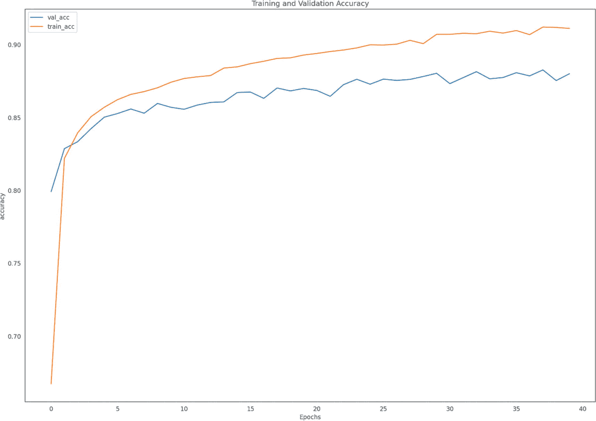

线形图绘制了训练和验证准确率随 epoch 变化的曲线，对于两条线：val acc 和 train acc。这些线的斜率向上。

图 3-30

训练性能与 epoch 数的关系图

当“`monitor`”参数指定的监控指标在“`patience`”参数指定的 epoch 数内没有改善时，减少学习率在平台期会降低学习率。每次降低学习率时，它都会乘以“`factor`”参数中设置的因子。

通过整合前面描述的回调，验证结果可能能够从之前的训练（列表 3-25）中改善。

```py
# callbacks
from tensorflow.keras.callbacks import EarlyStopping, ReduceLROnPlateau, ModelCheckpoint
checkpoint = ModelCheckpoint(filepath="path_to_weights", monitor="val_accuracy",
save_weights_only=True, save_best_only=True, verbose=1)
early_stop = EarlyStopping(patience=6, monitor="val_accuracy",
min_delta=1e-7, restore_best_weights=True, verbose=1)
reduce_lr = ReduceLROnPlateau(monitor='val_loss', factor=0.2,
patience=3, min_lr=1e-7, verbose=1)
# redefine the model
fashion_model = Sequential()
fashion_model.add(Input((784,)))
fashion_model.add(Dense(64, activation="swish"))
fashion_model.add(Dense(64, activation="swish"))
fashion_model.add(Dense(10, activation="softmax"))
# compile again so the model restarts training progress from above
fashion_model.compile(optimizer=Adam(learning_rate=1e-3),loss="sparse_categorical_crossentropy", metrics=["accuracy"])
history = fashion_model.fit(X_train, y_train, epochs=100, batch_size=1024, validation_data=(X_test, y_test), callbacks=[checkpoint, early_stop, reduce_lr])
plt.figure(dpi=175)
plt.plot(history.history['val_accuracy'], label="val_acc")
plt.plot(history.history['accuracy'], label="train_acc")
plt.xlabel('Epochs')
plt.ylabel('accuracy')
plt.title("Training and Validation Accuracy")
plt.legend()
plt.show()
Listing 3-25
Retraining with callbacks
```

注意到验证准确率提高了大约 0.01，从 0.87 提升到大约 0.88。你可以调整回调参数以进一步改善结果。然而，基于问题设置和回调所拥有的有限修改能力，0.01 的准确率提升被认为是成功的。

### 批标准化和 Dropout

之前，探索了不同的优化器；一些导致快速收敛，而另一些可以在提高模型在未见数据集上的泛化能力的同时稳定训练。尽管通过更新梯度不同，整个训练可以稳定，但模型内部仍然存在训练稳定性问题。由于模型的层接收来自前一层的激活的原始信号，激活的分布可能在不同的批次之间发生剧烈变化。这可能导致算法总是试图拟合一个移动的目标。这个问题被称为内部协变量偏移。网络依赖于分布之间的高度相互依赖性，这可能会减慢训练并降低稳定性（图 3-31）。

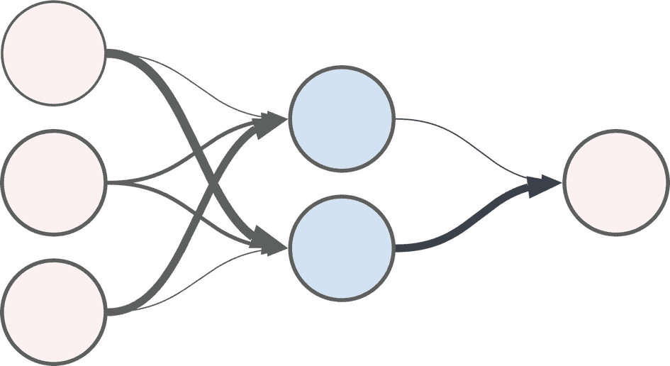

一张图展示了三个神经元与两个连接到下一个神经元的神经元高度互联。

图 3-31

网络的原始、未归一化的信号可能导致训练不稳定

批量归一化产生一个归一化信号，这有助于减轻分布之间的相互依赖性。这不仅能够增加训练稳定性和速度，批量归一化还可以将正则化插入到训练中或减少过拟合并提高泛化能力。

批量归一化使用当前批次的第一个和第二个统计矩，对隐藏层的激活向量进行归一化。通常，批量归一化是在激活函数之后应用的；然而，在非线性变换之前应用也是可以接受的。

我们将激活向量/输出表示为*z*。然后，批次的第一个和第二个矩，即均值和无中心方差，如下定义：

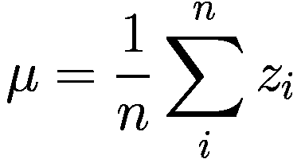

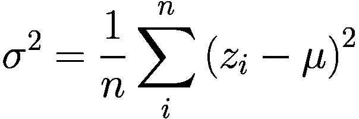

然后，基于获得的价值，激活向量被归一化，使得每个神经元的输出向量在整个批次中遵循正态或高斯分布。注意，*ϵ*被添加以增加数值稳定性：

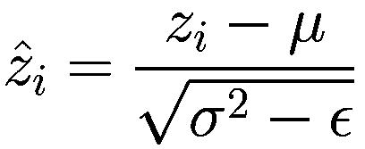

然后应用一个具有两个可学习参数的线性变换到归一化输出上，使得每一层可以选择其自身的最优分布。具体来说，*γ*调整标准差，而*β*控制偏差：

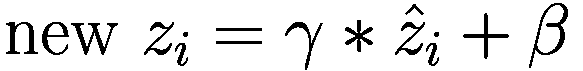

*γ*和*β*的值与梯度下降一起使用指数移动平均进行训练，类似于 Adam 优化器的机制。

在评估阶段，当输入的数据不足以构成一个完整的批次，因此没有足够的信息来计算第一和第二矩时，均值和无中心方差将由训练阶段预先计算的估计值替换。

在实践中，Keras 将批归一化实现为一个层调用，并像任何 `Dense` 调用一样使用它。我们可以在模型中添加批归一化层，如列表 3-26 所示。

```py
from tensorflow.keras.layers import BatchNormalization
fashion_model = Sequential()
fashion_model.add(Input((784,)))
fashion_model.add(Dense(64, activation="swish"))
fashion_model.add(BatchNormalization())
fashion_model.add(Dense(64, activation="swish"))
fashion_model.add(BatchNormalization())
fashion_model.add(Dense(10, activation="softmax"))
Listing 3-26
Adding batch norm layers to our model
```

通过使用批归一化重新训练模型，观察到验证准确率略有提高，而训练准确率提高了大约 0.02。如果我们分析批归一化模型的图形，请注意，训练和验证数据的准确率比没有批归一化的模型要稳定得多。更重要的是，在具有批归一化的模型图形中，验证和训练指标收敛得更快，在大约第 15 个时期达到平台期，而没有批归一化的模型在第 50 个时期停止提高，性能相似（图 3-32）。

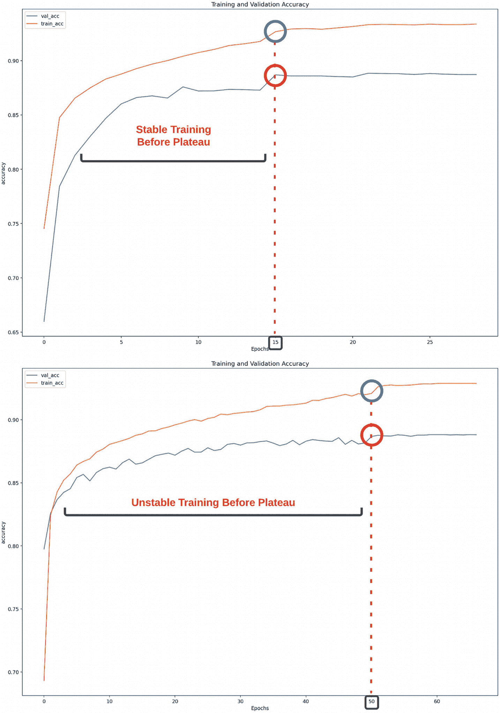

两条线图描绘了在训练和验证准确率达到平台期之前的稳定和不稳定训练的比较。

图 3-32

与没有批归一化的模型相比，具有批归一化的模型

注意，批归一化确实有助于防止过拟合（批大小越大，其带来的正则化作用越小）。其最显著的使用是加速和稳定训练。在现代网络中，无论是大型还是小型，批归一化层几乎成为默认选项。然而，在每一层后添加批归一化层的一个主要缺点是计算成本。随着批归一化的每次添加，收敛或时期数可能会减少，但每个时期所需的时间将显著增加。最好在为每一层添加批归一化和完全不添加批归一化之间找到一个平衡点。

神经网络如此容易过拟合（并且反过来，有大量可以提高神经网络泛化的方法）的一个主要原因是单个简单网络可以包含的参数数量庞大且不正常。

将有性繁殖优于无性繁殖的类比可以这样描述：有性繁殖的作用不仅仅是让新的和多样化的基因在种群中传播，而且还要减少那些会降低新基因提高个体适应性的复杂共适应。它通过训练基因不总是依赖于大量可用的基因池，而是引导它们能够与少量基因一起工作，显示了有性生产的重要性。同样的概念通过在层中添加 dropout 应用到神经网络中。神经网络中的每个隐藏单元都可以训练成与所有其他参数一起工作，也可以与随机选择的一小部分参数一起工作。这反过来可以提高网络的鲁棒性。

如同其名，dropout 在训练阶段随机删除神经元（图 3-33）。dropout 背后的主要目的是减少神经元之间的相互依赖性，并提高对未见数据集的泛化能力。

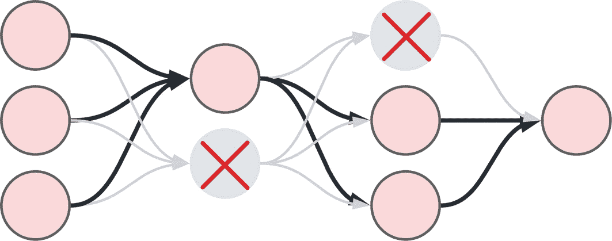

一个图表示了四层相互连接的神经元：三层、两层、三层和一层。第二层和第四层的每个神经元都被删除了。

图 3-33

神经网络中 dropout 的例子

在实践中，就像批归一化层一样，Keras 提供了一个带有用户指定的参数/值的 dropout 层。根据 Keras 文档，dropout 层“在训练时间每一步随机将输入单元设置为 0，频率为 rate，这有助于防止过拟合。”在这里，“rate”是一个预设的超参数。

添加任何 dropout 层到隐藏层的基本语法在以下内容中显示（列表 3-27）。注意，在评估期间，所有神经元都被打开。

```py
# dropouts
from tensorflow.keras.layers import Dropout
fashion_model = Sequential()
fashion_model.add(Input((784,)))
# add dropout after dense and batch norm layers
fashion_model.add(Dense(64, activation="swish"))
fashion_model.add(BatchNormalization())
fashion_model.add(Dropout(0.25))
fashion_model.add(Dense(64, activation="swish"))
fashion_model.add(BatchNormalization())
fashion_model.add(Dropout(0.25))
fashion_model.add(Dense(10, activation="softmax"))
Listing 3-27
Adding dropouts to hidden layers
```

你可以在`fashion_model`上尝试不同的 dropout 层值和数量，可能进一步改善模型性能。在大多数情况下，dropout 会略微降低模型在训练数据上的性能，但会显著提高验证集或未见数据的结果。

### Keras 功能 API

在前面的例子中，使用 Keras 进行建模是通过`Sequential`对象完成的，以有序的方式添加层。然而，这种功能以及构建模型的过程非常有限，许多复杂的模型架构都是使用 Keras 功能 API 构建的。在添加任何花哨的连接和结构到网络之前，在列表 3-28 中是一个之前章节中作为示例定义的`fashion_model`，它使用 Keras 功能 API 构建的例子。

```py
import tensorflow.keras.layers as L
from tensorflow.keras import Model
inp = L.Input((784, ))
x = L.Dense(64, activation="swish")(inp)
x = L.BatchNormalization()(x)
x = L.Dropout(0.2)(x)
x = L.Dense(64, activation="swish")(x)
x = L.BatchNormalization()(x)
x = L.Dropout(0.2)(x)
out = L.Dense(10, activation="softmax")(x)
new_fashion_model = Model(inputs=inp, outputs=out)
# compile and train as normal
Listing 3-28
Simple model built using the functional API
```

如“功能 API”的名称所暗示的，层被定义为前一层的一个函数。每个层可以在创建时与层或层相关联的同时存储在其自己的变量中，正如我们稍后将会看到的。与`Sequential`模型不同，在`Sequential`模型中，每个层都成为模型对象的“部分”，功能 API 允许每个层成为其自己的结构，具有无限连接和结构可能性。由于每个层都有可能成为其独特的变量，我们可以在以后引用它并创建非线性网络连接或甚至跳过连接。然而，如果这不是必需的，大多数约定将每个层定义为被反复重新定义的一个变量，以保持简洁性和可读性。

在同一变量上重新定义不同层的符号有时可能会令人困惑。最好注意每个函数指向何处，它是否指向输出层或另一个独立的层分支。

我们通过将当前层对象（例如，`Dense`层）作为函数调用，其中其参数是前一层变量，来在当前层和前一层之间建立连接。然后，将函数调用的输出分配给一个变量（例如，`x`是一个常用的变量名）。然后，我们分配给当前层的变量包含有关当前层及其与前一层连接的信息（图 3-34）。

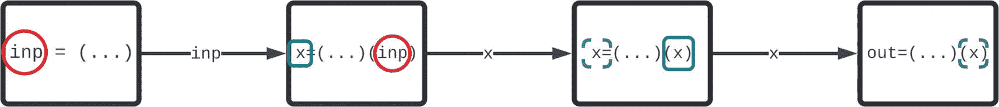

流程图表示了从输入到输出的四个网络连接到连续网络。

图 3-34

功能 API 背后的直觉

可以将一个简单的类比与常见的链表数据结构进行比较。在功能 API 中定义的每个变量或层都充当链表中的一个节点。单个变量不包含整个模型的所有信息，正如用户不能通过一个节点访问链表中的每个值一样。然而，每个变量都包含其连接中下一层的“指针”。当使用`keras.Model`对象“连接”模型时，Keras 会内部通过查找这些“指针”并检索层信息来将输入层和输出层连接在一起。请注意，在实际的 Keras 库中，从功能 API 构建`Model`对象的过程并不一定像链表那样工作，但这是一个有助于理解的合理类比。

#### 非线性拓扑

Keras 功能 API 的精华在于其创建非线性拓扑模型和具有多个输入和输出的模型的能力。这些模型架构不能按顺序定义，可能包含复杂结构，其中一个层的输出可以被复制并输入到多个其他层。这些非线性拓扑模型还利用合并技术，如连接——一个层由两个或更多不同层的输出组合而成。

能够构建非线性拓扑模型的能力很重要，因为它们允许对给定数据进行更深入和可能更有意义的分析，从而产生更好的结果。在顺序定义的模型中，数据将仅限于一组参数，这些参数编码了来自输入或前一层的输出信息。使用非线性拓扑，输入可以通过并分割成网络的不同“分支”，每个分支都有不同的设置和连接类型。然后，在某个点上，可以通过连接或用户指定的其他操作形式将所有这些不同“分支”的见解合并在一起。尽管有人说过顺序模型可以适应数据并基于数据创建不同的参数化神经元，但使用非线性拓扑仍然是有益的，因为顺序模型的能力有限。大多数，如果不是所有，现代最先进（SOTA）模型以某种方式使用非线性拓扑，无论是基于表格数据还是其他形式的数据。

以功能方式构建非线性拓扑非常直观。在以下内容中，我们将以一个相对简单的非线性拓扑网络为例进行构建。然后，我们将构建和探索更复杂的概念，如多输入、多输出和权重共享。作为一个例子，我们的目标是构建一个从单个输入块开始，然后分成两个不同的分支，每个分支有不同的隐藏层数和神经元数；然后，它们再次连接成一个分支，并最终输出预测。这一概念在图 3-35 中得到了说明。

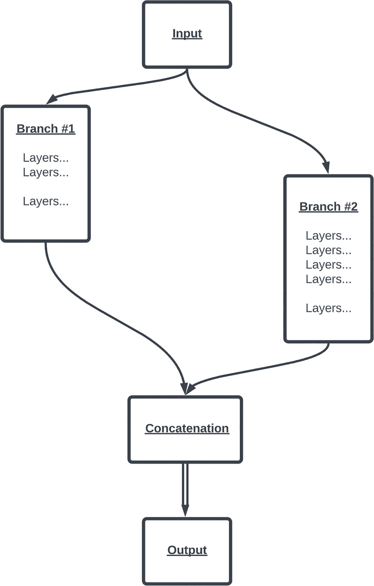

非线性拓扑网络的流程图：输入、一、二分支的多个层、连接和输出。

图 3-35

非线性拓扑网络

按照之前定义的简单、功能模型的方式，我们首先定义列表 3-29 中显示的输入层。

```py
import tensorflow.keras.layers as L
inp = L.Input((784, ))
Listing 3-29
Defining the input layer
```

然后，两个分支分别定义（见列表 3-30）。一个重要的注意事项是，分支内的层可以使用相同的变量名，但不同分支的层不能使用相同的变量名。这样做可能会搞乱层与层之间的关系，而且这样做根本就没有意义。

```py
# use the variable name "x" for 1st branch
x = L.Dense(128, activation="swish")(inp)
x = L.BatchNormalization()(x)
x = L.Dense(32, activation="swish")(inp)
x = L.BatchNormalization()(x)
# use the variable name "y" for 2nd branch
y = L.Dense(64, activation="relu")(inp)
y = L.BatchNormalization()(x)
Listing 3-30
Definition of two separate branches
```

在创建了这两个独立的“分支”（层的数量和神经元的选择是随机的——此模型仅作为示例）之后，对输出层施加了连接操作以合并层的输出。最后，根据连接层定义输出层。请注意，在 `L.Concatenate` 的“函数调用”参数中是一个列表，包含应该连接的层输出。在我们的例子中，是 `x` 和 `y` 的输出（列表 3-31）。连接操作简单地沿着指定的轴连接层的输出。通常，连接的轴被认为是特征列（例如，形状为 `(100,3)` 的数组与形状为 `(100,2)` 的数组连接将产生形状为 `(100,5)` 的数组）。由于连接层能够保留所有层的输出，因此它比其他任何合并方法都使用得更多。其他合并层包括 `Average`（在指定的轴上平均值）、`Dot`（执行两个向量/矩阵的点积）、`Maximum`（在指定的轴上应用最大函数）等等。在大多数情况下，连接操作对模型来说已经足够了；让模型“确定”在合并层上执行的操作，而不是为不同分支的输出分配一个严格的操作，这对模型更有利。

```py
from tensorflow.keras import Model
# use the variable name "concat" for
# concatenated layer
# combine the output from
concat = L.Concatenate()([x, y])
concat = L.BatchNormalization()(concat)
out = L.Dense(10, activation="softmax")(concat)
# combining into one single Model object
non_linear_fashion_model = Model(inputs=inp, outputs=out)
# compile and train as normal
Listing 3-31
Concatenation between layers and the output
```

然后，整个模型由一个 `keras.Model` 对象组成，其中输入层的变量传递给“input”参数，而包含输出层的变量传递给“output”参数。

当构建复杂且错综复杂的网络时，很容易使用 Keras 功能 API 而丢失对变量名、连接和层的跟踪。Keras 提供了一组简单的函数，可以显示有关模型的信息以及可视化模型架构。

通过在创建的模型对象（或编译后的模型）上调用 `summary()`，Keras 将输出每个层的参数、形状和大致的详细总结，以及每层的连接，以及网络中的总参数数。之前创建的非线性模型上调用 `summary()` 的输出显示在列表 3-32 和图 3-36 中。

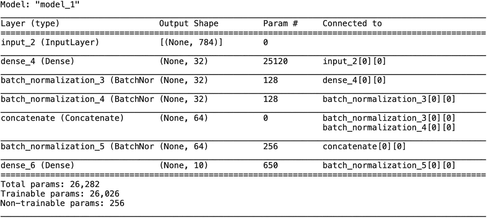

一个四列九行的图表列出了以下内容：层、输出形状、参数，以及与总参数、可训练参数和非训练参数的连接。

图 3-36

模型.summary() 生成的输出

```py
non_linear_fashion_model.summary()
Listing 3-32
Model summary example
```

为了更直观和直接地表示，Keras 有一个函数可以绘制模型的架构，同时包括层形状和类型的信息。该函数从 `keras.utils` 中导入，命名为 `plot_model`。该函数有几个相关参数。要绘制的模型作为第一个参数传入。然后，`to_file` 参数创建可视化名称以及保存到该文件的路径。还有两个其他较小的参数，`show_shapes` 和 `show_layer_names`，分别控制是否在图中显示层的输入和输出形状以及层的名称（见列表 3-33 和图 3-37）。每个层的名称可以通过将名称作为字符串传递给任何带有 `name` 参数的层调用来自定义。

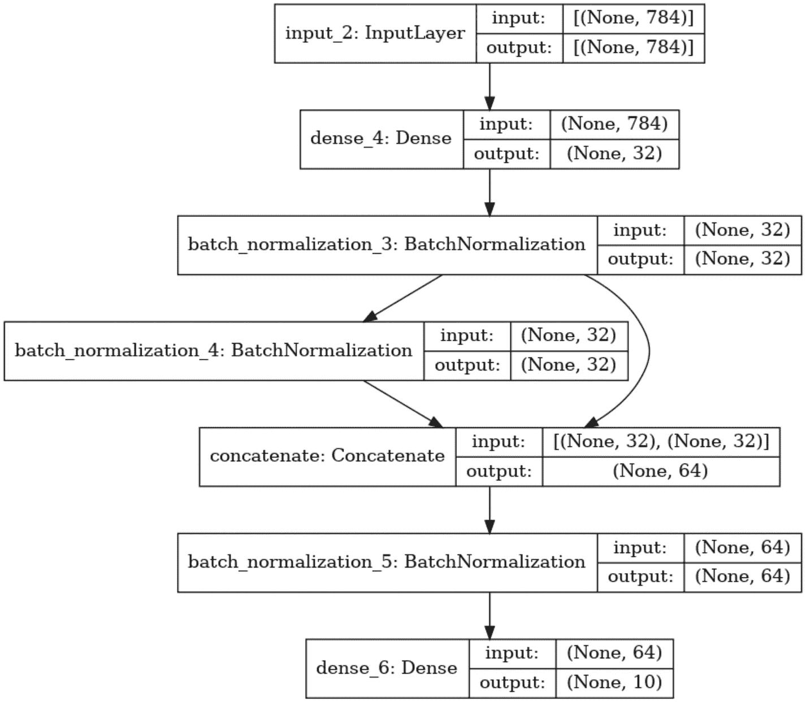

流程图表示了层的七个阶段及其输入和输出值。

图 3-37

绘制的模型图

```py
from keras.utils import plot_model
plot_model(non_linear_fashion_model, to_file="model.png", show_shapes=True, show_layer_names=True)
Listing 3-33
Keras function for plotting the model
```

尤其对于非线性拓扑模型，能够可视化数据如何在层之间相互交织的分支间传递，对于纠正模型定义中的错误或简单地更好地掌握整体模型架构非常有帮助。在本书的剩余部分，我们将广泛使用这一功能，因为我们处理新的架构。

#### 多输入和多输出模型

在某些问题设置中，数据的不同组成部分以不同的格式呈现，或者有时它们属于完全不同的类别，这些类别合并和一起训练没有意义。明显的解决方案是为不同类型的数据训练单独的模型。一个常见的例子是在医疗领域。想象一下，在放射学分类中，通常会将关于图像患者的元数据与表格数据配对。图像和表格数据都提供了对分类任务可能有用的关键信息。一个人可能会训练一个处理表格数据部分的模型，而另一个模型处理图像。然后，在每个模型预测之后，将预测结果平均以产生最终的输出。尽管这种方法是可行的，但它确实遇到了一些问题。由于每个模型只拥有“整体画面”的一部分，并试图根据部分信息进行预测，因此产生的结果可能信息不足。然而，使用多输入模型，我们可以共同考虑画面的所有部分是如何相互关联的。幸运的是，有一种方法可以让一个模型接收两个输入，然后，在分别处理这两个输入之后，将层的输出合并成一个单一的合并层。然后，整个模型一起通过反向传播将其方式回溯到每个输入“分支”。以这种方式训练的模型比多个单一模型表现得更好，因为模型学会了它自己的“语言”来结合来自两种或更多不同类型数据的见解，产生无法用单独模型复制的成果。

类似地，存在一些情况，其中一组数据被用来预测多种不同类型的输出。一个例子可能是使用关于房屋的相同特征集来预测房价以及是否在 5 年内出售。再次强调，使用具有相同特征的两个模型来预测不同类型的输出是可以实现的。然而，将两个输出“分支”合并成一个单一模型更有益。反向传播可以将两个分支的模式关联到模型中，获取两个数据部分的知识，这些知识无法通过两个单独的模型来学习。

使用`Sequential`对象构建这些类型的模型是不可能的，但使用功能 API，这变得既可能又完全直观。对于多输入模型，我们只需定义两个具有不同变量的输入头。然后，一旦它们在自己的“分支”中通过层进行处理，就可以使用连接，或者任何其他形式的层合并，将输入分支合并成一个单一的隐藏层。构建多输入模型的示例代码在列表 3-34 中给出，以及模型架构的图示在图 3-38 中。

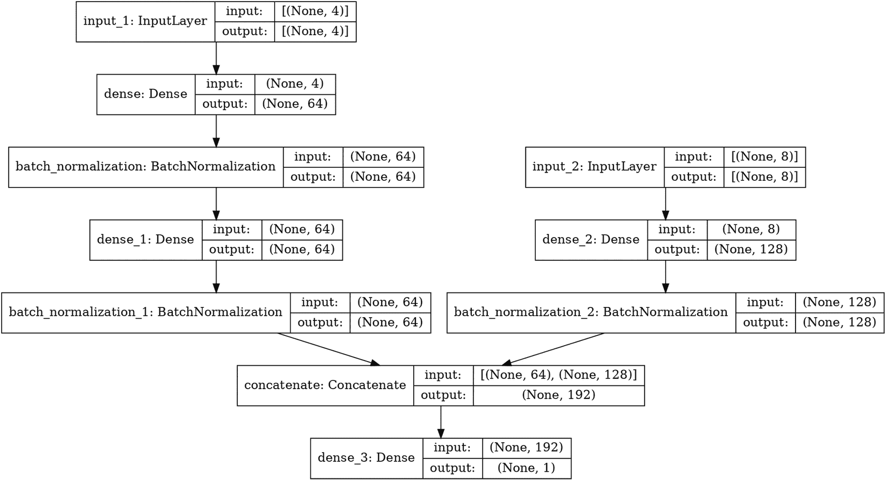

流程图展示了从输入一到密集层三的多输入模型的分类，以及它们的输入和输出值。

图 3-38

多输入模型的结构

```py
# example data of zeros
X_a = np.zeros((100, 4))
X_b = np.zeros((100, 8))
y = np.zeros((100,))
# first branch of input
inp1 = L.Input((4, ))
x = L.Dense(64, activation="relu")(inp1)
x = L.BatchNormalization()(x)
x = L.Dense(64, activation="relu")(x)
x = L.BatchNormalization()(x)
# second branch of input
inp2 = L.Input((8, ))
z = L.Dense(128, activation="relu")(inp2)
z = L.BatchNormalization()(z)
# concatenation
concat = L.Concatenate()([x, z])
out = L.Dense(1)(concat)
# build into one model
multi_in = Model(inputs=[inp1, inp2], outputs=out)
Listing 3-34
Code for a multi-input model
```

在训练期间，不同类型的输入数据作为 `(x, y)` 元组内的列表传递，其顺序与创建 `Model` 对象时将层输入列表的顺序相同（列表 3-35）。同样的概念也适用于评估。

```py
multi_in.compile(optimizer="adam",loss="mse")
multi_in.fit([X_a, X_b], y, epochs=10)
multi_in.evaluate([X_a, X_b], y)
Listing 3-35
Example training code for multi-input model
```

多输出模型可以用类似的方式定义。不同的输出层作为列表传递给 `keras.Model` 对象，在训练期间，它作为 `(x, y)` 元组内的列表传递。图 3-36 展示了定义多输出模型的基本代码，其绘制的模型结构在图 3-39 中。

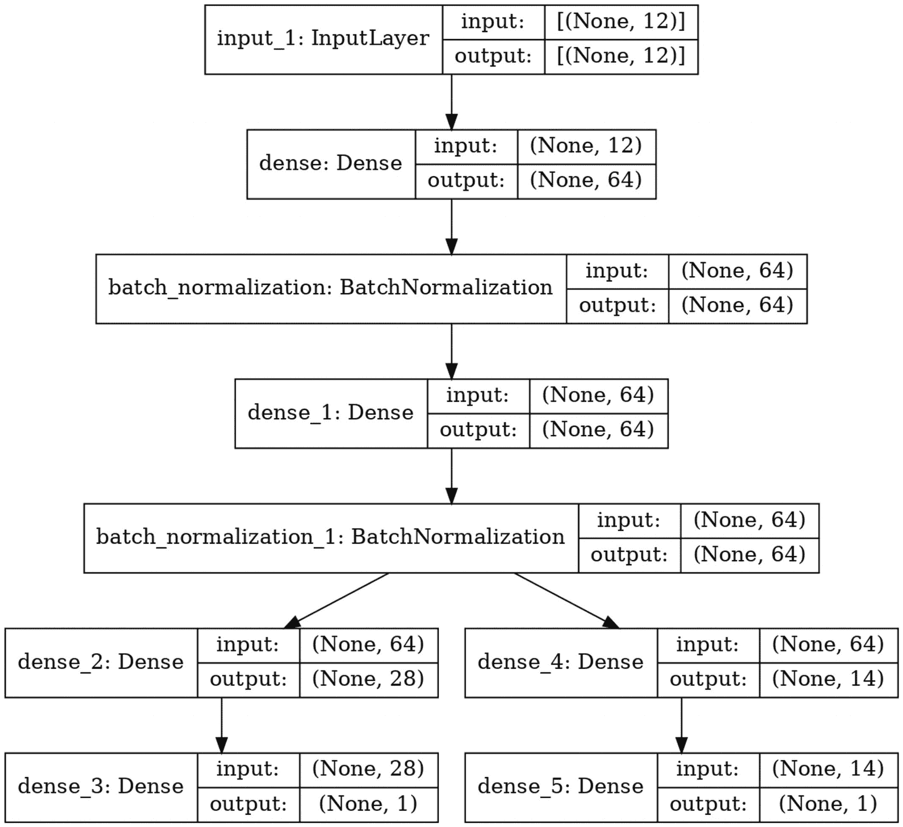

流程图描述了从输入一到密集层三和五的步骤，以及它们的输入和输出值。

图 3-39

多输出模型的结构

```py
# example data of zeros and ones
X = np.zeros((100, 12))
y_a = np.zeros((100, 1))
y_b = np.ones((100, 1))
inp = L.Input((12, ))
x = L.Dense(64, activation="relu")(inp)
x = L.BatchNormalization()(x)
x = L.Dense(64, activation="relu")(x)
x = L.BatchNormalization()(x)
# seperation
out1 = L.Dense(28, activation="relu")(x)
out1 = L.Dense(1)(out1)
out2 = L.Dense(14, activation="relu")(x)
out2 = L.Dense(1)(out2)
# build into one model
multi_out = Model(inputs=inp, outputs=[out1, out2])
# training and evaluation
multi_out.compile(optimizer="adam",loss="mae")
multi_out.fit(X, [y_a, y_b], epochs=10, batch_size=100)
multi_out.evaluate(X, [y_a, y_b])
Listing 3-36
Example code for multi-output models
```

#### 嵌入

表格数据集通常除了类别特征外，还包含连续特征。可以使用第二章中讨论的类别编码方法来编码类别特征，这可能很成功。（参见第十章了解如何自动化选择最佳数据预处理操作。）另一种编码类别特征的方法是让网络自动学习将一个 *n*-维向量与每个独特的类别值关联起来——也就是说，将独特的值最优地 *嵌入* 到 *n*-维空间中。

当类别特征中有大量独特的值，且难以用其他“经典”的类别编码方法捕捉其复杂性时，嵌入是有用的。

嵌入作为矩阵应用于独热编码的类别特征，就像网络中的任何其他参数一样进行优化。然而，要使用 Keras 嵌入层，您的特征必须是顺序编码（从零开始）。此外，要在类别特征或多个类别特征与连续特征结合使用嵌入时，需要为每个类别特征指定一个头，以便它可以传递给一个唯一的嵌入。嵌入特征后，结果可以与其他向量连接，或按需处理（列表 3-37）。

```py
embed_inp = L.Input((1,))
embedded = L.Embedding(num_classes, dim)(embed_inp)
flatten = L.Flatten()(embedded)
process = L.Dense(32)(flatten)
Listing 3-37
Using an embedding layer
```

注意，我们展平了嵌入层的输出结果，因为其输出形状为 `(1, dim)`；展平产生一个 `dim` 长度的向量，可以用全连接层等处理。二维形状是因为嵌入层主要是为处理文本而设计的，在功能上是一个包含相同数量类别的类别特征的大集合（词汇量大小）。一个 100 个标记长的序列将有一个嵌入形状 `(100, dim)`。

你将在本章后面的部分看到将嵌入应用于分类特征和文本数据的示例（“精选研究”>“宽度和深度学习”），第四章（多模态图像和表格模型），第五章（多模态循环建模），以及第十章，以及其他章节。

#### 模型权重共享

计算成本是训练多输入、多输出或任何其他复杂非线性拓扑模型的重大缺点之一。正如本章前面所看到的，一个网络可以包含的可训练参数数量是荒谬的，一个简单模型中可达数百万；随着网络不同分支的增加，过拟合的风险以及训练时间也会增加。一种改进这种缺点的技术是权重共享（图 3-40）。

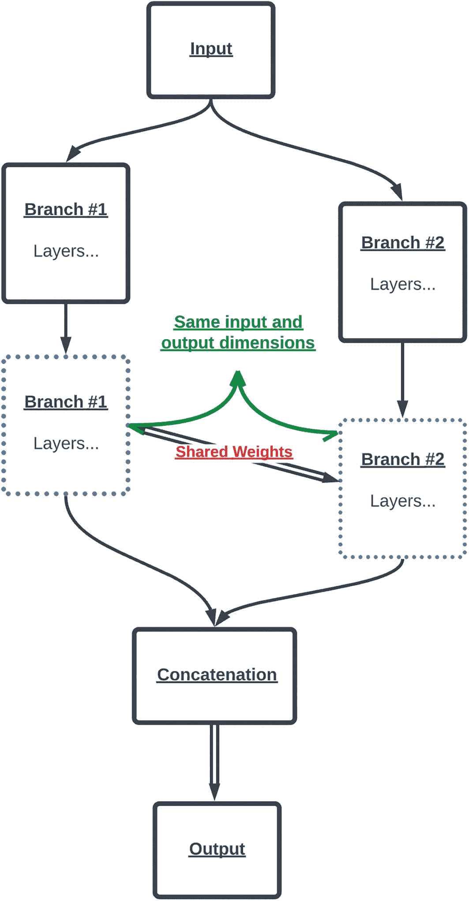

非线性拓扑网络的流程图：输入、第一和第二分支的层、连接和输出。

图 3-40

权重共享直觉

它确实做了它听起来像的事情：在不同形状的同一层之间共享权重。通过这样做，两个单独层中的权重集是相同的，这意味着反向传播只需要运行一次。然而，通过减少训练时间，我们确实付出了模型灵活性的代价，因为算法需要找到适合两个层的同一组权重。但请注意，通过这样做，我们引入了正则化到模型中，这可能会提高验证性能。

使用 Keras 功能 API，我们可以创建一个我们想要共享权重并分配给变量的单层。以下是一个基本权重共享的示例，并在图 3-41 中展示了绘制的模型架构。以下构建的示例模型是一个多输入模型，在合并之前在两个不同的分支中共享相同的层权重。一个需要注意的重要点是，使用相同共享层的上一层的输入维度必须相同。

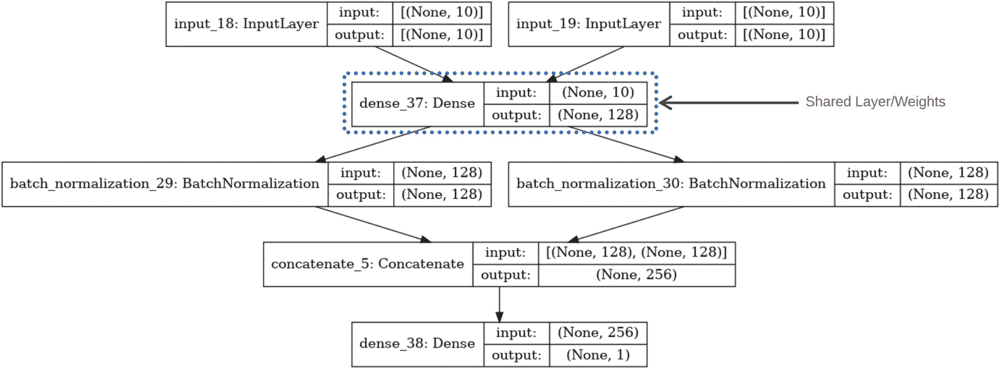

流程图描述了从输入 18 和 19 到密集层 38 的权重共享模型的步骤，以及它们的输入和输出值。

图 3-41

权重共享模型架构

```py
# example data
X_share_a = np.zeros((100, 10))
# same shape
X_share_b = np.ones((100, 10))
y_share = np.zeros((100, ))
# create shared layer
shared_layer = L.Dense(128, activation="swish")
inp1 = L.Input((10, ))
x = shared_layer(inp1)
x = L.BatchNormalization()(x)
inp2 = L.Input((10, ))
y = shared_layer(inp2)
y = L.BatchNormalization()(y)
out = L.Concatenate()([x, y])
out = L.Dense(1)(out)
shared_model = Model(inputs=[inp1, inp2], outputs=out)
Listing 3-38
Weight sharing example
```

## 通用逼近定理

George Cybenko 在 1989 年版的《控制、信号与系统数学》期刊上发表了论文“通过 Sigmoid 函数的叠加近似”^(3)。这篇论文提出了通用逼近定理的理论基础，随后大量扩展和推广的工作都建立在这个基础上。从根本上讲，Cybenko 的论文和通用逼近定理阐述了神经网络在理论上能够以任意精度拟合任何函数的能力，前提是神经网络足够大。

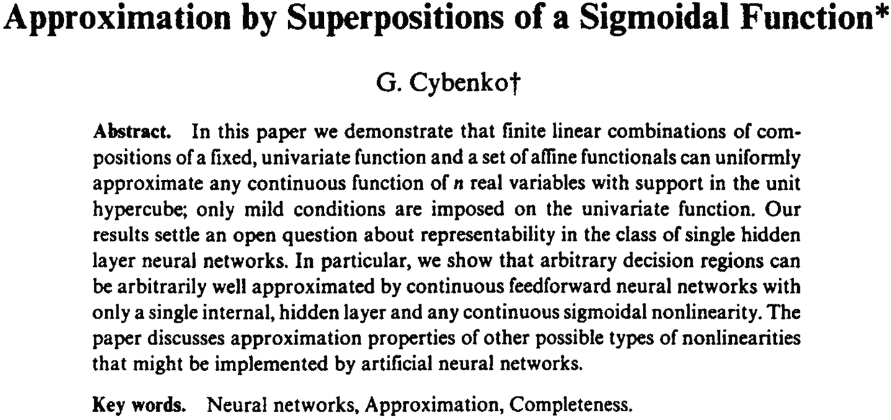

作者 Cybenko 通过叠加 Sigmoid 函数的近似表示了抽象和三个关键词。

图 3-42

Cybenko 原始论文的标题和摘要

Cybenko 的论文将一个函数视为“Sigmoid”的，如果当其参数趋近于无穷大时接近 1，而当其参数趋近于负无穷大时接近 0。请注意，“标准”的 Sigmoid 函数 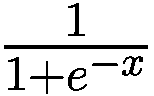 满足这个性质，但其他函数也满足，例如缩放的双曲正切(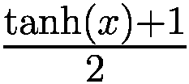)和 Heaviside 阶跃函数(*x* = 0 if *x* < 0, else 1)。Cybenko 主要关注那些在根本允许参数操纵接近两个“二元”状态的激活函数。在这些条件下，一个具有足够多神经元的单隐藏层神经网络可以证明能够近似任意函数。在这种情况下，我们可以将网络解释为 Sigmoid 函数的线性组合。

随后，对于 ReLU、多层网络和其他变体等激活函数也展示了类似的结果。

Cybenko 论文中概述的原始条件难以实现。这个神经网络有一个一维输入，一个非常大的隐藏层和一个一维输出。凭借你在 Keras 中的经验，这应该很简单实现。然而，使用这个网络获得一个功能近似是困难的。这源于证明存在一组可以近似任意函数的权重与找到一种可靠地导致发现这些权重的方方法的差异。

然而，通过两个修改可以更简单地展示通用逼近能力：使用多层网络，这比单层网络更具表现力，以及 ReLU 激活函数，它是无界的，因此在函数逼近的上下文中更容易操作和优化。列表 3-39 展示了“通用逼近定理模型生成器”的实现，它接受隐藏层的数量、每层的节点数量以及要使用的激活函数。

```py
def UAT_generator(n, layers, activation):
model = tensorflow.keras.models.Sequential()
model.add(L.Input(1,))
for i in range(layers):
model.add(L.Dense(n, activation=activation))
model.add(L.Dense(1, activation='linear'))
return model
Listing 3-39
A function to create a scalar-input scalar-output architecture with a specified number of layers, number of neurons in each layer, and activation
```

我们选择任意函数为 sin²*x* − *e*^(− cos *x*)，定义域为 [−20, 20]，这是一个高度非线性的函数（见列表 3-40，图 3-43）。

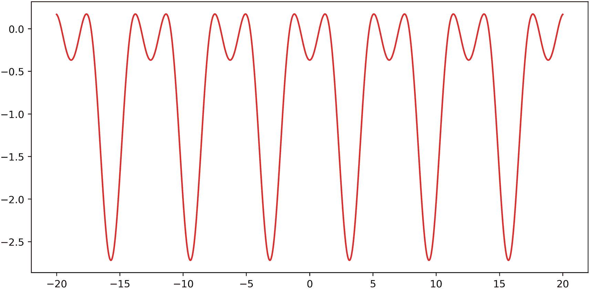

线图表示非线性函数。曲线描绘了在整个过程中以 M 形模式连续波动。

图 3-43

在定义域 [−20, 20] 内的 *sin*²*x* − *e*^(− *cos x*) 图

```py
def function(x):
return np.sin(x)**2 - np.exp(-np.cos(x))
x = np.linspace(-20, 20, 4000)
y = function(x)
plt.figure(figsize=(10, 5), dpi=400)
plt.plot(x, y, color='red')
plt.show()
Listing 3-40
Title and abstract of Cybenko’s original paper
```

图 3-44，3-45 和 3-46 展示了使用每层 1024 个节点的神经网络进行训练的拟合，分别是一层、两层和三层。注意 ReLU 激活函数的角形拟合以及随着层数和表现力的增加拟合的成功改进。

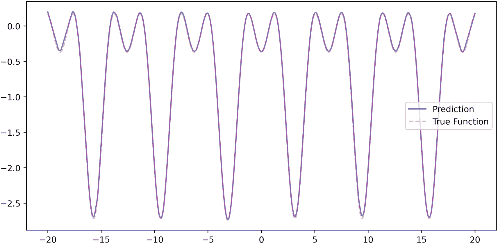

线图描述了三层拟合中预测线和真实函数的两条线段。线条以 M 形模式波动并重叠。

图 3-46

三层近完美拟合

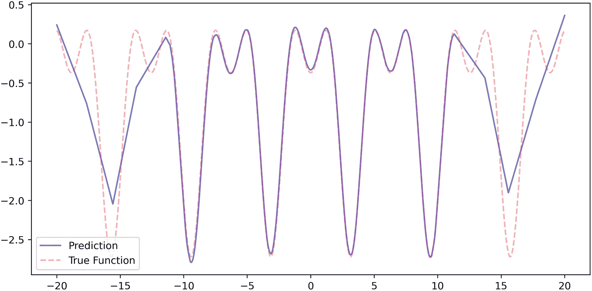

神经网络两层拟合中预测线和真实函数的两条线段的线图。预测线展示了变化。

图 3-45

两层拟合的学习结果

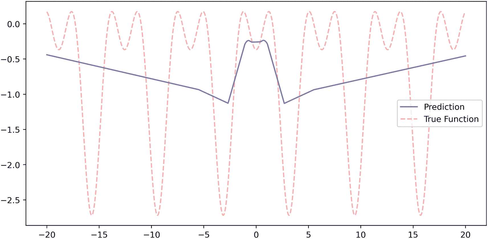

线图展示了神经网络一层拟合中预测线和真实函数的两条线段。预测线描绘了变化。

图 3-44

一层拟合的学习结果

这展示了你如何利用在构建和拟合神经网络过程中获得的技术，观察神经网络有趣的性质。

## 选定研究

我们将在未来的章节中进一步探讨更复杂模型和设计的使用。然而，仅通过这一章学习材料的人已经准备好理解和处理一系列现代表格深度学习技术，这些技术修改了前馈网络以更有效地建模表格数据。本节提供了四个选定研究论文的简要概述和实现方向。

### 简单修改以改进表格神经网络

詹姆斯·菲德勒（James Fiedler）从该领域的研究中综合了一系列相对低劳动强度的标准神经网络修改，这些修改可用于可能在 2021 年的论文“Simple Modifications to Improve Tabular Neural Networks.”中提高表格问题的性能。4 在本书的这一阶段，讨论了菲德勒论文中提出的两种可接触的修改，在此处进行展示。

#### 幽灵批量归一化

以前，批量归一化被引入作为一种有效的机制，通过标准化输入（图 3-47）来平滑损失景观并提高训练性能。然而，请注意，批量归一化对于不同的批量大小的表现不同。“泛化差距”是一个观察到的现象，其中神经网络在大型批次上训练时在验证数据上的表现不如在小型批次上训练。大型批量大大小受较大样本集的限制，所以我们预计它将“较慢”且不如使用小型批次计算出的更新那样尖锐。研究人员假设，这阻止了使用大型批量大大小和批量归一化层的模型从具有较差泛化的吸引性局部最小值中移动出来。此外，在大批次上计算批量归一化在效率上是不够的。

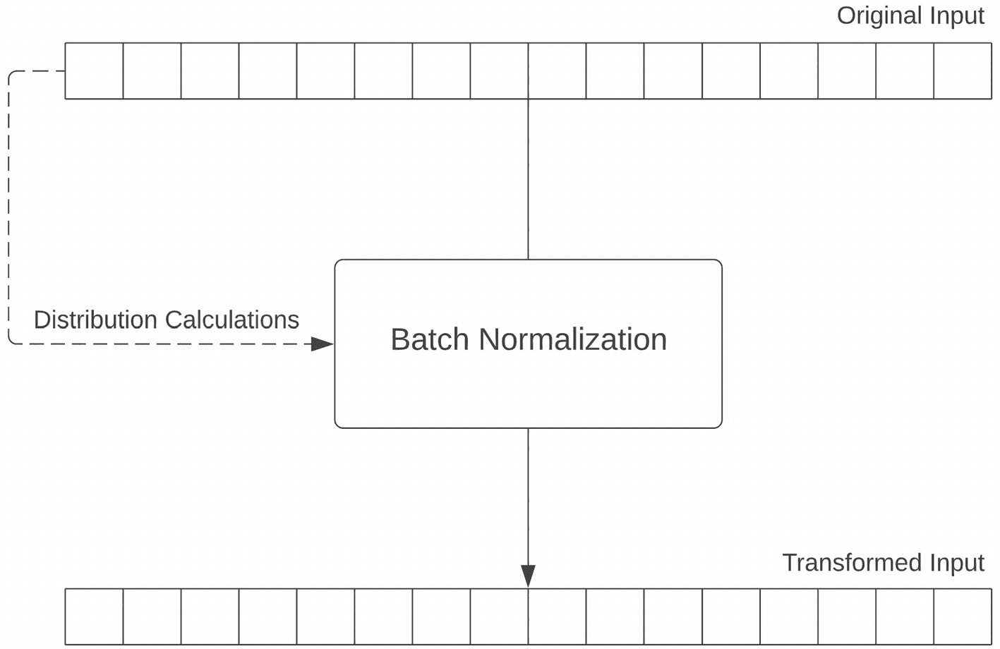

流程图列出了以下过程的步骤：原始输入、分布计算、批量归一化和转换后的输入。

图 3-47

批量归一化的示意图

为了解决这个问题，我们可以使用*幽灵批量归一化*^(5)（图 3-48）来代替批量归一化。而不是在整个批次上计算批量归一化统计量，我们将批次分成虚拟的“幽灵”批次，并在这些较小的样本组之间进行归一化计算。这允许在没有经历一般化差距问题时训练具有大批量大小的模型，即这些大批次限制了学习活动。

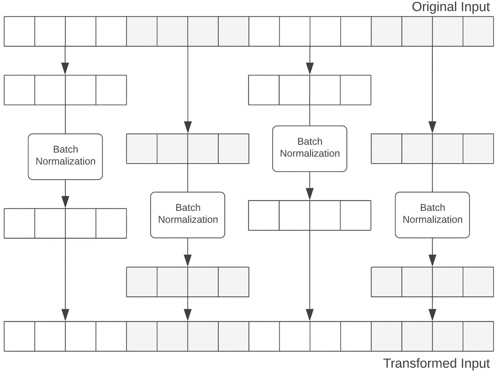

流程图列出了以下过程的步骤：原始输入、批量归一化和转换后的输入。

图 3-48

幽灵批量归一化的示意图。分布计算箭头未显示。

您可以将`virtual_batch_size`参数传递给 Keras 的`BatchNormalization`层以启用幽灵批量归一化。虚拟批量大大小必须能整除批量大大小；例如，假设批量大大小为 256，则 50 不是一个有效的虚拟批量大大小，但 32 是。

这不应与生成对抗网络论文作者使用的“虚拟批量归一化”方法混淆（参见第九章），在该方法中，单个批次的计算在整个数据集上使用以确保更大的稳定性。

#### 漏波门

泄漏门是一种简单的“门控”机制，网络学习简单的逐元素线性变换来确定每个元素是否“通过”门。向量中的每个元素乘以一个向量并加上一个偏置。如果结果值大于零，则值不变地通过；否则，返回零（或非常接近零的值）。从功能上讲，它是一个逐元素线性变换后跟一个 ReLU。对于向量输入 *x* 和表示 *x* 的第 *i* 个元素的索引 *i*，泄漏门定义为以下：

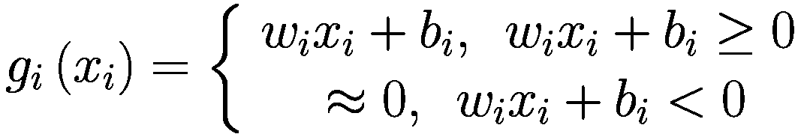

考虑以下系统：

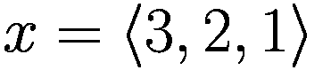

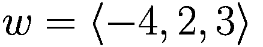

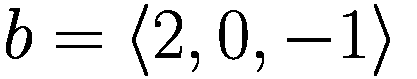

然后，我们有以下逐元素线性变换（其中 ⊗ 表示逐元素乘法，⊕ 表示逐元素加法）：

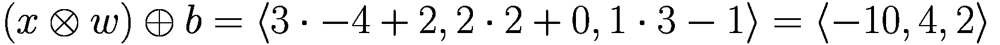

经过 ReLU 条件处理后，我们得到 ⟨0, 4, 2⟩。第一个输入没有通过，但其他两个通过了。

这种门控机制允许一种形式的显式“特征选择”，类似于基于树的模型如何选择特征子集进行推理。我们将在未来的研究论文讨论中看到更高级的神经网络特征选择类似物。

我们可以使用自定义的 Keras 层来实现一个泄漏门（见代码清单 3-41）。在 `__init__` 方法中，我们以功能 API 风格“钩”住该层与之前的层。在 `build` 方法中，我们为每个可学习的参数（权重和偏置）分别添加。`call` 方法协调层内部参数对输入的转换，在这种情况下是一个简单的逐元素乘法（我们使用广播来允许在批处理维度上进行相同的乘法）和加法。

```py
class LeakyGate(keras.layers.Layer):
def __init__(self):
super(LeakyGate, self).__init__()
def build(self, input_shape):
self.w = self.add_weight(shape=(1,input_shape[-1],),
initializer='random_normal',
trainable=True)
self.b = self.add_weight(shape=(1,input_shape[-1],),
initializer='random_normal',
trainable=True)
self.mult = keras.layers.Multiply()
def call(self, inputs):
return self.mult([inputs, self.w]) + self.b
Listing 3-41
A custom leaky gate layer
```

为了验证该层的功能，让我们构建一个简单的模型和门控任务进行训练（见代码清单 3-42）。

```py
inp = L.Input((128,))
gate = LeakyGate()
gated = gate(inp)
model = keras.models.Model(inputs=inp, outputs=gated)
x = np.random.normal(size=(512, 128))
mask = np.random.choice([0,1], size=(1, 128))
y = x * mask
model.compile(optimizer='adam', loss='mse')
model.fit(x, y, epochs=200)
Listing 3-42
Using the custom leaky gate on a synthetic task
```

可以通过 `(np.round(gate.w) == mask).all()` 验证模型精确地学习了掩码。

这种门控机制可以添加到你的网络设计中，以鼓励动态特征选择。

### 宽度和深度学习

由 Cheng 等人在论文“Wide & Deep Learning for Recommender Systems”中提出，^(6) Wide and Deep 是一种相对简单的表格型深度学习范式，尽管如此，它在许多领域都取得了非凡的成功，包括推荐系统。

“wide”模型是一个简单的线性模型（在分类的上下文中是逻辑回归，功能上是一个零隐藏层的神经网络）。此类模型的输入包括原始特征和*交叉乘积变换*，其中选定的特征相互乘积。这可以捕捉到多个列中同时发生的相关现象——例如，在一个假设的社会媒体内容数据集中，两个列“isVideo?”和“isTrending?”的交叉乘积表示样本既是视频又是趋势。计算交叉乘积变换是必要的，因为简单的线性模型无法自行开发这些中间特征。然而，即使我们添加交叉乘积特征，这些产品也无法推广到新的特征对，因为它们被硬编码为模型的输入。

另一方面，“deep”模型是一个标准的神经网络，它可以开发出有意义的嵌入表示，这些表示可以在内部组合并很好地推广到新数据。然而，当数据集本身复杂且包含许多复杂性时，深度神经网络很难学习有效的低维嵌入。

Wide and Deep 范式（图 3-49）是通过联合训练一个具有 wide 和 deep 组件的模型来取长补短。在生成的模型中，一些特征（原始和交叉乘积计算）被传递到一个“wide”线性模型，而其他特征则被传递到一个“deep”神经网络。两个模型的输出被相加以产生最终输出，由 wide 组件的推广影响和 deep 组件的特定能力共同决定。

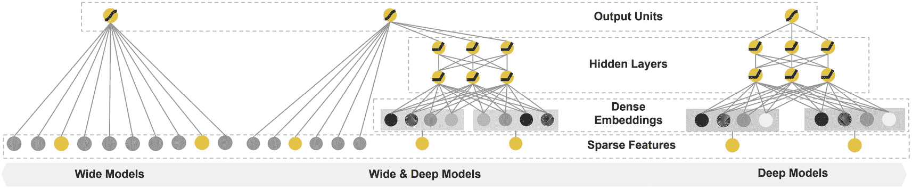

一个描绘新兴的、相互关联的 wide、wide and deep 和 deep 模型的插图显示了从输入到稀疏特征所涉及的因素。

图 3-49

将 wide 线性模型和 deep 模型合并形成 Wide and Deep 模型，来自 Cheng 等人。

让我们以 Forest Cover 数据集（列表 3-43）为例，演示 Wide and Deep 范式。在将数据集加载到 `data` 中后，我们创建了 wide 和 deep 模型的输入。有两个相关的分类特征：土壤类型和荒野区域。我们将通过将一个特征的所有 one-hot 列与另一个特征的每个 one-hot 列相乘来生成这两个特征之间的特征交叉。深度模型的输入包括所有连续输入和分类特征，这些特征将被隔离并传递到各自的嵌入层。

```py
# initiate data
wide_data = data.drop('Cover_Type', axis=1)
deep_cont_data = data[['Elevation', 'Aspect', 'Slope',
'Horizontal_Distance_To_Hydrology',
'Vertical_Distance_To_Hydrology',
'Horizontal_Distance_To_Roadways',
'Horizontal_Distance_To_Fire_Points',
'Hillshade_9am', 'Hillshade_Noon',
'Hillshade_3pm']]
deep_embed_data = {}
# obtain categorical features
soil_types = [col for col in data.columns if 'Soil_Type' in col]
wild_areas = [col for col in data.columns if 'Wilderness_Area' in col]
# cross soil types and wild areas
for soil_type in soil_types:
for wild_area in wild_areas:
crossed = wide_data[soil_type] * wide_data[wild_area]
wide_data[f'{soil_type}X{wild_area}'] = crossed
# get ordinal representations of categorical features
deep_embed_data['soil_type'] = np.argmax(data[soil_types].values, axis=1)
deep_embed_data['wild_area'] = np.argmax(data[wild_areas].values, axis=1)
Listing 3-43
Collecting the data to apply a Wide and Deep approach to the Forest Cover dataset
```

wide 模型是一个简单的线性模型（列表 3-44）。

```py
wide_inp = L.Input((len(wide_data.columns)))
wide_out = L.Dense(7)(wide_inp)
wide_model = keras.models.Model(inputs=wide_inp,
outputs=wide_out)
Listing 3-44
Constructing the wide linear model.
```

深度模型更为复杂（见清单 3-45）。我们需要创建三个输入——一个用于连续特征，一个用于土壤类型特征，一个用于荒野区域特征。这两个分类特征都通过一个 16 维度的嵌入层传递，表示每个特征中的每个唯一类别都与一个唯一的 16 维向量相关联。这些嵌入与连续特征连接，并通过一系列全连接层传递到输出。

```py
deep_inp = L.Input((len(deep_cont_data.columns)))
deep_soil_inp = L.Input((1,))
deep_soil_embed = L.Embedding(np.max(deep_embed_data['soil_type']) + 1,
16)(deep_soil_inp)
deep_wild_inp = L.Input((1,))
deep_wild_embed = L.Embedding(np.max(deep_embed_data['wild_area']) + 1,
16)(deep_wild_inp)
deep_concat = L.Concatenate()([deep_inp,
L.Flatten()(deep_soil_embed),
L.Flatten()(deep_wild_embed)])
deep_dense1 = L.Dense(32, activation='relu')(deep_concat)
deep_dense2 = L.Dense(32, activation='relu')(deep_dense1)
deep_dense3 = L.Dense(32, activation='relu')(deep_dense2)
deep_out = L.Dense(7)(deep_dense3)
deep_model = keras.models.Model(inputs={'cont_feats': deep_inp,
'soil': deep_soil_inp,
'wild': deep_wild_inp},
outputs=deep_out)
Listing 3-45
Constructing the deep model
```

我们可以使用 Keras 实验模块中提供的 `WideDeepModel` 将这两个模型结合起来（见清单 3-46）。该模型接受宽模型和深度模型，以及最终的激活函数，并允许它们联合训练。请注意，我们按照多输入模型语法将宽模型的数据和深度模型的数据一起打包在同一个列表中。

```py
from tensorflow.keras.experimental import WideDeepModel
model = WideDeepModel(wide_model, deep_model, activation='softmax')
model.compile(optimizer='adam', loss='sparse_categorical_crossentropy')
model.fit([wide_data, {'cont_feats':deep_cont_data,
'soil':deep_embed_data['soil_type'],
'wild':deep_embed_data['wild_area']}],
data['Cover_Type'] - 1,
epochs=10)
Listing 3-46
Combining a wide and a deep model into a Wide and Deep model
```

这种结合不同优势模型的组合方法可以作为通用的建模范式。查看第十一章，了解更多关于如何将不同模型组合成有效集成的方法。

参见以下使用特征交叉和其他显式特征交互建模方法的类似论文。还可以参见第六章，了解特征交互是如何被学习（而不是手动设置到数据中）的。

+   黄泰，张志，张杰 (2019)。FiBiNET：结合特征重要性和双线性特征交互进行点击率预测。*《第 13 届 ACM 推荐系统会议论文集》*。

+   Lian J.，周翔，张帆，陈子，谢晓，孙国 (2018)。xDeepFM：结合显式和隐式特征交互用于推荐系统。*《第 24 届 ACM SIGKDD 国际知识发现与数据挖掘会议论文集》*。

+   Qu Y.，Fang B.，张伟，唐瑞，刘敏，郭浩，余宇，何晓 (2019)。针对多字段分类数据的用户响应预测的产品型神经网络。*《ACM 信息系统交易（TOIS），37*，1–35*。

+   王瑞，傅博，傅刚，王明 (2017)。用于广告点击预测的深度与交叉网络。*《ADKDD'17 会议论文集》*。

+   王瑞，Shivanna R.，程大中，Jain S.，林德，Hong L.，Chi E.H. (2021). DCN V2：改进的深度与交叉网络以及面向 Web 规模学习排序系统的实用经验教训。*《2021 年网络会议论文集》*。

### 自归一化神经网络

Günter Klambauer 等人在论文“Self-Normalizing Neural Networks”中介绍了缩放指数线性单元（SELU）激活函数，作为 ReLUs 的替代方案。作者发现，在标准全连接神经网络中将 SELU 替换为 ReLU 可以显著提高大量任务上的性能。虽然论文讨论了在视觉和文本中的应用，但我们将关注建模表格数据的含义。

Klambauer 等人断言，批归一化等归一化机制会受到网络中的随机过程（如随机梯度下降和 dropout（即随机正则化））的干扰，这使得在表格数据上训练深度全连接神经网络变得困难。

一个 *自归一化* 的 *神经网络* 大约定义为，对于激活值的均值和方差随着通过网络传递的层数增加而稳定地接近/收敛到一个固定点的神经网络。例如，假设我们的理想固定点是均值为 0 和方差为 1。在以下关于九层网络中每层激活的假设均值和方差的例子中，进展 A 将是自归一化的，而进展 B 则不是：

```py
[Progression A]
Means: 2.2, 2.1, 1.8, 1.4, 0.8, 0.3, 0.2, 0.1, 0.0
Variances: 4.9, 4.5, 4.2, 3.4, 3.1, 2.9, 1.5, 1.1, 1.0
[Progression B]
Means: 2.2, 2.1, -3.4, -2.9, -4.2, -1.2, 0.4, 2.5, 1.3
Variances: 4.9, 4.5, 3.4, 2.4, 0.1, 1.6, 2.3, 2.1
```

注意这与批归一化等归一化方案的不同，在批归一化中，激活值立即（可能甚至“突然”）归一化，但并不一定在整个网络中保持这种状态。满足自归一化约束的网络可以被视为采用了一种更“可持续”的归一化轨迹。

当神经网络使用 SELU 激活时，它是自归一化的（见图 3-50）。它由以下两个参数 *λ* > 1 和 *α* > 0 定义：

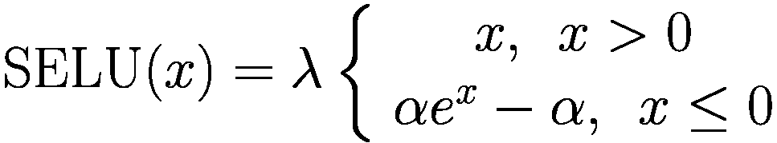

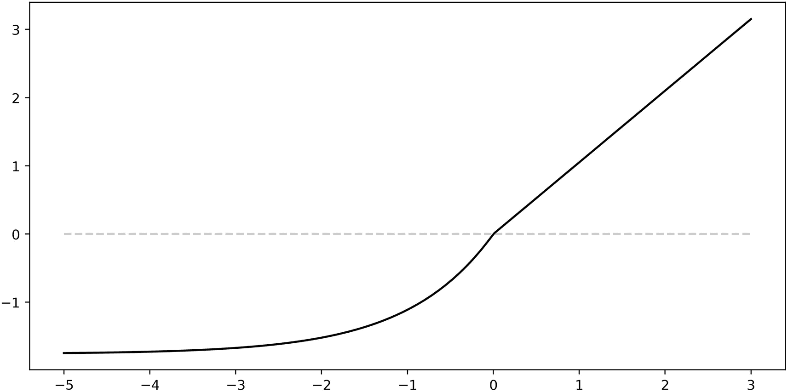

线形图表示 SELU 激活函数。曲线从原点开始，逐渐向上倾斜。

图 3-50

SELU 激活函数

此激活函数具有以下关键特性：

1.  能够表示负值和正值以控制均值，这是 ReLU 和 sigmoid 所缺乏的

1.  在导数接近零的区域（当 *x* → -∞ 时）中，如果方差太大，则减弱方差（这会将高方差输入映射到低方差激活，即“平坦的地形”）。

1.  在导数较大的区域（对于 *x* > 0，斜率大于 1）中，如果方差太小，则增加方差（这会将低方差数据映射到高方差激活，即“陡峭的地形”）

1.  一个连续的曲线，在信息在整个网络中传播时，可以微调前三个特性以实现自归一化

这些特性使 SELU 函数在整个网络中具有理论上和实践中可证明的自归一化行为。

SELU 在 Keras 中实现，任何接受激活函数的层都可以使用 `activation=’selu’`。

实验观察表明，SELU 函数的表现要么与 ReLU 相当，要么优于 ReLU；此外，当 SELU 优于 ReLU 时，它通常表现得更好（而不是略微更好）。因此，将 SELU 作为“默认”激活函数使用并不失策。

### 正则化学习网络

正则化是一种通过惩罚大权重值来对抗过拟合的技术。我们可以泛化地表达一个正则化损失 *L*[*r*]，给定 *P*，它返回在权重 *w* 和默认损失 *L*（预测标签和真实标签之间的损失）下，输入 *x* 的模型预测，如下所示：

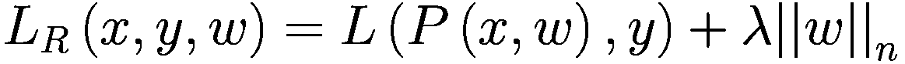

注意，双竖线符号表示权重的范数，而 *λ* 表示惩罚项相对于默认预测损失的权重。最常见的是使用 L1 或 L2 范数。

这修改了损失，使得模型可以通过更新其权重以最小化默认预测损失的方向，或者通过减小其权重的幅度来降低正则化损失。因此，权重默认是“小”的，不会对内部网络信息流产生重大影响。如果一个使用正则化损失训练的模型确实具有大权重值，那么这些权重对于预测来说非常重要，它们对默认预测损失的贡献超过了它们的幅度（由正则化项惩罚）。

我们可以将正则化惩罚项的概念化与重力对我们运动的影响相同。重力是一种始终存在的力量，它塑造了我们的运动和能量消耗方式。

在 Keras 中，用户可以将 L1 或 L2 正则化应用于给定网络层的参数和/或活动（清单 3-47）。将正则化应用于参数更常用于避免过拟合，而将正则化应用于活动（即层的输出）用于鼓励稀疏性。请参阅第八章的“稀疏自动编码器”部分，以了解应用正则化以开发鲁棒的稀疏学习表示的示例。

```py
from keras import regularizers as R
dense = L.Dense(32,
kernel_regularizer = R.L1(),
activity_regularizer = R.L2())
Listing 3-47
Using regularization in Keras
```

这些正则化器在层的所有权重上应用统一的惩罚强度（这种惩罚强度为 *λ*）。换句话说，它“同样推动所有权重向下”。这对于同质输入数据形式，如图像和文本，其中每个特征都位于与其他特征相同的可能值范围内，是有效的。然而，表格数据通常由异质数据组成，其中特征在许多不同的尺度上操作。因此，在所有权重上应用相同的权重是不合理的。

Ira Shavitt 和 Eran Segal 在 2018 年的论文“Regularization Learning Networks: Deep Learning for Tabular Datasets”中提出了**正则化学习网络**，该论文通过为每个权重学习不同的惩罚强度来解决这个问题。为了有效地优化单个 *λ*-值，需要使用基于梯度的方法；然而，*λ*-值和损失函数之间没有清晰的可微关系，就像权重和损失函数之间那样。*λ*-值不会直接影响模型的预测；它们影响权重的学习方式。因此，*λ*-值通过**时间**（即通过时间）实施变化。

利用这一点，Shavitt 和 Segal 提出了**反事实损失**，这是网络使用当前集合的 *λ*-值时将获得的损失。从这个巧妙的重新表述中，出现了 *λ*-值和未来损失之间的清晰可微关系。而不是使用增加模型损失的惩罚项，模型更新分为两个步骤：更新惩罚强度 *λ* 以最小化反事实损失，然后更新权重本身以最小化默认预测损失（见图 3-51）。

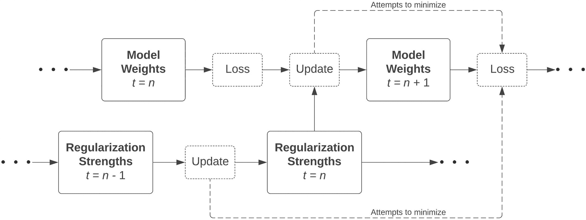

图表表示了最小化模型权重和正则化强度更新和损失的尝试。

图 3-51

近似示意图，说明可以通过优化使用给定模型权重更新的模型所造成的损失来优化正则化惩罚强度，同时优化模型权重本身。

正则化学习网络（RLNs）作为 Keras 回调实现（见列表 3-48）。

```py
!wget -O rln.py https://raw.githubusercontent.com/irashavitt/regularization_learning_networks/master/Implementations/Keras_implementation.py
import rln
import importlib
importlib.reload(rln)
from rln import RLNCallback
Listing 3-48
Importing the RLN callback by pulling directly from GitHub from a Jupyter Notebooks cell. Pulling from git also works
```

要使用回调，只需将正则化层传递给回调构造函数，并将回调函数传递给 `.fit` 函数（见列表 3-49）。

```py
from keras import regularizers as R
NUM_LAYERS = 4
inp = L.Input((X.shape[-1],))
x = inp
for i in range(NUM_LAYERS):
x = L.Dense(32, activation='selu',
kernel_regularizer=R.L1())(x)
out = L.Dense(7, activation='softmax')(x)
model = keras.models.Model(inputs=inp, outputs=out)
callbacks = [RLNCallback(model.layers[i]) for i in range(1, 1 + NUM_LAYERS)]
model.compile(optimizer='adam', loss='sparse_categorical_crossentropy')
model.fit(X, y, epochs=10, callbacks=callbacks)
Listing 3-49
Training a model with optimizer regularization parameters
```

在异构数据集上应用正则化学习效果良好，因为这些数据集可能因为某种原因而过度拟合（与数据集大小相比，网络过度参数化，数据集不太复杂等）。

## 关键点

在本章中，详细讨论了神经网络的理论和基础，它们在表格数据中的应用，以及 Keras 的使用，并进行了视觉解释。

+   神经网络是由众多神经元连接而成的机器学习模型，每个神经元都分配了一个可训练的权重和偏置。在人工神经网络（ANN）中，每个神经元都与前一层和后一层的每个神经元相连。

    +   前馈操作是进行预测所必需的，也涉及反向传播。它以向量的形式接收数据，当同时处理多个样本时，则以矩阵的形式处理。随着数据通过输入层传递，与相关神经元进行乘法和加法运算的结果传递到下一层的每个神经元。这个过程一直持续到数据达到输出层。为了效率和简洁，计算是通过点积完成的。产生的输出被视为预测或反向传播过程中的中间步骤。

    +   反向传播是神经网络学习的核心；它使用梯度下降来调整网络中的每个参数。在训练之前，网络通常使用随机权重或根据某些权重初始化算法进行初始化。然后，数据，通常由用户指定的参数分批处理，通过网络生成初始预测。成本函数作为梯度下降算法试图优化的目标或任务。成本函数中的参数数量与网络中的参数数量相同，因为任何这些值的改变都会影响最终的代价或损失值。然后，对网络中的每个参数取成本函数的导数，或者通过反向传播到输入层来计算成本函数的梯度。参数更新规则由使用的优化器确定。与 NAG 和加速等梯度下降相关算法相比，具有稳定性能，但训练速度较慢。相反，现代优化器如 Adam 具有快速收敛性，但在大模型上使用时，训练结果可能不稳定。

+   基于 TensorFlow 构建的 Keras 高级 API 是一个常用的框架或库，用于使用易于理解的语法构建神经网络。Keras 的一个缺点是，与 PyTorch 等竞争对手相比，它对实际训练过程的底层控制较少。但在大多数情况下，Keras 提供的功能已经足够。

    +   构建神经网络最直接的方法之一是通过 Keras 的 Sequential 对象。尽管它仅限于顺序连接的层，每个层都直接连接到下一个层，没有跳过连接或分支，但错误发生的可能性较小，与功能 API 相比，代码的可读性较高。

    +   Keras 的功能 API 为神经网络架构提供了无限的可能性，从多输入到多输出模型，跳过连接和权重共享，或者所有这些的组合。通过使用功能 API，代码的可读性方面将为了复杂结构和满足任何约束条件而牺牲。层在功能上与前一层的函数相关定义，并且所有层都存储在一个变量中。

    +   神经网络中层的最常见顺序如下：密集/全连接层、激活、dropout，如果需要的话，然后是批量归一化。

    +   Keras 内置了用于监控训练进度和检索训练完成后数据的函数。回调用于在每个 epoch 监控和收集有关训练过程的信息。常用的包括`ModelCheckpoint`、`EarlyStopping`和`ReduceLROnPlateau`。通过在 fit 返回的对象上调用 history，将生成包含每个 epoch 指定指标和损失的`DataFrame`。这可以被绘制并用于分析训练的整体趋势。最后，通过使用从`keras.utils`导入的`plot_model`函数，可以生成一个显示模型架构的图表。

+   表格深度学习的研究表明，对全连接层的几种修改可以产生成功的模型。

    +   使用幽灵批量归一化而不是标准批量归一化可以提高收敛速度和性能。

    +   使用自门控机制可以实现隐式特征选择，这在某种程度上复制了基于树的逻辑。（参见第七章，关于特定的基于树/复制的深度学习模型。）

    +   合并不同深度的模型，例如“宽”线性模型和深度神经网络模型，可以允许同时利用它们各自的优势。此外，手动计算特征交叉可以为宽或深的模型提供有用的输入信号。

    +   使用 SELU 激活可以帮助自动在整个网络中归一化激活。

    +   使用权重正则化可以帮助减少过拟合，但表格网络通常由异构数据组成，对于使用通用的正则化惩罚强度来说是不合理的。正则化学习网络可以作为 Keras 训练代码中的回调，为每个权重学习最优惩罚强度。

在下一章中，你将学习关于卷积神经网络以及如何将它们有效地应用于解决计算机视觉、多模态数据和表格数据问题。
