# 5. 将循环结构应用于表格数据

> *我必须按顺序并且只按顺序来写作。*
> 
> ——安德鲁·斯科特，演员

第四章展示了卷积神经网络在图像和信号（它们的“自然”数据域）中的应用，以及通过巧妙技巧——软排序、DeepInsight 和 IGTD——在表格数据中的应用。本章将追求类似的探索路径：探索将*循环网络*（传统上应用于文本和信号等序列）应用于表格数据。

本章从讨论循环神经网络的理论开始，重点是理解循环操作的范式机制和三种主要的循环模型设计：“香草”循环神经网络（RNNs）、长短期记忆（LSTM）网络和门控循环单元（GRU）网络。然后，你将使用这些循环模型在其“自然”数据域中，有三个关键应用——文本建模、音频建模和时间序列建模。最后，类似于上一章，我们将展示多模态使用和将循环层直接应用于表格数据的方法。

尤其是最后一节可能看起来很陌生或具有争议性，就像第四章的最后一节可能看起来反直觉。我们鼓励你以开放的心态去接近它。

## 循环模型理论

在接下来的章节中，通过可视化介绍了三种不同类型的基于循环的模型及其数学理论。你将获得足够的基础知识，将理论应用于使用 Keras 中的循环模型对表格和序列数据进行建模。

### 为什么需要循环模型？

在上一章中，我们了解到标准人工神经网络在处理平坦图像数据时存在困难，因为网络可能包含大量的可训练参数。因此，卷积神经网络被引入以通过用 2D 卷积替换全连接层来缩小参数大小；这也允许网络寻找前馈网络无法识别的 2D 模式和结构。

另一种常见的表格数据类型是基于序列的数据。通常，这指的是具有特定顺序的数据集，每个样本都有一个特定的标签，表示其在数据中的位置。一个常见的例子是时间序列数据集。

假设我们被赋予了一个任务，即预测一家任意公司的股票价格随时间的变化。每个样本包含有关每天股票的各种特征，例如其最高价、最低价、开盘价和收盘价。然后，每个样本被分配一个时间戳，代表数据获取的日期。我们被要求预测下一个未来时间戳的股票开盘价（图 5-1）。

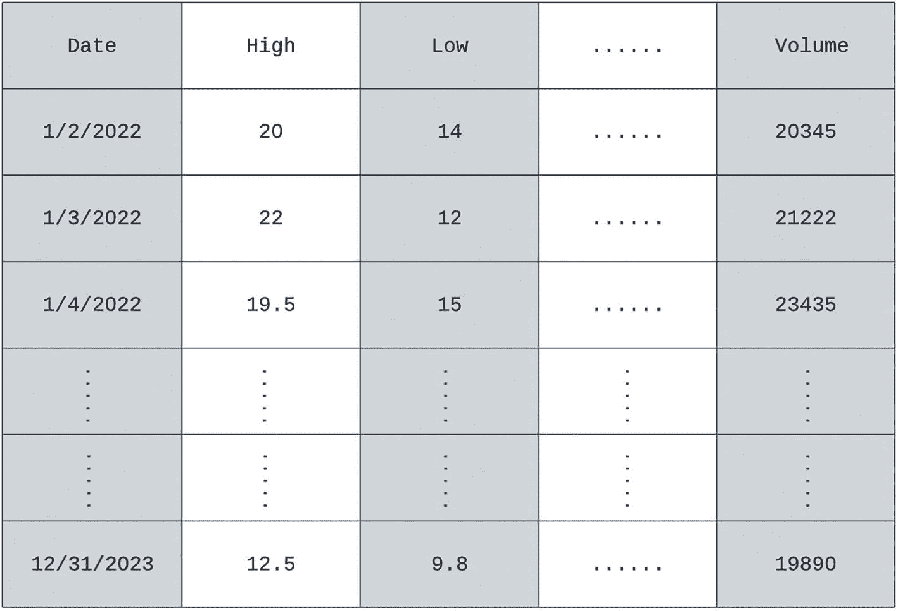

一个插图以表格形式展示了样本的详细信息。它展示了样本的日期、最高价、最低价和成交量。最高价和最低价指的是价格。

图 5-1

时间序列/顺序数据的示例

使用一个正常、全连接的网络，可能会提出以下解决方案：将下一日的开盘价作为前一天数据的目标，并删除最后一行数据（因为假设数据集按时间顺序排列，前一天的数据行不可能有目标，因为没有未来的数据点）。然后，将每一行视为一个单独的训练样本，我们可以将数据集作为回归任务传递给全连接网络。

尽管这个看似可行的解决方案似乎可以解决该问题，但以这种方式使用标准 ANN 进行时间序列预测确实会引发一些问题。当每个时间戳及其相关数据被视为一个单独的样本时，整个数据在训练或跨多个折的交叉验证过程中会被打乱。在交叉验证之前对数据集进行洗牌可以产生更稳健的结果。然而，对于时间序列数据，由于数据顺序不是任意的，洗牌可能会导致前瞻性偏差。模型在一个折中可能会看到用于训练的未来数据，用于验证的过去数据，而在另一个折中可能会看到用于训练的过去数据，用于验证的未来数据。由于时间序列数据集中样本之间的内在时间关系，未来数据点很可能会暗示过去趋势。毕竟，时间序列数据是按时间顺序排列的，每一行数据都是基于或与前面的样本相关构建的。这通常被称为前瞻性或数据泄露，导致出人意料但虚假的验证分数（图 5-2）。

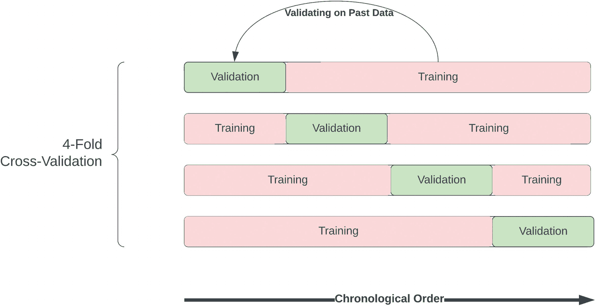

按照时间顺序对数据进行 4 折交叉验证的过程展示了验证和训练。从训练到验证的箭头表示对过去数据的验证。

图 5-2

数据泄露的示例

此外，时间序列数据通常结构化得很好，其中每个时间跨度内的新样本都会受到过去时间戳中的样本或样本的影响。仅仅从一行数据中训练和做出预测可能是不够的，因为前几行的数据可能包含对预测当前样本有价值的信 息。而不是逐个处理和对待每个样本，循环网络在当前时间戳处理每个样本的同时，还会处理从过去时间戳学习到的信号。

尽管循环神经网络（RNNs）可能最适合序列和时间相关数据，我们也可以利用其独特的结构，在表格建模任务上提高其性能，超过标准的神经网络（ANNs）。

### 循环神经元和记忆单元

RNNs 通常解决涉及序列建模或时间序列数据集预测的问题。之前提到的股票预测示例可以归类为时间序列建模。大多数文档和写作软件中的自动完成功能试图根据用户的先前行为预测用户将要输入的下一个单词。这类任务被称为序列建模。RNN 依赖于这样一个概念，即它可以获取并存储不仅来自当前样本，而且来自相对于数据集排序的先前样本的数据。

序列建模的最简单例子之一可以是字面上的序列预测。给定一个序列集，目标是根据所呈现的内容预测下一个项（见图 5-3）。

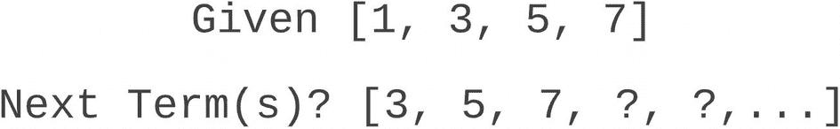

表示数据序列。给定，开括号 1，3，5，7，闭括号。下一个项（s），问号，开括号，3，5，7，问号，问号，省略号闭括号。

图 5-3

序列数据示例

对于读者来说，识别模式很简单：每个前一个项比当前项少 2。我们可以通过向当前数字添加 2 来获得下一个项。我们可以发现这个模式，因为我们有访问历史数据或当前项之前的数据或数字。RNN 在一个类似的概念上运行，利用“记忆单元”，这些单元实际上可以记住先前输入并存储用于后续预测的信息。

正常的 ANN 神经元，如图 5-4 所示，接收输入并输出与神经元相关联的权重处理后的值。

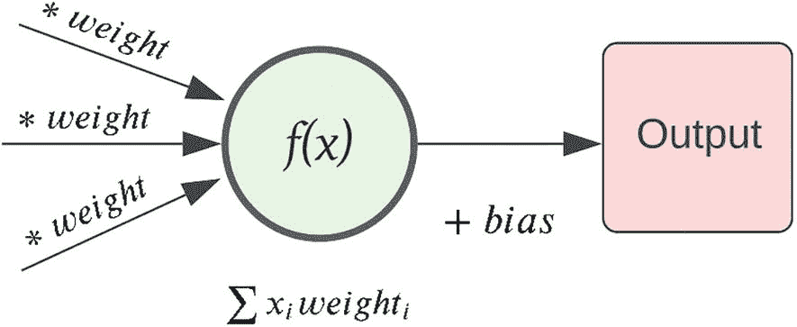

ANN 神经元的处理过程：三个相同的输入，星号权重导致 f(x)，sigma x 下标 1，权重下标 1，加上偏差产生输出。

图 5-4

ANN 神经元示例

然而，RNN 在神经元中引入了一个循环，以实现“记忆”效果，这可以在预测或训练当前样本时包括先前时间戳的数据。使用之前的例子，整个序列，从元素 0 到 4，将被作为序列输入到网络中。第一个元素被处理，并产生一个输出。由于没有先前的时戳，模型可以基于其预测，计算和过程将与标准 ANN 相同。接下来，第二个元素将被传递到同一个神经元，保留其从先前元素传递中的状态（这意味着参数没有被更新）。第一个元素的输出将与第二个元素一起输入。合理地，第三个元素将与第二个元素的预测或输出一起输入，该预测是基于第一个元素的输出。在某种程度上，循环过程模仿了一个连接每个元素在过去时间戳中的影响的链条（见图 5-5）。

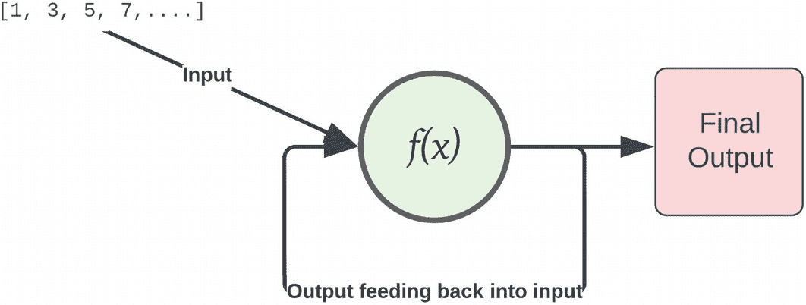

循环神经元的过程：输入开括号，1, 3, 5, 7, 省略号闭括号导致 f(x)，输出反馈到输入并产生最终输出。

图 5-5

循环神经元示例

一旦神经元达到最后一个元素，为下一个未知项做出最终预测时，不仅会给出当前时间戳的样本，还会给出所有过去时间戳影响的聚合。

为了更直观地表示，我们可以尝试将循环神经元“展开”为多个在单个神经元上进行的聚合或计算的链接（图 5-6）。

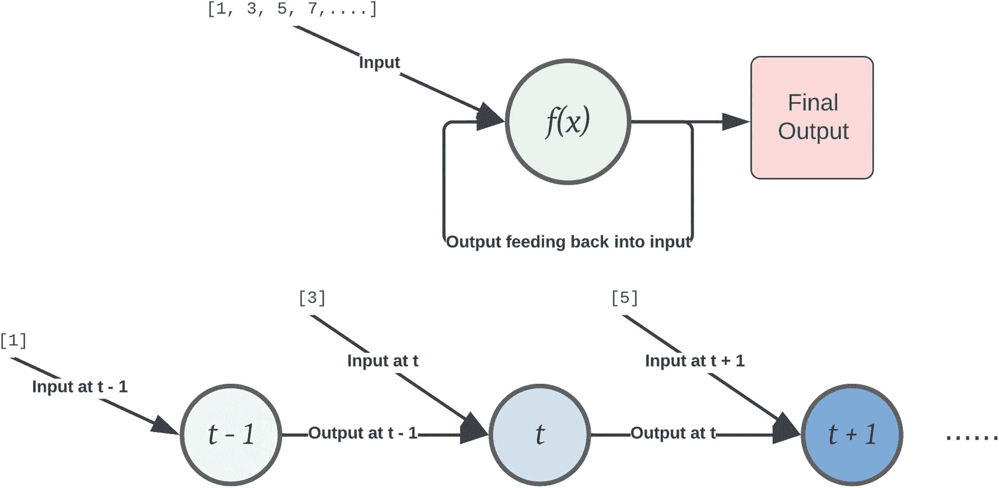

2 张图像。第一张图像。输入开括号 1, 3, 5, 7, 省略号闭括号导致 f(x) 输出反馈到输入并产生最终输出。第二张图像。输入 t 减 1 和 t 减 1 的输出导致 t 的输入。t 的输入和 t 的输出导致 t 加 1 的输入。

图 5-6

“展开”的循环神经元示例

我们将当前时间戳表示为 *t*，前一个时间戳表示为 *t* − 1，下一个时间戳（模型需要预测的项）表示为 *t* + 1。当项的序列被输入到模型中时，时间戳为 *t* − 1 的项被输入，并从中产生一个输出。然后，将时间戳为 t 的项和来自 *t* − 1 的输出聚合到同一个神经元中。我们在这里模糊地使用“聚合”这个词，但如何“结合”当前时间戳的隐藏状态和输入的细节将在下一节中解释。使用 *t* 的特征和来自项 *t* − 1 的记忆计算出的输出将成为序列中下一个项的最终预测。对于具有超过两个项的序列，这个过程以相同的方式继续。

通过利用循环预测序列的“记忆神经元”或“记忆单元”的想法可以很容易地扩展到由多个这样的“记忆单元”堆叠的层（图 5-7）。

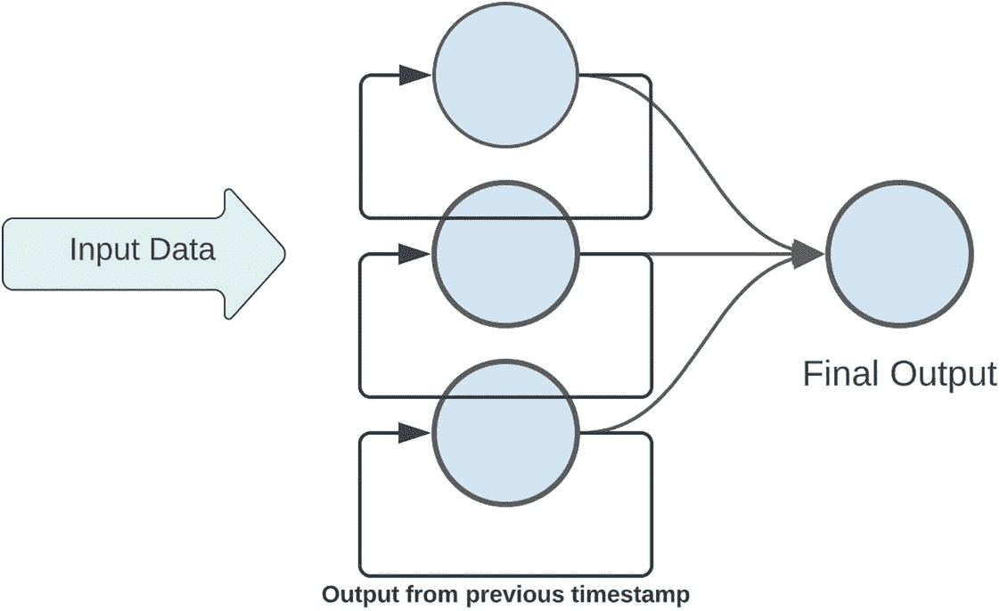

一幅插图展示了循环神经元的过程。输入数据通过前一个时间戳的三层输出，并产生最终输出。

图 5-7

层中的循环神经元

这些工作方式与单个神经元相同；而不是一个输出，来自前一个时间戳的层输出被传递回层，并与后续输入一起。

RNN 中的前馈操作与之前展示的完全相同，因为做出预测需要通过网络的前向传递。然而，RNN 中的反向传播与标准的 ANN 反向传播略有不同，因为多个输入和输出通过一个保持相同参数的神经元进行处理。

注意

为了明确术语，模型根据前一个时间戳输出的“记忆”通常被称为循环神经元的“隐藏状态”或“记忆单元”。

#### 时间回溯（BPTT）和梯度消失

如其名所示，时间回溯（Backpropagation Through Time，简称 BPTT）是处理序列数据（如时间序列）的 RNN 的回传算法。由于 RNN 中不同时间戳内的数据没有被考虑，因此 RNN 不能适应标准的 ANN 回传算法。BPTT 不仅根据当前时间戳的影响调整参数，还考虑了时间戳之前发生的事情。记住，在当前时间戳计算得出的输出（无论是新的隐藏状态还是最终输出）并不完全依赖于过去的结果；当时的新特征也被输入到模型中。因此，BPTT 只部分考虑了过去隐藏状态对最终输出的“影响”。考虑图 5-8 中展开的 RNN 神经元的以下表示。为了简化问题，模型的任务是根据一系列序列预测一个输出，这通常被称为多对一预测任务。

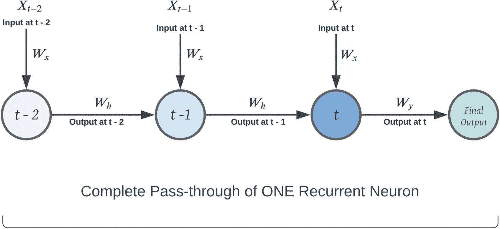

三个项 X 的下标 t 减 2，X 的下标 t 减 1，和 X 的下标 t，分别表示 t 减 2，t 减 1，t 和通过不同输入得到的最终输出。

图 5-8

展开的 RNN 神经元，输入为一个包含三个项的序列

循环神经元的隐藏状态由两个因素决定：上一个时间戳的输出（隐藏状态）和当前时间戳的输入。每个输入都与一个不同的权重矩阵相关联。我们可以将分配给当前时间戳输入的权重表示为 *W*[*x*]，将处理隐藏状态的权重表示为 *W*[*h*]。隐藏状态和 *X*[*t* − *n*] 之间的聚合由以下方程定义：*h*[*t* − 1] = *σ*(*W*[*x*]*X*[*t* − 1] + *W*[*h*]*h*[*t* − 2])，其中 *h* 代表聚合产生的隐藏状态，*σ* 是激活函数。为了解释的简洁性，后续计算中会忽略激活函数。最终输出可以通过以下公式计算：Predictions = *Y* = *σ*(*W*[*y*]*h*[*t*]) 。

假设序列有三个总时间戳，*t* − 2，*t* − 1，和 *t*，如图 5-8 所示。反向传播计算损失函数相对于网络中所有参数的梯度，或者在我们的例子中，是所有循环神经元的参数。在多对一序列预测任务中，通常只计算最后一个时间戳的损失，而不是为每个时间戳单独计算损失。将损失/成本函数表示为 *L*，其中对于每个神经元，损失是在所有时间戳上累积的：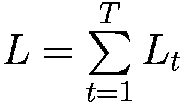。

对 *W*[*y*] 进行微分是直接的，因为改变它的值只会影响最终输出：这个微分与循环神经元之前交织的循环无关。其微分如下：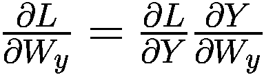。在这里，*Y* 代表最终输出。

由于它们的影响跨越整个序列范围，*W*[*h*] 和 *W*[*x*] 会变得复杂。我们不仅要考虑当前时间戳的变化，还要考虑之前时间戳发生的变化。考虑以下图表，其中为了清晰起见，从图中截断了输入及其权重（图 5-9）。

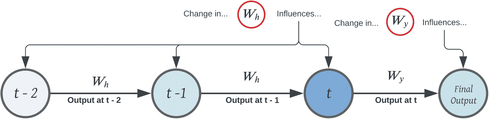

无输入的展开 RNN 过程。输出 t 减 2，t 减 1 和 t 是通过影响 W 下标 h 计算的，最终输出是通过 W 下标 y 影响。

图 5-9

展开 RNN，不包括输入

回想第三章，为了“汇总”一个参数对所有的影响，我们需要找到如果我们要微分的参数发生变化时受影响的值。对于一个普通的 ANN，*W*[*h*] 的反向传播过程如下：

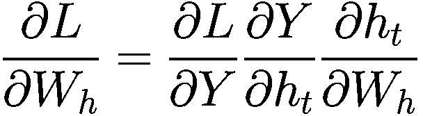

但请记住，改变 *W*[*h*] 的值不仅会改变当前隐藏状态的值，还会改变所有之前的“隐藏状态”或时间戳。因此，我们可以对损失函数对之前的隐藏状态进行部分微分。对于 *t* − 1 的微分是

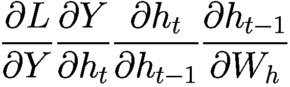

类似地，对于时间戳 *t* − 2，微分将是以下内容：

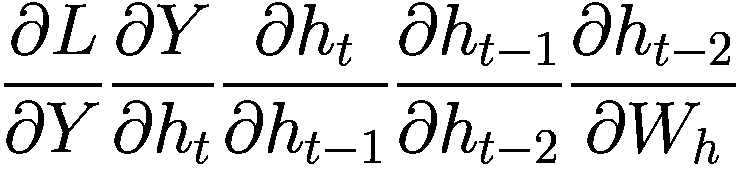

最后，将这些加起来以“累加”权重*W*[*h*]对神经元的影响：

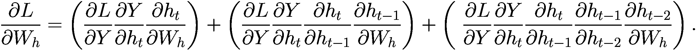

前面的公式可以推广到任何以任何序列长度为输入的神经元，并且可以紧凑地写成


其中，项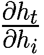等于所有相邻时间戳的乘积：

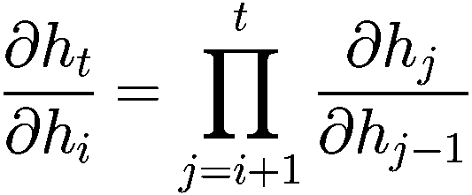

对*W*[*x*]的微分与*W*[*h*]相同，因为改变参数*W*[*x*]会影响*W*[*h*]改变时影响的全部值。只需在公式中替换*W*[*h*]项，我们就可以获得*W*[*x*]的微分规则：

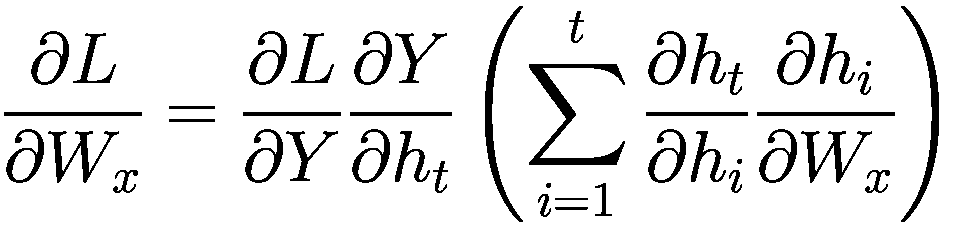

在许多到许多预测任务（图 5-10）的情况下，反向传播的过程略有不同。不是在最终时间戳之后检索损失，而是对于每个输出，损失被单独计算到那个时间戳。同样的概念也适用于微分：我们只对当前输出的时间戳进行微分，并且针对该输出计算特定的损失。然后对每个输出“分支”重复这些步骤。

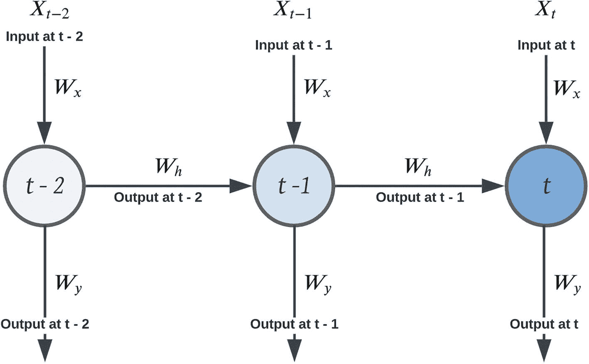

三个术语，X 的下标 t 减 2，X 的下标 t 减 1 和 X 的下标 t，包含带有权重 W 的下标 x 的输入，通过权重 W 的下标 h 产生带有权重 W 的下标 y 的输出，并通过权重 W 的下标 h 导致每个术语。

图 5-10

在“展开”的 RNN 神经元中表示的“多对多”预测任务

由于梯度消失，标准的 RNN 架构和神经元仅适用于相对较短的序列。在标准的 ANN 中，当网络中的层数变得太深时会发生梯度消失。在反向传播过程中，当计算导数时，我们越接近前端，梯度越小。这是因为每个参数都是反向传播过程中先前进行的更新的函数。换句话说，网络前端的参数的微小变化可能比网络后端的参数变化影响更多的值。当我们累积梯度时，乘法可能会显著降低其值，以至于当算法接近网络前端时，每个参数只会稍微更新，甚至几乎没有更新。这可能导致收敛缓慢，甚至不可能收敛。通常，对于具有大量隐藏层的网络，会实现跳过连接到架构中，如图 5-11 所示。

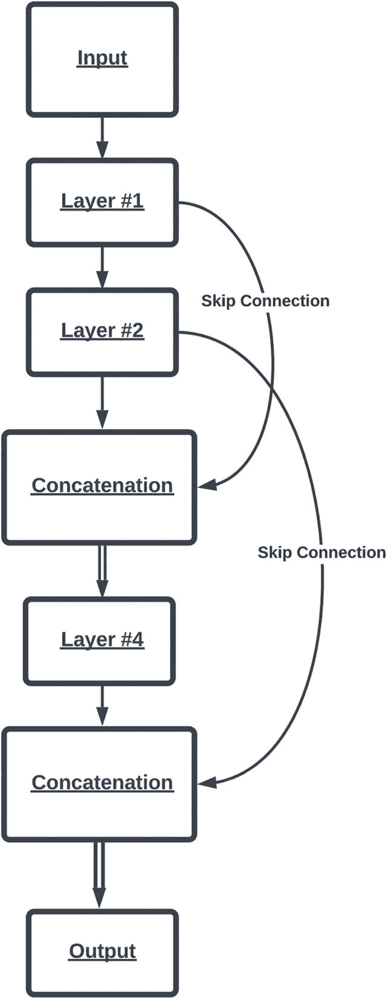

具有七个步骤的隐藏层网络。输入，层 hash 1，层 hash 2，连接，层 hash 4，连接，和输出。层 1 和 2 是跳过连接。

图 5-11

具有跳过连接的网络

跳过连接允许网络在反向传播过程中直接将梯度从后层传递到前层。本质上，跳过连接充当“运输者”，将具有更大影响的梯度传输到梯度大小极小的那些层，从而减少梯度消失的影响。在第三章节中也提到，批量归一化可以减少梯度消失和 LeakyReLU 等激活函数的影响。

然而，在 RNNs 中，梯度消失问题更为明显和严重，因为不仅隐藏层的数量会影响梯度的大小，输入序列的长度也会影响。随着序列大小的增加，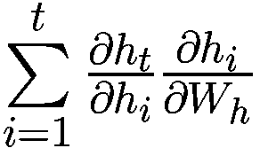 中的项数也会增加。这再次可能导致梯度变得极小。加上可能导致梯度消失的大量隐藏层，这使得使用较长序列数据训练标准的 RNN 变得极其困难，甚至不可能。

### LSTM 和梯度爆炸

长短期记忆（LSTM）网络有效地解决了这个问题，因为它们使用一个门控结构，允许它们直接访问存储在记忆单元中的数据，而不是通过每个隐藏状态回溯。LSTM 与标准 RNN 的关键区别在于，LSTM 能够保留过去信息更长时间，并且它们可以更全面地理解序列，而不是将序列中的每个值视为独立的点。此外，LSTM 在更长的时间内跟踪更大的模式；它们可以检索比简单地前一个时间戳更早的信息，因此得名“长短期记忆”。另一方面，RNN 中存储的过去信息在处理较长的序列后往往会“遗忘”，因为每一步都会丢失信息。与 RNN 相比，LSTM 通常在发现跨越长时间段的模式方面表现得更好，因为，如前所述，它们可以访问“长期记忆”——这使它们不仅基于短期数据，还可以基于长期运行中发现的总体模式进行预测。

回想一下，标准 RNN 神经元接收神经元的上一个隐藏状态以及当前时间戳的输入。然后，将这两个聚合在一起并传递给激活函数以产生下一个隐藏状态（见图 5-12）。

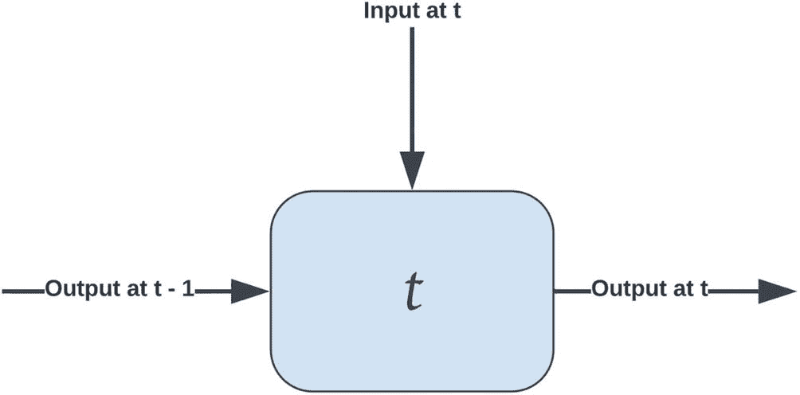

标准 RNN 神经元的流程图显示了 t-1 时刻的输出通过 t 时刻的输入，并产生 t 时刻的输出。

图 5-12

标准 RNN 神经元

然而，在 LSTM 单元中，还有一个额外的存储组件作为长期记忆——保留更早时间的信息——与隐藏状态一起被输入。图 5-13 展示了 LSTM 单元的表示。

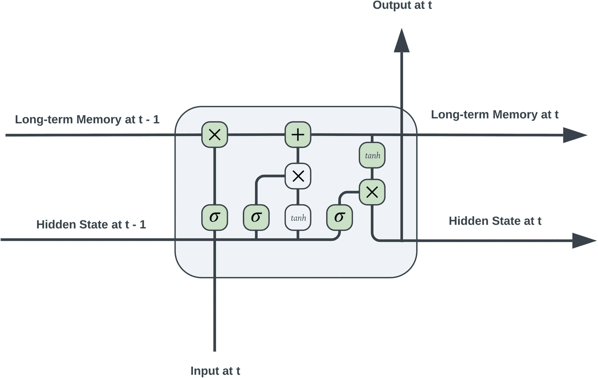

LSTM 单元的示意图。t-1 时刻的长期记忆和隐藏状态通过 t 时刻的输入，通过 t 时刻的长期记忆和隐藏状态产生 t 时刻的输出。

图 5-13

LSTM 单元

在 RNN 的上下文中，LSTM 中的“短期记忆”是神经元的隐藏状态或来自最近过去的信息。LSTM 单元由四个组件组成：遗忘门、输入门、输出门和更新门。遗忘门和更新门处理网络的“记忆”，例如决定是否忘记或替换存储在长期记忆中的信息。输入门和输出门控制输入到网络的内容和输出的内容。为了清晰起见，我们可以将长期记忆（*细胞状态*）表示为*C*，短期记忆（*隐藏状态*）表示为*h*，输入表示为*x*。

长期记忆像传送带一样贯穿整个神经元。与隐藏状态不同，它携带信息，而不会随着时间戳的推移而衰减。

LSTM 利用门来控制哪些信息将被添加到或从长期记忆的“传送带”中移除。LSTM 中的门由一个 sigmoid 层组成，该层限制了通过它们的信息量。零值表示没有信息通过，而一值表示所有信息都通过（图 5-14)。


一个表示门的插图。信息通过 sigma，在 0 小于或等于输出小于或等于 1 的条件下通过，并产生部分信息。

图 5-14

表示一个门的表示，其中允许通过的信息量由 1 到 0 之间的数字决定。

LSTM 的第一步是根据输入决定从细胞状态或长期记忆*C*[*t* − 1]中丢弃哪些信息。使用之前隐藏的状态*h*[*t* − 1]和当前时间戳的输入*x*[*t*]来训练遗忘门层*f*[*t*]（图 5-15)。

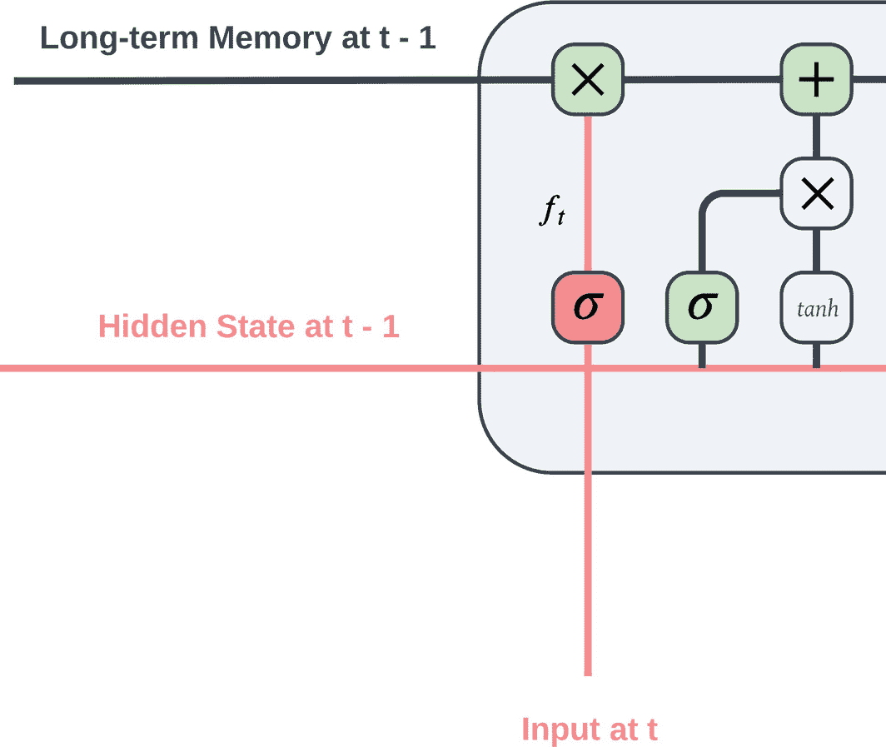

遗忘门的插图。在 t-1 时刻的长期记忆和 t-1 时刻的输入的隐藏状态通过 f 下标 t 层。

图 5-15

遗忘门和长期记忆

遗忘门输出一个介于 0 和 1 之间的值，通过 sigmoid 激活函数压缩；这些值与细胞状态相乘。直观上，接近 0 的值会告诉网络“忘记”当前细胞状态的绝大部分，反之亦然。在遗忘门层中，*h*[*t* − 1]和*x*[*t*]都与相同的权重*W*[*f*]相关联。*f*[*t*]的输出由以下方程确定：*f*[*t*] = *σ*(*W*[*f*] ∙ [*h*[*t* − 1], *x*[*t*]] + *b*[*f*])。在这里，*b*[*f*]是层的偏置。

下一步是创建新的信息以添加到长期记忆中。同样，信息量和其值是根据隐藏状态和当前时间戳的输入计算的。在产生任何新的长期记忆之前，LSTM 细胞计算将更新多少“记忆”。这是通过引入输入门（图 5-16）并使用与遗忘门相同的机制来实现的。使用方程*i*[*t*] = *σ*(*W*[*i*] ∙ [*h*[*t* − 1], *x*[*t*]] + *b*[*i*])产生介于零和一之间的值。然后生成一个可能的候选值向量，。因此，训练另一层权重和偏置以产生这些可能的“新记忆”：![$$ {\overset{\sim }{C}}_t=\mathit{\tanh}\left({W}_c\bullet \left[{h}_{t-1},{x}_c\right]+{b}_c\right) $$](img/525591_1_En_5_Chapter/525591_1_En_5_Chapter_TeX_IEq6.png)。请注意，双曲正切激活函数用于限制输出值在-1 和 1 之间。

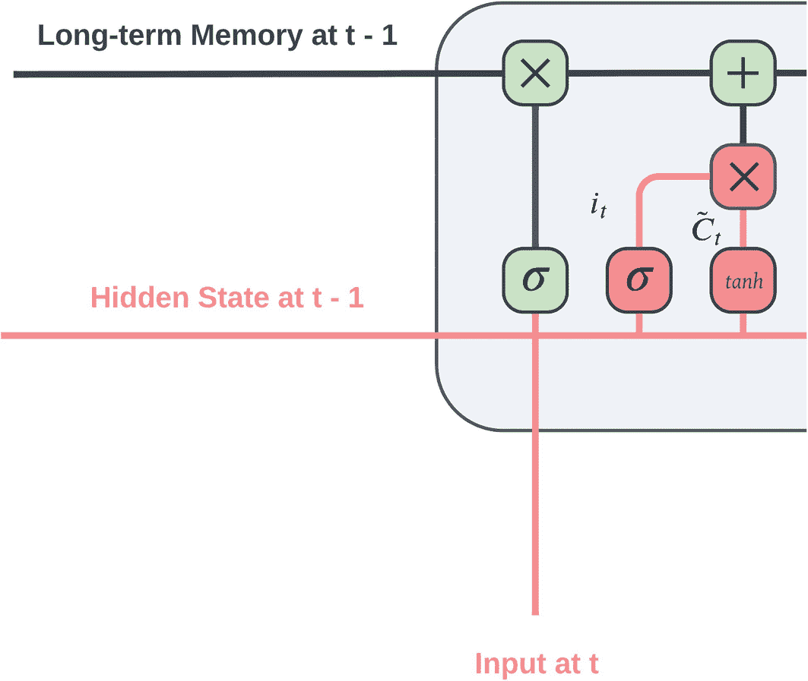

输入门的示意图。在 t-1 时刻的长期记忆和 t-1 时刻的隐藏状态通过 t 时刻的输入。输入门是 i 下标 t 和 C 无穷下标 t。

图 5-16

输入门和新的记忆

在完成创建和计算长期记忆的所有这些工作后，现在是时候将细胞状态 *C*[*t* − 1] 更新为新的细胞状态 *C*[*t*] 了。这代表了神经元的新长期记忆（图 5-17）。新的细胞状态只是我们之前计算过的项的线性组合：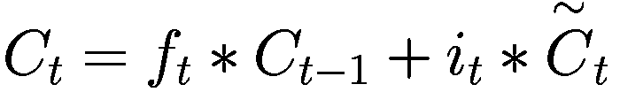 。为了更好地理解这个方程，将其视为旧记忆 *C*[*t* − 1] 和新计算的记忆  之间的加权平均，其中其权重分别是 *f*[*t*] 和 *i*[*t*]。

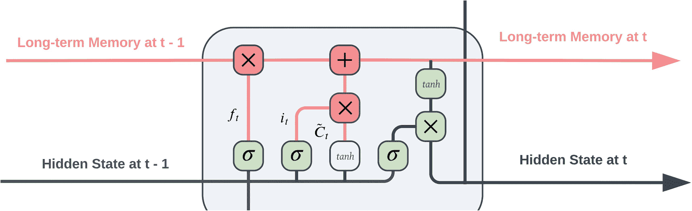

更新门的示意图。在 t-1 时刻的长期记忆和 t-1 时刻的隐藏状态通过 t 时刻的输入，产生 t 时刻的长期记忆和 t 时刻的隐藏状态。输入门是 f 下标 t，i 下标 t，和 C 无穷下标 t。

图 5-17

更新长期记忆

过程的最后一步是生成一个预测以及下一个隐藏状态（不是细胞状态，因为那已经在之前完成了）。它将基于当前更新的部分细胞状态。同样，一个门被实现来决定使用细胞状态的哪一部分进行预测，哪些被丢弃。一个输出门层在 *h*[*t* − 1] 和 *x*[*t*] 上训练，通过门使用 sigmoid 函数：*o*[*t*] = *σ*(*W*[*o*] ∙ [*h*[*t* − 1], *x*[*t*]] + *b*[*o*])。当前的细胞状态通过 tanh 激活函数，最后与输出门的结果相乘：*h*[*t*] = *o*[*t*] ∗  tanh (*C*[*t*])（图 5-18）。

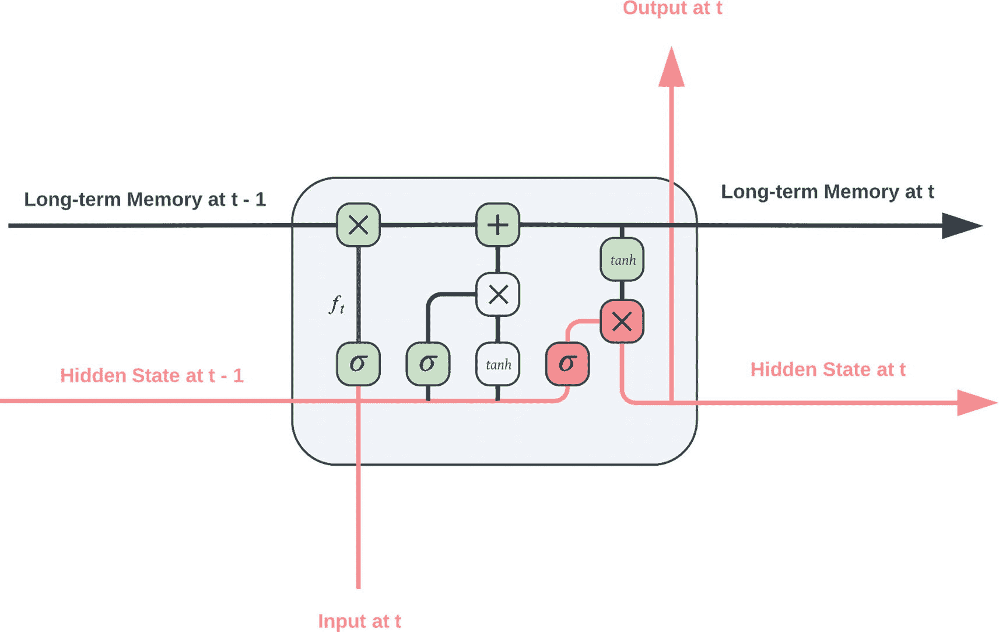

输出门的示意图。在 t-1 时刻的长期记忆和 t-1 时刻的隐藏状态通过 t 时刻的输入产生 t 时刻的长期记忆和 t 时刻的输出隐藏状态。

图 5-18

输出门和更新隐藏状态

隐藏状态 *h*[*t*] 如果序列到达其末尾，将是最终输出，但如果传入的序列未到达末尾，则是一个隐藏状态。它也可以在多对多预测任务中同时存在。

尽管 LSTMs 解决了梯度消失问题，但相反的情况也可能发生——梯度变得极其大，损失达到无穷大。由于与梯度消失问题类似的原因，梯度爆炸可以在 RNNs 和 LSTMs 中发生。通常，在梯度下降更新期间通过梯度裁剪可以可靠地解决这个问题。通过限制梯度始终在两个值之间，大梯度值永远不会导致无穷大的损失。

### 门控循环单元（GRUs）

门控循环单元，或 GRUs，是 LSTMs 的一种流行变体，它在减少各种门和层复杂性的同时，保持了 LSTMs 的性能，甚至更好。消除 GRU 中梯度消失的关键在于其更新门和重置门，它们与标准 LSTMs 的功能略有不同。LSTM 中的忘记门和输入门被合并成一个称为更新门的单个组件。接下来，重置门的作用类似于 LSTM 中对长期记忆的操作——决定要忘记哪些信息以及哪些信息被携带到下一个时间戳。图 5-19 展示了单个 GRU 的表示。

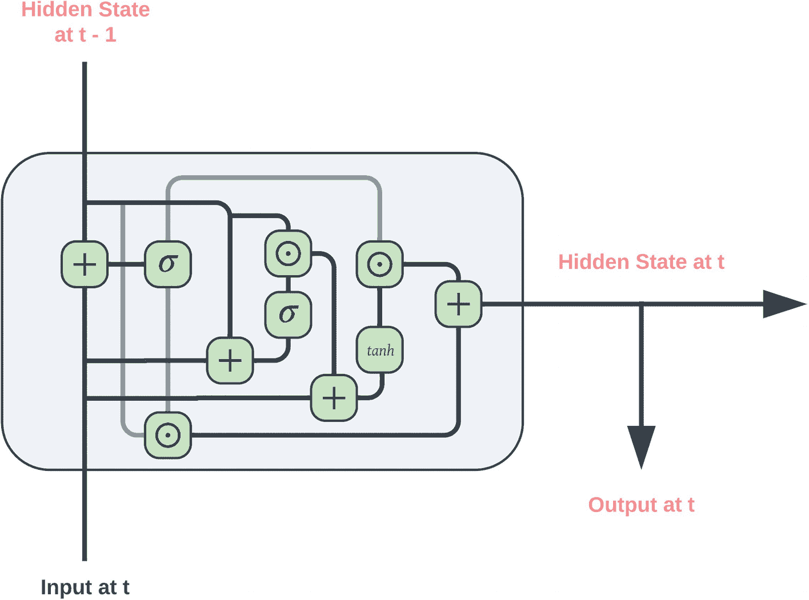

G R U 单元的示意图。t 时刻的输入在 t-1 时刻的隐藏状态下产生 t 时刻的输出隐藏状态。

图 5-19

GRU 单元的表示

进入 GRU 的是当前时间戳的输入和从上一个时间戳获得的隐藏状态。请注意，GRU 去除了 LSTM 的长期记忆部分。更新门处理网络将保留多少信息从先前的隐藏状态。与 LSTM 不同，输入和隐藏状态都乘以它们各自训练的权重。两者的结果相加，然后通过 sigmoid 激活函数：*z*[*t*] = *σ*(*W*^((*z*))*x*[*t*] + *U*^((*z*))*h*[*t* − 1])，其中*W*^((*z*))是输入*x*[*t*]的权重矩阵，*U*^((*z*))是隐藏状态*h*[*t* − 1]的权重矩阵。通过在这里实现一个门，我们可以决定保留多少信息以及传递给未来的信息量（图 5-20）。GRU 的巧妙之处在于其能够简单地携带整个信息块从过去，而不存在梯度消失的风险。

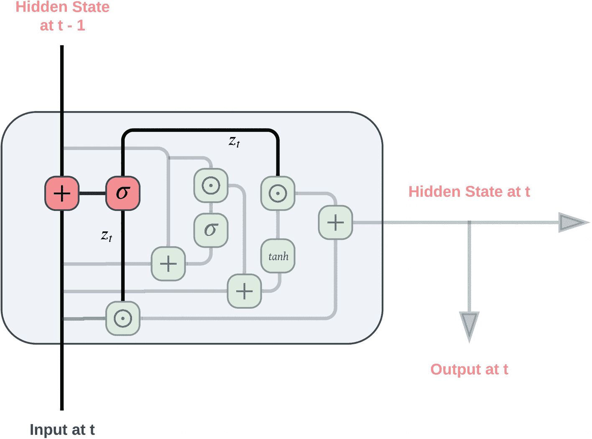

更新门的示意图。t 时刻的输入在 t-1 时刻的隐藏状态下产生 t 时刻的输出隐藏状态。

图 5-20

更新门

重置门决定要忘记多少信息。这本质上与更新门相反（见图 5-21）。重置门值 *r*[*t*] 的计算与更新门完全相同，只是训练时使用了不同的权重：*r*[*t*] = *σ*(*W*^((*r*))*x*[*t*] + *U*^((*r*))*h*[*t* − 1])。

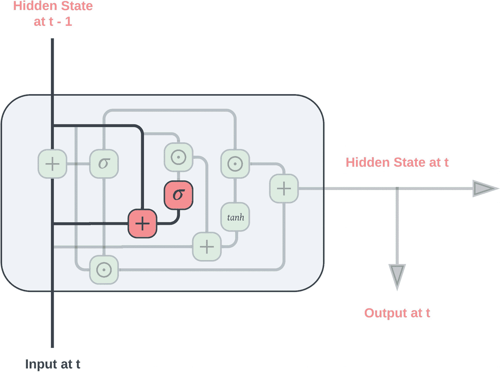

重置门的示意图。在 t 时刻输入的隐藏状态 t 减 1 生成 t 时刻输出的隐藏状态 t。

图 5-21

重置门

那就是我们在 GRU 中需要的所有门了。与 LSTM 相比，GRU 的结构和复杂性要简单得多。现在我们可以通过更新和重置门收集到的信息拼接起来，保留 *h*[*t* − 1] 的一部分，同时忘记其他部分。这创建了一个针对当前时间戳的新内存内容，它将作为计算新隐藏状态的中继结果。同样，像先前的重置和更新门一样，我们为当前时间戳的特征和从过去时间戳的隐藏状态或内存训练两组不同的权重。通过重置门值和隐藏状态之间的哈达玛积（逐元素矩阵乘法），隐藏状态的一部分被“忘记”：

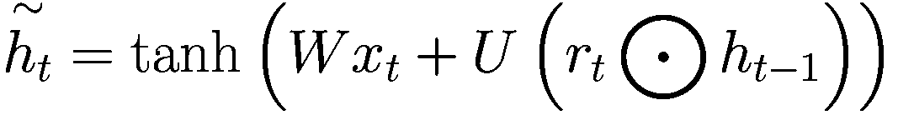

然后，*U*(*r*[*t*] ⨀ *h*[*t* − 1]) 的结果与 *Wx*[*t*] 相加，以产生 。最后，总和通过双曲正切激活函数（见图 5-22）。

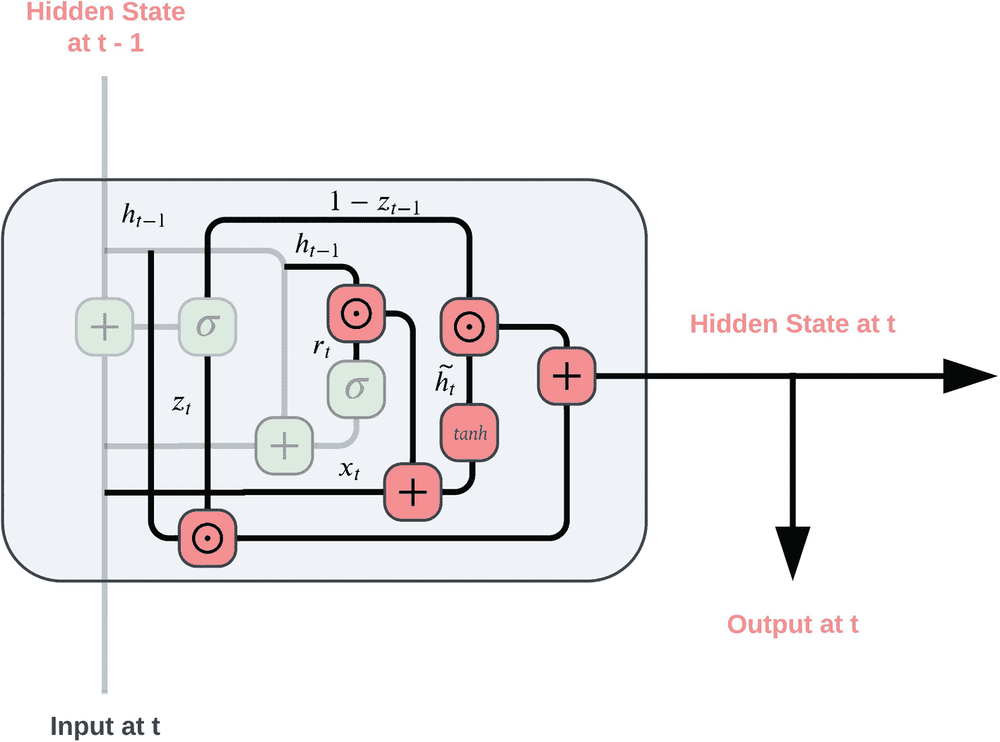

更新门的示意图。在 t 时刻输入的隐藏状态 t 减 1 生成 t 时刻输出的隐藏状态 t，通过层 z 下标 t，h 下标 t 减 1，r 下标 t，x 下标 t，以及 h 上标 ∞ 下标 t。

图 5-22

生成新隐藏状态和输出的组件

最后，模型需要计算将传递到下一个时间戳的隐藏状态 *h*[*t*]。这简单地计算为当前内存内容 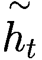 和作为输入传递的先前隐藏状态 *h*[*t* − 1] 之间的加权平均。利用训练好的更新门来决定从 *h*[*t* − 1] 中保留多少信息，我们可以将 *h*[*t*] 拼接如下：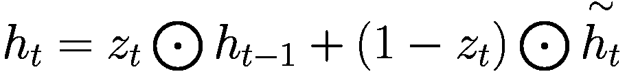.

传递到网络中的隐藏状态也充当输出。例如，在产生*h*[*t*]的最后一个时间戳时，通常应用一个非线性激活函数，然后是一个线性层，该层与输出的形状相匹配。与 LSTM 不同，没有特定的步骤来单独计算输出。在 GRU 中，隐藏状态和输出是同义的。GRU 不像 LSTM 那样提供大量的长期记忆操作。然而，由于训练复杂度的降低，在大多数情况下，GRU 的性能与 LSTM 相似，甚至在某些情况下更好。

### 双向性

标准循环层、LSTM 和 GRU 层都允许序列中的未来时刻以不同程度的有效性被先前时刻所影响，这些层在复杂度上有所不同。然而，在许多情况下，我们还想让*过去*被*未来*所影响。例如，考虑句子“John Doe – 惊慌失措且情绪激动 – 流下了喜悦的泪水。”如果我们按照标准的循环建模顺序处理这个句子，模型（直到最后一个词）会认为这个句子与悲伤、负面情绪等相关。对于最后一个词来说，要完全改变隐藏（以及如果使用 LSTM，细胞）状态的性格是非常困难的。然而，在现实中，最后一个词对我们如何解释句子的开头有着深远的影响。

为了解决这个问题，我们可以使用双向性。一个双向循环层实际上是由两个循环层组成的堆叠；一个用于正向应用，另一个用于反向应用。然后通过加法或连接将各自的隐藏状态结合起来。因此，双向循环层在任何时刻的输出都是整个序列的信息。

通常情况下，在堆叠中不需要将多个双向循环层叠加在一起。一个双向循环层通常被放置为第一个循环层，它已经根据序列的所有元素产生了序列信息，而不仅仅是它之前的时刻。我们可以在循环堆叠的后续层中以标准顺序方式继续处理产生的序列。

## Keras 中循环层的介绍

在深入研究循环建模的实际应用之前，本节简要介绍了循环和序列建模的语法。由于循环网络的特殊性质以及它们处理数据的方式，建模这些情况的语法将与表格数据模型略有不同。

根据数据类型的不同，对循环模型进行数据预处理可以有多种方式。表格数据或时间序列数据通常预处理起来更简单，而语言数据则更难处理。本节将仅涵盖围绕循环建模的主要组件，包括输入形状和循环批量大小。更高级的预处理技术将取决于具体应用。这些用法将在后续章节中演示，其中将展示循环模型在各种场景中的应用。

我们可以从时间序列数据集的最简单表示之一开始：遵循一定模式的数字列表。具体来说，我们将使用图 5-23 中显示的序列。

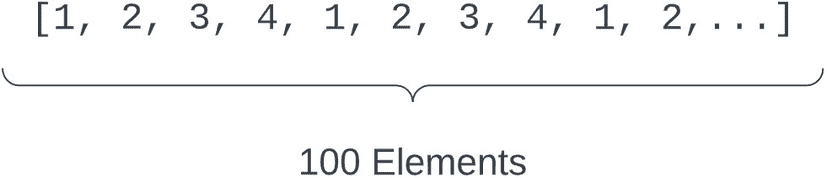

一系列数字，包含 100 个元素，描绘了 1, 2, 3, 4, 1, 2, 3, 4, 1, 2 以及省略号等模式。

图 5-23

长度为 100 的示例序列

序列中存在的模式很容易识别，因为它明显是按照顺序重复的数字 1, 2, 3 和 4。典型表格数据预测任务与时间序列预测之间的主要区别在于，在表格模型中，特征集对应于不同的一组目标，而在时间序列预测中则不是这样。在时间序列预测中，特征被分配给时间戳。在构建训练集时，基于时间戳将数据块分为过去和未来，其中过去被训练来预测未来。在时间序列预测任务中，特征和标签来自同一变量/列的数据。

在时间序列预测任务中，关于应该预测多少“标签”或应该使用多少训练数据有很多灵活性。通常没有固定的数据量来决定从数据集中划分多少训练数据。然而，一个普遍的规则是，训练数据应该足够大，以捕捉与预测未来趋势相关的任何周期性趋势。这也适用于一次批量输入网络的数据量。在我们的先前的例子中，我们可能会决定前 80 项用于训练，而最后 20 项用于测试或验证数据（图 5-24）。我们可以在模型训练期间任意决定输入 8 个数据点，同时只允许模型预测一个未来的输出。我们输入的序列长度被称为“窗口大小”。我们可以根据训练结果或领域知识修改此值以提高模型精度。

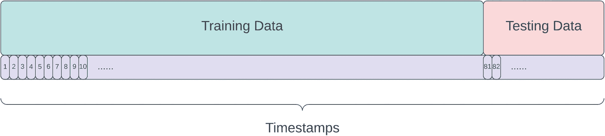

时间戳的示意图包含训练数据和测试数据。训练数据列出从 1 到 10 的数字，省略号，测试数据列出数字 81，省略号。

图 5-24

时间序列训练和测试数据的表示

使用 Keras 设置时间序列数据集有多种方法。其中一种最简单的方法是使用`TimeseriesGenerator`类。

我们可以先定义我们的前导玩具数据集为 NumPy 数组。然后，如列表 5-1 所示，从`tensorflow.keras.preprocessing.sequence`导入`TimeseriesGenerator`类。

```py
from tensorflow.keras.preprocessing.sequence import TimeseriesGenerator
example_data = np.array([1, 2, 3, 4]*25)
# 80-20 train test split
train = example_data[:80]
test = example_data[80:]
Listing 5-1
Creating the example dataset and importing TimeseriesGenerator
```

当类被实例化时，有一些重要的参数应该被设置。像任何其他机器学习模型或数据集类一样，我们需要传递特征和目标。在我们的情况下，它们将是相同的 NumPy 数组，因为我们的特征和目标来自数据的同一列。接下来，`length`参数定义了模型将用作特征以预测下一个时间戳值的样本数量。最后，`batch_size`代表每个批次的时序样本数量。通常对于像我们这样的小数据集，批大小为 1 就足够了。列表 5-2 定义了一个长度为 8、批大小为 1 的`TimeseriesGenerator`。

```py
generator = TimeseriesGenerator(train, train, length=8, batch_size=1)
Listing 5-2
Instantiating the generator
```

记住，生成器的长度将比我们的 80 个元素的训练数据少 8 个，因为最后八个值没有相应的目标。在下面的代码片段中，我们导入了对应于 RNN 层、LSTM 层和 GRU 层的 SimpleRNN、LSTM 和 GRU 层（见列表 5-3）。

```py
# we can also use L.LSTM, but these are imported
# separately for clarity
from tensorflow.keras.layers import SimpleRNN, LSTM, GRU
Listing 5-3
Importing recurrent model layers
```

我们可以先使用 Keras 功能 API 构建一个基本的 RNN 模型（见列表 5-4）。我们的数据集是一个单变量时间序列，换句话说，只有一个特征。因此，我们的输入形状将是`(length, 1)`。注意，在这里我们跳过了由批次创建的额外维度；对于`input_shape`参数来说这不是必要的。实际的输入形状将是`(batch_size, length, n_features)`。

```py
from tensorflow.keras.layers import SimpleRNN, LSTM, GRU
inp = L.Input(shape=(8, 1)) # NOT THE SAME as (8,)
x = SimpleRNN(10, input_shape=(8, 1))(inp)
# extra layer to process info before output
x = L.Dense(4)(x)
# output layer
out = L.Dense(1)(x)
model = Model(inputs=inp, outputs=out)
Listing 5-4
Code for creating a model with one SimpleRNN layer
```

默认情况下，我们使用 Adam 优化器编译模型，并采用均方误差损失函数。请注意，我们的数据集是一个生成器，而不是一个普通的 NumPy 数组。我们需要调用`fit_generator`而不是`fit`来启动训练过程（见列表 5-5）。

```py
model.fit_generator(generator, epochs=40)
Listing 5-5
Fitting the model using fit_generator
```

对于测试数据的预测，过程与标准表格模型预测略有不同。为了实现时间序列预测，我们需要使用最近的数据。更简洁地说，我们的一些未来预测将基于先前时间戳中的过去预测。以下图显示了时间序列预测背后的逻辑（见图 5-25）。

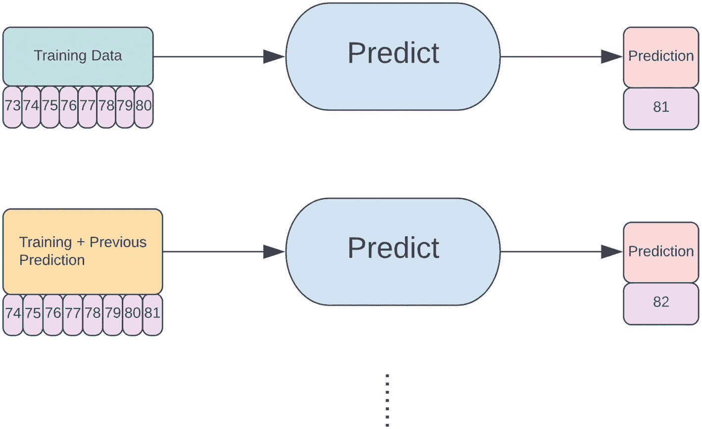

从 73 到 80 的培训数据预测 81 的预测数。加上从 74 到 81 的预测数据，预测 82 的数。

图 5-25

时间序列预测的逻辑

在我们的例子中，我们有一部分测试数据，这意味着我们可以像实例化训练数据一样创建一个生成器。然后我们可以通过将测试生成器传递给`predict_generator`来获得预测。然而，在实际预测中，我们没有“测试数据集”，它可以为我们将要预测的时间戳之前的正确值提供输入。我们的训练模型基于过去时间戳的八个值预测一个未来的值。在实际预测中，我们需要获取将要预测的样本时间戳之前的最后八个数据样本。然后，为了预测下一个样本，我们需要七个过去的数据样本以及我们刚刚预测的样本。这个过程会一直持续到我们预测了所需数量的时间戳。时间序列预测的一个缺点是，随着时间戳的推移，预测的准确性往往会降低。这是因为对远期未来的预测很可能会基于对近期未来的预测。没有模型是完美的，即使在那个时刻可能没有影响，我们的预测也可能存在微小的误差。但随着预测的继续，误差会被放大，因此对远期未来的预测可能不如预期的那样准确。

LSTM 和 GRU 层的用法类似于`SimpleRNN`；它们可以通过用 LSTM 或 GRU 替换层调用以与`SimpleRNN`相同的方式使用（见列表 5-6）。

```py
inp = L.Input(shape=(8, 1))
x = GRU(10, input_shape=(8, 1))(inp)
# extra layer to process info before output
x = L.Dense(4)(x)
# output layer
out = L.Dense(1)(x)
model_gru = Model(inputs=inp, outputs=out)
# compile and train as normal
Listing 5-6
Example of integrating GRU layers
```

此外，为了使任何循环层变为双向的，可以在层周围添加一个`keras.layers.Bidirectional`包装器。例如，以下代码创建了一个双向 LSTM 层：`x = L.Bidirectional(L.LSTM(...))(x)`。

### 返回序列和返回状态

在所有循环层中，有两个额外的参数至关重要：`return_sequences`和`return_state`。为了更好地解释，我们可以参考前一小节中图 5-26 所示的 LSTM 图。

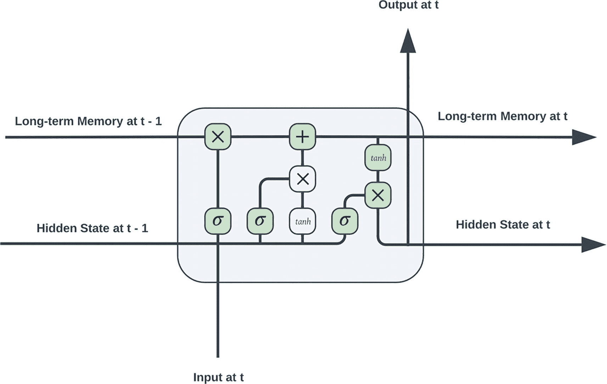

LSTM 的示意图。在 t-1 时刻的长期记忆和 t-1 时刻的输入 t 的隐藏状态，产生 t 时刻的长期记忆和 t 时刻的输出 t 的隐藏状态。

图 5-26

LSTM 的可视化表示，取自“LSTMs and Exploding Gradients”部分

默认情况下，`return_sequences`和`return_state`都设置为 false。

返回序列输出每个时间戳的所有隐藏状态。目前，在 LSTM 层的默认参数下，只有最后一个时间戳的隐藏状态作为最终输出返回。返回序列将返回“展开”的 LSTM 细胞中每个时间戳的所有隐藏状态。将此参数设置为 true 允许堆叠 LSTMs，因为它可以通过接收来自正确数据和形状格式的先前 LSTM 的结果“从之前开始”。以下代码显示了堆叠 LSTMs 以及`model.summary`，以便更清晰地理解 LSTM 输出形状（列表 5-7）。LSTM 层输出的第二个维度是存储每个时间戳的隐藏状态的地方，它作为下一个 LSTM 层的输入。

```py
inp = L.Input(shape=(8, 1))
# stacking lstms
x = LSTM(10, input_shape=(8, 1), return_sequences=True)(inp)
# no additional params needed
x = LSTM(10)(x)
x = L.Dense(4)(x)
# output layer
out = L.Dense(1)(x)
model_lstm_stack = Model(inputs=inp, outputs=out)
model_lstm_stack.summary()
Model: "model_3"
_________________________________________________________________
Layer (type)                 Output Shape              Param #
=================================================================
input_5 (InputLayer)         [(None, 8, 1)]            0
_________________________________________________________________
lstm_5 (LSTM)                (None, 8, 10)             480
_________________________________________________________________
lstm_6 (LSTM)                (None, 10)                840
_________________________________________________________________
dense_6 (Dense)              (None, 4)                 44
_________________________________________________________________
dense_7 (Dense)              (None, 1)                 5
=================================================================
Total params: 1,369
Trainable params: 1,369
Non-trainable params: 0
_________________________________________________________________
Listing 5-7
Stacking LSTMs with return_sequences set to true
```

另一方面，返回状态输出最后一个时间戳的隐藏状态，相当于输出两次，作为两个单独的 NumPy 数组。然后，长期记忆或最后一个时间戳的细胞状态也作为单独的 NumPy 数组输出。总共，通过将返回状态参数设置为 true，将输出三个单独的 NumPy 数组（对于 RNN 和 GRU 来说，因为没有细胞状态，所以是两个），对应于三个输出值。注意在`model.summary`中有三个输出形状，对应于三个输出值（列表 5-8）。

```py
inp = L.Input(shape=(8, 1))
lstm_out, hidden_state, cell_state = LSTM(10, input_shape=(8, 1), return_state=True)(inp)
x = L.Dense(4)(lstm_out)
# output layer
out = L.Dense(1)(x)
model_return_state = Model(inputs=inp, outputs=out)
model_return_state.summary()
# extra print for cell_state's shape
# since it was cut off in the summary
print(cell_state.shape)
Model: "model_5"
_________________________________________________________________
Layer (type)                 Output Shape              Param #
=================================================================
input_8 (InputLayer)         [(None, 8, 1)]            0
_________________________________________________________________
lstm_9 (LSTM)                (None, 10), (None, 10),  480
_________________________________________________________________
dense_11 (Dense)             (None, 4)                 44
_________________________________________________________________
dense_12 (Dense)             (None, 1)                 5
=================================================================
Total params: 529
Trainable params: 529
Non-trainable params: 0
_________________________________________________________________
(None, 10)
Listing 5-8
LSTM with return_state set to true
```

在复杂 RNN 操作期间，`return_sequences`和`return_state`都很有用，因为它们可以检索中间结果，也允许 RNN 堆叠。当正确使用且不堆叠过多层（因为这可能导致梯度爆炸）时，它可以非常强大。此类示例将在后续章节中演示。

## 标准循环模型应用

在本节中，我们将探讨循环模型的两个重要应用：自然语言和时间序列。回想一下，循环层可以合理地应用于大多数序列数据；自然语言和时间序列数据是沿着序列或时间轴排列的最常见数据形式之一。

### 自然语言

在本小节中，我们将考虑构建循环模型进行文本分类/回归的例子，这是一个在各种环境中常见的问题。我们将使用美国亚马逊评论数据集的软件产品评论子集（图[5-27），这是一个包含亚马逊产品评论及其相关数据的大型语料库，如星级评分、评论日期、点赞数、评论是否与验证购买相关等。我们将尝试构建一个模型，根据评论文本预测评论的星级评分。这样的模型可以用来自动提取客户满意度的数量指标，给定自然语言形式的客户输入，这可以用来衡量在自然语言可用但具体星级评分不可用的情况下（例如，社交媒体上关于产品的讨论）的客户满意度。


数据集包含亚马逊美国软件的评论和评分，以表格形式呈现。它包含三列和 11 行。列标题是数据或评论 _body 和数据或 star_rating。

图 5-27

亚马逊美国软件评论数据集

首先，我们将使用序数编码（清单 5-9，图 5-28）将数据向量化。在将序列转换为小写并删除标点符号后，每个标记都与一个整数相关联，一段文本被表示为标记的序列。为了确保所有序列长度相同，我们在末尾添加填充标记（图 5-29）。所有这些都被 TensorFlow 的`TextVectorization`层处理好了。在用我们想要的参数实例化向量化器后，我们将其适配到我们的数据集，以便它学习从标记到整数的映射。一旦适配，我们就可以在我们的文本上调用向量化器，以获得可以直接传递给我们的模型进行训练的一组张量。

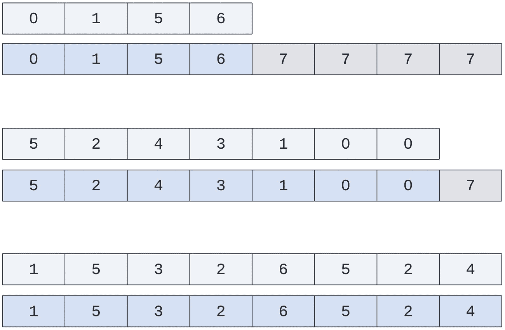

三组数据。第一组，第一行：0 1 5 6，第二行：0 1 5 6 7 7 7 7。第二组，第一行：5 2 4 3 1 0 0，第二行：5 2 4 3 1 0 0 7。第三组，第一行和第二行相同：1 5 3 2 6 5 2 4。

图 5-29

添加一个额外的标记作为填充标记，以便所有序列长度相同

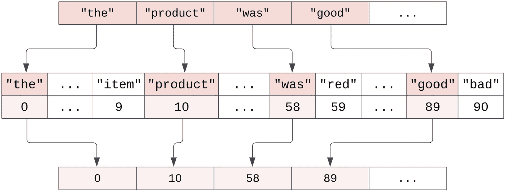

编码数据的三个步骤包含输入“the”，“product”，“was”和“good”，分别映射到整数并产生输出 0，10，58 和 89。

图 5-28

将输入中的每个标记映射到特定的整数

```py
SEQ_LEN, MAX_TOKENS = 128, 2048
From tensorflow.keras.layers import TextVectorization
vectorize = TextVectorization(max_tokens=MAX_TOKENS,
output_sequence_length=SEQ_LEN)
vectorize.adapt(data['data/review_body'])
vectorized = vectorize(data['data/review_body'])
Listing 5-9
Vectorizing the text
```

回想一下，在第二章中我们讨论了不同的数据编码方式。这里我们不需要，因为我们有可学习的嵌入。当我们构建一个自然语言模型（清单 5-10，图 5-30）时，第一步是构建嵌入层。嵌入层，如第三章和第四章中之前讨论的，学会将整数表示的单独标记与固定向量关联起来。嵌入层需要我们指定词汇表大小和嵌入维度，即每个标记将关联的向量的维度。嵌入后，数据将具有形状（SEQ_LEN，EMBEDDING_DIM）。我们可以通过一个“vanilla”循环层（keras.layers.SimpleRNN）传递 32 个循环单元。因此，输出向量将是 32 维的。我们可以通过几个密集层来处理或“解释”结果，并将其映射到 softmax 输出以进行分类。

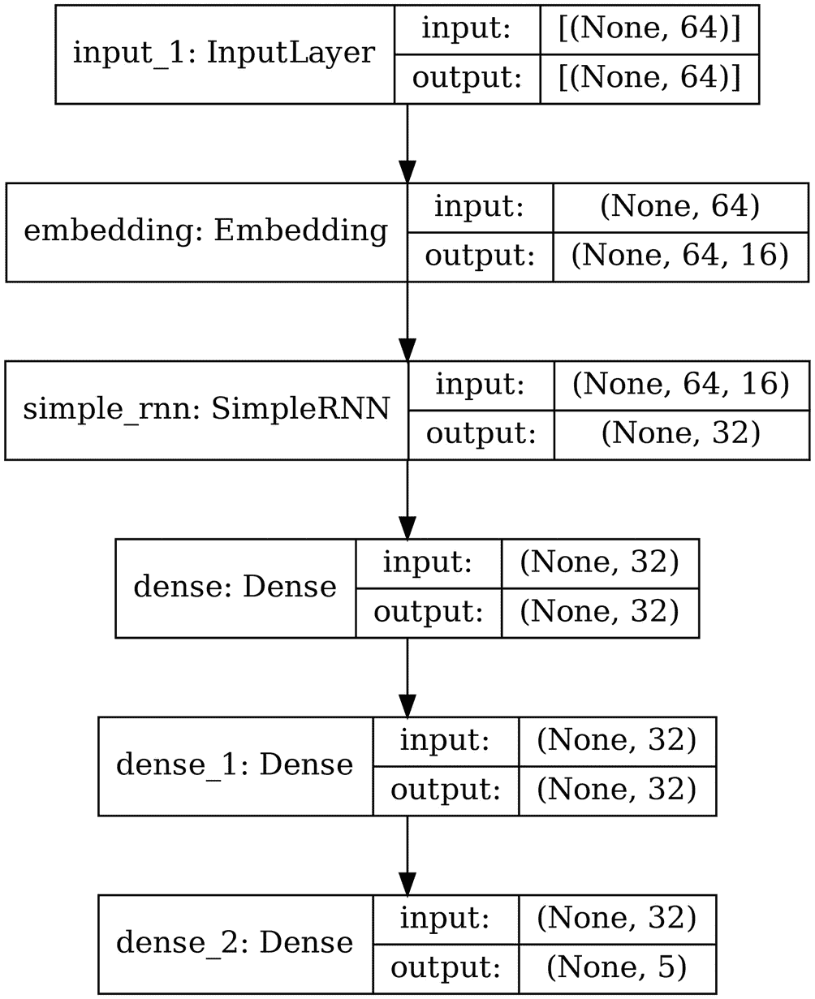

流程图如下描述了循环文本模型的输入和输出数据。输入层，嵌入，简单的 RNN，密集层，密集层 1 和密集层 2。

图 5-30

简单循环文本模型的架构

```py
SEQ_LEN, MAX_TOKENS = 64, 2048
EMBEDDING_DIM = 16
inp = L.Input((SEQ_LEN,))
embed = L.Embedding(MAX_TOKENS, EMBEDDING_DIM)(inp)
rnn = L.SimpleRNN(32)(embed)
dense = L.Dense(32, activation='relu')(rnn)
dense2 = L.Dense(32, activation='relu')(dense)
out = L.Dense(5, activation='softmax')(dense2)
model = keras.models.Model(inputs=inp, outputs=out)
Listing 5-10
Building a text model
```

为了完全清楚了解正在发生的事情，让我们追踪一个样本序列 [0, 1, 2, 3, 4] 是如何被这个模型处理的。首先，每个标记被映射到一个学习到的嵌入向量 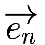（图 5-31）。这个嵌入向量包含了重要的潜在特征，这些特征在相对于待解决问题的大量维度中捕捉了每个词的意义/本质。

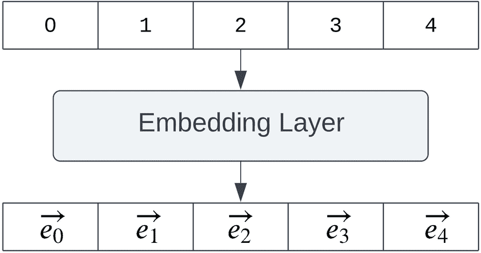

嵌入层的数据序列。0 1 2 3 4 引导嵌入层并产生向量 e_0，向量 e_1，向量 e_2，向量 e_3 和向量 e_4\。

图 5-31

序列数据的示例

然后，嵌入层中的每个嵌入向量依次由一个循环单元处理，该单元从一个初始化的隐藏状态开始，并接受第一个元素（图 5-32）。这个循环单元产生的隐藏状态被反馈回循环单元，然后它接受第二个元素。这个过程一直持续到序列中的每个元素，直到产生最终的输出 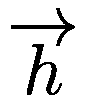。

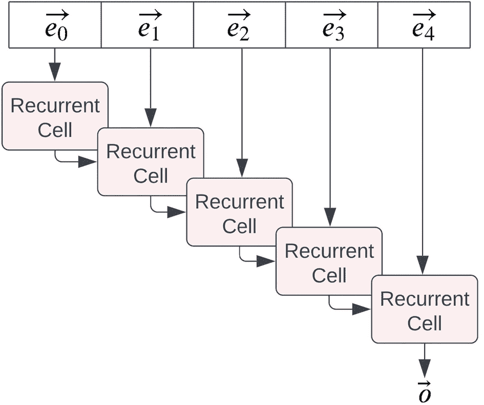

一个示意图描述了嵌入层向量 e_0 到向量 e_4 逐个通过循环单元的过程。向量 e_4 的循环单元产生向量 0\。

图 5-32

循环单元处理每个嵌入向量

这个向量  包含了理论上由序列中的所有元素按顺序提供的相关信息。然后我们可以将 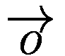 通过几个全连接层传递，以进一步解释这些信息，相对于优化预测任务上的性能，然后最终应用 softmax 层，使得每个输出指示每个类别的概率预测（图 5-33）。

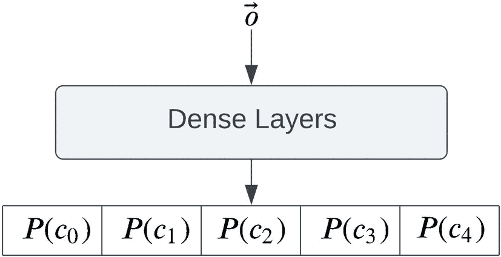

一个类别的示意图。向量 0 通过密集层并产生 P of c_0，P of c_1，P of c_2，P of c_3 和 P of c_4\。

图 5-33

从循环生成的信息向量或隐藏状态中得出的每个类别的概率预测

在定义了模型之后，我们可以在我们的数据集上编译和拟合模型。这在 Keras 中构建的先前模型中相当直接且相似。

注意，Keras 的循环层语法特别方便（尤其是在与其他流行的深度学习框架相比，如 PyTorch）。要使用 LSTM 或 GRU 层而不是普通的循环层，将 `L.SimpleRNN` 替换为 `L.LSTM` 和 `L.GRU`。

然而，循环层只能捕捉到一定数量的关系。理想情况下，我们希望能够捕捉到语言中的多层深度和复杂性。为了使我们的模型更加复杂，我们可以在每个循环层之上堆叠多个循环层。

回想一下，在标准的循环层中，我们保留当前时间步长的隐藏状态以供下一个时间步长考虑，但在每个时间步长的单元输出除了最后一个时间步长外都被忽略。然而，如果我们收集每个时间步长的输出，我们就会获得另一个序列（图 5-34），我们可以再次对其进行循环处理（图 5-35）。这允许模型学习多层复杂性，可能需要更深的循环序列处理来揭示。

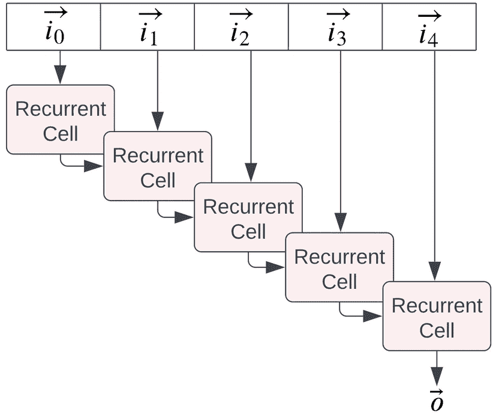

向量 i_0 到向量 i_4 分别通过循环单元，并在向量 i_4 处产生最终的 0 向量输出。

图 5-35

接受来自先前隐藏层的状态序列并将其传递到另一个层

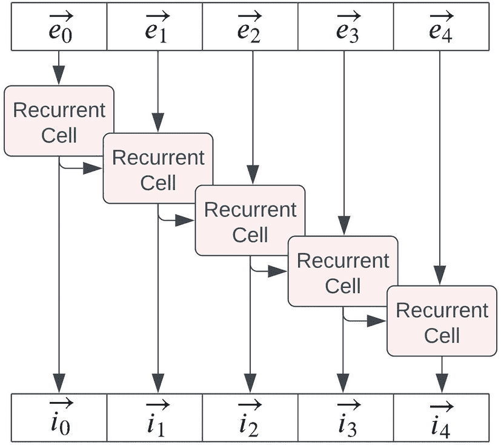

循环层的示意图。向量 e_0 到向量 e_4 分别通过循环单元，并产生向量 i_0 到向量 i_4。

图 5-34

在一个循环层中收集所有状态（与仅收集最后一个状态相反）

回想一下，为了在每个时间步长收集输出，我们设置 `return_sequences=True` 并继续堆叠额外的层（列表 5-11）。

```py
inp = L.Input((SEQ_LEN,))
embed = L.Embedding(MAX_TOKENS, EMBEDDING_DIM)(inp)
rnn1 = L.SimpleRNN(32, return_sequences=True)(embed)
rnn2 = L.SimpleRNN(32)(rnn1)
dense = L.Dense(32, activation='relu')(rnn2)
dense2 = L.Dense(32, activation='relu')(dense)
out = L.Dense(5, activation='softmax')(dense2)
model = keras.models.Model(inputs=inp, outputs=out)
Listing 5-11
Using a double-RNN stack
```

如果你观察到你的网络正在过拟合，一种方法是将循环 dropout 增加。在循环 dropout 中，每个时间步长都会丢弃一定比例的隐藏向量。请注意，这与在循环层处理之后应用 dropout 作为单独的层不同；循环 dropout 在每个时间步长“内部”应用于循环层，而标准 dropout 仅应用于其最终输出。这可以通过将 `recurrent_dropout=...` 传递给循环层的实例化来设置。

第十章将讨论神经网络架构搜索库 AutoKeras。AutoKeras 支持使用高级块，这使得处理文本数据变得更加简单。

### 时间序列

时间序列数据可以有多种形式。一般来说，它是在相等的时间间隔内按顺序收集的数据。目标通常是以下之一：下一时间步预测（从 {*t*[*n* − *w*], *t*[*t* − *w* + 1], ..., *t*[*n* − 1]} 预测 *t*[*n*]，其中 *w* 是窗口长度，如图 5-36 所示），时间依赖性目标预测（从 {*t*[*n* − *w* + 1], *t*[*t* − *w* + 2], ..., *t*[*n*]} 预测某些时间依赖性目标 *y*[*n*]，其中 *w* 是窗口长度，如图 5-37 所示），或时间无关目标预测（从 {*t*[*n* − *l* + 1], *t*[*t* − *l* + 2], ..., *t*[*n*]} 预测某些时间无关目标 *y*，其中 *l* 是序列间隔长度，如图 5-38 和 5-39 所示）。任务之间的区别主要在于数据而不是模型：你仍然可以定义具有相同结构的循环模型（根据需要调整输入和输出大小），大部分工作将在于准备数据的格式。

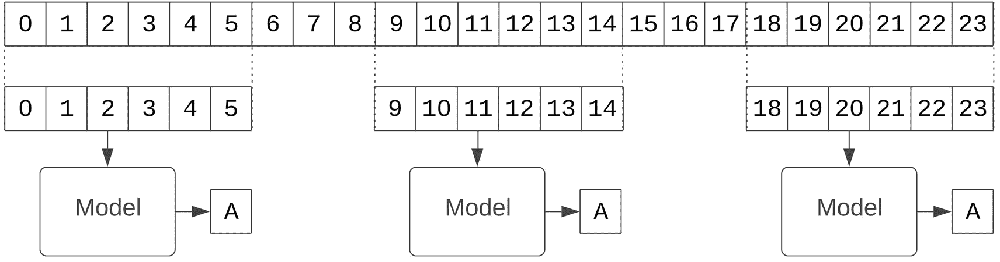

数字 0 到 23 的序列。数字 0 到 5 导致模型 A，数字 9 到 14 导致模型 A，数字 18 到 23 导致模型 A。

图 5-39

另一种时间无关预测模式

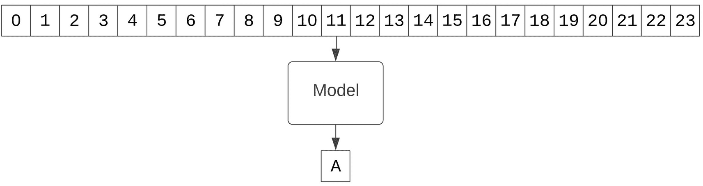

数字 0 到 23 的数据序列。数字 11 导致模型 A。

图 5-38

一种时间无关预测模式

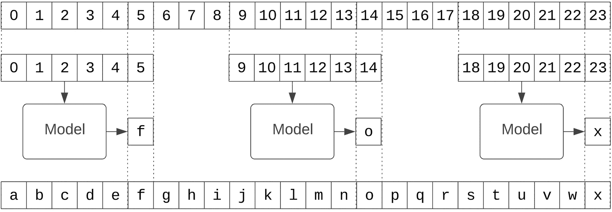

顶部是 0 到 23 的数字序列，底部是 a 到 x 的字母。数字 0 到 5 导致模型 f，数字 9 到 14 导致模型 o，数字 18 到 23 导致模型 x。

图 5-37

时间依赖性预测

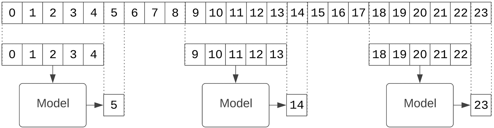

数字 0 到 23 的序列。在第二步中，数字 0 到 4 导致模型 5，数字 9 到 13 导致模型 14，数字 18 到 22 导致模型 23。

图 5-36

下一时间步预测

时间序列问题的以下是一些示例：

+   *股票预测*：根据前 *w* 天的股票数据预测下一天的股票（下一时间步预测）。

+   *疫情预测*：根据前 *w* 天的感染数据预测下一天的感染数量（下一时间步预测）。

+   *政治情绪预测*：根据给定的前一段时间内的政治活动窗口（立法活动、选举结果等），预测在某个时间步长上政治社区（社交平台、政党、人物等）的平均情绪（时间依赖性目标预测）。

+   *语音口音分类*：预测音频文件的口音（英国、美国、澳大利亚等）（时间无关目标预测）。

循环层并不总是对时间序列数据表现良好。通常，时间序列数据具有非常高的采样频率（考虑：音频文件，高频股票数据），而循环层仍然逐时间步处理这些信息。这相当于以每秒 16000 个元素为基础（假设每秒 16000 个元素）听音乐。即使配备高级内存的循环模型也难以在几秒钟内保留信息，因为每秒音频中有如此多的元素。同样适用于其他形式的高频数据。

因此，通常使用一维卷积层与循环层结合是一种成功的策略。如果设计得当，这些层可以系统地提取相关的有序序列特征，这些特征可以更有效地由循环层处理。

语音重音档案数据集 ([www.kaggle.com/datasets/rtatman/speech-accent-archive](https://www.kaggle.com/datasets/rtatman/speech-accent-archive)) 包含许多不同口音的人说相同短语的声音文件。我们将尝试构建一个时间无关的目标预测模型，从音频文件中预测说话者的口音。目录包含几个文件，组织如下：

```py
'spanish47.mp3',
'english220.mp3',
'arabic64.mp3',
'russian7.mp3',
'dutch36.mp3',
'english518.mp3',
'bengali5.mp3',
'english52.mp3',
'arabic11.mp3',
'farsi11.mp3',
'khmer7.mp3',
...
```

列表 [5-12 是一个辅助函数，用于从文件名中提取重音类别。

```py
def clean_name(filename):
for i, v in enumerate(filename):
if v in '0123456789':
break
return filename[:i]
Listing 5-12
Helper function extracting class information from the filename
```

列表 5-13 根据频率识别前五个重音（我们希望在具有足够训练数据的类别上进行预测）并存储相应的音频文件和标签（序数编码）。

```py
directory_path = '../input/speech-accent-archive/recordings/recordings/'
filenames = os.listdir(directory_path)
classes = [clean_name(name) for name in filenames]
i, j = np.unique(classes, return_counts=True)
top_5_accents = [x for _, x in sorted(zip(j, i))][::-1][:5]
top_5_files = [file for file in filenames if clean_name(file) in top_5_accents]
top_5_classes = [clean_name(file) for file in top_5_files]
ordinal_encoding = {val:i for i, val in enumerate(np.unique(top_5_classes))}
top_5_classes = [ordinal_encoding[class_] for class_ in top_5_classes]
Listing 5-13
Obtaining relevant classes and ordinal encodings
```

音频文件是浮点数的长字符串（见图 5-40）。我们将使用 `librosa` 库将 `.wav` 文件读入 NumPy 数组。在加载时，我们需要提供一个采样率——每秒采样的数据点数。如果你使用 1000 的采样率，那么 5 秒的音频剪辑将以数组形式有 5000 个元素。选择采样率是一个平衡问题：如果采样率太大，音频质量最佳，但可能太长并导致训练问题；如果采样率太小，它可能是一个可行的尺寸，但音频质量退化到无法完成任务的程度。在处理人声音频时，3,000 到 10,000 之间的采样率是一个良好的查找范围。（为了尝试最佳速率，尝试以一定的采样率加载，以该采样率保存音频文件，然后听改变后的音频。）在这种情况下，我们选择 6,000 的采样率。

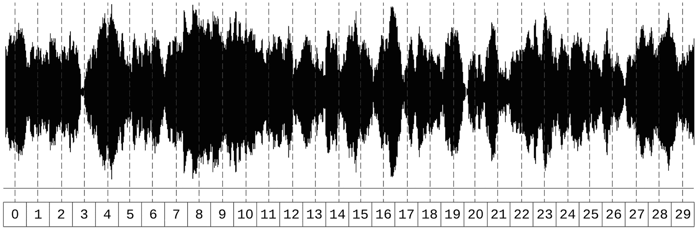

一幅插图显示了从 0 到 29 的数字序列。一根弦的波动在 0 到 29 的数字之间。

图 5-40

将音频映射到一系列值的可视化

音频文件长度不一，但我们需要一个统一的间隔长度来输入模型。我们将选择 5 秒的窗口长度，这应该足够作为说话人口音分类的上下文（图 5-41，列表 5-14）。此外，我们还将选择 5 秒的窗口移动长度，这意味着相邻窗口的起始时间相隔 5 秒。这意味着音频中没有重叠，这在当前情况下是可以的，因为我们有足够的训练数据。（解决有限音频数据的一种策略是减小移动大小，使得样本彼此重叠。）我们将每个窗口及其相关的目标分别存储在`audio`和`target`中。

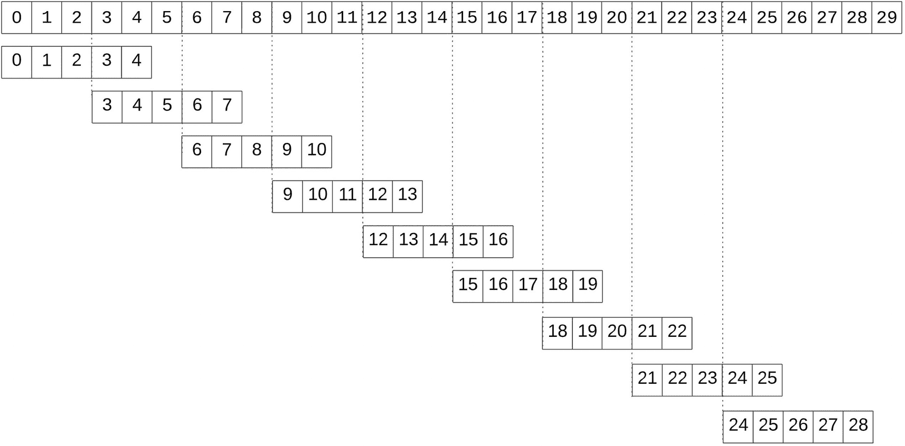

从 0 到 29 的数据序列。序列 1：从 0 到 4。序列 2 从 5 开始：从 3 到 7。序列 3 从 8 开始：6 到 10。序列 4 从 11 开始：从 9 到 13。序列 5 从 14 开始：从 12 到 16。序列 6 从 17 开始：从 15 到 19。序列 7 从 20 开始：从 18 到 22。序列 8 从 23 开始：从 21 到 25。序列 9：从 24 到 28。

图 5-41

在序列上使用重叠两个元素的窗口

```py
SAMPLE_RATE = 6_000
WINDOW_SEC = 5
WINDOW_LEN = WINDOW_SEC * SAMPLE_RATE
SHIFT_SEC = 5
SHIFT_LEN = SHIFT_SEC * SAMPLE_RATE
audio, target = [], []
for i, file in tqdm(enumerate(top_5_files)):
y, sr = librosa.load(os.path.join(directory_path, file),
sr=SAMPLE_RATE)
start, end = 0, WINDOW_LEN
while (end < len(y)):
audio.append(y[start:end])
target.append(top_5_classes[i])
start += SHIFT_LEN
end += SHIFT_LEN
audio = np.array(audio)
target = np.array(target)
Listing 5-14
Obtaining windows from the dataset
```

让我们构建模型（列表 5-15，图 5-42）。我们首先将输入重塑为二维数组，这应该被解释为一个具有一个特征图表示的序列。然后，我们应用一系列一维卷积；通过使用大步长，这些卷积增加了特征图表示的数量并减少了序列的长度。由于四个卷积使用了 8、8、4 和 4 的步长，原始序列长度减少了 8×8×4×4=1024（实际上，由于核大小，会稍微多一点；这里我们不使用填充）。这有助于将 30,000 长度的输入减少到信息密集的 25 长度序列，这些序列是大小为 8 的向量，它们被循环处理。

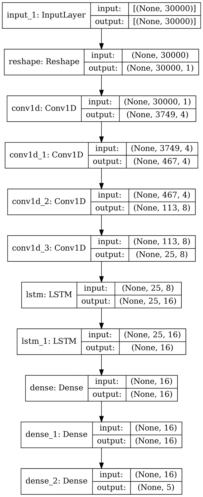

音频模型网络包含以下数据输入和输出。输入层，重塑，ConvID，ConvID 1，ConvID 2，ConvID 3，LSTM，LSTM 1，密集，dense 1 和 dense 2。

图 5-42

音频模型架构

```py
inp = L.Input((WINDOW_LEN,))
reshape = L.Reshape((WINDOW_LEN,1))(inp)
conv1 = L.Conv1D(4, 16, strides=8, activation='relu')(reshape)
conv2 = L.Conv1D(4, 16, strides=8, activation='relu')(conv1)
conv3 = L.Conv1D(8, 16, strides=4, activation='relu')(conv2)
conv4 = L.Conv1D(8, 16, strides=4, activation='relu')(conv3)
lstm1 = L.LSTM(16, return_sequences=True)(conv4)
lstm2 = L.LSTM(16)(lstm1)
dense1 = L.Dense(16, activation='relu')(lstm2)
dense2 = L.Dense(16, activation='relu')(dense1)
out = L.Dense(5, activation='softmax')(dense2)
model = keras.models.Model(inputs=inp, outputs=out)
model.compile(optimizer='adam', loss='sparse_categorical_crossentropy',
metrics=['accuracy'])
model.fit(audio, target, epochs=100)
Listing 5-15
Constructing the audio model
```

使用深度学习来建模时间序列数据的一个优点是能够联合建模多个时间序列。例如，与其建模单个股票价格，神经网络可以同时建模时间序列中的几十甚至几百个股票价格：每个额外的股票只是另一个通道。这允许进行联合建模——例如，类似行业的股票价格很可能彼此之间有很强的关系，联合建模可能比独立建模产生更好的性能。

虽然循环模型适用于高频和高复杂性的时间序列数据（音频、高频股票市场数据），但对于更简单的时间序列问题来说可能过于复杂。特定领域的时间序列问题通常有长期的研究历史，产生了经过验证的建模技术，不应被忽视。此外，信号处理中的更多“经典”或“手动”方法可能是有用的，无论是否涉及深度学习模型。

### 多模型循环建模

循环层的一个应用是多模型循环建模。我们可以以循环的方式处理序列数据，以标准的前馈方式处理表格数据，然后将提取的信息以向量的通用形式结合，从而进行联合预测（图 5-43）。

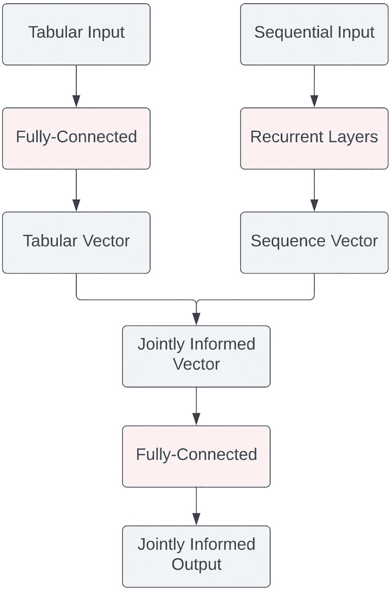

循环模型的流程图展示了表格输入和序列输入产生联合输出的过程。

图 5-43

循环模型的多模型应用示例

在这个例子中，序列输入可以是上一节讨论的两个自然应用之一（自然语言或信号）。通过多模型架构，你可以根据序列输入和表格输入进行预测，而不是仅基于一个或另一个的孤立模型。

回想一下软件评论数据集，它包含一个表格组件和两个文本组件。考虑一个模型的设计，该模型接受所有三个组件以进行联合预测（见列表 5-16）。

```py
tabular = data[['data/helpful_votes', 'data/total_votes', 'data/star_rating']]
body_text = data['data/review_body']
head_text = data['data/review_headline']
target = data['data/verified_purchase']
Listing 5-16
Selecting relevant components of the data
```

我们首先将两个文本语料库向量化（见列表 5-17）。

```py
SEQ_LEN, MAX_TOKENS = 64, 1024
EMBEDDING_DIM = 32
vectorize = tensorflow.keras.layers.TextVectorization(max_tokens=MAX_TOKENS,
output_sequence_length=SEQ_LEN)
vectorize.adapt(pd.concat([body_text, head_text]))
vec_body_text = vectorize(body_text)
vec_head_text = vectorize(head_text)
Listing 5-17
Vectorizing the text
```

之后，我们可以将数据集分割成合适的训练集和验证集（见列表 5-18）。

```py
TRAIN_SIZE = 0.8
train_indices = np.random.choice(data.index, replace=False, size=round(TRAIN_SIZE * len(data)))
valid_indices = np.array([i for i in data.index if i not in train_indices])
tabular_train, tabular_valid = tabular.loc[train_indices], tabular.loc[valid_indices]
body_text_train, body_text_valid = vec_body_text.numpy()[train_indices], vec_body_text.numpy()[valid_indices]
head_text_train, head_text_valid = vec_head_text.numpy()[train_indices], vec_head_text.numpy()[valid_indices]
target_train, target_valid = target[train_indices], target[valid_indices]
Listing 5-18
Train-validation split
```

为了构建模型（见列表 5-19，图 5-44），我们构建了几个头部来独立处理每个组件，然后进行向量连接和继续处理。为了简化，我们在评论正文文本输入和评论标题文本输入之间使用共享嵌入。虽然它们使用相同的嵌入，但它们是独立处理的。

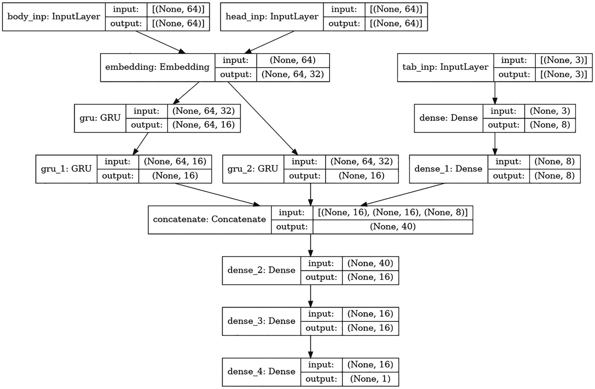

多模型循环模型的流程图展示了以下数据的输入和输出。输入层、嵌入、GRU、密集层、GRU 1、GRU 2、密集层 1、连接、密集层 2、密集层 3 和密集层 4。

图 5-44

多模型循环模型的架构

```py
body_inp = L.Input((SEQ_LEN,), name='body_inp')
head_inp = L.Input((SEQ_LEN,), name='head_inp')
embed = L.Embedding(MAX_TOKENS, EMBEDDING_DIM)
body_embed = embed(body_inp)
head_embed = embed(head_inp)
body_lstm1 = L.GRU(16, return_sequences=True)(body_embed)
body_lstm2 = L.GRU(16)(body_lstm1)
head_lstm = L.GRU(16)(head_embed)
tab_inp = L.Input((3,), name='tab_inp')
tab_dense1 = L.Dense(8, activation='relu')(tab_inp)
tab_dense2 = L.Dense(8, activation='relu')(tab_dense1)
concat = L.Concatenate()([body_lstm2, head_lstm, tab_dense2])
outdense1 = L.Dense(16, activation='relu')(concat)
outdense2 = L.Dense(16, activation='relu')(outdense1)
out = L.Dense(1, activation='sigmoid')(outdense2)
model = keras.models.Model(inputs=[body_inp, head_inp, tab_inp], outputs=out)
Listing 5-19
Constructing a multimodal recurrent model
```

让我们考虑另一个例子：基于新闻的股票预测。股票预测通常被视为一个直接的预测问题，其中模型试图预测在给定窗口大小 *w* 的情况下，*t*[*n*] 的值，即 {*t*[*n* − *w*], *t*[*t* − *w* + 1], ..., *t*[*n* − 1]}。然而，以这种方式预测时间序列是困难的。最近的研究表明，结合描述消费者情绪和相关因素的其他数据源可以显著提高股票预测（正如人们所期望的，因为它捕捉了外部影响因素）。因此，许多股票模型结合了消费者情绪指数和其他辛苦获得的测量值。然而，通过深度学习，我们可以构建直接解释和理解与股价相关的文本数据的模型。

Kaggle 上的每日新闻股票预测数据集([www.kaggle.com/datasets/aaron7sun/stocknews](https://www.kaggle.com/datasets/aaron7sun/stocknews))提供了 r/worldnews 子版块当天的顶部新闻标题以及当天的道琼斯工业平均指数（DJIA）。我们将不仅提供前 *w* 个时间步长（*t*[*n* − *w*], *t*[*t* − *w* + 1], ..., *t*[*n* − 1]）的 DJIA，还将提供时间步长 *t*[*n*] 的前三个标题。目标是预测 *t*[*n*] 的 DJIA。在这个特定的例子中，所有输入都是序列性的——但序列在类型或上下文中并不统一。

为了准备数据集，我们将读取数据集，仅选择该天的前三个标题，并将它们合并（列表 5-20，图[5-45]）。由于道琼斯工业平均指数（DJIA）的值跨越一个非常广泛的值域，我们将目标值乘以 100。

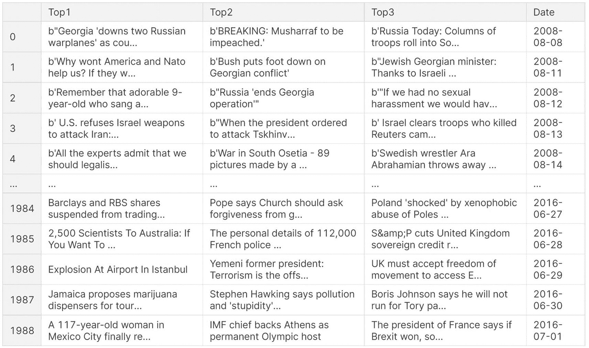

表格格式显示了顶级新闻列表。该表格包含五个列和 11 行。列标题是顶级 1、顶级 2、顶级 3 和日期。

图 5-45

样本顶部新闻标题

```py
news = pd.read_csv('../input/stocknews/Combined_News_DJIA.csv')
news = news[['Top1', 'Top2', 'Top3', 'Date']]
stock = pd.read_csv('../input/stocknews/upload_DJIA_table.csv')
data = news.merge(stock, how='inner', left_on='Date', right_on='Date')
stock = data[['Open', 'High', 'Low', 'Close']]
stock /= 100
Listing 5-20
Reading multimodal stock data
```

接下来，我们将准备股票历史组件（列表 5-21）。假设窗口长度为 20，我们将 20 个时间步长的值存储在 `x_stock` 中，并将第 21 个存储在 `y_stock` 中。我们将在数据集中每个有效的起始时间步长重复此操作。这是标准的“下一个时间步长”建模范式。我们还将相应地选择相关的相关标题。

```py
WINDOW_LENGTH = 20
x_stock = np.zeros((len(stock) - WINDOW_LENGTH,
WINDOW_LENGTH,
len(stock.columns)))
y_stock = np.zeros((len(stock) - WINDOW_LENGTH,
len(stock.columns)))
for i in range(len(stock) - WINDOW_LENGTH):
x_stock[i] = np.array(stock.loc[i:i+WINDOW_LENGTH-1])
y_stock[i] = np.array(stock.loc[i+WINDOW_LENGTH])
data = data.loc[WINDOW_LENGTH:]
top1_text, top2_text, top3_text = data['Top1'], data['Top2'], data['Top3']
Listing 5-21
Windowing the stock data in correspondence with the top text data
```

此外，我们还需要像以前一样将前一个、前两个和前三个标题向量化（列表 5-22）。

```py
SEQ_LEN, MAX_TOKENS = 64, 1024
EMBEDDING_DIM = 32
vectorize = tensorflow.keras.layers.TextVectorization(max_tokens=MAX_TOKENS,
output_sequence_length=SEQ_LEN)
vectorize.adapt(pd.concat([top1_text, top2_text, top3_text]))
top1_text = vectorize(top1_text)
top2_text = vectorize(top2_text)
top3_text = vectorize(top3_text)
Listing 5-22
Vectorizing the top headline texts
```

我们需要将数据集分为训练集和验证集（列表 5-23）。因为这是一个预测问题，我们不会使用标准的随机训练-验证分割以防止数据泄露。相反，我们将对前 80%的数据进行拟合，并在最后 20%的数据上进行评估。将为每个相关变量生成训练集和验证集。（还有其他方法可以做到这一点——`exec` 是一个便宜的小技巧，它将字符串作为 Python 代码运行，以避免手动变量分配。）

```py
variables = ['x_stock', 'y_stock',
'top1_text', 'top2_text', 'top3_text']
train_prop = 0.8
train_index = round(train_prop * len(data))
for variable in variables:
exec(f'{variable}_train = {variable}[:{train_index}]')
exec(f'{variable}_valid = {variable}[{train_index}:]')
Listing 5-23
Train-validation split
```

我们的模式将包含三个文本输入和一个时间序列输入（列表 5-24，图 5-46）。

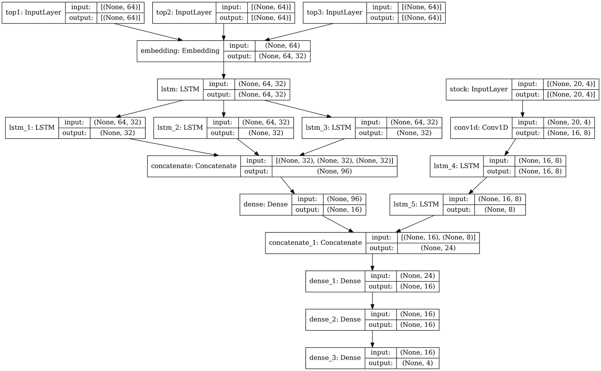

多模态股票流程图描述了以下数据的输入和输出。输入层，嵌入，LSTM，LSTM 1，LSTM 2，LSTM 3，ConvID，连接，LSTM 4，密集，LSTM 5，连接 1，密集 1，密集 2，和密集 3。

图 5-46

多模态股票预测模型架构

```py
top1_inp = L.Input((SEQ_LEN,), name='top1')
top2_inp = L.Input((SEQ_LEN,), name='top2')
top3_inp = L.Input((SEQ_LEN,), name='top3')
embed = L.Embedding(MAX_TOKENS, EMBEDDING_DIM)
top1_embed = embed(top1_inp)
top2_embed = embed(top2_inp)
top3_embed = embed(top3_inp)
lstm1 = L.LSTM(32, return_sequences=True)
top1_lstm1 = lstm1(top1_embed)
top2_lstm1 = lstm1(top2_embed)
top3_lstm1 = lstm1(top3_embed)
top1_lstm2 = L.LSTM(32)(top1_lstm1)
top2_lstm2 = L.LSTM(32)(top2_lstm1)
top3_lstm2 = L.LSTM(32)(top3_lstm1)
concat = L.Concatenate()([top1_lstm2, top2_lstm2, top3_lstm2])
concat_dense = L.Dense(16, activation='relu')(concat)
stock_inp = L.Input((WINDOW_LENGTH, 4), name='stock')
stock_cnn1 = L.Conv1D(8, 5, activation='relu')(stock_inp)
stock_lstm1 = L.LSTM(8, return_sequences=True)(stock_cnn1)
stock_lstm2 = L.LSTM(8)(stock_lstm1)
joint_concat = L.Concatenate()([concat_dense, stock_lstm2])
joint_dense1 = L.Dense(16, activation='relu')(joint_concat)
joint_dense2 = L.Dense(16, activation='relu')(joint_dense1)
out = L.Dense(4, activation='relu')(joint_dense2)
model = keras.models.Model(inputs={'top1': top1_inp,
'top2': top2_inp,
'top3': top3_inp,
'stock': stock_inp},
outputs=out)
Listing 5-24
Constructing the multimodal text, time-series, and tabular data model
```

模型可以相应地编译和拟合（列表 5-25）。

```py
model.compile(optimizer='adam', loss='mse', metrics=['mae'])
model.fit(x={'top1': top1_text_train,
'top2': top2_text_train,
'top3': top3_text_train,
'stock': x_stock_train},
y=y_stock_train,
validation_data=({'top1': top1_text_valid,
'top2': top2_text_valid,
'top3': top3_text_valid,
'stock': x_stock_valid},
y_stock_valid),
batch_size=128,
epochs=20)
Listing 5-25
Compiling and fitting the model
```

在本书的这个阶段，你已经看到了足够的多模态建模示例，能够为各种输入构建有效的架构：表格，图像，文本，序列。多模态兼容性是使用深度学习建模具有表格数据问题的强大功能之一。

## 直接表格循环建模

回想第四章中，我们能够将一维和二维卷积应用于表格数据，尽管卷积最初是为处理图像或更一般地说，具有空间连续语义的价值结构而设计的。也就是说，图像中的像素彼此之间具有某种固有的空间关系，或序列中的值具有某种固有的顺序。尽管表格数据在原始形式上通常不具有连续语义，但我们能够通过软排序策略使模型学习从无序表示到有序表示的映射。

我们可以使用类似的逻辑直接应用循环模型来建模表格数据。类似于一维卷积，循环模型被设计用于处理序列数据，或具有连续语义的数据。数据应该具有一定的有序性，以便可以以循环的方式建模。然而，由于循环模型通常比卷积具有更多组件，我们可以使用更多技术将循环层应用于表格数据。

### 一种新的建模范式

在第四章中介绍的方法在初次印象中可能已经显得有些可疑。应用旨在处理图像的工具怎么可能对几乎不具有图像数据属性的数据起作用呢？作为回应，请注意，我们已经证明，在应用卷积处理技术的同时，要求网络学习具有连续语义的表示，可以打开新的元非线性学习，这可以匹配或提高标准前馈建模技术的性能。然而，我们甚至将进一步拉伸和操纵循环模型的能力，这可能看起来是亵渎的或令人反感的。

为了强化这种直觉，考虑以下理论模型（图 5-47）。这里要理解的关键原则，希望鉴于前一章中此类非传统使用现有方法的实证工作和演示，是颠覆/回归传统的建模应用范式。传统上，我们遵循如果数据具有[属性]，则应用[为具有此属性的数据构建的模型]。如果数据由图像组成，则应用卷积层。如果数据由文本组成，则应用循环/注意力层。

然而，新颖的见解是，我们也可以大胆地朝另一个方向前进：如果我们将[为具有此属性的数据构建的模型]应用于[在原始形式上没有此属性的数据]，那么数据将实现[属性]。也就是说，我们将能够提取具有某些属性（例如，连续语义）的原始数据的表示或信息投影，然后可以使用一系列新颖且强大的工具进行处理，否则这些工具将无法使用。在这个建模的视角中，模型的目的不是被动的（即，按照原始数据的性质应用）而是主动的（即，应用于推动/投影/转换数据到具有不同属性的新空间，以访问新的处理方法）。

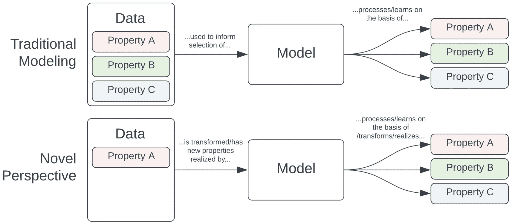

传统建模的过程。数据：属性 A 到 C 导致模型，进而导致属性 A 到 C。新颖视角的过程。数据：属性 A 导致模型，进而导致属性 A 到 C。

图 5-47

将操作视为转换性的而非仅仅是被动性的新视角

### 优化序列

一种天真方法是直接将表格数据视为具有连续语义，并按序列处理（图 5-48）。也就是说，我们将特征向量中的每个元素视为与特定时间步相关联的元素，相应地以时间顺序将其输入到循环层中。

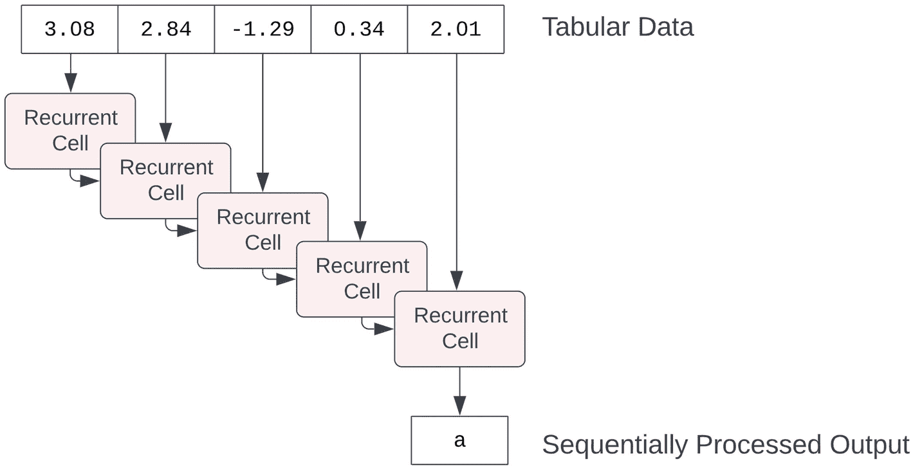

一幅插图展示了表格数据，3.08、2.84、-1.29、0.34、2.01 分别通过循环单元，产生按顺序处理的输出 a 在 2.01 处。

图 5-48

将循环层应用于表格数据。变量代表任意输出

我们可能随意实现这样一个模型（图 5-49），用于第四章中之前使用的 54 特征森林覆盖数据集，以进行实际演示，如列表 5-26 所示。请注意，我们需要将我们的输入重塑为形状（时间步数，每个时间步的向量元素）以使用循环层。在这个特定的例子中，我们使用 32 个隐藏单元，这意味着循环网络将使用并返回一个包含整个序列信息的 32 长度向量。循环层的 32 维输出然后可以被全连接层解释并映射到七类 softmax 输出。

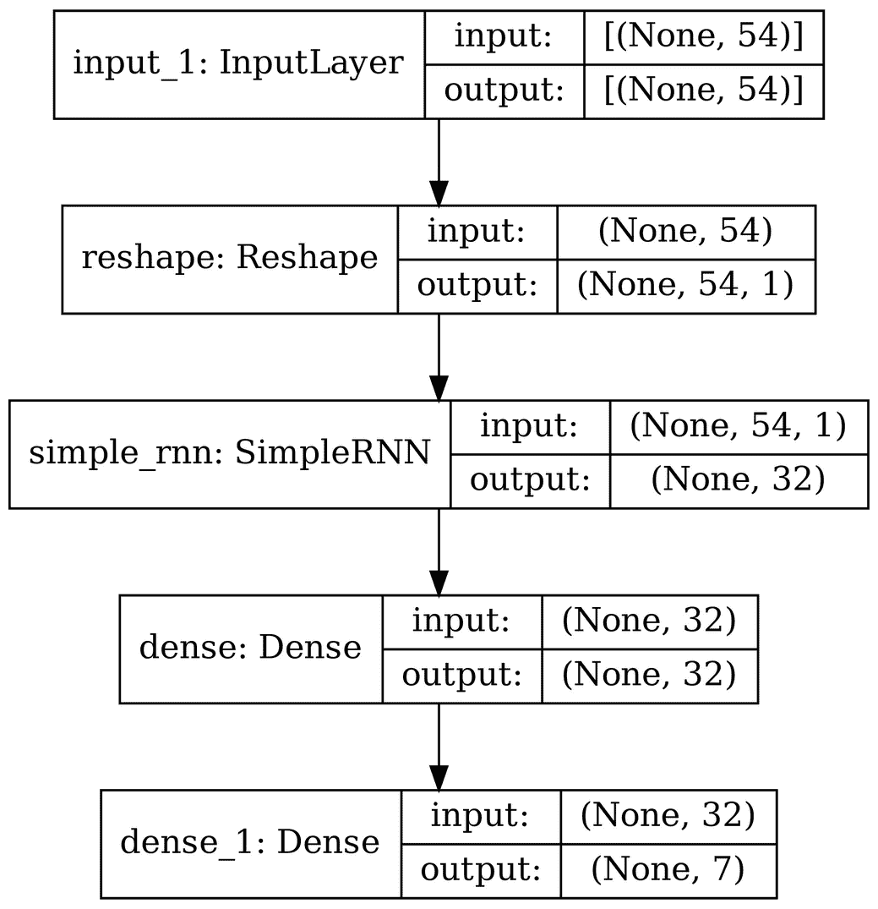

循环层到表格数据的流程图描述了以下数据的输入和输出。输入层、重塑、简单 RNN、密集层和密集 1。

图 5-49

直接将循环层应用于表格数据的架构

```py
inp = L.Input((54,))
reshape = L.Reshape((54,1))(inp)
rnn1 = L.SimpleRNN(32)(reshape)
predense = L.Dense(32, activation='relu')(rnn1)
out = L.Dense(7, activation='softmax')(predense)
model = keras.models.Model(inputs=inp, outputs=out)
Listing 5-26
Directly applying a recurrent layer to tabular data
```

这个模型，不出所料，表现并不好。这种方法类似于在第四章中直接将卷积核应用于特征向量。相反，我们可以使用与在将卷积应用于表格数据时解决该问题的类似方法，在网络开始处添加额外的全连接层（图 5-50）。希望这些层能够将输入转换成具有连续语义的形式，这样循环层更容易读取。 

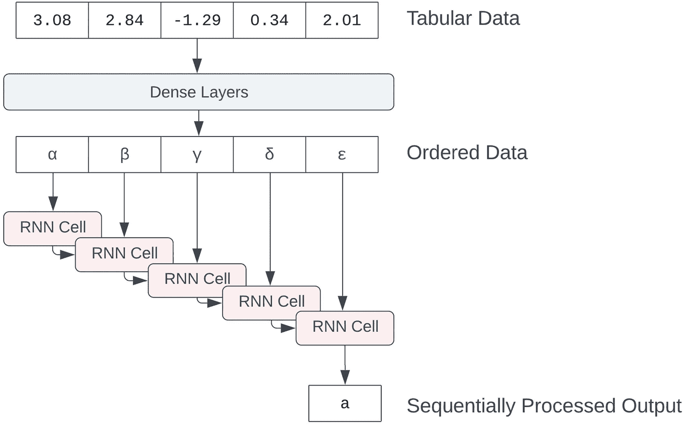

表格数据导致密集层，进而导致有序。有序数据通过 RNN 单元单独传递并产生顺序处理输出 a。

图 5-50

在应用循环层之前，先使用密集层应用软重排序组件。“循环单元”简称为“RNN 单元”，但这并不一定意味着普通的循环单元，它还包括 GRU 和 LSTM 单元，它们也是基本的循环单元。

我们可以通过在重塑和传递到循环层之前在网络开始处简单地添加一些额外的全连接层来实现这一点（列表 5-27，图 5-51）。

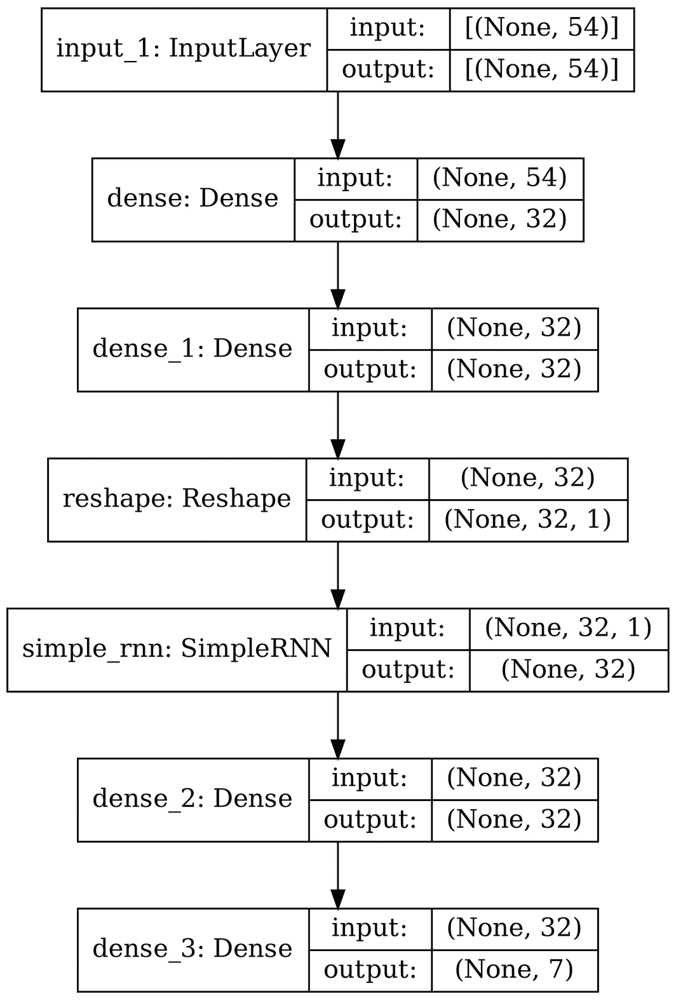

循环模型的流程图描述了以下数据的输入和输出。输入层、密集层、密集 1、重塑、简单 RNN、密集 2 和密集 3。

图 5-51

软排序循环模型的架构

```py
inp = L.Input((54,))
dense1 = L.Dense(32, activation='relu')(inp)
dense2 = L.Dense(32, activation='relu')(dense1)
reshape = L.Reshape((32,1))(dense2)
rnn1 = L.SimpleRNN(32)(reshape)
predense = L.Dense(32, activation='relu')(rnn1)
out = L.Dense(7, activation='softmax')(predense)
model = keras.models.Model(inputs=inp, outputs=out)
Listing 5-27
Using a soft ordering component consisting of fully connected layers before applying a recurrent layer
```

此外，观察发现我们不需要将处理后的向量重塑为一维向量序列。如果我们愿意，可以将第二层全连接层的输出重塑为形状(8, 4)，这将代表一个包含八个时间步的序列，每个时间步与一个四维向量相关联。这是更可取的，因为它为每个时间步的递归单元提供了更多信息，以便发展更好的内部数据表示。一般来说，如果必须做出权衡，最好是“垂直”地（即，通过添加新元素跨越每个时间步相关的向量）而不是“水平”地/“时间”地（即，通过添加额外的时间步向量）来传播信息。这是因为递归模型——即使是更复杂的模型——在时间轴上会经历信号衰减。如果我们能在每个时间步提供更多信息，它将能够提取和传播比在时间步之间稀疏分布时更多的相关信息。（当然，这是在极限情况下——如果我们把所有信息分布在一个时间步或非常少的时间步中，那么最初使用递归层结构就几乎没有意义。）然而，为了简单起见，在本章的其余部分，我们将使用“简单”的重塑（即，从形状`(a,)`到`(a,1)`)来突出其他动态部分，并尽量减少混淆。

全连接层提供了一种软排序，类似于对数据的预处理。我们可以通过创建一个子模型（列表 5-28；回顾第四章）来可视化各种表格输入是如何被两层全连接头转换为递归层的输入。图 5-52 展示了输入到递归层的序列，以每十个为一组。注意，高幅值在序列的不同位置分散得较稀疏，这会导致递归层读取结果的不同。

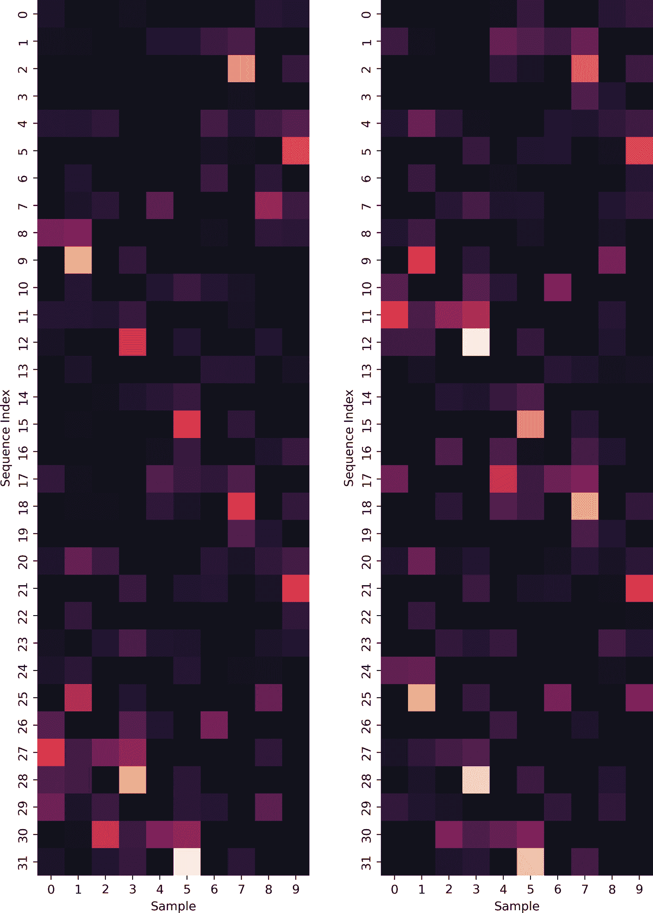

两个示例，样本范围从 0 到 9，序列索引范围从 31 到 0，绘制序列映射。

图 5-52

以每十个样本为一组可视化生成的序列映射。每一列包含某个表格样本被投影到的序列。

```py
inp = L.Input((54,))
dense1 = model.layers1
dense2 = model.layers2
submodel = keras.models.Model(inputs=inp,
outputs=dense2)
i = 0
plt.figure(figsize=(10/2.5, 33/2.5), dpi=400)
batch_prediction = submodel.predict(X_train[10*i:10*i + 10])
sns.heatmap(batch_prediction.reshape((32, 10)), cbar=False)
plt.xlabel('Sample')
plt.ylabel('Sequence Index')
plt.show()
Listing 5-28
Visualizing learned sequential representations
```

然而，我们可以做得更好——我们知道卷积层可以帮助以顺序方式处理输入（图 5-53）。因为卷积是顺序应用的，它们可以帮助在传递到循环层之前从我们的特征向量中“提取”连续语义属性。这种添加增加了输入序列相对于其顺序/时间质量的表达能力。你可以将其视为向上一章中讨论的先前直接建模设计添加循环层（其中我们将卷积应用于全连接层处理的特征向量）。

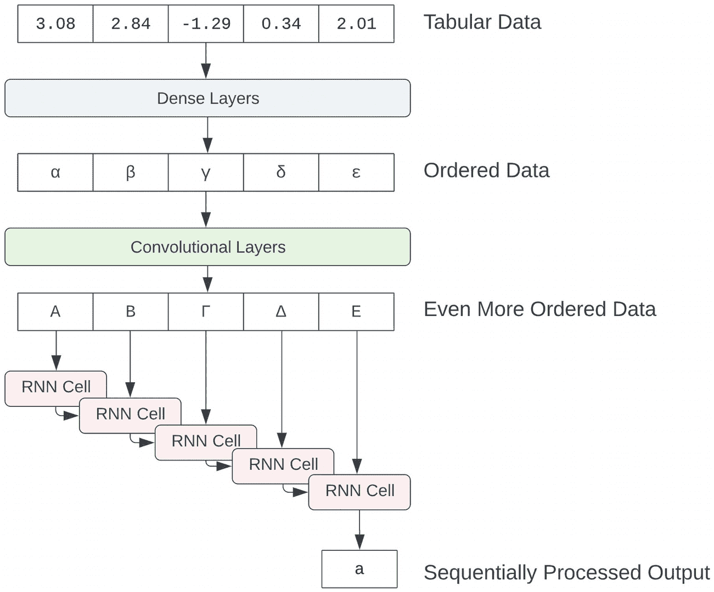

一个序列描述了表格数据导致有序数据的密集层，这进一步导致更有序的卷积层。它通过单个 R N N 单元进行处理，并产生顺序处理的输出 a。

图 5-53

在使用循环层之前应用密集软排序组件和 1D 卷积组件

此外，这种设计的一个优点是我们能够以更自然的方式向循环层传递更丰富的序列输入。理想情况下，如前所述，循环层将与每个时间步长相关联的较大向量，以告知其隐藏/内部表示。我们可以简单地将全连接向量重塑成这种形状，但在某种意义上这是不自然的，因为全连接层被要求学习不同输出之间的复杂空间关系，这些关系通过线性映射来实现。当我们向循环层传递“值网格”时，我们假设某些元素具有某些空间属性，与其他元素具有特定的关系，每个元素都有其自身的空间属性。例如，当我们向循环模型传递元素网格时，我们理解在某个时间步长 *t* 的向量与 *t* + 1 之间存在 *时间关系*。然而，每个向量内的元素之间存在 *非时间关系*。我们不能像在 0th–1st 时间步长和 0th–2nd 时间步长的向量对中那样“比较”或“量化”0th–1st 向量索引对和 0th–2nd 向量索引对之间的关系（即后者的“持续时间”是前者的一半）。这些是循环层处理此类数据时隐含的复杂关系（图 5-54）。

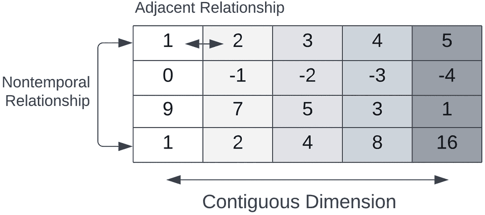

一个具有五列和四行的数组中的元素集。行值称为相邻关系，列值称为非时间关系。值具有连续维度。

图 5-54

循环模型处理数组中元素之间假设的关系

你可能可以看到尝试学习从标准特征向量到这种复杂关系排列的映射的难度（图 5-55）。

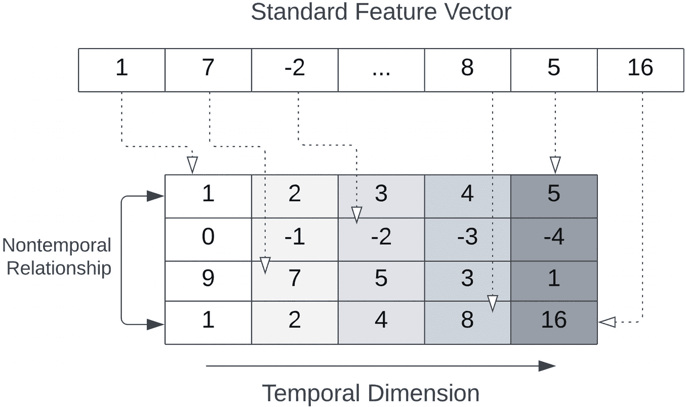

一个插图显示了标准特征向量映射中的值与数组中的元素。列值被称为非时序关系。值具有时间维度。

图 5-55

从标准特征向量到具有循环关系的数组元素映射的高精度和非线性

然而，一维卷积操作所基于的数据假设与循环层操作的数据假设非常相似。在这个表示中，每一“行”都是一个序列，卷积窗口在其上“滑动”，由不同的过滤器（不同的“透镜”或“视角”用于特征提取）生成和读取（图 5-56）。

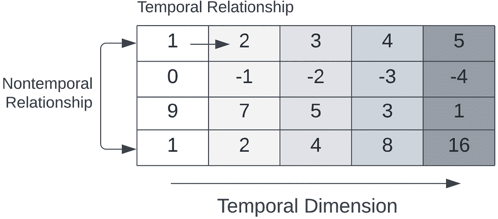

一个包含五列四行的数组元素集。行值被称为时序关系，列值被称为非时序关系。值具有时间维度。

图 5-56

卷积模型处理数组中元素之间假设的关系

因此，我们可以通过使用可以扩展深度的不同过滤器的卷积来处理信息，从而更“自然”地给循环层提供更丰富和更“易读”的数据（按时间步长逐个处理），这样我们就可以通过学习从标准特征向量到这种复杂关系排列的映射来获得更好的性能（列表 2-29，图 5-57）。

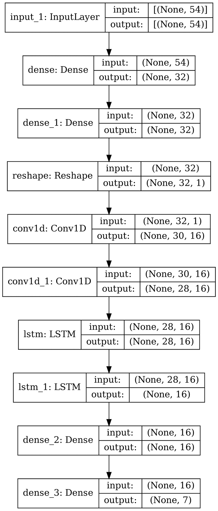

卷积循环模型的流程图描述了后续数据的输入和输出。输入层、密集层、密集层 1、重塑层、ConvID、LSTM、LSTM 1、密集层 2 和密集层 3。

图 5-57

密集-卷积-循环模型的架构

```py
inp = L.Input((54,))
dense1 = L.Dense(32, activation='relu')(inp)
dense2 = L.Dense(32, activation='relu')(dense1)
reshape = L.Reshape((32,1))(dense2)
conv1 = L.Conv1D(16, 3)(reshape)
conv2 = L.Conv1D(16, 3)(conv1)
rnn1 = L.LSTM(16, return_sequences=True)(conv2)
rnn2 = L.LSTM(16)(rnn1)
predense = L.Dense(16, activation='relu')(rnn2)
out = L.Dense(7, activation='softmax')(predense)
model = keras.models.Model(inputs=inp, outputs=out)
Listing 5-29
Implementing a model with dense, 1D convolution, and recurrent components
```

当可视化将原始原始表格输入转换为循环层输入的结果（即，最后卷积层的输出）时，我们注意到活动更高且信息丰富的信号。实际上，经验表明，添加卷积层通常比参数化相似的仅全连接头有更好的性能（图 5-58）。

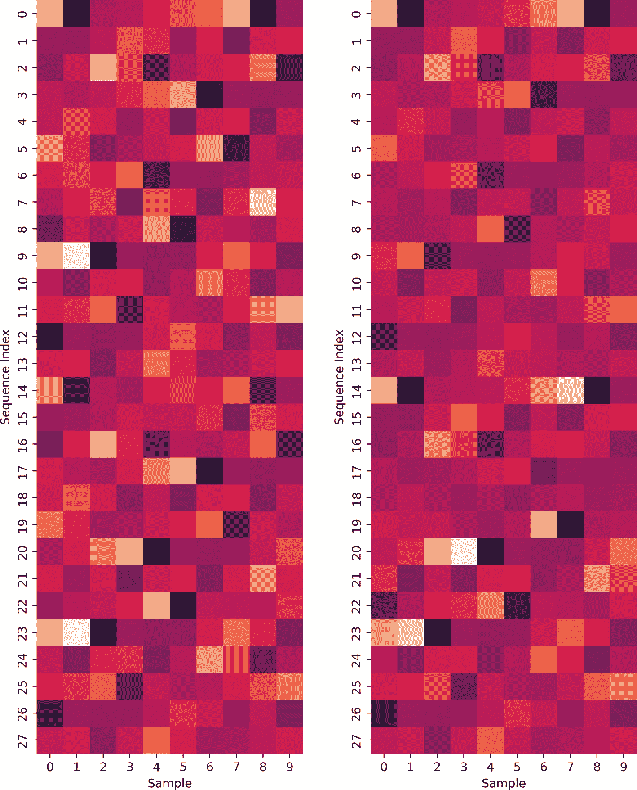

两个示例，样本范围从 0 到 9，序列索引范围从 27 到 0，在亮背景上绘制序列映射。

图 5-58

在十个样本的批次中可视化生成的序列映射。每一列包含某个表格样本被投影到的序列

### 优化初始记忆状态

然而，我们可以利用循环机制的不同输入“入口”：初始隐藏状态。在 TensorFlow 中，初始隐藏状态被初始化为零，但随着它从序列输入中获取元素而发生变化。我们可以通过学习原始表格输入到循环单元初始隐藏状态的最佳转换来反转这种范式（图 5-59）。将初始隐藏状态视为“画布”，将输入序列视为“画笔和颜料”。传统上，输入序列“绘画”一个“空白画布”，在每个时间步长应用新的层和细节。结果是受序列中所有时间步长影响的“画作”。在这种情况下，画布不是初始化为空白，而是已经相当复杂。我们可以使用一个简单的输入序列（“简单的画笔和绘画策略”）来提供修改画布的刺激。为了简单起见，这个“虚拟刺激序列”被可视化为一个零向量；在实践中，零向量是一个较差的刺激序列选择，因为它对原始隐藏状态的影响最小，无论学习到的权重如何。两个更好的选择是一个向量以及变换风格的正弦位置编码。

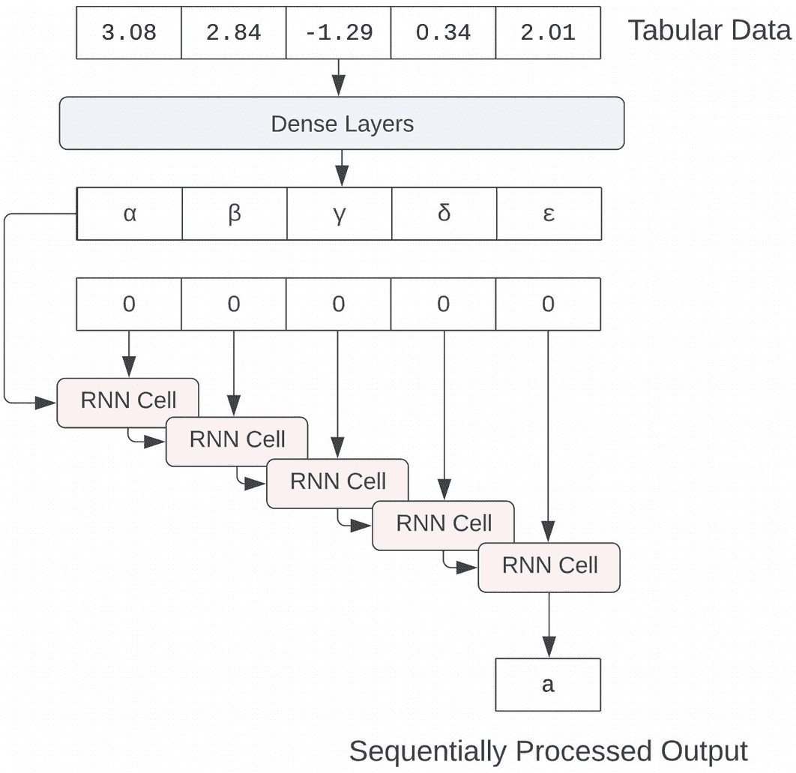

循环层的插图显示了导致密集层中两组值的表格数据。每个值单独通过 R N N 单元，并产生顺序处理的输出 a。

图 5-59

学习循环层的初始隐藏状态而不是其初始序列

此外，如果您想堆叠多个循环层，您还可以指定第二、第三、第四等层的初始状态为原始表格输入的转换（这可以链接到第一循环层的学到的初始隐藏状态）（图 5-60）。这意味着原始表格输入的学习转换现在正在双重解释，并且产生了具有许多参数的极其复杂和表达性的拓扑非线性。

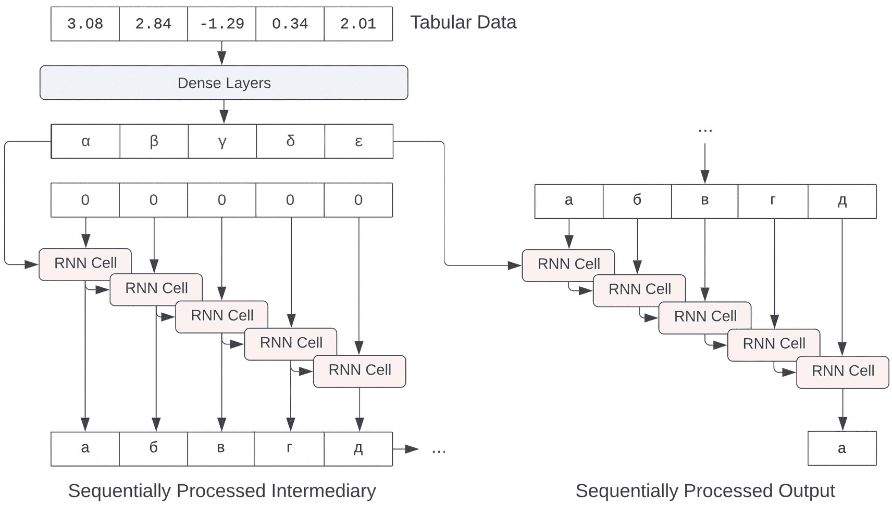

表格数据在密集层中导致两组值。每个值单独通过 R N N 单元，并产生顺序处理的中间结果和顺序处理输出 a。

图 5-60

在循环层堆叠中学习初始状态

列表 5-30 和图 5-61 展示了一个多堆叠循环模型，其中只有第一个循环层的初始隐藏状态被学习为原始表格输入的函数。

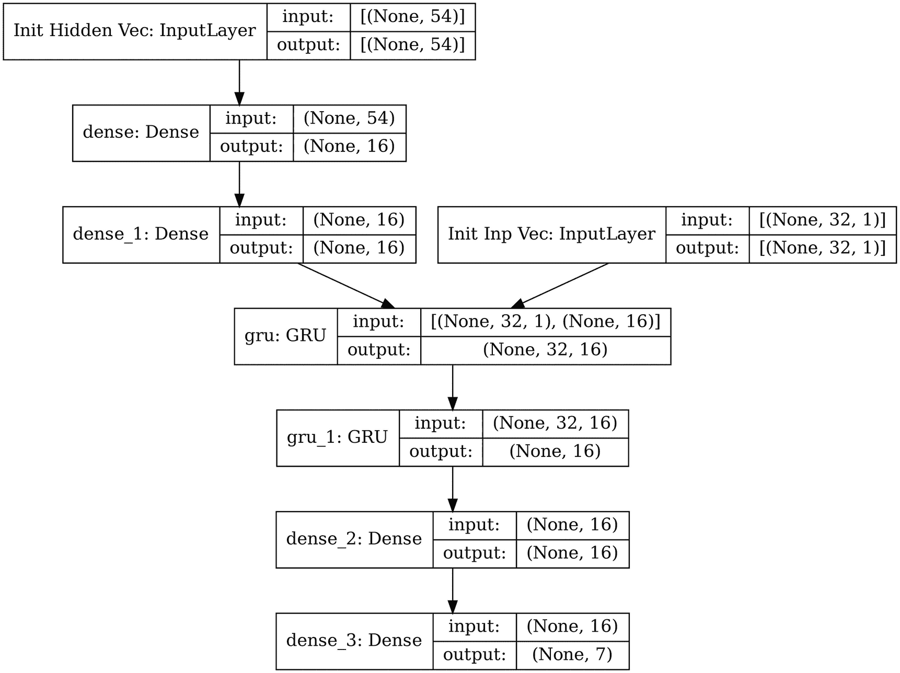

表格循环模型的流程图描述了以下数据的输入和输出。InputLayer，dense，dense 1，G R U，G R U 1，dense 2 和 dense 3。

图 5-61

学习隐藏状态的表格循环模型架构

```py
init_hidden_vec = L.Input((54,), name='Init Hidden Vec')
init_inp_vec = L.Input((32, 1), name='Init Inp Vec')
dense1 = L.Dense(16, activation='relu')(init_hidden_vec)
dense2 = L.Dense(16, activation='relu')(dense1)
rnn1 = L.GRU(16, return_sequences=True)(init_inp_vec,
initial_state=dense2)
rnn2 = L.GRU(16)(rnn1)
predense = L.Dense(16, activation='relu')(rnn2)
out = L.Dense(7, activation='softmax')(predense)
model = keras.models.Model(inputs=[init_hidden_vec, init_inp_vec],
outputs=out)
Listing 5-30
Implementing a model that maps a tabular input to the initial state of a recurrent layer
```

我们可以将 `initial_state=dense2` 修改为第二个循环层以创建双重链接（图 5-62）。这增加了表达性和连接性，通常在训练过程中更快地产生更好的经验结果。

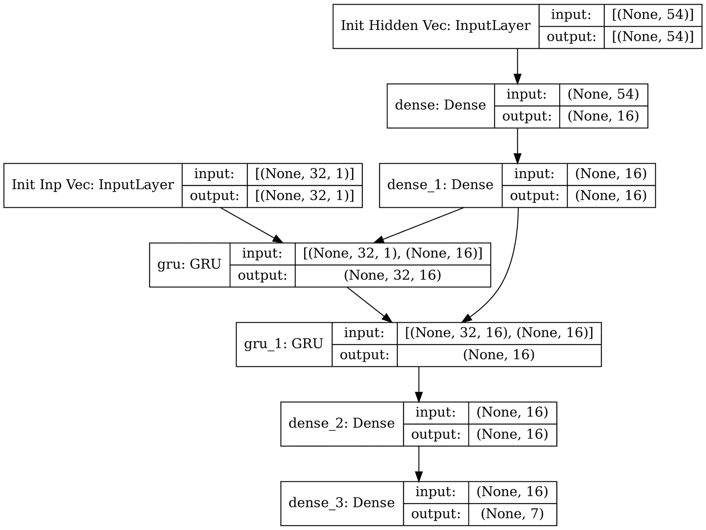

双重连接的表格循环模型的流程图显示了以下数据的输入和输出。输入层、密集层、密集 1、G R U、G R U 1、密集 2 和密集 3。

图 5-62

双重连接的隐藏状态学习的表格循环模型的架构

这种设计的优雅之处在于，它不需要转换的表格向量具有连续的语义，但仍然产生一个按顺序告知/生成的结果。对于全连接头来说，学习这种转换可能“更容易”。

我们可以使用一个向量（列表 5-31）来编译和拟合模型。

```py
model.compile(optimizer='adam', loss='sparse_categorical_crossentropy',
metrics=['accuracy'])
model.fit([X_train, np.ones((len(X_train), 16, 1))],
y_train, epochs=20,
validation_data=([X_valid, np.ones((len(X_valid), 16, 1))],
y_valid),
batch_size = BATCH_SIZE)
Listing 5-31
Compiling and fitting
```

或者，我们可以选择更复杂的编码类型。Transformer 风格的位置编码生成一系列正弦曲线，使得在任何时间步长上曲线的值足以告知模型它处于哪个近似时间步，同时保持有界（图 5-63）。有关在 Transformer 模型中使用位置编码的更多上下文，请参阅第六章。

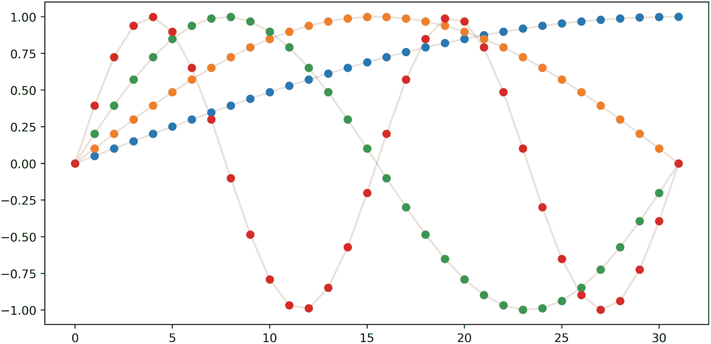

一张图绘制了不同振幅的正弦曲线。曲线 1 到 4 在 (0, 0.00) 和 (30, 0.00) 之间绘制。所有值都是近似的。

图 5-63

正弦位置编码向量的可视化

在这里的一个简单假设实现中（列表 5-32），我们生成四个不同周期的正弦曲线，并将这个刺激序列存储为长度为四向量的 32 个时间步长的序列。我们需要相应地调整模型架构，使得 `init_inp_vec = L.Input((32,4))`。

```py
individ_seq = np.stack([np.sin(np.linspace(0, 1/2 * np.pi, 32)),
np.sin(np.linspace(0, np.pi, 32)),
np.sin(np.linspace(0, 2*np.pi, 32)),
np.sin(np.linspace(0, 4*np.pi, 32))],
axis=1)
train_pos_encoding = np.stack([individ_seq] * len(X_train))
valid_pos_encoding = np.stack([individ_seq] * len(X_valid))
model.compile(optimizer='adam', loss='sparse_categorical_crossentropy',
metrics=['accuracy'])
model.fit([X_train, train_pos_encoding],
y_train, epochs=20,
validation_data=([X_valid, valid_pos_encoding],
y_valid),
batch_size = BATCH_SIZE)
Listing 5-32
Training with transformer-style sinusoidal position encodings
```

将这些方法结合起来，我们可以同时学习循环层的最佳初始隐藏状态和最佳输入序列（列表 5-33，图 5-64 和 5-65）。

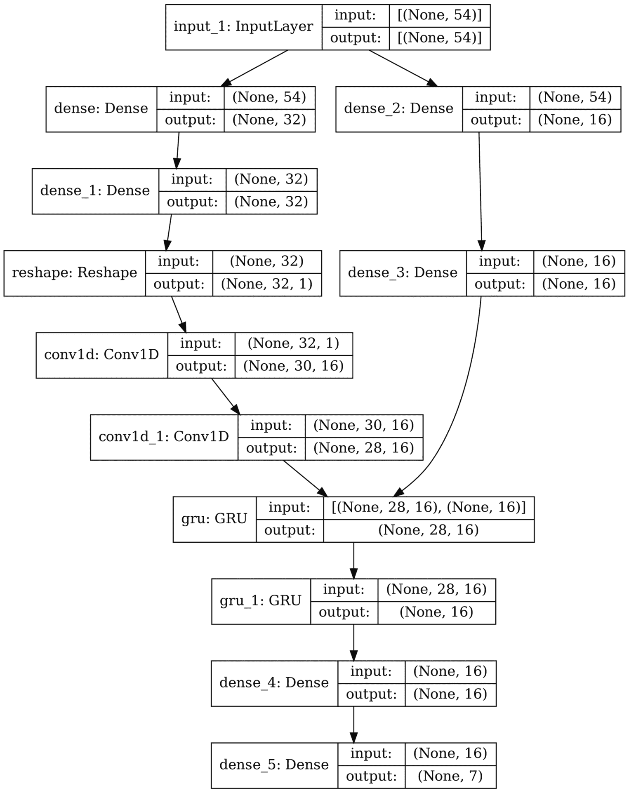

流程图描述了以下数据的输入和输出模型。输入层、密集层、密集 2、密集 1、重塑、密集 3、ConvID、G R U、G R U 1、密集 4 和密集 5。

图 5-65

模型的架构

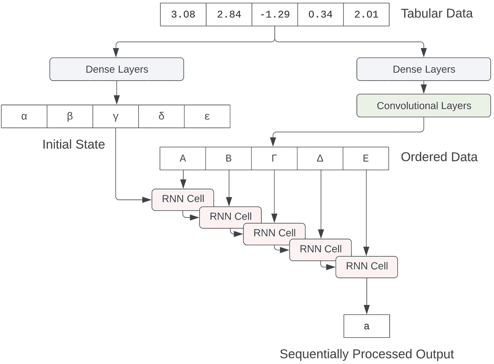

一幅插图显示了表格数据导致两个密集层。左侧的密集层导致初始状态，右侧的密集层导致卷积层，共同形成顺序处理输出。

图 5-64

模型的示意图

```py
init_vec = L.Input((54,))
dense1 = L.Dense(32, activation='relu')(init_vec)
dense2 = L.Dense(32, activation='relu')(dense1)
reshape = L.Reshape((32,1))(dense2)
conv1 = L.Conv1D(16, 3)(reshape)
conv2 = L.Conv1D(16, 3)(conv1)
hidden_dense1 = L.Dense(16, activation='relu')(init_vec)
hidden_dense2 = L.Dense(16, activation='relu')(hidden_dense1)
rnn1 = L.GRU(16, return_sequences=True)(conv2,
initial_state=hidden_dense2)
rnn2 = L.GRU(16)(rnn1)
predense = L.Dense(16, activation='relu')(rnn2)
out = L.Dense(7, activation='softmax')(predense)
model = keras.models.Model(inputs=init_vec, outputs=out)
model.compile(optimizer='adam', loss='sparse_categorical_crossentropy',
metrics=['accuracy'])
model.fit(X_train, y_train, epochs=20,
validation_data=(X_valid, y_valid),
batch_size = BATCH_SIZE)
Listing 5-33
Implementing a model that learns both the sequence and hidden state inputs
```

如前所述，我们还可以将第一个循环层的学到的初始隐藏状态连接到第二个循环层（图 5-66）。

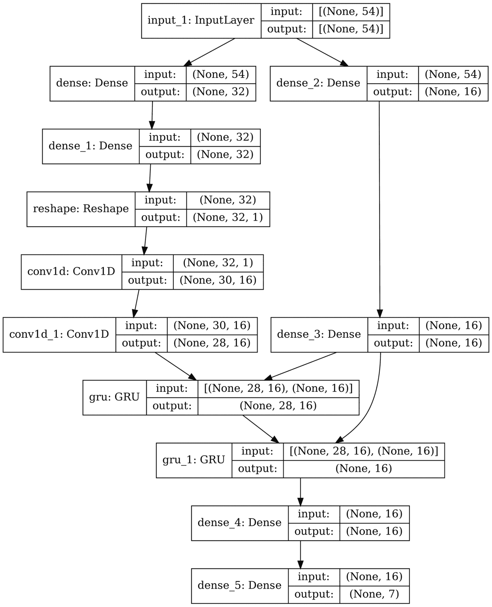

流程图展示了以下数据的双连接输入和输出模型。输入层、密集层、密集层 2、密集层 1、重塑层、密集层 3、ConvID、ConvID 1、G R U、G R U 1、密集层 4 和密集层 5\。

图 5-66

双连接模型的架构

此外，我们还可以创建另一个分支来独立学习第二递归层的最佳（不同）初始隐藏状态（图 5-67）。这有助于缓解可能对复杂问题产生阻碍的表达性限制。

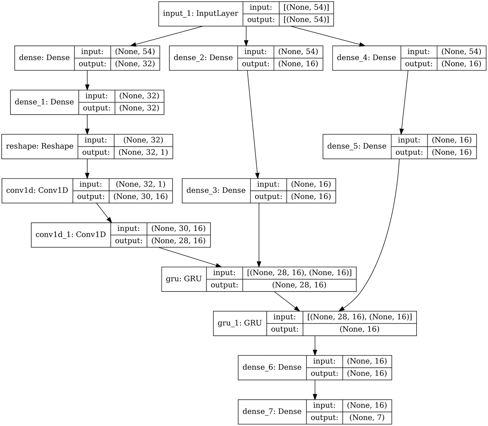

流程图展示了以下数据的输入和输出连接模型。输入层、密集层、密集层 2、密集层 4、密集层 1、重塑层、ConvID、密集层 3、ConvID 1、G R U、G R U 1、密集层 6 和密集层 7\。

图 5-67

独立学习双连接模型的架构

LSTM 模型既有细胞状态又有隐藏状态，因此适用于更复杂的系统，其中网络同时从原始表格数据中推导出最佳序列输入、初始隐藏状态和初始细胞状态，并在强大的递归层堆叠中将所有部件组合在一起（图 5-68）。

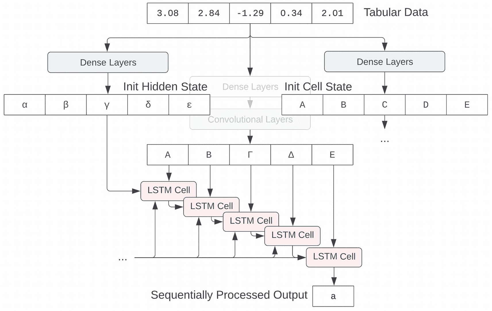

表格数据导致两个密集层。左侧的密集层导致初始隐藏状态，右侧的密集层导致初始细胞状态，共同通过 LSTM 细胞并产生顺序处理输出 a。

图 5-68

学习 LSTM 模型的细胞状态、隐藏状态和输入序列。细胞状态在底部表示为单个通道，穿越整个序列以进行可视化（尽管有些不准确）

列表 5-34 和图 5-69 展示了这种实现的一个例子。

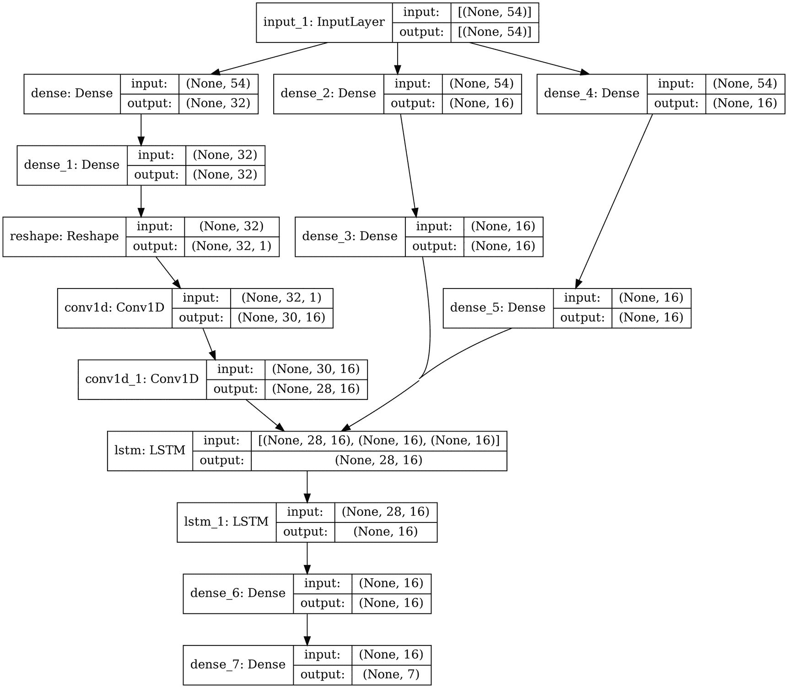

LSTM 模型的流程图展示了以下数据的输入和输出。输入层、密集层、密集层 2、密集层 4、密集层 1、重塑层、密集层 3、ConvID、密集层 5、ConvID 1、L S T M、L S T M 1、密集层 6 和密集层 7\。

图 5-69

具有学习序列输入、细胞状态和隐藏状态的 LSTM 模型的架构

```py
init_vec = L.Input((54,))
dense1 = L.Dense(32, activation='relu')(init_vec)
dense2 = L.Dense(32, activation='relu')(dense1)
reshape = L.Reshape((32,1))(dense2)
conv1 = L.Conv1D(16, 3)(reshape)
conv2 = L.Conv1D(16, 3)(conv1)
hidden_dense1 = L.Dense(16, activation='relu')(init_vec)
hidden_dense2 = L.Dense(16, activation='relu')(hidden_dense1)
cell_dense1 = L.Dense(16, activation='relu')(init_vec)
cell_dense2 = L.Dense(16, activation='relu')(cell_dense1)
rnn1 = L.LSTM(16, return_sequences=True)(conv2,
initial_state=[hidden_dense2,
cell_dense2])
rnn2 = L.LSTM(16)(rnn1)
predense = L.Dense(16, activation='relu')(rnn2)
out = L.Dense(7, activation='softmax')(predense)
model = keras.models.Model(inputs=init_vec, outputs=out)
model.compile(optimizer='adam', loss='sparse_categorical_crossentropy',
metrics=['accuracy'])
model.fit(X_train, y_train, epochs=20,
validation_data=(X_valid, y_valid),
batch_size = BATCH_SIZE)
Listing 5-34
Implementing an LSTM model in which all relevant inputs are learned
```

你还可以在学习的最佳初始隐藏状态和细胞状态之间添加多个连接，以及递归层堆叠的不同级别，如前所述。

我们应该退一步来欣赏我们所达到的架构。将循环模型直接应用于表格数据的主要犹豫，如果我们仔细思考，似乎没有一种有效的方法可以让表格数据以“自然”的方式通过循环模型。在这个最终模型中，表格数据被用来控制表格模型的全部组件——初始状态、随时间的变化以及最终的解释。从这个意义上说，它和前馈层一样具有表现力，但为在整个时间发展思想提供了关键的支持结构。

## 进一步资源

这些都是新颖的方法，可能在某些情况下效果良好，也可能不理想。然而，它们在几个关键领域已经显示出希望。即使你对本节中提出的架构和技术的方法的有效性或正确性不确信，也希望更哲学的启示能鼓励你在建模中拥有更大的流动性和创新性。

以下是一些将循环模型成功应用于表格数据的应用实例，可能具有参考价值：

+   阿尔图比蒂，尼克，梅森，袁，埃斯特林. (2018). 应用长短期记忆循环神经网络进行入侵检测. *2018 年东南部会议（SoutheastCon）*, 第 1–5 页.

+   金基，金基，吴，金韩. (2016). 用于入侵检测的长短期记忆循环神经网络分类器. *2016 年国际平台技术和服务会议（PlatCon）*, 第 1–5 页.

+   李特，金基，金韩. (2017). 使用梯度下降优化的长短期记忆入侵检测分类器. *2017 年国际平台技术和服务会议（PlatCon）*, 第 1–6 页.

+   尼古洛夫，科尔代夫，斯泰福诺娃. (2018). 基于循环神经网络分类器的网络入侵检测系统概念. *2018 IEEE 第 27 届国际科学会议电子学——ET*, 第 1–4 页.

+   普拉约特. (2018). 基于深度学习的入侵检测系统综述.

+   王思，夏晨，王涛. (2019). 基于深度学习混合方法的创新入侵检测器. *2019 IEEE 第 5 届国际大数据安全云（BigDataSecurity）会议，IEEE 高性能和智能计算国际会议（HPSC）以及 IEEE 智能数据安全国际会议（IDS）*, 第 300–305 页.

对于一个示例代码笔记本，请参阅 Kaggle 用户 Kouki 对“作用机制”竞赛的解决方案，该方案使用循环表格模型：[www.kaggle.com/code/kokitanisaka/moa-ensemble/notebook?scriptVersionId=48123609](https://www.kaggle.com/code/kokitanisaka/moa-ensemble/notebook%253FscriptVersionId%253D48123609).

## 关键点

本章讨论了三种流行的循环模型形式；展示了循环模型在文本、时间序列和多模态数据上的应用；并提出了几种将循环层直接应用于表格数据的方法。

+   循环神经元通过将前一个时间戳的输出“蜿蜒”回输入作为隐藏状态，并结合当前时间戳的输入来迭代地处理序列数据。这使得模型能够有效地通过有序序列学习时间上的模式。

+   LSTM 通过解决梯度消失问题改进了标准循环神经元。它们使用门控机制，允许模型从较旧的时间戳访问关键信息，从而使仍然保留有意义信息的梯度可以向后流动到起始时间戳。

+   使用梯度裁剪可以解决循环模型中的梯度爆炸问题。

+   GRU 是对 LSTM 的改进，通过从 LSTM 中移除长期记忆单元并引入更新和重置门作为更经济的替代方案来简化其训练过程。

+   要使用循环层来建模文本数据：将文本数据集向量化，通过嵌入层获取嵌入向量，然后通过一系列循环层。

+   时间序列预测有三种通用模板：下一时间步预测、时间依赖性目标预测和时间独立性时间预测。深度学习在时间序列建模上通常对高频时间序列数据集表现良好，例如高量级的股票数据集或音频波。这样的架构通常与“平滑”和提取关键信息丰富的序列以供循环层堆栈处理的卷积头表现良好。

+   通过构建多输入网络架构，您可以创建同时接受不同数据模态的模型。这可以用于处理既有文本组件又有表格组件的数据，这在在线平台和商业数据科学环境中很常见。

+   要理解直接将循环模型（以及所有其他非传统机制）应用于表格数据的前提、动机和合理性，我们必须理解传统建模范式的逆转：“如果数据具有[属性]，则应用[为具有此属性的数据构建的模型]”，而不是“如果我们将[为具有此属性的数据构建的模型]应用于[在原始形式中不具有此属性的数据]，则生成的数据将实现[属性]。”由假设此类属性而产生的机制引起的属性实现开辟了新的、以前封闭的技术和方法的大门。

+   通过在传递到循环层之前用全连接层处理表格输入，可以将表格输入映射到最优的序列表示。在输入到循环层堆栈之前应用卷积层可以提高连续语义的实现。

+   我们还可以让全连接层学习网络的最佳初始隐藏状态，并在一个虚拟刺激序列（一个向量、transformer 风格的定位编码等）上运行，以产生一个按顺序提供的信息结果。这种方法不需要将机制“输入”（即学到的最佳隐藏状态）假设为有序，但仍然产生了一个可以由另一个循环层按顺序处理的有序结果。

+   通过结合之前讨论的两种方法，我们可以构建一个模型，从表格输入中推导出最佳输入序列和最佳隐藏状态（以及对于 LSTMs 的最佳细胞状态）。这使得循环建模机制能够在与输入的重连性方面得到信息并优化，从而增加了表达性和拓扑复杂性/非线性。

在下一章中，我们将基于循环模型来探索注意力机制——无论是作为循环模型的超级充电机制的原初引入，还是作为 transformer 架构中的关键角色——以及它如何应用于表格数据。
