# 6. 将注意力应用于表格数据

> *丰富的信息造成了注意力的匮乏。*
> 
> ——赫伯特·A·西蒙，政治学家、经济学家和早期人工智能先驱

与第 3、4 和 5 章中讨论的前馈、卷积和循环机制相比，注意力机制在深度学习中非常受欢迎，但存在的时间非常短。尽管其存在时间短暂，但它已成为现代自然语言处理模型的基础。此外，它是一种非常自然的机制，不仅可以计算语言序列中标记之间的关系，还可以计算表格数据集中特征之间的关系——这就是为什么最近关于深度学习表格数据方法的许多工作都集中在注意力机制上。

我们将首先将注意力机制置于其最初被引入和发展的原始语境中——自然语言。然后，我们将在 Keras 中实现注意力机制，既是从零开始实现，也使用原生可用的层，并在合成数据集上展示其行为，以理解其作用。之后，我们将展示如何将注意力与第五章中探讨的循环语言和多模态模型相结合，并将其直接应用于表格数据集。最后，我们将介绍最近研究中四个表格深度学习模型的设计——TabTransformer、TabNet、SAINT 和 ARM-Net。

## 注意力机制理论

在本节中，我们将追踪注意力机制从其在循环模型中作为序列对齐器的作用到成为几乎所有现代语言模型基础的飞速发展。在这个过程中，我们将获得关于注意力机制如何运作以及为什么将其应用于表格数据是一个自然想法的有价值理论知识。

### 注意力机制

目前在深度学习中流行的注意力机制是由 Bahdanau、Cho 和 Bengio 在 2015 年提出的^(1)，用于解决大型语言翻译任务中的依赖性遗忘问题。考虑一个将序列 *x* 翻译为 *y* 的问题：{*x*[0], *x*[1], ..., *x*[*n* − 1]} → {*y*[0], *y*[1], ..., *y*[*n* − 1]}（见图 6-1）。假设 *y*[*n* − 1] 严重依赖于 *x*[0]；也就是说，最后一个输出严重依赖于第一个输入。由于在标准的循环单元中，隐藏状态在每个时间步通过单元传递，信号就会丢失和稀释。长短期记忆网络通过添加一个额外的细胞状态通道来帮助解决这个问题，这使得信号能够跨越更长的序列而受到较少的阻碍。但是，假设 *y*[0] 严重依赖于 *x*[*n* − 1]；也就是说，第一个输出严重依赖于最后一个输入。（这种长距离依赖在语言中很常见。）我们不能“向前看”，因为循环机制是沿着序列顺序进行的。双向模型通过同时向前和向后读取来解决这个问题。

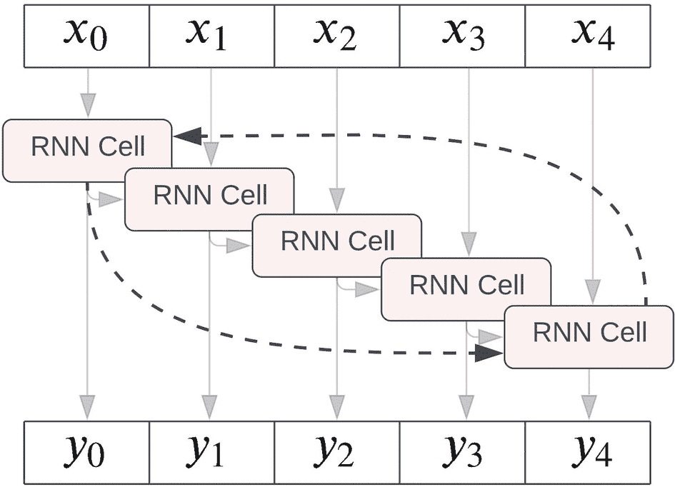

一个具有 5 个输入和 5 个输出的文本序列的插图显示了长期依赖性。在每个时间步，RNN 单元被推动。最后一个输出 y 4 依赖于第一个输入 x 0。

图 6-1

文本序列中长期依赖性的示例

然而，它仍然以任一方向顺序读取：如果某些输出标记 *y*[*k*] 同时依赖于 *x*[0] 和 *x*[*n* − 1]，而某些其他输出标记 *y*[*j*] 同时依赖于 *x*[1] 和 *x*[*n* − 2]，会发生什么？*x*[0] 和 *x*[*n* − 1] 的信号能否“到达”对 *y*[*k*] 的预测，同时“携带”来自 *x*[1] 和 *x*[*n* − 2] 的信号？如果我们有一个双重依赖，其中一个时间步的决策依赖于另一个时间步的决策，而这个决策本身又依赖于原始时间步（见图 6-2）？

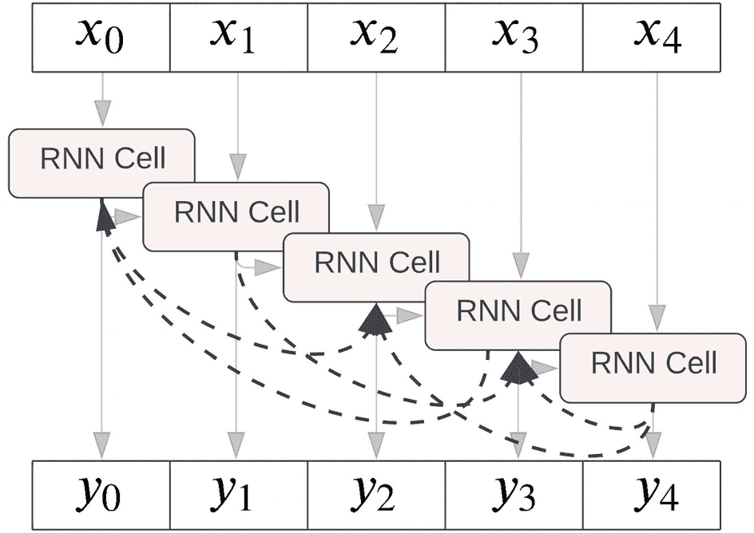

一个具有 5 个输入和 5 个输出的文本序列的插图显示了复杂的依赖性。在每个时间步，RNN 单元被推动。

图 6-2

文本序列中更复杂依赖性的示例

我们看到存在一个长期依赖性的根本问题，即使有了细胞状态和双向升级，循环模型也无法完全捕捉。总有一些未发现的依赖情况无法调和。从根本上说，跟踪依赖性的问题仍然是以顺序方式解决的。这使得难以跟踪决定序列意义和重要性的复杂短和长序列依赖关系。因此，我们经常观察到依赖性遗忘以及在循环模型中高级序列到序列任务上的相对次优性能。

注意力的基本思想，简而言之，就是直接建模时间步之间的依赖关系，而不受必然的顺序处理方向性的阻碍（图 6-3）。

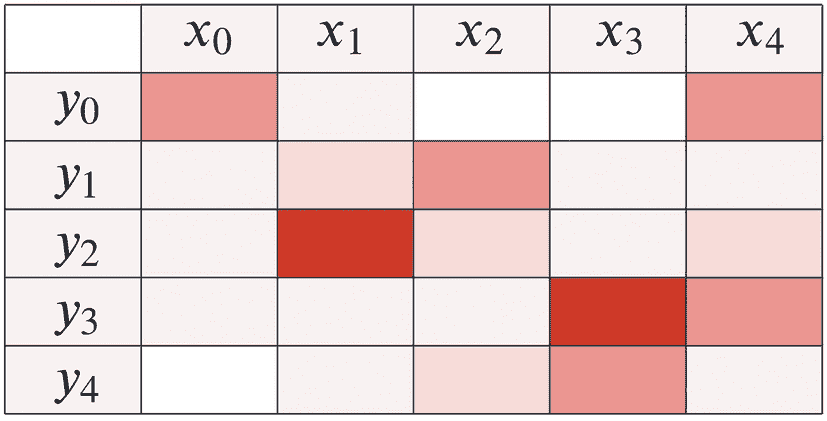

一个 5 行 6 列的表格描述了时间步。所有单元格都从浅到深着色。

图 6-3

展示注意力机制如何计算两个序列时间步之间的注意力分数的视觉表示

在引入 Bahdanau 等人提出的注意力机制之前，序列到序列建模任务使用了一种编码器-解码器结构，其中循环堆栈编码器对输入序列进行编码，循环解码器“解释”编码为新的输出序列域（图 6-4）。Bahdanau 等人将注意力应用于这种编码器-解码器循环结构，如下所示。编码器在每一个时间步 *i* 输出隐藏状态 *h*[*i*]（思考 `return_sequences=True`）。我们可以为某个时间步 *t* 的输出生成一个 *上下文向量*，它是每个隐藏状态（跨越所有时间步）的加权和：

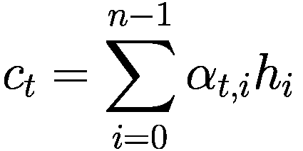

权重 *α*[*t*, *i*] 是 *对齐分数*。这个分数由另一个具有单个隐藏层的前馈神经网络学习，表示每个隐藏状态对预测该时间步输出的重要性。换句话说，对齐分数衡量了由编码器隐藏状态 *h*[*i*] 表示的时间 *i* 的输入与由解码器隐藏状态 *s*[*t*] 表示的时间 *t* 的输出 *y*[*t*] 之间“匹配”或“相关”的程度。对齐分数计算网络接收当前解码器隐藏状态时间步 *s*[*t*] 与当前编码器隐藏状态时间步 *h*[*i*] 的连接，以计算分数。这生成了一组网格状的分数（如图 6-3 所示），其中我们为输入和输出时间步的每个组合获得一个依赖分数。上下文向量，由隐藏状态序列的所有相关部分共同提供信息，然后传递到适当的解码器时间步以进行预测。

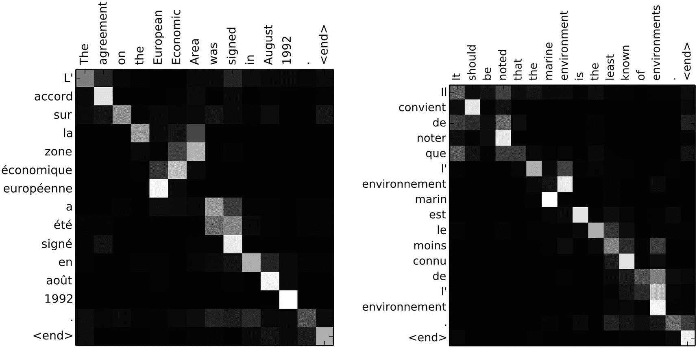

两个注意力矩阵描述了法语时间步和英语翻译。两个矩阵都有 14 列和 14 行。

图 6-5

法语时间步和英语翻译之间的注意力矩阵。注意相关单词之间的“对齐”对应关系——因此称为“学习对齐”。例如，在法语中“zone économique europe énne”以一种非直接的方式与“欧洲经济区”对齐。来自 Bahdanau 等人。

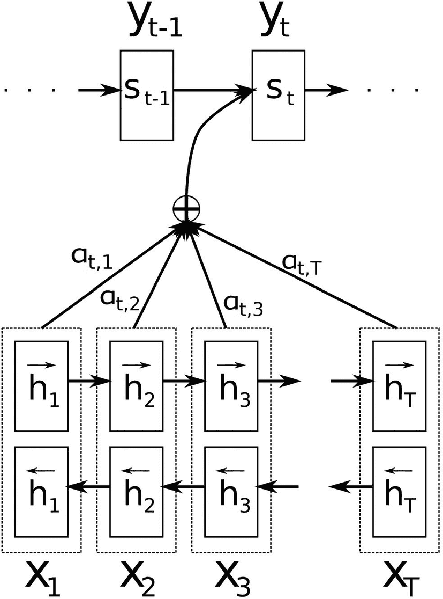

编码器-解码器结构的插图展示了与隐藏状态对齐相关时间步的机制。

图 6-4

展示如何使用注意力机制将相关时间步与双向循环层的隐藏状态对齐。来自 Bahdanau 等人。

然而，还有其他推导对齐分数的方法。点积注意力（由 Luong 等人于 2015 年引入）简单地计算分数为解码器隐藏状态 *s*[*t*] 和编码器隐藏状态 *h*[*i*] 之间的点积：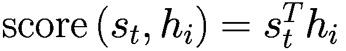。这消除了使用另一个前馈网络学习对齐分数的需求，但要求编码器和解码器隐藏状态已经相互“校准”，使得点积“有意义”。点积注意力与加性注意力具有相同的理论复杂度，但由于矩阵乘法执行优化，前者在实践中更快，因此更常用。缩放点积（由 Vaswani 等人于 2017 年引入）添加了一个缩放因子：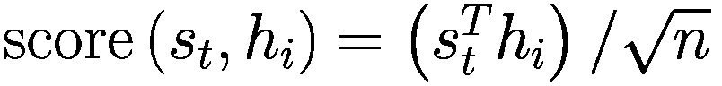，其中 *n* 是隐藏状态的长度。这种缩放是一种技术技巧，允许更小的梯度通过 softmax 函数，该函数在计算分数集后应用。

2016 年由 Wu 等人发表的 Google 神经机器翻译（GNMT）论文^(2)使用具有 Bahdanau 风格的注意力进行翻译的循环编码器-解码器架构（图 6-6）。编码器和解码器架构由每个八个 LSTM 组成，以“捕捉源语言和目标语言中的微妙不规则性。”

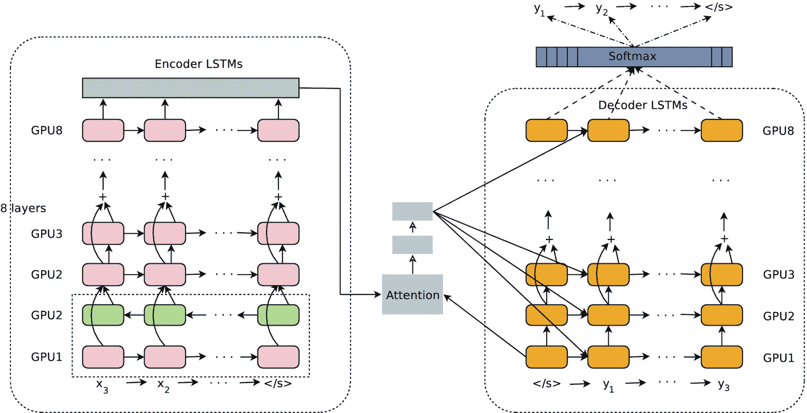

包含编码器-解码器架构的 Google 神经机器翻译结构的插图。编码器和解码器各有 8 个 LSTM 层。

图 6-6

GNMT 系统。来自 Wu 等人。

Wu 等人对 LSTM 层进行了一些修改。为了鼓励更大的梯度流动，GNMT 使用残差 LSTM 而不是传统的堆叠 LSTM（图 6-7）。残差 LSTM 将原始输入在某个时间步长添加到相应的隐藏状态输出中，使得隐藏状态模拟输入和所需输出之间的差异，而不是输出本身。（这可以通过在 Keras 中应用`keras.layers.Add`到原始输入和隐藏状态序列输出中来实现。）

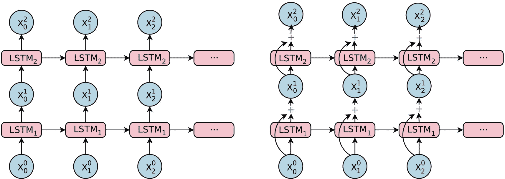

两个插图描述了传统堆叠 LSTM 和残差 LSTM 的结构。这些结构包括输入、隐藏状态和输出。

图 6-7

标准 LSTM（左）和具有残差连接的 LSTM（右）。来自 Wu 等人。

此外，Wu 等人首次在编码器的第一层使用了双向 LSTM 来最大化后续层所获得上下文（见图 6-8）。

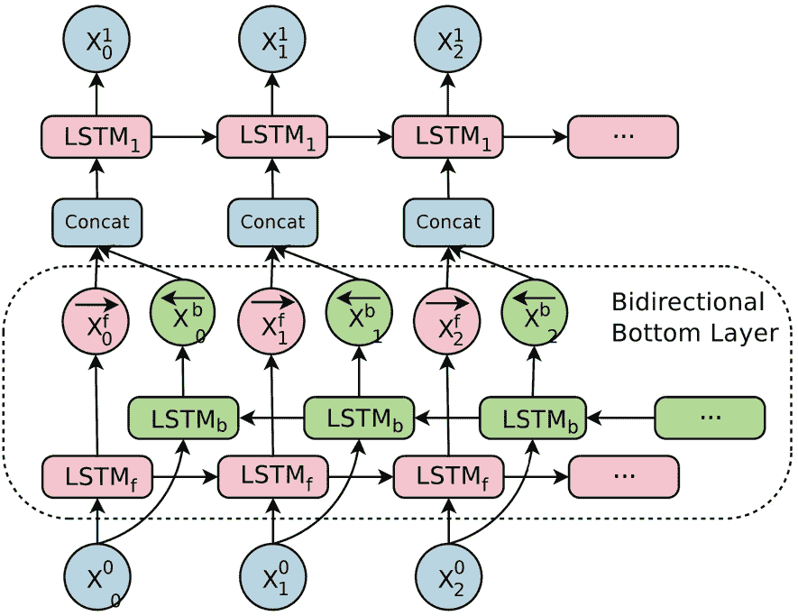

一幅插图展示了双向 LSTM 层的结构。该结构包括输入、双向底层、concat、LSTM 和输出。

图 6-8

双向 LSTM 层。来自 Wu 等人。

### Transformer 架构

2017 年，Vaswani 等人发表的著名论文“Attention Is All You Need”^(3)介绍了 transformer 架构，该架构目前主导着序列到序列问题的工作。虽然注意力机制最初是作为一种改进循环模型中依赖建模的方法而开发的，但 transformer 模型表明，可以使用仅注意力机制来建模语言，而不需要使用循环层。通过反复堆叠一个新颖且更强大的注意力变体——多头注意力——transformer 架构可以更自由地建模跨文本关系和内容。

与 Bahdanau 风格的解码器隐藏状态和编码器隐藏状态不同，transformer 将注意力机制解释为查询-键-值“查找”：

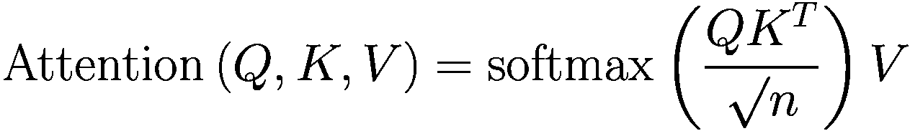

将键值对视为存储在抽象数据库中的元素：如果查询“匹配”到键，它“解锁”了后续使用的所需键。当然，这发生在连续空间而不是正式、严格分割的数据库中。查询和键相互作用以确定关注值*V*的哪些区域。对于每个向量中的某个索引*i*，注意力分数通过查询的第*i*个元素和键的第*i*个元素的乘积最大化。这相应地控制了值中第*i*个元素的重要性（关注程度）。查询和键之间的交互是 Luong 风格的点积注意力机制的缩放版本。

通过从同一向量中导出查询、键和值，可以将注意力重新定义为*自注意力*。自注意力是一种计算序列中任何标记与其他标记之间相关性或依赖关系的方法，而不是不同序列中的标记（如翻译任务的输入和目标语言）。自注意力是 Vaswani 等人提出的 transformer 架构、所有后续 transformer 模型以及基于注意力的表格数据深度学习方法的至关重要机制。

为了允许多个不同的注意力和模式，多头注意力机制允许通过全连接层学习多个不同的查询-键-向量“版本”；每个“版本”都通过缩放点积注意力机制传递，连接，并通过线性层“压缩”为输出（图 6-9）。

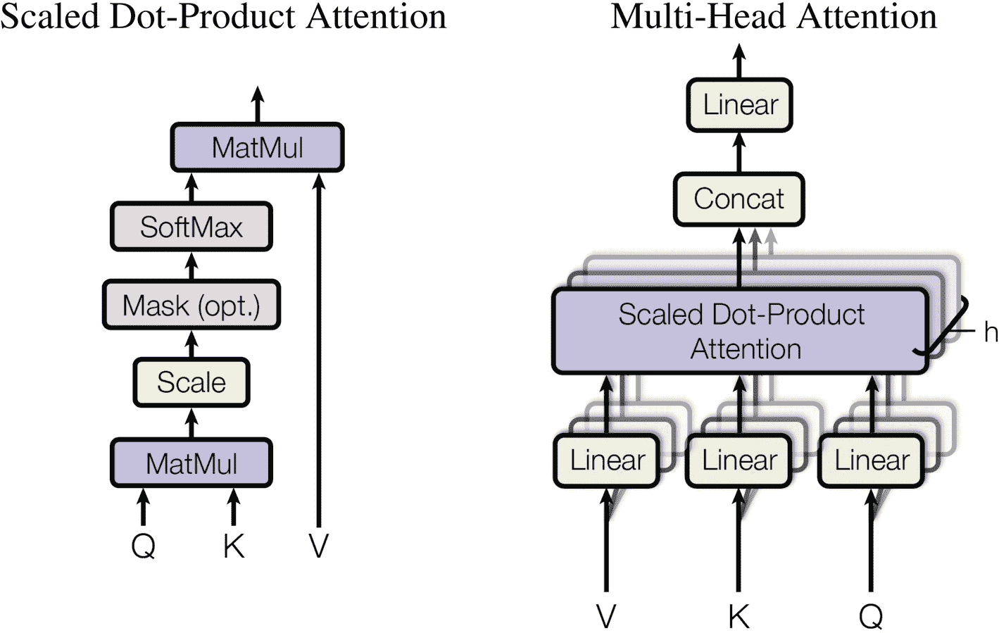

流程图描述了缩放点积注意力机制和多头注意力机制的层级，以及查询-键-值元素。

图 6-9

缩放点积注意力（左）与多头注意力（右）。来自 Vaswani 等人。

如果我们为了认知清晰而稍微进行一些简化，观察 Transformer 模型的真正基础“仅仅是”一系列复杂的全连接层，以复杂、自交互的方式排列，这确实相当令人印象深刻。

注意

虽然我们可能将查询、键和值称为“向量”，但在实践中，这些向量被捆绑成矩阵并一起计算。为了理解清晰，你可以将这些操作视为在向量上发生。

此处的注意力机制是一个用于计算三个输入之间交互的通用结构，可以用不同的方式使用。Transformer 架构以三种不同的方式使用多头注意力：

+   *编码器-解码器注意力*: 查询来自前一个解码器层。键和值来自编码器输出。因此，解码器通过操纵查询来关注编码器序列中的相关位置。

+   *编码器自注意力*: 键、值和查询都来自编码器前一层输出的结果；编码器中的每个位置都可以“访问”前一层中的所有位置。

+   *解码器自注意力*: 键、值和查询都来自解码器的所有前一个位置。

现在，我们可以理解 Vaswani 等人提出的完整 Transformer 架构（图 6-10）。我们首先将位置编码向量添加到输入编码中，对于位置编码向量中的第 *i* 个元素，给定模型嵌入维度 *d*[model] 和时间步 pos，计算如下：


此输入序列随后通过一系列*N*个 transformer 编码器块。每个块由一个多头自注意力机制和一个带有残差连接和层归一化的前馈层组成，每个层之后都进行层归一化。层归一化将同一层中的所有值进行归一化（与批量归一化不同，批量归一化是对批次中所有样本的特定节点进行归一化）。

在模型的解码组件中，当前输出序列（从起始标记开始）被传递到 transformer 解码器块。transformer 解码器块将当前输出序列传递到一个带掩码的多头自注意力机制。这里的掩码通过将相关的注意力时间步长置零，防止过去的时间步长关注未来的时间步长。另一个多头注意力机制同时作用于编码器输出和带掩码的多头注意力机制的输出（从而执行交叉注意力而不是自注意力）。结果通过前馈层进行处理。这个解码器块重复*N*次以产生输出。解码器是自回归的，这意味着输出随后被连接到输出序列，作为下一步的输入。

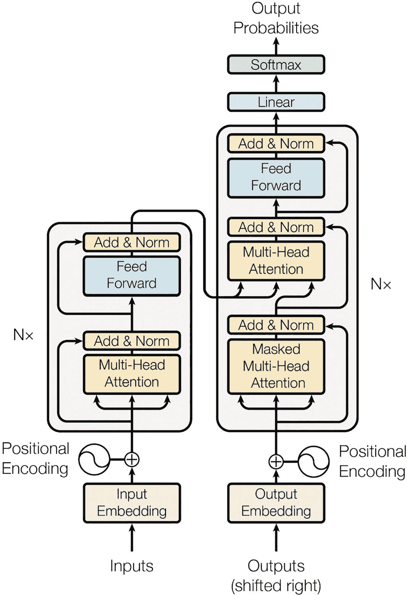

流程图展示了 transformer 架构的工作原理。它包括输入嵌入、输出嵌入、一系列 N 个 transformer 编码器块、线性层和 softmax 层。

图 6-10

完整的 transformer 架构。来自 Vaswani 等人。

transformer 架构在训练成本的一小部分内超越了现有主导模型的性能，这些模型通常在包括语言翻译、词性标注和其他序列到序列问题（如表 6-1 所示）在内的各种任务上使用了循环、卷积和“原始”基于注意力的设计。

表 6-1

在德英和法英翻译数据集上 transformer 模型的性能。对于 BLEU（双语评估助手）指标，数值越低越好。来自 Vaswani 等人。

| -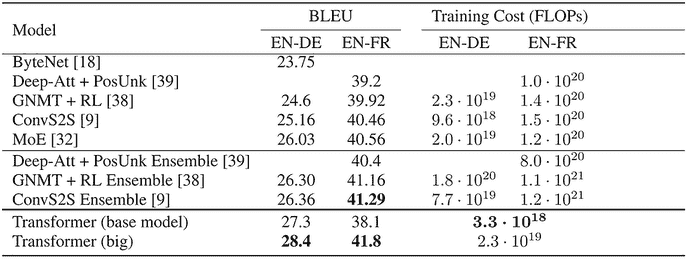一个 10 行 3 列的表格。第 2 列和第 3 列各自细分为 2 个子列，标题分别为 E N-D E 和 E N-F R。 |
| --- |

### BERT 和预训练语言模型

自然语言建模的下一个重大发展是 BERT 模型，由谷歌的 Jacob Devlin 等人于 2019 年的论文“BERT: Pre-training of Deep Bidirectional Transformers for Language Understanding.”中提出。^(4) 作者使用类似 transformer 的架构作为其基础 BERT 模型，包含 12 层，隐藏大小为 768，总共有 12 个注意力头，共计 1.1 亿个参数。BERT-Large 的层数是两倍，隐藏大小为 1024，总共有 16 个注意力头，共计 3.4 亿个参数。

值得注意的是，BERT 架构使用的是 GELU（高斯误差线性单元）激活函数，而不是标准的 ReLU 激活函数。大多数现代语言转换器，包括我们将在本章后面讨论的一些基于注意力的深度表格模型，都使用 GELU。对于某个输入 *x*，GELU 定义为 *x* 乘以从单位正态分布中抽取的某个值大于 *x*^(5) 的概率：

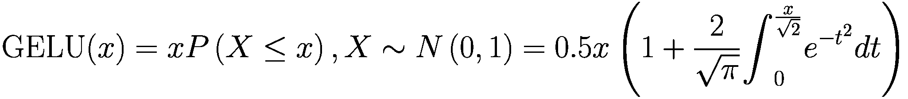

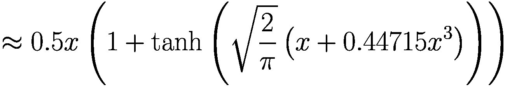

在实践中，它是一个 ReLU 的圆滑版本（见图 6-11）。

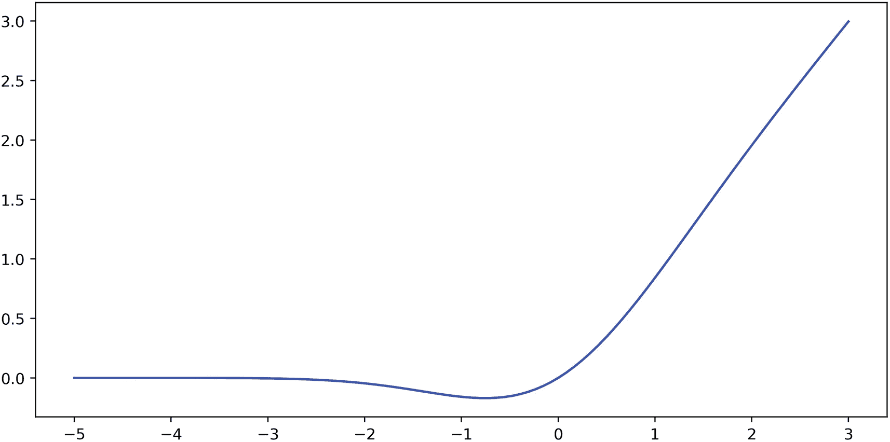

一条线图展示了 G E L U 激活函数。一条指数增长的线从（负 5，0.0）开始，经过（负 0.5，负 0.5），到大约（3，3.0）。

图 6-11

GELU 激活函数

在这种意义上，它在概念上类似于 swish 激活函数，^(6)，它定义为 *x* · *σ*(*x*)，并且在 ReLU “骨架”上 *x* = 0 稍左的位置有一个“凹陷”（见图 6-12）。

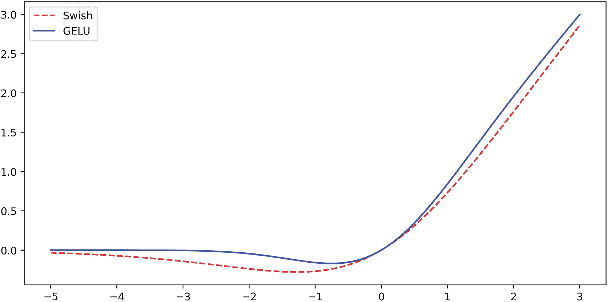

一条线图展示了 G E L U 和 swish 激活函数。G E L U 和 swish 的线条都遵循指数增长的趋势。所有值都是估计的。G E L U，(负 5，0.0)，(负 0.5，0.1)，(3，3.0)。Swish，(负 5，0.0)，(负 1，负 0.3)，(3，2.9)。

图 6-12

GELU 激活函数与类似的 swish 激活函数的对比

BERT 论文的关键贡献在于引入了预训练方案，并在自然语言环境中展示了迁移学习的强大能力（见图 6-13）。虽然用于预训练和微调实际所需任务的架构非常相似或甚至相同（在调整输入/输出大小后），但预训练提高了模型在微调过程中的效率和效力。

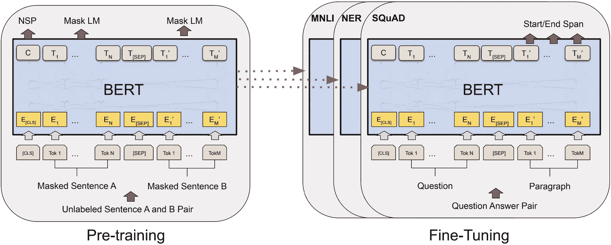

一幅插图展示了 B E R T 的预训练和微调方案。预训练包括未标记的掩码句子。微调包括 3 层问题和段落。

图 6-13

在 BERT 预训练之后进行下游微调任务。来自 Devlin 等人。

任何监督任务都必须有输入和标签；事实证明——在自监督学习的范式中——我们可以通过破坏输入，并训练模型去撤销或纠正这种破坏，从而从输入中推导出标签，在此过程中以标签廉价（免费）、无监督的方式学习关于输入结构的重要信息。Devlin 等人介绍了两种这样的预训练任务：掩码语言建模（MLM）和下句预测（NSP）。

在掩码语言建模中，输入中一定比例（论文中为 15%）的标记会被 `[MASK]` 标记替换，模型被训练来预测这些被掩码的标记。此类预训练任务的目标是鼓励发展深度双向表征，因为模型必须解析被掩码标记两侧的整个结构，才有可能准确推断出真实的标记。

在下句预测任务中，模型会看到两个句子，并被训练去预测在它们所来源的完整文本段落中，第二句是否紧接第一句。这迫使模型不仅要发展跨标记的语义理解，还要学习句子间的语义连贯性。

Devlin 等人发现，BERT 和 BERT-Large 在 GLUE（通用语言理解评估）基准测试任务上的表现均优于竞争对手（表 6-2）。

表 6-2

BERT 在 GLUE 集合中各个数据集上的性能。MNLI：多体裁自然语言推理。QQP：Quora 问题对。QNLI：问题自然语言推理。SST-2：斯坦福情感树库。CoLA：语言可接受性语料库。STS-B：语义文本相似性基准。MRPC：微软研究释义语料库。RTE：识别文本蕴含

| -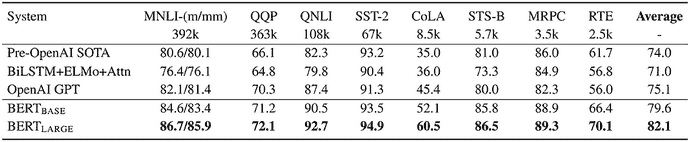一个包含 10 列 5 行的表格。 |
| --- |

几乎所有的现代语言模型都是 Transformer 模型或深受 Transformer 架构启发；本书范围不进一步讨论它们，但为感兴趣的读者整理了一些重要的模型如下：

+   *“通过生成式预训练提升语言理解能力”，Alec Radford 等人，2018 年*：介绍了 GPT 架构，并提出了一个与 BERT 类似的自监督预训练框架。

+   *“通过生成式预训练提升语言理解能力”，Alec Radford 等人，2019 年*：介绍了 GPT-2 架构，并展示了其零样本任务迁移特性。

+   *“语言模型是少样本学习者”，Tom B. Brown 等人，2020 年*：介绍了 GPT-3 架构；深入探讨了零样本和少样本模型特性；提及了社会影响、公平性和偏见问题。

+   *“零样本文本到图像生成”，Aditya Ramesh 等人，2021 年*：介绍了 DALL-E 架构，这是 GPT-3 的一个改进版本，可用于根据文本描述生成图像。

+   *“LaMDA: Language Models for Dialog Applications,” Romal Thoppilan et al. 2022*：介绍了用于对话的 LaMDA 模型系列。LaMDA 最近成为极端争议的主题。

### 退一步看

然而，我们不应忽视，Transformer 并非语言建模的全部和终结，尽管鉴于自然语言处理研究现状，这似乎确实如此。Stephen Merity 于 2019 年独立研究论文“Single Headed Attention RNN: Stop Thinking With Your Head”^(7)，同时是对现代 Transformer 狂热的经验、哲学、技术和深刻幽默的怀疑。只有 Merity 的写作才能像现在这样为自己发声；论文的完整摘要如下：

+   语言建模中的主导方法都沉迷于我年轻时的电视剧——即 Transformer 和芝麻街。这个是 Transformer，那个是 Transformer，还有这里一堆 GPU-TPU-神经形态的晶圆级硅。我们选择了老套且经过验证的技术，用了一个花哨的加密缩写：单头注意力 RNN（SHA-RNN）。作者的唯一目标是要表明，如果我们当时沉迷于一个稍微不同的缩写和稍微不同的结果，整个领域可能已经发展出了不同的方向。我们选取了一个以前仅基于无聊的 LSTM 的强大语言模型，并将其提升到接近最先进的字节级语言模型在 enwik8 上的结果。这项工作没有经过密集的超参数优化，完全在一个普通的台式机上完成，这使得作者的小工作室公寓在旧金山的夏天变得过于温暖。由于作者不耐烦，最终结果在单个 GPU 上可以在 24 小时内完成。注意力机制也可以轻松扩展到大型上下文中，计算量最小。看看那个芝麻街。

受到 Vaswani 等人于 2017 年引入的 Transformer 模型成功的推动，循环模型在研究社区中被宣判走向缓慢的死亡。Merity 认为，现代大型语言模型——似乎是一场为了将模型规模扩大数个数量级超过之前最先进水平的军备竞赛——缺乏可重复性，因此缺乏可持续性和潜在的效率。

为了展示小型架构的力量，Merity 提出了单头注意力 RNN（SHA-RNN）架构。SHA-RNN（图 6-14）应用了一个 LSTM，随后是一个单头点积自注意力机制（图 6-15）和一个“Boom”层，两者都有残差连接。仅对查询键应用密集层，所有其他操作都是非参数化的。该“Boom”层将一个向量从*ℝ*¹⁰²⁴映射到*ℝ*⁴⁰⁹⁶，然后再回到*ℝ*¹⁰²⁴（Boom！）。第一次映射是通过密集层完成的，而第二次是通过在 1D 池化风格的动作中累加相邻的四个元素块来无参数完成的。SHA-RNN 模型可以应用于嵌入输入多次，并在最后一次迭代中通过 softmax 层。这种架构有意参数化和计算上保守的设计使得在相对不先进的计算资源上快速训练成为可能。例如，作者写道他在单个 NVIDIA Titan V GPU 上训练模型。

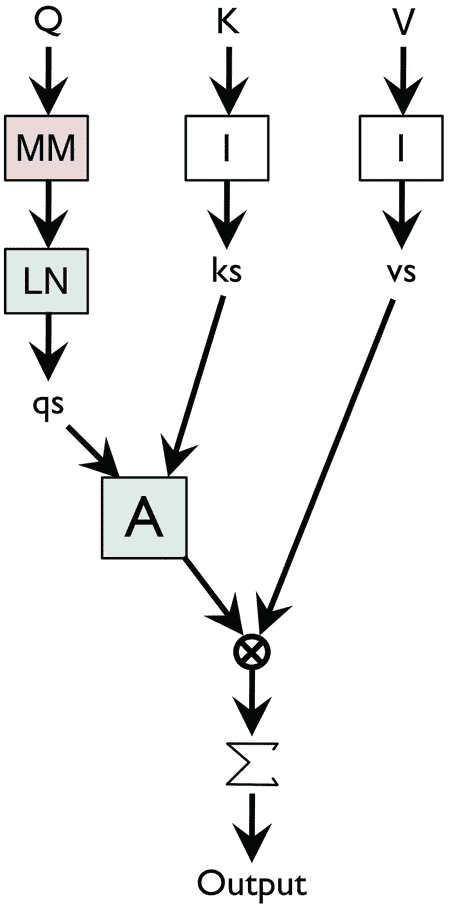

一个流程图展示了 SHA-RNN 中的注意力机制。它包括查询、键和值元素，这些元素生成一个单一输出。

图 6-15

SHA-RNN 块中使用的注意力机制。来源：Merity

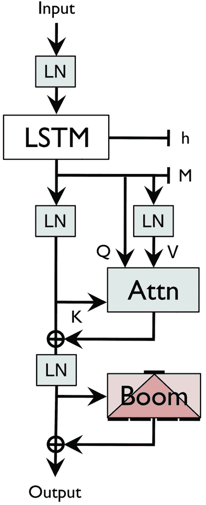

一个流程图展示了单头注意力 RNN 的架构。它包括 LSTM、一个注意力机制和一个“Boom”层。

图 6-14

SHA-RNN 块。来源：Merity

我们看到 SHA-RNN 在与其他类似大小和更大的模型相比时表现更优（见表 6-3）。

表 6-3

在 enwiki 数据集上，不同大小的 SHA-RNN/LSTM 模型与其他模型的性能（每字符比特数）比较。来源：Merity

| -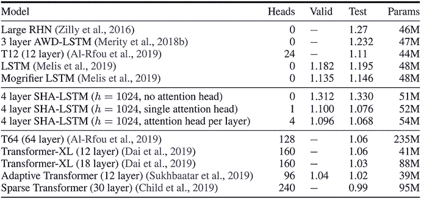一个包含 5 列和 13 行的表格描述了不同模型的性能。列标题为模型、头部、有效、测试和参数。 |
| --- |

论文并不是为了证明 transformer 模型的无用，而是鼓励在现代深度学习研究文化中更加健康地怀疑和重视效率：

+   也许我们因为新的一波进展而过于草率地抛弃了过去的模型时代。也许我们过于执着于现有的垫脚石，以至于无法回头，反而发现自己陷入了特定的路径。

在接下来的几节中，我们将专注于实现基于注意力的语言、多模态和表格上下文的方法。

## 与注意力机制一起工作

在这里，我们将探讨在 Keras 中使用注意力的不同方法：一个简单的 Bahdanau 注意力自定义模型、不同的原生 Keras 注意力形式，以及在序列到序列问题中使用注意力。

### 简单的自定义 Bahdanau 注意力

我们将首先使用 Keras 实现一个定制的 Bahdanau 风格的注意力层。这里的代码是根据 Jason Brownlee 的修改进行了调整。这个层接受一组隐藏输出（`return_sequences=True` 的循环层的输出）并计算一种自我注意力。因为我们不是在编码器-解码器上下文中应用它，所以它类似于单个解码器时间步的 Bahdanau 风格自我注意力。这是可以在各种上下文中使用的几十种突出注意力风味之一。这种特定的风味遵循以下步骤：

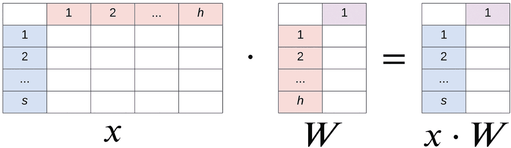

3 张表格描述了点积乘法，x，dot，W = x dot W。输入 x 有 4 行和 5 列。权重 W 有 4 行和 2 列。x dot W 有 4 行 x 和 2 列 W。

图 6-16

输入矩阵和权重矩阵之间的点积

1.  对于某个序列长度 *s* 和隐藏状态长度 *h*，接收一个形状为 (*s*, *h*) 的输入 *x*。

1.  在 *x* 和形状为 (*h*, 1) 的学习权重矩阵 *W* 之间执行点积乘法。结果是形状为 (*s*, 1) 的矩阵/向量（图 6-16）。

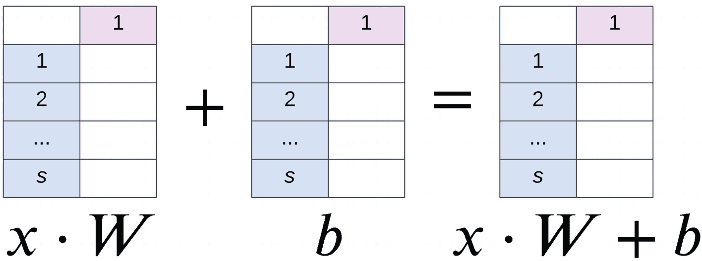

3 张表格描述了将偏置添加到点积，x dot W，+，b = x dot W + b。x dot W 有 4 行和 2 列。b 有 4 行和 2 列。x dot W + b 有 4 行和 2 列。

图 6-17

将偏置添加到输入矩阵和权重矩阵之间的点积

1.  添加一个形状为 (*s*, 1) 的偏置 *b*（图 6-17）。

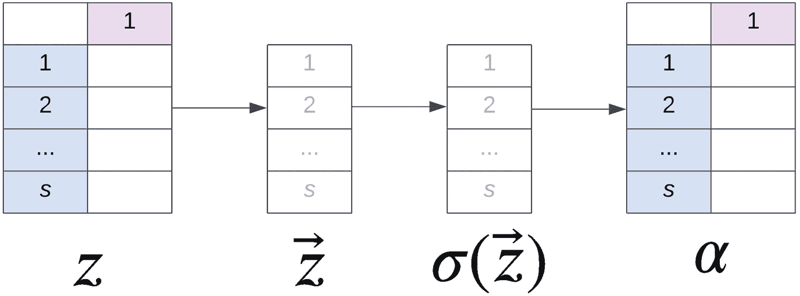

4 张表格。z 有 4 行和 2 列。z 向量有 4 行和 1 列。z 向量的 sigma 有 4 行和 1 列。alpha 有 4 行和 2 列。4 张表格之间有 3 条箭头。

图 6-18

令 *z* = tanh(*x* · *W* + *b*)。在维度压缩之后应用 softmax（表示为 *σ*），然后进行维度扩展。我们得到一个注意力分数矩阵作为结果。

1.  对结果应用双曲正切激活函数。这个结果代表了一个具有一个隐藏层的神经网络的处理结果。

1.  将矩阵的第二个维度压缩，使其成为一个长度为 *s* 的向量。

1.  将 softmax 应用于向量，使得元素之和为 1。这个 *s*-长度向量存储了每个时间步每个隐藏状态的分数。

1.  扩展压缩的维度，使得 *s*-长度向量成为一个形状为 (*s*, 1) 的矩阵。这个矩阵存储了 alpha 值或分数（图 6-18）。

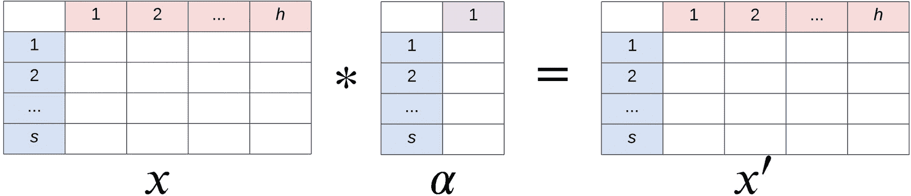

3 张表格描述了 x 乘以 alpha = x'。x 有 4 行和 5 列。alpha 有 4 行和 2 列。x' 有 4 行和 5 列。

图 6-19

将输入乘以注意力分数以产生注意力分数

1.  将每个时间步的分数`s[*t*]`乘以相应的隐藏状态`x[*t*]`。结果是加权后的隐藏状态序列（见图 6-19）。

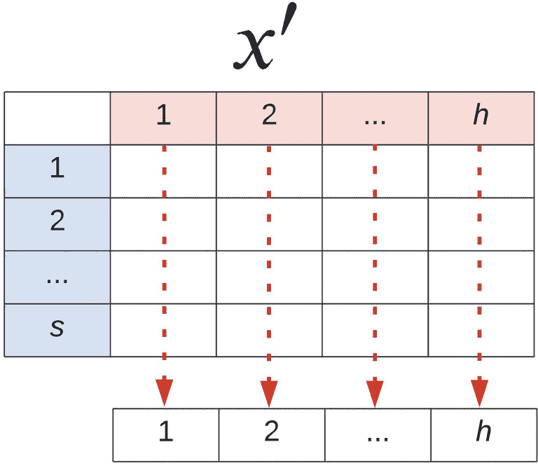

2 个表格。表 1 标题为 x prime，有 4 行和 5 列。表 2 有 1 行和 4 列。从表 1 的第 2 列到第 4 列的 4 个箭头分别连接到表 2 的 4 列。

图 6-20

将输出聚合特征求和

1.  在时间步上求和，使得结果是一个单一的“加权求和隐藏状态”。这个“聚合隐藏状态”由序列中所有时间步的隐藏状态适当告知（见图 6-20）。

要构建一个自定义层（见列表 6-1），我们继承自`keras.layers.Layer`。为了在训练前提供构建图所需的相关形状信息，我们提供了一个`build`函数，它允许 Keras 通过`.add_weight()`“懒加载”构建必要的参数。当我们使用`call()`应用层时，我们只需返回输入的加权求和。权重是`get_alpha`中计算的 alpha 值/分数。

```py
class Attention(keras.layers.Layer):
def __init__(self,**kwargs):
super(Attention,self).__init__(**kwargs)
def build(self,input_shape):
self.W=self.add_weight(name='attention_weight',
shape=(input_shape[-1],1),
initializer='random_normal',
trainable=True)
self.b=self.add_weight(name='attention_bias',
shape=(input_shape[1],1),
initializer='zeros',
trainable=True)
super(Attention, self).build(input_shape)
def call(self,x):
return K.sum(x * self.get_alpha(x), axis=1)
def get_alpha(self,x):
e = K.tanh(K.dot(x, self.W)+self.b)
e = K.squeeze(e, axis=-1)
alpha = K.softmax(e)
alpha = K.expand_dims(alpha, axis=-1)
return alpha
Listing 6-1
A custom attention layer
```

让我们构建一个合成任务：给定一个长度为 8 的正态分布随机向量的十个元素序列，预测第七个和第九个向量的和（见列表 6-2）。其他时间步对预测标签不相关。

```py
x, y = [], []
NUM_SAMPLES = 10_000
next_element = lambda arr: arr[-2] + arr[-4]
vector_switch = [np.zeros((1,8)), np.ones((1,8))]
for i in tqdm(range(NUM_SAMPLES)):
seed = np.random.normal(0, 5, size=(10,8))
x.append(seed)
y.append(next_element(seed))3
x = np.array(x)
y = np.array(y)
from sklearn.model_selection import train_test_split as tts
X_train, X_valid, y_train, y_valid = tts(x, y, train_size=0.8)
Listing 6-2
Generating a synthetic dataset in which the target vector is the sum of the second-to-last and fourth-to-last elements
```

用于模拟此问题的一个架构是双 GRU 堆叠后跟自定义注意力机制（见列表 6-3，图 6-21）。输出是一个向量（回想一下隐藏状态的加权求和）；我们将简单地通过额外的前馈层将其处理成输出。注意，另一种选择是使用`L.RepeatVector`构建一系列这些向量，并应用额外的循环层。

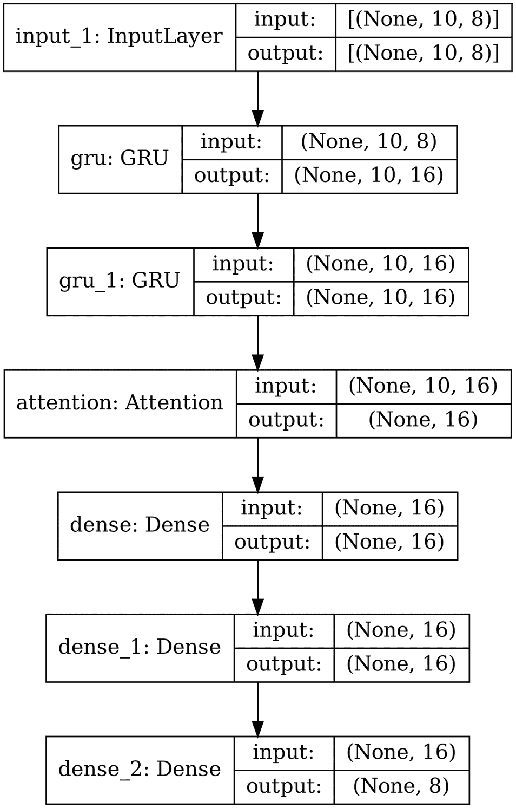

一个流程图描述了合成数据集的结构。流程如下：输入，g r u，g r u 1，注意力，dense，dense 1，和 dense 2 元素。

图 6-21

列表 6-3 中创建的架构图

```py
inp = L.Input((10,8))
lstm1 = L.GRU(16, return_sequences=True)(inp)
lstm2 = L.GRU(16, return_sequences=True)(lstm1)
attention = Attention()
attended = attention(lstm2)
dense = L.Dense(16, activation='relu')(attended)
dense2 = L.Dense(16, activation='relu')(dense)
out = L.Dense(8, activation='linear')(dense2)
model = keras.models.Model(inputs=inp, outputs=out)
Listing 6-3
Constructing an architecture to model the synthetic dataset created in Listing 6-2
```

经过几百个 epoch 的训练后，该模型获得了非常好的训练和验证性能。我们可以构建一个子模型来获取第二个循环层的输出，然后将这个输出传递到自定义注意力层的`.get_alpha()`方法中，以推导出每个时间步的隐藏状态权重/分数（见列表 6-4，图 6-22）。

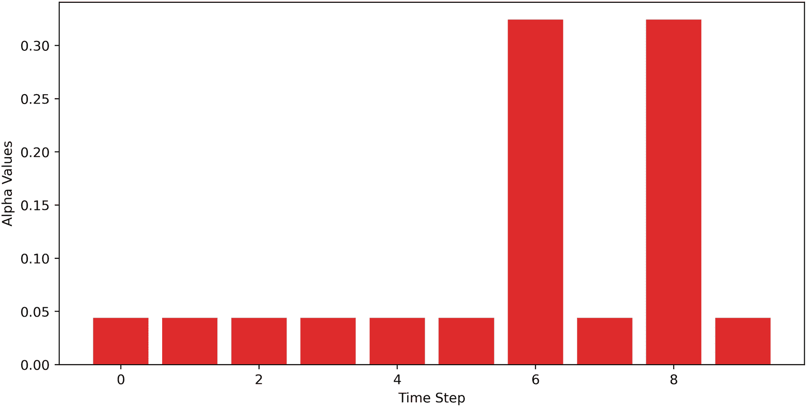

一个 alpha 值与时间步的条形图。数据如下：（0，0.045），（1，0.045），（2，0.045），（3，0.045），（4，0.045），（5，0.045），（6，0.33），（7，0.045），（8，0.33），（9，0.045）。

图 6-22

在整个输入集上平均注意力分数

```py
inp = L.Input((10,8))
rnn1 = model.layers1
rnn2 = model.layers2
submodel = keras.models.Model(inputs=inp, outputs=rnn2)
recurrent_out = tensorflow.constant(submodel.predict(x))
plt.figure(figsize=(10, 5), dpi=400)
plt.bar(range(10), attention.get_alpha(recurrent_out[0,:,0],
color='red')
plt.ylabel('Alpha Values')
plt.xlabel('Time Step')
plt.show()
Listing 6-4
Obtaining and plotting attention scores
```

我们非常清楚地看到，第七和第九个元素在输入序列中的权重显著高于其对应元素。注意力机制允许网络方便地提取时间步的重要成分，而无需承担顺序导航的负担。

### 原生 Keras 注意力

Keras 提供了两种“基础”的注意力实现：Luong 风格的点积注意力（最常用的形式）和加性注意力（Bahdanau 风格，较少使用）。

+   `keras.layers.Attention`：执行 Luong 风格的点积注意力。参数：`use_scale=True` 创建一个额外的可训练标量变量来缩放注意力分数。这允许注意力分数在通过 softmax 后达到更大的范围。`score_mode` 必须设置为 `‘dot’`（默认）或 `‘concat’`。前者使用查询和键向量的点积；后者使用查询和键向量连接的双曲正切，这类似于 Bahdanau 风格的注意力，但没有学习到的 alpha 值。`dropout` 必须设置为介于 0（默认）和 1 之间的浮点数；这表示要丢弃的注意力分数的比例。添加 dropout 迫使注意力机制发展出更鲁棒的全局注意力形式，这些形式不太依赖于特定元素。

+   `keras.layers.AdditiveAttention`：执行 Bahdanau 风格的加性注意力。查询和键相加，通过双曲正切，并在最后一个轴上求和。Keras 实现不使用可训练的权重和偏置来学习 alpha 值。参数：`use_scale=True` 创建一个额外的可训练标量变量来缩放注意力分数。`dropout` 必须设置为介于 0（默认）和 1 之间的浮点数，表示要丢弃的注意力分数的比例。

为了展示用法，让我们创建一个更复杂的合成任务。我们不是将输出作为输入选定时间步的加权和来组合，而是将其作为输入中所有时间步的加权总和来推导（见列表 6-5）。某个时间步 *t* 的权重将计算为 4 · *σ*(*x* − 5) · *σ*(5 − *x*)，其中 *σ* 是 Sigmoid 函数（见图 6-23）。这是 Sigmoid 函数导数的平移和缩放版本，其表达式为 *σ*(*x*) · *σ*(−*x*)。

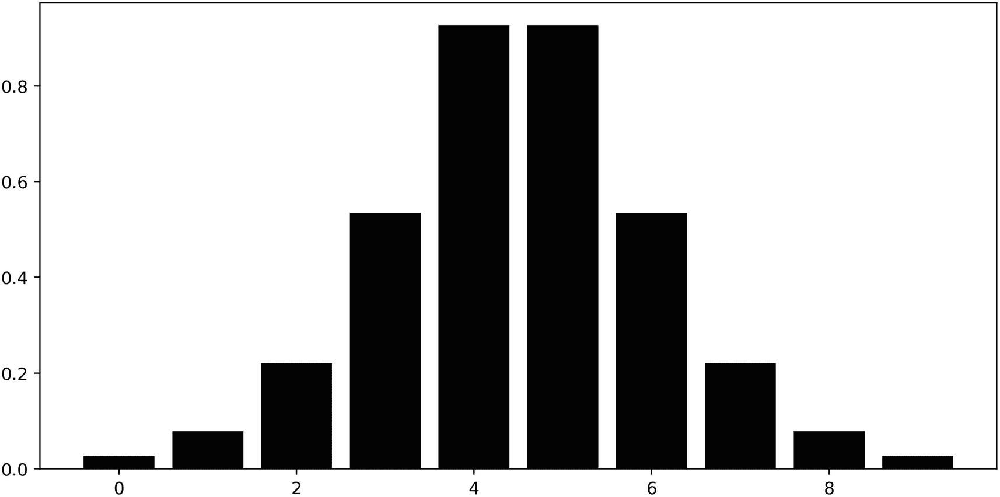

柱状图展示了时间步的权重。数据如下：(0, 0.02), (1, 0.08), (2, 0.23), (3, 0.5), (4, 0.9), (5, 0.9), (6, 0.5), (7, 0.23), (8, 0.08), 和 (9, 0.02)。

图 6-23

由 4 · *σ*(*x* − 5) · *σ*(5 − *x*)确定的权重，形状为准正态分布

```py
sigmoid = lambda x: 1/(1 + np.exp(-x))
sigmoid_deriv = lambda x: sigmoid(x) * sigmoid(-x)
adjusted_sigmoid_deriv = lambda x: 4 * sigmoid_deriv(x - 5)
weights = adjusted_sigmoid_deriv(np.linspace(0, 10, 10))
x, y = [], []
NUM_SAMPLES = 10_000
next_element = lambda arr: np.dot(weights, arr)
for i in tqdm(range(NUM_SAMPLES)):
seed = np.random.normal(0, 1, size=(10,8))
x.append(seed)
y.append(next_element(seed))
x = np.array(x)
y = np.array(y)
from sklearn.model_selection import train_test_split as tts
X_train, X_valid, y_train, y_valid = tts(x, y, train_size=0.8)
Listing 6-5
Deriving a synthetic dataset with a quasi-normally distributed weighted sum
```

让我们构建模型架构（见图 6-24）。在用双向 LSTM 提取相关特征后，我们将通过将第一个 LSTM 的输出作为列表中的查询和键来执行缩放 Luong 风格的点积注意力自我注意力（见列表 6-6）。如果没有提供值，则假定键和值相同。在这种情况下，查询、键和值都相同。注意力机制的输出通过另一个 LSTM 传递。

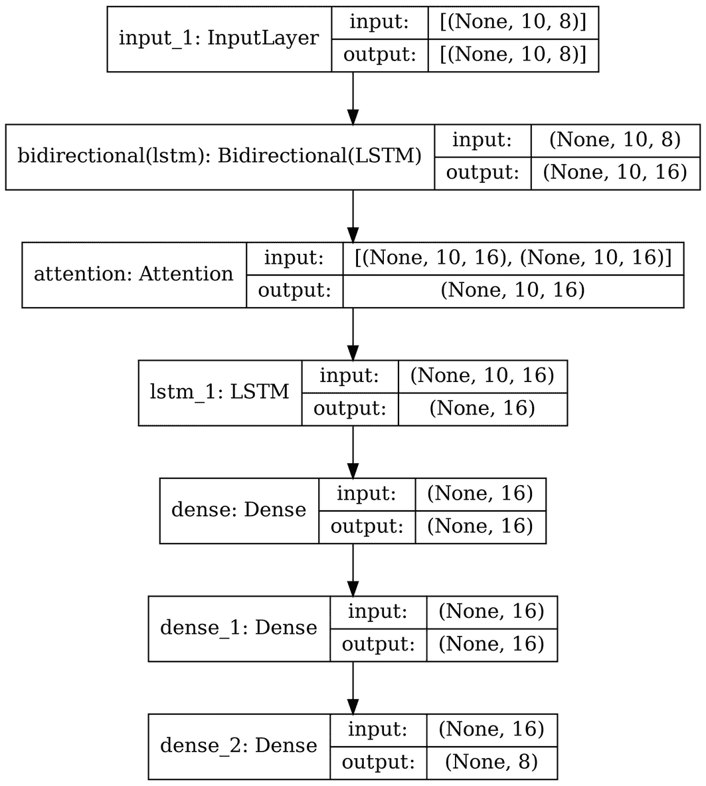

使用 l s t m 构建的合成数据集结构的流程图。它按以下顺序流动：输入 1，双向 L S T M，注意力，l s t m 1，密集，dense 1 和 dense 2 元素。

图 6-24

列表 6-6 中创建的架构图

```py
inp = L.Input((10,8))
lstm1 = L.Bidirectional(L.LSTM(8, return_sequences=True))(inp)
attended = L.Attention(use_scale=True)([lstm1, lstm1])
lstm2 = L.LSTM(16)(attended)
dense = L.Dense(16, activation='relu')(lstm2)
dense2 = L.Dense(16, activation='relu')(dense)
out = L.Dense(8, activation='linear')(dense2)
model = keras.models.Model(inputs=inp, outputs=out)
model.compile(optimizer='adam', loss='mse', metrics=['mae'])
history = model.fit(X_train, y_train, epochs=1000,
validation_data=(X_valid, y_valid))
Listing 6-6
Defining the architecture and fitting on the synthetic dataset
```

当调用注意力层时，除了输入之外，我们还可以通过传递 `return_attention_scores=True` 来收集注意力分数。我们可以将模型的部分重建为子模型以收集输出的注意力分数（见列表 6-7）。

```py
lstm1_ = model.layers1
_, attn = model.layers2
submodel = keras.models.Model(inputs=inp, outputs=attn)
scores = submodel.predict(X_train)
Listing 6-7
Obtaining attention scores
```

如果您没有关于留下“开放变量”的哲学问题，则收集注意力分数的更方便的方法是将 `attended = L.Attention(...)` 替换为 `attended, scores = L.Attention(return_attention_scores=True, ...)` 并直接构建子模型 `submodel = keras.models.Model(inputs=inp, outputs=scores)`。

注意力分数的形状为（样本数量，查询序列长度，值/键序列长度）。生成的矩阵可视化显示了哪些时间步长会自我关注其他时间步长（见列表 6-8，图 6-25）。

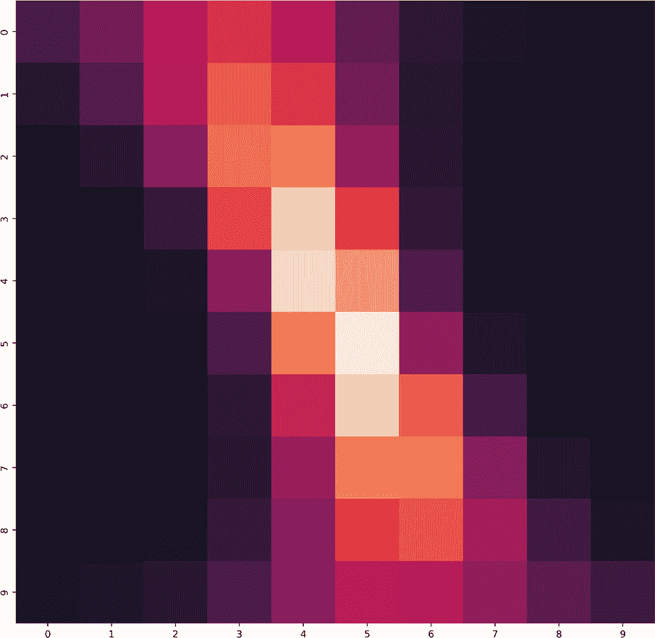

热图描述了一个具有 10 列和 10 行的双向点积自我注意力矩阵。单元格从浅到深着色。颜色梯度从左上角到右下角对角线。

图 6-25

带有点积注意力的双向模型的自我注意力矩阵

```py
plt.figure(figsize=(12,12), dpi=400)
sns.heatmap(scores[0,:,:], cbar=False)
plt.show()
Listing 6-8
Plotting a sample attention score map
```

如我们所预期，自我注意力的总体方向沿着身份对角线进行；也就是说，时间步长 *t* 通常会关注接近 *t* 的时间步长。按大小排序的最大注意力值（通过亮度/纯度视觉表示）出现在 *t* ∈ [4, 5]，随着 *t* 的增加或减少而衰减，这与每个时间步长在输出向量上的权重相匹配。

我们可以通过将列表 6-6 中的 `L.Attention` 更改为 `L.AdditiveAttention` 来切换到加性注意力。在此数据集上训练的此类模型的自我注意力矩阵如下所示（见图 6-26）。

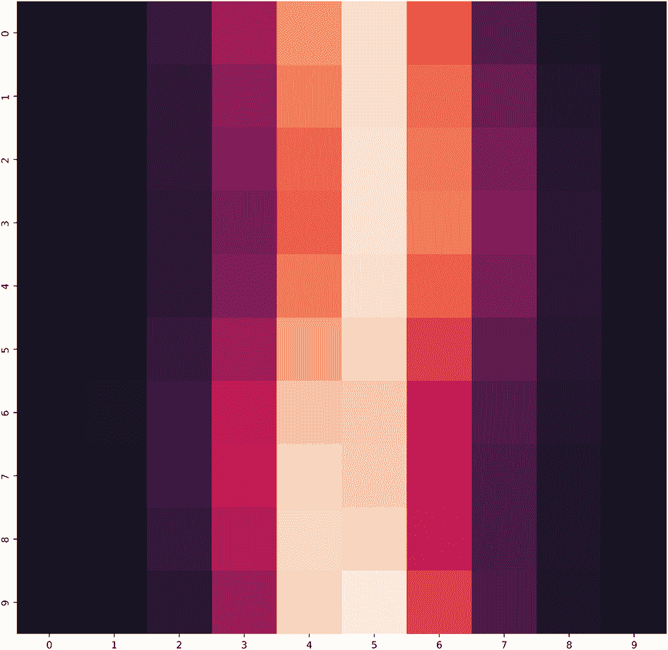

热图描述了一个具有 10 列和 10 行的双向加性注意力自我注意力矩阵。单元格从浅到深着色。颜色梯度在中间是垂直的。

图 6-26

带有加性注意力的双向模型的自我注意力矩阵

注意，从加性注意力导出的自注意力矩阵比 Luong 风格的注意力矩阵垂直得多。注意力分数通常与查询（“*y*-轴”）无关，而高度依赖于键（“*x*-轴”）。

我们看到加性注意力已经学会了注意力表示，这些表示与查询值完全独立。仅凭键本身就足以确定机制如何关注值。鉴于这个问题的简单性，这种行为是可能的。尽管如此，我们注意到注意力机制仍然以最高的关注度关注键的中间时间步，随着关注度分数向开始和结束时间步的衰减。虽然加性注意力和点积注意力获得了相似的高分，但它们的注意力特征图却相当不同。

作为另一个实验，让我们移除第一个编码层的双向性，并观察对注意力图的影响。点积注意力特征图（图 6-27）显示出向后期时间步的“倾斜”，就像风从东南方向吹来，推动该方向上注意力值的幅度。最高的注意力分数不再均匀分布在[4, 5] × [4, 5]时间步网格中，而是集中在(5, 5) – 重量时间步峰值区域的后期末端。这是有道理的：没有双向性，后期时间步仍然可以“回顾”，但早期时间步则不能“前瞻”。

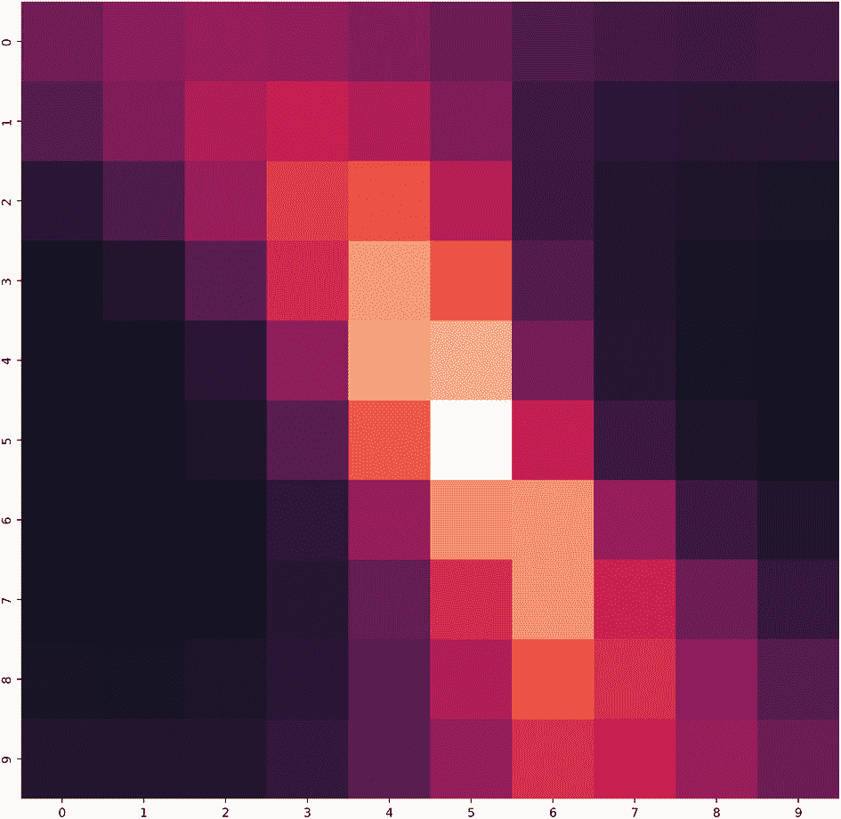

热图展示了具有 10 列和 10 行的单向点积自注意力矩阵。单元格颜色从浅到深。颜色渐变从左上角到右下角是斜的。

图 6-27

基于点积注意力的单向模型的自注意力矩阵

当从使用加性注意力机制拟合的模型中移除双向性时，我们观察到类似移位的现象（图 6-28）。

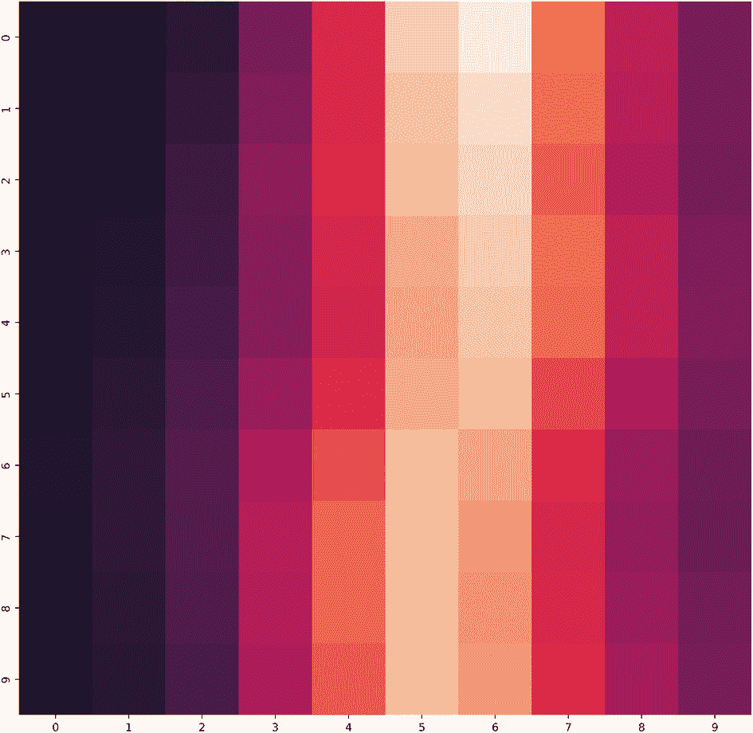

热图展示了具有 10 列和 10 行的单向加性注意力矩阵。单元格颜色从浅到深。颜色渐变在中间是垂直的。

图 6-28

基于加性注意力的单向模型的自注意力矩阵

让我们再次调整我们的问题，以实验多头注意力：而不是使用单峰分布进行加权，我们将使用通过添加对称移位单峰分布形成的双峰分布。令 *σ*^′(*x*) = *σ*(*x*) · *σ*(−*x*); 时间步 *x* 的权重由 *w*(*x*) = 4 · (*σ*^′(*x* − 2) + *σ*^′(*x* − 8)) 给出（列表 6-9，图 6-29）。

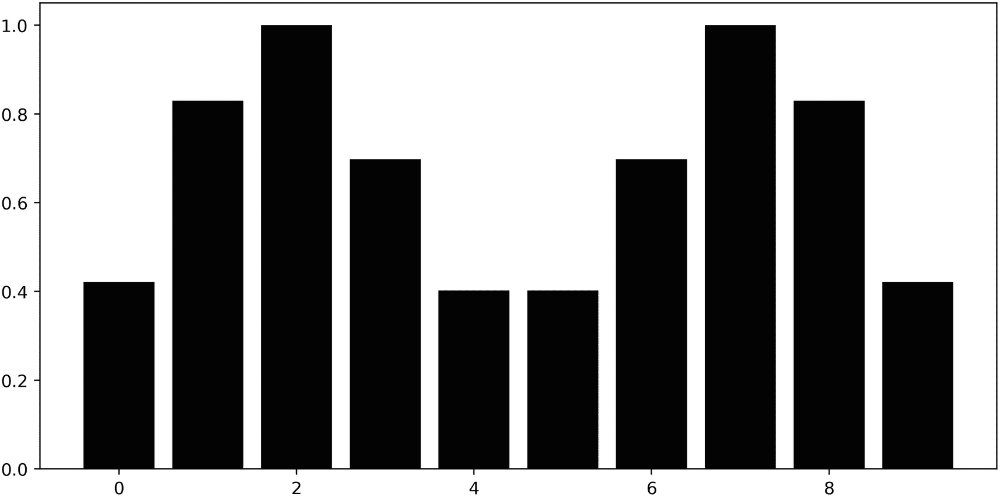

时间步长的权重条形图。以下数据是近似的。（0，0.41），（1，0.81），（2，1.0），（3，0.7），（4，0.4），（5，0.4），（6，0.7），（7，1.0），（8，0.81），和（9，0.41）。

图 6-29

由 4·(*σ*^′(*x* − 2) + *σ*^′(*x* − 8))确定的权重，形状为准正态分布

```py
sigmoid = lambda x: 1/(1 + np.exp(-x))
sigmoid_deriv = lambda x: sigmoid(x) * sigmoid(-x)
adjusted_sigmoid_deriv1 = lambda x: 4 * sigmoid_deriv(x - 2)
adjusted_sigmoid_deriv2 = lambda x: 4 * sigmoid_deriv(x - 8)
x = np.linspace(0, 10, 10)
weights = adjusted_sigmoid_deriv1(x) + adjusted_sigmoid_deriv2(x)
Listing 6-9
Deriving a bimodal distribution for a weighted sum synthetic dataset
```

在 Keras 中使用多头注意力时，指定头的数量和输入键的维度（列表 6-10）。当调用注意力层并将其作为图的一部分链接时，将查询和键作为单独的参数传递，而不是作为捆绑列表中的元素（如`L.AdditiveAttention`和`L.Attention`）。默认情况下，`value_dim`设置为`key_dim`。键维度是密集层将其投影到的维度数。如果需要，也可以指定键。

```py
inp = L.Input((10,8))
lstm1 = L.Bidirectional(L.LSTM(8, return_sequences=True))(inp)
attended, scores = L.MultiHeadAttention(num_heads=4,
key_dim=16)(lstm1,
lstm1,
return_attention_scores=True)
lstm2 = L.LSTM(16)(attended)
dense = L.Dense(16, activation='relu')(lstm2)
dense2 = L.Dense(16, activation='relu')(dense)
out = L.Dense(8, activation='linear')(dense2)
model = keras.models.Model(inputs=inp, outputs=out)
Listing 6-10
Deriving a bidirectional recurrent model with multi-head attention to fit on the synthetic dataset derived in Listing 6-9
```

在这种情况下，导出的分数形状为（样本数量，头数量，序列长度，序列长度）。我们可以绘制它们（列表 6-11）来解释模型如何关注序列（图 6-30）。

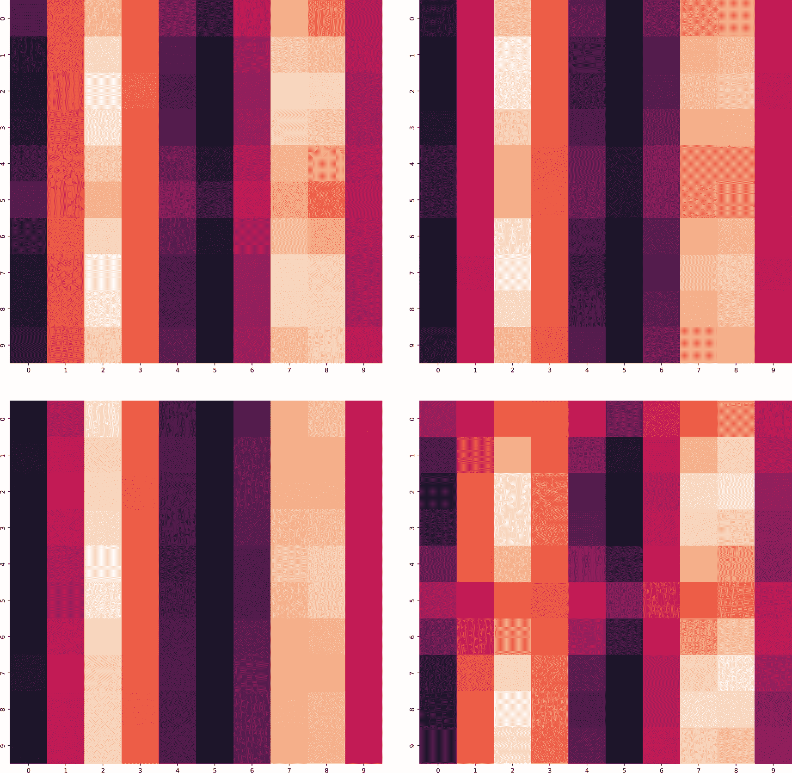

4 个热图描述了多头注意力模型的注意力分数。每个矩阵有 10 列和 10 行，单元格颜色不同。

图 6-30

多头注意力模型中每个样本的四个注意力分数

```py
plt.figure(figsize=(24,24), dpi=400)
for i in range(2):
for j in range(2):
plt.subplot(2, 2, 2*i + j + 1)
sns.heatmap(scores[0,2*i + j,:,:], cbar=False)
plt.show()
Listing 6-11
Plotting the attention scores of the multi-head attention mechanism
```

### 序列到序列任务中的注意力

最后，我们还将演示 Keras 注意力机制在原始的序列到序列问题中的使用，即 Bahdanau 风格。考虑以下 seq2seq 问题，其中目标序列的第*i*个时间步是输入序列的第*i* + 4 个、*i* + 5 个和*i* + 6 个时间步的和（列表 6-12）。（原始输入序列是随机生成的向量序列。） 

```py
x, y = [], []
NUM_SAMPLES = 10_000
next_element = lambda arr: np.stack([arr[(i+4)%10] + arr[(i+5)%10] + arr[(i+6)%10] for i in range(10)])
for i in tqdm(range(NUM_SAMPLES)):
seed = np.random.normal(0, 5, size=(10,8))
x.append(seed)
y.append(next_element(seed))
x = np.array(x)
y = np.array(y)
from sklearn.model_selection import train_test_split as tts
X_train, X_valid, y_train, y_valid = tts(x, y, train_size=0.8)
Listing 6-12
Deriving a synthetic sequence-to-sequence dataset
```

我们将使用两个 LSTM 层对输入进行编码，第一个层是双向的。编码器的输出传递到解码器。我们计算解码器隐藏状态（查询）和编码器输出/隐藏状态（键*和*值）之间的注意力结果，以确定编码器中哪些元素是相关的需要关注的。解码器输出与注意力机制输出连接。对于结果序列中的每个时间步，我们使用`L.TimeDistributed`将这个连接向量投影到一个完全连接的输出层（列表 6-13，图 6-31）。时间分布包装器将相同的层应用于多个时间切片，这样我们就可以将解码器输出和关注的编码的连接投影到输出“词汇”中。

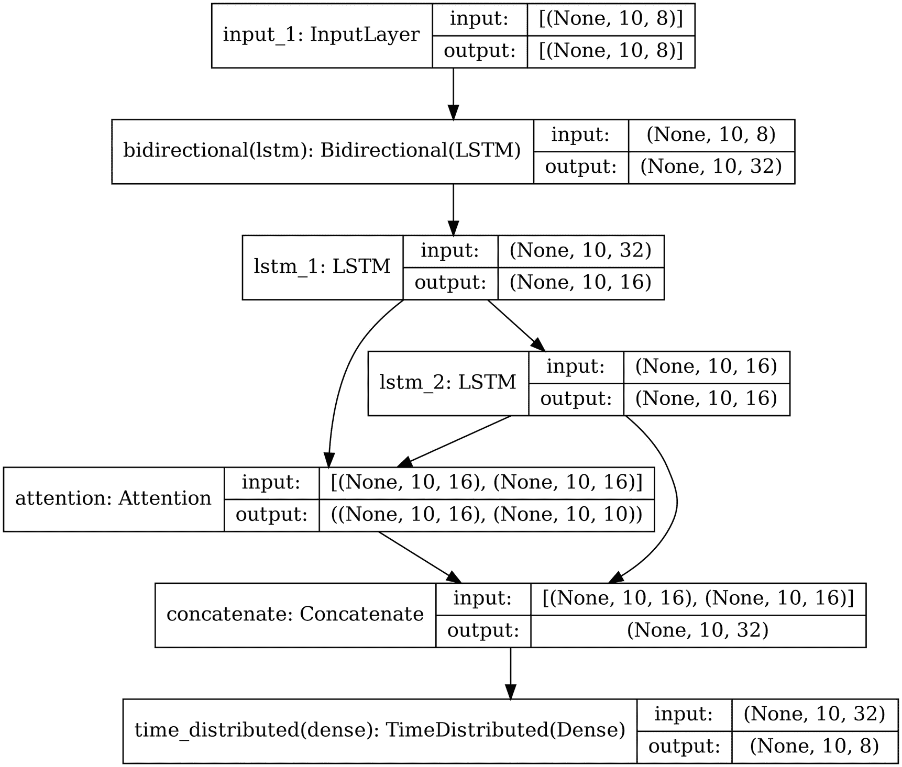

使用双向 LSTM 的合成数据集结构的流程图。它按以下顺序流动：输入 1，双向 LSTM，LSTM 1，LSTM 2，注意力，连接，和时间分布密集元素。

图 6-31

列表 6-13 中创建的架构图

```py
inp = L.Input((10,8))
encoder = L.Bidirectional(L.LSTM(16, return_sequences=True))(inp)
encoder2 = L.LSTM(16, return_sequences=True)(encoder)
decoder = L.LSTM(16, return_sequences=True)(encoder2)
attn, scores = L.Attention(use_scale=True)([decoder, encoder2],
return_attention_scores=True)
concat = L.Concatenate()([decoder, attn])
out = L.TimeDistributed(L.Dense(8, activation='linear'))(concat)
model = keras.models.Model(inputs=inp, outputs=out)
Listing 6-13
Creating a sequence-to-sequence model with attention
```

我们可以如下可视化一些样本的学习到的注意力分数（代码清单 6-14，图 6-32）。


4 个热图展示了多头注意力模型的注意力分数。每个矩阵有 10 列和 10 行，单元格颜色不同。每个图表绘制了两条斜线。

图 6-32

来自同一注意力层不同头的单个样本的四个注意力分数矩阵

```py
submodel = keras.models.Model(inputs=inp, outputs=scores)
scores = submodel.predict(X_train)
for i in range(4):
plt.figure(figsize=(12,12), dpi=400)
sns.heatmap(scores[i,:,:], cbar=False)
plt.show()
Listing 6-14
Plotting sample attention mechanisms from the sequence-to-sequence model
```

注意，我们的模型学习到了一个相当酷的模式，这表明了输出序列的真实推导。在查询的第一个时间步（代表输出序列，注意力网格的第一行）中，机制大致关注键（代表输入序列）的第四到第六个时间步之间的区域。在第二个时间步，关注的区域发生了移动；当我们沿着查询的时间维度前进时，关注的区域会环绕。

您可以使用这种设计来解决序列到序列问题，以及以创新的方式解决序列到向量或多模态序列和表格到*x*问题。例如，您可以构建一个多任务自动编码器设计（见第八章），它既使用序列到序列的骨干网络，又有一个额外的输出，从编码器输出和/或注意力编码器输出连接。

### 使用注意力改进自然语言模型

注意力被构建并继续主导语言建模。在第五章中，我们构建并训练了循环文本模型。在某些情况下，我们可以通过添加注意力机制来改进这些模型。（请注意，将注意力直接应用于非 seq2seq 文本问题的成功是有限的，并且取决于具体情况。）

我们将在 TripAdvisor 酒店评论数据集上对简单的文本到向量问题应用注意力。该数据集包含从评论平台 TripAdvisor 收集的酒店评论及其 1-5 星级的评分。目标是根据评论文本预测评分（代码清单 6-15，图 6-33）。

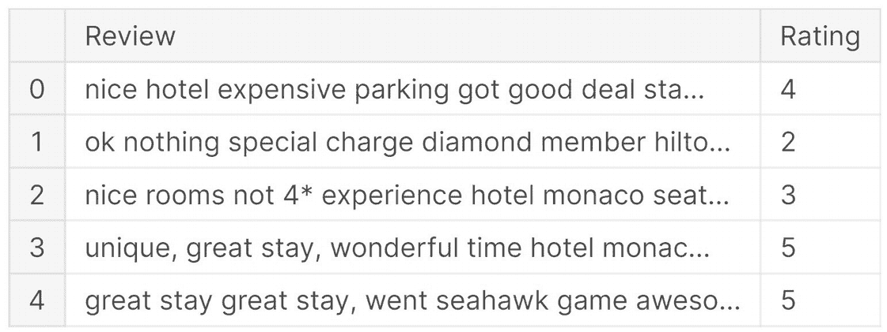

一个 5 行 3 列的表格描述了酒店评论和评分。

图 6-33

TripAdvisor 评论数据集的头部

```py
data = pd.read_csv('../input/trip-advisor-hotel-reviews/tripadvisor_hotel_reviews.csv')
data.head()
Listing 6-15
Reading and displaying the TripAdvisor dataset
```

让我们从创建一个模型开始，该模型在上一节的第一小节（代码清单 6-16，图 6-34）中实现了自定义的注意力机制。

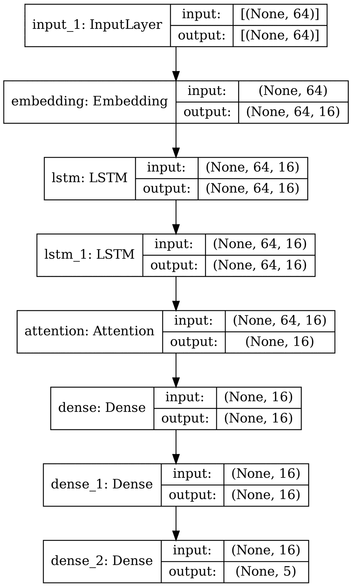

使用双 l s t m 构建的合成数据集的结构流程图。它按输入 1、嵌入、l s t m、l s t m 1、注意力、密集、密集 1 和密集 2 元素流动。

图 6-34

列表 6-16 中创建的架构图

```py
inp = L.Input((SEQ_LEN,))
embed = L.Embedding(MAX_TOKENS, EMBEDDING_DIM)(inp)
rnn1 = L.LSTM(16, return_sequences=True)(embed)
rnn2 = L.LSTM(16, return_sequences=True)(rnn1)
attn = Attention()(rnn2)
dense = L.Dense(16, activation='relu')(attn)
dense2 = L.Dense(16, activation='relu')(dense)
out = L.Dense(5, activation='softmax')(dense2)
model = keras.models.Model(inputs=inp, outputs=out)
Listing 6-16
A double-LSTM natural language stack
```

我们可以使用子模型来获取某些输入的注意力分数，并在每个时间步长可视化这些分数（列表 6-17，图 6-35 到 6-37）。

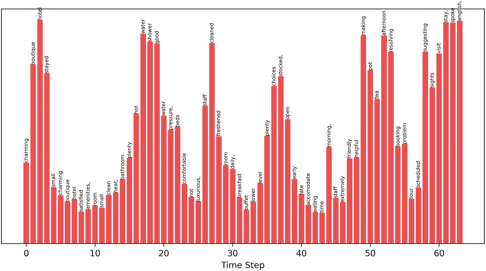

一条柱状图展示了从 0 到 60 个时间步长的索引 2 的注意力分数。得分最高的单词是“hotel”和“English”。

图 6-37

每个序列中每个单词的注意力分数，索引 2

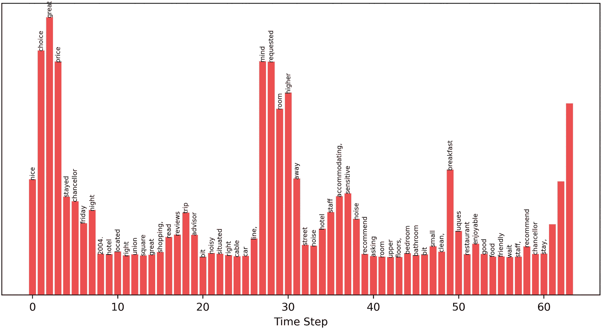

基于 0 到 60 个时间步长的索引 1 的注意力分数柱状图。得分最高的单词是“great”。

图 6-36

每个序列中每个单词的注意力分数，索引 1

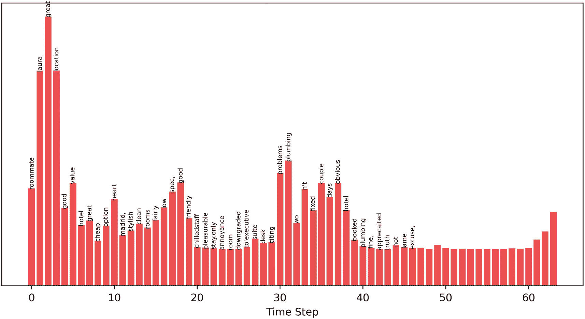

基于 0 到 60 个时间步长的索引 0 的注意力分数柱状图。得分最高的单词是“great”。

图 6-35

每个序列中每个单词的注意力分数，索引 0

```py
inp = L.Input((SEQ_LEN,))
embed = model.layers1
rnn1 = model.layers2
rnn2 = model.layers3
submodel = keras.models.Model(inputs=inp, outputs=rnn2)
for index in range(3):
fig, ax = plt.subplots(figsize=(10, 5), dpi=400)
lstm_encodings = tensorflow.constant(submodel.predict(X_train_vec[index:index+1]))
alpha_values = model.layers[4].get_alpha(lstm_encodings)[0,:,0]
bars = ax.bar(range(SEQ_LEN), alpha_values, color='red', alpha=0.7)
text = X_train[X_train.index[index]].split(' ')
text += ['']*(SEQ_LEN - len(text))
for i, bar in enumerate(bars):
height = bar.get_height()
ax.text(x=bar.get_x() + bar.get_width() / 2 - 0.02, y=height+.0002,
rotation = 90, size=6,
s=text[i],
ha='center')
ax.set_ylabel('Alpha Values')
ax.set_xlabel('Time Step')
ax.axes.yaxis.set_visible(False)
plt.show()
Listing 6-17
Obtaining and plotting attention scores for each word in the sequence
```

我们可以看到序列中前几个单词的注意力很强，以及中间的一些相关段。

我们还可以使用原生 Keras 多头注意力方法（列表 6-18，图 6-38）。

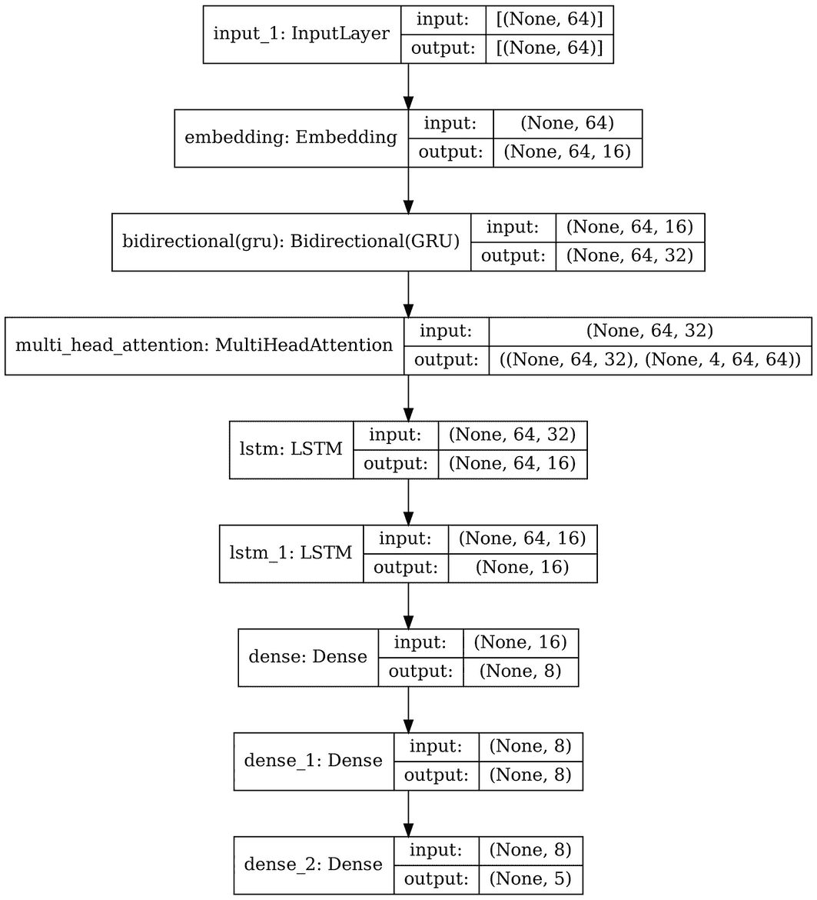

使用多头注意力模型的合成数据集结构的流程图。它按以下顺序流动：输入 1、嵌入、双向 g r u、多头注意力、l s t m、l s t m 1、dense、dense 1 和 dense 2 元素。

图 6-38

列表 6-18 中定义的架构的图示

```py
inp = L.Input((SEQ_LEN,))
embed = L.Embedding(MAX_TOKENS, EMBEDDING_DIM)(inp)
rnn1 = L.Bidirectional(L.GRU(16, return_sequences=True))(embed)
attn, scores = L.MultiHeadAttention(num_heads=4, key_dim=4)(rnn1, rnn1,
return_attention_scores=True)
rnn2 = L.LSTM(16, return_sequences=True)(attn)
rnn3 = L.LSTM(16)(rnn2)
dense = L.Dense(8, activation='relu')(rnn3)
dense2 = L.Dense(8, activation='relu')(dense)
out = L.Dense(5, activation='softmax')(dense2)
model = keras.models.Model(inputs=inp, outputs=out)
Listing 6-18
Using a multi-head attention version of the model in Listing 6-16
```

注意力掩码也可以类似地可视化（图 6-39）。我们观察到这里的注意力机制正在学习大量的跨序列依赖/关系。特别是，请注意形容词及其所指的名词（例如，“place”、“paradise”、“fabulous”等）具有高自注意力，而无关组件具有低自注意力分数。这个自注意力矩阵显示了大量的垂直/水平性，这意味着某些单词在整个序列中具有一致的语义相关性。

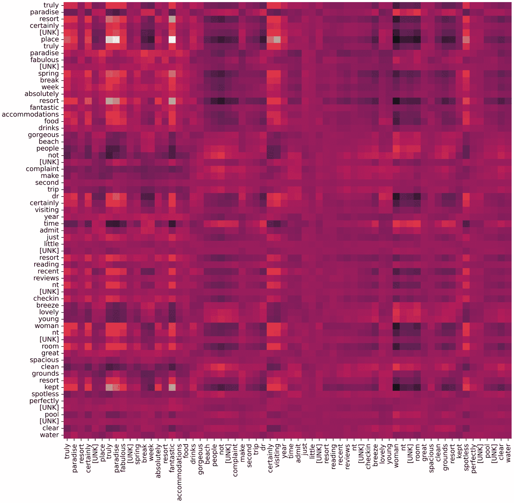

一个包含 64 行和 64 列的大热图描绘了一个自注意力矩阵。每个单元格以不同的颜色着色。

图 6-39

由基于注意力的模型导出的大自注意力矩阵

通过改进循环语言模型，我们也可以提高多模态模型的建模能力。改进的文本建模不仅使我们能够更好地建模多模态问题中文本输入与输出的关系，而且使我们能够通过使用从文本输入中获得的改进特征来更好地建模表格输入。

让我们回到第五章节中讨论的股票新闻和预测多模态数据集。我们可以通过添加共享注意力机制并适当训练来修改文本阅读组件（见列表 6-19，图 6-40）。

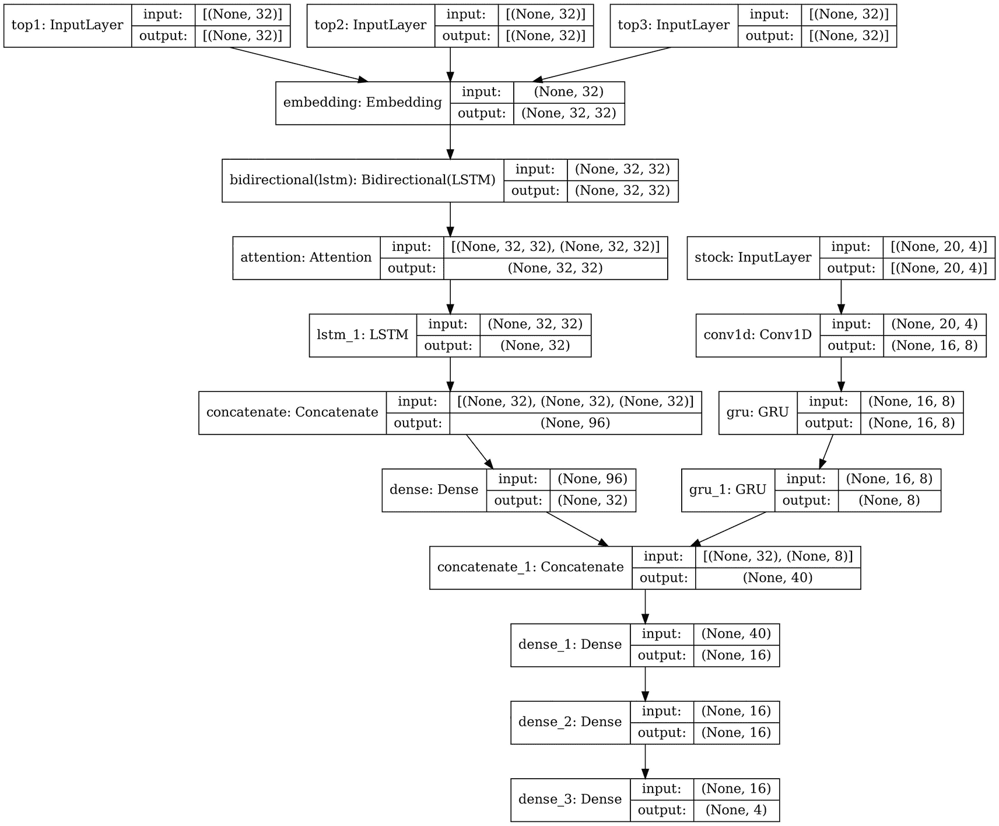

流程图展示了使用多头多模态模型创建的合成数据集的结构。它包括 3 个输入层、嵌入、双向 l s t m、注意力、l s t m 1、连接、密集、连接 1、密集 1、密集 2、密集 3、股票、c o n v 1 d、g r u 和 g r u 1 元素。

图 6-40

列表 6-19 中创建的架构图

```py
lstm1 = L.Bidirectional(L.LSTM(16, return_sequences=True))
top1_lstm1 = lstm1(top1_embed)
top2_lstm1 = lstm1(top2_embed)
top3_lstm1 = lstm1(top3_embed)
attn = L.Attention(use_scale=True)
lstm2 = L.LSTM(32)
top1_lstm2 = lstm2(attn([top1_lstm1, top1_lstm1]))
top2_lstm2 = lstm2(attn([top2_lstm1, top2_lstm1]))
top3_lstm2 = lstm2(attn([top3_lstm1, top3_lstm1]))
Listing 6-19
Adapting a multi-head multimodal model with attention mechanisms
```

使用注意力进行训练也为我们提供了对模型如何做出决策的强大可解释性。当观察注意力特征图时，我们发现一小部分关键词对预测高度相关（见图 6-41 至图 6-46）。

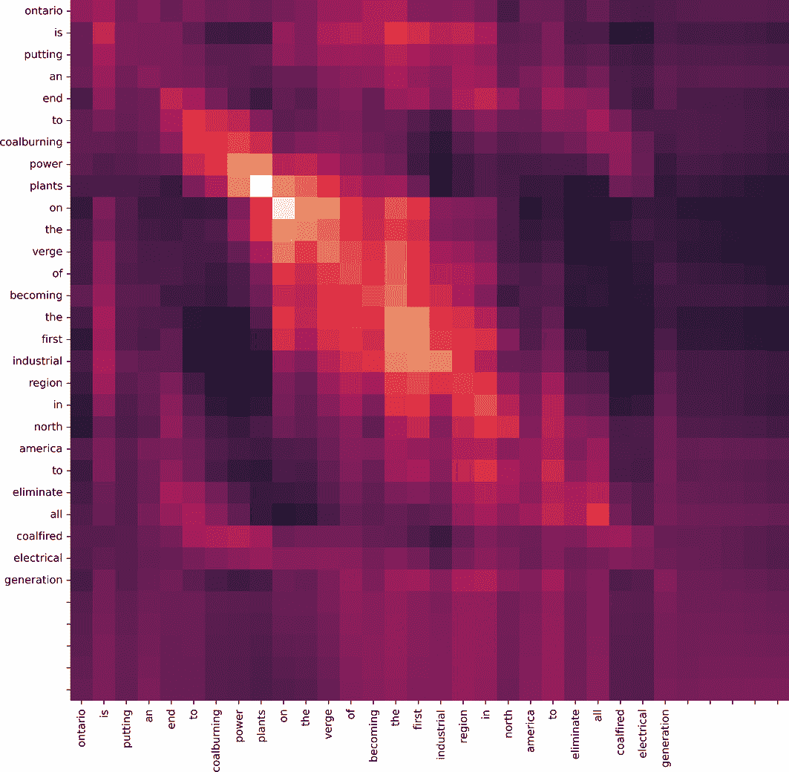

热力图展示了具有 32 列和 32 行的多头多模态模型的注意力得分矩阵。每个单元格以不同的颜色着色。高注意力得分集中在句子的中间。

图 6-46

注意力得分矩阵。注意句子中间的高注意力得分

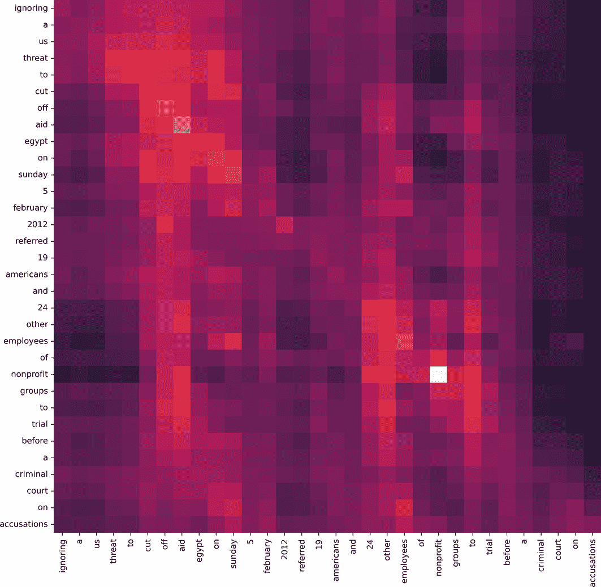

热力图展示了具有 32 列和 32 行的多头多模态模型的注意力得分矩阵。每个单元格以不同的颜色着色。高注意力得分由 nonprofit 获得。

图 6-45

注意力得分矩阵。注意“nonprofit”上的高注意力得分

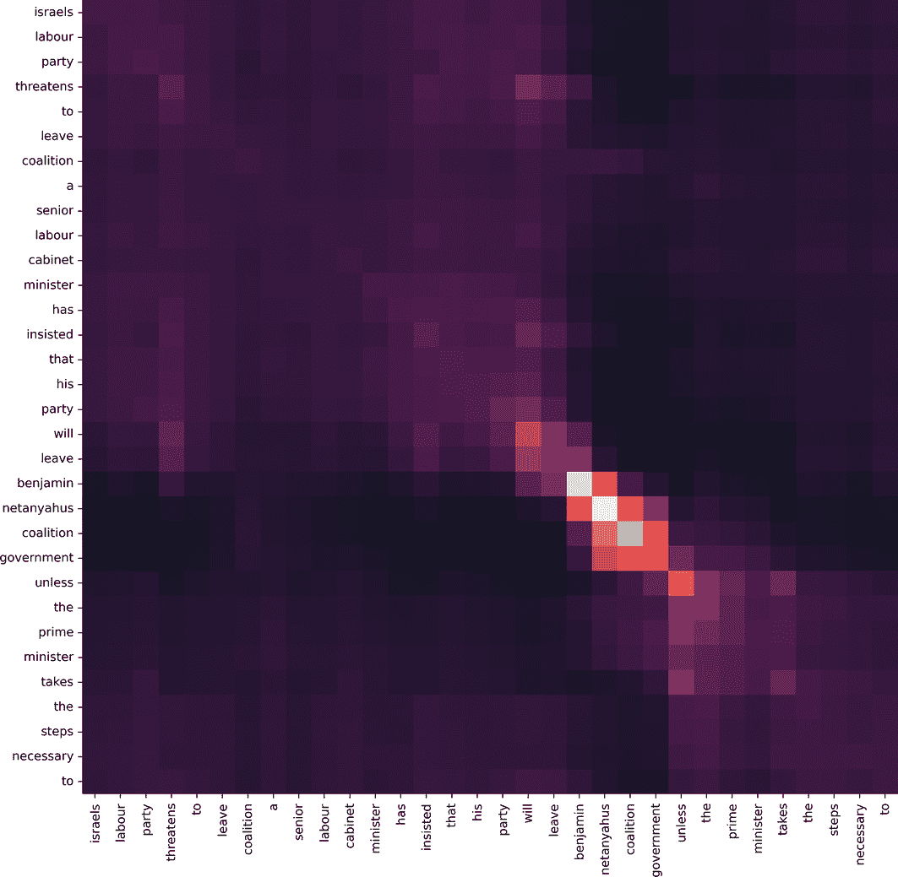

热力图展示了具有 32 列和 32 行的多头多模态模型的注意力得分矩阵。每个单元格以不同的颜色着色。高注意力得分由 benjamin、netanyahus、coalition 和 government 获得。

图 6-44

注意力得分矩阵。注意“benjamin”、“netanyahu”、“coalition”和“government”上的高注意力得分

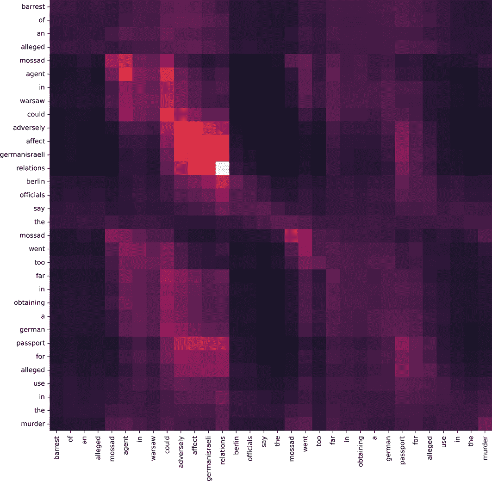

热力图展示了具有 32 列和 32 行的多头多模态模型的注意力得分矩阵。每个单元格以不同的颜色着色。高注意力得分由 relations 获得。

图 6-43

注意力得分矩阵。注意“relations”上的高注意力得分以及周围“adversely”、“affect”和“german-israeli”区域的高得分

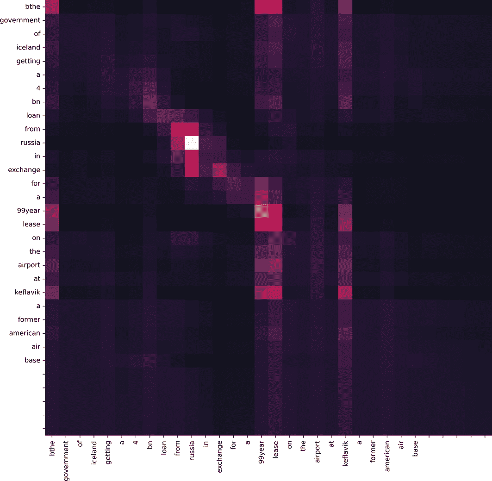

热力图展示了具有 32 列和 32 行的多头多模态模型的注意力得分矩阵。每个单元格以不同的颜色着色。高注意力得分由 Russia 获得。

图 6-42

注意力得分矩阵。注意“russia”上的高注意力得分

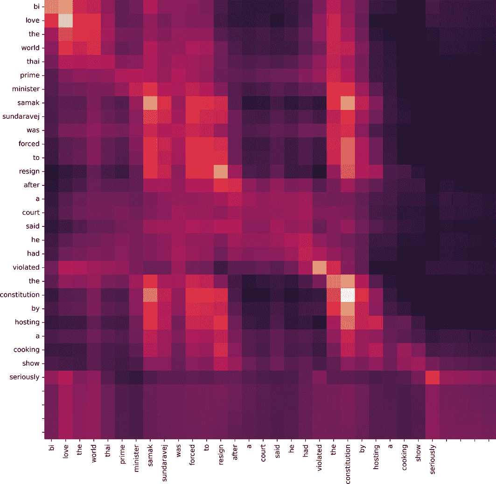

一个热力图展示了具有 32 列和 32 行的多头多模态模型注意力得分矩阵。每个单元格以不同的颜色着色。通过“宪法”获得高注意力得分。

图 6-41

注意力得分矩阵。注意“宪法”上的高注意力得分

我们还可以用多头注意力（见列表 6-20，图 6-47）来替换单一注意力机制。

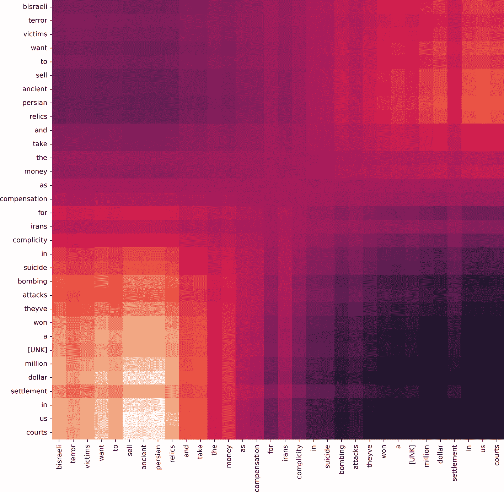

一个热力图展示了使用 32 列和 32 行的多头注意力机制的模型注意力得分矩阵。每个单元格以不同的颜色着色。高注意力得分位于左下角。

图 6-47

几个头部中的一个注意力特征图，展示了子句“以色列恐怖受害者想出售古波斯文物”和“美国法庭上一百万美元的情感”之间的注意力高度

```py
attn = L.MultiHeadAttention(num_heads=8, key_dim=32,
dropout=0.1)
Listing 6-20
Replacing the single attention mechanism with multi-head attention
```

## 直接表格注意力建模

第四章和第五章介绍了对大多数读者来说似乎陌生且不自然的方法。即使作为作者，我们试图证明它们的经验有效性并提供概念模型来理解它们，我们也明白卷积和循环层在直觉上或本质上并不“自然”地与表格数据相匹配，这让人感到不安。表格数据本身并不具有连续的语义，而卷积和循环层则基于输入数据具有连续语义的假设。

然而，注意力却显示出对表格数据来说是一个非常自然的机制。回想一下本章开头提到的，注意力解决了自然语言数据受限顺序阅读中的问题。换句话说，注意力通过提供一种更直接的方式来关联序列中的跨序列/时间依赖性，从而解放了自然语言数据的连续语义。注意力操作于“非连续语义”，并且可以应用于任何输入，无论是顺序的还是非顺序的，以建模非连续依赖性。（当然，它可以通过因果掩码等附加组件进行适配，以支持连续依赖性的建模。）正因为如此，深度学习在表格数据研究中的一个主要趋势是致力于注意力和转换器架构。（请参阅本章最后部分，以讨论几个此类模型。）

我们将首先创建一个输入头部，并将输入重塑为两个维度（见列表 6-21）。这是应用注意力层的必要条件。

```py
inp = L.Input((len(X_train.columns),))
reshape = L.Reshape((len(X_train.columns),1))(inp)
Listing 6-21
The input and reshaping layer for the network
```

接下来，我们将构建一个示例“注意力块”（列表 6-22）。我们首先应用两个全连接层。如果一个具有*r*个节点的全连接层应用于形状为(*p*, *q*)的输入，其结果形状为(*p*, *r*)。每个“切片”沿着第一个轴学习一个密集映射。之后，我们应用带有缩放的 Luong 式自注意力，执行层归一化，并返回。

```py
def attn_block(inp,
dense_units=8,
num_heads=4,
key_dim=4):
dense = L.Dense(dense_units, activation='relu')(inp)
dense2 = L.Dense(dense_units, activation='relu')(dense)
attn_out = L.Attention(use_scale=True)([dense2, dense2])
layer_norm = L.LayerNormalization()(attn_out)
return layer_norm
Listing 6-22
Defining an attention block
```

我们可以将注意力块堆叠起来，如下所示（列表 6-23）。

```py
attn1 = attn_block(reshape)
attn2 = attn_block(attn1)
flatten = L.Flatten()(attn2)
predense = L.Dense(32, activation='relu')(flatten)
out = L.Dense(7, activation='softmax')(predense)
model = keras.models.Model(inputs=inp, outputs=out)
Listing 6-23
Arranging attention blocks into a complete model
```

注意，应用于输入的第一个层是一个全连接密集层；这可以被视为一个将形状为(*n*[features], 1)的输入转换为形状为(*n*[features], *d*[embed])的嵌入。所有后续的全连接层独立处理每个特征的向量，而每个注意力机制强制特征之间的交叉关系。两个注意力块产生的信息被展平成一个单一向量并投影到输出空间。适用于 Forest Cover 数据集的完整示例架构在图 6-48 中展示。

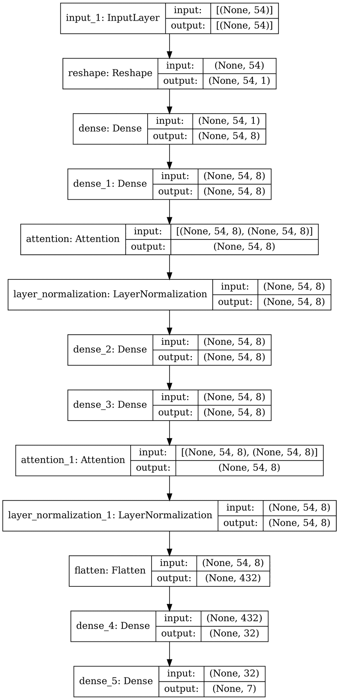

流程图描述了堆叠注意力块的合成数据集结构。它按以下顺序流动：输入 1、重塑、密集、密集 1、注意力、层归一化、密集 2、密集 3、注意力 1、层归一化 1、展平、密集 4 和密集 5 元素。

图 6-48

列表 6-23 定义的架构图。

或者，我们可以使用多头自注意力，并相应地修改我们的注意力块代码（列表 6-24）。

```py
def attn_block(inp,
dense_units=8,
num_heads=4,
key_dim=4):
dense = L.Dense(dense_units, activation='relu')(inp)
dense2 = L.Dense(dense_units, activation='relu')(dense)
attn_out = L.MultiHeadAttention(num_heads=num_heads,
key_dim=key_dim)(dense2, dense2)
layer_norm = L.LayerNormalization()(attn_out)
return layer_norm
Listing 6-24
Defining an attention block
```

注意，如果我们想做一些像 Luong 式注意力但从中共享向量导出不同的键和查询（和/或值）的事情，这只是一个具有一个头的多头注意力案例！

将注意力机制纳入你的表格模型通常是简单且有效的。例如，你可以添加以下功能：残差连接、多个并行多头注意力分支、在每特征维度上应用卷积和/或循环层以提取额外特征，以及/或将注意力纳入第五章中提出的直接循环建模技术，等等。

例如，参见 Song Weiping 等人提出的 AutoInt 模型（图 6-49），该模型在论文“AutoInt: 通过自注意力神经网络的自动特征交互学习”中提出。^(8)这个相对简单架构的核心是一个具有残差连接的多头自注意力层，在点击率（CTR）预测问题上表现出色。

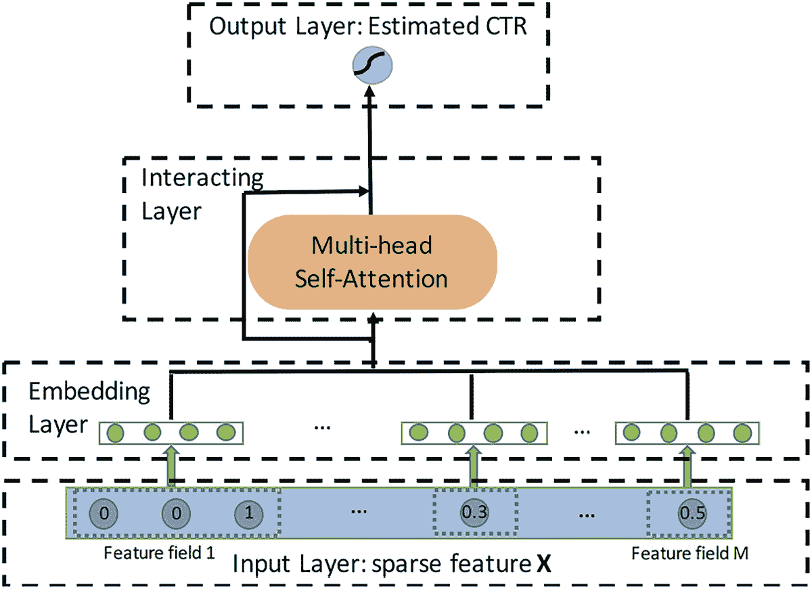

流程图描述了 Auto Int 模型的架构。它由 4 层组成：输入、嵌入、交互和输出。

图 6-49

AutoInt 模型图。由 Song Weiping 等人提供。

## 基于注意力的表格建模研究

有大量研究将注意力应用于表格数据。如前所述，注意力机制是选择输入信息流不同组件的一个非常自然的机制。本节深入讨论了最近研究中四篇这样的论文，并提供了实现模型或使用现有实现的指导。我们将使用作者对相关变量、操作和函数的符号来形式化每个模型。这对于具体理解模型的工作方式至关重要，但——作为一个警告——在论文之间往往存在差异。

### TabTransformer

由 Xin Huang 等人在 2020 年的论文“TabTransformer: 使用上下文嵌入的表格数据建模”中引入的 TabTransformer 模型，是一个将 transformer/基于注意力的块相对直接地应用于表格数据的例子。

表格数据集通常只包含两种类型的特征：分类和连续。按照论文的符号，令 *m* 为分类特征的个数，令 *c* 为连续变量的个数。因此，分类特征的集合是 *x*[cat] ≔ { *x*[1], *x*[2], ..., *x*[*m*]}，而连续特征的集合是 *x*[cont] ∈ *ℝ*^c。连续特征信息丰富，通常可以通过神经网络成功映射到新的空间。我们可以相应地认为连续特征“潜在信息”不足，就像快速移动的球比慢速移动的球具有更少的势能。因为连续特征跨越更广泛的值域，特定值之间的关系可以更容易地确定。

另一方面，分类特征信息量不足，但因此具有很高的潜在信息量。在分类特征中的每个特定类别都可以与一些属性集合相关联，当与其他特征（分类和连续）一起解释时变得很有用。在自然语言处理中，嵌入将特定类别的值映射到连续向量；在语言的情况下，每个时间步的“特征”有 *V* 个总类别，其中 *V* 是词汇量大小。相应地，在混合类型表格数据集上表现良好的经典机器学习算法也会为分类特征中的类别构建隐式“嵌入”。假设决策树中的一个节点在年级为十或更高时走向一个方向。这相当于在嵌入向量中定义一些属性，将值 10、11 和 12 映射到同一区域，而所有其他输入映射到另一个区域；然后在这些区域中“读取”密度，并将其与其他来自隐式构建嵌入的信息结合，以形成预测。然而，这种隐式“嵌入”并不明确或具体，其精度受节点条件的限制。

我们可以为 *x*[cat] 中的每个列生成 *列嵌入*。设 *d* 为嵌入空间的维度。对于 *x*[cat] 中的每个列，我们维护一个可训练的嵌入查找表，其中该列中的每个唯一值对应一个 *d*-长度向量。为了处理缺失值，你也可以生成一个额外的嵌入来处理 n/a 的情况。

在通过列嵌入将分类特征嵌入后，我们得到一个 (*m*, *d*) 形状的张量。这个张量会被传递通过变换器块 *N* 次：这里的变换器块由一个标准的多头注意力机制和一个前馈层组成，每个变换器块后面都有残差连接和层归一化。每个变换器块产生 Huang 等人所谓的“上下文嵌入”：也就是说，嵌入不仅相对于单个分类特征中的其他类别创建，而且与其他所有特征相关联/在上下文中。

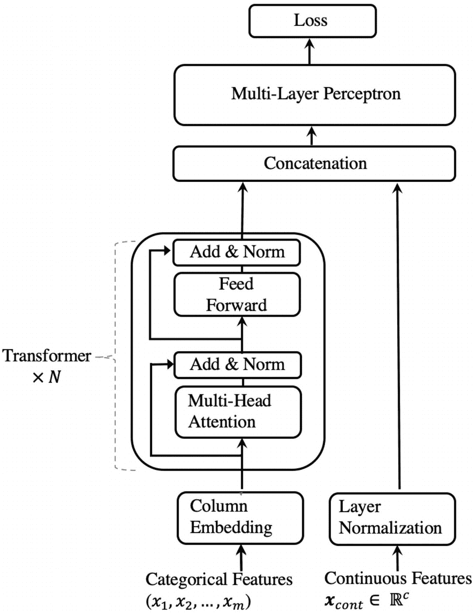

流程图描述了 Tab 变换器的架构。它从列嵌入开始，有 2 个变换器块和层归一化，然后是连接、多层感知和损失。

图 6-50

TabTransformer 架构。来自 Huang 等人。

在变换器块堆栈的重复处理后，得到的 (*n*, *d*) 形状的上下文嵌入张量会被展平/线性化成长度为 *n* · *d* 的向量，并与层归一化的连续特征连接，这样得到的连接向量形状为 *n* · *d* + *c*。这个向量包含丰富的计算上下文信息，这些信息被传递到一个标准的全连接网络/多层感知器，并输出。TabTransformer 的架构（在图 6-50 中完整展示）可以总结为一个标准的多层感知器模型，该模型使用基于变换器的分类特征上下文化。

TabTransformer 预训练了分类嵌入和变换器堆栈，使用两种类型的自监督预训练：掩码语言模型（MLM）（图 6-51）和替换标记检测（RTD）（图 6-52）。在 BERT 风格的掩码语言模型预训练中，输入中的某些列会被随机掩码，目标是预测被替换的列值。替换标记检测是一种变体，其中某些列的值会被打乱或被篡改，目标是识别哪些列被修改了，哪些没有被修改。这两个任务都需要嵌入和上下文处理变换器层以无监督的方式学习重要关系。

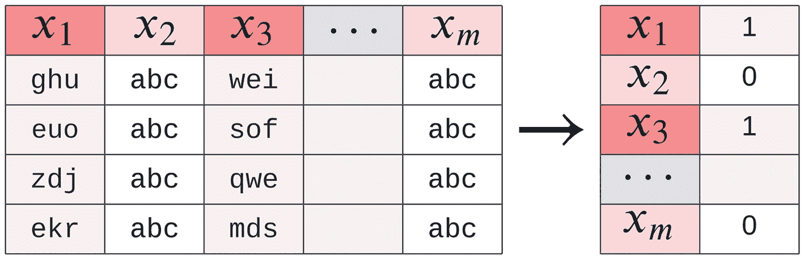

2 个表格描述了替换标记检测。表 1 有 4 行和 5 列。表 2 有 4 行和 2 列。表 1 引导到表 2。

图 6-52

替换标记检测的可视化

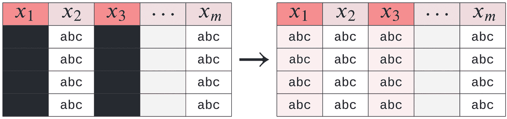

2 个表格描述了掩码语言模型。表格 1 和 2 各有 4 行和 5 列。表格 1 导致表格 2。

图 6-51

掩码语言模型任务的可视化

TabTransformer 论文的作者将其模型与 15 个数据集集合作了基准测试。他们使用 32 个隐藏嵌入维度，每个块中有 6 个 transformer 块和每个块中有 8 个注意力头。作者发现，TabTransformer 在几乎所有情况下都优于基线多层感知器，尽管这种改进通常微不足道。请注意，TabTransformer 实际上只是一个用基于 transformer 的类别特征上下文嵌入学习器拟合的 MLP，因此，改进的收益可以归因于这一机制。此外，TabTransformer 优于为表格数据集设计的其他深度学习模型，并接近超参数优化的梯度提升决策树（GBDT）的性能（见表 6-4 和 6-5)。

表 6-5

TabTransformer 与其他模型相比的平均数据集性能。AUC 准确率百分比。来自黄等人。

| -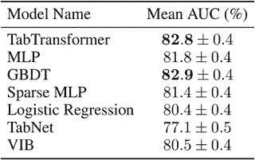一个包含 2 列和 7 行的表格。列标题是模型名称，平均 AUC 百分比。 |
| --- |

表 6-4

TabTransformer 在多个数据集上与基线 MLP 的性能对比。AUC 准确率百分比。来自黄等人。

| -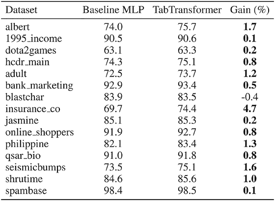一个包含 4 列和 15 行的表格。列标题是数据集、基线 MLP、tab transfer 和增益百分比。 |
| --- |

TabTransformer 模型的一个优势，除了其在性能上的明显提升外，还有其可解释性。因为该模型明确地学习与每个分类特征中每个唯一类值相关的嵌入，所以这些学习到的嵌入可以被分析和解释，以了解模型是如何做出决策的。作者对为 Bank Marketing 数据集推导出的嵌入进行了 t-SNE 降维，并发现“语义相似的类别彼此靠近，并在嵌入空间中形成簇”（图 6-53)。

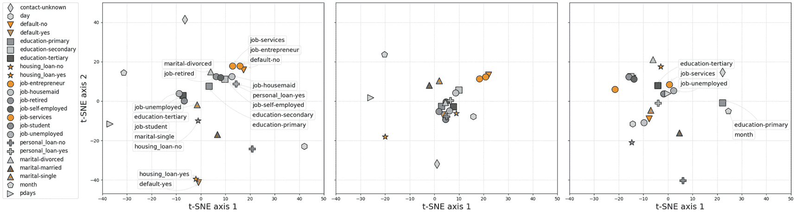

3 个 t-SNE 轴 2 与 t-SNE 轴 1 的散点图描绘了嵌入空间中的类别。散点图 1，类别簇在 0 到 20 之间。散点图 2，类别簇在 0 到 10 之间。散点图 3，类别簇在-10 到 0 之间。

图 6-53

在低维空间中降低的类别嵌入的可视化。来自黄等人。

为了展示嵌入的丰富性，作者在每个连续的转换器块中为每个分类特征输出训练线性模型，并显示即使在第一个应用转换器块之前，导出的特征也足以达到完整的 TabTransformer 模型至少 90%的准确率（图 6-54）。

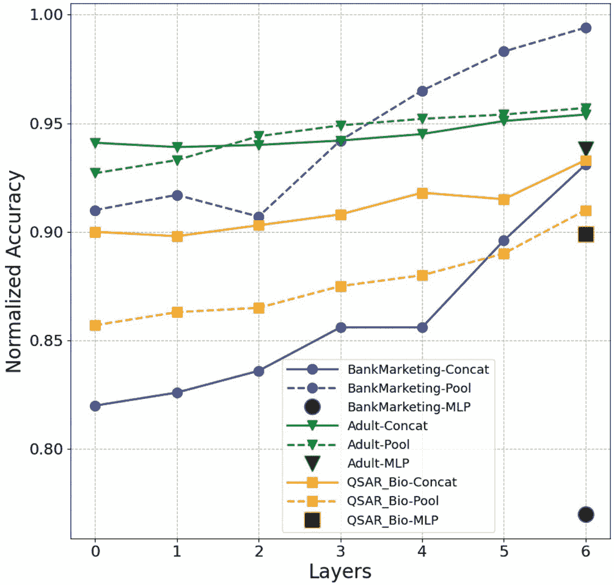

标准化准确率与层的关系的折线图。有 6 条递增的线和 3 个点，分为 3 个数据集，银行营销、成年人和 Q S A R 生物。银行营销点，（6，0.76）。成年点，（6，0.94）。Q S A R 生物点，（6，0.90）。

图 6-54

展示了三个不同的数据集（银行营销、成年人口普查和 QSAR）——在 n 层之后对注意力特征训练回归模型的性能。来自黄等人。

黄等人强调的另一个主要优势是对于噪声和缺失数据的鲁棒性，这是基于树的算法通常比较难以处理的。TabTransformer 模型在数据噪声（图 6-55）和数据删除（缺失数据）攻击（图 6-56）方面比基线 MLP 模型有显著的性能提升。在噪声和缺失数据的高水平下，TabTransformer 可以保留相当高的原始性能。

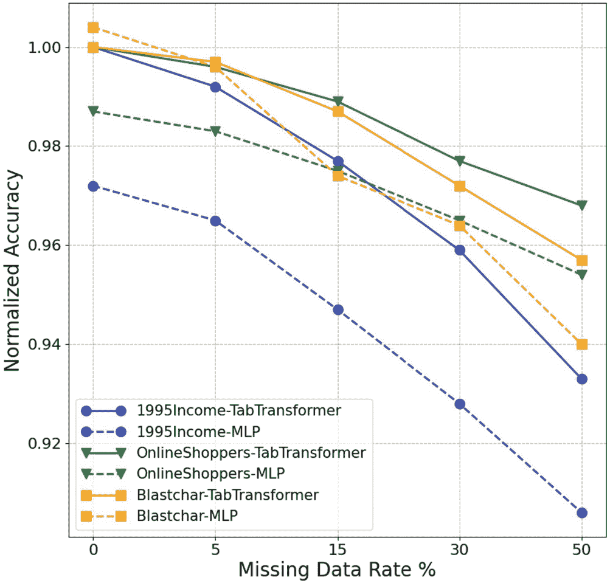

标准化准确率与缺失数据率百分比的折线图。共有 6 条递减的线，分为 3 个数据集，1995 年收入、在线购物者和用于表格转换器和 M L P 模型的 blastchar。

图 6-56

相对于在未损坏数据上训练的模型，通过缺失数据在不同数据损坏程度下的性能下降。来自黄等人。

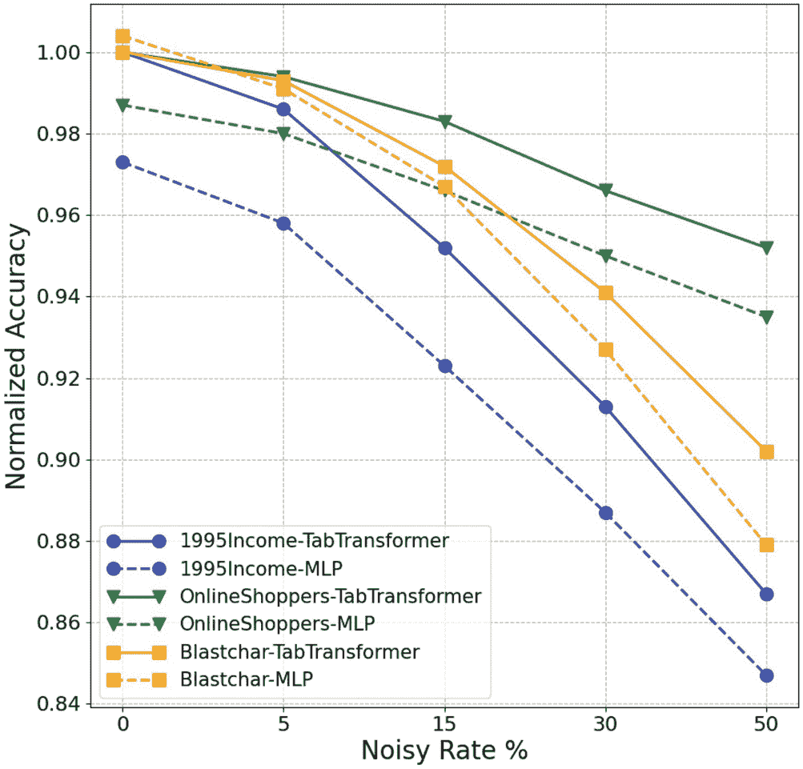

标准化准确率与噪声率百分比的折线图。共有 6 条递减的线，分为 3 个数据集，1995 年收入、在线购物者和用于表格转换器和 M L P 模型的 blastchar。

图 6-55

相对于在未损坏数据上训练的模型，通过数据噪声在不同数据损坏程度下的性能下降。来自黄等人。

最后，TabTransformer 也非常适合自监督预训练，并且已被证明是自监督表格学习中最有希望的架构之一。

TabTransformer 架构相对简单，可以使用 Keras 层从头开始构建，这是一个很好的练习。我们将首先定义以下关键配置参数（见清单 6-25）：

+   `NUM_CONT_FEATS`：连续特征的数量

+   `NUM_CAT_FEATS`：分类特征的数量

+   `NUM_UNIQUE_CLASSES`：每个类别中唯一类别的列表。其长度应与分类特征的数目相同

+   `EMBEDDING_DIM`：嵌入的维度（即与每个分类特征中每个唯一类关联的向量）

+   `NUM_HEADS`：每个多头注意力机制中的头数量

+   `KEY_DIM`：在多头注意力层中将键和查询投影到的维度

+   `NUM_TRANSFORMERS`：要堆叠的 transformer 块数量

+   `FF_HIDDEN_DIM`：在将嵌入维度投影到之前，transformer 块前馈组件中的隐藏单元数量

+   `MLP_LAYERS`：在 TabTransformer 模型末尾的多层感知器组件中的隐藏前馈层数量

+   `MLP_HIDDEN`：在 TabTransformer 模型末尾的多层感知器组件中的每个隐藏层中的单元数量

+   `OUT_DIM`：输出的维度

+   `OUT_ACTIVATION`：在输出中使用的激活函数

```py
'''
CONFIG
'''
NUM_CONT_FEATS = 8
NUM_CAT_FEATS = 4
NUM_UNIQUE_CLASSES = [32 for i in range(NUM_CAT_FEATS)]
EMBEDDING_DIM = 32
NUM_HEADS = 4
KEY_DIM = 4
NUM_TRANSFORMERS = 6
FF_HIDDEN_DIM = 32
MLP_LAYERS = 4
MLP_HIDDEN = 16
OUT_DIM = 1
OUT_ACTIVATION = 'linear'
Listing 6-25
Establishing configuration constants
```

首先，我们定义输入（见列表 6-26）。连续特征输入头部很简单：我们定义一个接受长度为`NUM_CONT_FEATS`的向量的输入头部，并应用层归一化。由于我们需要为每个分类特征生成一个独特的嵌入方案，我们创建了一个与每个分类特征对应的输入头部列表。相应地，我们生成从每个分类特征输入头部链接并关联到`EMBEDDING_DIM`大小的向量的嵌入。每个嵌入层的词汇量大小由`NUM_UNIQUE_CLASSES`提供。到目前为止，每个嵌入将产生一个形状为（批量大小，1，`EMBEDDING_DIM`）的张量。我们希望“链接”每个分类特征的嵌入，因此在第二个轴（基于零的索引为 1）上连接，以产生形状为（批量大小，`NUM_CAT_FEATS`，`EMBEDDING_DIM`）的分组嵌入张量。请注意，这个张量形状类似于自然语言序列的张量形状（批量大小，序列长度，嵌入维度）。在这种情况下，我们不假设轴 1 中的分类特征是按顺序排列的，这对于 transformer 块来说工作得很好。

```py
cont_inp = L.Input((NUM_CONT_FEATS,), name='Cont Feats')
normalize = L.LayerNormalization()(cont_inp)
cat_inps = [L.Input((1,), name=f'Cat Feats {i}') for i in \
range(NUM_CAT_FEATS)]
zipped = zip(NUM_UNIQUE_CLASSES, cat_inps)
embeddings = [L.Embedding(uqcls, EMBEDDING_DIM)(cat_inp) for uqcls, cat_inp in zipped]
concat_embed = L.Concatenate(axis=1)(embeddings)
Listing 6-26
Defining the input heads
```

由于我们将堆叠多个 transformer 块，定义一个为我们执行块链接的函数是有用的（见列表 6-27）。我们首先使用输入层的张量计算多头自注意力。为了形成残差连接，我们将自注意力的结果与原始输入相加。（请注意，默认情况下，自注意力的结果与输入形状相同，尽管您可以指定输出投影到不同的维度。）我们应用层归一化，然后是两个前馈层。在层归一化的输出和 transformer 块前馈组件的输出之间建立另一个残差连接。结果是再次归一化并返回。

```py
def transformer(inp):
attention = L.MultiHeadAttention(num_heads=NUM_HEADS,
key_dim=KEY_DIM)(inp, inp)
add = L.Add()([inp, attention])
norm = L.LayerNormalization()(add)
dense1 = L.Dense(FF_HIDDEN_DIM, activation='relu')(norm)
dense2 = L.Dense(EMBEDDING_DIM, activation='relu')(dense1)
add2 = L.Add()([norm, dense2])
norm2 = L.LayerNormalization()(add2)
return norm2
Listing 6-27
Defining a transformer block
```

我们可以将这个变换器块应用多次（见列表 6-28）。输出张量仍然具有形状（批量大小，`NUM_CAT_FEATS`，`EMBEDDING_DIM`），但现在每个嵌入都与其他分类特征相关联。我们将结果展平成一个形状为（批量大小，`NUM_CAT_FEATS` × `EMBEDDING_DIM`）的向量批次。

```py
transformed = concat_embed
for i in range(NUM_TRANSFORMERS):
transformed = transformer(transformed)
contextual_embeddings = L.Flatten()(transformed)
Listing 6-28
Stacking transformers together, followed by flattening
```

上下文嵌入可以与归一化的连续变量连接，并输入到多层感知器（见列表 6-29）。

```py
all_feat_concat = L.Concatenate()([normalize, contextual_embeddings])
mlp = all_feat_concat
for i in range(MLP_LAYERS):
mlp = L.Dense(MLP_HIDDEN, activation='relu')(mlp)
out = L.Dense(OUT_DIM, activation=OUT_ACTIVATION)(mlp)
Listing 6-29
Defining the MLP that accepts the transformed (flattened) features and outputs the final decision
```

为了将图构建成一个模型，我们收集所有输入并调用`keras.models.Model`来连接输入和输出（见列表 6-30，图 6-57）。

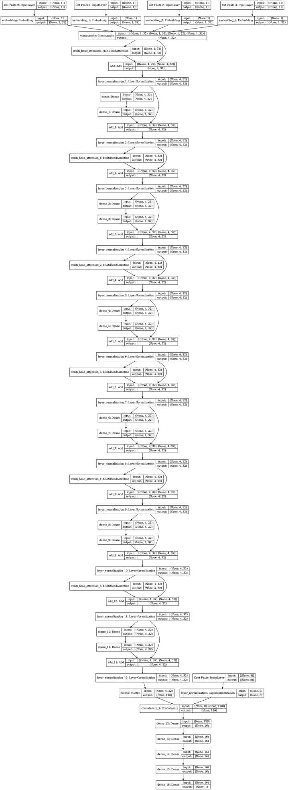

一个流程图展示了 TabTransformer 模型的结构。它包括输入头、变换器块、变换器堆叠操作和 MLP 层。

图 6-57

在列表 6-26 到 6-30 中定义的自定义 TabTransformer 模型

```py
all_inps = cat_inps + [cont_inp]
model = keras.models.Model(inputs=all_inps, outputs=out)
Listing 6-30
Defining the TabTransformer model
```

为了更清晰的视觉化和遵循良好的实现实践，我们可以使用分区设计来定义变换器块作为一个独立的子模型（见列表 6-31）。我们不是返回输出张量，而是构建一个新的子模型，具有独特的名称（同一图中的子模型必须具有唯一名称）。

```py
def build_transformer(inp_shape, id_=0):
inp = L.Input(inp_shape)
attention = L.MultiHeadAttention(num_heads=NUM_HEADS,
key_dim=KEY_DIM)(inp, inp)
add = L.Add()([inp, attention])
norm = L.LayerNormalization()(add)
dense1 = L.Dense(FF_HIDDEN_DIM, activation='relu')(norm)
dense2 = L.Dense(EMBEDDING_DIM, activation='relu')(dense1)
add2 = L.Add()([norm, dense2])
norm2 = L.LayerNormalization()(add2)
return keras.models.Model(inputs=inp, outputs=norm2,
name=f'Transformer_Block_{id_}')
Listing 6-31
Modifying the transformer block with compartmentalized design
```

定义 TabTransformer 模型的代码基本上是相同的（见列表 6-32；变换器块，图 6-58；TabTransformer 架构，图 6-59)。

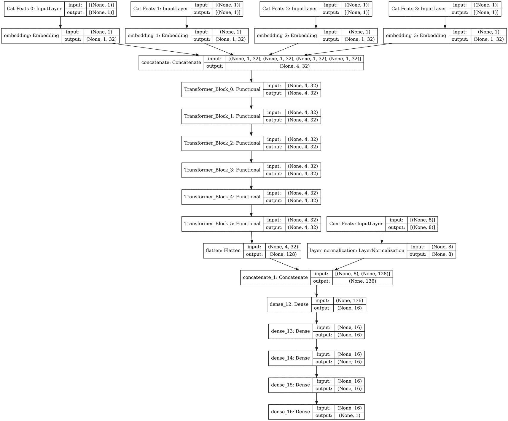

一个流程图展示了具有 5 个分区变换器块设计的 TabTransformer 模型。其他元素包括 4 个输入层、4 个嵌入层、连接、连续特征、展平、层归一化、连接 1 和密集 12、13、14、15 和 16。

图 6-59

Keras 中的 TabTransformer 模型，具有分区的变换器块

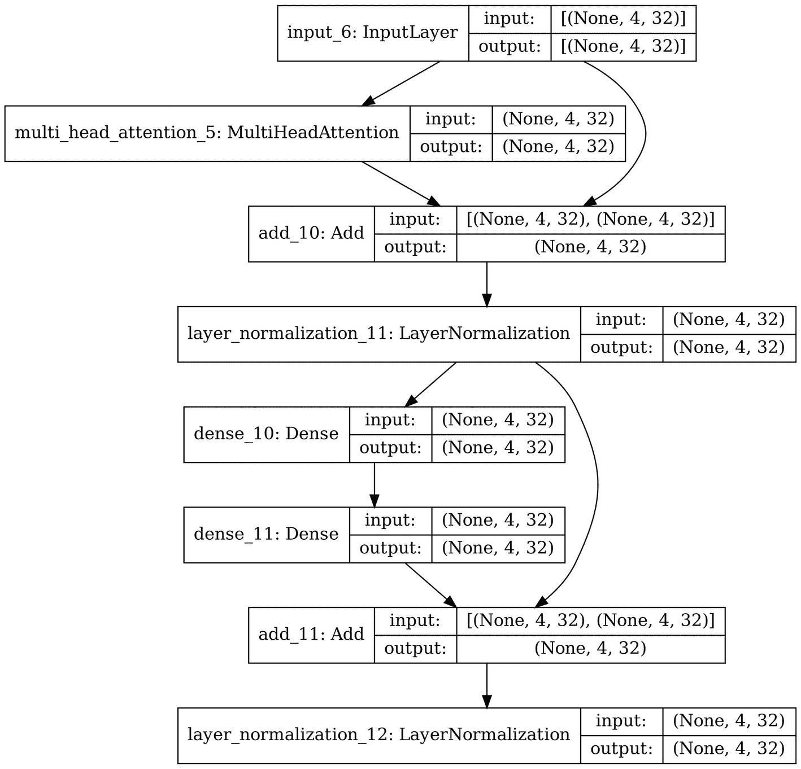

一个流程图展示了变换器块的结构。它按照输入 6、多头注意力 5、加 10、层归一化 11、密集 10、密集 11、加 1 和层归一化 12 的顺序流动。

图 6-58

变换器块

```py
cont_inp = L.Input((NUM_CONT_FEATS,), name='Cont Feats')
normalize = L.LayerNormalization()(cont_inp)
cat_inps = [L.Input((1,),
name=f'Cat Feats {i}') for i in \
range(NUM_CAT_FEATS)]
zipped = zip(NUM_UNIQUE_CLASSES, cat_inps)
embeddings = [L.Embedding(uqcls, EMBEDDING_DIM)(cat_inp) for uqcls, cat_inp in zipped]
concat_embed = L.Concatenate(axis=1)(embeddings)
transformed = concat_embed
for i in range(NUM_TRANSFORMERS):
transformer = build_transformer((NUM_CAT_FEATS, EMBEDDING_DIM), \
id_=i)
transformed = transformer(transformed)
contextual_embeddings = L.Flatten()(transformed)
all_feat_concat = L.Concatenate()([normalize, contextual_embeddings])
mlp = all_feat_concat
for i in range(MLP_LAYERS):
mlp = L.Dense(MLP_HIDDEN, activation='relu')(mlp)
out = L.Dense(OUT_DIM, activation=OUT_ACTIVATION)(mlp)
all_inps = cat_inps + [cont_inp]
model = keras.models.Model(inputs=all_inps, outputs=out)
Listing 6-32
Defining a model with compartmentalized design
```

让我们演示这样一个模型在 Ames 住房数据集上的应用，这是我们之前遇到过的。Ames 住房数据集具有许多分类特征，是一个构建模型的好混合类型表格数据集。我们将首先读取数据，缩放目标，并确定哪些特征是分类的，哪些是连续的（见列表 6-33）。

```py
df = pd.read_csv('https://raw.githubusercontent.com/hjhuney/Data/master/AmesHousing/train.csv')
df = df.dropna(axis=1, how='any').drop('Id', axis=1)
x = df.drop('SalePrice', axis=1)
y = df['SalePrice'] / 1000
cat_features = []
for colIndex, colName in enumerate(x.columns):
# find categorical variables to process
if type(x.iloc[0, colIndex]) == str or len(x[colName].unique()) <= 5:
cat_features.append(colName)
cont_features = [col for col in x.columns if col not in cat_features]
Listing 6-33
Reading the Ames Housing dataset and identifying categorical features
```

因为嵌入需要将所有类别信息作为从 0 开始的整数进行标签/顺序编码，我们将使用 scikit-learn 的`OrdinalEncoder`来适当地转换所有分类特征（见列表 6-34）。我们还将所有连续特征转换为 float32，以避免后续出现的类型问题。

```py
from sklearn.preprocessing import OrdinalEncoder
encoders = {col:OrdinalEncoder() for col in cat_features}
for cat_feature in cat_features:
encoder = encoders[cat_feature]
x[cat_feature] = encoder.fit_transform(np.array(x[cat_feature]).reshape(-1, 1))
for cont_feature in cont_features:
x[cont_feature] = x[cont_feature].astype(np.float32)
Listing 6-34
Encoding relative features
```

预处理完成后，我们执行训练-验证分割（列表 6-35）。在执行编码之前进行编码很重要，这样我们就不必担心遇到编码器没有与整数关联的类别，因为它们在训练期间没有出现过。因为我们只是应用了一个简单的顺序编码器，这并不保证数据泄露。

```py
from sklearn.model_selection import train_test_split as tts
X_train, X_valid, y_train, y_valid = tts(x, y, train_size=0.8)
Listing 6-35
Train-validation split
```

您也可以使用我们从头构建的 TabTransformer 模型，但社区也有很多优秀的实现。Cahid Arda 将 TabTransformer 实现为 Keras，可以在笔记本中直接访问，如下所示（列表 6-36）。

```py
!git clone https://github.com/CahidArda/tab-transformer-keras.git
os.rename('./tab-transformer-keras', './tab_transformer_keras')
Listing 6-36
Cloning Cahid Arda’s TabTransformer repository. The renaming is to avoid Python syntax issues with hyphens in imports
```

我们可以导入 `TabTransformer` 模型并指定所需的配置参数，使用 `get_X_from_features` 工具函数来准备模型的输入（列表 6-37）。这会将连续特征与分类特征分开，并将每个分类特征切割成单独的项目。完整的连续特征集和每个分类特征都被放入一个列表中，这个列表被多头的 TabTransformer 模型接受。

```py
from tab_transformer_keras.tab_transformer_keras.tab_transformer_keras import TabTransformer
from tab_transformer_keras.misc import get_X_from_features
X_train_tt = get_X_from_features(X_train, cont_features, cat_features)
X_valid_tt = get_X_from_features(X_valid, cont_features, cat_features)
class_counts = [x[col].nunique() for col in cat_features]
model = TabTransformer(
categories = class_counts,
num_continuous = len(cat_features),
dim = 16,
dim_out = 1,
depth = 6,
heads = 8,
attn_dropout = 0.1,
ff_dropout = 0.1,
mlp_hidden = [(32, 'relu'), (16, 'relu')]
)
Listing 6-37
Instantiating the TabTransformer model
```

结果是一个可以编译和拟合的 Keras 模型（列表 6-38）。请注意，由于该模型是自定义定义的，它缺少某些功能，如可视化。您可以在 [`github.com/CahidArda/tab-transformer-keras`](https://github.com/CahidArda/tab-transformer-keras) 上查看源代码。`

```py
model.compile(optimizer='adam', loss='mse', metrics=['mae'])
history = model.fit(X_train_tt, y_train, epochs=500,
validation_data=(X_valid_tt, y_valid))
Listing 6-38
Compiling and fitting the model
```

TabTransformer 是一个非常灵活的架构，有很多可以探索的地方。您可以使用 Hyperopt 对关键结构超参数进行超优化，因为超参数并不多。另一个想法是使用转换器块来联合处理分类和连续特征，通过学习连续特征的“嵌入”（这里的“嵌入”是指投影到具有嵌入维度的空间）。这可能允许上下文嵌入不仅与其它分类特征相关联，而且与整个数据集的宽度相关联。（实际上，这是我们将在后面的论文中采用的方法，SAINT。）

### TabNet

TabNet 架构，由 Google Cloud AI 的 Sercan O. Arik 和 Tomas Pfister 在 2019 年发表的论文“TabNet: Attentive Interpretable Tabular Learning”中提出，^(10) 是另一种流行的用于表格数据的深度学习模型。它比 TabTransformer 复杂得多，但共享许多基本相似之处。TabNet 的基本范式是决策是通过一系列连续步骤完成的；在每一步中，模型根据先前时间步长推导出的进度输入来推理应该处理哪些特征（图 6-60）。每个步骤都使用类似于注意力的掩码来选择某些期望的特征——因此称为“*注意力的*表格学习”。然后，从每个时间步长推理的结果被汇总以生成最终输出。

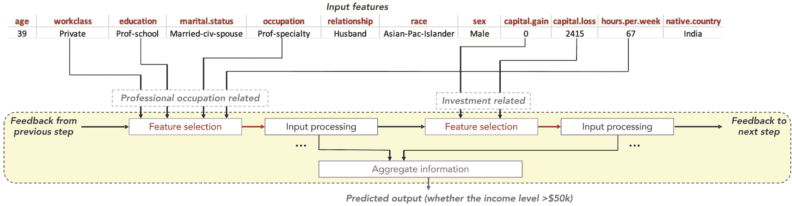

流程图描述了 TabNet 架构的工作原理。输入特征被分类为与专业职业相关和与投资相关，然后进行处理。基于汇总信息，进行预测。

图 6-60

从 Arik 和 Pfister 的表格数据行实例在多个决策步骤中进行特征选择和推理的示意图。

让我们用作者的符号来形式化我们对 TabNet 模型的理解。每个批次中有 *B* 个样本，每行包含 *D* 个特征（即，每个批次包含 *B D* 维向量）。因此，我们有特征 ***f*** ∈ ℝ^(*B* × *D*). 设 *N*[steps] 为决策步骤的数量；第 *i* 个输入的输出传递到第 *i* + 1 步。对于每个时间步 *i*，模型持有一个独特的可学习掩码 ***M***[*i*] ∈ ℝ^(*B* × *D*). 掩码以乘法方式操作；***M***[*i*] · ***f*** 表示掩码后的结果。***M***[*i*] 中的值介于 0 和 1 之间，并且选择确保为 *sparse*：大多数特征将具有相对较高的概率或接近零的概率，这样在乘法过程中后者会被掩码。掩码是作为 *prior scale term* ***P***[*i* − 1] 和前一步骤处理过的特征（即输出）***a***[*i* − 1] 的函数来计算的：

![M[i]=sparsemax(P[i-1]·h_i(a[i-1]))](img/525591_1_En_6_Chapter/525591_1_En_6_Chapter_TeX_Equf.png)

在这个计算中 *h*[*i*] 是一个由前馈层架构参数化的映射函数。这个函数有助于“重新解释”或“准备”前一步骤的输出以便与先验尺度项交互。

先验尺度项 ***P***[*i* − 1] 表示特征之前被关注了多少。给定一些松弛参数 *γ*，先验尺度项的计算如下：

![P[i]=∏(j=1)i(γ-M[j])](img/525591_1_En_6_Chapter/525591_1_En_6_Chapter_TeX_Equg.png)

考虑 γ = 1。假设某个特征在第一个时间步的掩码值为 1——也就是说，该特征被选中进行处理。该特征的先验尺度项 ***P***[1] 因此评估为 *γ* - ***M***[1] = 1 - 1 = 0。请注意，由于掩码 ***M***[*i*] 是先验尺度项的乘积，该特定特征将在下一个时间步被置零且不会被选中。此外，这还防止了在后续时间步中使用，因为对于某些序列 *x*，如果 0 ∈ *x*，则 ∏*x* = 0。同样，这也迫使之前未使用的特征被使用。当然，softmax 机制更为柔和，但先验尺度机制仍然作为一种力量，确保大多数相关特征“获得在聚光灯下的机会”，换句话说。第一个先验尺度项 ***P***[0] 被初始化为全 1（即，***P***[0] ≔ 1^(*B* × *D*)）。

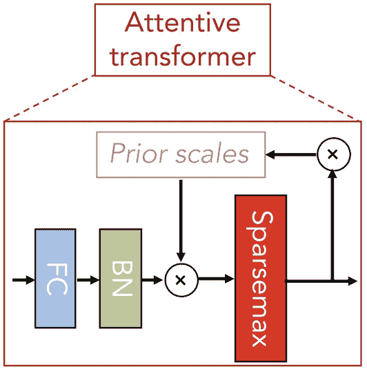

一幅插图展示了注意力转换器的架构。它包括全连接层（F C）、批归一化（B N）、x、sparsemax 和先验尺度。

图 6-61

注意力转换器架构。来自 Arik 和 Pfister

TabNet 架构的这个组件是 *注意力转换器*（图 6-61）。它生成一个掩码，以类似于注意力的方式从前一个时间步的输出特征（或对于第一步，从输入特征）和先验尺度评分中选择特征。Arik 和 Pfister 将这样的掩码描述为执行“显著特征的软选择”。“通过显著特征的稀疏选择，”作者写道，“决策步骤的学习能力不会浪费在不相关的特征上，因此模型变得更加参数高效。”这种可适应的掩码比决策树类特征选择具有哲学和实用上的优势，后者是“硬”的且不可适应/静态的。

在每个步骤 *i* 中，通过学习掩码进行特征选择后，选定的特征会通过特征转换器 *F*[*i*]（图 6-62）传递。我们将特征转换器的输出分割，以收集决策步骤输出 ![$$ \boldsymbol{d}\left[i\right]\in {\mathbb{R}}^{B\times {N}_d} $$](img/525591_1_En_6_Chapter/525591_1_En_6_Chapter_TeX_IEq3.png) 对某些维度 *N*[*d*] 的信息以及为下一步提供信息 ![$$ \boldsymbol{a}\left[i\right]\in {\mathbb{R}}^{B\times {N}_a} $$](img/525591_1_En_6_Chapter/525591_1_En_6_Chapter_TeX_IEq4.png) 对某些维度 *N*[*a*]。（这两个维度都是预设的。）

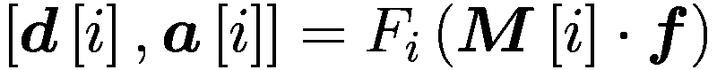

在具体架构方面，特征转换器包含一个共享和独立的部分。让一个*block*指代以下堆叠：全连接层，批量归一化，门控线性单元激活（GLU）。（门控线性单元激活由 Dauphin 等人（2015 年）作为 GLU(*a*, *b*) = *a* ⊗ *σ*(*b*)引入，它直观地迫使在门*b*中选择*a*中的单元。当*a*和*b*代表向量的半部分时，GLU 可以用作单个向量的激活函数。）一个特征转换器由四个模块组成，后三个模块周围有归一化的残差连接。前两个模块在所有决策步骤中普遍共享，而最后两个模块是每个决策步骤独有的。在所有步骤中普遍共享特征转换器的一半有助于加快训练速度，提高参数效率，并提高学习鲁棒性。

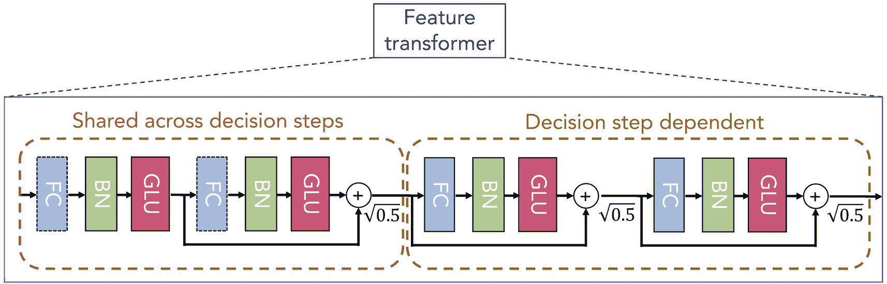

一个插图展示了特征转换器的结构。该结构有 2 个模块。这两个模块都有 F C，B N，G L U 元素，并且在决策步骤块中共享一个 0.5 的根，在决策步骤依赖块中有 2 个 0.5 的根值。

图 6-62

特征转换器模型。来自 Arik 和 Pfister

为了对所有决策输出进行聚合，TabNet 对所有时间步长的决策输出***d***的 ReLU 求和：

![$$ {d}_{\textrm{out}}=\sum \limits_{i=1}^{N_{\textrm{steps}}}\textrm{ReLU}\left(\boldsymbol{d}\left[\textbf{i}\right]\right) $$](img/525591_1_En_6_Chapter/525591_1_En_6_Chapter_TeX_Equi.png)

这个联合输出通过一个最终的线性映射层来获得真正的输出***W***[**final**]***d***[**out**]，并在上下文相关的基础上适当地应用最终激活（例如 softmax）。这个最终的聚合步骤类似于*DenseNet*风格的残差连接（见第四章），其中每一层都连接到所有先前锚点的残差连接。以类似的方式，TabNet 模型的最终输出是所有步骤输出的总和，因此后续步骤必须调节/纠正/“记住”先前步骤的影响。

特征选择掩码为解释 TabNet 的决策过程提供了价值。如果***M***[***q,j***][*i*] = 0，则第*j*个特征在第*i*步决策中对决策没有贡献。然而，不同的步骤本身在最终输出中的贡献是不同的。作者提出了以下公式用于函数*η*[*q*][*i*]，该公式给出了第*i*个决策步长在第*q*个样本输出上的聚合决策贡献：

![$$ {\eta}_q\left[i\right]=\sum \limits_{c=1}^{N_d}\textrm{ReLU}\left({\boldsymbol{d}}_{\textrm{q},\textrm{c}}\left[i\right]\right) $$](img/525591_1_En_6_Chapter/525591_1_En_6_Chapter_TeX_Equj.png)

*η* 函数为我们提供了一种方法，在每个决策步骤中对决策掩码进行缩放，以根据该步骤与输出的相关性来加权每个掩码。Arik 和 Pfister 阐述了以下聚合级别的特征重要性掩码（引入了一个占位符变量 *j* 以遍历列）：

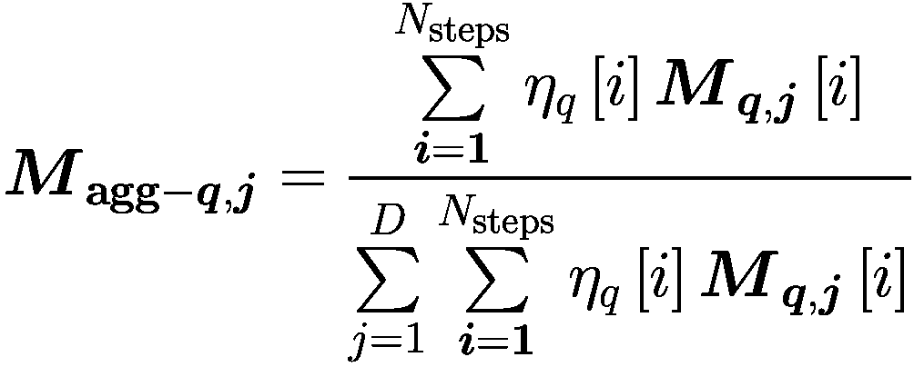

这个公式相当直观：它返回掩码的加权总和，归一化后，使得对于样本的所有特征的特征重要性掩码的总和为 1。

完整的架构在图 6-63 中可视化。输入特征通过一个初始特征转换器，然后进入第一步。在每一步中，注意力转换器从上一步的传递输出（即 ***a***[*i* − 1]）生成特征选择掩码，并以乘法方式应用于原始输入特征。选定的特征通过特征转换器；部分输出传递到下一步（作为 ***a***[*i*]）和作为决策输出（***d***[*i*])。

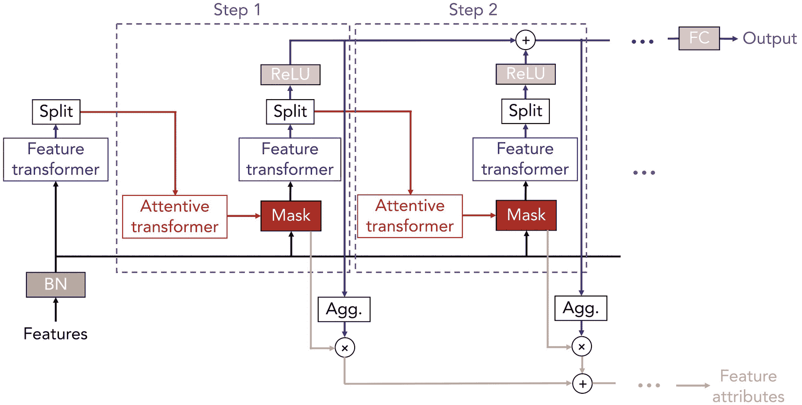

一幅插图展示了 TabNet 模型在多个步骤中的工作原理。输入被传递到特征转换器，然后进入第一步。该步骤包括一个注意力转换器、掩码、特征转换器、分割和 Re L U。输出被传递到下一步。

图 6-63

TabNet 模型架构的完整图示，展示了多个步骤。此图还显示了特征归因的掩码收集（底部），导致“特征属性”。不要被这些弄混——这些不是正式监督模型的一部分，该模型在训练期间进行优化。它们代表用于预测阶段可解释性的信息流。来自 Arik 和 Pfister

与 TabTransformer 类似，TabNet 也使用无监督/自监督预训练方案（图 6-65）。作者创建了一个*TabNet 解码器*（图 6-64），它由几个特征转换器组成，以类似的多步骤方式排列，每个决策步骤都有全连接层；决策输出的总和用于获得重构特征。预训练任务是预测掩码特征列。为批次生成二进制掩码：*S* ∈ {0, 1}^(*B* × *D*)。编码器接受输入(1 - *S*) · ***f***，解码器预测*S* · ***f***。在此预训练任务之后，解码器被断开连接，决策输出被用于替代监督微调（图 6-64）。

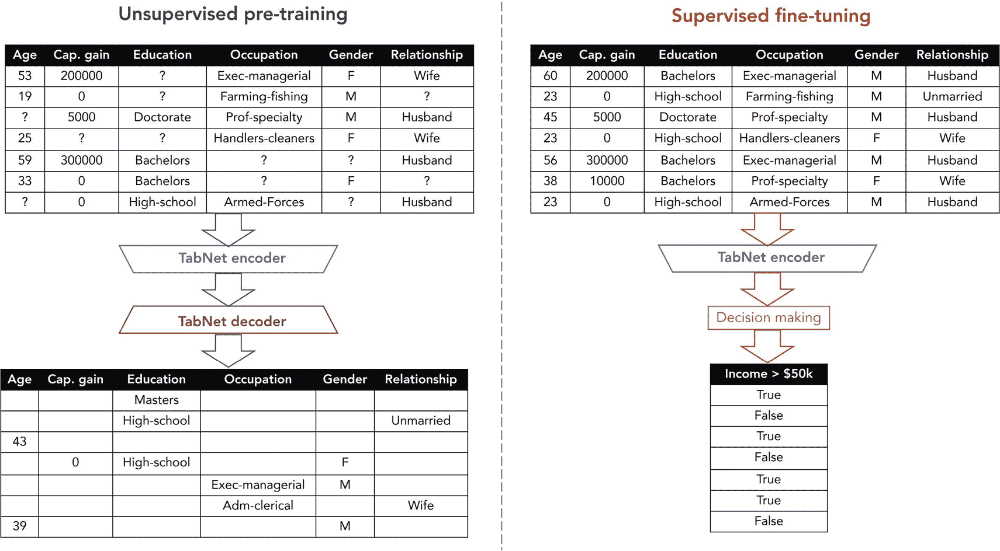

两个流程图描述了 TabNet 模型的两个阶段训练方案。无监督预训练，一个包含一些缺失数据的表格，TabNet 编码器，TabNet 解码器，以及一个包含缺失数据的表格。监督微调，一个包含完整数据的表格，TabNet 编码器，决策，以及一个包含 1 列数据的表格。

图 6-65

TabNet 的两个阶段训练方案。来自 Arik 和 Pfister

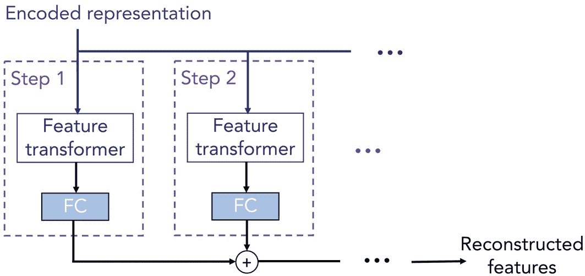

一幅插图展示了 TabNet 解码器的架构。编码表示传递到步骤 1、2 等的特征转换器，然后进入 F C。连接的数据输出重构特征。

图 6-64

解码器架构，它接受编码表示并输出重构特征。来自 Arik 和 Pfister

作者在多种合成和“自然”数据集上评估了 TabNet；他们发现 TabNet 的表现具有竞争力，有时甚至优于最佳基于树和基于 DNN 的表格模型（表 6-6 至 6-11）。在合成数据集上，TabNet 的表现接近顶部，参数大小显著减少（26-31k，与 INVASE 的 101k 和其他深度学习方法的 43k 相比）。

表 6-11

在 Rossmann 商店销售数据集（Kaggle 2019）上的性能。来自 Arik 和 Pfister

| -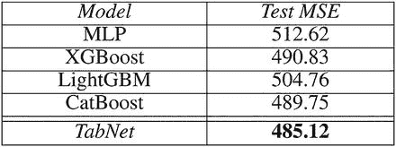一个包含 2 列和 5 行的表格。列标题为模型和测试均方误差。 |
| --- |

表 6-10

在希格斯玻色子数据集（Dua 和 Graff 2017）上的性能。来自 Arik 和 Pfister

| -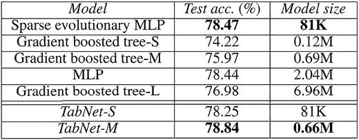一个包含 3 列和 7 行的表格。列标题为模型、测试准确率百分比和模型大小。 |
| --- |

表 6-9

在 Sarcos 数据集（Vijayakumar 和 Schaal 2000）上的性能。来自 Arik 和 Pfister

| 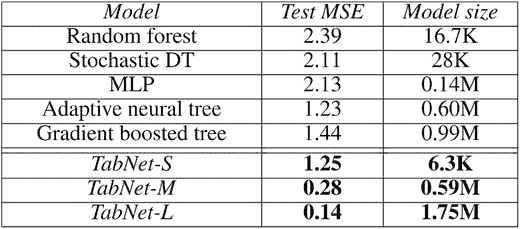一个包含 3 列和 8 行的表格。列标题为模型、测试均方误差和模型大小。 |
| --- |

表 6-8

在扑克牌数据集（Dua 和 Graff 2017）上的性能。来自 Arik 和 Pfister

| -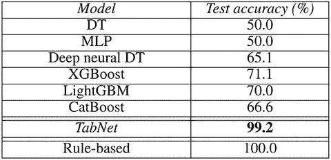一个包含 2 列和 8 行的表格。列标题是模型和测试准确率百分比。 |
| --- |

表 6-7

Forest Cover 数据集（Dua 和 Graff 2017）的性能。来自 Arik 和 Pfister

| -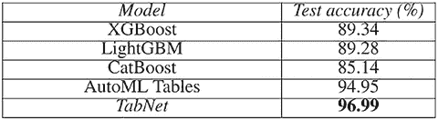一个包含 2 列和 5 行的表格。列标题是模型和测试准确率百分比。 |
| --- |

表 6-6

在合成数据集包（Chen 2018）上的性能。来自 Arik 和 Pfister

| -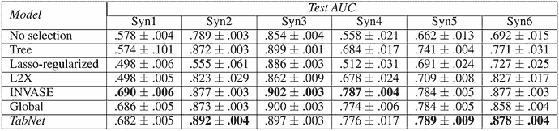一个包含 2 列和 7 行的表格。第二列细分为 6 个子列，标题为 s y n 1, s y n 2, s y n 3, s y n 4, s y n 5, 和 s y n 6。行标题为无选择、树、lasso-正则化、L 2 X、I N V A S E、全局和 TabNet。 |
| --- |

此外，TabNet 为特征可解释性提供了某种类似但不同的解释（表 6-12）。

表 6-12

不同方法对特征重要性排名的比较。来自 Arik 和 Pfister

| -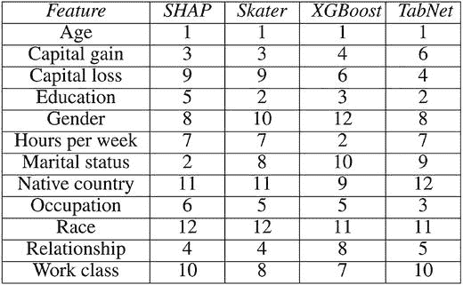一个包含 5 列和 12 行的表格。列标题是特征、S H A P、skater、X G B booster 和 TabNet。 |
| --- |

此外，还应注意的是，TabNet 与基于树的模型在架构和概念上有很多相似之处。序列操作集提供了一种类似于决策树的决策框架，能够表示决策树风格的特征空间分离（图 6-66）。作者指出，类似于注意力的机制允许实现更柔和、自适应的树节点分离标准。此外，TabNet 模型序列堆叠的本质与树模型中的堆叠和提升在概念上是相似的，其中单元通过前一个单元的输出进行学习。

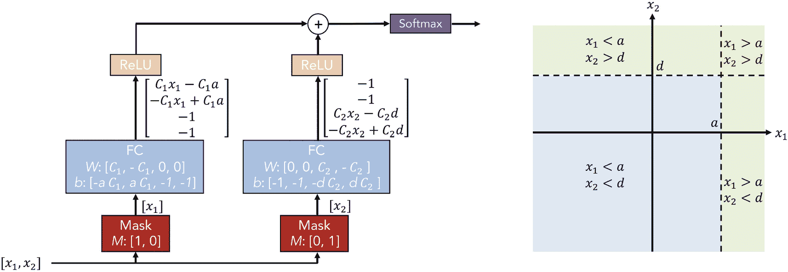

TabNet 架构作为类似于决策树的决策框架的表示图。

图 6-66

TabNet 架构如何表示类似于决策树的逻辑决策的示意图。来自 Arik 和 Pfister

TabNet（以及所有用于表格数据的深度学习模型）的另一个优点是它能够在未标记的数据上进行训练。由于稀疏性、掩码和时间步长无关共享权重等机制的汇聚，TabNet 是最近最轻便且最强大的表格深度学习模型之一。

因为 TabNet 来自 Google Cloud AI，所以代码库（可在 [`github.com/google-research/google-research/blob/master/tabnet/tabnet_model.py`](https://github.com/google-research/google-research/blob/master/tabnet/tabnet_model.py) 获取模型代码）是用 TensorFlow 编写的，应该相对容易阅读。我们将使用 Somshubra Majumdar 修改的版本，在正确的 Keras 中提供了额外的便利和实用工具。您可以在以下链接中查看实现：[`github.com/titu1994/tf-TabNet/blob/master/tabnet/tabnet.py`](https://github.com/titu1994/tf-TabNet/blob/master/tabnet/tabnet.py)。该代码作为库在 pip 中可用；其 PyPI 页面是 [`pypi.org/project/tabnet/`](https://pypi.org/project/tabnet/)，并且可以使用 `pip install tabnet` 进行安装。

`tabnet` 库包含两个输出适配的模型：`TabNetClassifier` 和 `TabNetRegressor`，分别用于分类和回归问题。这两个模型共享相同的 `TabNet` 基础模型架构，但使用不同的输出激活（如通过查看源代码可以确认）。至少，您需要指定输入特征的数量和输出类的数量。此外，您还可以指定特征维度 `feature_dim`（这是 *N*[*a*]），输出维度 `output_dim`（这是 *N*[*d*]），决策步骤的数量 `num_decision_steps`（这是 *N*[steps]），松弛因子 `relaxation_factor`（这是 *γ*），以及一个稀疏系数 `sparsity_coefficient` 来控制对稀疏性的遵守程度，以及其他参数（见代码清单 6-39）。

```py
from tabnet import TabNetClassifier
model = TabNetClassifier(feature_columns=None,
num_features=X.shape[-1],
num_classes=7,
feature_dim=32,
output_dim=16,
num_decision_steps=8,
relaxation_factor=0.7,
sparsity_coefficient=1e-6)
Listing 6-39
Instantiating a TabNetClassifier model
```

我们可以将 TabNet 编译并拟合为一个标准的 Keras 模型（见代码清单 6-40）。对于 TabNet，可以使用较大的批量大小——如果内存允许，甚至可以达到总数据集大小的 10-15%。由于这种实现不支持轻松进行自监督学习，因此可能需要较长的训练时间来适应标签。虽然自监督学习有帮助，但直接在标签上进行训练通常也能得到有竞争力的结果。实现自监督预训练并不困难，并且可以从现有的源代码构建块中构建。

```py
model.compile(optimizer='adam', loss='sparse_categorical_crossentropy',
metrics=['accuracy'])
model.fit(X_train, y_train, epochs=100,
validation_data=(X_valid, y_valid),
batch_size=10_000)
Listing 6-40
Compiling and fitting the TabNet model
```

由于技术上的 TensorFlow 原因，为了轻松获取特征选择掩码的值，我们需要将所需的数据库通过模型传递。我们不需要保存输出；这个命令的目的是强制模型以 eager 执行模式运行。从那里，我们可以收集掩码（原始形式下的张量列表）并访问 NumPy 数组中的数据（见代码清单 6-41）。

```py
_ = model(X_valid)
fs_masks_orig = model.tabnet.feature_selection_masks
fs_masks = np.stack([mask.numpy()[0,:,:,0] for mask in fs_masks_orig])
Listing 6-41
Obtaining TabNet feature selection masks on the validation dataset
```

有 *N*[steps] - 1 个特征选择图（由代码清单 6-42 和图 6-67 绘制）。请注意，这个特定的模型在前几步中从单个“关键”特征进行推理，然后在后续步骤中逐步结合其他特征输入，以进一步告知决策过程。

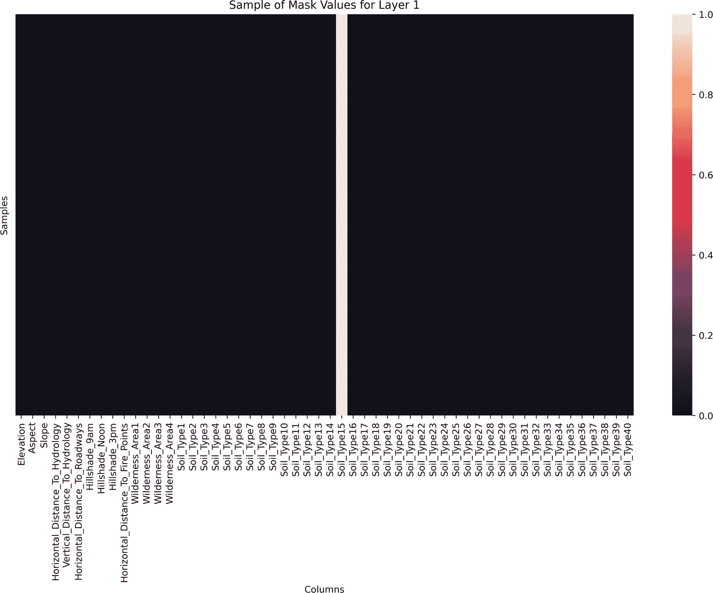

7 个样本与列的热图描绘了第 1 层到第 7 层的掩码值。每个热图包含 54 个样本。热图使用不同范围的比例进行颜色编码。

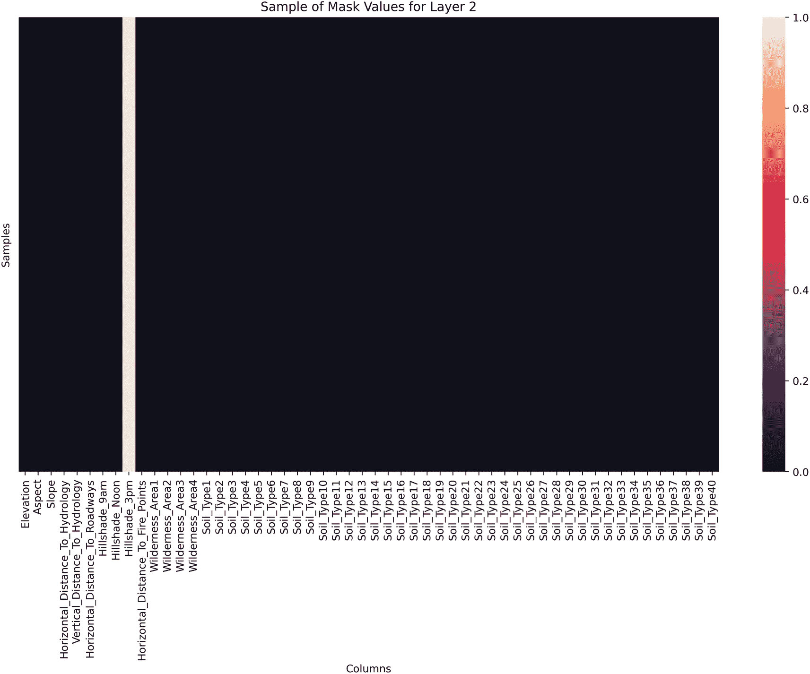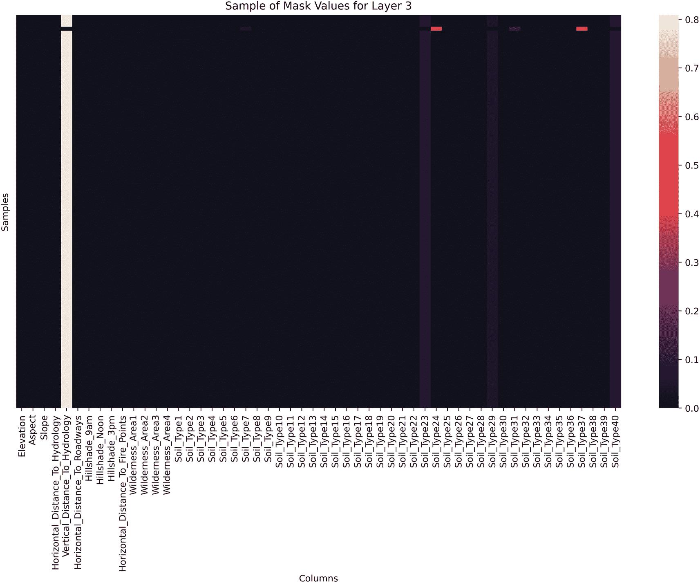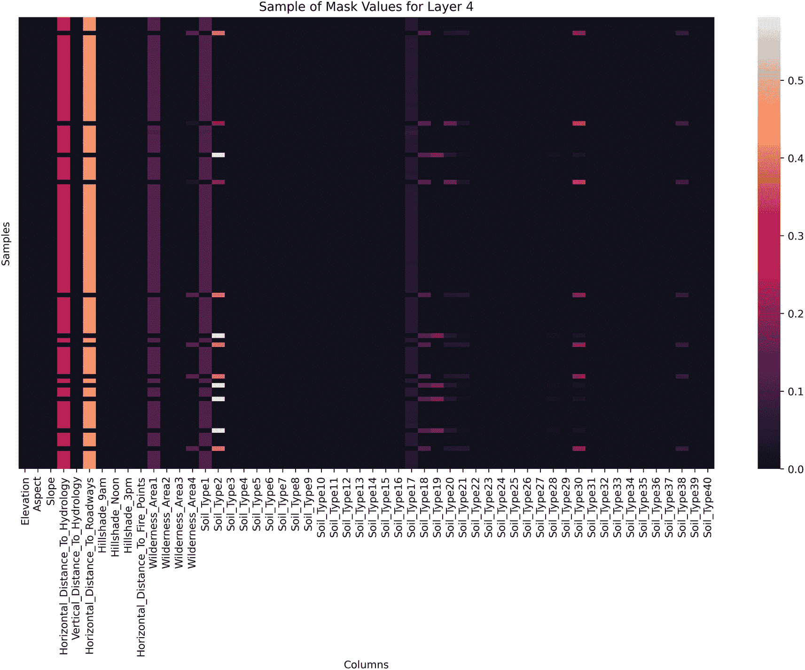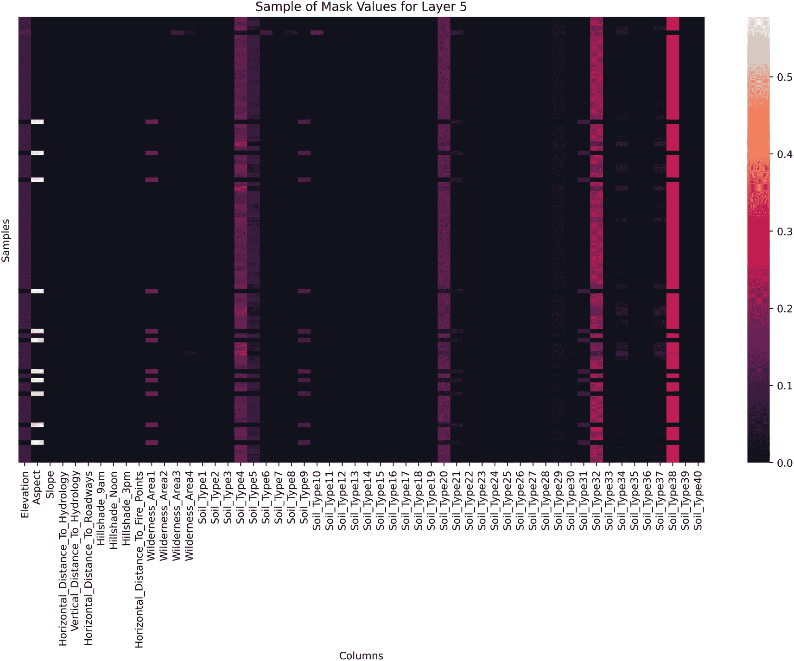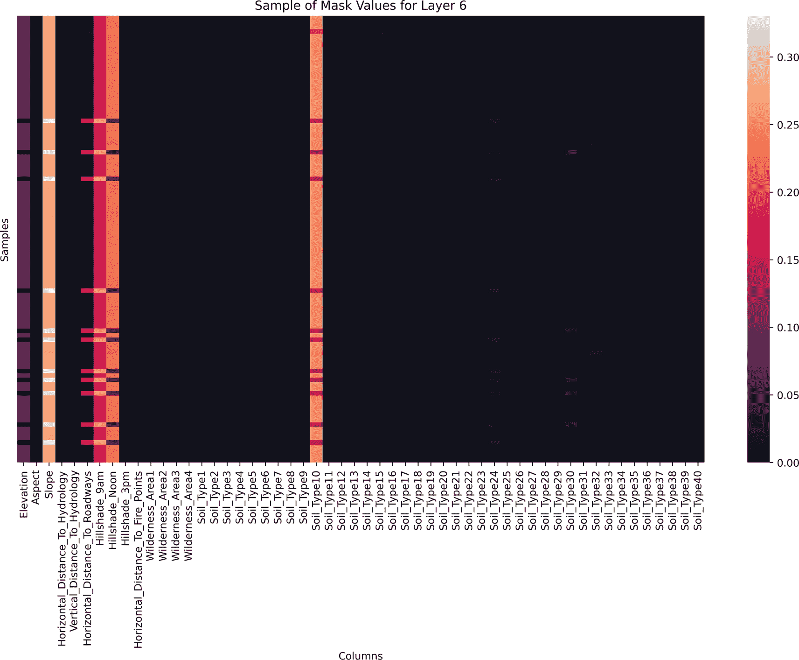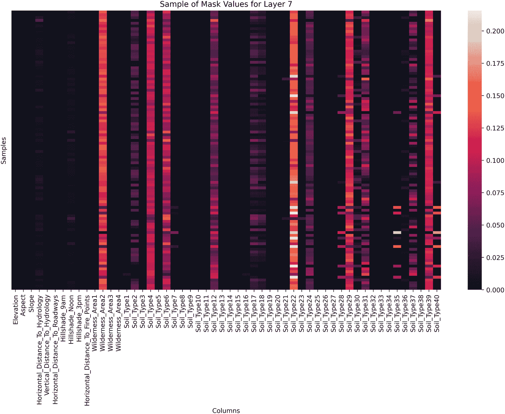

图 6-67

TabNet 块在每个迭代中关注的特征（沿 x 轴排列）对于几个样本（沿 y 轴排列）

```py
for i in range(7):
plt.figure(figsize=(15, 8), dpi=400)
sns.heatmap(fs_masks[i,:100,:],
xticklabels=columns,
yticklabels=[])
plt.xlabel('Columns')
plt.ylabel('Samples')
plt.title(f'Sample of Mask Values for Layer {i+1}')
plt.show()
Listing 6-42
Plotting the TabNet feature selection masks
```

我们可以类似地访问聚合特征掩码，它告诉我们提交数据集中所有样本在决策步骤中对输出贡献的个体特征（如列表 6-43，图 6-68 所示）。

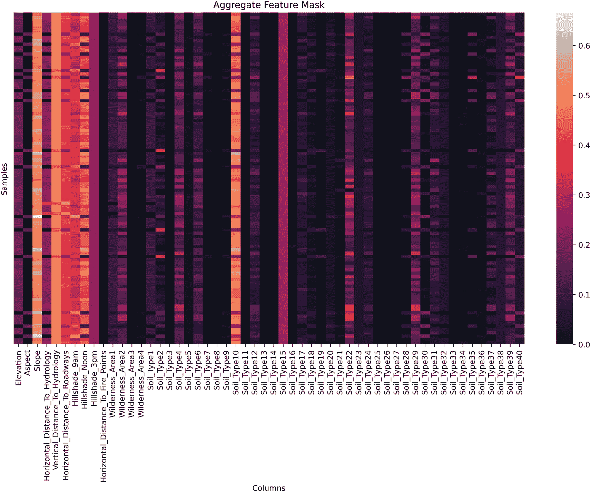

样本与列的热图描绘了一个聚合特征掩码。它包括 54 个样本。热图基于从 0.0 到 0.65 的范围进行着色。

图 6-68

在多个示例中绘制聚合特征掩码

```py
agg_mask = model.tabnet.aggregate_feature_selection_mask
plt.figure(figsize=(15, 8), dpi=400)
sns.heatmap(agg_mask.numpy()[0,:100,:,0],
xticklabels=columns,
yticklabels=[])
plt.xlabel('Columns')
plt.ylabel('Samples')
plt.title(f'Aggregate Feature Mask')
plt.show()
Listing 6-43
Obtaining aggregate feature masks across all TabNet blocks
```

总结来说，TabNet 采用基于注意力的特征选择机制，这强制进行顺序推理和处理特征，类似于树集成，具有可解释性的优势。

### SAINT

自注意力与跨样本注意力 Transformer（SAINT）是一个近期提出的模型，由马里兰大学和 Capital One 机器学习团队的 Gowthami Somepalli 等人于 2021 年的论文“SAINT: Improved Neural Networks for Tabular Data via Row Attention and Contrastive Pre-Training.”中提出。^(11) SAINT 的创新之处在于引入了*跨样本注意力*，这使得行能够以注意力的方式相互关联，而不是像标准列注意力那样。

让我们使用作者的概念（为了清晰起见略有调整）来构想 SAINT。令 *D* ≔ 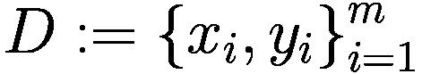：数据集 *D* 包含 *m* 对 *n* - 1 维特征向量 (*x*[*i*]) 和相关的标签 *y*[*i*]。真实数据集包含 *n* 个特征；添加了一个分类 `[CLS]` 标记作为额外的特征：![$$ {x}_i=\left\{\left[ CLS\right],{f}_i¹,{f}_i²,\dots, {f}_i^{n-1}\right\} $$](img/525591_1_En_6_Chapter/525591_1_En_6_Chapter_TeX_IEq6.png)，其中 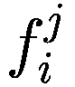 表示第 *i* 个样本的第 *j* 个特征值。`[CLS]` 标记作为“空白特征”。SAINT 独立地将每个特征嵌入到 *d*-维空间中，就像 TabTransformer。与 TabTransformer 不同，SAINT 将所有特征（分类和连续）都嵌入，而 TabTransformer 只选择性地嵌入分类特征。嵌入层表示为 *E* 并对不同的分类特征应用不同的嵌入函数。`[CLS]` 标记被嵌入，就像它是一个特征一样。当完整架构展开时，其相关性将变得更加清晰。

与 TabTransformer 和 TabNet 类似，SAINT 的主要架构体由 *L* 个基于注意力的步骤组成。每个步骤包括一个自注意力变换器块，随后是一个跨样本注意力变换器块。自注意力块与 Vaswani 等人原始变换器论文中使用的是相同的：一个多头自注意力 (MSA) 层后跟前馈 (FF) 层，并使用高斯误差线性单元 (GELU) 激活。此外，令 MISA 为多头跨样本自注意力层（此机制将在后面进行更深入的说明），LN 为层归一化层，*b* 为批量大小。MSA 和 MISA 都有后续的残差连接。对于样本索引 *k* 在步骤 *q* 的一个步骤 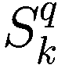，可以相应地以下列形式表示，其中包含中间变量 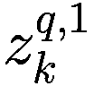，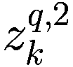，和 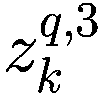 以便记号方便：

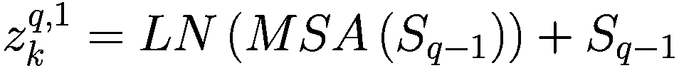

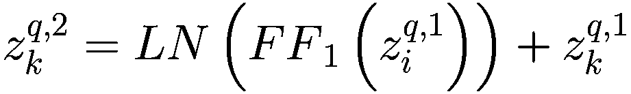

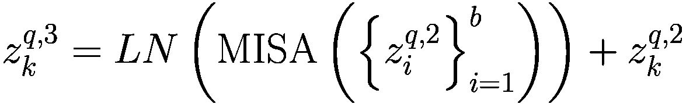

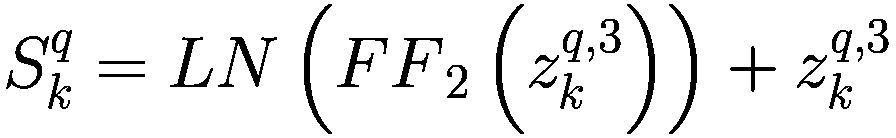

此外，我们有 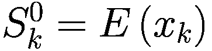 这样，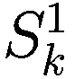 的输入是为此样本生成的嵌入。请注意，为了计算多头跨样本自注意力层，我们需要比较批次内所有样本的派生自注意力特征。

完整的架构在图 6-69 中可视化。

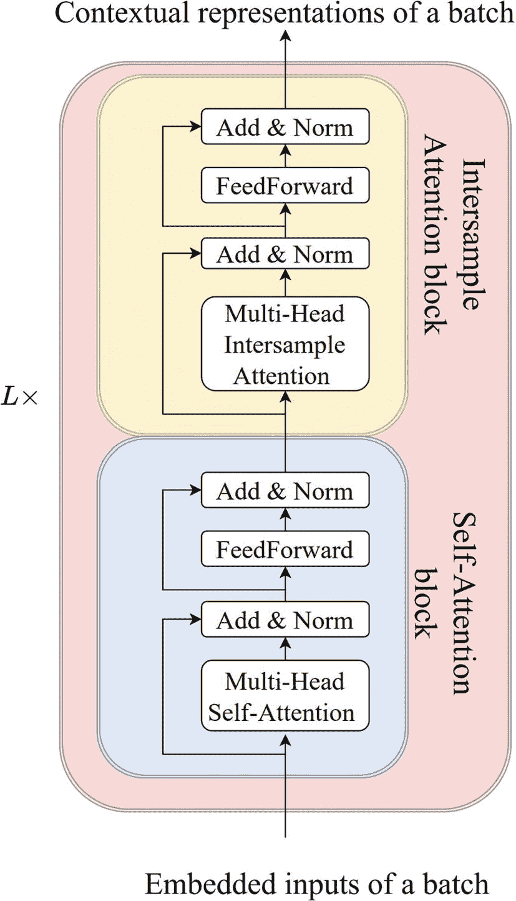

流程图展示了 S A I N T 的 Transformer 模块。它包括一个批次的嵌入输入、具有跨样本注意力和自注意力模块的 Transformer，以及批次的上下文表示。

图 6-69

完整的 SAINT Transformer 模块。来自 Somepalli 等人。

为了在监督问题上做出最终预测，从最后一步的 `[CLS]` 标记对应的嵌入（，假设 `[CLS]` 标记对应于第一个特征索引）中提取出来，并通过一个简单的多层感知器传递到输出。经过训练后，`[CLS]` 特征嵌入将通过跨特征和跨样本注意力的多个步骤得到信息。这是一个巧妙的方法，将信息强制输入到一个低维的单个嵌入中（而不是像 TabTransformer 风格那样连接每个特征的嵌入，这会显著增加维度性）。

要理解多头跨样本自注意力机制，我们首先将重新定义标准的多头自注意力机制（图 6-70）。令 *a* 为注意力矩阵，*a*[*i*, *j*] 表示由第 *i* 个特征派生出的查询与由第 *j* 个特征派生出的键之间的注意力分数。*a* 是一个 *n* × *n* 矩阵，其中自注意力分数是在对应于 ![$$ {x}_i=\left\{\left[ CLS\right],{f}_i¹,{f}_i²,\dots, {f}_i^{n-1}\right)\Big\} $$](img/525591_1_En_6_Chapter/525591_1_En_6_Chapter_TeX_IEq15.png) 的嵌入之间计算的。输出值的第 *i* 个是 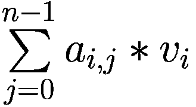，其中 *v*[*i*] 是由第 *i* 个特征派生的值向量。这通过多个头（即，从每个特征中派生出多个键、查询和值）重复进行。

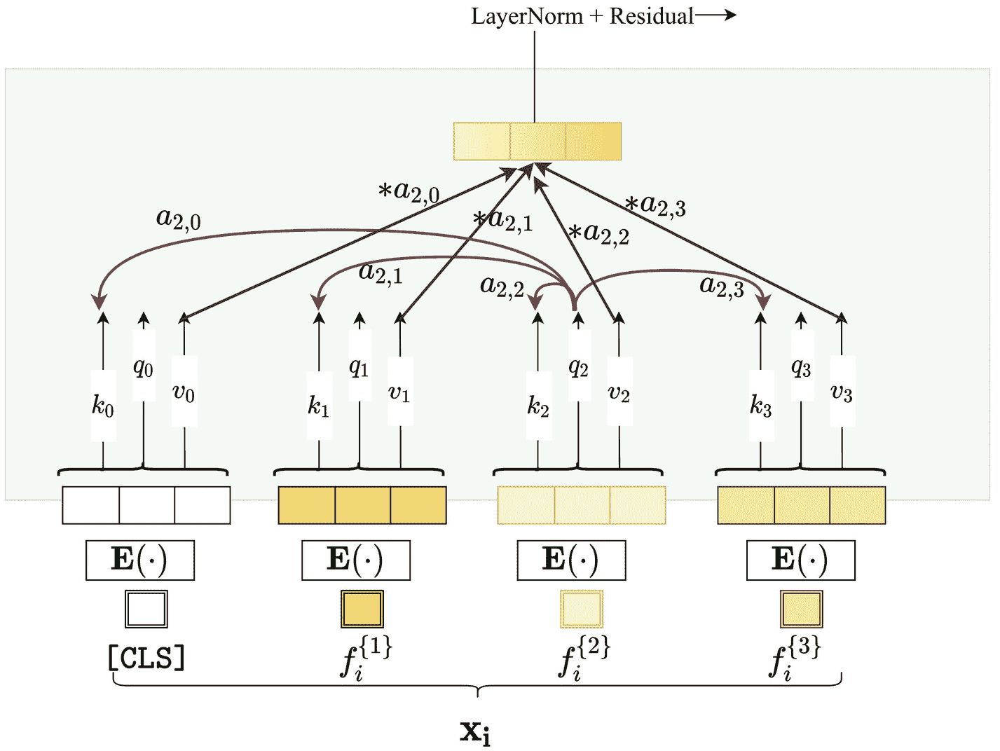

一幅插图展示了多头自注意力机制。它包括 4 个点层。每个层都有查询-键-值元素。聚合特征作为层归一化和残差输出。

图 6-70

inter-feature attention（标准注意力）的可视化。来自 Somepalli 等人。

多头 intersample 自注意力（图 6-71）是在一个批次中的“超级自注意力”。它不是在对应于特征集合 ![$$ {x}_i=\left\{\left[ CLS\right],{f}_i¹,{f}_i²,\dots, {f}_i^{n-1}\right\} $$](img/525591_1_En_6_Chapter/525591_1_En_6_Chapter_TeX_IEq17.png) 的嵌入上进行操作，而是在一个样本批次 {*x*[1], *x*[2], ..., *x*[*b*]} 上进行操作。每个样本中每个特征的嵌入相互拼接，独立于样本。键、查询和值向量是从这些拼接嵌入中导出的，使得每个样本的注意力头数与 (*K*, *Q*, *V*) 集合的数量相同。然后，我们以标准形式应用注意力：令 *a* 为一个 *b* × *b* 的注意力矩阵，*a*[*i*, *j*] 表示从对应于 *x*[*i*] 的拼接嵌入中得到的查询与从对应于 *x*[*j*] 的拼接嵌入中得到的键之间的注意力分数。为了获得最终输出，第 *i* 个值由以下公式给出！$$ \sum \limits_1^b{a}_{i,j}\ast {v}_i $$，其中 *v*[*i*] 是从对应于 *x*[*i*] 的拼接嵌入中导出的值向量。

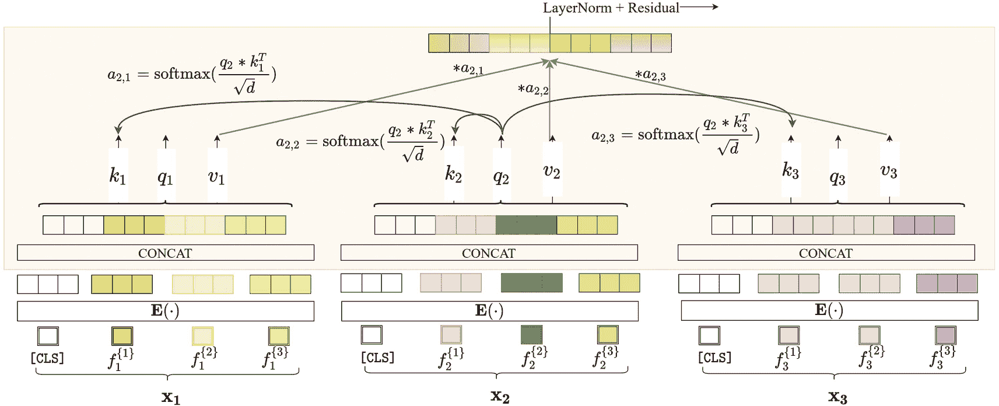

一幅插图展示了多头 intersample 自注意力机制。它包括 3 组 4 个点层，然后进行拼接。每个拼接层都有查询-键-值元素。聚合特征以层归一化和残差的形式输出。

图 6-71

intersample attention 的可视化。来自 Somepalli 等人。

与大多数针对表格数据的深度学习方法一样，SAINT 使用自监督训练任务进行预训练。与 TabTransformer 的替换标记检测预训练任务等 BERT/masked language model 风格的预训练任务不同，SAINT 使用对比学习。对比学习是一种训练范式，其目标不是在给定输入的情况下严格学习一个关联的目标，而是识别一组输入之间的共享或不同属性（即“比较和 *对比*”）。

SAINT 的预训练任务如下。对于每个样本 *x*[*i*]，生成一个损坏版本 *x*[*i*]^′。这是通过使用 CutMix 增强方法完成的，该方法使用以下计算，给定一个随机选择的样本 *x*[*a*] 和从伯努利分布 ***m*** 中采样的二进制掩码向量：

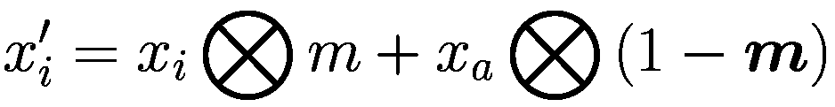

我们将嵌入 *x*[*i*] 以获得 *p*[*i*] = *E*(*x*[*i*])。然后，我们将根据混合参数 *α* 和另一个随机选择的样本 *x*[*b*] 生成一个损坏的嵌入：

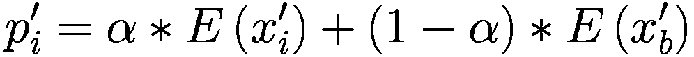

现在，我们拥有四组数据：*x*[*i*]，原始未受损害的样本；*x*[*i*]^′，损坏的样本；*p*[*i*]，原始未受损害的嵌入；以及 *p*[*i*]^′，损坏的嵌入。我们可以将这两个嵌入通过 SAINT 模型（我们将用粗体***S***表示，代表所有单个步骤的组合）传递，以获得***S***(*p*[*i*])和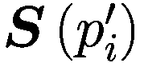。为了降低这些表示的维度，我们通过一个额外的 MLP *g*[1] 和 *g*[2] 传递这些表示，以获得 *g*1) 和 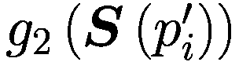。我们可以使用这些来计算*对比损失*，对于某个温度参数 *τ*：

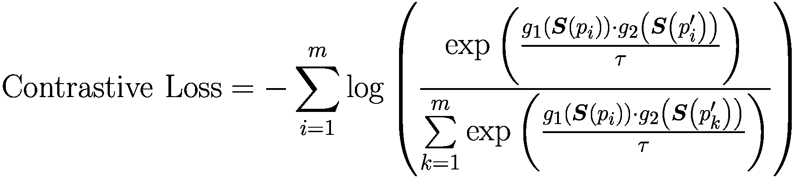

让我们分解这个公式。温度参数、对数和指数可以或多或少忽略，因为它们不影响表达式的本质动态。我们可以粗略地“简化”如下：

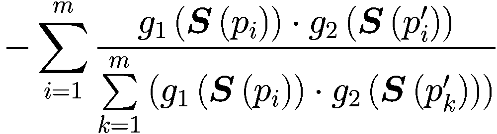

这种形式下更易于阅读。在分子中，我们比较的是从干净输入中得到的表示与从相同输入的损坏版本中得到的表示。在分母中，我们是对从干净输入中得到的表示与从数据集中每个元素的损坏版本中得到的表示之间的交互进行求和。（回想一下，作者用未加粗的*m*表示数据集的长度。）当两个向量**a**和**b**相等时，向量**a**和**b**的点积最大，其中一个向量保持固定。在理想条件下，*g*1)和**g2**(*S*(*p*[*i*]))将非常接近，因为它们都从根本上来自相同的样本，即使其中一个被损坏。在这种情况下，分子将很大，相对于如果*g*1)和**g2**(*S*(*p*[*i*]))相距更远，整体项将评估为高值。我们将在数据集中的所有项目上求和所有这样的值。因为我们想最小化损失，所以我们取负值。

我们可以将整个 SAINT 架构的**S**部分视为一个巨大的嵌入机；对比损失激励智能映射的嵌入，使得在嵌入空间中物理上接近的点彼此靠近。

作者还引入了一种去噪损失，其目标是解码原始输入*x*[*i*]从损坏嵌入得到的表示**g2**(*S*(*p*[*i*]))。为每个单独的特征构建了一个独特的多层感知器模型来执行“去噪”。损失**Lj**，对于分类特征是二元交叉熵，对于连续特征是均方误差，是在原始输入和导出的表示之间计算的。这将在所有特征（*n*个总特征）和所有样本（*m*个总样本）上求和，然后乘以*λ*[pt]，以便相对于对比损失具有适当的量级：

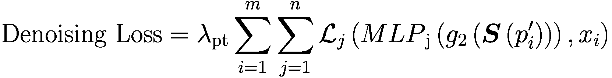

总体训练损失是对比损失和去噪损失的加和：

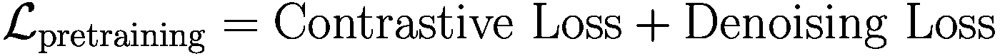

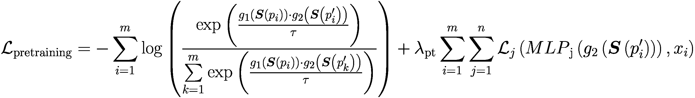

然后，如前所述，模型在监督学习环境中进行微调；在最后一步对应的 [CLS] 标记的嵌入 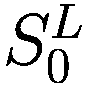 被传递到一个单隐藏层的 MLP 中以获得输出：

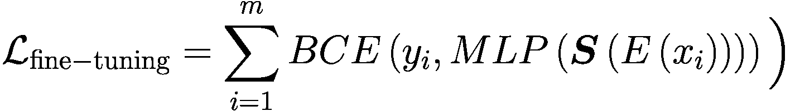

完整的 SAINT 训练流程在图 6-72 中可视化。

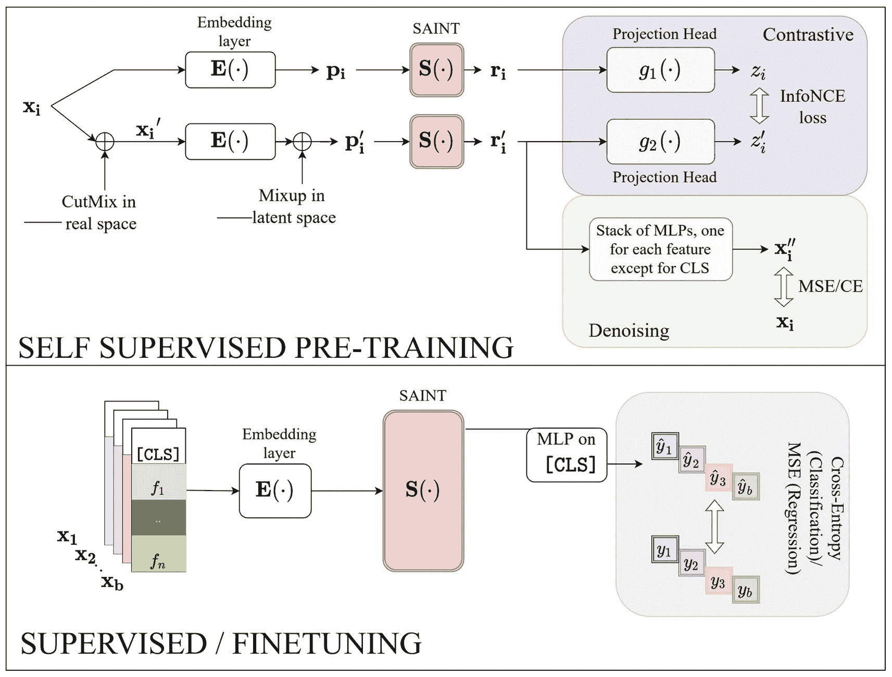

一幅两部分的插图分别展示了 S A I N T 的自监督预训练和监督微调方案的工作原理。

图 6-72

完整的 SAINT 训练流程和使用的架构。对于符号：粗体 ***S***(...) 表示完整的 SAINT 流程（即所有步骤的组合），*r*[*i*] 是 ***S***(...) 的输出。来自 Somepalli 等人。

Somepalli 等人评估了 SAINT 的三个版本（标准 SAINT；仅使用自注意力机制的 SAINT-s；仅使用跨样本注意力机制的 SAINT-i）在 16 个数据集上的表现，并证明了其相对于其他基于树和深度学习的表格数据模型的性能提升（表 6-13）。请注意，SAINT-s 与 Vaswani 等人原始的 transformer 块大致相同，但应用于表格数据。然而，我们发现跨样本注意力在大量数据集上帮助提供了仅使用自注意力机制所不能提供的改进。

表 6-13

平均 AUROC

| -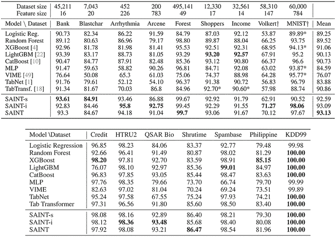2 个表格。表 1 有 12 行和 3 列。第 2 列有 9 个子列。表 2 有 12 行和 2 列。第 2 列有 7 个子列。 |
| --- |

此外，作者发现 SAINT 对数据严重损坏具有高度鲁棒性，并且假设最小批量为 32 的情况下，改变批量大小的效果很小。这表明只需要一个“临界质量”的样本批次就能有效地进行比较和跨样本比较。

层的注意力图可以解释为理解模型如何做出决策（图 6-73）。

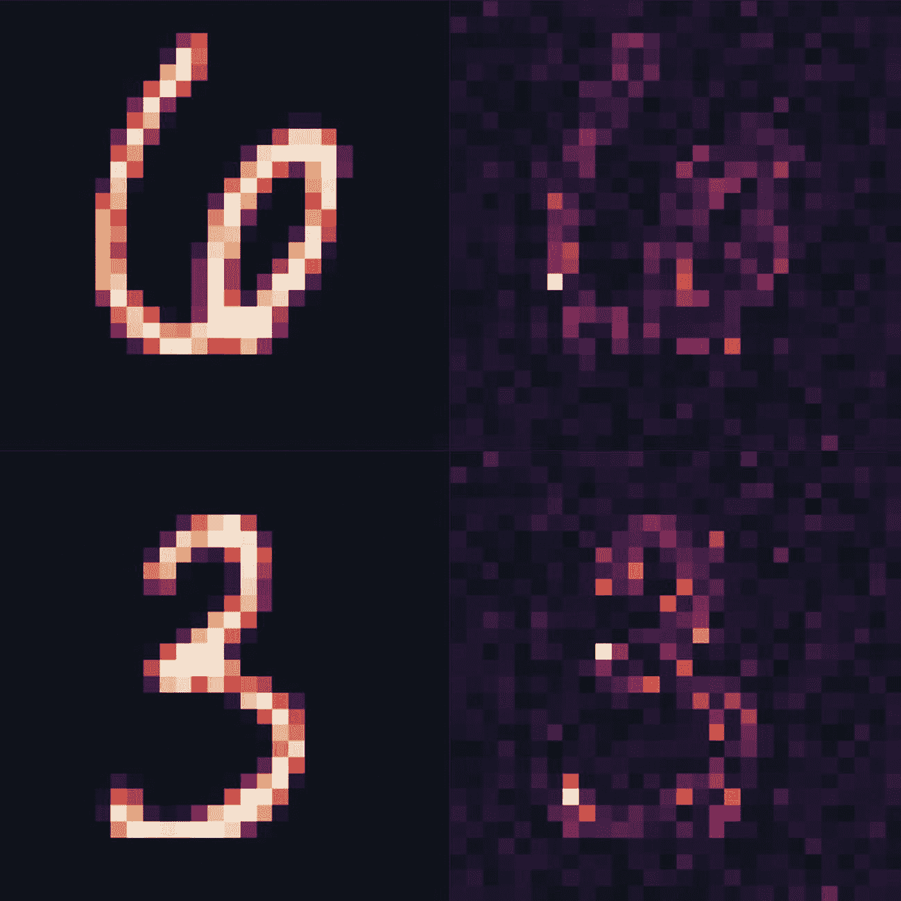

一个四部分的热力图描绘了层的样本输入和自注意力分数。输入热力图相对于自注意力分数热力图来说更亮。

图 6-73

左列：样本输入，重塑为二维。右：自注意力分数，选择并重塑为二维。来自 Somepalli 等人。

然而，SAINT 是独特的，因为我们还可以根据其他示例理解网络如何为特定样本做出决策。在 MNIST 上，网络倾向于大量咨询一组示例（图 6-74），可能是因为它们是难以分类的示例，具有高信息价值。然而，在更复杂的 Volkert 数据集上，样本间注意力网格变化更多（图 6-75）。作者推测，样本间注意力密度随着数据集复杂性的增加而增加。

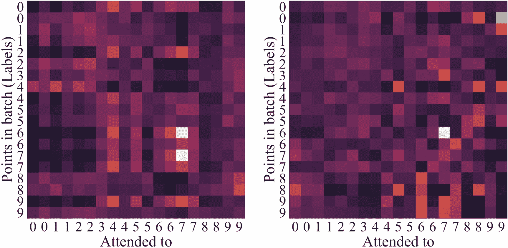

在 Volkert 数据集上，2 个热力图展示了批量中的点与被关注的点，以描绘 S A I N T 和 S A I N T-i。每个热力图有 20 行和 20 列。单元格以不同的颜色着色。

图 6-75

左：SAINT 的样本间注意力。右：SAINT-i 的样本间注意力。在 Volkert 数据集上。来自 Somepalli 等人。

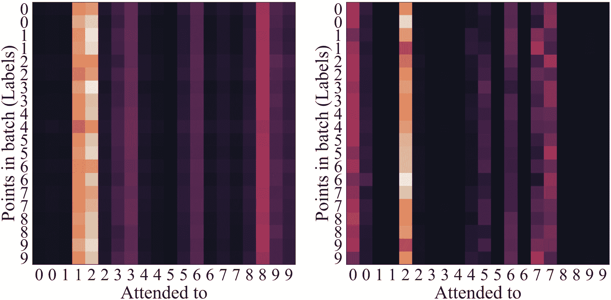

在 MNIST 数据集上，2 个热力图展示了批量中的点与被关注的点，以描绘 S A I N T 和 S A I N T-i。每个热力图有 20 行和 20 列。单元格以不同的颜色着色。

图 6-74

左：SAINT 的样本间注意力。右：SAINT-i 的样本间注意力。在 MNIST 数据集上。来自 Somepalli 等人。

论文的作者已经在 PyTorch 中实现了 SAINT，可在官方仓库中找到：[`github.com/somepago/saint`](https://github.com/somepago/saint)。据我们所知，目前还没有现成的 Keras 或 TensorFlow 实现。然而，Somepalli 等人的实现用户友好，并且可以通过命令行直接访问，无需了解 PyTorch。

首先，通过克隆存储库并创建和激活提供的环境（列表 6-44）开始。

```py
git clone https://github.com/somepago/saint.git
conda env create -f saint_enviornment.yml
conda activate saint_env
Listing 6-44
Cloning the repository and creating and activating the environment
```

在当前实现中，模型直接从 OpenML - 一个具有具体定义和标准化（在组织意义上，而非统计意义上）的特征、标签和其他数据属性优势的数据平台中提取数据。导航至 [www.openml.org/](https://www.openml.org/) 浏览现有数据集或上传并创建自己的数据集。重要的是，每个数据集页面都有一个数值整数 ID，我们将提供该 ID 作为标志来识别我们希望训练的数据集。例如，森林覆盖数据集的 OpenML ID 为 `180`（图 6-76）。

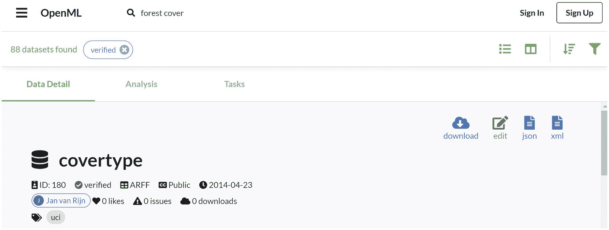

一张 open ML 网站的截图显示了森林覆盖数据集。它有下载、编辑、json 和 xml 选项。

图 6-76

OpenML 上的森林覆盖数据集

一旦你获得了 OpenML ID，你就可以启动训练过程：`python train.py --dset_id 180 --task multiclass`。数据集 ID 和任务是唯一两个必需的标志；你也可以指定参数，如注意力头的数量、是否使用预训练、嵌入大小等。有关更多信息，请参阅存储库的 README 文件。请注意，截至本文撰写时，存储库维护者仅验证了 Linux 上的代码。你可能在其他操作系统上遇到问题。

### ARM-Net

ARM-Net，由蔡少锋等人在 2021 年发表的论文“ARM-Net：结构化数据的自适应关系建模网络”中提出，采用了一种独特的架构，可以描述为比之前讨论的基于注意力的架构更为“复杂”。ARM-Net 不是使用标准的注意力机制作为抽象关注不同相关特征（在 SAINT 的情况下，还包括样本）的转换方法，而是使用注意力来帮助显式计算表格数据集中信息丰富的交叉特征，这些特征可用于监督任务。ARM-Net 由三个模块组成：预处理模块、自适应关系建模模块和预测模块。

让我们首先用作者的符号正式化预处理模块。设 *m* 为数据集中的特征数量，设输入向量 *x* = [*x*[1], *x*[2], ..., *x*[*m*]]。每个特征都映射到一个嵌入：*E* = [*e*[1], *e*[2], ..., *e*[*m*]]。分类特征通过嵌入查找映射，连续特征通过线性变换转换。设 *n*[*e*] 为嵌入维度。

自适应关系建模模块的关键转换机制是指数神经元。对于某些交互权重矩阵 *w*，我们可以根据嵌入集 *e* 计算指数神经元输出 *y* 的第 *i* 个元素，如下所示：

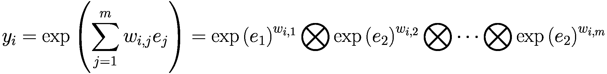

交互权重矩阵决定了每个嵌入对输出的影响——类似于标准人工神经网络中的神经元——但它在指数空间中操作，而不是标准神经元的加法-乘法动态。

为了获得交互权重矩阵 *w*，自适应关系建模模块使用多头门控注意力机制。在确定第 *i* 个神经元 *y*[*i*] 的值时，我们需要获得相关的幂项权重：*w*[*i*] = [*w*[*i*, 1], *w*[*i*, 2], ..., *w*[*i*, *m*]]。设 *v*[*i*] ∈ *ℝ*^(*m*) 为与第 *i* 个神经元关联的（可学习的）权重值向量，它编码了对于每个 *m* 个特征的嵌入的注意力。设 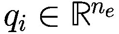 为与第 *i* 个神经元关联的查询向量，它与嵌入一起动态生成双线性注意力对齐分数，计算如下：

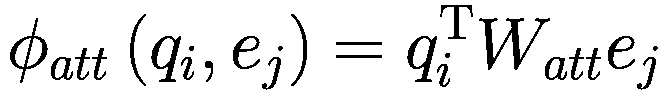

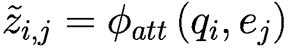

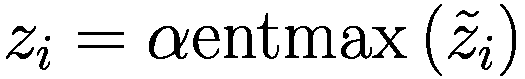

在这里，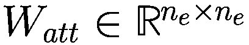 是双线性注意力的权重矩阵。共享的双线性注意力函数 *ϕ*att 通过执行查询向量、双线性注意力权重矩阵和嵌入之间的乘积来计算。转置的查询具有形状 (1, *n*[*e*])；这个与 (*n*[*e*], *n*[*e*])-形状的权重矩阵的乘积产生一个 (1, *n*[*e*])-形状的矩阵；这个矩阵与 (*n*[*e*], 1)-形状的嵌入矩阵的乘积产生一个 (1, 1)-形状的结果（即，一个标量）。因此，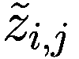 存储了第 *i* 个神经元的查询向量和第 *j* 个特征的嵌入之间的注意力分数。因此，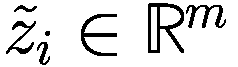；也就是说，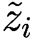 的长度为 *m* – 代表了第 *i* 个指数神经元与每个 *m* 个特征之间的注意力分数。我们通过应用 *α*entmax（稀疏 softmax）函数来计算真实的嵌入分数，以获得 *z*[*i*]。稀疏 softmax 函数 – 如先前在其他表格注意力架构的各种修改形式中所用 – 通过将较小的值推向零来鼓励稀疏性，同时保留 softmax 的签名一和性质.^(13)

因此，我们可以如下计算交互权重：

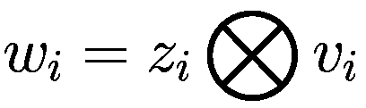

因为 *z*[*i*] ∈ *ℝ*^(*m*) 和 *v*[*i*] ∈ *ℝ*^(*m*), 我们有 *w*[*i*] ∈ *ℝ*^(*m*). 这就是机制的门控特性：*z*[*i*] 作为“门”来决定 *v*[*i*] 中的哪些元素“可以通行”（即，对于下游任务相关）。这个权重，由相关特征所指导，然后被用来“编程”指数神经元的行为了。

给定学习的“原子”*q*[*i*]，*W*[att]，*v*[*i*] 和嵌入 *e*，我们可以更完整地重新表达第 *i* 个指数神经元的计算如下：

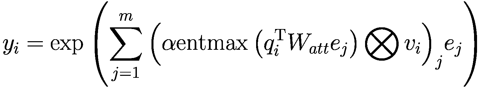

作者采用了该系统的多头版本。设 *K* 为头数，*o* 为指数神经元的数量。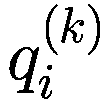 表示第 *i* 个神经元的第 *k* 个查询键，同样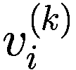 表示第 *i* 个神经元的第 *k* 个值键。注意 *W*[att] 在所有头之间是共享的。从每个头中，我们可以得到自适应关系建模模块的最终输出 ***Y***，它是每个头输出拼接的结果。（在此上下文中，*a* ***⊕*** *b* 表示向量拼接。）

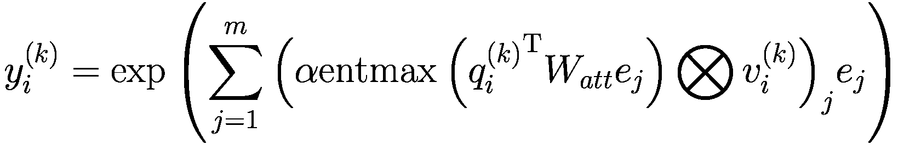

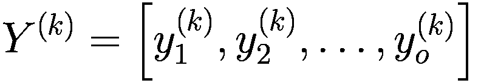

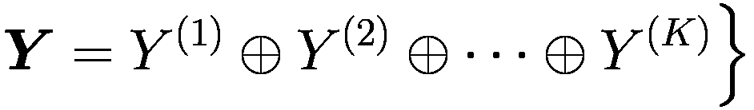

完整的自适应关系建模模块在图 6-77 中展示。

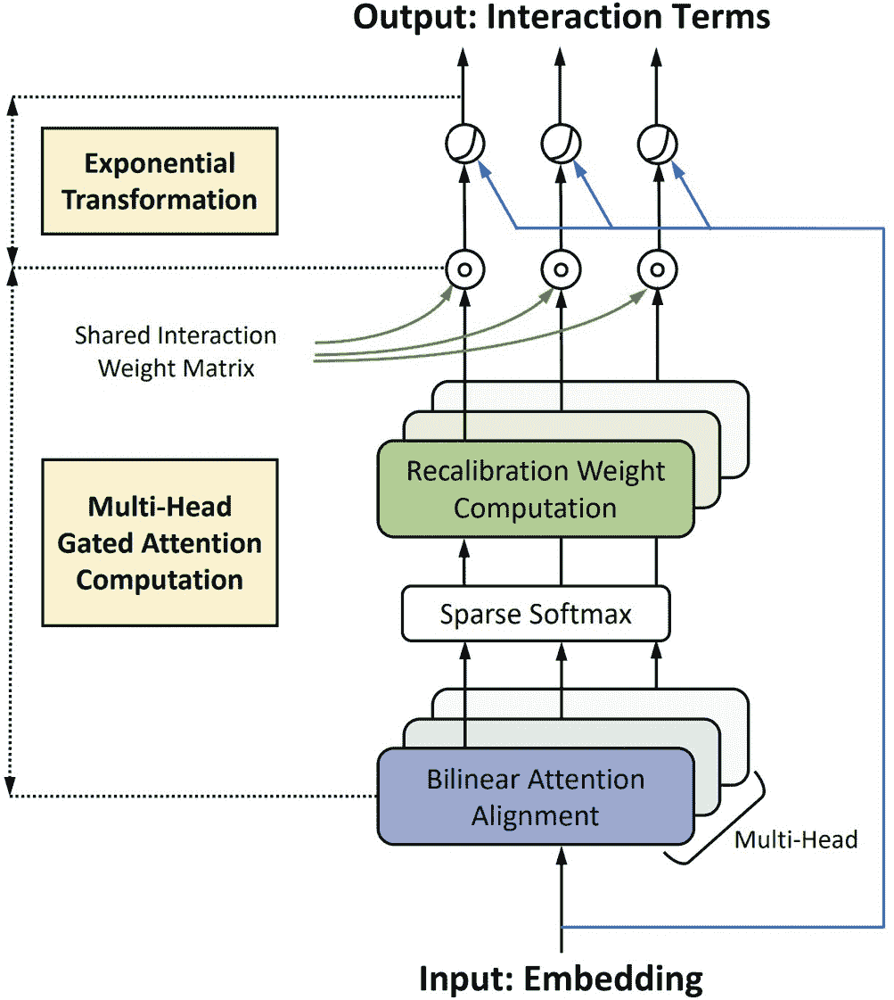

流程图展示了自适应关系建模模块的运作。流程包括输入嵌入、多头双线性注意力对齐、稀疏 softmax、重新校准权重计算、共享交互权重矩阵、指数变换和输出交互项。

图 6-77

自适应关系建模模块架构。来自蔡等人。

我们有 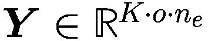 属于 ${\mathbb{R}}^{K\cdot o\cdot {n}_e}$；预测模块使用多层感知器将此向量投影到最终的期望输出：

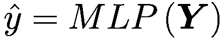

完整的 ARM-Net 架构在图 6-78 中展示。

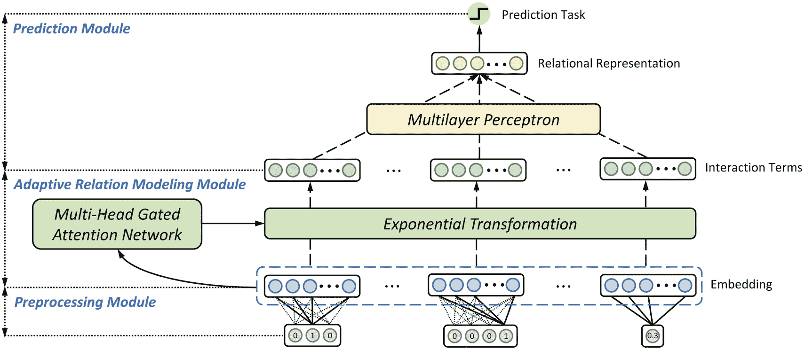

流程图展示了 A R M-net 模型的运作，分为 3 个模块：预处理、自适应关系建模和预测。流程包括输入嵌入、指数变换、交互项、多层感知、关系表示和预测任务。

图 6-78

完整的 ARM-Net 架构。来自蔡等人。

总体而言，ARM-Net 架构在建模表格数据方面采用了更复杂的设计。它不像之前讨论的工作那样，在大型块中公开应用注意力机制并采用诸如自监督预训练等策略，ARM-Net 对如何利用注意力机制非常“严格”。ARM-Net 明确使用指数神经元来建模嵌入之间的交叉特征，并使用多头注意力机制动态确定如何执行此类建模。这种“严格”的架构确保了高参数效率，因为信息流被明确地引导，而不是开放并期望完全学习（例如，通过昂贵的自监督学习活动）。此外，像之前的工作一样，注意力权重可以解释以了解模型如何对任何样本进行预测。

Cai 等人将 ARM-Net 应用于几个大型基准表格数据集，并发现 ARM-Net 在具有合理参数大小的条件下与其他深度表格模型具有竞争力（见表 6-14）。

表 6-14

ARM-NET 和 ARM-Net+（ARM-Net 与标准 DNN 的集成）在五个不同上下文基准模型上的性能与其他模型品种的比较

| -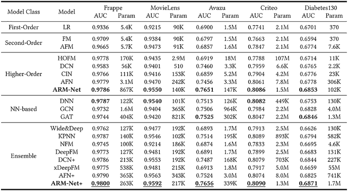一个 19 行 7 列的表格。第 3 列到第 7 列各自细分为 2 个子列，标题为 A U C 和 param. |
| --- |

作者提供了官方仓库[`github.com/nusdbsystem/ARM-Net`](https://github.com/nusdbsystem/ARM-Net)。它和 SAINT 一样，也是用 PyTorch 编写的，没有容易找到的 Keras 或 TensorFlow 重实现。克隆并安装依赖项后，您可以在`ARM-Net/run.sh`中查看命令行脚本的示例，在那里您可以控制模型架构、训练参数和使用的数据集。

## 关键点

本章讨论了注意力机制，其在 Transformer 模型中的应用，以及基于注意力机制的语言、多模态和表格上下文数据的建模应用。

+   注意力机制允许通过将每个时间步对与一个表示跨时间步依赖相关性的注意力分数相关联，直接、明确地建模两个序列之间的依赖关系。这有助于解决循环模型中的信号传播和依赖遗忘问题，这些问题可能会阻碍高级序列到序列任务的表现，即使有长期记忆状态和双向性等升级。例如，Google 神经机器翻译模型（Wu 等人，2016 年）采用了具有注意力机制的大型 LSTM 堆栈编码器和解码器。

+   变换器架构（Vaswani 等人，2017 年）证明了可以不使用循环模型构建成功的序列到序列模型，仅依靠注意力作为核心机制来建模序列依赖关系。Vaswani 等人使用了多头注意力，其中通过线性层导出多个版本的值、键和查询键；在每个值-键-查询组合之间计算注意力，然后将结果拼接并线性映射到输出。这从理论上允许学习并处理值、键和查询的多个表示。变换器架构在编码器和解码器层中使用自注意力，在自回归解码中使用编码器和解码器之间的交叉注意力。后来的基于变换器的模型，如 BERT（Devlin 等人，2019 年）表明，变换器模型可以从自监督预训练中受益，例如掩码语言建模和下一句识别任务。几乎所有现代自然语言模型都是变换器或深受变换器启发。一些研究人员（Merity 2019 年）对围绕变换器模型的研究热潮表示怀疑，证明了许多更可持续和轻量级的模型也能获得良好的性能，并倡导更加重视可重复性。

+   Keras 提供了三种原生的注意力类型：Luong 风格的点积注意力 `L.Attention()`，Bahdanau 风格的加性注意力 `L.AdditiveAttention()`，以及 Vaswani 风格的多头注意力 `L.MultiHeadAttention`。通过将 `return_attention_scores=True` 参数传递给这些层的调用，你还可以收集在任何一次传递中产生的注意力分数。这允许你解释特定层如何关注某些时间步。

+   你可以将注意力层构建到文本的循环模型中，或者构建到多模态模型的循环头中，以改进文本与表格数据之间的关系建模。

+   你可以直接将注意力层应用于嵌入的表格数据。这是计算数据集中不同特征之间交互的一种自然方式。

+   在表格数据上应用基于注意力的深度学习模型的工作量相当可观。本章我们介绍了该领域四个研究论文，以例证该领域的研究成果。

    +   TabTransformer（Huang 等人，2020 年）将分类特征嵌入，并应用变换器块，该块由多个多头注意力层组成，每个层后面跟着一个具有残差连接和层归一化的前馈层，多次重复。导出的特征与层归一化的连续特征拼接，并使用标准的多层感知器（MLP）进行处理。

    +   TabNet（Arik 和 Pfister，2019 年）使用一个类似的多步骤决策模型；在每一步中，模型使用类似注意力的机制“选择”一定子集的特征，然后使用几个前馈层和残差连接处理这些特征。TabNet 采用自监督预训练；输入中的某些值被随机掩码，TabNet 必须重建这些掩码的值。在预训练任务之后，TabNet 解码器被丢弃，并替换为一个决策模块，该模块可用于微调。

    +   SAINT（Somepalli 等人，2021 年）使用一个多步骤架构；每个步骤由一个标准的类似 transformer 的块后跟一个样本间注意力块组成。样本间注意力块计算样本之间的关系，而不是计算输入特征或时间戳之间的关系。这使得模型能够明确地推理其批次中相对于其他样本的信息，从而在可解释性方面具有信息性。

    +   ARM-Net 模型（Cai 等人，2021 年）不使用类似 transformer 的架构，而是使用注意力机制来控制新型指数神经元的行怍，这允许非常直接地学习特征之间的显式交互。

下一章将探讨基于树型深度学习模型的研究工作，这是现代关于表格数据深度学习的另一项重要研究内容。
