# 9. 数据生成

> *它不是地图，而是真实的存在，它在那些不再是帝国而是我们自己的沙漠中到处留下痕迹：这是现实的沙漠本身。*
> 
> ——让-鲍德里亚，哲学家

数据生成可以定义为基于选定的、现有的、类似于原始数据集的数据集创建合成数据样本。在某种程度上，“类似于”这个术语是模糊的，因为没有普遍的指标来定义一个样本与另一个样本的相似性，而不显得冷漠。合成图像数据的评估可以完全通过肉眼来判断，而表格数据则需要计算每个特征与另一个特征之间的双变量关系，并将其与原始数据集进行比较。

现在的问题是：为什么我们需要人工创建的数据样本，当有从现实世界收集的数据可能更能代表情况时？最直接的答案是，我们没有足够的数据。这可能有无数的原因，比如可用于进一步数据收集的资源不足，或者数据收集过程过于耗时，仅举几个例子。

机器学习模型，尤其是与深度学习相关的模型，绝对需要大量的数据点来实现良好的性能，因此需要合成数据来补充可能较小的数据集。此外，许多分类数据集是不平衡的——它们的标签严重偏向一个或多个类别，为剩余的类别留下的样本很少。许多这些情况发生在医学诊断数据集中，阳性病例的数量显著少于阴性病例。通过利用条件数据生成，我们可以将阳性病例插入数据集，直到它达到平衡，这样模型就能够以相同的信心和准确性对两个类别进行分类。

从现实世界收集的数据集还存在另一个问题，那就是敏感信息。某些数据集中的某些信息对其他人来说是私密的，并且受到法律的保护。为了在这些数据集上训练，我们可以通过合成这些敏感字段来生成新的样本，从而有效地保护受试者的隐私。以下章节将向您介绍各种数据生成算法，包括变分自编码器和生成对抗神经网络。

## 变分自编码器

变分自编码器（VAEs）是自编码器最令人兴奋的应用之一。VAEs 使我们能够生成新的数据，这些数据已被用于创建类似于训练数据集的逼真图像。与其它数据生成技术（即，主要是生成对抗网络 GANs）相比，VAEs 的一个优势是精细控制：我们可以在一定程度上控制我们希望在生成的输出中看到的内容。例如，VAEs 可以用来在无胡须的人的图像上绘制一个逼真的胡须。在表格数据的背景下，VAEs 允许我们生成合成数据以增加表格数据集中少数样本的大小和/或代表性。然后，可以使用这些数据集来训练具有更好验证或实际部署性能的经典机器学习或深度学习模型。

### 理论

要理解变分自编码器，我们需要从重新理解自编码器本身的逻辑以及编码器和解码器之间的关系开始。编码器将输入编码到潜在空间中，而解码器则学习从编码的潜在空间向量中解码样本。然而，解码器不能简单地记住每个潜在空间向量与相应输入之间的关联（至少在精心设计的自编码器中不是这样）。编码器必须努力以允许解码器泛化重建任务的方式结构化潜在空间。例如，两个非常相似的数字“3”的图像应该有非常接近的潜在空间向量，因为它们在结构上非常相似——解码器应该能够在解码这些输入时应用非常相似的技能。为了使自编码器成功，潜在空间必须以使相似项更接近、不同项更远的方式进行结构化。我们已经在许多先前应用和演示中利用了自编码器潜在空间的这一特性；我们看到了原始自编码器可以执行隐式聚类/分离，学习到的潜在空间对预训练有用，以及潜在空间可以在多任务学习中同时用于自编码和任务训练。

在所有这些应用和演示中，解码器只允许解码编码器给出的向量。然而，编码器和解码器的具体操作以及单个输入编码对与潜在空间的概念相比并不那么相关。这些“映射”有助于定义潜在空间，但最终重要的是“空间”，而不是空间中的具体“点”。具体来说，我们应该能够通过解码潜在空间中的任何向量来获得逼真的输出，而不仅仅是与数据集中的项目相对应的向量。

假设我们有一个已经在 MNIST 数据集（使用标准的减半/加倍架构逻辑）上训练过的自动编码器。解码器在某种程度上已经学会了潜在空间向量周围的*空间*，而不仅仅是潜在向量本身。假设自动编码器已经在 MNIST 上训练过，让我们演示一下当我们逐步“远离”一个直接对应于已知样本项的潜在编码时会发生什么。我们看到解码在前几步保持不变，然后迅速变形为完全不同的东西（列表 9-1，图 9-1）。

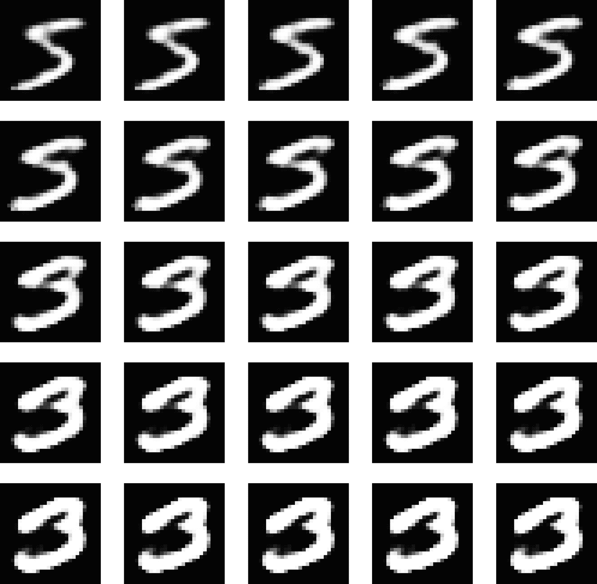

25 个网格的示意图，排列成 5 列和 5 行。它们展示了通过 V A E 解码的样本数字。

图 9-1

通过“远离”一个“真实”的潜在空间向量解码的样本数字，以网格形式排列以便于查看。

```py
encoded = encoder(X_train[0:1])0
plt.figure(figsize=(10, 10), dpi=400)
for i in range(5):
for j in range(5):
plt.subplot(5, 5, i*5+j+1)
modified_encoded = encoded + 0.5 * (i*5+j+1)
decoded = decoder(modified_encoded).numpy()
plt.imshow(decoded.reshape((28,28)))
plt.axis('off')
plt.show()
Listing 9-1
Sampling from the latent space
```

我们可以将这样的空间描述为“离散的”——注意，对于非常大的距离，一切保持不变，但在一个临界阈值处解码突然改变，之后也保持不变。它不是连续的；解码数字形状的变化与我们从原始点在潜在空间中走多远不成比例。

或者，我们可以尝试解码两个相对显著不同的样本之间的线性插值——通过平均潜在空间向量来获得一个表示两个样本潜在空间向量之间“中间”点的向量。使用我们的假设，它表明自动编码器学习的是空间而不是仅仅是一组点，输出应该是有效的，理想情况下是两种真实样本之间的某种“中间”网格。让我们采样几个（列表 9-2，图 9-2）。

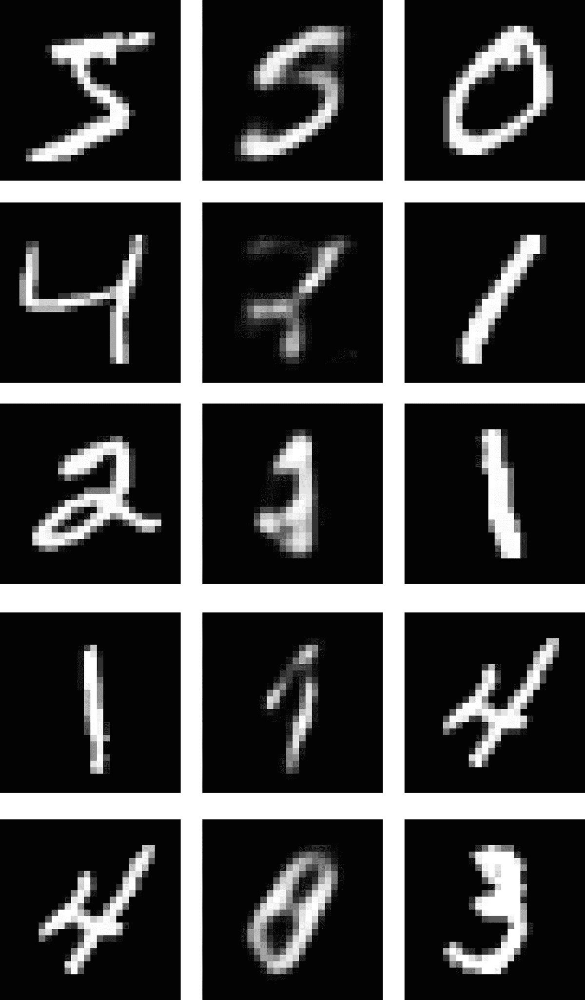

15 个网格的示意图，排列成 3 列和 5 行。它显示了样本数字之间线性插值的解码结果。

图 9-2

显示解码结果（中间列）为左侧和右侧列中显示的两个图像的潜在向量之间的线性插值。

```py
for i in range(10):
encoded1 = encoder(X_train[i:i+1])
encoded2 = encoder(X_train[i+1:i+2])
modified_encoded = (encoded1 + encoded2) / 2
decoded = decoder(modified_encoded)
plt.figure(figsize=(10, 3), dpi=400)
plt.subplot(1, 3, 1)
plt.imshow(X_train[i:i+1].reshape((28,28)))
plt.axis('off')
plt.subplot(1, 3, 2)
plt.imshow(decoded.numpy().reshape((28,28)))
plt.axis('off')
plt.subplot(1, 3, 3)
plt.imshow(X_train[i+1:i+2].reshape((28,28)))
plt.axis('off')
plt.show()
Listing 9-2
Sampling using linear interpolation from the latent space
```

解码的线性插值既不是有效的数字，也不是由它们派生出的两个数字之间的有意义的“中间”网格。

这里发生了什么？我们的假设/逻辑是否错误？

答案部分正确，部分错误。传统的自动编码器无需学习**大部分**的相关潜在空间；它们只需学习与相似示例周围的**一些**潜在空间。相反，自动编码器利用潜在空间中项目的离散分离来帮助以离散方式“分类”样本（正如我们之前观察到的），解码器可以协调并解码这些样本。我们希望有一种方法来在潜在空间上施加连续性，使得解码器被迫学习大部分，如果不是全部的相关潜在空间。1 这样，我们可以在相关潜在空间中或多或少地选择任何点/向量，并将其合理地解码成看起来逼真的数字。潜在空间必须结构化，以便能够连续和现实地插值。

变分自动编码器通过迫使编码器预测每个潜在空间维度的一个潜在空间**分布**来实现这一点。编码器预测均值和标准差来定义一个正态分布，而不是每个维度的单个标量值。然后解码器从这个分布集中随机采样一个潜在空间向量，并尽可能忠实地重建原始输入。通过以概率方式而不是显式方式表示潜在空间，变分自动编码器被迫在整个相关潜在空间中学习可行的中间表示，并且不能构建离散分类方案。

我们将形式化变分自动编码器：编码器产生两个输出，***μ*** 和 ***σ***；它们都是 *n*-维向量，代表 *n* 个正态分布的均值和标准差，其中 *n* 是潜在空间的维度。我们希望从这个 *n*-维正态分布中采样一个潜在向量 ***z***，其中 ***z*** 的第 *i* 个元素按以下方式采样：

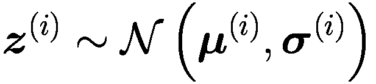

潜在向量 ***z*** 然后由解码器进行解码。

然而，这个公式是不可微分的。我们不能对从由学习到的均值和标准差定义的正态分布中采样进行微分。因此，我们使用一个**重新参数化技巧**，在 Diederik Kingma 和 Max Welling 的原始变分自动编码论文“Auto-Encoding Variational Bayes”中阐述，大致如下。2

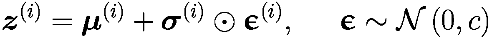

这里，⊙ 表示逐元素乘法，*c* 是一个任意常数。这种公式的证明具有与直接从正态分布中采样的相同特性，但它重新表达了采样，使其与均值和标准差相关，这样所有参数都写成彼此和常数的加法和乘法，这使得它成为一个完全可微的方案。

因此，变分自编码器的目标可以表达如下，其中 ***y*** 代表真实值，***z*** 代表从编码器输出中采样的向量，***x*** 代表编码器的输入（以及网络，从技术角度讲），*E* 代表编码器，*D* 代表解码器，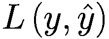 代表某种损失/误差函数：

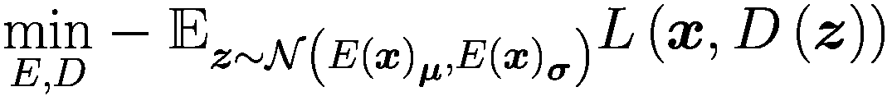

在这里，我们希望找到函数 *E* 和 *D* 的参数，这些参数最小化输入 ***x*** 与从 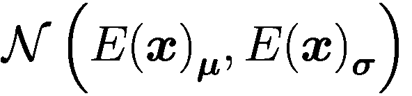 中采样的随机潜在空间向量的解码之间的平均差异，这是一个由编码器提供的均值和标准差定义在潜在空间中的正态分布。

然而，鉴于自编码器倾向于学习潜在空间的离散表示，我们遇到了一个问题：网络学习小的标准差 ***σ*** → 0 并最大化均值向量之间的距离，即 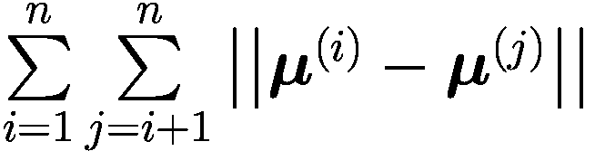，这在本质上等同于一个标准的自编码器，该自编码器在一个离散空间中仅输出标量（零标准差的分布是一个单点）。

因此，我们可以制定以下惩罚项：

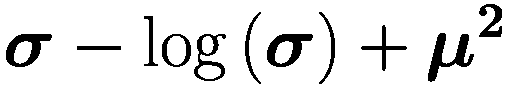

首先，我们希望最小化均值；因此，我们添加了 L2 风格的正则化，如果均值太大，网络将受到惩罚。其次，我们希望最大化标准差，但我们也希望它们广泛均匀，以确保潜在空间中分布的连续均匀性；因此，-log(***σ***）项严重惩罚过小的标准差，但 +***σ*** 项也会使过大的标准差趋向于更小的值。x - log(x) 的最小值约为 0.797，大约在 x = 0.434 处。一些惩罚的变体会将标准差平方（这并非必需，但在某些情况下可能有助于收敛）并减去一个常数以实现美观（这样，这个惩罚项在理论上可以是零）：

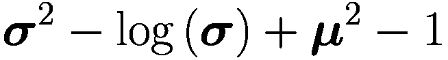

因此，正式的优化问题可以以下形式表示：

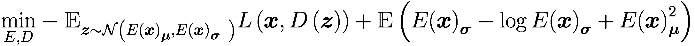

### 实现

让我们从演示变分自编码器的经典引入开始——在 MNIST 数据集的数字之间进行插值。我们将首先创建编码器架构（见列表 9-3）。我们不会只有一个潜在空间输出，而是会有两个输出——一个定义潜在空间的均值，另一个定义标准差。请注意，我们实际上学习的是标准差的对数（稍后将被指数化），这样网络可以更容易地处理较大的标准差尺度。（预测的标准差越大，对空间的连续性和均匀性施加的约束就越严格和广泛。）这使我们能够使用开线性激活而不是零界限的激活。

```py
# encoder
enc_inputs = L.Input((784,), name='input')
enc_dense1 = L.Dense(256, activation='relu',
name='dense1')(enc_inputs)
enc_dense2 = L.Dense(128, activation='relu',
name='dense2')(enc_dense1)
means = L.Dense(32, name='means')(enc_dense2)
log_stds = L.Dense(32, name='log_stds')(enc_dense2)
Listing 9-3
Building the encoder of the Variational Autoencoder, which outputs both the means and the log-standard deviations of the latent variables
```

注意，`means` 和 `log_stds` 层的输出维度是相同的，因为它们必须相互对应。

接下来，我们将定义一个采样层，该层接收派生的均值和对数标准差（见列表 9-4）。为了保持通过均值和标准差传播信息的能力，我们采样一个以零为中心的小正态分布噪声向量，将其乘以“标准差”，然后加到均值上（使用重新参数化技巧，而不是简单地从具有指定均值和标准差的正态分布中进行采样）。

```py
def sampling(args):
means, log_stds = args
eps = tf.random.normal(shape=(tf.shape(means)[0], 32),
mean=0, stddev=0.1)
return means + tf.exp(log_stds) * eps
x = L.Lambda(sampling, name='sampling')([means, log_stds])
Listing 9-4
Defining a custom sampling layer, which samples a random vector from the outputted latent space
```

我们可以完成编码器（代码清单 9-5）。编码器技术上只输出采样的潜在空间向量 `x`，但为了计算惩罚项，我们还将输出 `means` 和 `log_stds`（我们将使用它们来计算损失，但不会传递给解码器）。

```py
encoder = keras.Model(inputs=enc_inputs,
outputs=[means, log_stds, x],
name='encoder')
Listing 9-5
Defining the encoder
```

解码器模型相当标准；它只是接收采样的潜在空间向量并将其解码回原始输出（代码清单 9-6）。

```py
# decoder
dec_inputs = L.Input((32,), name='input')
dec_dense1 = L.Dense(128, activation='relu',
name='dense1')(dec_inputs)
dec_dense2 = L.Dense(256, activation='relu',
name='dense2')(dec_dense1)
output = L.Dense(784, activation='sigmoid',
name='output')(dec_dense2)
decoder = keras.Model(inputs=dec_inputs,
outputs=output,
name='decoder')
Listing 9-6
Defining the decoder
```

为了构建完整的模型，我们将输入通过编码器，将编码的潜在空间向量通过解码器（代码清单 9-7）。

```py
# construct vae
vae_inputs = enc_inputs
encoded = encoder(vae_inputs)
decoded = decoder(encoded[2])
vae = keras.Model(inputs=vae_inputs,
outputs=decoded,
name='vae')
Listing 9-7
Constructing the entire Variational Autoencoder
```

现在，我们可以计算损失作为模型输出的关系；由于这个自定义损失依赖于不是主要模型严格输出的层（即，均值和对数标准差），我们将在编译之外单独添加损失（代码清单 9-8）。

```py
from keras.losses import binary_crossentropy
reconst_loss = binary_crossentropy(vae_inputs, decoded)
kl_loss = log_stds - tf.exp(log_stds) + tf.square(means)
kl_loss = tf.square(tf.reduce_sum(kl_loss, axis=-1))
vae_loss = tf.reduce_mean(reconst_loss + kl_loss)
# compile model
vae.add_loss(vae_loss)
vae.compile(optimizer='adam')
# fit
vae.fit(x_train, x_train, epochs=20)
Listing 9-8
Adding the custom loss and fitting
```

训练后，变分自动编码器应该已经学会了整个相关的潜在空间（通过相关，我们指的是由理论边界表面包围的整个空间）。我们可以可视化这个潜在空间的一个示例遍历。我们将从一个代表数据集中存在的样本的编码器学习到的表示的“基础”潜在空间向量开始。然后，我们将“切割”一个平面横截面来可视化学习到的潜在空间的一个“切片”。有许多方法可以做到这一点，但在这个案例中，我们只是根据行和列的网格值对基础向量进行线性加法（或减法）（代码清单 9-9）。

```py
i = 0
base = encoder.predict(x_train[i:i+1])[2]
plt.figure(figsize=(10, 10), dpi=400)
for row in range(10):
for col in range(10):
plt.subplot(10, 10, (row) * 10 + col + 1)
add = np.zeros(base.shape)
add[:, [0, 2, 4, 6]] = 0.25 * (row - 5)
add[:, [1, 3, 5, 7]] = 0.25 * (col - 5)
decoded = decoder.predict(base + add)
plt.imshow(decoded.reshape((28, 28)))
plt.axis('off')
plt.show()
Listing 9-9
Obtaining a grid of spatially interpolated and “continuous” images by taking a cross-section of the learned latent space
```

结果，如图 9-3 所示，展示了学习到的潜在空间的一个横截面。注意，在潜在空间横截面上空间位置更靠近的图像表示在数字形态上也更为相似。我们可以选择任何两个可识别的数字，例如左上角的 7 和右上角的 1，在这两个数字之间画一条线，并追踪从其中一个数字到另一个数字的“插值”。从功能上讲，除了左上角的基线情况外，所有这些数字都是合成的，但它们看起来——大部分情况下——是真实的。迫使自动编码器学习整个潜在空间，然后在潜在空间内进行插值，使我们能够生成逼真的合成数据。

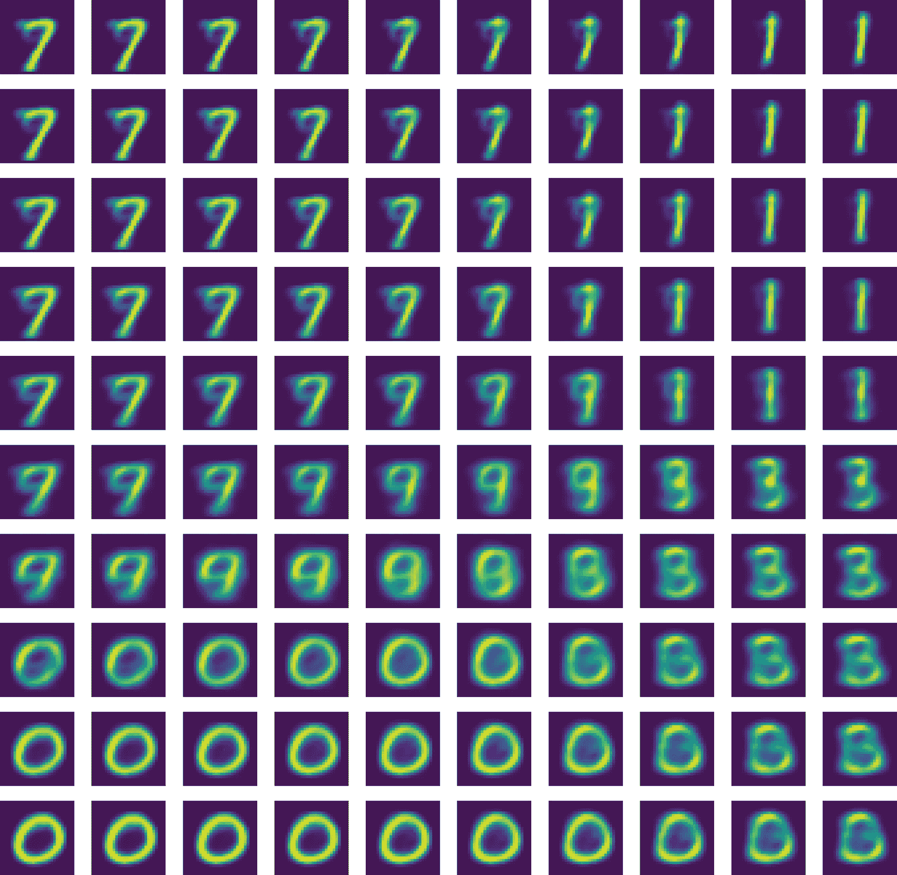

100 张数字排列成 10 列和 10 行的网格图像。它们显示了通过 V A E 解码的潜在空间横截面的样本。

图 9-3

在 MNIST 上训练的变分自动编码器学习到的潜在空间横截面的可视化。

变分自动编码器同样可以应用于生成合成的表格数据。让我们调整我们的 VAE 代码以适应希格斯玻色子数据集（代码清单 9-10）。

```py
# encoder
enc_inputs = L.Input((28,), name='input')
enc_dense1 = L.Dense(16, activation='relu',
name='dense1')(enc_inputs)
enc_dense2 = L.Dense(16, activation='relu',
name='dense2')(enc_dense1)
means = L.Dense(8, name='means')(enc_dense2)
log_stds = L.Dense(8, name='log-stds')(enc_dense2)
def sampling(args):
means, log_stds = args
eps = tf.random.normal(shape=(tf.shape(means)[0], 8),
mean=0, stddev=0.15)
return means + tf.exp(log_stds) * eps
x = L.Lambda(sampling, name='sampling')([means, log_stds])
encoder = keras.Model(inputs=enc_inputs,
outputs=[means, log_stds, x],
name='encoder')
# decoder
dec_inputs = L.Input((8,), name='input')
dec_dense1 = L.Dense(16, activation='relu',
name='dense1')(dec_inputs)
dec_dense2 = L.Dense(16, activation='relu',
name='dense2')(dec_dense1)
output = L.Dense(28, activation='linear',
name='output')(dec_dense2)
decoder = keras.Model(inputs=dec_inputs,
outputs=output,
name='decoder')
# construct vae
vae_inputs = enc_inputs
encoded = encoder(vae_inputs)
decoded = decoder(encoded[2])
vae = keras.Model(inputs=vae_inputs,
outputs=decoded,
name='vae')
# build loss function
from keras.losses import mean_squared_error
reconst_loss = mean_squared_error(vae_inputs, decoded)
kl_loss = 1 + log_stds - tf.square(means) - tf.exp(log_stds)
kl_loss = tf.square(tf.reduce_sum(kl_loss, axis=-1))
vae_loss = tf.reduce_mean(reconst_loss + kl_loss)
# compile model
vae.add_loss(vae_loss)
vae.compile(optimizer='adam')
# fit
vae.fit(X_train, X_train, epochs=20)
Listing 9-10
Building a Variational Autoencoder for the Higgs Boson dataset
```

从训练好的变分自动编码器生成数据有多种方法。一种方法是通过获取学习到的编码并随机移动“周围”的样本来选择几个潜在空间“基”（见列表 9-11）。

```py
NUM_BASES = 40
NUM_PER_SAMPLE = 20
samples = []
for i in tqdm(range(NUM_BASES)):
base = encoder.predict(X_train[i:i+1])[2]
for i in range(NUM_PER_SAMPLE):
add = np.random.normal(0, 1, size=base.shape)
generated = decoder.predict(base + add)
samples.append(generated[0])
samples = np.array(samples)
generated = pd.DataFrame(samples, columns=X.columns)
Listing 9-11
Generating novel tabular data samples by randomly moving around known latent space encodings
```

让我们可视化原始数据集与生成数据集的数据集结构的一些表示。我们可以使用 pairplots 来获得数据集结构的合理视角。列表 9-12 展示了用于生成图 9-4 和 9-5 的代码，分别是生成数据和真实数据的样本 pairplots。注意，许多二元关系分布相当相似。

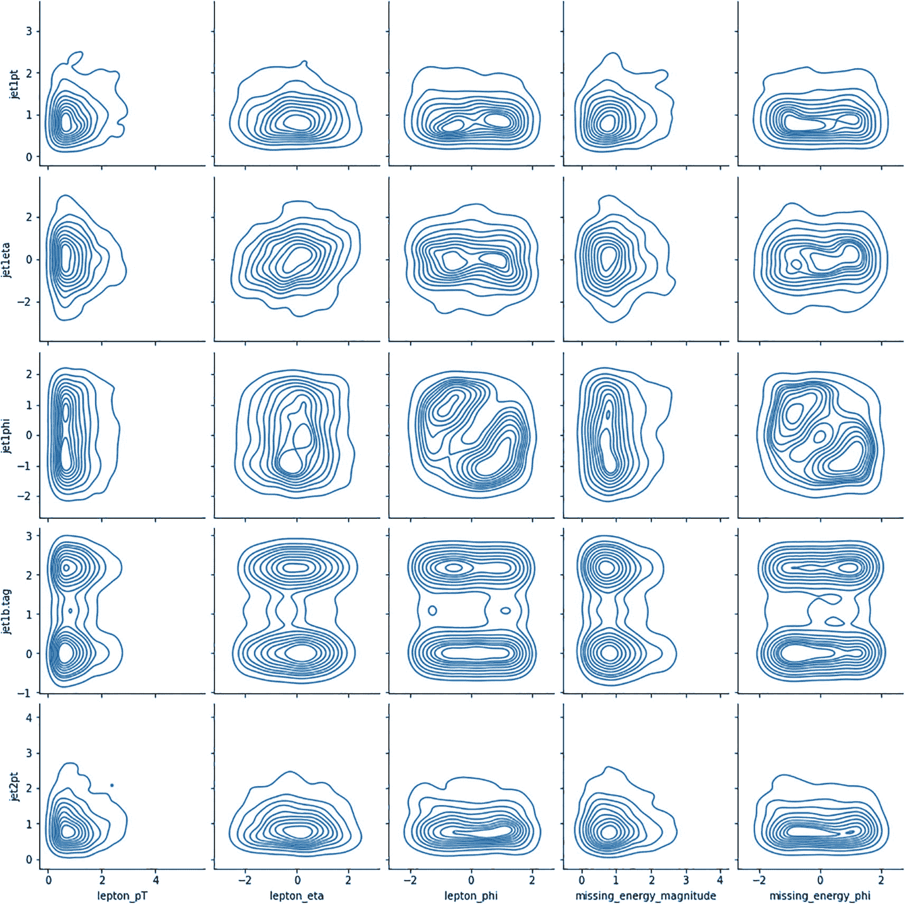

25 个图形，排列成 5 列和 5 行，包括 jet l p t、jet leta、jet l phi、jet l b dot tag、jet 2 p t 与电子 p T、电子 e t a、电子 phi、缺失能量大小和缺失能量 phi 的关系图。它们展示了来自希格斯玻色子数据集的二元交互特征。

图 9-5

从希格斯玻色子数据集中提取的两组五个特征的真正二元关系/交互

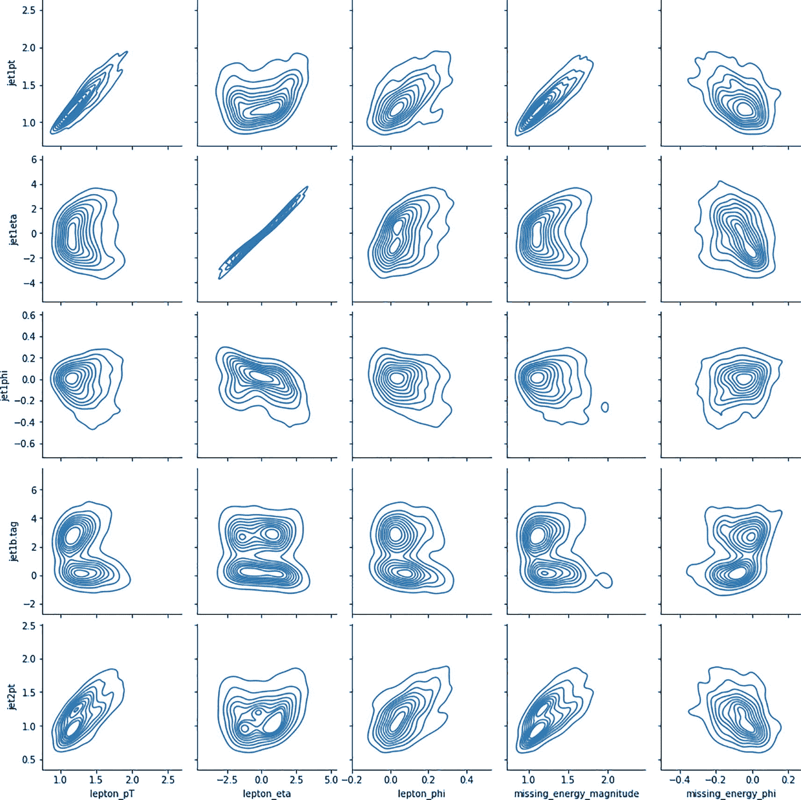

25 个图形，排列成 5 列和 5 行，包括 jet l p t、jet leta、jet l phi、jet l b dot tag、jet 2 p t 与电子 p T、电子 e t a、电子 phi、缺失能量大小和缺失能量 phi 的关系图。它们展示了由 V A E 创建的二元交互特征。

图 9-4

在希格斯玻色子数据集上训练的变分自动编码器生成的两组五个特征的二元关系/交互

```py
plt.figure(figsize=(50, 50), dpi=400)
sns.pairplot(generated,
x_vars = X.columns[:5],
y_vars = X.columns[5:10],
kind='kde')
plt.show()
plt.figure(figsize=(50, 50), dpi=400)
sns.pairplot(X.iloc[np.random.choice(len(X), size=800, replace=False)],
x_vars = X.columns[:5],
y_vars = X.columns[5:10],
kind='kde')
plt.show()
Listing 9-12
Plotting bivariate relationships between two sets of five variables in the true and generated datasets
```

图 9-6 和 9-7 展示了小鼠蛋白质表达数据集中生成数据和真实数据的 pairplots。在这里，生成数据集中的二元关系的分布和形状与真实数据集非常相似。

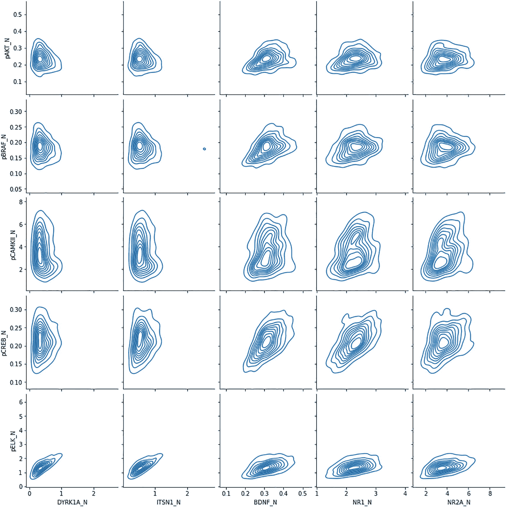

25 个图形，排列成 5 列和 5 行。它们展示了来自小鼠蛋白质表达数据集的真正二元交互特征。

图 9-7

从小鼠蛋白质表达数据集中提取的两组五个特征的真正二元关系/交互

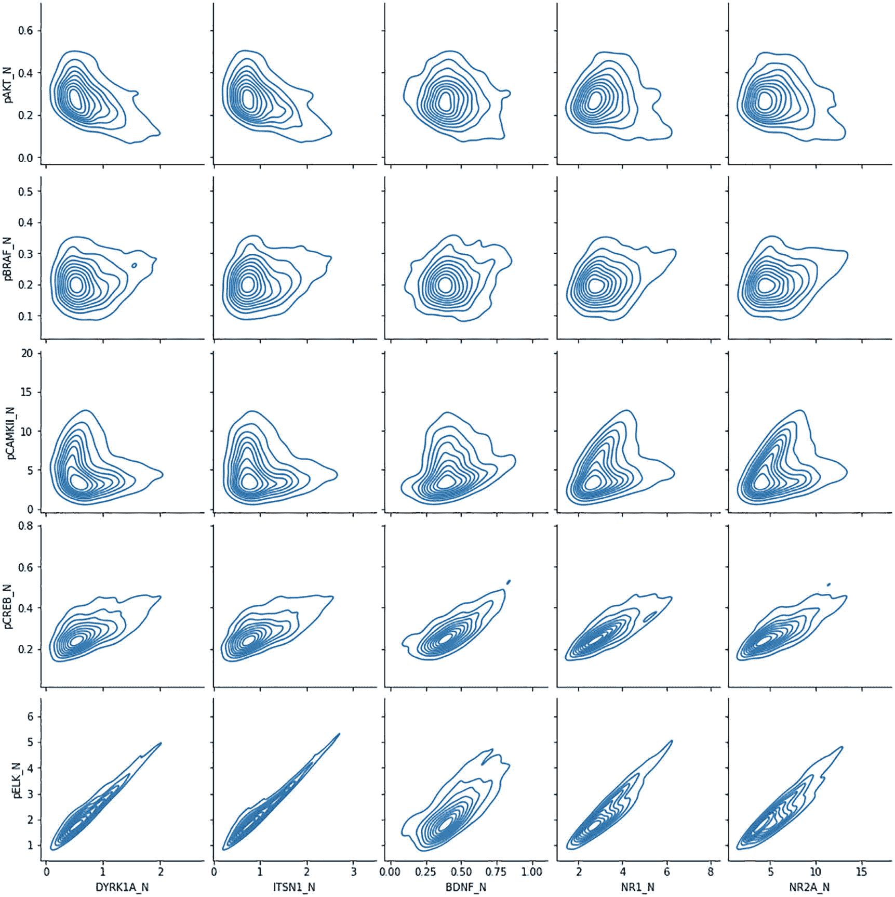

25 个图形，排列成 5 列和 5 行。它们展示了通过 V A E 从小鼠蛋白质表达数据集中得到的二元交互特征。

图 9-6

在小鼠蛋白质表达数据集上训练的变分自动编码器生成的两组五个特征的二元关系/交互

变分自动编码器提供了复杂的数据生成能力，这有助于在数据薄弱或缺乏的情况下构建更成功的机器学习模型（神经网络或经典模型）。

## 生成对抗网络

画作 *Edmond de Belamy* 看起来像一幅标准的十七世纪和十八世纪的画作。一个驼背的男人，穿着用黑色墨水粗笔触绘制的西装，融入暗色调的背景中，用阴影的眼睛茫然地注视着观众。但在右下角，代替艺术签名的是优雅的书法

![$$ \underset{G}{\min}\underset{D}{\max }{\textrm{E}}_x\left[\log \Big(D(x)\right]+{\textrm{E}}_y\left[\log \right(1-D\left(G(y)\right)\Big] $$](img/525591_1_En_9_Chapter/525591_1_En_9_Chapter_TeX_Equg.png)

这是一个简化的表达式，表示生成对抗网络（GAN）模型的目标，它构成了除了变分自编码器之外的另一个主要深度生成模型家族。值得注意的是，GANs 已经成为令人印象深刻的艺术和图像生成的底层技术，但它们也已被应用于生成其他形式的数据，包括表格数据。

### 理论

让我们从形式化 *Edmond de Belamy* 中阐述的方程开始：

+   让 *z* 代表一个随机噪声向量。

+   让 *x* 代表从数据中抽取的数据样本。

+   设 *G* 为一个接受 *y* 并将其转换为模拟从数据中抽取的样本的输出的神经网络。

+   设 *D* 为一个输出给定样本是否来自数据（与由 G 生成的情况相反）的概率的神经网络。

+   让 E[*x*]*f*(*x*) 代表一个依赖于某些变量 *x* 的函数 *f* 的平均值。

该表达式代表判别器的平均对数损失^(3)，由两个部分组成：E[*x*][log(*D*(*x*))] 和 E[*z*][log(1 − *D*(*G*(*z*))]. 判别器可以看作有两个任务：将来自数据（即，*x*）的样本分类为来自数据，并将生成器从随机噪声向量（即，*G*(*z*))创建的合成样本分类为不是来自数据。这两个目标分别由该表达式表示。

第一个项代表判别器对从数据中抽取的样本预测的平均对数。如果判别器工作得完美，那么这个值将最大化，因为 *D*(*x*) 预测 1，log(*D*(*x*)) = 0，并且 E[*x*][log(*D*(*x*))] = 0。另一个项代表判别器对生成样本的逆预测的平均对数。如果判别器工作得完美，这个值也将最大化，因为 *D*(*x*) 预测 0，1 − *D*(*G*(*z*)) = 1，log(1 − *D*(*G*(*z*)) = 0，并且 E[*z*][log(1 − *D*(*G*(*z*))] = 0。因此，当判别器表现完美时，这两个项的总和最大化到零值。

判别器的目标是最大化这个表达式，而生成器的目标是最小化它。将这些部分组合起来，我们得到以下系统，其中生成器和判别器相互对抗：

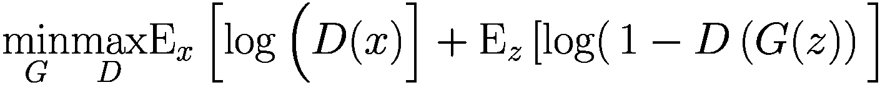

图 9-8 展示了前述方程的直观表示。

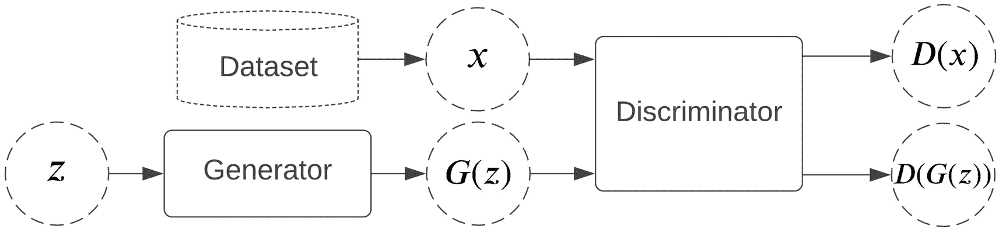

生成对抗网络系统的流程图。数据集和生成器并行通过判别器，达到 D，括号内为 x，D 开括号，G 开括号，z，2 关括号。

图 9-8

生成对抗网络系统的示意图

Ian Goodfellow 等人在原始论文中提供的更完整的阐述如下，其中 ***z*** 是从分布 *p****z*** 中抽取的随机向量，而 ***x*** 是从分布 *p*data 中抽取的数据样本：

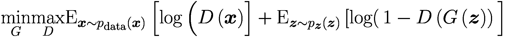

为了更新判别器，我们使用其损失相对于判别器参数 *θ*[*d*] 的梯度：

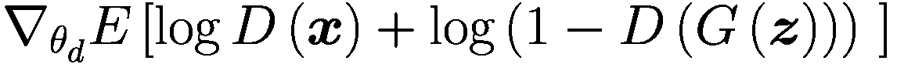

梯度用于 *上升*，因为判别器的目标是最大化其性能，而不是最小化。回想一下，当判别器表现完美时，这个表达式被最大化。与梯度下降的唯一区别是移动到最大增加的方向，而不是相反的方向（即最大减少的方向）。

在更新判别器后，我们使用关于生成器参数 *θ*[*g*] 的梯度以降序更新生成器：

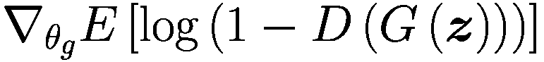

我们不需要担心第一个项，因为生成器不参与其中；它对梯度计算没有贡献。请注意，生成器被明确更新，以通过最小化判别器将生成项目分类为生成的性能来“欺骗”判别器。

通过反复更新判别器然后更新生成器，两个模型进行对抗游戏。

原始论文中阐述的正式训练算法如下：

1.  对于 *k* 步，执行以下操作

    1.  从噪声先验 *p**g* 中采样一个 *m* 个噪声样本集 {***z***^((1)), ***z***^((2)), …, ***z***^((*m*))}。

    1.  从真实数据分布 *p*data 中采样一个 *m* 个训练样本集 {***x***^((1)), ***x***^((2)), …, ***x***^((*m*))}。

    1.  通过随机梯度上升（或使用相同损失的其他优化方法）更新判别器：

        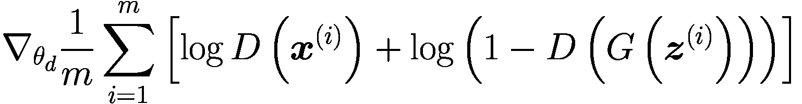

1.  从噪声先验 *p**g* 中采样一个新的 *m* 个噪声样本集 {***z***^((1)), ***z***^((2)), …, ***z***^((*m*))}。

1.  通过随机梯度下降（或使用相同损失的其他优化方法）更新生成器：

    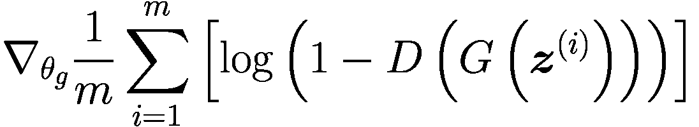

1.  重复执行，直到完成指定的训练迭代次数。

注意以下优化过程的特征：

+   通过改变 *k*，你可以控制判别器相对于生成器的“移动”次数的比例。原始 GAN 论文的作者使用 *k* = 1 来最大化计算效率。

+   从计算图的角度来看，我们在技术上优化的是同一组操作——只是在任何给定时间只优化其中的一部分。观察判别器和生成器更新公式中梯度上升和下降的相应表达式，它们都涉及相同的嵌套 *D*(*G*(…)) 表达式，但只有其中一部分被更新，而另一部分保持静态。

+   当我们更新生成器时，我们选择一个新的随机噪声样本小批量，而不是使用判别器更新时使用的相同样本集。

然而，GANs 的训练却非常困难。系统通常不稳定，并且无法收敛。Tim Salimans 和 OpenAI 的其他研究人员在论文“Improved Techniques for Training GANs”中提出了一些可操作的训练修改，以改善 GAN 系统的收敛性和性能，其中一些总结如下：

+   *特征匹配*：在生成器有明确的目标，即最大化判别器对生成样本的预测时，生成样本可能会变得困难。相反，生成器可以被训练去匹配判别器中间层激活。如果生成器产生的输出在总体上对某些特征的判别器激活与对真实项目的激活非常不同，那么生成器可能无法成功欺骗判别器。特征匹配是一种直接使用判别器的“内部思维过程”来优化生成器的技术。

+   *历史平均*：每个玩家根据其相对于长度为*t*的历史时间段的权重更新幅度受到惩罚：![$$ \left\Vert \theta \left[0\right]-\frac{1}{t}\sum \limits_{i=1}^t\theta \left[i\right]\right\Vert $$](img/525591_1_En_9_Chapter/525591_1_En_9_Chapter_TeX_IEq4.png)，其中*θ*是模型参数的数组，*θ*[0]代表最新的、当前的参数集。这提供了一个恒定的力，推动玩家向收敛：任何大的更新都将受到这个量的惩罚，因此可以约束非收敛的异常行为。

+   *单侧标签平滑*：标签平滑中，离散的二进制标签被替换为概率近似（例如，将 0 替换为 0.1，将 1 替换为 0.9）。我们可以将正判别器标签（即标签为 1 的真实数据样本）替换为一个平滑的近似（例如，0.9 甚至 0.8），这样生成器就可以更容易地在判别器的“眼中”与“真实”样本达到等效，即使它不能产生高的判别器输出。例如，设*x*为一个真实数据样本，D(x) = 1。设*z*为一个随机向量；假设 D(G(z)) = 0.9。在这种情况下，判别器被欺骗了，但并未完全被欺骗。然而，如果我们应用单侧标签平滑，判别器将学习到 D(x) = 0.9。因此，G(z)和 x 在判别器对两者都给出相同判断这一点上是可比的。这可以使生成任务更容易。

许多后续方法被提出以扩展 GAN 的能力。条件 GAN（Conditional Generative Adversarial Nets）由 Medhi Mirza 和 Simon Osindero 在 2014 年发表的一篇题为“Conditional Generative Adversarial Nets”的论文中提出，紧随原始 GAN 论文之后，它允许根据某些属性生成输出。例如，与其只是生成任意的数字，一个条件生成模型可以生成特定类型的数字（0、1、2 等）。

这通过简单修改原始 GAN 系统优化目标来实现：判别器接受原始输入（要么是数据集的样本，要么是由生成器合成的）和条件信息***y***。生成器的输出由随机向量***z***和条件信息***y***共同生成：

![$$ \underset{G}{\min}\underset{D}{\max }{\textrm{E}}_{\boldsymbol{x}\sim {p}_{\textrm{data}}\left(\boldsymbol{x}\right)}\left[\log \Big(D\left(\boldsymbol{x}|\boldsymbol{y}\right)\Big)\right]+{\textrm{E}}_{\boldsymbol{z}\sim {p}_{\boldsymbol{z}}\left(\boldsymbol{z}\right)}\left[\log \Big(1-D\left(G\left(\boldsymbol{z}|\boldsymbol{y}\right)\right)\Big] $$](img/525591_1_En_9_Chapter/525591_1_En_9_Chapter_TeX_Equn.png)

为了具体说明，考虑将条件生成对抗网络应用于生成数字图像。我们首先选择*n*个数字图像***x***及其对应的类别***y***（例如，第一幅图像的类别为 2，第二幅为 9，……，第*n*幅为 0）。接下来，我们随机采样噪声向量***z***，并将***z***和***y***同时输入到生成器中。现在，我们已经生成了样本：*G*(***z***| ***y***)。判别器在访问相应类别的情况下对原始样本和生成样本进行预测。即使生成器生成了逼真的图像，判别器理论上也能检测到样本是否由给定输入生成，例如，如果给定输入是数字 8 的图像，但关联的类别（即***y***）是 2。因此，生成器必须基于给定的属性生成逼真的图像（图 9-9）。

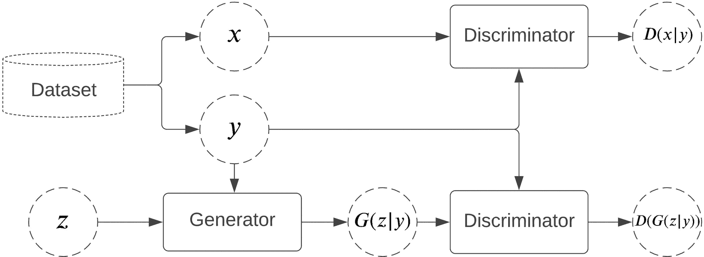

条件生成对抗网络系统的流程图。从数据集 x 到达判别器，y 到达生成器，以及判别器。

图 9-9

条件生成对抗网络系统的示意图

虽然 GAN 在图像生成中取得了惊人的成功，尤其是在文本条件生成方面，但表格数据生成仍然是一个难题。表格数据的跨列异质性——即属性（如值范围、稀疏性、分布、离散/连续性、值不平衡等）在列之间的变化——使得难以轻松地在数据集范围内转移尺度和规则。

雷旭、玛丽亚·斯库拉里杜、阿尔弗雷多·库埃斯塔-伊纳夫特和卡利安·维拉马查尼尼在 2019 年的论文“Using Conditional GAN to Model Tabular Data”中提出了非常成功的条件表格生成对抗网络（CTGAN），用以解决表格数据的深度对抗生成问题。7

条件表格生成对抗网络模型相当复杂，有许多组成部分。在此，我们总结架构和训练过程中的重要元素。查看原始论文以获取详细信息。

每一行由连续列和离散列的连接表示。离散列是独热编码的，具有复杂的多模态分布（在此上下文中，多模态指的是具有多个“驼峰”或模式的分布，而不是单个质量——如正态分布）的连续特征使用随机采样的模式进行归一化。设行表示为 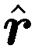。

为了确保 GAN 系统能够大致平等地接触到离散列中的不同值——即使是高度不平衡或稀疏的值——作者提出了一种条件向量，在粗略的意义上，它表示生成器必须重现哪些离散列中的哪些类型的值。设 ***m*** 表示这个条件向量。然后，我们有生成器输出为 *G*(***z***| ***m***)，给定随机采样的向量 ***z*** 和条件向量 ***m***。这与第六章中讨论的掩码语言模型预训练的训练范式相似。在掩码语言模型中，模型被呈现句子的一部分单词，并必须填补被掩码的标记。CTGAN 中的生成器被呈现“句子的一部分”（即所选列中的所选值）并必须“填补”其余的行（即，根据提供的条件向量，哪些连续列和非选择离散列的值是有意义的）。给定平等的条件向量生成过程，生成器和判别器暴露于更广泛的特征空间，并适应更复杂的数据形式。

生成器模型由两个使用 ReLU 激活、批量归一化和残差连接的隐藏层组成。有两个相关输出——连续特征 *c* 和离散特征 *d*。它可以近似地形式化表达如下，其中 ⊕ 表示向量连接，Gumbel 表示 softmax Gumbel 函数^(8)：

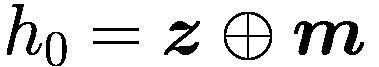


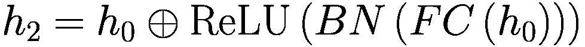

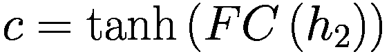

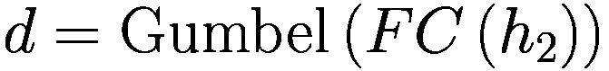

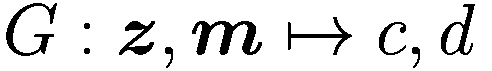

CTGAN 模型在广泛的表格数据生成任务中表现良好，包括异构表格数据，这挑战了之前的表格生成尝试。它在解决不平衡数据集和提供数据增强方面显示出希望。

在接下来的小节中，我们将演示从头开始实现一个示例 GAN 模型以及使用 CTGAN 的实现。

### TensorFlow 中的简单 GAN

为了演示简单 GAN 的建模和训练流程，我们将采用 MNIST 数据集作为我们的目标生成图像。该数据集可通过`tensorflow.keras.datasets`获得，如清单 9-13 所示。为了确保我们的生成能够产生各种图像，我们将数字“1”从数据集中移除，以避免模式坍塌，因为生成器可能通过简单地生成线的斜向图像来欺骗判别器。

```py
import numpy as np
import pandas as pd
import tensorflow as tf
import os
import matplotlib.pyplot as plt
import tensorflow.keras.layers as L
import tensorflow.keras.models as M
import tensorflow.keras.callbacks as C
from tensorflow.keras.datasets import mnist
(X_train, y_train), (X_test, y_test) = mnist.load_data()
# remove 1
X_train = X_train[y_train!=1]
# reshape to (28, 28, 1)
X_train = np.expand_dims(X_train, axis=3)
# for operations later
X_train = X_train.astype("float32")
# normalize
X_train /= 255.0
Listing 9-13
Imports and retrieving the dataset
```

接下来，我们将构建判别器。回想一下，无论生成任务是什么，判别器始终是一个分类器，用于区分真实图像和生成图像。为了简化问题，以下所示的判别器模型架构将是一个五层全连接网络（见清单 9-14）。您可以通过使用卷积层进一步提高判别器的性能。

```py
# discriminator
# simple fully-connected NN, can be modified to CNN to improve performance
# flatten 2D images
inp = L.Input(shape=(28, 28, 1))
x = L.Flatten(input_shape=[28, 28])(inp)
x = L.Dense(512, activation=L.LeakyReLU(alpha=0.25))(x)
x = L.Dropout(0.3)(x)
x = L.Dense(1024, activation=L.LeakyReLU(alpha=0.25))(x)
x = L.Dropout(0.3)(x)
x = L.Dense(256, activation=L.LeakyReLU(alpha=0.25))(x)
x = L.Dropout(0.3)(x)
x = L.Dense(512, activation=L.LeakyReLU(alpha=0.25))(x)
x = L.Dropout(0.3)(x)
x = L.Dense(64, activation="swish")(x)
out = L.Dense(1, activation="sigmoid")(x)
# beta_1 is set to 0.5 in the adam optimizer for more stable training
discriminator = M.Model(inputs=inp, outputs=out)
discriminator.compile(loss="binary_crossentropy",
optimizer=tf.keras.optimizers.Adam(lr=0.0002, beta_1=0.5), metrics=["acc"])
Listing 9-14
Defining the discriminator
```

生成器模型将接收来自潜在空间中的任意数量的点，这些点作为随机高斯噪声。它负责根据从判别器返回的梯度创建假图像，以产生判别器无法正确分类为假的图像。潜在空间的维度与模型性能无关——在以下示例中，选择了 128 作为输入维度。模型的架构以扩展的方式定义，从 128 增加到 1024 个神经元。最后一层将重整为正确的图像大小 `(28, 28)`。请注意，由于我们将图像像素值归一化到 1 和 0 之间，因此最后一层的激活函数将是 sigmoid。

在您想要的地方添加注释（见清单 9-15）。

```py
# generator
# 128 as latent dimension
inp_gen = L.Input(shape=(128))
y = L.Dense(224)(inp_gen)
y = L.LeakyReLU(alpha=0.2)(y)
y = L.Dense(256)(inp_gen)
y = L.LeakyReLU(alpha=0.2)(y)
y = L.Dense(512)(y)
y = L.LeakyReLU(alpha=0.2)(y)
y = L.Dense(664)(y)
y = L.LeakyReLU(alpha=0.2)(y)
y = L.Dense(1024)(y)
y = L.LeakyReLU(alpha=0.2)(y)
# shape of mnist image
y = L.Dense(784, activation="sigmoid")(y)
# reshape to dimensions of an image
out_gen = L.Reshape([28, 28, 1])(y)
# do not compile since the generator will never be trained alone
generator = M.Model(inputs=inp_gen, outputs=out_gen)
Listing 9-15
Defining the generator
```

整个 GAN 模型由生成器和判别器按顺序组成（见清单 9-16）。为了启动训练，将判别器的可训练属性设置为 false。在训练整个 GAN 模型之前，我们冻结判别器的权重，因为每个生成的样本返回的梯度在迭代过程中必须保持不变（从学习角度）。判别器的分类方面作为一个独立模型进行训练。

```py
# combine model and make discriminator untrainable
gan_model = M.Sequential([generator, discriminator])
discriminator.trainable=False
gan_model.compile(loss="binary_crossentropy", optimizer=tf.keras.optimizers.Adam(lr=0.0002, beta_1=0.5), metrics=["acc"])
Listing 9-16
Defining the GAN
```

对于图像相关任务，通常使用 TensorFlow 数据集将样本批量处理成类似生成器的格式（见清单 9-17）。

```py
def build_dataset(data, batch_size=32):
AUTO = tf.data.experimental.AUTOTUNE
dset = tf.data.Dataset.from_tensor_slices(data).shuffle(1024)
return dset.batch(batch_size, drop_remainder=True).prefetch(AUTO)
batch_size = 256
real_img_dataset = build_dataset(X_train, batch_size=batch_size)
Listing 9-17
Defining Tensorflow Datasets
```

训练主要通过两个嵌套循环完成，一个循环遍历所需的 epoch 数，而对于每个 epoch，每个数据集的批次都会被循环遍历。对于每个数据批次，生成器生成一个假图像批次以及一个真实图像批次。它们的标签通过 tf.constant 分配，然后与图像连接，创建判别器的训练数据集。为了澄清，一个标签为 0 的假图像批次与一个标签为 1 的真实图像批次合并，并使用 train_on_batch 方法输入判别器（本质上训练了两个批次的数据）。随后，在冻结判别器权重的情况下，对整个 GAN 调用 train_on_batch（列表 9-18）来训练生成器。

```py
# retrieve each individual model
generator, discriminator = gan_model.layers
epochs = 150
for epo in range(epochs):
print(f"TRAINING EPOCH {epo+1}")
for idx, cur_batch in enumerate(real_img_dataset):
# random noise for generating fake img
noise = tf.random.normal(shape=[batch_size, 128])
# generate fake img and label
fake_img, fake_label = generator(noise), tf.constant([[0.0]]*batch_size)
# extract one batch of real img and label
real_img, real_label = tf.dtypes.cast(cur_batch, dtype=tf.float32), tf.constant([[1.0]]*batch_size)
# the X of discriminator, consists of half fake img, half real img
discriminator_X = tf.concat([real_img, fake_img], axis=0)
# the y of discriminator, 1s and 0s
discriminator_y = tf.concat([real_label, fake_label], axis=0)
# set to trainable
discriminator.trainable = True
# train discriminator as standalone classification model
d_loss = discriminator.train_on_batch(discriminator_X, discriminator_y)
# X of generator, noise
gan_x = tf.random.normal(shape=[batch_size, 128])
# y of generator, set to "real"
gan_y = tf.constant([[1.0]]*batch_size)
# set discriminator to untraibable
gan_model.layers[1].trainable = False
gan_loss = gan_model.train_on_batch(gan_x, gan_y)
# avoid OOM
del fake_img, real_img, fake_label, real_label,
del discriminator_X, discriminator_y
if (idx+1) % 100 == 0:
print(f"\t On batch {idx+1}/{len(real_img_dataset)}   Discriminator Acc: {d_loss[1]}  GAN Acc {gan_loss[1]}")
if (epo+1)%10==0:
# plot results every 10 epochs
print(f"RESULTS FOR EPOCH {epo}")
gen_img = generator(tf.random.normal(shape=[5, 128]))
columns = 5
rows = 1
fig = plt.figure(figsize=(12, 2))
for i in range(rows*columns):
fig.add_subplot(rows, columns, i+1)
plt.imshow(gen_img[i], interpolation='nearest', cmap='gray_r')
plt.tight_layout()
plt.show()
Listing 9-18
Training GAN
```

经过几十个 epoch，批大小为 256，GAN 可以生成相当令人信服的手写数字（图 9-10）。你可以通过修改判别器或生成器，包括更多层或不同的激活函数，或者切换到基于卷积的设计来进一步提高性能。由于 GAN 的不稳定性，模型的一个小变化可能会显著影响结果。

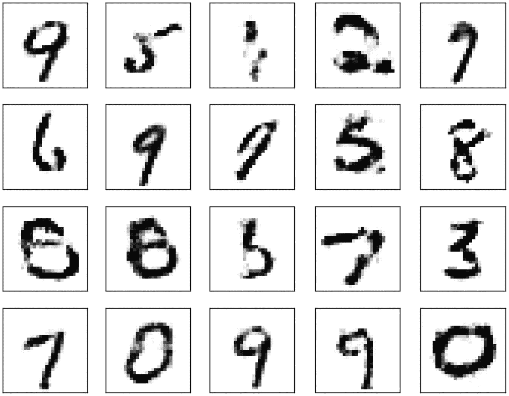

20 张网格图像，数字排列成 5 列和 4 行。它们显示了 GAN 训练的结果。

图 9-10

GAN 初步训练结果

### CTGAN

CTGAN 的官方实现提供了一个方便、易于使用的包。要从 pip 安装，请输入以下命令：`pip install sdv`。为了保持一致性和比较目的，这里将重复使用 Higgs Boson 数据集，以便 CTGAN 生成人工样本。以下是一个简单的示例，展示了从 CTGAN 训练并采样假数据的步骤（列表 9-19）。

```py
# using test dataset since it has more samples
data = pd.read_csv("../input/higgsb/test.csv")
from sdv.tabular import CTGAN
ctgan_model = CTGAN(verbose=True)
ctgan_model.fit(data)
new_data = ctgan_model.sample(num_rows=800)
Listing 9-19
Simple CTGAN demo
```

在没有任何超参数调整的情况下，与之前讨论的 VAE 相比，CTGAN 的性能令人印象深刻。如图 9-11 和 9-12 所示，合成数据和实际数据集生成的特征之间的二元关系的对图几乎无法区分。尽管特征相关性不是衡量生成模型性能的唯一方法或最佳方法，但我们仅用五行代码就能产生的结果相当令人震惊。

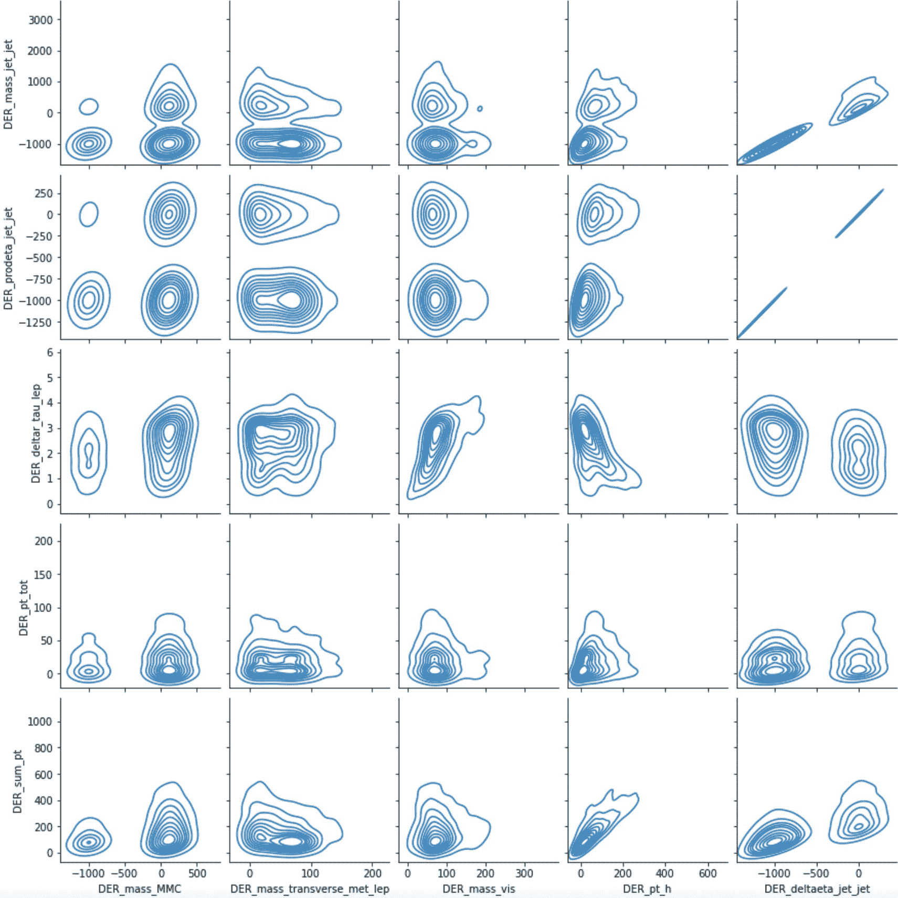

25 张图排列成 5 列和 5 行。它们展示了由 CTGAN 导出的实际数据的对图比较。

图 9-12

实际数据集的对图

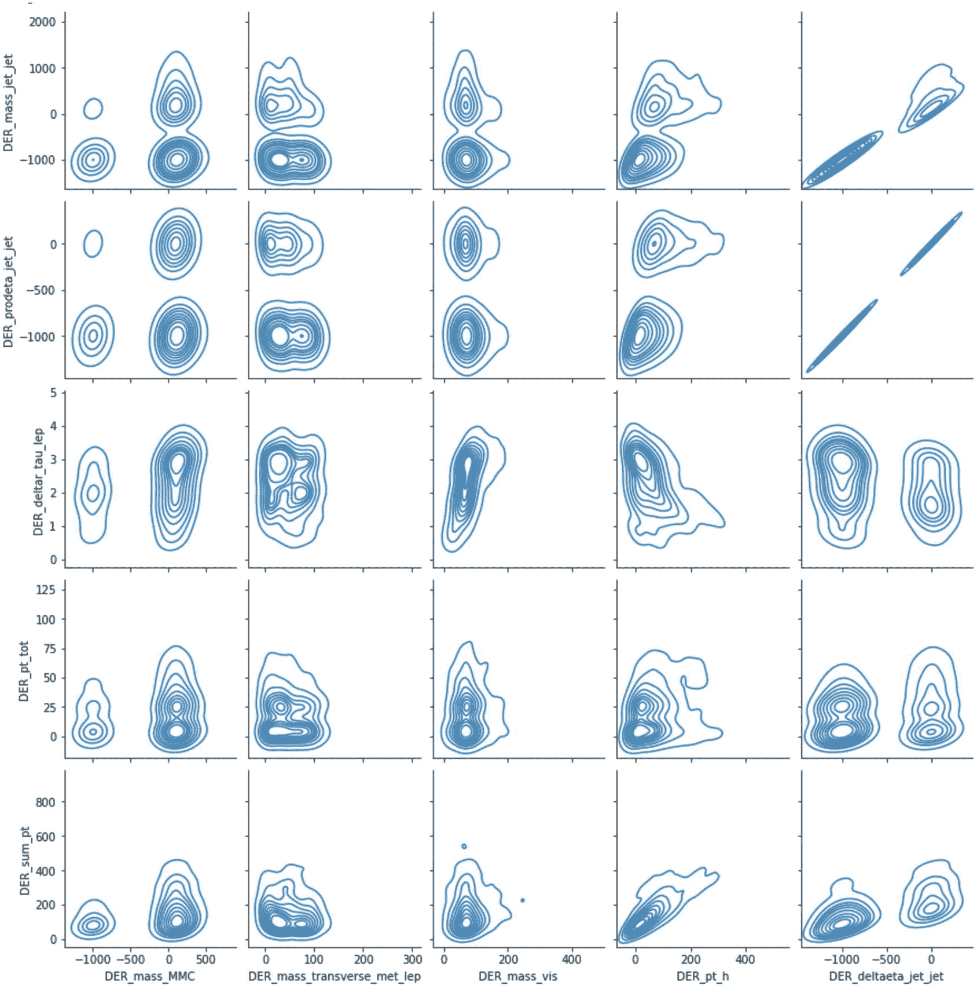

25 张图排列成 5 列和 5 行。它们展示了由 CTGAN 导出的合成数据的对图比较。

图 9-11

CTGAN 生成的合成数据（顶部）与从原始来源随机抽取的 800 个数据点的并排比较（底部）

CTGAN（条件）中的“C”真正发挥了作用，因为模型具有灵活性。我们可以指定一个“`primary_key`”来为特定特征生成唯一数据，同时使用“`anonymize_field`”选项来生成纯粹的人工样本，这些样本不包括在训练数据中（列表 9-20）。对于 `anonymize_field` 选项，有一些预定义的潜在数据类别可以被匿名化。根据传入的内容，CTGAN 将从一组预生成的数据点中检索数据。

```py
# an example out of the dataset's context
# the generated column of 'DER_mass_MMC' will be treated as names and anonymized accordingly
# the full list of categories can be found at
# https://sdv.dev/SDV/user_guides/single_table/ctgan.xhtml#anonymizing-personally-identifiable-information-pii
ctgan_model = CTGAN(
primary_key='EventId',
anonymize_fields={
'DER_mass_MMC': 'name'
}
)
Listing 9-20
Conditional generation
```

合成数据的采样也可以是条件化的。在生成过程中设置约束有两种一般方法：

1.  通过使用一个字典初始化 `Condition` 对象，该字典指定了将被约束的列/列。字典的键将代表约束列，而其值将是模型唯一产生的值。请注意，对于连续特征，只能生成训练数据范围内的值。

1.  通过在 CTGAN 模型上直接调用 `sample_remaining_columns`。这正如其名：传递一个包含已设置列的 Pandas `DataFrame`；然后模型将生成剩余的列。

列表 9-21 展示了这两种方法的演示。

```py
from sdv.sampling import Condition
condition = Condition({
'DER_deltar_tau_lep': 2.0,
# categotical features' values can be passed in as a string
})
constrained_sample = ctgan_model.sample_conditions(condition)
given_colums = pd.DataFrame({
# arbitrary values
"DER_mass_MMC": [120.2, 117.3, -988, 189.9]
})
constrained_sample = ctgan_model.sample_remaining_columns(given_columns)
Listing 9-21
Conditional generation
```

最后，GAN 的低级参数，如周期数、批量大小、潜在空间维度、学习率和衰减，可以进行调整。更多详细信息可以在 CTGAN 的官方文档中找到：[`https://sdv.dev/SDV/user_guides/single_table/ctgan.xhtml`](https://sdv.dev/SDV/user_guides/single_table/ctgan.xhtml)。

## 关键点

在本章中，我们讨论了各种数据生成算法，从更简单、更快捷的方法通过 VAEs 到更复杂、更精细的 GANs。表格数据生成方法的应用范围比大多数人可能想象的要广。

+   变分自编码器（Variational Autoencoders）预测的是潜在空间的每个维度的概率分布，而不是显式标量，这使得它们能够以连续而非离散的方式学习整个潜在空间。相应地，潜在空间中的向量可以在之间进行插值并解码成逼真的输出。这些可以用于数据生成。

+   生成对抗网络（GAN）系统由判别器模型和生成器模型组成；生成器模型接受一个随机向量并合成人工样本，判别器则确定输入的样本是真实的（来自数据集）还是非真实的（由生成器生成）。生成器被训练以最小化判别器的性能，而判别器被训练以最大化它。

    +   条件生成对抗网络（Conditional GANs）允许通过将样本属性信息传递给生成器和判别器，使样本能够根据特定的类别或属性进行条件化。

    +   CTGAN（条件表格生成对抗网络）模型使用条件生成来合成新的稳健且具有代表性的表格数据，即使在复杂异构和不平衡的环境中也是如此。

在下一章中，我们将探讨元优化。元优化涉及在整个训练流程中调整超参数，正如我们将意识到这一点对于表格数据建模尤为重要。
