# 10. 元优化

> 如果你优化一切，你将永远不快乐。
> 
> ——唐纳德·克努特，计算机科学家

传奇的唐纳德·克努特在很多事情上都是正确的，但元优化确实是有力证据表明，大多数人可以相当快乐地优化大多数事情（当然，不是所有事情）。标准形式的优化涉及在参数到损失模型的直接层面上解决模糊性和不确定性。但当我们构建这些模型时，我们也会遇到通常被忽视和遗忘的模糊性和不确定性。元优化涉及这些*元参数*（或称“超参数”）的优化，这不仅可以提高性能，而且可能比手动调整更有效率。

本章首先简要讨论了元优化的关键概念和动机，然后探讨了常用于元优化过程的非梯度优化方法。接下来的两节展示了如何使用 Hyperopt 库进行元优化，以优化模型和数据管道。最后，本章以关于神经架构搜索的简要部分结束。

## 元优化：概念和动机

如果你一直在跟随书中概述的脚本，你不可避免地会在某些时候遇到你必须决定如何构建系统，但具体选择哪种可能性感觉是随意的或同样不确定的时刻——例如，是否使用`GradientBoostingClassifier`或`AdaBoostClassifier`，最大树深度应该是 128 还是 64，特定神经网络细胞中应该有多少层，特定层应该放入多少节点，dropout 层使用的确切比例，等等。

事实上，对于这些决定中的大多数，你选择哪条路径实际上并不重要。一个特定层是否有 128 或 256 个节点可能不会对最终性能产生明显影响，因为深度学习系统如此之大，单个决策相对而言微不足道。你使用的优化器可能会有影响，但影响并不巨大（除非你正在从原始的穴居人优化器切换，当然）。我们可以将这些决策称为*元参数*，因为它们是决定模型的“形式”和“形状”的决定，而不是决定其预测行为的特定权重。

然而，如果我们以某种方式同时为所有这些元参数做出决策——也就是说，我们将每个元参数设置为相对于所有其他元参数都是最优的——我们最终可以显著改变系统的整体性能。

*元优化*，有时也称为元学习或自动机器学习（auto-ML），是“学习如何学习”的过程——一个元模型（或“*控制器*模型”）找到候选模型验证性能的最佳元参数（图 10-1）。我们可以使用元优化来找到最佳模型类型，为该最佳模型找到最佳元参数，以及为该最佳模型和最佳元参数集找到最佳的数据预处理和后处理方案。

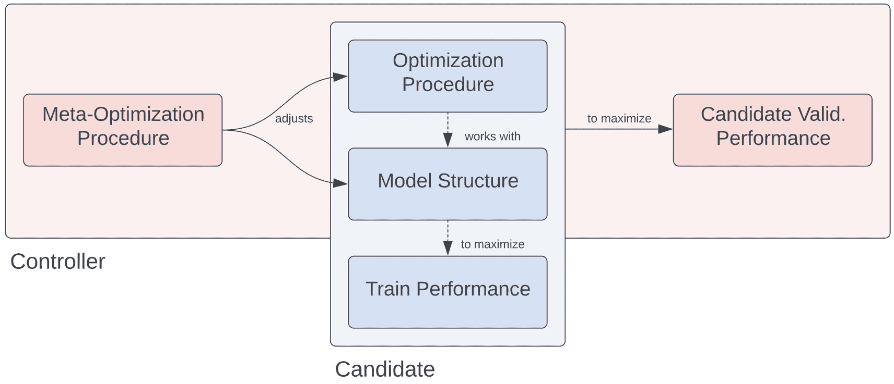

一个控制器元优化流程图，通过模型结构调整以最大化候选模型的验证性能。

图 10-1

元优化中控制器模型与受控模型之间的关系

元优化活动有三个关键组成部分：元参数空间、目标函数和优化过程。

+   *元参数空间*描述了（a）正在优化的哪些元参数以及（b）优化过程应该如何对正在优化的元参数进行采样。一些元参数必须是整数（例如，节点数），而其他则必须是比例（例如，dropout 率）。此外，我们可能对元参数空间中某些领域的成功比其他领域更有信心。例如，低 dropout 率（例如，0.1–0.3）几乎肯定比高 dropout 率（例如，0.7–0.9）在正则化方面更有效，因为高 dropout 率会显著阻碍信息传递。这种信心分布必须在元参数空间的构建中指定。

+   *目标函数*描述了被采样的元参数如何组合成一个模型，并返回使用采样的元参数构建和训练的模型的性能。例如，如果我们想优化一个只有一层隐藏层的浅层神经网络的隐藏节点数，目标函数将接受采样的隐藏节点数，构建具有那么多隐藏节点的神经网络，拟合直到收敛，并在验证数据集上返回性能。元优化的目标是使这个目标函数最小化。

+   *优化过程*是根据先前元参数组合的性能从搜索空间中采样新的元参数组合的算法。理想情况下，这样的算法应该是自适应的——如果一组元参数表现非常差，它应该采样远离的元参数；如果一组表现异常出色，它应该采样附近的元参数以“保持”并利用良好的性能。用户通常不需要实现优化过程。

深度学习中的超参数优化通常被认为是一项昂贵的任务，因为（a）与经典机器学习算法相比，神经网络有更多可能的方向进行超参数变化，并且（b）神经网络通常比经典机器学习算法的训练时间要长得多。在神经网络架构搜索等领域的研究，这是超参数优化的一个子领域，其中元模型/控制器（通常是另一个神经网络）试图为任务找到最优的神经网络架构，可能需要使用超级硬件进行持续数天的实验。

然而，在结构化数据中进行的深度学习超参数优化，相较于为计算机视觉和自然语言处理任务优化深度学习流程来说，相对更容易实现。结构化数据的神经网络模型通常训练速度更快，体积更小；这使得优化过程可以在不使用专用硬件的情况下，在合理的时间内重复采样更广泛的神经网络元参数组合。

在本节中，我们将探讨各种应用的超参数优化，包括优化经典机器学习模型、深度学习训练过程、深度学习架构、数据管道等。

## 无梯度优化

我们将要使用的超参数优化工具更广泛地被认为是*无梯度优化*工具。

考虑某个函数 *f*(*x*)。你只能在其给定输入的情况下访问其输出，并且你知道计算它是昂贵的（即，处理一个查询需要非平凡的时间）。你的任务是找到一组输入，尽可能多地最小化函数的输出。

这种设置被称为黑盒优化问题（图 10-2），因为试图找到问题解决方案的算法或实体几乎无法获取有关函数的任何信息。你只能访问传递给函数的任何输入的输出，但不能访问导数。这阻碍了梯度方法的使用，而梯度方法在神经网络领域已被证明是成功的。

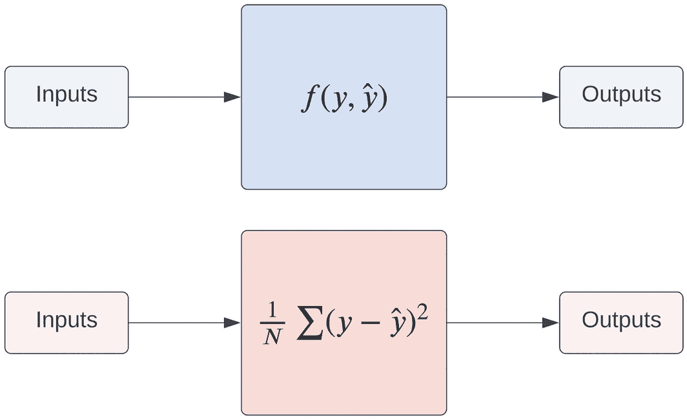

一幅插图展示了 2 个具有输入和输出的黑盒最小化目标函数。

图 10-2

要最小化的目标函数。顶部：没有给出明确信息的黑盒函数。底部：明确定义的损失函数（在这种情况下是均方误差 MSE）。

黑盒优化通常被认为是可行元参数优化的游戏规则。虽然存在几种区分元参数优化的方法^([1)]，但黑盒优化一直是一个长期研究的问题，它对昂贵的黑盒问题有很强的应用性。元参数优化过程除了使用采样元参数训练的候选模型所造成的损失外，没有其他信息。

所说的“天真”元优化算法/程序使用以下一般结构来解决黑盒优化问题：

1.  为一个提议的受控模型选择结构参数。

1.  获取在所选结构参数下训练的受控模型的表现。

1.  重复。

有两种通常认可的元优化算法被用作更复杂元优化方法的基线：

+   *网格搜索*：在网格搜索中，尝试并评估每个参数用户指定列表中值的每一种组合。考虑一个假设的模型，我们希望优化两个结构参数，*A* 和 *B*。用户可能指定 *A* 的搜索空间为 [1, 2, 3]，*B* 的搜索空间为 [0.5, 1.2]。在这里，“搜索空间”表示将要测试的每个参数的值。网格搜索将为这些参数的每一种组合训练六个模型——*A* = 1 和 *B* = 0.5，*A* = 1 和 *B* = 1.2，*A* = 2 和 *B* = 0.5，等等。

+   *随机搜索*：在随机搜索中，用户提供有关每个结构参数可能取的潜在值的可行分布的信息。例如，*A* 的搜索空间可能是一个均值为 2、标准差为 1 的正态分布，而 *B* 可能是从值列表 [0.5, 1.2] 中均匀选择的。然后随机搜索将随机采样参数值并返回表现最好的值集。

网格搜索和随机搜索被认为是天真搜索算法，因为它们没有将先前选定的结构参数的结果纳入如何选择下一组结构参数的方式中；它们只是简单地盲目地反复“查询”结构参数并返回表现最好的那一组。虽然网格搜索和随机搜索在某些元优化问题中有其位置——网格搜索对于小元优化问题足够，随机搜索对于相对便宜的训练模型来说证明是一种惊人的强大策略——但它们不能为更复杂的模型，如神经网络，产生一致的良好结果。问题并不一定在于这些天真方法本质上不能产生好的参数集，而是由于搜索空间大和黑盒查询时间慢，它们需要太长时间才能做到这一点。

元优化独特性格的关键组成部分，使其区别于其他优化问题领域的是评估步骤对元优化系统中任何低效的影响。通常，为了量化某些所选结构参数的好坏，模型会在这些结构参数下进行完全训练，并在测试集上的性能用作评估。在神经网络的情况下，这一评估步骤可能需要数小时。因此，一个有效的元优化系统应尽量减少在找到良好解决方案之前需要构建和训练的模型数量。（这与标准神经网络优化形成对比，在标准神经网络优化中，模型在数小时内查询损失函数并相应地更新其权重，次数从数十万到数百万不等。）

为了防止在评估新结构参数选择时的低效，用于神经网络等模型的成功元优化方法包括另一个步骤——将先前“实验”中的知识纳入确定下一个最佳参数集的选择中：

1.  为提议的受控模型选择结构参数。

1.  获取在所选结构参数下训练的受控模型的性能。

1.  将关于所选结构参数与在相应参数下训练的模型性能之间关系的信息纳入下一次选择中。

1.  重复。

Hyperopt，我们将用于元优化的流行超参数优化框架，使用贝叶斯优化来解决黑盒优化问题。在提供良好的搜索空间的情况下，Hyperopt 通常可以找到比手动设计更好的解决方案。

贝叶斯优化常用于黑盒优化问题，因为它能够在相对较少的目标函数查询次数下获得可靠的良好结果。贝叶斯建模的精神是从一组*先验*信念开始，并不断地用新信息更新这组信念以形成*后验*信念。正是这种持续更新的精神——在需要的地方寻找新信息——使得贝叶斯优化在黑盒优化问题中成为一个强大且多功能的工具。

考虑一个假设的目标函数，如图 10-3 所示。在元优化的背景下，这个函数代表使用样本参数（*x*-轴）训练的模型因训练而产生的损失或成本（*y*-轴）。目标是找到使成本最小化的*x*值（图 10-3）。

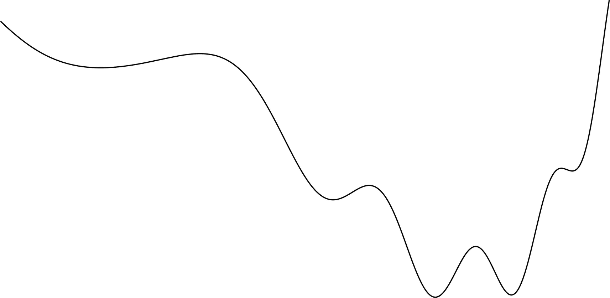

一条从左到右显示的波动趋势的线图示例。

图 10-3

一个假设的成本函数，显示了具有某些参数 x 的模型所承受的损失。为了便于可视化，在这种情况下，我们优化的是一个单参数模型或仅针对一个参数（即查看整个损失景观的横截面）进行损失优化

然而，对于元优化算法来说，成本函数是一个黑盒。它无法“看到”整个函数——如果它能，解决最小化问题就会变得微不足道。该函数显示给用户以方便理解贝叶斯优化，但请务必区分优化过程知道什么和不知道什么！

优化过程所能访问的只是采样点的集合。使用这些采样点，它提出了关于真实成本函数形状的*假设*。这正式称为*代理函数*。代理函数近似目标/成本函数，并代表关于目标函数相对于采样参数/独立变量的行为的当前信念集合。

图 10-4 展示了如何使用两个采样点作为代理函数（红色，虚线）的基础。虽然模型无法“看到”完整的目标函数，但它*可以*“看到”完整的代理函数。代理函数是一个可以用数学表示的函数，其属性可以通过既定的技术轻松访问。优化过程可以根据代理模型确定哪些点是具有潜力的或具有风险的。如果某个提议的点 *x* 具有高代理函数值，那么它是一个风险较高的决策。如果某个提议的点 *x* 具有低代理函数值，那么它更有潜力（图 10-4）。

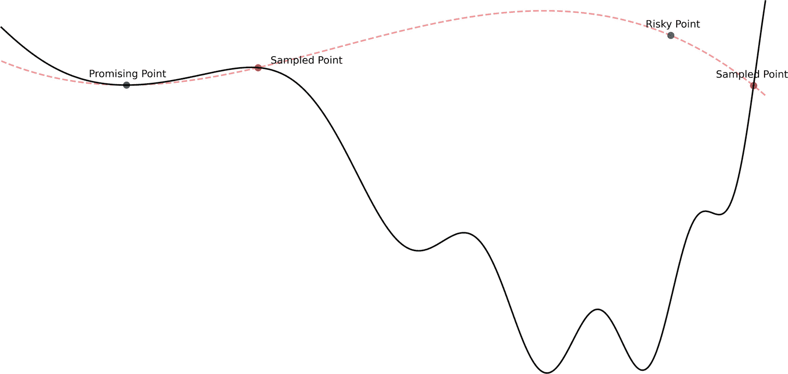

通过两条趋势波动线展示代理函数的示意图。在两条线上标记了 4 个位置，作为具有潜力的点、采样点、风险点和采样点。

图 10-4

将代理函数拟合到两个采样点，并使用代理函数来开发对某些未采样点具有潜力和风险的估计

由于我们这里的代理函数仅由两个点定义，因此优化过程执行严格贪婪采样策略是不明智的。假设该过程决定评估这两个点的真实值（通过评估目标函数）。我们发现风险点实际上比具有潜力的点更有效地最小化了目标函数，这意味着承担风险是值得的！我们现在可以更新代理函数以反映这些采样点，并确定新的具有潜力的点进行采样（图 10-5）。

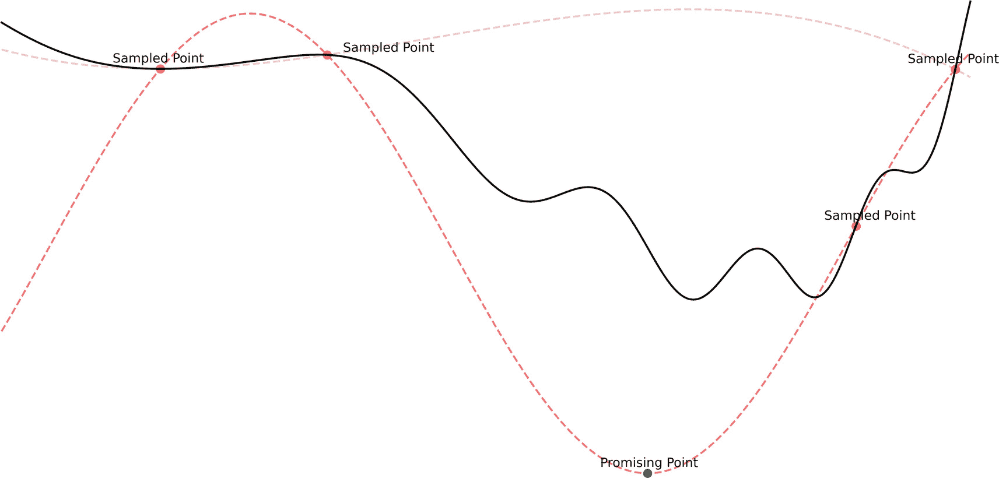

一幅插图。它展示了通过 3 条趋势波动线对代理函数的重新拟合，以及与 4 个采样点的交点。一个有希望的点位于其中一条线上。

图 10-5

对新采样点进行代理函数的重新拟合，以及更新对未采样点有希望或风险的估计

此过程重复进行：增加的“智能”/信息性采样有助于定义代理函数，使其成为越来越准确的真正目标函数的表示（图 10-6）。

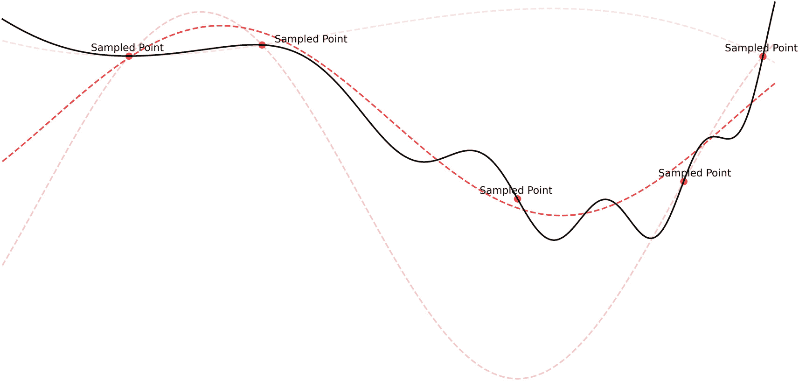

通过 4 条趋势波动线重新拟合代理函数的插图。5 个采样点位于深阴影线上。

图 10-6

对新采样点进行代理函数的第二次重新拟合，以及更新对未采样点有希望或风险的估计

注意，这里代理模型的可视化是确定性的，但在实践中使用的代理函数是概率性的。这些函数返回 *p*(*y*| *x*)，即给定 *x* 时目标函数输出为 *y* 的概率。概率性代理函数以贝叶斯方式更新和采样更为自然。

由于随机或网格搜索在确定下一个采样参数集时没有考虑任何先前结果，这些“天真”算法在计算下一个采样参数集时节省了时间和计算。然而，贝叶斯优化算法用于确定下一个采样点的额外计算被用来更智能地构建代理函数，查询次数更少。总的来说，减少对目标函数的必要查询次数通常超过了确定下一个采样点所需的时间和计算的增加，这使得贝叶斯优化方法更加高效。

这种优化过程更抽象地被称为 *基于模型的序列优化（SMBO）*。它作为一个核心概念或模板，各种模型优化策略可以据此制定和比较。SMBO 包含一个关键特性：一个用于目标函数的代理函数，该函数会根据新信息进行更新，并用于确定新的采样点。两个关键属性区分不同的 SMBO 方法：获取函数的设计（给定代理模型确定如何采样新点的过程）和构建代理模型的方法（如何将采样点纳入目标函数的近似表示）。Hyperopt 使用树结构帕累托估计器（TPE）代理模型和获取策略。

预期改进测量量化了与要优化的参数集*x*相关的预期改进。例如，如果代理模型*p*(*y*| *x*)对所有小于某个阈值值*y*^∗的*y*值都评估为零——也就是说，输入参数*x*的集合产生目标函数输出小于*y*^∗的概率为零——那么通过采样*x*可能找不到任何改进。

树结构化的 Parzen 估计器旨在寻找一组*x*参数，以最大化预期改进。像所有在贝叶斯优化中使用的代理函数一样，它返回*p*(*y*| *x*)——给定输入*x*，目标函数输出的概率。它不是直接获得这个概率，而是使用贝叶斯定理：

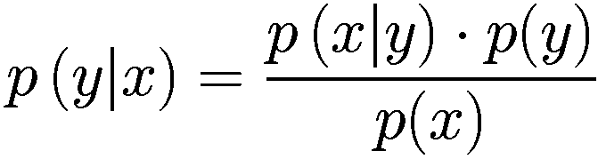

*p*(*x*| *y*)项表示在给定输出*y*的情况下，目标函数的输入为*x*的概率。为了计算这个概率，使用了两个分布函数：*l*(*x*)，如果输出*y*小于某个阈值*y*^∗，以及*g*(*x*)，如果输出*y*小于某个阈值*y*^∗。为了采样*x*的值，使得目标函数的输出小于阈值，策略是从*l*(*x*)而不是*g*(*x*)中抽取。（其他项，如*p*(*x*)和*p*(*y*)，可以很容易地计算，因为它们不涉及条件。）具有最高预期改进的采样值将通过目标函数进行评估。得到的值用于更新*l*(*x*)和*g*(*x*)的概率分布，以实现更好的预测。

最终，树结构化的 Parzen 估计器策略试图通过不断更新其两个内部概率分布，以最大化预测质量，来找到最佳的样本目标函数输入。

注意

你可能会想：树结构化的 Tree-Structured Parzen Estimator 策略是什么意思？在原始的 TPE 论文中，作者建议算法名称中的“树”部分来源于超参数空间的树状特性：一个超参数的值决定了其他参数的可能值集合。例如，如果我们正在优化神经网络架构，我们首先确定层数，然后再确定第三层的节点数。

让我们开始通过寻找简单标量到标量函数的最小值来探索无梯度优化的实现。

考虑以下问题：找到使以下表达式最小化的*x*的值：

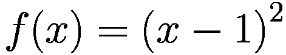

（回忆一下第一章中的类似练习，该练习用于演示梯度下降算法。）

一些简单的数学运算会告诉你，全局最小值在 *x* = 1 处。然而，模型无法访问解析表达式——它必须通过从函数中迭代采样来找到最小值（见代码清单 10-1，图 10-7）。

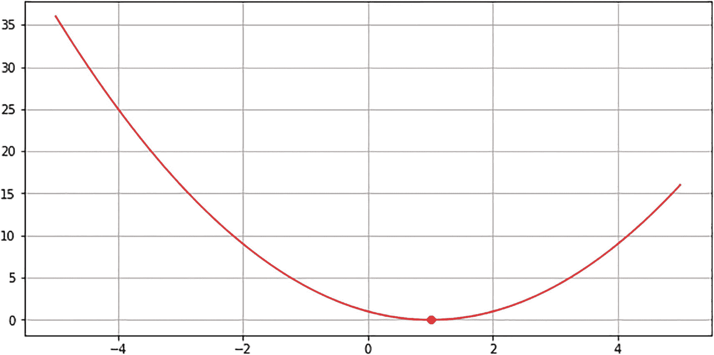

一个带有网格的图表。Y 轴从 0 到 35，以 5 为增量编号。X 轴从 0 到 4 和 -4，以 2 为增量编号。显示了一个具有递减和递增趋势的曲线，并在大约 (1, 0) 处有一个标记点。

图 10-7

*y* = (*x* - 1)² 的图形及其在 *x* = 1 处的最小值

```py
plt.figure(figsize=(10, 5))
x = np.linspace(-5, 5, 100)
y = (x - 1)**2
plt.plot(x, y, color='red')
plt.scatter([1], [0], color='red')
plt.grid()
plt.show()
Listing 10-1
Plotting the graph y = (x − 1)2
```

第一步是定义搜索空间。假设我们最有信心的是，使 *y* = (*x* - 1)² 最小的 *x* 的真实值在 0 附近，而且 *x* 越远离 0，它最小化函数的信心就越低。这反映了以 0 为中心的 *normal distribution*。标准差表示当 *x* 从均值移动得更远时，我们对 *x* 最小化目标函数的信心下降的速度。

要在 Hyperopt 中定义空间，您必须创建一个字典，其中键是参数标识符/引用/名称，值是 Hyperopt 超参数搜索空间对象（见代码清单 10-2）。在这种情况下，我们将使用 `hp.normal`，它定义了一个将以高斯方式采样的参数。所有 `hp.type` 空间都接受一个名称作为第一个参数。对于 `hp.normal`，我们可以在后面指定均值（`mu`）和标准差（`sigma`）。

```py
# define the search space
from hyperopt import hp
space = {'x':hp.normal('x', mu=0, sigma=10)}
Listing 10-2
Defining a search space for x
```

我们的目标函数接受一个字典 `params`。`params` 的结构与我们搜索空间的结构相同，只是每个键都已被采样值替换。`params['x']` 将返回一个从正态分布中采样的浮点数，而不是 `hp.normal` 对象。我们可以通过我们的采样函数（见代码清单 10-3）评估采样值。

```py
# define objective function
def obj_func(params):
return (params['x']-1)**2
Listing 10-3
Defining the objective function
```

要进行优化，请使用函数最小化函数 `fmin`，它接受目标函数和搜索空间参数。您还可以提供算法（推荐使用之前讨论过的树结构帕累托估计器）以及可以对目标函数进行的最大查询/评估次数。请注意，如果 Hyperopt 在达到满意解并确定不太可能有其他未探索的更好解之前停止，则它可能停止早于最大评估次数（见代码清单 10-4）。

```py
# perform minimization procedure
from hyperopt import fmin, tpe
best = fmin(obj_func, space, algo=tpe.suggest, max_evals=500)
Listing 10-4
Running the minimization campaign
```

经过数百次评估后，Hyperopt 找到最小化 *x* 的值为 1.0058378772703804，这非常接近真实值 1。成功！

考虑另一个如下定义的函数：

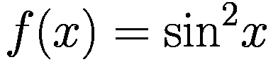

*π* 的倍数最小化这个函数，因为对于任何整数 *k*，sin(*kπ*) = 0。假设我们想让 Hyperopt 找到一个解，该解最小化函数并位于 2 和 4 之间。我们知道 2 < *π* < 4，并且 argmin(sin²*x*) = *kπ*；因此，argmin(sin²*x*{2 < *x* < 4}) = *π*。解决这个优化问题很自然地引导我们得到 *π* 的一个近似值（见 10-5 列表，图 10-8）！

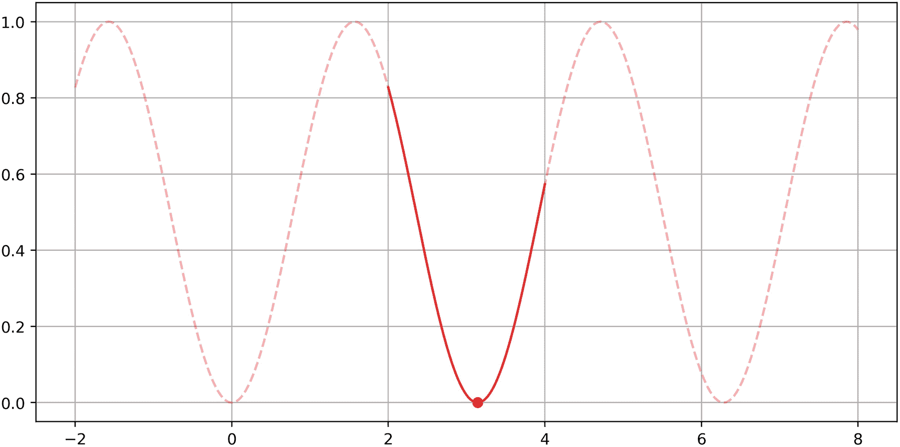

一个带有网格的图形。Y 轴从 0.0 到 1.0 编号，增量是 0.2。X 轴从负 2 到 8 编号，增量是 2。显示了一条波动趋势的曲线，大约在 (3, 0.0) 处有一个点。

图 10-8

*sin*²*x* 的图像及其在 *x* = *π* 处的一个最小值被标记

```py
plt.figure(figsize=(10, 5), dpi=400)
x = np.linspace(2, 4, 1000)
y = np.sin(x)**2
plt.plot(x, y, color='red')
plt.scatter([np.pi], [0], color='red')
x = np.linspace(-2, 8, 1000)
y = np.sin(x)**2
plt.plot(x, y, color='red', alpha=0.3, linestyle='--')
plt.scatter([np.pi], [0], color='red')
plt.grid()
plt.show()
Listing 10-5
Plotting the graph of y = sin2x and a minimum at x = π
```

我们不是使用正态分布，而是使用最小值为 2 和最大值为 4 的均匀分布来反映我们对空间的了解（见 10-6 列表）。

```py
# define the search space
from hyperopt import hp
space = {'x':hp.uniform('x', 2, 4)}
# define objective function
def obj_func(params):
return np.sin(params['x'])**2
Listing 10-6
Defining a search space and objective function
```

经过十次试验后，Hyperopt 对 *π* 的近似值为 3.254149；经过 100 次试验后，它是 3.139025；经过 1000 次后，它是 3.141426。为了参考，π 的实际值四舍五入到六位数字是 3.141593 – 我们的无梯度近似只差了大约 0.00017！

然而，通常情况下，我们想要搜索的域中并非所有值都能定义函数。Hyperopt 允许我们使用 *状态* 来指定何时一个参数或一组参数是无效的。考虑最小化以下函数，它在 *x* = 0 处未定义（见 10-7 列表，图 10-9）：

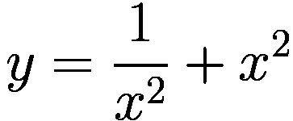

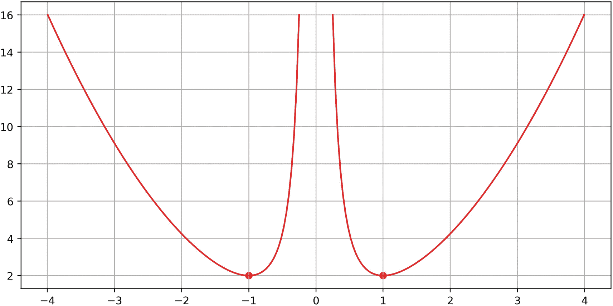

一个带有网格的图形。Y 轴从 2 到 16 编号，增量是 2。X 轴从负 4 到 4 编号，增量是 1。展示了 2 条曲线，每条曲线的最低峰值点分别在大约 (负 1, 2) 和 (1, 2)。

图 10-9

![方程式 $ \frac{1}{x²}+{x}² $ 的图像]，在 *x* ∈ {−1, 1} 处有两个最小值

```py
plt.figure(figsize=(10, 5), dpi=400)
x = np.linspace(-3.99214, -0.25049, 100)
y = 1/(x**2) + (x)**2
plt.plot(x, y, color='red')
x = np.linspace(0.25049, 3.99214, 100)
y = 1/(x**2) + (x)**2
plt.plot(x, y, color='red')
plt.scatter([-1, 1], [2, 2], color='red')
plt.grid()
plt.show()
Listing 10-7
Plotting the graph of
```

在搜索空间中指定 *x* 不应为 0 并不容易；相反，如果目标函数接收到一个无效值，我们从目标函数返回 `{'status':'fail'}`。如果采样的参数是有效的，我们返回 `{'status':'ok', 'loss': ...}` – 用给定的采样参数集产生的任何损失来填充“loss”（见 10-8 列表）。

```py
# define the search space
from hyperopt import hp
space = {'x':hp.normal('x', mu=0, sigma=10)}
# define objective function
def obj_func(params):
if params['x']==0:
return {'status':'fail'}
return {'loss':1/(params['x']**2) + params['x']**2,
'status':'ok'}
Listing 10-8
Defining the search space and objective function, with statuses built in for invalid sampled inputs
```

注意，这个特定的函数有两个全局最小值，它们都是同样有效的。鉴于搜索空间是对称的，并且直接位于 *x* 的最小值之间，Hyperopt 大约有一半的时间会随机得到一个特定的解。

有时，我们甚至无法精确描述哪些采样参数或参数集会产生无效结果。例如，考虑以下函数，它在实数域上对于*x* < 0 和 sin(*x*²) < 0（后者在*x* → ∞时更频繁发生）都是无效的（代码清单 10-9，图 10-10）：

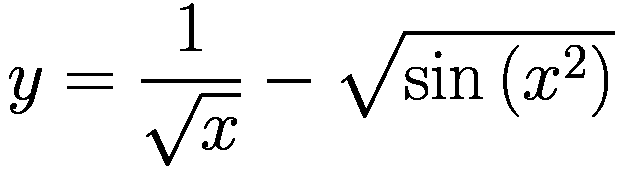


一个带有网格的图形。在 x 轴的 0 到 10 之间展示了 16 条低峰值曲线。

图 10-10

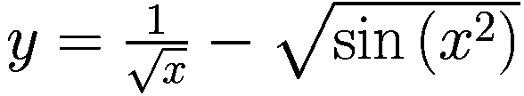的图形

```py
plt.figure(figsize=(10, 5), dpi=400)
x = np.linspace(0.1, 10, 10_000)
y = 1/(np.sqrt(x)) - np.sqrt(np.sin(x**2))
plt.plot(x, y, color='red')
plt.grid()
plt.show()
Listing 10-9
Plotting the graph of
```

假设我们想要在 0 到 10 之间最小化这个函数。而不是指定哪些采样参数值会产生无效结果——这是一个相当繁重的代数任务——我们可以在计算之后处理可能出现的任何问题。在这种情况下，如果我们使用 NumPy 执行无效操作，结果将是`np.nan`。如果目标是`nan`，我们可以执行目标函数评估并返回失败状态（代码清单 10-10）。

```py
# define objective function
def obj_func(params):
result = 1/np.sqrt(params['x']) - np.sqrt(np.sin(params['x']**2))
if result == np.nan:
return {'status':'fail'}
return {'loss': result, 'status':'ok'}
Listing 10-10
Defining the objective function, with a general fail-safe for invalid inputs using statuses
```

在其他情况下，如果给定采样参数集执行目标函数抛出错误（例如，使用无效架构构建神经网络），您也可以使用 try/except 结构，如果在目标函数评估中存在任何错误，则返回失败状态。Hyperopt 找到了一个相当好的最小值（图 10-11）。


一个带有网格的图形。在 x 轴的 0 到 10 之间展示了 16 条低峰值曲线。右侧的第 15 条曲线，大约标记在(9.5, 负 0.4)的位置。

图 10-11

Hyperopt 发现的最低点标记为点的的图形

## 优化模型元参数

在本节中，我们将应用我们对 Hyperopt 语法的了解，开始对经典机器学习模型和深度学习模型进行元优化。我们不会处理简单的 *f* : *x* → *y* 最小化问题，而是将构建用于在目标函数中构建和训练模型的大搜索空间。

让我们考虑 Higgs 玻色子数据集，我们之前在书中从多个不同的方向对其进行了探讨。这个数据集通常是一个难以建模的问题，但也许我们可以通过元优化（图 10-12）找到更好的解决方案。


一个包含 22 列的 Higgs 玻色子数据集表格。底部显示为 68636 行，交叉，29 列。

图 10-12

Higgs 玻色子数据集

我们将尝试找到最佳的经典机器学习模型：逻辑回归、决策树、随机森林、梯度提升、AdaBoost 和多层感知器之一（图 10-13）。这是建模管道中最基本的隐含元参数：你甚至选择用哪个模型来建模数据集本身就是一个元参数！然而，除此之外，每个模型内部还有需要优化的元参数。例如，在构建决策树时，有不同的深度值和标准；这些可以显著改变一个决策树与其他决策树的行为差异。随机森林和梯度提升模型还有一个额外的元参数——集成中的估计器数量。我们不仅想要选择最佳模型，还想要为该模型选择最佳的元参数集。

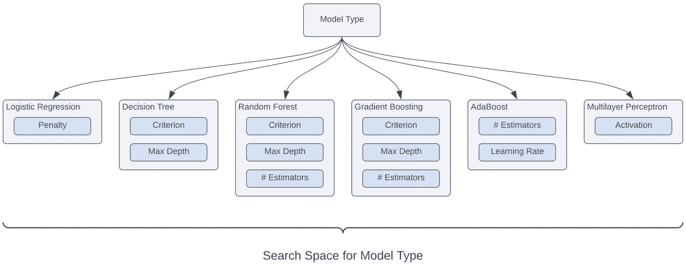

模型类型搜索空间的示例。它们包括逻辑回归、决策树、随机森林、梯度提升、AdaBoost 和多层感知器。

图 10-13

用于选择模型及其相关参数的搜索空间

让我们从导入我们相关的每个模型开始（列表 10-11）。

```py
from sklearn.linear_model import LogisticRegression
from sklearn.tree import DecisionTreeClassifier
from sklearn.ensemble import RandomForestClassifier,
GradientBoostingClassifier,
AdaBoostClassifier
from sklearn.neural_network import MLPClassifier
Listing 10-11
Importing relevant models
```

我们将使用 F1 分数来评估最佳模型。回顾第一章，F1 分数是比准确率更平衡、更信息化的二分类问题指标。此外，我们还需要导入我们的空间定义（`hyperopt.hp`）、函数最小化（`hyperopt.fmin`）和树结构帕累托估计器（`hp.tpe`）实用工具（列表 10-12）。

```py
from sklearn.metrics import f1_score
from hyperopt import hp, fmin, tpe
Listing 10-12
Importing the F1 score metric from scikit-learn and relevant Hyperopt functions
```

我们可以开始构建我们的空间。我们需要决定使用哪个模型；键值对 `'model': hp.choice('model', models)` 告诉 Hyperopt，这个名为‘model’的元参数必须从给定的模型列表（这些是未实例化的模型对象）中选择一个选项进行采样（这些模型）。如果选定的模型是线性回归，我们想要选择是否使用无正则化或 L2 正则化；如果选定的模型是决策树，我们想要选择是否使用 Gini 或熵标准（见第一章）以及最大深度。为了定义一个元参数的采样空间，这个空间大致是连续的，但只取量化值，我们使用 `hp.qtype`；在这种情况下，`quniform('name', 1, 30, q=1)` 定义了一个在 1 到 30 之间的均匀分布，量化因子为 1（量化定义为 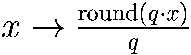 对于某个量化因子 *q*）。如果我们想要 2 的倍数，我们可以将量化因子设置为 `q=2`。我们可以以类似的方式继续列出每个元参数（列表 10-13）。

```py
models = [LogisticRegression,
DecisionTreeClassifier,
RandomForestClassifier,
GradientBoostingClassifier,
AdaBoostClassifier,
MLPClassifier]
space = {'model': hp.choice('model', models),
'lr_penalty': hp.choice('lr_penalty', ['none', 'l2']),
'dtc_criterion': hp.choice('dtc_criterion', ['gini',
'entropy']),
'dtc_max_depth': hp.quniform('dtc_max_depth', 1, 30, q=1),
'rfc_criterion': hp.choice('rfc_criterion', ['gini',
'entropy']),
'rfc_max_depth': hp.choice('rfc_max_depth', 1, 30, q=1),
'rfc_n_estimators': hp.qnormal('rfc_n_estimators', 100, 30,
q=1)
...}
Listing 10-13
Setting up a potential search space to optimize which model to use and the best of hyperparameters for that model
```

然而，由于许多原因，这是一种非常糟糕的方式来构建我们的搜索空间。从哲学上讲，我们没有以与元参数固有性质一致的方式构建空间。所有东西都是线性排列的，而它们应该以某种方式嵌套（如图 10-13 中的分层图所示）。从技术-理论的角度来看，我们最终采样的大多数点对输出没有影响。例如，如果选定的模型是线性回归，那么只有一个其他元参数是相关的（lr_penalty），其余的 11 个都是不相关的。我们以使优化困难的方式构建空间，因为大多数采样的参数肯定不会对结果产生任何影响。从实现的角度来看，这种搜索空间结构迫使我们编写一个极其冗长的目标函数。我们需要复制一切，并隐式地构建关系，如列表 10-14 所示。

```py
def objective(params):
if params['model'] == LogisticRegression:
model = LogisticRegression(lr_penalty = params['lr_penalty'])
elif params['model'] == DecisionTreeClassifier:
model = DecisionTreeClassifier(criterion = params['dtc_criterion'],
max_depth = params['dtc_max_depth'])
elif params['model'] == RandomForestClassifier:
model = RandomForestClassifier(criterion = params['rfc_criterion'],
max_depth = params['rfc_max_depth'],
n_estimators = params['rfc_n_estimators'])
...
model.fit(x_train, y_train)
return -f1_score(model.predict(x_valid), y_valid)
Listing 10-14
The objective function that one would have to write if they defined the search space in a similar manner as in Listing 10-13
```

为了避免这种情况，我们将使用一个*嵌套搜索空间*。而不是仅仅选择一个模型目标，我们选择一个模型“包”。这个“包”不仅包括实际的模型本身，还包括针对所选模型的特定元参数的*子搜索空间*。通过在字典之间嵌套字典，我们可以更准确地捕捉元参数之间的关系。从技术上来说，我们正在创建一个字典列表，其中每个字典代表一个具有更多搜索空间的子空间，每个 `hp.choice()` 在探索过程中采样一个字典（列表 10-15）。

```py
space = {}
models = [{'model': LogisticRegression,
'parameters':{'penalty':hp.choice('lr_penalty', ['none', 'l2'])}},
{'model': DecisionTreeClassifier,
'parameters': {'criterion': hp.choice('dtc_criterion', ['gini', 'entropy']),
'max_depth': hp.quniform('dtc_max_depth', 1, 30, 1)}},
{'model': RandomForestClassifier,
'parameters': {
'criterion': hp.choice('rfc_criterion', ['gini', 'entropy']),
'max_depth': hp.quniform('rfc_max_depth', 1, 30, q=1),
'n_estimators': hp.qnormal('rfc_n_estimators', 100, 30, 1)}},
{'model': GradientBoostingClassifier,
'parameters':
{'criterion': hp.choice('gbc_criterion', ['friedman_mse',
'squared_error',
'mse', 'mae']),
'n_estimators': hp.qnormal('gbc_n_estimators', 100, 30, 1),
'max_depth': hp.quniform('gbc_max_depth', 1, 30, q=1)}},
{'model': AdaBoostClassifier,
'parameters': {
'n_estimators': hp.qnormal('abc_n_estimators', 50, 15, 1),
'learning_rate': hp.uniform('abc_learning_rate', 1e-3, 10)}
},
{'model': MLPClassifier,
'parameters':{'activation': hp.choice('mlp_activation', ['logistic', 'tanh', 'relu'])}
}]
space['models'] = hp.choice('models', models)
Listing 10-15
A better, nested search space for model hyperparameter optimization
```

当我们以这种方式定义搜索空间时，我们的目标函数变得异常简洁（列表 10-16）。

```py
def objective(params):
model = params['models']'model'
model.fit(X_train, y_train)
return -f1_score(model.predict(X_valid), y_valid)
Listing 10-16
A clean objective function following from a well-designed nested search space in Listing 10-15
```

列表 10-16 在做什么？回想一下，模型存储为一个未实例化的对象，可以使用括号表示法进行实例化（例如，`model = DecisionTreeClassifier()`）。此外，我们希望使用采样参数集来构建模型。从列表 10-15 中定义的搜索空间中，我们看到 `params['models']['parameters']` 返回一个字典，其中键是参数名称，值是这些参数的采样值。Python 中的 `**` 解包命令可以用来“转换”这个字典为对象构造，使得每个键是一个参数，每个值是参数值。我们方便地将搜索空间中参数字典中的每个键命名为与模型构造函数中的初始化参数相同的名称，因此我们可以用一行代码初始化我们的模型和所有采样参数。

实际上，我们不得不进行一项调整。Hyperopt 以浮点数的形式采样量化输入（例如，决策树的最大树深度），即使实际值在数学上是整数（例如，`2.0`，`42.0`）。当我们将浮点值传递给只接受整数的参数时，`sklearn` 会抛出错误。因此，我们可以在目标函数中添加一些“清理”代码，以确保 `n_estimators` 参数被转换为整数，并且至少为 1（Hyperopt 可能会采样小于 1 的值，因为我们实际上定义了一个量化的 *normal* 分布）。我们可以使用这组清理后的参数初始化我们的模型，就像之前一样（列表 10-17）。

```py
def objective(params):
cleanedParams = {}
for param in params['models']['parameters']:
value = params['models']['parameters'][param]
if param == 'n_estimators':
if value < 1:
value = 1
value = int(value)
cleanedParams[param] = value
model = params['models']'model'
model.fit(X_train, y_train)
return -f1_score(model.predict(X_valid), y_valid)
best = fmin(objective, space, algo=tpe.suggest, max_evals=30)
Listing 10-17
Adding additional catches for potential invalid sampling that are easier to address in the objective function than elsewhere
```

此外，请注意我们返回负的 F1 分数，因为 Hyperopt 是最小化给定的目标函数。如果我们省略否定，Hyperopt 实际上是在寻找最差的模型。（纯粹从理论上讲，最差的模型与最佳模型非常接近——只需翻转标签。）

经过 30 次评估后，Hyperopt 确定最佳参数集（存储在 `best` 中）如下：

```py
{'models': 2,
'rfc_criterion': 1,
'rfc_max_depth': 16.0,
'rfc_n_estimators': 69.0}
```

参数 'models' 的选择值是 2；搜索空间中模型列表中的第 2 个模型是随机森林分类器。最佳模型是一个使用熵标准、最大树深度为 16 和 69 个估计器的随机森林分类器。经过单独训练后，此模型获得大约 0.73 的 F 分数，对于希格斯玻色子数据集来说相当高。

我们还可以使用元优化来优化我们训练神经网络的方式。例如，我们可能希望选择最佳的优化器、优化器参数以及学习率管理器的衰减因子和耐心。请注意，我们需要以嵌套/分层的方式构建我们的优化器，因为某些参数只有在另一个参数采样到某个特定值时才相关（即我们想要捕捉参数依赖关系）。然而，我们确实需要可靠地采样学习率管理器的耐心和衰减因子；因此，我们可以将这些添加到子字典中作为参数，以组织的目的，但不要通过嵌套选择“选择”它们是否相关（见代码清单 10-18）。

```py
from tensorflow.keras.optimizers import Adam, SGD, RMSprop, Adagrad
from sklearn.metrics import f1_score
from hyperopt import hp
from hyperopt import fmin, tpe
space = {}
optimizers = [{'optimizer':SGD,
'parameters':{
'learning_rate': hp.uniform('sgd_lr', 1e-5, 1),
'momentum': hp.uniform('sgd_mom', 0, 1),
'nesterov': hp.choice('sgd_nest', [False, True])
}},
{'optimizer':RMSprop,
'parameters':{
'learning_rate': hp.uniform('rms_lr', 1e-5, 1),
'momentum': hp.uniform('rms_mom', 0, 1),
'rho': hp.normal('rms_rho', 1.0, 0.3),
'centered': hp.choice('rms_cent', [False, True])
}},
{'optimizer':Adam,
'parameters':{
'learning_rate': hp.uniform('adam_lr', 1e-5, 1),
'beta_1': hp.uniform('adam_beta1', 0.3, 0.9999999999),
'beta_2': hp.uniform('adam_beta2', 0.3, 0.9999999999),
'amsgrad': hp.choice('amsgrad', [False, True])
}},
{'optimizer':Adagrad,
'parameters':{
'learning_rate': hp.uniform('adagrad_lr', 1e-5, 1),
'initial_accumulator_value': hp.uniform('adagrad_iav', 0.0, 1.0)
}}]
space['optimizers'] = hp.choice('optimizers', optimizers)
from keras.callbacks import ReduceLROnPlateau
space['lr_manage'] = {'factor': hp.uniform('lr_factor', 0.01, 0.95),
'patience': hp.quniform('lr_patience', 3, 20, q=1)}
Listing 10-18
Defining a search space for the optimal neural network training hyperparameters
```

由于创建神经网络需要相当数量的代码，因此创建一个单独的方法来构建神经网络架构是一种良好的实践。在这种情况下，我们将采用一个简单的静态七层网络（见代码清单 10-19）。

```py
def build_NN(input_dim = len(X_train.columns)):
model = keras.models.Sequential()
model.add(L.Input((input_dim,)))
model.add(L.Dense(input_dim, activation='relu'))
model.add(L.Dense(input_dim, activation='relu'))
model.add(L.Dense(input_dim, activation='relu'))
model.add(L.BatchNormalization())
model.add(L.Dense(16, activation='relu'))
model.add(L.Dense(16, activation='relu'))
model.add(L.Dense(16, activation='relu'))
model.add(L.Dense(1, activation='sigmoid'))
return model
Listing 10-19
A function that builds a simple static seven-layer network
```

我们的目标是最小化验证二进制交叉熵。目标函数接受采样参数，初始化一个神经网络，并使用给定的优化器参数和学习率管理器进行拟合（见代码清单 10-20）。

```py
from keras.callbacks import EarlyStopping
bce = tf.keras.losses.BinaryCrossentropy(from_logits=True)
def objective(params):
model = build_NN()
es = EarlyStopping(patience=5)
rlrop = ReduceLROnPlateau(**params['lr_manage'])
optimizer = params['optimizers']['optimizer']
optimizer_params = params['optimizers']['parameters']
model.compile(loss='binary_crossentropy',
optimizer=optimizer(**optimizer_params))
model.fit(X_train, y_train, callbacks=[es, rlrop],
epochs = 50, verbose = 0)
pred = model.predict(np.array(X_valid)
truth = np.array(y_valid).reshape((len(y_valid),1))
valid_loss = bce(pred.astype(np.float16)),
truth.astype(np.float16)).numpy()
return valid_loss
best = fmin(objective, space, algo=tpe.suggest, max_evals=100);
Listing 10-20
Defining an objective function to optimize training parameters
```

注意，由于我们使用的是相对轻量级的神经网络架构，并且表格数据集相对较小，因此在普通硬件上训练和评估 100 个神经网络（或更多）在计算上并非不可行。

单次运行中产生的最佳解决方案如下：

```py
{'lr_factor': 0.7749528095685804,
'lr_patience': 14.0,
'optimizers': 0,
'sgd_lr': 0.23311588639160802,
'sgd_mom': 0.5967800410439047,
'sgd_nest': 1}
```

这个特定的神经网络模型达到了几乎 0.74 的 F1 分数。

除了优化模型的训练参数之外，我们还可以尝试优化神经网络的架构。我们将通过允许网络具有不同的维度来参数化`build_NN`函数（见代码清单 10-21）。为了构建更复杂的非线性网络拓扑，我们将使用多个分支（见图 10-14）。每个分支由一定数量的 28 神经元全连接层组成，随后是一定数量的 16 神经元全连接层。这些分支通过某种连接方法（要么是添加，要么是连接）合并在一起，并通过一定数量的 16 神经元层进行处理。这为我们提供了五个参数化维度。

```py
def build_NN(num_branches,
num28repeats, num16repeats,
join_method, numOutRepeats):
inp = L.Input((28,))
out_tensors = []
for i in range(int(num_branches)):
x = L.Dense(28, activation='relu')(inp)
for i in range(int(num28repeats-1)):
x = L.Dense(28, activation='relu')(x)
for i in range(int(num16repeats)):
x = L.Dense(16, activation='relu')(x)
out_tensors.append(x)
if num_branches == 1:
join = out_tensors[0]
elif join_method == 'concat':
join = L.Concatenate()(out_tensors)
else:
join = L.Add()(out_tensors)
x = L.Dense(16, activation='relu')(join)
for i in range(int(numOutRepeats-1)):
x = L.Dense(16, activation='relu')(x)
out = L.Dense(1, activation='sigmoid')(x)
return keras.models.Model(inputs=inp, outputs=out)
Listing 10-21
A function that builds a neural network given five adjustable architectural parameters
```

我们可以相应地设计一个搜索空间（见代码清单 10-22）。除了优化优化器和学习率管理之外，我们还将为 Hyperopt 提供五个字段来优化神经网络架构。`quniform`对所有字段都适用，除了连接方法，它是在添加和连接之间进行选择。

```py
space = {}
space['optimizers'] = hp.choice('optimizers', optimizers)
space['lr_manage'] = {'factor': hp.uniform('lr_factor', 0.01, 0.95),
'patience': hp.quniform('lr_patience', 3, 20, q=1)}
space['architecture'] = {'num_branches': hp.quniform('num_branches', 1, 5, q=1),
'num28repeats': hp.quniform('num28repeats', 1, 5, q=1),
'num16repeats': hp.quniform('num16repeats', 1, 5, q=1),
'join_method': hp.choice('join_method', ['add', 'concat']),
'numOutRepeats': hp.quniform('numOutRepeats', 1, 5, q=1)}
Listing 10-22
Defining a search space to optimize the architectural parameters of the neural network constructor defined in Listing 10-21
```

要了解不同分支大小的表现，请参阅代码清单 10-23 和图 10-14。

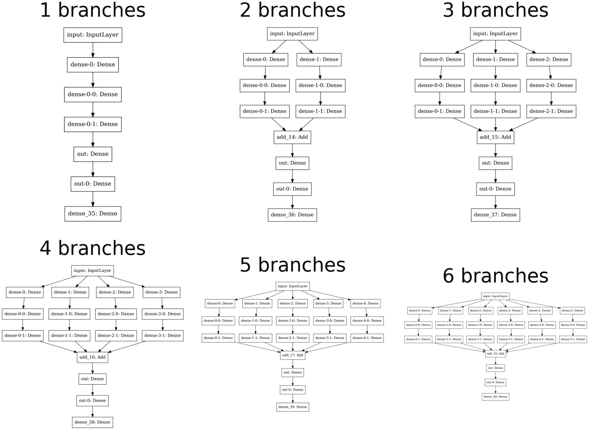

6 个分支的 6 个流程图。每个分支在设计上有所不同，具有类似输入、输出密集和添加的特征。

图 10-14

可视化具有不同分支数量（保持其他架构特征不变）的架构

```py
for i in range(1, 7):
model = build_NN(num_branches=i,
num28repeats=2,
num16repeats=2,
join_method='add',
numOutRepeats=2)
tensorflow.keras.utils.plot_model(model, dpi=400, to_file=f'branches{i}.png')
plt.figure(figsize=(7, 5), dpi=400)
for i in range(1, 7):
plt.subplot(2, 3, i)
plt.title(f'{i} branches')
plt.axis('off')
plt.imshow(plt.imread(f'branches{i}.png'))
plt.show()
Listing 10-23
Visualizing variation across the num_branches architectural dimension
```

此外，为了说明从我们五个架构参数化维度生成的拓扑结构的多样性，请参阅列表 10-24 和图 10-15。你可以把显示的每个架构看作是在搜索空间中占据某个点。


35 个流程图。它们展示了搜索空间中适合选择的分支样本。每个样本在设计上有所不同，具有类似输入、输出密集和添加的特征。

图 10-15

我们搜索空间中可能选择的架构样本

```py
for i in range(35):
model = build_NN(num_branches=np.random.choice([1, 2, 3, 4, 5, 6]),
num28repeats=np.random.choice([1, 2, 3, 4, 5, 6]),
num16repeats=np.random.choice([1, 2, 3, 4, 5, 6]),
join_method=np.random.choice(['add', 'concat']),
numOutRepeats=np.random.choice([1, 2, 3, 4, 5, 6]))
tensorflow.keras.utils.plot_model(model, dpi=400, to_file=f'{i}.png')
plt.figure(figsize=(15, 21), dpi=400)
for i in range(35):
plt.subplot(5, 7, i+1)
plt.axis('off')
plt.imshow(plt.imread(f'{i}.png'))
plt.show()
Listing 10-24
Randomly sampling different possible architectures from the search space
```

由于我们精心设计的搜索空间实现，目标函数不难编写。我们可以简单地解包相关的架构参数，并将它们传递给 `build_NN` 函数，该函数实例化了样本架构（列表 10-25）。

```py
def objective(params):
model = build_NN(**params['architecture'])
es = EarlyStopping(patience=5)
rlrop = ReduceLROnPlateau(**params['lr_manage'])
optimizer = params['optimizers']['optimizer']
optimizer_params = params['optimizers']['parameters']
model.compile(loss='binary_crossentropy',
metrics=['accuracy'],
optimizer=optimizer(**optimizer_params))
model.fit(X_train, y_train, callbacks=[es, rlrop],
epochs = 50, verbose = 0)
pred = model.predict(np.array(X_valid)
truth = np.array(y_valid).reshape((len(y_valid),1))
valid_loss = bce(pred.astype(np.float16)),
truth.astype(np.float16)).numpy()
return valid_loss
best = fmin(objective, space, algo=tpe.suggest, max_evals=100);
Listing 10-25
Writing the objective function for the best-architecture search problem and executing the optimization operation
```

对于样本运行的最佳发现的架构有两个分支，每个分支有三个 28 节点层，之后每个分支有三个 110 节点层，再之后是一个基于添加的连接后的四个 110 节点层。发现的架构看起来是合理的：它利用了多个分支的非线性，但整体上是一个平衡良好的拓扑结构（见图 10-16）。

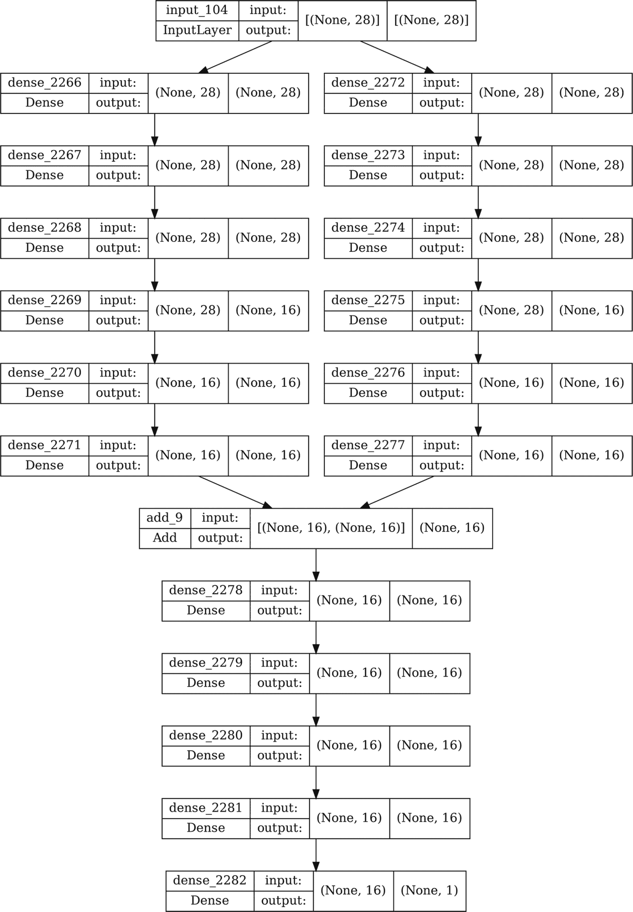

流程图。它通过超参数优化架构展示了一个合适的选项。显示了 2266 到 2282 的密集数字，以及输入、输出、无和数字。

图 10-16

Hyperopt 发现的（在我们问题空间内）针对此问题的最佳架构

然而，请注意，Hyperopt 并未设计用于密集架构搜索。在本章的后面部分，我们将探讨如何使用更专业的框架来运行神经架构搜索（NAS）操作。

## 优化数据管道

构建模型本身是整个建模过程中的一个相对较小的组成部分！任何在现实世界数据问题上工作过的数据科学家都明白，数据清洗和准备等任务构成了通过数据管道所需的大量劳动和时间。在这个过程中，你将做出许多关于如何操作数据的决定，这些决定可能看似任意或不优化。我们也可以使用元优化工具来优化这些决定。

让我们使用 Ames 房屋数据集，它包含许多需要密集数据编码的分类特征。回想一下，我们在第二章节中使用这个数据集来尝试不同的分类编码技术（列表 10-26，图 10-17）。

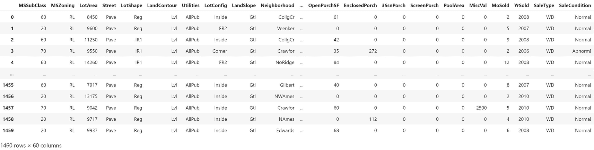

一个包含 22 列的 Ames 房屋数据集表格。底部显示为 1460 行，交叉，60 列。

图 10-17

Ames 房屋数据集

```py
df = pd.read_csv('https://raw.githubusercontent.com/hjhuney/Data/master/AmesHousing/train.csv')
df = df.dropna(axis=1, how='any').drop('Id', axis=1)
x = df.drop('SalePrice', axis=1)
y = df['SalePrice']
Listing 10-26
Reading the Ames Housing dataset
```

房价的单变量分布图显示了相当大的价格范围，覆盖了数十万美元的价格范围（见图 10-18）。

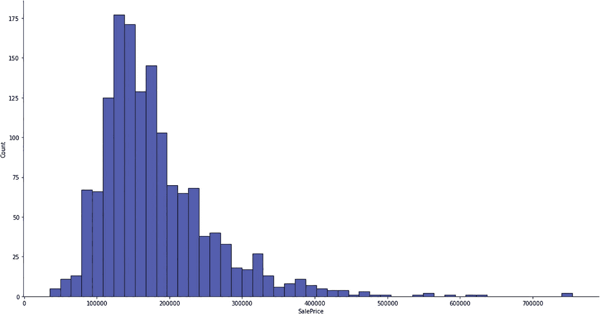

销售价格与数量分布图。值是估计的。最高和最低数据是：100000 到 200000：175，600000 到 700000：1。

图 10-18

Ames 住房数据集中房价的分布

我们主要关注分类特征，因为这些是需要预处理的特征。我们想要找到哪种类型的分类编码对每个特征是最优的。

分类特征需要以某种方式进行编码。而不是猜测每个特征（或所有特征）应该使用哪种分类编码技术，我们可以在 Ames 住房数据集中为每个分类列定义一个搜索空间，以选择最佳分类编码器（见图 10-19）。

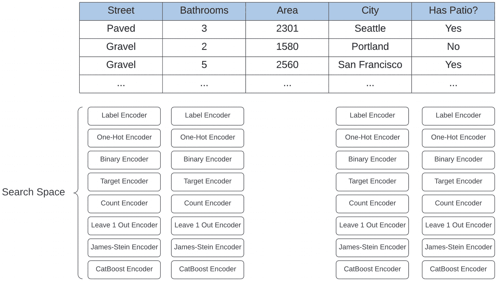

一个包含 5 列和 4 个标签编码器搜索空间集合的表格。

图 10-19

将一组可能的分类编码器映射到每个分类特征的演示

理想情况下，在完成这样的搜索后，元优化过程将选择每个列的最佳分类编码技术组合，以便在分类编码的数据集上训练的模型能够获得最佳的验证性能（见图 10-20）。

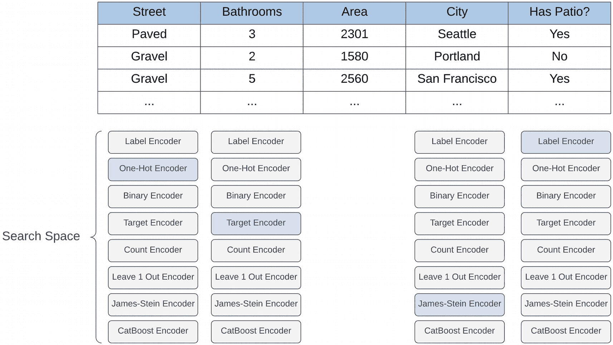

一个包含 5 列和 4 个标签编码器搜索空间集合的表格。每个集合中突出显示 4 个编码器类别，即单热编码器、目标编码器、James Stein 编码器和标签编码器。

图 10-20

在数据集中每个分类特征的最佳分类编码器集合中的选择演示

首先，我们需要确定数据集中哪些列是分类的或不是分类的。这不是一个简单任务，因为数据集中有几十列，其中一些分类特征是数字。此外，一些特征可以合理地被认为是既可以是分类的也可以是连续的，比如房屋中的浴室数量。这个数量在技术上来说是连续的，但在本质上来说是分类的，因为这个特征可能只占据四到五个独特的值。我们将定义分类特征为满足以下条件的特征：它要么填充了字符串，要么包含五个或更少的独特值（见 10-27）。这并不完美，但能完成任务。

```py
cat_features = []
for colIndex, colName in enumerate(x.columns):
# find categorical variables to process
if type(x.iloc[0, colIndex]) == str or len(x[colName].unique()) <= 5:
cat_features.append(colName)
Listing 10-27
Acquiring a list of which columns are considered categorical
```

现在，我们需要实际构建我们的空间。首先，我们想要考虑每个特征的分类编码器集合（见 10-28）。我们将选择第二章中讨论的几个，并创建一个可能的编码器列表。

```py
from category_encoders.ordinal import OrdinalEncoder
from category_encoders.one_hot import OneHotEncoder
from category_encoders.binary import BinaryEncoder
from category_encoders.target_encoder import TargetEncoder
from category_encoders.count import CountEncoder
from category_encoders.leave_one_out import LeaveOneOutEncoder
from category_encoders.james_stein import JamesSteinEncoder
from category_encoders.cat_boost import CatBoostEncoder
encoders = [OrdinalEncoder(),
OneHotEncoder(),
BinaryEncoder(),
TargetEncoder(),
CountEncoder(),
LeaveOneOutEncoder(),
JamesSteinEncoder(),
CatBoostEncoder()]
Listing 10-28
Creating a list of possible categorical encoders
```

要创建空间，我们只需遍历数据集中的每一列，并确定它是否是分类特征。如果是，我们在 `cat_features` 中记录它，并在搜索空间中创建一个参数，允许 Hyperopt 在对该特定特征应用任何编码器之间进行选择（见 10-29）。

```py
space = {}
cat_features = []
for colIndex, colName in enumerate(x.columns):
# find categorical variables to process
if type(x.iloc[0, colIndex]) == str or len(x[colName].unique()) <= 5:
cat_features.append(colName)
space[f'{colName}_cat_enc'] = hp.choice(f'{colName}_cat_enc', encoders)
Listing 10-29
Programmatically generating a categorical encoder search space
```

现在，我们的空间为每个分类变量都有一个参数。你可能已经能够想象出我们之前练习中目标函数的结构。目标函数将接受一个参数字典，我们将对每个特征应用选定的编码器（使用类似 `encoder.fit_transform(data)` 的方法）。

然而，存在一个问题。一些分类编码器（例如，计数编码器、目标编码器）在训练时除了分类特征 *x* 之外还需要目标特征 *y*，而其他编码器（例如，独热编码器、有序编码器）只需要分类特征 *x*。我们不能以相同的方式训练所有编码器。为了解决这个问题，我们可以在搜索空间中将每个编码器与元数据关联（类似于之前在嵌套搜索空间中引入的“捆绑”实践）。在这种情况下，我们可以为每个编码器附加一个布尔值，指示它在训练期间是否需要目标特征。当我们读取所选参数集时，我们可以通过观察该布尔状态来确定如何根据分类特征使用编码器。

为了实现这一点，我们可以重构我们的编码器列表，改为一个编码器“捆绑”列表，其中每个捆绑包含实际的编码器对象作为第一个元素，布尔值作为第二个元素（见 10-30）。请注意，Hyperopt 不关心你如何结构化选择搜索空间，只要你给它一个列表，其中包含一些可以选择的对象（例如，集合、元组、列表）。

```py
encoders = [[OrdinalEncoder(), False],
[OneHotEncoder(), False],
[BinaryEncoder(), True],
[TargetEncoder(), True],
[CountEncoder(), True],
[LeaveOneOutEncoder(), True],
[JamesSteinEncoder(), True],
[CatBoostEncoder(), True]]
Listing 10-30
Using a modified collection of encoders that bundles an encoder with important information about how to instantiate it
```

现在，我们可以构建我们的目标函数。我们将遍历每个分类特征，使用采样编码器对其进行编码，然后将它们添加到数据集中（见 10-31）。我们将使用相同的种子进行训练-测试分割，并在该数据集上训练一个随机森林回归器模型。该集的性能是该模型在验证数据集上的平均绝对误差。

```py
from sklearn.ensemble import RandomForestRegressor
from sklearn.metrics import mean_absolute_error as mae
from sklearn.model_selection import train_test_split as tts
def objective(params):
x_ = pd.DataFrame()
for colName in cat_features:
colValues = np.array(x[colName])
encoder = params[f'{colName}_cat_enc'][0]
if params[f'{colName}_cat_enc'][1]:
transformed = encoder.fit_transform(colValues, y)
else:
transformed = encoder.fit_transform(colValues)
x_ = pd.concat([x_, transformed], axis=1)
nonCatCols = [col for col in x.columns if (col not in cat_features)]
x_ = pd.concat([x_, x[nonCatCols]], axis=1)
X_train, X_valid, y_train, y_valid = tts(x_, y, train_size = 0.8, random_state = 42)
model = RandomForestRegressor(random_state = 42)
model.fit(X_train, y_train)
return mae(model.predict(X_valid), y_valid)
Listing 10-31
Defining the objective function
```

我们可以使用标准目标函数来拟合它（见 10-32）。

```py
best = fmin(objective, space, algo=tpe.suggest, max_evals=1000);
Listing 10-32
Executing the optimization algorithm
```

最佳模型获得了 825 的验证损失。这是一个好结果——这意味着在预测房价时，与更大的目标输出范围相比，减少了 825 美元。

此外，我们可以打印出最佳发现的编码器集的内容。Hyperopt 显示了特定列的最佳编码器的索引。这些结果值得思考；你可以基于哪种编码器对预测最有益，进行很多关于特征本质的重要分析：

```py
{'BldgType_cat_enc': 0,      # ordinal encoder
'BsmtFullBath_cat_enc': 2,  # binary encoder
'BsmtHalfBath_cat_enc': 0,  # ordinal encoder
'CentralAir_cat_enc': 5,    # leave-one-out encoder
'Condition1_cat_enc': 6,    # james-stein encoder
'Condition2_cat_enc': 2,    # binary encoder
'ExterCond_cat_enc': 0,     # ordinal encoder
'ExterQual_cat_enc': 3,     # target encoder
'Exterior1st_cat_enc': 0,   # ordinal encoder
'Exterior2nd_cat_enc': 5,   # leave-one-out encoder
'Fireplaces_cat_enc': 2,    # binary encoder
'Foundation_cat_enc': 3,    # target encoder
'FullBath_cat_enc': 7,      # catboost encoder
'Functional_cat_enc': 5,    # leave-one-out encoder
'GarageCars_cat_enc': 7,    # catboost encoder
'HalfBath_cat_enc': 0,      # ordinal encoder
'HeatingQC_cat_enc': 4,     # count encoder
'Heating_cat_enc': 5,       # leave-one-out encoder
'HouseStyle_cat_enc': 1,    # one-hot encoder
'KitchenAbvGr_cat_enc': 5,  # leave-one-out encoder
'KitchenQual_cat_enc': 6,   # james-stein encoder
'LandContour_cat_enc': 0,   # ordinal encoder
'LandSlope_cat_enc': 6,     # james-stein encoder
'LotConfig_cat_enc': 3,     # target encoder
'LotShape_cat_enc': 5,      # leave-one-out encoder
'MSZoning_cat_enc': 0,      # ordinal encoder
'Neighborhood_cat_enc': 6,  # james-stein encoder
'PavedDrive_cat_enc': 3,    # target encoder
'RoofMatl_cat_enc': 2,      # binary encoder
'RoofStyle_cat_enc': 1,     # one-hot encoder
'SaleCondition_cat_enc': 4, # count encoder
'SaleType_cat_enc': 2,      # binary encoder
'Street_cat_enc': 1,        # one-hot encoder
'Utilities_cat_enc': 5,     # leave-one-out encoder
'YrSold_cat_enc': 3}        # target encoder
```

我们还可以优化所使用的模型。可能的情况是，对于随机森林回归器来说最佳的编码器集合，对于表现更好的不同回归器来说并不是最佳的。这与之前讨论的逻辑相似；我们可以在目标函数内部定义一个可能的模型搜索空间，这些模型将被实例化并在其中训练（见列表 10-33）。

```py
from sklearn.linear_model import LinearRegression, Lasso
from sklearn.tree import DecisionTreeRegressor
from sklearn.ensemble import RandomForestRegressor, GradientBoostingRegressor, AdaBoostRegressor
from sklearn.neural_network import MLPRegressor
...
space['model'] = hp.choice('model',
[LinearRegression, Lasso,
DecisionTreeRegressor,
RandomForestRegressor,
GradientBoostingRegressor,
AdaBoostRegressor,
MLPRegressor])
Listing 10-33
Importing various relevant models
```

在目标函数中，我们使用`()`实例化模型，并在编码的特征集上拟合，返回验证均方误差作为需要最小化的坏度度量（见列表 10-34）。

```py
def objective(params):
x_ = pd.DataFrame()
for colName in cat_features:
colValues = np.array(x[colName])
encoder = params[f'{colName}_cat_enc'][0]
if params[f'{colName}_cat_enc'][1]:
transformed = encoder.fit_transform(colValues, y)
else:
transformed = encoder.fit_transform(colValues)
x_ = pd.concat([x_, transformed], axis=1)
nonCatCols = [col for col in x.columns if (col not in cat_features)]
x_ = pd.concat([x_, x[nonCatCols]], axis=1)
X_train, X_valid, y_train, y_valid = tts(x_, y, train_size = 0.8,
random_state = 42)
model = params['model']()
model.fit(X_train, y_train)
return mae(model.predict(X_valid), y_valid)
Listing 10-34
Defining the objective function
```

这个模型表现更好，获得了 373.589 的均方误差。最佳选择的模型使用 LASSO 回归，这可能是你不会期望它是表现最好的算法！

此外，我们还可以优化模型的超参数。这把之前讨论的所有内容都综合在一起：我们或多或少地优化了从编码到模型训练的整个数据管道。模型超参数搜索空间的定义与之前讨论的示例非常相似，但在这个情况下，我们使用回归模型而不是分类模型，因此优化了一组不同的超参数（见列表 10-35）。

```py
space = {}
encoders = [[OrdinalEncoder(), False],
[OneHotEncoder(), False],
[BinaryEncoder(), True],
[TargetEncoder(), True],
[CountEncoder(), True],
[LeaveOneOutEncoder(), True],
[JamesSteinEncoder(), True],
[CatBoostEncoder(), True]]
models = [{'model': LinearRegression,
'parameters':{}},
{'model': Lasso,
'parameters': {'alpha': hp.uniform('lr_alpha', 0, 5),
'normalize': hp.choice('lr_normalize', [True, False])}},
{'model': DecisionTreeRegressor,
'parameters': {'criterion': hp.choice('dtr_criterion', ['squared_error', 'friedman_mse',
'absolute_error', 'poisson']),
'max_depth': hp.quniform('dtr_max_depth', 1, 30, 1)}},
{'model': RandomForestRegressor,
'parameters': {
'criterion': hp.choice('rfr_criterion', ['squared_error', 'friedman_mse',
'absolute_error', 'poisson']),
'max_depth': hp.quniform('rfr_max_depth', 1, 30, q=1),
'n_estimators': hp.qnormal('rfr_n_estimators', 100, 30, 1)}},
{'model': GradientBoostingRegressor,
'parameters': {'criterion': hp.choice('gbr_criterion', ['squared_error', 'absolute_error',
'huber', 'quantile']),
'n_estimators': hp.qnormal('gbr_n_estimators', 100, 30, 1),
'criterion': hp.choice('gbr_criterion', ['squared_error', 'friedman_mse',
'absolute_error', 'poisson']),
'max_depth': hp.quniform('gbr_max_depth', 1, 30, q=1)}},
{'model': AdaBoostRegressor,
'parameters': {'n_estimators': hp.qnormal('abr_n_estimators', 50, 15, 1),
'loss': hp.choice('abr_loss', ['linear', 'square', 'exponential'])}},
{'model': MLPRegressor,
'parameters':{'activation': hp.choice('mlp_activation', ['logistic', 'tanh', 'relu'])}}]
cat_features = []
for colIndex, colName in enumerate(x.columns):
# find categorical variables to process
if type(x.iloc[0, colIndex]) == str or len(x[colName].unique()) <= 5:
cat_features.append(colName)
space[f'{colName}_cat_enc'] = hp.choice(f'{colName}_cat_enc', encoders)
space['models'] = hp.choice('models', models)
def objective(params):
x_ = pd.DataFrame()
for colName in cat_features:
colValues = np.array(x[colName])
encoder = params[f'{colName}_cat_enc'][0]
if params[f'{colName}_cat_enc'][1]:
transformed = encoder.fit_transform(colValues, y)
else:
transformed = encoder.fit_transform(colValues)
x_ = pd.concat([x_, transformed], axis=1)
nonCatCols = [col for col in x.columns if (col not in cat_features)]
x_ = pd.concat([x_, x[nonCatCols]], axis=1)
X_train, X_valid, y_train, y_valid = tts(x_, y, train_size = 0.8, random_state = 42)
cleanedParams = {}
for param in params['models']['parameters']:
value = params['models']['parameters'][param]
if param == 'n_estimators':
value = int(value)
cleanedParams[param] = value
model = params['models']'model'
model.fit(X_train, y_train)
return mae(model.predict(X_valid), y_valid)
best = fmin(objective, space, algo=tpe.suggest, max_evals=1000)
Listing 10-35
Defining an “ultimate” search space in which the data encodings, the type of model, and the hyperparameters of the model are all optimized simultaneously
```

使用以下参数字典，我们得到大约 145 的验证误差。这几乎是我们在这个数据集上第一次超参数优化过程中的误差的五倍减少，并且与手动设计的模型相比，误差的减少可能更大：

```py
{'BldgType_cat_enc': 6,
'BsmtFullBath_cat_enc': 3,
'BsmtHalfBath_cat_enc': 0,
'CentralAir_cat_enc': 2,
'Condition1_cat_enc': 5,
'Condition2_cat_enc': 1,
'ExterCond_cat_enc': 3,
'ExterQual_cat_enc': 6,
'Exterior1st_cat_enc': 5,
'Exterior2nd_cat_enc': 5,
'Fireplaces_cat_enc': 5,
'Foundation_cat_enc': 0,
'FullBath_cat_enc': 5,
'Functional_cat_enc': 5,
'GarageCars_cat_enc': 5,
'HalfBath_cat_enc': 4,
'HeatingQC_cat_enc': 4,
'Heating_cat_enc': 6,
'HouseStyle_cat_enc': 6,
'KitchenAbvGr_cat_enc': 3,
'KitchenQual_cat_enc': 6,
'LandContour_cat_enc': 2,
'LandSlope_cat_enc': 3,
'LotConfig_cat_enc': 4,
'LotShape_cat_enc': 6,
'MSZoning_cat_enc': 3,
'Neighborhood_cat_enc': 5,
'PavedDrive_cat_enc': 2,
'RoofMatl_cat_enc': 7,
'RoofStyle_cat_enc': 2,
'SaleCondition_cat_enc': 6,
'SaleType_cat_enc': 3,
'Street_cat_enc': 0,
'Utilities_cat_enc': 5,
'YrSold_cat_enc': 6,
'lr_alpha': 3.305989653851934,
'lr_normalize': 0,
'models': 1}
```

然而，需要注意的是，元优化在少数情况下可能会出现*元过拟合*的风险，在这种情况下，我们过度参数化我们的搜索空间，最终创建了一个在验证数据集上表现非常出色的非常专业化的模型，但在新数据上表现不佳。元过拟合只有在搜索空间的大小远远超过数据集大小时才相关，因为通过模型的输出在“二级”层面上过度拟合是非常困难的。这可能会发生在优化一个非常大的神经网络元参数集，而数据集相对较小的情况下，但在其他情况下很少发生。想象一下，如果你的手被猴子取代了，而这些猴子有自己的意志和行动。执行复杂、精细和高度协调的动作，比如抓起一杯咖啡（即猴子用手抓起咖啡并送到你的嘴边），是非常困难的，因为你只有对猴子的“元级”控制，而没有对猴子手部的直接控制。在可能存在元过拟合风险的情况下，可以减少搜索空间，增加数据集（可能通过 VAEs 等数据生成技术），以及/或者将验证数据集本身分成两部分，这样你就可以评估超优化最佳模型的“真实”性能。

元优化的一个常见批评是它花费的时间很长。然而，是否使用元优化的评估指标是评估*其相对于你效率的效率*。我们可以如下定义效率：


更多的时候，使用元优化技术将比手动创建模型具有更高的效率，因为手动设计模型通常需要相当多的时间和劳动，但平均而言，性能却很一般。即使元优化空间只是合理设置，你也很可能会从中得到一些东西。

在许多方面，元优化允许你整合之前学习过的许多深度学习工具（以及我们稍后将要学习的工具）。例如，你可以使用元优化来确定是否以及在神经网络设计中使用人工、卷积和/或循环处理层。设计掌握在你手中！

## 神经架构搜索

之前，我们演示了如何在 Hyperopt 中实现的一般贝叶斯超参数优化方法可用于完成诸如优化神经网络架构等任务。然而，神经网络架构优化是一个相当具体的问题，试图将通用工具应用于特定任务通常会导致效率低下，因为存在开销（例如，当需要专门的工具如推土机时，却使用通用的工具如铲子来移动大量的岩石）。

神经架构搜索子领域的具体理论超出了本书的范围。在本节中，我们将演示友好、高级的神经架构搜索库 AutoKeras 在客户端的使用。正如其名，AutoKeras 是一个基于 Keras/TensorFlow 的神经架构搜索库，它使用了一种特别为神经架构搜索设计的贝叶斯优化的变体。

AutoKeras 的语法反映了 Keras 的语法：不同的“块”或“层”可以在功能 API-like 语法中链接在一起。在 AutoKeras 中，块可以被视为“超级层”——用户可以指定块的一般性质，但块的特定组成是通过 AutoKeras NAS 算法进行优化的。

假设我们想要为希格斯玻色子数据集找到最佳神经网络架构。我们将使用`ak.StructuredDataInput`块来接受结构化数据输入（即，表格数据）。之后，我们附加`ak.StructuredDataBlock`，这是一个抽象的块对象，用于处理结构化数据。结构化数据块的输出传递到`ak.ClassificationHead`，因为我们想要执行分类任务（见列表 10-36）。

```py
import autokeras as ak
input_node = ak.StructuredDataInput()
output_node = ak.StructuredDataBlock()(input_node)
output_node = ak.ClassificationHead()(output_node)
Listing 10-36
Creating a neural network search structure in AutoKeras
```

层可以被编译成 `ak.AutoModel`。`overwrite` 参数允许新的性能更好的模型替换存储中的旧的性能较差的模型，并且在大规模试验中推荐使用。`max_trials` 参数决定了在实验终止前 AutoKeras 将运行的最大样本神经网络架构数量。搜索可以使用标准的 Keras 语法进行拟合。请注意，AutoKeras 进一步将 `X_train` 和 `y_train` 分割成“子训练”和“子验证”集。训练后，可以使用 `.export_model()` 导出最佳模型。由于输出是一个 Keras 模型，我们可以执行保存模型或绘制其架构等操作（列表 10-37，图 10-21）。

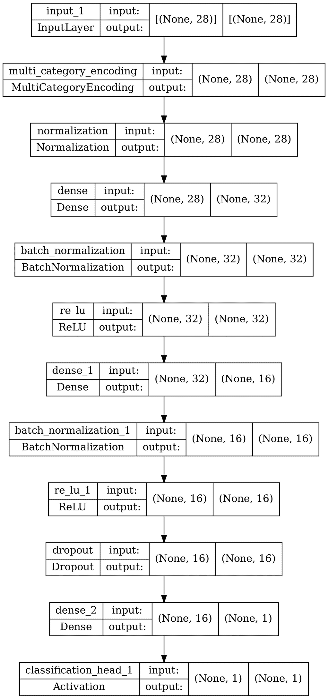

流程图。它通过 Auto Keras 对数据集的分类展示了合适的选项。输入层显示，多类别编码，批量归一化，密集层，ReLU，dropout 和激活。

图 10-21

AutoKeras 发现的 Higgs Boson 数据集的最佳深度学习模型架构

```py
clf = ak.AutoModel(
inputs=input_node, outputs=output_node, overwrite=True,
max_trials=100
)
clf.fit(X_train, y_train, epochs=100)
keras.utils.plot_model(clf.export_model(), show_shapes=True, dpi=400)
Listing 10-37
Arranging the search structure into an AutoModel, fitting, and plotting the best-performing model
```

我们也可以通过简单地交换输出 `ak.ClassificationHead` 为 `ak.RegressionHead` 来将我们的搜索适应到回归问题——即 Ames 住房数据集。在这种情况下，我们还可以传递 `categorical_encoding = True` 以让 AutoKeras 学习最优的分类编码技术（列表 10-38）。

```py
input_node = ak.StructuredDataInput()
output_node = ak.StructuredDataBlock(categorical_encoding=True)(input_node)
output_node = ak.RegressionHead()(output_node)
clf = ak.AutoModel(
inputs=input_node, outputs=output_node, overwrite=True,
max_trials=100
)
clf.fit(x, y, epochs=100)
Listing 10-38
Fitting a Neural Architecture Search campaign on the Ames Housing dataset
```

与我们在“优化数据管道”子节中较早实现的更手动设计相比，AutoKeras 的最佳解决方案表现相当差（尽管在绝对意义上是可以接受的）（图 10-22）。

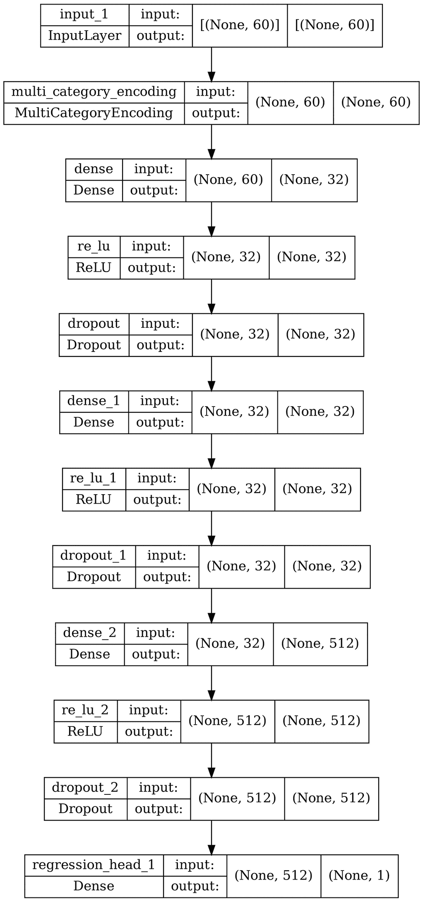

流程图。它通过 Auto Keras 对数据集的分类展示了合适的选项。输入层显示，多类别编码，密集层，ReLU，dropout，以及回归头部 1，无和数字。

图 10-22

AutoKeras 发现的 Ames 住房数据集的最佳深度学习模型架构

AutoKeras 对最优 Ames 住房数据集神经网络搜索的较差性能可以展示以下一个或多个要点：(a) 神经网络并不是适合每个问题（实际上在某些情况下可能表现非常糟糕），(b) 定制的优化分类编码可以对分类特征密集型数据集产生奇迹，(c) 尽管神经网络架构搜索（NAS）光彩夺目，但并不总是有效。

AutoKeras 为多输入和多输出头部提供了许多额外的适配，如果你想要构建像第四章或 5 章中那样的多模态模型，这可能会很有用。对于需要大量劳动投入处理文本数据的情况，这尤其有帮助；AutoKeras 的文本头部和嵌入层几乎不需要手动工作。

一般而言，AutoKeras 和 NAS 既不是完全依赖的工具，也不是完全摒弃的工具。在许多情况下，NAS 发现的架构可能成为高性能的、部分手动设计的网络的灵感来源，这在深度学习研究中是常见的情况。

## 关键点

在本章中，我们讨论了元优化及其在模型开发过程各个组成部分中的应用。

+   在元优化中，一个元模型搜索一组超参数，这些超参数可以优化模型的表现。

+   在贝叶斯优化中，一个概率代理模型既通过采样点更新，也用于指导下一个采样点。

+   元优化可用于优化使用哪种模型、模型超参数（包括模型的架构和训练参数）以及数据编码（建模过程中的其他组成部分）。

+   元优化在表格数据模型中尤其可行，相对而言，因为这些模型通常比计算机视觉或自然语言处理模型要小。

在下一章中，我们将探讨如何有效地安排模型以形成强大的集成和“自感知”系统。
