# 11. 多模型排列

> *民主若要成功，除非那些表达自己选择的人愿意明智地选择。因此，民主的真正保障是教育。*
> 
> ——富兰克林·D·罗斯福，美国总统

单一模型在最终决策中占据主导地位，这有点像独裁。独裁者可能效率很高，但通常成功的决策是由一群思考者共同决定的。*多模型排列*涉及构建模型系统，其中模型以不同的方式相互作用，以产生理论上更全面的结果。

不同的模型在建模任何数据集时提供不同的视角。即使两个模型可能获得相同的性能指标值，它们的*性能分布*——即它们的优势和劣势如何在数据集和新数据的空间中分布——可能不同。一个特定的模型可能更适合某些类型的样本或以粗线条预测而不是细切片来预测。一个模型可能在预测上更加激进和波动，而另一个模型可能在样本中更加保守和谨慎。

而不是仅仅选择一个特定的模型，我们可以选择几个不同的模型来形成一个多模型排列。我们将输入传递给整个系统，而不是单个模型，并将输出汇总以形成由多个不同视角所指导的预测。以精心设计的方式汇总/集成模型可以非常有效，这在之前的章节中已有证明（特别是在第七章的“提升和堆叠神经网络”部分，关于基于树的模型）。

在本章简短的章节中，我们将介绍三种关键的多模型排列技术：平均加权、输入信息加权以及元评估。我们还将讨论元评估，这是一种多模型排列技术，可用于在概率不易获得的情况下估计模型置信度/误差。

## 平均加权

平均加权是一种相当直观且简单的方法，用于汇总多个模型的输出。给定一组模型输出 ，我们可以简单地取输出的平均值以获得汇总结果 （图 11-1）：

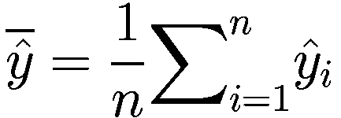

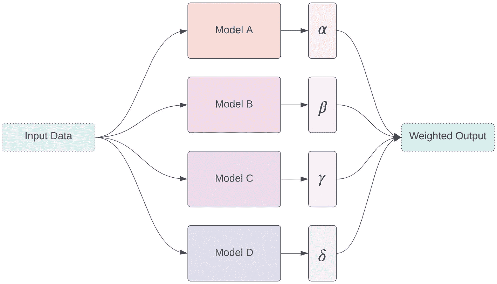

平均加权的流程图。它展示了输入数据与模型 A 的 alpha、B 的 beta、C 的 gamma 和 D 的 delta 以及加权输出。

图 11-1

集成平均

例如，假设我们有一个基于希格斯玻色子数据集训练的随机森林分类器、决策树分类器、梯度提升分类器和神经网络模型。我们可以取它们输出的平均值，并希望获得更好的性能。

然而，几乎总是有些模型比其他模型更好。表现更好的模型应该在输出中具有更高的权重。与其简单地取平均值，我们还可以通过将每个模型与其表示其对最终系统输出影响程度的权重系数相关联来取加权平均。给定一组模型权重 { *w*[1], *w*[2], …, *w*[*n*]} 和模型输出 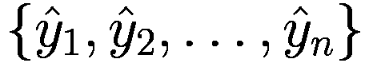，我们可以简单地获得加权平均/线性组合 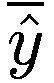（图 11-2）：

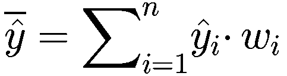

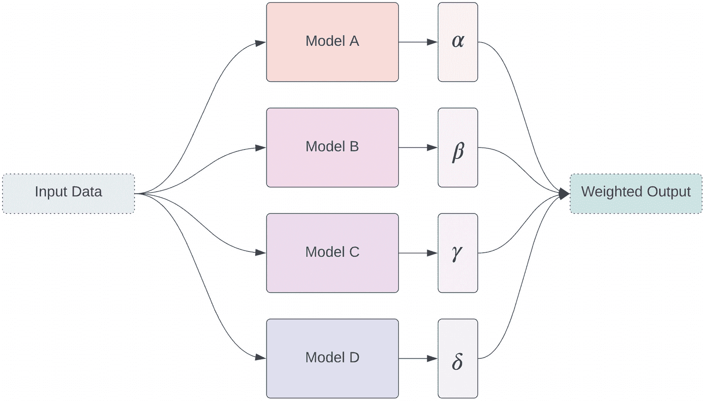

加权平均集成流程图。它展示了输入数据与模型 A 的 alpha、B 的 beta、C 的 gamma 和 D 的 delta 以及加权输出。

图 11-2

加权平均集成

我们可以使用许多方法来找到最佳模型权重集 *w*。如果模型执行回归或二分类问题，我们可以训练一个线性回归模型来预测给定模型输出数据集  的每个样本的真实值。这快速实现和训练。

注意，在验证数据集上训练元模型被认为是良好的实践，尽管这个主题值得讨论。逻辑是这样的：当我们实际上在现实世界环境中部署模型时，我们希望元模型包含在现实世界环境中运行的模型（其中模型可能会出错）的预测，而不是在训练环境中。然而，这可能需要不可行的数据分割，特别是在小数据集的背景下。如果模型没有过拟合，训练一个聚合线性回归模型来预测由训练集输入信息驱动的训练集标签是可接受的。

使用线性回归对于多分类问题不太合适，因为模型为每个样本输出许多可能的类别之一。不能简单地以平凡的方式平均预测。相反，我们可以使用贝叶斯优化框架来找到每个模型预测的最佳权重。

为了演示，让我们考虑 NASA 野火数据集。目标是根据收集到的卫星阅读数据，将卫星观测到的野火分类为四种类型之一——假设为植被火灾、活跃火山、其他静态陆地来源或海上。

让我们先创建一个分类器集成，并在数据集（代码列表 11-1）上对每个分类器进行训练。

```py
from sklearn.linear_model import LogisticRegression
from sklearn.tree import DecisionTreeClassifier
from sklearn.ensemble import RandomForestClassifier, GradientBoostingClassifier, AdaBoostClassifier
from sklearn.neural_network import MLPClassifier
models = {'lr': LogisticRegression(),
'dtc': DecisionTreeClassifier(),
'rfc': RandomForestClassifier(),
'gbc': GradientBoostingClassifier(),
'abc': AdaBoostClassifier(),
'mlpc': MLPClassifier()}
for model in models:
print(f'Fitting {model}')
models[model].fit(X_train, y_train)
Listing 11-1
Creating and individually fitting an ensemble of models
```

为了方便起见，让我们编写一个简单的集成类，该类对所有模型的预测结果赋予相同的权重。我们首先为每个要预测的样本创建一组空白投票。每个模型为它预测的某个样本属于哪个类别添加一个“投票”。然后我们选择获得投票数最多的类别作为最终类别。所有模型具有相同的投票权重；这赋予了它平均集成质量（代码列表 11-2）。

```py
class AverageEnsemble:
def __init__(self, modeldic):
self.modeldic = modeldic
def predict(self, x, num_classes = 4):
votes = np.zeros((len(x), num_classes))
for model in self.modeldic:
predictions = self.modeldic[model].predict(x)
for item, vote in enumerate(predictions):
votes[item, vote] += 1
return np.argmax(votes, axis=1)
ensemble = AverageEnsemble(models)
Listing 11-2
Defining an averaging ensemble
```

如预期的那样，这种集成性能平庸，甚至不如一些独立运行的顶级模型。

我们可以修改我们的`AverageEnsemble`类以接受一组模型权重；而不是通过`+1`对某一类进行投票，我们通过分配的投票权重来增加它。这使得某些模型在确定最终结果时比其他模型具有更广泛的影响（代码列表 11-3）。

```py
class WeightedAverageEnsemble:
def __init__(self, modeldic, modelweights):
self.modeldic = modeldic
self.modelweights = modelweights
def predict(self, x, num_classes = 4):
votes = np.zeros((len(x), num_classes))
for model in self.modeldic:
predictions = self.modeldic[model].predict(x)
for item, vote in enumerate(predictions):
votes[item, vote] += self.modelweights[model]
return np.argmax(votes, axis=1)
Listing 11-3
Defining a weighted average ensemble
```

我们现在可以使用 Hyperopt 来优化`modelweights`集。我们的目标函数创建了一个包含给定模型和参数样本的`WeightedAverageEnsemble`。我们将认为加权集成更好，如果 F1 分数更高。因为这是一个多类问题，但 F1 分数是以二分类的原始形式定义的，我们需要传递一个机制来将 F1 分数应用于多个类别。指定`average='macro'`直观地聚合 F1 分数：它只是每个单独类别的 F1 分数的平均值（代码列表 11-4）。

```py
from hyperopt import hp, tpe, fmin
# define the search space
from hyperopt import hp
space = {model:hp.normal(model, mu = 1, sigma = 0.75) for model in models}
# define objective function
def obj_func(params):
ensemble = WeightedAverageEnsemble(models, params)
return -f1_score(ensemble.predict(X_valid), y_valid,
average='macro')
# perform minimization procedure
from hyperopt import fmin, tpe
best = fmin(obj_func, space, algo=tpe.suggest, max_evals=500)
Listing 11-4
Using hyperoptimization to find the best set of model weights
```

让我们演示如何使用神经网络做类似的事情。考虑以下五个不同的神经网络模型架构：`modelA`、`modelB`、`modelC`、`modelD`和`modelE`（代码列表 11-5）。

```py
modelA = keras.models.Sequential(name='modelA')
modelA.add(L.Input((len(X_train.columns),)))
modelA.add(L.Dense(16, activation='relu'))
modelA.add(L.Dense(16, activation='relu'))
modelA.add(L.Dense(4, activation='softmax'))
modelB = keras.models.Sequential(name='modelB')
modelB.add(L.Input((len(X_train.columns),)))
modelB.add(L.Dense(16, activation='relu'))
modelB.add(L.Dense(16, activation='relu'))
modelB.add(L.Dense(16, activation='relu'))
modelB.add(L.Dense(16, activation='relu'))
modelB.add(L.Dense(4, activation='softmax'))
inp = L.Input((len(X_train.columns),))
dense = L.Dense(16, activation='relu')(inp)
branch1a = L.Dense(16, activation='relu')(dense)
branch1b = L.Dense(16, activation='relu')(branch1a)
branch1c = L.Dense(8, activation='relu')(branch1b)
branch2a = L.Dense(8, activation='relu')(dense)
branch2b = L.Dense(8, activation='relu')(branch2a)
concat = L.Concatenate()([branch1c, branch2b])
out = L.Dense(4, activation='softmax')(concat)
modelC = keras.models.Model(inputs=inp, outputs=out, name='modelC')
modelD = keras.models.Sequential(name='modelD')
modelD.add(L.Input((len(X_train.columns),)))
modelD.add(L.Dense(64, activation='relu'))
modelD.add(L.Reshape((8, 8, 1)))
modelD.add(L.Conv2D(8, (3, 3), padding='same', activation='relu'))
modelD.add(L.Conv2D(8, (3, 3), padding='same', activation='relu'))
modelD.add(L.MaxPooling2D(2, 2))
modelD.add(L.Conv2D(16, (3, 3), padding='same', activation='relu'))
modelD.add(L.Conv2D(16, (3, 3), padding='same', activation='relu'))
modelD.add(L.Flatten())
modelD.add(L.Dense(16, activation='relu'))
modelD.add(L.Dense(4, activation='softmax'))
modelE = keras.models.Sequential(name='modelE')
modelE.add(L.Input((len(X_train.columns),)))
modelE.add(L.Dense(64, activation='relu'))
modelE.add(L.Reshape((64, 1)))
modelE.add(L.Conv1D(8, 3, padding='same', activation='relu'))
modelE.add(L.Conv1D(8, 3, padding='same', activation='relu'))
modelE.add(L.MaxPooling1D(2))
modelE.add(L.Conv1D(16, 3, padding='same', activation='relu'))
modelE.add(L.Conv1D(16, 3, padding='same', activation='relu'))
modelE.add(L.Flatten())
modelE.add(L.Dense(16, activation='relu'))
modelE.add(L.Dense(4, activation='softmax'))
Listing 11-5
Defining five uniquely different neural network model architectures
```

每个模型都有不同的“精神”或“性格”。有些处理输入更为直接，而有些则更为彻底。有些使用一维卷积，有些使用二维卷积，还有些使用非线性。多样性使得集成（图 11-3 至 11-7）更加强大。

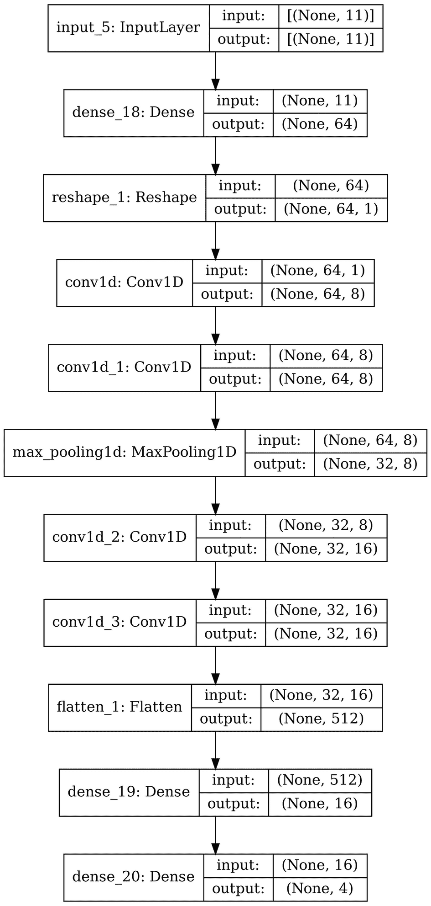

模型 E 设计流程图。它展示了 11 个级别，输入 5 为输入层，密集层 18，重塑 1，一维卷积 1，一维卷积 1，一维最大池化 1，一维卷积 2，一维卷积 3，扁平化 1，密集层 19 和密集层 20。

图 11-7

模型 E 架构

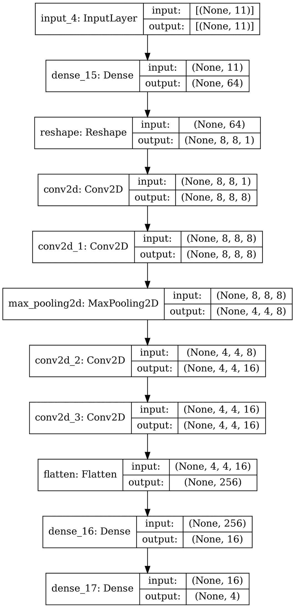

模型 D 设计流程图。它展示了 11 个级别，输入 3 为输入层，密集层 15，重塑，二维卷积 2，二维卷积 1，二维最大池化 2，二维卷积 2，二维卷积 3，扁平化，密集层 16 和密集层 17。

图 11-6

模型 D 架构

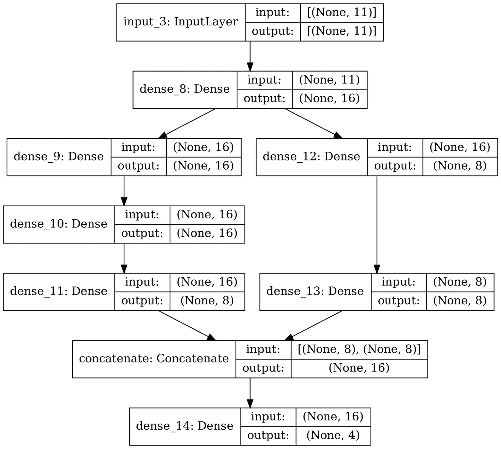

模型 C 设计的流程图。它展示了 7 个级别，输入 3 作为输入层，密集 8，密集 9 和 12，密集 10，密集 11，连接，和密集 14。

图 11-5

模型 C 架构

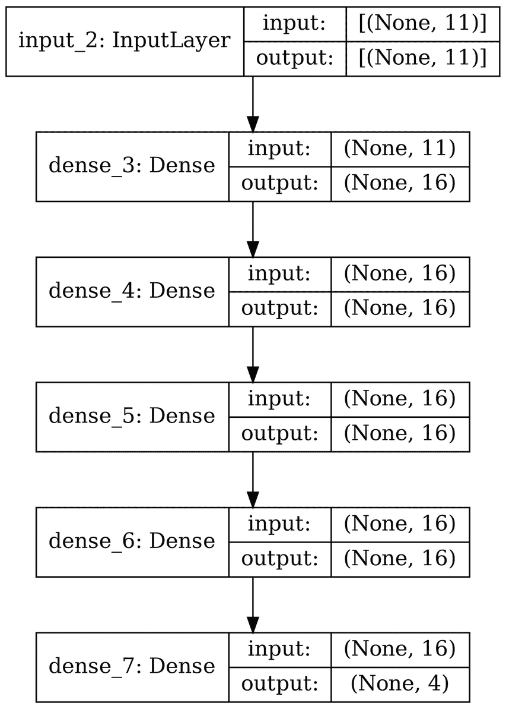

模型 B 设计的流程图。它展示了 6 个级别，输入 2 作为输入层，密集 3，密集 4，密集 5，密集 6，和密集 7。

图 11-4

模型 B 架构

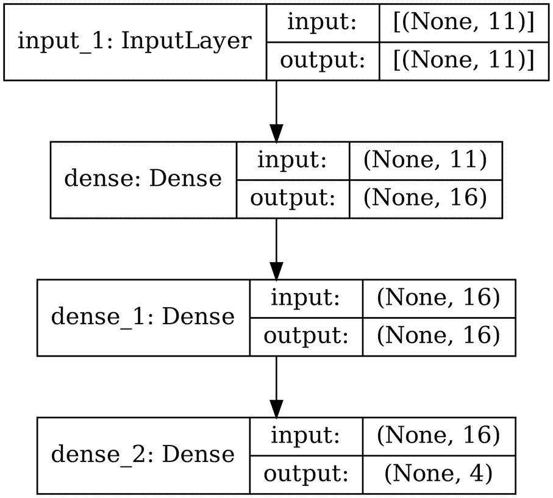

模型 A 设计的流程图。它展示了 4 个级别，输入 1 作为输入层，密集，密集 1，和密集 2。

图 11-3

模型 A 架构

列表 11-6 展示了训练这些模型的过程。

```py
models = {'modelA': modelA,
'modelB': modelB,
'modelC': modelC,
'modelD': modelD,
'modelE': modelE}
for model in models:
models[model].compile(optimizer='adam',
loss='sparse_categorical_crossentropy',
metrics='accuracy')
models[model].fit(X_train, y_train, epochs=30)
Listing 11-6
Fitting each model in the ensemble
```

由于神经网络输出概率（与 scikit-learn 模型中使用的表示类别的序数整数相反），我们只需通过加权因子缩放概率并添加预测概率，选择“连续投票”最高的类别作为最终类别（列表 11-7）。

```py
class WeightedAverageEnsemble:
def __init__(self, modeldic, modelweights):
self.modeldic = modeldic
self.modelweights = modelweights
def predict(self, x, num_classes = 4):
votes = np.zeros((len(x), num_classes))
for model in self.modeldic:
predictions = self.modeldic[model].predict(x)
votes += self.modelweights[model] * predictions
return np.argmax(votes, axis=1)
Listing 11-7
Defining a weighted average ensemble adapted for probabilistic neural network outputs
```

我们的优化过程看起来与之前相似（列表 11-8）。

```py
# define the search space
from hyperopt import hp
space = {model:hp.normal(model, mu = 1, sigma = 0.75) for model in models}
# define objective function
def obj_func(params):
ensemble = WeightedAverageEnsemble(models, params)
return -f1_score(ensemble.predict(X_valid), y_valid,
average='macro')
# perform minimization procedure
from hyperopt import fmin, tpe
best = fmin(obj_func, space, algo=tpe.suggest, max_evals=500)
Listing 11-8
Optimizing the best weighting for a neural network ensemble
```

然而，因为我们正在处理神经网络——高度通用的计算结构——我们也可以使用其他方法。例如，一种方法是将所有这些模型集成到一个大块中。为了按一定数量加权/乘以每个模型的预测，我们将使用一点“作弊”并应用一个 1 长度的卷积，这会将给定序列中的每个元素乘以相同的值（假设禁用了偏差）。之后，我们将简单地添加每个缩放后的模型预测，然后通过 softmax，使得完整链接的模型架构的输出仍然是一组有效的类别概率（列表 11-9，图 11-8）。

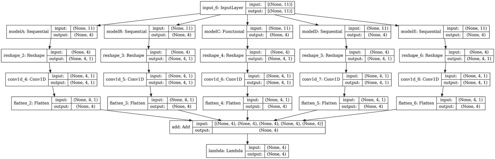

元模型设计的流程图。它展示了模型 A 和 B 的顺序，模型 C 的功能，模型 D 和 E 的顺序，输入 6 作为输入层，每个模型有 3 个级别连接到加和 lambda 的级别。

图 11-8

将每个模型组合在一起并自动确定权重的元模型架构

```py
for model in models:
models[model].trainable = False
inp = L.Input((len(X_train.columns),))
mergeList = []
for model in models:
modelOut = modelsmodel
reshape = L.Reshape((4, 1))(modelOut)
scale = L.Conv1D(1, 1, use_bias=False)(reshape)
flatten = L.Flatten()(scale)
mergeList.append(flatten)
concat = L.Add()(mergeList)
softmax = L.Softmax()(concat)
metaModel = keras.models.Model(inputs=inp, outputs=softmax)
Listing 11-9
An alternative: rearranging each of the models as a fixed subcomponent of a larger meta-model architecture
```

另一种方法是将每个输出的联合轴上的输出连接起来，并在输出的每个维度上应用时间分布的密集层。

如果你调用`model.summary()`，你会发现总参数数是 22,326；其中 22,311 个不可训练，因为它们属于`modelA`，`modelB`，`modelC`，`modelD`或`modelE`。剩下的五个可训练参数是每个模型的输出权重。

调整是标准的（列表 11-10）。

```py
metaModel.compile(optimizer='adam',
loss='sparse_categorical_crossentropy',
metrics=['accuracy'])
metaModel.fit(X_train, y_train, epochs=10,
validation_data=(X_valid, y_valid))
Listing 11-10
Compiling and fitting the meta-model
```

这种设计的优势在于，我们可以通过解冻每个模型并训练整个架构来进一步优化每个模型之间的权重关系，从而进行一些更精细的调整（代码列表 11-11）。

```py
for model in models:
models[model].trainable = True
metaModel.fit(X_train, y_train, epochs=3,
validation_data=(X_valid, y_valid))
Listing 11-11
Unfreezing each component and fine-tuning
```

这可以是一个从广泛、多样化的候选模型集合中构建有效大型网络的好策略。

## 输入信息权重

平均权重使我们能够了解哪些模型通常更可靠，哪些模型不太可靠。更可靠的模型理想情况下应给予更高的权重，而不太可靠的模型则给予较低的权重。然而，某些模型可能专门预测少数案例；然而，由于它们的整体表现较差，平均权重将把这些“专家”模型标记为通常不可靠，并将它们的预测贡献降低到所有样本中（即使它们在预测它们“专门化”的样本案例时也是如此）。

为了解决这个问题，我们需要使用更复杂的权重形式：*输入信息权重*。在输入信息权重中，特定的权重配置不是静态的，而是依赖于接收到的输入。这样，如果一个特定的模型或一组模型在某个特定输入上专门化，其贡献将理想地给予更高的权重（在其他输入上表现不佳时给予较低的权重）。

这种方案最适合神经网络，因为神经网络能够捕捉模型性能的“专业化”或性能分布与某些类型输入之间的复杂关系。让我们创建一个权重模型，它接收一个输入并输出多个输出，每个模型一个（代码列表 11-12）。

```py
inp = L.Input((len(X_train.columns),))
dense1 = L.Dense(8, activation='relu')(inp)
dense2 = L.Dense(8, activation='relu')(dense1)
dense3 = L.Dense(8, activation='relu')(dense2)
outLayers = []
for model in models:
outLayers.append(L.Dense(1, activation='sigmoid')(dense3))
weightingModel = keras.models.Model(inputs=inp, outputs=outLayers)
Listing 11-12
An input-informed weighter
```

这种权重模型可以纳入元模型：每个模型的输出乘以权重模型的相应权重（该权重模型本身根据输入预测权重）（代码列表 11-13，图 11-9）。

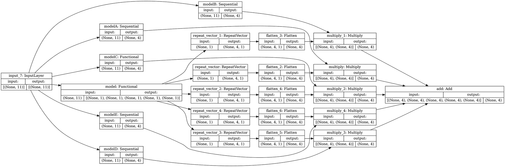

输入集成模型设计的流程图。它展示了输入层为输入 7，以及模型 A、E、D 的顺序和模型 C 的功能。

图 11-9

一个输入信息集成模型架构。

```py
inp = L.Input((len(X_train.columns),))
weights = weightingModel(inp)
finalVotes = []
for weight, model in zip(weights, models):
models[model].trainable = False
modelOut = modelsmodel
expand = L.Flatten()(L.RepeatVector(num_classes)(weight))
scale = L.Multiply()([modelOut, expand])
finalVotes.append(scale)
out = L.Add()(finalVotes)
metaModel = keras.models.Model(inputs=inp, outputs=out)
Listing 11-13
Building the weighting model into the meta-model architecture
```

在深度学习研究文献中，类似技术的良好例子可以在 Melody Y. Guan、Varun Gulshan、Andrew M. Dai 和 Geoffrey E. Hinton 合著的论文“Who Said What: Modeling Individual Labelers Improves Classification”中找到^(1)。Guan 等人解决了建模专家众包注释的问题。在这种数据收集方案中，一组专业数据由多个专家注释员进行标注。这种情况经常发生，例如，在建模医学数据集时，几个医疗专业人员可能会标注单个样本。然而，我们有时可能会遇到不同注释员对同一样本标签的不一致或差异。

处理众包注释中的不一致的简单且主导方法是以某种方式聚合不同的注释并建模聚合注释。例如，如果五位医生将诊断的严重性从 0 到 100 评分分别为 {88, 97, 73, 84, 86}，则该样本的整体注释将被列出为 85.6。然后，模型会被训练来预测该样本的诊断严重性为 85.6。

Guan 等人不是预测特定样本的每个专家的注释，而是继续我们的五位医生示例，模型会被训练来联合预测诊断 {88, 97, 73, 84, 86} 中的每一个。然后，模型学习每个模型的最佳平均权重，类似于我们之前关于模型预测加权平均的讨论。Guan 等人还设计并训练了一个更复杂的模型，其中权重是输入信息驱动的。最终，这项研究发现——引用自论文本身——聚合模型注释优于对聚合注释的建模。这正是元建模的力量所在（图 11-10）！

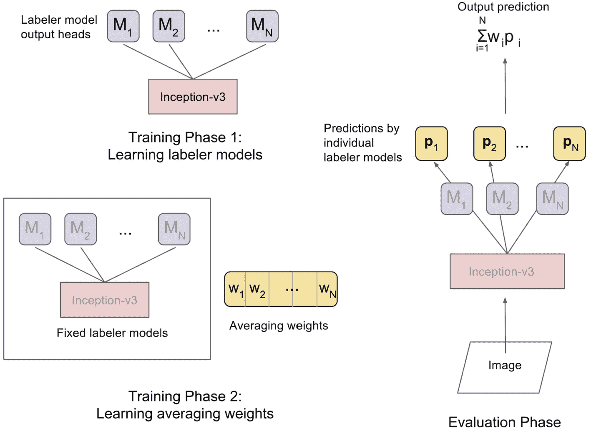

3 个插图。他们展示了第一阶段的学习标签器模型，第二阶段的学习平均权重，以及单个标签器模型的预测评估阶段。

图 11-10

多模型集成不同学习阶段/类型。来自 Guan 等人的“Who Said What: Modeling Individual Labelers Improves Classification”

## 元评估

我们可以使用多模型排列的原则和思想来理解一个用于现实世界部署机器学习或深度学习模型的有用技术：元评估。

对于某些问题集，模型置信度是显而易见的，因为它固有地嵌入在算法设计中。例如，逻辑回归直接给出模型对特定输入属于特定类别的“置信度”估计。在分类问题上训练的神经网络直接返回输入属于某个类别的概率。然而，在许多其他情况下，评估模型置信度和/或误差并不那么清晰。

注意

在许多情况下，由于分类输出层中使用的 softmax 层，分类网络的输出类概率甚至不提供关于网络预测的置信度/可信度的有意义信息。这迫使所有输出概率之和为 1。一种专门用于分类网络的解决此问题的技术是引入一个额外的类别，代表“以上皆非”，该类别可以训练在原始数据集中不属于任何类别的图像上。

在模型开发过程中，我们通常只关心聚合级别的模型错误。我们希望最小化模型在整个数据集上的聚合错误（例如，均方误差、平均二元交叉熵等）。然而，当模型部署时，它们是按样本逐个操作的。了解模型对每个用于推理的样本的预测可能是正确还是错误，以及错误程度变得很重要。这可以用来衡量根据模型预测采取行动的方式。例如，如果一个模型给出诊断，表明患者确实患有癌症，我们希望了解模型对这个样本案例的具体置信度，而不仅仅是模型具有这样的错误率的一般知识。

列表 11-14 定义了一个架构（如图 11-11 所示），它根据原始输入和预测输出估计预测的错误。

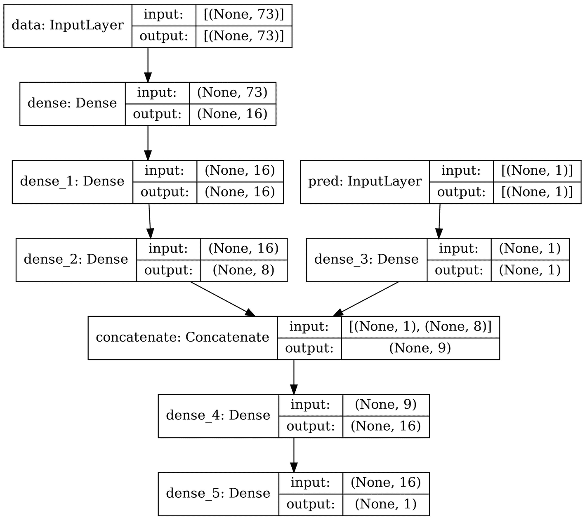

元模型设计的流程图。它展示了 7 个级别，数据作为输入层，密集层，密集 1、2 和 3 层，连接层，密集 4 层和密集 5 层。

图 11-11

元建模架构

```py
dataInput = L.Input((len(X_train.columns),), name='data')
dataDense1 = L.Dense(16, activation='relu')(dataInput)
dataDense2 = L.Dense(16, activation='relu')(dataDense1)
dataDense3 = L.Dense(8, activation='relu')(dataDense2)
predInput = L.Input((1,), name='pred')
predDense1 = L.Dense(1, activation='relu')(predInput)
combine = L.Concatenate()([predDense1, dataDense3])
preOut = L.Dense(16, activation='relu')(combine)
out = L.Dense(1, activation='relu')(preOut)
metaEval = keras.models.Model(inputs = [dataInput, predInput],
outputs = out)
Listing 11-14
A meta-model error estimator
```

现在，我们可以对错误进行训练。在这种情况下，我们希望给模型提供原始输入和预测值；目标是预测的绝对误差（见列表 11-15）。

```py
preds = model.predict(X_valid)
metaEval.compile(optimizer='adam', loss='mse')
history = metaEval.fit([X_valid, preds],
np.abs(preds - y_valid),
epochs=1000,
verbose=0)
Listing 11-15
Training the meta-evaluation model on the prediction residuals
```

在预测阶段，您可以通过将预测（连同原始输入）通过元评估模型传递，来了解您对单个预测可以信任的程度。

这种技术与在提升集成中使用的残差学习技术相似（参见第一章关于梯度提升算法，以及第七章关于 GrowNet）。

用于大型神经网络的另一种技术是迫使神经网络既要做出正式预测，同时还要估计这种预测的错误。通过这种方法，错误估计是由模型“有意识地”根据形成预测所使用的内部状态进行的。然而，在训练初期（例如，改变多任务自编码器的*α*值）严重降低错误估计输出的重要性是很重要的，以确保网络达到一个令人满意的性能点，这样估计错误是可行且有意义的。

## 关键点

在本章中，我们讨论了各种多模型排列方法。

+   多模型排列提供了一套组合多个模型的工具。这可以使系统更加鲁棒、共同知情和自我意识。

+   在最简单的形式中，集成中所有模型的输出可以平均。然而，某些模型可能比其他模型表现更好。加权平均，其中每个模型的预测都与一个权重相关联，可以捕捉到模型集成中相对性能/可信度的变化。基于输入的信息加权使得这种加权依赖于输入的类型，以适应模型在特定类型输入上的专业化。所有加权都可以通过元优化来学习，或者如果所有模型都是神经网络，则可以固定并排列成一个元神经网络。

+   元评估是一个框架，用于预测模型在每个样本上的误差。这允许对模型的可信度和在实际部署中的信心进行表征。

在本书的最后一章，我们将探讨深度学习的可解释性。
