# 12. 神经网络可解释性

> 我一直认为，人的行为是他们思想的最佳解释者。
> 
> ——约翰·洛克，政治理论家

神经网络是强大的工具，可以用来解决一系列困难的表格数据建模挑战。然而，与线性回归或决策树等其他表格数据建模的替代方案相比，它们的可解释性不那么明显——从学习参数中可以或多或少直接读取模型的数据处理过程。对于神经网络架构来说，情况并非如此，因为它们显著更复杂，因此更难以解释。同时，解释在生产中使用的任何模型也很重要，以验证它没有使用廉价的技巧或其他剥削性措施，这可能导致生产中的不良行为。

在本章中，我们将简要探讨三种解释神经网络的技巧：SHAP、LIME 和激活最大化。前两种技巧是*模型无关的*，这意味着它们可以用来解释任何模型的决策，而不仅仅是神经网络。最后一种——激活最大化——只能用于神经网络。一个有见地的可解释性分析会考虑多种不同的技巧。

## SHAP

SHAP，代表 SHapley Additive exPlanations（^(1）），是一个流行的模型可解释性框架。该框架基于博弈论中的 Shapley 值概念，该概念量化了每个玩家在协作游戏中对整体价值的贡献。

例如，假设你正在尝试分析一个三人篮球队（可能是 3 对 3 球）的球员。三人团队的整体奖励很容易获得——它只是团队得分与对方得分之差，或者他们在篮筐中比对方多进的球数。然而，单个球员的贡献量化起来并不简单。我们可以通过球员得分来计算每个球员的个人贡献，但这掩盖了防守球员阻止对方投篮的作用。或者，也许球员 B 只有在球员 C 在场时表现良好，或者球员 A 和球员 C 有互补的表现关系（只有其中一人能表现良好；另一人表现不佳）。最终，由于现实世界中协作游戏常常表现出的复杂相互依赖性，仅从原始游戏数据本身很难估计每个球员的贡献（图 12-1）。

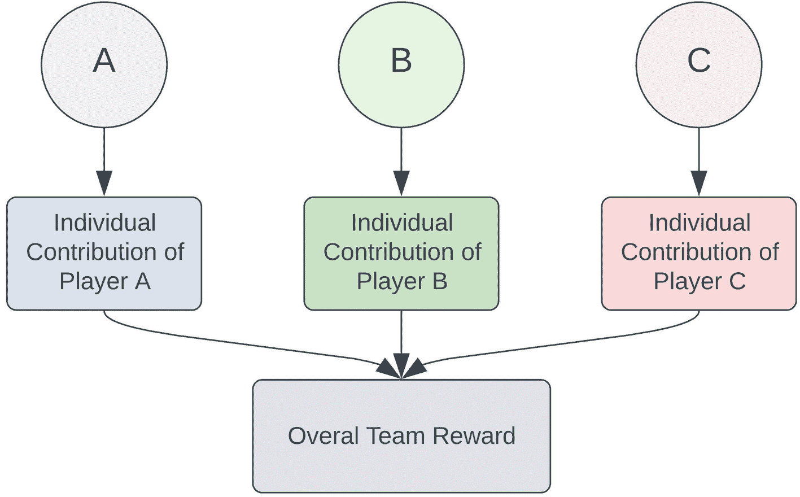

一个展示球员 A、B 和 C 个人贡献的图示，这些贡献增加了整体团队奖励。

图 12-1

一个游戏方案图，每个玩家各自贡献一个未知的个人贡献，以获得已知的整体团队奖励

Shapley 值的关键思想是，我们必须考虑所有可能的玩家组合，以确定任何单个玩家的重要性。在三个玩家的案例中，有七种组合：

+   一名玩家

    +   {玩家 A}

    +   {玩家 B}

    +   {玩家 C}

+   两名玩家

    +   {玩家 A, B}

    +   {玩家 B, C}

    +   {玩家 A, C}

+   三名玩家

    +   {玩家 A, B, C}

作为参考，如果我们有五名玩家，我们需要 31 种组合：

+   一名玩家

    +   {玩家 A}

    +   {玩家 B}

    +   {玩家 C}

    +   {玩家 D}

    +   {玩家 E}

+   两名玩家

    +   {玩家 A, B}

    +   {玩家 A, C}

    +   {玩家 A, D}

    +   {玩家 A, E}

    +   {玩家 B, C}

    +   {玩家 B, D}

    +   {玩家 B, E}

    +   {玩家 C, D}

    +   {玩家 C, E}

    +   {玩家 D, E}

+   三名玩家

    +   {玩家 C, D, E}

    +   {玩家 B, D, E}

    +   {玩家 B, C, E}

    +   {玩家 B, C, D}

    +   {玩家 A, D, E}

    +   {玩家 A, C, E}

    +   {玩家 A, C, D}

    +   {玩家 A, B, E}

    +   {玩家 A, B, C}

+   四名玩家

    +   {玩家 A, B, C, D}

    +   {玩家 A, B, C, E}

    +   {玩家 A, B, D, E}

    +   {玩家 A, C, D, E}

    +   {玩家 B, C, D, E}

+   五名玩家

    +   {玩家 A, B, C, D, E}

（数学倾向的读者会注意到，一个包含*n*个元素的集合的非空子集的数量是 2^(*n*) - 1。）

然后，我们评估每个团队的性能。我们让玩家 A 与其他团队比赛并评估其表现，然后是玩家 B，接着是玩家 C，然后是包括玩家 A 和 B 的两名玩家的团队，依此类推。最后，我们收集了大量关于不同玩家子集获得奖励的数据。

这个数据集的重要属性是我们可以在几个不同的环境中比较当某些玩家存在或不存在时获得的奖励差异。例如，如果我们想评估玩家 A 的个人贡献或重要性，我们可以在以下环境中汇总整体团队奖励的增加：

+   在集合{玩家 B}和集合{玩家 A, B}之间

+   在集合{玩家 C}和集合{玩家 A, C}之间

+   在集合{玩家 B, C}和集合{玩家 A, B, C}之间

这些构成了玩家 A 对游戏的*边际贡献*。然后，我们将这些边际贡献按照对整体问题的相关性进行加权，并求和形成玩家 A 的 Shapley 值。我们可以对其他玩家重复同样的操作，以获得其他玩家的 Shapley 值。

在机器学习中，特征是玩家，游戏奖励是模型的得分！我们希望通过随机组合特征并测量每个特征的边际贡献来理解哪些特征影响了模型在准确建模数据集时的性能。请注意，这意味着计算 SHAP 值可能很昂贵，因为在其纯形式下，需要训练 2^(*n*) - 1 个模型，其中*n*是特征的数量。幸运的是，`shap` Python 库有一些技巧可以提高计算特征相关性的效率。

我们可以通过导入`shap`并使用`shap.initjs()`初始化用于可视化的 JavaScript 后端来开始；这是生成许多可视化所必需的（这些依赖于 Jupyter Notebook 内部的 JavaScript）。可以使用`pip install shap`安装`shap`（代码清单 12-1）。

```py
import shap
shap.initjs()
Listing 12-1
Importing and initializing SHAP
```

为了演示，我们将直接从 SHAP 加载成人人口普查数据集，这是一个包含人口信息（通常非常适合有趣的解释性分析）的预处理准虚拟数据集（代码清单 12-2）。

```py
x, y = shap.datasets.adult()
y = y.astype(np.int32)
from sklearn.model_selection import train_test_split as tts
X_train, X_valid, y_train, y_valid = tts(x, y, train_size = 0.8,
random_state = 42)
Listing 12-2
Splitting the dataset into training and validation datasets
```

我们将使用 AutoKeras 快速在这个数据集上找到一个不错的模型，并将 Keras 神经网络导出到一个名为`model`的变量中（代码清单 12-3）。

```py
import autokeras as ak
input_node = ak.StructuredDataInput()
output_node = ak.StructuredDataBlock(categorical_encoding=True)(input_node)
output_node = ak.ClassificationHead()(output_node)
clf = ak.AutoModel(
inputs=input_node, outputs=output_node,
overwrite=True, max_trials=20
)
clf.fit(X_train, y_train, epochs=50)
model = clf.export_model()
Listing 12-3
Finding a good neural network architecture automatically with AutoKeras
```

为了生成特征相关性值，我们将使用`shap.KernelExplainer`。这是`shap`中最标准的模型无关对象。它接受两个强制参数：一个返回给定输入的模型预测的函数，以及一组数据来评估模型在数据上的性能。在代码清单 12-4 中，我们在数据集的前 100 行上初始化了核解释器。

```py
def f(x):
return model.predict(x).flatten()
explainer = shap.KernelExplainer(f, X_valid.iloc[:100,:])
Listing 12-4
Using the generic agnostic kernel explainer
```

一旦初始化了 SHAP 核解释器对象，我们就可以用它来解释模型是如何对一个单个样本做出预测的。代码清单 12-5 演示了*力图*可视化（如图 12-2 所示），其中各种特征被显示为向量，展示了它们对目标的影响方向和大小（代码清单 12-5，图 12-2）。

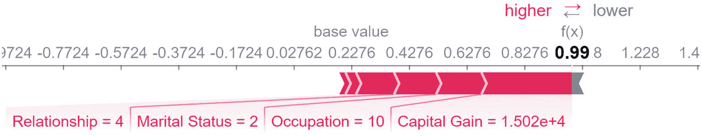

基准线的插图从低到高编号，带有小数值，f(x)的值被突出显示为 0.99。在基准线以下，显示关系、婚姻状况、职业和资本收益的值。

图 12-2

使用样本在`i = 100`处生成的力图

```py
i = 100
shap_values = explainer.shap_values(X_valid.iloc[i], nsamples=500)
shap.force_plot(explainer.expected_value,
shap_values,
X_valid.iloc[i,:])
Listing 12-5
Using the generic kernel explainer to generate force plots for single samples
```

通过改变要解释的样本选择的索引 i，我们可以获得力图来解释模型是如何接近其他样本的。力图显示了不同特征是如何加权和朝哪个方向起作用的。图 12-3 演示了一个模型输出概率非常接近 0 的例子。在这种情况下，没有因素在正方向起作用。图 12-4 演示了一个特征值对目标输出既有正面又有负面影响的例子。

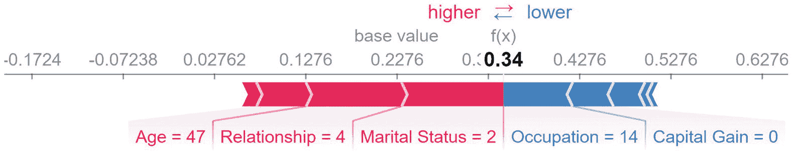

基准线的插图从低到高编号，带有小数值。f(x)的值被突出显示为 0.34。在基准线以下，显示年龄、关系、婚姻状况、职业和资本收益的值。

图 12-4

使用样本在`i = 102`处生成的力图

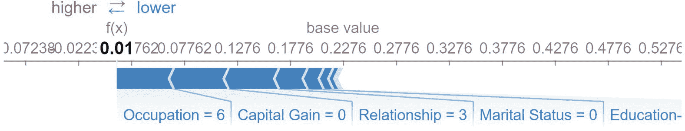

基准线的插图从低到高编号，带有小数值。f(x) 的值被突出显示为 0.01。在基准线以下，显示职业、资本收益、关系、婚姻状况和教育等信息。

图 12-3

使用样本 `i = 101` 生成的力图

此外，SHAP 允许你在一个方便的交互式可视化中一起查看多个样本的多个力图。列表 12-6 展示了生成多个力图的代码（图 12-5）。

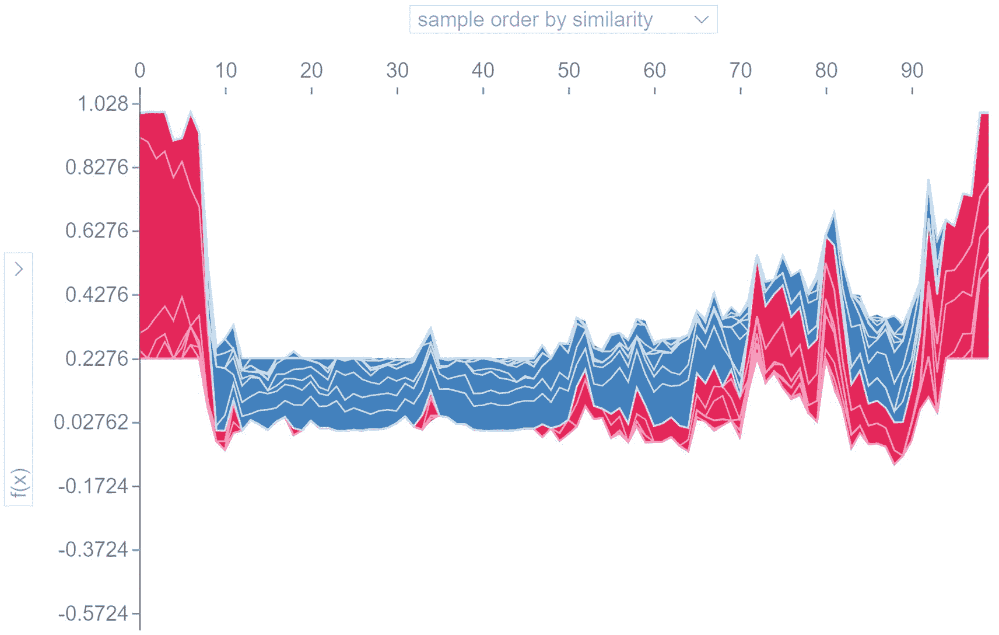

按相似度排序的样本区域图。显示两个阴影样本以波动趋势。

图 12-5

聚合力图可视化

```py
shap.force_plot(explainer.expected_value, shap_values,
X_valid.iloc[:100])
Listing 12-6
Generating a view of multiple force plots
```

这是一个交互式应用程序：你可以通过悬停在一条水平线上来查看特定样本的力图和负责的特征（图 12-6）。

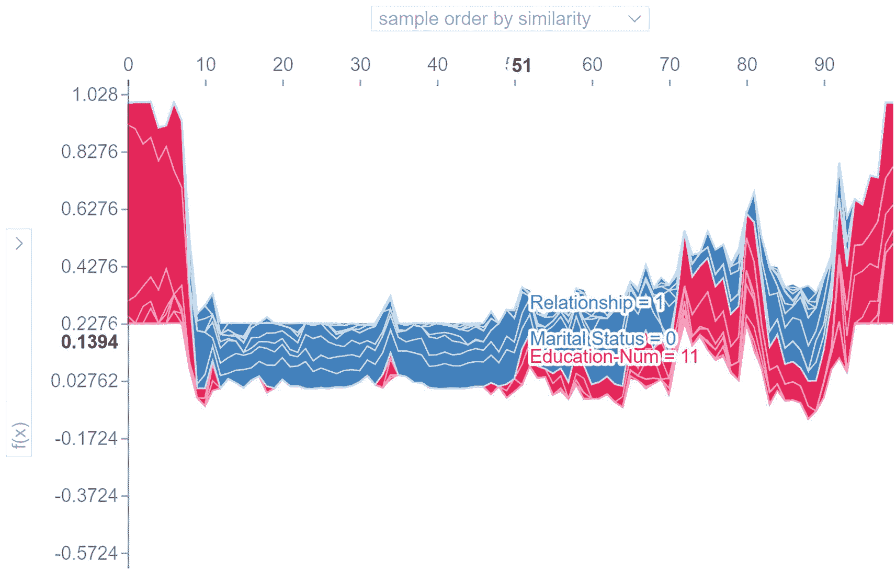

按相似度排序的样本区域图。x 轴和 y 轴上突出显示的两个数字是 51 和 0.1394。两个阴影样本以波动趋势显示。显示关系、婚姻状况和教育编号的值。

图 12-6

由于 SHAP 在笔记本中生成嵌入的 JS 可视化，你可以悬停并查看每个样本的最显著影响因素

另一种清晰的可视化是将多个不同样本的每一列的 SHAP 值绘制出来。这使我们能够理解每个特征对预测输出的影响分布（列表 12-7，图 12-7）。

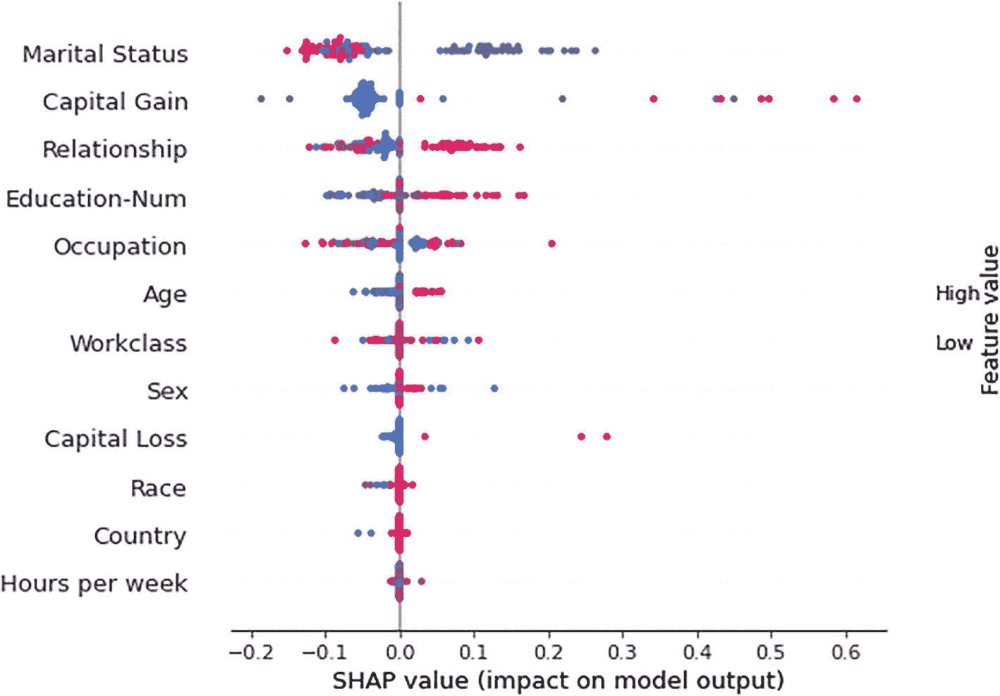

不同样本的 SHAP 值对模型输出的影响图

图 12-7

另一种可视化 SHAP 值的方法，帮助我们理解特征重要性和影响力的分布

```py
shap.summary_plot(shap_values, X_valid.iloc[:100])
Listing 12-7
Plotting out the importances/values of each column
```

核心解释器是模型无关的，这意味着它仅根据输入和输出解释模型的行为。也就是说，它将模型视为一个黑盒函数，因此可以应用于任何模型。

SHAP 还实现了针对特定模型的解释器，这些解释器可以“查看”模型内部来计算 SHAP 值，这些值不仅基于预测输出，还包括用于得出预测的内部参数和过程。例如，`TreeExplainer` 可以通过“读取”学习到的标准应用于基于树的模型（例如，`sklearn.tree.DecisionTree`）。SHAP 提供了 `GradientExplainer`，通过利用其可微性来提供对神经网络的更好解释。

列表 12-8 展示了在 Mice 蛋白质表达数据集上训练的简单神经网络的构建。

```py
model = keras.models.Sequential()
model.add(L.Input((len(X_train.columns),)))
for i in range(3):
model.add(L.Dense(32, activation='relu'))
for i in range(2):
model.add(L.Dense(16, activation='relu'))
model.add(L.Dense(8, activation='softmax'))
model.compile(optimizer='adam', loss='sparse_categorical_crossentropy',              metrics=['accuracy'])
model.fit(X_train, y_train-1, epochs=100, verbose=0)
Listing 12-8
Training and fitting a model on the Mice Protein Expression dataset
```

由于神经网络相当复杂，因此不仅解释整个模型的输出，而且解释中间层的输出通常很有价值。回想一下我们在第四章中进行的类似分析，当时我们可视化学习到的卷积核如何卷积特征图，以了解哪些特征被增强，哪些特征被减弱。为了将输入与某一层的输出联系起来，我们需要构建一个子模型。

让我们从解释最后一个输出层开始，该层有八个节点用于将十个类别之一进行分类。我们索引所需的层，创建一个 `submodel` 将输入链接到该层，并将模型以及特征数据集传递给 `GradientExplainer`（列表 12-9）。（在这种情况下，子模型构建有些冗余，因为它与模型相同。然而，这种公式允许我们将梯度解释推广到其他中间层。）

```py
layer = -1
submodel = keras.models.Model(inputs=model.input,
outputs=model.layers[layer].output)
explainer = shap.GradientExplainer(submodel, np.array(X_train))
Listing 12-9
Using the SHAP gradient explainer to explain a subnetwork
```

我们可以从特定数据子集的 explainer 中获取 SHAP 值（列表 12-10）。

```py
values = explainer.shap_values(np.array(X_train)[:200])
values = np.array(values)
Listing 12-10
Obtaining SHAP values from the gradient explainer
```

调用 `values.shape` 返回 `(8, 200, 80)`。您可以将其理解为格式 `(# neurons in layer, # samples evaluated across, # features)`。SHAP 告诉我们每个特征对每个样本的每个输出的影响程度。这包含大量信息！

您可以从这些 SHAP 值中得出许多有意义的见解。一个明显的聚合方法是测量所有样本和输出中每个特征的均值 SHAP 值（列表 12-11，图 12-8）。

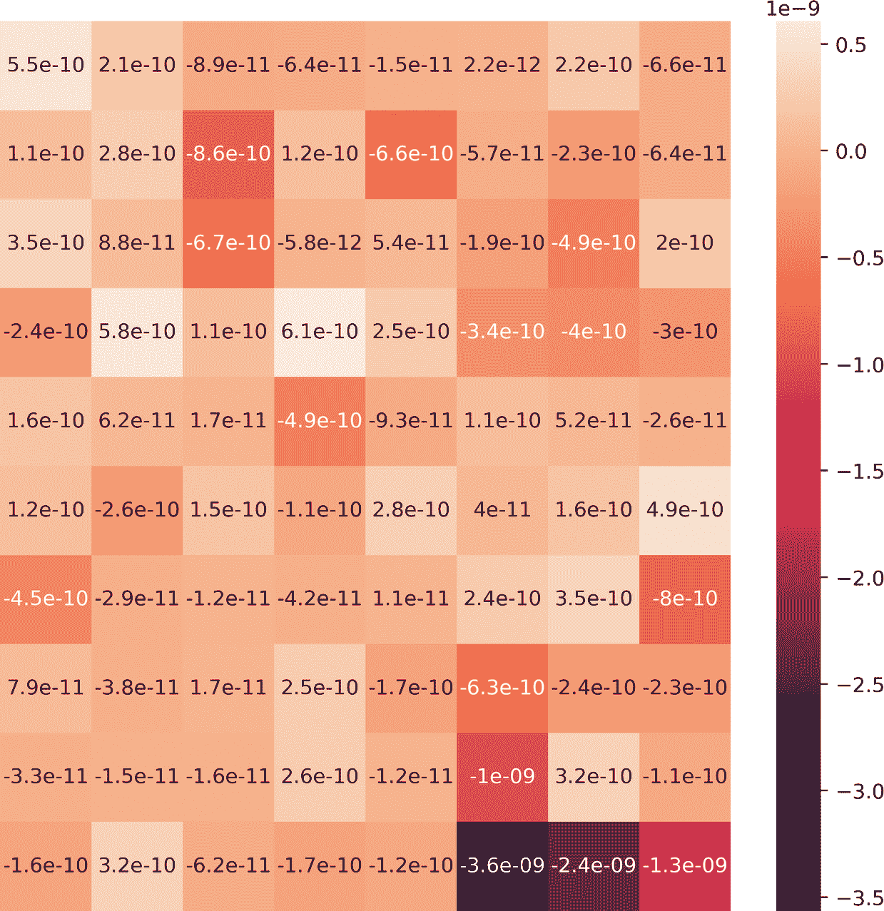

各种特征的均值 S H A P 值的示意图。阴影刻度表示从顶部开始的负 0.5 到负 3.5 的数值。

图 12-8

使用均值 SHAP 计算的每个特征相对于最后一个输出层的重要性

```py
mean_importance = np.mean(values.reshape(-1, values.shape[-1]), axis=0)
plt.figure(figsize=(8, 8), dpi=400)
sns.heatmap(mean_importance.reshape((10, 8)), annot=True,
xticklabels=[], yticklabels=[])
plt.show()
Listing 12-11
Taking the mean SHAP value of each sample across all samples and outputs
```

或者，我们可以可视化每个特征对倒数第二层（图 12-9）和倒数第三层（图 12-10）输出的整体影响，以了解内部网络计算的动态。

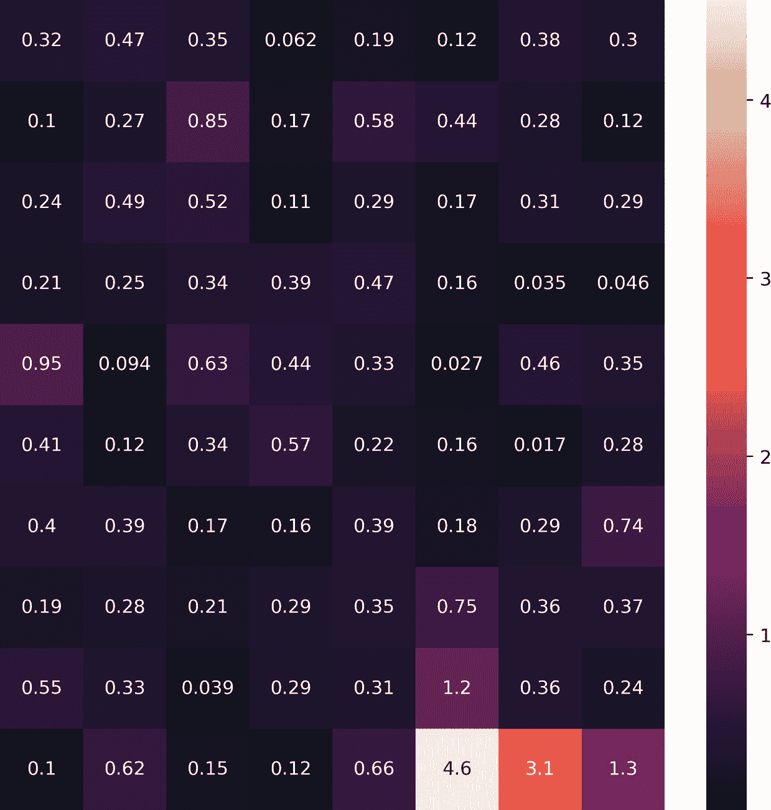

各种特征的均值 S H A P 值的示意图。阴影刻度表示从底部开始的负 1 到负 4 的数值。

图 12-10

使用均值 SHAP 计算的每个特征相对于倒数第三层输出的重要性

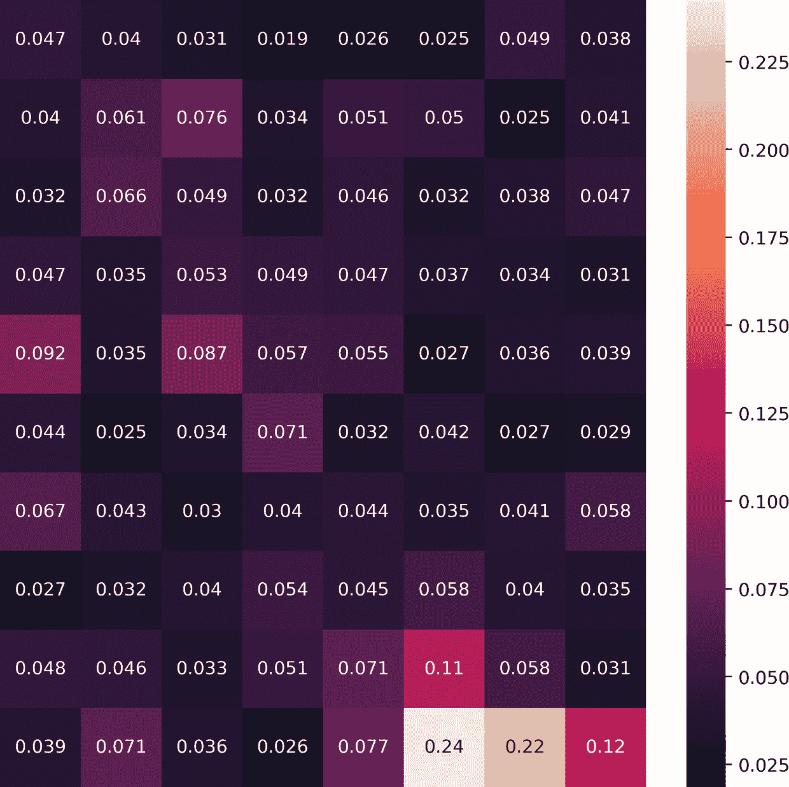

各种特征的均值 S H A P 值的示意图。阴影刻度表示从顶部开始的负 0.225 到负 0.025 的数值。

图 12-9

使用均值 SHAP 计算的每个特征相对于倒数第二层输出的重要性

我们还可以计算所有输出和样本的 SHAP 值的标准差，以了解特征影响的变异性（图 12-11）。

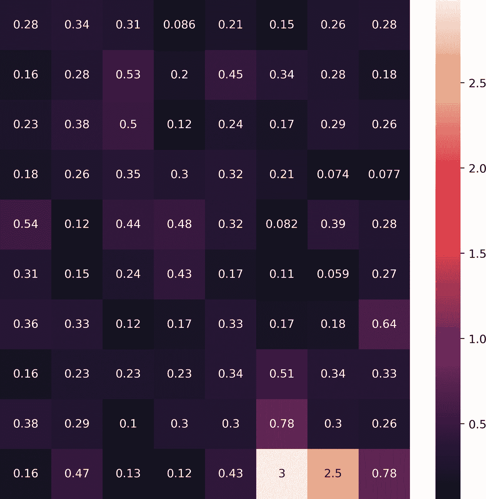

标准偏差图展示了输出层中各种特征的 S H A P 值。阴影刻度从底部开始，表示从负 0.5 到负 2.5 的数值。

图 12-11

与最后一个输出层相关的每个特征的 S H A P 值的标准偏差

当然，可以通过隔离特定的特征或一组感兴趣的特征，并跟踪其影响在样本和输出中的变化和/或趋势，进行更精细和详细的分析。SHAP 是一个非常有用的工具，许多新的研究不断推动基于 SHAP 的方法在有用性、效率和信息量方面的边界（尤其是对于深度学习！）。

## LIME

LIME，即局部可解释模型无关解释的缩写，^(2)，是另一种模型解释方法。LIME 与 SHAP 一样，也是模型无关的，它依赖于相同的理念。LIME 将任何机器学习模型解释或近似为一个黑盒函数，然后使用一个局部可解释的模型来解释其行为和预测。

LIME 的理念简单直观。与 SHAP 不同，SHAP 使用不同的特征集，LIME 将其尝试解释的黑盒模型输入不同的样本集。然而，LIME 不是简单地从修改后的数据集的输出中计算特征的重要性，而是生成一个全新的数据集，该数据集由扰动样本及其黑盒模型的预测组成。当 LIME 扰动数据集时，从正态分布中随机选择连续样本；然后对选定的样本执行均值中心化和缩放的反操作。相比之下，对于分类特征，它们通过训练分布进行扰动。然后，在生成的数据集上，LIME 训练一个可解释的模型，该模型根据采样实例与感兴趣实例的邻近度进行加权。正如其名所示，在修改后的数据集上训练的模型不会是全球黑盒函数的良好近似，但它应该在局部范围内准确。在这里，感兴趣的实例是指你希望 LIME 解释的样本，因为它可以解释每个特征如何对样本预测做出贡献。

LIME 与 SHAP 的不同之处在于，LIME 侧重于局部可解释性，解释一个预测的影响，而 SHAP 则更侧重于全局，从整个模型和数据集的角度来解释模型。此外，LIME 有一个名为 SP-LIME 的功能，可以让模型生成一个解释了原始数据集子集的模型，从而对模型有一个全局的理解。以下是 LIME 解释过程的基本概述：

1.  选择一个你想要分析的样本，并让 LIME 解释其预测结果。

1.  基于不同的特征集生成扰动数据集，这些特征集代表数据的一个代表性子集。这些特征的目标将是黑盒模型对这些样本的预测。

1.  样本根据它们与感兴趣实例的距离或接近程度分配权重。

1.  在扰动数据集上训练一个可解释的模型，例如 LASSO 或决策树。LIME 默认使用 Ridge 作为模型，但可以传递任何类似 sklearn 的模型对象。

1.  通过分析模型输出来说明预测。

虽然 LIME 在文本分析和图像识别方面表现出色，但就本书的上下文而言，我们只会探索其应用于表格数据的应用。

LIME 已经在其自己的库中实现。为了保持一致性和比较目的，我们将使用与“SHAP”部分中先前使用的相同数据集。我们可以检索数据集并定义一个 AutoKeras 模型（见清单 12-12），如前所述。

```py
import shap
shap.initjs()
x, y = shap.datasets.adult()
y = y.astype(np.int32)
from sklearn.model_selection import train_test_split as tts
X_train, X_valid, y_train, y_valid = tts(x, y, train_size = 0.8,
random_state = 42)
import autokeras as ak
input_node = ak.StructuredDataInput()
output_node = ak.StructuredDataBlock(categorical_encoding=True)(input_node)
output_node = ak.ClassificationHead()(output_node)
clf = ak.AutoModel(
inputs=input_node, outputs=output_node,
overwrite=True, max_trials=20
)
clf.fit(X_train, y_train, epochs=50)
model = clf.export_model()
Listing 12-12
Retrieving the dataset and fitting an AutoKeras model
```

下面的基本语法用于在清单 12-13 中初始化一个 LIME 可解释对象。

```py
import lime
from lime import lime_tabular
explainer = lime_tabular.LimeTabularExplainer(
training_data=np.array(X_train),
feature_names=X_train.columns,
class_names=["Income  50k"],
mode='classification'
)
Listing 12-13
Initializing the LIME explainable object
```

大多数参数都是自解释的，但可能会对参数“`class_name`”感到困惑。之前显示的是作为 LIME 解释过程中每个类名称传入的字符串列表。根据我们的数据集，对于分类结果为 0，它表示具有那些人口统计特征的个人的年收入少于 50,000 美元，而对于类别 1 则相反。

初始化后，我们可以简单地调用清单 12-14 中显示的`explain_instance`方法，让 LIME 完成所有繁重的计算和解释工作。

```py
exp = explainer.explain_instance(
data_row=X_valid.iloc[4],
predict_fn=model.predict,
num_features=8,
num_samples=1000,
labels=(0,)
)
exp.show_in_notebook(show_table=True)
Listing 12-14
Explaining the instance of interest
```

在这里，`data_row`参数指定 LIME 将尝试解释的“感兴趣样本”，`model_fn`参数提供 LIME 将使用的模型预测函数，最后`num_features`和`num_samples`分别给出 LIME 在解释过程中考虑的特征和样本数量。

由于 Keras 的`model.predict`函数在二分类中仅返回预测类别的概率，LIME 只显示各种特征对该特定分类类的影响。为了更好的可视化和解释，我们可以创建一个自定义预测函数，通过从 1 减去返回值来同时返回预测类别的概率和另一类别的概率（见清单 12-15）。然后，只需将此函数传递给`predict_fn`参数。如前所述，基础的可解释模型设置为 Ridge，但可以通过在`explain_instance`方法中设置`model_regressor`参数为一个 sklearn 模型对象来更改。

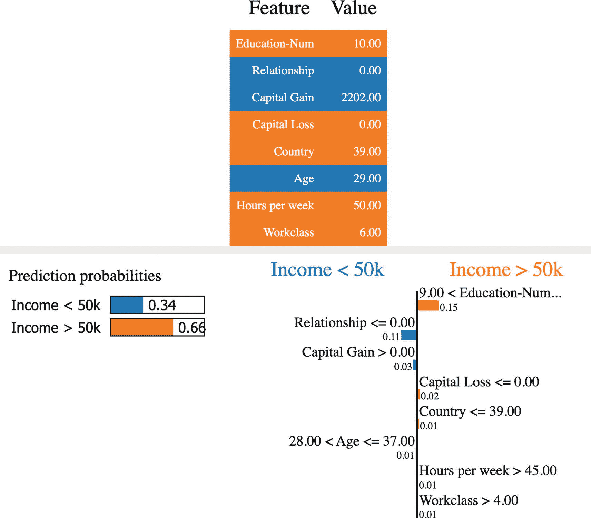

这是 LIME 对特征值数据集、预测概率以及年收入超过和低于 50,000 美元的解释的示意图。

图 12-12

验证数据集中第四个样本的 LIME 解释

```py
def pred_proba(x):
p = model.predict(x)
return np.concatenate([p, 1-p], axis=1)
exp = explainer.explain_instance(
data_row=X_valid.iloc[4],
predict_fn=pred_proba,
num_features=8,
num_samples=1000,
labels=(0,)
)
exp.show_in_notebook(show_table=True)
Listing 12-15
Custom prediction function
```

在这个预测样本（图 12-12）中，置信度，即模型对“收入 > 50k”的概率，是 66% 或 0.66。左侧条形图上的每个特征都根据每个类的颜色进行着色。在条形图中，那些向左延伸的橙色“条”表示这些特征对将目标分类为“收入 > 50k”的贡献程度。前面的表格也进行了着色编码，其中值列表示特征的值，颜色表示哪个特征对哪个类的预测有贡献。

此外，LIME 中有一个小技巧可以提高条形图的质量。通过在解释上调用 `as_pyploy_figure`，返回的对象将条形图作为 matplotlib 图形绘制（列表 12-16）。

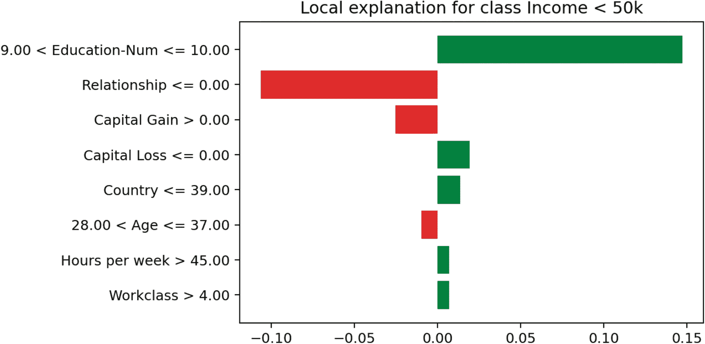

使用 pyplot 展示的图表对收入低于 50000 的类别的局部解释。数值是估计的。关系的数值为 -0.10，教育水平的数值为 0.15。

图 12-13

使用 pyplot 方法绘制的条形图

```py
plot = exp.as_pyplot_figure(label=0)
Listing 12-16
Plotting the bar plot using matplotlib
```

该图（图 12-13）基本上显示了与第一幅图中显示的小图相同的信息，但格式更好，并且更清晰地比较了每个特征的影响。

与 SHAP 相比，LIME 在展示方面更受欢迎，被那些可能不太熟悉模型内部工作原理的人使用；SHAP 在专业数据科学家中更受欢迎。尽管 LIME 不一定比 SHAP 更好，但为了快速解释带有直观可视化的模型，LIME 确实是首选的工具。

## 激活最大化

激活最大化^(3) 是一种巧妙的技术，可以用来理解网络具体“寻找”哪些组件。在标准模型训练中，我们优化神经网络中的权重集，使得预测值与真实输出之间的差异最小化（或这种差异的某种变体）。在激活最大化中，我们保持权重不变，并优化输入，使得某些选定的权重中的激活最大化。也就是说，我们执行梯度上升来人工构建最大化一组模型激活的最优输入。

这有什么价值呢？模型激活是网络在正向预测过程中考虑的因素的表示。使用激活最大化，你可以看到哪些极端情况“最满足”网络“寻找”的条件或特征——因此隐式地理解网络如何解释你的数据集中不同特征和模式。

可以使用 `pip install tf_keras_vis` 安装的库 `tf_keras_vis` 来在 Keras/TensorFlow 模型上执行激活最大化。我们首先定义一个 *损失* – 这允许我们指定优化目标。我们可以返回一个沿着输出矩阵对角线移动的元组，代表每个八个类别的模型输出。接下来，我们定义一个 `model_modifier`，它将最后一个激活层改为线性而不是 softmax 层（列表 12-17）。这使得激活最大化程序更容易，因为与一组独立的线性激活相比，在 softmax 层中导航更困难。由于网络的权重本身是固定的，这不会改变网络的根本预测属性。

```py
def loss(output):
return (output[0, 0], output[1, 1], output[2, 2], output[3, 3],
output[4, 4], output[5, 5], output[6, 6], output[7, 7])
def model_modifier(model):
model.layers[-1].activation = tensorflow.keras.activations.linear
Listing 12-17
Defining utility function for Activation Maximization
```

此外，`tf_keras_vis` 实现了基于图像的神经网络的激活最大化（这是激活最大化的主要应用），但我们的数据是表格形式，因此具有不同的空间维度。我们可以通过创建一个新的模型来解决这一点，该模型接受技术上具有图像形状的数据，将其重塑为表格形式，然后将其传递到我们的模型中（列表 12-18）。

```py
inp = L.Input((80,1,1))
reshape = L.Reshape((80,))(inp)
modelOut = model(reshape)
act = keras.models.Model(inputs=inp, outputs=modelOut)
Listing 12-18
Creating a model that converts image shaped data to tabular form
```

要运行激活最大化程序，我们将模型和模型修改函数传递给 `ActivationMaximization` 对象（列表 12-19）。然后，我们定义一个 `seed_input`，它构成了初始的“猜测”。激活最大化程序随后迭代地更新这个初始输入，跨越 `steps` 步，以最大化由 `loss` 定义的损失。在这种情况下，我们试图找到每个八个类别的“最具定义性”的输入。

```py
from tf_keras_vis.activation_maximization import ActivationMaximization
visualize_activation = ActivationMaximization(act, model_modifier)
seed_input = tensorflow.random.uniform((7, 80, 1, 1), 0, 1)
activations = visualize_activation(loss,
seed_input=seed_input,
steps=256)
Listing 12-19
The Keras Activation Maximization procedure
```

一旦我们获得了这些图，我们就可以可视化每个类别的输入（如列表 12-20 和图 12-14 所示）。我们已经获得了网络认为的“最具代表性”的每个类别的合成输入！

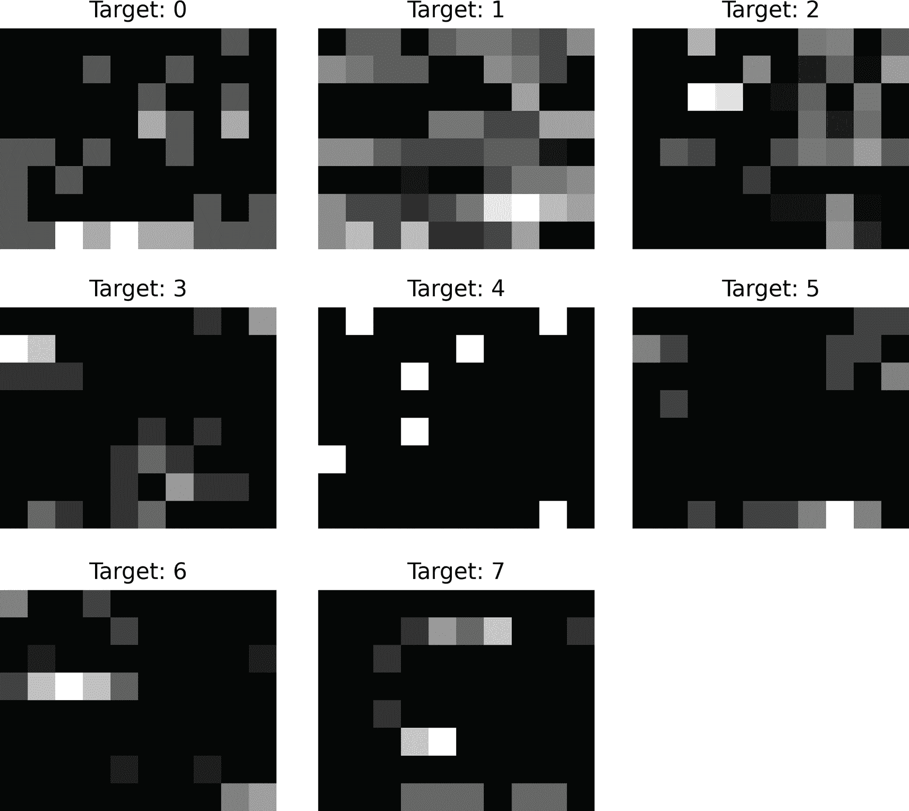

8 张图像。它们展示了激活最大化创建的分辨率。图像分别标记为目标 0 到 7。

图 12-14

激活最大化产生的可视化

```py
images = [activation.astype(np.float32) for activation in activations]
plt.set_cmap('gray')
plt.figure(figsize=(9,9), dpi=400)
for i in range(0, len(images)):
plt.subplot(3, 3, i+1)
visualization = images[i].reshape(8, 10)
plt.imshow(visualization)
plt.title(f'Target: {i}')
plt.axis('off')
plt.show()
Listing 12-20
Visualizing the results of Activation Maximization
```

当然，你可能需要多次运行此程序，因为可能的空间非常复杂，结果高度依赖于初始化。生成的合成输入可以进行分析，以了解哪些列值和/或列值组是每个类别的最典型特征。此外，你可以通过用子模型替换完整模型来在中间层上运行激活最大化（如前所述）。

## 关键点

在本章中，我们讨论了三种深度学习可解释性方法：

+   SHAP 是一个模型无关的可解释性方法套件，通过考虑大量特征子集来估计每个特征对神经网络输出的个体贡献。SHAP 还有针对利用神经网络梯度的适应性。

+   LIME 也是一个针对模型解释的模型无关工具，尤其针对表格和文本数据。LIME 通过训练一个额外的可解释模型，利用代表性的扰动数据集来产生可解释的结果。LIME 通常用于更快、更直观地表示。

+   激活最大化是一种针对神经网络的特定技术，其中输入被优化以最大化神经网络某一层的激活。可以生成多个“最优输入”并比较，以形成对某些激活是“寻找”或“触发”的分析。

本章仅仅触及了深度学习可解释性的表面，旨在展示一个人可能从何处开始解释他们的表格型深度学习模型。除了这三种方法之外，我们鼓励您探索为表格环境开发的其它深度学习可解释性方法。以下是一些有趣的论文样本：

+   Agarwal, R., Frosst, N., Zhang, X., Caruana, R., & Hinton, G.E. (2021). 神经网络加性模型：使用神经网络进行可解释机器学习。*ArXiv, abs/2004.13912*。

+   Chang, C., Caruana, R., & Goldenberg, A. (2021). NODE-GAM：用于可解释深度学习的神经网络广义加性模型。*ArXiv, abs/2106.01613*。

+   Liu, X., Wang, X., & Matwin, S. (2018). 通过知识蒸馏提高深度神经网络的解释性。*2018 年 IEEE 国际数据挖掘研讨会（ICDMW）*，905–912。

+   Novakovsky, G., Fornes, O., Saraswat, M., Mostafavi, S., & Wasserman, W.W. (2022). ExplaiNN：用于基因组学的可解释和透明的神经网络。*bioRxiv*。

+   Radenović, F., Dubey, A., & Mahajan, D.K. (2022). 用于可解释性的神经网络基础模型。*ArXiv, abs/2205.14120*。

+   Ranjbar, N., & Safabakhsh, R. (2022). 在基于自动编码器的 LIME 中使用决策树作为局部可解释模型。*2022 年第 27 届国际计算机会议，伊朗计算机协会（CSICC）*，1–7。

+   Richman, R., & Wüthrich, M.V. (2021). LocalGLMnet：用于表格数据的可解释深度学习。*DecisionSciRN：预测方法（子主题）*。

这标志着本书最后一部分和章节的结束。

## 结束语

在本书中，我们涵盖了大量的内容。我们从第一部分开始，对机器学习和数据预处理流程进行了全面的概述；介绍了关键的机器学习概念和原理；讨论了几个经典的机器学习算法，包括梯度提升模型——在表格数据问题上是深度学习的主要竞争对手；不同的数据存储和交付结构；以及各种数据编码和转换技术。在第二部分，我们通过五章内容——人工神经网络、卷积神经网络、循环神经网络、注意力和转换以及基于树的神经网络——构建了关于深度学习的广泛知识。这部分涵盖了数十种深度学习建模方法，应用于各种数据类型和场景，并探讨了近 20 篇研究论文。在第三部分，我们不仅扩展了我们的工具集以建模表格数据，还包括了预训练模型、开发噪声和扰动鲁棒模型、生成表格数据、优化建模流程、将模型链接成集成和自感知系统，以及解释模型。

我们希望这本书对于那些希望更好地理解深度学习在表格数据中作用的人来说具有启发性，对于那些希望在自己的领域中使用深度学习的人来说是一个有用的资源。本书最前沿的指导原则是可访问性，我们希望解释、图表、代码和研究概述支持了这一点。

随着我们面临的问题变得更加复杂，我们从这些问题中收集的数据也相应地变得更加复杂和错综，我们发现问题及其模型之间的差异——而不是收敛——变得更加明显。因此，“哪种模型在表格数据上表现最好”——虽然承认这是一个有效的问题——但这个问题已经形成了它自己隐含的答案。我们应该始终保持开放的心态和灵活的指尖，准备好获取、测试和综合新旧知识。我们必须努力减少完全由必要的但限制性的基准驱动的驱动，更多地由问题宇宙的多样性驱动。
