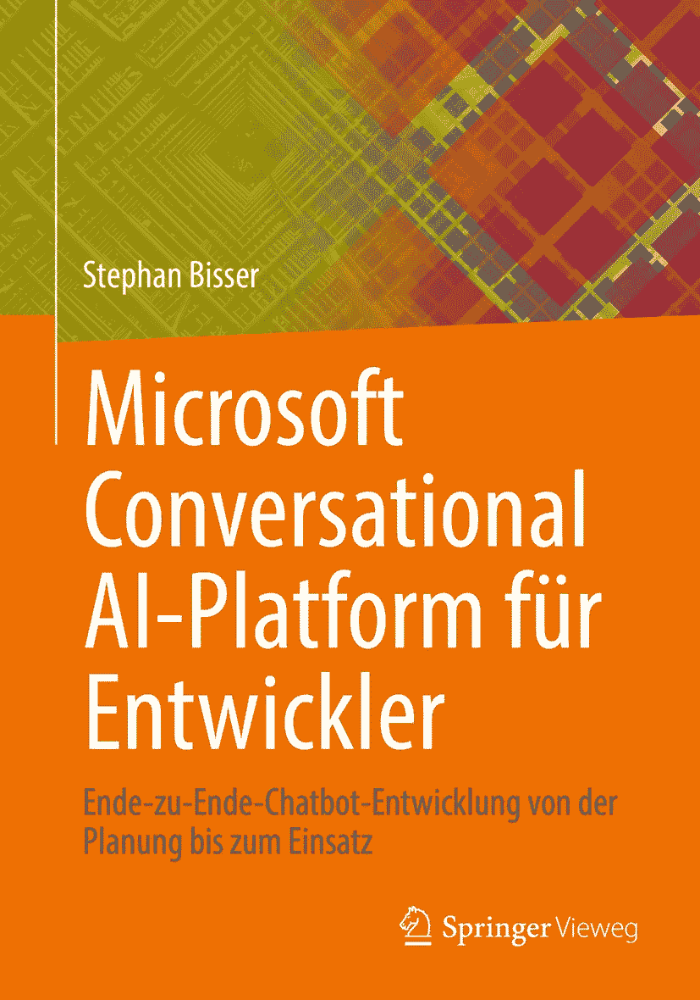

ISBN 978-3-662-66471-1 e-ISBN 978-3-662-66472-8 [`doi.org/10.1007/978-3-662-66472-8`](https://doi.org/10.1007/978-3-662-66472-8) 德国国家图书馆将此出版物收录于德国国家书目中；详细的书目数据可通过互联网在 [`​dnb.​d-nb.​de`](http://dnb.d-nb.de) 查询。

本书是 Bisser, Stephan 所著英文原版《Microsoft Conversational AI Platform for Developers》的中文译本，该书由 APress Media, LLC 于 2021 年出版。翻译过程借助了人工智能（由 `DeepL.com` 服务提供的机器翻译）。随后进行了以内容为主的人工审校，因此本书在文体风格上可能与传统翻译有所不同。Springer Nature 持续致力于开发用于书籍制作的工具及相关技术，以支持作者。

© 相关出版者及/或相关作者，独家授权给 APress Media, LLC，后者是 Springer Nature 的一部分，2022 年。本作品及其所有部分均受版权保护。任何未经版权法明确允许的使用行为，均需事先获得出版者的同意。这尤其适用于复制、改编、翻译、缩微拍摄以及在电子系统中的存储和处理。本作品中通用描述性名称、商标、公司名称等的引用，并不意味着这些内容可供任何人自由使用。即使没有特别说明，其使用权限也受商标法规则的约束。必须尊重相应商标持有人的权利。出版者、作者及编辑假定，本作品中的信息在出版时是完整且正确的。出版者、作者或编辑均不对本作品的内容、任何可能的错误或表述，明示或暗示地承担保证责任。对于已出版地图和机构地址中的地理归属及区域名称，出版者保持中立。

责任编辑：David Imgrund

Springer Vieweg 是注册公司 APress Media, LLC 的印记，并且是 Springer Nature 的一部分。

公司地址：1 New York Plaza, New York, NY 10004, U.S.A.

*谨以此书献给我的家人，特别是我的妻子 Nicole，我两个出色的孩子 Nele 和 Diego，我深深思念的父亲，以及我的母亲。我爱你们！*

## 致谢

我要感谢我的雇主 **Solvion**，它是最好的公司，让许多不久前看似不可能的事情成为可能。当然，我也要感谢所有的同事，因为我们之间的工作友谊是特别的。但是，**Thomy**，我必须特别感谢你，因为与你合作是一种荣幸，不仅是在公司事务上，也包括社区中的点滴小事。借此机会，我也要感谢整个 MVP 和非 MVP 社区，特别是我的朋友 **Rick** 和 **Appie**，他们用新的想法和项目让我保持忙碌！

谢谢你们，**Herbert** 和 **Brigitte**，你们是我能想象到的最好的岳父母！

我要感谢我的父亲，他教会了我他所知道的一切，并成就了今天的我！*我想你*，**爸爸**。

谢谢你，妈妈，谢谢你在我生命中一直陪伴着我，并尽你所能支持我！*谢谢你*，**妈妈**！

我要感谢我两个出色的孩子，**Diego** 和 **Nele**，他们让我保持活力，并给我的生活带来了无尽的欢乐。没有你们，我的生活将不完整。*我爱你们俩！*

最后，我要感谢我的妻子 **Nicole**，感谢她在任何情况下都支持我。我知道，和我在一起有时并不容易，但有你在身边，我感到无比幸福。你是最棒的！*我爱你！*

## 引言

本书涵盖了使用 Microsoft 对话式 AI 平台开发聊天机器人所需经历的所有步骤。您将学习关于 Microsoft Bot Framework 和 Azure Cognitive Services 的关键事实和概念，这些是开发和维护聊天机器人所必需的。本书主要面向开发人员及具有开发背景的人士，因为您将学习现代端到端聊天机器人开发的概念。但由于它也涵盖了基本概念，几乎所有对聊天机器人开发感兴趣的、具备 IT 知识的人都能从阅读本书中获益。

从理论概念开始，前三章详细介绍了 Microsoft 对话式 AI 平台、Microsoft Bot Framework 以及本书中用于开发聊天机器人的 Azure Cognitive Services。第 4、5、6、7 和 8 章则涵盖了每个聊天机器人开发项目的不同阶段，从讨论设计原则的设计阶段开始，接着是使用 Microsoft Bot Framework Composer（一种可视化机器人编辑工具）开发真实示例聊天机器人的构建阶段。之后是测试阶段，探讨如何正确测试聊天机器人，最后两章则涉及发布阶段和连接阶段，以便将聊天机器人提供给最终用户。

## 关于作者

## 关于技术审校

