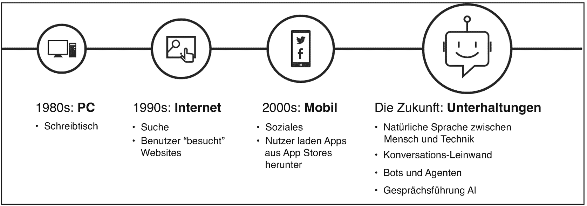
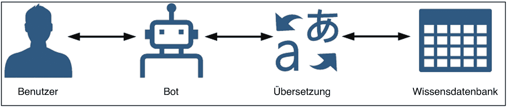
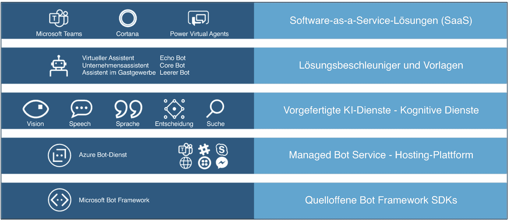
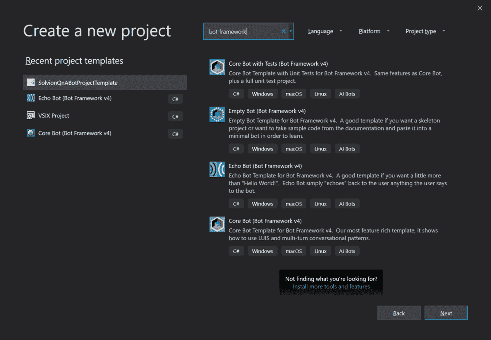
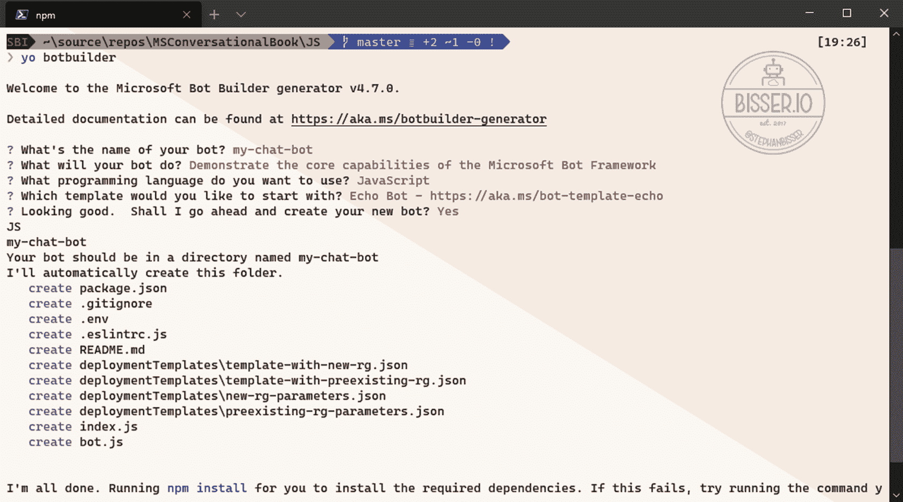
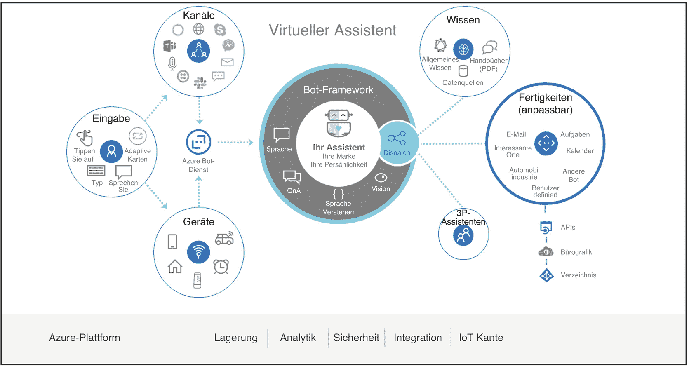
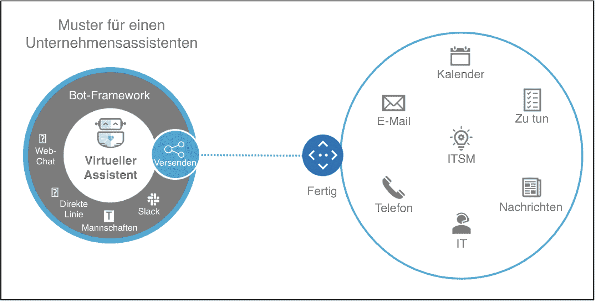
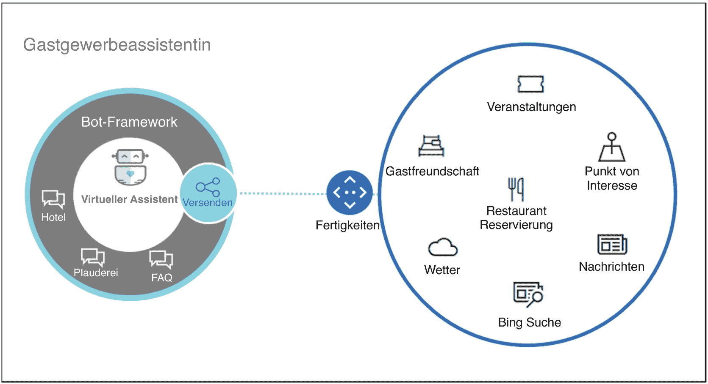

# 1. Microsoft 对话式 AI 平台简介

对话式 AI（人工智能的简称）是一个术语，可以描述为广义人工智能的一个子领域或学科。该领域关注如何通过一个由 AI 算法增强的对话界面来访问软件或服务。这些对话界面通常范围从简单的基于文本的聊天界面到相当复杂的语音和口语界面。其主要目标是让人们通过这些对话界面与软件服务进行交互，从而使人与机器之间的交互更加自然。例如：想象一下，您坐在车里，想要调节暖气。目前，您可能需要按下按钮或拨动车内的开关来调高或调低暖气。在一个更现代化的场景中，只需简单地说一句“汽车，请将暖气设置为 22 摄氏度”来实现同样的目的，会自然得多。在第二种情况下，您无需按下会分散驾驶注意力的按钮；您只需说话并告诉设备该做什么。这样，您不仅能够专注于驾驶这一主要任务，而且这可能是有益的，因为说话可能比通过按钮或开关控制系统更快。

在本书的第一章中，将介绍对话式 AI 的主要概念和原则，重点放在 Microsoft 生态系统以及对话式 AI 服务的使用场景上。

## 对话式人工智能的关键概念

当谈到“对话式人工智能”时，必须始终考虑不同组件的编排。这些组件必须相互协调，以便为使用它们的人们提供尽可能最佳的对话式界面。在许多情况下，一个全面的对话式人工智能界面可能由以下部分组成：但为什么这在当今如此重要？如果你看看人们过去使用的工具，答案就相当简单了。图 1.1 显示，目前正在发生一场范式转变，因为与某项服务进行对话，而不是“仅仅”点击和浏览，比以往任何时候都更加重要。



图 1.1

IT 的发展

* 自然语言处理（NLP）

* 文本分析

* 文本转语音

* 语音转文本

* 文本/语音翻译

但为什么这在当今如此重要？如果你看看人们过去使用的工具，答案就相当简单了。图。

几十年前，当个人电脑开始普及时，其主要用途是让用户独立处理各种任务，而无法通过电脑与他人连接。随着互联网的引入，这种情况略有改变，因为现在你可以将自己的电脑与其他电脑连接起来。这使得每个用户都有机会通过互联网与他人交流。在 2000 年代，移动时代开始了，人们使用智能手机和社交媒体应用程序，通过移动设备与他人连接。从那时起，人们不再需要电脑或笔记本电脑来与他人交流。他们只需使用智能手机，通过各种社交媒体渠道与他人发起聊天并进行对话。但直到那时，这一切都还只是关于一个人与另一个人通过各种通信渠道和服务进行的互动。

现在，这种情况正在发生一些变化，因为一个新时代正在开启，其重点在于人们不仅能够以人类的方式与他人交流，还能以同样的方式与他们所使用的服务进行交流。想象一下，您不再像往常那样通过点击按钮来煮咖啡，而是获得一种简单但相当不寻常的体验。通过这种新方法，您可以与您的咖啡机对话，说：“我想喝一杯卡布奇诺。你能帮我做一杯吗？” 这种方法也可以用于您现在使用的软件服务，但您无需到处点击按钮来告诉服务该做什么，而是像与另一个人交谈一样，与所述服务进行自然的对话。从某种意义上说，这是一种新型的用户界面。这种新的用户界面当然必须是直观的，因此它依赖于理解用户的能力。

### 自然语言处理

在这种以更自然或更人性化的方式使用服务并与之交互的新方法中，自然语言处理能力至关重要。这是对话式人工智能的众多领域之一，不仅开发人员和工程师应该参与其中，领域专家也应该参与。作为开发聊天机器人等人工智能应用的开发者，您自己构建应用的语言模型是没有意义的。原因在于，在大多数情况下，您并非您的应用所针对领域的专家。因此，在这些领域（例如语言模型）与领域专家以及了解您机器人目标受众的人员合作是明智之举。在许多情况下，这些专家能更好地理解用户与您的机器人交互的方式，因此能够提高您机器人内部认知能力的质量。这种自然语言理解模型（任何人工智能应用的关键组成部分）的关键要素是意图和表述。

`Intents` 是您语言理解模型中的不同领域。这些 `Intents` 可用于指示用户在向机器人传达信息时的意图。它们可以在应用的业务逻辑中用作指示器或触发器，以规定机器人应如何响应特定的输入。例如，如果用户问：“今天天气怎么样？”，您当然希望机器人回答类似“大部分时间晴朗，28 摄氏度。”这样的内容。为了定义这样一个意图，如示例中的 `GetWeather`，您需要向自然语言模型提供示例句子，这些句子被称为表述。给定意图的这些表述可能是：

* 天气怎么样？

* 今天天气如何？

* 天气情况如何？

* 你能告诉我天气预报吗？

* 我想了解一些关于天气的详细信息。

正如您所见，这五个例句在措辞和句法上各不相同。这对于您语言模型的质量至关重要，因为您需要设身处地为最终用户着想，了解他们会如何向您的机器人询问天气。而且，您提供给模型的表述越多，您的模型就能覆盖越多的可能性。

但这还不是全部，正如这个简单的例子所示。在这个场景中，用户询问 X，机器人回答 Y。但你也必须以某种方式考虑这个对话的上下文。因为如果用户只向机器人询问天气，机器人并不知道用户想知道哪个地点的天气。因此，你需要为你的语言模型添加所谓的**实体**，这些实体指定了你在处理请求之前必须知道的特定属性。在这个场景中，地点就是这样一个实体，在你能够回答天气详情之前必须知道它。为了获得这种能力，你需要扩展你的语言理解模型，例如，通过添加以下表述并标记实体：

*   `{location=Seattle}`的天气怎么样？

*   `{Ort=New York}`的天气怎么样？

*   `{location=Berlin}`的天气怎么样？

*   你能告诉我`{location=Redmond}`的天气预报吗？

*   我想了解一些关于`{location=Amsterdam}`天气的详细信息。

现在，语言理解模型能够识别给定短语中的地点实体，并为你标记这些地点。在你的应用程序的业务逻辑中，你现在可以像使用变量一样使用这些实体，并相应地处理请求。现在，当用户问“西雅图今天天气怎么样？”时，你就有可能用正确的天气详情来回答。你需要在业务逻辑中处理的是，当用户没有指定查询天气的地点时的流程。在大多数情况下，用一个问题来回应是合理的，比如：“为了给您提供天气预报，请告诉我您想知道哪个城市的天气。”这使得用户和机器人之间的交互更加自然，因为存在一种上下文感知能力。

然而，自然语言处理只是对话式 AI 应用中的一个组成部分。想象一下，你想构建一个聊天机器人，它能够扩展你的客服场景，并为用户提供一个全天候可用的额外联系点。在许多情况下，聊天机器人可以成为处理初步问题或请求、减轻客服人员负担的好方法。聊天机器人可以轻松处理基本问题，但如果客户或最终用户有一个紧急请求，而机器人无法处理，该怎么办？分析客户消息以从中提取含义，可以帮助你将消息转发给后台的合适联系人。因此，使用一种能够识别消息中情绪的文本分析引擎是合理的。这样，你就可以在你的聊天机器人的业务逻辑中决定是否有必要转接给人工，而不是继续与机器人对话。

### 语言翻译

让我们扩展之前的用例，加入由机器人处理的航班预订。在许多情况下，机器人可以帮助用户进行预订。但你也必须考虑投诉。机器人也可以处理投诉，但许多人在提交投诉时希望立即得到明确的答复。通过某种文本分析，可以识别用户的情绪，并根据情绪值决定是否有必要立即将对话转接给客服人员，因为客户可能感到愤怒或不安。这可以防止不满意的客户导致客户流失，因为他们仍然可以根据自己的情况得到服务。此外，客服人员将有更多时间处理“棘手”的案例，并且可以更高效地服务客户，因为基本问题完全由机器人处理。

如果你要创建一个处理客户请求的机器人，根据所提供的服务，实现一个多语言机器人也可能是有益的。现在有两种可能的实现方法：当然，这取决于具体的场景以及其他因素，如预算和时间框架，但在许多情况下，第二种方法可能是实现多语言机器人的一个良好替代方案。通过使用翻译，负责机器人内容和知识的员工可以只用一种语言管理内容，而不是为机器人要使用的每种语言创建知识库或数据孤岛。这样一个多语言机器人的高层消息流可能如图 1.2 所示。



图 1.2

机器人翻译流程 – 高层视图

*   为每种语言创建单独的机器人。

*   创建一个机器人并利用翻译来实现多语言能力。

当然，这取决于具体的场景以及其他因素，如预算和时间框架，但在许多情况下，第二种方法可能是实现多语言机器人的一个良好替代方案。通过使用翻译，负责机器人内容和知识的员工可以只用一种语言管理内容，而不是为机器人要使用的每种语言创建知识库或数据孤岛。这样一个多语言机器人的高层消息流可能如图

## 语言

另一个不容忽视的方面是，机器人应仅作为纯文本机器人，还是也应具备语音能力。就机器人设计而言，语音无疑是一门更具挑战性的学科。原因在于，许多人在与他人或机器人进行文字交流时，习惯不使用口音短语。但当人们说话时，他们习惯带有口音，而不是像书写时那样语法正确。因此，如果你正在开发一个能够通过语音进行对话的机器人，你必须考虑到人们在对话中可能使用的所有场景和口音。此外，你还需要考虑你想要实现的架构类型。对于机器人，尤其是在微软对话式 AI 平台中，一个可靠的方案是使用 `Azure Speech Services`，这是一项专注于语音场景以实现语音到文本和文本到语音的服务。在这种情况下，你可以使用 `Speech-to-Text` 来收集所有传入的语音消息，并将其转换为文本，然后再将这些文本消息传递给机器人的逻辑以执行业务逻辑。当机器人向用户发送回复时，你可以使用 `Text-to-Speech` 将该基于文本的消息再次转换为基于语音的消息，然后再发送到用户的渠道。通过这种架构，你可以开发一个机器人，它能够使用后端相同的业务逻辑，在基于文本的场景（如聊天）和基于语音的场景（如电话呼叫）中回复消息。从开发角度来看，唯一的区别在于需要以不同方式处理用户渠道，以确保在执行自然语言处理例程之前，每个呼叫都使用了 `语音到文本` 和 `文本到语音`。一个巨大的优势是，你可以一次开发你的机器人，然后同时将其部署到基于文本和基于语音的渠道，而无需修改代码或开发两个不同的机器人。

## 对话式 AI 的应用场景

对话式 AI 可以在许多不同的场景中发挥作用。事实上，几乎任何业务问题都可以通过某种形式的 AI 来解决。如今最大的风险在于，在开始构建 AI 应用程序时，忘记了需求工程的过程。对话式 AI 是人工智能的一个子领域，专注于构建计算机与人之间无缝的对话。由于这在当下是一个热门词汇，正确的用例往往没有得到彻底的评估。许多公司和供应商试图实施 AI 服务，因为这是当今的一种趋势。然而，这常常导致用户无法从新的 AI 驱动解决方案中受益。使一个 AI 驱动的用例（尤其是使用对话式 AI 开发的用例）成功的关键点在于，它能够显著改善或加速用户体验，而不是使其恶化。

一个简单的例子可以是大型企业中的内部网场景。这些内部网解决方案通常设计用于存储各种信息，例如文档。问题在于，这些解决方案在许多情况下会随着时间推移而增长多年，用户很难在这个“信息丛林”中找到相关信息，尤其是对于首次使用内部网的新员工来说。现在，想象一下用户为了找到正确的信息通常需要执行的步骤，这个过程可能如下所示：

1. 登录到机器人可访问的渠道。

2. 发送一条消息，例如：“您能给我发送文档 xyz 吗？”或“您能给我发送所有元数据为 xyz 的文档吗？”

3. 打开聊天机器人发送的文档。

现在，如果比较这两种方法，用户只需告诉聊天机器人他们想要什么信息，而无需自己搜索文件，这样会快得多。这反过来又有可能为用户节省大量时间，他们可以将这些时间投入到创新任务中，或者投入到他们喜欢做的事情上，因为这些任务比搜索文档更令人愉快。当然，这取决于一种架构，其中机器人被集成到内部网解决方案中，并且能够索引所有文档，以便在几秒钟内将其发送给用户。然而，关键点在于，机器人或普遍应用的 AI 解决方案能够为最终用户创造价值，而不是使流程变得更糟。

1. 登录到内部网解决方案。

2. 导航到内网中可能存储信息的正确区域。

3. 导航到该区域的文档存储位置。

4. 浏览文档以找到正确的文档。

5. 打开文档。

现在设想同一个用例，但通过聊天机器人形式的 AI 应用来操作。用户通常需要执行以下步骤才能获得相同的结果：

另一个例子是业务报告。市场上存在大量为不同报告目的提供服务的解决方案。许多此类解决方案的一个主要问题是，在大多数情况下对最终用户来说过于复杂。由于报告工具需要能够处理复杂的数据结构以生成高要求的报告，因此创建这些报告的用户界面也相当复杂。如果能用自然语言告诉服务你想查看哪些关键绩效指标（KPI），事情就会简单得多。因此，包括微软在内的许多供应商都在其报告解决方案中集成了服务，允许用户通过自然语言查询数据，而不是通过惯常的复杂报告界面。这样一来，最终用户可能会节省大量时间，因为他们只需告诉系统想看什么，这通常只需几秒钟，而无需事先花费大量时间创建仪表板。因此，对话式 AI 可以被视为一种新型用户界面，其目的是通过对话式界面提供软件服务，这种界面应该相对易于操作，因为人类习惯于使用自然语言进行交谈和互动。

对话式 AI 的另一个重要点是，通过在组织中引入某种形式的对话式 AI，这些服务或许能够消除人们对人工智能的恐惧。在世界许多地方，尤其是在制造型企业中，人们担心 AI 服务或广义上的机器迟早会取代他们的工作。因此，他们拒绝使用这些“现代”解决方案，因为他们认为机器会接管他们的工作，他们将面临严重的问题。通过以聊天机器人和其他对话式 AI 解决方案的形式引入“轻量级”AI 服务，企业有机会告诉人们，这些服务将作为员工的虚拟助手，旨在帮助和支持他们。这些虚拟助手的设计应能接管用户的重复性任务，从而让用户有机会将更多时间用于虚拟助手无法处理的创新性或更困难的任务。通过这种方法，当人们将这些服务视为能帮他们完成不喜欢的工作的助手时，企业中 AI 服务的接受率通常会高得多。

这种情况的一个典型例子是 IT 支持。每个公司都有某种形式的帮助台团队，基本上负责处理各种问题和故障。最常见的问题之一是如何重置密码。想象一下，你在 IT 帮助台工作，每天多次被问到如何重置密码。这个问题迟早会变得烦人，但你仍然需要帮助那些因密码过期或遗忘而困扰的用户。然而，如果你引入一个能够回答这些基本问题（例如如何重置用户密码）的 IT 帮助台聊天机器人，你就会有更多时间处理更复杂的问题，甚至可以在支持部门内部进行流程优化。而且，由于聊天机器人几乎永远不会告诉你它厌倦了反复回答相同的问题，用户将得到妥善的服务，甚至可能更高效，因为聊天机器人可以立即为遇到问题的用户提供答案，它随时可用，即使在非工作时间也是如此。

## 微软 Azure 中围绕对话式 AI 的服务产品

作为微软的公有云平台，Azure 提供了许多不同的服务和解决方案，涵盖基础设施即服务（IaaS）、平台即服务（PaaS）和软件即服务（SaaS）等不同领域；它还提供了许多 AI 即服务（AIaaS）领域的服务。其服务产品相当广泛，涵盖了 AI 应用中使用的多种不同服务类型，如图 1.3 所示。



图 1.3

微软对话式 AI 平台

### Bot Framework 与 Azure Bot 服务

任何对话式 AI 应用或聊天机器人的基础都是 Microsoft Bot Framework。这是一个开源 SDK，目前提供 `C#`、`JavaScript` 和 `Python`（均已正式发布）以及 `Java`（预览版）版本。该 SDK 为开发机器人和对话式 AI 应用提供了开放、模块化且可扩展的架构。它内置了一个灵活且可定制的对话系统。该 SDK 的主要优势之一在于，它在所有开发语言中都使用相同的实现方式。这意味着开发者可以使用 `.NET` 和 `JavaScript` 创建机器人，而无需学习两种不同的实现方法或概念，因为它们在所有编程语言中都是统一的。此外，Microsoft Bot Framework SDK 可以与 Microsoft Azure 平台以及所有 Microsoft 认知服务无缝集成。

在部署使用 Microsoft Bot Framework 创建的机器人时，Azure Bot 服务充当 Azure 中的托管平台。该服务本质上加速了 Bot Framework 机器人的部署和管理周期。Azure Bot 服务 (ABS) 使我们能够在几分钟内将机器人连接到多个渠道，因为 Microsoft 会为我们管理机器人与已连接渠道之间的集成。因此，您无需花费数天时间在 Azure 环境与例如 Facebook 之间建立新的连接，仅为了在 Facebook Messenger 中启用您的机器人——这一切都由 Microsoft 处理。您只需确保机器人的逻辑和代码得到渠道平台的支持即可。一个巨大的优势是，Microsoft 会持续更新支持的渠道列表。在撰写本文时，支持以下渠道（如有变更，恕不另行通知）：

- `Cortana`

- `Office 365 电子邮件`

- `Microsoft Teams`

- `Skype`

- `Slack`

- `Twilio (SMS)`

- `Facebook Messenger`

- `Kik Messenger`

- `GroupMe`

- `Workplace 版 Facebook`

- `LINE`

- `Telegram`

- `Web 聊天`

- `直连线路`

- `Direct Line 语音`

如上述列表所示，Microsoft 还集成了第三方平台，例如 Facebook Messenger 或 Slack。这扩展了聊天机器人的可能用例，因为机器人可以同时在 Slack 和 Microsoft Teams 中使用，并利用相同的代码库。当然，您必须确保机器人的代码在两个平台上都受支持，尤其是在涉及前端事项时，因为例如 Microsoft Teams 支持一种名为自适应卡片的概念，这将在后续章节中解释。该解决方案提供了在单条消息中呈现丰富附件（如图片、音频文件、按钮和文本）的能力。其优势在于，此类自适应卡片的定义使用 `JSON` 完成，因此可以在运行时替换。缺点是许多渠道（如 Slack 或 Facebook Messenger）尚不支持这一新概念。因此，如果您要为 Teams 和 Slack 创建机器人，则需要在对话的不同区域对这两个渠道进行差异化处理。然而，总体目标是编写一次机器人，并将其部署到多个渠道。这样，您可以最大限度地减少开发和部署周期，并最大化潜在用户数量和覆盖范围。Bot Framework 的详细信息及其所有概念和模式将在后续章节中解释。

### 认知服务


微软提供了一系列名为“认知服务”的预构建机器学习服务，旨在帮助不具备数据科学家知识的开发者构建智能应用程序。这套全面的`API`旨在让开发者能够轻松构建具备决策、理解、语音、听觉和搜索能力的应用程序。以下列表汇总了当前可用的所有认知服务：

- **决策**
  - **异常检测器（预览版）**
    - 一项帮助用户在问题发生之前预见任何类型问题的服务。
  - **内容审查器**
    - 一个可用于对内容进行机器审查的`API`，以及一个用于图像、文本和视频的人工审查工具。
  - **个性化服务**
    - 一项基于强化学习的服务，用于为最终用户提供个性化和量身定制的内容。

- **语言**
  - **沉浸式阅读器（预览版）**
    - 一项目前处于预览阶段的服务，提供将文本阅读和理解功能嵌入到应用程序中的能力。
  - **语言理解**
    - 将基于机器学习模型的自然语言理解功能集成到应用程序和机器人中，以理解最终用户并根据其需求推断操作。
  - **QnA Maker**
    - 一项基于云的服务，使开发者和业务用户能够基于常见问题创建知识库，然后以对话形式使用。
  - **文本分析**
    - 文本分析允许将输入文本中的情感和语言检测、实体和关键短语提取功能集成到应用程序和机器人中。
  - **翻译器**
    - 一个面向开发者的神经机器翻译`API`，提供用户友好的界面来执行实时文本翻译，并支持超过 60 种语言。

- **语音**
  - **语音转文本（语音服务的一部分）**
    - 一个实时语音转文本`API`，允许用户将口语音频转换为文本，包括使用自定义词汇表来克服语音识别障碍的能力。
  - **文本转语音（语音服务的一部分）**
    - 借助神经文本转语音功能，此`API`提供将文本转换为语音的能力，以创建支持多种语言、声音和口音的自然对话界面。
  - **语音翻译（语音服务的一部分）**
    - 一个基于云的自动翻译`API`，提供实时语音翻译。
  - **说话人识别（预览版）**
    - 说话人识别是一项服务，提供检测和识别单个说话人的功能，以确定未知说话人的身份或将语音用作验证方法。

- **视觉**
  - **计算机视觉**
    - 一个能够分析图像内容、从图像中提取文本以及识别图像中已知对象（如品牌或地标）的`API`。
  - **自定义视觉**
    - 基于计算机视觉服务，自定义视觉的用户可以根据自己的需求创建自己的计算机视觉模型。
  - **人脸**
    - 人脸 API 专为分析图像中的人脸而设计，并可作为人脸识别服务使用，可集成到任何类型的应用程序中。
  - **表单识别器（预览版）**
    - 此`API`是一个基于人工智能的文档提取解决方案，可以自动化从文档中提取文本、键值对或表格等信息的过程。
  - **墨迹识别器（预览版）**
    - 墨迹识别器能够识别墨迹内容，如形状、手写或墨迹文档的布局，适用于笔记或文档批注等各种场景。
  - **视频索引器**
    - 此`API`可以自动从音频和视频内容中提取元数据，从而提供有价值的信息，如口语单词、人脸、说话人甚至整个场景。

- **Web 搜索**
  - **Bing 自动建议**
    - Bing 自动建议提供智能的搜索词预选功能，可以帮助最终用户更快、更高效地完成搜索查询。
  - **Bing 自定义搜索**
    - 使用此服务，您可以创建一个量身定制的搜索引擎，从而能够根据您的场景提供无广告的商业化结果。
  - **Bing 实体搜索**
    - 一个`API`，提供检测和分类命名实体的能力，以便基于这些实体搜索和查找全面的结果。
  - **Bing 图片搜索**
    - 此`API`面向希望将图片搜索功能集成到应用程序中的开发者，允许向应用程序和网站添加图片搜索选项。
  - **Bing 新闻搜索**
    - Bing 新闻搜索允许开发者向网站或应用程序添加可定制的新闻搜索引擎，提供按主题、本地新闻或元数据进行过滤的功能。
  - **Bing 拼写检查**
    - 一个能够帮助最终用户实时检测和纠正拼写错误的`API`。
  - **Bing 视频搜索**
    - 与 Bing 图片搜索类似，此`API`允许开发者向应用程序添加一系列高级视频搜索功能，例如视频预览、热门视频或基于特定元数据的视频。
  - **Bing 视觉搜索**
    - 此服务允许最终用户使用图像代替常规的基于文本的搜索查询来搜索内容。
  - **Bing Web 搜索**
    - 借助 Bing Web 搜索，开发者可以构建解决方案，通过单个`API`调用从互联网检索文档、网页、视频、图片或新闻。

如您所见，认知服务的列表相当长，并且有许多不同的服务可用于各种用例。由于本书主要关注人工智能的对话方面，我们当然不会详细讨论所有这些认知服务。然而，其中一些`API`将在后续章节中进行更详细的说明，因为它们在开发对话式 AI 应用程序中扮演着重要角色。

### 解决方案加速器与模板

当您开始使用微软人工智能平台创建机器人时，采用某种模板而非完全从零开始构建，很可能是一个不错的做法。微软在这方面做得很好，为开发者和聊天机器人架构师提供了多种模板，这些模板可作为创建新项目的起点。目前，以下模板可用于 .NET、JavaScript/TypeScript 和 Python 开发，详见表 1.1。

表 1.1

Bot Framework 模板。（来源：[`github.com/microsoft/BotBuilder-Samples/tree/master/generators`](https://github.com/microsoft/BotBuilder-Samples/tree/master/generators)）

| 模板 | 描述 |
| --- | --- |
| **回声机器人** | 如果您想要比“Hello World!”稍微多一点功能，但又不想太复杂，这是一个很好的模板。该模板涵盖了向机器人发送消息以及机器人通过将消息回传给用户来处理消息的基本方面。此模板生成的机器人会简单地将用户对机器人说的所有内容原样返回给用户。 |
| **核心机器人** | 最先进的模板，核心机器人模板提供了每个机器人应具备的六项核心功能。该模板包含了使用 LUIS 的对话式 AI 机器人的关键功能。 |
| **空机器人** | 如果您熟悉 Bot Framework v4，并且只需要一个基本的骨架项目，这是一个很好的模板。此外，如果您想从文档中获取示例代码并将其插入到一个最小的机器人中以供学习，这也是一个不错的选择。 |

**注意**

上述所有模板均可用于多种场景。如果您是 .NET 开发者，可以使用来自[`github.com/Microsoft/BotBuilder-Samples/tree/master/generators/vsix-vs-win/BotBuilderVSIX-V4`](https://github.com/Microsoft/BotBuilder-Samples/tree/master/generators/vsix-vs-win/BotBuilderVSIX-V4)的 Visual Studio 扩展，该扩展会在您的 Visual Studio IDE 中安装解决方案模板。

安装扩展后，您可以像启动任何其他模板一样，轻松启动一个新的 Visual Studio Bot Framework 项目（见图 1.4）。



图 1.4

Bot Framework Visual Studio 模板

如果您想在不使用 Visual Studio 或其他 Web 开发 IDE 的情况下使用 .NET Core 创建机器人，可以利用 .NET Core 模板。

**注意**

.Net Core Visual Studio Bot Framework 模板可从此处安装：[`github.com/microsoft/BotBuilder-Samples/tree/master/generators/dotnet-templates`](https://github.com/microsoft/BotBuilder-Samples/tree/master/generators/dotnet-templates)。

这些模板允许您完全通过命令行使用`dotnet new`命令来搭建机器人项目，如下所示：

```
dotnet new echobot -n MyEchoBot
```

然而，如果您是一位熟悉使用 Visual Studio Code 进行 JavaScript 或 TypeScript 解决方案开发的 Web 开发者，您可以使用来自[`github.com/microsoft/BotBuilder-Samples/tree/master/generators/generator-botbuilder`](https://github.com/microsoft/BotBuilder-Samples/tree/master/generators/generator-botbuilder)的 Bot Framework v4 Yeoman 生成器，通过 CLI 创建项目，只需在您偏好的命令行界面中执行如下命令即可：

```
yo botbuilder
```

此命令将启动 Yeoman 生成器，它会引导您完成项目的设置和脚手架搭建过程，如图 1.5 所示。



图 1.5

用于 JavaScript/TypeScript 的 Bot Framework Yeoman 生成器

类似的生成器也适用于基于 Python 的开发，可从此处安装：[`github.com/microsoft/BotBuilder-Samples/tree/master/generators/python`](https://github.com/microsoft/BotBuilder-Samples/tree/master/generators/python)。使用此生成器，您可以通过命令行创建基于 Python 的 Bot Framework v4 机器人，这大大方便了开发阶段。

**注意**

所有这些模板都为您提供了一个项目脚手架，您可以在此基础上进一步扩展，加入您想要实现的机器人逻辑。除了这些模板，微软还提供了一系列解决方案加速器，这些基本上都是现成的机器人项目。以下所有解决方案均可在此处找到：[`microsoft.github.io/botframework-solutions/index`](https://microsoft.github.io/botframework-solutions/index)。

表 1.2 列出了当前通过 Bot Framework SDK 可用的所有解决方案加速器。

表 1.2

Bot Framework 解决方案加速器。（来源：[`microsoft.github.io/botframework-solutions/index`](https://microsoft.github.io/botframework-solutions/index)）

| 名称 | 描述 |
| --- | --- |
| **虚拟助手** | 核心上，虚拟助手（提供 C# 和 TypeScript 版本）是一个项目模板，包含了在微软 Azure 平台上开发机器人的最佳实践。 |
| **企业助手** | 企业助手示例是一个虚拟助手的实例，它有助于构思和演示在常见企业场景中使用助手的方式。同时，它为那些有兴趣为此场景创建定制化助手的人提供了一个起点。 |
| **酒店业助手** | 酒店业示例建立在虚拟助手模板之上，并额外包含一个用于回答酒店常见问题的 QnA Maker 知识库，以及定制的自适应卡片。 |

### 虚拟助手

虚拟助手是三个模板中最先进的一个，它基本上集成了典型企业机器人所能提供的一切功能。它基于 Bot Framework 技能，使您能够将可重用的技能集成到您的机器人中，并利用预定义的技能，例如电子邮件技能、日历技能、任务技能或兴趣领域技能。此模板是一个开箱即用的机器人，除了各种技能外，它还集成了多种输入和输出类型，如按钮、自适应卡片，甚至语音功能。这使得虚拟助手能够同时在各种渠道和设备上使用，从浏览器和应用程序到智能设备，甚至汽车等车辆。虚拟助手的主要优势之一在于，一个包含大量业务逻辑的复杂机器人可以在几分钟内准备就绪。这使得开发人员能够极大地简化开发流程，从而有更多时间专注于业务需求，而不是花费大量时间设置核心环境。图 1.6 展示了虚拟助手解决方案加速器及其所有关联服务的完整图景。



图 1.6

虚拟助手 Bot Framework。（来源：[`microsoft.github.io/botframework-solutions/overview/virtual-assistant-solution/`](https://microsoft.github.io/botframework-solutions/overview/virtual-assistant-solution/)）

### 企业助手

虚拟助手是一个相当全面的机器人示例，而企业助手则展示了如何在企业场景中使用助手。此模板包含了一些在企业级机器人项目中最常用的技能和用例，例如电子邮件和 ITSM。ITSM 技能基于 ServiceNow 平台。您只需在机器人的`appsettings.json`文件中输入几个配置项，即可在您的机器人和 ServiceNow 之间建立连接，几分钟内，您的机器人就能够创建新工单、更新现有工单或查看您服务台内特定工单的详细信息（见图 1.7）。



图 1.7

Bot Framework 企业助手。（来源：[`microsoft.github.io/botframework-solutions/solution-accelerators/assistants/enterprise-assistant`](https://microsoft.github.io/botframework-solutions/solution-accelerators/assistants/enterprise-assistant)）

### 酒店业助手

与不针对特定业务领域的虚拟助手或企业助手模板不同，酒店业助手模板可用作构建专门用于酒店业（如酒店或餐厅）的机器人的起点。此模板包含一系列为此类场景设计的技能，例如餐厅预订、活动、新闻或天气技能。下图中显示的所有技能都已准备就绪，并可根据特定需求进行定制。例如，天气技能利用 AccuWeather API 来收集特定地点的天气信息。作为开发人员，您只需在机器人的`appsettings.json`文件中提供您自己的 API 密钥，该技能即可完全正常运行，无需编写任何代码。图 1.8 展示了与此解决方案加速器示例相关联的技能。



图 1.8

Bot Framework 酒店业助手。（来源：[`microsoft.github.io/botframework-solutions/solution-accelerators/assistants/hospitality-assistant`](https://microsoft.github.io/botframework-solutions/solution-accelerators/assistants/hospitality-assistant)）

### SaaS 解决方案

微软 AI 平台的顶层由基于 AI 的软件即服务解决方案组成。例如，其中许多解决方案都可以在 Microsoft Teams 中找到。如果您查看 Teams 应用商店，会发现那里有许多可用的机器人，例如 WhoBot（一个帮助您与组织内人员建立联系的机器人）和 Polly（一个帮助您在团队中创建和管理投票的基于 AI 的助手）。所有这些解决方案都旨在在各种场景中为您提供支持，而无需您开发或管理机器人。您在 Teams 应用商店中找到的许多（如果不是全部）机器人，都基于微软对话式 AI 平台，并利用 Microsoft Bot Framework 和认知服务来构建机器人。

微软提供的另一个名为 Power Virtual Agents 的 SaaS 解决方案可以帮助您创建机器人。此解决方案与前述解决方案的区别在于，使用 Power Virtual Agents 您无需编写代码。它提供了一个可视化设计器，您可以通过拖放界面创建对话树和对话场景，从而为您生成一个机器人。然后，该机器人可以部署在多种场景中，例如客户服务，以利用预构建的 AI 服务来改进您的流程。

## 总结

本章是对微软对话式 AI 平台的简要介绍。本章的第一部分描述了对话式 AI 应用程序的主要组成部分，重点介绍了自然语言处理、翻译和语音。然后，我们探讨了对话式 AI 的各种应用场景及其相关优势。最后一部分描述了微软提供的对话式 AI 平台的不同部分和服务，例如 Bot Framework 或认知服务，这些将在后续章节中详细讨论。

在下一章中，我们将更深入地了解 Microsoft Bot Framework，这是一个专为创建和托管复杂机器人而设计的平台。在那里，您将学习该框架的核心概念，以及一些在您使用微软对话式 AI 平台创建机器人时可以使用的实践和工具。
