# 2. 微软 Bot Framework 简介

2016 年 3 月，微软宣布了一个源自 FUSE Labs（微软内部专注于实时和富媒体体验的团队）的项目公开预览版：微软 Bot Framework。该产品的主要关注点是为 Bot 开发者提供开发智能交互式 Bot 所需的一切。不久之后，Bot Framework SDK 第 3 版正式发布，许多开发者开始使用这个框架来构建功能全面的 Bot。大约两年半后，微软于 2018 年底发布了 Bot Framework 的第 4 版，这使得为各种受支持的编程语言和平台创建 Bot 变得更加容易。在第 4 版中，Bot Framework 目前支持使用`.NET`、`JavaScript/TypeScript`和`Python`以及仍处于预览阶段的`Java`来创建 Bot。

如今，每月有超过 50,000 个活跃的 Bot 使用微软 Bot Framework 创建，这些 Bot 每月发送/接收的消息超过 12.5 亿条。凭借超过 99.9% 的可用性，微软 Bot Framework 是市场上最常用的 Bot 创建平台之一，并且越来越受欢迎。

因此，本章将介绍这个综合框架的基本原理，以及所有可用于构建复杂 Bot 的 SDK、工具和服务。

## 微软 Bot Framework 的关键概念

通常，Bot 可以被视为一种具有特殊集成的 Web 应用程序，因为它不仅提供图形用户界面，还与最终用户进行类似人类的对话。这些对话的性质可能不同，包括文本、图像或卡片等图形，甚至语音。这些对话的核心是所谓的“活动”（Activity），它代表了 Bot 和用户之间的单次交互。由于用户通常通过“渠道”（Channel）与 Bot 交互，即 Bot 所连接的应用程序，因此 Bot Framework 服务负责在 Bot 和渠道之间路由活动。这个 Bot Framework 服务是 Azure Bot 服务中的一个组件，它为您处理这些路由和消息传递例程，因此在开发 Bot 时您无需关心这些。

回顾上一章描述的 Echo Bot 模板，Bot 和用户之间此类对话的活动流程可能如图 2.1 所示。

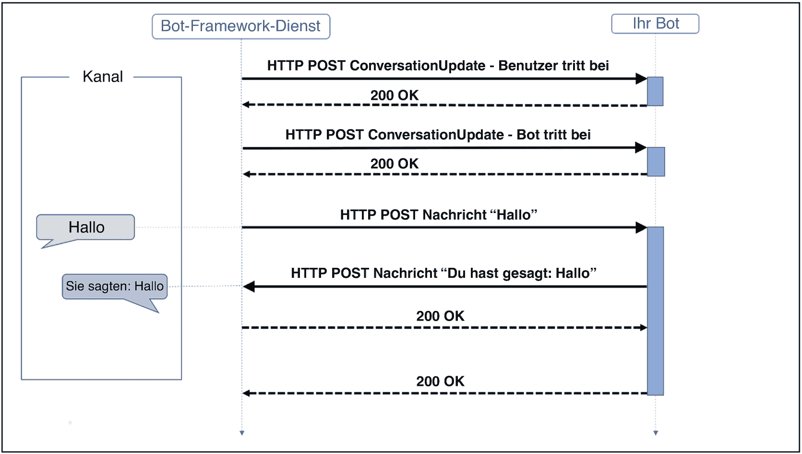

图 2.1 Bot Framework 活动流程。（来源：[`docs.microsoft.com/en-us/azure/bot-service/bot-builder-basics`](https://docs.microsoft.com/en-us/azure/bot-service/bot-builder-basics)）

这个简单的对话由两条消息组成：一条来自用户发送给 Bot，内容是“你好”；另一条来自 Bot 回复给用户，内容是“你说了“你好””。然而，这个对话还涉及其他活动。首先，Bot Framework 服务向 Bot 发送一个类型为`ConversationUpdate`的活动，表明有新用户加入了对话。在 Bot 向 Bot Framework 服务返回`HTTP 200 OK`以确认对话可以开始后，Bot Framework 服务与 Bot 之间会交换第二个`ConversationUpdate`活动，表明 Bot 也加入了对话。之后，Bot 才能接收用户的消息。消息本身也是类型为`Message`的活动，它们通过 Bot Framework 服务在渠道和 Bot 之间交换。当 Bot 发送一个消息活动时，用户使用的渠道负责渲染该消息，消息可以包含文本、图像、卡片或其他富媒体附件，如音频、视频、按钮或要朗读的文本。在这个简单的例子中，Bot 响应用户发送的消息活动，但 Bot 也可以响应其他活动类型，例如`ConversationUpdate`活动，以便在用户进入对话时向其打招呼，这被称为“主动消息传递”，将在后面的章节中描述。

如上图所示，活动是通过`HTTP-POST`请求发送的。尽管协议没有规定`HTTP`请求的确切顺序，但这些请求是嵌套的。这意味着出站请求（即从 Bot 到用户的请求）是在入站请求（即从用户到 Bot 的请求）的框架内执行的。这确保了 Bot 之间交换活动时的顺序得以保持。

Bot Framework SDK 使用一种称为`turn`（轮次）的模式，将传入的活动与属于该传入活动的所有传出活动分组。这可以类比人们说话的方式，即轮流进行，一个接一个。因此，轮次可以定义为对特定活动的处理。在一个轮次内，有一个轮次上下文对象，它本质上是活动的信息存储。这个轮次上下文通常存储关于发送者、接收者、渠道以及其他成功处理活动所需的必要元数据的信息。轮次上下文在 Bot 的所有不同层（例如中间件组件或 Bot 逻辑）中都是可访问的，因此这些组件可以随时检索活动详情。此外，轮次上下文还允许中间件组件和 Bot 的应用程序逻辑发送传出活动，这使其成为 Bot Framework SDK 中的关键组件之一。

## 活动处理

如果您查看图 2.2，它本质上展示了前文提到的 Echo Bot 示例中的活动处理过程，您会发现幕后还有更多事情发生。在 Bot Framework 服务接收到一个传入活动后，它会调用相应适配器的`ProcessActivity`方法。在渠道和 Bot 之间作为`HTTP-POST`请求发送的每个活动，始终包含一个`JSON`负载。这个负载在传递给适配器的`ProcessActivity`方法之前，会被反序列化为一个`Activity`对象。适配器接收到反序列化的活动对象后，会创建一个新的轮次上下文。利用这个新的轮次上下文对象，适配器随后调用中间件组件来处理这个轮次上下文。由于轮次上下文提供了发送传出活动的能力，它还提供了异步运行的发送、更新和删除响应功能。

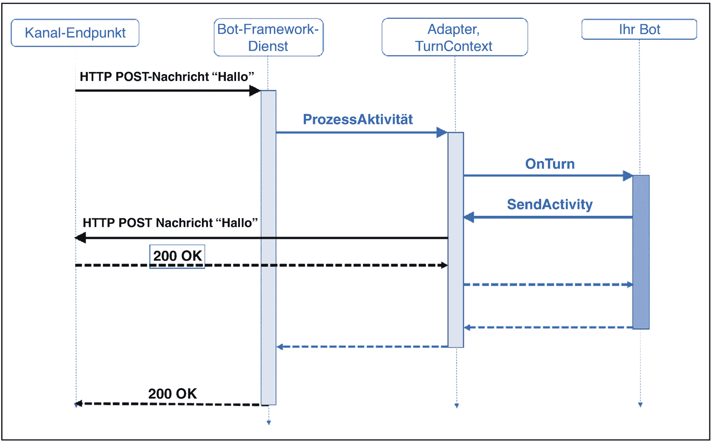

图 2.2 Bot Framework 活动堆栈。（来源：[`docs.microsoft.com/en-us/azure/bot-service/bot-builder-basics`](https://docs.microsoft.com/en-us/azure/bot-service/bot-builder-basics)）

## 活动处理程序

当机器人接收到新的活动时，它会调用活动处理程序。Bot Framework SDK 中的主要活动是轮次处理程序，所有活动都通过它进行路由。然后，轮次处理程序会调用所有其他处理程序，以处理表 2.1 中为 C# 描述的特定活动类型。

表 2.1 Bot Framework 活动处理程序 C#。（来源：[`docs.microsoft.com/en-us/azure/bot-service/bot-builder-basics`](https://docs.microsoft.com/en-us/azure/bot-service/bot-builder-basics)）

| 处理程序名称 | 事件 | 描述 |
| --- | --- | --- |
| `OnTurnAsync` | 每种接收到的活动类型 | 根据接收到的活动类型，调用其他处理程序之一。 |
| `OnMessageActivityAsync` | 接收到的消息活动 | 处理消息活动。 |
| `OnConversationUpdateActivityAsync` | 接收到的对话更新活动 | 当机器人以外的成员加入或离开对话时，在`conversationUpdate`活动上调用一个处理程序。 |
| `OnMembersAddedAsync` | 非机器人成员已加入对话 | 处理加入对话的成员。 |
| `OnMembersRemovedAsync` | 非机器人成员已离开对话 | 处理离开对话的成员。 |
| `OnEventActivityAsync` | 接收到的事件活动 | 在事件活动上调用特定于事件类型的处理程序。 |
| `OnTokenResponseEventAsync` | 接收到的令牌响应事件活动 | 处理令牌响应事件。 |
| `OnEventAsync` | 接收到的非令牌响应事件活动 | 处理其他类型的事件。 |
| `OnMessageReactionActivityAsync` | 接收到的消息反应活动 | 当一条消息被添加或移除一个或多个反应时，在`messageReaction`活动上调用一个处理程序。 |
| `OnReactionsAddedAsync` | 添加到消息的反应 | 处理添加到消息的反应。 |
| `OnReactionsRemovedAsync` | 从消息中移除的消息反应 | 处理从消息中移除的反应。 |
| `OnUnrecognizedActivityTypeAsync` | 其他接收到的活动类型 | 处理任何其他未处理的活动类型。 |

表 2.2 概述了 Microsoft Bot Framework JavaScript SDK 的各种活动处理程序。

表 2.2 Bot Framework 活动处理程序 JavaScript。（来源：[`docs.microsoft.com/en-us/azure/bot-service/bot-builder-basics`](https://docs.microsoft.com/en-us/azure/bot-service/bot-builder-basics)）

| 处理程序名称 | 事件 | 描述 |
| --- | --- | --- |
| `onTurn` | 每种接收到的活动类型 | 注册一个监听器以接收活动。 |
| `onMessage` | 接收到的消息活动 | 注册一个监听器以接收消息活动。 |
| `onConversationUpdate` | 接收到的对话更新活动 | 当接收到`conversationUpdate`活动时注册一个监听器。 |
| `onMembersAdded` | 成员已加入对话 | 注册一个监听器，指示成员（包括机器人）何时加入对话。 |
| `onMembersRemoved` | 成员已离开对话 | 注册一个监听器，指示成员（包括机器人）何时离开对话。 |
| `onMessageReaction` | 接收到的消息反应活动 | 当接收到`messageReaction`活动时注册一个监听器。 |
| `onReactionsAdded` | 添加到消息的反应 | 注册一个监听器，用于向消息添加反应。 |
| `onReactionsRemoved` | 从消息中移除的消息反应 | 注册一个监听器，用于从消息中移除反应。 |
| `onEvent` | 接收到的事件活动 | 注册一个监听器以接收事件活动。 |
| `onTokenResponseEvent` | 接收到的令牌响应事件活动 | 注册一个监听器以接收令牌响应事件。 |
| `onUnrecognizedActivityType` | 其他接收到的活动类型 | 注册一个监听器，用于处理未定义特定活动类型处理程序的情况。 |
| `onDialog` | 活动处理程序已完成 | 在所有适用的处理程序完成后调用。 |

## 状态

从机器人的角度来看，可以将状态视为机器人的思维或记忆。从这个意义上说，机器人能够记住关于用户或对话的信息。这使得机器人可以访问用户曾经写过的特定信息，例如，这样机器人就不必在后续对话中再次询问这些信息。状态中存储的信息通常也比特定轮次内的信息可用时间更长。因此，该组件使机器人能够进行所谓的多轮对话，即超过一轮的对话。机器人的状态由几个不同的层组成：所有这些组件都相互连接，并提供了集成在 Bot Framework SDK 中的复杂状态管理。图 2.3 展示了状态处理的流程以及不同组件之间的交互。

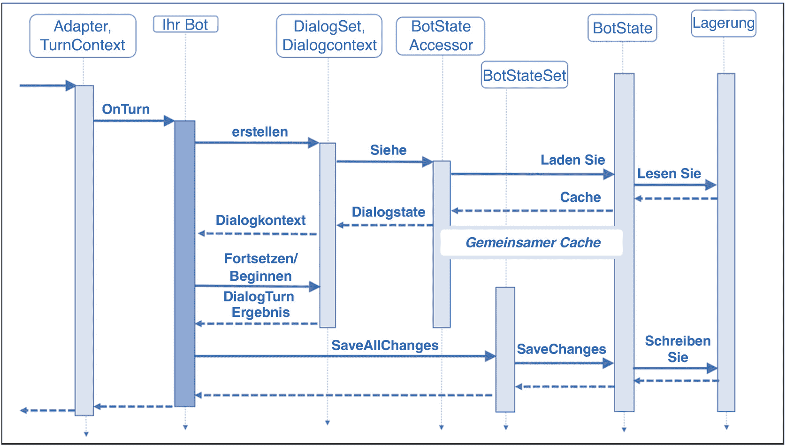

图 2.3 Bot Framework 状态管理。（来源：[`docs.microsoft.com/en-us/azure/bot-service/bot-builder-concept-state`](https://docs.microsoft.com/en-us/azure/bot-service/bot-builder-concept-state)）

- **存储层**
- **状态管理层**
- **属性访问器状态**

所有这些组件都相互连接，并提供了集成在 Bot Framework SDK 中的复杂状态管理。

上图中的实线箭头表示由特定机器人组件执行的单个方法调用，而虚线箭头则表示由此产生的响应。状态通常存储在存储层中，在该图中，存储层是最右侧的组件。集成存储解决方案来保存状态的方式有很多种，例如内存、数据库或其他文件存储解决方案。Bot Framework SDK 已集成了其中一些解决方案：SDK 中的状态管理组件允许自动读取和写入机器人中的状态，该状态与您定义的存储层相连接。状态信息本身作为状态属性进行存储。这些状态属性是键值对，允许您定义对象结构，因为您可以将状态属性定义为类。因此，当您检索状态属性时，您会知道这些对象数据的结构是什么样的，这便于您在代码中进行处理。状态属性从一开始就被分为三个不同的组：要访问状态属性，Bot Framework SDK 提供了所谓的状态属性访问器。这些组件允许在您的机器人内读取和写入状态属性，并在轮次（Turn）中提供`Get`、`Set`和`Delete`方法。当您在轮次中使用`get`方法获取特定状态属性时，SDK 会将该信息加载到本地机器人缓存中。因此，信息存储在本地缓存中，因为这样比每次访问存储来检索状态信息性能更高。此外，您可以使用访问器将状态属性视为局部变量，也就是说，您可以在代码中操作它们。为了保留本地缓存的状态属性，您必须使用访问器提供的`SaveChanges`方法，将存储在本地缓存状态对象中的信息保存到存储中。请务必记住，只有状态组内设置的那些属性才会被持久化到存储中，而不会影响其他属性。这样，就可以将所有信息从本地缓存保存到存储中的对话状态，而无需将信息保存到存储中的用户状态。为了避免冲突，以最后一次写入为准，即具有最新写入时间戳的写入操作会覆盖针对特定属性的所有其他更早执行的操作。

*   **用户状态**
    *   这种类型的状态属性可用于存储与该机器人在特定频道上通信的用户的任何信息。用户状态在每个轮次中都可访问，且不依赖于当前对话。因此，应使用此状态属性来存储用户信息，例如姓名、偏好或用户特定的设置，以及用户之前与机器人对话的信息。这些信息可以在单个对话的整个持续时间内保留。

*   **对话状态**
    *   对话状态属性在特定对话内的每个轮次中都可用，与用户无关。这意味着它也可以用于群组对话场景（例如 Microsoft Teams 频道中的对话）。因此，应使用此属性来存储信息，例如机器人已经向用户提出了哪些问题，或者当前对话的主题是什么。

*   **私有对话状态**
    *   此属性可以看作是前两者的组合，即它针对特定的对话和特定的用户。相应地，它主要用于群组对话，因为您可以在此属性内存储群组聊天中特定于用户的对话信息。

要访问状态属性，Bot Framework SDK 提供了所谓的状态属性访问器。这些组件允许在您的机器人内读取和写入状态属性，并提供

*   **存储空间**
    *   内存应仅用于测试目的，因为它专为本地测试机器人而设计和考虑，这种存储类型相当临时。另一个缺点是，当您在 Azure 中将机器人作为 Web 应用运行时，通常需要为分配的资源量付费。如果您计划使用内存来存储状态，这可能会导致更高的成本，因为您需要分配相当大的内存量。另一个缺点是，每当机器人或包含代码的 Web 应用因更新或服务中断而重启时，状态都会被清除。

*   **Azure Blob 存储**
    *   Azure Blob 存储功能提供了将状态信息存储在 Azure 存储帐户内的 Blob 中的能力。这样做的好处是，您可以持久化数据，并将机器人的逻辑与状态存储组件分离。

*   **Azure Cosmos DB 存储**
    *   在较大的场景中，使用 Azure Cosmos DB 而不是 Azure Blob 存储来存储状态信息是合理的，因为 Cosmos DB 通常在可伸缩性和可用性方面提供更大的灵活性，但这当然也可能导致与 Azure Blob 存储相比更高的成本。

SDK 中的状态管理组件允许自动读取和写入机器人中的状态，该状态与您定义的存储层相连接。状态信息本身作为状态属性进行存储。这些状态属性是键值对，允许您定义对象结构，因为您可以将状态属性定义为类。因此，当您检索状态属性时，您会知道这些对象数据的结构是什么样的，这便于您在代码中进行处理。状态属性从一开始就被分为三个不同的组。

## 对话

对话本质上是您机器人的核心，因为它负责管理对话，并引导用户遍历对话树。一个对话可以比作机器人内部的功能，这些功能基本上按特定顺序执行特定任务。对话的触发方式可能有所不同，有时会因特定的用户消息而执行，有时触发者是另一个指示应开始新对话部分的服务，或者是一个对话调用另一个对话以继续对话。由于对话是 Bot Framework SDK 的关键概念之一，因此 SDK 已经包含了一些预构建的功能，例如提示或瀑布式对话，这些功能只需很少的实现工作即可使用。在使用 Bot Framework 创建机器人时，建议先勾勒出要实现的对话树，以便了解需要在代码中实现对话的哪些部分。图 2.4 展示了 SDK 原生支持的对话类型和提示。

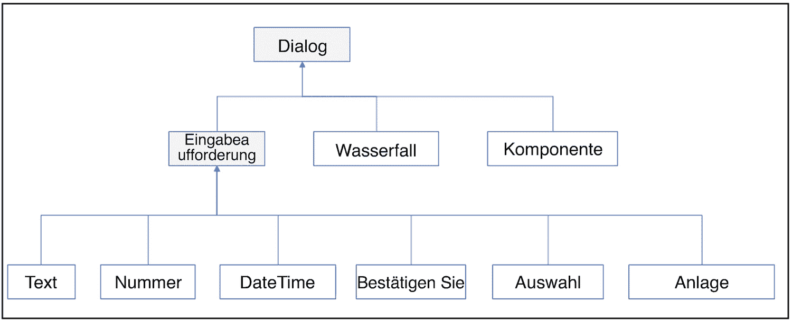

图 2.4 Bot Framework 中的预构建对话和提示类型。（来源：[`docs.microsoft.com/en-us/azure/bot-service/bot-builder-concept-dialog`](https://docs.microsoft.com/en-us/azure/bot-service/bot-builder-concept-dialog)）

提示是收集用户信息的最简单形式。提示功能提供了多种不同类型的提示，如表 2.3 所示。

表 2.3

Bot Framework 提示类型。（来源：[`docs.microsoft.com/en-us/azure/bot-service/bot-builder-concept-dialog`](https://docs.microsoft.com/en-us/azure/bot-service/bot-builder-concept-dialog)）

| 提示类型 | 描述 | 返回值 |
| --- | --- | --- |
| **附件提示** | 询问一个或多个附件，例如文档或图片。 | 附件对象的集合。 |
| **选择提示** | 从一系列选项中询问选择。 | 一个找到的选择对象。 |
| **确认提示** | 请求确认。 | 一个布尔值。 |
| **日期时间提示** | 询问日期和时间。 | 包含日期和时间解析结果的对象的集合。 |
| **数字提示** | 询问一个数字。 | 一个数值。 |
| **文本提示** | 询问一般的文本输入。 | 一个字符串。 |

提示是对话的最简单形式，因为它只包含两个步骤。首先，触发提示并要求用户输入。其次，评估输入并返回响应。每个提示都有提示选项，可用于设置提示文本、重试提示（即验证失败时触发的提示），如果是选择提示，还可以在选项中设置回答选项。如果您希望在预定义规则之外添加自己的验证规则，只需将自定义验证器添加到您的提示中即可。然后，提示会先执行预定义的检查，再执行自定义的检查。一个简单的例子是询问用户一个飞行目的地。在这种情况下，您可能会使用文本提示来询问机场名称。但这里的验证可能相当棘手，因为标准的文本验证只会检查输入是否为文本。但这意味着用户也可以输入任何其他类型的文本，这并非您真正想要的。因此，您可以实现一个自定义验证器，将输入与机场名称和缩写集合进行比较，以确定用户是否输入了有效的机场名称，然后再继续对话。如果验证失败，提示会调用重试提示，再次询问用户机场名称。选择、确认、日期、时间和数字提示还会使用提示的区域设置来确定特定于语言的情况。区域设置是从机器人连接的渠道获取的，因此可以在提示中实现多语言场景。

瀑布式对话主要用于以瀑布式的方式收集信息。瀑布式对话的目标是向用户提出一系列问题（以提示的形式），以收集所需的信息。最重要的是，机器人不是提出一个问题来获取一系列答案，而是通过一系列问题逐个询问每个答案。在机器人向用户提出一个问题后，用户必须回答该问题。当机器人收到该答案并成功验证后，将执行下一个提示。此过程将持续进行，直到所有提示都得到回答并且收集到所需的信息，这可能如图 2.5 所示。

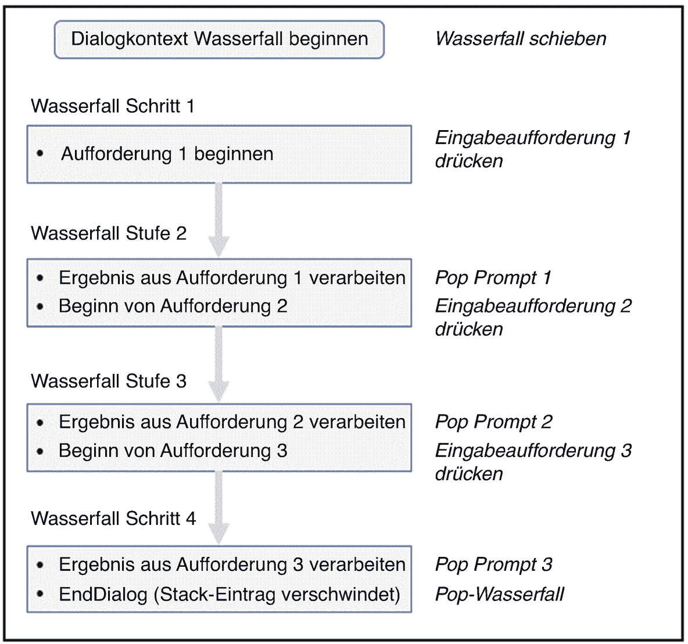

图 2.5

Bot Framework 中瀑布式对话的示例。（来源：[`docs.microsoft.com/en-us/azure/bot-service/bot-builder-concept-dialog`](https://docs.microsoft.com/en-us/azure/bot-service/bot-builder-concept-dialog)）

在单个瀑布式对话内部，有一个所谓的瀑布步骤上下文，用于存储和访问对话上下文以及状态。由于瀑布式对话本质上由一系列提示组成，您还应该考虑对特定提示的用户回答进行验证，以避免使用无效值调用下一步。这可以通过使用上下文参数 `prompt validator` 来实现，该参数是提示功能的一部分。此参数返回一个布尔值，指示用户回答验证是否成功。

## 瀑布式对话

瀑布式对话主要针对特定用例设计。不过，SDK 也提供了一种称为组件对话的对话类型，专为复用而设计。这种对话类型被设计为具有一定独立性，因此你可以为特定用例创建组件对话，然后将其作为包导出，以便集成到其他机器人中。在组件对话内部，你可以插入一系列瀑布式对话或提示，它们被分组为一个对话集。

负责管理对话的组件称为对话上下文。该对话上下文提供了开始、替换、继续、结束或取消对话的方法。你可以将机器人中的所有对话视为一个对话栈，而前文提到的轮次处理程序则是控制对话栈的组件。当对话栈在某个时刻为空时，轮次处理程序也会作为备用机制来继续对话。

当你开始一个新对话时，它会被推送到对话栈的顶部，并成为活动对话。它会保持活动状态，直到该对话结束、被取消，或因被栈内另一个对话替换而移出栈。替换对话通常通过活动对话内的 `replace dialog` 方法进行。当替换了前一个对话的对话结束后，它会从对话栈中移除，而前一个对话由于重新位于栈顶，会再次成为活动对话。通过这种方式，你可以在特定对话中实现分支，这在用户中断等场景中非常有用。

## 中间件

中间件组件在适配器和机器人之间实现。中间件的概念是为了在特定轮次之前或之后处理活动而设计的。因此，中间件组件可以被视为机器人活动管道中的活动前或活动后处理引擎。在机器人初始化期间，启动或重启后，适配器会将所有配置的中间件组件添加到其中间件集合中。适配器将中间件组件添加到其栈中的顺序，决定了哪个中间件组件按何种顺序被调用。图 2.6 概述了通用的中间件处理概念。

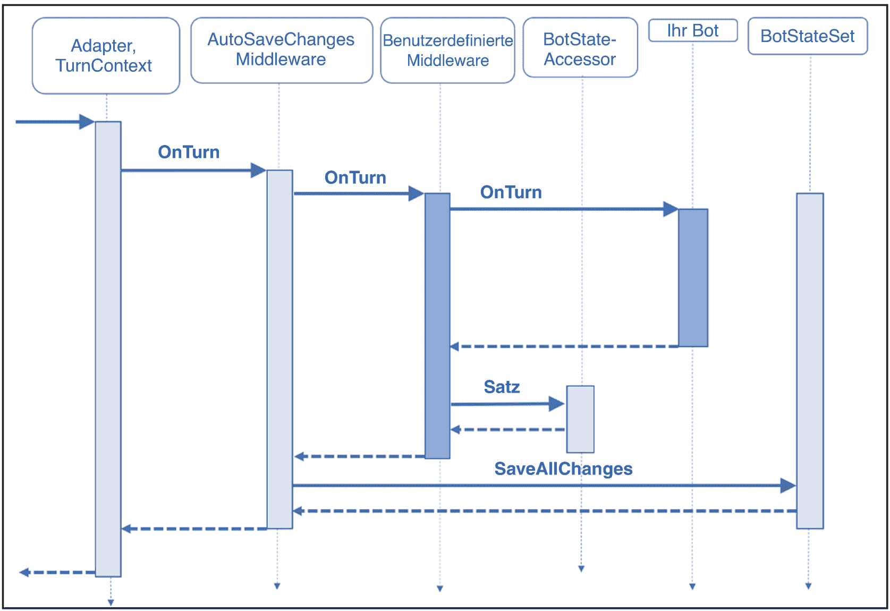

图 2.6

Bot Framework 中间件概念。（来源：[`docs.microsoft.com/en-us/azure/bot-service/bot-builder-concept-middleware`](https://docs.microsoft.com/en-us/azure/bot-service/bot-builder-concept-middleware)）

如果你在项目中实现了多个中间件组件，中间件组件的调用顺序就相当重要。例如，你可能实现了一个中间件，用于将所有与活动相关的信息记录到 Azure 存储或 Application Insights 中。然后，你可能想使用另一个中间件组件来翻译非英语接收的消息活动，因为你的机器人和它所连接的知识库只支持英语作为语言。因此，你可能希望在翻译之前，将用户以原始语言接收的所有信息记录到 Azure 服务中，以便保留原始消息。此外，中间件组件不仅用于处理传入活动，也用于处理传出活动。沿用之前的例子，我们可以将负责翻译传入消息的同一个中间件，也用于翻译传出消息，以完全支持多语言场景。

如上图所示，每个中间件都实现了一个 `next()` 调用，该调用指示应执行下一层，下一层可以是另一个中间件或机器人逻辑。如果未调用此 `next` 方法，则后续层将不会执行，这被称为短路。这在某些场景下可能是有益的，例如，当当前轮次由于错误等原因需要在被轮次处理程序处理之前中止时。结果是，尽管轮次处理程序未被调用，但执行短路的中间件内部的逻辑仍会执行，并且机器人的对话会处于安全状态。

## 机器人项目结构

在接下来的章节中，将引导你了解用 C# 和 JavaScript 编写的简单 Echo 机器人的基本项目结构。更详细的解释和扩展将在后续章节中介绍。

## Echo Bot 逻辑 C#

无论您是使用前文提到的 Visual Studio Bot Framework 扩展，还是使用 .NET Core CLI 创建 Bot Framework Echo Bot 项目，核心 Bot 的典型项目结构都如图 2.7 所示。

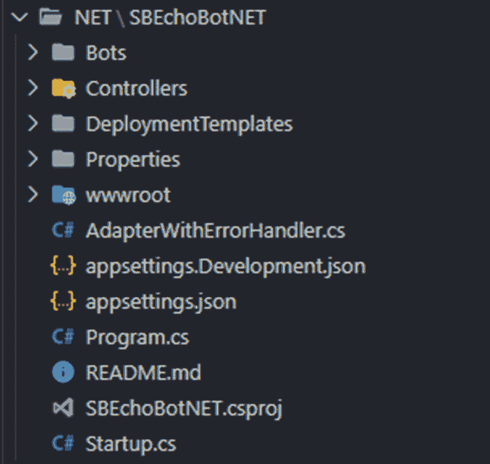

**注意：** 有关使用 Bot Framework SDK for .NET 开发 Bot 的详细先决条件列表，请参阅 [`docs.microsoft.com/en-us/azure/bot-service/dotnet/bot-builder-dotnet-sdk-quickstart`](https://docs.microsoft.com/en-us/azure/bot-service/dotnet/bot-builder-dotnet-sdk-quickstart)。

`Program.cs` 基本上是 Bot 项目的入口点。它创建一个新文件，定义要使用的主机以及要使用的启动类，在我们的例子中是 `Startup.cs`：

```csharp
using Microsoft.AspNetCore;
using Microsoft.AspNetCore.Hosting;
namespace SBEchoBotNET
{
    public class Program
    {
        public static void Main(string[] args)
        {
            CreateWebHostBuilder(args).Build().Run();
        }
        public static IWebHostBuilder CreateWebHostBuilder(string[] args) =>
            WebHost.CreateDefaultBuilder(args)
                .UseStartup<Startup>();
    }
}
```

`Startup.cs` 是定义所有配置组件的类。此外，它将 Bot 创建为瞬态文件，以便我们可以在项目中使用它：

```csharp
using Microsoft.AspNetCore.Builder;
using Microsoft.AspNetCore.Hosting;
using Microsoft.AspNetCore.Mvc;
using Microsoft.Bot.Builder;
using Microsoft.Bot.Builder.Integration.AspNet.Core;
using Microsoft.Bot.Connector.Authentication;
using Microsoft.Bot.Builder.BotFramework;
using Microsoft.Extensions.Configuration;
using Microsoft.Extensions.DependencyInjection;
using SBEchoBotNET.Bots;
namespace SBEchoBotNET
{
    public class Startup
    {
        public Startup(IConfiguration configuration)
        {
            Configuration = configuration;
        }
        public IConfiguration Configuration { get; }
        // 此方法由运行时调用。使用此方法向容器添加服务。
        public void ConfigureServices(IServiceCollection services)
        {
            services.AddMvc().SetCompatibilityVersion(CompatibilityVersion.Version_2_1);
            // 创建启用了错误处理的 Bot Framework 适配器。
            services.AddSingleton<IBotFrameworkHttpAdapter, AdapterWithErrorHandler>();
            // 将 Bot 创建为瞬态。在这种情况下，ASP 控制器期望一个 IBot。
            services.AddTransient<IBot, EchoBot>();
        }
        // 此方法由运行时环境调用。使用此方法配置 HTTP 请求管道。
        public void Configure(IApplicationBuilder app, IHostingEnvironment env)
        {
            if (env.IsDevelopment())
            {
                app.UseDeveloperExceptionPage();
            }
            else
            {
                app.UseHsts();
            }
            app.UseDefaultFiles();
            app.UseStaticFiles();
            app.UseWebSockets();
            //app.UseHttpsRedirection();
            app.UseMvc();
        }
    }
}
```

如您在前面的代码中所见，`services.AddSingleton<IBotFrameworkHttpAdapter, AdapterWithErrorHandler>();` 这一行将 `AdapterWithErrorHandlers` 添加到我们的服务中。适配器负责将 Bot 连接到服务端点，例如使用 Bot Connector 服务的 Azure Bot Service。此外，适配器用于处理身份验证机制，并用于在 Bot 和 Bot Connector 服务之间交换活动。适配器收到新活动后，首先创建轮次上下文，然后调用 Bot 逻辑，该逻辑将创建的轮次上下文传递以进行进一步处理。Bot 逻辑处理完活动后，适配器将传出活动发送回频道。此外，适配器负责管理和调用中间件管道，以便在轮次之前或之后对活动进行预处理或后处理。由于 Echo Bot 模板中没有添加预定义的中间件，`AdapterWithErrorHandlers.cs` 如下所示：

```csharp
using Microsoft.Bot.Builder.Integration.AspNet.Core;
using Microsoft.Bot.Builder.TraceExtensions;
using Microsoft.Extensions.Configuration;
using Microsoft.Extensions.Logging;
namespace SBEchoBotNET
{
    public class AdapterWithErrorHandler : BotFrameworkHttpAdapter
    {
        public AdapterWithErrorHandler(IConfiguration configuration, ILogger<AdapterWithErrorHandler> logger) : base(configuration, logger)
        {
            OnTurnError = async (turnContext, exception) =>
            {
                // 记录应用程序中任何未处理的异常。
                logger.LogError(exception, $"[OnTurnError] 未处理的错误 : {exception.Message}");
                // 向用户发送消息
                await turnContext.SendActivityAsync("Bot 遇到了错误或 bug。");
                await turnContext.SendActivityAsync("要继续运行此 Bot，请修正 Bot 源代码。");
                // 发送将在 Bot Framework Emulator 中显示的跟踪活动
                await turnContext.TraceActivityAsync("OnTurnError Trace", exception.Message, "https://www.botframework.com/schemas/error", "TurnError");
            };
        }
    }
}
```

Bot 逻辑通常位于 `EchoBot.cs` 文件中，在我们的例子中，该文件非常精简。由于 Echo Bot 仅需回显用户所说的话，因此我们的 Bot 逻辑中只有两个方法：`OnMessageActivityAsync()` 方法返回用户的输入，而 `OnMembersAddedAsync()` 方法在用户加入对话时主动向其发送“你好，欢迎！”的问候。我们的 `EchoBot.cs` 的完整实现如下所示：

```csharp
using System.Collections.Generic;
using System.Threading;
using System.Threading.Tasks;
using Microsoft.Bot.Builder;
using Microsoft.Bot.Schema;
namespace SBEchoBotNET.Bots
{
    public class EchoBot : ActivityHandler
    {
        protected override async Task OnMessageActivityAsync(ITurnContext turnContext, CancellationToken cancellationToken)
        {
            var replyText = $"Echo: {turnContext.Activity.Text}";
            await turnContext.SendActivityAsync(MessageFactory.Text(replyText, replyText), cancellationToken);
        }
        protected override async Task OnMembersAddedAsync(IList<ChannelAccount> membersAdded, ITurnContext turnContext, CancellationToken cancellationToken)
        {
            var welcomeText = "你好，欢迎！";
            foreach (var member in membersAdded)
            {
                if (member.Id != turnContext.Activity.Recipient.Id)
                {
                    await turnContext.SendActivityAsync(MessageFactory.Text(welcomeText, welcomeText), cancellationToken);
                }
            }
        }
    }
}
```

* `OnMessageActivityAsync`：此方法是前面提到的 C# 活动处理程序之一，用于处理特定轮次内的消息。

* `OnMembersAddedAsync`：此方法是另一个 C# 活动处理程序，用于处理加入对话的成员。

### BotController.cs

我们项目中最后一个缺失的部分是 `BotController.cs` 文件。该控制器定义了机器人内部消息和 HTTP 调用的路由。如下所示，我们为机器人定义的唯一路由是 `"api/messages"`。`PostAsync()` 方法会调用适配器来处理传入的 HTTP 请求。因此，当您与机器人通信时，您使用的渠道或应用程序应将所有 HTTP 请求发送到 `"api/messages"` 路由，以确保它们被您的机器人接收：

# Echo 机器人逻辑 JavaScript

要创建一个用于使用 JavaScript 开发机器人的 Bot Framework 项目，您需要使用 Yeoman 生成器创建机器人项目。在命令行中，导航到您要创建项目的目录，并运行以下命令来安装先决条件：

```
npm install -g npm
npm install -g yo
npm install -g generator-botbuilder
# 仅在 Windows 系统上运行此命令。请阅读上述说明。
npm install -g windows-build-tools
```

**注意**

有关使用 Bot Framework SDK for JavaScript 开发机器人的先决条件的详细列表，请参阅 [`docs.microsoft.com/en-us/azure/bot-service/javascript/bot-builder-javascript-quickstart`](https://docs.microsoft.com/en-us/azure/bot-service/javascript/bot-builder-javascript-quickstart)。

成功安装先决条件后，您需要运行以下命令并回答 Yeoman 生成器提出的问题，以创建一个新的 Bot Framework 项目：

```
yo botbuilder
```

当您开发 JavaScript 机器人时，运行 Yeoman 生成器后生成的项目结构如图 2.8 所示。

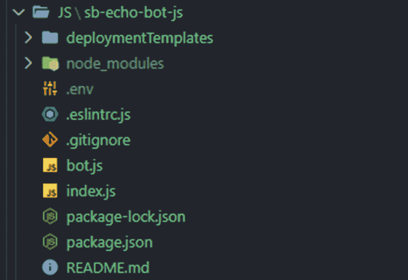

您会发现，与 C# 模板相比，这要精简得多，这源于 JavaScript 作为编程语言的特性。在 C# 中分散在多个文件中的内容，在您的 JS 项目中会保存在一个文件中。`index.js` 需要包含一些依赖项才能集成到机器人项目中，您可以在此处看到这些依赖项：

```
const dotenv = require('dotenv');
const path = require('path');
const restify = require('restify');
// 导入所需的机器人服务。
const { BotFrameworkAdapter } = require('botbuilder');
// 此机器人的主对话框。
const { MyBot } = require('./bot');
// 导入所需的机器人配置。
const ENV_FILE = path.join(__dirname, '. env');
dotenv.config({ path: ENV_FILE });
```

`index.js` 文件包含您适配器的实现：

```
// 创建适配器。
// 访问 https://aka.ms/about-bot-adapter 了解更多关于机器人工作原理的信息。
const adapter = new BotFrameworkAdapter({
appId: process.env.MicrosoftAppId,
appPasswort: process.env.MicrosoftAppPasswort
});
```

HTTP 服务器也在此文件中使用名为 `restify` 的 JavaScript 库创建：

```
// 创建 HTTP 服务器
const server = restify.createServer();
server.listen(process.env.port || process.env.PORT || 3978, () => {
console.log(`n${ server.name } listening to ${ server.url }`);
console.log(`n 获取 Bot Framework 模拟器: https://aka.ms/botframework-emulator`);
console.log(`要测试您的机器人，请参阅: https://aka.ms/debug-with-emulator`);
});
```

此外，`index.js` 还按如下方式创建机器人控制器：

```
// 等待传入请求。
server.post('/api/messages', (req, res) => {
adapter.processActivity(req, res, async (context) => {
// 转发到主对话框。
await myBot.run(context);
});
});
```

此外，还会实例化机器人和它的主对话框，每当有新活动到达时，它们都会被调用：

```
// 创建主对话框。
const myBot = new MyBot();
```

第二个需要查看的文件是 `bot.js`。此文件也包含两个与 C# 实现类似的方法，具体如下：在我们的例子中，`onMembersAdded()` 函数会在每个新用户加入对话时向他们打招呼“你好，欢迎！”，而 `onMessage()` 函数则会原样返回用户所说的话。

```javascript
const { ActivityHandler } = require('botbuilder');
class MyBot extends ActivityHandler {
constructor() {
super();
// 有关消息和其他活动类型的更多信息，请访问 https://aka.ms/about-bot-activity-message
this.onMessage(async (context, next) => {
await context.sendActivity(`您说了 '${ context.activity.text }'`);
// 通过调用 next() 确保执行下一个 BotHandler
await next();
});
this.onMembersAdded(async (context, next) => {
const membersAdded = context.activity.membersAdded;
for (let cnt = 0; cnt < membersAdded.length; ++cnt) {
if (membersAdded[cnt].id !== context.activity.recipient.id) {
await context.sendActivity('您好，欢迎！');
}
}
// 通过调用 next() 确保执行下一个 BotHandler
await next();
});
}
}
module.exports.MyBot = MyBot;
```

- `onMessage`: 此方法是前面提到的 JavaScript 活动处理程序之一，用于处理特定轮次内的消息。

- `onMembersAdded`: 此方法是另一个 JavaScript 活动处理程序，用于处理成员加入对话的情况。

在我们的案例中，该函数

在 JavaScript 项目中，存储配置的文件称为 `.env` 文件，它可以与 C# 项目中的 `appsettings.json` 相类比。此文件通常存储所有配置设置，例如 `appId`、`appPassword` 或 Bot 中使用的其他连接字符串。创建项目后，Echo Bot 的 `.env` 文件基本如下所示：

```
MicrosoftAppId=
MicrosoftAppPassword=
```

由于本章旨在概述前文提到的 Bot 组件的基本原理，因此将展示 Bot Framework 项目中的关键要素。在后续章节中，我们将再次回顾其中一些组件，并研究如何自定义它们以增强 Bot 的功能。

## Bot Framework 技能：可重用的 Bot 组件

Bot Framework 中的技能是 Bot 的可重用组件，包括对话元素。Bot Framework 提供了一种扩展模型，开发人员可以独立开发技能，然后将其集成到 Bot 中。这提供了开发和维护企业级 Bot 场景的灵活性，该场景集成了针对不同用例的各种技能。过去有两种解决方式：要么创建一个在其逻辑中包含所有用例功能的 Bot，要么为不同的用例创建单独的 Bot。第二种方式很快对最终用户来说变得相当不便，因为他们需要记住哪个 Bot 用于哪个用例。通过引入技能概念，开发人员可以开发独立的技能，然后通过执行调度和配置更改的单个命令行操作将其集成到一个 Bot 中。

技能本身也是一个 Bot，也可以独立使用。Microsoft Bot Framework SDK 提供了 C# 和 TypeScript 模板，用于使用模板创建新技能。表 2.4 显示了 SDK 中当前可用的技能，这些技能可以立即使用或根据需要进行自定义。

**表 2.4** 预定义的 Bot Framework 技能。（来源：[`https://docs.microsoft.com/en-us/azure/bot-service/bot-builder-skills-overview`](https://docs.microsoft.com/en-us/azure/bot-service/bot-builder-skills-overview)）

| 名称 | 描述 |
| --- | --- |
| **日历技能** | 为您的助手添加日历功能。由 Microsoft Graph 和 Google 支持。 |
| **电子邮件技能** | 为您的助手添加电子邮件功能。由 Microsoft Graph 和 Google 支持。 |
| **待办事项技能** | 为您的助手扩展任务管理功能。由 Microsoft Graph 支持。 |
| **兴趣点技能** | 查找兴趣点和路线。由 Azure Maps 和 FourSquare 支持。 |
| **汽车技能** | 用于演示车辆功能控制的行业垂直技能。 |
| **实验性技能** | 消息、餐厅预订和天气。 |

在接下来的章节中，我们将详细探讨如何开发这些技能并将其集成到 Bot Framework Bot 中。

## Azure Bot Service：Bot 托管平台

如前章所述，Azure Bot Service 是使用 Bot Framework 开发的 Bot 的托管平台。它是连接您的 Bot 与受支持渠道的粘合剂，并为您建立和管理这些连接。这简化了 Bot 在不同渠道中的部署，因为在某些情况下，只需点击几下即可激活一个渠道，然后 Bot 便可在该渠道中使用。当前支持的渠道列表请参见第 1 章。然而，Azure Bot Service 不仅用于将 Bot 连接到渠道，还用于在 Azure 门户内管理 Bot 的配置（[`https://portal.azure.com`](https://portal.azure.com)）。

它提供了一个完整的管理界面，您可以通过该门户管理 Bot 的所有相关事项，例如 Bot 句柄或显示名称、消息传递端点、用于保护 Bot 通信安全的 Microsoft 应用 ID 和应用密码，或用于指定分析 Bot 性能和行为的 Application Insights 服务的分析配置设置（见图 2.9）。

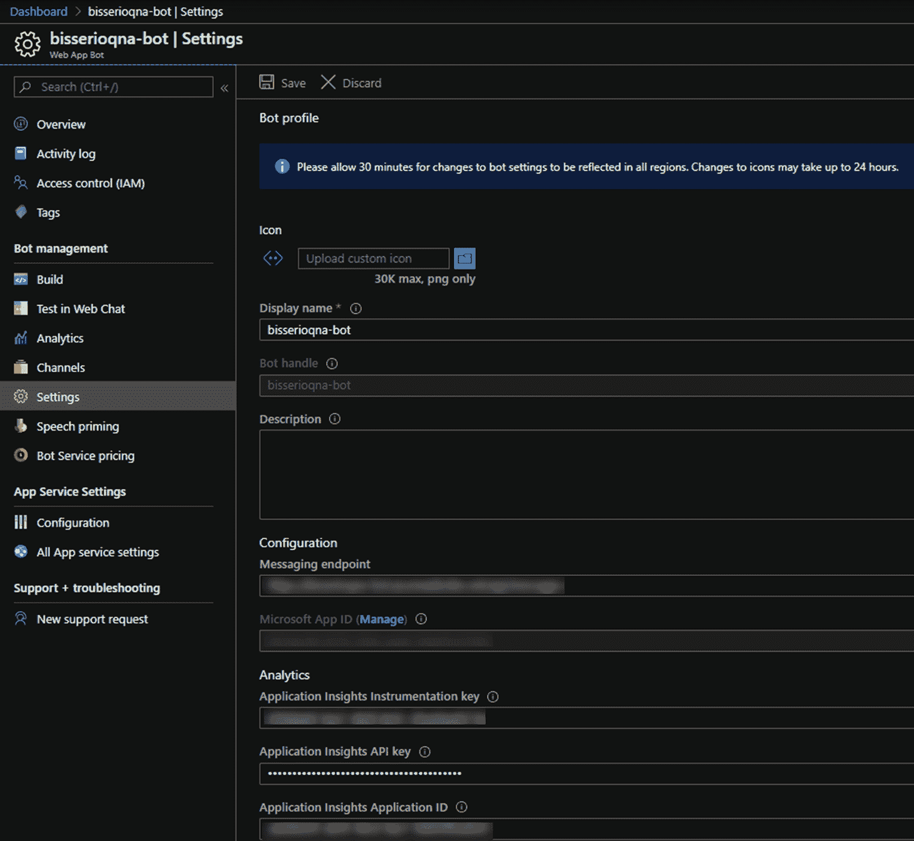

**图 2.9** Azure Bot Service 的管理界面

因此，Azure Bot Service 是将 Bot 集成到不同渠道并将 Bot 作为 Web 应用程序托管的最佳选择，无论是在 Azure（这是首选方式）还是在其他位置，例如本地数据中心或其他云服务提供商。

## Bot Framework SDK 工具产品

以下小节将描述 Bot Framework 中可用的工具，因为在后续章节中，当涉及如何设计、开发或部署使用 Bot Framework SDK 创建的 Bot 时，我们都会用到它们。

### Bot-Framework-Emulator

Bot Framework 生态系统提供的工具之一是 Bot Framework Emulator。这是一款用于测试和调试 Bot 的综合桌面应用程序，专注于 Bot 的本地开发和测试。此外，您还可以使用该模拟器测试和调试托管在 Microsoft Azure 或其他位置的 Bot，这为您调试使用 SDK 开发的 Bot 提供了更多细节。由于 Bot Framework 本身被定义为涵盖多种不同的开发平台，因此该模拟器也适用于多种平台：

*   Windows

*   OS X

*   Linux

**注意**

可以通过使用此链接从相应的 GitHub 仓库下载模拟器：[`aka.ms/botemulator`](https://aka.ms/botemulator)。

开发人员可以使用模拟器测试本地运行的 Bot。此外，开发人员还可以使用模拟器管理与 Bot 相关的服务（如 LUIS 或 QnA Maker），并跟踪和调试活动堆栈，如图 2.10 所示。

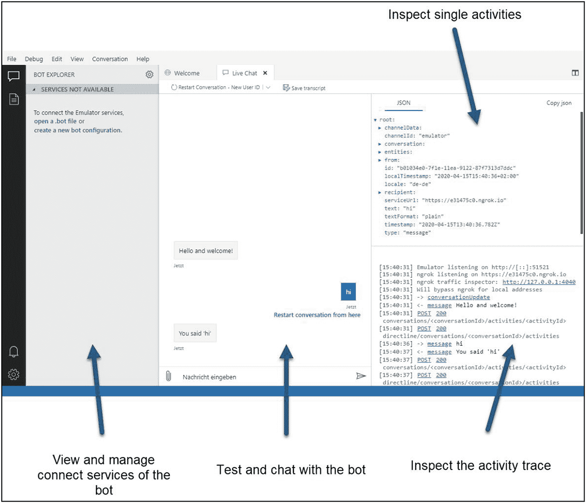

图 2.10

Bot Framework Emulator 概览

### Bot Framework Web Chat

由于 Bot Framework 的 Bot 可以集成到许多不同的渠道中，因此微软也提供了一种 Web 聊天解决方案。Bot Framework Web Chat 组件（可从此处 [`aka.ms/bfwebchat`](http://aka.ms/bfwebchat) 下载和使用）是一个高度可定制的组件，用于在 HTML 页面内呈现 Web 聊天。开发人员可以直接将 Web Chat 作为 HTML/JavaScript 组件嵌入 HTML 代码中使用，也可以使用微软开发的 React 组件来进一步自定义 Web Chat 客户端的外观和行为。

要使用 HTML 和 JavaScript 集成 Web Chat 组件，您通常需要在您的网站中插入以下几行代码：

```
html,
body {
height: 100%;
}
body {
margin: 0;
}
#webchat {
height: 100%;
width: 100%;
}

window.WebChat.renderWebChat(
{
directLine: window.WebChat.createDirectLine({
token: "YOUR_DIRECT_LINE_TOKEN"
}),
userID: 'YOUR_USER_ID',
username: 'Web Chat User',
locale: 'en-US',
botAvatarInitials: 'WC',
userAvatarInitials: 'WW'
},
document.getElementById('webchat')
);
```

上述代码将 Web Chat 组件集成到您的 HTML 页面中，并通过 DirectLine 令牌将其连接到您的 Bot Framework。DirectLine 协议的细节将在后续章节中解释，但 DirectLine API 基本上在您的 Bot 和您集成它的应用程序之间建立了安全通信。

如果您需要更灵活的自定义样式和行为方法，可以使用 React 组件将 Web Chat 集成到您的 Web 应用程序中，例如使用以下代码行：

```
import React, { useMemo } from 'react';
import ReactWebChat, { createDirectLine } from 'botframework-webchat';
export default () => {
const directLine = useMemo(() => createDirectLine({ token: 'YOUR_DIRECT_LINE_TOKEN' }), []);
return <ReactWebChat directLine={directLine} userID="YOUR_USER_ID" />;
};
```

为了了解哪种集成方法提供哪些功能，表 2.5 列出了两种方案的主要特性。

表 2.5

Bot Framework Web Chat 功能对比。（来源：[`github.com/Microsoft/BotFramework-WebChat`](https://github.com/Microsoft/BotFramework-WebChat)）

| 特性/功能 | CDN 包 | React |
| --- | --- | --- |
| **更改颜色** | ✓ | ✓ |
| **调整大小** | ✓ | ✓ |
| **更新/替换 CSS 样式** | ✓ | ✓ |
| **监听事件** | ✓ | ✓ |
| **与宿主网页交互** | ✓ | ✓ |
| **自定义渲染活动** |   | ✓ |
| **自定义渲染附件** |   | ✓ |
| **添加新的 UI 组件** |   | ✓ |
| **重新组合整个 UI** |   | ✓ |

例如，可以自定义 Web Chat 以显示用户和 Bot 的自定义头像图片（见图 2.11），为用户提供更个性化的外观。

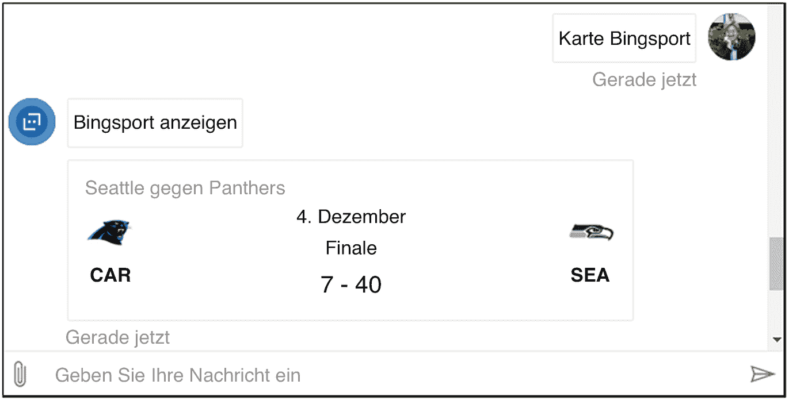

图 2.11 Bot Framework Web Chat 自定义示例

后续章节将描述一个端到端的实施指南，其中包含自定义 Web Chat 组件所需的所有必要步骤。

### Bot Framework CLI

Bot Framework 命令行界面是一个跨平台的命令行界面，提供了许多用于管理 Bot Framework 环境的工具和命令。您可以通过此链接 [`aka.ms/bfcli`](https://aka.ms/bfcli) 安装它，或者如果您已在计算机上安装了 Node.js，只需运行以下命令即可：

```
npm i -g @microsoft/botframework-cli
```

目前，该命令行界面支持以下服务的命令和管理接口，这些服务将在第 4 章和第 5 章中详细讨论：

*   **Chatdown**

    *   `Chatdown` 是一个用于解析聊天文件的工具，这些文件随后会被转换为转录文件。这有助于在不编写实际代码的情况下设计对话和交谈，因此常用于 Bot 项目的设计阶段。

*   **QnAMaker**

    *   通过 BF CLI 中的 `QnAMaker` 命令，开发人员可以管理与 QnA Maker 相关的所有内容，例如创建新的知识库，或通过使用 CLI 而非 QnA Maker 门户来训练和发布现有数据库。

*   **配置**

    *   通过 CLI 中的配置端点，您可以管理环境中的配置键值对，例如设置其他命令所需的 LUIS 密钥和 ID，这简化了命令的执行。

*   **LUIS**

    *   `LUIS` 命令提供了用于管理 Bot 中使用的 LUIS 应用程序的管理接口和功能。使用这些命令，您可以通过命令行轻松创建、训练和发布新的语言理解应用程序，从而在开发 Bot 时实现此过程的自动化。

### 自适应卡片

`自适应卡片` 是一个开源概念，它允许卡片作者使用 `JSON` 或通过 [`adaptivecards.io/designer/`](https://adaptivecards.io/designer/) 提供的可视化设计器来描述丰富的附件卡片。这些卡片随后会在机器人部署的渠道中以原生方式渲染。这简化了开发人员创建多渠道机器人的过程，因为他们无需为每个部分单独处理用户界面。其基本思想是使用 `自适应卡片` 将文本、图像、按钮和其他富媒体类型整合到单条消息中，并以所用渠道的原生外观与风格显示。例如，当在 Bot Framework Web Chat 中显示时，这样一张 `自适应卡片` 可能看起来如图 2.12 所示。

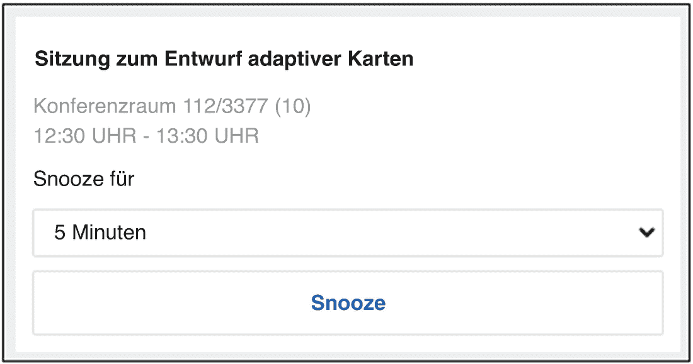

图 2.12 自适应卡片示例 BF Web Chat

图 2.13 展示了同一张卡片在 Microsoft Teams 中渲染时的外观。

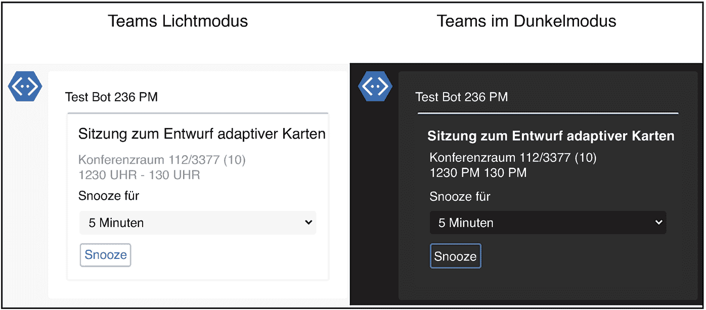

图 2.13 自适应卡片 Microsoft Teams 示例

如前所述，该卡片仅用 `JSON` 声明，这使其能够嵌入到多个渠道中，而无需更改卡片定义。用于前述卡片的 `JSON` 如下所示：

```
{
"$schema": "http://adaptivecards.io/schemas/adaptive-card.json",
"Typ": "AdaptiveCard",
"Version": "1.0",
"speak": "您关于“自适应卡片设计”的会议将于 12:30 开始。您想小睡片刻还是向与会者发送延迟通知？",
"Körper": [
{
"Typ": "TextBlock",
"Text": "自适应卡片设计会议",
"Größe": "groß",
"Gewicht": "kühner"
},
{
"Typ": "TextBlock",
"Text": "会议室 112/3377 (10)",
"isSubtle": wahr
},
{
"Typ": "TextBlock",
"Text": "12:30 - 13:30",
"isSubtle": true,
"Abstand": "keine"
},
{
"Typ": "TextBlock",
"Text": "小睡时间"
},
{
"Typ": "Input.ChoiceSet",
"id": "Schlummern",
"Stil": "kompakt",
"Wert": "5",
"Auswahlmöglichkeiten": [
{
"Titel": "5 分钟",
"Wert": "5"
},
{
"Titel": "15 分钟",
"Wert": "15"
}
]
}
],
"Aktionen": [
{
"Typ": "Action.Submit",
"Titel": "小睡",
"Daten": {
"x": "snooze"
}
}
]
}
```

表 2.6 列出了当前支持 `自适应卡片` 的渠道和宿主应用程序，包括 Microsoft 应用程序和第三方渠道。

表 2.6 自适应卡片的渠道支持状态。（来源：[`docs.microsoft.com/en-us/adaptive-cards/resources/partners`](https://docs.microsoft.com/en-us/adaptive-cards/resources/partners)）

| 平台 | 描述 | 版本 |
| --- | --- | --- |
| **Bot Framework Web Chat** | 用于 Microsoft Bot Framework 的可嵌入 Web 聊天控件。 | 1.2.3 (Web-Chat 4.7.1) |
| **Outlook 可操作消息** | 将可操作的消息附加到电子邮件中。 | 1.0 |
| **Microsoft Teams** | 整合了聊天、会议和工作场所笔记的平台。 | 1.2 |
| **Cortana 技能** | Windows 10 的虚拟助手。 | 1.0 |
| **Windows 时间线** | 一种继续您在此 PC、其他 Windows PC 以及 iOS/Android 设备上开始的先前活动的新方式。 | 1.0 |
| **Cisco WebEx Teams** | Webex Teams 有助于加速项目、建立更好的关系并解决业务挑战。 | 1.2 |

## Bot Framework Composer 简介

`Bot Framework Composer` 是一个可视化的集成开发环境，用于创建机器人，而无需编写实际的 `C#` 或 `JavaScript` 代码。目前它仍处于预览阶段，于 Microsoft Ignite 2019 上宣布。下文将概述此工具的关键点，因为后续章节将详细描述如何使用 `Composer` 来创建和部署 Bot Framework 机器人。

如图 2.14 所示，`Bot Framework Composer` 提供了一个可视化设计器，可以以简单的图形方式创建和管理对话。此外，`Composer` 还内置了创建和维护自然语言模型的功能，因此在开发机器人时无需在不同工具和门户之间切换。除了自然语言方面，`Composer` 还提供了一个语言生成引擎，以生成更复杂、更自然的对话。此外，您可以直接从 `Composer` 中运行您创建的机器人，这使得开发人员和业务用户的测试和调试更加简单。

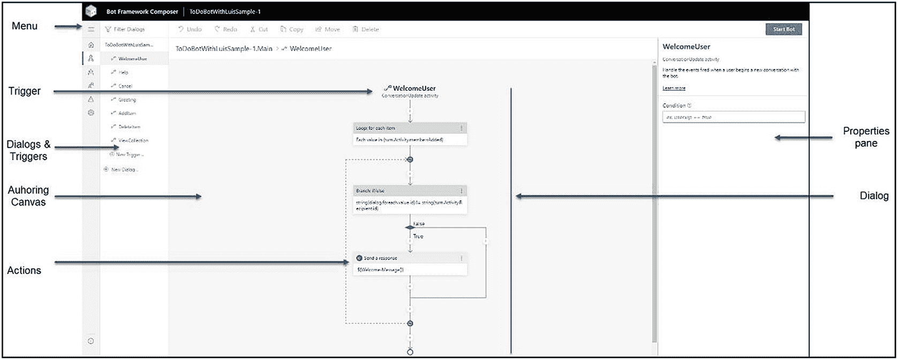

图 2.14 Bot Framework Composer 概览

### Composer 的优势

`Composer` 最重要的特点之一是它既可以被开发人员使用，也可以被非开发人员使用。此工具旨在弥合技术与业务之间的鸿沟，使他们能够共同协作开发对话式 AI 应用程序。业务用户可以使用 `Composer` 勾勒对话设计，然后将其交给开发人员来实现需要代码的功能。

此外，`Composer` 基本上会以 `JSON` 和 `Markdown` 的形式为用户编写机器人逻辑，这些逻辑可以被扩展和定制以满足需求。这样，由 `Composer` 创建的可重用组件就可以与机器人的其他部分（如语言理解定义）一起进行源代码管理，从而在由开发人员和非开发人员组成的团队中构建一个整体的机器人项目。

`Composer` 在单一界面中利用并集成了对话式 AI 平台的许多不同组件，包括以下内容：

*   `Bot Framework SDK`

*   自适应对话

*   使用 `LUIS` 的语言理解服务

*   语言生成

*   `QnA Maker`

*   `Bot Framework 模拟器`

## 自适应对话

与当前 `Bot Framework SDK` 的概念不同，`Composer` 采用了一种称为“自适应对话”的概念来在机器人内部创建对话。通过此概念，您可以使用声明式方法（而非 `C#` 或 `JavaScript` 代码）在 `JSON` 中定义对话。这样，自适应对话可以在运行时进行交换，从而使 Bot Framework 机器人的部署和集成过程更加可靠和快速。

从某种意义上说，自适应对话可以被视为一种在对话式应用程序中建模和实现对话的新方式，因为它们有助于专注于对话建模，而不是管理对话的实现需求。

### 语言理解

由于语言理解是机器人设计与开发中的关键组成部分，Composer 提供了一个简化的编辑器，用于在对话上下文中使用 Markdown 表达式语言管理自然语言理解模型。这使得用户能够在单一界面中创建和扩展对话及语言理解模型。在此类 Markdown 格式中，您可以像在 LUIS 门户中通常所做的那样，定义意图、表述和实体。这些语言理解模型存储在 `.lu` 文件中，便于协同编写语言模型。该文件格式如图 2.15 所示。

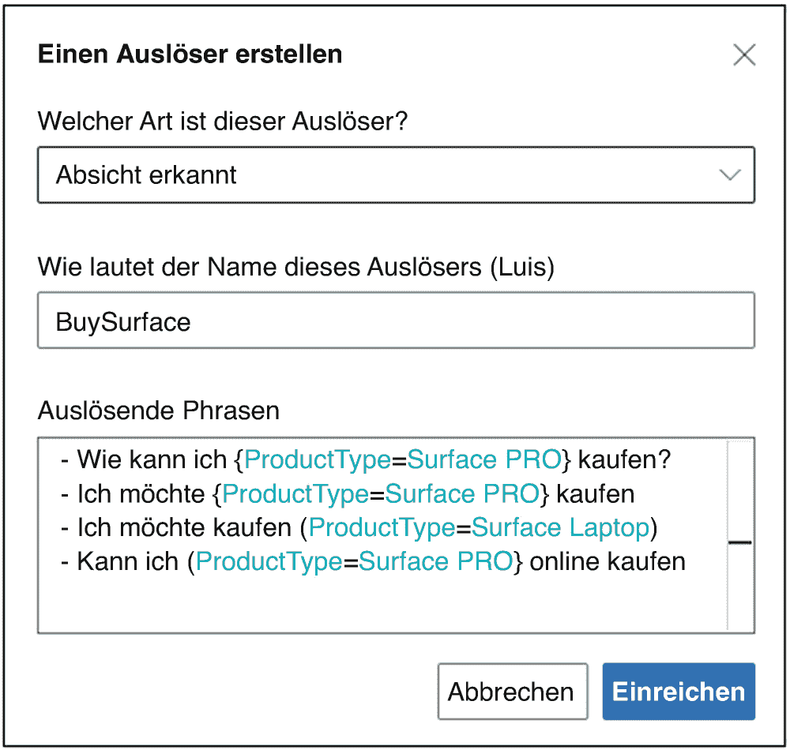

图 2.15 Bot Framework Composer 语言理解示例

### 语言生成

除了集成语言理解功能外，Composer 还提供了一种将语言生成集成到机器人中的简便方法。与语言理解的 Markdown 格式类似，您也可以使用 Markdown 定义语言生成模型，如下图所示。机器人随后会使用存储为 `.lg` 文件的语言生成模型，从中随机选择一个短语，再将其发送给用户。这使对话更加自然和富有变化，因为机器人不会每次都对相同的输入做出同样的回应。此类 `.lg` 文件的格式如图 2.16 所示。

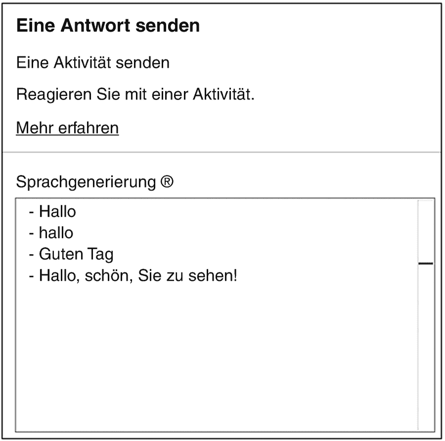

图 2.16 Bot Framework Composer 语言生成示例

## 总结

在本章中，您学习了 Microsoft Bot Framework 中所有重要的概念，例如活动处理或对话管理。此外，我们还了解了典型的机器人项目结构，并通读了使用 Microsoft Bot Framework SDK for C# 和 JavaScript 新建机器人的代码。同时，我们还讨论了 Bot Framework 相关的工具和产品，这些工具和产品对于开发、测试和维护基于对话式 AI 平台的机器人是必需的。

下一章将更详细地介绍 Azure 认知服务，重点介绍机器人项目中使用的几个主要类别。此外，还将介绍一些来自实践的最佳实践和指导原则，展示如何将这些认知服务与使用 Microsoft Bot Framework SDK 构建的机器人相结合。