# 3. Azure 认知服务简介

对话式应用程序和代理通常凭借其智能能力从其他应用中脱颖而出。这些智能能力通常可以分为以下几类：

- 语言
- 语音
- 视觉
- 决策

在每个类别中，都有许多不同的应用场景，聊天机器人或对话式应用可以从中受益——无论是理解用户以文本形式发送的消息的能力，还是将语音转换为文本以供进一步处理的技能。微软提供了一系列名为 Azure 认知服务的 API，使开发者能够为应用程序注入智能。其总体目标是让开发者能够将任何类型的认知能力引入应用程序，使其更智能、更接近人类。这些认知服务的架构允许用户将两个或多个认知服务组合在一起，这对于聊天机器人应用尤其有用。

因此，本书的第三章将详细探讨第 1 章中提到的许多智能工具，这些工具对于使用 Microsoft Azure 平台构建成功的对话式 AI 应用至关重要。不过，重点将明确放在语言类别上，因为它在开发对话式应用时最为重要。

## 语言类别：从非结构化文本中提取含义

语言类别是对话式应用中最重要的方面之一。在开发诸如聊天机器人这类旨在以对话方式与用户交互的应用时，为应用注入语言驱动的智能能力至关重要。虽然语言理解只是其中的一个方面，但对话式应用中还有处理语言的其他方面，例如文本分析或文本翻译。因此，以下部分将详细描述语言类别中部分认知服务背后的概念。

## 语言理解 (LUIS)

如第 1 章所述，在对话式应用中理解自然语言文本是一个基本组成部分，它决定了该应用是否会被人们使用。因此，微软提供了一种名为语言理解（下文简称 LUIS）的 API，它提供了自然语言处理功能。LUIS 的理念是让人们拥有自定义的自然语言理解模型，而无需自行开发必要的算法：

> 语言理解 (LUIS) 是一种基于云的 API 服务，它将机器学习智能应用于用户的自然语言对话文本，以预测整体含义并提取相关的详细信息。

> LUIS 的客户端应用是任何与用户进行自然语言交流以完成任务的对话式应用。客户端应用的示例包括社交媒体应用、聊天机器人和语音驱动的桌面应用。(Microsoft Docs, 2020)

### LUIS 构建块

LUIS 应用中最重要的组件如下，它们对于理解该服务的工作原理至关重要。

从实践角度来看，这意味着每次通过 API 端点调用 LUIS 应用程序以获取给定用户话语的意图和实体时，您都会以识别出的意图和实体的形式获得结果，如图 3.1 和表 3.1 所示。

**表 3.1** LUIS 组件

| 组件 | 描述 |
| --- | --- |
| **话语** | 话语是用户发送给对话应用程序（例如聊天机器人）的非结构化输入文本。一个例子是句子“西雅图的天气怎么样？”。 |
| **意图** | 意图是用户想要执行的特定任务的定义。它可以被视为用户表达的目标或目的。对于话语“西雅图的天气怎么样？”，该话语的意图将是 `GetWeather`。 |
| **实体** | 实体是话语中的文本片段，可用于从非结构化文本中提取特定数据，例如名称或日期等重要值。上述 `GetWeather` 意图中话语的实体将是地点，例如本例中的 `Seattle`。 |
| **分数** | 分数表示 LUIS 应用对特定话语与特定意图匹配或在话语中识别出实体的确信程度。该值是一个介于 0 和 1 之间的数字，接近 1 的预测值表示相对较高的置信度，而接近 0 的值表示 LUIS 对结果准确或正确的置信度较低。 |

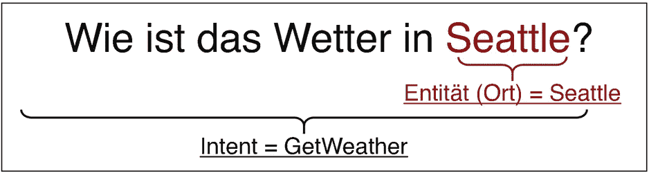

**图 3.1** LUIS 基本说明

从开发角度来看，您返回的结果是一个 JSON 表示形式。因此，对于图 3.1 中提到的那个话语，您基本上会得到以下 JSON 字符串作为结果：

```json
{
  "query": "西雅图的天气怎么样？",
  "topScoringIntent": {
    "intent": "GetWeather",
    "score": 0.921233
  },
  "entities": [
    {
      "entity": "Seattle",
      "type": "地点",
      "score": 0.9615982
    }
  ]
}
```

因此，LUIS 并非专为聊天机器人设计，也可以应用于其他需要语言理解的场景。然而，由于本书专注于对话式 AI 平台，后续内容将探讨 LUIS 在对话用例中的应用。

### 创建 LUIS 应用程序

在创建 LUIS 应用程序之前，您需要确保拥有一个有效的 Microsoft Azure 订阅。重要的是，您的帐户必须能够在此 Azure 订阅中创建新资源；否则，您将无法执行以下步骤。

**注意**

如果您还没有有效的 Azure 订阅，可以通过此链接 `https://azure.microsoft.com/en-us/free` 注册一个新的 Azure 订阅，并获得 200 美元的免费额度。

创建新的 LUIS 应用程序主要有两种方式：通过基于 Web 的门户和通过 CLI。以下部分将介绍这两种方法。两种方式的结果相同，不过使用 CLI 时，您有更高的机会自动化这些任务。当您需要一次性创建多个 LUIS 应用程序或同时更新多个 LUIS 应用程序时，这将非常有用。

在部署新的 LUIS 应用程序之前，您需要在 Azure 订阅中创建一个新的 Azure 资源组。为此，请登录 `https://portal.azure.com` 并创建一个新的资源组，如图 3.2 所示。

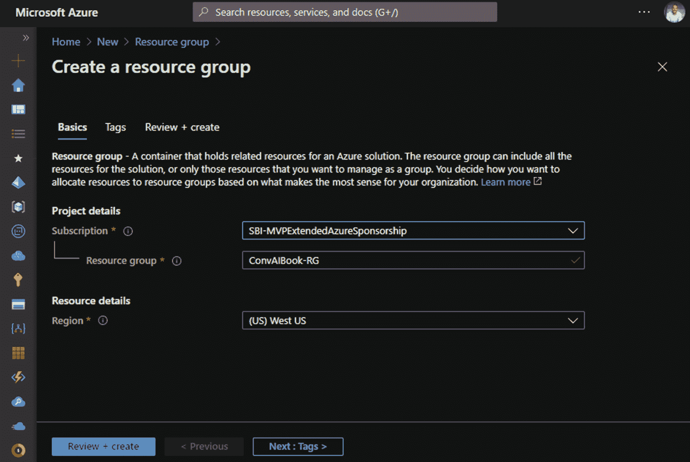

**图 3.2** 为 LUIS 创建新的 Azure 资源组

### 使用 LUIS 门户

要创建新的 LUIS 应用程序，您需要访问 `www.luis.ai/`，并使用有权访问 Azure 订阅的帐户登录。登录后，点击右上角的姓名，然后选择“设置”，如图 3.3 所示。

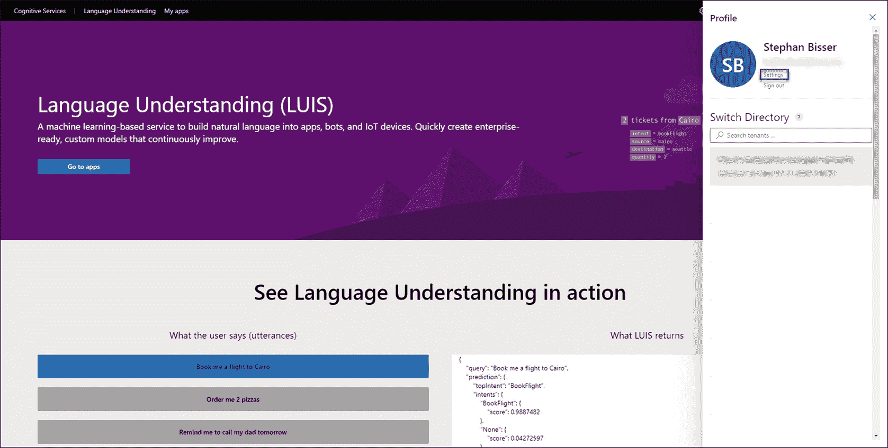

**图 3.3** 设置 LUIS 应用程序 1 – 登录

在设置屏幕上，您可以管理您的帐户和相应的设置。在我们的案例中，我们需要创建一个创作资源，即负责创建 LUIS 应用程序的 Azure 资源。因此，下一步是点击相应的按钮来创建新的创作资源，如图 3.4 所示。

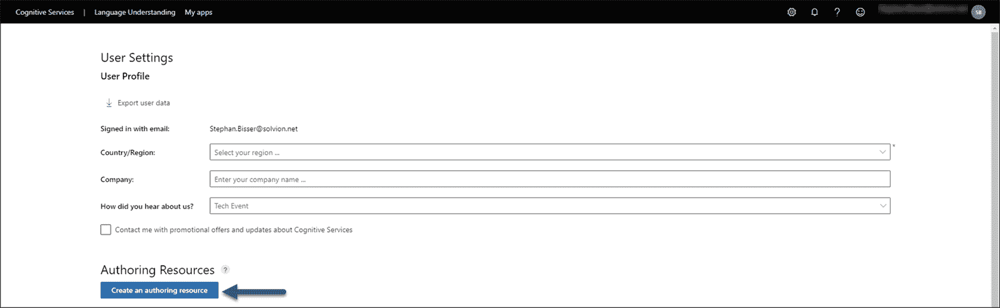

**图 3.4** 设置 LUIS 应用程序 2 – 用户设置

现在，您需要输入资源名称，并选择 Azure 订阅以及之前创建的 Azure 资源组，以创建新的 LUIS 创作资源，如图 3.5 所示。

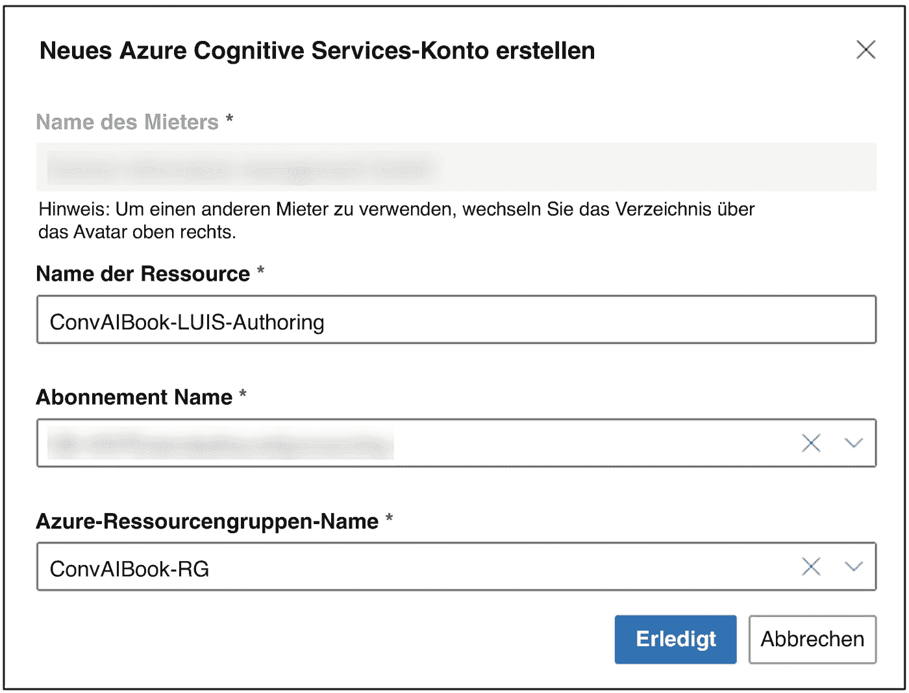

**图 3.5** 设置 LUIS 应用程序 3 – 创建新的创作资源

当您返回 `www.luis.ai/applications` 并选择您的 Azure 订阅和创作资源时，您应该会看到类似于图 3.6 的屏幕，因为您尚未创建任何 LUIS 应用程序。

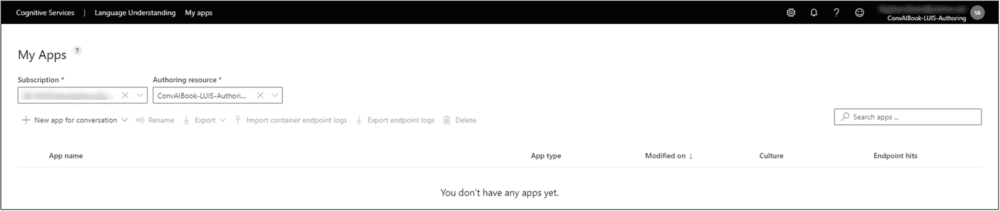

**图 3.6** 设置 LUIS 应用程序 4 – “我的应用程序”视图

现在，您可以创建一个用于对话的新 LUIS 应用程序。基本上，您有三种创建新 LUIS 应用程序的方式：

*   **新建对话应用**：此选项意味着您从头开始创建一个新的 LUIS 模型。
*   **导入为 JSON**：此选项意味着您导入一个已存在的 JSON 格式的 LUIS 模型。
*   **导入为 LU**：此选项与“导入为 JSON”选项类似，但您导入的不是 LUIS 模型的 JSON 表示，而是一个 `.lu` 文件，该文件通常比 JSON 文件更易于阅读。

**注意**

`.lu` 文件是类似 Markdown 的文件，用于描述或定义 LUIS 应用程序。通常，一个 `.lu` 文件包含意图的定义以及意图的实体和表述。

为简单起见，您应该选择第一个选项“新建对话应用”，以完全从头开始构建语言理解应用程序，如图 3.7 所示。

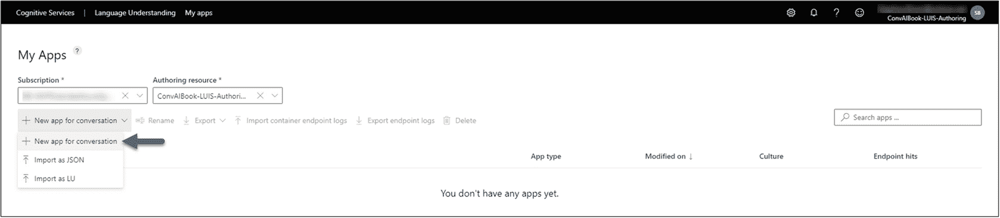

**图 3.7** 设置 LUIS 应用程序 5 – 创建新的 LUIS 应用程序

创建 LUIS 应用程序之前的最后一步是填写应用程序的相关信息，例如名称和要使用的区域设置。为您的 LUIS 应用程序指定一个描述性名称，并选择您的语言理解模型所基于的区域设置（见图 3.8）。

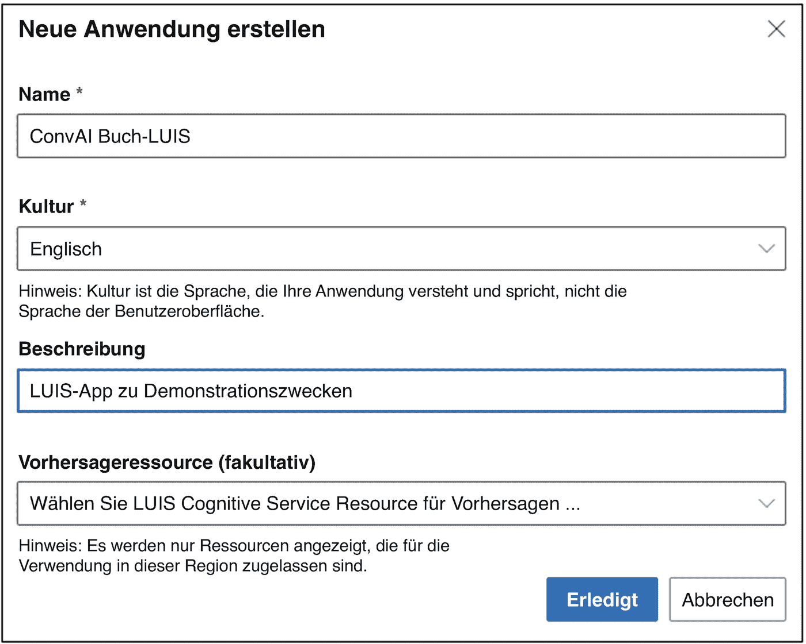

**图 3.8** 设置 LUIS 应用程序 6 – 填写 LUIS 应用程序详细信息

创建 LUIS 应用程序后，下一步是创建您要在 LUIS 应用程序中使用的所需意图和实体。目标是创建一个语言理解模型，如图 3.9 所示，该模型包含两个意图。第一个意图用于处理天气查询，而第二个意图则涵盖餐厅餐桌预订。

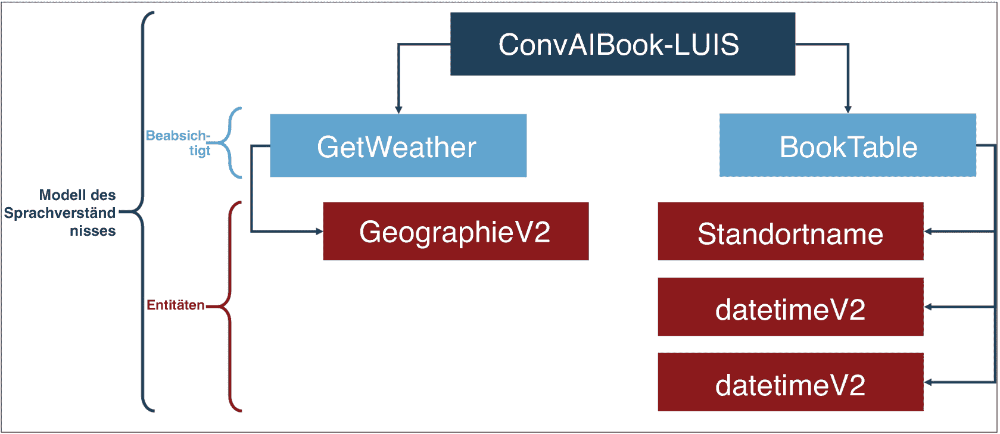

**图 3.9** 示例 LUIS 模型结构

由于 LUIS 应用程序现已创建，您可以继续根据您的用例对其进行自定义。当您查看新创建的 LUIS 应用程序时，您会发现已经为您创建了一个意向，即 `None` 意向。此意向在您的 LUIS 应用程序中用作回退意向，应由超出您语言模型或架构范围的表述组成。首先，您需要将必要的 `GetWeather` 和 `BookTable` 意向添加到您的应用程序中，如图 3.9 所示。为此，请点击“意向”页面上的“+ 创建”按钮，并输入意向的名称，如图 3.10 所示。

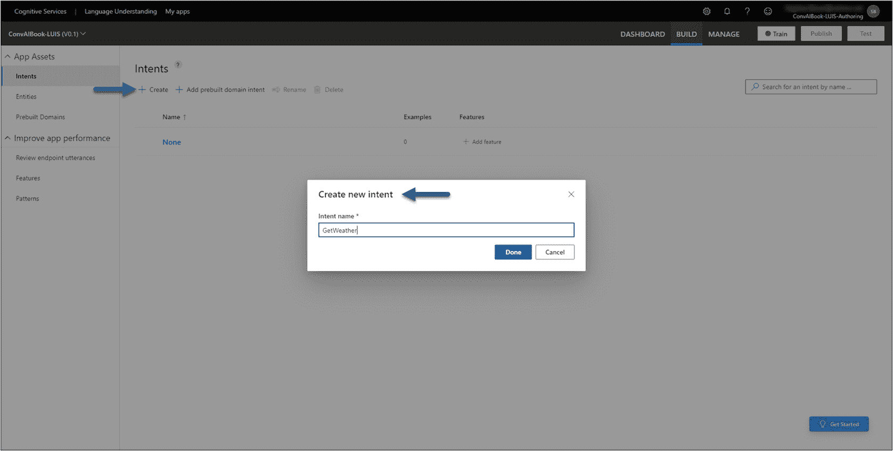

**图 3.10** 设置 LUIS 应用程序 7 – 创建意向

**注意：** LUIS 还提供了所谓的预生成领域意向，允许您向应用程序添加包含一系列预定义表述和实体的流行意向，这些表述和实体涵盖了常见场景。

下一步是向我们的 LUIS 应用程序添加必要的实体，即 `geographyV2`（用于预测地名（如城市或国家）的预生成实体）、`locationName`（用于预测地名（如餐厅）的机器学习实体）、`datetimeV2`（用于预测日期和时间值的预生成实体）和 `number`（用于预测数字的预生成实体，该数字用于预测预订人数），如图 3.9 所示。这里我们将利用 LUIS 提供的一些预生成实体的优势。因此，您需要将本图中提到的预生成实体添加到您的 LUIS 应用程序中。由于还有一个实体不属于预生成实体，您需要创建另一个名为 `locationName` 的“机器学习”类型实体，如图 3.11 所示。

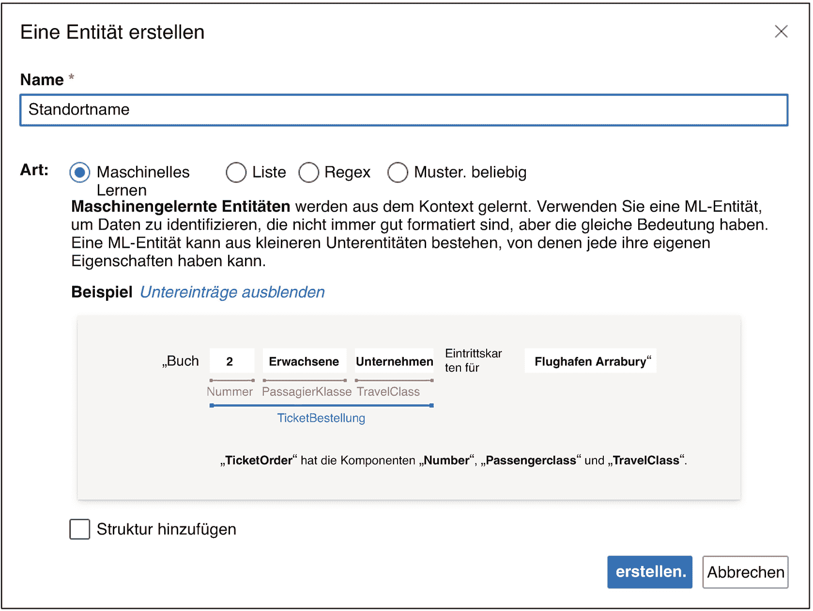

**图 3.11** 设置 LUIS 应用程序 8 – 创建实体

添加完意向和实体后，您需要向 LUIS 模型添加示例数据，即所谓的表述。表述背后的概念是告诉您的 LUIS 应用程序它应该识别哪种类型的用户输入，以及如何正确预测这些用户输入短语中的特定值。因此，向您的 LUIS 应用程序添加各种不同的表述也是一个好方法，以获得更好的预测结果。例如，对于 `GetWeather` 意向，您可以在应用程序中添加以下表述：

- 西雅图的天气怎么样？
- 纽约的天气怎么样？
- 柏林的天气怎么样？
- 你能告诉我雷德蒙德的天气预报吗？
- 我想了解阿姆斯特丹天气的一些细节。

将这些表述添加到您的 `GetWeather` 意向中后，您应该会立即看到 LUIS 使用 `geographyV2` 实体标记了城市名称，如图 3.12 所示。这意味着您无需手动标记表述中的城市名称来告诉 LUIS 这些是需要提取的城市名称。

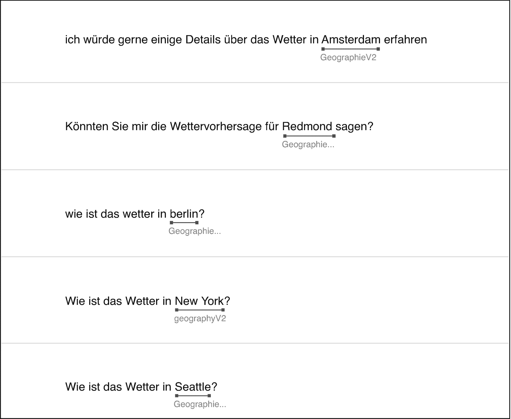

**图 3.12** 设置 LUIS 应用程序 9 – 为 `GetWeather` 添加表述

现在，您还需要向 `BookTable` 意向添加一些表述。例如，您可以向您的意向添加以下表述：

- 你能在明天为四个人在著名的寿司吧预订一张桌子吗？
- 请为六个人在周六下午 3 点预订硬石餐厅的一张桌子。
- 请在 11 月 23 日为五个人在杰米厨房预订一个位置。
- 你能在明天为汤姆餐厅预订一张桌子吗？
- 请为红屋牛排馆和烧烤店预订一张桌子。

您应该会看到 LUIS 能够正确识别人数以及日期和时间，但地点名称完全没有被提取出来，如图 3.13 所示。这是因为您没有告诉您的 LUIS 应用程序地点名称是什么样子的。

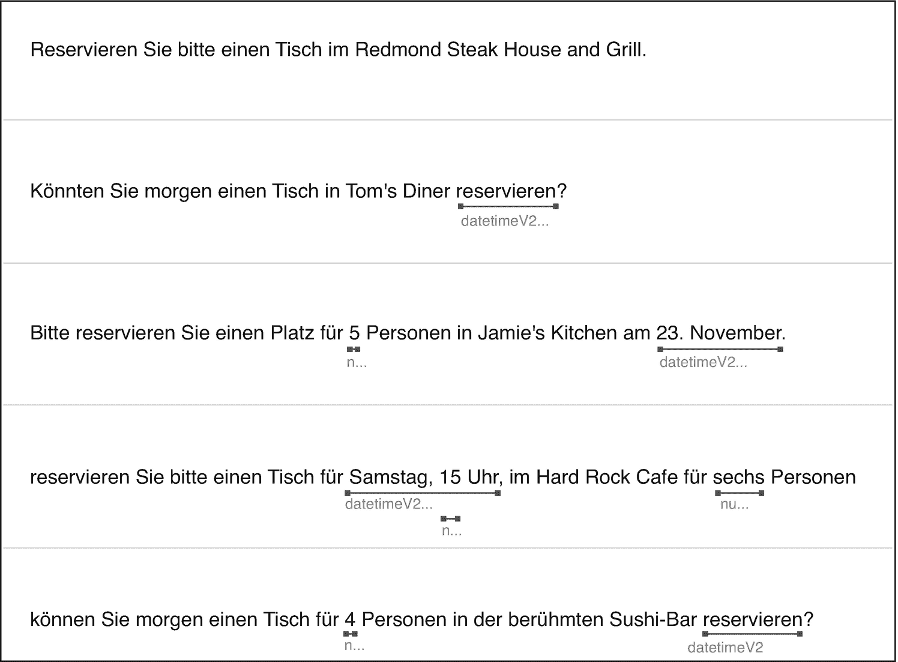

**图 3.13** 设置 LUIS 应用程序 10 – 为 `BookTable` 添加表述

但是，您可以轻松地将表述中的地点名称标记为实体，以告诉 LUIS 实体的样子。只需将鼠标悬停在表述中的一个单词上并单击它即可。如果实体由多个单词组成，只需用鼠标指针单击实体表示中的第一个单词，然后单击最后一个单词，如图 3.14 所示。

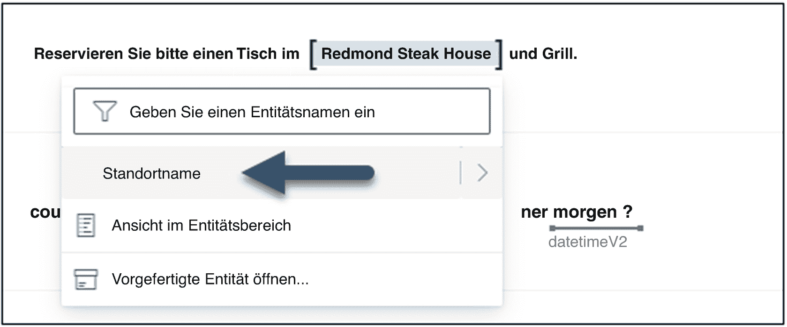

**图 3.14** 设置 LUIS 应用程序 11 – 标记实体

标记表述中的所有地点名称实体，以告诉 LUIS 这类单词或短语代表一个地点名称，如图 3.15 所示。

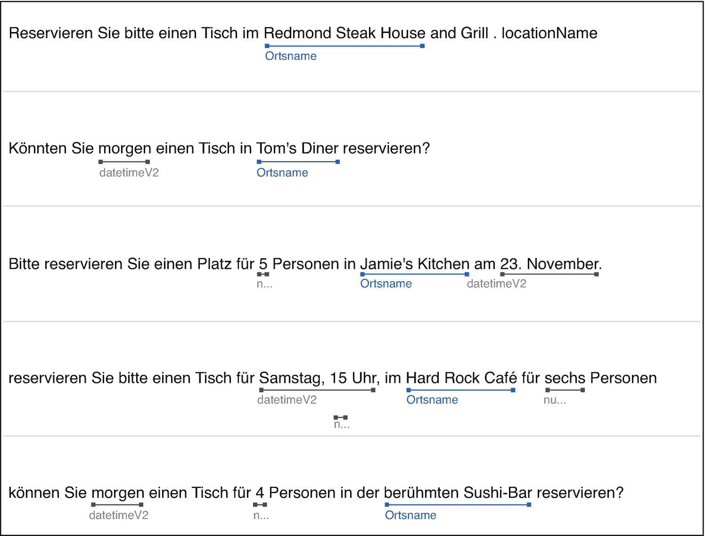

**图 3.15** 设置 LUIS 应用程序 12 – `BookTable` 已标记的实体

现在您已经添加了所有意向、实体和表述，接下来需要训练您的 LUIS 应用程序。通过此过程，您的 LUIS 应用程序将被指示提高或提升语言理解的水平。通常，在添加新的意向、实体或表述之后，或者在编辑了 LUIS 应用程序的某些部分以进行更新之后，您需要训练您的 LUIS 应用程序。训练应用程序的过程相当简单，如图 3.16 所示；您唯一需要做的就是点击 LUIS 门户右上角的“训练”按钮，这将启动训练过程。

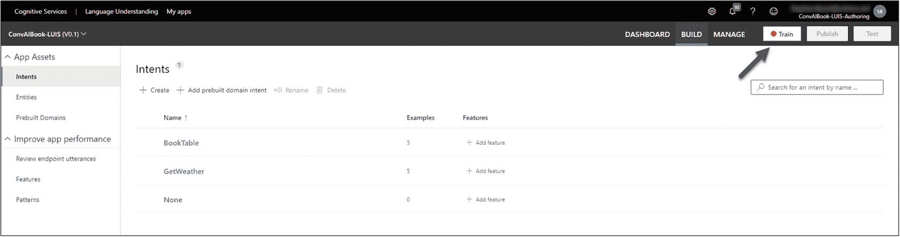

**图 3.16** 设置 LUIS 应用程序 13 – 训练 LUIS 应用程序

当您的 LUIS 应用程序训练完成后，您会在通知列表中收到一条通知，表明训练已成功完成，并且所有更改现已生效，如图 3.17 所示。

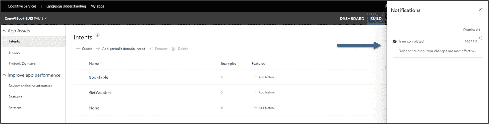

**图 3.17** 设置 LUIS 应用程序 14 – 训练后的通知

应用程序的训练过程完成后，是时候首次测试语言模型了。只需打开测试窗口，如图 3.18 所示，该窗口位于 LUIS 门户的右上角，并输入不属于表述列表的示例句子。

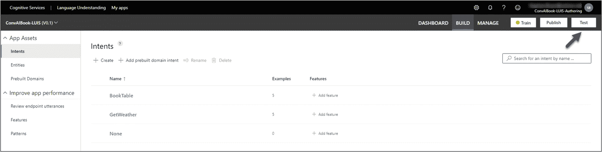

**图 3.18** 设置 LUIS 应用程序 15 – 测试

#### 配置 LUIS 应用程序 – 测试结果

例如，您可以使用以下短语来测试 `BookTable` 意图，这将得到图 3.19 所示的结果。该应用程序已识别出短语“Could you book a table at joey’s restaurant for 7 on Sunday please?”属于 `BookTable` 意图，置信度为 `0.872`。此外，该应用程序还正确提取了实体：“joey’s restaurant”作为地点名称，“7”作为人数，“Sunday”作为日期时间。这表明，您无需向 `LUIS` 应用程序添加大量示例数据，语言模型就能足够复杂以满足您的需求，少量话语就已足够。您向应用程序添加的话语越多，最终的语言模型就会越精确。

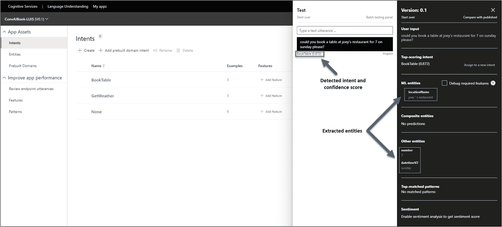

**图 3.19** 配置 LUIS 应用程序 16 – 测试结果

配置 `LUIS` 应用程序过程的最后一步是发布应用程序。发布 `LUIS` 应用程序后，如图 3.20 所示，该应用程序将在您的 `LUIS` API 端点内可用。这使得您可以通过 `LUIS` API 将您的客户端应用程序（例如聊天机器人）连接到您的语言模型，以便根据输入获取意图等。应用程序的发布通常是在语言模型进行重大升级后，当您希望将更改提供给客户端应用程序时，或者当您首次完成语言模型配置时进行。

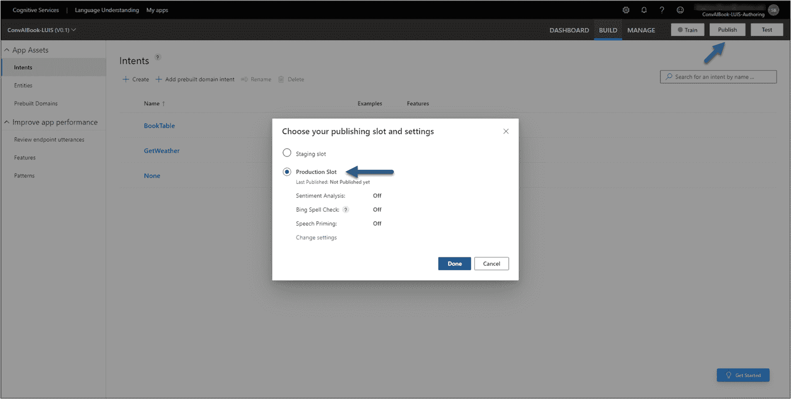

**图 3.20** 配置 LUIS 应用程序 17 – 发布

### 使用 CLI

虽然使用 `LUIS` 门户是学习 `LUIS` 概念和功能的好方法，但还有另一种管理 `LUIS` 应用程序的方法，即 Bot Framework CLI。如第 2 章所述，可从 [`aka.ms/bfcli`](https://aka.ms/bfcli) 下载的 Bot Framework CLI 旨在让 Bot Framework 开发者能够通过命令行管理与聊天机器人或对话应用程序相关的所有服务。因此，本章的下一部分将展示如何利用 Bot Framework CLI 来创建、更新、测试和发布 `LUIS` 应用程序。

使用 Bot Framework CLI 创建新的 `LUIS` 应用程序的基础是描述语言理解模型的 `.lu` 文件或 JSON 文件。在我看来，使用 `.lu` 文件的优点是，与 JSON 文件相比，它首先更易读，也更容易创建。因此，您需要在您选择的文件夹中创建一个新文件，使用合适的名称（在本教程中，`03_convAIBook-LUIS` 用作所有 `LUIS` 文件的名称），文件扩展名为 `.lu`，这代表一个语言理解文件。此 `.lu` 文件应基本上代表您在前面步骤中使用 `LUIS` 门户创建的 `LUIS` 应用程序；因此，它将包含以下部分：

- **LUIS 应用程序信息**
- **意图声明**
- **实体定义**

下面是一个示例 `.lu` 文件，描述了 `BookTable` 和 `GetWeather` 这两个意图及其话语和实体：

# LUIS 应用程序信息

```
> LUIS 应用程序信息
> ! # @app.name = ConvAIBook-LUIS
> ! # @app.desc = 用于演示目的的 LUIS 应用程序
> ! # @app.versionId = 0.1
> ! # @app.culture = en-us
> ! # @app.luis_schema_version = 7.0.0
> ! # @app.tokenizerVersion = 1.0.0
> # 意图定义
#### BookTable
- 请预订 {@locationName=redmond steak house} and grill 的一张桌子。
- 明天能在 {@locationName=famous sushi bar} 为 4 人预订一张桌子吗？
- 明天能在 {@locationName=tom's diner} 预订一张桌子吗？
- 请在 11 月 23 日为 5 人在 {@locationName=jamie's kitchen} 预订一个位置。
- 请为六人在 {@locationName=hard rock café} 预订一张周六下午 3 点的桌子。
#### GetWeather
- 你能告诉我雷德蒙德的天气预报吗？
- 纽约的天气怎么样？
- 我想了解阿姆斯特丹天气的一些细节。
- 西雅图的天气怎么样？
- 柏林的天气怎么样？
### 无
> # 实体定义
@ ml locationName
### 预构建实体定义
@ 预构建 datetimeV2
@ 预构建 geographyV2
@ 预构建 number
```

将上述所有部分复制并保存到新创建的 `03_convAIBook-LUIS.lu` 文件中后，您就可以进行下一步了，即将 `.lu` 文件转换为 JSON 文件。导入命令要求传递一个 JSON 文件作为输入参数，该文件包含要创建的 `LUIS` 应用程序的定义。因此，我们需要在安装了 Bot Framework CLI 的命令行中执行以下命令：

```
bf luis:convert --culture "en-us" --in ".\03_convAIBook-LUIS.lu" --out ".\03_convAIBook-LUIS.json"
```

**注意：** 如果您想创建其他语言的语言模型，请确保在 Bot Framework CLI 命令中为您的 `LUIS` 应用程序选择正确的区域设置。

此命令会在当前文件夹中为您创建一个名为 `03_convAIBook-LUIS.json` 的文件，该文件定义了您之前在 `.lu` 文件中描述的 LUIS 应用程序。现在，您可以使用以下命令将此 JSON 文件作为新的 LUIS 应用程序导入到您的 LUIS 帐户中：

```
bf luis:application:import --endpoint "https://.api.cognitive.microsoft.com" --subscriptionKey "yourLUISSubscriptionKey" --name "ConvAIBook-LUIS-CLI" --in ".\03_convAIBook-LUIS.json"
```

请确保将您在 Azure 门户中获得的 LUIS 订阅密钥插入到您的 LUIS Azure 资源中，并插入正确的 LUIS 端点区域（您也可以在显示订阅密钥的页面上找到该区域），以便成功执行该命令。如果命令成功执行，您将看到新创建的 LUIS 应用程序的 ID，如图 3.21 所示。请复制该应用程序 ID 并妥善保存，因为后续命令中会再次用到它。

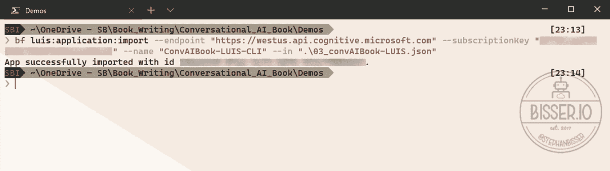

图 3.21 使用 Bot Framework CLI 导入 LUIS 应用程序

现在，您可以使用以下命令查看新创建的 LUIS 应用程序的详细信息，例如描述、区域设置、版本或上次修改时间，这将产生类似于图 3.22 所示的输出：

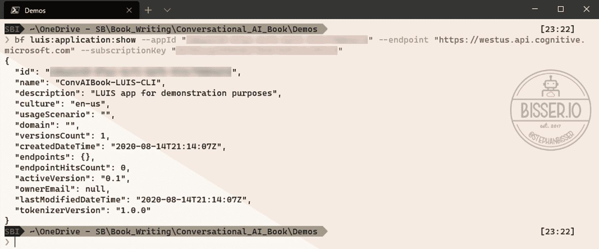

图 3.22 使用 Bot Framework CLI 显示 LUIS 应用程序信息

```
bf luis:application:show --appId "appId" --endpoint "https://.api.cognitive.microsoft.com" --subscriptionKey "yourLUISSubscriptionKey"
```

下一个命令 `bf luis:train:run` 用于在测试 LUIS 应用程序之前对其进行训练。此命令告知服务需要处理一个新的训练请求。因此，您需要执行第二个命令 `bf luis:train:show` 来跟踪应用程序的训练过程，如图 3.23 所示：

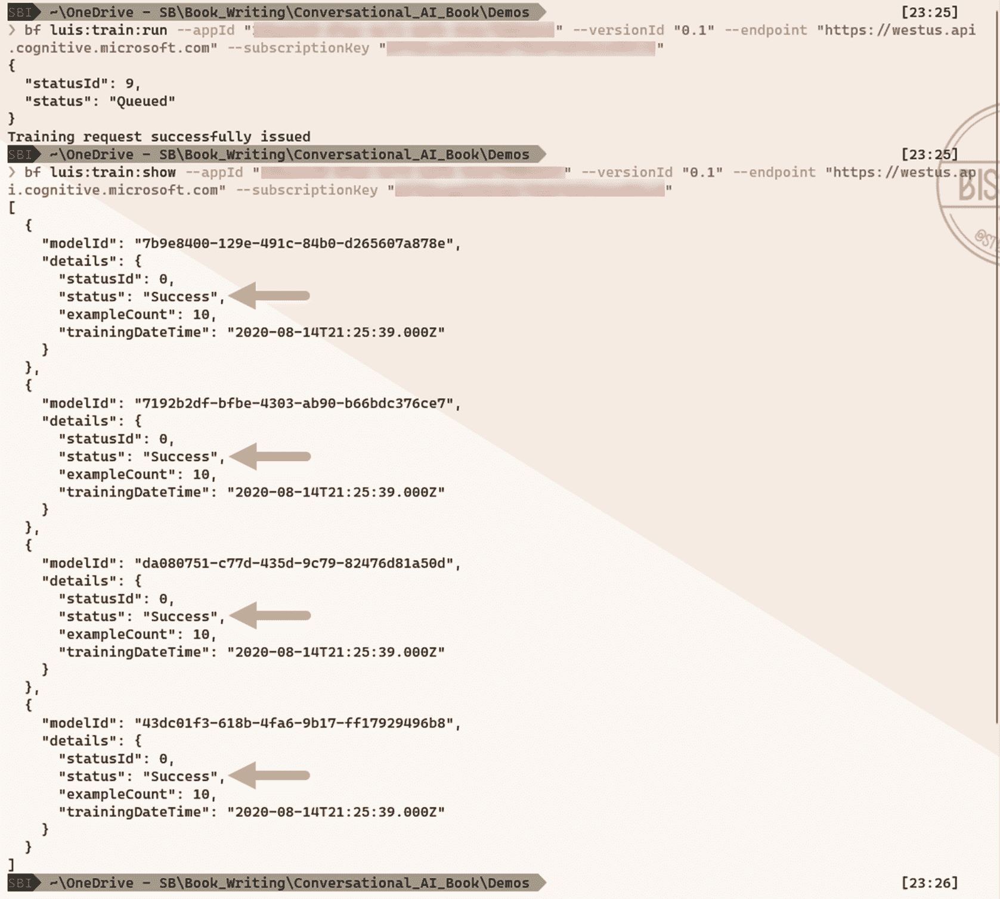

图 3.23 使用 Bot Framework CLI 训练 LUIS 应用程序

```
bf luis:train:run --appId "appId" --versionId "0.1" --endpoint "https://.api.cognitive.microsoft.com" --subscriptionKey "yourLUISSubscriptionKey"
bf luis:train:show --appId "appId" --versionId "0.1" --endpoint "https://.api.cognitive.microsoft.com" --subscriptionKey "yourLUISSubscriptionKey"
```

当所有状态指示器都显示“成功”时，下一步就是测试 LUIS 应用程序。这可以通过创建一个新的 `.lu` 文件并为每个要测试的意图添加测试话语来轻松完成。例如，这个名为 `03_luis_cli_test.lu` 的文件可能如下所示：

```
# BuchTisch
- Könnten Sie bitte einen Tisch in Joey's Restaurant für 7 Personen am Sonntag reservieren?
- Ich möchte heute Abend einen Tisch für zwei Personen in Jamie's Kitchen reservieren.
#### GetWeather
- Wie ist das Wetter morgen in Wien?
- Wie ist das Wetter?
```

但是，在使用 CLI 测试 LUIS 应用程序之前，您需要使用以下命令将其发布；否则测试命令将会失败：

```
bf luis:application:publish --appId "appId" --versionId "0.1" --endpoint "https://.api.cognitive.microsoft.com" --subscriptionKey "yourLUISSubscriptionKey"
```

现在，要测试 LUIS 应用程序，只需执行以下命令，并将新创建的 `03_luis_cli_test.lu` 文件作为输入文件通过 `-i` 参数传递，这将向您显示类似于图 3.24 的结果：

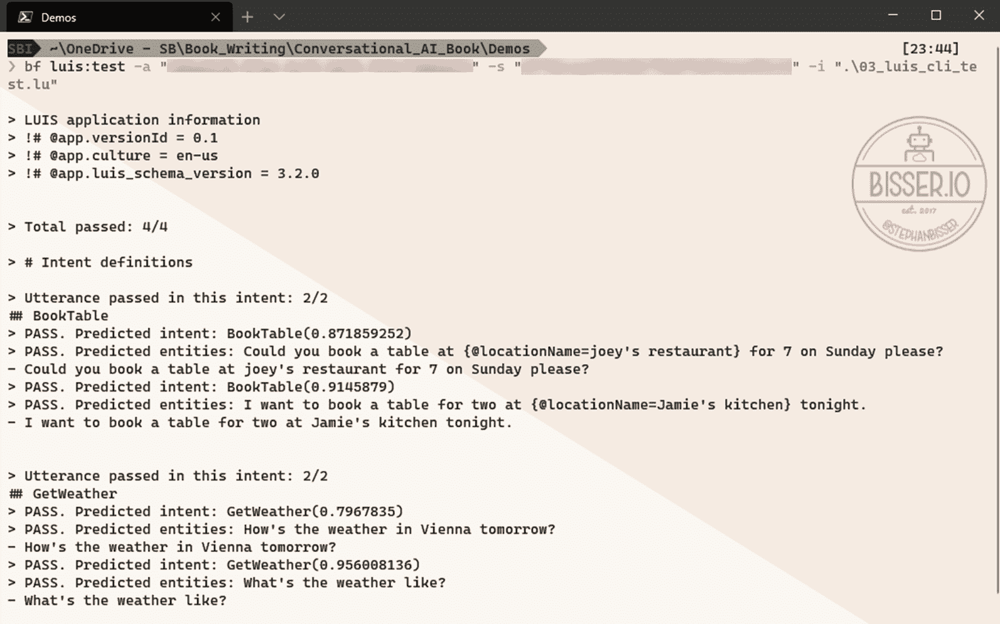

图 3.24 使用 Bot Framework CLI 测试 LUIS 应用程序

```
bf luis:test -a "appId" -s "subscriptionKey" -i ".\03_luis_cli_test.lu"
```

**注意**

在生产场景中，您需要为每个意图添加超过五个话语，才能构建一个精细的语言模型。此外，测试是成功的关键。因此，请在您的项目中为测试和完善语言理解模型预留足够的时间。

# QnA Maker

语言类别中的另一个产品是名为“QnA Maker”的服务。这是一个旨在帮助您以简单 FAQ 风格构建复杂语言模型的工具。QnA Maker 可以被视为一种知识库即服务，因为它允许您以最小的努力使用您的数据创建知识库。然后，这些知识库可以被聊天机器人等对话应用程序利用，以回答用户的问题。因此，本节将涵盖将知识库集成到对话应用程序中所有重要的方面：

> *通过用户友好的界面或 REST API，利用常见问题页面、支持网站、产品手册、SharePoint 文档或编辑内容，创建、训练和发布一个精密的机器人。* (Microsoft, 2020)

## QnA Maker 构建块

如图 3.25 所示，`QnA Maker` 依赖于多种 Azure 服务。最重要的是，所有服务和资源都在您的 Azure 订阅中进行部署。这意味着，存储在您的 `QnA Maker` 服务中并经过处理的数据，都处于您的控制之下。`QnA Maker` 本身使用一个专门的 `QnA Maker` 服务，该服务负责存储您的订阅密钥。这些密钥是与 `QnA Maker` API 通信所必需的。

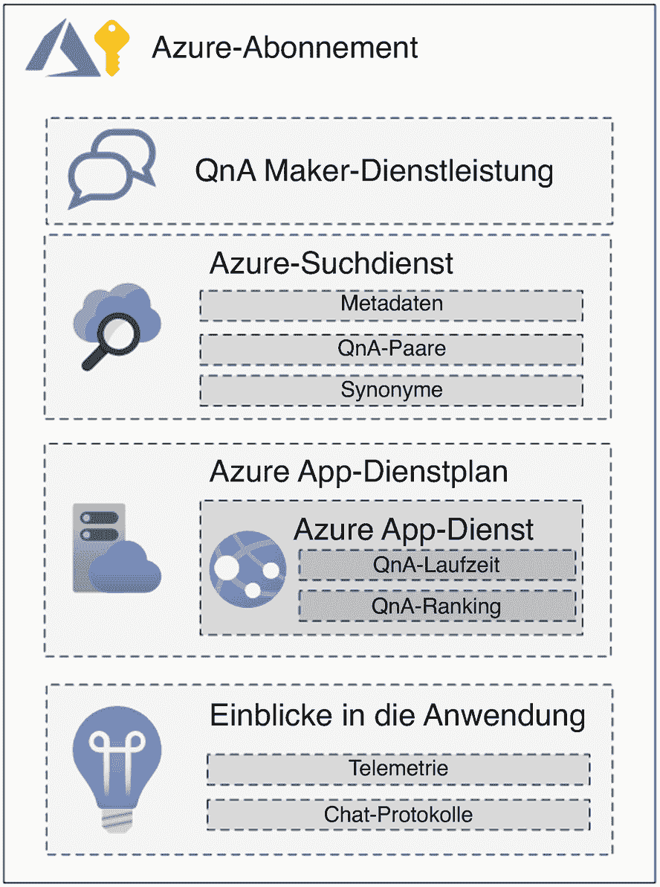

图 3.25 `QnA Maker` 架构

您添加到 `QnA Maker` 知识库中的所有数据，都存储在一个专门的 `Azure Search` 实例中。在此资源内，QnA 对及其相关的元数据会被存储和索引。此外，您还可以在知识库中存储特定单词或短语的同义词，这些同义词同样存储在 `Azure Search` 中。

从用户的角度来看，您可以使用 `QnA Maker` 门户来创建和维护您的知识库。在此门户中执行的所有操作，都通过 `Azure App Service` 进行处理，该服务也是您 `QnA Maker` 部署的一部分。此资源包含 QnA 运行时，负责处理 API 请求，例如创建知识库或向您的 `Azure Search Store` 添加新的 QnA 对。`Azure App Service` 的第二部分是 QnA 排名组件。在查询 `QnA Maker` 实例时，该组件会被大量使用，因为它会对 `Azure Search` 实例检索到的结果进行评分并确定置信度值，然后再将这些结果返回给客户端应用程序。

在典型的 `QnA Maker` 部署中使用的最后一个服务是 `Azure Application Insights`。此云服务存储您的 `QnA Maker` 服务的所有重要遥测数据，这些数据可以被查询和分析。一个常见的应用场景是基于用户输入分析最常见的有答案或无答案的问题。

在一个 `QnA Maker` 知识库中，存在一些对其使用至关重要的特定组件，如图 3.26 所示。知识库中存储着 QnA 对。当您的对话应用程序（例如聊天机器人）查询 `QnA Maker` 知识库时，输入内容会与 KB 中存储的问题进行匹配。如果匹配成功，则会将答案连同匹配的置信度值一起作为响应返回。每个 QnA 对还可以包含一个元数据列表。这些键值元数据对可用于过滤特定查询的结果，并从 `QnA Maker` 服务获得更精确的答案。

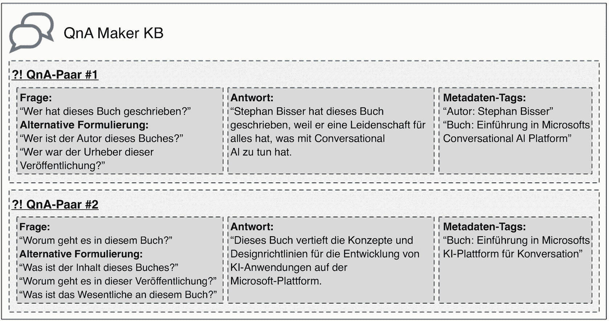

图 3.26 `QnA Maker` KB 结构

## 创建 QnA Maker 服务和知识库

与 `LUIS` 类似，有两种方法可以创建新的 `QnA Maker` 实例及其知识库：通过图形用户界面或通过命令行界面。在本部分中，您将了解这两种方法，以便您可以选择使用图形化且更友好的方式，或者如果您希望将其作为例行操作的一部分，则可以使用 `CLI`。

## 使用 QnA Maker 门户

可以通过 [`qnamaker.ai`](https://qnamaker.ai) 使用有权创建 Azure 资源的帐户访问 `QnA Maker` 门户。使用您的帐户登录后，在顶部菜单中导航到“Create a knowledge base”以开始创建过程。在此处，您首先需要在步骤 1 下创建一个新的 QnA 服务。单击图 3.27 中所示的链接后，您将被重定向到 Azure 门户，您可能需要在此处使用您的帐户重新登录。

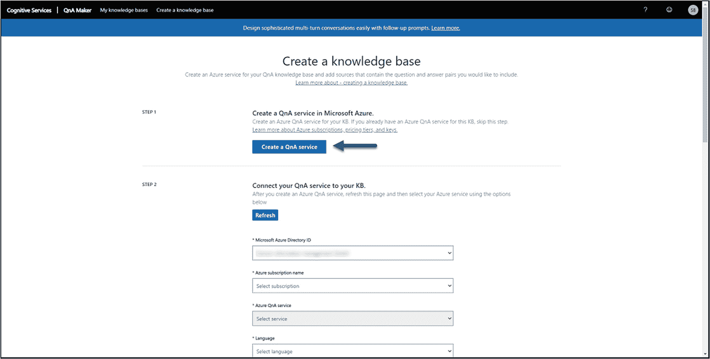

图 3.27 设置 `QnA Maker` KB 01

登录后，您需要输入创建新的 `QnA Maker` Azure 服务所需的信息，以及 `QnA Maker` 所依赖的所有其他服务（`Azure Search`、`Azure App Service` 和 `Application Insights`）。您可以选择免费层或付费层，但请注意，每个 Azure 订阅只能部署一个免费的 `QnA Maker` 实例。因此，如果您已经在使用的 Azure 订阅中设置了一个 `QnA Maker` 服务，则必须选择 `Standard S0` 层，如图 3.28 所示。

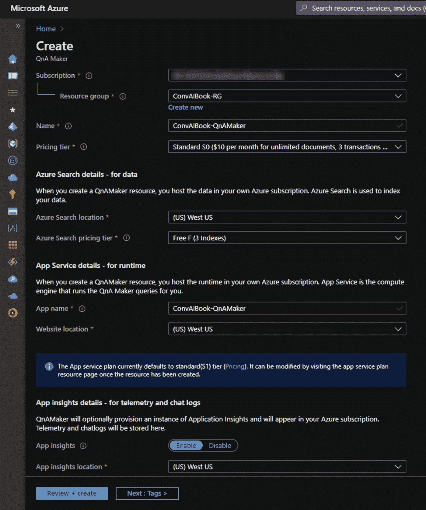

图 3.28 设置 `QnA Maker` KB 02 – 创建 Azure 资源

创建好您的 Azure 资源后，您可以返回 `QnA Maker` 门户并继续执行步骤 2。在此步骤中，您需要选择正确的 `Azure Active Directory`、包含您的 QnA 服务实例的 Azure 订阅以及 QnA 服务本身。此外，您还需要选择知识库的语言，如图 3.29 所示。这是一个关键步骤，因为每个 QnA 服务实例只能使用一种语言。因此，如果您在 QnA 服务中首次创建 KB 时选择了一种语言，排名算法将针对您的 Azure 服务进行部署。这意味着，如果您要创建多语言应用程序，则必须为不同的语言创建单独的 Azure QnA 服务实例。

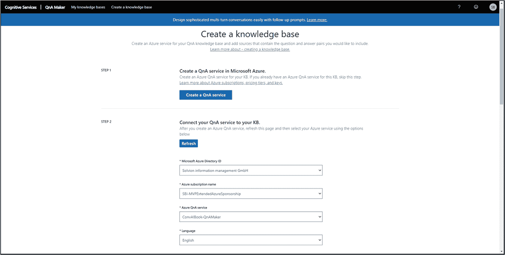

图 3.29 设置 `QnA Maker` KB 03 – 将您的 QnA 服务连接到您的 KB

**注意**

一个 `QnA Maker` Azure 服务实例只能包含相同语言的知识库。因此，如果您计划在 KB 中使用多种语言，则必须为您要使用的每种语言部署一个 `QnA Maker` 服务以及所有用于 `QnA Maker` 的服务，例如 `Azure Search` 和 `Azure App Service`。

在步骤 3 中，您需要为您的知识库命名，此名称可以随时更改。在步骤 4 中，您可以使用现有网站的内容（通过输入 URL）来填充您的知识库。或者，您也可以上传以下类型的基于常见问题解答的文件：此外，您还可以启用多轮提取功能，该功能还会提取特定文档或网站的问答对层次结构。这意味着，例如，如果用户提出了一个特定问题，而该问题后面附加了一个后续问题，应用程序会将答案以及附加的“子”问题作为提示呈现，以便用户能够快速继续对话。在创建知识库之前的最后一步，是选择五种预置角色类型之一，该角色会用来自聊天的问答对填充您的知识库，如图 3.30 所示。

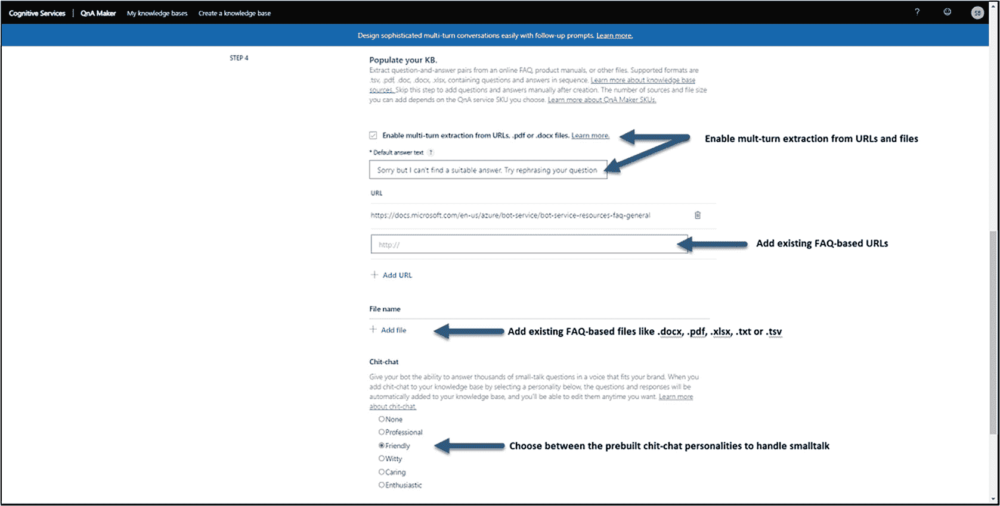

图 3.30 配置 QnA Maker KB 04 – 添加 URL、文件和闲聊内容

*   PDF

*   DOC

*   Excel

*   TXT

*   TSV

此外，您还可以启用多轮提取功能，该功能还会提取特定文档或网站的问答对层级结构。也就是说，当用户提出某个特定问题，而该问题后附有后续问题时，应用程序会将答案以及附带的“子”问题作为提示呈现出来，以便用户能够快速继续对话。在创建知识库之前的最后一步，是从五个预置的人格类型中选择一个，用于为您的知识库填充来自聊天的问答对，如图所示。

知识库创建成功后，您的知识库就可以开始填充问题和答案了。如果您添加了某个预置的闲聊人格，您的知识库中就已经包含了许多问答对，如图 3.31 所示。

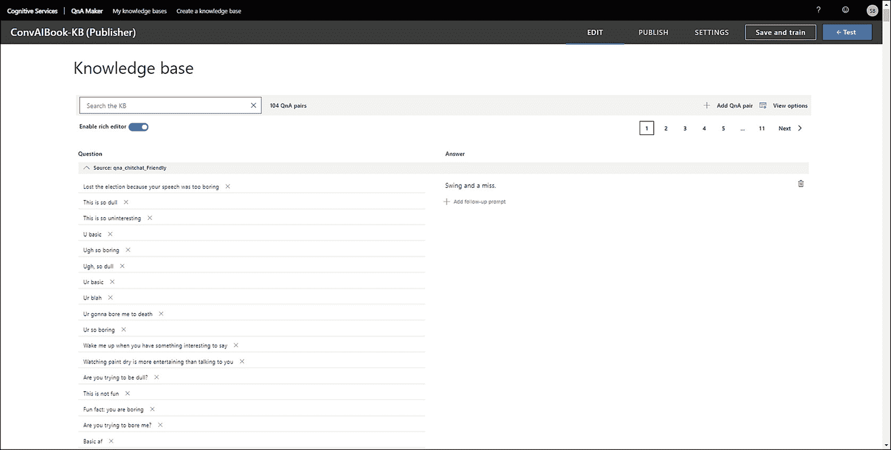

图 3.31 配置 QnA Maker KB 05 – 创建后的知识库

## 使用 CLI

虽然您可以像前面步骤描述的那样使用 QnA Maker 门户来创建知识库，但您也可以使用 CLI 达到同样的效果。要使用 Bot Framework CLI 创建新的知识库，您首先需要创建一个新的 `.qna` 文件，您可以在其中按以下格式添加您的问答对：

```
> # QnA 定义
### ? 微软为什么开发 Bot Framework？
'''
我们开发 Bot Framework 是为了让开发者更容易创建出色的机器人，并将它们与用户连接起来，无论用户在哪里进行对话，包括在最重要的微软频道上。
'''
### ? 什么是 v4 SDK？
'''
Bot Framework v4 SDK 建立在之前 Bot Framework SDK 的反馈和经验教训之上。它引入了适当的抽象层，同时允许对机器人构建模块进行全面的组件化。您可以从一个简单的机器人开始，并借助模块化和可扩展的框架不断扩展您的机器人。您可以在 GitHub 上找到该 SDK 的常见问题解答。
'''
```

创建 `.qna` 文件后，您需要通过运行以下命令将其转换为 `.json` 文件。这是必要的，因为 Bot Framework CLI 只接受有效的 JSON 文件来成功创建新的知识库：

```
bf qnamaker:convert -i ".\03_convAIBook-QnA.qna" -o ".\03_convAIBook-QnA.json"
```

运行此命令后，您应该会看到一条输出消息，表明 QnA 模型已成功写入您指定的 JSON 文件。上述命令的输出应如下所示：

```
{
  "urls": [],
  "qnaList": [
    {
      "id": 0,
      "Antwort": "我们创建 Bot Framework 是为了让开发者更容易创建出色的机器人，并与用户连接，无论他们在哪里进行对话，包括最重要的微软频道。",
      "Quelle": "自定义编辑",
      "Fragen": [
        "微软为什么开发 Bot Framework？"
      ],
      "Metadaten": []
    },
    {
      "id": 0,
      "Antwort": "Bot Framework v4 SDK 建立在之前 Bot Framework SDK 的反馈和经验教训之上。它引入了适当的抽象层，同时允许对机器人构建模块进行全面的组件化。您可以从一个简单的机器人开始，并借助模块化和可扩展的框架不断扩展您的机器人。您可以在 GitHub 上找到该 SDK 的常见问题解答。",
      "Quelle": "自定义编辑",
      "Fragen": [
        "什么是 SDK v4？"
      ],
      "Metadaten": []
    }
  ],
  "Dateien": [],
  "Name": ""
}
```

下一步是从 Azure 门户中您之前部署的 Azure QnA 服务实例的“密钥和终结点”处获取您的 QnA Maker 订阅密钥。复制密钥后，您可以在终端中运行以下命令来创建一个新的知识库（请记得修改您的知识库名称和 `.qna` 文件的路径）：

```
bf qnamaker:kb:create --name "ConvAIBook-CLI-KB" --subscriptionKey "yourQnAMakerSubscriptionKey" --in ".\03_convAIBook-QnA.json"
```

命令成功执行后，您应该会看到一条包含新知识库 ID 的输出消息，如图 3.32 所示。

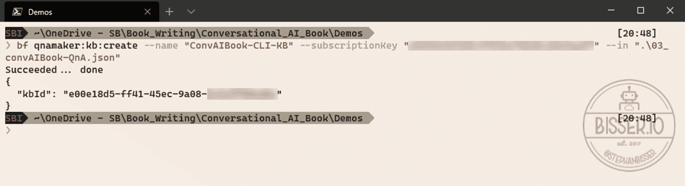

图 3.32

使用 CLI 01 配置 QnA Maker KB – 创建后的输出

现在，如果您切换回 QnA Maker 门户，并在顶部导航菜单中点击“我的知识库”，您应该会看到新的知识库“ConvAIBook-CLI-KB”已成功创建。此外，您放入 `.qna` 文件中的两个问答对也已通过 CLI 命令添加到您的新知识库中，如图 3.33 所示。

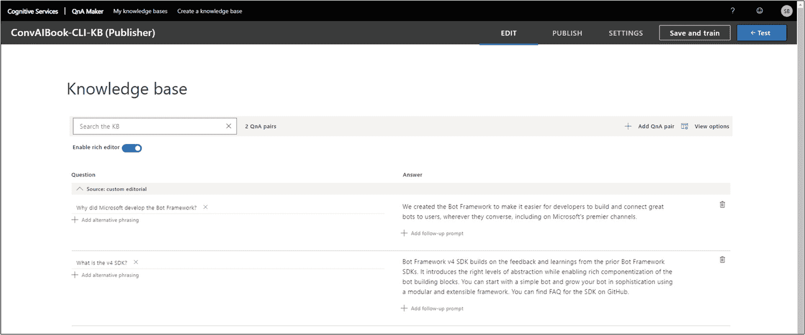

图 3.33

使用 CLI 02 配置 QnA Maker KB – 创建后的知识库

### 填充 QnA Maker 知识库

创建好 QnA Maker 知识库后，就开始了向知识库添加数据的过程。要添加新的问题和答案，您有以下几种方法，本章本节将对此进行介绍：

*   通过 QnA Maker 门户手动添加数据

*   使用 Bot Framework CLI 添加数据

*   向知识库添加 URL，由 QnA Maker 服务自动提取问答对

*   通过 QnA Maker 门户直接将文件添加到知识库

### 通过 QnA Maker 门户手动添加数据

此选项对于 QnA 内容编辑者尤其实用，因为 QnA Maker 门户提供了一种非常简单的方式来添加问答。首先，打开您的知识库，网址为 [`qnamaker.ai`](https://qnamaker.ai)，然后点击“+ 添加 QnA 对”按钮，如图 3.34 所示。

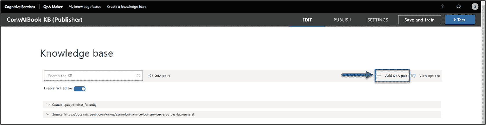

图 3.34

通过 QnA Maker 门户填充知识库 01

现在，您将在“编辑”源中获得一个新的输入字段，所有手动添加的 QnA 对都会汇总在此处。在这里，您可以在“问题”列中添加一个新问题，并在“答案”列中添加相应的答案，如图 3.35 所示。

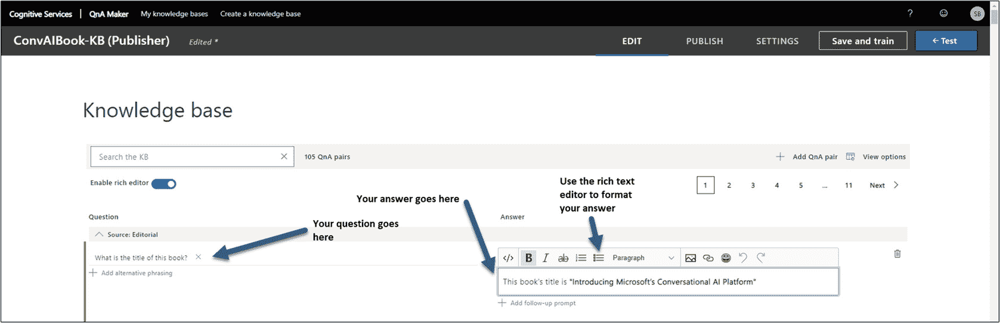

图 3.35

使用 QnA Maker 门户 02 填充知识库 – 添加 QnA 对

**注意**

QnA Maker 门户提供了一个简单的富文本编辑器，用于格式化您的答案，并应用诸如粗体、斜体、项目符号，甚至链接、图片和表情符号等样式。

添加完第一个 QnA 对后，务必为问题添加一些替代表述。这一点很重要，因为使用您对话应用程序的用户在提问时，可能不会总是使用完全相同的措辞。因此，您需要考虑用户可能会如何提出某些问题，这些问题应导向相同的答案，以覆盖所有可能的措辞变体。例如，问题“这本书的标题是什么？”也可能以以下示例句子的形式提出：

- 这本书的名字是什么？

- 这本书叫什么？

- 这本书的标题是什么？

- 这本书的标签是什么？

- 您能告诉我这本册子的名称吗？

- 我想知道这本出版物的标题。

- 您知道这部作品的名称吗？

以上所有示例都指向询问这本书的名称，但每个示例又各有不同。由于 QnA Maker 使用模式匹配算法来识别和评定最佳答案，因此构建一个精良且智能的知识库的最佳方法是，尽可能多地添加您能想到的替代表述。这将确保无论用户如何查询，您的对话应用程序都能找到最合适的答案。因此，下一步就是将前面文本中的所有这些示例作为替代表述添加到您的第一个问题中，如图 3.36 所示。

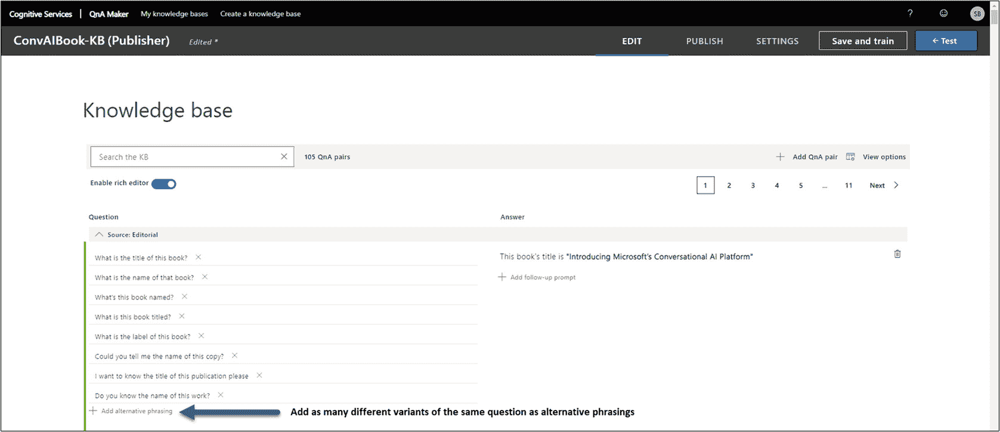

图 3.36

使用 QnA Maker 门户 03 填充知识库 – 添加替代表述

现在，您还可以将两个问题关联起来，以创建一个上下文机制。例如，您可以回答“这本书的标题是什么？”这个问题，然后提出一个所谓的后续问题，向用户提出一个关于同一主题的恰当问题。这有助于用户更轻松地在对话中导航。例如，您可以将“这本书是关于什么的？”这个问题作为原始书标题问题的后续问题添加。为此，只需点击某个 QnA 对答案列中的“+ 添加后续问题”，如图 3.37 所示。

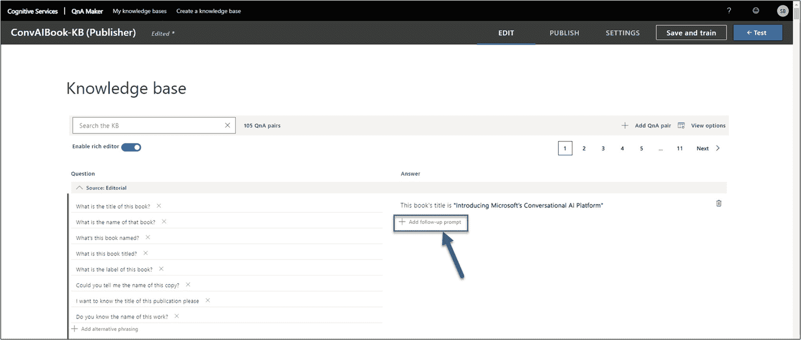

图 3.37

使用 QnA Maker 门户 04 填充知识库 – 添加后续问题

随后将打开一个新的弹出对话框，您可以在其中输入一个新问题，或者从知识库中选择一个现有问题作为后续问题（见图 3.38）。

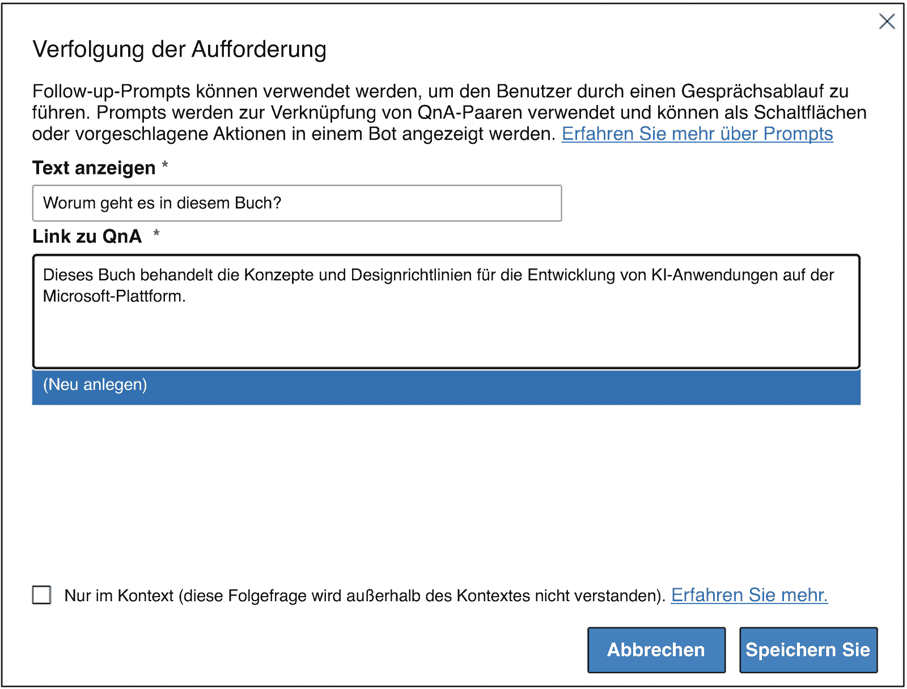

图 3.38

使用 QnA Maker 门户 05 填充知识库 – 输入后续查询数据

保存后续问题后，您会注意到知识库中已添加了一个新的 QnA 对，其问题为您输入的显示文本，答案为您在“链接到 QnA”字段中输入的内容。现在，您需要为新添加的问题添加一些替代表述，以覆盖广泛可能的措辞范围，如图 3.39 所示。

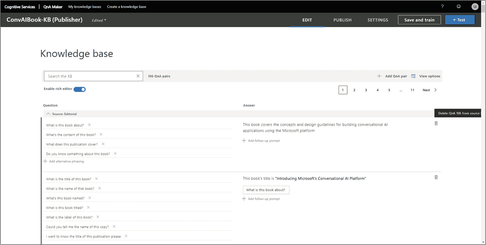

图 3.39

使用 QnA Maker 门户 06 填充知识库 – 新添加的后续问题

### 使用 Bot Framework CLI 添加数据

要使用 Bot Framework CLI 向 QnA Maker 知识库添加内容，您首先需要一个 `.qna` 文件。该文件应包含您想要添加到知识库中的所有新 QnA 对。以下是一个非常简单的示例，其中仅包含一个稍后将被添加到知识库的 QnA 对：

```
> # QnA 定义
### ? 这本书是谁写的？
'''
Stephan Bisser 写了这本书，因为他热衷于一切与对话式 AI 相关的事物。
'''
```

创建 `.qna` 文件后，您需要再次使用 Bot Framework CLI 中的 `convert` 命令，将 `.qna` 文件转换为 JSON 文件，然后该 JSON 文件可用于更新知识库。因此，您需要在终端中执行以下命令来将文件转换为 JSON：

```
bf qnamaker:convert -i ".\03_convAIBook-QnA_update.qna" -o ".\03_convAIBook-QnA_update.json"
```

此命令将创建一个名为 `03_convAIBook-QnA_update.json` 的新文件，其最终内容如下所示：

```
{
  "urls": [],
  "qnaList": [
    {
      "id": 0,
      "Antwort": "Stephan Bisser hat dieses Buch geschrieben, weil er eine Leidenschaft für alles hat, was mit Conversational AI zu tun hat",
      "Quelle": "Custom Editorial",
      "Fragen": [
        "Wer hat dieses Buch geschrieben?"
      ],
      "Metadaten": []
    }
  ],
  "Dateien": [],
  "Name": ""
}
```

但是，为了能够执行下一个更新知识库的命令，您需要手动修改该文件，使其看起来像下面这样：

```
{
  "urls": [],
  "add": {
    "qnaList": [
      {
        "id": 0,
        "Antwort": "Stephan Bisser hat dieses Buch geschrieben, weil er eine Leidenschaft für alles hat, was mit Conversational AI zu tun hat",
        "Quelle": "Redaktion",
        "Fragen": [
          "Wer hat dieses Buch geschrieben?"
        ],
        "Metadaten": []
      }
    ],
    "Dateien": [],
    "Name": ""
  }
}
```

在上面的 `03_convAIBook-QnA_update.json` 文件示例中，您可以看到 `qnaList` 被包裹在一个 `add` 对象中，以指示这些 QnA 对将被添加到知识库中。您也可以使用 `delete` 来删除特定的 QnA 对，或使用 `update` 来更新 QnA 对。此外，`qnaList` 对象的来源已从 `custom editorial` 更改为 `editorial` 作为默认来源，这是在创建新的知识库后进行的，如前所述，该来源名为 `editorial`。这确保了 QnA 对稍后会被添加到知识库中正确的来源下。完成这些更改后，下一步是执行以下命令来更新知识库。在终端中执行命令之前，请不要忘记输入您的知识库 ID 和 QnA Maker 订阅密钥：

```
bf qnamaker:kb:update --kbId "yourQnAMakerKBId" --subscriptionKey "yourQnAMakerSubscriptionKey" --in ".\03_convAIBook-QnA_update.json"
```

此命令的输出是关于所执行操作的信息，如图 3.40 所示。

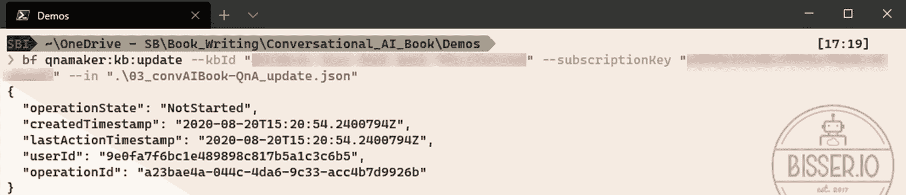

图 3.40

使用 Bot Framework CLI 01 填充知识库 – 操作状态

要检查操作是否已完成，请在终端中执行以下命令：

```
bf qnamaker:operationdetails:get --operationId "yourQnAMakerOperationId" --subscriptionKey "yourQnAMakerSubscriptionKey"
```

如果操作成功执行，输出的 `operationState` 值应为 `Succeeded`，如图 3.41 所示。

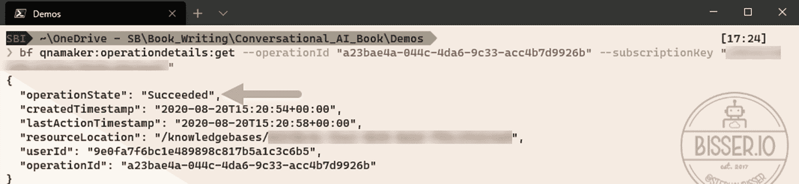

图 3.41

使用 Bot Framework CLI 02 填充知识库 – 检查操作状态

现在，如果您返回到 QnA Maker 门户中的知识库，您应该会看到来自您的 `.qna` 文件的 QnA 对已添加到知识库的 `Editorial` 来源中，如图 3.42 所示。

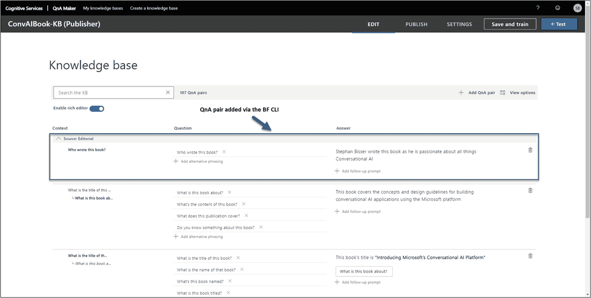

图 3.42

使用 Bot Framework CLI 03 填充知识库 – 新添加的 QnA 对

### 向知识库添加 URL

与手动向 QnA Maker 知识库添加 QnA 对不同，您可以让 QnA Maker 提取网站上已有的内容。因此，您无需手动或通过 CLI 输入数据，而是从 URL 导入内容。为此，请在 QnA Maker 门户中打开您的知识库，并导航到 `设置` 页面。在 `管理知识库` 部分，您可以添加 URL，例如 [`docs.microsoft.com/en-us/azure/cognitive-services/QnAMaker/troubleshooting`](https://docs.microsoft.com/en-us/azure/cognitive-services/QnAMaker/troubleshooting)，如图 3.43 所示。

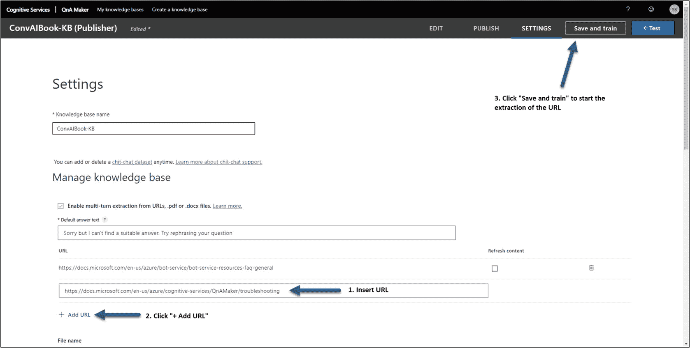

图 3.43

向 QnA Maker 知识库 01 添加 URL

添加 URL 并单击 `保存并训练` 以启动提取过程后，网站的内容将很快被添加到您的知识库中。网站内的标题（基本上是 `<h[n]></h[n]>` HTML 标签）将被提取并作为问题添加到您的知识库中，而段落（即 `<p></p>` HTML 标签）将被视为这些问题的答案，如图 3.44 所示。

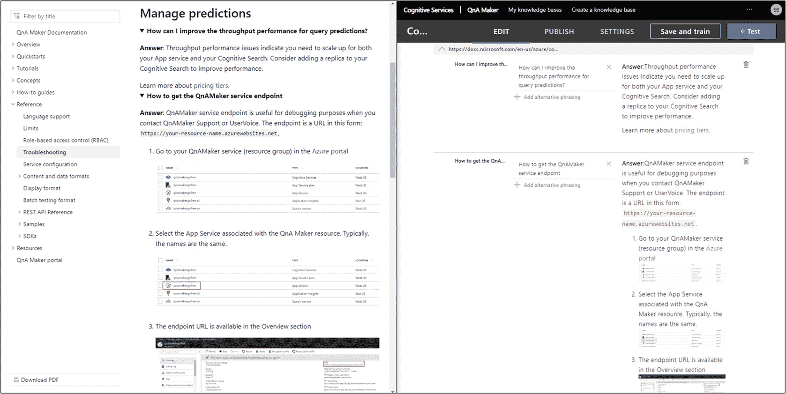

图 3.44

向 QnA Maker 知识库 02 添加 URL – 对比（左侧为原始网站，右侧为知识库）

如果网站内容已更新，您也可以更新您的知识库。如果您需要更新从 URL 提取的知识库内容，您需要转到 QnA Maker 门户中知识库的设置页面，勾选 `刷新内容` 复选框，然后点击 `保存并训练`，以启动所选 URL 的更新过程，如图 3.45 所示。

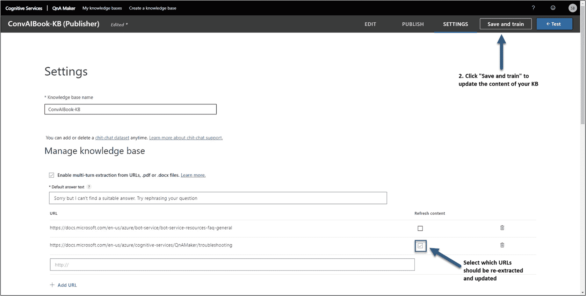

图 3.45

向 QnA Maker 知识库 03 添加 URL – 更新从 URL 提取的内容

**注意**

当网站内容发生更改时，您添加到知识库的网站 URL 内容不会自动更新。要更新您的知识库，您需要手动触发更新，或通过 QnA Maker API 触发。

### 将文件直接添加到知识库

您不仅可以向 QnA Maker 知识库添加 URL，还可以直接上传文件。如果您已经创建了不属于公开网站的常见问题解答文件，这将特别有用。表 3.2 列出了所有支持直接导入知识库的文件或数据类型。所有这些文件和文档类型都可用于填充您的知识库，而无需手动将 QnA 对直接插入到知识库中。但是，这些文件应以类似 FAQ 的风格构建。这意味着文件不应包含跨越多页的段落，而应构建成 QnA Maker 服务能够以合理的方式解析内容并提取 QnA 对。

表 3.2

**QnA Maker** 支持的文件类型（Microsoft，2020）

| 源类型 | 内容类型 |
| --- | --- |
| **PDF/Word (.pdf/.docx)** | 常见问题解答、产品手册、宣传册、论文、传单、支持指南、结构化问答等。 |
| **Excel (.xlsx)** | 结构化 QnA 文件（包括 RTF 和 HTML 支持） |
| **TXT/TSV (.txt/.tsv)** | 结构化 QnA 文件 |

注意

有关 QnA Maker 中每种支持数据类型的详细示例，请参阅 [`docs.microsoft.com/en-us/azure/cognitive-services/qnamaker/concepts/content-types`](https://docs.microsoft.com/en-us/azure/cognitive-services/qnamaker/concepts/content-types)。

以您可以从 [`bit.ly/ConvAIBook-structured-qna`](http://bit.ly/ConvAIBook-structured-qna) 下载的 Word 文件为例。这个 Word 文件主要包含多个一级标题，其后跟着段落。标题主要以问题的形式提出，而段落则是对这些问题的相应回答。

要从您的计算机向知识库添加文件，请转到知识库中的“设置”页面，然后在“管理知识库”部分下选择“+ 添加文件”，如图 3.46 所示。点击该按钮后，将打开一个上传对话框，您可以在其中选择正确的文件并将其上传到您的知识库。

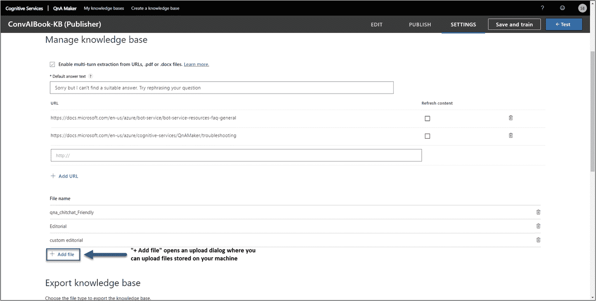

图 3.46

向 QnA Maker 知识库 01 添加文件

上传文件后，您需要重新保存并训练您的知识库，以便 QnA Maker 服务能够提取文件内容。当您返回知识库的“编辑”页面时，您会看到它包含了上传文件中的所有 QnA 对，如图 3.47 所示。

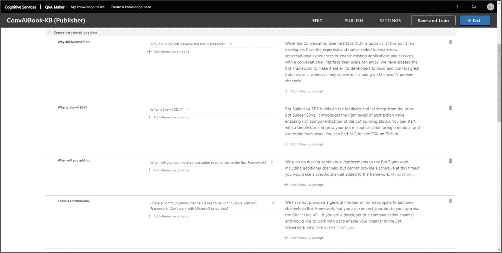

图 3.47

向 QnA Maker 知识库 02 添加文件

### 测试知识库

使用 QnA Maker 门户的一个优点是它提供了测试功能。当您用新的 QnA 对更新知识库时，这非常有用，应该加以利用。测试知识库对于您的对话应用程序的成功至关重要，因为您可以在用户遇到问题之前，发现并修复知识库中的低置信度或错误查询结果。

要测试知识库，请转到 QnA Maker 门户中的知识库，然后选择右上角的 *“← 测试”* 按钮。这将显示交互式测试窗口，您可以在其中输入您认为用户可能会提出的示例查询。请记住使用与知识库中存储的数据不同的查询数据，因为用户可能不会总是使用与知识库中存储的问题完全相同的措辞。例如，在您的知识库中，您可能有这样一个问题：“这本书是关于什么的？” 为了测试这个问题，您应该考虑另一种措辞，例如“这本书讲的是什么？”。现在，您可以使用测试字段并输入这个措辞，看看答案是否正确。如图 3.48 所示，服务返回的答案并不完全是您期望的，因为它用书的标题来回答，而不是内容。从该图中您还可以看到，置信度值相当低，为 49.85%，因此这个问题还需要改进。

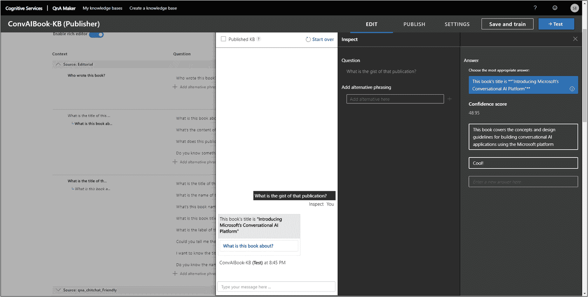

图 3.48

测试 QnA Maker 知识库 01
```

另一个可以用来测试同一问题的例子是“这本书的精髓是什么？” 当您在测试字段中输入这个问题时，您应该会看到服务用关于书的内容的正确答案来回答，尽管置信度率仍然较低，为 68.69%，如图 3.49 所示。

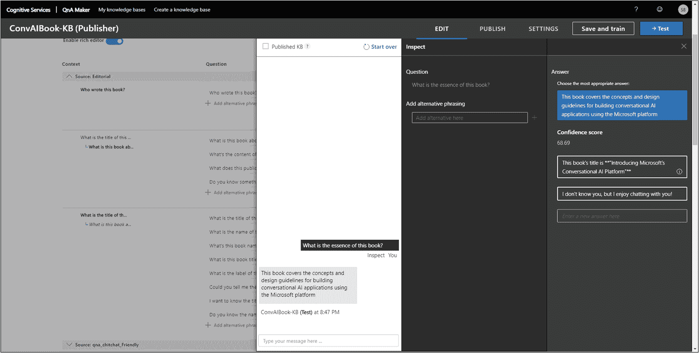

图 3.49

测试 QnA Maker 知识库 02

为了解决这两个问题，您现在可以将“这本书是关于什么的？”和“这本书的精髓是什么？”作为问题“这本书讲的是什么？”的替代措辞添加进去，以告知服务这类问题涉及的是书的内容主题，而不是标题。在您保存并训练知识库后，您可以进行重新测试，例如使用查询“这本出版物的精髓是什么？”，您会发现答案被正确返回，并且置信度值也达到了可接受的 94.17%，尽管该查询并非某个 QnA 对的确切组成部分，而是措辞略有不同，如图 3.50 所示。

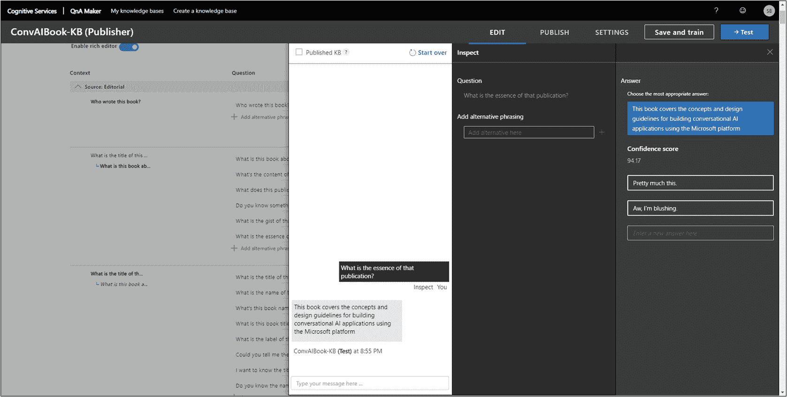

图 3.50

测试 QnA Maker 知识库 03

> **注意**
> 测试知识库是一个必要的过程，应该全面进行，以纠正低置信度值并发现错误的查询结果。

### 发布知识库

在用户能够通过对话式应用程序（如聊天机器人）访问知识库内容之前，知识库生命周期的最后一步就是发布。发布知识库主要包含两件事：要发布知识库，请进入 QnA Maker 门户中的“发布”页面，然后点击“发布”按钮，如图 3.51 所示。

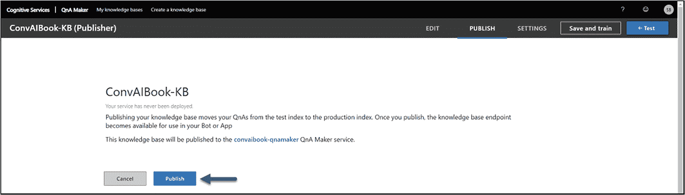

图 3.51

发布 QnA Maker 知识库 01

*   知识库的最新版本将存储在 Azure 搜索服务内的一个专用索引中。

*   将提供一个可由您的对话式应用程序调用的终结点。

知识库发布后，您将看到所有终结点详细信息，稍后在从聊天机器人等处调用 QnA Maker 服务时会用到这些信息，如图 3.52 所示：

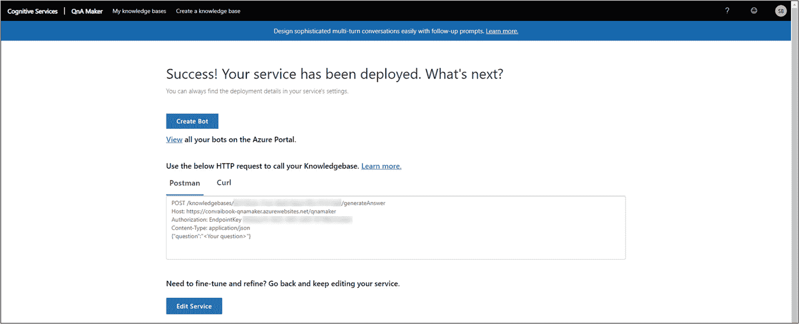

图 3.52

发布 QnA Maker 知识库 02

当然，如果您不想通过 QnA Maker 门户发布知识库，或者希望将来能自动化发布流程，也可以使用 Bot Framework CLI，在终端会话中执行以下命令来发布您的知识库：

```
bf qnamaker:kb:publish --kbId "yourQnAMakerKBId" --subscriptionKey "yourQnAMakerSubscriptionKey"
```

*   **知识库 ID**：您的知识库 ID 包含在 POST 请求的示例 URL 中，位于 `/knowledgebases/` 之后，用于识别正确的知识库。

*   **主机**：主机是您在查询知识库时，需要从对话式应用程序调用的终结点。

*   **授权**：`EndpointKey` 用于对发往您知识库的请求进行授权，以防止未经授权的应用程序访问您知识库的内容。

## 文本分析

语言类别中另一个常用于对话式应用程序的服务是文本分析 API。该服务主要涵盖以下四个用例：

*   情感分析

*   关键词提取

*   命名实体识别

*   语言检测

在开发聊天机器人或其他对话式应用程序时，这些用例中的许多都大有裨益，因为它们增强了自然语言处理功能。由于这是一个即用型 API，因此无需调整此服务内的组件。因此，下一节将详细讨论所有四个用例，以解释其背后的概念；但实际实现将在后续章节中介绍。

### 情感分析

想象一下，您正在构建一个集成到客户服务流程中的聊天机器人，作为处理用户请求的第一道关口。在许多情况下，您的聊天机器人能够回答有限数量的问题，通常是常见问题，但在其他情况下，您的聊天机器人可能无法充分回答特定的用户问题。这是一个关键点，因为当聊天机器人无法回答问题时，您不希望失去用户，因此您需要考虑某种人工转接。人工转接基本上描述了当聊天机器人无法再回答用户问题时，将对话从聊天机器人转交给能够帮助用户的人员的过程。然而，在此过程中，需要决定何时进行转接，因为每次聊天机器人无法回答特定问题时都进行转接并不合理。这基本上就是情感检测可以帮助您找到向人工转接的正确时机的最佳场景。

文本分析 API 中的情感分析功能会为给定的文本提供 0 到 1 之间的情感评分。此功能旨在为您提供关于用户情绪的知识，使您能够判断用户当前是积极还是消极情绪。一个简单的例子是句子“我对昨天在餐厅得到的优质服务非常满意，一定会再来的。”如果您使用这个例句调用文本分析 API 的情感分析功能，您将得到 0.90463 的情感评分，这意味着该句子相当积极，如图 3.53 所示。

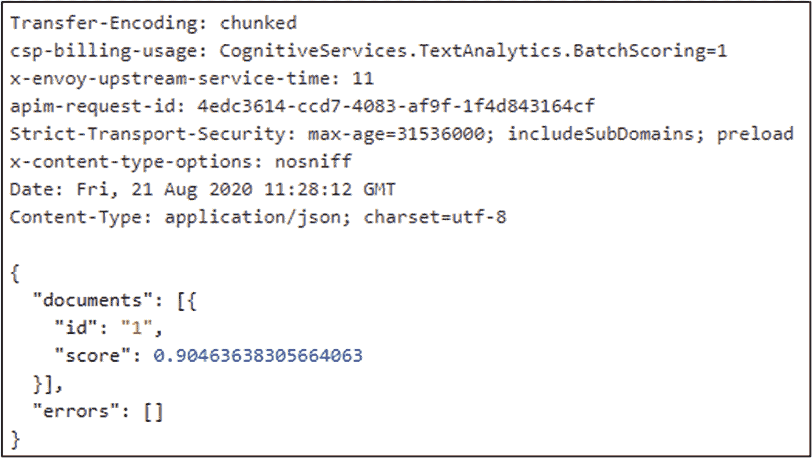

图 3.53

文本分析 API 情感分析功能 01 – 正面示例

然而，如果您使用句子“我很惊讶昨天餐厅的服务真的很糟糕，所以我再也不会回来了”，并使用该句子调用文本分析 API，您会看到情感评分相当低，为 0.1873，如图 3.54 所示。这意味着在这种情况下，该句子偏向负面。

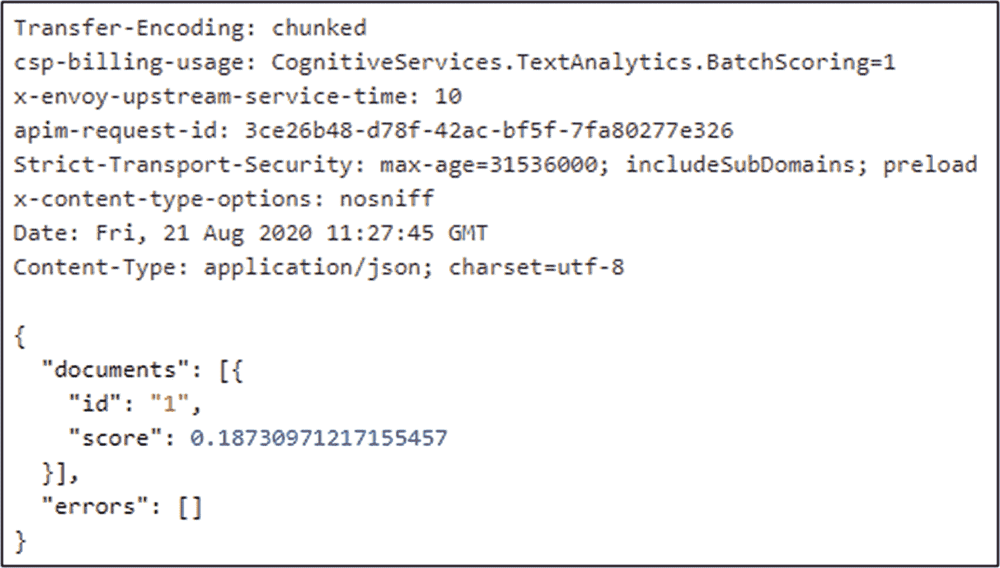

图 3.54

文本分析 API 情感分析功能 02 – 负面示例

利用文本分析 API 的情感分析功能，您可以轻松检测用户的情绪，并在用户情绪消极时，决定聊天机器人是否应将对话直接转接给人工。这可以对用户的情况产生积极影响，因为它在一定程度上创造了一个降级场景，因为人工可能更有效地回答用户的问题。这反过来又会促使用户可能再次光顾，从而对您的服务产品产生积极影响。

### 关键词提取

关键词提取是文本分析 API 中的另一项功能，可为您的对话应用程序带来一些优势。继续以之前提到的集成到客服解决方案中的聊天机器人为例，想象一下用户向您的聊天机器人发送相当长的消息，例如：“我昨天对餐厅里周到的服务非常满意，绝对会再来的。不过，我不太喜欢汤几乎是凉的，而主菜又烫得没法吃。但冰淇淋甜点非常完美！”这条消息相当长，因此聊天机器人需要分析的不仅仅是一个句子，而是多个句子。这可能是一项艰巨的任务，尤其是在需要转接给人工客服的情况下，因为可能涉及多个专家。

因此，识别用户请求中特定关键短语的能力，有助于识别句子中的重要部分，然后采取相应的行动。例如，在图 3.55 中，您可以看到上述示例句子的结果。文本分析的关键短语提取 API 识别出了该句子中的以下关键短语：在这些关键词中，您可以看到例如“周到的服务”被提取出来。由此可以推断，发送此消息的人可能想提供反馈，表明服务周到，餐厅体验令人愉快。

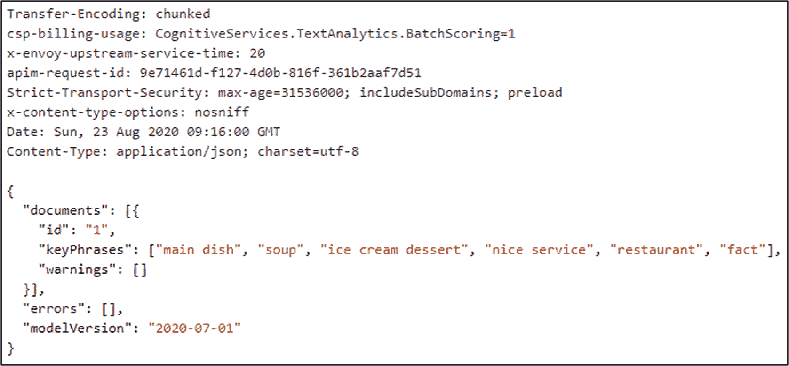

图 3.55

文本分析 API 关键短语提取功能 01

* 主菜

* 汤

* 冰淇淋甜点

* 周到的服务

* 餐厅

* 事实

在这些关键词中，您可以看到例如“周到的服务”被提取出来。由此可以推断，发送此消息的人可能想提供反馈，表明服务周到，餐厅体验令人愉快。

通过结合关键词提取功能和情感分析服务，聊天机器人中的人工转接功能可以得到极大改善。原因是，您可以首先检测用户输入的情感，以判断用户当前情绪是好是坏。根据此结果，如果情感分数为正面，您可以允许聊天机器人结束对话；如果情感分数为负面，则将对话转接给客服人员。然后，如果您从用户的消息中提取关键短语，并将其预览提供给客服人员，客服人员就能比阅读完整聊天记录更快地了解大致主题。这样，客服人员就能更快地接管对话，并及时为用户提供帮助。

### 命名实体识别

命名实体识别接收非结构化文本，并返回 API 识别出的实体。这些实体可以是人名、地点、事件、产品或已知的组织。例如，句子“我在西雅图太空针塔旁边遇到比尔·盖茨的那家餐厅真的很棒！”如图 3.56 所示，识别出了“太空针塔”、“西雅图”和“比尔·盖茨”这些词，并且 API 甚至为识别出的实体标记了相应的类别，如地点或人物。

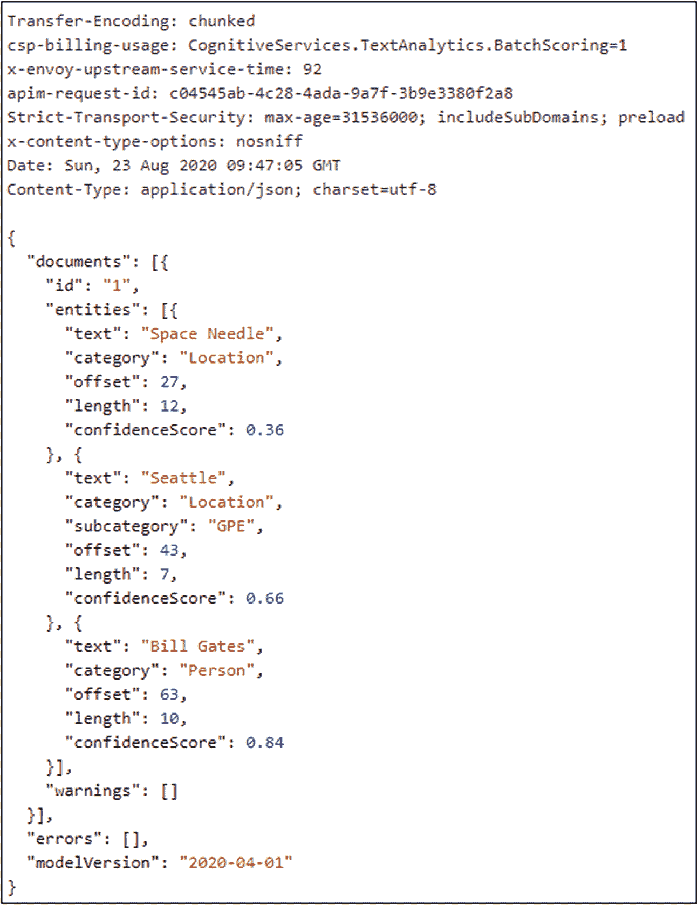

图 3.56

文本分析 API 命名实体识别功能示例

此 API 中的另一个功能是实体链接服务。它本质上描述了在给定文本中识别特定实体及其身份的能力。这些识别出的实体基本上来自一个知识库，该知识库存储了所有这些单词或短语，以及描述它们的维基百科文章链接。例如，实体链接功能可以识别给定句子中的单词“Nike”，并区分它指的是运动品牌、希腊女神还是美国陆军的火箭项目。图 3.57 展示了从句子“Nike 的 T 恤真的很舒服，我喜欢穿它。”中识别出的输出示例。

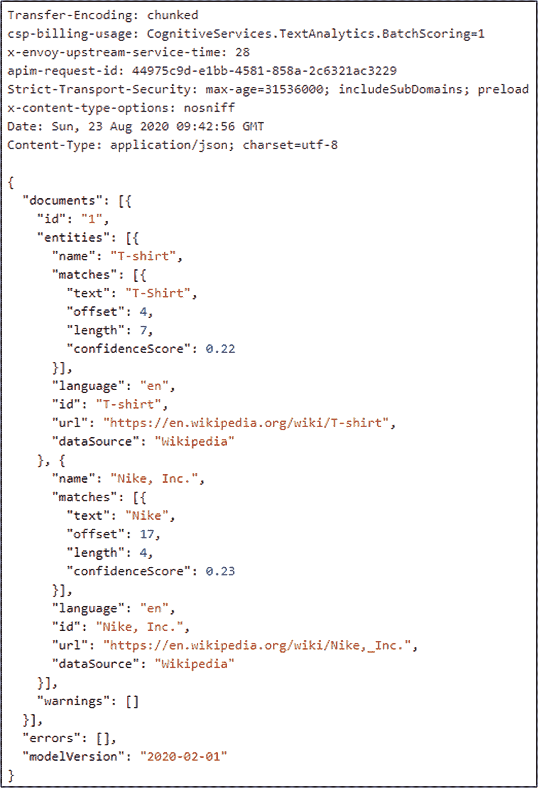

图 3.57

文本分析 API 命名实体识别功能 – 实体链接示例

### 语言检测

文本分析 API 中的第四个组件是语言检测功能。此服务接收非结构化文本作为输入，并返回给定文本的检测语言。例如，当您为在线商店创建一个聊天机器人，并预期会有来自世界各地的访客时，这会很有帮助。在这种情况下，在将输入文本传递给 LUIS 或 QnA Maker 知识库之前，先检测用户在对话中的语言是有益的，因为如果使用英文知识库来查询中文用户的问题，可能无法得到正确的答案。因此，可以使用此 API 端点来检测一个或多个句子的语言，如图 3.58 所示，其中输入包含以下两个句子：

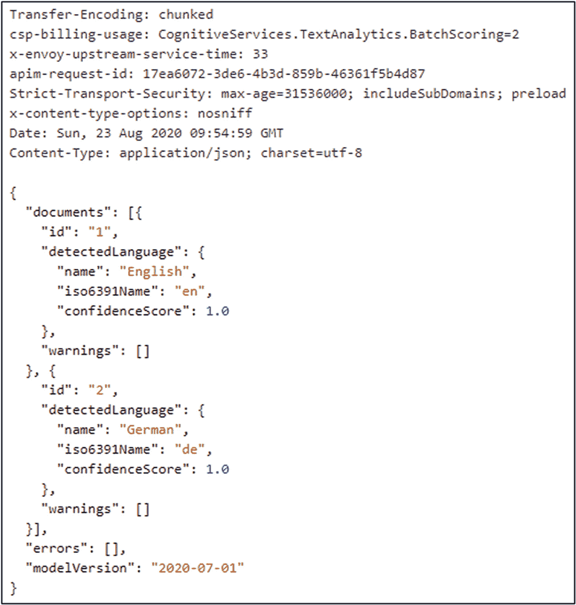

图 3.58

文本分析 API 语言检测示例

* “我在西雅图太空针塔旁边遇到比尔·盖茨的那家餐厅真的很棒！” – 英语

* “我在西雅图太空针塔旁边遇到比尔·盖茨的那家餐厅真是棒极了！” – 德语

## 翻译器

如第 1 章所述，翻译是聊天机器人应用场景中的一个基本组件，因为它简化了数据管理流程。通过在您的聊天机器人解决方案中引入翻译功能，您无需为每种语言单独创建知识库、语言模型和其他重要服务，因为您基本上可以将所有“后端”组件保持在一两种语言中，并在进一步处理之前，将任何其他语言的输入翻译成这些语言之一。Azure 认知服务中的翻译器服务提供了以下可在对话应用程序场景中使用的功能：

*   翻译文本。

*   音译文本。

*   检测语言。

*   查询单词翻译。

*   确定句子长度。

### 翻译

最常用的功能自然是“文本翻译”功能。通过此功能，您可以将句子从一种语言翻译成超过 70 种语言。使用翻译功能相当简单。由于它是一个 API，在最简单的情况下，您只需创建一个 `HTTP-POST` 请求，提供您的 Azure 订阅密钥以访问 Translator 资源，选择要将文本翻译成的语言，并添加要翻译的文本，如下面的 `curl` 请求所示：

```
curl -X POST "https://api.cognitive.microsofttranslator.com/translate?api-version=3.0& from=en& to=de" -H "Ocp-Apim-Subscription-Key: yourTranslatorKey" -H "Content-Type: application/json; charset=UTF-8" -d "[{'Text':'Hallo, wie ist Ihr Name?'}]"
```

结果是将指定文本翻译成您所选语言，如下所示：

```
[{
"Übersetzungen":[
{
"text": "Hallo, wie heißt du?",
"bis": "de"
}
]
}]
```

此外，您还可以通过将所有语言添加到 HTTP 请求中，同时将文本翻译成多种语言，如下例所示：

```
curl -X POST "https://api.cognitive.microsofttranslator.com/translate?api-version=3.0& from=en& to=de&to=it&to=ja&to=th" -H "Ocp-Apim-Subscription-Key: yourTranslatorKey" -H "Content-Type: application/json; charset=UTF-8" -d "[{'Text':Hi how are you?'}]"
```

作为结果，您将收到所有选定语言的翻译句子：

```
[{
"Übersetzungen": [
{
"text": "Hallo, wie geht es dir?",
"bis": "de"
},
{
"text": "Ciao come stai?",
"zu": "es"
},
{
"text": "やあ、元気。",
"bis": "ja"
},
{
"text": "ไง เธอเป็นไงบ้าง",
"bis": "th"
}
]
}]
```

翻译功能在您需要构建多语言聊天机器人，但不想为每种支持的语言都构建 LUIS 应用程序或 QnA Maker 知识库的场景中非常有用。在这种情况下，您可以选择主要语言，并专门为这些最常用的语言开发语言模型和知识库，然后将其他语言的用户消息翻译成这些语言之一，从而以最小的投入获得最佳效果。

> **注意**：有关 Translator API 的详细语言支持，请访问 [`docs.microsoft.com/en-us/azure/cognitive-services/translator/language-support`](https://docs.microsoft.com/en-us/azure/cognitive-services/translator/language-support)。

### 语言检测

在构建多语言聊天机器人时，在应用自然语言处理功能（如语言理解或关键短语提取）之前，检测用户语言的能力至关重要。因此，Translator API 提供了检测特定句子语言的功能。这在您拥有多个 LUIS 应用程序和 QnA Maker 知识库（支持多种语言）且需要确定特定用户输入应使用哪种语言的场景中非常有用。在这种情况下，您可以使用“语言检测”功能首先确定用户输入的正确语言，然后查询 LUIS 或 QnA Maker 以相应地处理用户输入。以下 HTTP 请求演示了使用此功能的一个非常简单的示例，输入句子为“In welcher Sprache ist dieser Text geschrieben?”

```
curl -X POST "https://api.cognitive.microsofttranslator.com/detect?api-version=3.0" -H "Ocp-Apim-Subscription-Key: yourTranslatorKey" -H "Content-Type: application/json" -d "[{'Text':'In welcher Sprache ist dieser Text geschrieben?'}]"
```

上述 `HTTP POST` 调用的结果是，英语被检测为前述句子的语言。同时，菲律宾语和爱尔兰语也被识别为备选语言：

```
[{
"Sprache": "en",
"Punktzahl: 1.0,
"isTranslationSupported":true,
"isTransliterationSupported":false,
"Alternativen":
[
{
"Sprache": "fil",
"Punktzahl: 1.0,
"isTranslationSupported":true,
"isTransliterationSupported":false
},
{
"Sprache": "ga",
"Punktzahl: 1.0,
"isTranslationSupported":true,
"isTransliterationSupported":false
}
]
}]
```

### 在词典中查询

在某些场景下，获取特定单词或短语的替代翻译会很有帮助。`Translator` 提供了一项功能，可以获取这些替代翻译及其应用示例。例如，将单词“Schlüssel”从英语翻译成德语。如果像本例这样使用词典查询，您将从 API 获得所有可能的翻译，从而可以选择在当前语境下最合适的翻译：

```
curl -X POST "https://api.cognitive.microsofttranslator.com/dictionary/lookup?api-version=3.0&from=en&to=es" -H "Ocp-Apim-Subscription-Key: yourTranslatorKey" -H "Content-Type: application/json" -d "[{'Text':'key'}]"
```

上述示例请求的结果如下：


# 在聊天机器人中组合认知服务的最佳实践

由于您已经单独了解了对话应用场景中最常用的 `Azure Cognitive Services`，下一节将介绍组合其中一些服务的最佳实践。如前所述，这些 `Cognitive Services` 中的每一个基本上都是作为 API 提供的，可以由应用程序（无论是聊天机器人还是其他解决方案）调用；但由于本书的重点是对话应用程序，因此以下场景将仅涵盖对话应用程序。

## LUIS 和 QnA Maker

在创建您的第一个聊天机器人时，最好从一个相对简单的用例开始。将 `QnA Maker` 集成到您的聊天机器人中就是这样一个场景，因为您可以基于 `QnA Maker` 知识库快速构建一个聊天机器人。然而，`QnA` 当然不是复杂的聊天机器人解决方案中唯一使用的场景。因此，当您需要在聊天机器人中涵盖 `QnA` 和基于任务的应用场景时，`LUIS` 是完美的组件。在这种情况下，正确设计您的自然语言处理架构至关重要。实现这一目标的最佳方法是创建一个所谓的 `Dispatch`-`LUIS` 模型，如图 3.59 所示。

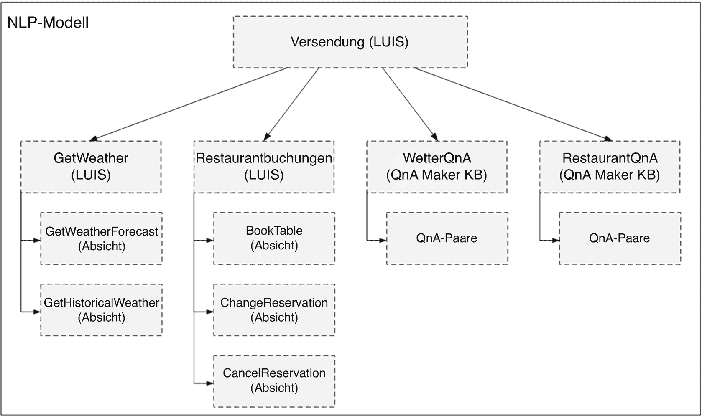

图 3.59

`LUIS` 和 `QnA Maker` 参考架构

这种架构的概念是创建一个顶层 `LUIS` 应用程序，它作为所有底层 `LUIS` 应用程序以及 `QnA Maker` 知识库的 `Dispatch` 模型。当您的聊天机器人收到新的用户请求时，此 `Dispatch` 应用程序用于确定最合适的路由。`Dispatch` 模型基本上充当所有 `LUIS` 模型和知识库之间的路由器。`Dispatch` 模型基本上为每个 `LUIS` 应用程序和知识库包含一个意图。当使用一个表述查询 `Dispatch` 模型时，`Dispatch` 应用程序能够识别匹配的意图，然后您可以使用该意图将您的请求路由到正确的 `LUIS` 应用程序或 `QnA Maker` 知识库，具体取决于该表述是存储在您的某个 `KB` 中，还是与您的 `LUIS` 应用程序的某个意图相匹配。

**注意**

要创建这样一个 `Dispatch` 模型，您需要使用 `Dispatch CLI` 工具，该工具尚不属于 `Bot Framework CLI`，但可以从 [`aka.ms/bot-dispatch`](http://aka.ms/bot-dispatch) 下载。

上面在图 3.59 中概述的示例，是您在为一个有多个团队参与的大型组织构建聊天机器人时可能会遇到的情况。在这种情况下，创建一个涵盖所有可能用例的单一 `LUIS` 应用程序并不总是最佳方法。因此，您可以将您的语言理解模型拆分为多个部分，这使不同团队能够独立处理不同的 `LUIS` 应用程序，而不会影响语言模型的其他部分。

## QnA Maker + 翻译器

构建多语言聊天机器人的另一个最佳实践是使用本章前面描述的 `Translator` API 以及 `QnA Maker`。这在您为旨在面向跨国场景的聊天机器人构建大型知识库时可能非常有益。在这种情况下，您基本上有三种选择：

1.  为聊天机器人要支持的每种语言创建 `QnA Maker` 知识库。

2.  为主要语言创建 `QnA Maker` 知识库，并对所有其他语言使用 `Translator` API。

3.  为聊天机器人的主要语言创建一个 `QnA Maker` 知识库，并对所有其他语言使用翻译器 API。

第一种选择当然是最耗时的，因为这意味着您需要为您想要支持的每种语言构建一个知识库。现在，如果您正在开发一个旨在支持来自世界各地用户的聊天机器人或对话应用程序，您需要构建大量的知识库，然后聊天机器人会连接到这些知识库。在许多情况下，这种实现的工作量太高了，因此很少选择这种方案。

与第一种相比，第二种方案的实现工作量稍小，因为您不需要为每一种语言都构建一个 `KB`，而只需为优先级高的语言构建。当您希望特别针对某些国家，但又不想屏蔽特定语言时，这种方案是最佳选择。在这种情况下，您可以决定哪些语言不应自动翻译，而应由手动构建的知识库来服务。这些语言的用户请求将由针对该特定语言手动构建的知识库来回答，这在大多数情况下会带来更好的结果。

## LUIS + 文本分析

在许多面向客户的聊天机器人示例中，使用 `LUIS` 来识别用户的意图并启动对话中的特定例程或对话。如图 3.59 所示的示例，用户和聊天机器人之间的对话中可能有许多路径，例如获取天气信息或管理餐厅预订。在大多数场景中，仅使用 `LUIS` 可能就足够了，因为它能识别用户的意图并采取相应行动。但特别是在用户感到沮丧或生气的情况下，识别用户的情绪并据此决定聊天机器人是继续对话还是转接给人工客服，可能是一个不错的选择。

因此，将 `文本分析` API 和 `LUIS` 集成在一起以涵盖这些场景可能是一个好方案。如图 3.60 所示，如果对话沿着“愉快路径”进行，聊天机器人可以继续对话并处理用户的请求。相反，在“关键路径”的示例中，当聊天机器人检测到用户消息中的负面情绪分数时，最好将对话转接给人工客服。

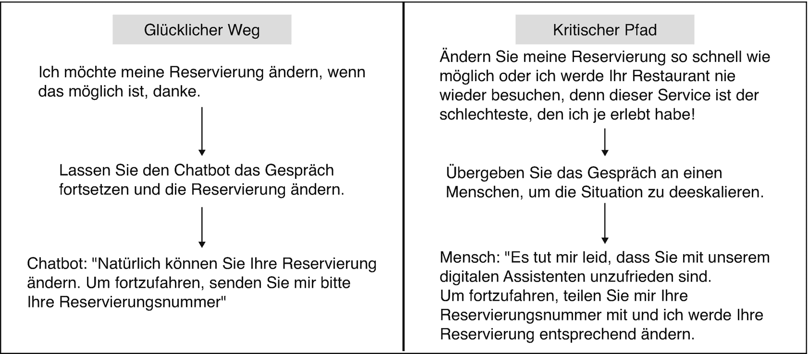

图 3.60

`LUIS` 和文本分析的实践示例

## 总结

在本章中，您了解了对话式应用程序（如聊天机器人）中使用的最重要的 Azure 认知服务。首先，我们探讨了语言类别中的各种服务，例如 `LUIS`、`QnA Maker`、`Text Analytics` 和 `Translator`。这些服务最适合用户通过书面文本与聊天机器人进行交互的场景。此外，我们还学习了如何使用基于 Web 的门户和 `Bot Framework CLI` 创建新的语言理解应用程序，以及如何通过 `QnA Maker` 门户和 `CLI` 设置并填充 `QnA Maker` 知识库。本章的最后部分介绍了一些最佳实践，涉及在构建复杂的聊天机器人解决方案时如何组合多个 Azure 认知服务，例如多语言场景或集成多个 `LUIS` 应用程序和 `QnA Maker` `KBs` 的能力。

下一章将引导您了解开发聊天机器人时应考虑的主要设计原则和指南。此外，还将涵盖对话流程的概念、用户体验的想法以及用于开发卓越聊天机器人解决方案的视觉元素。
