# 4. 聊天机器人的设计原则

机器人的整体设计是聊天机器人成功的最重要因素。作为开发人员，您的目标是开发用户愿意使用的聊天机器人。因此，您需要考虑如何让用户在使用您的聊天机器人而非其他 Web 应用程序或解决方案时获得优势。为了让用户真正使用您的聊天机器人，机器人必须以最快且最简单的方式解决用户的需求，并且这种方式要优于其他解决方案。一个例子是在餐厅预订餐桌的用例。“传统”方法如下：在这种情况下，您的目标必须是简化这一过程，例如实现一个聊天机器人用例，用户只需执行以下步骤：

1. 在智能手机应用或网站上打开聊天机器人。
2. 输入句子：“我想在西雅图的一家意大利餐厅预订周日晚上 6 点、2 位客人的餐桌。”
3. 从可用餐厅列表中选择并确认预订。

在前面的示例中，您可以看到使用聊天机器人的预订过程比在应用或网站上的常规方法要简单得多，也省时得多。因此，用户更可能使用您的聊天机器人而非应用或网站，因为他们可以节省时间，同时仍能获得预期的结果。要创建一个成功的聊天机器人，有许多事情需要考虑；因此，本章将涵盖开发成功聊天机器人的所有重要方面。

1. 打开智能手机应用或网页浏览器，导航到可以预订餐厅餐桌的网站。
2. 输入所需城市或餐厅。
3. 输入餐厅类型（例如，意大利菜、墨西哥菜、快餐等）。
4. 输入客人数量。
5. 输入时间。
6. 从可用餐厅列表中选择并确认预订。

在这种情况下，您的目标必须是简化这一过程，例如实现一个聊天机器人用例，用户只需执行以下步骤：

## 个性与品牌塑造

机器人成功的关键首先在于其个性。如果您的机器人拥有独特的个性，用户可能会更愿意与您的机器人进行对话，因为这会使整个聊天体验更加人性化和自然。因此，您应该为聊天机器人打造一个品牌。通常，您的品牌应包含以下主要特征，以使其脱颖而出：

- **名称**：不要将您的机器人命名为“聊天机器人 XYZ”，而是给它起一个合适的名字，以便用户能够与您的机器人建立联系。
- **标语**：为您的机器人提供一个简短的标语或介绍语，让人们清楚您的机器人能做什么。
- **形象**：向人们展示您的机器人的外观，无论是类似机器人的图像还是人类的插图，以便人们看到他们正在与谁交谈。

您的聊天机器人本质上代表了您个人或公司在用户面前的形象，因此您必须确保机器人的个性能够反映您的核心价值观。想象一下，您正在为一家银行机构构建聊天机器人，该银行所有在柜台服务客户的员工都穿着西装打领带。在这种情况下，聊天机器人应该与银行的态度保持一致，即礼貌待客并尊重客户。因此，开发一个以幽默风格说话并针对年轻一代的机器人是不合理的，因为在许多情况下，年轻人并非银行的主要目标群体。更合理的做法是让聊天机器人的个性和语言与使用该机器人的公司整体形象保持一致。相反，如果您正在为一家专注于销售生活方式产品的年轻初创公司开发聊天机器人，那么幽默的个性就非常合适，因为该公司也希望以这种方式向用户或客户展示自己。


### 开发聊天机器人之前

在开发聊天机器人之前，您应专注于塑造或至少勾勒出机器人的个性，使其符合预期的应用场景，尤其是要契合其目标受众。在许多情况下，这并非开发者能独立完成的任务，而是需要了解目标受众的业务人员参与，他们能够清晰地描绘出聊天机器人的个性。当然，这个过程在大多数情况下涉及角色定义和关键用户分析，因此这绝非仅由开发者完成的任务。您必须始终牢记，您的聊天机器人是您公司或服务的另一个虚拟代表。因此，它应与您公司或产品的整体形象紧密契合。

通常，人们更倾向于聊天机器人做出人性化而非机械化的回应。因此，密切关注您的目标受众至关重要。例如，如果目标受众是 Z 世代，聊天机器人自然可以使用该世代在与同龄人聊天时习惯的表情符号和内容来回应。相反，如果您的目标受众是婴儿潮一代，那么您的聊天机器人就应该使用这一代人习惯的语言。研究这一点的一个合适方法是使用所谓的“个性卡片”，这些卡片基本上描述了聊天机器人在不同情境下的个性。

**注意：** 此处的首要目标是确保聊天机器人的个性在整个对话过程中保持一致，并且可以由最终用户进行调整。

## 问候与介绍

聊天机器人的一个重要部分是它如何向用户介绍自己。这自然应与聊天机器人的整体个性或品牌形象保持一致，以提供统一的聊天机器人体验。例如，如果您正在开发一个具有友好个性的聊天机器人，您应尝试在对话一开始就表达出这种友好。反之，如果您的机器人应更正式，那么问候语或开场白就应以此为导向。

此外，您必须记住，留下积极印象的机会只有一次。如果用户喜欢聊天机器人的介绍和问候，他们就更有可能继续与它对话。这样，他们就更有可能使用通过机器人提供的服务，或访问您的网站以获取有关您产品的更多信息。因此，由于第一印象至关重要，您必须确保问候语能给用户留下积极印象。如果做到了这一点，您的聊天机器人被实际使用的可能性就会大大增加。此外，您也更有可能通过聊天机器人来推广您的产品。

为了给您一个在对话的问候部分应避免什么的例子，图 4.1 展示了一个可能较差的问候场景。这里最重要的一点是，机器人没有首先问候用户。这显得有点不友好，因此您应始终尝试实现所谓的“主动问候”。这是一个概念，即用户在有机会说“你好”之前就首先被问候。其次，聊天机器人提出了一个相当开放的问题：“我能为您做什么？”这类问题通常会导致用户提问不精确，因为用户不能立即知道该问什么。因此，应避免这个糟糕问候的例子，因为它没有立即展示聊天机器人最重要的能力。因此，用户可能不知道该问什么，并很快关闭聊天。

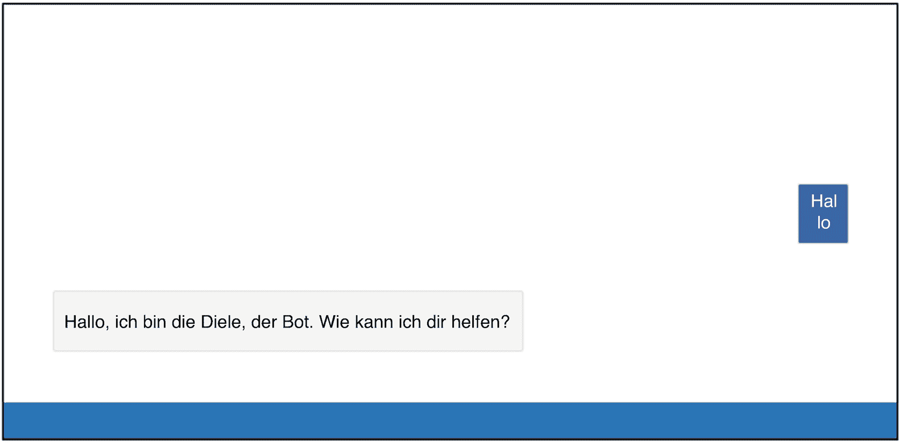

*图 4.1 – 一个糟糕的聊天机器人问候示例*

与糟糕的例子相反，图 4.2 展示了一个处理问候的更好示例。在这个例子中，您可以看到机器人首先问候了用户，这相当礼貌。此外，机器人不仅问候了用户，还通过说明其核心能力和应用场景进行了自我介绍。这很有好处，因为用户直接被告知可以问机器人什么，或者机器人通常能做什么。此外，问候部分不仅包含文本，还包含一些用户可以直接点击的按钮。这些按钮充当对话中的一种导航辅助工具，引导用户完成对话。这有两个主要优点：首先，用户可以在对话中更快地移动，因为他们不必手动在聊天中输入每个句子。其次，机器人提出了对话或对话树中的可能路径，这限制了用户提问的可能性。这反过来又最大限度地减少了语言理解组件的问题，因为消息已通过按钮预定义。

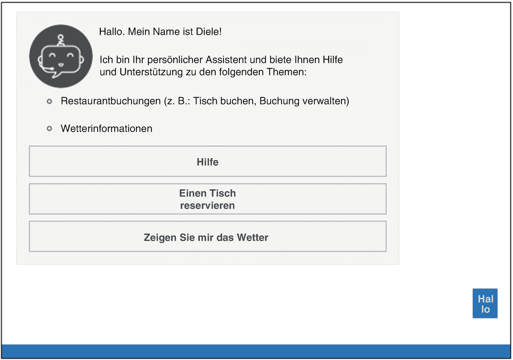

*图 4.2 – 一个良好的聊天机器人问候示例*

您还应该加入主动问候机制。这样，您的用户就能更好地了解聊天机器人。如图 4.2 所示，机器人通过一张问候卡片向用户介绍自己。这张卡片基本上包含机器人的名称、图标，以及最重要的聊天机器人的动机。通过这种方式，机器人可以在用户需要提问之前，就向用户传达其优势。如本例所示，机器人还应给用户快速开始对话的机会，这通常通过按钮实现。这样，用户甚至无需在聊天中输入任何内容，而是可以点击按钮来启动对话中的特定对话流程。

问候是对话生命周期中至关重要的一部分，因为它对用户的反应起着决定性作用。请记住，第一印象永远重要。因此，如果机器人留下了良好的第一印象，用户就更愿意继续与机器人对话。这反过来又会提高您机器人的使用率，并最终可能带来更多满意的客户。因此，同样，您机器人的个性也很重要，它也应该在问候消息中体现出来。如果您的用户通过聊天机器人得到了热情且恰当的问候，他们就会使用这个聊天机器人。


### 导航（菜单）

聊天机器人对话的另一个重要组成部分是对话导航。与应用程序或网站不同，聊天机器人没有汉堡菜单或导航栏，无法让用户跳转到对话中的特定位置。因此，您需要考虑如何引导用户完成对话。此外，还应考虑对误解或死胡同的管理。因此，整合一种由机器人告知用户的导航策略是一个好方法。例如，图 4.3 展示了一个很好的方法，即通过让用户直接回复“帮助”来引导他们如何在对话中获得帮助。这样，用户在对话的第一条消息中就能看到这一点，并知道如果遇到不清楚的地方或不知道如何继续，只需输入“帮助”即可获得支持以继续对话。

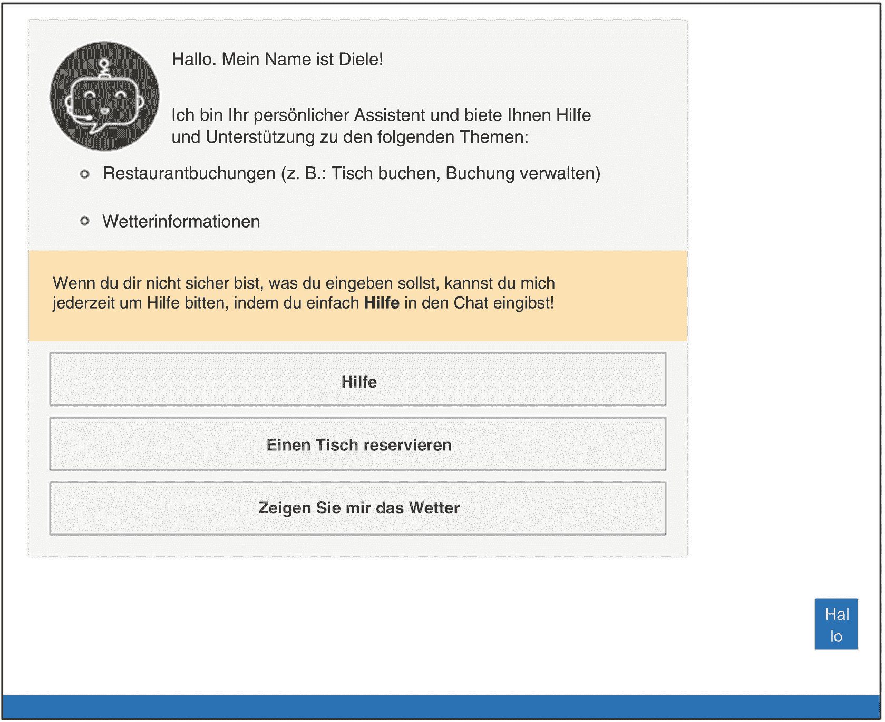

**图 4.3**

问候卡片导航引导示例

然而，这并不是对话中唯一的选择，因为用户并不总能记住欢迎消息中的描述；因此，当您认为用户不确定如何继续对话时，也应尝试提供帮助。这本质上可以通过使用自然语言处理来实现，以识别用户何时对某事不确定。在这种情况下，聊天机器人应向用户提供某种形式的帮助。为了给您一个不应如何处理这种情况的例子，图 4.4 勾勒了一个在实践中不应出现的对话序列。在这个例子中，用户可能会认为聊天机器人并非旨在满足用户需求，从而可能立即结束对话。

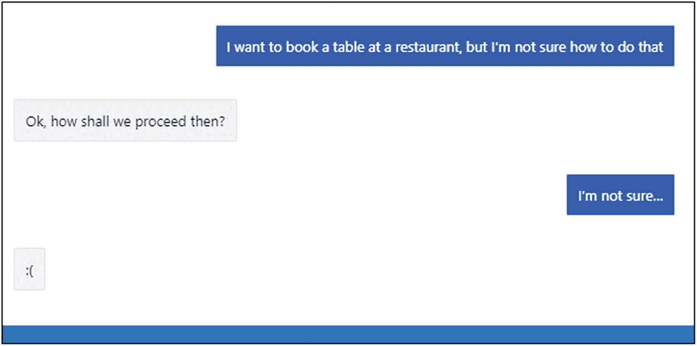

**图 4.4**

糟糕的导航/帮助示例

为了克服此类问题，图 4.5 勾勒了一个处理不确定用户的好方法示例。在此示例中，聊天机器人检测到用户不确定如何继续对话，这会触发聊天机器人语言理解组件中的一个意图，进而询问用户是想要预订餐桌还是需要一般帮助。由于用户希望获得关于聊天机器人任务的一般信息，因此会向用户发送一张卡片，描述聊天机器人具体能为用户做什么，并附带按钮形式的视觉元素，以引导用户进入对话的正确部分。

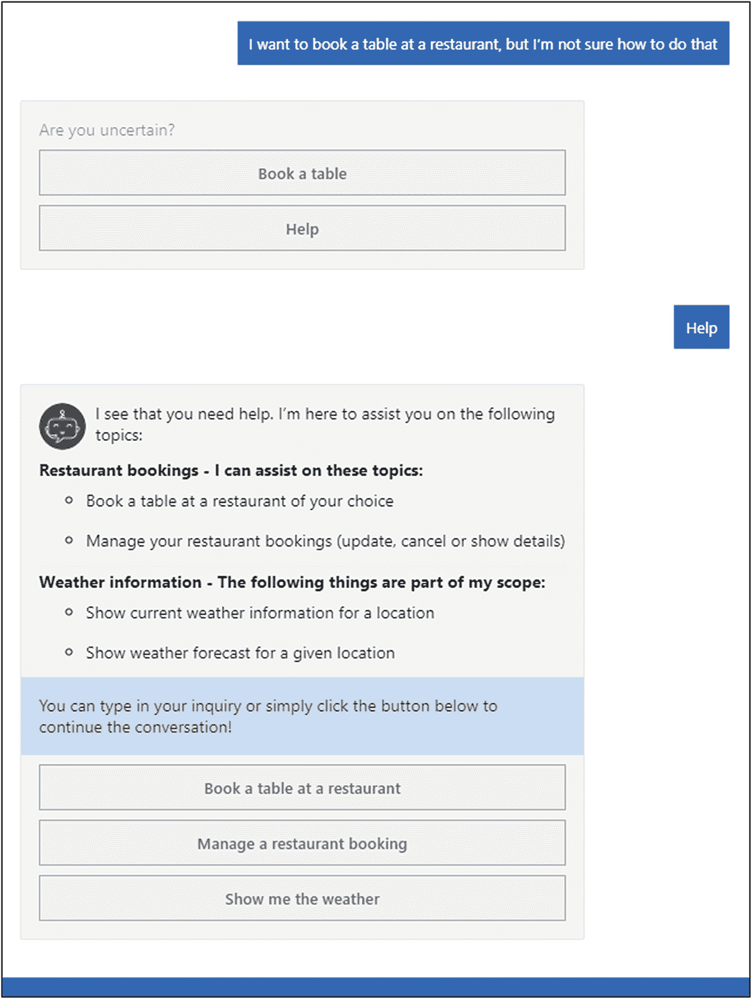

**图 4.5**

良好的导航/帮助示例

如前述示例所示，聊天机器人在不确定的情况下会以导航按钮的形式提供帮助，用户可以点击这些按钮来触发对话树中的特定对话。这样，对话就能流畅地继续，用户也会被引导到对话中的正确位置。

## 对话流程

一个对话通常由多个对话组成，这些对话共同构成一个对话树。这样的对话树本质上是对聊天机器人用例的表示。在实践中，在开始实际开发或创建机器人之前，先对对话树进行建模是一个好方法。这样，您就可以以流程图或类似选项的形式在纸上勾勒出机器人的行为和例程，这些将作为后续开发阶段的对话设计稿。如第 2 章所述，对话是聊天机器人的核心，因为它们是用户与机器人对话时直接提供的对话机制。在设计对话流程时，您还应考虑如何正确处理中断。由于用户可能在对话中途想要切换上下文，您也应考虑如何处理此类情况，并在中断处继续对话。

如图 4.6 所示，聊天机器人的对话树可以由许多不同的对话组成。每个对话框负责处理不同的用例或对话部分。在 Microsoft Bot Framework 中，顶层对话框被称为 `RootDialog` 或 `MainDialog`。它本质上是用户与聊天机器人之间任何对话的起点。`RootDialog` 通常包含一个 LUIS 识别器，负责确定用户的意图，以触发特定的子对话框。

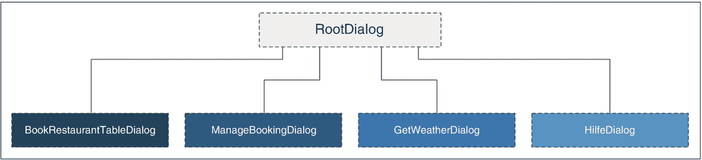

**图 4.6**

对话树概览

在开始开发聊天机器人之前，通常最好先像图 4.6 那样对对话进行建模，以便了解构建机器人时需要哪些对话和对话机制。为了帮助开发人员和聊天机器人设计人员完成此过程，Bot Framework CLI 提供了一个工具，可以将作为 Markdown 代表的聊天文件转换为可在 Bot Framework Emulator 中用于演示目的的转录文件。一个简单的 `.chat` 文件可能如下所示：

```
user=stephan
bot=diele
用户: 你好
机器人: 你好，我是 Diele 机器人。有什么可以帮你的吗？
```

在此示例中，上述 Markdown 内容保存在名为 `04_greeting_bad.chat` 的文件中。创建文件后，您可以在终端中运行以下 Bot Framework CLI 命令，将此 `.chat` 文件转换为 `.transcript` 文件：

```
bf chatdown:convert --in .\04_greeting_bad.chat -o .\
```

转录文件包含许多聊天文件之外的额外参数，例如对话和参与者 ID、活动类型以及消息。现在，可以使用 Bot Framework Emulator 打开此生成的转录文件，它将向您展示这个非常简单的对话在真实场景中的样子，如图 4.7 所示。

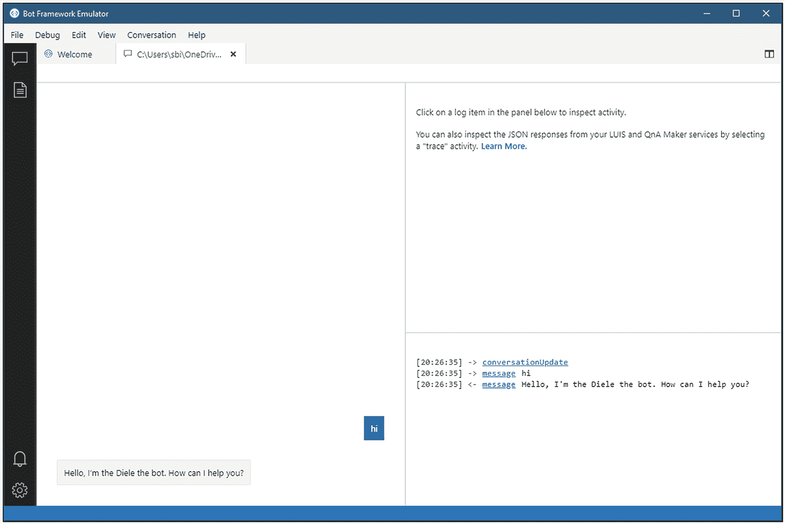

**图 4.7**

Chatdown 示例 01

您不仅可以在聊天文件中使用纯文本，还可以使用卡片，我们将在本章稍后的部分详细介绍。在聊天文件中使用卡片的示例如下：

```
user=stephan
bot=diele
机器人: [Attachment=cards\04_greetingCard.json adaptivecard]
用户: 你好
```


### 重新执行 `bf chatdown:convert` 命令并传入之前的示例聊天文件后，在 Bot Framework Emulator 中渲染的对话如图 4.8 所示。

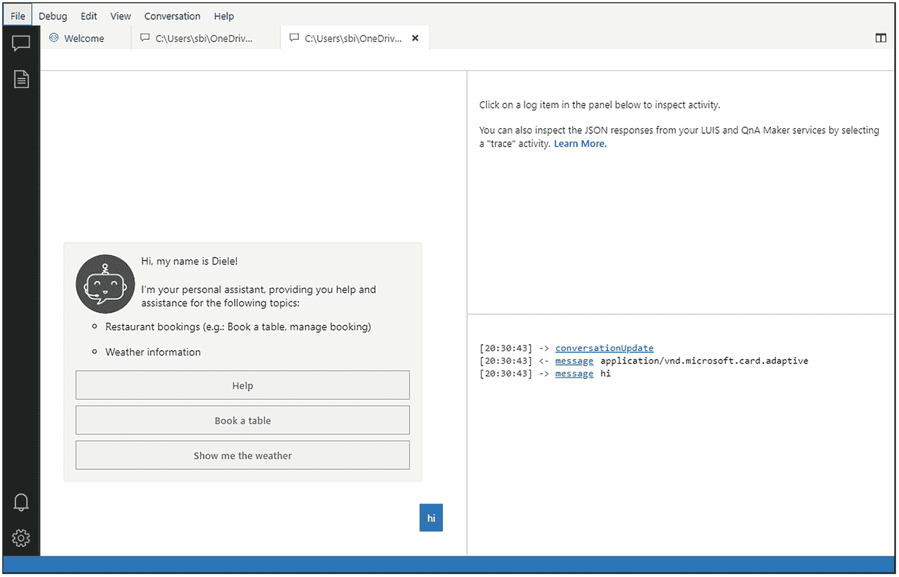

图 4.8 Chatdown 示例 02

但 `Chatdown` 的用途并不仅限于像上面那样勾勒和检查对话中的单轮交互。您还可以使用 `Chatdown` 来设计聊天机器人内部的完整对话和对话流程。例如，您可以为 `BookRestaurantTableDialog` 创建一个 `.chat` 文件，如图 4.6 所示。此对话框旨在通过聊天机器人为用户预订餐桌。因此，聊天机器人需要知道首选地点、日期、时间以及至少用餐人数，才能预订餐厅餐桌。为了通过聊天文件来表达这一点，然后使用 Bot Framework CLI 将其转换为转录文件，您可以使用以下示例：

```
user=stephan
bot=diele
用户: 预订餐桌
机器人: 您有特定的地点偏好吗？
机器人: [Attachment=cards/04_askForLocationCard.json adaptivecard]
用户: 西雅图怎么样？
机器人: 您有特定的日期吗？
用户: 明天
机器人: 几点？
用户: 下午 3 点
机器人: 几位客人？
用户: 3 位
机器人: 好的。需要我为您预订明天下午 3 点在西雅图、3 位的餐桌吗？
机器人: [Attachment=cards/04_tableConfirmationCard.json adaptivecard]
用户: 是的
机器人: [打字中][延迟=3000]
您的餐桌已预订。参考编号：#K89HG38SZ
```

将上述聊天文件转换为转录文件后，在 Bot Framework Emulator 中的输出如图 4.9 所示。如您在此示例中所见，只需几行 Markdown 即可设计完整的对话甚至整个对话路径。这样，非开发人员也可以使用 `Chatdown` 和 `.chat` 文件的标记法，在将聊天机器人逻辑和对话的实际开发工作交给开发人员之前，先设计用于测试和演示的聊天机器人对话。

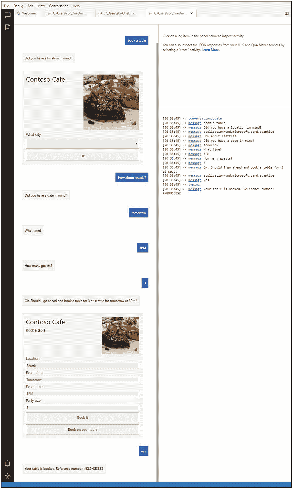

图 4.9 Chatdown 示例 03

## 自适应对话

在 Bot Framework 中，目前有两种实现对话的概念：一种是许多 Bot Framework SDK 版本中使用的对话库，另一种是新增的自适应对话概念。这两种概念的主要区别在于，自适应对话在处理对话事件（如中断或上下文切换）时提供了更大的灵活性。自适应对话背后的主要思想是提供一种更基于事件的方法来创建对话，该方法既包含对话部分（如语言理解和生成），也包含对话内的操作。由于这种新的声明式模型旨在为开发人员提供一系列构建聊天机器人的模式，而不一定需要通过编写代码来实现，因此本书的重点主要放在描述这种自适应对话方法上。

**注意**

如果您想了解更多关于 Bot Framework SDK 中对话库的信息，请访问 [`docs.microsoft.com/en-us/azure/bot-service/bot-builder-concept-dialog`](https://docs.microsoft.com/en-us/azure/bot-service/bot-builder-concept-dialog)。

自适应对话包含一系列称为触发器的事件处理程序，如图 4.10 所示。触发器本身可以包含一个条件，用于确定何时触发该触发器。每个触发器内部包含一个或多个在触发器执行时运行的操作。事件处理程序基本上处理对话中发生的所有事件，并评估应执行哪个触发器。

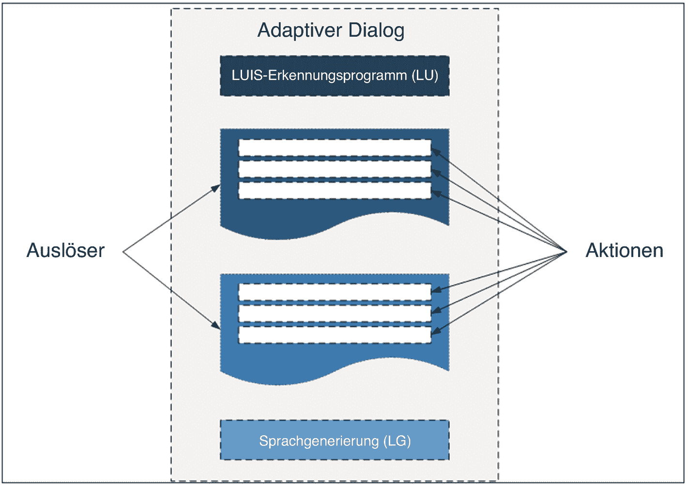

图 4.10 自适应对话的概念


### 自适应对话触发器

Bot Framework 包含多种不同的触发器类型，用于特定场景，如表 4.1 所示，涵盖从识别事件、对话和活动事件到消息事件。

表 4.1

自适应对话 – 触发器类型 (Microsoft, 2020)

| 触发器类型 | 描述 |
| --- | --- |
| **基础触发器** | `OnCondition` 触发器是所有触发器派生自的基础触发器。在自适应对话框中定义触发器时，它们被定义为一组 `OnCondition` 对象。 |
| **识别事件触发器** | 识别程序从用户输入中提取有意义的信息（如意图和实体），并发出事件。例如，当识别器从特定用户表述中提取出意图（或实体）时，会触发 `recognizedIntent` 事件。您可以使用 `OnIntent` 触发器来处理此事件。此类型下可用的触发器有：`OnChooseIntent`、`OnIntent`、`OnUnknownIntent`、`OnQnAMatch` |
| **对话事件触发器** | 对话触发器用于处理与“对话生命周期”相关的特定对话事件。目前 Bot Framework SDK 中有六个对话触发器，它们都派生自 `OnDialogEvent` 类。此类型下可用的触发器有：`BeginDialog`、`CancelDialog`、`EndOfActions`、`Error` |
| **活动事件触发器** | 使用活动触发器，您可以为来自客户端的每个传入活动分配操作，例如当新用户加入且机器人开始新对话时。有关活动的更多信息，请参阅 Bot Framework 的活动架构。所有活动事件都具有基础事件 `ActivityReceived`，并根据其活动类型进一步细化。所有活动触发器派生自的基类是 `OnActivity`。此类型下可用的触发器有：`ConversationUpdate`、`EndOfConversation`、`Event`、`Handoff`、`Invoke`、`Typing` |
| **消息事件触发器** | 消息事件触发器允许您响应任何消息事件，例如消息被更新（`MessageUpdate`）或删除（`MessageDeletion`），或者有人对消息做出反应（`MessageReaction`）（例如，常见的消息反应包括点赞、爱心、大笑、惊讶、悲伤和愤怒）。消息事件是活动事件的一种，因此所有消息事件都具有基础事件 `ActivityReceived`，并根据活动类型进一步细化。所有消息触发器派生自的基类是 `OnActivity`。此类型下可用的触发器有：`Message`、`MessageDeletion`、`MessageReaction`、`MessageUpdate` |
| **自定义事件触发器** | 您可以通过向任何触发器添加 `EmitEvent` 操作来发出自己的事件；然后，您可以通过定义自定义事件触发器，在机器人任何对话框的任何触发器中处理此自定义事件。自定义事件触发器是 `OnDialogEvent` 触发器，当您将其 `Event` 属性设置为与 `EmitEvent` 的 `EventName` 属性相同的值时，它将成为自定义触发器。此类型下可用的触发器有：`OnDialogEvent` |

识别事件触发器包含用于确定用户意图和实体的识别器。当机器人内的多个识别器检测到多个意图时，会触发识别事件触发器中的 `OnChooseIntent` 触发器。因此，此触发器控制用于选择正确意图以继续对话的逻辑。此触发器类型中的 `OnIntent` 触发器在检测到特定意图时执行，以便可以执行定义的操作。相比之下，`OnUnknownIntent` 触发器处理任何 `OnIntent` 触发器均未检测到意图的情况。识别事件触发器中的最后一个触发器是 `OnQnAMatch` 触发器。每当 `QnAMakerRecognizer` 接收到 QnAMatch 意图时，就会触发此触发器，这意味着检测到用户输入与 QnA Maker 知识库中的 QnA 对之间存在匹配。

对话事件触发器类型由用于处理对话生命周期中特定事件的触发器组成。`OnBeginDialog` 触发器包含在特定对话框开始时执行的操作。`OnCancelDialog` 触发器用于防止对话框被取消。`OnEndOfActions` 触发器定义了在对话框的所有操作运行完毕后应执行的操作。而 `OnError` 触发器则处理对话框内的特定错误情况。

在活动事件触发器中，当用户开始与机器人对话时，会执行 `ConversationUpdate` 触发器。当用户与机器人之间的对话结束时，会执行 `EndOfConversation` 触发器。`Handoff` 触发器用于执行人工交接操作，以便将人工接入与用户的对话中。`Typing` 触发器用于判断用户是否正在输入。

消息事件触发器类型中的 `MessageReceived` 触发器用于在机器人收到用户的新消息时执行操作。相比之下，当用户的消息被删除时，会执行 `MessageDelete` 触发器。例如，如果用户对某条消息点赞，则会执行 `MessageReaction` 触发器来处理此类情况，并据此执行必要的操作。`MessageUpdate` 触发器可用于处理用户消息的更新。


### 自适应对话操作

除了触发器之外，自适应对话还包含*操作*。这些操作本质上是对话被触发时执行的步骤或流程。操作主要侧重于维持对话流程，例如发送消息或查询知识库以回答用户问题，或执行其他类型的任务，例如验证用户输入以继续对话。由于自适应对话中提供了许多不同的操作，表 4.2 简要描述了最常用的操作。

表 4.2

自适应对话的操作类型 (Microsoft, 2020)

| 操作类型 | 操作名称 | 操作描述 |
| --- | --- | --- |
| **活动** | `SendActivity` | 发送一个活动，例如向用户发送回复。 |
| **活动** | `Aktivitätsmitglieder erhalten` | 获取活动成员列表并将其存储在存储中的属性中。 |
| **条件语句** | `IfCondition` | 基于布尔表达式执行一系列操作。 |
| **条件语句** | `SwitchCondition` | 基于模式匹配执行一系列操作。 |
| **条件语句** | `ForEach` | 遍历存储在数组中的一系列值。 |
| **对话管理** | `BeginDialog` | 开始执行另一个对话。当该对话结束时，继续执行当前触发器的后续操作。 |
| **对话管理** | `EndDialog` | 结束当前活动的对话。当您希望对话在结束前完成并返回结果时使用此选项。会发出 `EndDialog` 事件。 |
| **对话管理** | `RepeatDialog` | 用于重新启动父级对话。 |
| **管理属性** | `EditArray` | 对数组执行操作。 |
| **管理属性** | `SetProperties` | 一次性设置一个或多个属性的值。 |
| **访问外部资源** | `BeginSkill` | 启动一项技能，并将活动转发到该技能，直到技能结束。 |
| **访问外部资源** | `HttpRequest` | 向端点发出 HTTP 请求。 |
| **访问外部资源** | `CodeAction` | 调用自定义代码。自定义代码必须是异步的，接受对话上下文和一个对象作为参数，并返回一个对话翻转结果。 |

注意

要获取自适应对话中所有支持的操作列表，请运行 `https://docs.microsoft.com/en-us/azure/bot-service/adaptive-dialog/adaptive-dialog-prebuilt-actions`。

### 自适应对话存储范围

上述所有操作都可用于执行各种任务。此外，对话中的操作还可以访问机器人的存储层。这使得开发人员能够使用自适应对话管理机器人的状态，类似于 Bot Framework SDK 中对话库的概念。自适应对话中的存储被划分为不同的*存储范围*。每个范围服务于不同的目的，例如存储用户或对话数据，或访问特定对话内的值。自适应对话中的所有存储范围都在表 4.3 中进行了描述。

表 4.3

自适应对话的存储范围 (Microsoft, 2020)

| 范围名称 | 范围描述 |
| --- | --- |
| **用户范围** | 用户范围是持久性数据，仅限于您正在通信的用户的 ID。例如：`user.name`，`user.address.city` |
| **对话范围** | 对话范围是一个持久性数据区域，与您正在进行的对话的 ID 相关联。例如：`conversation.hasAccepted`，`conversation.dateStarted` |
| **对话范围** | 对话范围在相关对话的持续时间内存储数据，并为每个对话提供存储空间，以便进行内部、持久的记账。当相关对话结束时，对话范围会被清空。例如：`dialog.orderStarted`，`dialog.shoppingCart` |
| **轮次范围** | 轮次范围包含非持久性数据，仅适用于当前轮次。轮次范围提供了一个在当前轮次持续时间内共享数据的位置。例如：`turn.bookingConfirmation`，`turn.activityProcessed` |
| **设置范围** | 这些是通过平台特定的设置配置系统提供给机器人的所有设置。例如，如果您使用 C# 开发机器人，这些设置将出现在 `appsettings.json` 文件中。例如：`settings.QnAMaker.Hostname`，`settings.QnAMaker.endpointKey`，`settings.QnAMaker.knowledgebaseId` |
| **此应用范围** | 此范围指的是活动操作的属性包。这对于输入操作很有帮助，因为它们的生命周期通常超过单个对话轮次。例如：`this.value`（包含当前为输入识别的值），`this.turnCount`（指示为此输入查询缺失信息的次数） |
| **类范围** | 此范围包含活动对话的实例属性。您可以像这样引用此范围：`${class.<PropertyName>}`。 |

使用自适应对话概念设计的对话树示例（如图 4.6 所示）可以在图 4.11 中看到。此示例展示了 *RootDialog* 及其各种 *OnIntent* 类型触发器的实现。每个触发器都包含一个 `BeginDialog` 操作，用于根据用户的意图执行相应的子对话。在子对话内部，又可以有特定的触发器和相应的操作来相应地执行对话。所有对话和操作共享同一个存储层，这意味着每个对话都可以访问所描述的存储范围，以实现适当的状态管理。此示例对话树也将在接下来的章节中用于开发能够处理这些对话任务的聊天机器人。

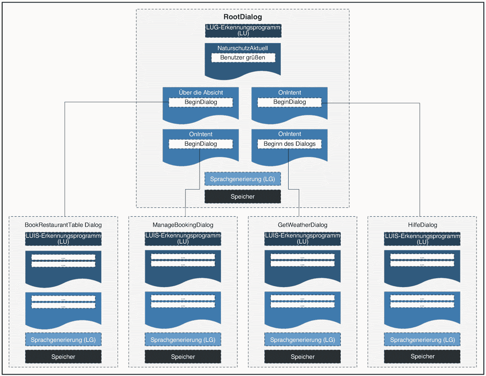

图 4.11

自适应对话树示例


## 用户体验

聊天机器人的用户体验在某种程度上不同于“传统”的应用程序或网站的用户体验，因为您创建的是对话式用户界面（简称 `CUI`），而非图形用户界面（简称 `GUI`）。由于人们拥有不同类型的对话习惯，设计聊天机器人的用户体验有时可能是一项挑战。因此，正如本章节中提到的，了解聊天机器人的目标受众至关重要。年轻人习惯于使用 `Facebook`、`WhatsApp` 和 `Slack` 等对话平台。他们习惯于通过即时通讯和聊天与他人交流，而年长一代可能不习惯这类通讯平台，因为他们成长于不同的时代，有着不同的沟通方式。年轻人熟悉在对话中使用表情符号以及图片和视频等富媒体，而年长一代可能并非如此。因此，在开发聊天机器人之前，您应该对目标受众有清晰的认识。

不过，总的来说，开发一个不仅仅通过纯文本消息与用户交流的聊天机器人是一个好的实践。当然，这要求您的聊天机器人所运行的渠道也支持其他类型的消息和富媒体附件。例如，用于短信（`SMS`）的机器人只能发送和接收文本消息，而不能发送图片和视频。然而，`Azure Bot Service` 支持的大多数通信渠道都支持富媒体附件。因此，您的聊天机器人应设计为包含这些对话机制，以积极影响对话流程。

良好的聊天机器人用户体验还包括状态管理的概念。状态基本上是机器人的大脑，用于让机器人能够检索与用户的对话历史。这对于设计良好的对话流程至关重要，因为如果机器人知道中断发生的位置，以及如何在发生中断或上下文切换的点恢复对话，它就能更好地处理中断。此外，通过适当的状态管理，您有机会开发出更人性化的对话行为，因为机器人可以记住与用户之前对话中的特定信息，这同样能改善对话流程。在我们的示例中，聊天机器人处理餐厅预订请求，这也包括预订的管理。因此，如果用户无需提供餐厅预订的完整信息即可更新或取消预订，那将非常有益。相反，机器人应该能够记住用户的预订，并仅通过询问预订参考号来继续处理用户的请求。因此，状态管理引入了机器人记住先前对话信息的能力。

## 富媒体附件

除了机器人能够记住先前对话的部分内容之外，良好用户体验的另一个重要因素是除了文本之外，还要包含富媒体附件。如前所述，这取决于您的机器人部署在哪个渠道上，但总的来说，在用户对话中融入图片、链接、视频甚至表情符号等对话元素是一个好方法。因此，`Microsoft Bot Framework` 支持多种不同的选项来向机器人消息添加富媒体附件。在 `C#` 机器人中，您可以使用以下代码片段，通过向消息添加内联附件，轻松地向用户发送包含图片的消息：

```
msg = MessageFactory.Text("Here you see the dialog tree!");
msg.Attachments = new List() { GetImageAttachment() };
private static Attachment GetImageAttachment()
{
var imgPath = Path.Combine(Environment.CurrentDirectory, @"img", "dialogTree.png");
var img = Convert.ToBase64String(File.ReadAllBytes(imgPath));
return new Attachment
{
Name = @"img\dialogTree.png",
ContentType = "image/png",
ContentUrl = $"data:image/png;base64,{img}",
};
}
```

重要的是，富媒体附件能够增强机器人与用户之间的对话。当您想要展示菜单卡等特定内容时，使用包含图片和其他媒体的消息进行回复是有益的。当然，您也可以向用户发送包含菜单信息的文本消息，但在大多数情况下，菜单的图片会更专业，并且尤其对用户更友好。


### 卡片作为视觉元素

除了使用内联附件之外，通常一个好的做法是使用所谓的*卡片*作为开场消息，来主动开始与用户的对话，正如本章前面所示。Bot Framework 中的卡片可以在单条消息中包含多种类型的丰富用户控件以及视觉或音频元素。如表 4.4 所述，Microsoft Bot Framework 支持多种不同的卡片类型，可用于不同的场景，例如显示动画、视频或图片、播放音频文件或让用户登录。由于本章无法详细讨论所有支持的卡片类型，我们将在接下来的章节中重点介绍最常用的卡片类型。

表 4.4

Microsoft Bot Framework 中支持的卡片类型 (Microsoft, 2018)

| 卡片类型 | 卡片描述 |
| --- | --- |
| **自适应卡片** | 一种开放的卡片交换格式，以 JSON 对象表示。通常用于跨渠道部署卡片。卡片会自适应调整以匹配各自宿主渠道的外观。 |
| **动画卡片** | 一种可以播放动画 GIF 或短视频的卡片。 |
| **音频卡片** | 一种可以播放音频文件的卡片。 |
| **英雄卡片** | 一种包含单个大图、一个或多个按钮以及文本的卡片。通常用于在视觉上突出显示可能的用户选择。 |
| **缩略图卡片** | 一种包含单个缩略图、一个或多个按钮以及文本的卡片。通常用于在视觉上突出显示用于潜在用户选择的按钮。 |
| **收据卡片** | 一种允许机器人向用户开具收据的卡片。通常包含收据上应显示的商品列表、税费和总金额信息以及其他文本。 |
| **登录卡片** | 一种允许机器人提示用户登录的卡片。通常包含文本以及一个或多个按钮，用户可点击这些按钮以启动登录流程。 |
| **建议操作** | 向用户呈现一组代表用户选择的 `CardActions`。一旦选择了其中一项建议操作，此卡片就会消失。 |
| **视频卡片** | 一种可以播放视频的卡片。通常用于打开 URL 并流式播放可用的视频。 |
| **卡片轮播** | 一组可水平滑动的卡片集合，使用户能够轻松查看一系列选项。 |

#### 英雄卡片

与将图片或视频附加到消息中不同，英雄卡片提供了将文本、图片、视频以及按钮组合在单条消息中的能力。这通常用于创建问候卡片、帮助卡片或任何其他类型的消息，在这些消息中您希望将文本和媒体整合在一起。英雄卡片还允许用户通过点击按钮来继续对话，而不是在聊天中输入文本。这在手机上尤其有用，因为它使对话更流畅、更快捷。英雄卡片主要由图 4.12 所示的部分组成。

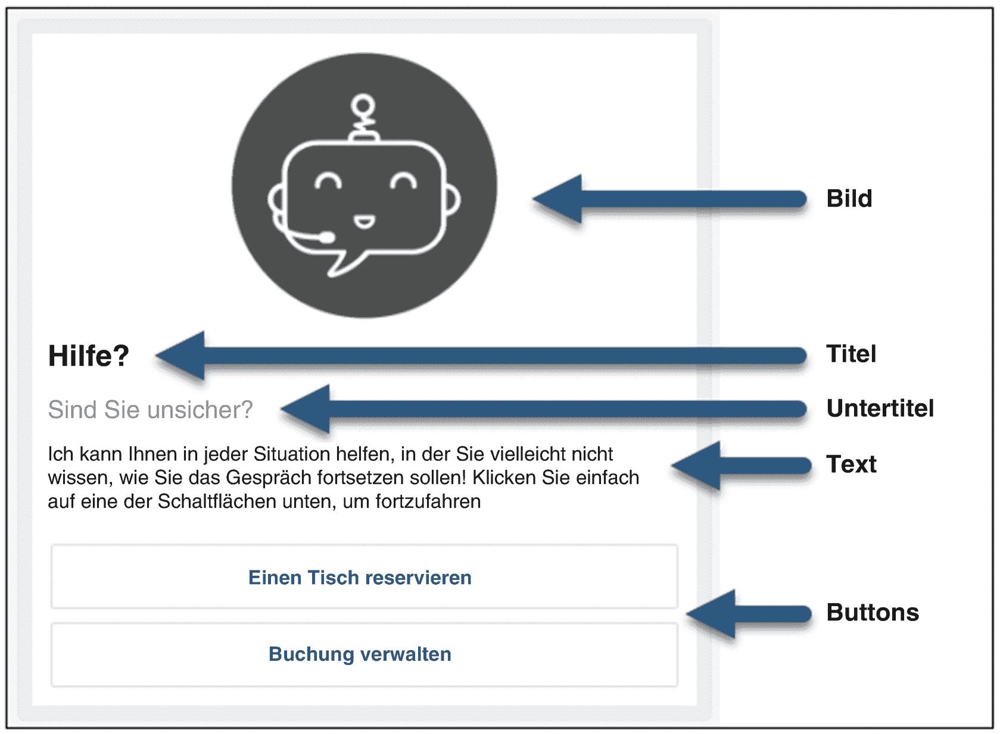

图 4.12

英雄卡片示例

在 C# 机器人中，您可以使用以下代码行来生成英雄卡片并将其发送给对话中的用户：

```
var attachments = new List();
var reply = MessageFactory.Attachment(attachments);
reply.Attachments.Add(GetHeroCard(). ToAttachment());
await stepContext.Context.SendActivityAsync(reply, cancellationToken);
public static HeroCard GetHeroCard()
{
var heroCard = new HeroCard
{
Title = "需要帮助？",
Subtitle = "您不确定吗？",
Text = "当您不知道如何继续对话时，我可以在任何情况下帮助您！只需点击下方任意按钮即可继续",
Images = new List { new CardImage("https://bisser.io/images/bisser_io_red.png") },
Buttons = new List
{
new CardAction(ActionTypes.ImBack, title: "预订餐桌", value: "预订餐桌"),
new CardAction(ActionTypes.ImBack, title: "管理预订", value: "管理预订"),
},
return heroCard;
}
}
```

#### 卡片轮播

前面的示例向您展示了如何创建和发送单个英雄卡片或自适应卡片实例。然而，在许多情况下，您可能希望在单条消息中可视化多张卡片。因此，您可以使用英雄卡片类中的 `AttachmentLayout` 属性来创建卡片轮播，如图 4.13 所示。这样，您就可以将多张卡片添加到同一活动中。收到此卡片轮播的用户可以向右或向左滑动，以查看附加到消息中的卡片。

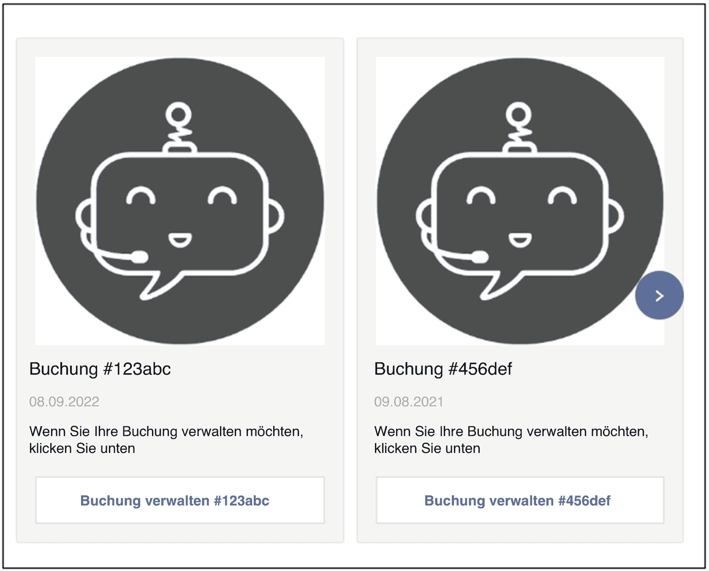

图 4.13

英雄卡片轮播示例

此功能在您希望在一条消息中显示相同类型的可视化内容但包含不同数据的场景中非常有用，例如上图显示了用户的餐厅预订信息。当然，您也可以为每个预订单独发送一条消息和一张卡片，但这会导致连续发送大量消息的问题。用户随后需要在聊天窗口中滚动和翻看这些消息，这在手机上尤其困难，可能会让用户感到厌烦。因此，发送轮播卡片的选项改善了用户体验，因为查看卡片和在卡片之间导航更加容易，所以在合适的情况下应使用此功能。

### 建议操作

与卡片中用户可点击以继续对话的按钮不同，建议操作是显示在聊天输入框附近的按钮，在用户选择了其中某个按钮或输入文本后就会消失。这些建议操作是一种很好的方式，让用户可以通过点击按钮来回答问题，而无需输入文本。建议操作相对于卡片中按钮的主要优势在于，卡片中的按钮会一直保留在聊天窗口中。因此，用户可能会再次点击来自较早消息的按钮，这可能导致中断或上下文切换，因为机器人可能已经处于对话树的不同部分。使用建议操作，作为机器人开发者的您无需考虑这种情况，因为一旦用户继续对话，建议操作就会从聊天窗口中消失。建议操作的示例如图 4.14 所示。

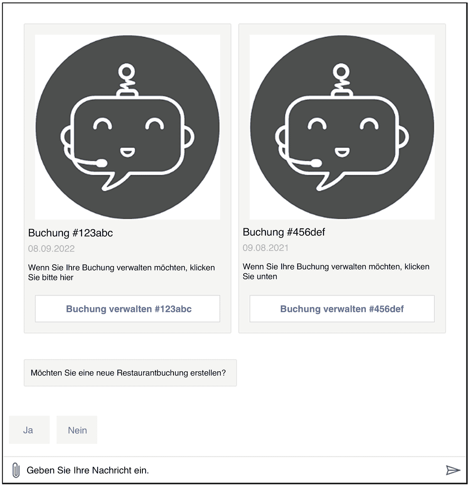

图 4.14

建议操作示例


### 自适应卡片

自适应卡片背后的理念是，只需创建一次卡片，然后让机器人所部署的渠道原生渲染该卡片。英雄卡片和其他卡片类型通常是机器人代码库的一部分，而自适应卡片则使用 JSON 创建。因此，卡片本身会以 JSON 卡片格式传递给渠道，这使得渠道能够原生渲染卡片，同时使用与该渠道内其他部分相同的 UI 样式。目前，表 4.5 中列出的渠道支持自适应卡片，这远非所有 Azure 机器人服务渠道。因此，在决定卡片类型之前，您应该首先了解您打算将机器人部署到哪些渠道。

**表 4.5** 自适应卡片渠道支持 (Microsoft, 2018)

| 平台 | 描述 | 版本 |
| --- | --- | --- |
| Bot Framework Web Chat | 用于 Microsoft Bot Framework 的可嵌入 Web 聊天控件。 | 1.2.6 (Webchat 4.9.2) |
| Outlook 可操作消息 | 将可操作的消息附加到电子邮件。 | 1.0 |
| Microsoft Teams | 整合了工作场所聊天、会议和笔记的平台。 | 1.2 |
| Cortana 技能 | Windows 10 的虚拟助手。 | 1.0 |
| Windows 时间线 | 一种继续您在此电脑、其他 Windows 电脑以及 iOS/Android 设备上开始的先前活动的新方式。 | 1.0 |
| Cisco WebEx Teams | Webex Teams 有助于加速项目、建立更好的关系并解决业务挑战。 | 1.2 |

**注意**

并非所有 Azure 机器人服务渠道都支持自适应卡片。有关支持自适应卡片的渠道列表，请访问 [`docs.microsoft.com/en-us/adaptive-cards/resources/partners`](https://docs.microsoft.com/en-us/adaptive-cards/resources/partners)。

由于自适应卡片本质上是 JSON 文件或对象，因此创建卡片很简单。甚至还有一个自适应卡片设计器，您可以直接在浏览器中设计和创建自适应卡片，而无需编写 JSON 表示法。在自适应卡片中，您基本上可以插入文本块、图像、视频、列、按钮以及输入对象，例如文本输入字段、数字或日期输入字段或选择输入。

**注意**

可用于创建自适应卡片的自适应卡片设计器位于 [`adaptivecards.io/designer/`](https://adaptivecards.io/designer/)。

特别是对于刚接触自适应卡片的开发人员来说，设计器是一个很好的工具，可以熟悉可用的卡片元素，并学习如何设计出外观漂亮的卡片。此外，内置的预览模式让您可以直接在浏览器中，在某个支持渠道中原生查看您创建的自适应卡片。这样，您就可以在开发聊天机器人之前，基本测试自适应卡片的外观和可用性。图 4.12 中显示的英雄卡片也可以作为自适应卡片创建，如图 4.15 所示。

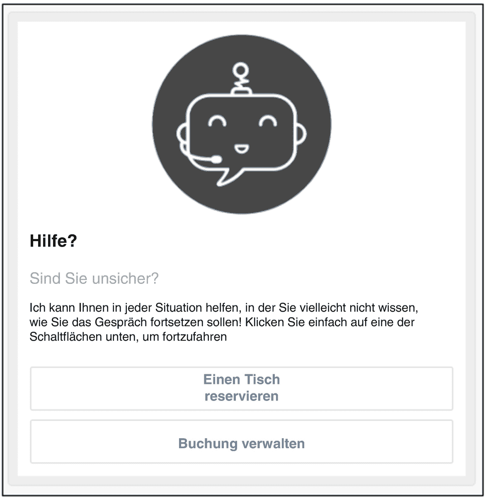

**图 4.15** 自适应卡片示例

上图中显示的卡片基本上由以下 JSON 对象描述：

```json
{
  "Typ": "AdaptiveCard",
  "Körper": [
    {
      "Typ": "Bild",
      "url": "https://someUrl/someIcon.png",
      "Größe": "Groß",
      "horizontaleAusrichtung": "Center"
    },
    {
      "Typ": "TextBlock",
      "Größe": "Groß",
      "Gewicht": "Kräftiger",
      "Text": "Hilfe?"
    },
    {
      "Typ": "TextBlock",
      "Text": "Sind Sie unsicher?",
      "wrap": wahr,
      "Größe": "Mittel",
      "fontType": "Standard",
      "isSubtle": wahr
    },
    {
      "Typ": "TextBlock",
      "Text": "Ich kann Ihnen in jeder Situation helfen, in der Sie vielleicht nicht wissen, wie Sie das Gespräch fortsetzen sollen! Klicken Sie einfach auf eine der Schaltflächen unten, um fortzufahren",
      "wrap": wahr
    },
    {
      "Typ": "ActionSet",
      "Aktionen": [
        {
          "Typ": "Action.Submit",
          "Titel": "Einen Tisch buchen",
          "Daten": "Buchen Sie einen Tisch"
        },
        {
          "Typ": "Action.Submit",
          "Titel": "Buchung verwalten",
          "Daten": "Buchung verwalten"
        }
      ]
    }
  ],
  "$schema": "http://adaptivecards.io/schemas/adaptive-card.json",
  "Version": "1.2"
}
```

然而，自适应卡片不仅提供了显示静态内容和按钮的能力。您还可以创建动态的自适应卡片，通过基于按钮点击或其他操作来切换或显示自适应卡片的某些部分，如图 4.16 所示。通过这种方式，您可以创建精密的 UI 元素，这些元素可以在不同的渠道中使用，而无需为您的机器人可访问的每个渠道单独开发或编写卡片。由于自适应卡片对于机器人框架的开发至关重要，接下来的章节将深入探讨自适应卡片及其用例。

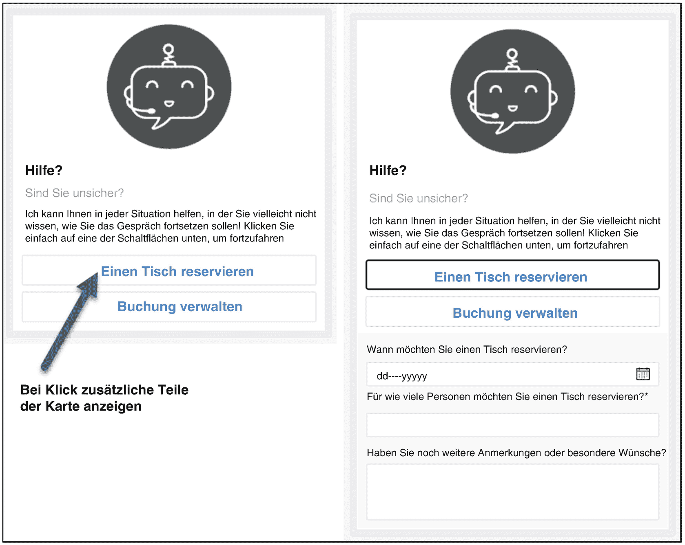

**图 4.16** 自适应卡片切换示例

## 总结

本章涵盖了开发成功聊天机器人时应考虑的聊天机器人设计原则。在本章的第一部分，我们探讨了聊天机器人的个性和品牌塑造主题。您了解了为什么分析聊天机器人的目标受众是设计阶段的一项基本任务，以及为什么令人难忘的欢迎消息和对话内导航对于任何聊天机器人都是必不可少的。此外，您还学习了设计对话流程的基本概念，重点介绍了自适应对话的概念。此外，我们还讨论了聊天机器人中的用户体验部分和可用的视觉元素，以及为什么纯文本聊天机器人并不总是最佳选择。

在下一章中，您将学习如何使用 Microsoft Bot Framework Composer（一个用于在图形用户界面中创建机器人的新工具）以低代码方法创建聊天机器人。

