# 5. 构建聊天机器人

在上一章中，您学习了如何设计聊天机器人，包括对话流程和用户体验。本章将介绍如何使用名为“Bot Framework Composer”的工具来构建聊天机器人，该工具是 Bot Framework 生态系统的一部分，旨在通过图形用户界面创建聊天机器人，而不是通过代码编写聊天机器人。此外，本章还将详细阐述前面章节中涉及的主题在构建聊天机器人的实际场景中的应用，例如使用语言理解和 QnA Maker 来改进自然语言处理流程。此外，本章还将描述如何使用自定义代码将特定功能集成到使用 Composer 创建的聊天机器人中，这些功能默认情况下不可用。


## Bot Framework Composer 简介

`Bot Framework Composer` 是一款采用图形用户界面的工具，专为创建聊天机器人而设计。`Composer` 面向开发者和高级用户，提供了创建、测试和发布聊天机器人所需的众多功能。例如，`Composer` 还提供了创建聊天机器人核心对话流程之外的关键部分的能力，例如语言理解模型、语言生成模型或 `QnA Maker` 知识库。因此，它可以被视为一个工具，无需编写代码即可提供设计和开发聊天机器人所需的主要功能和能力。

`Composer` 的设计初衷不仅是为了方便开发者，也是为了方便非开发者设计和构建机器人。当然，可视化画布功能加速了机器人开发的整个生命周期，特别是对于那些不经常创建聊天机器人的人来说。使用 `Composer` 基本上有两种方式：两种方案各有优缺点，但两种版本的总体外观和功能是相同的。因此，本书中引用的所有示例均基于 `Bot Framework Composer` 的桌面版。`Composer` 包含一个图形用户界面，如图 5.1 所示，为您提供了一个精良的创作界面，您可以在其中创建对话、触发器和操作。

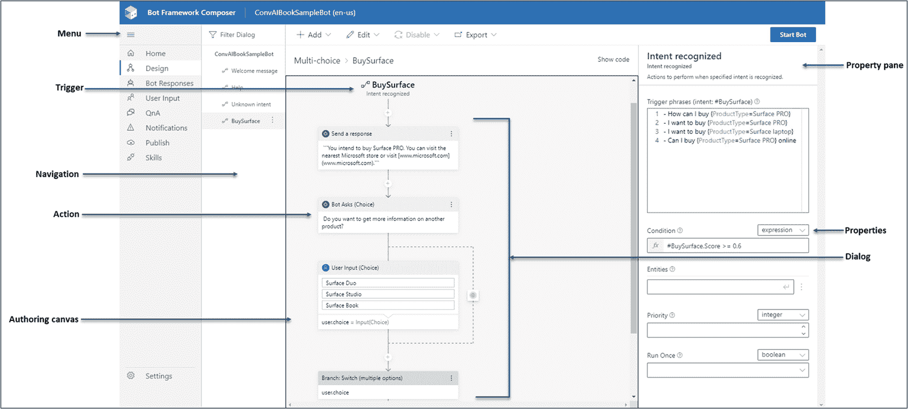

图 5.1 Bot Framework Composer 概览

-   将 `Composer` 作为桌面应用程序安装。
-   从源代码构建 `Composer`。

两种方案各有优缺点，但两种版本的总体外观和功能是相同的。因此，本书中引用的所有示例均基于 `Bot Framework Composer` 的桌面版。`Composer` 包含一个图形用户界面，如图所示。

使用 `Composer` 创建机器人时，与 `Bot Framework SDK` 存在一些差异，机器人开发者需要注意。首先，`Composer` 基于第 4 章中描述的自适应对话，这与 `Bot Framework SDK` 中使用的对话库不同。但同时，这也是 `Composer` 的优势之一，因为自适应对话以 `JSON` 格式存储，因此可以在许多不同的机器人或工具中重复使用。`Composer` 相对于 `SDK` 的另一个巨大优势在于，它将最常用的工具整合到了一个用户界面中。过去，机器人开发者需要访问 `LUIS` Web 门户来管理所有语言理解组件。要管理 `QnA` 问答对，还需要访问 `QnA-Maker` 门户。而对于机器人开发本身，则需要使用 `Visual Studio` 或 `Visual Studio Code` 来开发机器人的逻辑。随着 `Composer` 的推出，这些体验被整合到一个工具中，为开发者在设置和维护机器人所需的关键组件方面节省了大量时间。

**注意**

要下载并安装 `Bot Framework Composer`，请访问 [`aka.ms/bfcomposer`](http://aka.ms/bfcomposer)。

### 存储

在自适应对话中，存储基本上被视为机器人的大脑，如第 4 章所述。因此，您可以使用存储来保存特定值，这些值可以在对话过程中的稍后时间点访问，例如用户的姓名或地址信息。在第 4 章中，我们了解到存在以下存储范围，它们提供不同的访问方式和持久性：这些范围用于在对话中存储不同的值，以便稍后重用。您在特定操作中或作为机器人提问结果设置的每个属性，都将存储在上述某个范围中。如果您需要存储关于用户或对话的数据，则应使用用户范围或对话范围，因为这些范围在机器人的整个生命周期内都有效。用户范围主要用于存储用户信息，例如姓名、位置或其他用户属性和设置。对话范围主要针对对话属性，例如对话的元数据（例如开始日期等），这些属性可能由进入同一对话的多个用户共享（例如 `Microsoft Teams` 群聊）。如果您需要存储短期值，则对话范围和轮次范围更为合适。对话范围的生命周期基本上与对话绑定，即当对话结束时，在该范围中定义的属性将被丢弃。轮次范围甚至比对话范围更短暂，因为在该范围中定义的属性仅在轮次内保留，而轮次本质上是由机器人处理的单条消息。

-   用户范围
-   对话范围
-   对话范围
-   轮次范围
-   设置范围
-   此范围
-   类范围

这些范围用于在对话中存储不同的值，以便稍后重用。您在特定操作中或作为机器人提问结果设置的每个属性，都将存储在上述某个范围中。如果您需要存储关于用户或对话的数据，则应使用用户范围或对话范围，因为这些范围在机器人的整个生命周期内都有效。用户范围主要用于存储用户信息，例如姓名、位置或其他用户属性和设置。对话范围主要针对对话属性，例如对话的元数据（例如开始日期等），这些属性可能由进入同一对话的多个用户共享（例如 `Microsoft Teams` 群聊）。如果您需要存储短期值，则对话范围和轮次范围更为合适。对话范围的生命周期基本上与对话绑定，即当对话结束时，在该范围中定义的属性将被丢弃。轮次范围甚至比对话范围更短暂，因为在该范围中定义的属性仅在轮次内保留，而轮次本质上是由机器人处理的单条消息。


#### 在 Composer 中存储属性

要在 Composer 中存储属性，您可以使用“设置属性”操作，也可以基于“提问”操作来设置属性。第一种方式通常用于在对话的特定时间点设置单个属性。您也可以使用“设置属性”操作一次性设置多个属性。“设置属性”操作的行为如图 5.2 所示。该操作通常可用于对话中的任何步骤，以便在上述某个范围内存储信息。

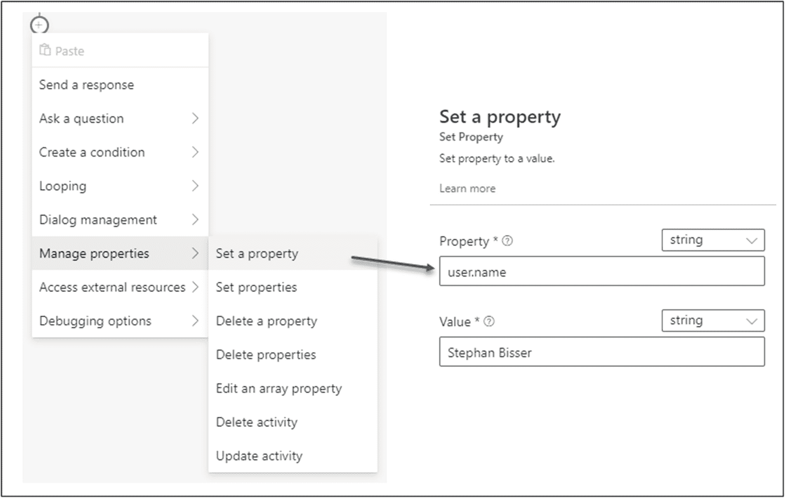

*图 5.2 在 Composer 中设置属性*

在前面的示例中，属性值是“硬编码”的，并且类型为 `String`。但这并不总是足够的，因为您可能需要基于某个操作生成值。这个概念在 Composer 中被称为“表达式”。表达式通常用于基于计算函数来计算值。这些表达式可以包括：

- 算术运算，如加法 (`+`)、减法 (`-`)、乘法 (`*`) 或除法 (`/`)
- 比较运算，如等于 (`==`)、不等于 (`!=`)、大于 (`>`) 或小于 (`<`)
- 逻辑运算，如与 (`&&`)、或 (`||`) 或非 (`!`)

此外，还有许多预构建的函数可用于处理各种对象类型，如 `Strings`、集合或日期，以及用于比较和类型检查的操作。

**注意：** 有关可用预构建函数的完整列表，请参阅 [`docs.microsoft.com/en-us/azure/bot-service/adaptive-expressions/adaptive-expressions-prebuilt-functions`](https://docs.microsoft.com/en-us/azure/bot-service/adaptive-expressions/adaptive-expressions-prebuilt-functions)。

如图 5.3 所示，您也可以使用*表达式*，通过不同的预构建函数来计算值。如下例所示，您可以将属性设置为硬编码的值，也可以使用 `concat` 函数动态计算属性的值。使用此函数，您还可以通过使用表达式中的属性名称来引用表达式中的现有属性，例如 `=concat(user.first, ' ', user.last)`。

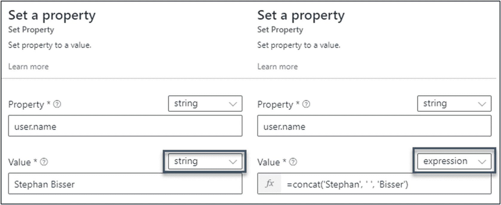

*图 5.3 设置属性 – 显式类型与表达式的比较*

要发送包含属性值的消息，您只需使用 `${scope.propertyName}` 这种表示法，如图 5.4 所示。这种表示法在语言生成中用于引用存储在内存中的属性，这些属性需要在特定操作中被访问。

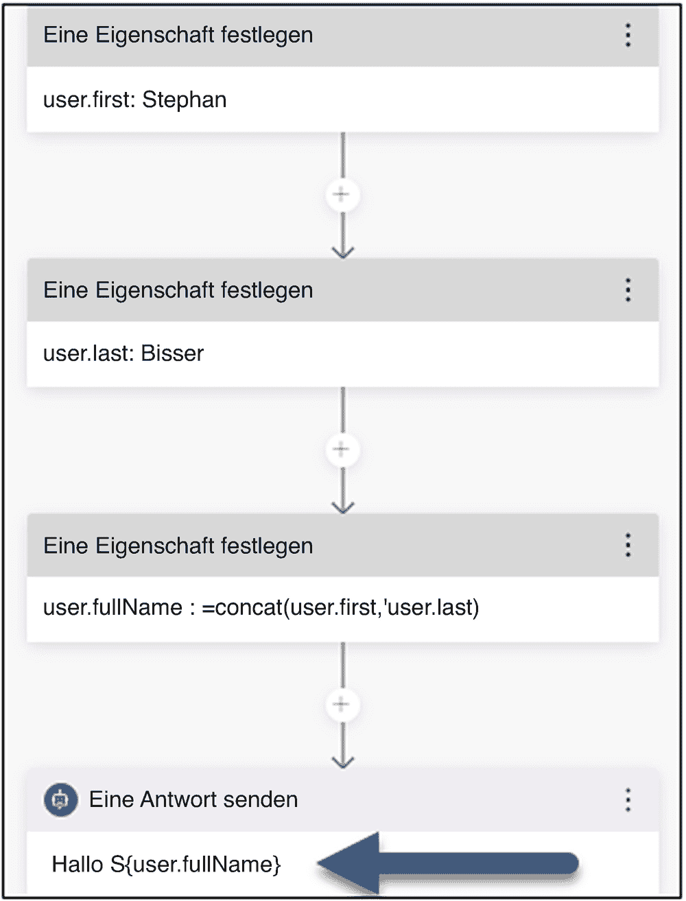

*图 5.4 发送包含属性值的消息*

### LU（语言理解）

如前几章所述，语言理解几乎是每个 AI 解决方案中的核心功能。每当您需要处理超出简单 QnA 模式的特定用户请求时，您都需要实现某种形式的语言理解，以便相应地处理用户输入。在 Bot Framework SDK 项目中使用 LUIS 与在 Composer 中使用 LUIS 的主要区别在于，您无需在 IDE 和 LUIS 门户之间切换，因为 Composer 内置了一个内联编辑器，用于创建意图和实体等 LUIS 组件。

在 Composer 中维护语言模型的原理与第 3 章所述基本相同。使用 Composer 的内联编辑器，您可以编辑一个 `.lu` 文件，Composer 会使用该文件自动管理 LUIS 模型。这些 `.lu` 文件通常包含意图、实体和表述。所使用的表示法如表 5.1 所示。

**表 5.1 Composer `.lu` 文件表示法**

| 类型 | 表示法 |
| --- | --- |
| **意图** | `# IntentName` |
| **表述** | `- 一个表述示例` |
| **实体** | `{entityName=example}` |

因此，第 3 章中的示例意图 `GetWeather` 的 `.lu` 文件可能如下所示：

```
#### GetWeather
- 您能告诉我雷德蒙德的天气预报吗？
- 纽约的天气怎么样？
- 我想了解阿姆斯特丹天气的一些细节
- 西雅图的天气怎么样？
- 柏林的天气怎么样？
@ 预构建 geographyV2
```

您会注意到，我们向此意图添加了预构建实体 `geographyV2`，这使得 LUIS 能够自动从用户的表述中识别并提取地名。在 Composer 中使用的 `BookTable` 意图如下所示：

```
#### BookTable
- 请帮我预订 {@locationName=红狮牛排馆} 烧烤店的一张桌子。
- 你能帮我预订明天在 {@locationName=著名寿司吧} 的四人桌吗？
- 你能帮我预订明天在 {@locationName=汤姆小餐馆} 的桌子吗？
- 请帮我预订 11 月 23 日在 {@locationName=杰米厨房} 的五人位。
- 请帮我预订周六下午 3 点在 {@locationName=硬石餐厅} 的六人桌。
@ ml locationName
@ 预构建 datetimeV2
@ 预构建 number
```

在 Composer 中使用这两个 `.lu` 文件的详细信息将在本章的后续部分中介绍，同时还会提供一些关于如何相应处理语言理解的更多信息。


### LG（语言生成）

虽然语言理解为机器人开发者提供了一种简单的方式，为聊天机器人添加自然语言处理功能，但语言生成主要用于赋予聊天机器人特定的语气，使其看起来更智能。因此，语言生成旨在为开发者提供灵活性，以便为聊天机器人的消息添加变化。这不仅提供了将业务逻辑与表示层分离的可能性，还允许在聊天机器人解决方案中使用一致的概念来管理和维护语言生成组件。`.lg` 文件格式相当简单，在某种程度上类似于本章前面描述的 `.lu` 文件格式，并在表 5.2 中进行了描述：

表 5.2

Composer 的 `.lg` 文件格式

| 组件 | 表示法 |
| --- | --- |
| **注释** | `> 这是一条注释` |
| **模板名称** | `# TemplateName` |
| **变体** | `- 这是一条机器人回复` |

```
> 包含 3 个变体的问候模板。
#### 问候
- 你好
- 嗨
- 您好
```

在 `.lg` 文件中，您还可以使用条件语句，根据特定属性来定义回复。例如，问候语也可以包含“早上好”或“晚上好”等词语。默认情况下，机器人会随机选择问候模板中存储的短语之一，这可能导致在晚上 8 点时，机器人回复“早上好”。在这种情况下，您可以通过直接在 `.lg` 文件中使用 `if-else` 语句来解决此问题，以判断“早上好”是否合适，或者用“晚上好”来问候用户是否更好，如下所示：

```
> 带条件的问候语
#### ConditionalGreeting
- IF: ${time == 'morning'}
- 早上好
- ELSEIF: ${time == 'afternoon'}
- 下午好
- ELSEIF: ${time == 'evening'}
- 晚上好
- ELSE:
- 你好
- 嗨
- 您好
```

同样，可以在模板内使用 `switch case` 语句来实现，以确定哪个 `case` 子句符合条件，并相应地设置机器人的回复：

```
> 带条件的问候语
#### ConditionalGreeting
- SWITCH: ${time}
- CASE: ${'morning'}
- 早上好
- CASE: ${'afternoon'}
- 下午好
- CASE: ${'evening'}
- 晚上好
- DEFAULT:
- 你好
- 嗨
- 您好
```

在 `.lg` 文件中，您还可以使用前面提到的内置函数，在发送机器人回复之前计算值或执行计算。这在处理字符串时特别有用，例如当您需要将两个或多个字符串连接或拼接成一条消息时。此外，您还可以在模板内部引用另一个模板，如下所示：

```
> 带引用的问候语
#### GreetingReply
- ${ConditionalGreeting()}, ${GreetingSuffix()}
#### ConditionalGreeting
- IF: ${time == 'morning'}
- 早上好
- ELSEIF: ${time == 'afternoon'}
- 下午好
- ELSEIF: ${time == 'evening'}
- 晚上好
- ELSE:
- 你好
- 嗨
- 您好
#### GreetingSuffix
- 您今天怎么样？
- 最近怎么样？
- 今天过得如何？
```

## 使用 Composer 创建第一个聊天机器人

正如本章前面提到的，Composer 是一个可视化的机器人创作工具。您可以将其作为桌面应用程序使用，也可以从源代码构建 Composer。本书中讨论的所有场景和示例都将使用 Composer 的桌面应用程序完成，这对于非开发人员入门尤其有帮助。如果您尚未下载 Composer，则需要在开始之前安装以下必备组件：

*   Bot Framework Emulator
    *   [`github.com/microsoft/BotFramework-Emulator/releases/latest`](https://github.com/microsoft/BotFramework-Emulator/releases/latest)
*   .NET Core SDK 3.1 及更高版本
    *   [`dotnet.microsoft.com/download/dotnet-core/3.1`](https://dotnet.microsoft.com/download/dotnet-core/3.1)
*   Composer
    *   [`aka.ms/bfcomposer`](https://aka.ms/bfcomposer)

## 模板和示例

在安装了前文提到的三个工具后，您就可以使用 Composer 来创建您的第一个聊天机器人了。为了帮助刚开始使用 Bot Framework SDK 和 Composer 的人，有许多模板和示例可用，它们可以作为您下一个项目的基础框架。预定义的示例及其简要说明列于表 5.3 中。

表 5.3

Bot Framework Composer 示例 (Microsoft, 2020)

| 示例 | 描述 |
| --- | --- |
| **Echo Bot** | 一个回显用户输入消息的机器人。 |
| **Empty Bot** | 一个简单的机器人，等待您发挥创意。 |
| **Simple To-Do** | 一个示例机器人，演示如何使用正则表达式识别器来定义意图，并允许您添加、列出和删除待办事项。 |
| **To-Do with LUIS** | 一个示例机器人，演示如何使用 LUIS 识别器来定义意图，并允许您添加、列出和删除待办事项。运行此示例需要一个 [*LUIS 创作密钥*](https://docs.microsoft.com/en-us/azure/cognitive-services/luis/luis-how-to-azure-subscription)。 |
| **Ask Questions** | 一个示例机器人，演示如何向用户提示不同类型的输入。 |
| **Conversation Flow Control** | 一个示例机器人，演示如何使用分支操作来控制对话流程。 |
| **Dialog Actions** | 一个示例机器人，演示 Composer 中操作的使用（不包括 **Ask Questions** 示例中已涵盖的**提问**操作）。 |
| **Interruptions** | 一个示例机器人，演示如何处理对话流程中的中断。运行此示例需要一个 [*LUIS 创作密钥*](https://docs.microsoft.com/en-us/azure/cognitive-services/luis/luis-how-to-azure-subscription)。 |
| **QnA Maker and LUIS** | 一个示例机器人，演示如何同时使用 QnA Maker 和 LUIS。运行此示例需要一个 [*LUIS 创作密钥*](https://docs.microsoft.com/en-us/azure/cognitive-services/luis/luis-how-to-azure-subscription) 和一个 [*QnA 知识库*](https://docs.microsoft.com/en-us/azure/cognitive-services/qnamaker/quickstarts/create-publish-knowledge-base)。 |
| **QnA Sample** | 一个示例机器人，设置为允许用户在 Composer 中创建 QnA Maker 知识库。 |
| **Responding with Cards** | 一个示例机器人，演示如何使用语言生成发送各种卡片。 |
| **Responding with Text** | 一个示例机器人，演示如何使用语言生成向用户发送各种文本消息。 |


### 创建回声机器人

我们将创建的第一个聊天机器人基于“回声机器人”示例，它本质上是一个简单的机器人，会将用户在聊天中输入的所有内容原样返回。要创建新机器人，您需要在 Composer 的主屏幕上点击“+ 新建”，然后选择“从模板创建”，并选取“回声机器人”，如图 5.5 所示。

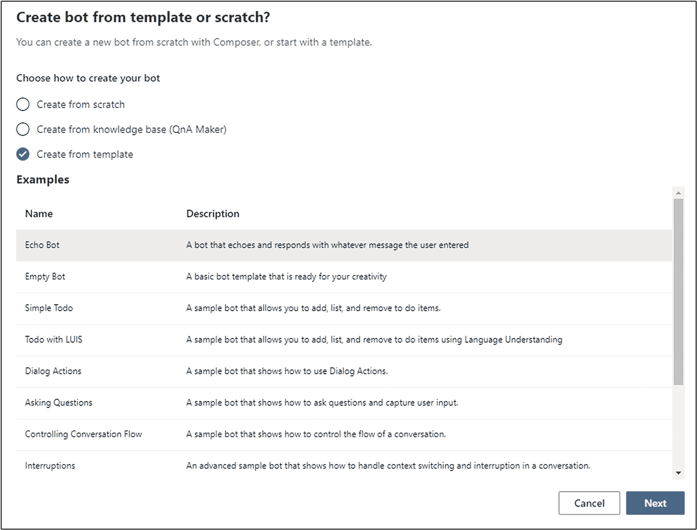

图 5.5

创建第一个聊天机器人 01

选择模板后，您需要为聊天机器人命名，并选择 Composer 保存聊天机器人项目的位置。在我的示例中，聊天机器人的名称是“Diele”，我还添加了一个可选的描述来说明其主要目标，如图 5.6 所示。

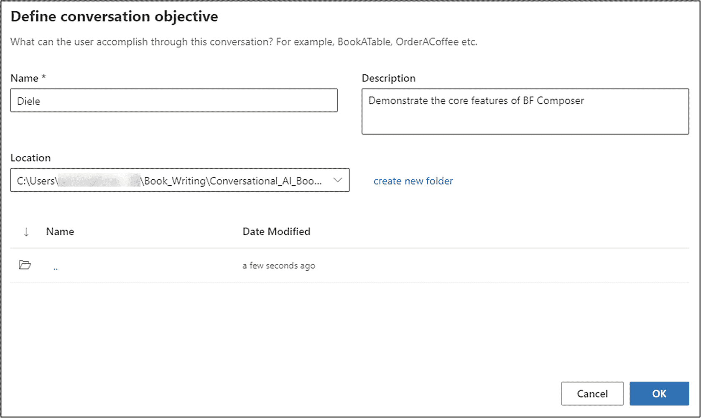

图 5.6

创建第一个聊天机器人 02

创建第一个机器人后，Composer 会显示新创建的机器人及其“欢迎”触发器，如图 5.7 所示。由于我们选择了“回声机器人”模板，我们的机器人本质上由一个包含两个触发器的对话框组成。第一个触发器是“欢迎”触发器，它会在每次 `ConversationUpdate` 活动时触发；第二个触发器名为“未知意图”，每当机器人能够识别出正确意图时，它就会被触发。

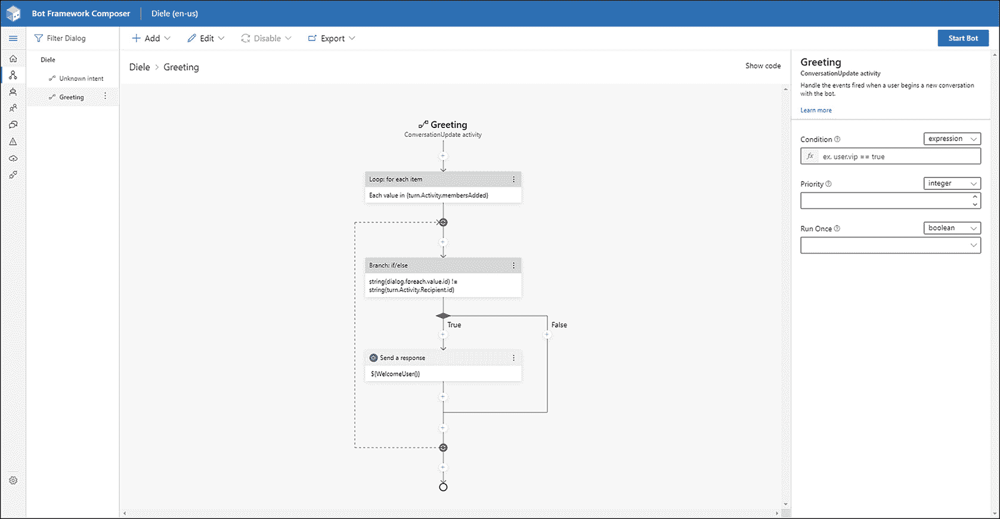

图 5.7

创建第一个聊天机器人 03 – 欢迎触发器

“未知意图”触发器内的业务逻辑非常简单，如图 5.8 所示。该触发器主要由一个用于反馈用户所写内容的操作组成。如本例所示，用户发送给机器人的最后一条消息始终存储在 Turn 范围内的 `turn.activity.text` 属性中，该属性仅在当前 Turn 内有效。

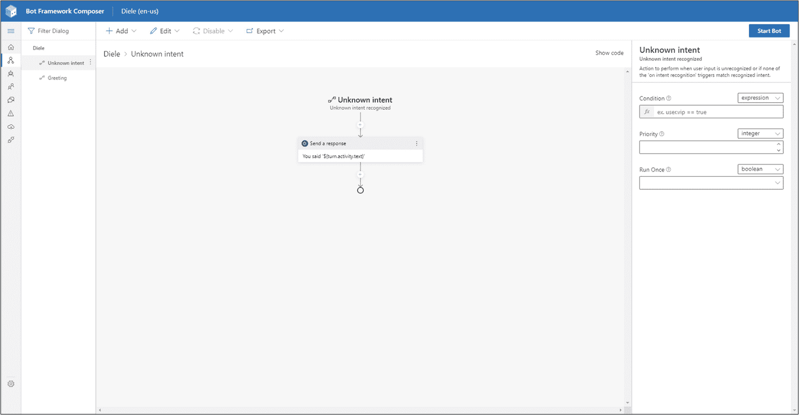

图 5.8

创建第一个聊天机器人 04 – 未知意图触发器

要首次测试您的机器人，可以点击 Composer 右上角的“启动机器人”按钮。这将在您的本地计算机上启动机器人，并准备好本地测试聊天机器人所需的一切。机器人启动后，您只需点击右上角“重启机器人”按钮旁边的“在模拟器中测试”按钮，即可在 Bot Framework 模拟器中打开您的聊天机器人，如图 5.9 所示。

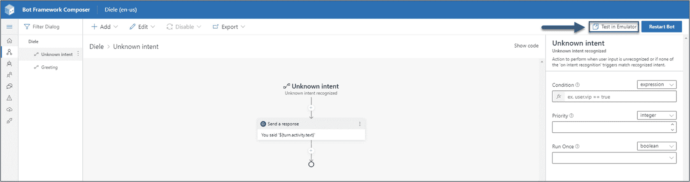

图 5.9

创建第一个聊天机器人 05 – 测试机器人

点击“在模拟器中测试”按钮后，Bot Framework 模拟器应会打开并与机器人建立对话。您会注意到，机器人会向您发送欢迎消息“Welcome to the EchoBot sample”，该消息定义在语言生成模板 `WelcomeUser` 的“问候”触发器中。现在，如果您在发送框中输入一条消息并发送给聊天机器人，您会看到机器人回复 `You said:` 以及您发送的消息。因此，它使用了“未知意图”触发器中的“发送回复”操作来发送包含这两部分的消息，如图 5.10 所示。

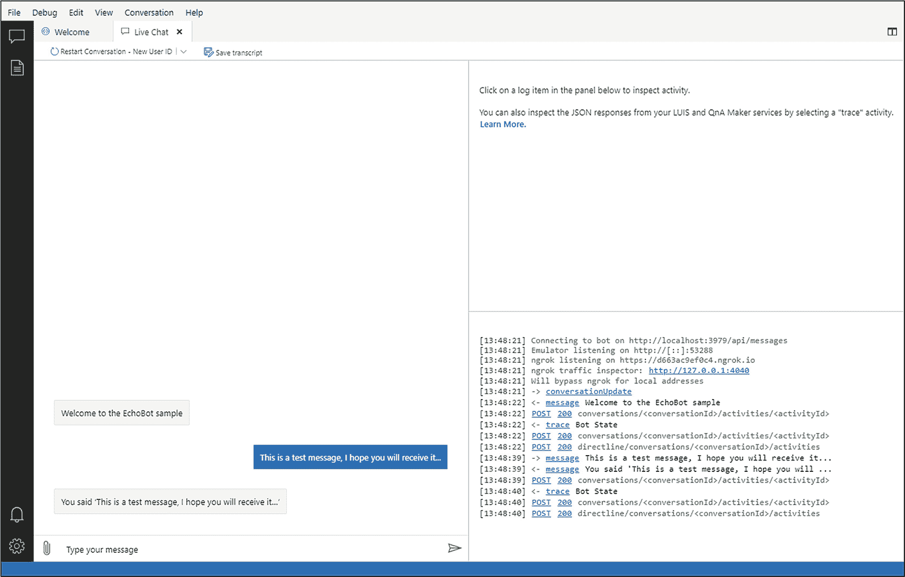

图 5.10

创建第一个聊天机器人 05 – 在模拟器中测试机器人

从 Composer 用户界面可以看出，在创建对话框时，您有大量选项可供选择（见图 5.11）。您可以使用语言生成功能发送回复，该功能已在前文介绍过，并且用于发送欢迎消息和回声消息。

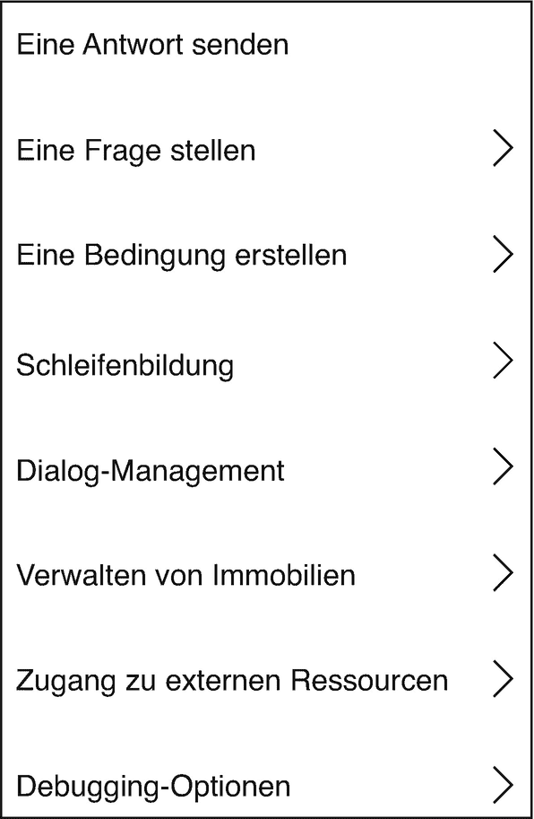

图 5.11

Composer 创作选项

您还可以在对话框中加入问题，以便直接在对话中询问特定主题。有大量预构建的提示可供使用，如图 5.12 所示。其中大部分已在第 2 章讨论过，因此本章不再赘述。使用这些提示，您可以在对话的特定部分提出问题，并期望得到特定类型的回复，例如文本、数字，甚至是通过 OAuth 进行身份验证的事件。这对于将特定值存储在属性中非常有用，这些值可以在后续对话中使用。

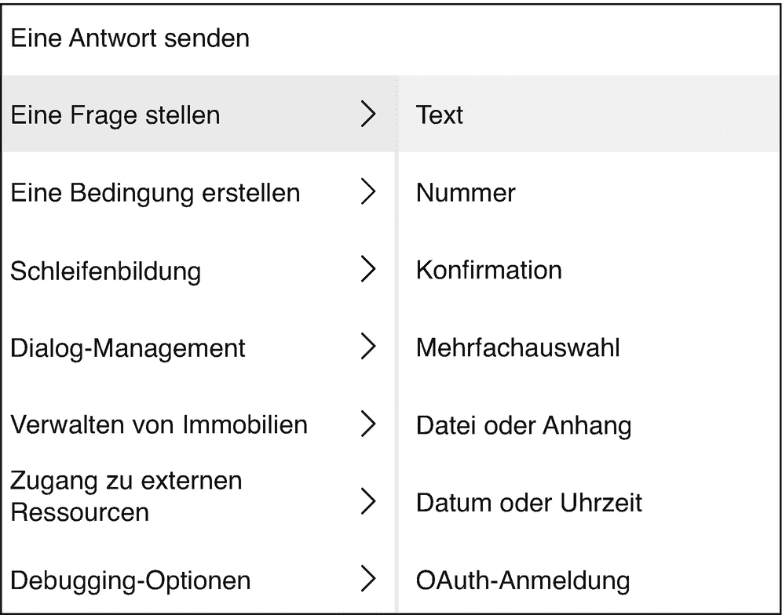

图 5.12

Composer 创作选项 – 提出问题

使用提示的一个非常简单的例子是在欢迎功能中询问用户的姓名。在每个循环之后，我们只需添加一个类型为“提问 – 文本”的新操作，并在右侧的“机器人提问”部分添加一些提示文本，如图 5.13 所示。这些提示可能类似于以下示例提示：

- 您叫什么名字？
- 能告诉我您的名字吗？
- 请问您怎么称呼？

现在，我们需要切换到“用户输入”区域，输入用于存储姓名的属性名称。由于我们可能在整个对话过程中都需要用户的姓名，我们基本上可以选择使用 `user` 范围或 `conversation` 范围。由于姓名与用户紧密相关，`user` 范围可能更适合此属性，因此我们在 `Property` 字段中输入 `user.name`，如图 5.14 所示。

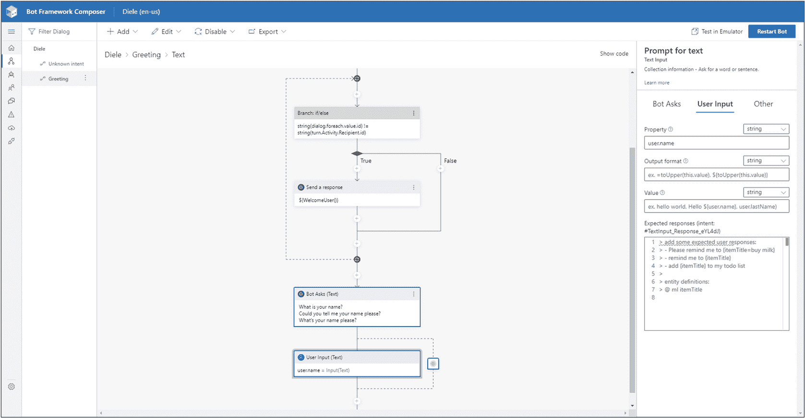

图 5.14

创建文本提示 02

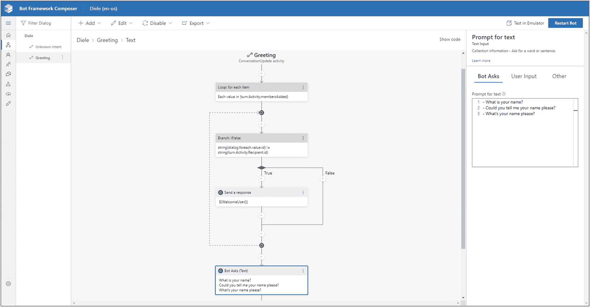

图 5.13

创建文本提示 01

最后一步，我们需要在用户输入姓名时发送一条个性化消息。因此，我们在“机器人提问（文本）”操作之后，再添加一个类型为“发送回复”的操作。在语言生成功能中，您基本上可以输入任何文本，但如果您想将用户姓名包含在消息中，则需要使用 `${user.name}` 符号来引用存储中 `user.name` 属性的值，如图 5.15 所示。

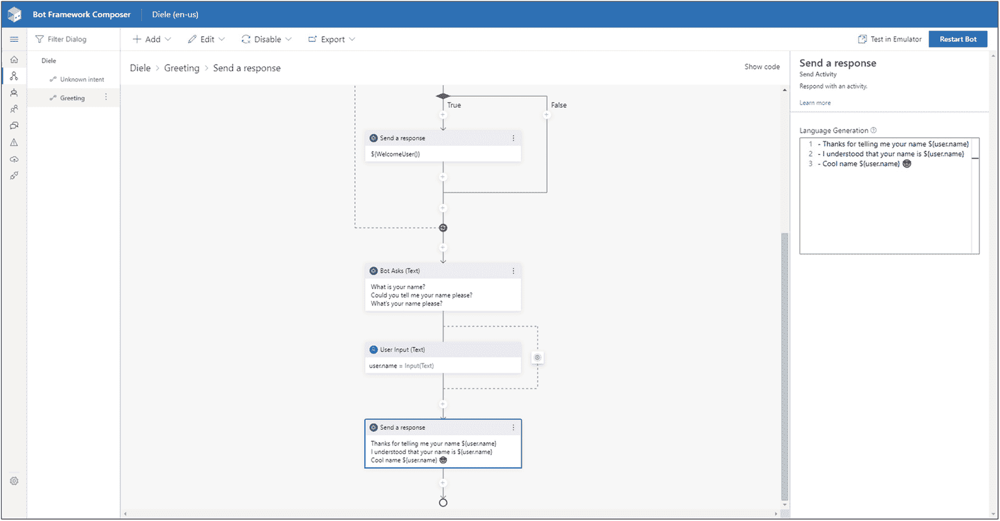

图 5.15


发送带有属性的回复

要检查对话的新行为，只需点击 Composer 屏幕右上角的“重启机器人”即可重启机器人。重启后，我们可以切换到 Bot Framework 模拟器，并点击“重启对话”从头开始重新启动对话。如果一切顺利，您应该会在开始时看到机器人发送的两条消息：第一条是默认的欢迎消息，第二条应该是询问您姓名的消息。输入您的姓名后，您应该会看到机器人回复中包含您的姓名。如果您再次重启对话并重新回答该问题，您会发现语言生成引擎几乎每次都会选择不同的变体，如图 5.16 所示。这使得机器人更具个性化和人性化，因为其对话方式与机器人对相同回复总是使用完全相同的措辞不同。

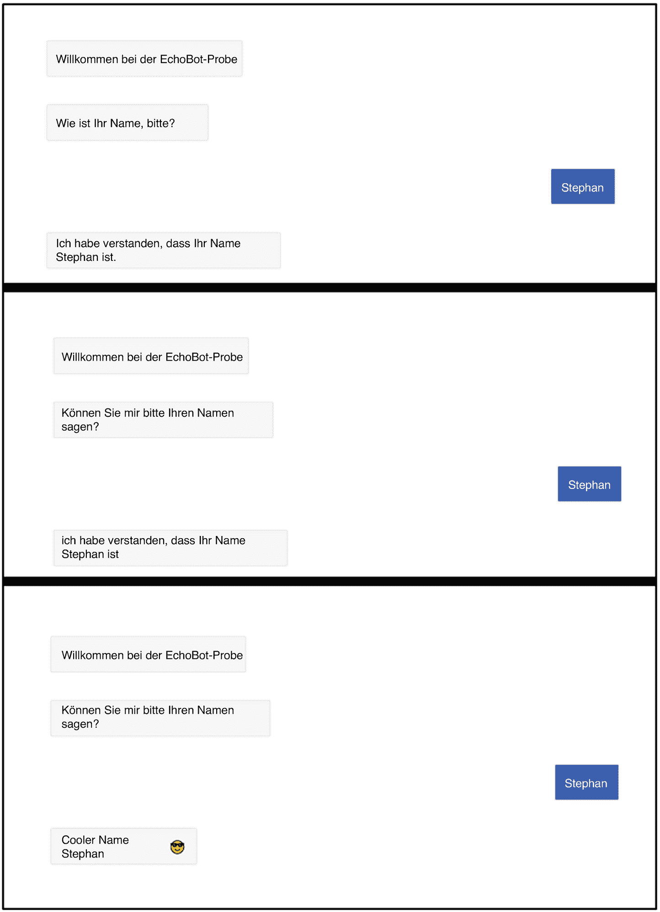

图 5.16

测试机器人及提问行为

## 使用 LUIS 和 QnA Maker 升级聊天机器人

在您使用 Composer 处理了一个非常基本的用例之后，下一步就是处理第 4 章中提到的对话树示例。该对话树也在图 5.17 中展示，不过概览中增加了“QnADialog”，用于处理那些需要由机器人回答、但不一定与其它对话框中的特定操作绑定的问题。下图基本涵盖了本章将要创建的所有触发器和对话框。主要目标是让一个聊天机器人能够运行，该机器人既能处理餐厅餐桌的预订，也能管理现有的预订。此外，机器人还应能够通过第三方 API（这将是下一小节的内容）提供天气预报信息。再者，聊天机器人应能回答关于餐厅或预订流程的一般性问题，这应通过 QnA Maker 知识库来实现。

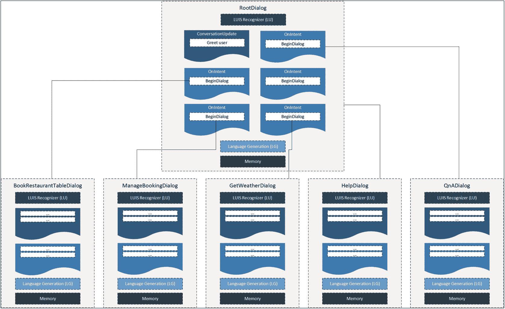

图 5.17

必要对话框概览

在继续编写对话框之前，您应该做的第一件事是修改对话的问候语。正如我们在第 4 章中学到的，问候语对于机器人的成败至关重要，因为它会给用户留下好或坏的第一印象。因此，您可能应该使用卡片形式的问候语，让机器人能够主动进行自我介绍，而不是像现在这样只发送纯文本消息。对于本章讨论的示例机器人，它使用自适应卡片作为问候消息，如图 5.18 所示。

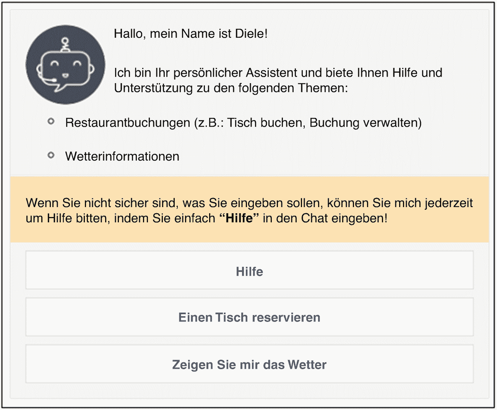

图 5.18

自适应问候卡片示例

要将自适应卡片嵌入到 Composer 的消息中，您需要将卡片的 JSON 有效负载添加到相应对话框的“机器人回复”部分。该方法的格式如图 5.19 所示。自适应卡片的 JSON 有效负载应添加到一个函数中，在本示例中该函数名为 `GreetingCardJson`。

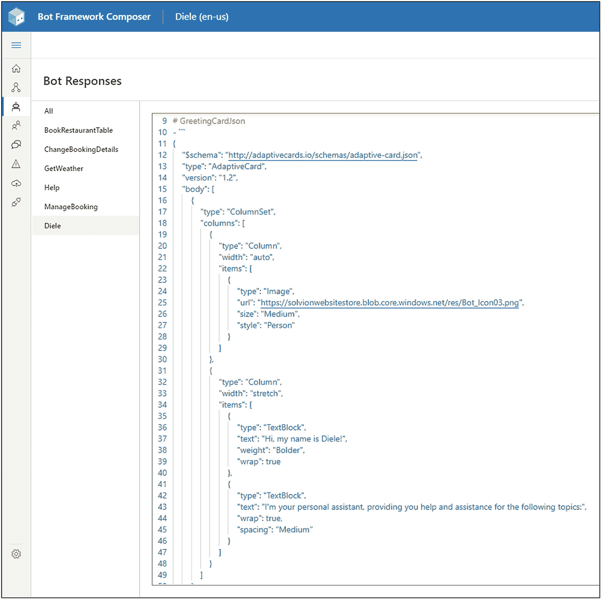

图 5.19

在机器人回复中插入自适应卡片

然后，卡片本身可以在第二个函数中创建，如下面的代码片段所示，该函数名为 `GreetingCard`。此函数将第一个函数（本质上是一个字符串）的有效负载转换为 JSON 有效负载。然后，该有效负载将作为附件用于新的机器人活动中：

```
### 问候卡片
[活动
附件 = ${json(GreetingCardJson())}
]
```

然后，可以使用 `GreetingCard` 函数以 `${GreetingCard()}` 的写法发送问候卡片作为回复，如图 5.20 所示。这实质上调用了 `GreetingCard` 函数，该函数会生成一个带有附件的新活动，该附件由 `GreetingCardJson` 函数返回。

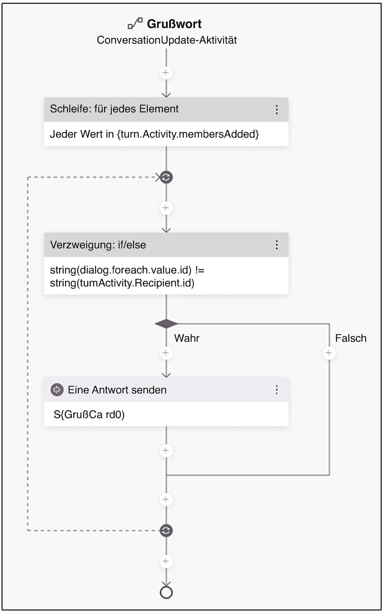

图 5.20

问候对话框


好的，作为高级文档工程师和翻译员，我将遵循您提供的注意事项和示例，将给定的德文文本翻译成中文。


在问候功能按计划实现后，下一步是扩展您的聊天机器人，使其包含前文提到的用例。为此，您需要在主对话中添加一些触发器。要添加新触发器，只需点击 Composer 顶部的“+ 添加”按钮，选择“添加新触发器…”，然后输入名称和触发短语，如图 5.21 所示。

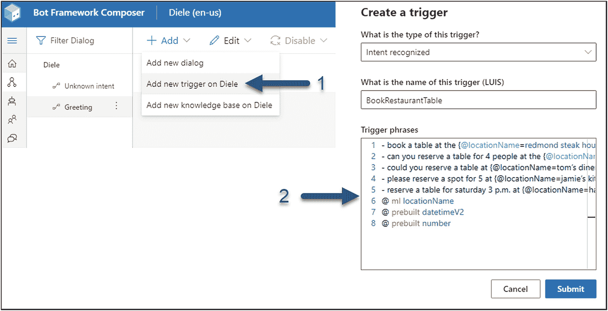

图 5.21

在 Composer 中添加新触发器

下表描述了需要添加哪些触发器以及它们的类型。此外，可作为示例句子的触发短语也列在表 5.4 中。

表 5.4

聊天机器人触发器示例

| 名称 | 类型 | 触发短语 |
| :--- | :--- | :--- |
| **BuchenRestaurantTisch** | 已识别意图 | - 请帮我预订 `{locationName=redmond steak house and grill}` 的餐桌<br>- 您能帮我预订明天在 `{Ortsname=berühmten Sushi-Bar}` 的 4 人桌吗？<br>- 您能帮我预订明天在 `{locationName=tom’s diner}` 的餐桌吗？<br>- 请帮我预订 11 月 23 日 `{locationName=jamie’s kitchen}` 的 5 人位<br>- 请帮我预订周六下午 3 点在 `{locationName=hard rock café}` 的 6 人桌<br>- 我想预订餐厅的餐桌<br> `@ ml locationName`<br> `@ vorgefertigte datetimeV2`<br> `@ vorgefertigte Nummer` |
| **ManageBooking** | 已识别意图 | - 我想更改我的预订<br>- 我可以修改编号为 `{bookingNumber=123abc}` 的预订吗？<br>- 我需要修改我的预订 `{bookingNumber=456def}`<br>- 您能帮我修改参考号为 `{bookingNumber=789ghi}` 的预订吗？<br>- 请让我修改我的一个预约<br> `@ ml bookingNumber` |
| **GetWeather** | 已识别意图 | - 请告诉我天气情况<br>- `{Stadt=Seattle}` 的天气怎么样？<br>- 您能告诉我 `{city=redmond}` 的天气预报吗？<br>- `{Stadt=New York}` 的天气怎么样？<br>- `{Stadt=Berlin}` 的天气怎么样？<br> `@ ml city` |
| **Hilfe** | 已识别意图 | - 帮助<br>- 我需要帮助<br>- 您能帮帮我吗？<br>- 我需要帮助<br>- 请帮帮我 |
| **QnA** | 已识别 QnA 意图 | *（无需添加触发短语）* |

下一步是确定执行触发器的特定条件。由于上述触发器使用 LUIS 识别器，因此条件应绑定到 LUIS 识别器的置信度值。通常，置信度值为 0.8 或更高是良好的，表明您的机器人的语言理解水平较高。要为特定触发器设置条件，请在 Composer 中打开该触发器，并将条件设置为 `#Triggername.Score >= 0.8`，如图 5.22 所示。

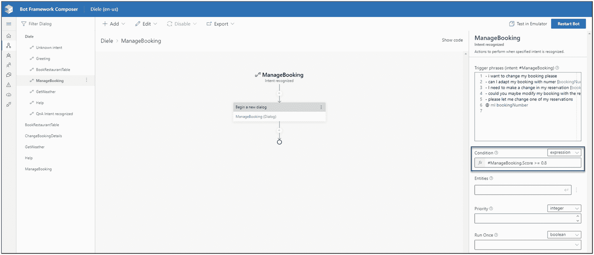

图 5.22

为触发器添加条件

现在所有触发器都已创建完毕，您可以为上述每个触发器启动一个新对话，以便分别处理对话的操作。因此，在每个新创建的触发器中，添加一个类型为“启动新对话”的新操作，并为每个触发器创建一个新对话，如图 5.23 所示。

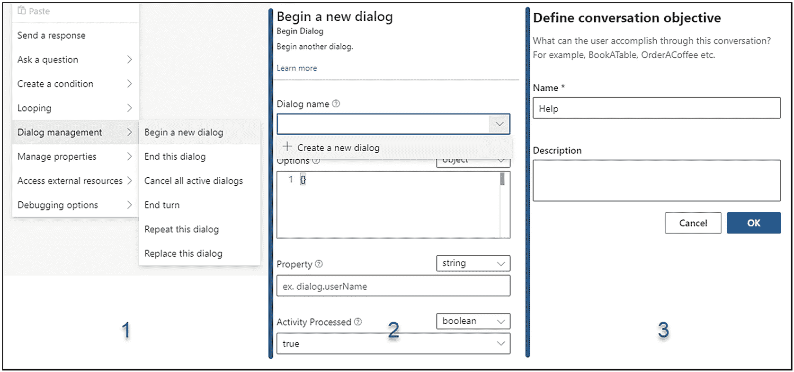

图 5.23

在每个触发器中启动新对话

## BookRestaurantTable 对话

现在，您可以开始编写对话，将业务逻辑融入对话中。`BookRestaurantTable` 对话旨在收集所有必要信息，以便为特定用户创建新的预订参考。因此，有必要获取用户想要预订餐桌的地点、日期和人数信息。这三个属性在语言理解模型中都被标记为要自动提取的实体。因此，捕获这些实体的最简单方法是使用“设置属性”操作作为 `BookRestaurantTable` 对话的第一步，将 LUIS 提取的信息存储在对话范围内的单独属性中，如图 5.24 所示。这里最关键的一步是使用预构建函数 `coalesce`。此函数基本上返回参数列表中的第一个值，在本例中，参数是开头带有 `@` 的实体属性（例如 `@locationName`）和前面带有 `$` 的对话属性（例如 `$locationName`）。

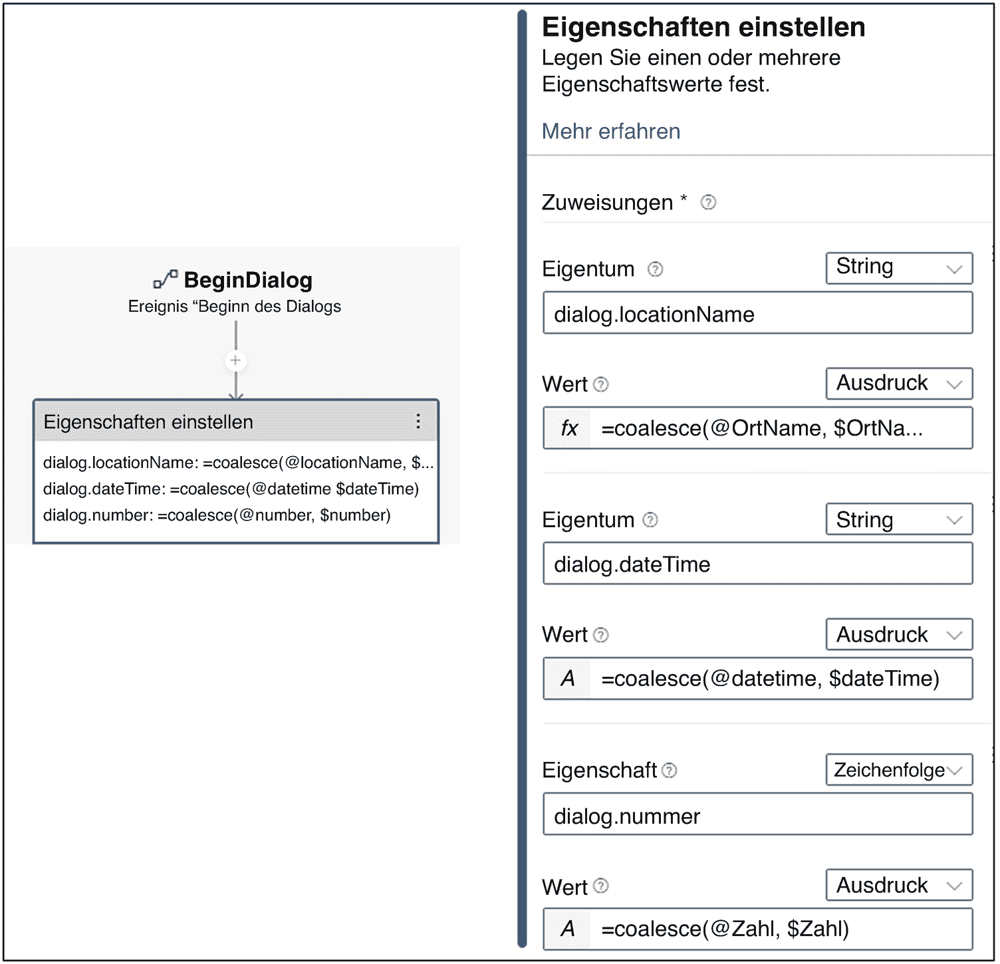

图 5.24

BookRestaurantTable 对话 – 设置属性

下一步是使用“提问”操作来询问缺失的属性，然后再进入对话的下一步。因此，您可以添加三个操作，分别询问地点名称、预订日期和要预订的餐桌人数，如图 5.25 所示。

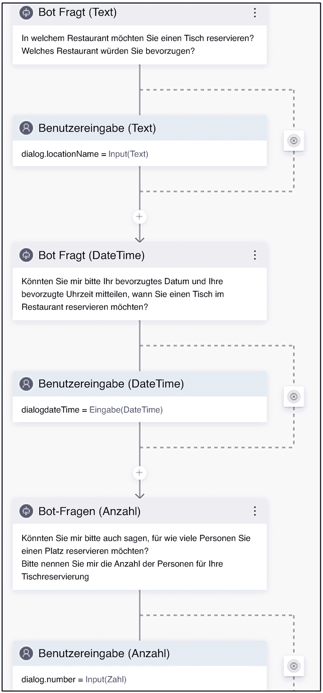

图 5.25

BookRestaurantTable – 提问操作

Composer 中有一个有用的功能，在这种情况下应该使用，它可以防止机器人在属性已填充的情况下仍然提问：`始终提示`。如果将此属性设置为 `true`，则无论如何都会提问，即使要存储回答值的属性不为 null 或空。由于此对话中的第一个操作将提取的实体存储到属性中，LUIS 可能已经从用户的第一个表述中自动提取了这些值。因此，机器人已经知道该属性的值，无需再次询问地点名称、日期或人数，可以跳过这些问题，以避免糟糕的用户体验。因此，在这种情况下，此设置应设置为 `false`，如图 5.26 所示。

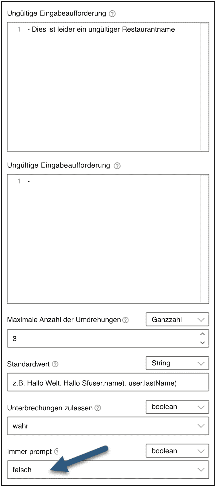

图 5.26

BookRestaurantTable – 始终提示功能

对话中的下一步是在将预订录入系统之前要求确认。这可以通过使用类型为“确认”的“提问”操作来完成，如图 5.27 所示。如下图所示，用户的输入将存储在一个名为 `dialog.confirm` 的属性中，该属性将在后续步骤中使用。

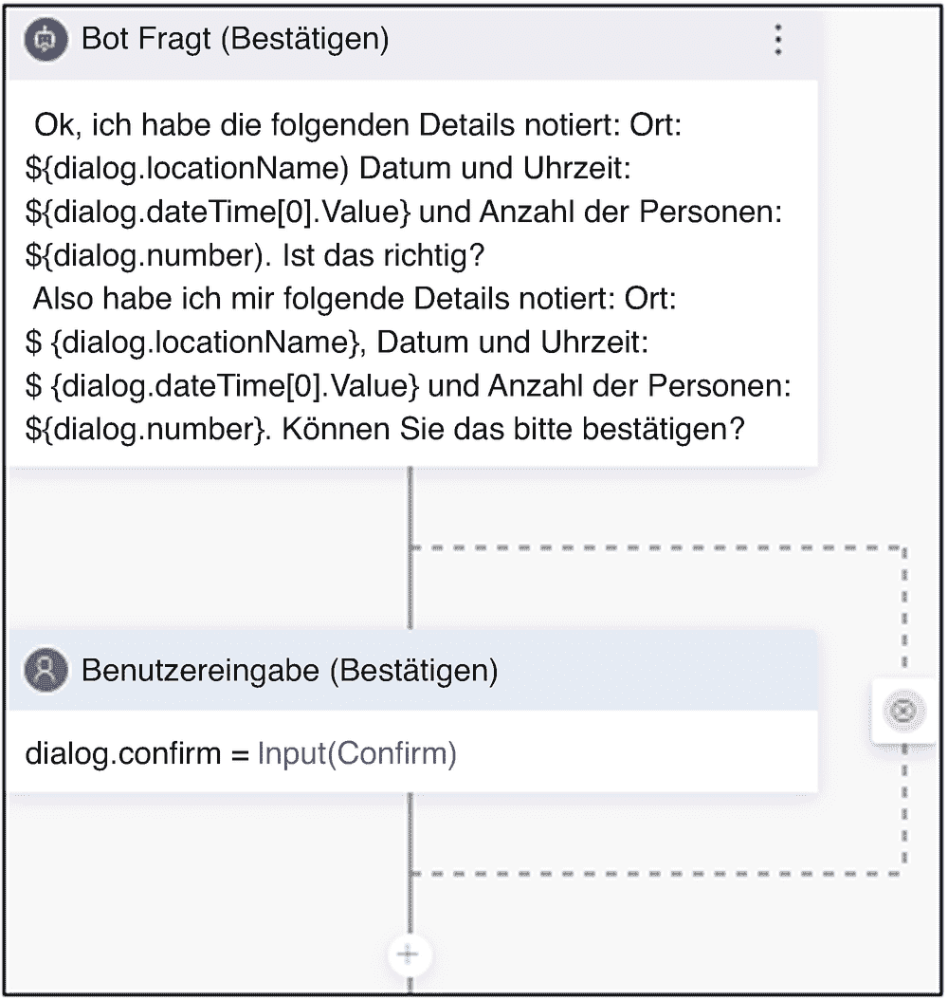

图 5.27

BookRestaurantTable 对话 – 请求确认


### 对话框“BookRestaurantTable”——确认选项

对话框中的最后一步是借助“分支：If/else”操作来检查确认结果，如图 5.28 所示。如果用户确认信息正确，则会发送一条回复，告知用户预订将由机器人执行，同时还会发送一封确认邮件。此外，预订数据会存储在一个名为`user.bookings`的数组中，该数组用于保存用户的所有预订记录，以便日后参考。如果用户未确认预订详情，机器人会询问用户是否想对预订进行修改。如果是，则对话框会简单重复，但会事先清除所有属性，以便机器人重新向用户提出所有三个问题，从而收集正确的信息。如果用户不想做任何修改，则对话框结束，这将导致调用此对话框的父对话框恢复执行。

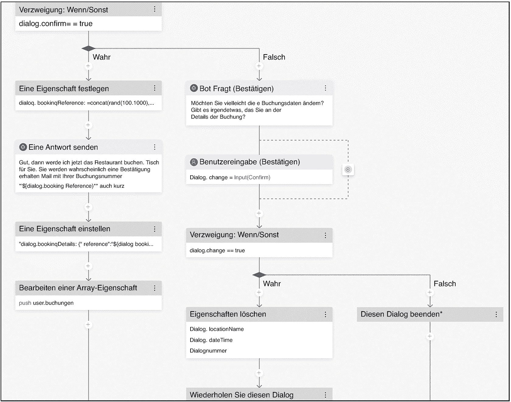

图 5.28 – 对话框 BookRestaurantTable – 确认选项

在此对话框结束前的最后一个操作，是让用户知道，如果还有其他事情需要处理，机器人很可能随时提供帮助。因此，您应该添加一个“发送回复”类型的操作，如图 5.29 所示，用于发送一条“还有什么可以帮您的吗？”之类的消息，随后执行“结束此对话框”操作。这将确保用户在对话框结束时收到一条消息，告知用户如果还有问题，机器人会等待新的提问或输入。由于对话框通过“结束此对话框”操作而终止，父对话框将恢复执行，从而确保使用 LUIS 识别器来正确判断新话语的意图，并启动相应的对话框。

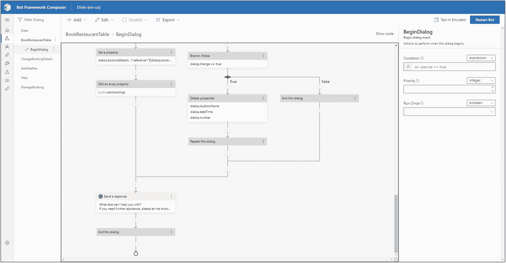

图 5.29 – 对话框 BookRestaurantTable – 结束对话框操作

整个对话框如图 5.30 所示，包含了前一节讨论的所有操作和步骤，以便对整个对话框/触发器有一个全面的了解。

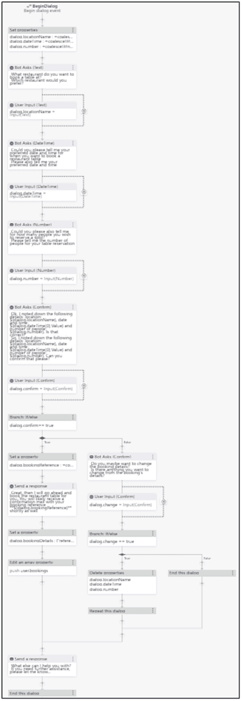

图 5.30 – 对话框 BookRestaurantTable – 概览

**注意：** 在实际场景中，您很可能会调用一个用于管理预订和预约的第三方服务。因此，机器人会先收集用户的所有必要信息，然后调用 API，例如在预订系统中相应地创建预约。

### 对话框“管理预订”

既然机器人现在能够处理餐厅预约，下一步就是处理那些需要修改现有预约的用户请求。因此，应使用`ManageBooking`对话框来更改现有预约中的特定细节。此对话框的第一步是设置预订引用属性，类似于`BookRestaurantTable`对话框中的第一步，如图 5.31 所示。此操作将`dialog.bookingReference`属性的值设置为从 LUIS 识别器接收到的已提取实体值。

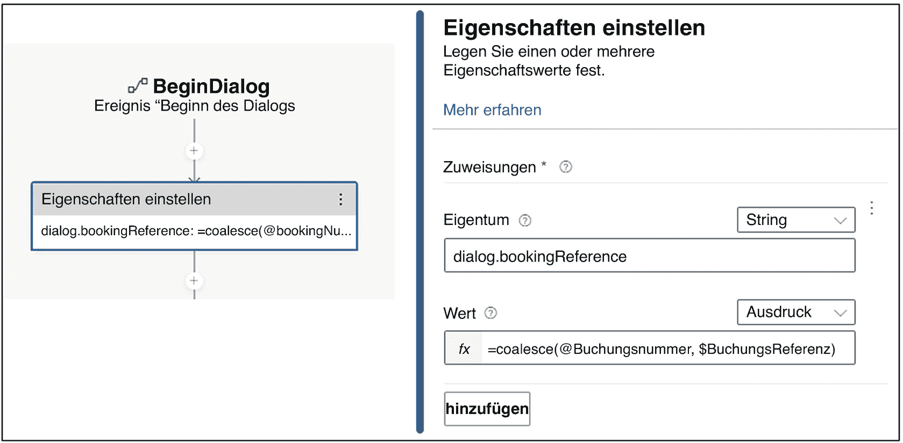

图 5.31 – 对话框`ManageBooking` – 设置属性

如果 LUIS 识别器未能提取预订参考号，则下一步操作是向用户询问预订参考号，如图 5.32 所示。与之前的对话框类似，此操作仅在`dialog.bookingReference`属性为空或 null 时执行。因此，只有当 LUIS 识别器未能成功提取预订参考实体时，才会向用户发送此问题。

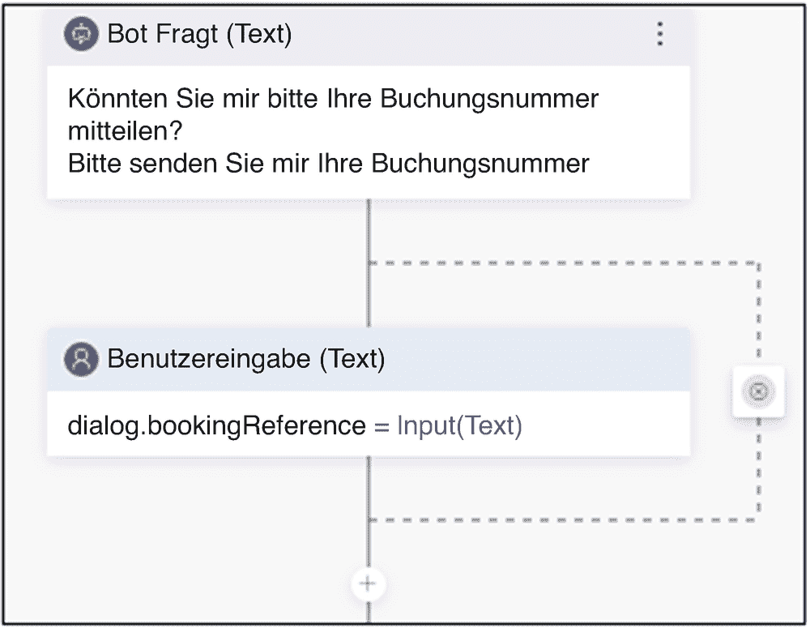

图 5.32 – 对话框`ManageBooking` – 询问预订参考号

现在机器人已获得预订参考号，下一步是将此号码与存储在`user.bookings`属性中的预订参考号进行比较（见图 5.33）。如果找到匹配项，则从用户的预订中移除该预订，并执行一个额外的`ChangeBookingDetails`对话框，以单独更改预订的属性。

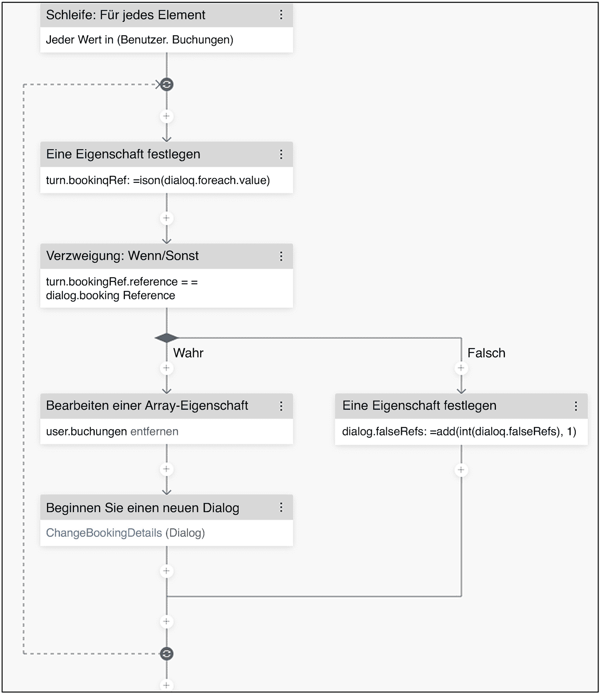

图 5.33 – 对话框`ManageBooking` – 为匹配的预订参考号调用`ChangeBookingDetails`

图 5.34 展示了`ChangeBookingDetails`的起始操作。在此对话框中，用户需要选择要更改的预订属性。为此，用户可以从机器人提供的多项选择问题操作中进行选择。

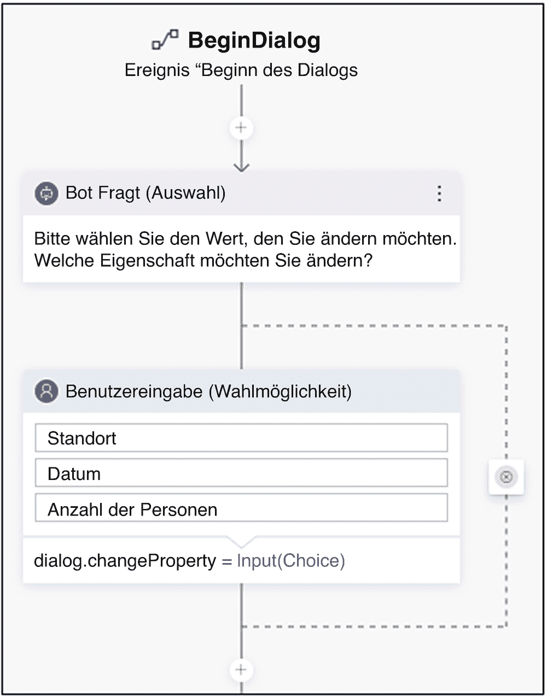

图 5.34 – `ChangeBookingDetails`对话框 – 选择要更改的属性

用户选择提供的选项之一后，将使用“分支：切换（多个选项）”操作来确定用户选择了哪个选项（见图 5.35）。根据用户选择的选项，通过文本询问用户新的或期望的值，来设置相应的属性。

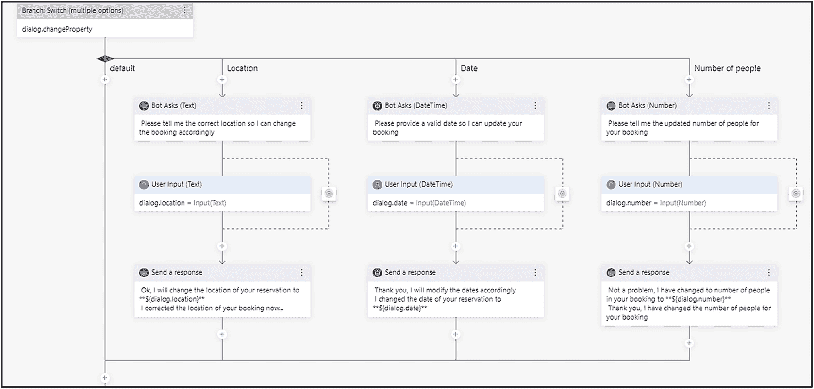

图 5.35 – `ChangeBookingDetails`对话框 – 相应地更改指定属性

如图 5.36 所示，会创建一个新的属性`dialog.bookingDetails`，其中包含用户预订的新属性。此外，使用“编辑数组属性”操作将`dialog.bookingDetails`属性推送到`user.bookings`数组中，以便将更新后的预订重新保存到用户的预订列表中。

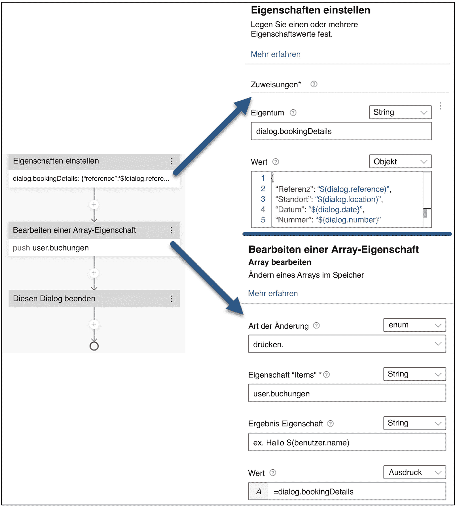

图 5.36 – 对话框`ChangeBookingDetails` – 编辑用户的预订

`ChangeBookingDetails`对话框完成后，`ManageBooking`对话框会如图 5.37 所示继续执行。唯一剩下的步骤是询问用户是否还有其他事情需要机器人帮忙，以表明机器人还能提供进一步的帮助。同样，用户的发言将由父对话框中的顶层 LUIS 识别器处理。

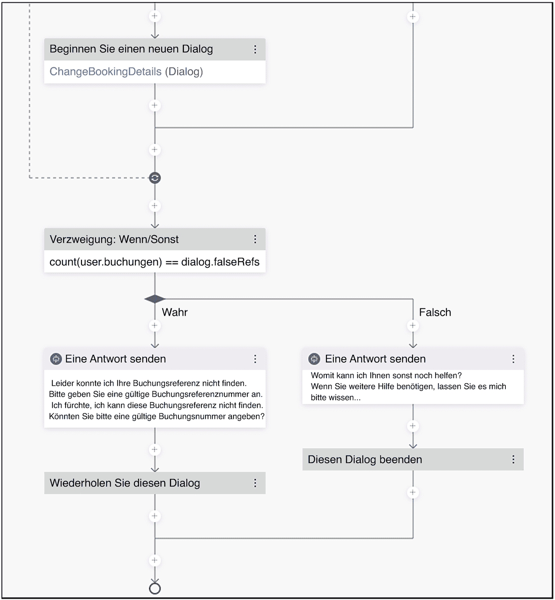

图 5.37 – 对话框`ManageBooking` – 结束对话框

图 5.38 总结了前面详细讨论的所有步骤和操作，因为它本质上代表了“管理预订”对话框的概览。

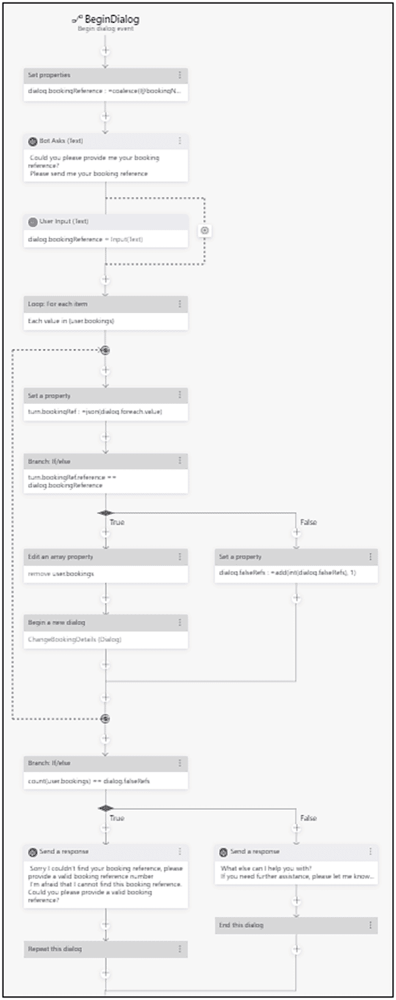

图 5.38 – `ManageBooking`对话框 – 概览


### 帮助对话框

由于用户可能并不总是清楚可以向机器人询问什么，因此“帮助”对话框是描述机器人功能的一个好选择。每当用户输入“帮助”或“我需要帮助”时，就会执行此对话框。“帮助”对话框相当简单，因为它由两个操作组成，如图 5.39 所示。第一个操作主要是向用户发送一张包含帮助内容的**自适应卡片**。此操作使用了一个名为 `HelpCard` 的语言生成功能。“此功能”主要提取字符串 `HelpCardJson`，将其转换为有效的 JSON 负载，并将该负载作为附件附加到活动中。

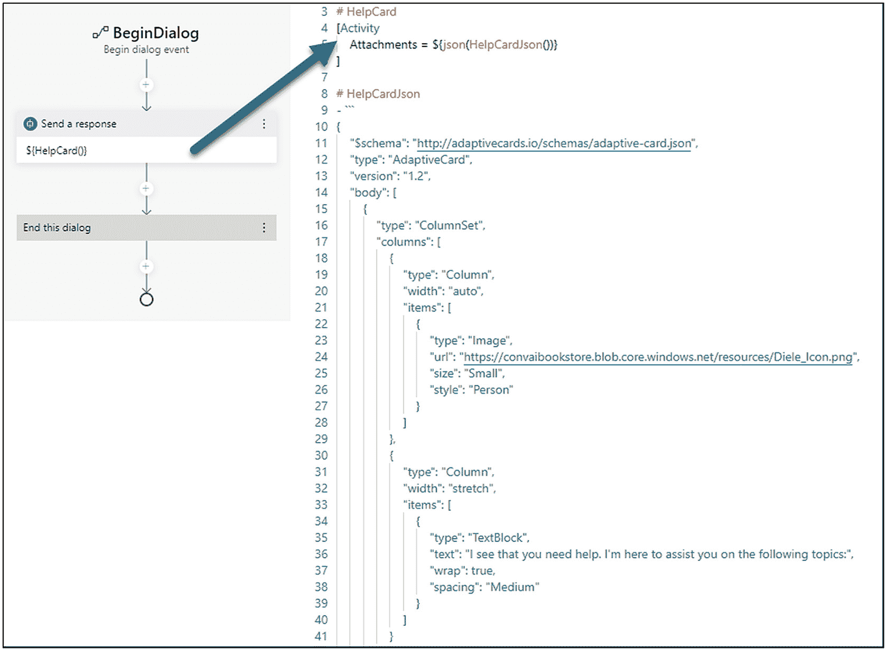

图 5.39 帮助对话框

此操作的结果如图 5.40 所示，它展示了机器人主要告知用户它能够如何提供帮助。自适应卡片涵盖了机器人能够处理的所有主要用例，这些用例已在 Composer 的对话框中实现。发送卡片消息后，对话框结束，并恢复其父级对话框。当“允许中断”标志设置为 `true` 时，这允许用户在对话的任何轮次中请求帮助。

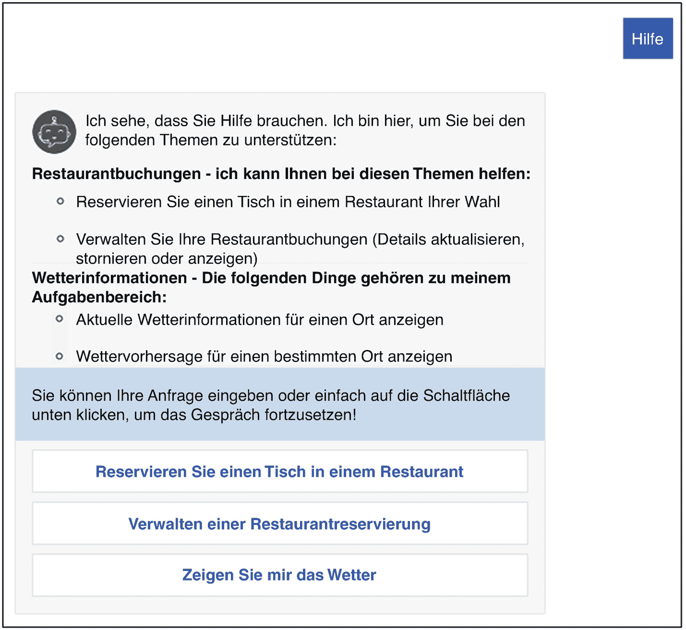

图 5.40 帮助对话框 – 演示

### QnA 对话框

QnA 对话框用于回答基础或常见问题，例如关于预订流程的问题。要将 QnA Maker 集成到基于 Composer 的聊天机器人中，最简单的方法是在根对话框中添加一个类型为 `QnA intent recognized` 的额外触发器，如图 5.41 所示。这确保了每当 LUIS 提取到一个表述并将其标记为 QnA Maker 特定问题时，就会触发此对话框。

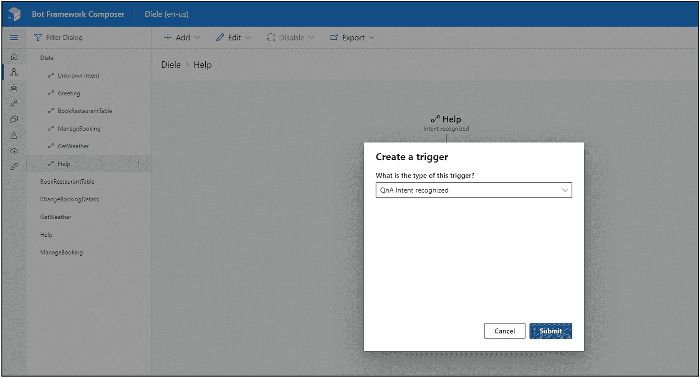

图 5.41 QnA 对话框 – 创建触发器

将新触发器添加到机器人后，QnA Maker 对话框会自动添加到您的机器人中，如图 5.42 所示。这个预构建的对话框基本上会发送从 QnA Maker 端点接收到的答案。如果 QnA Maker 答案包含后续问题，这些后续问题也会作为按钮可选地显示出来。

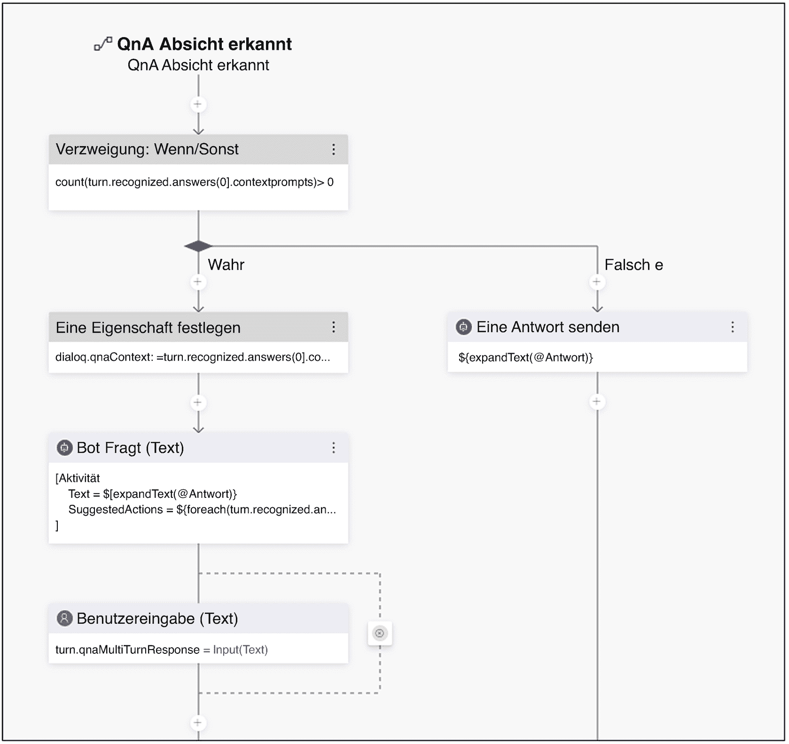

图 5.42 QnA 对话框 – 从 QnA Maker 知识库发送答案

在 Composer 机器人中使用 QnA Maker 的一个重要步骤是填充 QnA Maker 总览视图中的问答对。因此，只需导航到 QnA Maker 总览视图，可以通过图 5.43 所示的 QnA 意图触发器，或者通过左侧导航菜单中的 QnA 按钮。在此视图中，您可以像在 QnA Maker 门户中一样添加或修改 QnA 对，而无需切换到其他门户。在后续步骤描述的机器人运行过程中，Composer 会自动在您选择的 QnA Maker 服务中创建一个新的知识库，并将这些 QnA 对也添加到这个新的知识库中。

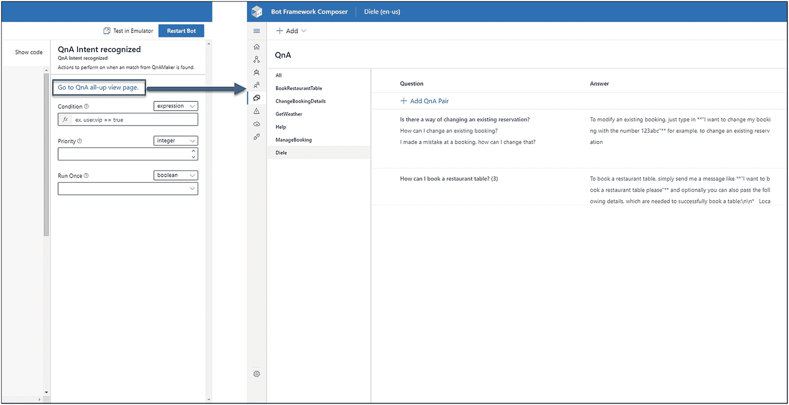

图 5.43 QnA Maker 总览视图

如果您想知道完整的 QnA Maker 对话框是什么样子，图 5.44 展示了 QnA 对话框的完整画面，其中包含了当机器人的识别器识别到 QnA 意图时执行的所有步骤和操作。

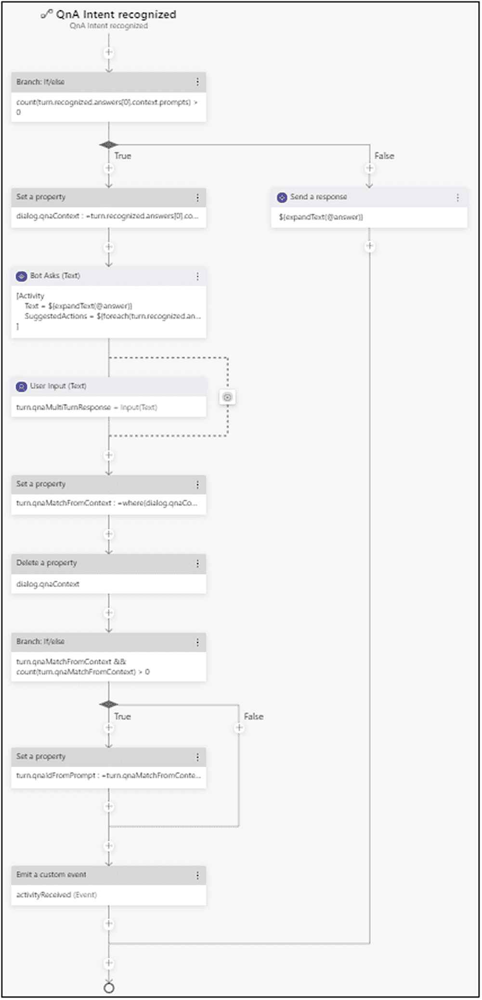

图 5.44 QnA 对话框 – 概览

## 将第三方 API 集成到您的聊天机器人中

机器人的一个常见用例不仅是处理问题或完成特定任务，还包括将第三方 API 集成到对话中。这对于将来自另一个系统的信息直接引入对话非常有帮助。有了这个能力，用户无需在对话上下文和另一个系统之间切换。因此，用户节省了时间，因为原本需要在另一个系统中手动获取的信息，现在可以通过机器人连接到第三方系统而纳入对话中。Bot Framework Composer 提供了在对话中任意点调用 HTTP 端点的能力，以触发其他工具中的进程或获取特定信息，这些信息随后可直接用于与用户的对话中。在您迄今为止创建的示例机器人中，一个常见的简化此解决方案使用的方法是集成天气信息，以便在用户预订餐厅座位等操作之前，告知用户天气预报。

因此，`GetWeather` 对话框用于借助第三方 Web API 收集天气信息，并获取特定城市的当前天气数据和天气预报。第一步类似于之前创建的其他对话框，因为您需要收集用户想要获取天气信息的城市信息。这是通过“设置属性”操作完成的，如图 5.45 所示，当识别到 `GetWeather` 意图时，该操作会检查 LUIS 识别器是否已从用户表述中提取了 `city` 实体。如果城市尚未被识别器提取，机器人在查询天气 API 之前应提示用户输入城市名称，并将该值存储在属性 `dialog.city` 中。

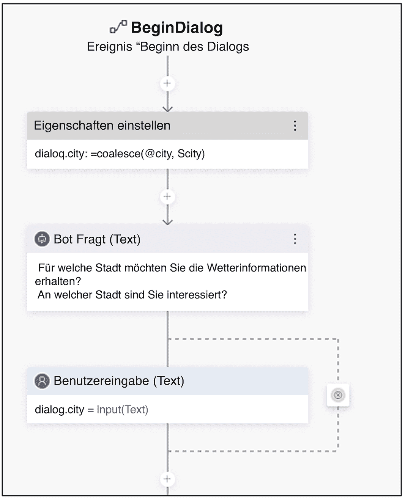

图 5.45 GetWeather 对话框 – 设置属性并收集信息

在正确设置城市名称后，下一步是询问用户是希望将当前天气还是天气预报发送到聊天中。这也可以通过“机器人提问（选择）”操作来完成，以提供“当前天气”和“天气预报”两个选项供用户选择，如图 5.46 所示。此选择提示的结果存储在属性 `dialog.weatherChoice` 中，该属性将在后续步骤中用于确定要使用的 API 端点。

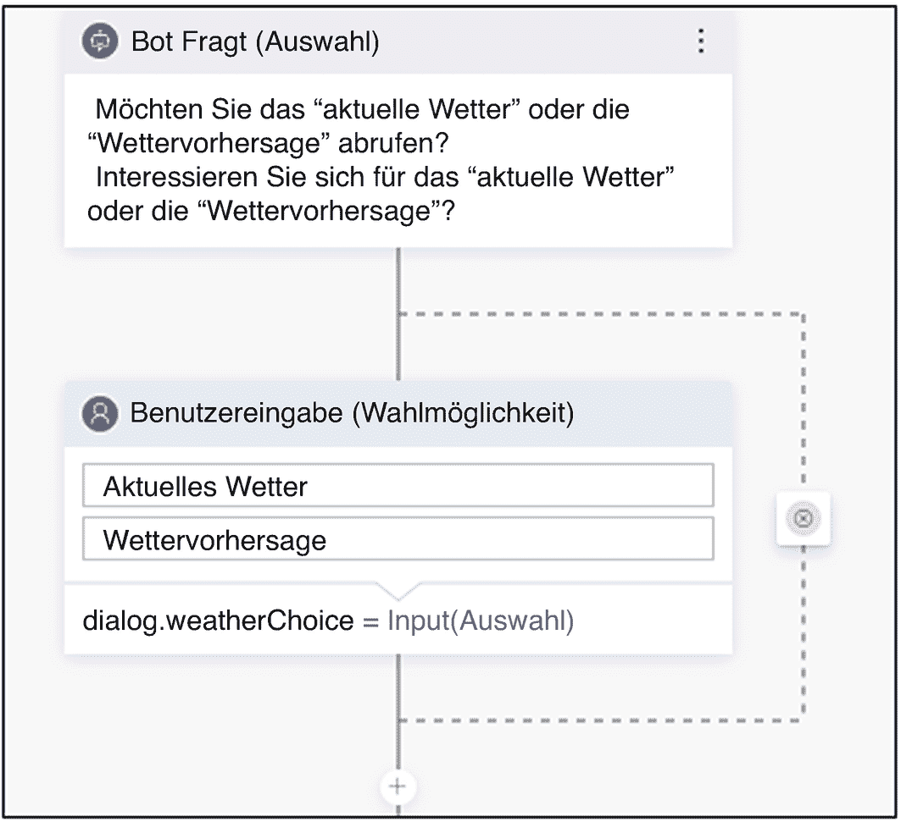

图 5.46 GetWeather 对话框 – 输入提示

根据属性 `dialog.weatherChoice`，HTTP 请求将使用当前天气的 API 端点或天气预报的端点。如图 5.47 所示，在“发送 HTTP 请求”操作中，您可以在不同的 HTTP 方法（如 `GET`、`POST` 或 `DELETE`）之间进行选择。此外，URL 也可以由属性组成，如下所示。这样，您就可以将属性值包含在 HTTP 请求的 URL、标头或正文中。

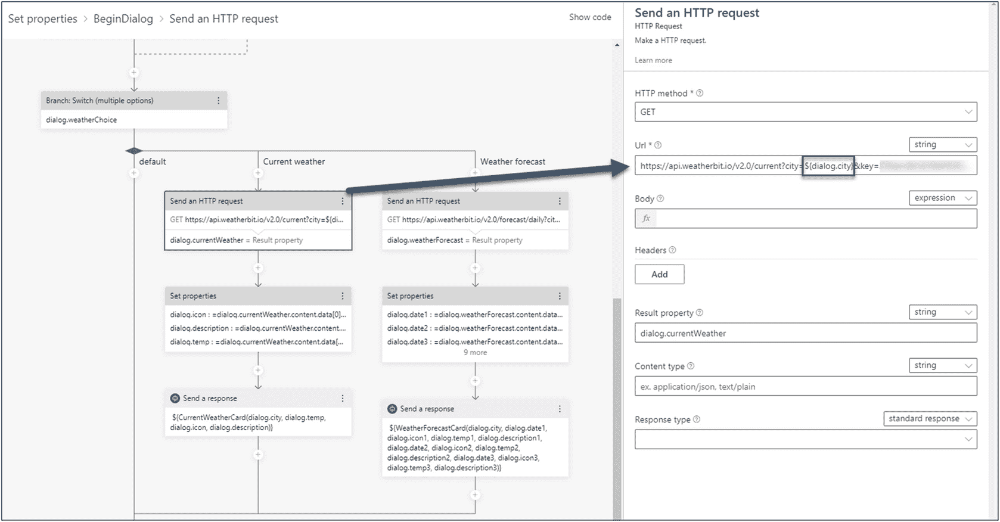

图 5.47 GetWeather 对话框 – 发送 HTTP 请求


HTTP 请求的结果存储在 `dialog.currentWeather` 属性中。该结果属性基本上包含了完整的响应信息，包括 HTTP 状态码、标头和实际内容。要访问内容，只需使用 `dialog.currentWeather.content`，它包含 API 响应的内容，在本例中即当前的天气数据。在设置了从天气 API 接收到的必要属性（如用于显示天气的图标、描述和温度）后，会在“发送响应”操作中调用另一个 LG 函数 `CurrentWeatherCard`，如图 5.48 所示。

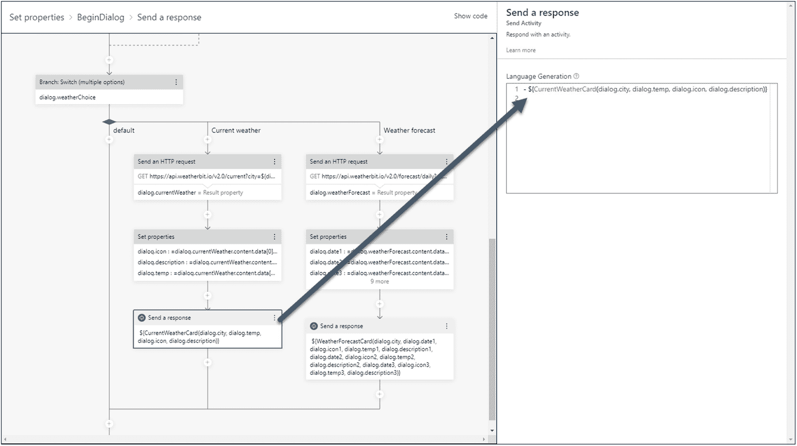

图 5.48 GetWeather 对话框 – 使用属性发送自适应卡片响应

此函数基本上接收输入参数，这些参数随后用于填充预定义自适应卡片中的特定值。以下代码片段基本上就是您在机器人的语言生成文件中创建此可调用函数所需的内容：

```
### CurrentWeatherCard(城市, 温度, 图标, 描述)
[活动
附件 = ${json(CurrentWeatherCardJson(city, temp, icon, description))}
]
```

如您所见，此函数调用了另一个函数 `CurrentWeatherCardJson`，该函数也接受与 `CurrentWeatherCard` 相同的输入参数：城市、温度、图标和描述。此函数本质上包含自适应卡片的 JSON 有效负载，当用户想要获取当前天气信息时应发送该负载。正如您在下面的代码片段中所见，当参数遵循 `${参数名称}` 表示法（例如 `${city}`）时，语言生成引擎会自动填充这些参数：

```
### CurrentWeatherCardJson(city, temp, icon, description)
- ```
{
"$schema": "http://adaptivecards.io/schemas/adaptive-card.json",
"类型": "AdaptiveCard",
"版本": "1.2",
"主体": [
{
"类型": "TextBlock",
"文本": "这是以下城市的天气：${城市}",
"大小": "大",
"isSubtle": true
},
{
"类型": "ColumnSet",
"列": [
{
"类型": "列",
"宽度": "auto",
"元素": [
{
"类型": "图像",
"url": "https://www.weatherbit.io/static/img/icons/${icon}.png",
"大小": "小",
"altText": "大部分多云天气"
}
]
},
{
"类型": "列",
"宽度": "auto",
"元素": [
{
"类型": "TextBlock",
"文本": "${temp}",
"大小": "特大",
"间距": "无"
}
]
},
...
```

在图 5.49 中，您可以看到此对话框在实际应用中的样子。当用户输入一个在 `GetWeather` 意图中被识别的短语，但 LUIS 识别器无法从该表述中提取城市实体时，机器人会回问用户对哪个城市感兴趣。输入城市名称后，用户需要在当前天气和天气预报之间进行选择。基于此决定，机器人会向第三方 API 发送 HTTP 请求，以收集所需信息并将详细信息整合到自适应卡片中，然后将其发送回用户。

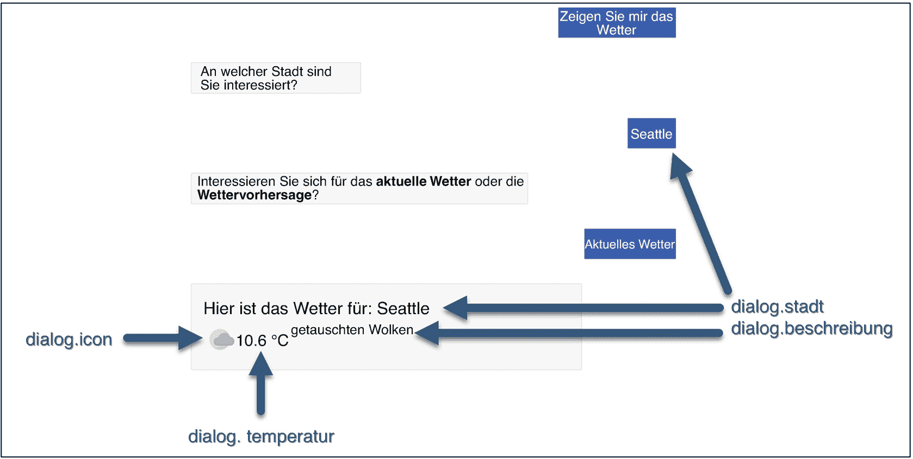

图 5.49 GetWeather 对话框 – 当前天气演示

最终，当用户选择天气预报选项而非当前天气信息时，对话框可能如图 5.50 所示。在此场景中，存在多个相同属性类型（如图标、温度或描述）的实例，因为需要在自适应卡片消息中显示多天的数据。其原理与当前天气预报基本相同，尽管 LG 函数最终将如下所示：

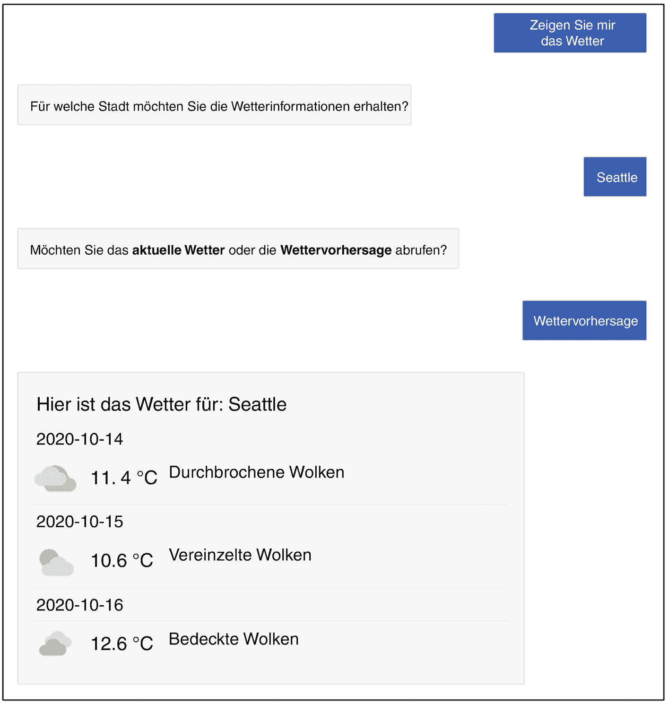

图 5.50 GetWeather 对话框 – 天气预报演示


# `WetterVorhersageKarte(Stadt, Datum1, Symbol1, Temperatur1, Beschreibung1, Datum2, Symbol2, Temperatur2, Beschreibung2, Datum3, Symbol3, Temperatur3, Beschreibung3)`

```
[Aktivität
Attachments = ${json(WeatherForecastCardJson(city, date1, icon1, temp1, description1, date2, icon2, temp2, description2, date3, icon3, temp3, description3))}
]
```

完整的 `GetWeather` 对话框概览如图 5.51 所示。在该图中，您可以看到 API 端点取决于用户的选择，即当前天气或天气信息。当用户选择天气预报时，在对话框结束前，会向用户发送一张包含未来几天天气信息的自适应卡片。

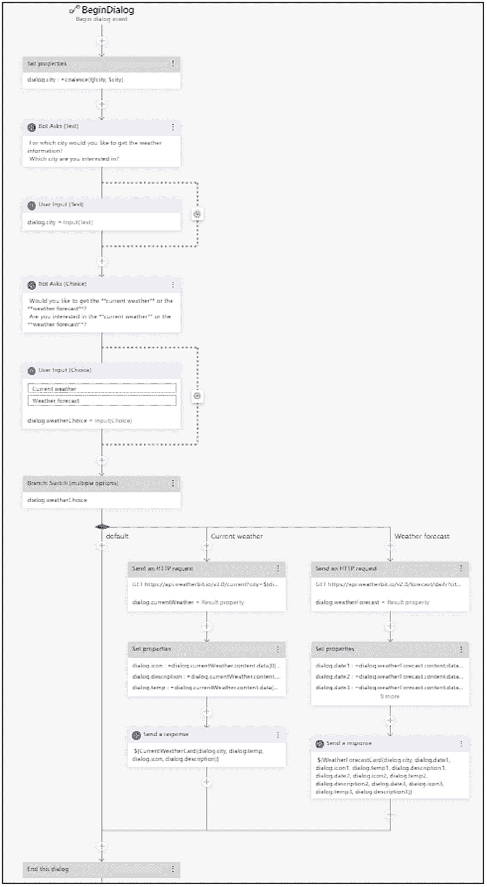

图 5.51

`GetWeather` 对话框 – 概览

## 总结

在本章中，您学习了 Microsoft Bot Framework Composer 的核心概念，例如存储管理、语言理解和语言生成的使用。此外，您还构建了第一个机器人，最初是一个回声机器人。这个回声机器人随后被转变为一个高级聊天机器人，能够在对话中为用户预订餐厅餐桌、管理现有餐桌预订，或回答来自 QnA Maker 知识库的问题。此外，您还学习了如何将第三方 API 集成到聊天机器人中，从而利用其他系统的信息丰富对话内容，避免上下文切换。

下一章将介绍如何测试和调试聊天机器人的对话行为。您将学习如何使用 Microsoft Bot Framework Emulator 测试在 Composer 中创建的机器人，以及如何利用模拟器调试语言理解应用程序。

# 6. 测试聊天机器人

在第 5 章中，您学习了如何使用 Microsoft Bot Framework Composer 创建聊天机器人。在本章中，您学习了如何编写各种对话框和操作来设计对话体验。创建聊天机器人后的下一步是测试聊天机器人。这正是本章“测试聊天机器人”的主题，重点在于在本地计算机上测试和调试聊天机器人，而无需事先发布机器人。

在本章中，您将学习如何使用 Bot Framework Emulator 测试和调试聊天机器人的对话。此外，您还将了解如何在 Composer 对话框中插入跟踪事件，以向 Bot Framework Emulator 发送跟踪活动。同时，还会展示直接在模拟器中跟踪语言理解服务性能的选项。

## Bot Framework Emulator 简介

当您在本地开发聊天机器人时，无论您是使用 Composer 还是 Bot Framework SDK 和 IDE 来创建机器人，都需要在开发过程中进行测试，以查看对话体验是否符合预期。为了测试机器人的对话，可以使用桌面应用程序 Bot Framework Emulator 与机器人进行聊天。此外，您还可以使用模拟器测试远程聊天机器人，例如托管在 Azure 上的机器人。除了能够与机器人聊天外，您还可以查看用户与机器人之间交换的消息。使用模拟器的优势在于，即使您尚未将机器人发布到 Azure 订阅中，也可以在本地测试和检查聊天机器人。

注意

要下载并安装 Bot Framework Emulator，请访问 [`aka.ms/bfemulator`](http://aka.ms/bfemulator)。

作为机器人开发者，您应将模拟器的使用纳入开发流程。与其他基于 GUI 的解决方案一样，用户体验（在机器人中即对话）是用户唯一能体验到的内容。因此，在发布或分享聊天机器人之前，应彻底测试对话体验，因为如果第一印象不佳，用户将不会再使用您的聊天机器人。

## 使用模拟器测试聊天机器人

安装 Bot Framework Emulator 后，您可以通过机器人的消息端点连接到任何正在运行的机器人。消息端点通常采用以下格式的 URL：

```
http://botEndpoint/api/messages
```

在开发和本地运行机器人时，该消息端点很可能类似于：

```
http://localhost:port/api/messages
```

新创建的 Bot Framework 机器人的默认端口号为 3979，但可根据需要在机器人配置中进行更改。因此，您可以在本地计算机上通过 Visual Studio、Node.js 或其他技术运行机器人，并通过机器人 URL 或消息端点在模拟器中与其连接，如图 6.1 所示。如果您的机器人已发布到 Azure，或者机器人的应用程序设置中已包含 Microsoft App ID 和 Microsoft App 密码，则您需要在打开机器人前输入这些值。否则，由于缺少这些参数，模拟器将无法成功连接到您的机器人。

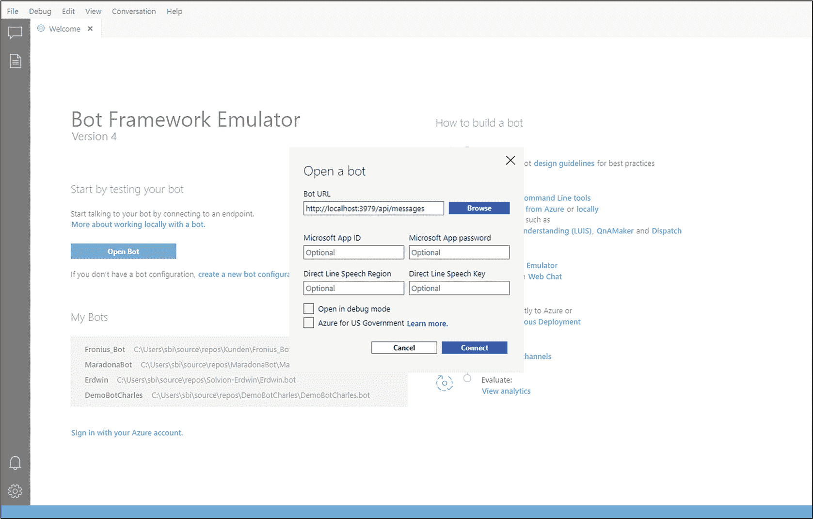

图 6.1

Bot Framework Emulator – 打开机器人

如果您使用 Composer 创建机器人，也可以启动机器人。在此过程中，机器人会自动在 Localhost 上使用 .NET Core 启动。首次启动机器人时，您需要提供 LUIS 创作密钥和 QnA Maker 订阅密钥，如图 6.2 所示。LUIS 创作密钥用于发布使用 Composer 创建的 LUIS 模型（包含在对话框的触发短语中）。QnA Maker 订阅密钥用于创建和编写 QnA Maker 知识库。添加到 QnA Maker 总览视图中的短语将被添加到 QnA Maker 知识库中。如果您更改了 QnA 对并重新启动机器人，Composer 会自动更新 QnA Maker 知识库中的本地更改，以保持最新状态。此外，Composer 在启动机器人时会创建一个新的 LUIS 应用程序，该应用程序基于您在 Composer 中创建的语言理解资产，例如包含话语和实体的触发短语，以及您定义的意图。因此，无需再切换到 LUIS 或 QnA Maker 门户来修改语言理解模型或知识库。

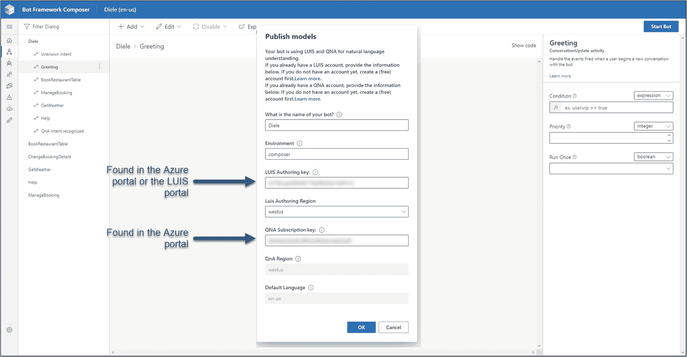

图 6.2

在 Composer 中启动机器人

使用 Bot Framework Composer，可以通过 Composer 完成此步骤。在 Composer 中启动机器人后，右上角“重新启动机器人”旁边会出现一个名为“在模拟器中测试”的新按钮。使用此按钮，您可以将当前机器人的消息端点 URL 复制到剪贴板，或直接打开 Bot Framework Emulator 并连接到机器人，如图 6.3 所示。

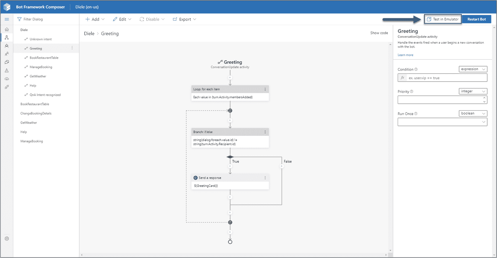

图 6.3


### Bot Framework Composer – 在模拟器中测试

打开模拟器并与您的聊天机器人建立连接后，您就可以与机器人进行对话，就像使用 Web 聊天界面的用户一样，如图 6.4 所示。

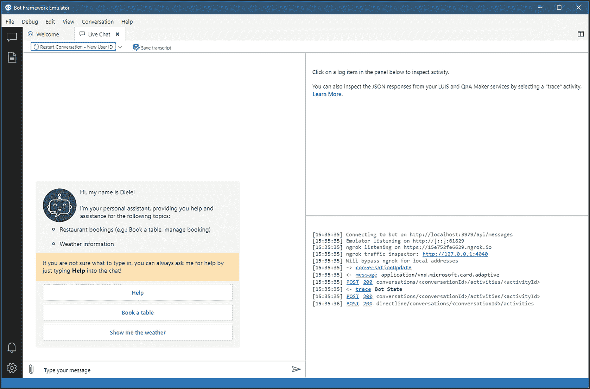

图 6.4

Bot Framework Composer – 模拟器测试演示

模拟器的左侧本质上是一个 Web 聊天组件，您可以用它与机器人聊天。然而，右侧是一个检查区域。该检查区域主要用于调试和跟踪用户与机器人之间交换的活动，以查看来回发送的内容。如图 6.5 所示，您可以使用模拟器检查每个活动，以查看所有详细信息，例如通道数据、对话 ID、发送者和接收者详细信息，以及特定消息或活动的文本和区域设置。因此，模拟器基本上显示了活动在幕后的构成。

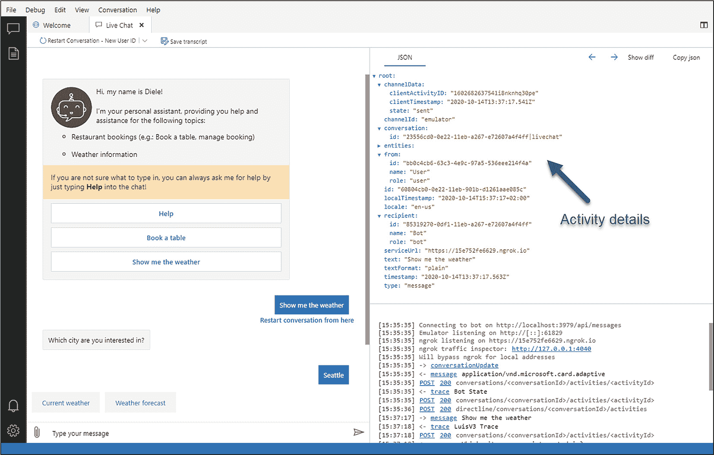

图 6.5

Bot Framework 模拟器 – 活动详细信息视图

Composer 还提供了一个名为 `Emit a trace event` 的操作，用于在模拟器的检查区域中记录新活动。例如，如果您想记录某个特定属性的值，可以使用此操作，如图 6.6 所示。当您不想使用 `发送回复` 操作来记录特定属性的值并跟踪错误消息时，这通常很有帮助。用户不会注意到这种类型的跟踪事件，因此您甚至可以在生产场景中保留它们，因为它们本质上是对特定信息的记录（当然，这些信息不应是敏感的）。

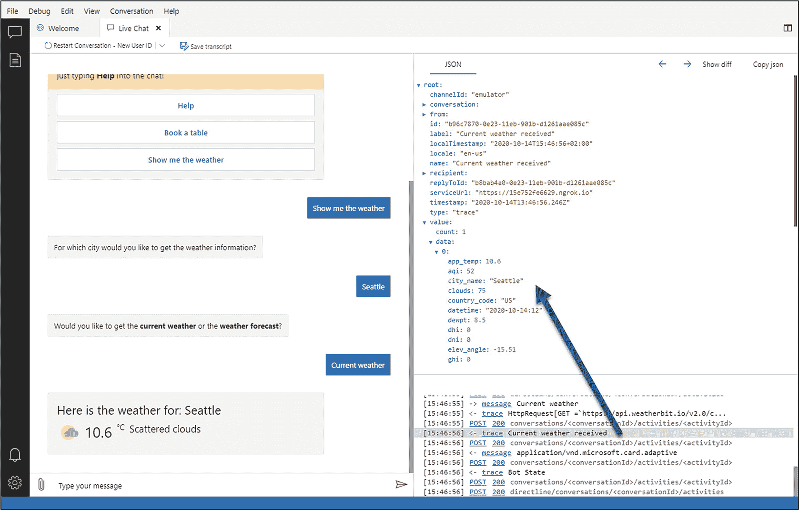

图 6.6

Bot Framework 模拟器 – 检查发出的跟踪事件

对于第 5 章中描述的用例（集成第三方 API 并发送 HTTP 请求），模拟器也可以显示 HTTP 请求的详细信息，如图 6.7 所示。利用此功能，您可以直接在模拟器的检查区域中跟踪 HTTP 请求及其使用的 HTTP 方法和 URL，以及 HTTP 响应（包括状态码和响应内容）。

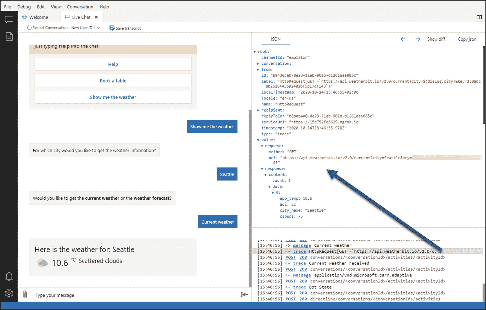

图 6.7

Bot Framework 模拟器 – 检查 HTTP 请求

## 调试和跟踪语言理解

Bot Framework 模拟器不仅用于测试聊天机器人的对话行为。模拟器还可用于跟踪和调试您的语言理解模型。这对于结合语言理解模型的性能来测试对话行为极其有用。这样，您可以在与机器人聊天的同时，检查从 LUIS 预测资源获取的已识别意图和置信度分数。如图 6.8 所示，LUIS 跟踪还包含提取的实体。这样，您可以轻松跟踪 LUIS 模型从用户表述中推断出的实体。这节省了大量测试和调试聊天机器人的时间，因为您可以直接从模拟器测试语言理解模型。因此，您无需使用 LUIS 门户来测试特定表述，以查看识别了哪个意图以及提取了哪些实体。

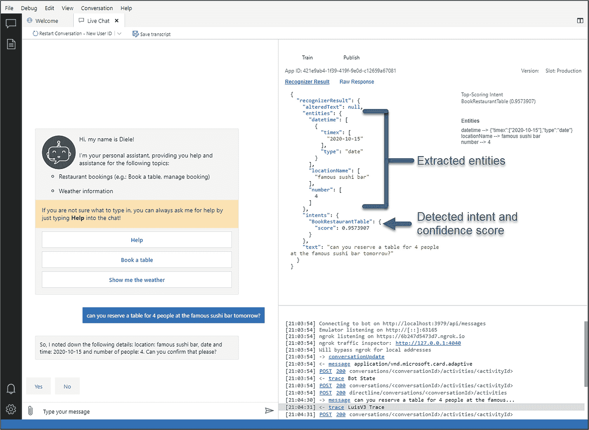

图 6.8

跟踪 LUIS 事件

## 故障排除和跟踪 QnA Maker

使用模拟器，您不仅可以跟踪语言模型，还可以跟踪 QnA Maker 的行为。这在您需要跟踪 QnA Maker 服务返回的结果（例如置信度分数和最合适的答案）时非常有用。您还可以使用模拟器为特定问题添加替代措辞，或训练和发布 QnA Maker 知识库。因此，您无需切换上下文，因为许多常见操作都可以通过模拟器完成。遗憾的是，要使用此 QnA Maker 跟踪功能，您需要事先进行一些手动准备。由于此功能依赖于 `.bot` 文件，您需要在本地计算机上的模拟器中创建并保存一个新的机器人配置文件，如图 6.9 所示。

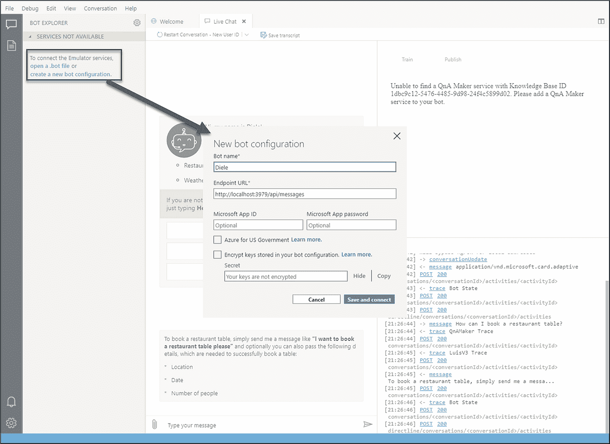

图 6.9

QnA Maker 跟踪 – 创建机器人配置文件

创建 `.bot` 文件后，下一步是在使用此功能之前，在模拟器中登录 Azure。这基本上会在您的 Azure 账户和模拟器之间建立连接，使您能够将模拟器直接连接到您的 Azure 服务。为此，请转到 `文件 – 使用 Azure 登录` (1)，并使用对您的 Azure 订阅具有权限的个人、工作或学校账户登录。成功登录后，单击 `+ – 添加 QnA Maker`，如图 6.10 所示 (2)，然后选择相应的 QnA Maker 知识库 (3)。

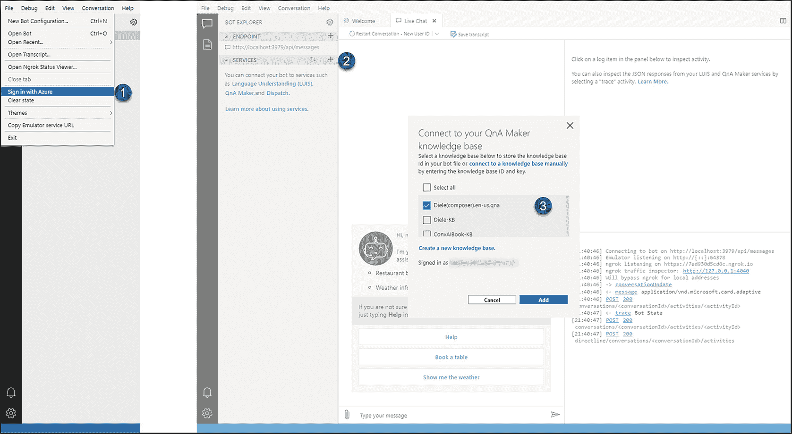

图 6.10

QnA Maker 跟踪 – 使用 Azure 登录并连接到 QnA Maker 服务

将 QnA Maker 服务添加到模拟器中的机器人配置后，您就可以跟踪 QnA Maker 事件了。只需从 QnA Maker 知识库中提出一个问题，然后单击 QnA Maker 跟踪事件，如图 6.11 所示。在那里，您将看到可以为给定问题添加替代措辞。此外，还会显示匹配问答对的置信度分数。

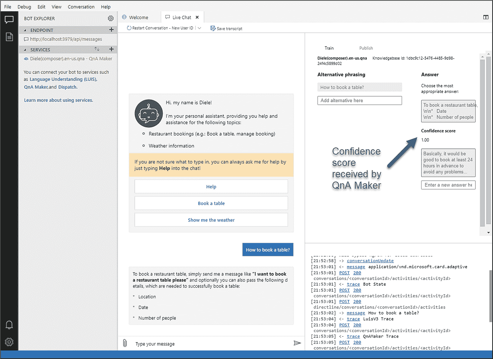

图 6.11

QnA Maker 跟踪 – 模拟器视图 01

此外，您不仅能看到排名最高的问题的置信度值，如图 6.11 所示。如果有多个问题与您输入的问题匹配，您很可能也会在 QnA Maker 跟踪中看到它们，如图 6.12 所示。

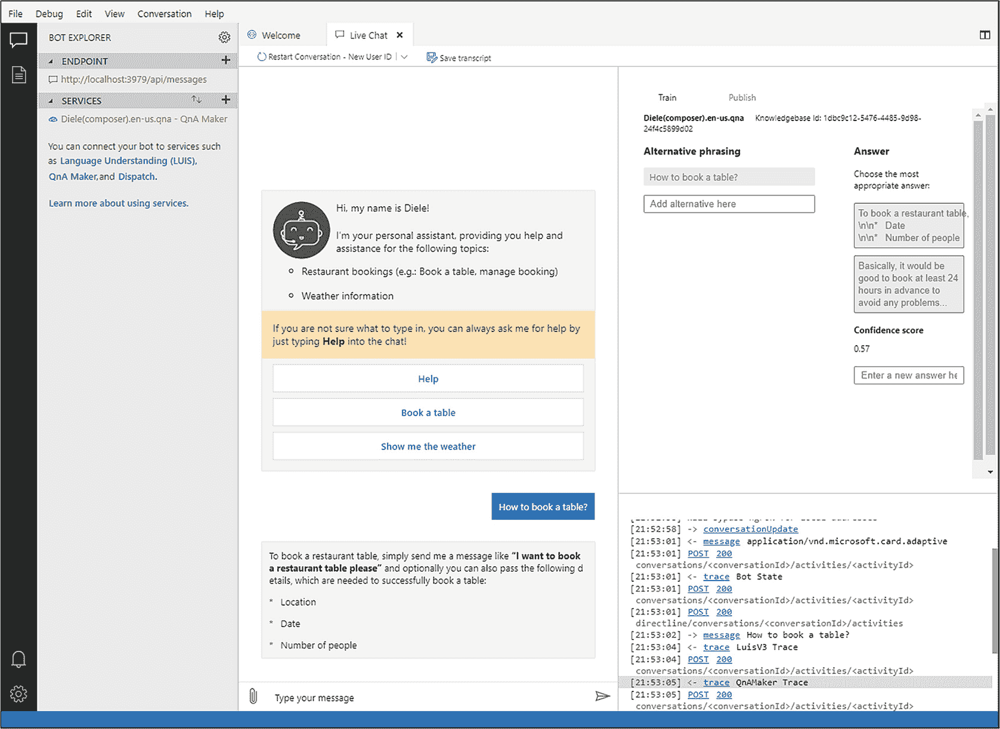

图 6.12

QnA Maker 跟踪 – 模拟器视图 02

## 总结

本章介绍了测试和调试使用 Bot Framework Composer 创建的聊天机器人。在本章中，您学习了如何使用 Bot Framework 模拟器在本地测试聊天机器人，而无需事先将其发布到 Azure。此外，本章还介绍了直接在模拟器中跟踪和调试 LUIS 和 QnA Maker 跟踪的过程。

下一章将介绍如何将使用 Composer 创建并测试的聊天机器人本地发布到 Azure，以便将机器人连接到各种通道，然后将其发布给最终用户。

# 7. 发布聊天机器人


发布机器人很可能是聊天机器人开发生命周期中的最后一步之一，因为此操作是在您创建并本地测试聊天机器人，直到对对话体验感到满意后进行的。如果情况如此，您可以发布机器人，以便稍后将其与 Azure Bot Service 提供的通道连接，这将在第 8 章中描述。然而，本章的目标是引导您完成将 Composer 机器人发布到 Microsoft Azure 的过程。

发布过程本质上由多个步骤组成，这些步骤必须成功执行，才能使基于 Composer 的机器人在您的 Azure 环境中运行。首先，您需要在启动发布过程之前安装先决条件：

*   `Node.js`。使用版本 12.13.0 或更高版本。
*   `Azure CLI`

在安装完这两个先决条件后，您就可以开始发布在第 5 章中创建的机器人了。

## 创建 Azure 资源

在您将机器人的源代码发布到 Azure Web 应用之前，您需要在 Azure 中预配所有必需的资源，例如 Azure 应用服务计划、Azure Cosmos DB 和 Azure 机器人通道注册服务。要创建这些 Azure 资源，您需要打开一个终端实例，并导航到机器人存储在本地计算机上的位置。在该位置有一个名为 `scripts` 的文件夹，您需要在终端窗口中导航到该文件夹。在此文件夹中，您首先需要运行以下命令来安装稍后在部署过程中使用的所有依赖项：

```
npm install
```

在依赖项成功安装后，您可以启动机器人的部署过程。通常，位于机器人根文件夹中的 `README` 文件会指示您运行以下命令来预配 Azure 资源：

```
node provisionComposer.js --subscriptionId= --name= --appPassword= --environment=
```

然而，本书中描述的情况略有不同，因为我们已经在 Azure 资源组中预配了 LUIS 服务和 QnA Maker 服务。因此，您需要使用以下命令来成功预配您的 Azure 资源：

```
node provisionComposer.js --subscriptionId= --name= --appPassword= --environment= --createLuisAuthoringResource false --createLuisResource false --createQnAResource false
```

**注意：** 如果您希望将 Azure 服务预配到已有的 Azure 资源组中，您需要修改位于机器人脚本路径中的 `provisionComposer.js` 文件，以确保该脚本能够捕获现有 Azure 资源组的名称作为参数。

在此脚本成功执行后，应该会创建一个新的 Azure 资源组，其名称与您在前面的命令中指定的名称一致。该资源组应包含以下服务：

*   机器人通道注册
*   Azure Cosmos DB 帐户
*   Application Insights
*   应用服务计划
*   应用服务
*   存储帐户

这些服务对于在 Azure 中托管您的聊天机器人是必需的。`Bot Channels Registration` 服务用于首先将您的机器人连接到各个通道，并通过使用 Azure Bot Service 让用户通过这些通道与机器人通信。Azure Cosmos DB 帐户用于机器人的状态管理。Application Insights 服务用于跟踪机器人的遥测数据以及性能，这些数据可用于在 Azure 中创建仪表板。应用服务计划和应用服务用于托管机器人的运行时。这本质上是一个 Web 应用程序，其中部署了机器人的代码，并托管了机器人逻辑以及通道所连接的消息传递端点。存储帐户用作转录存储，其中保存所有聊天记录。

上述脚本在终端窗口中的输出可能类似于图 7.1 所示。将命令的输出复制或保存到某处非常重要，因为在下一步将机器人部署到 Azure 时会用到它。

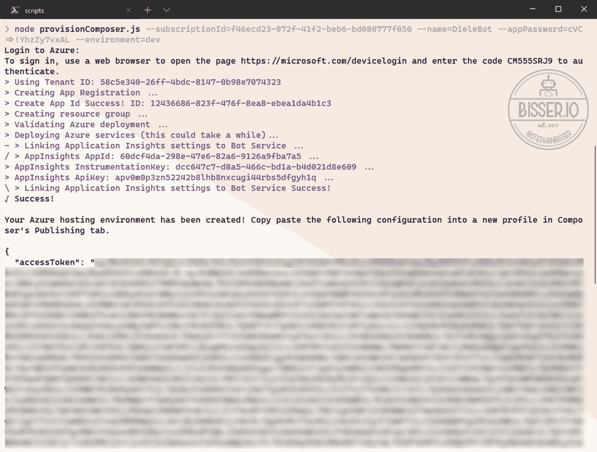

图 7.1 预配 Azure 资源终端输出

通常，此命令的输出类似于以下片段，并且 Azure 资源组视图应基本如图 7.2 所示。

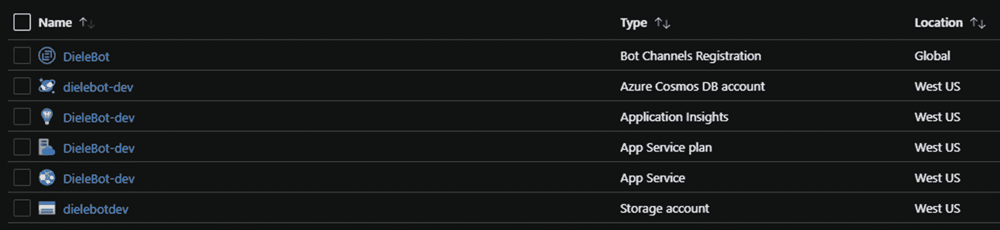

图 7.2 成功发布后的 Azure 资源组

```
{
  "accessToken": "",
  "name": "",
  "environment": "",
  "hostname": "",
  "luisResource": "",
  "settings": {
    "applicationInsights": {
      "InstrumentationKey": ""
    },
    "cosmosDb": {
      "cosmosDBEndpoint": "",
      "authKey": "",
      "databaseId": "botstate-db",
      "collectionId": "botstate-collection",
      "containerId": "botstate-container"
    },
    "blobStorage": {
      "connectionString": "",
      "container": "transcripts"
    },
    "luis": {
      "endpointKey": "",
      "authoringKey": "",
      "region": "westus",
      "endpoint": "https://westus.api.cognitive.microsoft.com/",
      "authoringEndpoint": "https://westus.api.cognitive.microsoft.com/"
    },
    "qna": {
      "endpoint": "",
      "subscriptionKey": ""
    },
    "MicrosoftAppId": "",
    "MicrosoftAppPassword": ""
  }
}
```


在使用前文提到的输出之前，您需要修改 `LUIS` 和 `QnA` 部分，使其包含已有的资源，以便机器人在发布后能够连接到这些服务。因此，您基本上需要修改输出中的以下密钥和属性：

```
{
...
"luisResource": ""
"Einstellungen": {
...
"luis": {
"endpointKey": "",
"authoringKey": "",
"Region": "westus",
"Endpunkt": "",
"authoringEndpoint": ""
},
"qna": {
"Endpunkt": "",
"subscriptionKey": ""
},
...
}
}
```

您可以在 `LUIS` 应用的“管理 – Azure 资源”页面中找到 `endpointKey`、`authoringKey` 和 `Region`。在 Azure 门户中，导航到 `LUIS` 创作和预测服务的“密钥和终结点”页面，即可找到 `Endpunkt` 和 `authoringEndpoint`。`QnA` 的终结点和 `subscriptionKey` 也可以从 Azure 门户中 `QnA Maker` 实例的“密钥和终结点”部分获取。修改输出后，您需要将其复制，因为在下一步部署机器人时会用到。

## 在 Azure 中发布机器人

在 Azure 资源成功部署后，您可以将机器人部署到 Azure。因此，请返回 Composer 中机器人的发布区域，如图 7.3 所示。此视图中很可能不会显示任何信息，因为您尚未创建发布配置文件或已在 Azure 中发布机器人。

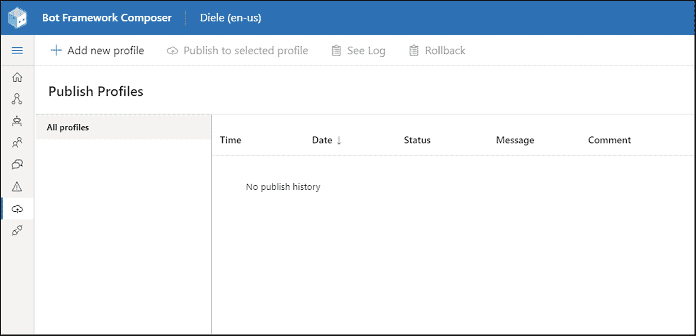

图 7.3 Composer 发布视图

因此，第一步是单击“+ 添加新配置文件”按钮来创建新的发布配置文件（见图 7.4）。然后，您需要将终端窗口中的命令输出粘贴到发布配置文本框中，并单击“保存”以相应地创建新的发布配置文件。

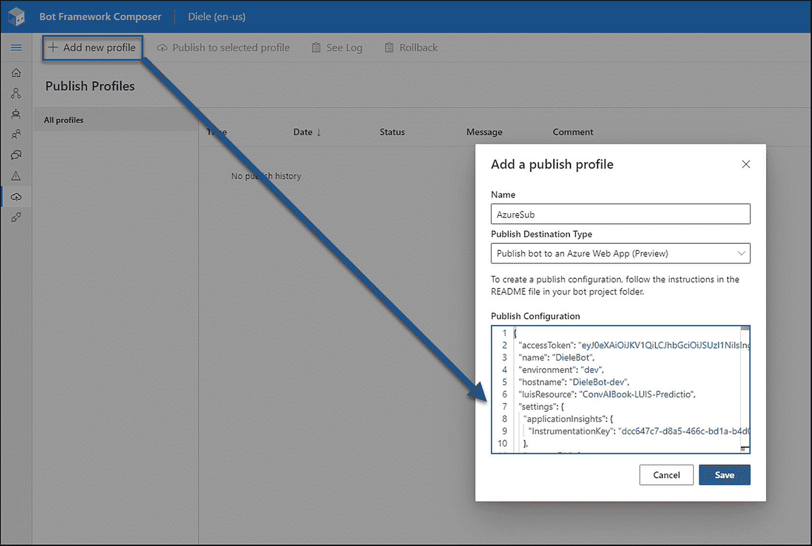

图 7.4 在 Composer 中添加新的发布配置文件

创建发布配置文件后，您可以通过在 Composer 中选择“在所选配置文件中发布”来启动发布过程。您还可以选择为此发布操作添加注释，该注释稍后会显示在操作旁边，如图 7.5 所示。

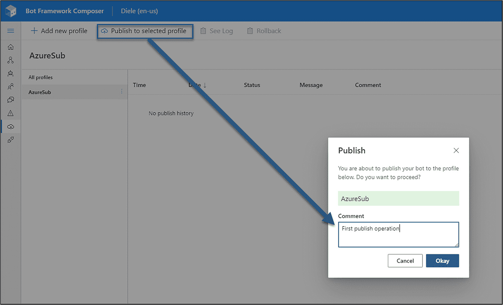

图 7.5 在所选配置文件中发布

发布过程成功完成后，您应该会在 Composer 发布视图中看到新创建的发布配置文件显示“成功”消息，如图 7.6 所示。这意味着 Composer 已成功将机器人代码发布到之前创建的 Azure Web 应用资源中。

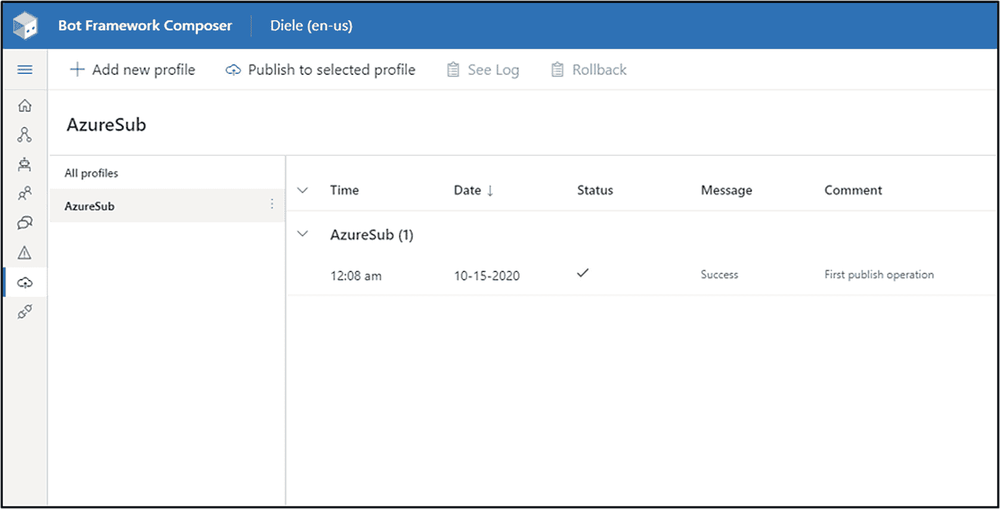

图 7.6 “机器人发布成功”视图

## 在 Azure 中测试机器人

现在机器人已成功发布到 Azure，您可以直接在 Azure 门户中对其进行测试，类似于使用模拟器的方法。要在 Azure 中测试机器人，请导航到本章第一部分创建的“机器人通道注册”服务。在此服务中，导航到“在 Web 聊天中测试”，这将在一个 Web 聊天场景中打开您的机器人，如图 7.7 所示。如果之前描述的发布过程已成功完成，您的机器人应该会以与使用模拟器聊天相同的方式向您打招呼。现在，您可以像使用模拟器一样在 Azure 中测试机器人与之通信。

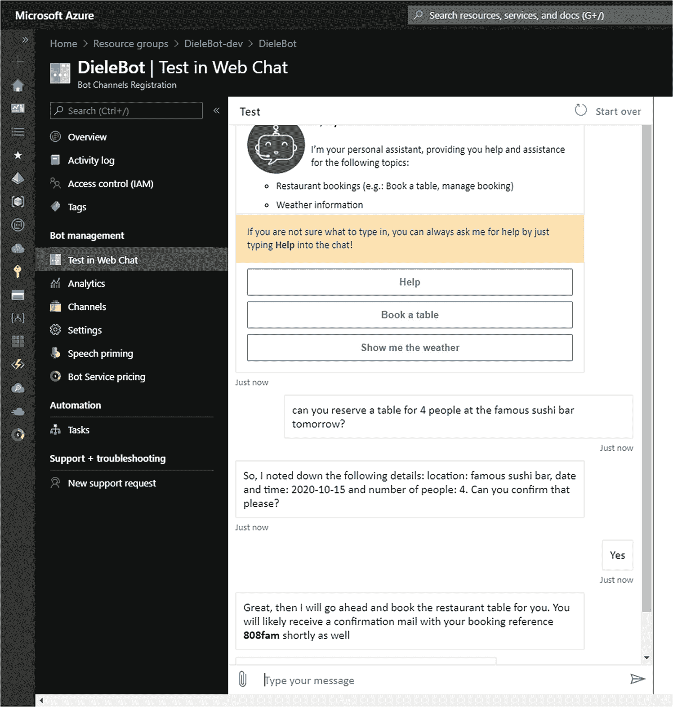

图 7.7 发布后在 Azure 中测试机器人

## 总结

在本章中，您学习了如何使用 Bot Framework Composer 发布聊天机器人。在本章的第一部分，您了解了创建成功在 Azure 中发布机器人所需的 Azure 资源。然后，我们探讨了如何使用 Composer 在 Azure 订阅中发布机器人，并直接通过 Azure 门户测试机器人。

下一章将介绍如何将已发布的机器人连接到一些 Azure Bot Service 通道，例如 Web 聊天或 Microsoft Teams，以便最终用户能够与机器人通信。

# 8. 将聊天机器人连接到通道

机器人开发生命周期中通常的最后一步是将聊天机器人连接到所需的通道。此过程允许您通过已启用机器人的通道启动与机器人的通信。正如前几章所述，您在开发机器人时就应该明确目标通道，因为并非所有通道的工作方式相同，也不支持相同的功能。例如，Microsoft Teams 能够处理丰富的附件（如自适应卡片），而 Twilio 通道则用于短信。由于短信无法显示富附件，因此您无法在此通道中使用自适应卡片。因此，您必须在开发周期的构建阶段就考虑目标通道，以避免后期出现较大的变更需求。

本章旨在简要描述支持的通道，并指出这些通道之间的一些差异。此外，还将详细描述将机器人连接到 Web 聊天通道和 Microsoft Teams 的过程。

## Azure Bot Service 支持的通道

如第 1 章和第 2 章所述，Azure Bot Service 本质上是以 Azure 服务实例形式提供的机器人托管平台。该服务的主要功能是允许机器人开发者将机器人连接到此处列出的支持通道（如有变更，恕不另行通知）：比较不同通道行为时出现的第一个差异是问候消息的处理方式。要了解哪些通道能够发送 `ConversationUpdate` 活动，请参阅表 8.1。

表 8.1 按通道划分的问候消息处理方式（Microsoft，2020）


|   | Cortana | 直连线路 | 直连线路（网页聊天） | 电子邮件 | Facebook | GroupMe | Kik | Teams | Slack | Skype | Telegram | Twilio |
|---|---|---|---|---|---|---|---|---|---|---|---|---|
| **ConversationUpdate** | 1 | 1 | 1 | 3 | 2 | 1 | 1 | 1 | 1 | 3 | 1 | 3 |
| **ContactRelationUpdate** | 3 | 3 | 3 | 3 | 3 | 3 | 3 | 3 | 3 | 1 | 3 | 3 |

- Alexa
- Cortana
- Office 365 电子邮件
- Microsoft Teams
- Skype
- Slack
- Twilio (短信)
- Facebook Messenger
- Kik Messenger
- GroupMe
- Workplace 版 Facebook
- LINE
- Telegram
- 网页聊天
- 直连线路
- Direct Line 语音
- 微信
- Webex

在比较不同渠道的行为时，第一个出现的区别是对欢迎消息的处理。为了了解哪些渠道能够发送 `ConversationUpdate` 活动，请参阅表格。

本章提及的表格键值含义如下：如您在表 8.1 中所见，Teams、Slack 和 Telegram 等部分渠道支持 `ConversationUpdate` 活动，这使您作为机器人开发者能够实现稳定的欢迎消息活动。连接到这些渠道的机器人能够在对话开始时主动向用户发送欢迎消息。然而，电子邮件和 Skype 等其他渠道无法处理这些事件，因此无法实现可靠的欢迎场景。

- 1 机器人应预期收到此活动。
- 2 目前尚不确定机器人是否能收到此活动。
- 3 机器人绝不应期望收到此活动。

如您在表中所示。

另一个展示渠道间差异的例子是，连接到不同渠道的机器人对 OAuth 的支持情况。虽然直连线路或 Microsoft Teams 等部分渠道支持 OAuth 登录，但电子邮件等其他渠道不支持此身份验证功能。在开发需要以任何形式对用户进行身份验证的机器人时，也应考虑到这一点（表 8.2）。

表 8.2 按渠道划分的 OAuth 支持情况（Microsoft，2020）

|   | Cortana | 直连线路 | 直连线路（网页聊天） | 电子邮件 | Facebook | GroupMe | Kik | Teams | Slack | Skype | Telegram | Twilio |
|---|---|---|---|---|---|---|---|---|---|---|---|---|
| **Event.TokenResponse** | 2 | 1 | 1 | 3 | 2 | 2 | 2 | 1 | 2 | 2 | 2 | 2 |

## 将聊天机器人连接到网页聊天

既然您已经知道哪些渠道支持哪些功能，是时候将您之前创建的机器人连接到 Azure 机器人服务提供的渠道了。您可以连接的第一个渠道是网页聊天渠道。该渠道本质上包含了前面描述的网页聊天控件，允许用户在网站或网页内与机器人通信。如图 8.1 所示，网页聊天渠道包含一个令牌，用于在网页聊天控件中显示的机器人与渠道之间建立经过身份验证的连接。

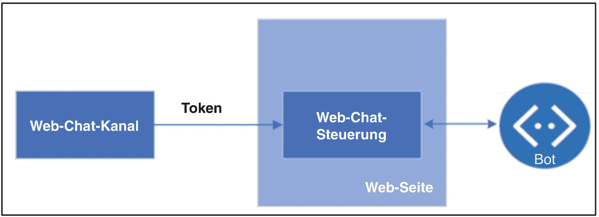

图 8.1 网页聊天渠道的参与组件（Microsoft，2019）

通常，您有两种方法可以使用网页聊天控件将机器人嵌入网页：第一种方法提供了更高的安全性，因为您的密钥不会在网页上暴露，您可以将密钥交换为令牌，然后自动生成网页聊天控件的嵌入代码。以下 HTML 代码片段展示了如何在不暴露密钥的情况下建立安全连接，因为密钥由 API 自动获取，因此不是代码的一部分：

```
const styleSet = window.WebChat.createStyleSet({
bubbleBackground: 'rgba(0, 0, 255, .1)',
bubbleFromUserBackground: 'rgba(0, 255, 0, .1)',
botAvatarImage: '',
botAvatarInitials: 'BF',
userAvatarImage: '',
userAvatarInitials: 'WC',
rootHeight: '100%',
rootWidth: '30%'
});
// 调用 API 获取令牌
const res = await fetch('https:', {
method: 'POST' });
const { token } = await res.json();
window.WebChat.renderWebChat(
{
directLine: window.WebChat.createDirectLine({ token }),
userID: 'WebChat_UserId',
locale: 'en-US',
username: '网页聊天用户',
locale: 'en-US',
styleSet
},
document.getElementById('webchat')
);
```

- 将您的密钥交换为令牌并生成嵌入代码。
- 通过直接使用密钥将网页聊天控件嵌入网站（请勿在生产环境中使用）。

第一种方法提供了更高的安全性，因为您的密钥不会在网页上暴露，您可以将密钥交换为令牌，然后自动生成网页聊天控件的嵌入代码。以下 HTML 代码片段展示了如何在不暴露密钥的情况下建立安全连接，因为密钥由 API 自动获取，因此不是代码的一部分：

在 Azure 中创建新机器人时，网页聊天渠道默认是启用的。因此，您可以使用上述 HTML 片段将机器人嵌入网页。您可以在 Azure 门户中机器人的“渠道”部分获取直连线路密钥，如图 8.2 所示。

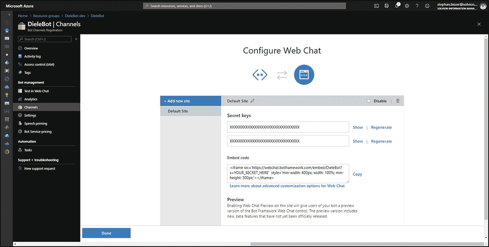

图 8.2 网页聊天渠道配置

将 HTML 片段嵌入网页后，聊天窗口可能如图 8.3 所示。然而，由于这仅仅是 HTML 和 CSS，您当然可以根据需要或公司的品牌指南自定义其外观。您还可以在页面一侧设置一个弹出式聊天窗口，允许用户在需要帮助时（例如）打开聊天窗口。

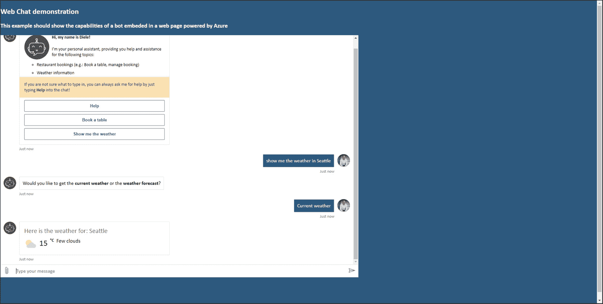

图 8.3 网页聊天实现示例

**注意：** 如果您需要有关自定义网页聊天控件的更多详细信息，请访问 [`docs.microsoft.com/en-us/azure/bot-service/bot-builder-webchat-customization`](https://docs.microsoft.com/en-us/azure/bot-service/bot-builder-webchat-customization)。

## 将聊天机器人连接到 Microsoft Teams

另一个可以连接机器人的流行渠道是 Microsoft Teams，因为它与 Microsoft 365 中的现代工作场所紧密集成。要将机器人连接到 Teams，您首先需要在 Azure 门户中启用 Teams 渠道，方法是单击 Microsoft Teams 图标，如图 8.4 所示。

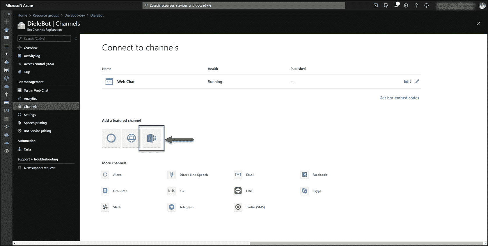

图 8.4 启用 Teams 渠道 01


在下一页中，您只需保存配置并接受条款，如图 8.5 所示。此步骤将为您的机器人激活 Teams 频道，并创建通过 Microsoft Teams 频道与机器人聊天的能力。

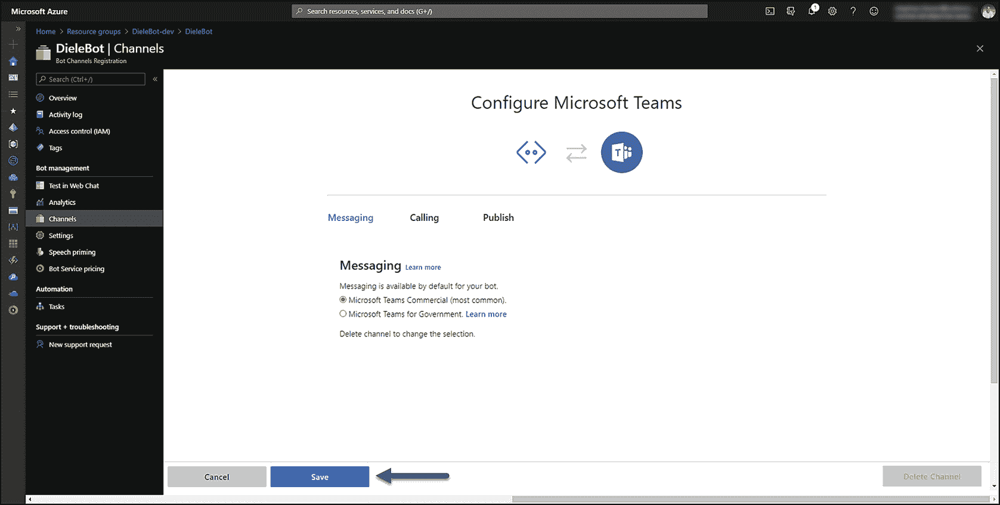

图 8.5 发布 Teams 频道 02

如果您想测试机器人是否在 Microsoft Teams 频道中响应，只需单击频道列表中的 Microsoft Teams 图标，如图 8.6 所示。这将打开 Microsoft Teams 的 Web 或桌面客户端，并自动在客户端中与机器人建立连接。如果一切设置正确，几秒钟后您应该会看到机器人向您发送的欢迎卡片。

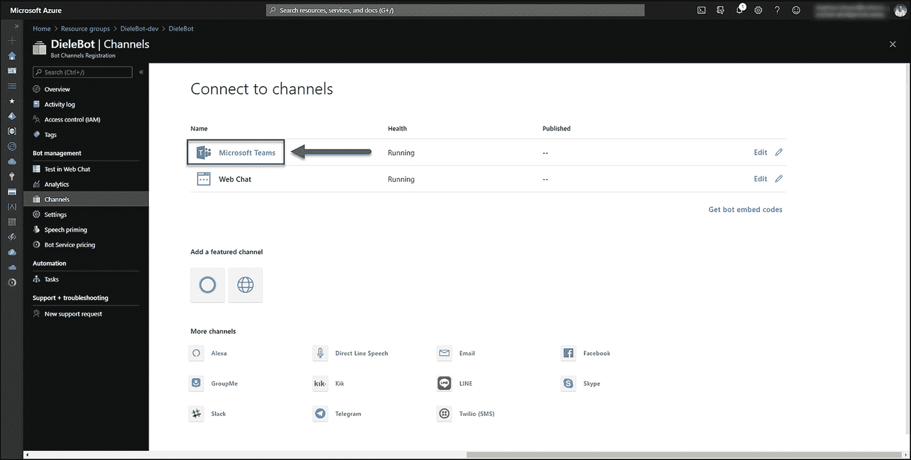

图 8.6 在 Teams 中测试机器人

然而，在生产场景中，您可能不会让所有需要通过 Teams 与机器人通信的人员都能访问 Azure 门户页面，也不会将机器人在 Teams 中的直接 URL 发送给他们。因此，您应该使用 Teams App Studio 创建一个新的 Microsoft Teams 应用程序，该应用程序由机器人组成。要创建这样一个 Teams 应用，请打开 Teams App Studio 并创建一个新应用。首先，您需要填写应用的基本信息，例如名称和开发者，并可选择添加应用图标，如图 8.7 所示。

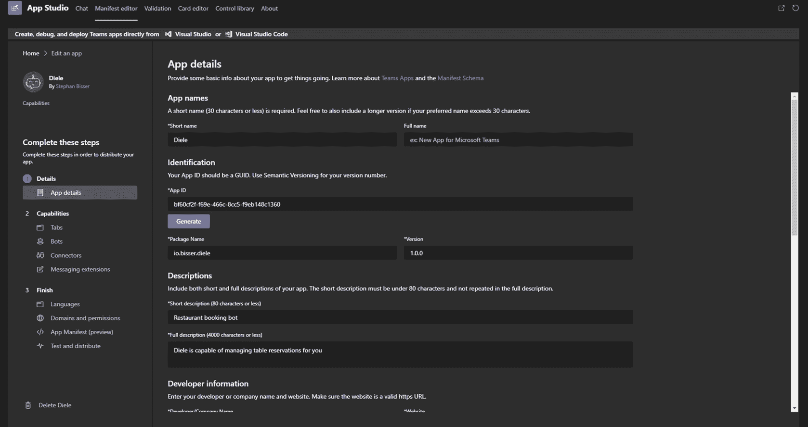

图 8.7 为机器人创建 Teams 应用 – 应用详细信息

**注意**

您的用户必须能够访问 Teams App Studio，该应用可能已被您组织的管理员锁定。

输入所需的应用详细信息后，您可以转到应用的“机器人”部分来相应地设置您的机器人，如图 8.8 所示。在此步骤中，您的应用将连接到 Azure 中托管的机器人，以便用户可以通过此应用与机器人通信。

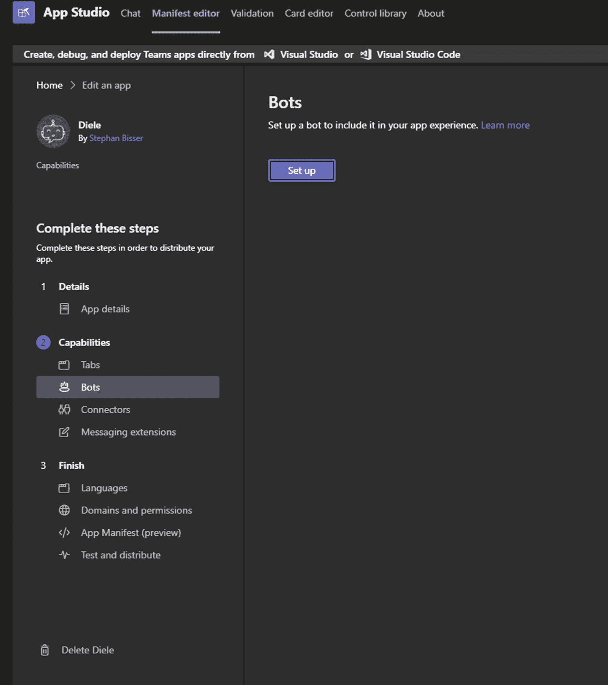

图 8.8 为机器人创建 Teams 应用 – 设置机器人 01

要在 Teams 应用中设置机器人，您需要获取机器人的 Microsoft 应用 ID，在 Teams App Studio 中称为“机器人 ID”。您可以在 Azure 门户中机器人的设置页面上找到此应用 ID，如图 8.9 所示。

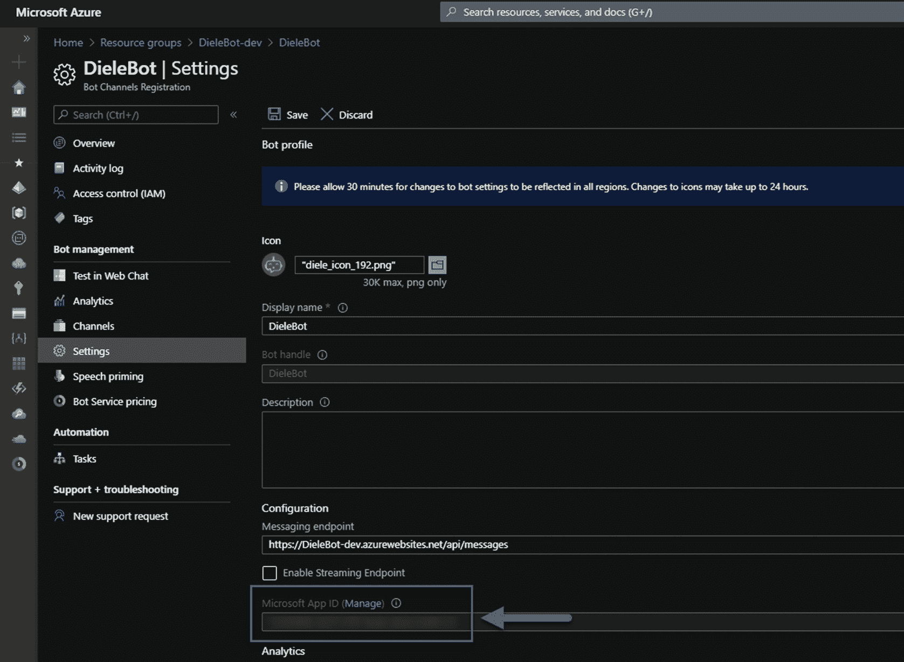

图 8.9 为机器人创建 Teams 应用 – Microsoft 应用 ID

要在 Teams 应用中设置机器人，您需要提供“机器人 ID”，即“Microsoft 应用 ID”。此外，您还需要选择机器人的作用域，可以是“个人”、“团队”和“群组”，以确定允许用户与机器人通信的场景。此外，您还可以启用对话中的文件上传和下载支持，或将机器人限制为纯通知机器人，如图 8.10 所示。

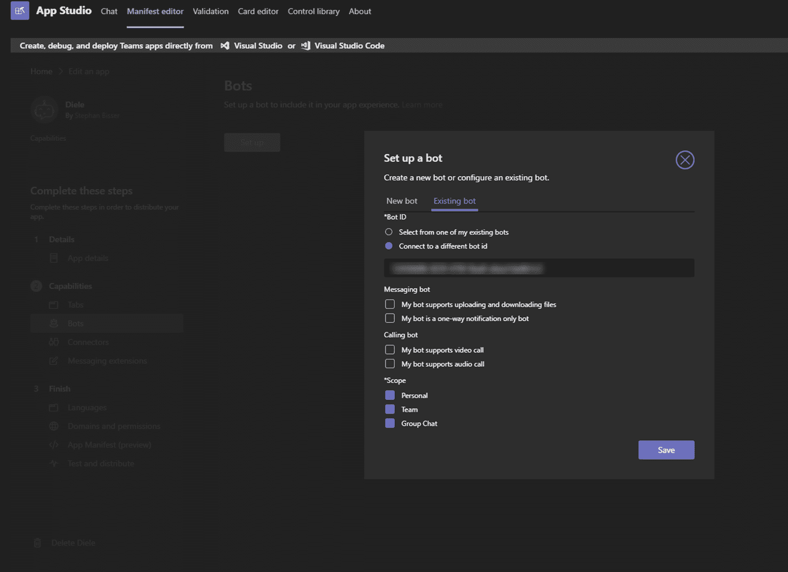

图 8.10 为机器人创建 Teams 应用 – 设置机器人 02

在 Teams 应用中正确设置机器人后，下一步将为您安装它，以查看它是否可以通过 Teams 与用户通信。为此，您需要转到“测试和分发”部分，然后选择“为我添加”，以将机器人作为应用安装到您的 Teams 客户端中，如图 8.11 所示。

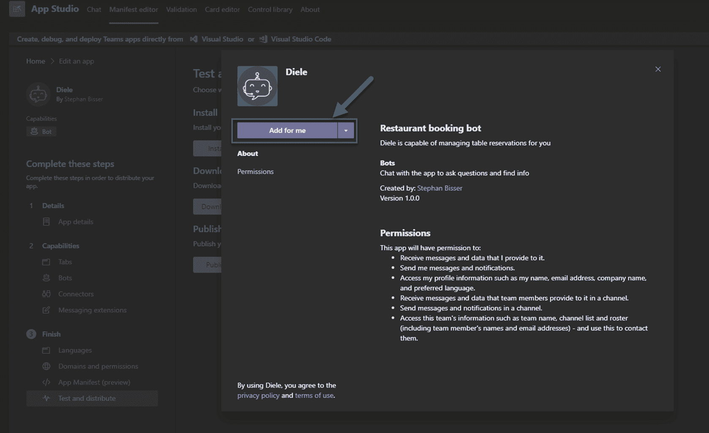

图 8.11 为机器人创建 Teams 应用 – 在 Teams 中安装机器人

安装机器人后，您会看到机器人的图标出现在 Microsoft Teams 客户端的左侧导航栏中。此外，在安装机器人几秒钟后，您应该会收到机器人的欢迎消息，如图 8.12 所示，其方式与使用 Web Chat 控件或 Bot Framework Emulator 建立与机器人的通信相同。

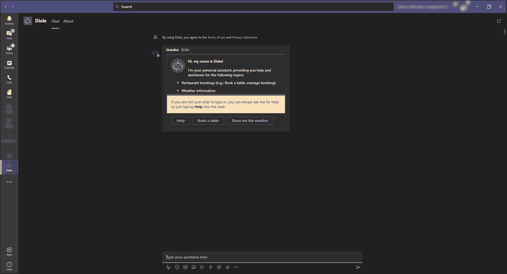

图 8.12 在 Teams 中测试机器人

现在，此 Microsoft Teams 应用可以上传到公共 Microsoft Teams 商店，以便任何人都可以使用您的机器人。如果您只希望组织内的人员在 Microsoft Teams 中使用您的机器人，则可以将 Teams 应用上传到您组织的应用商店，这样只有您组织的成员才能安装和使用您的机器人。

## 总结

在第 8 章中，我们介绍了 Azure Bot Service 支持的频道。特别是，我们比较了不同频道之间的特定功能，以了解哪些频道支持哪些重要功能。此外，您还学习了如何将机器人连接到 Web Chat 频道，以及如何将 Web Chat 控件安全地集成到网页中，而不会出现潜在的安全问题。我们还展示了如何自定义 Web Chat 控件并应用样式，以便将企业设计也融入对话中。本章的最后一部分引导您完成了为机器人激活 Microsoft Teams 频道的过程，以及创建和安装一个包含您机器人并准备在组织中分发的 Microsoft Teams 应用。
