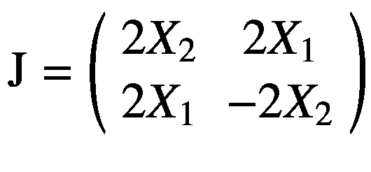

# 1\. 张量流 2

TensorFlow 是谷歌大脑团队制作的机器学习开源库。它最初于 2015 年向公众发布，并迅速成为最受欢迎的深度学习库之一。2019 年，谷歌发布了 TensorFlow 2，与 TensorFlow 1 有了实质性的背离。在本章中，我们将介绍 TensorFlow 2，解释它在经济学和金融学中的应用，然后回顾理解后面章节中的内容所必需的预备材料。如果您没有使用 TensorFlow 1，您可能希望跳过“TensorFlow 2 中的变化”部分。

## 安装 TensorFlow

为了使用 TensorFlow 2，您需要安装 Python。由于 2020 年 1 月 1 日起不再支持 Python 2，所以我推荐通过 Anaconda 安装 Python 3，它捆绑了 Python 7500+个数据科学常用模块: [`www.anaconda.com/distribution/`](http://www.anaconda.com/distribution/) 。一旦安装了 Anaconda，就可以在操作系统的命令行中配置虚拟环境。下面的代码将使用 Python 3.7.4 安装一个名为`tfecon`的 Anaconda 虚拟环境，这就是我们将在本书中使用的:

```py
conda create -n tfecon python==3.7.4

```

您可以使用以下命令激活环境:

```py
conda activate tfecon

```

在该环境中，您可以使用以下命令安装 TensorFlow:

```py
(tfecon) pip install tensorflow==2.3.0

```

当您想要停用虚拟环境时，可以使用以下命令:

```py
conda deactivate

```

我们将在整本书中使用 TensorFlow 2.3 和 Python 3.7.4。为了确保与示例兼容，您应该相应地配置您的虚拟环境。

## 张量流 2 的变化

TensorFlow 1 是围绕静态图形构建的。为了执行计算，首先需要定义一组张量和一系列操作。这形成了计算图，它在运行时是固定的。静态图为构建优化的产品代码提供了一个理想的环境，但也阻碍了实验，增加了调试的难度。

在清单 [1-1](#PC5) 中，我们提供了一个在 TensorFlow 1 中构造和执行静态计算图的例子。我们将考虑一种常见的情况，即我们希望使用一组回归变量(特征)，`X`，通过普通的最小二乘(OLS)回归来预测因变量，`Y`。这个问题的解决方案是系数向量，它使回归残差平方和最小。方程 1-1 给出了它的解析表达式。

*方程式 1-1。最小二乘问题的解法。*


```py
import tensorflow as tf

print(tf.__version__)
'1.15.2'

# Define the data as constants.
X = tf.constant([[1, 0], [1, 2]], tf.float32)
Y = tf.constant([[2], [4]], tf.float32)

# Matrix multiply X by X's transpose and invert.
beta_0 = tf.linalg.inv(tf.matmul(tf.transpose(X), X))

# Matrix multiply beta_0 by X's transpose.
beta_1 = tf.matmul(beta_0, tf.transpose(X))

# Matrix multiply beta_1 by Y.
beta = tf.matmul(beta_1, Y)

# Perform computation in context of session.
with tf.Session() as sess:
        sess.run(beta)
        print(beta.eval())

[[2.]
[1.]]

Listing 1-1Implement OLS in TensorFlow 1

```

TensorFlow 1 的语法很麻烦，这就是为什么我们将系数向量的计算分成多个步骤以保持可读性。此外，我们必须通过构建图来执行计算，然后在`tf.Session()`的上下文中执行它。我们还必须在一个会话中打印系数向量的元素。否则，打印`beta`将简单地返回对象的名称、形状和数据类型。

清单 [1-2](#PC6) 重复了相同的练习，但是针对 TensorFlow 2。

```py
import tensorflow as tf

print(tf.__version__)
'2.3.0

# Define the data as constants.
X = tf.constant([[1, 0], [1, 2]], tf.float32)
Y = tf.constant([[2], [4]], tf.float32)

# Matrix multiply X by X's transpose and invert.
beta_0 = tf.linalg.inv(tf.matmul(tf.transpose(X), X))

# Matrix multiply beta_0 by X's transpose.
beta_1 = tf.matmul(beta_0, tf.transpose(X))

# Matrix multiply beta_1 by Y.
beta = tf.matmul(beta_1, Y)

# Print coefficient vector.
print(beta.numpy())

[[2.]
[1.]]

Listing 1-2Implement OLS in TensorFlow 2

```

虽然从代码中看不出这一点，但 TensorFlow 2 使用了命令式编程，这意味着 Python 调用操作时会执行这些操作。例如，这意味着`beta_0`不是一个将在静态图中执行的操作，而是该计算的实际输出。我们可以通过在 TensorFlow 1 和 TensorFlow 2 代码中打印相同的对象来看到这一点，正如我们在清单 [1-3](#PC7) 和 [1-4](#PC8) 中所做的那样。

```py
# Print the feature matrix.
print(X)

tf.Tensor("Const_11:0", shape=(2, 2), dtype=float32)

# Print the coefficient vector.
print(beta)

tf.Tensor("MatMul_20:0", shape=(2, 1), dtype=float32)

Listing 1-3Print tensors in TensorFlow 1

```

在 TensorFlow 1(清单 [1-3](#PC7) )中，`X`是定义常数张量的运算，`beta`是执行矩阵乘法的运算。Printing 返回输出的操作类型、形状和数据类型。在 TensorFlow 2(清单 [1-4](#PC8) )中，打印`X`或`beta`将返回一个`tf.Tensor()`对象，该对象由包含在一个数组中的输出值及其形状和数据类型组成。为了检索 TensorFlow 1 中操作的输出值，我们必须在会话的上下文中应用`eval()`方法。

```py
# Print the feature matrix.
print(X)

tf.Tensor(
[[1\. 0.]
 [1\. 2.]], shape=(2, 2), dtype=float32)

# Print the coefficient vector.
print(beta.numpy())

[[2.]
 [1.]]

Listing 1-4Print tensors in TensorFlow 2

```

虽然 TensorFlow 1 最初是围绕静态图的构造和执行而构建的，但它后来引入了通过使用渴望执行来强制执行计算的可能性，这是在 2017 年 10 月发布的。 <sup>[1](#Fn1)</sup> TensorFlow 2 通过默认启用急切执行，在这条开发路径上走得更远。这就是为什么我们不需要在一个会话中执行计算。

转向急切执行的一个结果是 TensorFlow 2 不再默认构建静态计算图。在 TensorFlow 1 中，这样的图形可以很容易地从日志中获得，比如清单 [1-5](#PC9) 中生成的那些，然后使用 TensorBoard 可视化。图 [1-1](#Fig1) 显示了 OLS 问题的图表。节点代表操作，例如矩阵乘法和转置，以及`tf.Tensor()`对象的创建。图形的边表示在运算之间传递的张量的形状。

```py
# Export static graph to log file.
with tf.Session() as sess:
        tf.summary.FileWriter('/logs', sess.graph)

Listing 1-5Generate logs for a TensorBoard visualization in TensorFlow 1

```

TensorFlow 2 中的另一个变化是，您可能已经在清单 [1-1](#PC5) 和 [1-2](#PC6) 中注意到了，我们不再需要评估张量来公开它们的元素。我们可以通过应用`numpy()`方法来做到这一点，顾名思义，该方法提取一个`tf.Tensor()`对象的元素作为一个`numpy`数组。


图 1-1

张量板生成的 OLS 计算图

虽然 TensorFlow 2 在默认情况下不再使用静态图，但它确实为用户提供了通过使用`@tf.function`来构建静态图的选项。这个装饰器可以用来以一种与 TensorFlow 1 完全不同的方式将静态图合并到代码中。我们可以通过在函数之前加入`@tf.function`装饰器，将函数转换成静态图，而不是显式地构造一个图，然后使用`tf.Session()`来执行它。

使用`@tf.function`生成静态图形的主要优势是，函数将被编译，并且可能在 GPU 或 TPU 上运行得更快。此外，在@ `tf.function` decorator 下定义的函数中调用的任何函数也将被编译。清单 [1-6](#PC10) 给出了一个在 TensorFlow 2 中使用静态图的例子。这里，我们回到 OLS 的例子，定义一个函数，根据特征矩阵`X`和估计的系数向量`beta`进行预测。注意`ols_predict()`定义上方`@tf.function`的使用。

```py
# Define OLS predict function as static graph.
@tf.function
def ols_predict(X, beta):
        y_hat = tf.matmul(X, beta)
        return y_hat

# Predict Y using X and beta.
predictions = ols_predict(X, beta)

Listing 1-6Generate OLS predictions with static graphs in TensorFlow 2

```

除了我们到目前为止提到的，TensorFlow 2 还引入了大量的名称空间变化。这是为了清理 TensorFlow 1，它有许多冗余的端点。TensorFlow 2 还消除了`tf.contrib()`名称空间，该名称空间用于容纳 TensorFlow 1 中尚不完全支持的杂项操作。在 TensorFlow 2 中，这段代码现在被重新定位到各种相关的名称空间中，更容易找到。 <sup>[2](#Fn2)</sup>

最后，TensorFlow 2 围绕许多高级 API 进行了重新定位。特别是，更多的重点放在 Keras 和估计 API。Keras 简化了神经网络模型的构建和训练。和估计器提供了一组有限的模型，这些模型可以用一小组参数来定义，然后部署到任何环境中。特别是，估算器模型可以在多服务器设置中，以及在 TPU 和 GPU 上进行训练，而无需修改代码。

在清单 [1-7](#PC11) 中，我们展示了在 Keras 中定义和训练 OLS 模型的过程。我们使用估算器库在清单 [1-8](#PC12) 中做同样的事情。请注意，Keras 和估计器都需要较少的代码行来定义和训练 OLS 模型。然而，与清单 [1-2](#PC6) 中给出的低级张量流示例相反，他们通过最小化数字误差平方和来求解模型，而不是利用其解析解。

```py
# Define sequential model.
ols = tf.keras.Sequential()

# Add dense layer with linear activation.
ols.add(tf.keras.layers.Dense(1, input_shape = (2,),
        use_bias = False, activation = 'linear'))

# Set optimizer and loss.
ols.compile(optimizer = 'SGD', loss = 'mse')

# Train model for 500 epochs.
ols.fit(X, Y, epochs = 500)

# Print parameter estimates.
print(ols.weights[0].numpy())

[[1.9754077]
 [1.0151987]]

Listing 1-7Solve an OLS model with tf.keras()

```

使用 Keras 方法，我们首先使用`tf.keras.Sequential()`定义了一个序列神经网络模型。顺序模型可用于通过以下方式建立和训练神经网络:( 1)将层依次堆叠在彼此之上；(2)通过指定选项来编译模型，例如优化器、损失和学习率；(3)应用`fit()`方法。请注意，该模型由具有线性激活的单个密集层组成，因为我们正在执行线性回归。此外，`use_bias`被设置为`False`，因为`X`的第一列是一个向量，我们用它来估计常数(偏差)项。我们在编译模型时使用了均方误差损失，因为我们使用的是普通的最小二乘法，它可以使误差平方和最小化。最后，我们将`epochs`——我们跳过整个样本的次数——设置为 500。一旦模型被训练，我们就可以打印参数估计值，这些参数估计值在`ols.weights`属性中以列表的形式提供。在这种情况下，列表包含一个对象，模型参数，我们将使用`numpy()`方法恢复它。

```py
# Define feature columns.
features = [
tf.feature_column.numeric_column("constant"),
tf.feature_column.numeric_column("x1")
]

# Define model.
ols = tf.estimator.LinearRegressor(features)

# Define function to feed data to model.
def train_input_fn():
        features = {"constant": [1, 1], "x1": [0, 2]}
        target = [2, 4]
        return features, target

# Train OLS model.
ols.train(train_input_fn, steps = 100)

Listing 1-8Solve an OLS model with tf.estimator()

```

使用估计器方法，我们首先定义特性列，以及它们的名称和类型。在清单 [1-8](#PC12) 给出的例子中，我们有两个特征，其中之一是常数项(或者机器学习中的“偏差”)。然后，我们通过将特性列从`tf.estimator`传递到`LinearRegressor()`模型来定义模型。最后，我们定义了一个向模型提供数据的函数，然后应用了`train()`方法，将`train_input_fn`指定为第一个参数，将时期数指定为第二个参数。

为了用`tf.estimator`进行预测，我们可以使用我们定义的模型`ols`的`predict()`方法。与训练例程类似，我们需要定义一个生成输入数据集的函数，我们称之为`test_input_fn()`，如清单 [1-9](#PC13) 所示。将它传递给`ols.predict()`将产生一个用于模型预测的生成器函数。然后我们可以使用 list comprehension 收集所有的预测，使用`next()`遍历所有的生成器输出。

```py
# Define feature columns.
def test_input_fn():
        features = {"constant": [1, 1], "x1": [3, 5]}
        return features

# Define prediction generator.
predict_gen = ols.predict(input_fn=test_input_fn)

# Generate predictions.
predictions = [next(predict_gen) for j in range(2)]

# Print predictions.
print(predictions)

[{'predictions': array([5.0000067], dtype=float32)},
 {'predictions': array([7.000059], dtype=float32)}]

Listing 1-9Make predictions with an OLS model with tf.estimator()

```

## 经济和金融张量流

如果你不熟悉机器学习，你可能想知道为什么通过使用 TensorFlow 来学习它是有意义的。用现在提供机器学习工具箱的 MATLAB 不是更简单吗？一些监督学习方法不能使用 Stata 或 SAS 来执行吗？TensorFlow 不是以具有挑战性而闻名吗，即使是在机器学习框架中？我们将在这一部分探讨这些问题，并讨论张量流和机器学习能为经济学家提供什么。

我们将从学习 TensorFlow 的论点开始，而不是使用更熟悉的工具或其他机器学习框架。使用 TensorFlow 的一个好处是，它是一个开源库，可以用 Python 编写，由 Google 维护。这意味着没有许可成本，它受益于庞大的 Python 开发人员社区，并且它可能会得到良好的维护，因为它是机器学习领域商业领导者之一的首选工具。使用 TensorFlow 的另一个好处是，自发布以来，它一直是最受欢迎的机器学习框架之一。

图 [1-2](#Fig2) 显示了九个最受欢迎的机器学习框架获得的 GitHub 星级数。该图表明 TensorFlow 的受欢迎程度大约是第二大受欢迎框架的四倍。总的来说，这将使您更容易为您的项目找到用户创建的库、代码示例和预训练的模型。最后，虽然 TensorFlow 1 相对于其他机器学习框架具有挑战性，但 TensorFlow 2 要简单得多。大部分挑战来自 TensorFlow 提供的灵活性，这将提供相对于更有限的框架的实质性优势。

TensorFlow 在经济和金融应用中至少有两种使用方式。第一个与机器学习有关，机器学习刚刚开始在经济和金融领域获得广泛应用。TensorFlow 非常适合这种应用，因为它是一个机器学习框架。TensorFlow 的第二种用途是求解理论经济和金融模型。相对于其他机器学习库，TensorFlow 的优势在于允许使用高级和低级 API。低级 API 可用于构建和求解任何任意的经济或金融模型。在本节的剩余部分，我们将提供这两个用例的概述。


图 1-2

GitHub stars by machine learning framework(2015–2019)。来源:GitHub 和 Perrault 等人(2019 年)

### 机器学习

经济学家最初抵制采用机器学习的方法，但后来开始接受它们。这种不情愿的部分原因是计量经济学和机器学习的方向不同。计量经济学以简约的线性模型中的因果推理为中心，而机器学习则以使用具有许多参数的非线性模型进行预测为中心。

然而，经济学和机器学习之间存在某种程度的重叠。例如，经济和金融预测与机器学习有着相同的目标:准确的样本外预测。此外，计量经济学中常用的许多线性模型也用于机器学习。然而，机器学习在经济学中有更大的应用潜力，我们将在第 [2](02.html) 章详细讨论。

当涉及到机器学习在经济学中的应用时，TensorFlow 具体提供了什么？TensorFlow 至少有五个优点可能对经济和金融应用有益:(1)灵活性，(2)分布式培训，(3)生产质量，(4)高质量的文档，以及(5)扩展。

#### 灵活性

正如我们将在第 [2](02.html) 章中详细讨论的，经济学中机器学习的许多应用不允许使用现成的例程(Athey，2019)。因此，熟悉允许灵活性的机器学习框架将是有用的。当然，这是有代价的。对于许多现成的应用程序，更简单和更严格的框架，如`sklearn`或`keras`，通常会允许更快和更不容易出错的开发。然而，对于将因果推理与机器学习相结合或需要非标准模型架构的工作，除了在灵活的机器学习框架中开发之外，将没有其他选择。TensorFlow 特别适合这项任务，因为它允许混合使用高级和低级 API 进行开发。例如，我们可以使用`tensorflow`构建一个算法，该算法将深度神经网络(DNN)嵌入到经济计量估计例程中，其中使用`tensorflow`中的高级`keras` API 处理 DNN，使用低级`tensorflow`操作构建外部算法。

#### 分布式培训

经济学中的许多机器学习应用不需要使用分布式训练过程。例如，CPU 训练对于具有几百个回归量和几万个观察值的惩罚线性回归模型来说通常是足够的。但是，如果您想要微调 ResNet 模型，以便从船舶交通的卫星图像中预测贸易流量，您将需要利用分布式培训。TensorFlow 2 自动检测图形处理单元(GPU)和张量处理单元(TPU)，并可以在训练过程中使用它们。清单 [1-10](#PC14) 提供了一个过程示例，通过该示例，我们可以列出所有可用的设备，并选择一个设备(如 GPU 或 CPU)用于培训。

在某些情况下，您可能希望将计算分布在一个设备的两个内核上，如 GPU 或 TPU，以及多个设备上。例如，您可能可以访问一个带有两个 GPU 的工作站。如果您没有使用 TensorFlow 或其他为分布式计算提供功能的框架，您将无法有效地利用这两个 GPU。或者，您可能希望将计算分布在云中的多个 GPU 上，以避开内存瓶颈。或者，如果您从事工业，您可能有一个应用程序，该应用程序必须使用大型模型实时执行分类，并将信息返回给用户。同样，在多个 GPU 或 TPU 上的分布式计算可能是实现这一点同时保持低延迟的唯一选择。

TensorFlow 通过`tf.distribute.Strategy()`为多设备分布式计算提供接口。TensorFlow 的方法的优点是简单，无需修改就能很好地执行。您可以简单地指定将要使用的设备和分配策略，而不必决定如何将计算分配到底层细节。TensorFlow 支持同步策略和异步策略，同步策略可在设备间保持相同的参数值和梯度，异步策略可在单个设备上进行本地更新。

```py
import tensorflow as tf

# Print list of devices.
devices = tf.config.list_physical_devices()
print(devices)

[PhysicalDevice(name='physical:device:CPU_0',
Device_type='CPU'),
PhysicalDevice(name='physical_device:XLA_CPU:0',
Device_type='XLA_CPU'),
PhysicalDevice(name='physical_device:XLA_GPU:0',
Device_type='XLA_GPU'),
PhysicalDevice(name='physical_device:GPU:0',
Device_type='GPU')

# Set device to CPU.
tf.config.experimental.set_visible_devices(
        devices[0], 'CPU')

# Change device to GPU.
tf.config.experimental.set_visible_devices(
        devices[3], 'GPU')

Listing 1-10List all available devices, select CPU, and then switch to GPU

```

#### 生产质量

对于在工业中工作并使用机器学习来创造产品或提供服务的经济学家来说，代码最终从“实验”或“开发”阶段进入生产质量是至关重要的。这降低了最终用户遇到错误或稳定性问题的可能性。TensorFlow 的另一个优势是，它提供了生产和提供生产质量代码的功能。

对于生产质量代码的创建，TensorFlow 提供了高级评估者 API。例如，这可以用于在实施最佳实践并删除开发过程中容易出错的部分的环境中训练神经网络。Estimators API 允许开发人员既可以利用预先制作的模型，其中模型架构可以用少量参数完全指定，也可以开发自己的模型。

除了用于开发模型的 Estimators API 之外，TensorFlow Serving 还可用于为最终用户开发和部署生产质量的应用程序。例如，使用 TensorFlow 服务，我们可以允许用户以数据、文本或图像的形式提交查询，然后输入到模型中，为用户生成分类或预测。

#### 高质量的文档

TensorFlow 1 最初有不透明和不完整的文档，这是它让新来者望而生畏的部分原因。对于经常使用记录良好的计量经济学和计算商业软件(如 MATLAB、Stata 和 SAS)的经济学家来说尤其如此。然而，当谷歌开始研究 TensorFlow 2 时，这种情况发生了变化。从那以后，它已经过渡到高质量和详细的文档，这现在是它作为机器学习框架的主要资产之一。

TensorFlow 文档的一个优势是，它经常与谷歌合作实验室(Colab)笔记本配对使用。如果你对 Google Colab 不熟悉，它是托管 Jupyter 笔记本的免费服务。它还允许用户免费使用 GPU 和 TPU 在谷歌的服务器上执行笔记本。将文档与 Colab 笔记本配对使用户能够立即启动一个最小的代码示例，如果需要可以修改它，并在最先进的硬件上执行它。

#### 扩展ˌ扩张

将 TensorFlow 用于机器学习的经济和金融应用的另一个优势是，它有许多扩展。在接下来的小节中，我们将只强调四个这样的扩展，但是还有其他几个扩展可能会引起经济学家的兴趣。

##### TensorFlow Hub

位于 [`https://tfhub.dev/`](https://tfhub.dev/) 的 TensorFlow Hub 提供了一个可搜索的预训练模型库，可将其导入 TensorFlow，然后按原样用于分类和回归任务，或针对相关任务进行微调。例如，您可以使用 TensorFlow Hub 导入在 ImageNet 数据集上训练的 EfficientNet 模型，删除分类头，然后训练模型使用替代数据集执行不同的分类任务。

##### 张量流概率

TensorFlow probability 专为统计学家和机器学习研究人员设计，提供了一组扩展的概率分布和工具，用于开发概率模型，包括神经网络模型中的概率层。它还支持变分推理、马尔可夫链蒙特卡罗(MCMC)和计量经济学中常用的一组扩展的优化器，如 BFGS。对于希望用机器学习模型进行因果推断的学院派经济学家来说，张量流概率将是不可或缺的工具。

##### 张量流联邦

在某些情况下，训练模型所需的数据将是分散的，这使得用标准方法完成任务变得不可行。对于学术界和公共部门的经济学家来说，当法律或隐私问题阻止数据共享时，这个问题经常出现。对于行业经济学家来说，当数据分布在移动电话等用户设备上，但无法集中时，可能会出现这种情况。在前面的所有案例中，联邦学习提供了在不集中数据的情况下训练模型的可能性。这可以使用 TensorFlow 联邦扩展来完成。

##### TensorFlow Lite

从事工业的经济学家通常使用多个 GPU 或 TPU 来训练模型，只是为了将它们部署到具有严重计算资源限制的环境中。TensorFlow Lite 可以在这种情况下使用，以避免资源限制并提高性能。它的工作原理是将 TensorFlow 模型转换为另一种格式，压缩权重，然后输出一个. tflite 文件，该文件可以部署到移动环境中。

### 理论模型

虽然 TensorFlow 主要是为构建和解决深度学习模型而设计的，但它提供了各种各样的计算工具，可用于解决任何任意模型。这与较窄的机器学习框架不同，后者不够灵活，无法在定义明确的家族之外构建模型。

特别是 TensorFlow 可以用来求解经济学和金融学中的理论模型。这可以通过(1)定义表示模型的计算图和(2)定义相关的损失函数来完成。然后，我们可以在 TensorFlow 中应用标准优化程序，如随机梯度下降(SGD ),以最小化损失函数。

TensorFlow 最先进的自动微分库，以及执行并行和分布式计算的便利性，使其成为解决经济和金融理论模型的现有软件的强大替代品。我们将在第 [10 章](10.html)中详细讨论这个问题。

## 张量介绍

TensorFlow 主要是为了用神经网络执行深度学习而设计的。由于神经网络由张量在张量上执行的操作组成，TensorFlow 是这个名称的自然选择。

虽然张量在某些上下文中有特定的数学定义，如物理，但我们将采用与机器学习最相关的定义，摘自*深度学习*(古德费勒、本吉奥和库维尔，2016 年):

> 在一般情况下，排列在具有可变轴数的规则网格上的数字阵列被称为张量。

实际上，我们经常用张量的秩和形状来描述张量。索引为*k*的矩形阵列被称为秩为- *k* 。你也可以看到这样一个数组，它被描述为具有顺序或维度 *k* 。张量的形状是由它的每个维度的长度决定的。

例如，考虑我们在清单 [1-2](#PC6) 中描述的 OLS 问题，其中我们使用了三个张量: *X* 、 *Y* 和 *β* 。它们分别是特征矩阵、目标向量和系数向量。在一个具有 *m* 特征和 *n* 观测值的回归问题中， *X* 是形状为 *(n，m)* 的秩 2 张量，Y 是形状为 *n* 的秩 1 张量， *β* 是形状为 *m* 的秩 1 张量。

更一般地，秩 0 张量是标量，秩 1 张量是向量，秩 2 张量是矩阵。我们将秩为- *k* 的张量称为 k-张量，其中 *k* ≥ 3。图 [1-3](#Fig3) 显示了一批具有三个颜色通道的图像的定义。

在图 [1-3](#Fig3) 的左上方，我们有来自蓝色通道的单个像素，它将由单个整数表示。这是一个标量或秩为 0 的张量。在右边，我们有一个像素集合，它构成了图像绿色通道的边界。这些构成了秩 1 张量或向量。如果我们把整个红色通道本身，这是一个矩阵或秩 2 张量。此外，如果我们组合三个颜色通道，这形成了一个彩色图像，这是一个 3-张量；如果我们将多个图像堆叠成一个训练批次，我们会得到一个 4 张量。

值得强调的是，张量的定义通常假定为矩形。也就是说，如果我们正在处理一批图像，每个图像都应该具有相同的长度、宽度和颜色通道数。如果每个图像都有不同的形状，我们如何指定批量张量的形状就不明显了。此外，许多机器学习框架将无法以充分利用 GPU 或 TPU 的并行化能力的方式处理非矩形张量。


图 1-3

将一批彩色图像分解成张量

对于我们在本书中考虑的大多数问题，数据要么自然地是矩形的，要么可以在性能没有实质性损失的情况下被重新整形为矩形。然而，在有些情况下它不能。幸运的是，TensorFlow 提供了一种称为“粗糙张量”的数据结构，可以作为`tf.ragged`使用，它与 100 多种 TensorFlow 操作兼容。还有新一代的卷积神经网络(CNN ),它利用掩蔽，这是一种识别图像重要部分的过程，允许使用可变的输入形状图像。

## TensorFlow 中的线性代数与微积分

与计量经济学例程类似，机器学习算法广泛使用线性代数和微积分。然而，在标准的机器学习框架中，这其中的大部分仍然对用户隐藏。相反，TensorFlow 允许用户从高级和低级 API 构建模型。例如，使用低级 API，他们可以构建非线性最小二乘估计例程或算法，在线性代数和微积分运算级别训练神经网络。在本节中，我们将讨论如何使用 TensorFlow 执行线性代数和微积分中的常见运算。然而，在我们这样做之前，我们将首先讨论 TensorFlow 中的常数和变量，它们是描述线性代数和微积分运算的基础。

### 常量和变量

TensorFlow 将张量对象分为常量和变量。术语“常量”和“变量”的含义与编程中的标准用法一致。也就是说，常数是固定的，而变量可能会随时间而变化。为了说明这一点，我们回到清单 [1-11](#PC15) 中的 OLS 例子。我们不需要解析地解决这个问题，而是简单地计算一个剩余项，它可以用来构造一个损失函数。

特征矩阵`X`和目标`Y`被定义为常数张量，因为它们不会随着模型的训练而改变。参数向量`beta`被定义为使用`tf.Variable()`的变量，因为它将被优化算法改变以试图最小化残差的变换。 <sup>[3](#Fn3)</sup>

```py
import tensorflow as tf

# Define the data as constants.
X = tf.constant([[1, 0], [1, 2]], tf.float32)
Y = tf.constant([[2], [4]], tf.float32)

# Initialize beta.
beta = tf.Variable([[0.01],[0.01]], tf.float32)

# Compute the residual.
residuals = Y - tf.matmul(X, beta)

Listing 1-11Define constants and variables for OLS

```

一般来说，我们将对输入数据和模型产生的中间数据(如残差)使用常数张量。我们还将使用常数张量来捕捉模型超参数。例如，对于神经网络和惩罚回归模型，我们将在训练过程之外选择正则化参数，并使用`tf.constant()`来定义它们。

一般来说，我们会使用`tf.Variable()`来初始化可训练模型参数。例如，这包括神经网络中的权重、线性回归的系数向量，或者使用参数矩阵进行线性变换的模型中的中间步骤。

### 线性代数

由于 TensorFlow 以深度学习模型为中心——利用张量输入，产生张量输出，并应用线性变换——它的设计具有相当大的能力来执行线性代数计算，并将这些计算分布在 GPU 和 TPU 上。在本节中，我们将讨论如何使用 TensorFlow 执行线性代数中的常见运算。

#### 标量加法和乘法

虽然标量可以被认为是秩为 0 的张量，并在 TensorFlow 中被定义为张量对象，但我们通常会将它们用于与向量、矩阵和 k-张量不同的目的。此外，可以在向量和矩阵上执行的某些操作不能在标量上执行。

在清单 [1-12](#PC16) 中，我们研究了如何在 TensorFlow 中执行标量加法和乘法。我们将使用两个标量`s1`和`s2`来做这件事，我们将使用`tf.constant()`来定义它们。如果我们想让这些标量成为模型中的可训练参数，我们可以使用`tf.Variable()`。注意，我们首先使用`tf.add()`执行加法，使用`tf.multiply()`执行乘法。然后我们利用操作符重载，使用`+`和`*`执行相同的操作。最后，我们打印我们计算的总和和乘积。注意，两者都是类型为`float32`的`tf.Tensor()`对象，因为我们将每个常量定义为一个`tf.float32`。

#### 张量加法

我们接下来检查张量加法，因为它只有一种形式，并推广到 k-张量。对于 0-张量(标量),我们看到可以应用`tf.add()`操作，它将作为参数的两个标量相加。如果我们将此扩展到秩为 1 的张量(向量)，加法就像等式 1-2 一样工作:也就是说，我们对每个向量中的相应元素求和。

*方程式 1-2。*矢量加法的例子*。*

![$$ \left[\begin{array}{c}{a}_0\\ {}{a}_1\\ {}{a}_2\end{array}\right]+\left[\begin{array}{c}{b}_0\\ {}{b}_1\\ {}{b}_2\end{array}\right]=\left[\begin{array}{c}{a}_0+{b}_0\\ {}{a}_1+{b}_1\\ {}{a}_2+{b}_2\end{array}\right] $$](img/496662_1_En_1_Chapter_TeX_Equb.png)

```py
import tensorflow as tf

# Define two scalars as constants.
s1 = tf.constant(5, tf.float32)
s2 = tf.constant(15, tf.float32)

# Add and multiply using tf.add() and tf.multiply().
s1s2_sum = tf.add(s1, s2)
s1s2_product = tf.multiply(s1, s2)

# Add and multiply using operator overloading.
s1s2_sum = s1+s2
s1s2_product = s1*s2

# Print sum.
print(s1s2_sum)

tf.Tensor(20.0, shape=(), dtype=float32)

# Print product.
print(s1s2_product)

tf.Tensor(75.0, shape=(), dtype=float32)

Listing 1-12Perform scalar addition and multiplication in TensorFlow

```

此外，我们可以将其扩展到秩为 2 的张量(矩阵)，如等式 1-3 所示，以及秩为 k 的张量，其中 *k* > 2。在所有情况下，操作都以相同的方式执行:对两个张量中相同位置的元素求和。

*方程式 1-3。矩阵加法*的例子*。*

![$$ \left[\begin{array}{ccc}{a}_{00}&amp; \cdots &amp; {a}_{0n}\\ {}\vdots &amp; \ddots &amp; \vdots \\ {}{a}_{m0}&amp; \cdots &amp; {a}_{mn}\end{array}\right]+\left[\begin{array}{ccc}{b}_{00}&amp; \cdots &amp; {b}_{0n}\\ {}\vdots &amp; \ddots &amp; \vdots \\ {}{b}_{m0}&amp; \cdots &amp; {b}_{mn}\end{array}\right]=\kern0.5em \left[\begin{array}{ccc}{a}_{00}+{b}_{00}&amp; \cdots &amp; {a}_{0n}+{b}_{0n}\\ {}\vdots &amp; \ddots &amp; \vdots \\ {}{a}_{m0}+{b}_{m0}&amp; \cdots &amp; {a}_{mn}+{b}_{mn}\end{array}\right] $$](img/496662_1_En_1_Chapter_TeX_Equc.png)

请注意，张量加法只能使用两个相同形状的张量来执行。 <sup>[4](#Fn4)</sup> 两个形状不同的张量不会总是在相同的位置定义两个元素。此外，注意张量加法一般满足交换律和结合律。<sup>T55</sup>

在清单 [1-13](#PC17) 中，我们演示了如何对秩为 4 的张量执行张量加法。我们将使用两个四维张量，`images`和`transform`，它们已经作为`numpy`数组导入。`images`张量是一批 32 色图像，`transform`张量是加法变换。

我们首先打印出`images`和`transform`的形状，检查它们是否相同，这是张量加法所需要的。我们可以看到，这两个对象的形状都是(32，64，64，3)。也就是说，它们由一批 32 个图像组成，这些图像为 64x64，具有三个颜色通道。接下来，我们使用`tf.constant()`将两个`numpy`数组转换成张量流常量对象。然后我们分别使用`tf.add()`和重载的`+`操作符来应用加法变换。请注意，`+`操作符将在 TensorFlow 中执行计算，因为我们将两个张量都转换为 TensorFlow 中的常量对象。

```py
import tensorflow as tf

# Print the shapes of the two tensors.
print(images.shape)
(32, 64, 64, 3)
print(transform.shape)
(32, 64, 64, 3)

# Convert numpy arrays into tensorflow constants.
images = tf.constant(images, tf.float32)
transform = tf.constant(transform, tf.float32)

# Perform tensor addition with tf.add().
images = tf.add(images, transform)

# Perform tensor addition with operator overloading.
images = images+transform

Listing 1-13Perform tensor addition in TensorFlow

```

#### 张量乘法

与张量加法相反，我们只考虑在两个相同形状的张量上执行的元素运算，我们将考虑三种不同类型的张量乘法:

*   逐元素乘法

*   点积

*   矩阵乘法

##### 逐元素乘法

与张量加法一样，元素乘法仅针对具有相同维数的张量定义。例如，如果我们有两个秩为 3 的张量 A 和 B，每个都有索引 I、J 和 R，其中 *i* ∈ {1、…、 *I* }、 *j* ∈ {1、…、 *J* }、和 *r* ∈ {1、…、 *R* }，那么它们的元素乘积就是张量 C，其中每个元素 C 【T

*方程式 1-4。初等张量乘法。*


等式 1-5 提供了两个矩阵的初等张量乘法的例子。请注意,⊙表示元素级乘法。

*方程式 1-5。初等张量乘法。*

![$$ \left[\begin{array}{cc}{a}_{00}&amp; {a}_{01}\\ {}{a}_{10}&amp; {a}_{11}\end{array}\right]\odot \left[\begin{array}{cc}{b}_{00}&amp; {b}_{01}\\ {}{b}_{10}&amp; {b}_{11}\end{array}\right]=\left[\begin{array}{cc}{a}_{00}\ast {b}_{00}&amp; {a}_{01}\ast {b}_{01}\\ {}{a}_{10}\ast {b}_{10}&amp; {a}_{11}\ast {b}_{11}\end{array}\right]=\left[\begin{array}{cc}{c}_{00}&amp; {c}_{01}\\ {}{c}_{10}&amp; {c}_{11}\end{array}\right] $$](img/496662_1_En_1_Chapter_TeX_Eque.png)

清单 [1-14](#PC18) 中给出了元素张量乘法的 TensorFlow 实现。我们将乘上两个 6-张量，`A`和`B`，它们是通过从正态分布中抽取而生成的。我们提供给`tf.random.normal()`的整数列表是 6 张量的形状。注意`A`和`B`都是形状的 6 张量(5，10，7，3，2，15)。为了执行元素乘法，两个张量必须具有相同的形状。此外，我们可以使用 TensorFlow 乘法运算符`tf.multiply()`或重载乘法运算符`*`来执行元素乘法，因为我们使用 TensorFlow 运算生成了`A`和`B`。

##### 点积

两个向量 A 和 B 之间可以进行点积，元素个数相同，n .是 A 和 B 中对应元素的乘积之和.设*A*=[*A*<sub>0</sub>…*A*<sub>*n*</sub>和*B*=[*B*<sub>0</sub>…*B*【T20 它们的点积 c 表示为*c*=*A**B*，并在等式 1-6 中定义。

*方程式 1-6。* *矢量的点积* *。*


```py
import tensorflow as tf

# Generate 6-tensors from normal distribution draws.
A = tf.random.normal([5, 10, 7, 3, 2, 15])
B = tf.random.normal([5, 10, 7, 3, 2, 15])

# Perform elementwise multiplication.
C = tf.multiply(A, B)
C = A*B

Listing 1-14Perform elementwise multiplication in TensorFlow

```

注意，点积将两个向量转换成一个标量，`c`。清单 [1-15](#PC19) 演示了如何在 TensorFlow 中执行点积。我们首先定义两个向量，`A`和`B`，每个向量有 200 个元素。然后我们应用`tf.tensordot()`操作，它将两个张量参数`axes`作为自变量。为了计算两个向量的点积，我们将使用 1 作为`axes`参数。最后，我们提取`c`的`numpy`属性，它给出了常量对象的一个`numpy`数组。打印出来，我们可以看到点积的输出确实是一个标量。 <sup>[6](#Fn6)</sup>

```py
import tensorflow as tf

# Set random seed to generate reproducible results.
tf.random.set_seed(1)

# Use normal distribution draws to generate tensors.
A = tf.random.normal([200])
B = tf.random.normal([200])
# Perform dot product.
c = tf.tensordot(A, B, axes = 1)

# Print numpy argument of c.
print(c.numpy())

-15.284362

Listing 1-15Perform dot product in TensorFlow

```

##### 矩阵乘法

接下来我们考虑矩阵乘法，我们将专门讨论秩为 2 的张量的情况。这是因为我们将只对矩阵应用这个操作。在我们对 k>2 的 k 个张量执行矩阵乘法的情况下，我们实际上将执行“批量”矩阵乘法。例如，这用于卷积神经网络(CNN)的训练和预测任务，其中我们可能希望将同一组权重乘以一批图像中的所有图像。

让我们再次考虑这样的情况，我们有两个张量，`A`和`B`，但是这一次，它们不需要具有相同的形状，但是需要是矩阵。如果我们希望将`A`乘以`B`，那么`A`的列数必须等于`B`的行数。`A`和`B`乘积的形状将等于`A`中的行数乘以`B`中的列数。

现在，如果我们让 *A* <sub>*i* :</sub> 表示矩阵`A`中的第 I 行，*B*<sub>:*j*</sub>表示矩阵`B`中的第 j 列，`C`表示`A`和`B`的乘积，那么对所有行都定义了矩阵乘法， *j* ∈ {1，..，C 中的 *J* }，如等式 1-7。

*方程式 1-7。* *矩阵乘法* *。*


也就是说，每个元素*C*<sub>T5】ij</sub>被计算为矩阵`A`的行 I 和矩阵`B`的列 j 的点积。等式 1-8 为 2x2 矩阵提供了一个例子。此外，清单 [1-16](#PC20) 演示了如何在 TensorFlow 中执行矩阵乘法。

*方程式 1-8。矩阵乘法示例。*

![$$ C=\left[\begin{array}{cc}{a}_{00}&amp; {a}_{01}\\ {}{a}_{10}&amp; {a}_{11}\end{array}\right]\left[\begin{array}{cc}{b}_{00}&amp; {b}_{01}\\ {}{b}_{10}&amp; {b}_{11}\end{array}\right]=\left[\begin{array}{cc}{a}_{00}{b}_{00}+{a}_{01}{b}_{10}&amp; {a}_{00}{b}_{01}+{a}_{01}{b}_{11}\\ {}{a}_{10}{b}_{00}+{a}_{11}{b}_{11}&amp; {a}_{10}{b}_{01}+{a}_{11}{b}_{11}\end{array}\right] $$](img/496662_1_En_1_Chapter_TeX_Equh.png)

我们首先从正态分布中随机抽取两个矩阵。矩阵`A`的形状为(200，50)，矩阵`B`的形状为(50，10)。然后我们使用`tf.matmul()`将`A`乘以`B`，将结果赋给`C`，其形状为(200，10)。

如果我们将`B`乘以`A`会发生什么？从`A`和`B`的形状我们可以看出这是不可能的，因为`B`的列数是 50，而`A`的行数是 200。的确，矩阵乘法不是可换的，但它是结合律。 <sup>[7](#Fn7)</sup>

```py
import tensorflow as tf

# Use normal distribution draws to generate tensors.
A = tf.random.normal([200, 50])
B = tf.random.normal([50, 10])
# Perform matrix multiplication.
C = tf.matmul(A, B)

# Print shape of C.
print(C.shape)

(200, 10)

Listing 1-16Perform matrix multiplication in TensorFlow

```

#### 广播

在某些情况下，您可能想要利用广播，这涉及到使用两个形状不兼容的张量执行线性代数运算。当您想要将一个标量添加到一个张量，将一个标量乘以一个张量，或者执行批量乘法时，这种情况最常见。我们将考虑每一种情况。

##### 标量张量加法和乘法

当处理图像数据时，通常对矩阵、3-张量和 4-张量应用标量变换。我们将从标量张量加法和标量张量乘法的定义开始。在这两种情况下，我们将假设我们有一个标量， *γ* ，和一个秩为 k 的张量， *A* 。等式 1-9 定义了标量张量加法，等式 1-10 定义了标量张量乘法。

*方程式 1-9。* *标量-张量加法* *。*


*方程式 1-10。* *标量-张量相乘* *。*


标量-张量相加是通过将标量项加到张量中的每个元素上来实现的。类似地，标量-张量乘法是通过将标量乘以张量中的每个元素来执行的。也就是说，我们对所有的 *i* <sub>1</sub> ∈ {1、…、 *I* <sub>1</sub> }、 *i* <sub>2</sub> ∈ {1、…、2}、…、 *i* <sub>、T15】k∈{ 1、…、*I<sub>重复等式 1-9 和 1-10 中指定的操作清单 [1-17](#PC21) 为形状为(64，256，256，3)的图像(称为图像)的 4-张量提供了标量张量加法和乘法的张量流实现。</sub>*</sub>

我们首先定义两个常量，`gamma`和`mu`，它们是我们将在加法和乘法运算中使用的标量。因为我们已经使用`tf.constant()`定义了它们，所以我们可以使用重载操作符`*`和`+`，而不是`tf.multiply()`和`tf.add()`。我们现在已经将一批 64 个图像中的元素从[0，255]区间中的整数转换为[–1，1]区间中的实数。

```py
import tensorflow as tf

# Define scalar term as a constant.
gamma = tf.constant(1/255.0)
mu = tf.constant(-0.50)
# Perform tensor-scalar multiplication.
images = gamma*images

# Perform tensor-scalar addition.
images = mu+images

Listing 1-17Perform scalar-tensor addition and multiplication

```

##### 批量矩阵乘法

我们要考虑的广播的最后一个例子是批量矩阵乘法。考虑这样一种情况，我们有一批名为`images`的形状为(64，256，256)的 3 张量灰度图像，并且想要对它们中的每一个应用名为`transform`的形状为(256，256)的相同线性变换。为了便于说明，我们将对`images`和`transformation`使用随机生成的张量，它们在清单 [1-18](#PC22) 中定义。

```py
import tensorflow as tf

# Define random 3-tensor of images.
images = tf.random.uniform((64, 256, 256))

# Define random 2-tensor image transformation.
transform = tf.random.normal((256, 256))

Listing 1-18Define random tensors

```

清单 [1-19](#PC23) 展示了我们如何使用我们定义的 3-张量和 2-张量在 TensorFlow 中执行批量矩阵乘法。

```py
# Perform batch matrix multiplication.
batch_matmul = tf.matmul(images, transform)

# Perform batch elementwise multiplication.
batch_elementwise = tf.multiply(images, transform)

Listing 1-19Perform batch matrix multiplication

```

我们用`tf.matmul()`进行批量矩阵乘法。也可以执行批量元素乘法，如清单 [1-19](#PC23) 所示。

### 微分学

经济学和机器学习都大量使用微分学。在经济学中，微分学用于求解分析模型、估计计量经济学模型，以及求解被构造为微分方程系统的计算模型。在机器学习中，微分学通常用于应用于训练模型的例程中。随机梯度下降(SGD)及其许多变体依赖于梯度的计算，梯度是导数的向量。事实上，微分学在经济学和机器学习中的所有应用都是为了同一个目的:找到一个最优值——也就是最大值或最小值。在这一节，我们将讨论微分学，它在机器学习中的使用，以及它在 TensorFlow 中的实现。

#### 一阶和二阶导数

微分学以导数的计算为中心。导数告诉我们一个变量 *Y* 随着另一个变量 *X* 的变化而变化。如果 *X* 和 *Y* 之间的关系是线性的，那么 *Y* 相对于 *X* 的导数就是一条直线的斜率，计算起来很繁琐。例如，考虑一个带有一个独立变量 *β* 的确定性线性模型，其形式为等式 1-11。

*方程式 1-11。一个* *带一个* *回归量* *的线性模型。*


这个模型中 *Y* 相对于 *X* 的导数是多少？它是 *Y* ，δ*Y*的变化，相对于 *X* ，δ*X*的变化。对于线性函数，我们可以使用两点( *X* <sub>1</sub> 、 *Y* <sub>1</sub> )和( *X* <sub>2</sub> 、 *Y* <sub>2</sub> )来计算，如等式 1-12 所示。

*方程式 1-12。计算 Y 相对于 x 的变化。*


将等式两边除以δ*X*得到相对于 *X* 变化的 *Y* 变化的表达式。这只是导数 *X* ，如等式 1-13 所示。

*方程式 1-13。Y 相对于 x 的导数*


当然，这只是线性函数的斜率，如图 [1-4](#Fig4) 所示。请注意，我们选择的点并不重要。无论选择( *X* <sub>1</sub> 、 *Y* <sub>1</sub> )还是( *X* <sub>2</sub> 、 *Y* <sub>2</sub> )，导数(或斜率)总是相同的。这是线性函数的一个性质。


图 1-4

线性函数的斜率

但是如果我们是非线性关系呢？图 [1-5](#Fig5) 显示了两个此类功能的示例。我们可以看到，我们用来恢复 *X* 的导数的方法对于 *X* <sup>2</sup> 或*X*<sup>2</sup>—*X*不太适用。


图 1-5

X 的非线性函数

为什么不呢？因为 *X* <sup>2</sup> 和*X*<sup>2</sup>—*X*的斜率不是常数。*X*T12 的斜率在 *X* 中增加。*X*<sup>2</sup>—*X*的斜率开始下降，然后在 *X* <sup>2</sup> 项开始占优势时上升。不管( *X* <sub>1</sub> 、 *Y* <sub>1</sub> )和( *X* <sub>2</sub> 、 *Y* <sub>2</sub> )的选择如何， *Y* 相对于 *X* 的导数总是在其计算的区间内变化。事实上，只有在一个点上计算，而不是在一个区间上计算，它才会是常数，这正是微分学告诉我们的。

等式 1-14 给出了一元任意一般函数的导数的定义， *f* ( *X* )，包括非线性函数。因为导数本身取决于我们在哪里对它求值，我们将使用函数*f*'(*X*)来表示它。

*方程式 1-14。f(X)关于 X 的导数的定义*


请注意这个定义和我们之前用于线性函数导数(斜率)的定义之间的相似性。我们可以看到δ*X*=*h*和δ*Y*=*f*(*X*+*h*)*f*(*X*)。唯一改变的是增加了极限项，我们还没有定义。

非正式地说，极限告诉我们，当我们接近某个参数的某个值时，函数的行为如何。在这种情况下，我们缩小了计算导数的区间 *h* 。也就是说，我们正在将 *X* <sub>1</sub> 和 *X* <sub>2</sub> 移得更近。

在图 [1-5](#Fig5) 中，我们绘制的函数之一是 Y = X <sup>2</sup> 。我们将把它代入方程 1-15 中对一般函数的导数的定义中。

*方程式 1-15。一个导数的例子为 Y = X* <sup>*2*</sup> *。*


当 *h* 接近 0 时，我们如何计算 2 *X* + *h* 的极限？由于我们不再有在 *h* = 0 处未定义的*f*'(*X*)的表达式，例如在分母中包含 *h* 的原始表达式，我们可以简单地将 *h* = 0 代入表达式，得到 2 *X* 。

我们学到了什么？ *Y* = *X* <sup>2</sup> 的导数是 2 *X* ，也是 *X* 的函数。你可能已经有了直觉，在 *X* 中*X*T12】2 的斜率在增加。计算导数会精确地告诉你它增加了多少:也就是说， *X* 增加一个单位会使 *f* ( *X* )的斜率增加两个单位。此外，我们可以计算某一点的斜率。例如，在 *X* = 10 时，斜率为 20。

我们现在可以计算任意点的斜率，但是我们能做什么呢？让我们回到图 [1-5](#Fig5) 。这次我们来看函数*f*(*X*)=*X*T8】2—*X*。我们可以看到图中的曲线在区间上是碗状的。在数学优化中，这样的函数被称为“凸的”，这意味着通过图上两点绘制的任意线段将总是位于图本身的上方或上面。

正如我们从等式 1-16 的导数以及图 [1-5](#Fig5) 中看到的，函数的斜率最初是负的，但随着我们在[0，1]区间内从 0 移动到 1，最终变为正的。导数由负变正的点是区间内 *f* ( *X* )的最小值。如图所示，函数的斜率在最小值为零。

*方程式 1-16。Y = X*<sup>*2*</sup>*-X .*的导数的例子

![$$ {f}^{\prime }(X)=\underset{\mathrm{h}\to 0}{\lim}\frac{\left[{\left(X+h\right)}^2-\left(X+h\right)\right]-\left({X}^2-X\right)\ }{h} $$](img/496662_1_En_1_Chapter_TeX_Equr.png)


这暗示了导数的另一个重要性质:我们可以用它们来寻找函数的最小值。特别的，我们知道*f*'(*X*)= 0 最小值。我们可以利用这一点，如等式 1-17 所示，来确定可能是最小值的点，即“候选”最小值。

*方程式 1-17。寻找候选最小值 Y = X*<sup>*2*</sup>*-X .*


计算导数，将其设置为零，然后求解 *X* 得到最小值的候选值:0.5。为什么它只是一个候选最小值，而不仅仅是最小值？原因有二。首先，导数在最大值时也将为零。第二，可能有许多局部最小值和最大值。因此，它可能是[0，1]区间中的最小值，这将是一个“局部最小值”，但不清楚它是否是我们函数感兴趣的域中的最小值，它可能是实数。这样的最小值被称为“全局最小值”

由于前面的原因，我们称导数为零的要求为局部最优的一阶条件(FOC)。我们总是有一个在函数最小值处为零的导数，但是全局最大值和局部最优值也有一个为零的导数。因此，也可以说它是最小值的必要条件，但不是充分条件。

我们将利用所谓的二阶条件(SOC)来处理不足问题，这涉及到二阶导数的计算。到目前为止，我们已经计算了两个导数，都是“一阶导数”也就是说，它们是某个函数的导数。如果我们对这些导数求导，我们得到“二阶导数”，记为*f*′′(*X*)。正的二阶导数表明一个函数的导数在它被求值的点上是递增的。在等式 1-18 中，我们计算了*Y*=*X*<sup>2</sup>-*X*的二阶导数。

*方程式 1-18。二阶导数的例子为 Y = X*<sup>*2*</sup>*-X .*

![$$ {f}^{\prime \prime }(X)=\underset{\mathrm{h}\to 0}{\lim}\frac{\left[2\left(X+h\right)-1\right]-\left[2X-1\right]\ }{h}=2 $$](img/496662_1_En_1_Chapter_TeX_Equv.png)

在这种情况下，二阶导数是常数。也就是说，它总是 2，不管我们在哪里计算它。这意味着导数也在 *X* = 0.5 处增加，这是候选的局部最小值，我们已经证明导数为零。如果导数既是零又是递增的，那么它一定是局部最小值。这是因为我们在 *X* = 0.5 附近处于最低点，对于 *X* > 0.5，我们知道 *f* ( *X* )正在增加，因此不会产生低于 *f* (0.5)的值。

我们现在可以提供一个关于局部最小值的充分必要条件的正式陈述。即，如果等式 1-19 中的陈述为真，则候选局部最小值*X*<sup>∫</sup>满足作为局部最小值的必要和充分条件。

*方程式 1-19。* *局部最小值* *的充要条件。*


类似地，如果等式 1-20 中的陈述为真，则满足局部最大值的条件。

*方程式 1-20。局部极大值的充要条件。*


一般来说，我们可以通过最小化 over*f*(*X*)将最大化问题转化为最小化问题。为此，讨论函数的最小化就足够了。

我们现在已经讨论了一阶导数、二阶导数及其在优化中的应用，这主要是我们在经济学和机器学习中遇到它们的方式。在下一节中，我们将概述如何计算一个变量的常见函数的导数。

#### 多项式的公共导数

在上一节中，我们介绍了一阶和二阶导数的概念。我们也给出了导数计算的例子，但是用一种相对不方便的方式进行计算。在每种情况下，我们都计算了 *f* ( *X* )相对于 *X* 的变化，因为 *X* 的变化在极限中变为零。对于我们考虑的两个例子，这很简单；然而，对于更复杂的表达式，这种方法可能会变得非常麻烦。此外，由于我们还没有正式引入极限的概念，当我们不能简单地计算表达式的极限值时，我们很可能会遇到问题。

幸运的是，衍生品采取可预测的形式，这使得使用简单的规则计算它们成为可能，而不是评估限制。你们可能已经注意到了一些这样的规则，它们适用于我们之前计算的导数。回想一下，我们取了四个导数(一阶和二阶)，它们在方程 1-21 中给出。

*方程式 1-21。导数的例子。*


方程 1-21 中函数与导数之间有哪些常见的关系？第一个叫做幂律:*f*(*X*)=*X*<sup>*n*</sup>→*f*'(*X*)=*nX*<sup>*n*—1</sup>。我们可以看到这一点，比如下面这个变换:f(X)=*X*<sup>2</sup>→*f*'(*X*)= 2*X*。另一个是乘法法则。也就是说，如果我们有一个变量的乘幂，乘以一个常数，那么导数就是这个变量的乘幂的导数，乘以常数:*f*(*X*)= 2*X*→*f*'(*X*)= 2。我们还可以看到多项式的每一项都是独立微分的:*f*(*X*)=*X*<sup>2</sup>-*X*→*f*'(*X*)= 2*X*-1。这是微分线性的结果，被称为和或差法则，取决于它是加法还是减法。

为了简洁起见，我们将在表 [1-1](#Tab1) 中列出一元多项式导数的规则。请注意，有几种不同形式的符号可用于区分。到目前为止，我们已经使用了*f*'(*X*)来表示我们正在对 *f* ( *X* )关于 X 求导，我们也可以将微分表示为 *df* / *dx* 。而如果我们有一个表达式，比如*X*T16】2—*X*，我们可以用*d*/*dx X*T24】2—*X*来表示它的导数。出于表格的目的，我们将使用 *f* ( *X* )和 *g* ( *X* )来表示变量 *X* 和 *c* 的两个不同的函数来表示一个常数项。

表 1-1

多项式的微分规则

<colgroup><col class="tcol1 align-left"> <col class="tcol2 align-left"></colgroup> 
| 常数法则 |  |
| 乘法法则 |  |
| 权力规则 |  |
| 求和规则 |  |
| 乘积规则 |  |
| 链式法则 |  |
| 互惠法则 |  |
| 商数法则 |  |

记住前面的规则将使你能够计算单个变量的几乎任何函数的解析导数。然而，在某些情况下，函数将是超越的，这意味着它不能用代数来表示。在下一节中，我们将考虑这些情况。

#### 超越函数

对多项式求导最初看起来令人生畏且麻烦，但最终归结为记住八个简单的规则。超越函数也是如此，比如 sin(X)，不能用代数表示。表 [1-2](#Tab2) 提供了我们会经常遇到的四个超越函数的规则。

表 1-2

超越函数的微分规则

<colgroup><col class="tcol1 align-left"> <col class="tcol2 align-left"></colgroup> 
| 指数法则 |  |
| 自然对数规则 |  |
| 正弦规则 |  |
| 余弦规则 |  |

请注意，到目前为止，我们所做的所有微分都是针对单变量函数的，这种函数有时被称为“单变量”函数。无论是机器学习还是经济学，我们都很少会遇到单个变量的问题。在下一节中，我们将讨论将单变量微分规则扩展到机器学习中通常会遇到的多变量对象。

#### 多维导数

你可能想知道，在经济学和机器学习中，什么才算“变量”。答案是，这取决于所考虑的问题。当我们通过使用最小化误差平方和的 OLS 来解决回归问题时，变量将是回归系数，输入数据可以被视为常数。同样，当我们训练一个神经网络时，网络中的权重将是变量，数据将是常数。

不难看出，我们在经济学和机器学习中遇到的几乎所有问题本质上都是多元的。求解模型、估计回归方程和训练神经网络都需要找到使目标函数最小化或最大化的一组变量值。在这一节中，我们将讨论在做这件事时会遇到的一些多元对象。

#### 梯度

梯度是导数概念的多元扩展。我们需要导数的多元扩展，因为我们遇到的大多数问题都有很多变量。举个例子，我们想估计一个经济计量模型。我们将通过最小化一些损失函数来做到这一点，损失函数通常是变量(模型参数)和常数(数据)的变换。设 *L* ( *X* <sub>1</sub> ，…， *X* <sub>*n*</sub> )表示损失函数， *X* <sub>1</sub> ，…， *X* <sub>*n*</sub> 表示感兴趣的 *n* 参数值。在此设置中，梯度，记为∇*l*(*x*t28】1，…， *X* <sub>*n*</sub> )，被定义为一个向量值函数，以 *X* <sub>1</sub> ，…， *X* <sub>*n*</sub> 为输入，输出一个向量

*方程式 1-22。n 变量损失函数的梯度。*

![$$ \nabla L\left({X}_1,\dots, {X}_n\right)=\left[\frac{\partial L}{\partial {X}_1}\right.,\dots, \left.\frac{\partial L}{\partial {X}_n}\right] $$](img/496662_1_En_1_Chapter_TeX_Equae.png)

注意，我们使用符号*∂l*/*∂x*<sub>*I*</sub>来表示 *L* 相对于 *X* <sub>*i*</sub> 的“偏导数”。也就是说，我们对 *L* 相对于 *X* <sub>*i*</sub> 求导，将所有其他变量视为常数。计算梯度无异于计算损失函数的所有偏导数，然后将它们叠加到一个向量中。

我们在经济学和机器学习中特别重视梯度的原因是因为它在许多优化例程中被采用。随机梯度下降(SGD)等算法包括以下与梯度相关的步骤:

1.  计算损失函数的梯度，∇*l*(*x*T4】1，…， *X* <sub>*n*</sub> )。

2.  更新变量的值，*x*<sub>*j*</sub>=*x*<sub>*j*—1</sub>—α∇*l*(*x*<sub>1</sub>，…， *X* <sub>*n*</sub> )。

在前面的步骤中， *X* <sub>*j*</sub> 是迭代次数， *α* 是“步长”重复该例程，直到收敛:即，直到我们到达一个 *j* ，其中∣*x*T12】t13】jt15】x*x*t18】t19】j1∣小于某个容差参数。如果我们希望缓慢移动以避免超过最优值，我们可以将 *α* 设置为一个小数值。

为什么这样的算法行得通？考虑一个我们有清晰直觉的可变情况。要有一个候选最小值，导数必须为零。我们可以从随机抽取的变量值开始，计算该点的导数，从而找到导数为零的点。如果它是负的，我们向前迈进，也就是说，增加 *X* 的值，因为这将使损失函数更负。如果它是正的，我们减少 *X* ，因为它也将降低损失函数。在某一点上，当我们接近最小值时，梯度的大小将开始下降，向零移动。如果我们足够缓慢地接近它，接近零的梯度将导致对 *X* <sub>*j*</sub> 的非常小的更新，直到它们小到不超过容差，从而终止算法。

一般来说，当我们使用基于梯度的优化方法时，我们会将这些步骤背后的直觉扩展到数百、数千甚至数百万个变量。

##### 数学家雅可比的理论的

雅可比矩阵将梯度的概念扩展到一个由 *n* 个变量和 *m* 个函数组成的系统。雅可比矩阵的定义在等式 1-23 中给出。

*方程式 1-23。n 元 m 函数的雅可比矩阵。*


为了使这一点具体化，让我们计算两个函数和两个变量的雅可比，它们在等式 1-24 中给出。

*方程式 1-24。一个* *两个函数两个变量的系统。*


回想一下我们之前说过的关于计算偏导数的内容:除了我们要微分的变量之外，所有其他变量都可以被视为常数。例如，如果我们要计算*∂f*<sub>1</sub>/*∂x*<sub>1</sub>，那么我们可以将 *X* <sub>2</sub> 视为常数。方程 1-25 给出了该系统的雅可比矩阵。

*方程式 1-25。2x2 系统的雅可比矩阵示例。*



当解方程组或优化向量值函数时，雅可比矩阵将被证明是有用的。例如，在机器学习中，具有分类目标变量的神经网络可以被视为向量值函数，因为网络输出每个类别的预测值。为了训练这样的网络，我们将应用利用雅可比矩阵的优化算法。

##### 打包麻布

我们之前讨论了一阶和二阶导数及其在优化中的作用。我们已经把一阶导数的概念扩展到梯度和雅可比矩阵。我们还将把二阶导数的概念扩展到多变量的标量值函数。我们将把所有这样的导数排列成一个称为海森矩阵的矩阵，它在方程 1-26 中给出。

*方程式 1-26。* *海森矩阵* *为一个 n 变量函数。*


关于黑森有两件事值得注意。首先，它是在标量值函数上计算的，类似于梯度。第二，它由二阶偏导数组成。在使用的符号中，是对 *X* <sub>* i *</sub> 的二阶偏导数，而不是对的偏导数。

最后，让我们考虑一个二元函数的 Hessian。这个函数在方程 1-27 中给出，然后在方程 1-28 中给出它的 Hessian 值。

*方程式 1-27。海森矩阵计算的示例函数。*


*方程式 1-28。二元函数的 Hessian 矩阵。*


在实践中，我们会在机器学习的两个地方遇到 Hessian 矩阵。首先是检查最优性条件。这需要一些矩阵性质的额外知识，所以我们将对此说得相对较少。另一种使用 Hessians 的方式是用优化算法训练模型。在某些情况下，这种算法会要求我们使用一阶和二阶导数来逼近一个函数。海森矩阵将是组织二阶导数的有用结构。

#### 张量流中的微分

TensorFlow 使用一种叫做“自动微分”的东西来计算导数(Abadi 等人，2015)。这是一种既不是纯符号也不是纯数字的微分形式，在训练深度学习模型的背景下特别有效。在这一节中，我们将讨论自动微分的概念，并解释它与符号微分和数值微分有何不同。然后我们将演示如何在张量流中计算导数。重要的是，虽然 TensorFlow 确实有这个功能，但大多数非研究应用程序不会要求用户显式编程导数的计算。

##### 自动微分

假设你要计算 *f* ( *g* ( *x* ))的导数，其中*f*(*y*)= 5*y*<sup>2</sup>和*g*(*x*)=*x*<sup>3</sup>。从上一节你知道，这可以用链式法则来实现，如方程式 1-29 所示。

*方程式 1-29。* *链式法则* *的例子。*


方程 1-29 所示的叫做“符号”微分。这里，我们手动或通过计算进行微分，最终得到导数的精确代数表达式。

虽然对导数的整洁、精确的表达确保了高效和精确的计算，但是计算符号导数可能是相当具有挑战性的。首先，如果我们手动完成，这个过程很可能既耗时又容易出错，尤其是对于具有数百万个参数的神经网络。第二，如果我们通过计算来做，我们很可能会遇到高阶导数表达式的复杂性和没有闭合形式表达式的导数的计算的问题。

在经济学中，数值微分通常被用作符号微分的替代方法，它依赖于我们最初的基于极限的导数定义，并在等式 1-30 中给出。 <sup>[8](#Fn8)</sup>

*方程式 1-30。用向前差分法定义数值导数。*


事实上，有几种方法可以做到这一点。我们在等式 1-30 中使用的方法被称为“向前差分”方法，因为我们计算在 *x* 处评估的函数与大于 *x* 的某个值之间的差，即 *x* + *h* 。我们可以看到转向数值微分的两个直接影响。首先，我们不再计算导数的精确代数表达式。事实上，我们甚至没有尝试去做。相反，我们只是在不同的点上评估函数。第二， *h* 的大小将决定我们对*f*’(*x*)的近似的质量。

等式 1-31 显示了在我们用于符号微分的例子中导数是如何计算的。

*方程式 1-31。使用前向差分法的数值导数示例。*


相比之下，自动微分既不是完全符号化的，也不是完全数值化的。相对于数值微分，它的优点是提高了精度。在深度学习设置中，它也比数值微分更稳定，在深度学习设置中，模型通常有数千甚至数百万个参数。此外，它不受符号微分的要求，为导数提供一个单一的表达式。这将再次证明在深度学习设置中特别有用，其中我们必须计算损失函数相对于嵌套在函数序列深处的参数的导数。

自动微分如何改善这个过程？首先，它将导数的符号计算划分为基本部分。第二，它在单个点上计算导数，向前或向后扫描整个偏导数链。

我们再来重温一下嵌套函数的例子，这里*f*(*y*)= 5*y*T6】2 和*g*(*x*)=*x*T14】3，这里我们要计算*d*/*DXF*(*g*(*x*我们可以通过有限差分来使用数值微分，或者使用符号微分来计算导数的单个表达式，但是让我们尝试使用自动微分来代替。**

我们将从把计算分解成基本部分开始。在这种情况下，他们是 *x* 、 *y* 、 *∂f* / *∂y* 、 *∂y* / *∂x* 。然后我们用符号计算偏导数的表达式。即*∂f*/*∂y*= 10*y*和*∂y*/*∂x*= 3*x*<sup>2</sup>。接下来我们构造偏导数的链条，简单来说就是*∂f*/*∂y*∫*∂y*/*∂x*。链式法则告诉我们，这是 *∂f* / *∂x* 。我们不是象征性地执行乘法运算，而是用数字方式遍历整个链。

我们将通过设置 *x* = 2 从 *∂y* / *∂x* 开始，因为我们必须在一个点执行自动微分。这立即产生了 *∂y* / *∂x* = 12 和 *y* = 8。我们现在可以遍历这个链，插入 *y* = 8 得到 *∂f* / *∂y* = 80。这允许我们通过简单地乘以偏导数链来计算 *∂f* / *∂x* ，得到 960。

在这种情况下，我们已经通过从前面(输入值)到后面(输出值)的移动扫过了偏导数链。对于神经网络，我们将做完全相反的事情:我们将在反向传播步骤中反向移动。

虽然我们不需要自己实现自动微分算法，但了解它们的工作原理会让您对 TensorFlow 的工作原理有更好的理解。有关自动微分的文献综述，请参见 Baydin 等人(2018)。

##### 张量流中的导数计算

在本节的前面，我们使用了一个嵌套函数的例子，并演示了如何使用自动微分来计算它。让我们在 TensorFlow 中做同样的事情，并验证我们的手动计算是正确的。清单 [1-20](#PC24) 将提供详细信息。

像往常一样，我们首先在别名`tf`下导入`tensorflow`。接下来，为了与本节前面的例子相匹配，我们将`x`定义为一个等于 2 的`tf.constant()`对象。然后，我们在渐变磁带实例的上下文中定义嵌套函数*f*(*g*(*x*))。我们首先对`x`应用`watch()`方法，以指示`GradientTape()`应该记录`x`发生的事情。默认情况下，不会，因为`x`是一个常量。注意，为了简单起见，我们可以将`x`定义为一个`tf.Variable()`对象；然而，对于这个问题，我们一直将`x`视为输入，因此它将被定义为常数。

```py
import tensorflow as tf

# Define x as a constant.
x = tf.constant(2.0)
# Define f(g(x)) within an instance of gradient tape.
with tf.GradientTape() as t:
        t.watch(x)
        y = x**3
        f = 5*y**2

# Compute gradient of f with respect to x.
df_dx = t.gradient(f, x)
print(df_dx.numpy())

960.0

Listing 1-20Compute a derivative in TensorFlow

```

最后，我们应用`GradientTape()`的`gradient()`方法来区分`f`和`x`。然后我们打印结果，应用`numpy()`方法提取值。同样，我们发现它是 960，与我们之前手动执行的自动微分相匹配。

TensorFlow 的自动微分方法从根本上不同于经济学中的标准计算包，后者通常提供导数的数值或符号计算，但不提供自动微分。这将为我们在求解理论经济模型时提供优势。

## 加载在 TensorFlow 中使用的数据

在本章中，我们介绍了 TensorFlow，讨论了版本 1 和版本 2 之间的差异，并提供了初步主题的扩展概述。我们将通过解释如何在 TensorFlow 中加载数据来结束本章。如果您熟悉 TensorFlow 1，您可能还记得静态图形需要将所有固定输入数据导入或转换为`tf.constant()`。否则，数据将不会包含在计算图中。

由于 TensorFlow 2 默认使用急切执行，因此不再需要在静态计算图的限制内工作。这意味着您现在可以直接使用`numpy`数组，而无需先将它们转换成`tf.constant()`对象。这也意味着我们可以在`numpy`和`pandas`使用标准的数据导入和预处理流水线。

清单 [1-21](#PC25) 为神经网络的 4 阶图像张量输入提供了加载和预处理流水线。我们将假设张量已经以`npy`格式存储，它可以用来保存任意的`numpy`数组。

注意，我们通过将张量的每个元素除以 255 来变换张量。这是图像数据的常见预处理步骤，如果以红绿蓝(RGB)格式给出，图像数据由 0 到 255 之间的整数的秩 3 张量组成。最后，我们打印形状，产生(32，64，64，3)，这表明我们在张量中有一批 32 个形状(64，64，3)的图像。

注意，预处理步骤是使用`numpy`执行的。如果我们想用张量流来执行呢？我们可以使用清单 [1-22](#PC26) 或清单 [1-23](#PC27) 中的方法来做到这一点。清单 1-23 在执行除法之前将`images`转换成一个`tf.constant()`对象。由于分割中涉及的对象之一是 TensorFlow 对象，因此将使用 TensorFlow 执行该操作。

```py
import numpy as np

# Import image data using numpy.
images = np.load('images.npy')

# Normalize pixel values to [0,1] interval.
images = images / 255.0

# Print the tensor shape.
print(images.shape)

(32, 64, 64, 3)

Listing 1-21Import image data with numpy

```

相比之下，清单 [1-23](#PC27) 中的方法明确利用了张量流运算`tf.division()`，而不是用除法符号`/`重载运算。这是必要的，因为`images`和`255.0`都不是张量流对象。因为我们没有使用静态图，所以我们没有必要指定这一点。然而，如果我们不小心，我们将最终使用`numpy`执行操作，而不是 TensorFlow。

在许多情况下，我们会希望加载平面格式的数据，比如一个特性表，它可能存储在一个`csv`文件中。如清单 [1-24](#PC28) 所示，我们可以使用`pandas`中的`read_csv()`函数来实现。然而，在我们可以在 TensorFlow 操作中使用数据之前，我们必须首先将它转换成一个`numpy`数组或一个`tf.constant()`对象。

```py
import tensorflow as tf

# Import image data using numpy.
images = np.load('images.npy')

# Normalize pixel values to [0,1] interval.
images = tf.division(images, 255.0)

Listing 1-23Perform division in TensorFlow using the division operation

```

```py
import tensorflow as tf

# Import image data using numpy.
images = np.load('images.npy')

# Convert the numpy array into a TensorFlow constant.
images = tf.constant(images)

# Normalize pixel values to [0,1] interval.
images = images / 255.0

Listing 1-22Perform division in TensorFlow using constant tensors

```

重申一下，关于在 TensorFlow 中加载数据需要记住两件事。首先，您可以使用任何您喜欢的模块来加载数据，包括`numpy`和`pandas`。TensorFlow 还提供了导入数据的功能。第二，一旦数据被导入，它必须被转换成一个`numpy`数组或一个张量流对象，比如一个常量或变量，然后才能在张量流操作中包含它。此外，如果您更喜欢使用运算符重载，比如除法符号，而不是`tf.division()`，那么至少有一个对象必须是 TensorFlow 张量。

```py
import pandas as pd

# Import data using pandas.
data = np.load('data.csv')

# Convert data to a TensorFlow constant.
data_tensorflow = tf.constant(data)

# Convert data to a numpy array.
data_numpy = np.array(data)

Listing 1-24Load data in pandas for use in TensorFlow

```

## 摘要

本章对 TensorFlow 2 进行了广泛的介绍，不仅涵盖了 TensorFlow 本身的基础知识，包括如何加载和准备数据，还对机器学习算法中常用的微积分和线性代数运算进行了数学描述。我们还解释了 TensorFlow 是将机器学习例程应用于经济问题的有用工具，也可用于解决理论经济模型，这使其成为经济学家的理想选择。此外，我们还讨论了它如何提供高水平的灵活性、分布式培训选项和有用扩展的深度库。

## 文献学

Abadi，m .等人，2015 年。"张量流:异构分布式系统上的大规模机器学习."初步白皮书。

艾希，S. 2019。“机器学习对经济学的影响。”Joshua gans 和 Avi Goldfarb Ajay Agrawal 在《人工智能经济学:议程》中写道。芝加哥大学出版社。

Baydin、a . g . b . a . pearl mutter、A.A. Radul 和 J.M. Siskind。2018."机器学习中的自动微分:综述."*机器学习研究杂志*18(153):1–43。

古德费勒，我，y .本吉奥，和 a .库维尔。2016.*深度学习。*麻省理工出版社。

贾德法学会，1998 年。*经济学中的数值方法。马萨诸塞州剑桥:麻省理工学院出版社。*

Perrault、Y. Shoham、E. Brynjolfsson、J. Clark、J. Etchemendy、B. Grosz、T. Lyons、J. Manyika、S. Mishra 和 J.C. Niebles。2019.*AI 指数 2019 年度报告。*人工智能指数指导委员会，以人为中心的人工智能研究所，加利福尼亚州斯坦福:斯坦福大学。

<aside aria-label="Footnotes" class="FootnoteSection" epub:type="footnotes">Footnotes [1](#Fn1_source)

谷歌大脑团队通过谷歌人工智能博客上的一篇文章介绍了渴望执行: [`https://ai.googleblog.com/2017/10/eager-execution-imperative-define-by.html`](https://ai.googleblog.com/2017/10/eager-execution-imperative-define-by.html) 。

  [2](#Fn2_source)

有关 TensorFlow 1 过渡到 TensorFlow 2 的命名空间设计决策的概述，请参见 [< RefSource > `https://github.com/tensorflow/community/blob/master/rfcs/20180827-api-names.md`](https://github.com/tensorflow/community/blob/master/rfcs/20180827-api-names.md) 。

  [3](#Fn3_source)

如果您在 Jupyter 笔记本中连续运行本章中的清单，您可以通过在单独的 Python 会话中执行清单来避免运行时错误。特别是，您可能希望在运行`tf.estimator`列表后启动新的会话。

  [4](#Fn4_source)

正如我们将在本章后面讨论的，这个规则有两种例外:广播和标量张量加法。

  [5](#Fn5_source)

设 A，B，C 为秩- *k* 张量。交换律表述为 A + B = B + A，结合律表述为(A + B) + C = A + (B + C)。

  [6](#Fn6_source)

我们在使用 tf.tensordot()时指定一个`axes`argument 的原因是，我们实际上是在执行一个称为“张量收缩”的操作，它比点积更通用。张量收缩采用两个任意秩的张量 A 和 B，以及 A 和 B 中的维度索引 I 和 j。然后，它通过在指定维度上执行元素乘法来收缩 A 和 B，然后对乘积求和。

  [7](#Fn7_source)

假设我们有三个矩阵:X、Y 和 z。矩阵的形状是这样的，XY 定义，YZ 定义。通常不会出现 XY = YX 和 YX 不可定义的情况。然而，情况是(XY)Z = X(YZ)。

  [8](#Fn8_source)

参见 Judd (1998)对数值微分方法的全面概述。

 </aside>