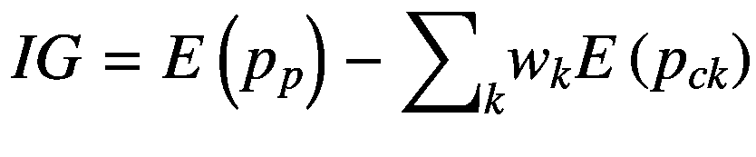

# 4.树

基于树的模型已被证明对机器学习中的预测任务非常有用，并且最近已被应用于经济学和金融学中的问题并对其进行了修改。任何基于树的模型的基本单元是决策树，它使用一系列数据分区来解释结果。这种模型可以自然地被可视化为流程图。

虽然 TensorFlow 是为了解决深度学习问题而开发的，但它最近在其高级`Estimators` API 中添加了基于树的模型的库。在这一章中，我们将检查这些库，并应用它们来训练基于阿拉斯加州住房抵押贷款披露法案(HMDA)应用数据的树型模型。<sup>[1](#Fn1)T4】</sup>

## 决策树

决策树类似于具有特定数字和分类阈值的流程图，通常使用 Breiman 等人(1984 年)介绍的算法家族构建。在这一节中，我们将在概念层面上介绍决策树，重点是基本定义和训练过程。在这一章的后面，我们将关注在 TensorFlow 中实现决策树。请参见 Athey 和 Imbens (2016，2019)对决策树在经济学中的应用的概述，以及 Moscatelli 等人(2020)对企业违约预测的应用。

### 概观

决策树由分支和三种类型的节点组成:根、内部节点和叶子。根部是第一个样本分离发生的地方。也就是说，我们用完整的数据样本进入树，然后通过根，它分割样本。每个拆分都与一个分支相关联，该分支将根节点连接到内部节点，并可能连接到离开节点。与根节点非常相似，内部节点强加了一个条件来分割样本。内部节点通过分支连接到额外的内部节点或叶，每个分支又与样本分割相关联。最后，树在叶子节点处终止，叶子节点产生对类别的预测或概率分布。

举个例子，让我们考虑一下 HMDA 的抵押贷款申请数据。我们将构建一个简单的分类器，从抵押贷款申请中提取特征，然后预测它是被接受还是被拒绝。我们将从只有一个特征的树形模型开始:以千美元计的申请人收入。我们的目标只是训练模型，看看它如何分割样本。也就是说，我们想知道什么样的收入水平与接受和拒绝之间的分裂相关，假设我们不以任何其他东西为条件，如抵押贷款的规模或借款人的信用评级。图 [4-1](#Fig1) 显示了该图表。


图 4-1

使用 HMDA 数据的简单决策树(DT)模型

正如我们将在本章后面讨论的，决策树的一个参数是它的最大深度。我们可以通过计算树根和最远的叶子之间的分枝数来测量树的深度。在这种情况下，我们选择的最大深度为 1。这种树有时被称为“决策树桩”我们的简单模型预测，收入低于 25，500 美元的申请人将被拒绝，而收入高于或等于 25，500 美元的申请人将被接受。当然，这个模型太简单了，对大多数应用程序来说都没有用；然而，它为我们提供了一个起点。

在图 [4-2](#Fig2) 中，我们进一步扩展了这个练习，将树的最大深度增加到 3，并增加了第二个特征:人口普查区域收入与城市统计收入的比率，乘以 100。请注意，我们在图中使用了“地区收入”来描述这一特征。


图 4-2

根据 HMDA 数据训练的决策树模型，具有两个特征和三个最大深度

再次从根开始，我们可以看到决策树首先根据申请人的收入对样本进行划分。低收入申请者被拒绝。然后，它在剩余的申请人中执行另一个分区。对于低收入家庭，下一个内部节点检查他们居住地区的收入是否低于平均水平。如果是，他们被拒绝，如果不是，他们被接受。同样，对于高收入家庭，该树检查房屋所在区域的收入水平。然而，不管它是高还是低，申请都被接受。

图中还有一些其他值得观察的地方。首先，现在我们有了足够的深度，图表有了“内部节点”——也就是说，不是根或叶的节点。第二，不是所有的叶子对都必须包含“接受”和“拒绝”类。事实上，叶子的类别将取决于与叶子相关联的类别的经验分布。按照惯例，我们可以将具有超过 50%接受观察值的叶子视为“接受”叶子。或者，我们可以改为陈述叶的结果分布，而不是将其与特定的类相关联。

### 特征工程

术语“特征工程”在本书中不常使用，因为 TensorFlow 主要是为深度学习设计的，深度学习通常会自动执行特征提取。然而，值得指出的是，特征工程对于决策树模型是必要的，因为它们有一个限制性的函数形式。

特别地，决策树是通过执行越来越细粒度的样本分割来构建的。如果关系的函数形式没有被单个特征的阈值捕获，那么基于树的模型将很难发现它。例如，一个要素和因变量之间的线性关系无法通过截距和斜率来捕捉。这将需要一个复杂的阶跃函数，它可能由数百个阈值构成。

一个明显的例子是我们在图 [4-1](#Fig1) 和 [4-2](#Fig2) 中给出的 HMDA 例子中申请人收入的使用。虽然获得任何形式的抵押贷款可能需要一定的最低收入水平，但很明显，较低的收入应该允许小额抵押贷款。因此，我们实际上想要的是债务收入比，这是通常用来评估贷款决策的指标。

然而，如果我们不计算债务收入比并将其作为一个特征，决策树将需要许多内部节点来实现我们通过取一个比率能够做到的事情。由于这个原因，决策树仍然依赖于专家判断来通知特征工程过程。

### 培养

我们现在知道决策树利用递归样本分裂，但我们还没有说样本分裂本身是如何选择的。实际上，决策树算法将通过依次选择生成最低基尼系数杂质或最大“信息增益”的变量和阈值来执行样本分割基尼系数在等式 4-1 中给出。

*方程式 4-1。K 类因变量的基尼杂质。*


基尼系数是通过节点中类的经验分布来计算的。它告诉我们一个阶级在多大程度上控制了分配。作为一个例子，让我们考虑图 [4-1](#Fig1) 中使用的模型，其中我们对申请人的收入进行了单一样本分割。我们之前没有提到这一点，但在收入低于 25，500 美元门槛的申请人中，接受的概率为 0.656，拒绝的概率为 0.344。这使我们的基尼系数为 0.451。对于收入高于 25500 美元的人，拒绝的比率为 0.075，接受的比率为 0.925，基尼系数为 0.139。 <sup>[2](#Fn2)</sup>

请注意，如果分裂完美地将申请人分为拒绝和接受，那么每组的基尼系数将为零。也就是说，我们想要一个低的 Gini 杂质，算法通过执行分割来实现它，分割后每个节点内的异质性将减少。

接下来，我们将考虑信息增益，这是分割质量的另一个常用度量。与基尼系数相似，它衡量的是将样本分成节点后产生的无序程度的变化。为了理解信息增益，有必要首先理解信息熵的概念，我们在方程 4-2 中定义了它。

*方程式 4-2。* *信息熵* *为 K 类情况。*


让我们回到我们考虑基尼系数的例子。如果我们有一片叶子，接受的经验概率为 0.656，拒绝的经验概率为 0.344，那么信息熵就是 0.929。类似地，对于另一片叶子，接受和拒绝概率为 0.075 和 0.925，它将是 0.384。 <sup>[3](#Fn3)</sup>

因为我们的目标是减少数据中的熵，所以我们将使用一个叫做“信息增益”的度量这将测量通过执行样本分割从系统中移除了多少熵。在等式 4-3 中，我们将信息增益定义为父节点的熵与其子节点的加权熵之差。

*方程式 4-3。信息增益。*



在由分支连接的任何节点之间,“子”节点是由分裂产生的“父”节点的子样本。在等式 4-3 中，我们已经计算出两个子节点的熵为 0.929 和 0.384。节点的权重， *w* <sub>*k*</sub> ，是它们各自在总样本中的份额。假设第一片叶子包含 10%的观察值，第二片叶子包含剩下的 90%。这产生了子节点熵的加权和的值 0.4385。

在计算信息增益之前，我们必须先计算父节点的熵。为了便于说明，让我们假设根节点中的观察有 0.25 的概率被拒绝，0.75 的概率被接受。这为父节点产生 0.811 的熵。因此，熵的信息增益或减少是 0.3725(即 0.8110.4385)。

张量流将允许选择分裂算法的灵活性；然而，我们将推迟讨论 TensorFlow 中的实现细节，直到“随机森林”一节。这是因为 TensorFlow 目前仅支持梯度增强随机森林，这将需要引入额外的概念。

## 回归树

我们在上一节中讨论过的决策树使用类似流程图的结构来模拟具有分类结果的过程。然而，在大多数经济和金融应用中，我们有一个连续的因变量，这意味着我们不能使用决策树。对于这样的问题，我们可以使用“回归树”，其中“回归”用于机器学习环境中，表示连续的因变量。

回归树在结构上与决策树几乎相同。唯一不同的是树叶。不是将叶与类或类上的概率分布相关联，而是与叶中观察值的因变量的平均值相关联。

我们将遵循 Athey 和 Imbens (2019)中给出的回归树的处理方法，但会将其与 HMDA 数据集联系起来。首先，我们假设我们有一个特征， *X* <sub>*i*</sub> ，和一个连续的因变量， *Y* <sub>*i*</sub> 。对于这个特性，我们将使用以千美元为单位的申请人收入。对于因变量，我们将使用以千美元为单位的贷款规模。如果我们使用误差平方和作为损失函数，我们可以在第一次分裂之前计算根部的损失，如方程 4-4 所示。

*方程式 4-4。均方根误差的初始和。*


也就是说，我们不分割样本，所以所有的观察值都在同一片叶子上。那片叶子的预测值就是因变量的平均值，记为。

使用 Athey 和 Imbens (2019)的符号，我们将使用 *l* 表示“左”分支， *r* 表示分裂的右分支， *c* 表示阈值。现在，让我们假设我们决定在申请人收入变量的根上执行单个分割。误差平方和可以用公式 4-5 计算。

*方程式 4-5。一次分割后的误差平方和。*


请注意，我们现在有两片叶子，这意味着我们必须计算两个误差平方和，每片叶子一个。从连接到左分支的叶子开始，我们计算叶子中所有观察值的平均值，表示为。然后，我们对叶子中的每个观察值和叶子平均值之间的平方差求和，并将其加到右边叶子的平方差之和上，以同样的方式计算。

与决策树一样，我们可以根据模型参数的选择，例如最大树深度，对额外的分割重复这个过程。然而，一般来说，我们通常不会孤立地使用回归和决策树。相反，我们将在随机森林的上下文中使用它们，这将在下一节中讨论。

然而，孤立地使用单棵树也有一些好处。一个明显的优势是树的可解释性。在某些情况下，如信用建模，可解释性可能是一个法律要求。Athey 和 Imbens (2019)讨论的使用回归树的另一个好处是它们具有良好的统计特性。该树的输出是平均值，计算它的置信区间相对简单。然而，他们指出，平均值不一定是无偏的，但在 Athey 和 Imbens (2016)中提供了一个程序，使用样本分割来纠正偏差。

## 随机森林

虽然使用单独的决策树和回归树有一些优势，但在大多数机器学习应用程序中这并不是常见的做法。其原因主要与 Breiman (2001)提出的随机森林的预测功效有关。顾名思义，随机森林由许多树组成，而不仅仅是一棵树。

Athey 和 Imbens (2019)指出了随机森林和回归(或决策树)树之间的两个差异。首先，与回归树不同，随机森林中的单棵树只利用了样本的一部分。也就是说，对于每个单独的树，通过随机抽取固定数量的观察值并进行替换来引导样本。这个过程有时被称为“装袋”第二个是在每个阶段随机选择一组特征用于分割。这不同于回归树，回归树优化模型中的所有特征。

机器学习领域通常发现随机森林具有高度的预测准确性。它们在文献、机器学习竞赛和行业应用中表现出色。Athey 和 Imbens (2019)指出，随机森林通过增加计算平均值的平滑度，也优于回归树。

虽然随机森林几乎完全被用作预测工具，但最近的工作已经展示了它们如何被用于执行假设检验和统计推断。例如，Wager 和 Athey (2017 年)证明了叶级均值(即模型预测)渐近正态和无偏的条件，还展示了如何为模型预测构建置信区间。

图 [4-3](#Fig3) 说明了随机森林模型的预测过程。在第一步中，将特征集传递给每个单独的决策树或回归树。然后应用一系列阈值，这将取决于树本身的结构。由于在训练过程中——在特征的选择和观察的选择中——存在随机性，所以树不会有相同的结构。


图 4-3

从随机森林模型生成预测

随机森林中的每棵树都会产生一个预测。然后，将使用某个函数对预测进行汇总。在分类树中，通常使用对树的预测的多数投票来确定森林的分类。在回归树中，对树的预测进行平均是一种常见的选择。

最后，同时训练随机森林中的树，并且用于聚集目的的各个树的权重在训练过程本身期间不更新。在下一节中，我们将看看梯度增强树，它以几种方式修改随机森林，最重要的是，它在 TensorFlow 中有一个实现。

## 梯度增强树

虽然 TensorFlow 没有为回归树、决策树或随机森林提供高级 API，但它确实为训练梯度提升树提供了功能。梯度增强树和随机森林有两个区别，我们强调如下:

1.  **强与弱学习器**:随机森林使用完全生长的树，可能有许多中间节点，而梯度增强使用“弱学习器”:中间节点很少(如果有的话)的浅树。在某些情况下，梯度推进使用“决策树桩”，这只是有一个根和一个单一的分裂。

2.  **顺序与并行训练**:在一个随机森林中，每棵树都被并行训练，并且对树的加权方案不依赖于训练过程。在梯度推进中，每个树都是按顺序训练的，并且在给定先前训练的树的情况下，可以解决模型中的缺陷。

梯度推进过程依赖于经济学家熟悉的技术，即使基于树的模型并不熟悉。为了阐明这种模型是如何构建的，我们将通过一个例子，其中我们使用最小二乘法作为损失函数。我们将从定义一个函数开始，*G*<sub>*I*</sub>(*X*)，在 *i* 次迭代之后，该函数产生模型目标 *Y* 的预测。与此相关，我们将定义一个基于树的模型，*T*<sub>*I*</sub>(*X*)，它是在迭代 *i* 中引入的，是对*G*<sub>*I*</sub>(*X*)的改进，也是*G*<sub>*I*+1 方程 4-6 总结了函数之间的关系。</sub>

*方程式 4-6。梯度增强中* *树与预测函数* *的关系。*


由于*g*<sub>*I*+1</sub>(*x*)是一个从特征中产生预测的模型，它可以用目标变量 *Y* 和预测误差或残差 *ϵ* 来表示，如等式 4-7 所示。

*方程式 4-7。定义* *模型剩余* *。*


注意*Y*—*G*<sub>T5】I</sub>(*X*)在迭代 *i* 时是固定的。因此，调整树模型的参数*t*<sub>*I*</sub>(*x*)会影响残差， *ϵ* 。我们可以通过最小化误差平方和来训练*t*<sub>*I*</sub>(*x*)*ϵ*<sup>’</sup>*ϵ*。或者，我们可以使用不同的损失函数。一旦*T*<sub>*I*</sub>(*X*)训练完毕，我们就可以更新预测函数，*G*<sub>*I*+1</sub>(*X*)，然后在另一次迭代中重复这个过程，添加另一棵树。

在每一步，我们将使用前一次迭代的残差作为目标。例如，如果我们的第一棵树在一个有连续目标的问题上有正偏差，那么第二棵树可能会产生负偏差，当与第一棵树结合时，会减少模型偏差。

### 分类树

让我们看一个在 TensorFlow 中实现梯度推进决策树的例子。我们将利用 HMDA 的数据。由于我们使用决策树，我们将需要一个离散的因变量，并将利用应用程序的结果，它可以是接受或拒绝。

在清单 [4-1](#PC1) 中，我们将通过导入`pandas`和`tensorflow`来开始这个过程。然后，我们将使用`pandas`加载 HMDA 数据，并将其分配给`pandas`数据帧`hmda`。接下来，我们将使用操作`feature_column.numeric_column()`定义容器来保存称为特性列的数据。我们将它们命名为匹配它们将包含的变量:`applicantIncome`和`areaIncome`。然后我们将这两个特性列合并成一个名为`feature_list`的列表。

```py
import pandas as pd
import tensorflow as tf

# Define data path.
data_path = '../chapter4/hmda.csv'

# Load hmda data using pandas.
hmda = pd.read_csv(data_path+"hmda.csv")

# Define applicant income feature column.
applicantIncome = tf.feature_column.numeric_column("applicantIncome")

# Define applicant msa relative income.
areaIncome = tf.feature_column.numeric_column("areaIncome")

# Combine features into list.
feature_list = [applicantIncome, areaIncome]

Listing 4-1Prepare data for use in gradient boosted classification trees

```

清单 [4-2](#PC2) 中给出的下一步是为训练数据定义一个输入函数。该函数将返回特征和标签，稍后将传递给`train`操作。我们通常希望为培训和评估过程定义单独的功能，但是为了这个例子的目的，我们将尽可能保持事情的简单。

因为我们已经定义了这个函数的最小版本，所以它没有参数。它构建了一个名为`features`的字典，其中使用了个人收入和该地区中值收入的变量。然后，它使用从`hmda`数据集中接受的应用程序来定义标签。

我们现在可以定义和训练这个模型，我们在清单 [4-3](#PC3) 中做了。我们将首先使用高级`Estimators` API 中的`BoostedTreesClassifier`来定义模型。至少，我们需要提供特征列的列表，`feature_columns`，以及样本被分成的批次数量，`n_batches_per_layer`。因为数据集足够小，可以在单个批处理中处理，所以我们将第二个参数设置为 1。

```py
# Define boosted trees classifier.
model = tf.estimator.BoostedTreesClassifier(
        feature_columns = feature_list,
        n_batches_per_layer = 1)

# Train model using 100 epochs.
model.train(input_fn, steps=100)

Listing 4-3Define and train a boosted trees classifier

```

```py
# Define input data function.
def input_fn():
        # Define dictionary of features.
        features = {"applicantIncome": hmda['income'],
        "areaIncome": hmda['area_income’]}

        # Define labels.
        labels = hmda['accepted'].copy()

        # Return features and labels.
        return features, labels

Listing 4-2Define function to generate input data function

```

最后，我们使用`train`操作，以及我们之前定义的输入函数来训练模型。为了简单起见，我们仅将确定训练时期数量的参数`steps`设置为 100。

一旦训练过程完成，我们可以应用`evaluate`操作，以及我们的输入函数和一些步骤作为参数。我们将使用前面定义的相同输入函数，这意味着我们将评估样本内。虽然这通常不是推荐的做法，但是为了提供一个最小的例子，我们将在这里这样做。清单 [4-4](#PC4) 中给出了执行评估和打印结果的代码。

```py
# Evaluate model in-sample.
result = model.evaluate(input_fn, steps = 1)

# Print results.
print(pd.Series(result))

accuracy                  0.635245
accuracy_baseline         0.598804
auc                       0.665705
auc_precision_recall      0.750070
average_loss              0.632722
label/mean                0.598804
loss                      0.632722
precision                 0.628028
prediction/mean           0.598917
recall                    0.958663
global_step             100.000000
dtype: float64

Listing 4-4Evaluate a boosted trees classifier

```

我们可以看到，控制台输出包含许多不同的性能指标，包括损失、正确预测的比例(准确性)和曲线下面积(AUC)。我们不会在这里详细讨论这些指标，但是有必要指出它们是由`evaluate`操作自动生成的。

### 回归树

如果我们有一个连续的因变量，那么我们需要使用梯度推进回归树，而不是分类树。大部分代码将是相同的，但有一些变化。举个例子，假设我们现在想预测以千美元为单位的贷款金额，而不是申请结果，但是我们仍然想使用同样的两个特性。

为此，我们只需要修改数据输入函数并定义一个`BoostedTreesRegressor`，而不是分类器。这两个步骤如清单 [4-5](#PC5) 所示。

```py
# Define input data function.
def input_fn():
        features = {"applicantIncome": data['income'],
        "msaIncome": data['area_income']}
        targets = data['loan_amount'].copy()
        return features, targets

# Define model.
model = tf.estimator.BoostedTreesRegressor(
        feature_columns = feature_list,
        n_batches_per_layer = 1)

Listing 4-5Define and train a boosted trees regressor

```

由于所有其他步骤都是相同的，我们将跳到打印评估操作的结果，这些结果在清单 [4-6](#PC6) 中给出。

```py
# Evaluate model in-sample.
result = model.evaluate(input_fn, steps = 1)

# Print results.
print(pd.Series(result))

average_loss       8217.281250
label/mean          277.759064
loss               8217.281250
prediction/mean     277.463928
global_step         100.000000
dtype: float64

Listing 4-6Evaluate a boosted trees regressor

```

请注意，我们现在在清单 [4-6](#PC6) 中有了一组不同的指标。这是因为我们有一个连续的目标，而不是分类标签。在这种情况下，准确性和 AUC 等衡量标准不再有意义。

## 模型调整

最后，我们将通过讨论模型调整来结束本章，模型调整是我们调整模型参数以改善训练结果的过程。我们将重点关注梯度增强分类和回归树共有的五个模型参数:

1.  **树的数量**:这是由`n_trees`参数指定的，它决定了在训练过程中将创建多少棵单独的树。默认值为 100，但如果模型对数据拟合不足，则可以增加该值；如果模型对数据拟合过度，则可以减小该值。

2.  **最大树深**:使用`max_depth`参数设置，默认为 6。最大树深测量根和最远的叶子之间的分支数量。梯度增强树通常使用比随机森林或单个决策树更低的值。如果过度拟合是一个问题，您可以减少最大树深度。

3.  **学习率**:由于梯度提升树可以使用最小平方损失函数进行训练，因此可以使用随机梯度下降或其变体之一进行优化。因此，我们需要设置一个学习率，默认为 0.1。在难以收敛的应用中，我们可能希望降低`learning_rate`参数，增加历元数。

4.  **正则化**:如果我们担心过度拟合，对树应用正则化是有意义的，这会因为树深和节点多而惩罚它们。设置参数`l1_regularization`将惩罚应用于节点的权重的绝对值，而`l2_regularization`将惩罚权重的平方。我们也可以使用`tree_complexity`参数来惩罚叶子的数量。

5.  **修剪模式**:默认情况下，TensorFlow 中的梯度增强算法不会对树进行修剪。要应用修剪，您必须为`tree_complexity`参数设置一个正值，然后将`pruning_mode`设置为`pre`或`post`。预修剪树更快，因为当达到修剪阈值时，树的生长终止。后期修剪速度较慢，因为它需要我们首先生长树，然后修剪它，但它也可能允许算法发现其他有用的关系，否则它不会识别。

一般来说，当我们应用修剪时，我们主要关心的是减轻过度拟合。我们希望训练一个模型，它能很好地预测样本中的数据，但不是通过记忆。调整我们在本节中定义的五个参数的值将有助于我们实现这一目标。

## 摘要

在本章中，我们介绍了基于树的模型的概念。我们看到了用于分类目的的决策树和用于预测连续目标的回归树。一般来说，树通常不会单独使用，而是组合在随机森林中或使用梯度增强。随机森林使用“完全成长”的树，这些树被并行训练，并通过对单个树的输出进行平均或应用多数投票来生成预测。通过最小化来自前一次迭代的模型残差来顺序训练梯度增强树。该过程可以使用最小平方损失函数，并且可以使用随机梯度下降或其某种变体来训练。

TensorFlow 是围绕深度学习构建的，因此最初不适合训练其他类型的机器学习模型，包括决策树和分类树。随着高级`Estimators` API 和 TensorFlow 2 的推出，这种情况发生了变化。TensorFlow 现在为训练和评估梯度提升采油树提供强大的生产质量操作。除此之外，它还提供了各种有用的参数，通过这些参数我们可以调整模型以防止过度拟合和欠拟合。一般来说，我们将通过迭代训练、评估和调优步骤来实现这一点。

## 文献学

艾希、s、G.W .和伊本斯。2016."异质因果效应的递归分割."美国国家科学院学报 27(113):7353–7360。

阿西和 G.W .因本斯。2019.“经济学家应该了解的机器学习方法。” *arXiv。*

布雷曼，2001 年。“随机森林。”*机器学习*45(1):5–32。

布雷曼、J .弗里德曼、C.J .斯通和 R.A .奥尔申。1984."分类和回归树."(CRC 出版社)。

Moscatelli，m .，F. Parlapiano，S. Narizzano 和 G. Viggiano。2020.“用机器学习进行公司违约预测。”专家系统及其应用 161。

韦杰、s .和 s .阿西。2017."使用随机森林的异质处理效果的估计和推断."美国统计协会杂志 1228–1242。

<aside aria-label="Footnotes" class="FootnoteSection" epub:type="footnotes">Footnotes [1](#Fn1_source)

HMDA 数据集可从消费者金融保护局(CFPB)下载: [`www.consumerfinance.gov/data-research/hmda/`](https://www.consumerfinance.gov/data-research/hmda/) 。它是公开可用的，并提供来自许多抵押贷款机构的数据，包括申请功能和决策。我们使用 2017 年来自阿拉斯加的所有申请数据。

  [2](#Fn2_source)

通过计算 1-(0.656**2 + 0.344**2)，我们得出基尼系数为 0.451。此外，我们通过计算 1-(0.075**2 + 0.925**2)得出基尼系数为 0.139。

  [3](#Fn3_source)

我们计算第一片树叶的信息熵值为(0.656∫log<sub>2</sub>0.656+0.344∫log<sub>2</sub>0.344)第二片树叶的信息熵值为(0.075∫log<sub>2</sub>0.075+0.925∫log<sub>2</sub>0.925)。

 </aside>