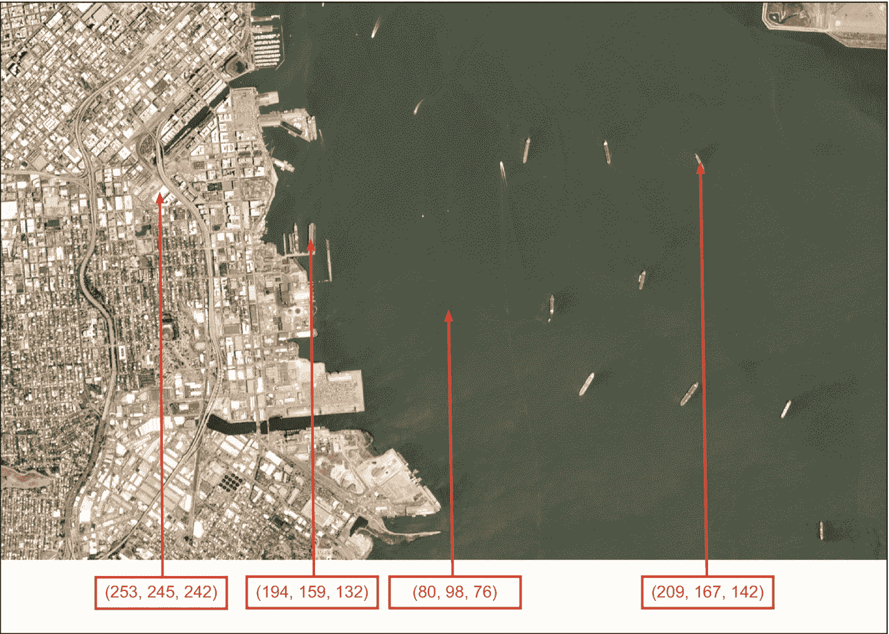
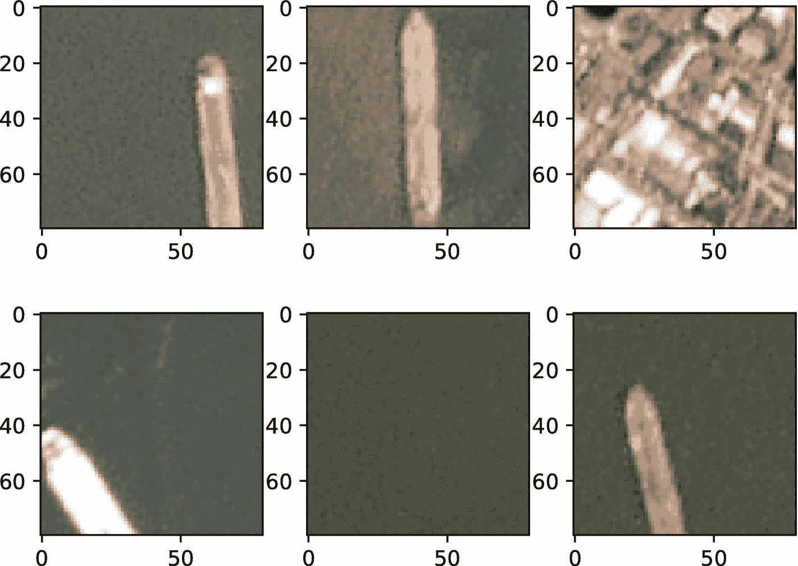
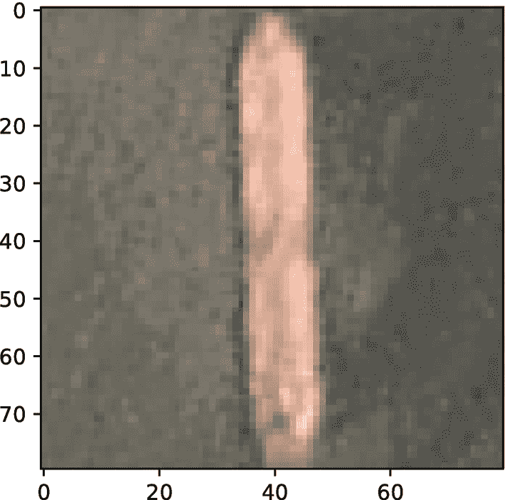
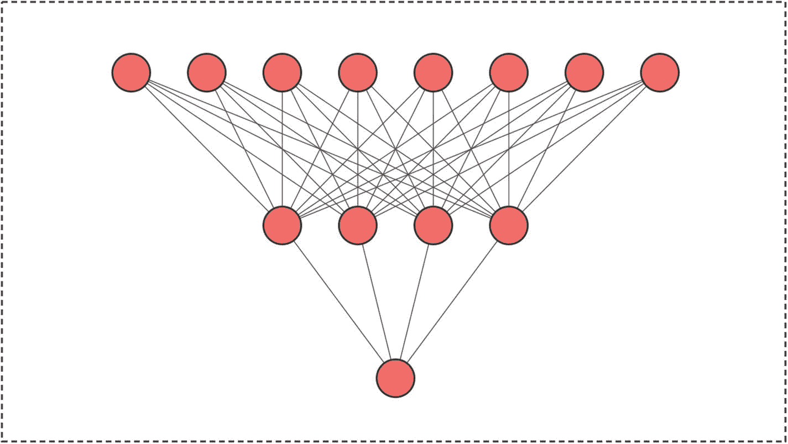
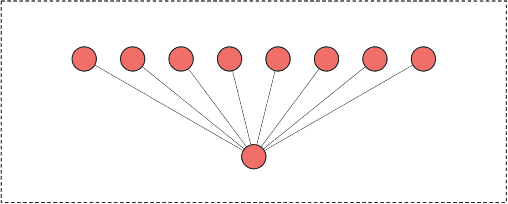
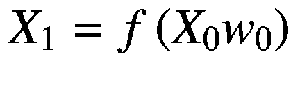
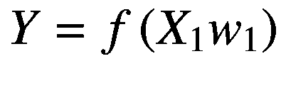
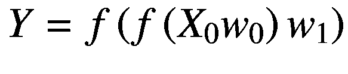
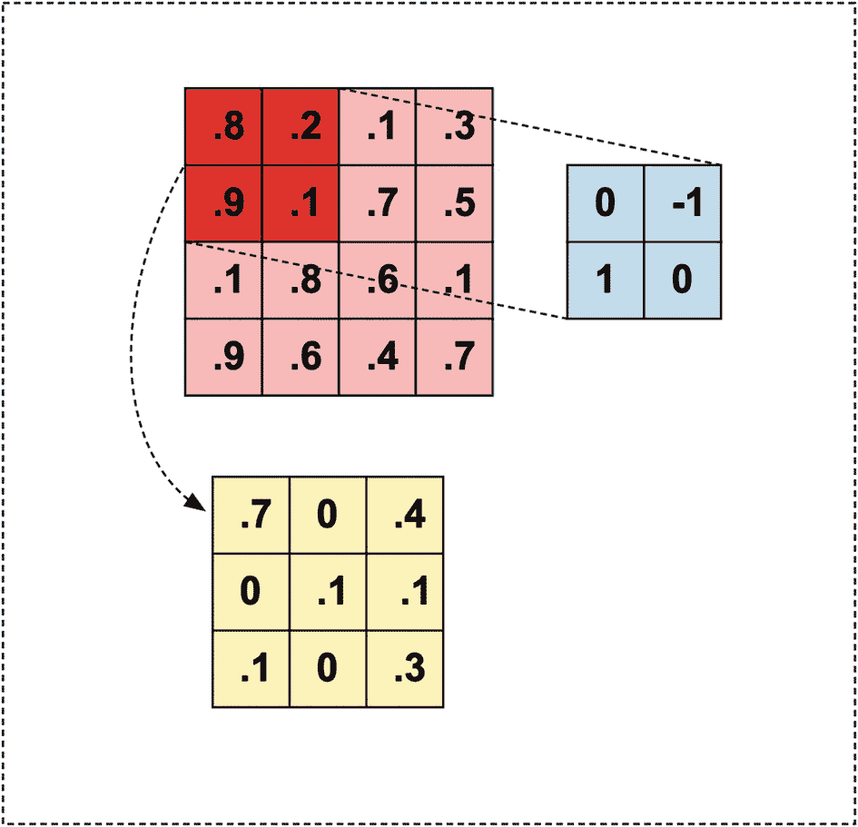
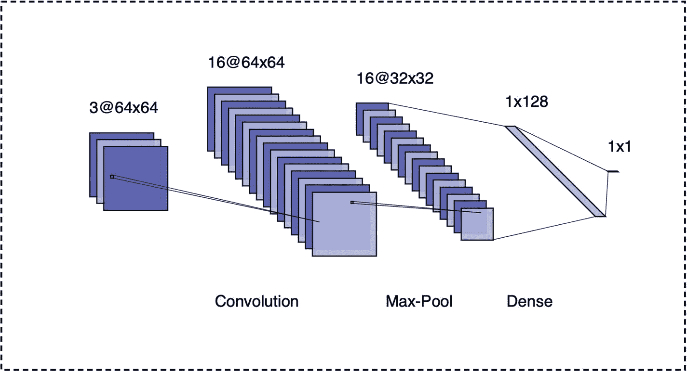

# 五、图像分类

图像分类曾经是一项需要领域专业知识和使用特定问题模型的任务。随着深度学习作为计算机视觉中预测任务的通用建模技术的出现，这种情况发生了很大变化。机器学习文献和图像分类竞赛现在都由深度学习模型主导，这些模型通常不需要领域专业知识，因为这种模型自动识别和提取特征，消除了对特征工程的需要。

虽然学院派经济学家最近开始从机器学习中引入方法，但深度学习在图像分类方面的广泛使用已经落后。经济学中许多涉及图像数据的现有工作都利用了预处理过的夜间亮度值。这样的数据可以用来代理经济变量， <sup>[1](#Fn1)</sup> 衡量不同地理层次的产出增长， <sup>[2](#Fn2)</sup> 评估基础设施投资的影响。 <sup>[3](#Fn3)</sup> 关于该文献的概述，参见 Donaldson 和 Storeygard (2016 年)和 Gibson 等人(2020 年)。

图像数据集在经济和金融研究中仍未得到充分利用；然而，最近有一些值得注意的应用。纳伊克等人(2017 年)使用计算机视觉技术来测量邻里视觉外观的变化。然后，他们通过确定哪些社区特征与未来的外观改善有关来测试城市经济学的理论。Borgshulte 等人(2019)使用深度学习来衡量压力事件对首席执行官表观年龄的影响。他们表明，大衰退造成的压力与 CEO 的表观年龄增加大约 1 岁有关。

除了学术工作，计算机视觉应用——特别是那些涉及深度学习的应用——在行业环境中已经变得很常见。此外，由于图像数据集的激增和现成模型的质量，它们可能会在学术界和私营行业获得更多的使用。

在本章中，我们将对图像数据及其在经济和金融中的潜在用途进行概述。我们将专注于深度神经网络的开发，这些网络专门用于对图像进行分类，并在`TensorFlow`及其高级 API 中实现，包括`Keras`和`Estimators`。我们还将讨论使用预训练模型并对其进行微调以提高性能。

## 图像数据

在讨论方法和模型之前，我们先来定义一下什么是图像。出于我们的目的，图像是像素强度的张量。例如，600x400 尺寸的灰度图像是具有 600 行和 400 列的矩阵。矩阵的每个元素都是 0 到 255 之间的整数值，其中该值对应于它所代表的像素的亮度。例如，值 0 对应于黑色，而值 255 对应于白色。

彩色图像有几种张量表示，但最常见的一种——也是我们在本书中几乎唯一使用的一种——是 3-张量。这种图像是 3-张量，因为它们包含一个矩阵，对于三个不同的颜色通道:红色、绿色和蓝色(RGB)具有相同的维度。每个矩阵保存其各自颜色的像素强度值，如图 [5-1](#Fig1) 所示。



图 5-1

RGB 图像中的每个像素对应于三维张量中的一个元素。图中标记了四个这样的元件。来源: [`www.kaggle.com/rhammell/ships-in-satellite-imagery/data`](http://www.kaggle.com/rhammell/ships-in-satellite-imagery/data)

在本章中，我们将使用来自“卫星图像中的船只”数据集的图像，该数据集可在 Kaggle 上下载。 <sup>[4](#Fn4)</sup> 它包含 80x80x3 像素的彩色图像，是从较大的图像中提取出来的。如果子图像包含船只，则标记为 1，否则标记为 0。非船舶图像包含各种不同类型的土地覆盖，包括建筑物，植被和水。图 [5-2](#Fig2) 显示了从该数据集中选择的随机图像。

在经济和金融应用中，我们可以通过多种方式使用船只的卫星图像。在这一章中，我们将使用它们来建立一个分类器。这种分类器可用于对感兴趣位置的船只交通进行计数。随着每日卫星数据可用性的增加，这可用于以比官方统计更高的频率估计贸易流量。



图 5-2

“卫星图像中的船只”数据集中的船只示例

我们将从加载和准备清单 [5-1](#PC1) 中的数据开始。第一步是导入相关的模块。这包括作为`mpimg`的`matplotlib.image`，我们将使用它来加载和操作图像；`numpy`为`np`将图像转换成张量；和`os`，我们将使用它来执行操作系统的各种任务。接下来，我们将`listdir()`应用于下载图像所在的目录，这将产生一个文件名列表。

现在我们可以构建每个文件的路径，我们将加载图像，将它们转换成`numpy`数组，并将它们存储在两个列表中:一个用于船只图像，另一个用于不包含船只的图像。我们将通过使用 list comprehension 来构建每个图像的路径，并使用每个文件名中的第一个字符来识别相应的图像是否包含一艘船。文件`0__20150718_184300_090b__-122.35324421973536_37.772113980272394.g`不包含船，而`1__20180708_180908_0f47__-118.15328750044623_33.735783554733885.png`包含。

```py
import matplotlib.image as mpimg
import numpy as np
import os

# Set image directory.
data_path = '../data/chapter5/shipsnet/'

# Generate file list.
images = os.listdir(image_path)

# Create list of ship images.
ships = [np.array(mpimg.imread(image_path+image))
for image in images if image[0] == '1']

# Create list of no-ship images.
noShips = [np.array(mpimg.imread(image_path+image))
for image in images if image[0] == '0']

Listing 5-1Prepare image data for use in TensorFlow

```

既然我们已经将数据加载到列表中，我们将在清单 [5-2](#PC2) 中探索它。我们首先将`matplotlib.pyplot`作为`plt`导入，我们可以用它来绘制图像。然后我们将打印出`ships`中一个物品的形状。这将返回元组(80，80，3)，这意味着该图像是一个 3-像素张量。我们也可以通过选择张量中的一个坐标来打印任意像素。最后，我们使用`imshow()`函数渲染图像，如图 [5-3](#Fig3) 所示。



图 5-3

来自数据集的船舶图像

```py
import matplotlib.pyplot as plt

# Print item in list of ships.
print(np.shape(ships[0]))

(80, 80, 3)

# Print pixel intensies in [0,0] position.
print(ships[0][0,0])

[0.47058824 0.47058824 0.43137255]

# Show image of ship.
plt.imshow(ships[0])

Listing 5-2Exploring image data

```

当我们打印特定像素的颜色通道时，请注意这些值不是 0 到 255 之间的整数。相反，它们是介于 0 和 1 之间的实数。这是因为张量已经通过将所有元素除以 255 进行了归一化。在将图像用作为图像处理任务设计的神经网络模型的输入之前，我们通常需要这样做，因为它们通常需要[0，1]或[–1，1]范围内的输入。

## 神经网络

在我们介绍 TensorFlow 中为构建和训练图像分类模型而设计的高级 API 之前，我们将首先讨论神经网络，因为我们在本章中考虑的所有模型都是神经网络的某种变体。

图 [5-4](#Fig4) 显示了一个具有输入层、隐藏层和输出层的神经网络。 <sup>[5](#Fn5)</sup> 输入层包含 8 个"节点"或输入特征。这些节点乘以权重，权重由图中的线条表示。在应用乘法步骤之后，使用非线性“激活函数”来转换结果输出这产生了下一层“节点”，它被称为隐藏层，因为它不像输入和输出层那样被观察到。就像输入层一样，我们将隐藏层乘以权重，然后应用激活函数，得到输出层。



图 5-4

具有输入层、隐藏层和输出层的神经网络

请注意，输出图层是一个预测。在二进制分类问题中(即，船或非船)，输出可以被解释为图像包含船的概率，并且因此将是 0 和 1 之间的实数。在有连续目标的问题中，输出层将产生实数预测。

与神经网络相比，线性回归模型不应用激活函数，也没有隐藏层。常见的线性回归模型如图 [5-5](#Fig5) 所示，以供比较。请注意，线性回归的输入层和输出层与神经网络没有什么不同。



图 5-5

线性回归模型

神经网络图和线性回归图之间的另一个相似之处是，边连接两个连续层之间的所有节点。在线性回归中，我们知道只有两层，输入层乘以权重(系数)得到输出层(拟合值)。在神经网络中，每当我们使用所谓的“密集”或“完全连接”层时，我们都会执行类似的操作:也就是说，我们将权重矩阵乘以与节点相关的值。

为了修正一个例子，让我们考虑图 [5-4](#Fig4) 所示的情况。我们将首先执行一个称为“正向传播”的步骤，这是一个为给定的一组要素计算预测值的过程。从输入层开始，第一个操作将特征 *X* <sub>0</sub> 乘以权重*w*T8】0。然后我们应用一个激活函数， *f* ()，它产生下一层节点，*X*T14】1。我们再次乘以下一组权重， *w* <sub>1</sub> ，并应用另一个激活函数，产生输出， *Y* 。这显示在等式 5-1 中。

*方程式 5-1。具有密集层的神经网络中的前向传播。*





我们也可以通过嵌套函数把它写成一行，就像方程 5-2 那样。

*方程式 5-2。简洁表达为* *正向传播* *。*



关于 *X* <sub>0</sub> 、 *w* <sub>0</sub> 、 *X* <sub>1</sub> 的形状，哪些一定是真的？如果我们有 *N* 个观察值，那么*X*T16】0 的形状将是 Nx8，因为我们有八个特征。这意味着 *w* <sub>0</sub> 必须有八行，因为 *w* <sub>0</sub> 中的行数必须等于 *X* <sub>0</sub> 中的列数才能执行矩阵乘法。再者， *X* <sub>0</sub> 和 *w* <sub>0</sub> 的乘积形状将等于 *X* <sub>0</sub> 中的行数，即 *N、*和 *w* <sub>0</sub> 中的列数。既然我们知道下一层有四个节点，*w*T50】0 一定是 8x4。同理，既然*X*T54】1 是 Nx4， *Y* 是 Nx1，那么*w*T60】1 一定是 4x1。

请注意，密集层只是神经网络中使用的一种类型的层。例如，当使用图像分类模型时，我们通常会使用专门的层，比如卷积层。我们将推迟这个讨论，直到我们在本章后面的 TensorFlow 中实现这样的网络。

## 硬

TensorFlow 2 提供了更紧密的高级 API 集成。例如，Keras 现在是 TensorFlow 的子模块，而以前它是一个独立的模块，允许可选地使用 TensorFlow 作为后端。在本节中，我们将讨论如何使用 TensorFlow 中的 Keras 子模块来定义和训练神经网络。

每当我们在 Keras 中定义一个模型时，我们都可以选择使用两个 API 中的一个:顺序 API 或功能 API。顺序 API 具有简单的语法，但是灵活性有限。函数式 API 非常灵活，但代价是更复杂的语法。我们将从使用顺序 API 定义图 [5-4](#Fig4) 中的神经网络开始。

### 顺序 API

图 [5-4](#Fig4) 中的神经网络由输入层、隐含层和输出层组成。此外，它是使用密集层构建的，如连接层 *i* 中的每个节点和层 *i+1* 中的每个节点的边所示。我们将在清单 [5-3](#PC3) 中构建这个简单的神经网络，作为 Keras API 的第一个演示。

我们首先将`tensorflow`作为`tf`导入。接下来，我们使用`tf.keras.Sequential()`在 Keras 中定义一个序列模型。一旦我们定义了一个顺序模型，我们就可以通过使用`add()`方法来添加层。我们首先使用`tf.keras.Input()`添加一个有八个特征列的输入层。接下来我们定义隐藏层，指定它有四个输出节点，如图 [5-4](#Fig4) 所示。我们还通过使用`tf.keras.layers.Dense()`来构造层来指示它是密集的。我们还必须指定一个激活函数，它对输入和权重的乘积进行非线性转换。在本例中，我们使用了一个`sigmoid`转换。

最后，我们再次使用`add()`方法将另一个密集层添加到模型中，它有一个输出节点，并使用了一个`sigmoid`激活函数。作为激活函数的这种选择的结果，模型的输出将是 0 和 1 之间的预测概率。如果我们有一个连续的目标，而不是一个离散的目标，我们可以使用一个`linear`激活函数，这将允许线性预测。

```py
import tensorflow as tf

# Define sequential model.
model = tf.keras.Sequential()

# Add input layer.
model.add(tf.keras.Input(shape=(8,)))

# Define hidden layer.
model.add(tf.keras.layers.Dense(4,
activation="sigmoid"))

# Define output layer.
model.add(tf.keras.layers.Dense(1,
activation="sigmoid"))

Listing 5-3Implement a simple neural network in Keras

```

假设我们要考虑一个更有意义的问题，比如船只的分类。我们需要修改什么？至少，我们必须改变输入层，它的形状是错误的。我们数据集中的图像是 80x80x3 像素。如果我们想将它们用作只有密集图层的网络的输入，我们就必须对图像进行整形。由于有 19，200 个像素(即 80*80*3)，我们将需要在输入层中有 19，200 个节点。

在清单 [5-1](#PC1) 中，我们加载了图像，将它们转换成`numpy`数组，并将它们存储为两个列表`ships`和`noShips`。在清单 [5-4](#PC4) 中，我们将使用列表理解将 80×80×3 张量重塑为 19，200 个元素的向量。我们还将创建一个名为`labels`的相应因变量，并将展平的特征堆叠成一个`numpy`数组。

在我们可以训练我们的网络之前还有两个步骤。第一种是随机打乱数据，然后将其分成训练样本和测试样本。混洗确保我们在一个序列中没有长的船只或非船只图像簇，这会使使用随机梯度下降(SGD)学习变得困难。此外，分离测试样本是机器学习中的标准做法，用于确保我们不会使用用于训练模型的相同观察来评估模型拟合。这使我们能够识别过拟合何时发生。

```py
import numpy as np

# Reshape list of ship images.
ships = [ship.reshape(19200,) for ship in ships]

# Reshape list of non-ship images.
noShips = [noShip.reshape(19200,) for noShip in
noShips]

# Define class labels.
labels = np.vstack([np.ones((len(ships), 1)),
                np.zeros((len(noShips), 1))])

# Stack flattened images into numpy array.
features = np.vstack([ships, noShips])

Listing 5-4Reshape images for use in a neural network with dense layers

```

在清单 [5-5](#PC5) 中，我们将使用`sklearn`的`model_selection`子模块来处理第一步。在这个模块中，我们将使用`train_test_split`，它将允许我们指定标签、特性、应该在测试样本中的观察份额，以及一个随机种子以确保可再现性。默认情况下，参数`shuffle`设置为`True`，因此我们不需要调整它。

一旦我们的样本被打乱和分割，最后一步是修改网络，以允许在输入层有 19，200 个节点。清单 [5-6](#PC6) 显示了修改后的网络架构。请注意，这对于所考虑的问题来说并不理想，但对于理解如何构建、训练和评估神经网络是有帮助的。

```py
from sklearn.model_selection import train_test_split

# Shuffle and split sample.
X_train, X_test, y_train, y_test = \
        train_test_split(features, labels,
        test_size = 0.20, random_state=0
)

Listing 5-5Shuffle and split data into train and test samples

```

在我们开始培训过程之前，我们可能希望对我们的模型有一个高层次的概述。我们可以使用`summary()`方法做到这一点，如清单 [5-7](#PC7) 所示。如输出所示，我们的模型有 76，809 个参数。这可能已经让我们有理由担心模型会过拟合，但我们将看到机器学习为管理这个问题提供了许多策略。

我们还可以看到，大多数参数似乎都位于隐藏层中。这是我们将 19，200 个输入节点乘以权重的地方。这意味着我们需要一个权重矩阵，可以将 Nx19200 矩阵输入转换为 Nx4 矩阵。因此，它的形状必须是 19200x4，也就是 76，800 个参数。其余四个参数称为“偏差”，相当于回归中的常数项。我们将有一个隐藏层中的每个节点。同样，对于输出层，我们需要将一个 Nx4 矩阵转换为一个 Nx1 矩阵，这将需要一个 4x1 权重矩阵和一个偏置项，从而为我们提供五个额外的参数。

从摘要输出中我们可能注意到的另一件事是，参数分为两类:“可训练参数”和“不可训练参数”这是因为 Keras 为我们提供了冻结参数的选项，使它们不可跟踪。我们在这里不使用这个特性，但是我们稍后会回到它。

```py
print(model.summary())
_____________________________________________________
Layer (type)     Output Shape              Param #
=====================================================
dense (Dense)    (None, 4)                 76804
_____________________________________________________
dense_1 (Dense)  (None, 1)                 5
=====================================================
Total params: 76,809
Trainable params: 76,809
Non-trainable params: 0

Listing 5-7Print a model summary in Keras

```

```py
import tensorflow as tf

# Define sequential model.
model = tf.keras.Sequential()

# Add input layer.
model.add(tf.keras.Input(shape=(19200,)))

# Define hidden layer.
model.add(tf.keras.layers.Dense(4,
activation="sigmoid"))

# Define output layer.
model.add(tf.keras.layers.Dense(1,
activation="sigmoid"))

Listing 5-6Modify

a neural network to fit the input shape

```

我们现在已经看到了如何在 Keras 中定义一个模型并解释它的架构。下一步是通过指定在训练过程中要计算的损失函数、优化器和指标来“编译”模型。我们通过列出 [5-8](#PC8) ，选择`binary_crossentropy`损失、`adam`优化器和`accuracy`指标(即，正确预测的份额)来做到这一点。

我们现在可以将`fit()`方法应用于模型，这将启动训练过程。我们必须指定`epochs`和`batch_size`的数量。`epochs`的数量对应于训练过程应该在整个样本上循环的次数，而`batch_size`参数决定了在循环的每个增量中使用的观察值的数量。

```py
# Compile the model.
model.compile(loss='binary_crossentropy',
        optimizer="adam", metrics=['accuracy'])

# Train the model.
model.fit(X_train, y_train, epochs=100,
       batch_size=32, validation_split = 0.20)

Listing 5-8Compile and train the model in Keras

```

注意，我们还将可选参数`validation_split`设置为 0.20。这将分离出我们样本的额外 20%,该样本不会用于训练模型。在训练过程中，我们将在训练和验证样本中比较模型的指标性能。如果两者开始背离，这告诉我们模型过拟合，我们可能要终止训练过程或调整模型的参数。

在每个时期，模型输出训练样本和验证样本中的损失值和预测精度。根据准确性度量，该模型表现得相当好，正确预测了训练和验证样本中 75%的观察值。因为我们根本没有调整模型，所以我们不必担心我们选择的训练和模型参数会夸大验证样本的准确性。因此，评估测试样本并不是绝对必要的，但是为了便于说明，我们还是会这样做，如清单 [5-9](#PC9) 所示。

```py
# Evaluate the model.
model.evaluate(X_test, y_test)

loss: 0.5890 - accuracy: 0.7262

Listing 5-9Evaluate

the model on the test sample

```

我们可以看到精度稍低，但不足以让我们担心过拟合可能是一个问题。我们还要检查最后一个性能指标，即混淆矩阵。这通过指示我们是将 0 误分类为 1 还是将 1 误分类为 0，提供了对准确性的改进。清单 [5-10](#PC10) 提供了计算混淆矩阵的代码。

我们将首先从`sklearn.metrics`导入`confusion_matrix`。接下来，我们将使用该模型对测试样本标签进行预测。预测是概率，但我们将使用阈值 0.5 来表示模型预测到图像包含一艘船。然后我们将真正的标签`y_test`和预测`y_pred`传递给`confusion_matrix()`。生成的矩阵在行中包含真值，在列中包含预测值。例如，第 0 行第 1 列元素指示哪些观察值是真正的 0，但被归类为 1。

混淆矩阵表明所有的预测都是 0——也就是非船。因此，即使在训练、验证和测试样本中表现良好，我们的模型只是注意到 75%的观察值为 0，然后预测所有的观察值为 0，而不是试图学习数据中的模式。

```py
from sklearn.metrics import confusion_matrix

# Generate predictions.
y_pred = model.predict(X_test)>0.5

# Print confusion matrix.
print(confusion_matrix(y_test, y_pred))

array([[581,   0],
       [219,   0]])

Listing 5-10Evaluate the confusion matrix

```

不幸的是，这是我们在训练神经网络时会遇到的一个常见问题:样本通常是不平衡的。由于获得 75%的分类准确率具有挑战性，该模型将快速收敛于预测最常见的类别，而不是学习有意义的抽象。有两种方法可以避免这个问题。第一种是通过随机去除`noShips`的观察值来平衡样本。第二种方法是在损失函数中应用权重，该权重增加了`ships`类实例的贡献。我们将采用第二种方法，它在清单 [5-11](#PC11) 中实现。

我们将从计算`ships`和`noShips`类的权重开始。这要求我们为每个类设置一个乘法常数，使得一个类的权重和观察次数的乘积对于所有类都是相同的。在我们的例子中，我们有 1000 艘船和 3000 张非船的图片。船只图像编码为 1，非船只图像编码为 0。如果我们计算`y_train`的平均值，这将给出样本中 1 的份额，即 0.25。

我们将设置 0.25 作为`noShips`、 *cw* 、 <sub>0</sub> 的权重，这将缩小其对损失的贡献。然后，我们可以将船只的重量*CW*T10】1 设置为 1.0-CWT14】0 或 0.75。因为 0.25 * 3000 = 0.75 * 1000 = 750，所以我们选择的方案是有效的。最后，我们定义了一个字典`class_weights`，它使用类(0 或 1)作为键，使用权重作为值。然后我们将它传递给`fit()`的`class_weight`参数。

```py
# Compute class weights.
cw0 = np.mean(y_train)
cw1 = 1.0 - cw0
class_weights = {0: cw0, 1: cw1}

# Train the model using class weights.
model.fit(X_train, y_train, epochs=100,
        class_weight = class_weights,
        batch_size=32,
        validation_split = 0.20)

Listing 5-11Train the model with class weights

```

这一次，在训练、验证和测试样本中，模型预测精度提高到 0.87 以上。这足以排除模型只是预测最常见类别的可能性；然而，我们将再次检查混淆矩阵，看看加权方案在解决这个问题上的效果如何。

混淆矩阵如清单 [5-12](#PC12) 所示。对角线上的元素显示正确的预测。对角线以外的元素显示不正确的预测。我们可以看到模型似乎不再过度预测 0(非船)。相反，现在大多数分类错误都是针对被错误分类为非船只的船只。

我们现在已经了解了如何使用具有密集层的神经网络来执行图像分类，并解决了我们在训练和评估过程中会遇到的许多常见问题。在接下来的部分中，我们将看到如何应用不同的层并对训练过程进行其他修改，以进一步提高模型性能。

```py
# Generate predictions.
y_pred = model.predict(X_test)>0.5

# Print confusion matrix.
print(confusion_matrix(y_test, y_pred))

[[487  94]
 [  5 214]]

Listing 5-12Evaluate the impact of class weights on the confusion matrix

```

### 功能 API

虽然 Keras 中的顺序 API 简化了模型构建，但函数式 API 允许灵活性，但代价是复杂性略有增加。为了了解函数式 API 是如何工作的，让我们从重新定义清单 [5-6](#PC6) 中的模型开始，但是使用函数式 API。这在清单 [5-13](#PC13) 中给出。

我们将首先通过使用`tf.keras.Input()`方法并提供一个形状来定义输入层。接下来，我们定义一个密集层，使用`tf.keras.layers.Dense()`。请注意，我们已经将输入层作为参数传递给了它后面的密集层。类似地，我们定义一个输出层，再次使用密集层，并再次将前一层作为参数传递给它。最后一步是通过指定输入和输出层来定义模型。

我们现在有了一个与我们使用顺序 API 指定的模型没有什么不同的模型。我们可以编译它，总结它，用完全相同的方法训练它。

使用函数式 API 的优势可能并不明显，因为我们只是简单地复制了顺序式 API 的功能，但是使用了更多的代码行。为了了解函数式 API 在什么情况下可能有用，考虑这样一种情况，我们有一组额外的输入，我们希望将它们包含在模型中，但希望将它们与图像网络本身隔离开来。

```py
import tensorflow as tf

# Define input layer.
inputs = tf.keras.Input(shape=(19200,))

# Define dense layer.
dense = tf.keras.layers.Dense(4,
         activation="sigmoid")(inputs)

# Define output layer.
outputs = tf.keras.layers.Dense(1,
        activation="sigmoid")(dense)

# Define model using inputs and outputs.
model = tf.keras.Model(inputs=inputs,
        outputs=outputs)

Listing 5-13Define a model in Keras with the functional API

```

在船只检测示例中，我们可能有关于船只位置的元数据，比如经度和纬度。如果该模型能够了解在不同位置观察船只的可能性，它可以结合从图像中提取的特征来分配分类概率。

使用顺序 API 不可能做到这一点，因为我们只能将层堆叠在彼此之上，而我们的目标是创建两个并行网络，这两个网络在输出节点处或输出节点之上的某个地方连接。清单 [5-14](#PC14) 展示了我们如何用函数式 API 做到这一点。我们假设我们有图像输入和元数据输入的 20 个特征，我们将定义两个独立的输入层，`img_inputs`和`meta_inputs`。然后，我们将这些输入隔离到单独的网络中，因为否则模型将很难确定当它们与 19，200 个像素值混合时如何最好地使用 20 个特征。我们将通过将它们传递给单独的密集层`img_dense`和`meta_dense`来实现这一点。再次注意，这对于顺序 API 是不可能的，因为我们必须显式定义层之间的连接。

```py
import tensorflow as tf

# Define input layer.
img_inputs = tf.keras.Input(shape=(19200,))
meta_inputs = tf.keras.Input(shape=(20,))

# Define dense layers.
img_dense = tf.keras.layers.Dense(4,
          activation="sigmoid")(img_inputs)
meta_dense = tf.keras.layers.Dense(4,
          activation="sigmoid")(meta_inputs)

# Concatenate layers.
merged = tf.keras.layers.Concatenate(axis=1)([
          img_dense, meta_dense])

# Define output layer.
outputs = tf.keras.layers.Dense(1,
          activation="sigmoid")(merged)

# Define model using inputs and outputs.
model = tf.keras.Model(inputs=
          [img_inputs, meta_inputs],
          outputs=outputs)

Listing 5-14Define a multi-input model in Keras with the functional API

```

接下来，我们使用`tf.keras.layers.Concatenate()`操作来合并两个密集层的输出。这将最初分离的网络重新组合成一个网络，该网络从图像中提取四个特征，从元数据中提取四个特征。这然后被传递到输出层，这允许我们定义完整的模型，现在需要两个输入层的列表。

除了定义多输入模型，我们还可以使用函数式 API 定义多输出模型。例如，我们可能希望训练一个模型来预测它作为输出，而不是使用元数据作为输入。我们可以使用带有图像输入的模型来预测分类标签(船舶或非船舶)和 GPS 坐标。关于在经济学中使用多输入模型的示例，请参见 Grodecka 和 Hull (2019)。

## 估计量

我们之前在章节 [4](04.html) 中提到过估算器 API。TensorFlow 还提供了使用估算器 API 来训练神经网络并进行预测的可能性。一般来说，如果您在生产环境中工作，并且不需要高度的灵活性，但是需要可靠性并希望最大限度地减少出错的可能性，那么您会希望考虑使用 Estimators API 而不是 Keras。

估计器 API 将允许您使用少量参数来完全指定神经网络的架构。让我们考虑一个深度神经网络分类器的例子。我们将首先定义特征列来包含我们的图像，并将它存储为清单 [5-15](#PC15) 中的`features_list`。之后，我们将定义输入函数，该函数返回将在训练过程中使用的特征和标签。然后我们将定义一个`tf.estimator.DNNClassifier()`的实例，指定特性列和一个隐藏单元数量的列表作为输入。为了便于说明，我们将选择使用四个隐藏层的架构，分别为 256、128、64 和 32 个节点。

请注意，我们特意只为`DNNClassifier`设置了所需的参数值。对于其他一切，我们使用默认值。这只是为了演示定义和训练一个有四个隐藏层的`DNNClassifier`的简单性。我们也可以使用清单 [5-16](#PC16) 中的语法来评估模型。

```py
# Evaluate model in-sample.
result = model.evaluate(input_fn, steps = 1)

Listing 5-16Evaluate deep neural network classifiers using Estimators

```

```py
# Define numeric feature columns for image.
features_list =
        [tf.feature_column.numeric_column("image",
        shape=(19200,))]

# Define input function.
def input_fn():
        features = {"image": X_train}
        return features, y_train

# Define a deep neural network classifier.
model = tf.estimator.DNNClassifier(
        feature_columns=features_list,
        hidden_units=[256, 128, 64, 32])

# Train the model.
model.train(input_fn, steps=20)

Listing 5-15Define a deep neural network classifier using Estimators

```

最后，除了我们在这里列出的之外，`DNNClassifier`还有其他参数可以调整，以修改模型的架构或训练过程。下面我们介绍其中的六种。

1.  **班数**:默认情况下，班数设置为两个；但是，对于多类问题，我们可以将`n_classes`参数设置为不同的值。

2.  **权重列**:在样本不平衡的情况下，比如我们之前考虑的情况，有必要指定一个权重列，以便在损失函数中对类进行适当的加权。`DNNClassifier`通过`weight_column`参数对此进行处理。

3.  **优化器**:默认情况下，`DNNClassifier`使用`Adagrad`优化器。如果您想使用不同的优化器，您可以使用优化器`parameter`来指定它。

4.  **激活功能** : `DNNClassifier`对所有层应用相同的激活功能。默认情况下，它将使用整流线性单元(ReLU)激活；然而，您可以通过`activation_fn`参数提供一个替代值，比如`tf.nn.sigmoid`。

5.  **Dropout** :在有大量参数的模型中，可以使用 Dropout 来防止过拟合。通过`dropout`参数设置一个 0 到 1 之间的数字。这是模型中给定节点在训练过程中被忽略的概率。常见的选择范围在 0.10 到 0.50 之间。默认情况下，不应用辍学。

6.  **批量标准化**:对于很多应用来说，批量标准化减少了训练时间。它通过标准化每个小批量内观察值的平均值和方差来发挥作用。您可以通过将`batch_norm`设置为`True`来使用批量标准化。

除了`tf.estimator.DNNClassifier()`，估值器 API 还有一个针对连续目标的深度神经网络模型`tf.estimator.DNNRegressor()`。它也有专门的模型，如深度网络(Cheng 等人(2016 年)介绍的，并在 Grodecka 和 Hull (2019 年)的经济学中应用)结合了线性模型和深度神经网络，前者可用于合并一次性编码变量，如固定效应，后者可用于连续特征。这些可作为`tf.estimator.DNNLinearCombinedClassifier()`和`tf.estimator.DNNLinearCombinedRegressor()`。

## 卷积神经网络

我们从训练一个具有密集层的神经网络来执行图像分类开始这一章。虽然这种方法没有错，但它通常会被替代的神经网络架构所主导。例如，具有卷积层的网络通常会提高精度并减小模型尺寸。在本节中，我们将介绍卷积神经网络(CNN ),并使用它来训练图像分类器。

### 卷积层

卷积神经网络(CNN)利用卷积层，卷积层被设计成处理图像数据。图 [5-6](#Fig6) 展示了这些层是如何工作的。为了简单起见，我们假设我们正在处理一个 4x4 像素的灰度图像，在图中显示为粉红色。卷积层将应用滤波器，如蓝色所示，方法是执行滤波器和图像片段的逐元素乘法，然后对结果矩阵的元素求和。在这种情况下，滤镜为 2x2，首先应用于图像的红色部分，产生标量值 0.7。然后，滤镜向右移动，应用于图像的下一个 2x2 片段，产生 0 值。对图像的所有 2×2 片段重复该过程，产生以黄色显示的 3×3 矩阵。

图 [5-7](#Fig7) 展示了卷积层如何适合 CNN。 <sup>[6](#Fn6)</sup> 第一层是输入层，接受形状(64，64，3)的彩色图像张量。接下来，应用具有 16 个滤波器的卷积层。请注意，每个滤镜都跨颜色通道应用，产生 64x64x16 的输出。除了执行图 [5-7](#Fig7) 所示的乘法步骤，该层还对输出的每个元素应用激活函数，使形状保持不变。注意，从该层中的操作产生的 16 个 64×64 矩阵中的每一个都被称为“特征图”



图 5-6

应用于 4x4 图像的 2x2 卷积滤波器

卷积层的输出然后被传递到“最大池”层。这是一种输出一组元素的最大值的过滤器。在这种情况下，它将从每个要素地图的每个 2x2 块中获取最大元素。我们将使用“步幅”2，这意味着在每次应用之后，我们将最大池过滤器向右(或向下)移动两个元素。该图层将输入尺寸为 64x64x16，并将其缩减为 32x32x16。



图 5-7

卷积神经网络的最小例子

接下来，我们将 32x32x16 最大池层输出展平为 32*32*16x1 (16384，1)矢量，并将其传递给 128x1 密集层，其功能与我们在本章前面描述的一样。最后，我们将密集层输出传递到一个输出节点，这将产生一个预测的类概率。

### 训练卷积神经网络

在本章的前面，我们介绍了船只和非船只图像的数据集。然后，我们从密集层中构建了一个神经网络，并使用数据集来训练一个船舶分类器。正如我们已经注意到的，使用密集神经网络来训练图像分类器是低效的，因为它没有利用图像的结构，包括像素值和特征位置的空间相关性。

在这一小节中，我们将使用 TensorFlow 中的高级 Keras API 来为相同的分类问题定义一个 CNN。正如我们将看到的，这大大提高了效率。不仅模型参数的数量会下降，而且模型的精度实际上会提高。

清单 [5-17](#PC17) 定义了一个卷积神经网络，其架构是为解决我们的问题而设计的。像往常一样，我们首先使用`tf.keras.Sequential()`定义一个序列模型。接下来，我们添加输入层，它接受 shape (80，80，3)的图像，并应用卷积层，该层有 8 个滤波器，其`kernel_size`为 3(即 3×3)。我们还指定该层应该对其输出的每个元素应用一个`relu`激活函数。一个`relu`激活简单地应用函数`max(0,x)`，该函数为特征图的值设定阈值。

第二层也是卷积层。它有 4 个过滤器，一个`kernel_size`为 3，一个`relu`激活功能。最终的隐藏层通过将卷积层的特征映射输出展平成矢量来转换它们。展平允许我们将要素地图传递到输出图层，这是一个密集的图层，需要矢量输入。注意，像往常一样，我们在输出层使用一个`sigmoid`激活函数，因为我们用两个类执行分类。

```py
import tensorflow as tf

# Define sequential model.
model = tf.keras.Sequential()

# Add first convolutional layer.
model.add(tf.keras.layers.Conv2D(8,
        kernel_size=3, activation="relu",
        input_shape=(80,80,3)))

# Add second convolutional layer.
model.add(tf.keras.layers.Conv2D(4,
        kernel_size=3, activation="relu"))

# Flatten feature maps.
model.add(tf.keras.layers.Flatten())

# Define output layer.
model.add(tf.keras.layers.Dense(1,
        activation='sigmoid'))

Listing 5-17Define a convolutional neural network

```

接下来，我们将使用`summary()`方法来查看模型的架构。这将帮助我们通过利用输入是图像的事实来确定我们能够在多大程度上减少模型大小。这显示在清单 [5-18](#PC18) 中。请注意，参数的数量从 75，000 个减少到了 23，621 个。此外，在这 23，621 个参数中，有 23，105 个位于密集层中。卷积层总共只有 516 个参数。这表明，我们可以通过从密集层转移到卷积层来大幅提高效率。

在训练模型之前，我们必须准备数据。这一次，我们将利用图像本身作为输入，而不是像我们对密集神经网络所做的那样展平图像。清单 [5-19](#PC19) 加载、准备数据，并将数据分成训练和测试样本。它还计算类权重。注意清单 [5-18](#PC18) 从清单 [5-1](#PC1) 的末端开始。

```py
# Print summary of model architecture.
print(model.summary())

_____________________________________________________
Layer (type)        Output Shape          Param #
=====================================================
conv2d_9 (Conv2D)   (None, 78, 78, 8)     224
_____________________________________________________
conv2d_10 (Conv2D)  (None, 76, 76, 4)     292
_____________________________________________________
flatten_3 (Flatten) (None, 23104)         0
_____________________________________________________
dense_3 (Dense)     (None, 1)             23105
=====================================================
Total params: 23,621
Trainable params: 23,621
Non-trainable params: 0
_____________________________________________________

Listing 5-18Summarize the model architecture

```

既然已经加载和准备了数据，并且定义了模型，接下来的步骤就是编译和训练它。清单 [5-20](#PC20) 展示了这个过程，以及评估步骤，在这里我们编译测试数据集上的模型预测的准确性。

在仅仅 25 个纪元中，CNN 模型实现了 0.96 的训练准确度和 0.95 的验证准确度。此外，当我们使用测试数据集评估模型时，我们再次发现精确度为 0.95。尽管该网络比完全由致密层构建的网络具有更少的参数，但我们能够在更少的训练时期内实现更高的精度，因为我们利用了图像的结构。

```py
# Compile the model.
model.compile(loss='binary_crossentropy',
        optimizer='adam', metrics=['accuracy'])

# Train the model using class weights.
model.fit(X_train, y_train, epochs = 10,
        class_weight = class_weights,
        batch_size = 32,
        validation_split = 0.20)

# Evaluate model.
model.evaluate(X_test, y_test)

Listing 5-20Train and evaluate the model

```

```py
# Define class labels.
labels = np.vstack([np.ones((len(ships), 1)),
                np.zeros((len(noShips), 1))])

# Stack flattened images into numpy array.
features = np.vstack([ships, noShips])

# Shuffle and split sample.
X_train, X_test, y_train, y_test = \
        train_test_split(features, labels,
        test_size = 0.20, random_state=0
)

# Compute class weights.
w0 = np.mean(y_train)
w1 = 1.0 - w0
class_weights = {0: w0, 1: w1}

Listing 5-19Prepare image data for training in a CNN

```

## 预训练模型

在许多情况下，没有足够的图像数据来使用最先进的架构训练 CNN。幸运的是，这很少是必要的，因为 CNN 的“卷积基础”——即卷积层和池层——从图像中提取一般特征，并经常可以重新用于各种模型，包括使用不同类别的模型。

一般来说，我们将使用预训练模型来执行两项任务:特征提取和微调。特征提取需要使用模型的卷积层来识别图像的一般特征，然后将图像输入到密集层，并在图像数据集上进行训练。当您想要使用与原始模型不同的一组类来训练模型时，通常会使用此选项。训练完分类器后，您可以选择执行“微调”，这包括以低学习速率训练整个模型，包括卷积基。这将稍微修改模型的视觉过滤器，以更好地与您的分类任务保持一致。

不需要在数据集上完全训练模型的一个好处是，您可以使用更复杂的体系结构，包括最先进的模型，如 ResNet、Xception、DenseNet 和 EfficientNet。除此之外，您将能够利用在大型数据集(如 ImageNet)上训练的最先进的通用视觉过滤器，而不是使用在少量图像上训练的卷积层。

### 特征抽出

我们将从检查预训练模型作为特征提取器的使用开始。第一步是加载一个预训练模型，我们可以使用 Keras 或 TensorFlow Hub 的`applications`子模块来完成。出于这个例子的目的，我们将使用 Keras。

在清单 [5-21](#PC21) 中，我们将使用 TensorFlow 定义一个`ResNet50`模型，将`weights`参数设置为`imagenet`。这将加载`ResNet50`模型架构，以及来自使用 ImageNet 数据集训练的模型版本的一组权重。我们还将为`include_top`参数指定`False`，这将移除用于执行分类的最终密集层。我们不需要这个，因为我们没有使用 ImageNet 类。

```py
# Load model.
model = tf.keras.applications.resnet50.ResNet50(
        weights='imagenet',
        include_top=False
        )

Listing 5-21Load a pretrained model using Keras applications

```

一旦模型被加载，我们可以应用`summary()`方法来探索它的架构。这样做，你会注意到两件事。第一，层次多，参数 2500 多万。此外，几乎所有这些参数都属于“可训练参数”类别，这意味着如果您编译模型并应用`fit()`方法，它们将被训练。第二，有些层可能不熟悉。

接下来，我们需要将卷积基设置为不可训练的，这是我们已经加载的模型的一部分，我们在清单 [5-22](#PC22) 中做了这些。这将确保我们仅训练分类头，并且模型的其余部分仅用于从输入图像中提取特征。在这之后，我们将定义一个输入层，我们将把它传递给模型，将`training`参数设置为`False`，因为这不是一个具有可训练参数的层。该模型现在将能够接受形状(80，80，3)的图像张量并输出一组特征图。

因为我们希望模型产生预测的类概率，而不是特征图，所以我们需要将特征图重塑为向量。我们可以使用全局平均池层来实现这一点，这类似于我们前面描述的最大池操作，但是计算的是平均值，而不是最大值。我们现在可以定义一个密集输出图层和一个接受输入影像并输出类别概率的功能模型。最后，我们将编译并拟合模型。

```py
# Set convolutional base to be untrainable.
model.trainable = False

# Define input layer.
inputs = tf.keras.Input(shape=(80, 80, 3))
x = model(inputs, training=False)

# Define pooling and output layers, and model.
x = tf.keras.layers.GlobalAveragePooling2D()(x)
outputs = tf.keras.layers.Dense(1)(x)
model = tf.keras.Model(inputs, outputs)

# Compile and train the model.
model.compile(loss='binary_crossentropy', optimizer="adam",
        metrics=['accuracy'])

model.fit(X_train, y_train, epochs = 10,
        class_weight = class_weights,
        batch_size = 32,
        validation_split = 0.20)

Listing 5-22Train the classification head of a pretrained model in Keras

```

正如我们对卷积基所做的那样，我们可以将`summary()`方法应用于完整模型。如果我们这样做，我们会看到总参数是相似的，但可训练参数的数量从 25，000，000 下降到略高于 2000。这将使得在没有大量要训练的图像的情况下训练高度精确的分类器变得可行。它还可以通过显著减小可训练模型的大小来防止过拟合。

### 模型微调

最后一个可选步骤是执行模型微调。微调的目的是对卷积过滤器进行细微的调整，以便它们捕捉与您的分类问题更相关的特征。这一步相对简单，包括将卷积基设置为可训练的，重新编译模型，然后以较低的学习速率进行训练，如清单 [5-23](#PC23) 所示。

如果您最后一次对模型应用`summary()`方法，您会注意到它现在有超过 23，000，000 个可训练参数。由于这个原因，我们必须在低学习率上进行训练，以通过对预训练的卷积滤波器进行实质性的改变来防止模型过拟合。请注意，这种修改还会降低预训练参数中嵌入的信息的质量或“不学习”这些信息。

```py
# Set convolutional base to be untrainable.
model.trainable = True

# Compile model with a low learning rate.
model.compile(loss='binary_crossentropy',
        optimizer=tf.keras.optimizers.Adam(
        learning_rate=1e-5),
        metrics=['accuracy'])

# Perform fine-tuning.
model.fit(X_train, y_train, epochs = 10,
        class_weight = class_weights)

Listing 5-23Fine-tune a pretrained model in Keras

```

## 摘要

虽然计算机视觉曾经需要使用复杂的模型和领域知识，但现在可以使用标准架构的卷积神经网络来执行。此外，我们已经达到了这样一个点，即卷积神经网络往往优于依赖特征工程的模型，这使得它足以掌握 CNN 来完成大多数任务。

图像分类的使用在学术经济学和金融学中仍未得到充分开发，但在工业中的经济应用中已经获得了更广泛的使用。在本章中，我们给出了一个使用卫星图像来识别船只的例子，这可以用于高频率地测量港口的船只流量。同样的方法也可以用于测量高速公路上的交通流量，计算停在商场的汽车数量，测量建筑施工的速度，或者识别土地覆盖的变化。

在这一章中，我们演示了如何使用密集层构建神经网络，它可用于各种不同的回归和分类任务。我们还讨论了如何定义和训练卷积神经网络，它利用了利用图像属性的特殊层。我们看到，相对于只有致密层的模型，这导致了所需参数数量的显著减少。

最后，我们讨论了如何加载预训练模型，并在我们的分类问题中使用它们。我们使用 ResNet50 模型，该模型使用 ImageNet 数据进行预处理，以从船只图像中提取特征。然后，我们使用这些特征来训练密集的分类器层。最后，我们还展示了如何通过以较低的学习速率训练卷积层来微调整个网络。

## 文献学

艾迪森博士和 b .斯图尔特。2015."夜灯再访:使用夜灯数据作为经济变量的代理."*世界银行政策研究工作文件第 7496 号。*

Bickenbach，E. Bode，P. Nunnenkamp 和 M. Sö der。2016.“夜灯和地区 GDP。”*世界经济评论*152(2):425–447。

布鲁姆和 m .克劳斯。2018."顶灯-明亮的城市及其对经济发展的贡献." *CESifo 第 7411 号工作文件。*

Borgshulte，m .，M. Guenzel，C. Liu 和 U. Malmendier。2019."首席执行官的压力和预期寿命:公司治理和财务困境的作用."*工作文件。*

陈，x 和 w .诺德豪斯。2011."使用光度数据作为经济统计的代理."美国国家科学院学报 108(21):8589–8594。

程海涛等，2016。"推荐系统的广度和深度学习." *arXiv。*

唐纳森博士和斯托伊加德博士。2016."俯视图:卫星数据在经济学中的应用."《经济透视杂志》30(4):171–198。

吉布森，j . s .奥利维亚和 g .博-吉布森。2020."经济学中的夜灯:来源和用途."CSAE 工作文件系列 2020-01 (牛津大学非洲经济研究中心)。

Goldblatt，r .，K. Heilmann 和 Y. Vaizman。2019.“中分辨率卫星图像能测量小地理区域的经济活动吗？来自越南陆地卫星的证据。”《世界银行经济评论》即将出版。

格罗德卡和我赫尔。2019."地方税和公共服务对房地产价值的影响."瑞典中央银行第 374 号工作文件系列。

亨德森，v . a . storey gard 和 D. Weil。2012.“从外太空测量经济增长”*美国经济评论*102(2):994–1028。

LeNail，A. 2019。" NN-SVG:出版就绪的神经网络架构示意图."*开源软件杂志* 4 (33)。

米特尼克、O.A、p .亚涅斯-帕甘斯和 r .桑切斯。2018.“光明投资:使用海地光度数据测量交通基础设施的影响。 *IZA 讨论文件第 12018 号。*

n .纳伊克、S.D .科米纳斯、r .拉斯卡尔、E.L .格莱泽和 C.A .伊达尔戈 2017."计算机视觉揭示城市变化预测."美国国家科学院学报 114(29):7571–7576。

诺德豪斯，w .和 x .陈。2015.“更清晰的图像？作为经济统计指标的夜间灯光精确度的估计*经济地理杂志*15(1):217–246。

<aside aria-label="Footnotes" class="FootnoteSection" epub:type="footnotes">Footnotes [1](#Fn1_source)

参见陈和诺德豪斯(2011)，诺德豪斯和陈(2015)，以及爱迪生和斯图尔特(2015)。

  [2](#Fn2_source)

参见 Henderson 等人(2012 年)、Bluhm 和 Krause (2018 年)、Bickenbach 等人(2016 年)和 Goldblatt 等人(2019 年)。

  [3](#Fn3_source)

见 Mitnik 等人(2018 年)。

  [4](#Fn4_source)

数据集可在 Kaggle: [`www.kaggle.com/rhammell/ships-in-satellite-imagery/data`](https://www.kaggle.com/rhammell/ships-in-satellite-imagery/data) 下载。它包含一个带有元数据的 JSON 文件，包括标签，以及一个包含船只和非船只图像的文件夹。

  [5](#Fn5_source)

该图由 LeNail (2019)生成，并由作者修改。要使用该工具，请参见 [`https://doi.org/10.21105/joss.00747`](https://doi.org/10.21105/joss.00747) 。

  [6](#Fn6_source)

该图由 LeNail (2019)生成，并由作者修改。要使用该工具，请参见 [`https://doi.org/10.21105/joss.00747`](https://doi.org/10.21105/joss.00747) 。

 </aside>