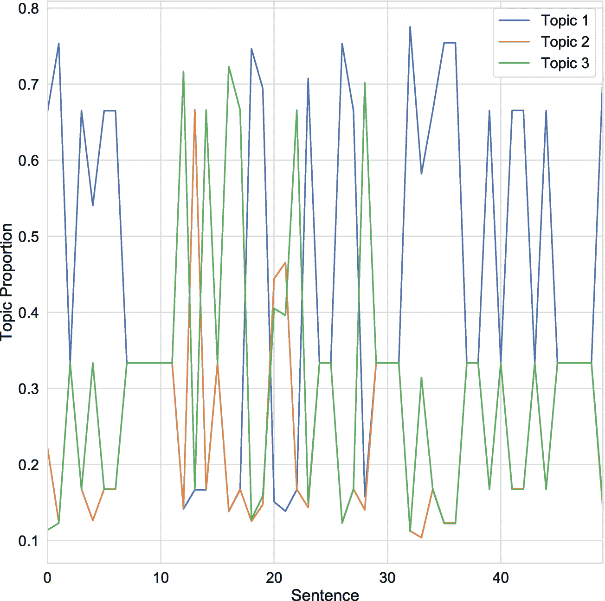

# 六、文本数据

经济和金融学科通常不愿意集成各种形式的非结构化数据。一个例外是文本，它已被应用于各种各样的经验问题。这在一定程度上可能是早期经济学成功应用的结果，如 Romer 和 Romer (2004 年)证明了衡量中央银行内部叙事的经验性价值。

文本被更广泛地采用也可能是因为它在经济学和金融学中的许多自然应用。例如，它可以用于提取潜在变量，如报纸中的经济政策不确定性，社交媒体内容中的 <sup>1</sup> 消费者通胀预期(Angelico 等人，2018 年)，以及公告和文件中的央行和私营企业情绪。 <sup>2</sup> 它还可以用来预测银行困境(Cerchiello et al. 2017)，衡量新闻媒体对商业周期的影响(Chahrour et al. 2019)，识别消费者金融投诉中欺诈的描述(Bertsch et al. 2020)，分析金融稳定性(Born et al . 2013Correa 等人 2020)，预测经济变量(Hollrah 等人 2018；卡拉马拉等。al 2020)，并研究央行决策。 <sup>3</sup>

当罗伯特·希勒(Robert Shiller)在美国经济协会(American Economic Association)发表题为“叙事经济学”(Shiller 2017)的主席演讲时，经济学中对文本数据的关注再次受到重视。他认为，经济学和金融学的学术工作未能解释流行叙事的兴衰，流行叙事有能力推动宏观经济和金融波动，即使叙事本身是错误的。然后，他建议该学科应该通过探索基于文本的数据集和方法来开始纠正这一缺陷的长期项目。

本章将讨论如何在经济学和金融学的背景下准备和应用文本。自始至终，我们将使用 TensorFlow 进行建模，但也将利用自然语言工具包(NLTK)来预处理数据。我们还将经常参考和使用 Gentzkow 等人(2019)的约定，该约定提供了经济学和金融学中许多文本分析主题的全面概述。

## 数据清理和准备

任何文本分析项目的第一步都是清理和准备数据。例如，如果我们想利用报纸上关于一家公司的文章来预测其股票市场的表现，我们首先需要收集报纸文章，然后将这些文章中的文本转换成数字格式。

我们将文本转换成数字的方式将决定我们可以执行什么类型的分析。因此，数据清理和准备步骤将是任何此类项目流程中的重要部分。我们将在这一小节中讨论它，重点是使用自然语言工具包(NLTK)实现它。

我们将从安装 NLTK 开始。然后我们将导入它并下载它的模型和数据集。您可以使用`nltk.download('book')`下载与书籍相关的数据，`nltk.download('popular')`下载最流行的包，或者`nltk.download('all')`下载所有可用的数据集和模型，这就是我们在清单 6-1 中所做的。

```py
# Install nltk.
!pip install nltk

# Import nltk.
import nltk

# Download all datasets and models
nltk.download('all')

Listing 6-1Install, import, and prepare NLTK

```

既然我们已经安装了 NLTK 并下载了所有的数据集和模型，我们就可以利用它的基本数据清理和准备工具了。但是，在我们这样做之前，我们需要准备一个数据集并引入一些符号。

### 收集数据

我们将使用的数据来自美国证券交易委员会(SEC)的文件，可以通过他们的在线系统 EDGAR 获得。<sup>4</sup>EDGAR 界面，如图 6-1 所示，允许用户进行各种查询。我们将首先打开公司备案界面。在这里，我们可以按公司名称搜索文档，或者指定搜索参数，返回符合该标准的所有公司的文档。假设我们想要创建一个项目来监控 SEC 关于金属采矿业的文档。在这种情况下，我们将通过标准行业分类(SIC)代码进行搜索。


图 6-1

EDGAR 公司档案搜索界面。资料来源:SEC.gov

调出 [SEC 的 SIC 代码列表](https://www.sec.gov/info/edgar/siccodes.htm)，我们可以看到金属矿业被分配了代码 1000，归能源和运输办公室负责，如图 6-2 所示。我们现在可以搜索具有 1000 SIC 代码的公司的所有申请，产生图 6-3 中给出的结果。每页列出公司、与申报相关的州或国家，以及中央索引键(CIK)，可用于识别申报的个人或公司。

在我们的例子中，我们将选择“Americas Gold and Silver Corp .”的归档，您可以通过在 CIK 字段中搜索 0001286973 来找到它。从那里，我们将看看 2020-05-15 的 6k 财务文件中的图表 99.1 的文本。我们在图 6-4 中显示了该申请的标题和一些文本。


图 6-2

SIC 分类代码的部分列表。资料来源:SEC.gov

正如我们在图 6-4 中看到的，该文件对应于 2020 年第一季度，似乎包含了对评估其价值有用的公司信息。例如，我们可以看到关于公司收购的信息。它还讨论了特定地点的采矿生产计划。现在我们知道了如何从 EDGAR 系统中检索归档信息，并确定了感兴趣的特定归档，我们将引入符号来描述这些文本信息。然后，我们将回到 NLTK 中的清理和准备任务。


图 6-4

一家金属矿业公司的部分 6k 财务档案。资料来源:SEC.gov


图 6-3

金属矿业公司搜索结果的部分列表。资料来源:SEC.gov

### 文本数据符号

我们将使用的符号遵循 Gentzkow 等人(2019)。我们将让 *D* 来表示一组 *N* 文档或“语料库” *C* 将表示一个数字数组，它包含对每个文档的 *K* 特征的观察值，*D*<sub>*j*</sub>∈*D*。在某些情况下，我们将使用 *C* 来预测结果 *V* ，或者在两步随机推理问题中使用拟合值。

在我们应用 NLTK 清理和准备数据之前，我们必须回答以下两个问题:

1.  什么是 *D* ？

2.  *D* 的哪些特点要体现在 *C* 中？

如果我们只处理一份 6-K 文件，那么 *D* <sub>*j*</sub> 可能是该文件中的一个段落或句子。或者，如果我们有许多 6-K 备案，那么 *D* <sub>*j*</sub> 很可能代表单个备案。为了固定一个例子，我们假设 *D* 是单个 6k 填充中的句子集合——也就是我们前面讨论的那个。

那么，什么是 *C* ？这取决于我们希望从申请的每个句子中提取的特征或“记号”。在许多情况下，我们将使用字数作为特征；在这个例子中我们也会这样做。等式 6-1 给出了 *C* 的表达式，通常称为“文档-特征”或“文档-术语”矩阵。

*方程式 6-1。* *文档-特征矩阵* *。*


每个元素， *c* <sub>*ij*</sub> ，是单词 *j* 在句子 *i* 中出现的频率。我们可能会问的一个自然问题是*哪些*单词包含在矩阵中？我们应该在给定的词典中包含所有的单词吗？还是应该限制在语料库中至少出现一次的词？

### 数据准备

在实践中，我们将根据一些过滤标准选择最大数量的单词， *K* 。除此之外，在清理和数据准备过程中，我们通常还会删除所有非文字符号，如数字和标点符号。这通常由四个步骤组成，我们概括如下，然后在一个使用 NLTK 的示例中实现:

1.  **转换成小写**:文本数据本来就是高维的，这将迫使我们尽可能地使用降维策略。我们可以这样做的一个简单方法是忽略大写。我们不是将“gold”和“Gold”作为单独的特征，而是将所有字符转换为小写，并将其视为同一个单词。

2.  **去掉停用词和生僻字**:很多词不包含有意义的内容，比如冠词、连词、介词等。出于这个原因，我们通常会编制一个“停用词”列表，在清理过程中会从文本中删除这些停用词。如果我们的 *C* 矩阵由字数组成，那么知道单词“the”和“and”被使用了多少次并不能告诉我们多少关于我们感兴趣的主题的信息。类似地，当我们从文档术语矩阵中排除单词时，我们通常会排除罕见的单词，这些单词出现的频率不足以让模型辨别它们的含义。

3.  **词干化或词汇化**:进一步降低数据维度的需求通常会导致我们执行“词干化”或“词汇化”词干需要把一个单词转换成它的词干。也就是说，我们可以将动词“running”映射为“run”由于许多单词将映射到同一个词干，这将减少问题的维数，就像转换成小写字母一样。删除词干可能会导致非单词，当项目的目标是产生可解释的输出时，这可能是不可取的。在这种情况下，我们将考虑使用词汇化，它将许多单词映射到一个单词，但使用单词的“基本”或“词典”版本，而不是词干。

4.  **去除** **非文字元素**:我们在经济和金融中遇到的大多数问题，都不可能使用标点符号、数字和特殊字符和符号。为此，我们将丢弃它们，而不是将它们包含在文档术语矩阵中。

我们现在将逐步完成 NLTK 中的这些清理和准备步骤。为了完整起见，我们将使用清单 6-2 中的`urllib`和`BeautifulSoup`从 SEC 网站下载 6-K 文件。理解这些库对于理解本章的其余部分并不是必要的。

```py
from urllib.request import urlopen
from bs4 import BeautifulSoup

# Define url string.
url = 'https://www.sec.gov/Archives/edgar/data/1286973/000156459020025868/d934487dex991.htm'

# Send GET request.
html = urlopen(url)

# Parse HTML tree.
soup = BeautifulSoup(html.read())

# Identify all paragraphs.
paragraphs = soup.findAll('p')

# Create list of the text attributes of paragraphs.
paragraphs = [p.text for p in paragraphs]

Listing 6-2Download HTML and extract text

```

为了简单说明清单 6-2 的内容，我们先导入两个子模块:`urllib.request`中的`urlopen`和`bs4`中的`BeautifulSoup`。`urlopen`子模块允许我们发送 GET 请求，这是从服务器请求文件的一种方式。在这种情况下，我们请求位于指定的`url`的 HTML 文档。然后我们使用`BeautifulSoup`从 HTML 创建一个解析树，这样我们就可以利用它的结构，通过标签来搜索它。接下来，我们搜索“p”或段落标记的所有实例。使用 list comprehension，我们将遍历每个实例，返回它的`text`属性，我们将把它收集到一个字符串列表中。

回想一下，我们决定使用句子，而不是段落，作为我们的分析单位。这意味着我们需要将段落连接成一个字符串，然后决定如何识别该字符串中的句子。我们将从合并和打印清单 6-3 中的段落开始。

```py
# Join paragraphs into single string.
corpus = " ".join(paragraphs)

# Print contents.
print(corpus)

Darren Blasutti VP, Corporate Development & Communications President and CEO Americas Gold and Silver Corporation Americas Gold and Silver Corporation 416-874-1708 Cautionary Statement on Forward-Looking Information: This news release contains "forward-looking information" within\n      the meaning of applicable securities laws. Forward-looking information includes,\n  ...

Listing 6-3Join paragraphs into single string

```

在打印文集时，我们可以看到它需要清理。它包含标点符号、停用词、换行符和特殊字符，所有这些都需要在计算文档特征矩阵之前删除。现在，我们可能想从清理步骤开始，但这样做会删除文本中构成句子的指示符。出于这个原因，我们将首先把文本分成句子。

虽然我们可以编写一个函数来基于标点符号的位置执行拆分，但这是自然语言处理中已经解决的问题，并且在 NLTK 工具箱中实现。在清单 6-4 中，我们导入 NLTK，实例化一个“句子标记器”，它将一个文本分割成单独的句子，然后将它应用于我们在上一步中构建的语料库。

```py
import nltk

# Instantiate sentence tokenizer.
sentTokenizer = nltk.sent_tokenize

# Identify sentences.
sentences = sentTokenizer(corpus)

# Print the number of sentences.
print(len(sentences))

50

# Print a sentence.
print(sentences[7])

The Company continues to target commercial production by late Q2-2020 or early Q3-2020 and will be providing more regular updates regarding the operation between now and then.

Listing 6-4Tokenize text into sentences using NLTK

```

下一步是执行前面讨论的清理任务。尽管为此目的定义一个函数通常是有意义的，但为了清楚起见，我们将把它分成三个步骤。我们首先将所有字符转换成小写，并删除清单 6-5 中的停用词。现在，我们将在语料库中留下生僻字。

```py
from nltk.corpus import stopwords

# Convert all characters to lowercase.
sentences = [s.lower() for s in sentences]

# Define stop words as a set.
stops = set(stopwords.words('english'))

# Instantiate word tokenizer.
wordTokenizer = nltk.word_tokenize

# Divide corpus into list of lists.
words = [wordTokenizer(s) for s in sentences]

# Remove stop words.
for j in range(len(words)):
        words[j] = [w for w in words[j] if
        w not in stops]

# Print first five words in first sentence.
print(words[0][:5])

['americas', 'gold', 'silver', 'corporation', 'reports']

Listing 6-5Convert characters to lowercase and remove stop words

```

在下一步中，我们将应用词干分析器，通过将每个单词折叠到词干中来减少数据集的维数。在清单 6-6 中，我们导入了 Porter stemmer (Porter 1980)，实例化它，然后将其应用于每个句子中的每个单词。我们再次打印第一句话中的前五个单词。我们可以看到词干分析器将“corporate”映射到“corpor”，将“reports”映射到“report”。回想一下，词干并不总是单词。

```py
from nltk.stem.porter import PorterStemmer

# Instantiate Porter stemmer.
stemmer = PorterStemmer()

# Apply Porter stemmer.
for j in range(len(words)):
        words[j] = [stemmer.stem(w) for w in words[j]]

# Print first five words in first sentence.
print(words[0][:5])

['america', 'gold', 'silver', 'corpor', 'report']

Listing 6-6Replace words with their stems

```

清理过程的最后一步是删除特殊字符、标点符号和数字。我们将使用正则表达式来做到这一点，它通常被称为“正则表达式”正则表达式是一个短字符串，它对文本中可以识别的模式进行编码。在我们的例子中，字符串是`[^a-z]+`。括号表示该模式覆盖一系列字符，即字母表中的所有字符。我们使用插入符号`^`来否定这个模式，表示正则表达式应该只匹配不包含在其中的字符。这当然包括特殊符号、标点和数字。最后，`+`符号表示我们允许这样的符号在序列中重复出现。

清单 6-7 实现了清洁过程中的最后一步。我们首先导入库`re`，用来实现正则表达式。接下来，我们遍历每个句子中的每个单词，并用一个空字符串替换任何模式匹配。这给我们留下了一个句子列表，每个句子又被分解成一个单词列表。由于这个过程会留下一些空字符串，我们将重新连接每个句子中的单词。我们还将删除句子开头和结尾的任何空白。

```py
import re

# Remove special characters, punctuation, and numbers.
for j in range(len(words)):
        words[j] = [re.sub('[^a-z]+', '', w)
        for w in words[j]]

# Rejoin words into sentences.
for j in range(len(words)):
        words[j] = " ".join(words[j]).strip()

# Print sentence.
print(words[7])

compani continu target commerci product late q earli q provid regular updat regard oper

Listing 6-7Remove special characters and join words into sentences

```

再次打印同一个句子，我们可以看到它现在看起来与原来的形式大不相同。而不是一个句子，它看起来像一个词干的集合。实际上，在下一节中，我们将应用一种文本分析形式，将文档视为单词的集合，而忽略它们出现的顺序。这通常被称为“词汇袋”模型。

## 单词袋模型

在上一节中，我们提出了一种可能的文档术语(DT)矩阵的构造， *C* ，将使用字数作为特征。这种表示法不允许我们考虑语法或词序，但它允许我们捕捉词频。在经济和金融中有许多问题，我们将能够在这种限制下实现我们的目标。

我们描述的模型被称为“词袋”(BoW)模型，它是由 Salton 和 McGill (1983)在信息检索文献中介绍的。词汇袋一词似乎起源于 Harris (1954)的一个语言学语境:

> 我们建立了一个话语库，每个话语都是特定元素的特定组合。这种元素组合的存量成为一个因素……因为语言不仅仅是一袋单词，而是一种工具，在使用过程中形成了具有特定属性的工具。

在这一节中，我们将看到如何构建一个 BoW 模型，从上一节中清理和准备的数据开始。除了 NLTK，我们还将使用来自`sklearn`的子模块来构建 DT 矩阵。虽然 NLTK 中有一些例程来执行这样的任务，但是它们不是核心模块的一部分，通常效率较低。

回想一下`words`包含了我们从一家金属矿业公司的 6k 文件中提取的 50 个句子。我们将使用这个列表来构建清单 6-8 中的文档术语矩阵，这里我们从从`sklearn.feature_extraction`导入`text`开始。然后我们将实例化一个`CounterVectorizer()`，它将计算每个句子中单词的频率，然后基于一些约束构造 *C* 矩阵，这些约束可以作为参数提供。为了便于说明，我们将`max_features`设为 10。这将限制文档术语矩阵中的最大列数不超过 10。

接下来，我们将把`fit_transform()`应用到`words`，将其转换成文档术语矩阵 *C* 。由于 *C* 对于许多问题来说会很大，`sklearn`将其保存为一个稀疏矩阵。您可以使用`toarray()`方法将其转换为数组。我们还可以应用`vectorizer()`的`get_feature_names()`来恢复对应于每一列的术语。

```py
from sklearn.feature_extraction import text

# Instantiate vectorizer.
vectorizer = text.CountVectorizer(max_features = 10)

# Construct C matrix.
C = vectorizer.fit_transform(words)

# Print document-term matrix.
print(C.toarray())
[[3 1 0 2 0 0 1 0 2 2]
 [1 2 0 1 0 0 0 0 0 1]
        ...
        ...
        ...
 [0 1 0 0 0 1 0 0 0 0]
 [0 0 0 0 0 0 0 1 1 0]]

# Print feature names.
print(vectorizer.get_feature_names())

['america', 'compani', 'cost', 'gold', 'includ',
'inform', 'oper', 'product', 'result', 'silver']

Listing 6-8Construct the document-term matrix

```

打印文档术语矩阵和特性名称，我们可以看到我们恢复了十个不同特性的计数。虽然这对于说明来说是有用的，但是我们通常希望在实际应用中使用更多的特性；然而，允许更多的功能可能会导致包含不太有用的功能，这将需要使用过滤。

`Sklearn`为我们提供了两个额外的参数，我们可以使用它们来执行过滤:`max_df`和`min_df`。`max_df`参数决定了一个术语在从术语矩阵中删除之前可能出现在文档中的最大数量或比例。同样，最低门槛是由`min_df`给出的。在这两种情况下，指定一个整数值(如 3)表示文档数，而指定一个浮点数(如 0.25)表示文档的比例。

指定最大阈值的价值在于，它将删除所有出现过于频繁而无法提供有意义变化的术语。例如，如果一个术语出现在超过 50%的文档中，我们可能希望通过将`max_df`指定为 0.50 来删除它。在清单 6-9 中，我们再次计算文档术语矩阵，但是这次允许多达 1000 个术语，并且还应用过滤来删除出现在超过 50%或少于 5%的文档中的术语。

如果我们打印出 *C* 矩阵的形状，我们可以看到文档术语矩阵似乎没有受到最大特征限制 1000 的约束，因为只返回了 109 个特征列。这可能是我们选择最大文档频率和最小文档频率参数的结果，这些参数消除了对我们的目的不太可能有用的术语。

我们可以执行过滤的另一种方法是使用术语频率逆文档频率(tf-idf)度量，如公式 6-2 所示。

*方程式 6-2。计算 j 列的词频倒数-文档频率*

![$$ tfid{f}_j={\sum}_i{c}_{ij}\ast \mathit{\log}\left(\frac{N}{\sum_i{1}_{\left[{c}_{ij}&gt;0\right]}}\right) $$](img/496662_1_En_6_Chapter_TeX_Equb.png)

为文档术语矩阵 *C* 中的每个特征 *j* 计算 tf-idf。它由两个分量的乘积组成:(1)术语 *j* 在语料库中的所有文档中出现的频率，∑<sub>I</sub>*c*<sub>*ij*</sub>；以及(2)文档计数的自然对数除以术语 *j* 至少出现一次的文档的数量![$$ N/{\sum}_i{1}_{\left[{c}_{ij}&gt;0\right]} $$](img/496662_1_En_6_Chapter_TeX_IEq2.png)。tf-idf 度量随着 *j* 在整个语料库中出现的次数的增加而增加，并且随着 *j* 出现的文档的份额的减少而减少。如果 *j* 不经常使用或者在太多文档中使用，tf-idf 得分会很低。

```py
# Instantiate vectorizer.
vectorizer = text.CountVectorizer(
        max_features = 1000,
        max_df = 0.50,
        min_df = 0.05
)

# Construct C matrix.
C = vectorizer.fit_transform(words)

# Print shape of C matrix.
print(C.toarray().shape)

(50, 109)

# Print terms.
print(vectorizer.get_feature_names()[:10])

['abil', 'activ', 'actual', 'affect', 'allin', 'also', 'america', 'anticip', 'approxim', 'avail']

Listing 6-9Adjust the parameters of CountVectorizer()

```

在清单 6-10 中，我们重复了与清单 6-8 相同的步骤，但是我们使用了`TfidfVectorizer()`，而不是`CountVectorizer()`。这允许我们访问`idf_`参数，它包含逆文档频率分数。然后，我们可以通过删除 tf-idf 得分低于某个阈值的列来选择性地执行筛选。

```py
# Instantiate vectorizer.
vectorizer = text.TfidfVectorizer(max_features = 10)

# Construct C matrix.
C = vectorizer.fit_transform(words)

# Print inverse document frequencies.
print(vectorizer.idf_)

[2.36687628 1.84078318 3.14006616 2.2927683  2.44691898 2.22377543 1.8873032  2.22377543 2.22377543 2.2927683 ]

Listing 6-10Compute inverse document frequencies for all columns

```

在一些应用中，我们可能希望使用一个序列中的几个单词(n-grams)——而不是单个单词(unigrams)——作为我们的特征。我们可以通过设置`TfidfVectorizer()`或`CountVectorizer()`的`ngram_range`参数来实现。在清单 6-11 中，我们将参数设置为(2，2)，这意味着我们只允许两个单词的序列(二元模型)。请注意，元组中的第一个值是最小字数，第二个值是最大字数。我们可以看到，返回的特性名称集现在不同于我们在清单 6-9 中生成的 unigrams。

一般来说，应用词袋模型和计算文档术语矩阵将只是自然语言处理项目的第一步；然而，它应该是直截了当地看到，这样一个矩阵可以与计量经济学的标准工具相结合，以执行分析。例如，如果我们有一个与每份文件相关的因变量，比如一家公司在 SEC 备案的同一天的股票回报，我们可以将这两者结合起来训练一个预测模型或测试一个假设。

```py
# Instantiate vectorizer.
vectorizer = text.TfidfVectorizer(
        max_features = 10,
        ngram_range = (2,2)
)

# Construct C matrix.
C = vectorizer.fit_transform(words)

# Print feature names.
print(vectorizer.get_feature_names())

['america gold', 'cosal oper', 'forwardlook inform', 'galena complex', 'gold silver', 'illeg blockad', 'oper result', 'recapit plan', 'relief canyon', 'silver corpor']

Listing 6-11Compute the document-term matrix for unigrams and bigrams

```

## 基于字典的方法

在前面的小节中，我们清理和准备了数据，然后使用单词袋模型对其进行了探索。这产生了一个 NxK 文档术语矩阵， *C* ，它由每个文档的字数组成。我们过滤了文档术语矩阵中的某些单词，但是对于我们希望在文本中找到什么特征，我们仍然不知道。

这种方法的一种替代方法是使用预先选择的单词“字典”，它被构造来捕捉文本中的一些潜在特征。这种方法通常被称为“基于词典的方法”，是经济学中最常用的文本分析形式。

经济学中基于词典的方法的早期应用是利用《华尔街日报》文章中的潜在“情绪”来研究新闻和股市表现之间的关系(Tetlock 2007)。后来的工作，如 Loughran 和 McDonald (2011)和 Apel 和 Blix 马尔迪(2014)，引入了旨在测量特定潜在变量的字典，这导致它们在文献中的广泛使用。Loughran 和 McDonald (2011)介绍了一个 10-K 财务文件字典，它最终被用来衡量许多情况下的消极和积极情绪。阿佩尔和布利克斯·马尔迪(2014)推出了一部字典，用来衡量央行沟通中的“鹰派”和“鸽派”。

Gentzkow 等人(2019)认为，经济学和社会科学应该扩展他们用于进行文本分析的工具集。与其将基于字典的方法作为默认选择，不如仅在满足以下两个条件时才考虑使用它们:

1.  你所拥有的关于潜在变量及其在文本中的表现方式的先验信息是强大而可靠的。

2.  文本中关于潜在变量的信息是微弱而分散的。

一个理想的例子是贝克等人(2016)引入的经济政策不确定性(EPU)指数。他们想要测量的潜在变量是一个理论对象，他们通过识别涉及经济、政策和不确定性的词语的联合使用来捕捉文本。如果不为这样的对象指定一个字典，它就不太可能作为一个公共特性或主题出现在模型中。此外，在指定了词典之后，他们通过将 EPU 指数得分与人类对相同报纸文章的评分进行比较，证明了词典抓住了潜在的理论目标。

由于基于字典的方法实现起来很简单，并且不需要使用 TensorFlow，所以我们将用一个涉及 Loughran-McDonald (LM)字典的例子来演示它们是如何工作的。我们将从使用`pandas`加载清单 6-12 中的 LM 字典开始。 <sup>5</sup> 我们将使用`pandas`的`read_excel`子模块，并指定文件路径和工作表名称。注意，我们已经指定了“阳性”表，因为在这个例子中我们将专门使用阳性词词典。

```py
import pandas as pd

# Define data directory path.
data_path = '../data/chapter6/'

# Load the Loughran-McDonald dictionary.
lm = pd.read_excel(data_path+'LM2018.xlsx',
        sheet_name = 'Positive',
        header = None)

# Convert series to DataFrame.
lm = pd.DataFrame(lm.values, columns = ['Positive'])

# Convert to lower case.
lm = lm['Positive'].apply(lambda x: x.lower())

# Convert DataFrame to list.
lm = lm.tolist()

# Print list of positive words.
print(lm)

['able',
 'abundance',
 'abundant',
         ...
 'innovator',
        ...
 'winners',
 'winning',
 'worthy']

Listing 6-12Compute the Loughran-McDonald measure of positive sentiment

```

接下来，我们将把熊猫`Series`转换成`DataFrame`，并使用字典的列标题“Positive”。然后我们将使用一个`lambda`函数将所有单词转换成小写，因为它们在 LM 字典中是大写的。最后，我们将把`DataFrame`转换成一个列表对象，然后打印。查看最后三个术语，我们可以看到其中两个术语——winner 和 winning——很可能具有相同的词干。

一般来说，我们通常要么想从词典中提取词干，从语料库中提取词干，要么两者都不提取。因为我们已经对语料库进行了词干分析——即，来自 6k 填充的句子——我们也将对词典进行词干分析，在此过程中删除重复的词干。我们在清单 6-13 中这样做。

```py
from nltk.stem.porter import PorterStemmer

# Instantiate Porter stemmer.
stemmer = PorterStemmer()

# Apply Porter stemmer.
slm = [stemmer.stem(word) for word in lm]

# Print length of list.
print(len(slm))

354

# Drop duplicates by converting to set.
slm = list(set(slm))

# Print length of list.
print(len(slm))

151

Listing 6-13Stem the LM dictionary

```

按照本章前面的步骤，我们将首先实例化一个 Porter 词干分析器，然后使用 list comprehension 将它应用于字典中的每个单词。原始列表包含 354 个单词。如果我们随后将该列表转换为一个集合，这将删除重复的词干，从而将字典术语的数量减少到 151 个。

下一步是获取包含我们从文档中提取的 50 个句子的`words`列表，并统计阳性词干的实例。回想一下，我们对句子中的每个单词进行了清理和词干处理，然后将它们存储为字符串。我们需要遍历每个字符串，计算每个正面单词出现的次数。我们将在清单 6-14 中这样做。

```py
# Define empty array to hold counts.
counts = []

# Iterate through all sentences.
for w in words:
        # Set initial count to 0.
        count = 0
        # Iterate over all dictionary words.
        for i in slm:
                count += w.count(i)
        # Append counts.
        counts.append(count)

Listing 6-14Count positive words

```

在清单 6-14 中，我们从定义一个空列表来保存计数开始。然后，我们在外部循环中迭代包含在`words`列表中的所有字符串。每当我们开始一个新句子时，我们将正字数设置为 0。然后我们遍历内部循环，遍历词干 LM 字典中的所有单词，计算它们在字符串中出现的次数，并将其加到总数中。我们将每个句子的总数追加到`counts`。

图 6-5 显示了正字数的直方图。我们可以看到，大多数句子没有，而一个句子有十个以上。如果我们在文档级别执行这种分析，正如我们通常会做的那样，我们很可能会发现大多数 6k 申请的非零值。


图 6-5

6-K 填充中正单词数在句子中的分布

原则上，我们可以将我们的阳性计数作为一个特征包含在回归中。然而，在实践中，我们通常会使用 count 变量的转换，它有更自然的解释。如果我们没有零计数，我们可以使用计数的自然对数，使我们能够将估计的效应解释为对阳性百分比变化的影响。或者，我们可以使用正面单词与所有单词的比率。

最后，在经济和金融应用中，通常使用净指数，结合积极和消极或“鹰派”和“鸽派”，如等式 6-3 所示。通常，我们会取正字数和负字数之差，然后除以一个归一化因子。该因子可以是文档的总字数，或者是正项和负项的总和。

*方程式 6-3。* *净积极性指数* *。*


## 单词嵌入

到目前为止，我们已经使用了一键编码(虚拟变量)来构造单词的数字表示。这种方法的一个潜在缺点是，我们隐含地假设每对单词都是正交的。例如,“通货膨胀”和“价格”这两个词被认为彼此没有关系。

使用单词作为特征的替代方法是使用嵌入。与具有高维稀疏表示的单词向量相反，单词嵌入使用低维密集表示。这种密集的表示允许我们识别单词的相关程度。

图 6-6 提供了一个一键编码字和密集字嵌入的简单比较。“…通货膨胀急剧上升…”这句话可能会出现在央行的声明中，可以用这两种方法中的任何一种进行编码。如果我们使用 one-hot 编码方法，如图左侧所示，每个单词都将被转换为一个稀疏的高维向量。并且每个这样的向量将与所有其他向量正交。另一方面，如果我们使用嵌入，每个单词将与一个低维的密集表示相关联，如图 6-6 的右图所示。两个这样的向量之间的关系是可测量的，并且可以被捕获，例如，使用它们的内积。等式 6-4 给出了两个维度为*n*–*x*和 *z* 的向量的内积公式。

*方程式 6-4。两个向量 x 和 z 的内积*


图 6-6

一键编码和单词嵌入的比较

虽然内积可以给我们两个单词之间关系的简明摘要，但是它不能提供关于两个嵌入向量如何相关的更详细的信息。为此，我们可以直接比较一对向量中相同位置的元素。这些元素提供了对相同特征的测量。虽然我们可能无法确定潜在的特征是什么，但是我们知道在相同的位置有相似的值表明两个单词在该维度上是相关的。

与一次性编码相反，我们需要使用一些监督或无监督的方法来训练嵌入。由于嵌入需要捕捉单词中的含义和单词之间的关系，所以自己进行训练通常没有意义。除此之外，嵌入层将需要学习您执行分析所用的语言，并且您提供的语料库几乎肯定不足以完成该任务。

因此，您通常会使用预训练的单词嵌入。常见的选择包括 Word2Vec (Mikolov 等人 2013)和单词表示的全局向量(Pennington 等人 2014)。

请注意，单词嵌入和卷积层之间有很强的相似性。对于卷积层，我们说它们包括通用视觉滤波器。出于这个原因，使用预先训练在数百万张图像上的模型的卷积层通常是有意义的。此外，我们说过可以“微调”此类模型的训练，以提高特定图像分类任务的局部性能。单词嵌入也是如此。

## 主题建模

主题模型的目的是发现语料库中潜在的一组主题，并确定这些主题在各个文档中的存在程度。第一个主题模型，潜在的狄利克雷分配(LDA)，在 Blei 等人(2003)中被引入到机器学习文献中，并且此后在许多领域中找到了应用，包括经济学和金融学。

虽然 TensorFlow 没有提供标准主题模型的实现，但它是许多复杂主题模型的首选框架。一般来说，主题模型如果利用深度学习，将更有可能在 TensorFlow 中实现。

由于主题建模在经济学中的应用越来越多，我们将在这一部分提供一个简短的介绍，尽管我们不会使用 TensorFlow。我们将从静态 LDA 模型 Blei et al. (2003)的理论概述开始，然后描述如何使用`sklearn`实现和调整它。我们将通过讨论最近引入的模型变体来结束这一部分。

在 Blei 等人(2003)中，LDA 模型描述如下:

> 语料库的生成概率模型。其基本思想是将文档表示为潜在主题的随机混合，其中每个主题都以单词分布为特征。

有几个概念值得解释，因为它们会在本章和正文中反复出现。首先，该模型是“生成性的”,因为它生成一个新颖的输出——主题分布——而不是执行一个判别任务，例如学习一个文档的分类。第二，它是“概率性的”,因为该模型明确基于概率论并产生概率。第三，我们说主题是“潜在的”,因为它们没有被明确地测量或标记，而是被假定为文档的潜在特征。

虽然我们不会讨论求解 LDA 模型的细节，但我们将简要总结 Blei et al. (2003)中模型的基本假设，从符号开始。首先，他们假设单词是从长度为 *V* 的固定词汇表中抽取的，并使用独热编码向量来表示它们。接下来，他们将文档定义为一个由 *N* 个单词、 *w* = ( *w* <sub>1</sub> 、 *w* <sub>2</sub> 、…、 *w* <sub>*N*</sub> )组成的序列。最后，他们将一个语料库定义为文档的集合，*D*= {*w*<sub>1</sub>， *w* <sub>2</sub> ，…，*w*<sub>*M*</sub>}。

该模型对在语料库中生成文档 *w* 、文档 *D* 的基础过程做出三个假设:

1.  每个文档中的字数 *N* 、 *w* 来自泊松分布。

2.  潜在话题是从一个 *k* 维随机变量 *θ* 中抽取出来的，这个变量有一个狄利克雷分布: *θ* ~ *Dir* ( *α* )。

3.  对于每个单词， *n* ，一个主题，*z*<sub>n</sub>，从一个以 *θ* 为条件的多项式分布中抽取。然后，根据主题的条件，从多项式分布中抽取单词本身， *z* <sub>*n*</sub> 。

作者认为字数的泊松分布不是一个重要的假设，使用一个更现实的假设会更好。狄利克雷分布的选择将 *θ* 约束为一个 *(k-1)* 维单形。它还提供了贝塔分布的多元推广，并由正值权重的 k 向量 *α* 来参数化。Blei 等人(2003)选择狄利克雷分布有三个原因:“*…它属于指数族，具有有限维的充分统计量，并且与多项式分布共轭。”他们认为这将确保它在估计和推理算法中的适用性。*

主题分布的概率密度 *θ* 在等式 6-5 中给出。

*方程式 6-5。话题的分布。*


在图 6-7 中，我们提供了在 *k* = 2 的情况下，从狄利克雷分布中随机抽取 100 次的直观图示。在图 6-7 的左侧面板中，我们设置*α*=【0.9，0.1】，在右侧面板中，我们设置*α*=【0.5，0.5】。在这两种情况下，所有点都位于单纯形上。也就是说，对与任何点相关的坐标求和将得到 1。此外，我们可以看到，选择相同的值 *α* <sub>0</sub> 和 *α* <sub>1</sub> 会产生沿单纯形均匀分布的点，而增加 *α* <sub>0</sub> 的相对值会导致向水平轴倾斜(即，主题 *θ* <sub>*k*</sub> )。


图 6-7

从狄利克雷分布随机抽取的图，k=2，参数向量 0.9，0.1 和 0.5，0.5

接下来，我们将实现一个 LDA 模型，利用我们之前通过将 6-K 文件分成句子构建的文档语料库。回想一下，我们使用`CountVectorizer`定义了一个文档术语矩阵 *C* 。我们将在清单 6-15 中使用这两者，我们从从`sklearn.decomposition`导入`LatentDirichletAllocation`开始。接下来，我们用我们首选的参数值实例化一个模型。在这种情况下，我们将只设置主题的数量，`n_components`。这对应于理论模型中的 *k* 参数。

我们现在可以在文档术语矩阵上训练模型，并使用`lda.components_`恢复输出`wordDist`。注意`wordDist`有形状(3，109)。行对应潜在主题，列对应权重。权重越高，一个词对于定义一个主题就越重要。 <sup>6</sup>

接下来，我们将利用输出结果`wordDist`，为每个主题确定权重最高的单词。我们将定义一个空列表`topics`来保存主题。在列表理解中，我们将遍历每个主题数组，并应用`argsort()`来恢复对数组进行排序的索引。然后，我们将恢复最后五个索引并颠倒它们的顺序。

对于每个索引，我们将利用从`vectorizer`中恢复的`feature_names`来识别相关的术语。然后我们将打印主题列表。

一个完整的主题描述由词汇的权重向量组成。我们可以通过确定哪些单词具有足够高的权重来证明它们包含在主题描述中，从而选择如何描述这样的主题。在这种情况下，我们简单地使用了权重最高的五个单词；然而，原则上，我们可以使用阈值或其他标准。

```py
from sklearn.decomposition import LatentDirichletAllocation

# Set number of topics.
k = 5

# Instantiate LDA model.
lda = LatentDirichletAllocation(n_components = k)

# Recover feature names from vectorizer.
feature_names = vectorizer.get_feature_names()

# Train model on document-term matrix.
lda.fit(C)

# Recover word distribution for each topic.
wordDist = lda.components_

# Define empty topic list.
topics = []

# Recover topics.
for i in range(k):
        topics.append([feature_names[name] for
        name in wordDist[i].argsort()[-5:][::-1]])

# Print list of topics.
print(topics)

[['inform', 'america', 'gold', 'forwardlook', 'result'],
 ['oper', 'compani', 'product', 'includ', 'relief'],
 ['silver', 'lead', 'cost', 'ounc', 'galena']]

Listing 6-15Perform LDA on 6-K filing text data

```

既然我们已经确定了主题，下一步就是确定这些主题描述了什么。在我们的简单示例中，我们恢复了三个主题。第一个似乎参考了与黄金相关的前瞻性信息。第二个似乎涉及公司的运营和生产。第三个话题是关于金属的成本。

最后，我们通过使用我们的模型的`transform()`方法将主题概率分配给清单 6-16 中的句子来完成练习。

```py
# Transform C matrix into topic probabilities.
topic_probs = lda.transform(C)

# Print topic probabilities.
print(topic_probs)

array([[0.0150523 , 0.97172408, 0.01322362],
       [0.02115127, 0.599319  , 0.37952974],
       [0.33333333, 0.33333333, 0.33333333],
                                ...
       [0.93766165, 0.03140632, 0.03093203],
       [0.08632993, 0.82749933, 0.08617074],
       [0.95509882, 0.02178363, 0.02311755]])

Listing 6-16Assign topic probabilities to sentences

```

正如我们在清单 6-16 中看到的，输出是一个 shape (3，50)的矩阵，它包含每个句子的主题概率总和为 1。例如，如果我们收集了每个日期单独的 6-K 文件，而不是查看文件中的句子，我们现在就有了主题比例的时间序列。

我们还在图 6-8 中绘制了主题比例。我们可以看到，在文档文档中，跨句子的主题似乎是持久的。例如，主题 1 在文档的开头和结尾占主导地位，而主题 3 在中间重要性上升。



图 6-8

按句子划分的主题比例

虽然我们考虑了一个不需要仔细选择模型或训练参数的简单示例，但`sklearn`中的 LDA 实现实际上允许选择各种不同的参数。我们在下面考虑其中的六个参数:

1.  **主题先验**:默认情况下，LDA 模型将使用 1/ `n_components`作为 *α* 中所有元素的先验。然而，您可以通过为参数`doc_topic_prior`显式提供主题分布来提供不同的先验。

2.  **学习方法**:默认情况下，`sklearn`中的 LDA 模型将使用变分贝叶斯来训练模型，并将利用全样本来执行每次更新。但是，可以通过将`learning_method`参数设置为`'online'`来进行小批量训练。

3.  **批量**:在使用在线培训的条件下，您还可以选择更改小批量的默认值 128。您可以使用`batch_size`参数来完成此操作。

4.  **学习衰减**:使用在线学习方式时，可以使用`learning_decay`参数调整学习速率。较高的衰减值会降低我们从以前的迭代中保留的信息。默认值为 0.7，文档建议选择(0.5，1)区间内的衰减。

5.  **最大迭代次数**:设置最大迭代次数将在达到阈值后终止训练过程。默认情况下，`max_iter`参数设置为 128。如果模型没有在 128 次迭代内收敛，您可能希望为该参数设置一个较高的值。

最后，Blei 等人(2003)提出的标准 LDA 模型的两个局限性值得讨论。首先，主题的数量和内容都不会随着语料库的变化而变化。对许多问题来说，这不是问题；然而，对于涉及时间序列维度的经济学和金融学应用程序，这可能会很成问题，我们将在下一段中对此进行阐述。第二，LDA 模型没有对提取的主题提供任何有意义的控制。如果我们希望跟踪数据中特定类型的事件，我们可能无法使用 LDA 模型来做到这一点，因为无法保证它会识别这些事件。

关于第一个问题——即在时间序列环境中使用 LDA 可能会出现两个问题。首先，该模型将审查那些只短暂出现的主题，如金融危机，即使它们在出现的时期相当重要。第二，它将在主题分布中引入“前瞻”偏差，强制未来出现的主题也成为整个样本中的主题。这会造成这样的印象，即 LDA 模型会预测到事件，而如果样本在事件发生之日被截断，它就不会预测到事件。

关于第二个问题，LDA 提出了两个问题。首先，我们不可能将模型引向感兴趣的主题。例如，我们不能向 LDA 模型提交主题查询。第二个问题是模型产生的主题通常很难解释。这是因为主题只是词汇表中所有单词的简单分布。如果不研究主题的分布，不检查被确定为占主导地位的文档，我们通常无法确定主题到底是什么。

然而，最近开发的模型试图克服静态 LDA 模型的局限性。例如，Blei 和 Lafferty (2006)介绍了主题模型的动态版本。此外，Dieng 等人(2019 年)通过引入动态嵌入式主题模型(D-ETM)进一步扩展了这一点。这种模式是动态的，允许使用大量的词汇，并倾向于产生更多可解释的主题。这解决了与原始静态 LDA 模型相关的两个问题。

## 文本回归

正如 Gentzkow 等人(2019)所讨论的，经济学和金融学中的大多数文本分析都围绕着词袋模型和基于词典的方法。虽然这些技术在某些情况下很有用，但它们并不是解决所有研究问题的最佳工具。因此，许多涉及经济学文本分析的项目可能会通过使用不同于自然语言处理的方法而得到改进。

一种选择是使用文本回归，这是一个简单的回归模型，包括文本特征，如来自术语-文档矩阵的列，作为回归量。Gentzkow 等人(2019 年)认为，文本回归是经济学家采用的一种很好的候选方法。这是因为经济学家主要使用线性回归进行实证研究，并且通常熟悉惩罚线性回归。因此，学习如何执行文本回归主要是关于构建文档术语矩阵，而不是学习如何估计回归。

我们将从在 TensorFlow 中执行简单的文本回归开始这一部分。为此，我们需要构建文档术语矩阵和一个连续的因变量。我们将使用 SEC 系统中苹果的所有 8k 文件来构建文件术语矩阵，而不是使用 6k 文件中的句子。 <sup>7</sup>

为了简洁起见，我们将省略数据收集过程的细节，只是说我们执行了本章前面讨论的相同步骤来生成文档术语矩阵`x_train`，并将股票收益数据存储为`y_train`。总的来说，我们利用了 144 个文件并提取了 25 个单字计数来构建`x_train`。

回想一下第三章，带有 *k* 回归量的线性模型具有等式 6-6 中给出的形式。在这种情况下， *k* 回归量是来自文档术语矩阵的特征计数。请注意，我们使用 *t* 来索引文档，因为我们使用的是归档和返回的时间序列。

*方程式 6-6。一个* *线性模型* *。*


当然，我们可以利用 OLS，用解析表达式求解参数向量。然而，为了建立不易于分析的模型，我们将使用 LAD 回归。在清单 6-17 中，我们导入`tensorflow`和`numpy`，初始化一个常数项(`alpha`和系数向量(`beta`)，将`x_train`和`y_train`转换成`numpy`数组，然后定义一个函数(`LAD`，将参数和数据转换成预测。

回想一下，我们必须使用`tf.Variable()`来定义我们希望训练的参数，并且可以使用`np.array()`或`tf.constant()`来定义数据。

```py
import tensorflow as tf
import numpy as np

# Draw initial values randomly.
alpha = tf.random.normal([1], stddev=1.0)
beta = tf.random.normal([25,1], stddev=1.0)

# Define variables.
alpha = tf.Variable(alpha, tf.float32)
beta = tf.Variable(beta, tf.float32)

# Convert data to numpy arrays.
x_train = np.array(x_train, np.float32)
y_train = np.array(y_train, np.float32)

# Define LAD model.
def LAD(alpha, beta, x_train):
        prediction = alpha + tf.matmul(x_train, beta)
        return prediction

Listing 6-17Prepare the data and model for a LAD regression in TensorFlow

```

接下来的步骤是定义一个损失函数并执行最小化，我们在清单 6-18 中就是这么做的。我们将使用平均绝对误差(MAE)损失，因为我们正在执行 LAD 回归。然后，我们将用默认参数值实例化一个`Adam()`优化器。最后，我们将执行 1000 次训练迭代。

```py
# Define number of observations.
N = len(x_train)

# Define function to compute MAE loss.
def maeLoss(alpha, beta, x_train, y_train):
        y_hat = LAD(alpha, beta, x_train)
        y_hat = tf.reshape(y_hat, (N,))
        return tf.losses.mae(y_train, y_hat)

# Instantiate optimizer.
opt = tf.optimizers.Adam()

# Perform optimization.
for i in range(1000):
        opt.minimize(lambda: maeLoss(alpha, beta,
        x_train, y_train),
        var_list = [alpha, beta])

Listing 6-18Define an MAE loss function and perform optimization

```

现在我们已经训练了一个模型，我们可以将任意输入输入到`LAD`函数中，这将产生预测值。我们将使用`x_train`为清单 6-19 中的`y_train`生成预测`y_pred`。

```py
# Generate predicted values.
y_pred = LAD(alpha, beta, x_train)

Listing 6-19Generate predicted values from model

```

我们在图 6-9 中绘制了预测值与真实值的对比图。常数项与平均回报相匹配，预测似乎正确地捕捉了大多数变化的方向；然而，该模型通常无法解释数据中的大部分变化。


图 6-9

苹果股票回报的真实值和预测值

有几个与自然语言处理无关的原因可能解释了我们无法使用模型解释数据中的大部分变化。首先，1 天的时间窗口可能太大，可能会捕捉到与公告效果无关的进展。事实上，关于这个主题的许多经济学文献已经转移到集中于公告周围的更窄的窗口，例如 30 分钟。其次，我们在回归中没有包括任何非文本特征，如滞后回报、整个科技行业的回报或统计机构发布的数据。第三，预测意外回报具有挑战性，即使是好的模型通常也无法解释数据中的大多数变化。

然而，为了这个练习的目的，让我们把这些都放在一边，考虑一下我们如何改进纯粹基于公告的 NLP 的预测。一个好的起点可能是质疑我们是否选择了包含有意义的内容来解释回报的单字谜。考虑到我们不加批判地接受了由`CountVectorizer()`选择的 25 个特性，更深思熟虑的特性选择可能会带来改进。回想一下，我们可以使用`get_feature_names()`方法从矢量器中提取特征。在清单 6-20 中，我们这样做，然后打印从文本中提取的单字。

```py
# Get feature names from vectorizer.
feature_names = vectorizer.get_feature_names()

# Print feature names.
print(feature_names)

['act', 'action', 'amend', 'amount', 'board',
'date', 'director', 'incom', 'law', 'made',
'make', 'net', 'note', 'offic', 'order',
'parti', 'price', 'product', 'quarter', 'refer',
'requir', 'respect', 'section', 'state', 'term']

Listing 6-20Generate predicted values from model

```

正如我们在清单 6-20 中看到的，许多术语似乎是中性的。根据他们在文本中被修改的方式，他们可以预测正或负的回报。如果模型能够在正确的上下文中处理使用，它可能会给正确签名的特征分配一个较大的量级。

我们可能会尝试通过扩展功能集、执行更广泛的过滤来确定我们包括的功能，或者更改模型规范以允许非线性，如功能交互，来解决这个问题。因为我们已经讨论了清理和过滤，我们将把重点放在特性的扩展和非线性的包含上。

假设训练集只包含 144 个观察值，我们可能会担心包含更多的特征会导致训练样本的改进，但会导致过拟合。这是一个合理的考虑，我们将通过使用惩罚回归模型来克服它。代价将是包括更多具有非零值的参数将降低损失函数值。因此，如果参数不能提供可观的预测值，我们将把它们归零或给它们分配较低的数值。

Gentzkow 等人(2019)定义了一个一般的惩罚估计量，作为等式 6-7 中最小化问题的解决方案。

*方程式 6-7。一个惩罚估计量的最小化问题* *。*


请注意， *l* ( *α* ， *β* )是损失函数，例如线性回归的 MAE 损失， *λ* 缩放罚值的大小， *κ* <sub>*j*</sub> ()是递增的罚函数，原则上可以根据参数而不同；然而，在实践中，我们通常会假设它对于所有的回归变量都是相同的。

我们经常会遇到三种类型的惩罚回归，每一种都由相关的选择 *κ* ():

1.  **LASSO 回归**:最小绝对收缩选择参数(LASSO)模型使用 *β* 的*l*1 范数，将 *κ* 还原为绝对值或∣*β*<sub>*j*</sub>∣为所有 *j* 。套索回归中惩罚的函数形式将强制某些参数值为 0，从而产生稀疏的参数向量。

2.  **岭回归**:岭回归使用 *β* 的 *L* <sub>2</sub> 范数，得到。与套索回归不同，岭回归将生成系数未精确设置为零的 *β* 的密集表示。由于岭回归的罚项是一个凸函数，它将产生一个唯一的最小值。

3.  **弹性网回归**:弹性网回归结合了套索和岭回归惩罚。那就是，对所有的 *j* 。

方程 6-8、6-9 和 6-10 分别给出了套索、脊和弹性网回归的最小化问题。

*方程式 6-8。套索回归的最小化问题。*


*方程式 6-9。岭回归的最小化问题* *。*


*方程式 6-10。弹性网回归的最小化问题。*

![$$ \min \left\{l\left(\alpha, \beta \right)+\lambda {\sum}_j\left[{\kappa}_1\left|{\beta}_j\right|+{\kappa}_2{\beta}_j²\right]\right\} $$](img/496662_1_En_6_Chapter_TeX_Equj.png)

我们将回到苹果股票回报预测问题，但现在将利用套索回归，这将产生一个稀疏系数向量。在我们的例子中，有许多中性术语在线性模型中可能增加最小的价值，它们不能被形容词修饰。通过使用套索回归，我们将允许模型通过分配零权重来决定是否完全忽略它们。

在我们修改模型之前，我们将首先再次应用`CountVectorizer()`，但是这一次，我们将为 1000 个术语而不是 25 个术语构建一个文档术语矩阵。为了简洁起见，我们将省略细节，而是从过程的最后开始，其中`feature_names`包含 1000 个元素，`x_train`具有形状(144，1000)。

接下来，在清单 6-21 中，我们将重新定义`beta`；设置惩罚的大小，`lam`；重新定义损失函数，我们现在称之为`lassoLoss()`。请注意，唯一的区别是我们添加了一个由`lam`乘以β的 *L* <sub>1</sub> 范数组成的项。除此之外，其他什么都没变。我们仍然使用`LAD`函数进行预测，就像我们使用线性回归模型一样。

```py
# Re-define coefficient vector.
beta = tf.random.normal([1000,1], stddev=1.0)

# Set value of lambda parameter.
lam = tf.constant(0.10, tf.float32)

# Modify the loss function.
def lassoLoss(alpha, beta, x_train, y_train,
lam = lam):
        y_hat = LAD(alpha, beta, x_train)
        y_hat = tf.reshape(y_hat, (N,))
        loss = tf.losses.mae(y_train, y_hat) +
        lam * tf.norm(beta, 1)
        return loss

Listing 6-21Convert a LAD regression into a LASSO regression

```

在清单 6-22 中，我们将重复这些步骤，使用修改后的损失函数来训练模型，并在训练集上生成预测。

```py
# Perform optimization.
for i in range(1000):
        opt.minimize(lambda: lassoLoss(alpha, beta,
        x_train, y_train),
        var_list = [alpha, beta])

# Generate predicted values.
y_pred = LAD(alpha, beta, x_train)

Listing 6-22Train a LASSO model

```

现在我们已经有了 LASSO 模型的预测值，我们可以执行与真实回报的比较。图 6-10 描述了这种比较，提供了对图 6-9 的更新，图 6-9 进行了相同的练习，但是对于没有惩罚项并且只有 25 个特征的 LAD 模型。

我们可以看到，在具有 1000 个特征的 LASSO 模型下，性能有了实质性的提高；然而，我们可能会担心我们选择的惩罚幅度不够严厉，并且模型过拟合。为了评估这一点，我们可以将`lam`调整到更高的值，并检查模型的性能。此外，我们可以使用测试集来执行交叉验证；然而，在只有 144 个观测值的时间序列环境中，这将更具挑战性。

现在，我们回想一下 LASSO 回归返回一个稀疏系数向量，并将检查有多少系数具有非零值。图 6-11 绘制了系数幅度的直方图。由此，我们可以看到超过 800 个特征被赋予了大约为零的值。虽然我们仍然有足够的特征来担心过拟合，但这并不太令人担心，因为惩罚函数的结果是模型忽略了 1000 个特征中的大多数。


图 6-10

使用套索模型的苹果股票收益的真实值和预测值

我们现在已经看到，通过采用一种正则化形式(即罚函数)，我们可以利用回归中的附加特征。罚函数阻止我们简单地添加更多的参数来改善拟合。这样做将增加惩罚，这将迫使参数值通过显著提高拟合度来证明它们包含在模型中的合理性。这也意味着我们将能够包括更多的特征，并允许模型挑选出应该被赋予非零量值的特征。


图 6-11

使用套索模型的苹果股票收益的真实值和预测值

我们前面提到过，使用套索模型允许我们扩展特性集，这是提高性能的一种方法。我们提到的另一个选择是允许单词之间的依赖。我们可以通过允许模型中的非线性来做到这一点。原则上，我们可以设计这些特征。我们还可以利用任何非线性模型来执行这样的任务。此外，我们可以将它与惩罚项结合起来，就像我们对套索模型所做的那样，以避免过拟合。

虽然这些都是可行的策略，并且可以在 TensorFlow 中相对容易地实现，但我们将利用一个更通用的选项:深度学习。我们已经在第五章中讨论了图像背景下的深度学习，但我们在这里回到它，因为它为大多数文本回归问题提供了一种灵活而有效的建模策略。

“深度学习”(例如，神经网络)和“浅层学习”(例如，线性回归)之间的区别在于，浅层学习模型需要我们执行特征工程。例如，在线性文本回归中，我们必须决定哪些特征在文档术语矩阵中(例如，一元或二元)。我们还必须决定模型中允许多少特性。模型将决定哪些对解释数据中的变化最重要，但我们必须选择包括哪些。

再次回忆一下，图像不是这种情况。我们将像素值输入卷积神经网络，这些网络识别出越来越复杂的特征的连续层。首先，网络识别边缘。在下一层，他们确定了角落。每个后续图层都建立在前一图层的基础上，以识别对分类任务有用的新要素。

深度学习也可以以同样的方式用于文本。我们可以让神经网络为我们揭示这些关系，而不是通过使用特征工程来决定术语之间的关系。正如我们在第五章中所做的，我们将利用 TensorFlow 中的高级 Keras API。

在清单 6-23 中，我们定义了一个具有密集层的神经网络，我们将使用它来预测苹果的股票回报。这个网络和我们在第五章中定义的基于密集层的图像网络只有一个实质性的区别:使用了漏层。这里，我们包括了两个这样的层，每个层的比率都是 0.20。在训练阶段，这将随机删除 20%的节点，迫使模型学习鲁棒的关系，而不是使用大量的模型参数来记忆输出值。<sup>8</sup>8

除此之外，请注意，我们已经定义了模型来接受具有 1000 个特性列的输入，这是我们在文档术语矩阵中包含的数量。我们也对所有隐藏层使用`relu`激活功能。此外，我们在`outputs`层使用了一个`linear`激活函数，因为我们有一个连续的目标(股票回报)。

```py
import tensorflow as tf

# Define input layer.
inputs = tf.keras.Input(shape=(1000,))

# Define dense layer.
dense0 = tf.keras.layers.Dense(64,
        activation="relu")(inputs)

# Define dropout layer.
dropout0 = tf.keras.layers.Dropout(0.20)(dense0)

# Define dense layer.
dense1 = tf.keras.layers.Dense(32,
        activation="relu")(dropout0)

# Define dropout layer.
dropout1 = tf.keras.layers.Dropout(0.20)(dense1)

# Define output layer.
outputs = tf.keras.layers.Dense(1,
        activation="linear")(dropout1)

# Define model using inputs and outputs.
model = tf.keras.Model(inputs=inputs,
        outputs=outputs)

Listing 6-23Define a deep learning model for text using the Keras API

```

我们选择的架构需要我们训练许多参数。回想一下，我们可以使用一个`keras`模型的`summary()`方法来检查这一点，我们在清单 6-24 中就是这么做的。该模型总共有 66，177 个可训练参数。

对于套索模型，我们已经担心过拟合，即使模型只有 1001 个参数，罚函数有效地迫使其中 850 个为零。我们现在有一个具有 66，177 个参数的模型，这应该使我们更加关注过拟合。这就是为什么我们使用了一种正规化(退出)的形式，以及为什么我们还将使用一个培训和验证样本。

```py
# Print model architecture.
print(model.summary())

_____________________________________________________
Layer (type)           Output Shape          Param #
=====================================================
input_3 (InputLayer)  [(None, 1000)]            0
_____________________________________________________
dense_5 (Dense)         (None, 64)            64064
_____________________________________________________
dropout_1 (Dropout)     (None, 64)              0
_____________________________________________________
dense_6 (Dense)         (None, 32)             2080
_____________________________________________________
dropout_2 (Dropout)     (None, 32)              0
_____________________________________________________
dense_7 (Dense)         (None, 1)               33
=====================================================
Total params: 66,177
Trainable params: 66,177
Non-trainable params: 0
_____________________________________________________

Listing 6-24Summarize the architecture of a Keras model

```

回想一下，除了定义模型，我们还需要编译它。我们将这样做，并训练清单 6-25 中的模型。注意，我们使用 Adam 优化器、平均绝对误差(MAE)损失和 30%样本的验证分割。我们也将使用 20 个纪元。

```py
# Compile the model.
model.compile(loss="mae", optimizer="adam")

# Train the model.
model.fit(x_train, y_train, epochs=20,
batch_size=32, validation_split = 0.30)

Epoch 1/20
100/100 [==============================] - 0s 5ms/sample - loss: 2.6408 - val_loss: 2.5870

...

Epoch 10/20
100/100 [==============================] - 0s 117us/sample - loss: 1.7183 - val_loss: 1.3514

...

Epoch 15/20
100/100 [==============================] - 0s 110us/sample - loss: 1.6641 - val_loss: 1.2014

...

Epoch 20/20
100/100 [==============================] - 0s 113us/sample - loss: 1.5932 - val_loss: 1.2536

Listing 6-25Compile and train the Keras model

```

正如我们在清单 6-25 中看到的，训练最初减少了训练和验证分割的损失；然而，到第 15 个时期，训练分割的损失继续下降，而验证分割的损失开始略有增加。这表明我们可能开始过度适应了。

图 6-12 使用`model`的`predict()`方法重复收益预测练习。虽然预测似乎比线性回归和套索回归有所改进，但这种改进很可能部分归因于过拟合。


图 6-12

使用神经网络的苹果股票收益的真实值和预测值

如果我们想进一步降低过拟合的风险，我们可以增加两个丢弃层的比率，或者减少隐藏层中的节点数量。

最后，请注意，利用单词序列，而不是忽略单词出现的顺序，可以显著提高模型性能。这将需要使用循环神经网络及其变体，包括长短期记忆(LSTM)模型。由于我们将使用相同系列的模型来执行时间序列分析，我们将推迟对第七章的介绍。

## 文本分类

在上一节中，我们讨论了如何使用 TensorFlow 来执行文本回归。一旦我们构建了文档术语矩阵，我们看到执行 LAD 回归和 LASSO 回归以及训练神经网络是相对简单的。然而，在某些情况下，我们会有一个离散的目标，并希望执行分类。幸运的是，TensorFlow 通过对我们已经定义的模型进行微小的调整，为我们提供了执行分类任务的灵活性。

例如，清单 6-26 展示了我们如何定义一个逻辑模型来执行分类。我们将假设我们使用相同的文档术语矩阵`x_train`，但是现在已经用手工分类的标签代替了`y_train`，我们通过读取单个 8k 文件，然后根据我们对内容的理解将它们分类为“正面”或“负面”。正数表示为 0，负数表示为 1。

```py
# Define a logistic model.
def logitModel(x_train, beta, alpha):
        prediction = tf.nn.softmax(tf.matmul(
        x_train, beta) + alpha)
        return prediction

Listing 6-26Define a logistic model to perform classification in TensorFlow

```

除了模型定义的变化，我们还需要修改损失函数来使用二进制交叉熵损失，我们在清单 6-27 中就是这么做的。之后，我们只需要在执行优化时更改函数句柄。其他一切都将像线性回归示例那样工作。

```py
# Define number of observations.
N = len(x_train)

# Define function to compute MAE loss.
def logisticLoss(alpha, beta, x_train, y_train):
        y_hat = LogitModel(alpha, beta, x_train)
        y_hat = tf.reshape(y_hat, (N,))
        loss = tf.losses.binary_crossentropy(
        y_train, y_hat)
        return loss

Listing 6-27Define a loss function for the logistic model to perform classification in TensorFlow

```

同样，如果我们想用清单 6-23 中定义的神经网络进行分类，我们只需要修改两行代码，如清单 6-28 所示。

```py
# Change output layer to use sigmoid activation.
outputs = tf.keras.layers.Dense(1,
        activation="sigmoid")(dropout1)

# Use categorical cross entropy loss in compilation.
model.compile(loss="binary_crossentropy", optimizer="adam")

Listing 6-28Modify a neural network to perform classification

```

我们改变了两件事:在`outputs`层使用的激活函数和损失函数。首先，我们需要使用 sigmoid 激活函数，因为我们正在用两个类执行分类。第二，我们使用了`binary_crossentropy`损失，这是两类分类问题的标准。如果我们有多个类的问题，我们将使用一个`softmax`激活函数和一个`categorical_crossentropy`损失。

有关神经网络分类的扩展概述，请参见第五章，该章涵盖了类似的内容，但在图像分类问题的背景下。此外，关于序列模型的信息，通常用于文本分类问题，参见第七章，该章使用相同的模型进行时间序列分析。

## 摘要

本章提供了文本分析目前在经济学和金融学中的应用，以及它在未来的应用。经济学家可能最不熟悉的部分是数据清理和准备步骤，它将文本转换为数字数据。最简单的版本是单词袋模型，它将单词从上下文中剥离出来，仅使用字数来概括文档的内容。虽然这种方法实现起来相对简单，但它功能强大，仍然是经济学中最常用的方法之一。

基于词典的方法也适用于单词袋模型。然而，我们不是计算一个文档中的所有术语，而是构建一个测量潜在变量的字典。正如 Gentzkow 等人(2019 年)所讨论的，这种方法经常用于经济学的文本分析，但对于许多研究应用来说，并不总是最好的工具。EPU 指数(Baker，Bloom and Davis 2016)可以说是经济学中基于词典的方法的理想用例，因为该指标在理论上很有趣，但不太可能成为语料库中的主导话题。

我们还讨论了单词嵌入，并了解了如何实现主题模型、文本回归模型和文本分类模型。这包括对文本使用深度学习模型的概述。然而，我们确实将序列模型的讨论推迟到了第七章，该章使用它们进行时间序列分析。

## 文献学

阿科斯塔，M. 2019。"中央银行透明度的新衡量标准及其对货币政策有效性的影响."*工作文件。*

Angelico，c .，J. Marcucci，M. Miccoli 和 F. Quarta。2018."我们可以用推特来衡量通胀预期吗？"*工作文件。*

阿佩尔，m。和 m。布利克斯马尔迪。2014."央行会议记录能提供多少信息？"*经济学回顾*65(1):53–76。

Ardizzi，g .，S. Emiliozzi，J. Marcucci 和 L. Monteforte。2020."新闻和消费卡支付."*意大利银行经济工作报告。*

arme lius h .、C. Bertsch、I. Hull 和 X. Zhang。2020."传播信息:央行沟通的国际溢出效应."《国际货币与金融杂志》 (103)。

阿西和 G.W .因本斯。2019.“经济学家应该了解的机器学习方法。”*年度经济学评论*11:685–725。

贝克、s . r . n .布鲁姆和 S.J .戴维斯。2016.《衡量经济政策的不确定性》*经济学季刊*131(4):1593–1636。

Bertsch，I. Hull，Y. Qi 和 X. Zhang。2020.“银行不当行为和网络借贷。”*银行与金融杂志* 116。

布莱，D.M .，A.Y. Ng 和 M.I .乔丹。2003."潜在的狄利克雷分配."*机器学习研究杂志*3:993–1022。

布雷医学博士和拉弗蒂博士。2006.“动态主题模型。”ICML 06:第 23 届机器学习国际会议论文集。113–120。

n .布鲁姆、S.R .贝克、S.J .戴维斯和 k .科斯特。2019."政策新闻和股票市场波动."*油印本。*

波恩，b，b .埃尔曼，和 m .弗拉茨彻。2013."央行关于金融稳定的沟通."*经济日报* 124。

Cerchiello，p .，G. Nicola，S. Ronnqvist 和 P. Sarlin。2017."来自新闻和数字金融数据的深度学习银行困境." *arXiv。*

Chahrour，r .，K. Nimark 和 S. Pitschner。2019."行业媒体焦点和总体波动."*工作文件。*

r .科雷亚、k .加鲁德、J.M .隆多诺和 n .米斯兰。2020.“央行金融稳定报告中的情绪。*国际金融讨论论文 1203，美联储体系理事会(美国)。*

迪昂、A.B、、F.J.R .鲁伊斯和 D.M .布雷。2019."动态嵌入主题模型."arXiv 预印本。

根茨科，m . b .凯利和 m .塔迪。2019."文本作为数据。"*经济文献杂志*57(3):535–574。

汉森和麦克马洪。2016."令人震惊的语言:理解央行沟通的宏观经济效应."*国际经济学杂志* 99。

s .汉森 m .麦克马洪和 a .普拉特。2018." FOMC 内部的透明度和审议:计算语言学方法."经济学季刊 133:801–870。

哈里斯，Z. 1954。“分布结构。”*字*10(2/3):146–162。

Hollrah、c . a . s . a . Sharpe 和 N.R. Sinha。2018.“有什么故事？经济预测价值的新视角。”*财经讨论系列 2017-107，美联储体系理事会(美国)。*

Kalamara，e .，A. Turrell，C. Redl，G. Kapetanios 和 S. Kapadia。2020."让文本有价值:利用报纸文本进行经济预测."*英格兰银行员工工作文件第 865 号。*

LeNail，A. 2019。" NN-SVG:出版就绪的神经网络架构示意图."*开源软件杂志* 4 (33)。

t .拉夫兰和 b .麦克唐纳。2011.“什么时候责任不是责任？文本分析、字典和 10-k。”*财经杂志*66(1):35–65。

Mikolov、K. Chen、G. Corrado 和 J. Dean。2013."向量空间中单词表示的有效估计."(arXiv)。

尼马克，K.P .和 s .皮茨纳。2019."新闻媒体与委托信息选择."*经济理论杂志*181:160–196。

Pennington，R. Socher 和 C. Manning。2014."手套:单词表示的全局向量."2014 年自然语言处理经验方法会议录。多哈:计算语言学协会。1532–1543.

皮茨纳，S. 2020。“企业如何定价？来自公司文件的叙述性证据。”*欧洲经济评论* 124。

波特，男硕士，1980 年。"后缀剥离算法."*程序*14(3):130–137。

罗默博士和罗默博士。2004."一种新的货币冲击测量方法:推导和含义."*美国经济评论*94:1055–1084。

索尔顿 g 还有 M.J .和麦吉尔。1983.*现代信息检索导论。*纽约州纽约市:麦格劳-希尔公司。

夏皮罗和 d .威尔逊。2019."相信美联储的话:使用文本分析评估中央银行目标的新方法."*旧金山联邦储备银行工作文件 2019-02。*

R.J .席勒，2017。“叙事经济学。”*美国经济评论*107(4):967–1004。

泰特洛克，第 2007 页。"赋予投资者情绪以内涵:媒体在股票市场中的作用. "*财经杂志*62(3):1139–1168。

<aside aria-label="Footnotes" class="FootnoteSection" epub:type="footnotes">Footnotes 1

有关经济政策不确定性(EPU)指数的构建和文献现状的概述，请参见 Baker 等人(2016 年)和 Bloom 等人(2019 年)。不同国家的 EPU 指数在 [`www.policyuncertainty.com`](https://www.policyuncertainty.com) 发布和更新。

  2

衡量央行声明和财务文件中的情绪是基于文本的数据在经济学中最常见的两种用途。Loughran and McDonald (2011)是最早申请财务申报的公司之一。作为他们工作的副产品，他们引入了金融情绪词典，该词典已在经济学和金融学中广泛使用，包括用于解决央行的问题。阿佩尔和布利克斯·马尔迪(2014)后来推出了一个情绪词典，其中使用了央行特有的术语。

  3

例如，参见 Hansen 和 McMahon (2016 年)、Hansen 等人(2018 年)、Acosta (2019 年)和 Armelius 等人(2020 年)。

  4

您可以通过以下网址从 EDGAR 进行查询和下载文件: [`www.sec.gov/edgar/search-and-access`](https://www.sec.gov/edgar/search-and-access) 。

  5

LM 字典目前可以在以下页面下载: [`https://sraf.nd.edu/textual-analysis/resources/#LM%20Sentiment%20Word%20Lists`](https://sraf.nd.edu/textual-analysis/resources/%2523LM%252520Sentiment%252520Word%252520Lists) 。

  6

lda.components_ 返回总和不为 1 的非规范化结果。出于这个原因，我们将它们称为权重，而不是概率。

  7

经济和金融研究中最常用的 SEC 文件是 10-K、10-Q 和 8k 文件。10-K 和 10-Q 文件每年和每季度提交，包含大量文本。8k 文件是“新闻稿”，不定期提交以遵守信息披露规则。除了所有权信息，8k 文件是数量最多的，这也是我们选择它们作为这个项目的原因。

  8

虽然我们没有在第五章讨论的密集神经网络模型中使用漏失层，但我们通常会在图像相关问题中使用它们来执行正则化。

 </aside>