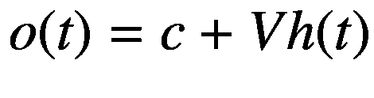

# 七、时间序列

经济学中的实证工作通常与因果推理和假设检验有关，而机器学习则以预测为中心。然而，当涉及到经济和金融预测时，目标之间有一个明显的交集。因此，人们对使用机器学习方法来产生和评估经济预测越来越感兴趣。

在第二章中，我们讨论了 Coulombe 等人(2019)，他们评估了机器学习对于时间序列计量经济学的有用性。他们认为非线性模型、正则化、交叉验证和替代损失函数是潜在的有价值的工具，可以引入用于时间序列计量经济学。

在这一章中，我们将讨论机器学习对于时间序列预测的价值。由于我们将专注于 TensorFlow 实现，我们的重点将从 Coulombe 等人(2019 年)转移，而是专注于深度学习模型。特别是，我们将利用具有专门层的神经网络模型来处理顺序数据。

在整个章节中，我们将建立一个预测练习(Nakamura 2005)，这是神经网络在时间序列计量经济学中的第一个应用。Nakamura (2005)使用密集神经网络证明了单变量自回归模型在预测通货膨胀方面的优势。

## 机器学习的序列模型

到目前为止，我们已经讨论了神经网络的几个专门层，但是还没有解释如何处理顺序数据。正如我们将看到的，在神经网络中有处理这种数据的健壮框架，这主要是为了自然语言处理(NLP)的目的而开发的，但在时间序列上下文中同样有用。在本章的最后，我们还将简要地回到它们在 NLP 环境中的使用。

### 密集神经网络

我们已经在 5 和 6 章节中使用了密集神经网络；然而，我们还没有解释它们如何适用于顺序数据。到目前为止，我们对神经网络的所有使用都涉及缺乏或没有利用时间维度的练习。

我们将通过研究如何利用序列数据在类似于 Nakamura (2005)的设置中预测季度通货膨胀来开始这一部分。为了进行这个练习，我们将使用美国在 1947 年:Q2 和 2020 年:Q2， <sup>1</sup> 之间的季度通货膨胀，绘制在图 7-1 中。此外，根据 Nakamura (2005)，我们将考虑单变量模型，其中我们不包括任何超出通货膨胀滞后的额外解释变量。

在前面的章节中，当我们处理文本和图像数据时，我们经常需要执行预处理任务，将原始输入转换为适合在神经网络中使用的内容。对于序列数据，我们还需要将时间序列转换成固定长度的序列。


图 7-1

1947 年 Q2 和 2020 年 Q2 之间的 CPI 通货膨胀。资料来源:美国劳工统计局

我们将从决定序列长度开始，序列长度是我们将用作神经网络输入的滞后数。例如，如果我们选择长度为 3 的序列，那么网络将使用周期 *t* 、 *t-1* 和 *t-3* 中的实现来预测周期 *t+h* 中的通货膨胀。图 7-2 说明了预处理步骤，其中我们将单个时间序列分割成三个连续观测值的重叠序列。图表的左侧显示了原始输入序列。右侧显示了两个序列示例。如果我们使用单个季度作为预测范围( *h* =1)，虚线矩形将序列与它们预测的值连接起来。


图 7-2

将时间序列划分为三个连续观测值的重叠序列

我们假设数据已经被下载并作为`inflation.csv`保存在位于`data_path`的目录中。我们首先用清单 7-1 中的`pandas`加载它，然后将其转换成一个`numpy array`。接下来，我们将使用`tensorflow.keras.preprocessing.sequence`子模块中的`TimeseriesGenerator()`来定义一个生成器对象。作为输入，它将接受网络的特征和目标、序列的长度以及批量大小。在这种情况下，我们将执行单变量回归，其中特征和目标都是`inflation`。我们将使用长度为 4 的序列，我们可以使用`length`参数来设置它。最后，我们将使用 12 的`batch_size`,这意味着我们的生成器将在每次迭代中产生 12 个序列和 12 个目标值。

```py
import numpy as np
import tensorflow as tf
from tensorflow.keras.preprocessing.sequence import TimeseriesGenerator

# Set data path.
data_path = '../data/chapter7/'

# Load data.
inflation = pd.read_csv(data_path+'inflation.csv')

# Convert to numpy array.
inflation = np.array(inflation['Inflation'])

# Instantiate time series generator.
generator = TimeseriesGenerator(inflation, inflation,
     length = 4, batch_size = 12)

Listing 7-1Instantiate a sequence generator for inflation

```

我们现在有了一个生成器对象，可以用来创建批量数据。Keras 模型可以使用生成器而不是数据作为输入。在清单 7-2 中，我们将定义一个模型，然后使用生成器训练它。注意，我们使用了一个`Sequential()`模型。这使我们能够通过按顺序堆叠层来构建模型，并且与顺序数据的使用没有任何关系。

我们首先使用顺序 API 实例化模型。然后，我们设置输入节点的数量以匹配序列长度，定义一个具有两个节点的隐藏层，并定义一个使用`linear`激活函数的输出层，因为我们有一个连续的目标。最后，我们将使用均方误差损失和一个`adam`优化器来编译模型。

当我们以前训练模型时，我们使用`np.array()`或`tf.constant()`对象作为输入数据。在清单 7-2 中，我们使用了一个生成器，这将要求我们使用`fit_generator()`方法，而不是之前的`fit()`。

```py
# Define sequential model.
model = tf.keras.models.Sequential()

# Add input layer.
model.add(tf.keras.Input(shape=(4,)))

# Define dense layer.
model.add(tf.keras.layers.Dense(2, activation="relu"))

# Define output layer.
model.add(tf.keras.layers.Dense(1, activation="linear"))

# Compile the model.
model.compile(loss="mse", optimizer="adam")

# Train the model.
model.fit_generator(generator, epochs=100)

Train for 25 steps
Epoch 1/100
25/25 [==============================] - loss: 4.3247
...
Epoch 100/100
25/25 [==============================] - loss: 0.3816

Listing 7-2Train a neural network using generated sequences

```

在时段 1 和 100 之间，该模型在减少均方误差方面取得了相当大的进展，将其从 4.32 降低到 0.38。重要的是，我们没有使用正则化，如放弃，也没有创建测试样本分割，因此有可能存在大量的过拟合。在清单 7-3 中，我们使用`model`的`summary()`方法来检查它的架构。我们可以看到，它只有 13 个可训练的参数，与我们以前使用的模型相比，这是很小的。

```py
# Print model architecture.
print(model.summary())

_____________________________________________________
Layer (type)        Output Shape           Param #
=====================================================
dense_1 (Dense)      (None, 2)               10
_____________________________________________________
dense_1 (Dense)      (None, 1)                3
=====================================================
Total params: 13
Trainable params: 13
Non-trainable params: 0
_____________________________________________________

Listing 7-3Summarize model architecture

```

我们现在可以使用`model.predict_generator(generator)`来生成一系列通货膨胀的预测值。图 7-3 描绘了通货膨胀的真实值与我们的模型预测值的对比。虽然模型性能看起来令人信服，但我们还没有采取适当的预防措施来确保我们不会过拟合。

在图 7-4 中，我们通过使用 2000 年后的时期作为测试样本来检验过拟合是否是一个问题。为此，我们需要构造一个单独的生成器，它只使用 2000 年以前的值进行训练。然后，我们使用原始生成器对整个样本进行预测，包括 2000 年以后的值。


图 7-3

密集网络提前一个季度预测通货膨胀

我们可以看到图 7-4 与 2000 年后的图 7-3 看起来没有实质性的不同。特别是，2000 年后似乎没有出现性能下降，如果模型过拟合 2000 年前的数据，这正是我们所预期的。这并不奇怪，因为模型的参数相对较少，很难过拟合。

在本节的剩余部分，我们将利用相同的预处理步骤，但是将向我们的模型添加专门的层，用于处理输入序列。这些图层将利用 lag 结构中编码的时态信息，而不是像我们当前对密集模型所做的那样，对所有要素一视同仁。


图 7-4

基于 1947 年至 2000 年数据训练的模型中的密集网络提前一个季度预测通货膨胀

### 循环神经网络

循环神经网络接受一系列输入，并使用密集层和专门递归层的组合对其进行处理(Rumelhart 等人，1986 年)。 <sup>2</sup> 这个输入序列可以是单词向量、单词嵌入、音符，或者，正如我们将在本章中考虑的，在不同时间点的膨胀测量。

我们将遵循 Goodfellow 等人(2017)中给出的循环神经网络(RNNs)的处理方法。作者将递归层描述为由单元组成，每个单元接受输入值 *x* ( *t* )和状态*h*(*t*-1)，并产生输出值 *o* ( *t* )。等式 7-1、7-2 和 7-3 给出了为循环单元产生输出值的过程。

在等式 7-1 中，我们取数列的状态，*h*(*t*—1)，并乘以权重， *W* 。然后，我们获取输入值， *x* ( *t* )，并将其乘以一组单独的权重， *U* 。最后，我们将这两项以及一个偏差项 *b* 相加。

*方程式 7-1。对 RNN 单元执行* *乘法步骤* *。*


接下来，我们将乘法步骤的输出传递给双曲正切激活函数，如方程 7-2 所示。这一步的输出是系统的更新状态， *h* ( *t* )。

*方程式 7-2。在 RNN 单元中应用激活函数。*


在等式 7-3 给出的最后一步中，我们将更新后的状态乘以一组单独的权重 *V* ，并添加一个偏置项。

*方程式 7-3。从 RNN 单元产生* *输出值* *。*



在本章的例子中，通货膨胀是唯一的特征。这意味着 *x* ( *t* )是标量， *W* 、 *U* 和 *V* 也是标量。此外，请注意，这些权重在所有时间段都是共享的，相对于密集网络所需的大小，这减少了模型的大小。在我们的例子中，对于具有一个 RNN 单元的层，我们只需要五个参数。

图 7-5 提供了 RNN 的完整图示。粉红色的节点表示输入值，在我们的例子中是通货膨胀的滞后。橙色节点表示目标变量，即下一季度的通货膨胀。蓝色的节点是单独的 RNN 细胞，形成了 RNN 层。我们图示的网络有四个输入和两个 RNN 单元。


图 7-5

RNN(上)和展开的 RNN 电池(下)的图示

图 7-5 的底部面板显示了一个“展开的”RNN 单元格，其中单元格的迭代结构已被分解为一个序列。在每个单独的步骤中，该状态与一个输入相结合以产生下一个状态。最后一步产生一个输出， *o* ( *t* )，这个输出是最后一个密集层的输入——连同其他单元的输出——产生一个季度前的通货膨胀预测。

我们现在已经看到，RNN 通过保留状态来利用顺序数据，并在序列的每一步更新状态。它还通过使用权重共享来减少参数的数量。此外，由于没有必要应用特定于时间的权重，所以也有可能使用具有任意和可变长度的序列的 RNN 单元。

我们已经讨论了 RNN 与密集网络的不同之处。让我们为通胀预测示例构建一个简单的 RNN。我们将从加载清单 7-4 中的数据开始。这里，我们重复了清单 7-1 中的步骤，但是有两个重要的区别。首先，我们使用`np.expand_dims()`向`inflation`数组添加一个维度。这将使我们的时间序列数据符合 Keras 中 RNN 像元的输入形状要求。第二，我们定义了一个训练生成器，它通过对`inflation`数组进行切片，只保留前 211 个观察值，专门使用 2000 年以前的数据。

一旦我们加载并准备好了数据，下一步就是定义模型，我们在清单 7-5 中就是这么做的。正如我们所看到的，这个模型并不比我们用来预测通货膨胀的密集网络需要更多的代码行。我们所做的就是定义一个序列模型，添加一个 RNN 层，并用一个`linear`激活函数定义一个密集输出层。

注意我们使用的`SimpleRNN`层需要两个参数:RNN 细胞的数量和输入层的形状。对于第一个参数，我们选择了两个单元来保持网络的简单，但存在数据拟合不足的潜在风险。我们需要提供第二个参数，因为我们将 RNN 层定义为网络中的第一层。我们将`input_shape`设置为(4，1 ),因为序列长度为 4，特征数量为 1。

```py
# Define sequential model.
model = tf.keras.models.Sequential()

# Define recurrent layer.
model.add(tf.keras.layers.SimpleRNN(2, input_shape=(4, 1)))

# Define output layer.
model.add(tf.keras.layers.Dense(1, activation="linear"))

Listing 7-5Define an RNN model in Keras.

```

```py
import numpy as np
import tensorflow as tf
from tensorflow.keras.preprocessing.sequence import TimeseriesGenerator

# Load data.
inflation = pd.read_csv(data_path+'inflation.csv')

# Convert to numpy array.
inflation = np.array(inflation['Inflation'])

# Add dimension.
inflation = np.expand_dims(inflation, 1)

# Instantiate time series generator.
train_generator = TimeseriesGenerator(
        inflation[:211], inflation[:211],
        length = 4, batch_size = 12)

Listing 7-4Instantiate a sequence generator for inflation

```

最后一步是编译模型，并使用`fit_generator()`方法训练它，以及我们之前构建的`train_generator`。正如我们在清单 7-6 中看到的，该模型实现了比我们在密集网络中通过 100 个时期的训练所能实现的更低的均方误差(0.2594)。此外，如图 7-6 所示，测试样本性能(2000 年后)似乎没有任何明显的下降。

```py
# Compile the model.
model.compile(loss="mse", optimizer="adam")

# Fit model to data using generator.
model.fit_generator(train_generator, epochs=100)

Epoch 1/100
18/18 [==============================] - 1s 31ms/step - loss: 0.9206

...

Epoch 100/100
18/18 [==============================] - 0s 2ms/step - loss: 0.2594

Listing 7-6Compile and train an RNN model in Keras

```

我们还提到，RNN 模型比密集网络需要更少的参数值。当我们逐步完成在 RNN 像元中执行的操作时，我们看到只有一个 RNN 像元的图层只需要五个参数。在清单 7-7 中，我们将使用`model`的`summary()`方法来探索模型的架构。我们可以看到，它在 RNN 层中有八个参数，在密集输出层中有三个参数。它总共有 11 个参数，比我们之前使用的密集网络要少。当然，这里的差别不是特别大，因为两个网络都很小。


图 7-6

基于 1947-2000 年数据训练的 RNN 模型对未来一个季度通货膨胀的预测

```py
# Print model summary.
print(model.summary())
_____________________________________________________
Layer (type)               Output Shape     Param #
=====================================================
simple_rnn_1 (SimpleRNN)   (None, 2)           8
_____________________________________________________
dense_1 (Dense)            (None, 1)           3
=====================================================
Total params: 11
Trainable params: 11
Non-trainable params: 0
_____________________________________________________

Listing 7-7Summarize RNN architecture in a Keras model

```

在实践中，我们通常不会使用未经修改的 RNN 模型。至少，我们要考虑调整两件事。第一个问题与一个技术问题有关，即“消失梯度问题”，这使得训练深度网络具有挑战性。这也是原始 RNN 模型和长序列数据的一个问题。原始 RNN 模型的另一个问题是，它没有考虑到时间上或序列中相距较远的物体比距离较近的物体关系更密切的可能性。在下面的两个小节中，我们将对 RNN 模型做一些小的调整，这将使我们能够处理这两个问题。

### 长短期记忆(LSTM)

rnn 的第一个问题是，当长数据序列用作输入时，它们遭受消失梯度问题。解决这个问题最有效的方法是利用门控 RNN 室。通常使用两种这样的细胞:(1)长短期记忆(LSTM)和(2)门控循环单位(GRUs)。在这一小节中，我们将集中讨论前者。

Hochreiter 和 Schmidhuber (1997)引入了 LSTM 模型，并通过使用限制长序列中的信息跟随的操作符来发挥作用。我们将再次跟随 Goodfellow 等人(2017)描述在 LSTM 中执行的操作。

等式 7-4、7-5 和 7-6 定义了“忽略门”、“外部输入门”和“输出门”，所有这些门在控制信息通过 LSTM 单元时都起作用。

*方程式 7-4。可训练重量的定义称为忘记门。*


*方程式 7-5。称为外部输入门的可训练权重的定义。*


*方程式 7-6。称为输出门的可训练权重的定义。*


请注意，每个门具有相同的函数形式，并使用 sigmoid 激活函数，但有自己单独的权重和偏差。这允许学习门控过程，而不是根据固定的规则来应用。

内部状态使用等式 7-7 中的表达式更新，其中遗忘门、外部输入门、输入序列和状态均适用。

*方程式 7-7。用于更新内部状态的表达式。*


最后，我们利用内部状态和输出门更新隐藏状态，如等式 7-8 所示。

*方程式 7-8。用于更新隐藏状态的表达式。*


虽然门的使用增加了模型中的参数数量，但在许多实际应用中，它也在处理长序列方面产生了实质性的改进。出于这个原因，我们通常会使用 LSTM 模型作为时间序列分析的基线，而不是原始的 RNN 模型。

在清单 7-8 中，我们使用 100 个时期来定义和训练 LSTM 模型。唯一的区别是我们使用了`tf.keras.layers.LSTM()`，而不是`tf.keras.layers.SimpleRNN()`。我们可以看到，在 100 个历元之后，LSTM 的均方误差比 RNN 高。这是因为模型必须训练更多的重量，这将需要额外的训练时期。此外，LSTM 可能在序列较长的设置中最有用。

```py
# Define sequential model.
model = tf.keras.models.Sequential()

# Define recurrent layer.
model.add(tf.keras.layers.LSTM(2, input_shape=(4, 1)))

# Define output layer.
model.add(tf.keras.layers.Dense(1, activation="linear"))

# Compile the model.
model.compile(loss="mse", optimizer="adam")

# Train the model.
model.fit_generator(train_generator, epochs=100)

Epoch 1/100
18/18 [==============================] - 1s 62ms/step - loss: 3.1697

...

Epoch 100/100
18/18 [==============================] - 0s 3ms/step - loss: 0.5873

Listing 7-8Train an LSTM model in Keras

```

最后，在清单 7-9 中，我们总结了模型的架构。当我们讨论 LSTM 单元所需的额外操作时，我们提到它引入了一个遗忘门、一个外部输入门和一个输出门。所有这些都需要它们自己的一组参数。从清单 7-9 中我们可以看到，LSTM 层使用了 32 个参数，是 RNN 的四倍。

```py
# Print model architecture.
print(model.summary())

_____________________________________________________
Layer (type)         Output Shape          Param #
=====================================================
lstm_1 (LSTM)         (None, 2)              32
_____________________________________________________
dense_1 (Dense)       (None, 1)               3
=====================================================
Total params: 35
Trainable params: 35
Non-trainable params: 0
_____________________________________________________

Listing 7-9Summarize LSTM architecture in a Keras model

```

### 中间隐藏状态

按照惯例，LSTM 模型只利用隐藏状态的最终值。例如，在图 7-5 中，模型使用了 *h* ( *t* )，而没有使用*h*(*t*-1)、*h*(*t*-2)和*h*(*t*-3)，尽管我们已经计算过它们。然而，最近的工作表明，使用中间隐藏状态可以在建模长期依赖关系方面带来相当大的改进，特别是在自然语言处理问题方面(周等，2016)。这通常是在注意力模型的环境中完成的。

我们不会在这里讨论注意力模型，但会解释如何利用 LSTM 模型中的隐藏状态。让我们从天真地设置清单 7-8 模型中的 LSTM 单元格开始，通过将`return_sequences`设置为`True`来返回隐藏状态。我们将在清单 7-10 中这样做，然后使用`summary()`方法检查模型的架构。

```py
# Define sequential model.
model = tf.keras.models.Sequential()

# Define recurrent layer to return hidden states.
model.add(tf.keras.layers.LSTM(2, return_sequences=True,
        input_shape=(4, 1)))

# Define output layer.
model.add(tf.keras.layers.Dense(1, activation="linear"))

# Summarize model architecture.
model.summary()

_____________________________________________________
Layer (type)       Output Shape            Param #
=====================================================
lstm_1 (LSTM)      (None, 4, 2)               32
_____________________________________________________
dense_1 (Dense)    (None, 4, 1)               3
=====================================================
Total params: 35
Trainable params: 35
Non-trainable params: 0
_____________________________________________________

Listing 7-10Incorrect use of LSTM hidden states

```

正如我们所看到的，该模型的架构有些不寻常:它不是为批处理中的每个观察值输出一个标量预测，而是输出一个 4x1 向量。这似乎是 LSTM 层的结果，它现在从其两个 LSTM 单元中的每一个输出 4x1 向量，而不是标量。

有几种方法可以利用 LSTM 输出。其中一种方法称为叠加 LSTM (Graves 等人，2013 年)。其工作原理是将全序列隐藏状态传递到第二个 LSTM 层，从而在网络中创建深度，以允许不止一个级别的表示。

在清单 7-11 中，我们定义了这样一个模型。在第一个 LSTM 层中，我们使用了一个具有三个 LSTM 单元和输入形状(4，1)的层。我们将`return_sequences`设置为`True`，这意味着每个单元格将返回一个 4x1 的隐藏状态序列，而不是一个标量。然后，我们将把这个 3-张量(4x1x3)传递给具有两个单元的第二个 LSTM 层，它只返回最终的隐藏状态，而不返回中间状态值。

```py
# Define sequential model.
model = tf.keras.models.Sequential()

# Define recurrent layer to return hidden states.
model.add(tf.keras.layers.LSTM(3, return_sequences=True,
        input_shape=(4, 1)))

# Define second recurrent layer.
model.add(tf.keras.layers.LSTM(2))

# Define output layer.
model.add(tf.keras.layers.Dense(1, activation="linear"))

Listing 7-11Define a stacked LSTM model

```

清单 7-12 总结了该模型的架构。我们可以看到，它现在输出一个标量预测，这就是我们想要的通货膨胀预测。我们将省略对模型性能的分析，但将指出这种模型在时间序列预测中的应用仍未得到充分探索。在建模长期依赖性很重要的情况下，使用堆叠 LSTM 模型、注意力模型或变压器模型可能会导致时间序列预测的改进。

```py
# Summarize model architecture.
model.summary()

_____________________________________________________
Layer (type)      Output Shape             Param #
=====================================================
lstm_1 (LSTM)    (None, 4, 3)                60
_____________________________________________________
lstm_2 (LSTM)     (None, 2)                  48
_____________________________________________________
dense_1 (Dense)   (None, 1)                   3
=====================================================
Total params: 111
Trainable params: 111
Non-trainable params: 0
_____________________________________________________

Listing 7-12Summarize stacked LSTM architecture

```

## 多元预测

到目前为止，我们已经关注了不同方法的机制，并围绕 Nakamura (2005)的单变量通胀预测练习构建了所有示例。我们讨论过的方法都适用于多变量环境。为了完整起见，我们将提供一个简单的多变量预测示例，使用 LSTM 模型和梯度提升树，我们在第四章中讨论过。我们将再次尝试预测通货膨胀，但将以每月一次的频率进行，并使用五个特征，而不是一个。

我们将从加载和预览清单 7-13 中的数据开始。然后，我们将讨论如何使用 LSTM 和梯度增强树实现多元预测模型。我们添加的四个特征是失业、制造业工作时间、制造业每小时收入和货币供应量(M1)。失业率用第一个差异来衡量，而所有水平变量都用前一时期的百分比变化来转换。

```py
import pandas as pd

# Load data.
macroData = pd.read_csv(data_path+'macrodata.csv',
        index_col = 'Date')

# Preview data.
print(macroData.round(1).tail())

      Inflation  Unemployment  Hours  Earnings   M1
Date
12/1/19  -0.1       0.1         0.5     0.2     0.7
1/1/20    0.4       0.6        -1.7    -0.1     0.0
2/1/20    0.3      -0.2         0.0     0.4     0.8
3/1/20   -0.2       0.8        -0.2     0.4     6.4
4/1/20   -0.7       9.8        -6.8     0.5    12.9

Listing 7-13Load and preview inflation forecast data

```

### -什么

正如我们在本章前面看到的，我们可以通过实例化一个生成器来准备在 LSTM 模型中使用的数据。我们首先将目标和特征转换成`np.array()`对象。然后我们将为训练数据创建一个生成器，为测试数据创建另一个生成器。在前面的例子中，我们使用季度数据和四个季度的序列长度。在这种情况下，我们将在清单 7-14 中使用月度数据和 12 个月的序列长度。

```py
import numpy as np
import tensorflow as tf
from tensorflow.keras.preprocessing.sequence import TimeseriesGenerator

# Define target and features.
target = np.array(macroData['Inflation'])
features = np.array(macroData)

# Define train generator.
train_generator = TimeseriesGenerator(features[:393],
        target[:393], length = 12, batch_size = 6)

# Define test generator.
test_generator = TimeseriesGenerator(features[393:],
        target[393:], length = 12, batch_size = 6)

Listing 7-14Prepare data for use in LSTM model

```

定义了生成器之后，我们现在可以训练清单 7-15 中的模型。我们将使用两个 LSTM 电池。此外，我们需要改变输入形状，因为现在每个序列中有 12 个元素和 5 个特征。经过 20 个时期的训练，该模型将均方误差从 0.3065 降低到 0.0663。如果你已经使用计量经济学模型进行了宏观经济预测，你可能会担心模型参数的数量，因为我们使用了更长的序列和更多的变量；然而，由于我们前面讨论的原因，更长的序列长度不会增加参数的数量。事实上，该模型只有 67 个参数。

```py
# Define sequential model.
model = tf.keras.models.Sequential()

# Define LSTM model with two cells.
model.add(tf.keras.layers.LSTM(2, input_shape=(12, 5)))

# Define output layer.
model.add(tf.keras.layers.Dense(1, activation="linear"))

# Compile the model.
model.compile(loss="mse", optimizer="adam")

# Train the model.
model.fit_generator(train_generator, epochs=100)

Epoch 1/20
64/64 [==============================] - 2s 26ms/step - loss: 0.3065

...

...

Epoch 20/20
64/64 [==============================] - 0s 6ms/step - loss: 0.0663

Listing 7-15Define and train LSTM model with multiple features

```

最后，在清单 7-16 中，我们将通过比较训练样本结果和测试样本结果来评估模型。我们可以看到，训练集性能似乎比测试集性能更好，这是常见的；然而，如果差异变得足够大，我们应该考虑使用正则化或在更少的时期后终止训练过程。

```py
# Evaluate training set using MSE.
model.evaluate_generator(train_generator)

0.06527029448989197

# Evaluate test set using MSE.
model.evaluate_generator(test_generator)

0.15478561431742632

Listing 7-16Use MSE to evaluate train and test sets

```

### 梯度增强树

作为最后一个例子，我们将考虑执行相同的预测练习，但是使用梯度增强树，我们在第四章中讨论过。在 TensorFlow 提供的一系列工具中，梯度提升树和深度学习最适合时间序列预测任务。

正如 LSTM 模型要求我们通过将数据分割成序列来准备数据一样，使用树进行梯度推进将要求我们以 Estimator API 中可用的格式来准备数据。这将涉及为五个特性中的每一个定义特性列，正如我们在清单 7-17 中所做的。

下一步是定义生成数据的函数。我们将为训练和测试函数分别做这件事，这样我们就可以评估过拟合，就像我们对 LSTM 的例子所做的那样。清单 7-18 定义了这两个函数。同样，我们使用相同的样本分割:训练集将覆盖 2000 年之前的年份，测试集将覆盖之后的年份。

```py
# Define lagged inflation feature column.
inflation = tf.feature_column.numeric_column(
        "inflation")

# Define unemployment feature column.
unemployment = tf.feature_column.numeric_column(
        "unemployment")

# Define hours feature column.
hours = tf.feature_column.numeric_column(
        "hours")

# Define earnings feature column.
earnings = tf.feature_column.numeric_column(
        "earnings")

# Define M1 feature column.
m1 = tf.feature_column.numeric_column("m1")

# Define feature list.
feature_list = [inflation, unemployment, hours,
        earnings, m1]

Listing 7-17Define feature columns

```

在清单 7-19 中，我们使用 100 个历元和`train_data`来训练一个`BoostedTreeRegressor`。然后，我们对训练集和测试集进行评估，并打印结果。

```py
# Define input function for training data.
def train_data():
        train = macroData.iloc[:392]
        features = {"inflation": train["Inflation"],
        "unemployment": train["Unemployment"],
        "hours": train["Hours"],
        "earnings": train["Earnings"],
        "m1": train["M1"]}
        labels = macroData["Inflation"].iloc[1:393]
        return features, labels

# Define input function for test data.
def test_data():
        test = macroData.iloc[393:-1]
        features = {"inflation": test["Inflation"],
        "unemployment": test["Unemployment"],
        "hours": test["Hours"],
        "earnings": test["Earnings"],
        "m1": test["M1"]}
        labels = macroData["Inflation"].iloc[394:]
        return features, labels

Listing 7-18Define the data generation functions

```

结果表明模型可能过拟合。平均训练损失为 0.01，平均测试损失为 0.14。这表明我们应该尝试使用更少的历元再次训练模型，然后看看两者之间的差距是否缩小。如果我们没有看到两者之间的收敛，那么我们将希望执行额外的模型调整以减少过拟合。查看我们可以调整的参数，参见第四章。

```py
# Instantiate boosted trees regressor.
model = tf.estimator.BoostedTreesRegressor(feature_columns =
feature_list, n_batches_per_layer = 1)

# Train model.
model.train(train_data, steps=100)

# Evaluate train and test set.
train_eval = model.evaluate(train_data, steps = 1)
test_eval = model.evaluate(test_data, steps = 1)

# Print results.
print(pd.Series(train_eval))
print(pd.Series(test_eval))

average_loss         0.010534
label/mean           0.416240
loss                 0.010534
prediction/mean      0.416263
global_step        100.000000
dtype: float64
average_loss         0.145123
label/mean           0.172864
loss                 0.145123
prediction/mean      0.286285
global_step        100.000000
dtype: float64

Listing 7-19Train and evaluate model. Print results

```

## 摘要

将机器学习应用于经济学和金融学的挑战之一是，机器学习与预测有关，而经济学和金融学的大部分研究与因果推断和假设检验有关。然而，机器学习与经济学在几个领域有相当大的重叠，预测就是两者完全重合的例子。

在这一章中，我们研究了如何利用机器学习中的时间序列预测工具，主要关注深度学习模型，但也涵盖了 TensorFlow 中也可用的梯度提升树。我们围绕神经网络在经济学中的最早用途之一构建了示例，用于时间序列预测(Nakamura 2005)。然后，我们介绍了现代模型，包括 RNNs、lstm 和堆叠 lstm，这些模型主要是为其他顺序数据处理任务(如 NLP)开发的。

有兴趣了解更多利用深度学习模型进行宏观经济时间序列预测的读者，不妨读一读 Cook and Hall (2017)。关于最近在股票回报和债券溢价预测方面的金融工作，请参见等人(2016 年)、Messmer (2017 年)、Rossi (2018 年)和 Chen 等人(2019 年)。有关高维时间序列回归和稀疏群套索模型的近期工作，请参见 Babii、Ghysels 和 Striaukas (2019、2020)。

## 文献学

Babii，a .，E. Ghysels 和 J. Striaukas。2019."对具有异方差和自相关的高维回归的推断."arXiv 预印本。

Babii，a .，E. Ghysels 和 J. Striaukas。2020."机器学习时间序列回归及其在临近预报中的应用."arXiv 预印本。

bianchi d . m . büchner 和 A. Tamoni。2020."机器学习的债券风险溢价." *WBS 金融集团研究论文第 252 号。*

Chen，l .，M. Pelger 和 J. Zhu。2019.“资产定价的深度学习。”(arXiv)。

库克，T.R .和 A.S .霍尔。2017."用深度神经网络进行宏观经济指标预测."*堪萨斯城美联储银行，研究工作论文 17-11。*

库隆贝，P.G .，m .勒鲁，d .斯蒂凡诺维奇和 s .苏普雷南特 2019."机器学习对宏观经济预测有什么用？" *CIRANO 工作底稿。*

古德费勒，我，y .本吉奥，和 a .库维尔。2017.*深度学习。麻省剑桥:麻省理工学院出版社。*

格雷夫斯，a . a .-r .穆罕默德和 g .辛顿。2013."深度循环神经网络的语音识别." *arXiv。*

F .关昊、何振梁和 N.G .波尔森。2018.“预测资产回报的深度学习。” *arXiv。*

希顿，J.B .，N.G .波尔森和 J.H .维特。2016.《金融深度学习:深度投资组合》*商业和工业中应用的随机模型*33(1):3–12。

Hochreiter，s .和 J. Schmidhuber。1997."长短期记忆"*神经计算*9(8):1735–1780。

梅斯梅尔，M. 2017。"深度学习和预期收益的横截面." *SSRN 工作文件。*

中村，Emi。2005."使用神经网络进行通货膨胀预测."*经济学快报*85:373–378。

罗西，A.G. 2018。“用机器学习预测股市回报。”*工作文件。*

鲁梅尔哈特，d . g .辛顿和 r .威廉姆斯。1986."通过反向传播误差学习表征."*性质*533–536。

周平，史文伟，田军，齐，李，郝海东，徐。2016."用于关系分类的基于注意的双向长短期记忆网络."计算语言学协会第 54 届年会会议录。柏林:计算语言学协会。

<aside aria-label="Footnotes" class="FootnoteSection" epub:type="footnotes">Footnotes 1

消费者价格指数(CPI)和由此得出的通货膨胀指标由劳工统计局计算: [`www.bls.gov`](http://www.bls.gov) 。我们在这个练习中使用的系列可以在 BLS 的网站上以 ID 号 CUSR0000SA0 获得。

  2

在自然语言处理环境中，RNNs 通常还包含一个嵌入层。

 </aside>