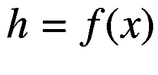

# 八、降维

机器学习中的很多问题类本来就是高维的。例如，自然语言处理问题通常涉及从单词中提取含义，这些单词可能出现在大量难以处理的书面潜在序列中。即使我们只限于分析文本中最常见的 1000 个单词，一个 50 个单词的短段落也将有 10 <sup>150</sup> 种可能的排列，这比可观测宇宙的原子数量还要多。在这种情况下，如果不重新思考问题或减少问题的维度，我们就不可能取得进展。

经济学和金融学的研究经常使用降维技术，如主成分分析(PCA)和因子分析(FA)。这通常是在协变量(特征)的数量足够大以至于存在过拟合的风险或明显违反计量经济学模型假设的情况下进行的。当有兴趣将数据减少到少数感兴趣的因素时，有时也使用 PCA 和 FA。

在本章中，我们将简要讨论机器学习和经济学中使用的两种方法:PCA 和偏最小二乘法(PLS)。然后，我们将介绍用于机器学习的自编码器的概念。自编码器执行“上采样”和“下采样”或“压缩”和“解压缩”的组合这个过程的副产品是一种潜在状态，它对恢复原始输入状态所需的信息进行编码。我们可以认为自编码器提供了一种灵活的、基于深度学习的降维方法。

## 经济学中的降维

在本节中，我们将遵循 Gentzkow 等人(2019)的符号，该符号讨论了文本分析环境中的维度缩减。此外，我们将使用`sklearn`和`tensorflow`的组合来执行经济学中常用的降维任务。虽然在`tensorflow`什么都可以做，但是它缺少`sklearn`提供的 PCA 和 PLS 的许多便利方法。

在本章的大部分内容中，我们还将使用一个共同的数据集:1961 年至 2020 年期间 25 个国家的 GDP 增长:Q2 和 Q1，该数据集由经合组织编制。数据曲线如图 8-1 所示。我们省略了一个图例，因为各个国家系列无法区分。


图 8-1

25 个国家从 1961 年的 GDP 增长:Q2 到 2020 年:Q1

在大多数练习中，我们将尝试提取样本中所有国家的共同增长成分。像主成分分析这样的技术将使我们能够确定增长的方差中有多少份额是由少数几个共同成分解释的。我们还将看到这些组成部分如何与单个国家系列相关，从而了解哪些国家可能负责推动国际增长。

### 主成分分析

经济学和金融学中最常用的降维方法是主成分分析。PCA 将一组特征映射到 *k* 主成分，其中 *k* 由计量经济学家设定。这些成分按它们在数据中解释的方差份额排序。例如，第一个主成分解释了数据中最大的方差份额。此外，它们被构造成正交的。

在许多情况下，我们将执行 PCA，目的是降低数据集的维数，以便我们可以在回归中使用少量的主成分。我们之前描述的属性使它在这方面特别有吸引力。

使用 Gentzkow 等人(2019 年)的符号，我们可以将 PCA 记为等式 8-1 中给出的最小化问题的解决方案。

*方程式 8-1。主成分分析* *最小化问题* *。*

![$$ \min trac{e}_{\left\{\mathrm{G},\mathrm{B}\right\}}\left[\left(C-\mathrm{G}B\right){\left(C-\mathrm{G}{B}^{\prime}\right)}^{\prime}\right] $$](img/496662_1_En_8_Chapter_TeX_Equa.png)


在清单 8-1 和 8-2 中，我们概述了如何在`tensorflow`中解决这样的优化问题；然而，出于我们的目的，使用`sklearn`中的实现会更方便，我们将在本章的剩余部分中这样做。

```py
import tensorflow as tf
import pandas as pd
import numpy as np

# Define data path.
data_path = '../data/chapter8/'

# Load data.
C = pd.read_csv(data_path+'gdp_growth.csv',
        index_col = 'Date')

# Convert data to constant object.
C = tf.constant(np.array(C), tf.float32)

# Set number of principal components.
k = 5

# Get shape of feature matrix.
n, p = C.shape

# Define variable for gamma matrix.
G = tf.Variable(tf.random.normal((n, k)), tf.float32)

# Define variable for beta matrix.
B = tf.Variable(tf.random.normal((p, k)), tf.float32)

Listing 8-1Define variables for PCA in TensorFlow

```

清单 8-1 加载数据作为特征矩阵， *C* 。然后它将矩阵转换为一个`tf.constant()`对象，将主成分的数量设置为 5，然后构造 *G* 和 *B* 矩阵。请注意， *G* 是一个 *n* x *k* 矩阵，而 *B* 是一个 *p* x *k* 矩阵，其中 *n* 是时间段的数量， *p* 是国家的数量。

在我们的例子中， *G* 矩阵捕捉了每个时期因素的影响大小。此外， *B* 衡量每个因素与每个国家相关的程度。

在清单 8-2 中，我们定义了一个损失函数`pcaLoss`，它将 *C* 、 *G* 和 *B* 作为输入，并返回一个损失值，根据等式 8-1 构建。然后，我们实例化一个优化器，并在 1000 个时期内训练该模型。回想一下，只有 *G* 和 *B* 是可训练的，应该提供给`var_list`。

```py
# Define PCA loss.
def pcaLoss(C, G, B):
        D = C - tf.matmul(G, tf.transpose(B))
        DT = tf.transpose(D)
        DDT = tf.matmul(D, DT)
        return tf.linalg.trace(DDT)

# Instantiate optimizer.
opt = tf.optimizers.Adam()

# Perform train model.
for i in range(1000):
      opt.minimize(lambda: pcaLoss(C, G, B), var_list = [G, B])

Listing 8-2Perform PCA in TensorFlow

```

既然我们已经看到了如何使用`tensorflow`来构建 PCA 的求解方法，那么让我们看看如何使用`sklearn`来完成相同的任务。清单 8-3 从`sklearn.decomposition`导入`PCA`方法并加载和准备数据。我们将使用`np.array()`格式的数据。

在清单 8-4 中，我们设置了主要组件的数量，实例化了一个`PCA`模型，并应用了`fit()`方法。我们现在可以恢复相当于我们在`tensorflow`训练的矩阵。特别是，我们可以使用`components_`方法恢复 *B* ，使用`pca.transform(C)`恢复 *G* 。除此之外，我们可以恢复每个主成分所解释的方差的份额， *S* 。

```py
# Set number of components.
k = 25

# Instantiate PCA model with k components.
pca = PCA(n_components=k)

# Fit model.
pca.fit(C)

# Return B matrix.
B = pca.components_.T

# Return G matrix.
G = pca.transform(C)

# Return variance shares.
S = pca.explained_variance_ratio_

Listing 8-4Perform PCA with sklearn

```

```py
from sklearn.decomposition import PCA

# Load data.
C = pd.read_csv(data_path+'gdp_growth.csv',
        index_col = 'Date')

# Transform feature matrix into numpy array.
C = np.array(C)

Listing 8-3Import the PCA library from sklearn and prepare the data

```

请注意，我们已经计算了 25 个主成分，这是我们最初拥有的 GDP 增长序列的数量。因为我们的目标是降维，所以我们希望降低这个数字。一种常见的选择主成分的直观方法叫做“肘法”这需要绘制方差的解释份额， *S* ，以确定斜率大小的急剧下降——一个“肘形”——这表明下一个主成分在重要性上远不如前一个主成分。这可以在图 8-2 中看到。


图 8-2

主成分解释方差份额图

根据图 8-2 ，最明显的“肘”出现在第五个主成分上。随后的主要成分似乎解释了相当小的 GDP 增长份额。因此，我们可能希望在随后的练习中只使用前五个主要部分。

除此之外，我们可能还希望看到主要成分和原始国家系列之间的关联强度。这些值在 *B* 矩阵中给出。图 8-3 绘出了第一主成分，由 *B* 的第一列给出。这似乎是希腊和冰岛等小型开放经济体增长的一个组成部分。


图 8-3

国家系列和第一主成分之间的关联强度

一般来说，当我们执行 PCA 或另一种形式的降维时，我们将在更广泛的问题的背景下这样做。一个常见的应用是主成分回归(PCR)，这是一个两步程序，包括使用主成分分析，然后在回归中包含选定的主成分。例如，在 Bernanke 等人(2005)中使用了这种方法的一种变体来执行因子增强向量自回归(FAVAR)，他们用这种方法来确定货币传导机制。 <sup>1</sup>

我们将考虑方程 8-2 形式的一个简单问题，其中我们想使用其他国家的增长数据来预测加拿大的 GDP 增长。我们可能希望这样做，以便在国家缺少某个值的时期估算 GDP 增长的值。或者，我们可能对恢复系数估计本身感兴趣，因此我们可以看到一个国家的 GDP 增长如何受到不同的全球增长成分的影响。

*方程式 8-2。* *主成分回归* *。*


在清单 8-5 中，我们使用`pandas`加载数据，从`DataFrame`中提取加拿大的列，创建`DataFrame`的副本，从该副本中删除卢森堡的列，然后将两者都转换为`np.array()`对象。

```py
import tensorflow as tf
import numpy as np
import pandas as pd

# Load data.
gdp = pd.read_csv(data_path+'gdp_growth.csv',
        index_col = 'Date')

# Copy Canada from C.
Y = gdp['CAN'].copy()

# Copy gdp to C and drop LUX.
C = gdp.copy()
del C['CAN']

# Convert data to numpy arrays.
Y = np.array(Y)
C = np.array(C)

Listing 8-5Prepare data for use in a principal component regression

```

在清单 8-6 中，我们对 *C* 执行 PCA 并恢复主成分 *G* ，我们将其用作`tensorflow`中 *G* 上 *Y* 的 PCR 回归的输入。

```py
# Set number of components.
k = 5

# Instantiate PCA model with k components.
pca = PCA(n_components=k)

# Fit model and return principal components.
pca.fit(C)
G = tf.cast(pca.transform(C), tf.float32)

# Initialize model parameters.
beta = tf.Variable(tf.random.normal([k,1]),
tf.float32)
alpha = tf.Variable(tf.random.normal([1,1]),
tf.float32)

# Define prediction function.
def PCR(G, beta, alpha):
        predictions = alpha + tf.reshape(
        tf.matmul(G, beta), (236,))
        return predictions

# Define loss function.
def mseLoss(Y, G, beta, alpha):
        return tf.losses.mse(Y, PCR(G, beta, alpha))

# Instantiate an optimizer and minimize loss.
opt = tf.optimizers.Adam(0.1)
for j in range(100):
        opt.minimize(lambda: mseLoss(Y, G, beta, alpha),
        var_list = [beta, alpha])

Listing 8-6Perform PCA and PCR

```

现在我们已经训练了一个模型，我们可以用它来预测加拿大的 GDP 增长序列。我们对照图 8-4 中的真实系列绘制该系列。在始于 20 世纪 80 年代中期的大缓和时期之前，我们可以看到 GDP 增长更加不稳定，模型拟合度更差。然而，1980 年以后，加拿大国内生产总值的大部分增长似乎是由其他 24 个国家的国内生产总值增长系列中的五个因素所解释的。


图 8-4

加拿大实际和 PCR 预测的 GDP 增长

我们的发现表明，有一些共同的全球性因素与增长有关。如果我们想进一步研究这个问题，我们可以通过使用 *B* 矩阵检查这些因素与不同国家的关系来确定这些因素是什么。例如，北美的增长可能对加拿大的增长尤为重要。主成分分析将帮助我们减少问题的维度，但也会给我们一些工具，让我们尝试讲述减少后剩下的似乎可信的故事。

### 偏最小二乘法

PCR 仅使用五个主成分就成功地解释了加拿大 GDP 增长的季度变化。虽然我们描述的两步过程便于实现，并且对于各种各样的任务来说执行起来都很方便，但是它没有考虑第一阶段中 *C* 和 *Y* 之间的关系，如果我们的目标最终是执行预测，我们可能会认为这是次优的。

事实上，PCA 是专门使用 *C* 来执行的。然后，我们从 *C* 中提取主要成分，并在回归中使用它们，将 *Y* 作为因变量。然而，我们选择的组成部分可能解释了许多国家 GDP 增长差异的很大一部分，但不是加拿大。

然而，PCR 的替代方法可以解释 *Y* 和 *C* 的特征列之间的同步强度。在这个简短的小节中，我们将考虑其中的一个——偏最小二乘法(PLS)。我们的描述遵循 Gentzkow 等人(2019)的方法，由以下步骤组成:

1.  计算，其中 *C* <sub>* j *</sub> 是第 *j* 个特征列，而 *ψ* <sub>* j *</sub> 是 *Y* 和 *C* <sub>* j *</sub> 之间的单变量协方差。

2.  相对于正交 *Y* 和 *C* 。

3.  重复步骤 1。

4.  重复步骤 2 和 1，生成所需数量的组件。

与 PLR 相反，PLS 利用 *Y* 和 *C* 之间的协方差来生成最适合预测 *Y* 的分量。原则上，这将引导我们选择比我们在 *C* 上使用 PCA 然后在第二步中执行线性回归产生的预测值更大的成分。

在清单 8-7 中，我们使用`sklearn`实现了一个 PLS 回归。我们将假设 *C* 和 *Y* 已经被定义为它们在清单 8-5 中的样子。为了与 PLR 结果相比较，我们将再次使用五个组件。然后，我们将实例化并训练一个 PLS 模型，然后使用`predict()`方法生成加拿大的预测时间序列。

```py
from sklearn.cross_decomposition import PLSRegression

# Set number of components.
k = 5

# Instantiate PLS model with k components.
pls = PLSRegression(n_components = k)

# Train PLS model.
pls.fit(C, Y)

# Generate predictions.
pls.predict(C)

Listing 8-7Perform PLS

```

在图 8-5 中，我们比较了样本期间加拿大实际和 PLS 预测的 GDP 增长。正如预期的那样，PLS 比我们能够用两步 PCA 程序所做的有了轻微的改进。这是因为它允许我们利用我们的目标变量和特征矩阵之间的关系。


图 8-5

加拿大实际和 PLS 预测的 GDP 增长

请注意，PCR 和 PLS 都有多种形式。当我们在第二步中使用 OLS 进行 PCR 时，我们原则上可以使用任何模型来捕捉从特征矩阵中提取的主成分和加拿大 GDP 增长之间的关系。这是在`tensorflow`而不是`sklearn`中执行第二步的好处之一。

关于 PLS 的计量经济学理论的更深入的处理，参见 Kelly 和 Pruitt (2013，2015)。此外，对于用 PCA 进行预测的严格处理，参见 Stock 和 Watson (2002)。关于该方法在新冠肺炎疫情期间每周 GDP 增长预测中的应用，请参见 Lewis 等人(2020)。

## 自编码器模型

自编码器是一种被训练来预测其输入值的神经网络。这种模型可以用来生成音乐、对图像去噪，并执行主成分分析的广义和非线性版本，这是我们在本章中将重点讨论的内容。

自编码器模型是由 LeCun (1987)、Bourlard 和 Kamp (1988)以及 Hinton 和 Zemel (1993)开发的。Goodfellow 等人(2017)将自编码器描述为由两个功能组成。第一个是编码器函数， *f* (x)，在等式 8-3 中给出，它接受输入， *x* ，并产生一个潜在状态， *h* 。第二个是解码器功能，如等式 8-4 所示，它采用潜在状态 *h* ，并产生输入的重构 *r* 。

*方程式 8-3。* *编码器功能* *。*



*方程式 8-4。* *解码器功能* *。*


实际上，我们可以通过最小化方程 8-5 中给出的损失函数来训练自编码器。注意， *g* ( *f* ( *x* ))是重构， *r* ，我们从编码器和解码器功能以及输入集生成。 *r* 与 *x* 之间的距离越小，损失越小。

*方程式 8-5。* *Autoencoder 损失功能* *。*


网络的编码器部分具有类似于标准密集神经网络的架构。它接受输入，然后将它们通过一系列节点数量逐渐减少的密集层。编码器执行“下采样”或“压缩”相反，解码器具有反向神经网络的架构。它将一个潜在状态作为输入，然后执行“上采样”或“解压缩”以产生更大的输出。

图 8-6 给出了示例自编码器的架构。这里，我们有五个输入节点，在下面的神经网络层中减少到三个。然后，我们从编码器网络输出两个节点。这些被用作解码器网络的输入，该网络向上采样至三个节点，然后是五个节点，最终为我们提供与输入相当的东西。图像顶部的粉色节点是模型输入，而底部的粉色节点表示输入的重构尝试。


图 8-6

自编码器的示例架构

虽然我们将重点关注使用自编码器来执行降维，但它们在机器学习中还有两个更常见的用途，也可以应用于经济和金融问题:

1.  **降噪**:音频和图像往往都含有噪声。自编码器允许我们通过仅记忆图像或音频信号的大的、重要的特征来过滤噪声。通过选择潜在状态节点相对较少的架构，我们可以迫使网络将图像或音频信号中包含的所有信息压缩成几个数字。当我们试图使用解码器重建图像或音频信号时，将不可能恢复特殊噪声，因为这将需要比潜在状态中包含的更多的信息。这意味着我们将只恢复一个降噪版本。

2.  **生成式机器学习**:除了对不同类型的对象进行分类，机器学习算法还可以用来生成一个类的新实例。自编码器模型的解码器被训练成从潜在状态的信息中重建图像。这意味着我们可以通过随机产生一个潜在状态，然后通过解码器来产生全新的图像。此外，我们可以使用编码器从图像中提取潜在状态，并修改它输出的潜在状态，以便在将图像传递给解码器时处理图像。

基于它们作为去噪器和在生成机器学习任务中的使用，有两件事应该是清楚的。首先，我们通常不希望训练自编码器来精确地恢复输入。相反，我们希望它学习数据中的重要关系，以便它能够归纳，而不是记忆。这就是我们使用正则化并保持网络足够小的原因。第二，编码器的输出层，即潜在状态，是一个必须在一组输入中总结特征的瓶颈。这正是它作为一种降维形式有用的原因。

在本章的最后一个练习中，我们将演示如何在相同的 GDP 增长数据上训练自编码器。在清单 8-8 中，我们将假设 *Y* 和 *C* 已经被加载，并按照它们在本章中的定义进行定义。然后，我们将定义编码器和解码器模型，它们将共享权重，但也将能够独立地接受输入并产生输出。我们将把潜在状态中的节点数量`latentNodes`设置为 5，这将在我们在下面的步骤中执行回归时给我们一个五因素 PCR 模型的等价物。

```py
# Set number of countries.
nCountries = 24

# Set number of nodes in latent state.
latentNodes = 5

# Define input layer for encoder.
encoderInput = tf.keras.layers.Input(shape = (nCountries))

# Define latent state.
latent = tf.keras.layers.Input(shape = (latentNodes))

# Define dense output layer for encoder.
encoded = tf.keras.layers.Dense(latentNodes, activation = 'tanh')(encoderInput)

# Define dense output layer for decoder.
decoded = tf.keras.layers.Dense(nCountries, activation = 'linear')(latent)

# Define separate models for encoder and decoder.
encoder = tf.keras.Model(encoderInput, encoded)
decoder = tf.keras.Model(latent, decoded)

# Define functional model for autoencoder.
autoencoder = tf.keras.Model(encoderInput, decoder(encoded))

# Compile model
autoencoder.compile(loss = 'mse', optimizer="adam")

# Train model
autoencoder.fit(C, C, epochs = 200)

Listing 8-8Train

an autoencoder using the Keras API

```

相对于我们迄今为止用神经网络所做的，这个模型是相当不寻常的。当我们训练模型时，我们可以看到特征和目标是相同的。此外，我们有一个编码器和一个解码器模型，它们本身是功能性的，但也是更大的自编码器模型的一部分，这是我们实际训练的模型。我们还可以看到，我们选择了最简单的架构，假设我们有一个包含五个节点的潜在状态。清单 8-9 对此进行了总结。

```py
# Print summary of model architecture.
print(autoencoder.summary())
_____________________________________________________
Layer (type)          Output Shape           Param #
=====================================================
input_11 (InputLayer)  [(None, 24)]            0
_____________________________________________________
dense_8 (Dense)         (None, 5)             125
_____________________________________________________
model_10 (Model)        (None, 24)            144
=====================================================
Total params: 269
Trainable params: 269
Non-trainable params: 0
_____________________________________________________

Listing 8-9Autoencoder model architecture summary

```

总的来说，该模型只有 269 个参数，但经过训练，可以恢复 24 个 GDP 增长序列，每个序列都由 236 个季度的观测数据组成。在图 8-7 中，我们通过绘制美国的实际和预测系列来评估系列构建的质量，这可以使用`autoencoder`的`predict()`方法来完成。

自编码器似乎以合理的准确度再现了美国的系列。正如我们之前讨论的，自编码器将被迫丢弃一些噪声，因为瓶颈层(潜在状态)将限制有多少信息可以传递给解码器。因此，我们可以看到我们生成的序列比原始序列具有更低的方差。


图 8-7

使用自编码器重建的美国 GDP 增长序列

下一步是恢复所有周期中的潜在状态，这将由来自编码器的五个输出值组成。我们可以使用编码器函数的 predict 方法来实现这一点，如清单 8-10 所示。

```py
# Generate latent state time series.
latentState = encoder.predict(C)

# Print shape of latent state series.
print(latentState.shape)

(236, 5)

Listing 8-10Generate latent state time series

```

我们现在可以在回归中使用这些潜在状态时间序列来预测加拿大的 GDP 增长。正如我们从清单 8-11 中所看到的，我们在 PCR 中所做的没有任何实质性的改变。一旦从编码器模型中提取出潜在状态，问题就简化为线性回归。

```py
# Initialize model parameters.
beta = tf.Variable(tf.random.normal([latentNodes,1]))
alpha = tf.Variable(tf.random.normal([1,1]))

# Define prediction function.
def LSR(latentState, beta, alpha):
        predictions = alpha + tf.reshape(
        tf.matmul(latentState, beta), (236,))
        return predictions

# Define loss function.
def mseLoss(Y, latentState, beta, alpha):
        return tf.losses.mse(Y, LSR(latentState,
beta, alpha))

# Instantiate an optimizer and minimize loss.
opt = tf.optimizers.Adam(0.1)
for j in range(100):
        opt.minimize(lambda: mseLoss(Y, latentState, beta,
        alpha), var_list = [beta, alpha])

Listing 8-11Perform dimensionality reduction in a regression setting with an autoencoder latent state

```

在图 8-8 中，我们使用基于自编码器的潜在状态构建的回归模型，绘制了加拿大 GDP 增长的实际和预测时间序列。我们可以看到，性能与我们能够使用 PLS 实现的性能相似。


图 8-8

使用自编码器对特征集进行降维的加拿大实际和 OLS 预测的 GDP 增长

最后，请注意，对于我们解决这个问题的方法，我们至少可以改变两件事。首先，我们可以修改自编码器的架构。例如，如果我们认为模型不合适，不能跨系列推广，我们可以添加隐藏层或层内的额外节点。第二，我们可以在第二步中使用完全不同的模型，例如神经网络。此外，使用 TensorFlow，我们可以将该模型直接连接到自编码器，共同训练它们用一组五个潜在特征来预测 *Y* 。这将给我们提供更能预测 *Y* 的潜在状态，产生该方法的 PLS 类型概括。

## 摘要

降维是经济学和机器学习中常见的一种经验策略。在许多情况下，当问题的第二步——可能是监督学习任务——使用可用的特征集不可行时，我们将使用降维。使用主成分分析或来自自编码器的潜在状态，我们可以将高维特征集压缩成少量因子。

在本章中，我们演示了如何在`tensorflow`和`sklearn`中执行降维任务。专注于 GDP 增长预测，我们看到主成分回归表现良好，但最终使用的因素不是根据它们与因变量的关系选择的。当我们使用偏最小二乘法时，它确实利用了特征和因变量之间的同步性，我们发现预测的质量略有提高。

最后，我们探索了使用自编码器进行降维的可能性。自编码器模型由编码器和解码器网络组成，并被训练以输出其输入的重构。网络的编码器部分输出潜在状态，该潜在状态可以被视为关于输入特征的压缩信息。我们表明，使用来自自编码器的潜在状态进行降维的回归表现与 PLS 相当，并且可以扩展，允许与预测模型进行联合训练。

## 文献学

伯南克、B.S .、j .博伊文和 p .埃利阿斯。2005."衡量货币政策的效果:一种因子增强向量自回归(FAVAR)方法."经济学季刊 120(1):387–422。

h .布尔拉德和 y .坎普。1988."通过多层感知器和奇异值分解的自动关联."生物控制论 59:291–294。

根茨科，m . b .凯利和 m .塔迪。2019."文本作为数据。"*经济文献杂志*57(3):535–574。

古德费勒，我，y .本吉奥，和 a .库维尔。2017.*深度学习。麻省剑桥:麻省理工学院出版社。*

辛顿和 R.S .泽梅尔。1993."自编码器、最小描述长度和亥姆霍兹自由能."1993 年的 NIPS。

b .凯利和 s .普鲁特。2013."现值横截面中的市场预期."*金融杂志*68(5):1721–1756。

b .凯利和 s .普鲁特。2015."三重回归过滤器:使用多种预测因子进行预测的新方法."*计量经济学杂志*186(2):294–316。

LeCun，Y. 1987 年。"学习的连接模式"*巴黎第六大学博士论文。*

刘易斯博士、k .默滕斯和 j .斯托克。2020.“SARS-Cov-2 爆发前几周的美国经济活动。”纽约美联储银行职员报告 920。

斯托克、J.H .和 M.W .沃森。2002."使用大量预测因子的主成分进行预测."*美国统计协会杂志*97(460):1167–1179。

<aside aria-label="Footnotes" class="FootnoteSection" epub:type="footnotes">Footnotes 1

使用 FAVAR 可以让 Bernanke 等人(2005)极大地扩展 VAR 中包含的变量集，以便他们可以正确地解释中央银行和私人行为者可以访问的信息集。

 </aside>