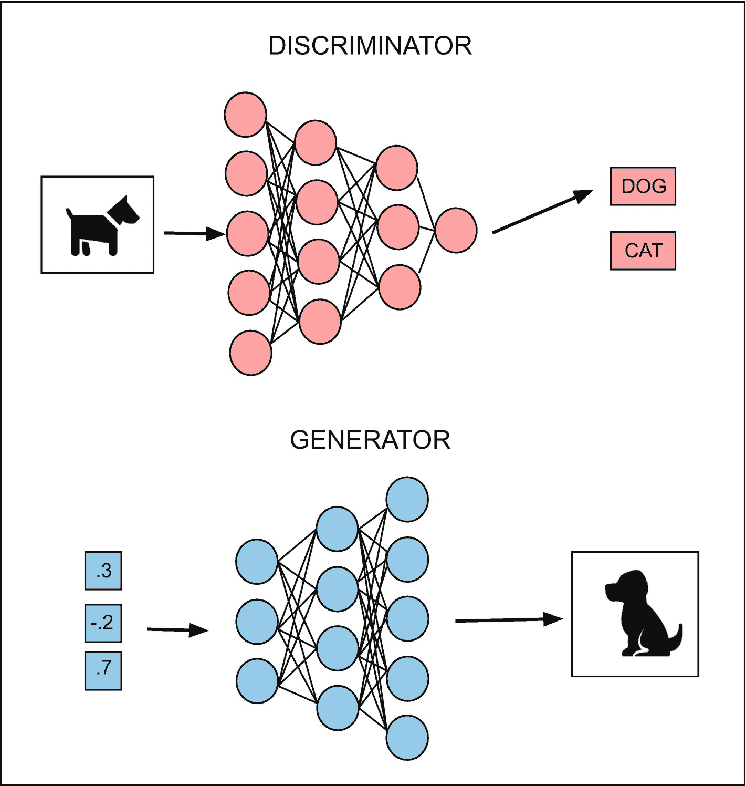
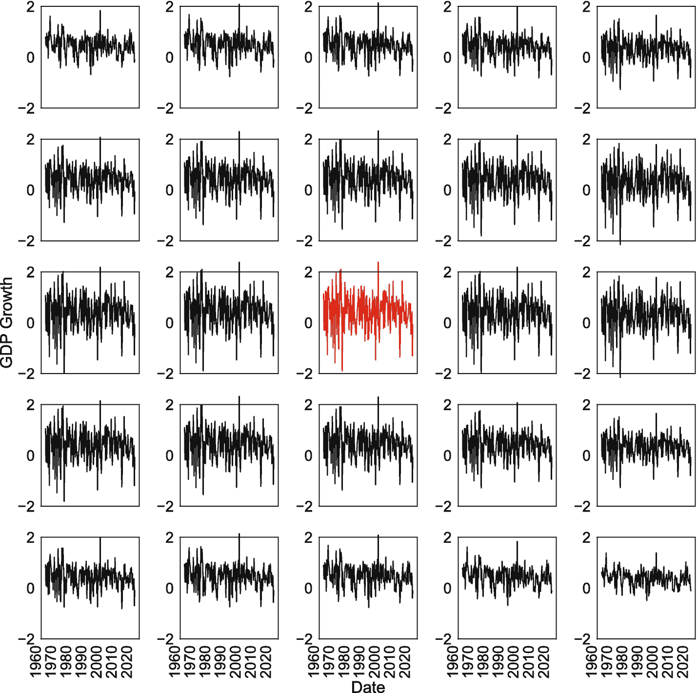
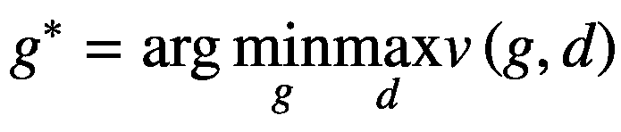
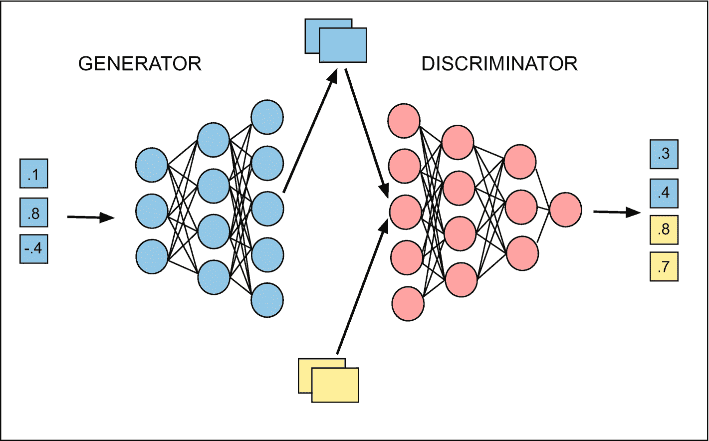
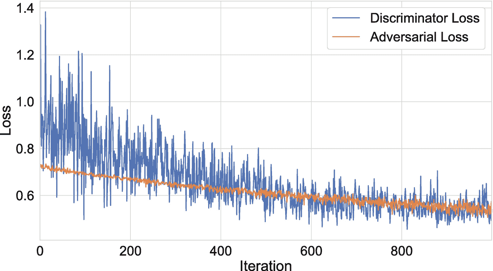
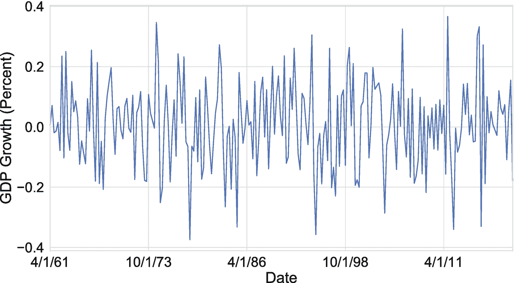

# 九、生成模型

机器学习模型可以分为两类:判别型和生成型。辨别模型被训练来执行分类或回归。也就是说，我们输入一组特征，并期望接收类标签的概率或预测值作为输出。相反，生成模型被训练来学习数据的底层分布。一旦我们训练了一个生成模型，我们就可以用它来产生一个类的新例子。图 9-1 说明了两类模型之间的区别。



图 9-1

鉴别器和发生器模型的比较

到目前为止，我们在这本书里已经关注了判别模型；然而，有一个例外:潜在的狄利克雷分配(Blei et al. 2003)，我们在第六章中介绍了它。LDA 模型将文本语料库作为输入，并返回一组主题，其中每个主题被定义为词汇的分布。

最近，生成机器学习文献取得了相当大的进展，其中大部分集中在两种类型的模型的开发上:变分自编码器(VAEs)和生成对抗网络(GANs)。关于图像、文本和音乐生成，这两类模型已经实现了相当大的突破。

在很大程度上，这种进步还没有达到经济学和金融学学科；然而，经济学中的一些工作已经开始使用 GANs。在本章的最后一节，我们将简要讨论甘斯在经济学中的两个最新应用。艾尔。2019 年和 Kaji 等人 2018 年)，并推测未来的潜在用途。

## 可变自编码器

在第八章中，我们介绍了自编码器的概念，它由两个共享权重的网络组成:一个编码器和一个解码器。编码器将模型输入转换为潜在状态。解码器将潜在状态作为输入，并产生输入到编码器的特征的重构。我们通过计算重建损失来训练模型，重建损失是输入和它们的预测值之间的差异的转换。

我们使用自编码器来执行降维，但是讨论了自编码器的其他用途，主要涉及生成任务，例如创建新的图像、音乐和文本。我们没有提到的是，自编码器受到两个问题的困扰，这两个问题阻碍了它们在这些任务上的性能。我们下面讨论的这两个问题都与它们产生潜在状态的方式有关:

1.  **潜在状态的位置和分布**:具有 *N* 个节点的自编码器的潜在状态是 *ℝ* <sup>*N*</sup> 中的点。对于很多问题，这些点会倾向于聚集在同一个区域；然而，自编码器不允许我们明确地确定这样的点在 *ℝ* <sup>*N*</sup> 中如何以及在哪里聚集。这可能看起来不重要，但它将最终决定哪些潜在状态可以输入到模型中。例如，如果我们试图生成一幅图像，那么知道什么构成了有效的潜在状态，从而知道什么可以被输入到模型中，这将是非常有用的。否则，我们将使用远离模型所观察到的任何东西的状态，这将产生一个新颖的、但也许不可信的图像。

2.  **训练中不存在的潜在状态的性能**:自编码器被训练来为一组例子重建输入。对于与一组特征相关联的潜在状态，解码器应该产生类似于输入特征的输出。然而，如果我们稍微扰动潜在向量，就不能保证解码器有能力从一个从未访问过的点生成一个令人信服的例子。

变分自编码器(VAEs)被开发来克服这些限制。VAEs 不具有潜在状态层，而是具有均值层、对数方差层和采样层。采样图层采用由前面图层中的平均值和对数方差参数定义的正态分布。然后，采样层的输出作为训练过程中的潜在状态传递给解码器。将相同的特征传递给编码器两次，每次都会产生不同的潜在状态。

除了架构上的差异，VAEs 还修改了损失函数，以包括采样层中每个正态分布的 Kullback-Leibler (KL)散度。KL 散度惩罚了每个正态分布与均值和对数方差均为零的正态分布之间的距离。

这些特性的组合完成了三件事。首先，它消除了潜在状态的决定论。每组特征现在将与潜在状态的分布相关联，而不是与单个潜在状态相关联。这将通过强制模型将每个单独的潜在状态特征视为连续变量来提高生成性能。其次，它消除了采样问题。我们现在可以通过使用采样层来随机绘制有效的状态。第三，它修正了潜在空间分布的问题。损失的 KL 散度分量将使分布均值接近于零，并迫使它们具有相似的方差。

本节的剩余部分将重点介绍在 TensorFlow 中实现 VAEs。有关 VAE 模型发展的扩展概述及其理论属性的详细探索，请参见金玛和韦林(2019)。

我们将在本章中使用的例子利用了我们在第八章中介绍的 GDP 增长数据。作为更新，它包括 25 个不同经合组织国家的季度时间序列，时间跨度从 1961 年的 Q2 到 2020 年的 Q1。在第八章中，我们使用降维技术在每个时间点从 25 个系列中提取少量的公共成分。

在本章中，我们将使用 GDP 增长数据来训练一个能够生成类似序列的 VAE。我们将从清单 9-1 开始，导入我们将在本练习中使用的库，然后加载并准备数据。注意，我们转置了 GDP 数据，因此列对应于特定的季度，行对应于国家。然后，我们将数据转换成一个`np.array()`，并为批量大小和潜在空间中输出节点的数量设置参数。

```py
import tensorflow as tf
import pandas as pd
import numpy as np

# Define data path.
data_path = '../data/chapter9/'

# Load and transpose data.
GDP = pd.read_csv(data_path+'gdp_growth.csv',
        index_col = 'Date').T

# Print data preview.
print(GDP.head())

Time    4/1/61    7/1/61   10/1/61    1/1/62
AUS  -1.097616 -0.715607  1.139175  2.806800 ...
AUT  -0.349959  1.256452  0.227988  1.463310 ...
BEL   1.167163  1.275744  1.381074  1.346942 ...
CAN   2.529317  2.409293  1.396820  2.650176 ...
CHE   1.355571  1.242126  1.958044  0.575396 ...

# Convert data to numpy array.
GDP = np.array(GDP)

# Set number of countries and quarters.
nCountries, nQuarters = GDP.shape

# Set number of latent nodes and batch size.
latentNodes = 2
batchSize = 1

Listing 9-1Prepare GDP growth data for use in a VAE
```

下一步是定义 VAE 模型架构，它将由一个编码器和一个解码器组成，类似于第八章的自编码器模型。然而，与自编码器相反，在训练过程中，潜在状态将从一组独立的正态分布中采样。我们将从定义一个执行清单 9-2 中的采样任务的函数开始。

```py
# Define function for sampling layer.
def sampling(params, batchSize = batchSize, latentNodes = latentNodes):
        mean, lvar = params
epsilon = tf.random.normal(shape=(
        batchSize, latentNodes))
        return mean + tf.exp(lvar / 2.0) * epsilon

Listing 9-2Define function to perform sampling task in VAE
```

注意`sampling`层不包含任何自己的参数。相反，它将一对参数作为输入，从潜在状态中的每个输出节点的标准正态分布中提取`epsilon`，然后使用与该状态中的节点相对应的`mean`和`lvar`参数来转换每个提取。

一旦我们定义了一个采样层，我们还可以定义一个编码器模型，它将非常类似于我们为 autoencoder 模型构建的模型。我们将在清单 9-3 中这样做。唯一的初始区别是，我们将一个国家的完整时间序列作为输入，而不是某个时间点上各国的横截面值。

另一个差异出现在`mean`和`lvar`层，这在自编码器中不存在。这些层具有与潜在状态相同数量的节点。这是因为它们由与潜在状态中的每个节点相关联的正态分布的均值和对数方差参数值组成。

我们接下来定义一个`Lambda`层，它接受我们之前定义的`sampling`函数，并传递给它`mean`和`lvar`参数。我们可以看到，采样层为潜在状态中的每个特征(节点)生成一个输出。最后，我们定义了一个函数模型`encoder`，它采用输入特征(季度 GDP 增长观察值)并返回一个均值层、一个对数方差层以及使用均值和对数方差参数化正态分布的抽样输出。

```py
# Define input layer for encoder.
encoderInput = tf.keras.layers.Input(shape = (nQuarters))

# Define latent state.
latent = tf.keras.layers.Input(shape = (latentNodes))

# Define mean layer.
mean = tf.keras.layers.Dense(latentNodes)(encoderInput)

# Define log variance layer.
lvar = tf.keras.layers.Dense(latentNodes)(encoderInput)

# Define sampling layer.
encoded = tf.keras.layers.Lambda(sampling, output_shape=(latentNodes,))([mean, lvar])

# Define model for encoder.
encoder = tf.keras.Model(encoderInput, [mean, lvar, encoded])

Listing 9-3Define encoder model for VAE
```

在清单 9-4 中，我们将为解码器模型和整个可变自编码器定义功能模型。类似于自编码器的解码器组件，它接受潜在状态作为来自编码器的输入，然后生成输入的重构作为输出。全 VAE 模型也与自编码器相似，将时间序列作为输入，并将其转换为同一时间序列的重构。

最后一步是定义损失函数，它由两个部分组成——重建损失和 KL 散度——并将其附加到模型中，我们在清单 9-5 中就是这么做的。重建损失与我们用于自编码器的损失没有什么不同。KL 散度测量每个采样层分布离标准正态分布有多远。它们离得越远，惩罚就越高。

```py
# Compute the reconstruction component of the loss.
reconstruction = tf.keras.losses.binary_crossentropy(
        vae.inputs[0], vae.outputs[0])

# Compute the KL loss component.
kl = -0.5 * tf.reduce_mean(1 + lvar - tf.square(mean) - tf.exp(lvar), axis = -1)

# Combine the losses and add them to the model.
combinedLoss = reconstruction + kl
vae.add_loss(combinedLoss)

Listing 9-5Define VAE loss
```

```py
# Define output for decoder.
decoded = tf.keras.layers.Dense(nQuarters, activation = 'linear')(latent)

# Define the decoder model.
decoder = tf.keras.Model(latent, decoded)

# Define functional model for autoencoder.
vae = tf.keras.Model(encoderInput, decoder(encoded))

Listing 9-4Define decoder model for VAE
```

最后，在清单 9-6 中，我们编译并训练模型。在清单 9-7 中，我们现在有了一个经过训练的变量自编码器，我们可以用它来执行各种不同的生成任务。例如，我们可以使用`vae`的`predict()`方法为给定的时间序列输入生成重建。我们还可以生成给定输入的潜在状态的实现，例如美国的 GDP 增长。我们还可以通过添加随机噪声来扰乱这些潜在状态，然后使用解码器的`predict()`方法，根据修改后的潜在状态生成一个全新的时间序列。

```py
# Generate series reconstruction.
prediction = vae.predict(GDP[0,:].reshape(1,236))

# Generate (random) latent state from inputs.
latentState = encoder.predict(GDP[0,:].reshape(1,236))

# Perturb latent state.
latentState[0] = latentState[0] + np.random.normal(1)

# Pass perturbed latent state to decoder.
decoder.predict(latentState)

Listing 9-7Generate latent states and time series with trained VAE.
```

```py
# Compile the model.
vae.compile(optimizer='adam')

# Fit model.
vae.fit(GDP, batch_size = batchSize, epochs = 100)

Listing 9-6Compile and fit VAE
```

最后，在图 9-2 中，我们展示了 25 个生成的时间序列，它们基于美国 GDP 增长序列的潜在状态实现。然后，我们在 5×5 网格上扰动该原始状态，其中行将[–1，1]间隔上的等间距值添加到第一潜在状态，列将[–1，1]间隔上的等间距值添加到第二潜在状态。网格中心的系列，显示为红色，加上[0，0]，因此，是原始的潜在状态。



图 9-2

VAE 生成的美国 GDP 增长时间序列

虽然这个例子很简单，并且为了演示的目的，潜在状态只包含两个节点，但是 VAE 体系结构可以应用于各种各样的问题。例如，我们可以在编码器和解码器中添加卷积层，并改变输入和输出形状。这将给我们一个产生图像的 VAE。或者，我们可以将 LSTM 细胞添加到编码器和编码器中，这将为我们提供一个可以生成文本或音乐的 VAE。 <sup>1</sup> 此外，基于 LSTM 的架构可以在时间序列生成方面比我们在本例中采用的密集网络方法有所改进。

## 生成对抗网络

两个模型家族主导了生成机器学习文献:变分自编码器和生成对抗网络。正如我们所见，VAEs 通过操纵潜在状态和它们编码的特征，提供了对实例生成的粒度控制。相比之下，GANs 在制作极具说服力的课程范例方面更为成功。例如，一些最有说服力的生成图像是使用 GANs 生成的。

正如我们在上一节中讨论的，vae 是两个模型的组合:编码器和解码器，由采样层连接。类似地，GANs 也由两个模型组成:生成器和鉴别器。生成器取一个随机的输入向量，我们可能会认为它是一个潜在状态，生成一个类的例子，比如一个真实的 GDP 增长时间序列(或者一个图像，一句话，或者一个乐谱)。

一旦 GAN 的生成器组件生成了一个类的几个示例，它们就被传递给鉴别器，同时还有相同数量的真实示例。在我们的例子中，这将是真实的和生成的真实 GDP 增长序列的组合。然后训练鉴别器来区分真实和虚假的例子。

在鉴别器完成分类任务后，我们可以使用一个对抗性网络来训练发生器，该网络结合了发生器和鉴别器模型。正如 VAE 的编码器和解码器组件的情况一样，敌对网络将与两个网络共享权重。敌对网络将训练发生器使鉴别器网络的损耗最大化。

正如 Goodfellow 等人(2017 年)所讨论的，我们可以将这两个网络视为试图在零和游戏中最大化它们各自的收益，其中鉴别器接收 *v* ( *g* ， *d* )，生成器接收 *v* ( *g* ， *d* )。发生器选择样本 *g* 来欺骗鉴别器；鉴别器为每个样本选择概率 *d* 。等式 9-1 给出了由一组生成图像*g*∫表征的平衡。

*方程式 9-1。GAN 中图像生成* *的平衡条件。*



因此，当我们训练网络的敌对部分时，我们必须冻结鉴别器权重。这将约束网络改进生成过程，而不是削弱鉴别器。在训练过程中重复这些步骤将最终产生方程 9-1 中描述的进化平衡。

图 9-3 显示了 GAN 的发生器和鉴别器网络。总的来说，生成器产生了新的例子，这些例子不是从数据中提取的。鉴别器将这些示例与真实示例相结合，然后执行分类。敌对网络通过将发电机连接到一个鉴别器上来训练发电机，但权重是固定的。网络上的训练迭代发生。

按照 VAEs 一节中的例子，我们将再次使用 GDP 增长数据，我们在清单 9-8 中加载并准备了这些数据。我们的目的是训练一个 GAN 从随机抽取的向量输入中生成可信的 GDP 增长时间序列。我们将遵循克罗恩等人(2020)描述的 GAN 构建方法。



图 9-3

来自 GAN 的发生器和鉴别器的描述

```markdown
# 生成式机器学习

## 生成模型

生成模型与判别模型不同。判别模型学习数据点的特征，以便对它们进行分类或预测。生成模型学习数据点的特征，以便生成新的数据点。生成模型在图像、音乐和文本生成等领域取得了巨大成功。在本章中，我们将探讨两种生成模型：变分自编码器（VAE）和生成对抗网络（GAN）。

### 变分自编码器

变分自编码器（VAE）是一种生成模型，它通过学习数据的潜在表示来生成新数据。VAE 由编码器和解码器组成。编码器将输入数据映射到潜在空间，解码器将潜在空间映射回数据空间。VAE 的关键思想是，潜在空间被约束为具有特定的统计特性（例如，均值为 0，方差为 1），这使得我们可以从潜在空间中采样并生成新的数据点。

### 生成对抗网络

生成对抗网络（GAN）由两个模型组成：生成器和判别器。生成器从随机噪声中生成数据，判别器试图区分真实数据和生成器生成的数据。两个模型在训练过程中相互竞争，最终生成器能够生成与真实数据无法区分的数据。

## 使用 GAN 生成 GDP 增长数据

在本节中，我们将使用 GAN 生成模拟的 GDP 增长数据。我们将使用 TensorFlow 和 Keras 来构建和训练模型。

### 数据准备

首先，我们需要加载和准备 GDP 增长数据。

```py
import tensorflow as tf
import pandas as pd
import numpy as np

# Load and transpose data.
GDP = pd.read_csv(data_path+'gdp_growth.csv',
        index_col = 'Date').T

# Convert pandas DataFrame to numpy array.
GDP = np.array(GDP)
```

### 定义生成器模型

生成器模型将一个潜在向量作为输入，并生成一个 GDP 增长时间序列。

```py
# Set dimension of latent state vector.
nLatent = 2

# Set number of countries and quarters.
nCountries, nQuarters = GDP.shape

# Define input layer.
generatorInput = tf.keras.layers.Input(shape = (nLatent,))

# Define hidden layer.
generatorHidden = tf.keras.layers.Dense(16, activation="relu")(generatorInput)

# Define generator output layer.
generatorOutput = tf.keras.layers.Dense(236, activation="linear")(generatorHidden)

# Define generator model.
generator = tf.keras.Model(inputs = generatorInput, outputs = generatorOutput)
```

### 定义判别器模型

判别器模型将 GDP 增长时间序列作为输入，并输出该序列是真实数据的概率。

```py
# Define input layer.
discriminatorInput = tf.keras.layers.Input(shape = (nQuarters,))

# Define hidden layer.
discriminatorHidden = tf.keras.layers.Dense(16, activation="relu")(discriminatorInput)

# Define discriminator output layer.
discriminatorOutput = tf.keras.layers.Dense(1, activation="sigmoid")(discriminatorHidden)

# Define discriminator model.
discriminator = tf.keras.Model(inputs = discriminatorInput, outputs = discriminatorOutput)

# Compile discriminator.
discriminator.compile(loss='binary_crossentropy', optimizer=tf.optimizers.Adam(0.0001))
```

### 定义对抗模型

对抗模型将生成器和判别器组合在一起，用于训练生成器。

```py
# Define input layer for adversarial network.
adversarialInput = tf.keras.layers.Input(shape=(nLatent))

# Define generator output as generated time series.
timeSeries = generator(adversarialInput)

# Set discriminator to be untrainable.
discriminator.trainable = False

# Compute predictions from discriminator.
adversarialOutput = discriminator(timeSeries)

# Define adversarial model.
adversarial = tf.keras.Model(adversarialInput, adversarialOutput)

# Compile adversarial network.
adversarial.compile(loss='binary_crossentropy', optimizer=tf.optimizers.Adam(0.0001))
```

### 训练模型

现在，我们可以训练 GAN 模型。训练过程包括交替训练判别器和对抗模型。

```py
# Set batch size.
batch, halfBatch = 12, 6

for j in range(1000):
        # Draw real training data.
        idx = np.random.randint(nCountries,
        size = halfBatch)
        real_gdp_series = GDP[idx, :]

        # Generate fake training data.
        latentState = np.random.normal(size=[halfBatch, nLatent])
        fake_gdp_series = generator.predict(latentState)

        # Combine input data.
        features = np.concatenate((real_gdp_series,
        fake_gdp_series))

        # Create labels.
        labels = np.ones([batch,1])
        labels[halfBatch:, :] = 0

        # Train discriminator.
        discriminator.train_on_batch(features, labels)

        # Generate latent state for adversarial net.
        latentState = np.random.normal(size=[batch, nLatent])

        # Generate labels for adversarial network.
        labels = np.ones([batch, 1])

        # Train adversarial network.
        adversarial.train_on_batch(latentState, labels)
```

### 结果

训练完成后，我们可以使用生成器生成新的 GDP 增长序列。图 9-4 显示了训练过程中判别器和对抗模型的损失。图 9-5 显示了生成器生成的一个 GDP 增长序列示例。



图 9-4：训练迭代的判别器和对抗模型损失



图 9-5：虚假 GDP 增长序列示例

## 经济学和金融学的应用

生成式机器学习在经济学和金融学中有多种应用。例如，GAN 可以用于生成模拟数据，以进行蒙特卡罗模拟研究。此外，GAN 和 VAE 也可以用于文本生成，例如分析公司新闻稿的变化。

## 摘要

本章介绍了生成式机器学习，重点讨论了 VAE 和 GAN 两种模型。我们展示了如何使用 GAN 生成 GDP 增长数据，并讨论了生成式机器学习在经济学和金融学中的应用。

## 文献学

- Athey, S., G.W. Imbens, J. Metzger and E. Munro. 2019. "Using Wasserstein Generative Adversarial Networks for the Design of Monte Carlo Simulations." *Working Paper 3824.*
- Blei, D.M., A.Y. Ng and M.I. Jordan. 2003. "Latent Dirichlet Allocation." *Journal of Machine Learning Research* 3(993–1022).
- Goodfellow, I., Y. Bengio, and A. Courville. 2017. *Deep Learning.* Cambridge, MA: MIT Press.
- Goodfellow, I.J., Pouget-Abadie, J., Mirza, M., Xu, B., Warde-Farley, D., Ozair, S., Courville, A. and Bengio, Y. "Generative Adversarial Nets." *NIPS’2014.* 2014.
- Kaji, T., E. Manresa and G. Pouliot. 2018. "Deep Learning for Structural Estimation." *Working Paper.*
- Kingma, D.P. and M. Welling. 2019. "An Introduction to Variational Autoencoders." *Foundations and Trends in Machine Learning* 12(4):307–392.
- Krohn, J., G. Bevelander and A. Basens. 2020. *Deep Learning Illustrated: A Visual, Interactive, and Audible Guide to Artificial Intelligence.* Addison-Wesley.

<aside aria-label="Footnotes" class="FootnoteSection" epub:type="footnotes">
Footnotes 1

参见 [`www.datacamp.com/community/tutorials/using-tensorflow-to-compose-music`](http://www.datacamp.com/community/tutorials/using-tensorflow-to-compose-music) 获取音乐生成的生成模型的扩展教程。
</aside>
```