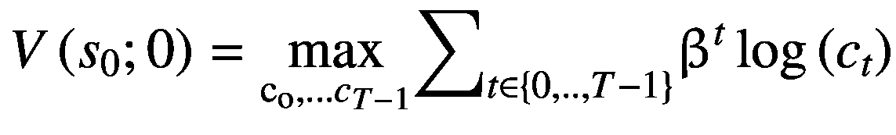

# 10.理论模型

相对于其他机器学习包，TensorFlow 需要大量的时间投入才能掌握。这是因为它为用户提供了定义和求解任何基于图形的模型的能力，而不是为他们提供一组简单且可解释的预定义模型。TensorFlow 的这一功能旨在促进深度学习模型的发展；但是，对于想要解决理论模型的经济学家来说，它也有次要的价值。

在本章中，我们将简要概述 TensorFlow 在这一领域的能力。我们将从演示如何在 TensorFlow 中定义和求解任意数学模型开始。然后，我们将应用这些工具来解决完全折旧的新古典商业周期模型。这个模型有一个解析解，这将允许我们评估 TensorFlow 的表现如何。然而，我们也将讨论在我们没有分析解决方案的情况下如何评估性能。

在我们演示了如何在 TensorFlow 中求解基本的数学模型之后，我们将通过检查深度强化学习来结束这一章，这是一个结合了强化学习和深度学习的领域。近年来，它已经积累了几项令人印象深刻的成就，包括开发机器人和网络，以超人的性能水平玩视频游戏。我们将会看到这如何应用于解决经济学中难以处理的理论模型。

## 求解理论模型

到目前为止，我们已经定义了一个模型，方法是选择一个特定的架构，然后使用数据训练模型的参数。然而，在经济学和金融学中，我们经常遇到一系列不同的问题，这些问题本质上是理论性的，而不是经验性的。这些问题需要我们求解一个泛函方程或者微分方程组。这类问题来源于一个理论模型，该模型描述了家庭、企业或社会规划者的最优化问题。

在这种情况下，模型的深层参数——通常描述技术、约束和偏好——在模型之外进行校准或估计，因此在实施解决方法之前就已经知道了。张量流在这种情况下的作用是实现微分方程系统的求解。

### 吃蛋糕的问题

吃蛋糕问题通常被用作动态编程的“hello world”式介绍。 <sup>[1](#Fn1)</sup> 在这个问题中，一个人被赋予了蛋糕，必须决定在每个时期吃多少。尽管高度程式化，但它与经济学中的标准消费储蓄问题有着很强的相似性。在标准消费储蓄问题中，个人必须决定是现在消费更多，还是通过增加储蓄来推迟消费。

正如我们之前讨论的，这种模型的深层参数通常是在求解程序之外校准或估计的。在这种情况下，消费蛋糕的个人有一个效用函数和一个折扣因子。效用函数衡量个人从消费一块一定大小的蛋糕中获得的快乐。贴现因子告诉我们，相对于未来，一个人将如何评价今天的一块蛋糕。我们将使用效用函数和贴现因子中参数的常用值。

形式上，吃蛋糕问题可以写成一个动态的、受约束的优化问题。等式 10-1 定义了个人在时间 *t* 吃一块蛋糕所获得的瞬时效用。特别地，我们假设接收到的瞬时效用对于代理接收到它的周期是不变的:也就是说，我们在 *c* 上放置一个时间下标，而不是 *u* ()。我们还假设效用是蛋糕消耗量的自然对数。这将确保更多的蛋糕产生更多的效用，但是更多蛋糕的增量收益——边际效用——在 *c* 中减少。这为吃蛋糕的人提供了一种自然的欲望，即随着时间的推移，将消费间隔开，而不是今天就吃掉整个蛋糕。

*方程式 10-1。蛋糕消费的瞬时效用。*


消费的边际效用可以表示为*u*(*c*<sub>T5】t</sub>)相对于 *c* <sub>*t*</sub> 的导数，如等式 10-2 所示。注意，方程 10-1 和方程 10-2 都不含参数。这是采用对数效用来解决此类问题的好处之一:它为效用和边际效用生成简单的、无参数的表达式，并满足我们通常在经济学和金融学中对效用函数的要求。

*方程式 10-2。消费的边际效用。*


除此之外，二阶导数总是负的，如方程式 10-3 所示。

*方程式 10-3。消费的边际效用。*


为了简化问题，我们将蛋糕的大小归一化为 1，这意味着所有的消费选择将介于 0 和 1 之间。在图 [10-1](#Fig1) 中，我们绘制了在此区间内效用水平及其对 *c* 值的一阶和二阶导数。


图 10-1

消费效用，及其在(0，1)区间上的一阶和二阶导数

我们首先考虑一个有限范围的问题，代理人必须在 *T* 个时间段内分配消费。这可能是因为这种蛋糕只在 *T* 时期可以食用，或者是因为这种蛋糕只在 *T* 时期可以食用。在这个程式化的例子中，推理并不特别重要，但对于消费储蓄问题来说，推理当然更重要。

在时间 *t* = 0 时，代理人最大化等式 10-4 中给出的目标函数，服从等式 10-5 中的预算约束和等式 10-6 中对*s*<sub>T5】t+1</sub>的积极性约束。也就是说，代理人必须做出一系列的消费选择， *c* <sub>0</sub> ，…，*c*<sub>*T*—1</sub>，每个消费选择都受到蛋糕剩余量、 *s* <sub>*t*</sub> 的约束，并要求携带一个正数量的蛋糕， *s* <sub>*t* 此外，所有未来期间的消耗都按β ≤ 1 折现。</sub>

在方程 10-4 中，我们还应用了最优化原理(Bellman 1954)来重申用 *s* <sub>0</sub> 蛋糕进入周期 0 的值。它将等于沿着最优消费路径的效用的贴现总和，我们将它表示为未知函数， *V* ()。

*方程式 10-4。t = 0 时代理的目标函数。*



*方程式 10-5。预算限制。*


*方程式 10-6。积极约束。*


贝尔曼(1954)证明了我们可以用后来称为“贝尔曼方程”的公式(10-7)来重新表达任意周期内的目标函数。我们还将预算约束代入等式。

*方程式 10-7。吃蛋糕问题的贝尔曼方程。*


我们没有为 *T-t+1* 期间选择消费序列，而是为当前期间选择 *c* <sub>*t*</sub> 或 *s* <sub>*t* + 1</sub> 。解决这个问题就简化为求解一个函数方程来恢复 *V* ()。这样做之后，选择一个*s*<sub>*t*+1</sub>将确定瞬时效用和未来时期的效用贴现流，使这成为一系列单时期优化问题。

对于有限视界的问题，比如我们设置的这个，我们可以牵制*V*(*s*<sub>T5】T</sub>； *T* )为所有 *s* <sub>*T*</sub> 。由于决策问题在周期*T*1 结束，所以 *s* <sub>*T*</sub> 的所有选择都会产生*V*(*s*<sub>*T*</sub>； *T* ) = 0。因此，我们将从解方程 10-8 开始，其中消耗*s*<sub>*T*—1</sub>总是最优的。我们现在可以在时间上递归后退，在每个周期中求解 *V* ()，直到我们到达 *t* = 0。

*方程式 10-8。吃蛋糕问题的贝尔曼方程。*


有几种方法可以执行递归优化步骤。常见的一种是使用离散网格来表示价值函数。为了利用 TensorFlow 的优势并保持本章剩余部分的连续性，我们将重点放在参数方法上。更具体地说，我们将参数化策略函数，该函数将时间 t 时的状态(即我们在周期开始时的蛋糕量)映射到时间 t+1 时的状态(即我们带入下一周期的蛋糕量)。

为了简单起见，我们将使用一个与状态成比例的线性函数作为决策规则，如等式 10-9 所示。

*方程式 10-9。吃蛋糕政策规则的功能形式。*


我们现在将在 TensorFlow 中针对简单的情况实现这种方法，其中 *T* = 2。也就是说，我们从一块大小为 1 的蛋糕开始，必须决定将多少结转到期间*T*1。

在清单 [10-1](#PC1) 中，我们定义了求解模型所需的常数和参数。这包括政策函数`theta`的斜率，它告诉我们我们结转到下一期的蛋糕份额；贴现因子`beta`，它告诉我们相对于 *t+1* ，代理在 *t* 期间对蛋糕估价多少；以及零时段剩余的蛋糕份额，`s0`。注意`theta`是一个可训练变量；`beta`设置为 1.0，表示我们不贴现 t+1 期间的蛋糕消费；我们最初有一个完整的蛋糕(`s0` = 1)。

```py
import tensorflow as tf

# Define policy rule parameter.
theta = tf.Variable(0.1, tf.float32)

# Define discount factor.
beta = tf.constant(1.0, tf.float32)

# Define state at t = 0.
s0 = tf.constant(1.0, tf.float32)

Listing 10-1Define the constants and variables for the cake-eating problem

```

接下来，我们为清单 [10-2](#PC2) 中的策略规则定义一个函数，它接受参数值并产生`s1`。注意，我们将`s1`定义为`theta*s0`。我们使用`tf.clip_by_value()`将`s1`限制在[0.01，0.99]区间内，这强加了积极性约束。

接下来，在清单 [10-3](#PC3) 中，我们定义了损失函数，它将参数值作为输入并产生损失。请注意，`v1`被选择的`s1`固定，因为 1 是终止周期。确定了`v1`之后，我们就可以计算`v0`，条件是选择`theta`。我们将选择`theta`，因此`s1`，以最大化`v0`。然而，由于我们将在实践中执行最小化，我们将使用`-v0`作为损耗的度量。

```py
# Define the loss function.
def loss(theta, s0 = s0, beta = beta):
        s1 = policyRule(theta)
        v1 = tf.math.log(s1)
        v0 = tf.math.log(s0-s1) + beta*v1
        return -v0

Listing 10-3Define the loss function

```

```py
# Define policy rule.
def policyRule(theta, s0 = s0, beta = beta):
        s1 = tf.clip_by_value(theta*s0,
        clip_value_min = 0.01, clip_value_max = 0.99)
        return s1

Listing 10-2Define a function for the policy rule

```

接下来，我们实例化一个优化器，并在清单 [10-4](#PC4) 中的 500 次迭代过程中执行最小化。

```py
# Instantiate an optimizer.
opt = tf.optimizers.Adam(0.1)

# Perform minimization.
for j in range(500):
opt.minimize(lambda: loss(theta),
        var_list = [theta])

Listing 10-4Perform optimization

```

经过 100 次迭代训练，`theta`收敛到 0.5，如图 [10-2](#Fig2) 所示。`theta` = 0.5 的解释是，代理人应该在 0 期吃一半蛋糕，在 1 期吃一半蛋糕，这正是我们在代理人不贴现未来的情况下会预期到的。


图 10-2

策略函数参数在训练迭代中的演化

当然，我们通常会假设`beta`小于 1。图 [10-3](#Fig3) 针对不同的`beta`值绘制了`theta`的最佳值。在每种情况下，我们都要重新求解模型。正如所料，我们看到两者之间的关系是向上倾斜的。也就是说，当我们更看重未来的消费时，我们也选择把更多的蛋糕带到未来去消费。

这个问题是高度程式化的，关注两个时期的情况使它变得更加琐碎。然而，它确实展示了在 TensorFlow 中构建和求解理论模型的基本模板。在下面的小节中，我们将考虑一个更现实的问题，但是将集中在我们有一个封闭形式的解决方案的情况。这将使评估我们方法的性能变得相对容易。


图 10-3

折扣系数和策略规则参数之间的关系

### 新古典商业周期模型

我们将通过解决布洛克和米尔曼(1972)提出的新古典商业周期模型的一种特殊形式来结束这一节。在该模型中，一个社会规划者最大化一个代表性家庭的消费效用贴现流。在每个期间 *t* ，计划员选择下一个期间的资金*k*<sub>T5】t+1</sub>，在下一个期间 *y* <sub>*t* + 1</sub> 。在对数效用和完全折旧的假设下，该模型有一个易于处理的封闭解。

等式 10-10 是初期的计划者问题，受等式 10-11 中的预算约束。目标类似于吃蛋糕的问题，但家庭是无限活的，所以我们现在有一个消费的贴现效用流的无限和。预算约束表明社会计划者在每个时期将产出分为消费和资本。等式 10-12 规定了生产函数。

*方程式 10-10。社会规划者的问题。*


*方程式 10-11。整体经济的预算约束。*


*方程式 10-12。生产函数。*


我们还假设 *β* < 1， *α* ∈ (0，1)，资本在每一期都充分折旧。这意味着我们用前期结转的资本来恢复产出，但我们没有恢复任何资本本身。

我们可以解决这个问题的一种方式是通过识别满足欧拉方程的策略函数。方程 10-13 中给出的欧拉方程要求在 *t* 期间消费的边际效用等于在 *t+1* 期间贴现的总资本回报率乘以在 *t+1* 期间消费的边际效用。

*方程式 10-13。欧拉方程。*


欧拉方程有一个直观的解释:如果计划者不能通过从时段 *t* 到时段 *t+1* 重新分配少量消费来使家庭变得更好，或者反之亦然，则解决方案是最优的。通过定义资本和消费的政策函数，我们将找到与方程 10-11、10-12 和 10-13 一致的解。不过，我们会看到，消费的政策功能是多余的。

我们首先假设解决方案可以表示为与产出成比例的政策函数。也就是说，计划者将选择一部分产出分配给资本和消费。等式 10-14 提供了资本的政策函数，等式 10-15 提供了消费的函数。

*方程式 10-14。* *政策功能* *为首都。*


*方程式 10-15。消费的政策功能。*


方程 10-16 和 10-17 给出了政策函数的封闭表达式。我们将使用这些来评估我们在 TensorFlow 中的结果的准确性。

*方程式 10-16。资本的政策规则。*


*方程式 10-17。消费的政策规则。*


我们现在已经定义了问题，可以在 TensorFlow 中实现一个解决方案。我们将从定义清单 [10-5](#PC5) 中的参数和资本网格开始。我们将使用`alpha`和`beta`的标准值、生产函数参数和贴现因子。接下来我们将定义`thetaK`，在接下来的时间里分配给资本的产出份额。最后，我们将定义期初资本网格，`k0`。这是一个家庭在周期 *t* 开始时可以持有的资本价值的向量。

```py
import tensorflow as tf

# Define production function parameter.
alpha = tf.constant(0.33, tf.float32)

# Define discount factor.
beta = tf.constant(0.95, tf.float32)

# Define params for decision rules.
thetaK = tf.Variable(0.1, tf.float32)

# Define state grid.
k0 = tf.linspace(0.001, 1.00, 10000)

Listing 10-5Define model parameters

```

在清单 [10-6](#PC6) 中，我们定义了损失函数。我们首先计算下一期资本的政策规则，然后将政策规则代入欧拉方程。然后，我们从左侧减去右侧，得到`error`，它有时被称为欧拉方程残差。然后，我们对残差求平方，并计算平均值。

```py
# Define the loss function.
def loss(thetaK, k0 = k0, beta = beta):
        # Define period t+1 capital.
        k1 = thetaK*k0**alpha

        # Define Euler equation residual.
        error = k1**alpha-
        beta*alpha*k0**alpha*k1**(alpha-1)

        return tf.reduce_mean(tf.multiply(error,error))

Listing 10-6Define the loss function

```

最后一步是定义一个优化器并执行最小化，这是我们在清单 [10-7](#PC7) 中做的。执行优化后，我们打印出`thetaK`和封闭解中的参数表达式`beta*alpha`。在这两种情况下，我们都得到`0.3135002`，这表明我们的 TensorFlow 实现确定了模型的真实解。

```py
# Instantiate an optimizer.
opt = tf.optimizers.Adam(0.1)

# Perform minimization.
for j in range(1000):
opt.minimize(lambda: loss(thetaK),
        var_list = [thetaK])

# Print thetaK.
print(thetaK)

<tf.Variable 'Variable:0' shape=() dtype=float32, numpy=0.31350002>

# Compare analytical solution and thetaK.
print(alpha*beta)

tf.Tensor(0.31350002, shape=(), dtype=float32)

Listing 10-7Perform optimization and evaluate results

```

既然我们已经解决了策略规则，我们可以使用它们来做诸如计算转换路径之类的事情。清单 [10-8](#PC8) 展示了如何使用政策规则并从 0.05 的股本值开始计算消费、资本和产出的转换。我们在图 [10-4](#Fig4) 中绘制了过渡路径。

```py
# Set initial value of capital.
k0 = 0.05

# Define empty lists.
y, k, c = [], [], []

# Perform transition.
for j in range(10):
        # Update variables.
        k1 = thetaK*k0**alpha
        c0 = (1-thetaK)*k0**alpha

        # Update lists.
        y.append(k0**alpha)
        k.append(k1)
        c.append(c0)

        # Update state.
        k0 = k1

Listing 10-8Compute transition path

```

最后，值得指出的是，我们使用了一个有意忽略的例子，在这个例子中，可以解析地计算出解。在实践中，我们通常会遇到并非如此的问题。在这种情况下，我们将经常使用欧拉方程残差来评估求解方法的准确性。

清单 [10-9](#PC9) 展示了我们如何修改损失函数来计算欧拉方程残差。我们将首先定义一个网格来计算它们。在某些情况下，我们可能希望扩展我们用来求解模型的范围，以证明我们的模型在远离稳态时也表现良好。在这种情况下，我们将使用与求解模型时相同的网格。


图 10-4

产出、资本和消费的转变路径

也许并不奇怪——因为我们的策略规则与解析解匹配——最大欧拉方程残差小得可以忽略不计。虽然对这个问题并不特别重要，但每当我们想确定我们的结果受近似误差影响的程度时，欧拉方程残差将是有用的。

```py
# Define state grid.
k0 = tf.linspace(0.001, 1.00, 10000)

# Define function to return Euler equation residuals.
def eer(k0, thetaK = thetaK, beta = beta):
        # Define period t+1 capital.
        k1 = thetaK*k0**alpha

        # Define Euler equation residual.
        residuals = k1**alpha-
        beta*alpha*k0**alpha*k1**(alpha-1)

        return residuals

# Generate residuals.
resids = eer(k0)

# Print largest residual.
print(resids.numpy().max())
5.9604645e-08

Listing 10-9Compute the Euler equation residuals

```

## 深度强化学习

经济学和金融学的标准理论模型假设代理人是理性的优化者。这意味着代理人对未来形成无偏见的期望，并通过执行优化来实现他们的目标。一个理性的代理人可能会错误地预测每个时期的资本回报，但它不会系统地过度预测或不预测它。类似地，优化器不会总是在事后获得最佳结果，但在事前，它会根据给定的信息集做出最佳决策。更明确地说，优化器将根据效用函数和约束条件选择精确的最优值，而不是使用试探法或经验法则。

正如 Palmer (2015)所描述的，我们可能希望偏离 rational optimizer 框架有几个原因。一个是，我们可能希望专注于代理人形成政策规则的过程，而不是假设他们已经采用了理性和优化所隐含的规则。另一个原因是，打破合理性或优化要求将大大提高许多模型的计算处理能力。

如果我们真的想脱离标准模型，另一种方法是强化学习，在萨顿和巴尔托(1998)描述。Athey 和 Imbens (2019 年)和 Palmer (2015 年)讨论了它在经济学中的价值。此外，它在 Hull (2015)中被用作解决棘手的动态规划问题的一种方法。

类似于经济学中的标准 rational optimizer 框架，强化学习问题中的代理执行优化，但是它们是在关于系统状态的信息有限的环境中执行优化的。这导致了“探索”和“利用”之间的权衡——也就是说，学习更多关于系统的知识或者优化你所理解的系统的一部分。

在这一节中，我们将重点关注最近推出的一种强化学习的变体，称为“深度 Q 学习”，它结合了深度学习和强化学习。我们的目标将是放松那些阻止我们解决高维状态空间问题的 rational optimizer 版本的计算约束，而不是研究学习过程本身。也就是说，我们仍然会为 rational 优化器的问题寻找一个解决方案，但是我们将会使用深度 Q 学习来这样做，而不是使用计算经济学中更传统的方法。

类似于动态编程，Q-learning 通常使用“查找表”方法来完成。在动态编程中，这需要构建一个表来表示处于每个状态的值。然后，我们迭代地更新该表，直到我们达到收敛。表本身就是价值函数的解。相反，在 Q-learning 中，我们构建一个状态-动作表。在我们的新古典商业周期模型的例子中，我们将回到这里，国家是资本存量，行动是消费水平。

等式 10-18 展示了在我们使用时间差分学习的情况下，Q 表将如何被更新。也就是说，我们在迭代 *i+1* 中更新与状态-动作对( *s* <sub>*t*</sub> ， *a* <sub>*t*</sub> )相关联的值，这是通过取 *i* 中的值并将其添加到学习率，乘以通过选择最佳动作而引起的值的预期变化来实现的。

*方程式 10-18。更新 Q 表。*

![$$ {Q}_{i+1}\left({s}_t,{a}_t\right)\leftarrow {Q}_i\left({s}_t,{a}_t\right)+\lambda \left[{r}_t+\beta \underset{a}{\max }Q\left({k}_{t+1},a\right)-{Q}_i\left({s}_t,{a}_t\right)\right] $$](img/496662_1_En_10_Chapter_TeX_Equu.png)

深度 Q 学习用称为“深度 Q 网络”的深度神经网络代替了查找表 Mnih 等人(2015)介绍了这种方法，最初用于训练 Q-networks 以超人的性能水平玩视频游戏。

我们将简要概述深度 Q 学习如何用于解决经济模型，回到新古典商业周期模型的例子。在 TensorFlow 中有几种方法可以做到这一点。两个常见的选项是`tf-agents`，它是一个本地 TensorFlow 实现，以及`keras-rl2`，它利用了 TensorFlow 中的高级 Keras API。因为我们的报道将是简短的和介绍性的，所以我们将集中在`keras-rl2`上，这将允许用更熟悉的语法实现更简单的实现。

在清单 [10-10](#PC10) 中，我们安装`keras-rl2`模块并导入`tensorflow`和`numpy`。然后，我们从新安装的`rl`模块中导入三个子模块:`DQNAgent`，我们将使用它们来定义深度 Q 学习代理；`EpsGreedyQPolicy`，我们将使用它来设置在培训路径上生成政策决策的流程；以及`SequentialMemory`，用于保留决策路径和结果，然后用作训练深度 Q 网络的输入。最后，我们导入 gym，我们将使用它来定义模型环境。

```py
# Install keras-rl2.
!pip install keras-rl2

# Import numpy and tensorflow.
import numpy as np
import tensorflow as tf

# Import reinforcement learning modules from keras.
from rl.agents.dqn import DQNAgent
from rl.policy import EpsGreedyQPolicy
from rl.memory import SequentialMemory

# Import module for comparing RL algorithms.
import gym

Listing 10-10Install and import modules to perform deep Q-learning

```

在清单 [10-11](#PC11) 中，我们将设置资本节点的数量并定义一个环境`planner`，它是`gym.Env`的子类。这将详细说明社会规划者的强化学习问题。

我们的类`planner`被构造为在初始化时执行以下操作:定义一个离散的资本网格，定义动作和观察空间，将决策数初始化为零，设置最大决策数，设置资本初始值的节点索引(1000 中的 500)，设置生产函数参数(`alpha`)。出于我们的目的，动作和观察空间都是具有 1000 个节点的离散对象，使用`gym.spaces`来定义。在我们的例子中，观察空间是整个状态空间:即所有的首都节点。动作空间也一样。

```py
# Define number of capital nodes.
n_capital = 1000

# Define environment.
class planner(gym.Env):
        def __init__(self):
                self.k = np.linspace(0.01, 1.0, n_capital)
                self.action_space = \
                gym.spaces.Discrete(n_capital)
                self.observation_space = \
                gym.spaces.Discrete(n_capital)
                self.decision_count = 0
                self.decision_max = 100
                self.observation = 500
                self.alpha = 0.33
        def step(self, action):
                assert self.action_space.contains(action)
                self.decision_count += 1
                done = False
                if(self.observation**self.alpha – action) > 0:
                        reward = \
                np.log(self.k[self.observation]**self.alpha –
                self.k[action])
                else:
                        reward = -1000
                self.observation = action
                if (self.decision_count >= self.decision_max)\
                or reward == -1000:
                        done = True
                return self.observation, reward, done,\
                {"decisions": self.decision_count}
        def reset(self):
                self.decision_count = 0
                self.observation = 500
                return self.observation

Listing 10-11Define custom reinforcement learning environment

```

我们接下来定义该类的一个`step`方法，该方法需要返回四个输出:`observation`(状态)、`reward`(瞬时工具)、一个指示训练会话是否应该被重置的指示器(`done`)以及一个包含相关调试信息的字典对象。调用这个方法增加了`decision_count`属性，它记录了一个代理在一个训练会话中做出的决定的数量。它还最初将`done`设置为`False`。然后，我们评估代理人是否做出了有效的决策，即选择了正的消费值。如果一个代理做出了超过`decision_max`个决策或者选择了一个非正的消耗值，那么`reset()`方法将被调用，它将重新初始化状态和决策计数。

在清单 [10-12](#PC12) 中，我们实例化了一个`planner`环境，然后在 TensorFlow 中定义了一个神经网络。我们使用具有一个致密层和一个`relu`激活函数的`Sequential`模型。注意，模型应该有一个包含`n_capital`节点的输出层；然而，除此之外，我们可以选择最适合我们问题的架构。

```py
# Instantiate planner environment.
env = planner()

# Define model in TensorFlow.
model = tf.keras.models.Sequential()
model.add(tf.keras.layers.Flatten(input_shape=(1,) + env.observation_space.shape))
model.add(tf.keras.layers.Dense(32, activation="relu"))
model.add(tf.keras.layers.Dense(n_capital, activation="linear"))

Listing 10-12Instantiate environment and define model in TensorFlow

```

既然已经定义了我们的环境和网络，我们需要指定超参数并训练模型，我们在清单 [10-13](#PC13) 中就是这么做的。我们首先使用`SequentialMemory`来保留 50，000 个决策路径的“重放缓冲区”,它将用于训练模型。然后，我们将模型设置为使用ε= 0.30 的ε贪婪策略。在训练期间，这意味着该模型将在 70%的时间内最大化效用，并在剩余的 30%时间内用随机决策进行探索。最后，我们设置`DQNAgent`模型的超参数，编译它，并执行训练。

```py
# Specify replay buffer.
memory = SequentialMemory(limit=10000, window_length=1)

# Define policy used to make training-time decisions.
policy = EpsGreedyQPolicy(0.30)

# Define deep Q-learning network (DQN).
dqn = DQNAgent(model=model, nb_actions=n_capital, memory=memory,
        nb_steps_warmup=100, gamma=0.95,
        target_model_update=1e-2, policy=policy)

# Compile and train model.
dqn.compile(tf.keras.optimizers.Adam(0.005), metrics=['mse'])
dqn.fit(env, nb_steps=10000)

Listing 10-13Set model hyperparameters and train

```

监控训练过程产生了两个观察结果。首先，每次会话的决策数量随着迭代而增加，这表明代理人学会了通过不像贪婪的政策所暗示的那样急剧地提取资本来避免未来期间的负值。第二，损失下降，平均回报开始上升，表明代理人正在接近最优。

如果我们想对我们的解的质量进行更彻底的分析，我们可以检查欧拉方程残差，正如我们在上一节中所讨论的。这将告诉我们 DQM 模型是否产生了近似最优的结果。

## 摘要

TensorFlow 不仅为我们提供了一种训练深度学习模型的方法，还提供了一套可用于解决任意数学模型的工具。这包括经济学和金融学中常用的模型。在这一章中，我们使用一个玩具模型(吃蛋糕模型)和计算文学中的一个通用基准:新古典商业周期模型来检验如何做到这一点。使用经济学中的常规方法求解这两个模型都是微不足道的，但提供了一种简单的方法来演示如何使用张量流来求解与经济学家相关的理论模型。

我们还展示了深度强化学习如何被用作计算经济学中标准方法的替代方法。特别是，在 TensorFlow 中使用深度 Q 学习网络(DQN)可以使经济学家在非线性设置中解决高维模型，而不改变模型假设或引入大量数值误差。

## 文献学

阿西和 G.W .因本斯。2019."经济学家应该知道的机器学习方法."*年度经济学评论*11:685–725。

贝尔曼河，1954。"动态规划理论."美国数学学会公报 60:503–515。

布洛克，w .和 l .米尔曼。1972."最优经济增长和不确定性:贴现案例."*经济理论杂志*4(3):479–513。

赫尔岛，2015 年。"具有后决策状态的近似动态规划作为动态经济模型的求解方法."*经济动态与控制杂志*55:57–70。

Mnih，v .等人，2015 年。"通过深度强化学习进行人类水平的控制."*性质*518:529–533。

新墨西哥州帕尔默，2015。个人和社会学习:从第一原则实现有限理性。计算社会科学博士论文，弗吉尼亚州费尔法克斯:乔治梅森大学。

萨顿和巴尔托。1998.强化学习:简介。剑桥:麻省理工学院出版社。

<aside aria-label="Footnotes" class="FootnoteSection" epub:type="footnotes">Footnotes [1](#Fn1_source)

动态规划是一种将多步优化问题转化为一系列单步问题的方法。在经济学和金融学中，动态规划通常用于多期动态优化问题。动态规划将这类问题简化为一系列单周期问题。

 </aside>