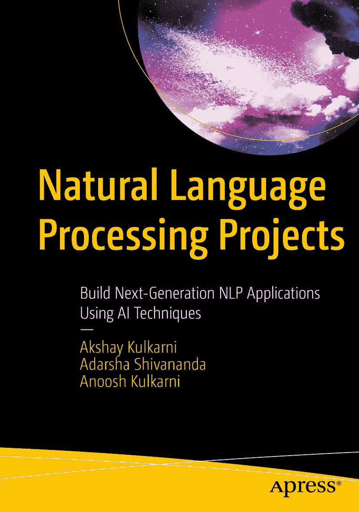

ISBN 978-1-4842-7385-2 e-ISBN 978-1-4842-7386-9 [`doi.org/10.1007/978-1-4842-7386-9`](https://doi.org/10.1007/978-1-4842-7386-9) © Akshay Kulkarni, Adarsha Shivananda and Anoosh Kulkarni 2022 Apress Standard 本出版物中使用的通用描述性名称、注册商标名称、商标、服务标志等，即使未作特别声明，也不意味着这些名称不受相关保护性法律和法规的约束，因此可自由用于一般用途。出版商、作者和编辑可以假定，本书中的建议和信息在出版时是真实准确的。出版商、作者或编辑均不对本书所含材料或可能存在的任何错误或遗漏提供明示或暗示的担保。出版商对已出版地图中的管辖权主张和机构隶属关系保持中立。

本 Apress 印记由注册公司 APress Media, LLC（Springer Nature 的一部分）出版。

注册公司地址为：1 New York Plaza, New York, NY 10004, U.S.A.

*献给我们家人*