# 1. 自然语言处理与人工智能概述

近年来，我们听到了很多关于人工智能、机器学习、深度学习和自然语言处理的内容。它们是什么？它们都一样吗？我们如何区分它们？

1956 年，一位名叫约翰·麦卡锡的美国计算机科学家创造了*人工智能*这个术语，它是计算机科学的一个子领域。人工智能（AI）是机器思考和学习的能。AI 的概念是让机器能够像人脑一样思考和学。

在深入细节之前，有必要澄清关于 AI 的一点：大多数人错误地认为 AI 是一种技术，而实际上它是一个概念，即机器能够智能地处理任务。

如今，它是一个涵盖从数据解释到人形机器人等一切的总称。由于计算能力的提升和海量数据的出现，它最近获得了显著地位。它比人类更有效地识别数据中的模式，使任何企业都能从自己的数据中获得更多洞察。

AI 和机器学习一样吗？并非如此。这两个术语经常可以互换使用，但它们并不相同。人工智能是一个更广泛的概念，而机器学习是人工智能范式的一部分，可以被视为 AI 的一个子领域。在 AI 范式下，有多个概念，如机器学习、自然语言处理、深度学习等等。

你可以将机器学习理解为 AI 的一部分，专注于让机器从数据中学习，并使机器能够在没有人类帮助或干预的情况下思考和决策。整个机器学习概念假设我们应该让机器访问数据，并让它们自己从中学习。

类似地，深度学习主要处理非结构化数据，如图像、文本和音频。

而当专门处理文本数据时，我们利用自然语言处理。自然语言处理（NLP）在当前场景下无需介绍。它是一个研究和探索非常活跃的领域，并且在过去几年中兴趣成倍增长。尽管 NLP 的基础知识相当简单，但高级主题却难以理解。

这就是机器学习、深度学习和其他最先进算法变得如此关键的地方。图 1-1 是 AI 范式的维恩图。

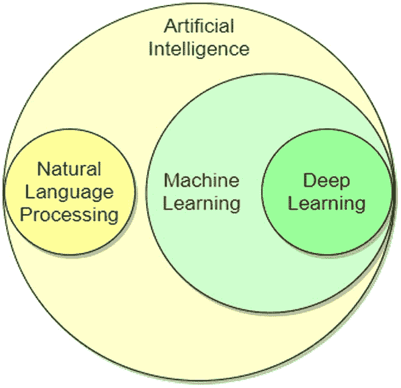

**图 1-1** AI 范式

在进入项目之前，让我们从非常高的层面理解一些解决后续项目所需的概念和技术。对这些概念的深入理解超出了本书的范围。

## 机器学习

机器学习可以定义为机器从经验（数据）中学习并在没有明确编程的情况下做出有意义的预测的能力。

它是 AI 的一个子领域，涉及构建能够从数据中学习的系统。目标是让计算机在没有人类干预的情况下自主学习。

机器学习主要有三大类别。

*   监督学习

*   无监督学习

*   强化学习

### 监督学习

监督学习是机器学习的一部分，利用带标签的训练数据来推导模式或函数，并构建模型或机器学习。数据由因变量（目标标签）和自变量或预测变量组成。机器试图从带标签的数据中学习函数，并对未见过的数据预测输出。

### 无监督学习

在这里，机器学习隐藏模式而不利用带标签的数据，因此不进行训练。相反，这些算法基于特征之间的相似性或距离来学习，以捕获模式。

### 强化学习

强化学习是通过采取行动来最大化奖励的过程。这些是目标导向的算法，学习如何通过经验达到目标。

接下来，我们将简要讨论属于这些类别的所有算法。您还将了解自然语言处理是如何工作的，以及深度学习是如何解决 NLP 问题的。

图 1-2 解释了所有类别和子类别。

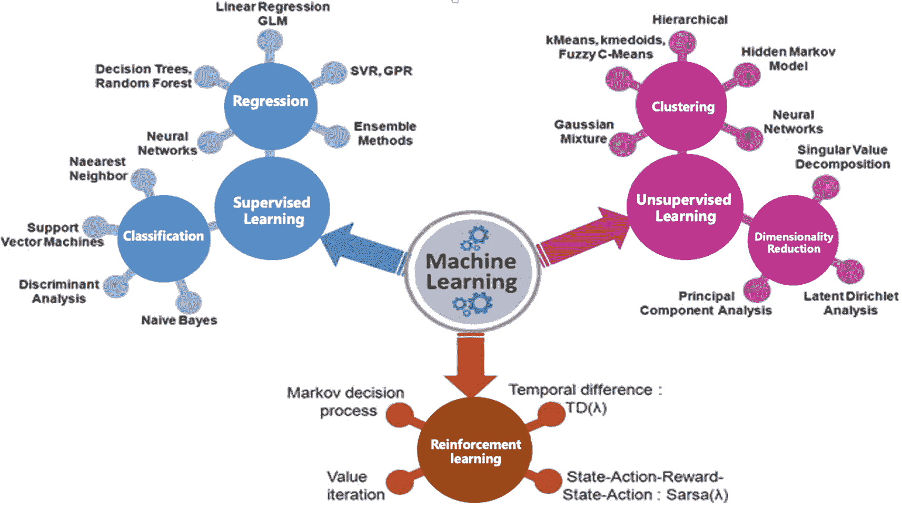

**图 1-2** 机器学习类别

### 监督学习

从带标签的数据中学习称为*监督学习*，它有两种类型：*回归*和*分类*。

#### 回归

回归是一种统计预测建模技术，用于找出因变量和自变量之间的关系。当因变量是连续的时使用回归；预测可以取任何数值。

以下是业界广泛使用的几种回归算法。让我们深入了解其理论，以便更好地理解这些算法。

*   线性回归

*   决策树

*   随机森林

*   支持向量机

*   GBM

*   XGBOOST

*   ADABOOST

*   LightGBM

#### 分类

分类是一种监督机器学习技术，其中因变量或输出变量是分类的。例如，垃圾邮件/正常邮件、流失/未流失等。

*   在*二分类*中，要么是“是”，要么是“否”。没有第三种选择。例如，客户可能会从某个业务中流失或不流失。

*   在*多分类*中，标签变量可以是多类的，例如，电子商务网站的产品分类。

以下是业界广泛使用的几种分类算法。

*   逻辑回归

*   决策树

*   随机森林

*   支持向量机

*   GBM

*   XGBoost

*   AdaBoost

*   LightGBM

让我们简要地看一下这些算法中的每一个。

### 线性回归

回归是分析和数据科学中最常用的术语。它捕捉了目标特征与独立特征之间的关系。当你想要预测一个连续值时，就会用到它。图 1-3 展示了线性回归的工作原理。

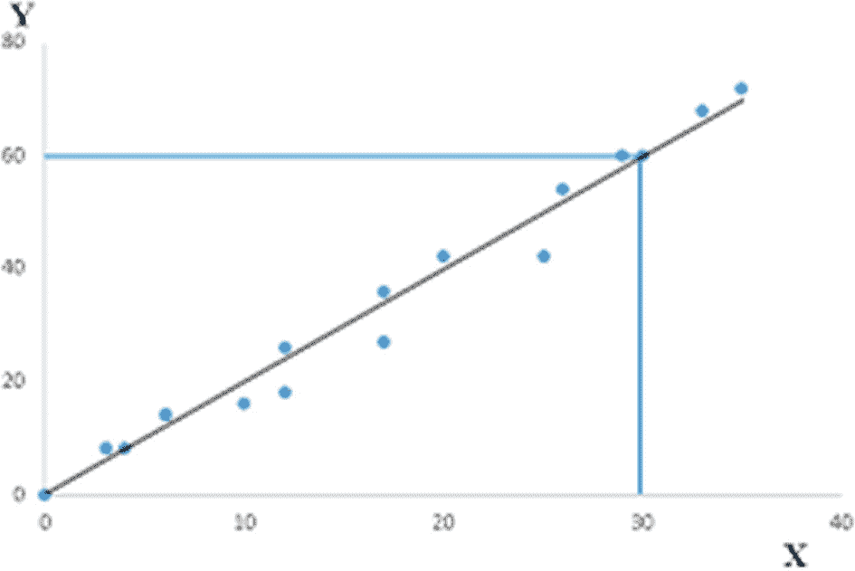

图 1-3

线性回归

在图 1-3 中，点是通过 x 轴和 y 轴绘制的。目标是通过绘制一条接近平面上所有点的最优直线（最小化误差）来找到 `x` 和 `y` 之间的关系。直线的斜率由以下方程得出。

`Y = A[0] + A[1]X`

`Y` = 因变量

`X` = 自变量

`A[0]` = 截距

`A[1]` = `X` 的系数

例如，

`Age = Ht * 4 + wt * 3 + 2`

这里我们正在建立身高和体重与年龄之间的关系。给定身高和体重，你可以计算出年龄。

线性回归有一些假设。

-   因变量和自变量之间应始终存在线性关系。

-   数据应呈正态分布。

-   自变量之间不应存在任何共线性。多重共线性指的是自变量之间存在强线性关系。这些相关的变量是冗余的，需要处理。

-   存在*同方差性*，这意味着误差的方差应随时间保持恒定。对于较高的输出值，方差不应更高；对于较低的输出值，方差不应更低。

-   误差项之间不应存在任何相关性。

一旦你构建了模型，你就想知道模型的性能如何。为此，你可以使用一些指标。

-   *R 平方*（`R²`）是计算线性回归准确度最广泛使用的指标。`R²` 值显示了因变量的方差通过自变量被解释的程度。R 平方的取值范围是 0 到 1。

-   *均方根误差*（`RMSE`）显示了预测值与实际值之间离散程度的度量。

### 逻辑回归

我们讨论了如何使用线性回归预测数值。但我们也会遇到分类问题，其中因变量是二元类别，例如是或否、1 或 0、真或假等。在这种情况下，你需要使用*逻辑回归*，它是一种分类算法。逻辑回归是线性回归的扩展版本，但我们使用对数几率将因变量限制在 0 和 1 之间。以下是逻辑函数。

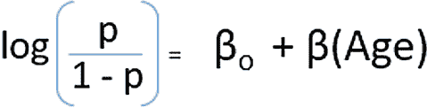

`(p/1 – p)` 是优势比。`B0` 是常数。`B` 是系数。

图 1-4 展示了逻辑回归的工作原理。

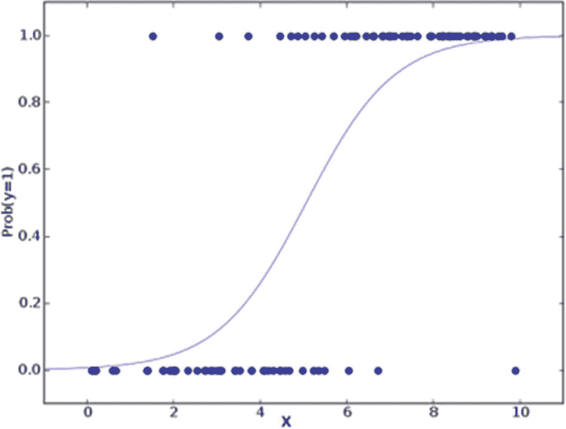

图 1-4

逻辑回归

现在让我们看看如何评估一个分类模型。

-   **准确率**是正确预测的数量除以总预测数量。其值介于 0 到 1 之间，要将其转换为百分比，将结果乘以 100。但仅将准确率作为评估参数并非理想做法。例如，如果数据不平衡，你可以获得非常高的准确率。

-   **混淆矩阵**是实际类别与预测类别之间的交叉表。你可以将其用于二元分类和多类分类。

图 1-5 展示了一个混淆矩阵。

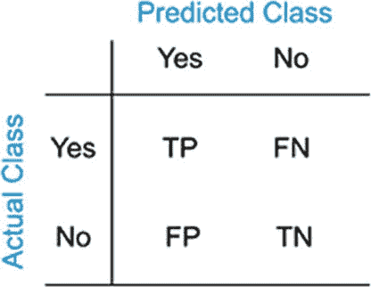

图 1-5

混淆矩阵

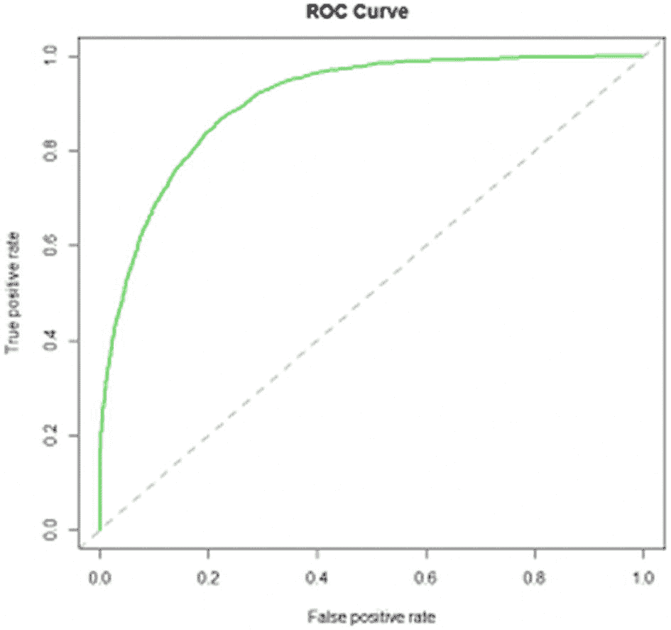

图 1-6

ROC 曲线

-   **ROC 曲线**：*接收者操作特征*（`ROC`）曲线是分类任务的一种评估指标。`ROC` 曲线图以假阳性率为 x 轴，真阳性率为 y 轴。它表明了当阈值变化时，类别之间的区分程度。`ROC` 曲线下面积的值越高，预测能力越强。图 1-6 展示了 `ROC` 曲线。

线性回归和逻辑回归是使用统计方法来预测因变量的传统方法。但这些算法存在一些缺点。以下描述了其中几点。

-   统计建模必须满足前面讨论的假设。如果不满足这些假设，模型将不可靠，并且会完全拟合随机预测。

-   当数据和目标特征是非线性时，这些算法会面临挑战。复杂的模式难以解码。

-   数据应该是干净的（需要处理缺失值和异常值）。

还有其他先进的机器学习概念，如决策树、随机森林、`SVM` 和神经网络，可以克服这些局限性。

决策是一种监督学习，其中数据根据从最重要变量到最不重要变量的顺序被分割成相似的组。当所有变量被分割时，它看起来像一个树形结构，因此得名基于树的模型。

树由根节点、决策节点和叶节点组成。一个决策节点可以有两个或更多分支，叶节点代表一个决策。决策树能够处理任何类型的数据，无论是定量数据还是定性数据。图 1-7 展示了决策树的工作原理。

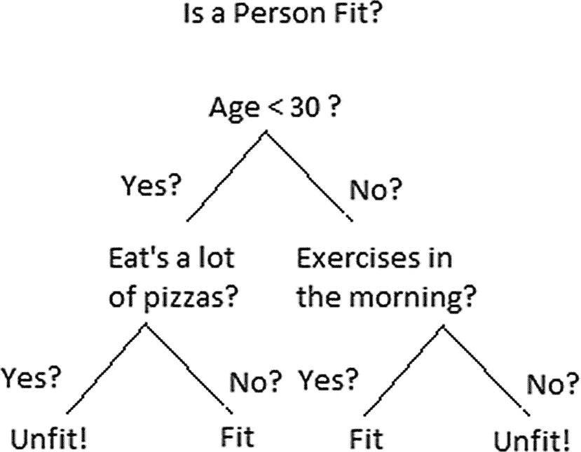

图 1-7

决策树

让我们探讨一下树的分割是如何发生的，这是决策树中的关键概念。

决策树算法的核心是树的分割过程。它使用不同的算法来分割节点，并且对于分类和回归问题使用不同的算法。现在，让我们试着理解它。

#### 分类

-   **基尼指数**是一种概率性的树分割方法。它使用成功和失败概率的平方和，并决定节点的纯度。

-   **CART**（分类与回归树）使用基尼方法来创建分割。

-   **卡方检验**是子节点与父节点之间的统计显著性，它决定了分割。`卡方值 = ((实际值 – 期望值)² / 期望值)¹/2`。

-   **CHAID**（卡方自动交互检测器）是这种方法的一个例子。

#### 回归

-   **方差缩减**根据两个特征（目标特征和独立特征）之间的方差来分割树。

-   **过拟合**发生在算法紧密拟合给定的训练数据，但无法准确预测未训练数据或测试数据结果时。

决策树也存在这种情况。当创建的树完美地拟合了训练数据集中存在的所有样本时，就会发生这种情况，从而影响测试数据的准确性。

#### 随机森林

随机森林因其灵活性和克服过拟合问题的能力，成为应用最广泛的机器学习算法。它是一种集成算法，由多个决策树集成——树的数量越多，准确率越高。

随机森林可以执行分类和回归任务。以下是其优点。

- 随机森林对缺失值和异常值不敏感。

- 它能防止算法过拟合。

它是如何工作的？它基于装袋（bagging）和自助采样（bootstrap sample）技术。

- 随机取`m`个特征的平方根，并取一个包含 2/3 数据的自助样本（有放回），用于随机训练每个决策树并预测结果。

- 构建`n`棵树，直到袋外错误率最小化并趋于稳定。

- 计算每个预测目标的投票数，并将众数作为分类任务的最终预测结果。

图 1-8 展示了随机森林模型的工作原理。

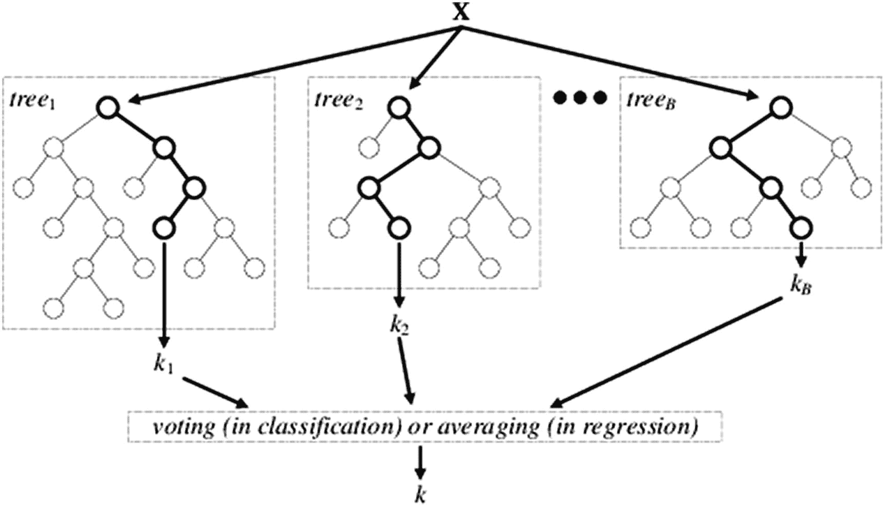

图 1-8  

随机森林

#### 支持向量机

支持向量机（SVM）试图找到最佳超平面，该超平面根据目标特征将数据分成不同的组。图 1-9 展示了 SVM 的工作原理。

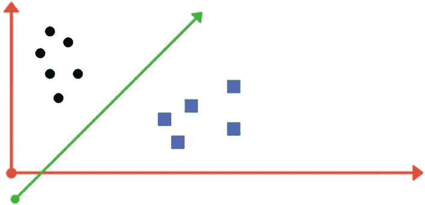

图 1-9  

SVM

将图 1-9 中的图形视为两组：圆形和方形。由于只有两个特征，分离这些组变得更容易，可以使用一条直线来完成。但随着特征数量的增加，维度也会增加，此时需要使用一个超平面或一组超平面来分隔这些类别。这些平面被称为*决策边界*。落在直线一侧的任何事物都被归类为*圆形*，另一侧则为*方形*。

如何决定最佳超平面？图 1-10 展示了超平面的概念。

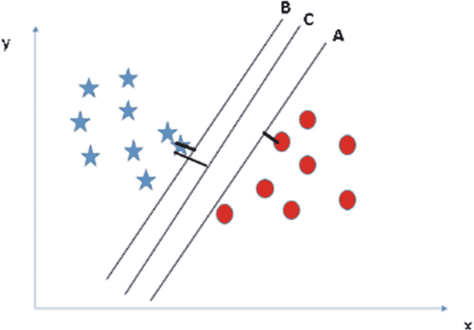

图 1-10  

超平面

间隔宽度是平面与最近数据点之间的距离。SVM 试图最大化间隔宽度，以实现选择正确超平面的目标。如图所示，由于间隔较大，直线 C 是最佳超平面。

#### 非线性数据：核技巧

数据分布并不总是线性的。大多数情况下，数据分布是非线性的，线性超平面无法对数据进行分类。为了解决这个问题，SVM 引入了*核技巧*（参见图 1-11），它将数据投影到多维空间以执行学习任务。

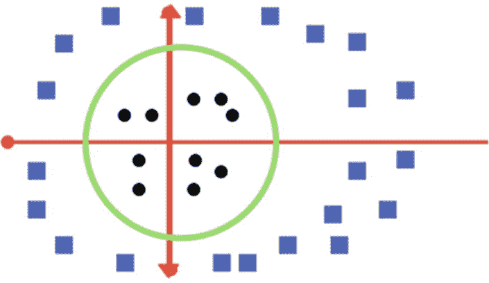

图 1-11  

核技巧

### 神经网络

神经网络是受人类神经系统启发的机器学习算法，人类神经系统负责处理信息并采取行动。

数百万个神经元相互连接，每个神经元根据训练数据学习或发现模式。网络试图自动发现隐藏的规则，无需人工干预。这些算法在所有其他机器学习技术中表现优异，尤其是在处理图像和文本等非结构化数据时。图 1-12 展示了神经网络的架构。

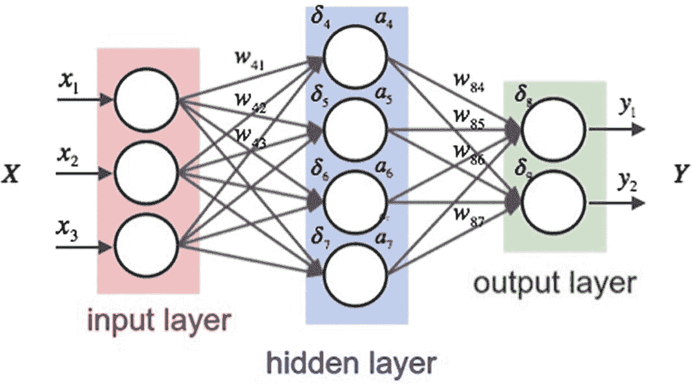

图 1-12  

神经网络

你需要找到预测的权重和偏置。神经网络的训练是通过多次迭代微调权重和偏置来完成的。

- 前向传播：通过输入层接收输入，将其传递到隐藏层（在第一次迭代中随机添加权重和偏置），最后将输出预测为权重与特征值的乘积之和加上偏置。

- 反向传播：计算上一步中预测输出与实际输出之间的误差。该误差被反向传播，并使用优化器相应地更新权重和偏置，以最小化损失函数。

一个前向传播和反向传播的循环称为一个*周期*。通过执行多个这样的周期来提高准确率。

*激活函数*引入非线性，从而将输入相应地映射到输出。基于目标特征有多种激活函数，例如 Sigmoid 主要用于二分类；类似地，Softmax 主要用于多分类。

以下是深度学习中的关键术语或组件。

- 权重

- 偏置

- 损失函数

- 优化器：梯度下降、Adam、AdaDelta、RMS Prop

- 激活函数：sigmoid、softmax、ReLU

### 深度神经网络

特点

- 隐藏层数量多于一个

- 前一层的输出被馈送到后续层

- 每一层都提取特征

- 非线性函数捕获复杂的隐藏特征

图 1-13 展示了一个流程图。

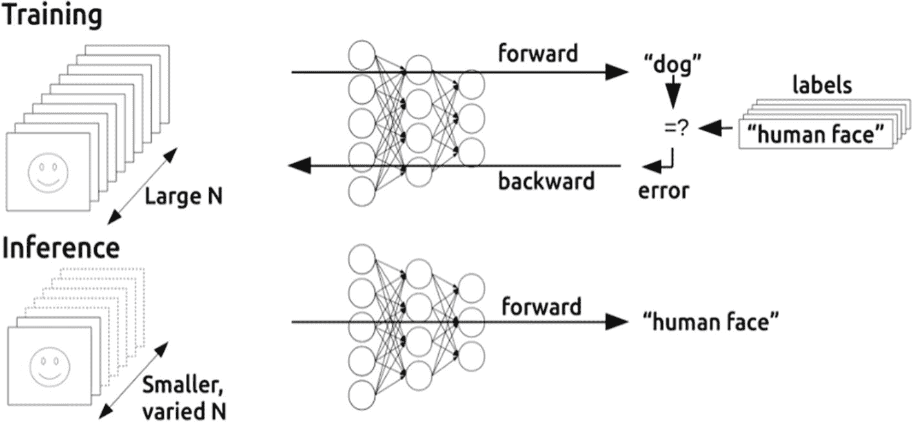

图 1-13  

深度神经网络

#### 卷积神经网络

卷积神经网络是一种深度神经网络，其架构略有变化。它们专门为处理图像而设计。CNN 有几个其他层，这使得实现更高效。CNN 将每个图像像素作为一个特征（对于彩色图像是三维数组）进行处理，并对其进行分类。

CNN 中有多个自定义层，包括以下内容。

- 卷积层

- 最大池化层

- 全连接层

- 丢弃层

*卷积层*充当滤波器，提取图像中存在的特征。滤波器的值在训练过程中得出。图 1-14 展示了 CNN 的工作原理。

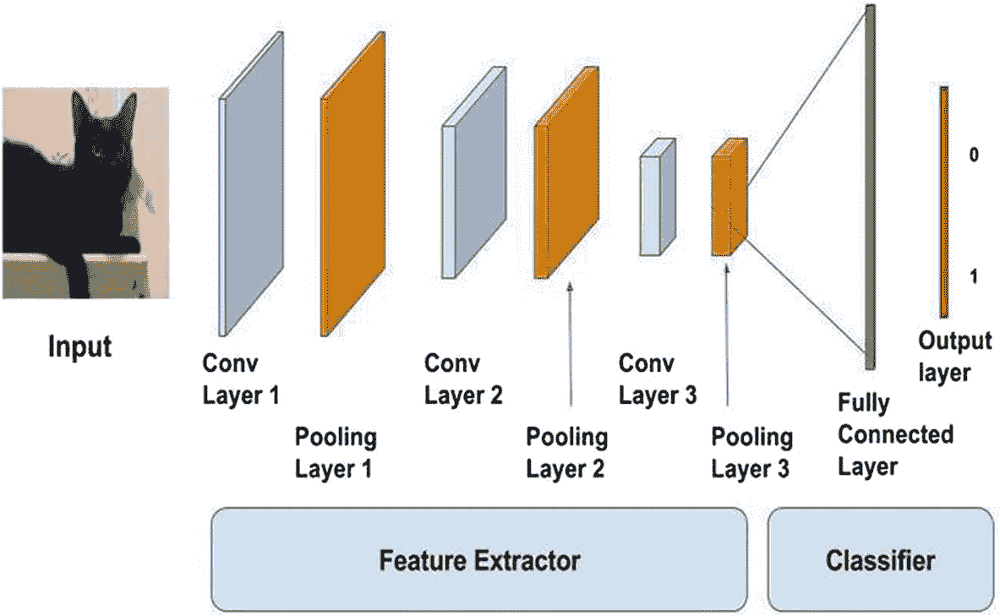

图 1-14  

CNN

### RNN

正如 CNN 专门为图像设计一样，也存在用于处理基于序列的数据（如文本）的循环神经网络。其思想是文本数据具有特定的序列。数据本身是顺序的，这为句子增添了意义。RNN 也能捕获数据的序列特性。

RNN 以循环方式工作。数据以循环方式流动，因此不仅学习当前状态的输入，也学习先前的输入。随时间反向传播的概念应运而生；它类似于普通神经网络的反向传播，但它是回溯时间并更新权重。

但 RNN 最大的挑战是梯度消失，这意味着当梯度太小时，模型的学习将会停止。像*长短期记忆网络*（LSTM）和*门控循环单元*（GRU）这样的模型通过门控机制克服了这些问题。

### 无监督学习

无监督学习是一种机器学习类别，它不利用带标签的数据，但仍能从手头的数据中发现推断结果。你需要在不依赖因变量的情况下寻找模式，以解决业务问题。图 1-15 展示了聚类的结果。

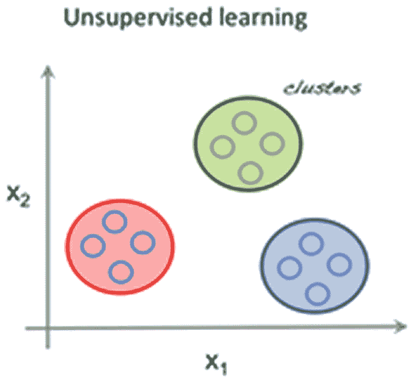

图 1-15 聚类

无监督学习技术主要有两种类型：*聚类*和*降维*。

#### 聚类

将相似的事物分组称为*聚类*。相似的“事物”不仅指数据点，还包括满足以下条件的观测值集合：

- 同一组内的观测值彼此相似

- 与其他组内的观测值不相似

业界广泛使用的主要有两种重要算法。在进入项目之前，我们先简要了解一下这些算法的工作原理。

##### k-means 聚类

`k-means` 是一种高效且广泛使用的聚类技术，它根据点之间的距离对数据进行分组。`k-means` 聚类的目标是最小化簇内的总方差，如图 1-16 所示。

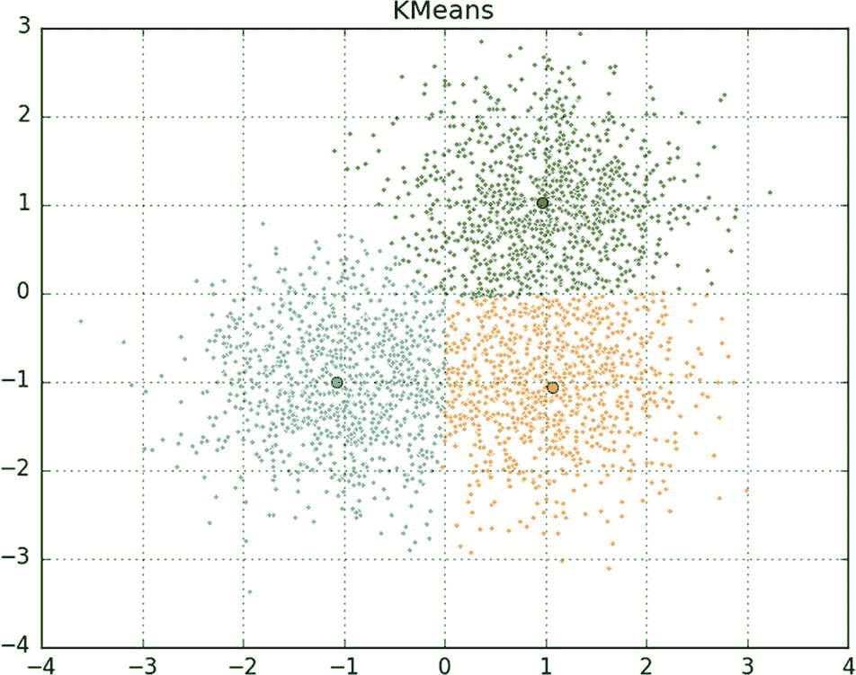

图 1-16 k-means

以下步骤用于生成聚类。

1. 使用肘部法确定最佳聚类数。该数值即为 `k`。

2. 从所有观测值或点中随机选择 `k` 个点作为聚类中心。

3. 计算这些中心与数据中其他点之间的距离，并使用任意距离度量方法，将点分配到其所属的最近中心簇。

   - 欧氏距离

   - 曼哈顿距离

   - 余弦距离

   - 汉明距离

4. 为每个簇重新计算聚类中心或质心。

5. 重复步骤 2、3 和 4，直到每个簇分配到的点相同，且簇质心稳定。

### 层次聚类

层次聚类是另一种聚类技术，它也利用距离来创建分组。以下步骤用于生成聚类。

1. 层次聚类首先将每个观测值或点创建为一个单独的簇。

2. 根据距离度量，识别出距离最近的两个观测值或点。

3. 将这两个最相似的点合并，形成一个簇。

4. 重复此过程，直到所有簇合并，最终形成一个单一的簇。

5. 最后，使用树状图确定理想的聚类数量。

通过切割树状图来决定聚类的数量。切割点应选在层级之间出现最大跳跃的位置，如图 1-17 所示。

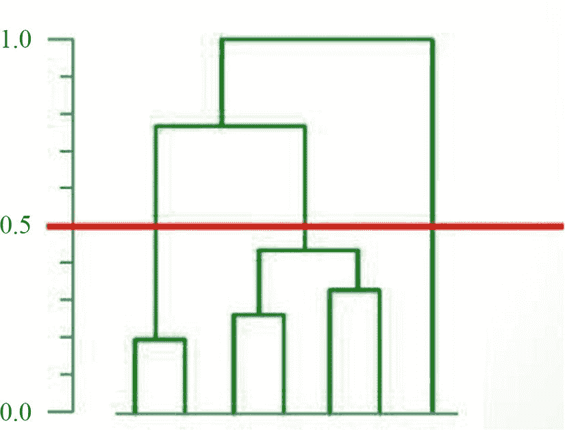

图 1-17 层次聚类

通常，两个簇之间的距离基于欧氏距离计算。也可以利用许多其他距离度量方法来完成同样的任务。

### 降维

降维是将整个数据集中的特征数量减少到少数几个重要的主成分特征的过程，目的是提高建模实践的准确性并减少计算挑战。例如，如果我们在进行预测建模时变量数量超过 1000 个，那么算法很可能会表现不佳。使用任何降维技术，你都可以在减少特征数量的同时，捕获所有特征中的大部分上下文/信息。

- 当自变量之间存在相关性（即*多重共线性*）时，降维会有所帮助。我们在运行机器学习算法时可能经常遇到这种情况。你也可以使用*主成分分析*（`PCA`）和*线性判别分析*（`LDA`）来解决此类挑战。

### 强化学习

你已经了解了两种著名的机器学习类别：监督学习和无监督学习。近年来，强化学习也正被用于解决大量业务问题。该领域已有大量研究，并已展现出其潜力。我们都知道，机器与人类对弈已成为热门话题，讨论机器如何赢得比赛。`AlphaGo` 就是最好的例子。

它是如何工作的？

强化学习是从经验和错误中学习。在每个设定中都有一个目标要实现，每一次正向的移动都会获得奖励。同样，每一次负向的移动都会对机器进行惩罚。它学习应该采取何种行动来获得更多奖励并达成目标。这是一个连续的序列过程，在某些情况下，过程开始时可能没有任何信息。

该过程包含五个组成部分，如图 1-18 所示。

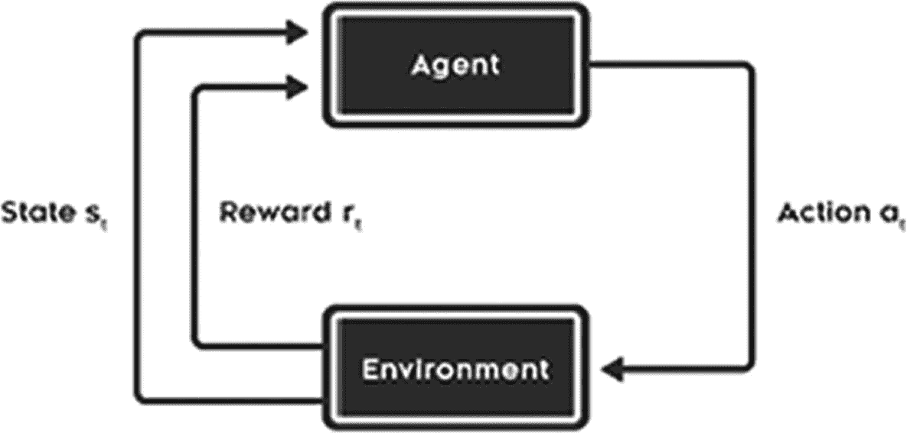

图 1-18 强化学习

- 环境

- 状态

- 智能体

- 动作

- 奖励或惩罚

1. 过程从状态 `S0` 开始，即环境。

2. 之后，智能体采取动作 `A0`。

3. 状态从 `S0` 变为 `S1`。

4. 向智能体提供奖励 `R1`。

5. 此强化学习循环重复进行，直到达成目标。

## 自然语言处理概念

### 非结构化数据

当数据以列和行的结构化方式存储时，称为*结构化数据*。但超过 80% 的数据由于其非结构化特性而无法以相同方式使用。然而，这些数据中也隐藏着无限的洞察。非结构化数据可以是文本、图像、视频等。

### 自然语言处理

从文本数据中收集、理解、处理并生成洞察的过程称为*自然语言处理*。

文本数据无处不在。社交媒体、零售产品评论、娱乐评论和医疗文档的指数级增长，产生了难以想象的文本数据量。在人工智能与业务相结合的时代，利用这类数据至关重要。

## 文本预处理

文本数据通常是非结构化的且难以处理。其中包含大量无用信息，因此必须对原始数据进行强制预处理。这一点至关重要，因为无关文本可能会改变最终结果的方向。那么，让我们快速了解几种用于清洗文本数据的不同预处理技术。

-   小写化

-   移除标点符号和停用词

-   拼写纠正

-   文本标准化

-   文本规范化

    -   词干提取

    -   词形还原

在本章中，我们将理解与这些技术相关的概念，并在本书后续部分中逐步实现它们。

-   **小写化**：将文本转换为小写，以避免特征重复。

-   **移除标点符号和停用词**：标点符号对句子含义的贡献不大。同样，停用词（如 `the`、`a`、`it`、`is` 等）根据具体用例可能毫无意义。它们在语料库中的存在会扭曲结果。如果移除这些词，权重分布会更准确，关键词语也能获得更高的权重。

-   **拼写纠正**：我们遇到的原始数据包含大量拼写错误，未经纠正直接使用会造成冗余。你需要在一定程度上纠正这些错误，并使用某些包来获得更好的结果。

-   **文本标准化**：缩写是文本数据中的另一大挑战。在处理评论和意见时，客户使用缩写的可能性很高。你需要处理这个问题；这个过程同样重要。

-   **文本规范化**：单词 `clean`、`cleaning` 和 `cleaned` 含义相同，但时态不同。将这些词规范化称为*文本规范化*。

    -   **词干提取**：将文本规范化为词根形式称为*词干提取*。例如，`clean`、`cleaning` 和 `cleaned` 的词干都是 `clean`。

    -   **词形还原**：词形还原会考虑单词的时态和单复数，找到其词根形式。例如，`best` 和 `good` 可能含义相同。经过词形还原后，这两个词的结果都是 `good`。

### 文本到特征

由于机器或算法无法理解文本，NLP 中的一项关键任务是将文本数据转换为称为*特征*的数值数据。有多种技术可以实现这一点。让我们简要讨论一下。

#### 独热编码 (OHE)

OHE 是将文本转换为数字或特征的基本且简单的方法。首先，它将语料库中存在的所有标记转换为列，如表 1-1 所示。然后，针对每个观测值，如果单词存在则标记为 1，否则标记为 0。

表 1-1 OHE

| | One | Hot | Encoding |
| --- | --- | --- | --- |
| One-Hot | 1 | 1 | 0 |
| Hot | 0 | 1 | 0 |
| Encoding | 0 | 0 | 1 |

表 1-1 演示了 OHE。

#### 计数向量化器

这种方法的一个缺点是，如果一个单词在句子中出现多次，其重要性与仅出现一次的单词相同。为了解决这个问题，出现了计数向量化器，其原理与 OHE 相同，但不再标记为 1 或 0，而是统计该观测值中出现的标记数量。

表 1-2 演示了计数向量化器。

表 1-2 计数向量化器

| | AI | new | Learn | ……. |
| --- | --- | --- | --- | --- |
| AI is new AI is everywhere | 2 | 1 | 0 | ………. |
| Learn AI Learn NLP | 1 | 1 | 2 | ……… |
| NLP is cool | 0 | 0 | 1 | ………. |

#### 词频-逆文档频率 (TF-IDF)

即使是计数向量化器也无法解决所有问题。如果句子长度不一致，并且某个单词在所有句子中重复出现，那么问题就会变得棘手。TF-IDF 解决了这些问题。

-   **词频** (TF) 定义为“标记在语料库文档中出现的次数除以标记总数”。

-   **逆文档频率** (IDF) 是语料库文档总数除以包含所选单词的文档总数。这为语料库中的稀有单词赋予了更高的权重。

将两者相乘，即可得到语料库中某个单词的 TF-IDF 向量。

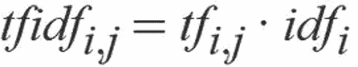

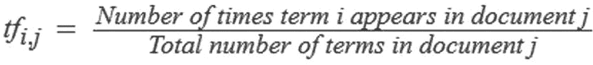

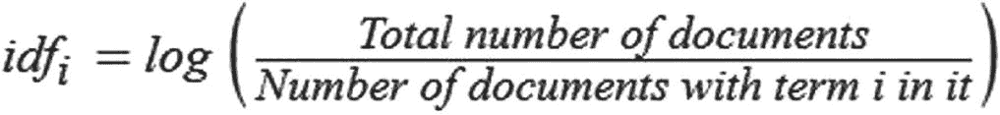

### 词嵌入

尽管 TF-IDF 应用最广泛，但它无法捕捉单词或句子的上下文。词嵌入解决了这个问题。词嵌入能够捕捉单词之间的上下文、语义和句法相似性。

通过使用浅层神经网络，我们生成一个能够捕捉上下文和语义的向量。

近年来，该领域取得了许多进展，特别是通过：

-   `word2vec`

-   `GloVe`

-   `fastText`

-   `ELMo`

-   `Sentence-BERT`

-   `GPT`

有关这些技术的更多信息，请参考我们的书籍 *Natural Language Processing Recipes: Unlocking Text Data with Machine Learning and Deep Learning Using Python* (Apress, 2021)。

### 应用

#### 文本分类

这是机器学习开始与文本数据交互的地方。经典的例子是垃圾邮件分类。自变量是使用前面讨论的步骤（文本到特征）提取的特征。因变量取决于邮件是垃圾邮件还是正常邮件。使用机器学习分类算法，让我们构建一个模型来预测邮件是垃圾邮件还是正常邮件。许多深度学习技术，如 RNN 和 LSTM，也能获得更好的准确性。

在接下来的章节中，我们将构建二分类和多分类文本分类模型，以解决不同的业务用例。

#### 文本摘要

NLP 与深度学习相结合的另一个强大应用是文本摘要。它是从冗长详细的文档中生成简短笔记的过程。文本数据量巨大，阅读每个单词需要大量时间。这就是业界看到其需求，并致力于使用深度学习和强化学习构建最先进的文本摘要解决方案的原因。

你将在本书的某个项目中学习如何使用深度学习实现文本摘要。

#### 文本生成

人工智能世界正从理解转向生成。无论是图像还是文本，我们都看到了大量的进展。例如，一幅由 AI 生成的画作卖出了数百万美元。

文本生成的核心是使用神经语言模型。循环神经网络是神经语言模型的基础，其变体包括 LSTM 和 GRU 网络。最近在编码器-解码器架构中结合注意力机制的方法在该领域取得了良好的效果。

让我们进一步讨论这个概念，并使用 RNN 和 Transformer 构建一个文本生成器。

还有更多此类应用。

-   **文本回归**：通过查看问题或投诉的描述来“预测解决时间”

-   **文本相似度**：搜索引擎、基于内容的推荐系统、基于职位描述的简历筛选等

-   **实体提取**：从文档中提取重要或所需的单词或词组

-   **对话式 AI**：聊天机器人和问答系统

现在你已经了解了机器学习、深度学习和 NLP 的基础知识，让我们看看如何利用这些概念来逐步解决业务问题的生命周期。

## AI 生命周期

要解决任何人工智能和数据科学问题，每个人都应遵循十个关键步骤。利用数据科学解决问题并非易事。它涉及多学科知识，包含从业务理解到生产化以获取实时输出的不同步骤。为了简化这一漫长过程，让我们将完整的数据科学和 AI 生命周期划分为十个不同的步骤。

1.  理解并定义业务问题

2.  将业务问题转化为机器学习问题，并创建解决方案/架构设计

3.  数据收集与理解

4.  数据清洗与预处理

5.  探索性数据分析

6.  特征工程与选择

7.  模型构建、调优与选择

8.  模型测试与验证

9.  预测与洞察

10. 部署或生产化及模型维护

让我们深入探讨每一个步骤。

### 理解并定义业务问题

-   整个数据科学过程都建立在这一步之上，即识别/定义问题。数据科学令人兴奋，但这并不意味着你可以随意编造一个问题陈述。

-   理解业务、问题、瓶颈、痛点和业务目标非常重要。数据科学不是为了让你的产品或公司看起来很酷；而是为了解决企业面临的实际问题，从而在增加收入、降低成本或提升客户体验/满意度方面产生重大影响。

-   一旦问题被明确定义，比如降低企业的客户流失率，就可以开始探索可能的解决方案、数据需求等。

### 将业务问题转化为机器学习问题并创建解决方案/架构设计

数据科学过程中的关键部分是将业务问题转化为分析或机器学习方法。有些问题看似直接，但并非所有问题都如此。

需要精通所有算法、业务知识和经验，才能创建一个可靠的架构来有效且高效地解决问题。

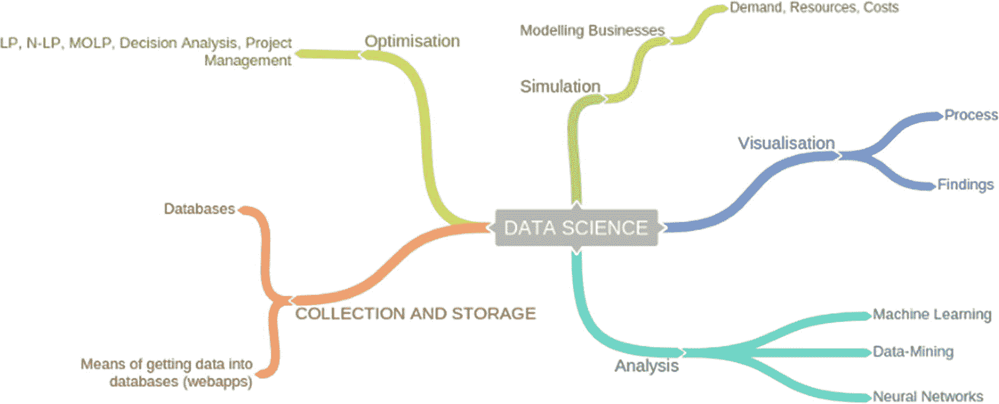

图 1-19

场景

1.  验证问题是否可以通过简单的分析方法解决，如探索性数据分析、双变量分析和相关性分析。通过这些步骤，你可以得到大部分答案。

2.  接下来，深入问题，判断它是监督学习、无监督学习还是强化学习问题。

3.  如果是监督学习问题，它属于回归还是分类？基于这些判断，使用机器学习或统计算法来解决问题。图 1-19 展示了这些场景。

### 数据收集与理解

这部分涉及思考解决给定问题需要哪些数据，并找到获取这些数据的方法。数据可以是

-   内部数据库，如交易数据

-   免费可用的开源数据，如人口数据

-   购买外部数据

数据也可以是任何格式。

-   结构化数据（以表格形式存在的数据）

-   非结构化数据（图像、文本、音频和视频）

记住那句老话：“垃圾进，垃圾出。”因此，数据收集是最关键的一步。

### 数据清洗与预处理

现在原始数据已经就绪，在开始任何类型的分析之前，你需要对其进行处理。很多时候，数据可能非常混乱，这会破坏分析。整个数据科学过程中最耗时的步骤就是数据清洗和准备。

-   数据清洗

    -   缺失值处理

    -   插补方法

    -   检测/移除异常值

    -   消除重复行

-   合并多个数据源

-   数据转换

### 探索性数据分析

在整个过程中，一个更有趣的步骤是我们“拷问”数据，以发现隐藏的模式、洞察，并通过可视化从数据中讲述故事。

以下是作为 EDA（探索性数据分析）一部分最常见的工作。

-   假设检验

-   描述性统计或单变量分析

-   推断性统计或双变量分析

-   数据透视表、图表、可视化等

### 特征工程与选择

*特征工程*是一个利用领域和业务知识来创建更多与目标特征具有有意义关系的特征或变量的过程。恰当的特征工程能提高机器学习模型的准确性，并提供有价值且相关的洞察。这是一门艺术。

*特征提取*从原始数据中提取新特征，并创建有助于稳定机器学习模型的有价值变量。这些变量是手动创建的，需要花费大量时间研究实际数据，思考底层问题、数据结构，以及如何最好地将它们暴露给预测建模算法。它可以是一个聚合或组合变量以创建新变量，或者拆分特征以创建新特征的过程。

并非所有创建的特征都会影响模型的结果。只有少数特征是有用的，大部分是垃圾。这些垃圾变量需要被移除以获得更好的结果。像`LASSO`/岭回归和逐步回归这样的正则化方法就是自动执行特征选择的例子。

特征工程过程

-   从现有特征中衍生出特征和 KPI（关键绩效指标），为目标特征增加更多意义和关联

-   从业务背景中创建更合理的特征

-   通过在模型中使用特征来验证它们

-   重复此过程，直到找到模型的最佳特征

以下是一些例子。

-   从日期中提取日、时间和工作日

-   从位置中提取区域

-   从数值特征中创建分组数据

### 模型构建、调优与选择

所有数据就位并处理完毕后，将数据拆分为训练数据和测试数据，进入模型构建阶段。选择合适的算法来解决问题。这不是一次性的过程，而是一个迭代的过程。在选定最终模型之前，你必须尝试多种算法。

有如此多的算法和调优参数来获得尽可能高的准确率。但手动执行这项任务会花费大量时间。有许多模型调优库，如网格搜索，可以提供用于实施的最佳模型。

### 模型测试与验证

在未见过的数据上测试模型，并检查其是否过拟合，这一点非常重要。如果模型在未见过的数据上表现同样良好，并且结果符合预期，我们就确定该模型；否则，重复步骤 6、7 和 8，直到找到最优模型。交叉验证是机器学习中用于模型测试和验证的更常用技术。

### 预测与洞察

预测建模有两种利用方式。一种是直接影响业务的预测。另一方面，模型也会产生洞察和隐藏模式，这些对于制定数据驱动的决策和业务战略非常有用。

### 部署或生产化及模型维护

将项目从 Jupyter notebook 迁移到生产环境是实时利用 AI 并实现其影响的重要一步。像 Microsoft Azure、Google Cloud Platform (GCP) 和 Amazon Web Services (AWS) 这样的云巨头提供了部署框架和 MLOps 组件，以便于轻松实现生产化。

此外，你可能会有多个问题陈述，从而产生多个机器学习解决方案。维护这些模型、进行版本控制、用新数据更新模型起着至关重要的作用。为了实现这一点，应建立模型维护框架和 AI 治理体系，以获得最大的影响力。

## 业务背景

业务背景在故事线的每一步中都扮演着至关重要的角色。图 1-20 至图 1-30 展示了业务背景在生命周期各阶段的作用。

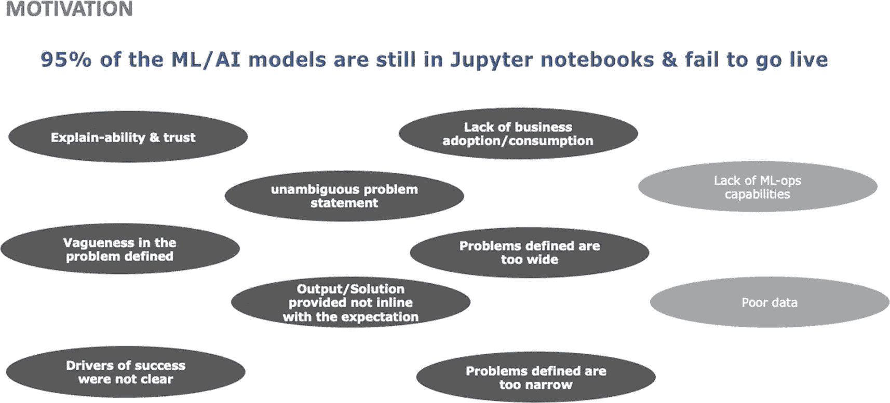

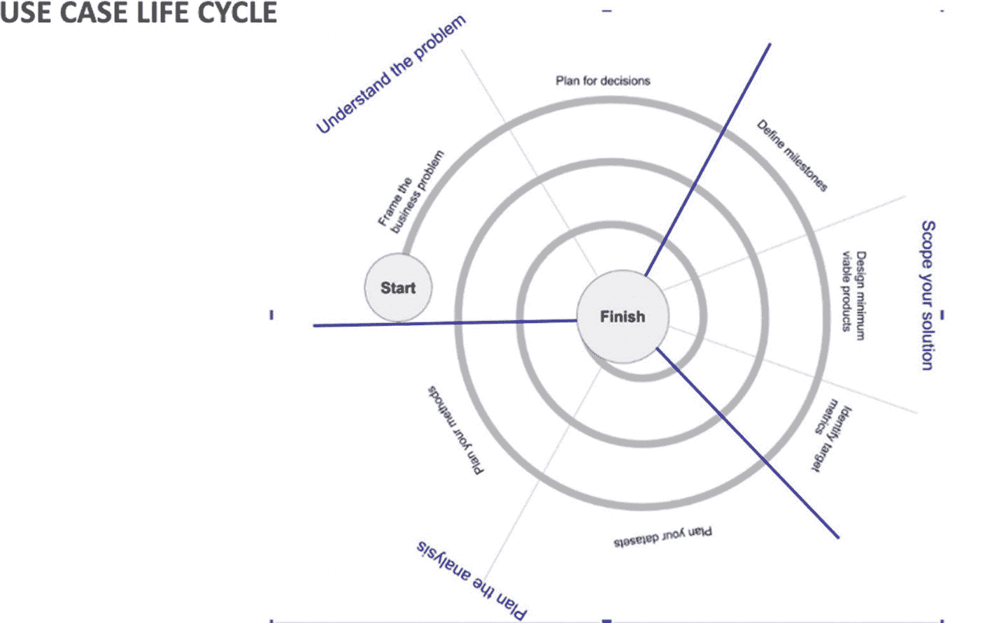

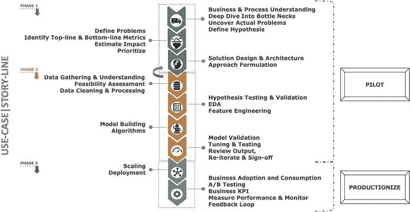

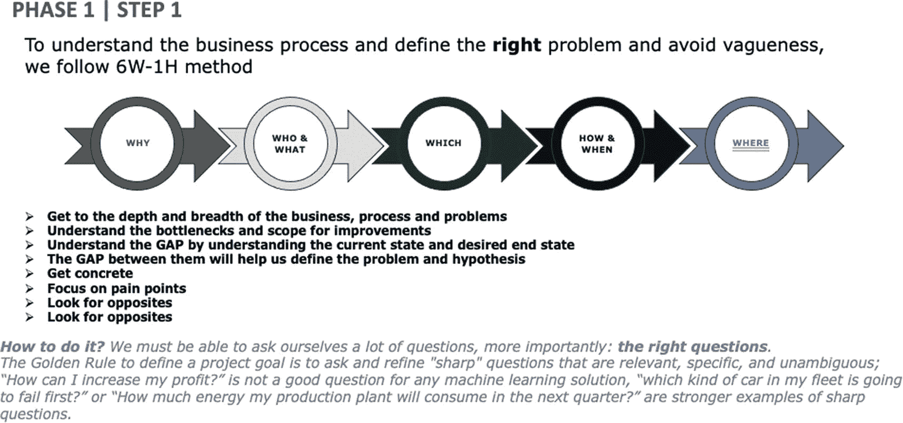

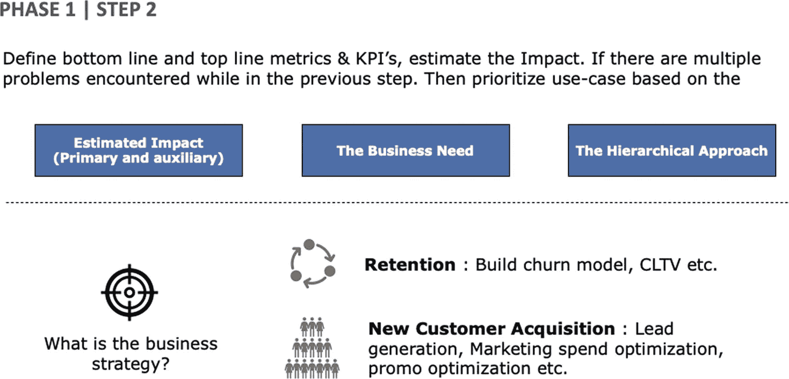

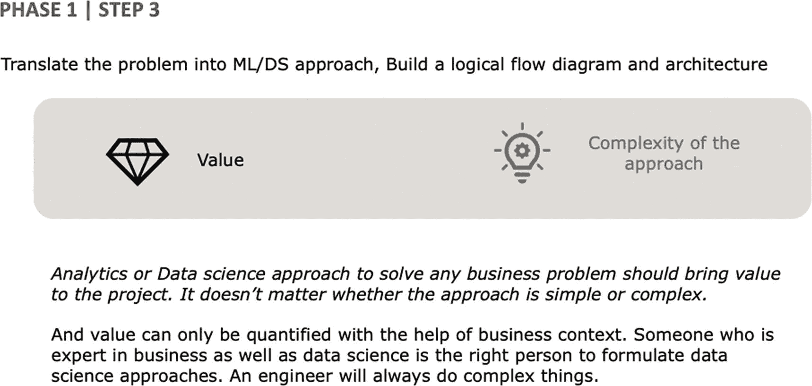

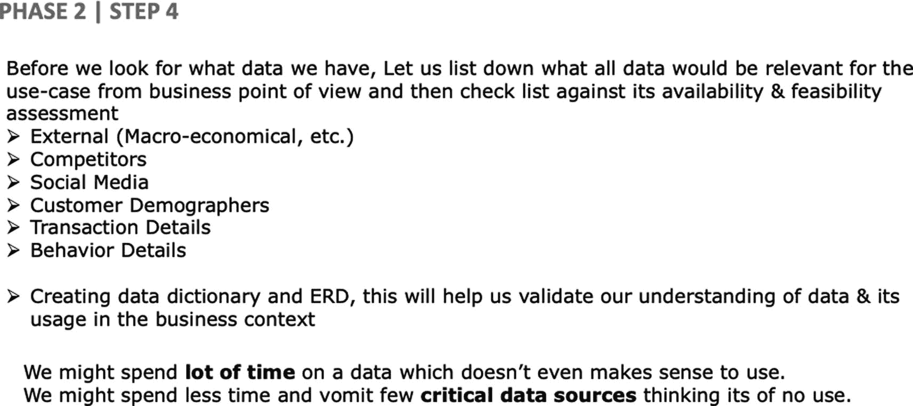

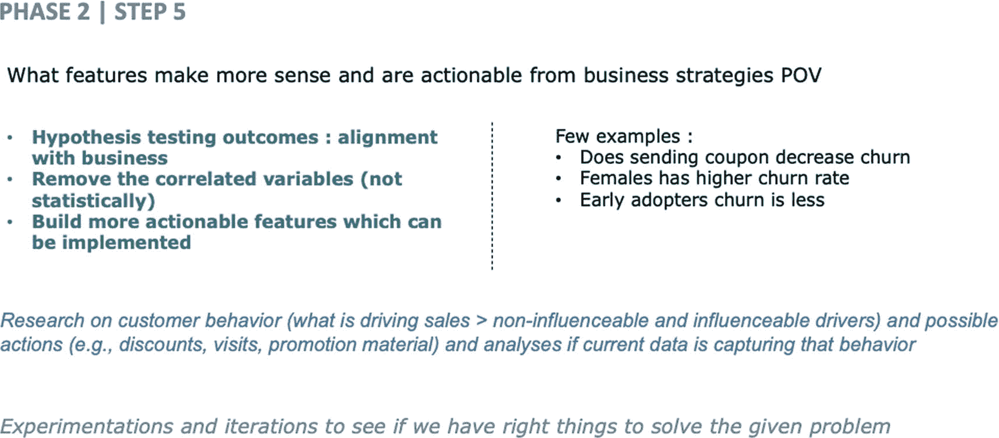

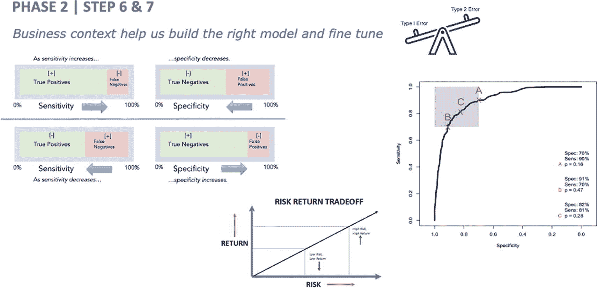

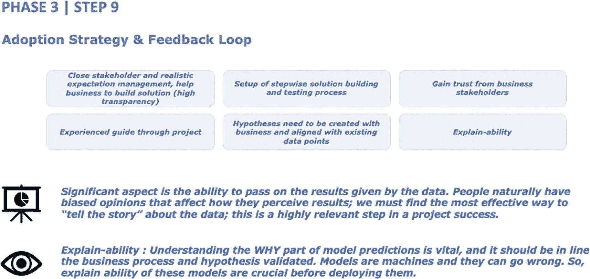