# 2. Product360：情感与情绪检测器

本章探讨情感分析和情绪检测，以及文本预处理和特征工程方法。同时，我们还将探索不同的机器学习技术来训练分类器模型，并使用混淆矩阵进行评估。在本章的后半部分，我们将从 Twitter 拉取实时数据，预测情感和情绪以生成洞察。此外，我们还将编写一个用于自动生成报告的脚本，该脚本可将报告发送到指定的电子邮件地址列表。本章将为你呈现实现端到端管道的整体图景，该管道能够提供关于市场上任何产品的强大洞察。

本章涵盖以下主题。

*   问题陈述
*   构建情绪分类器模型
*   标签编码
*   训练-测试集划分
*   特征工程
*   模型构建
*   选定模型的混淆矩阵
*   实时数据提取
*   生成情感和情绪
*   可视化与洞察
*   自动生成报告

## 问题陈述

`Product360` 是一个端到端的解决方案，帮助用户了解消费者对产品或服务的情感。例如，输入一个产品名称，如 `Nokia 6.1`，即可解码 360 度的客户与市场行为。这是一个简单的解决方案，可以解决多个业务问题，并帮助制定业务策略。

情感分析涉及为给定的句子找到情感分数。它将句子分类为正面、负面或中性。它捕捉公众对产品或品牌的反应情感，这会影响未来的业务决策。然而，这种方法只能将文本分类为正面、负面或中性类别。当文本可能包含多种情绪时，这种方法就不够用了。该问题的理想解决方案是情绪检测与情感分析相结合。

情绪检测涉及从句子中识别情绪（如悲伤、愤怒、快乐等）。数据从社交媒体（如 Twitter 和 Facebook）以及电子商务网站提取，并使用不同的自然语言处理和机器学习技术进行处理和分析，从而提供该产品的 360 度视图，实现更好的决策。

## 方法制定

目前有多种情感预测库，但我们没有同样成熟的情绪检测库，而情绪检测更为强大。作为本练习的一部分，我们将构建一个情绪分类器。利用我们构建的分类器和情感预测库，我们通过 Twitter 数据预测产品的情感和情绪。详细的报告将通过自动电子邮件发送给业务团队。

通过使用 Twitter 搜索 API 并指定搜索关键词，从 Twitter 收集数据。因此，与任何产品相关的推文都可以用作测试数据。还可以收集日期和地理位置数据。

图 2-1 是一个流程图，从高层次解释了产品的工作原理。

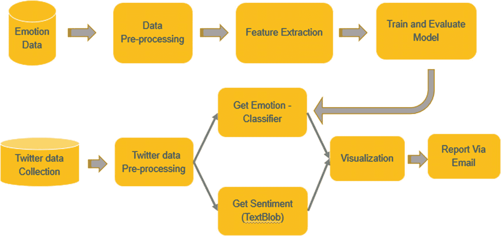

图 2-1

流程图

### 解决此问题的步骤

1.  构建情绪分类器模型
2.  Twitter 数据提取
3.  数据预处理
4.  情绪预测
5.  情感预测
6.  可视化与洞察
7.  通过邮件发送报告

## 构建情绪分类器模型

该模型帮助你理解给定句子和评论中的情绪。

### 情绪分类器的数据

为了训练情绪分类器，我们使用 ISEAR 数据集。从本书的 Git 链接下载该数据。

| 情绪 | 句子数量 |
| --- | --- |
| 愤怒 | 1094 |
| 厌恶 | 1094 |
| 羞愧 | 1094 |
| 悲伤 | 1094 |
| 恐惧 | 1093 |
| 快乐 | 1092 |
| 内疚 | 1091 |
| **总计** | **7652** |

*   该数据集包含 7666 个短语，分为七种基本情绪。
*   该数据集将快乐、愤怒、恐惧、厌恶、悲伤、内疚和羞愧进行分类。

该数据集包含以下两列。

*   `EMOTION` 列出情绪。
*   `TEXT` 包含相应句子的数量。

让我们导入数据集。

```python
import pandas as pd
data = pd.read_csv('ISEAR.csv')
data.columns =['EMOTION', 'TEXT']
data.head()
```

图 2-2 显示了前五行的输出。

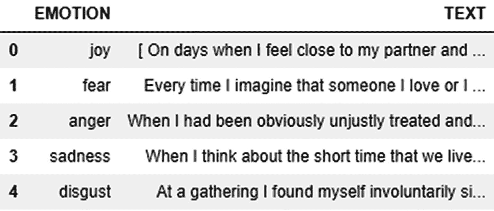

图 2-2

输出


## 数据清洗与预处理

数据清洗对于获得更好的特征和准确性至关重要。你可以通过对数据执行文本预处理步骤来实现这一点。

预处理步骤如下：

1.  转换为小写
2.  移除特殊字符
3.  移除标点符号
4.  移除停用词
5.  纠正拼写
6.  标准化

以下是用于预处理文本的库。`NLTK` 是一个用于文本预处理的主流免费 Python 包。

```python
#Importing the libraries for building Emotion Classifier
import pandas as pd
from nltk.corpus import stopwords
from nltk.stem.wordnet import WordNetLemmatizer
import string
from textblob.classifiers import NaiveBayesClassifier
from textblob import TextBlob
from nltk.corpus import stopwords
from nltk.stem import PorterStemmer
from textblob import Word
from nltk.util import ngrams
import re
from nltk.tokenize import word_tokenize
import matplotlib.pyplot as plt
from sklearn.feature_extraction.text import CountVectorizer,TfidfVectorizer
from sklearn.decomposition import LatentDirichletAllocation
import sklearn.feature_extraction.text as text
from sklearn.decomposition import NMF, LatentDirichletAllocation, TruncatedSVD
from sklearn import model_selection, preprocessing, linear_model, naive_bayes, metrics, svm
import xgboost
from sklearn import decomposition, ensemble
import pandas, numpy, textblob, string
import re
import nltk
from sklearn.metrics import classification_report
from sklearn.metrics import confusion_matrix
from sklearn.metrics import accuracy_score
from sklearn.metrics import mean_absolute_error
```

让我们更详细地了解预处理步骤，并学习如何实现它们。

1.  将大写字母转换为小写。
2.  移除空白和特殊字符。

```python
data['TEXT'] = data['TEXT'].apply(lambda a: " ".join(a.replace('[^\w\s]','') for a in a.split()))
```

3.  移除停用词。

```python
stop = stopwords.words('english')
data['TEXT'] = data['TEXT'].apply(lambda a: " ".join(a for a in a.split() if a not in stop))
```

4.  纠正拼写。

```python
data['TEXT'] = data['TEXT'].apply(lambda a: " ".join(a.lower() for a in a.split()))
```

5.  进行词干提取。

```python
st = PorterStemmer()
data['TEXT'] =  data['TEXT'].apply(lambda a: " ".join([st.stem(word) for word in a.split()]))
```

```python
data['TEXT'] = data['TEXT'].apply(lambda a: str(TextBlob(a).correct()))
```

完成所有预处理步骤后，数据如下所示。

```python
data.head()
```

图 2-3 显示了预处理后的输出。

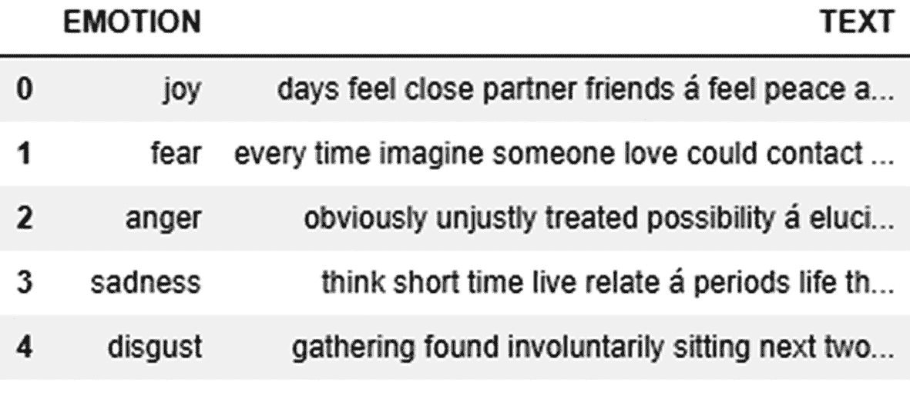

**图 2-3** 输出

### 标签编码

目标编码是一种将分类值转换为数值的方法。该数据中有七个类别，我们必须对它们进行编码才能继续。我们使用标签编码器函数来编码这些类别。

以下显示了编码前的数据。

```python
data['EMOTION'].value_counts()
```

图 2-4 显示了编码前的输出。

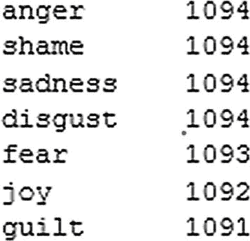

**图 2-4** 输出

对目标变量进行标签编码

```python
object = preprocessing.LabelEncoder()
data['EMOTION'] = object.fit_transform(data['EMOTION'])
```

以下是编码后的数据。

```python
data['EMOTION'].value_counts()
```

图 2-5 显示了编码后的输出。

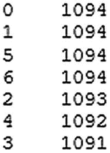

**图 2-5** 输出

### 训练-测试集划分

数据被分成两部分：一部分用于训练模型，即训练集；另一部分用于评估模型，即测试集。从 `sklearn.model_selection` 中导入 `train_test_split` 库，将数据框分成两部分。

```python
#train-test split
Xtrain, Xtest, Ytrain, Ytest = model_selection.train_test_split(data['TEXT'], data['EMOTION'],stratify= data['EMOTION'])
```

现在你已经完成了训练-测试集划分步骤，下一步是从这些文本中提取特征。为此，我们使用两种重要的方法。

### 特征工程

特征工程是考虑领域上下文创建新特征的过程。让我们实现计数向量器和 TF-IDF 技术，从数据集中获取相关特征。

有关计数向量器和 TF-IDF 的更多信息，请参考第 1 章。

```python
cv = CountVectorizer()
cv.fit(data['TEXT'])
cv_xtrain =  cv.transform(Xtrain)
cv_xtest =  cv.transform(Xtest)
```

以下是词级别的 TF-IDF。

```python
tv = TfidfVectorizer()
tv.fit(data['TEXT'])
```

使用 TF-IDF 对象转换训练和验证数据。

```python
tv_xtrain =  tv.transform(Xtrain)
tv_xtest =  tv.transform(Xtest)
```

现在让我们进入构建多类文本分类模型的关键步骤之一。在本节中，我们将探索不同的算法。

## 模型构建阶段

在此阶段，我们使用计数向量和词级 TF-IDF 作为特征来构建不同的模型，然后根据分类器的准确率水平确定最终模型。

让我们构建一个分类器函数，以便你可以尝试不同的算法。

```python
def build(model_initializer, independent_variables_training, target, independent_variable_test):
# fit
model_initializer.fit(independent_variables_training, target)
# predict
modelPred=classifier_model.predict(independent_variable_test)
return metrics.accuracy_score(modelPred, Ytest)
```

让我们使用上述函数并尝试各种算法。

#### 多项式朴素贝叶斯

多项式朴素贝叶斯算法本质上使用贝叶斯定理计算每个类别的概率。更多信息请参考第 1 章。

让我们构建一个朴素贝叶斯模型。

以下使用由计数向量生成的朴素贝叶斯。

```python
output = build(naive_bayes.MultinomialNB(), cv_xtrain, Ytrain, cv_xtest)
print(output)
```

以下使用由词级 TF-IDF 向量生成的朴素贝叶斯。

```python
output = build(naive_bayes.MultinomialNB(), tv_xtrain, Ytrain, tv_xtest)
print(output)
#Output:
0.561944
0.565081
```

从计数向量器特征获得了 56.1% 的准确率。

从 TF-IDF 向量器特征获得了 56.5% 的准确率。

#### 线性分类器/逻辑回归

有关该算法的更多信息，请参考第 1 章。

以下构建了一个逻辑回归模型。

```python
# for CV
output = build(linear_model.LogisticRegression(), cv_xtrain, Ytrain, cv_xtest)
print(output)
# for TF-IDF
output = build(linear_model.LogisticRegression(), tv_xtrain, Ytrain, tv_xtest)
print(output)
#Output:
0.565081
0.590172
```

#### 支持向量机

更多信息请参考第 1 章。

让我们构建 SVM 模型。

```python
#for cv
output = build(svm.SVC(), cv_xtrain, Ytrain, cv_xtest)
print(output)
#for TF-IDF
output = build(svm.SVC(), tv_xtrain, Ytrain, tv_xtest)
print(output)
#Output:
0.545739
0.578672
```

#### 随机森林

你在第 1 章中了解了随机森林的工作原理。它是一种集成技术，由决策树组成。让我们看看它在数据上的表现如何。

以下构建了一个随机森林模型。

```python
#for CV
output = build(ensemble.RandomForestClassifier(), cv_xtrain, Ytrain, cv_xtest)
print(output)
#for TF-IDF
output = build(ensemble.RandomForestClassifier(), tv_xtrain, Ytrain, tv_xtest)
print(output)
#Output:
0.553580
0.536330
```


## 模型评估与比较总结

我们尝试了几种不同的机器学习算法，分别使用了计数向量器和 TF-IDF 向量器。表 2-1 展示了结果。本例中我们考虑了准确率。你也可以考虑其他指标，如 AUC、特异性和 F1 分数，以便进行更全面的评估。

**表 2-1.** 输出总结

| 算法 | 特征工程 | 准确率 |
| --- | --- | --- |
| 朴素贝叶斯 | 计数向量 | 56% |
| | TF-IDF（词级别） | 57% |
| **线性分类器** | 计数向量 | 57% |
| | **TF-IDF（词级别）** | **59%** |
| 支持向量机 | 计数向量 | 54% |
| | TF-IDF（词级别） | 57% |
| 随机森林 | 计数向量 | 55% |
| | TF-IDF（词级别） | 53% |

由于使用词级别 TF-IDF 的线性分类器准确率更高，我们将在后续步骤中选择该组合。

请注意，通过增加数据和计算能力可以提高准确率。然而，本章的目标并非追求更高的准确率，而是理解并实现端到端的流程。

### 所选模型的混淆矩阵

现在，我们使用混淆矩阵来评估和验证模型。这里我们使用了`sklearn`库中的`classification_report`、`confusion_matrix`和`accuracy_score`。

```
classifier = linear_model.LogisticRegression().fit(tv_xtrain, Ytrain)
val_predictions = classifier.predict(tv_xtest)
### 精确率、召回率、F1 分数、支持度
y_true, y_pred = Ytest, val_predictions
print(classification_report(y_true, y_pred))
print()
```

图 2-6 展示了详细的分类报告。

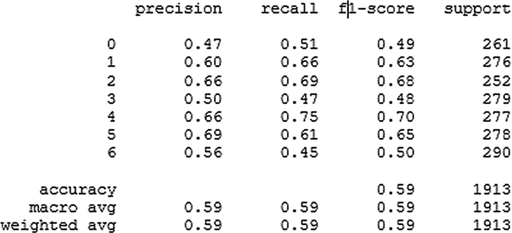

**图 2-6** 输出

对于部分目标类别，F1 分数表现尚可。

现在，我们开始进行实时数据提取。

## 实时数据提取

你希望尽可能实时地打造产品。要了解任何产品的情感与情绪，你需要获取公开可用的数据。如果你有零售网站，可以从那里获取数据，但这非常少见。而且你通常是在他人的平台上销售产品。以下是收集数据的几种可行方式。

* Twitter
* 其他社交媒体，如 Facebook 和 LinkedIn
* 电子商务网站，如 Amazon
* 公司网站
* 关于公司或产品的新闻文章

从所有这些数据源获取数据是最大的任务。本章我们从 Twitter 开始。

各类人群都会在 Twitter 上分享他们对新发布产品的看法。这是获取数据并进行分析的合适平台之一。它还提供了 API，用于收集任何给定搜索词的数据。你需要创建一个 Twitter 开发者账号，然后就可以使用推文了。让我们探索如何使用这个 API 并拉取数据。

### Twitter API

要使用此脚本，你需要在 Twitter 上注册一个数据挖掘应用程序。完成此操作后，你将获得一个唯一的消费者密钥、消费者密钥密文、访问令牌和访问令牌密文。使用这些密钥，你可以利用`Tweepy`库中的函数轻松地从 Twitter 拉取数据。

要获取实时 Twitter 数据，请使用`twitter_data_extraction.py`文件，该文件包含所有必要的函数及相应的注释。

从 Git 源运行`twitter_data_extraction.py`以提取 Twitter 数据（参见[`https://github.com/agalea91/twitter_search`](https://github.com/agalea91/twitter_search)）。

通过执行`.py`文件中的所有函数，你将得到如图 2-7 所示的输出。从 Twitter 收集的数据通过创建单独的目录以 JSON 格式保存。图 2-7 展示了从 Twitter 提取的三星数据快照。

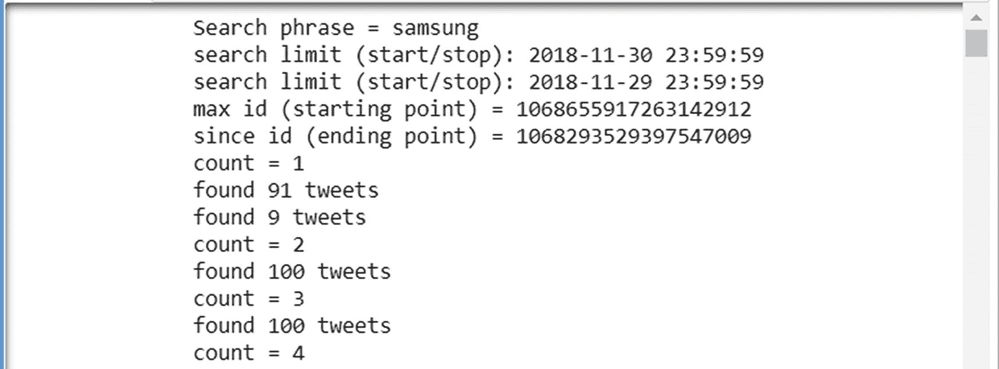

**图 2-7** 输出

我们将 JSON 转换为 CSV，并将 CSV 作为数据框导入以使用这些数据。

```
twt=pd.read_json('/path/samsung/samsung_date.json',lines=True,orient='records')
```

我们只选择后续分析所需的日期和评论。

```
twt = twt[[ 'created_at','text']]
```

与三星品牌相关的推文是通过 Twitter 搜索 API 收集的，并用作测试集。它包含 1723 个句子。数据集包含两列。

* `created_at` 包含推文对应的日期和时间。
* `text` 包含对应的推文内容。

```
twt.tail()
```

图 2-8 展示了从 Twitter 提取的数据。

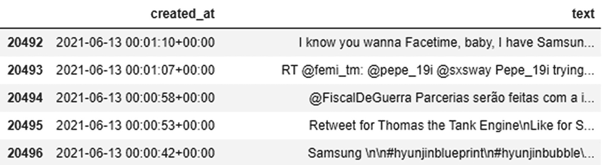

**图 2-8** 输出

下一步是再次对推文进行预处理，以去除文本中的噪声。

```
### 对 Twitter 数据进行文本预处理
twt['text'] = twt['text'].str.lstrip('0123456789')
#### 转换为小写
twt['text'] = twt['text'].apply(lambda a: " ".join(a.lower() for a in a.split()))
#### 移除标点符号
twt['text'] = twt['text'].str.replace('[^\w\s]','')
#### 移除停用词
sw = stopwords.words('english')
twt['text'] = twt['text'].apply(lambda a: " ".join(a for a in a.split() if a not in sw))
#### 拼写纠正
twt['text'].apply(lambda a: str(TextBlob(a).correct()))
```

预处理之后

```
twt.tail()
```

图 2-9 展示了预处理后的输出。

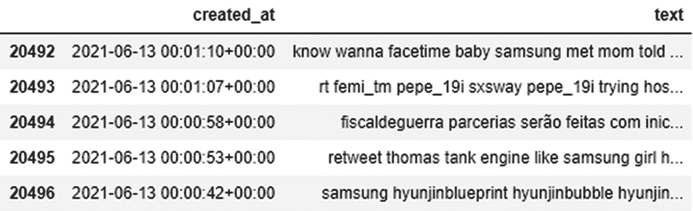

**图 2-9** 输出

### 预测情绪

我们使用 Twitter API 提取了数据，并收集了足够的数据来进行预测，从而得出一些见解。预处理之后，我们使用上一节构建的函数或算法预测了情绪。然后，我们确定了效果更好的线性模型。最后，我们将最终数据保存到一个数据框中。

现在，我们使用 TF-IDF 向量器提取相关特征。之后，我们使用`predict`函数来获取情绪。

```
Xpredict = twt['text']
#### 词级别 tf-idf
predict_tfidf = tv.transform(Xpredict)
#### 获取预测的情绪
twt['Emotion'] = classifier.predict(predict_tfidf)
twt.tail()
```

图 2-10 展示了情绪预测的输出。

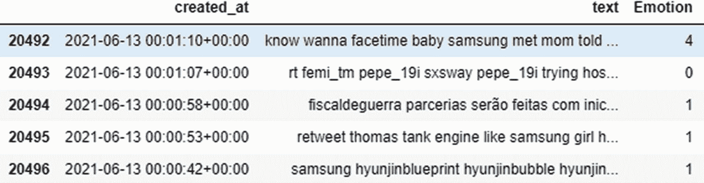

**图 2-10** 输出

### 预测情感

我们使用之前构建的函数预测了情绪。但为了预测情感，我们使用了一个预训练模型。让我们使用`TextBlob`中的`sentiment`函数。我们预测每条推文的情感，然后进行聚合以生成见解。

`sentiment`函数有两个输出：`polarity`（极性）和`subjectivity`（主观性）。

我们关注`polarity`，它提供了该推文在-1 到+1 范围内的情感值。你需要确定阈值来得到最终的情感。对于本次练习：

* 如果`polarity` > 0，则为正面情感
* 如果`polarity` < 0，则为负面情感
* 如果`polarity` = 0，则为中性情感

以下代码提供了针对给定输入的情感。

```
twt['sentiment'] = twt['text'].apply(lambda a: TextBlob(a).sentiment[0] )
def function (value):
if value['sentiment'] < 0 :
return '负面'
elif value['sentiment'] > 0 :
return '正面'
return '中性'
twt['Sentiment_label'] = twt.apply (lambda a: function(a),axis=1)
twt.tail()
```

图 2-11 展示了情感预测的输出。

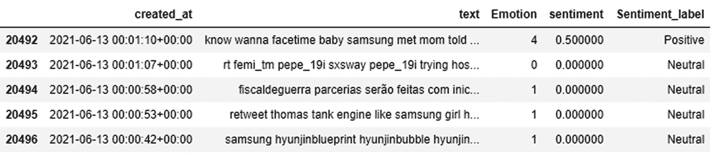

**图 2-11** 输出


### 可视化与洞察

在上一节中，我们利用 API 从 Twitter 抓取了三星数据，并生成了情感与情绪分析。但构建算法、预测情感与情绪本身并不能解决问题。你需要的是洞察，以便企业能够据此做出决策。

本节将讨论如何使用不同的库来实现这一目标。预测模型的输出结果将通过不同的图表进行可视化。我们将利用 `Plotly` 和 `Matplotlib` 等库。

首先，让我们对情感进行可视化。这通过一个饼图来实现，它能提供详细的洞察。`cufflinks` 库用于生成该图表。

```python
import chart_studio.plotly as py
import plotly as ply
import cufflinks as cf
from plotly.graph_objs import *
from plotly.offline import *
init_notebook_mode(connected=True)
cf.set_config_file(offline=True, world_readable=True, theme='white')
Sentiment_df = pd.DataFrame(twt.Sentiment_label.value_counts().reset_index())
Sentiment_df.columns = ['Sentiment', 'Count']
Sentiment_df = pd.DataFrame(Sentiment_df)
Sentiment_df['Percentage'] = 100 * Sentiment_df['Count']/ Sentiment_df['Count'].sum()
Sentiment_Max = Sentiment_df.iloc[0,0]
Sentiment_percent = str(round(Sentiment_df.iloc[0,2],2))
fig1 = Sentiment_df.iplot(kind='pie',labels='Sentiment',values='Count',textinfo='label+percent', title= 'Sentiment Analysis', world_readable=True,
asFigure=True)
ply.offline.plot(fig1,filename="Sentiment")
```

图 2-12 展示了以饼图形式呈现的情感分析结果。

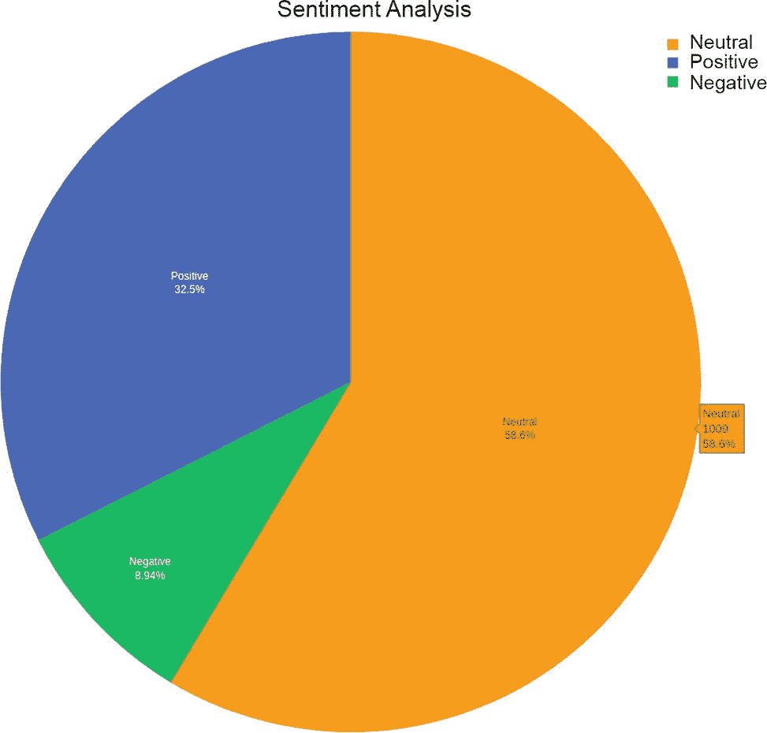

**图 2-12** 输出结果

该图表清晰地显示，58% 的评论为中性，32% 的评论为正面，仅有约 9% 的评论为负面。从商业角度来看，这对三星来说是一个相当不错的结果。

你可以生成以下图表，以更深入地了解产品情况。

-   按日期划分的情感分析，可以揭示产品或公司在哪个时间点表现不佳。
-   按细分市场生成词云，可以告诉你该产品的正面和负面因素分别是什么。

与情感分析类似，接下来我们看看情绪分析的结果。

### 情绪分析

与情感分析一样，你需要理解情绪，以便得出一些重要的结论。你在之前的步骤中已经预测了每条评论的情绪。现在，让我们利用这些数据生成图表，以便更好地理解它。

一个饼图可以可视化文档中的情绪。该图表同样使用 `cufflinks` 库生成。

```python
import chart_studio.plotly as py
import plotly as ply
import cufflinks as cf
from plotly.graph_objs import *
from plotly.offline import *
init_notebook_mode(connected=True)
cf.set_config_file(offline=True, world_readable=True, theme='white')
Emotion_df = pd.DataFrame(twt.Emotion.value_counts().reset_index())
Emotion_df.columns = ['Emotion', 'Count']
Emotion_df = pd.DataFrame (Emotion_df)
Emotion_df['Percentage'] = 100 * Emotion_df['Count']/ Emotion_df['Count'].sum()
Emotion_Max = Emotion_df.iloc[0,0]
Emotion_percent = str(round(Emotion_df.iloc[0,2],2))
fig = Emotion_df.iplot(kind='pie', labels = 'Emotion', values = 'Count',pull= .2, hole=.2 , colorscale = 'reds', textposition='outside',colors=['red','green','purple','orange','blue','yellow','pink'],textinfo='label+percent', title= 'Emotion Analysis', world_readable=True,asFigure=True)
ply.offline.plot(fig,filename="Emotion")
```

图 2-13 展示了以饼图形式呈现的情绪分析结果。

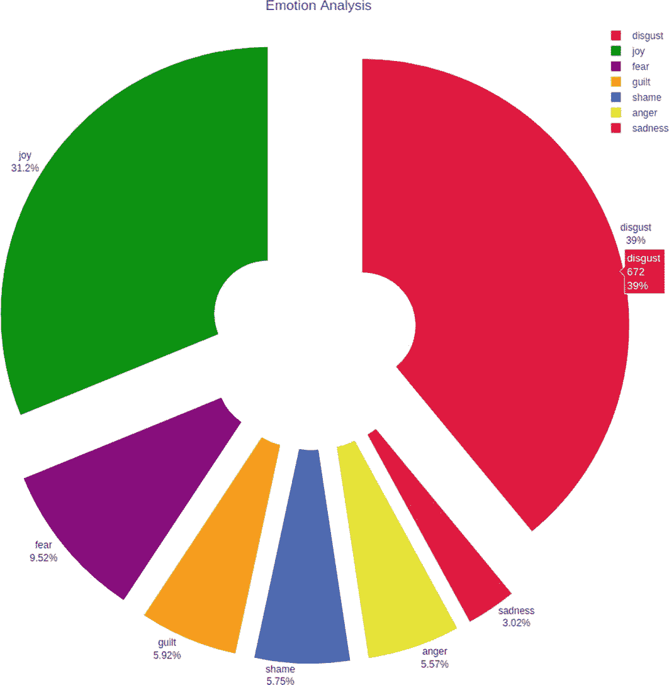

**图 2-13** 输出结果

生成的图表提供了评论的情绪感知：39% 的评论捕捉到“厌恶”，32% 捕捉到“喜悦”，其余则捕捉到恐惧、内疚、羞耻、愤怒和悲伤。

好消息是 32% 的客户是满意的。但你需要深入挖掘，以理解为什么 39% 的评论是令人厌恶的。有可能客户在情感上是中性的，但情绪上是厌恶的。

为了理解这一点，让我们将情感和情绪绘制在同一张图表上，这将解答你所有的问题。

### 情绪与情感分析

堆叠条形图是情绪和情感的结合。它包含了每种情绪以及该情绪对应的情感，并给出了情绪的数量统计。

以下代码生成一个堆叠条形图。

```python
import seaborn as sns
sns.set(rc={'figure.figsize':(11.7,8.27)})
Result = pd.crosstab(twt.Emotion, twt.Sentiment_label)
plt = Result.plot.bar(stacked=True,sort_columns = True)
plt.legend(title='Sentiment_label')
plt.figure.savefig('Emotion_Sentiment_stacked.png', dpi=400)
```

图 2-14 展示了以堆叠条形图形式呈现的情感与情绪分析结果。

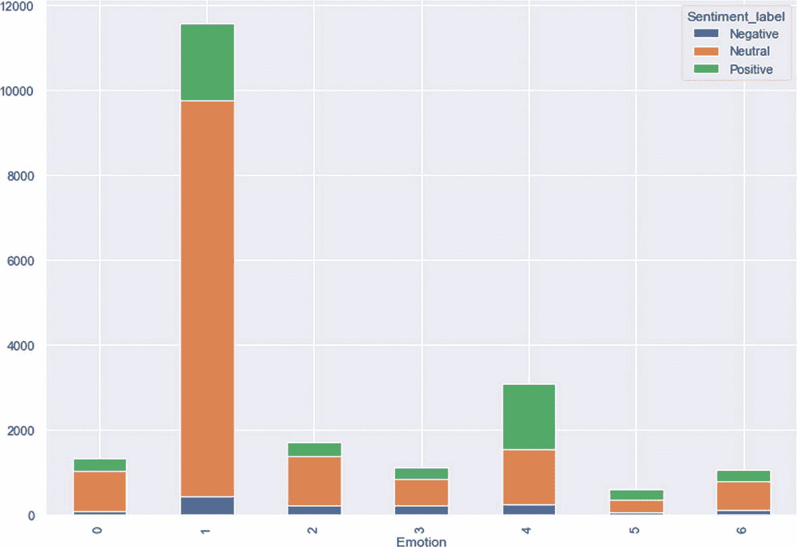

**图 2-14** 输出结果

这张图表帮助我们更好地分析情感与情绪之间的重叠部分。


### 自动化报告

我们已接近项目的最后阶段，即向相关业务负责人发送报告。你需要创建包含图表和洞察的报告，并必须将其发送给相关人员。

另一个关键方面是报告必须实现自动化。你需要创建一个自动化管道，用于拉取数据、处理数据，并将输出发送给高级管理层。

作为其中的一部分，一个自动化的邮件系统会在你提供电子邮件地址后自动发送邮件。

像图表和表格这样的输出文件会保存在目录中，然后通过执行以下脚本通过电子邮件发送。洞察结果会以报告形式通过电子邮件发送给相关人员。为此，用户必须指定电子邮件地址和密码，以及相关人员的电子邮件地址。导入 `smtplib` 库用于发送自动化电子邮件。

```
from email.mime.text import MIMEText
from email.mime.multipart import MIMEMultipart
import os
from email.mime.application import MIMEApplication
from email import encoders
import smtplib
def generate_email():
dir_path = "Add PATH"
files = ["Add files"]
# Add concerned address (you can add multiple address also) and Password
company_dict = ['xyz@gmail.com']
password = "Password"
for value in company_dict:
# Add From email address
From_address = 'From email id'
To_address = value
text = MIMEMultipart()
text['From'] = "xxxx"
text['To'] = To_address
text['Subject'] = "Emotion Detection and Sentiment Analysis Report"
body = " Hai \n Greetings of the day,\n We would like to inform you that the data is more about, \n Emotion -  "+Emotion_Max+" ("+Emotion_percent+" %).\n Sentiment - " +Sentiment_Max+" ("+Sentiment_percent+" %).\n\n For the details please go through the attachments bellow. \n\n\n\n\n Thank You."
text.attach(MIMEText(body, 'plain'))
for k in files:  # add files to the message
file_location = os.path.join(dir_location, k)
attachment = MIMEApplication(open(file_location, "rb").read(), _subtype="txt")
attachment.add_header('Content-Disposition',obj, filename=k)
text.attach(attachment)
smtp = smtplib.SMTP_SSL('smtp.gmail.com', 465)
smtp.login(From_address, password)
text1 = text.as_string()
smtp.sendmail(From_address, To_address, text1)
smtp.quit()
return 'Successfully Sent..!'
#Calling the function to send reports
generate_email ()
```

**注意**

要通过 Gmail 发送邮件，你必须在你的 Google 帐户安全设置中允许“安全性较低的应用的访问权限”。由于 Gmail 的额外安全问题，必须明确执行此操作。更多信息，请访问 [`https://myaccount.google.com/security?pli=1#connectedapps`](https://myaccount.google.com/security%253Fpli%253D1%2523connectedapps)。

**该解决方案有何不同？**

- 该工具提供带有情感的情绪。
- 情绪和情感的洞察，以及情感所附带的情绪。
- 分析报告/洞察结果会连同描述、洞察和图表通过邮件发送给相关人员。

## 总结

- 使用 `ISEAR` 数据训练情绪分类器。
- 在模型构建阶段，考虑了不同特征工程机制下分类器的不同表现。
- 通过比较准确率，采用了基于词级 `TF-IDF` 特征工程机制的线性分类器。
- 使用预训练模型 `TextBlob` 进行情感预测。通过 Twitter API 从 Twitter 收集三星数据，并预测情绪和情感。
- 洞察来自三个方面：情绪分析、情感分析以及情绪的情感。
- 分析报告/洞察结果通过电子邮件发送给相关人员。

