# 3. 使用机器学习进行 TED 演讲分割与主题提取

TED 演讲是由技术、娱乐和设计领域的专家进行的知识性演讲视频（因此得名 TED）。这些会议在世界各地举办。杰出的演讲者站出来分享他们的经验和知识。这些演讲最长限制为 18 分钟，涵盖广泛的主题。这些视频被存储起来，每个视频都有其内容的描述。

本章根据 TED 演讲的描述对其进行分组，并使用各种聚类技术，如 `k-means` 和层次聚类。使用基于潜在狄利克雷分配（LDA）的主题建模来理解和解释每个聚类。使用的库包括 `Genism`、`NLTK`、`scikit-learn` 和 `word2vec`。

## 问题陈述

世界各地有海量的此类视频。它们在不同的地点录制，涉及不同的主题和各种各样的演讲者。鉴于我们已经拥有的视频数量，手动将这些视频标记到特定类别是最大的挑战。让我们看看如何利用机器学习和自然语言处理来解决这个问题。

这里的挑战在于我们没有标记数据来训练分类器并预测类别。相反，我们需要采用无监督学习方法。让我们看看如何制定方法来获取每个视频的类别。

## 方法制定

该方法包含两个部分来解决上述问题。

第一个问题是文档分组。我们需要使用文档聚类来分割 TED 演讲。文档聚类技术主要有两个步骤。首先，使用不同的技术（如计数向量化器、`TF-IDF` 或词嵌入）将文本转换为特征。然后，利用这些特征，使用 `k-means` 或层次聚类执行聚类。

一旦聚类完成，下一个问题是理解这些聚类。然后，你可以执行主题建模来提取主题并了解聚类属性。同样，有多种算法可以提取主题。在这种情况下，我们使用 LDA。

让我们可视化聚类和主题建模结果，以便更好地理解 TED 演讲。

图 3-1 展示了该方法的逻辑流程图。

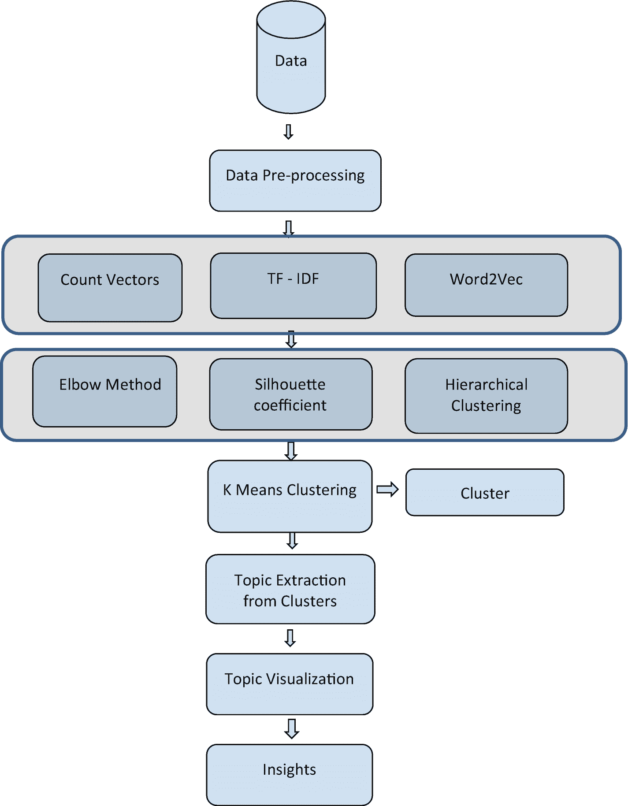

**图 3-1** 方法流程图

## 数据收集

我们为此考虑使用开源数据。从本书项目的 Git 链接下载数据集。

## 理解数据

我们为此考虑使用开源数据。从代码所在的仓库下载数据集。数据集文件名为 `'Ted talks.csv'`。

```python
import pandas as pd
ted_df = pd.read_csv('Ted talks.csv')
ted_df.dtypes
```

图 3-2 显示了数据集中的列。

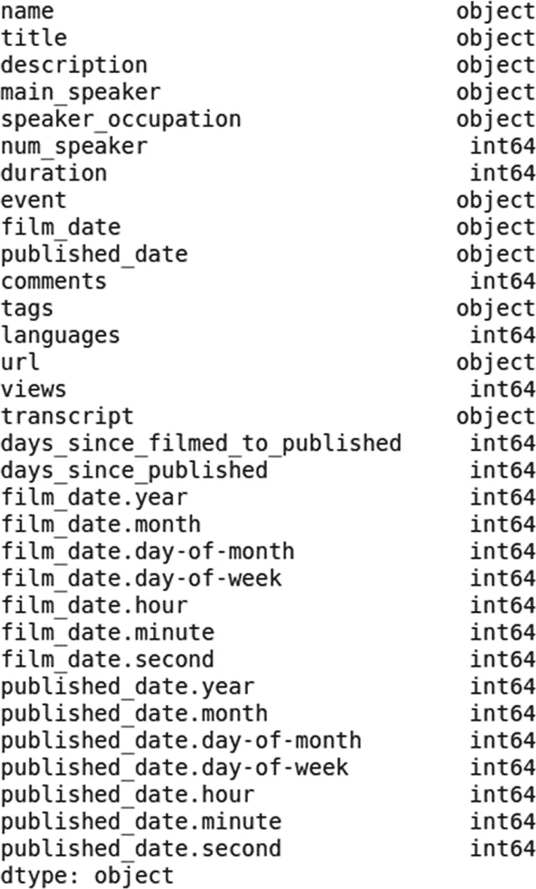

**图 3-2** 输出

现在让我们尝试理解数据。

图 3-2 中的输出定义了列名和相应的数据类型。所有列名都是不言自明的。

```python
ted_df.head()
```

图 3-3 显示了数据头部。

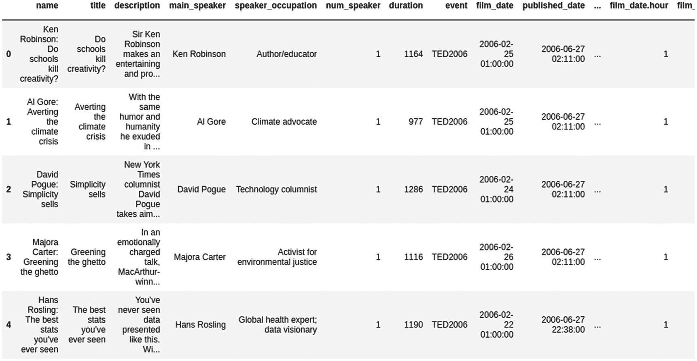

**图 3-3** 输出

检查数据集中可用的行数和列数。

```python
ted_df.shape
```

以下是输出。

```
(2550,32)
```

TED 演讲文件包含 2550 行和 32 列。其中，仅考虑文本列。

```python
ted_df = ted_df[['title','transcript']].astype(str)
ted_df.head()
```

图 3-4 显示了数据头部。

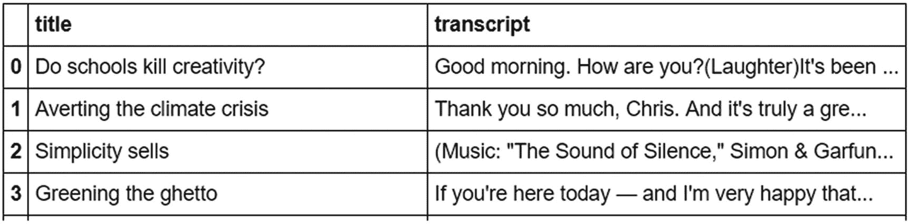

**图 3-4** 输出

## 数据清洗与预处理

清洗文本数据对于获取更优质的特征至关重要。这可以通过对数据执行一些基本的预处理步骤来实现。

以下是预处理步骤：

1.  将单词转换为小写。

2.  移除停用词。

3.  纠正拼写错误。

4.  移除数字。

5.  移除空白字符和特殊字符。

首先，导入所有必需的库。

```python
import numpy as np
import nltk
import itertools
from nltk.tokenize import sent_tokenize, word_tokenize
import scipy
from scipy import spatial
import re
from textblob import TextBlob
sw = nltk.corpus.stopwords.words('english')
import gensim
from gensim.models import Word2Vec
from nltk.corpus import stopwords
from nltk.stem import PorterStemmer
from nltk.tokenize import word_tokenize
from nltk.stem.wordnet import WordNetLemmatizer
import string
from nltk.util import ngrams
from textblob import TextBlob
from textblob import Word
from nltk.stem.snowball import SnowballStemmer
stemmer = SnowballStemmer("english")
from nltk.stem import PorterStemmer
st = PorterStemmer()
from sklearn.feature_extraction.text import CountVectorizer,TfidfVectorizer
import gensim
from gensim.models import Word2Vec
from sklearn.cluster import KMeans
```

让我们创建一个数据清洗与预处理函数，以执行第 1 章中讨论的必要清洗操作。

```python
def  text_processing(df):
"""""=== 转换为小写 ==="""
df['transcript'] = df['transcript'].apply(lambda x: " ".join(x.lower() for x in x.split()))
'''=== 移除停用词 ==='''
df['transcript'] = df['transcript'].apply(lambda x: " ".join(x for x in x.split()if x not in sw))
'''=== 拼写纠正 === '''
df['transcript'].apply(lambda x: str(TextBlob(x).correct()))
'''=== 移除标点符号 ==='''
df['transcript'] = df['transcript'].str.replace('[^\w\s]', '')
'''=== 移除数字 ==='''
df['transcript'] = df['transcript'].str.replace('[0-9]', '')
return df
ted_df = text_processing(ted_df)
print(ted_df)
```

图 3-5 展示了完成预处理步骤后转录列的前几行。

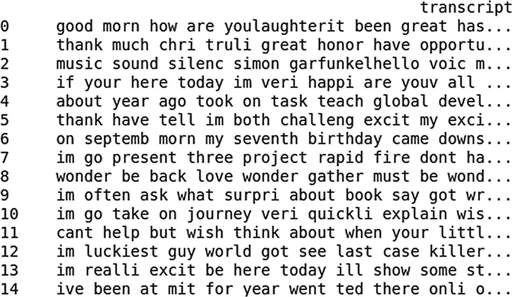

**图 3-5** 输出结果

有关词干提取和词形还原的更多信息，请参阅第 1 章。

```python
ted_df['transcript'] = ted_df['transcript'].apply(lambda a: " ".join([s.stem(x) for x in a.split()]))
```

这些预处理步骤已在本工作中使用。您也可以根据需求或数据特点，包含其他步骤。

### 特征工程

在自然语言处理生命周期中，特征工程利用数据的领域知识来创建特征，从而使机器学习算法能够有效工作。这是机器学习应用的基础。我们实施以下技术来从数据集中获取相关特征。

### 计数向量

有关计数向量器和 TF-IDF 的更多信息，请参阅第 1 章。

```python
cv =CountVectorizer()
cv.fit(ted_df['transcript'])
cv_tedfeatures = cv.transform(ted_df['transcript'])
```

### TF-IDF 向量

```python
#词级 TF-IDF
tv = TfidfVectorizer()
tv.fit(ted_df['transcript'])
tv_tedfeatures =  tv.transform(ted_df['transcript'])
```

### 词嵌入

让我们使用 Gensim 中的 word2vec 预训练模型。导入并实现它。同时，从 [`www.kaggle.com/sandreds/googlenewsvectorsnegative300`](http://www.kaggle.com/sandreds/googlenewsvectorsnegative300) 下载 `GoogleNews-vectors-negative300.bin` 预训练模型。

```python
#加载
m1=gensim.models.KeyedVectors.load_word2vec_format('GoogleNews-vectors-negative300.bin', binary=True)
# 获取嵌入向量的函数
def get_embedding (x, out=False):
if x in m1.wv.vocab:
if out == True:
return m1.wv.vocab[x]
else:
return m1[x]
else:
return np.zeros(300)
# 计算均值
op =  {}
for i in ted_df['transcript']:
avg_vct_doc = (np.mean(np.array([get_embedding(a)for a in nltk.word_tokenize((i))]), axis=0))
d = { i : (avg_vct_doc) }
op.update(d)
op
```

图 3-6 展示了嵌入向量的均值。

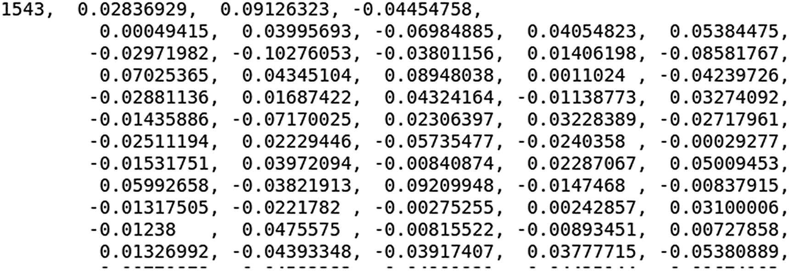

**图 3-6** 输出结果

让我们分离字典的键和值。

```python
results_key = list()
results_value = list()
for key, value in op.items():
results_key.append(key)
results_value.append(np.array(value))
```

图 3-7 展示了词嵌入的输出结果。

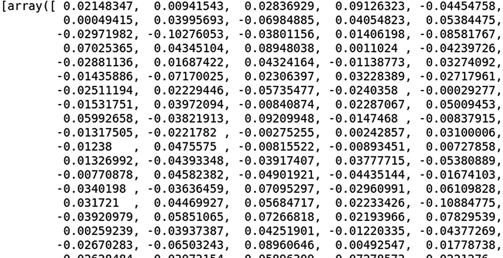

**图 3-7** 输出结果

我们为语料库中的每个文档生成了一个单一的向量。

现在我们已经实现了三种类型的特征工程技术。让我们使用所有三种特征来构建模型，并观察哪一种表现更好。

那么，让我们开始模型构建阶段。

## 模型构建阶段

在此阶段，我们使用 k-means 方法构建聚类。为了确定最佳的聚类数量，我们考虑了不同的方法，如肘部法则、轮廓系数和树状图方法。所有这些方法都通过使用计数向量、词级 TF-IDF 和词嵌入作为特征来评估，然后根据性能最终确定模型。

### K-means 聚类

有关 k-means 算法的更多信息，请参阅第 1 章。

有多种技术可以确定最佳的聚类数量，包括肘部法则、轮廓分数和树状图方法。

#### 肘部法则

肘部法则是一种用于检查所创建聚类一致性的方法。它用于寻找数据中理想的聚类数量。解释方差考虑了方差的解释百分比，并推导出理想的聚类数量。如果将解释的偏差百分比与聚类数量进行比较，第一个聚类会增加大量信息，但在某个点上，解释方差会减少，从而在图表上形成一个角度。此时，便选择了聚类数量。

#### 轮廓系数

轮廓系数，或称轮廓分数，表示一个对象与其自身聚类相比，与其他聚类的相似程度。其值范围从 –1 到 1，其中高值表示该聚类与自身拟合良好，且与相邻聚类不匹配。

轮廓值使用距离度量（如欧几里得距离、曼哈顿距离等）计算。

### 以计数向量作为特征

由于我们之前已经构建了计数向量化特征，现在就来使用它。

#### 肘部法则

使用肘部法则确定 `k`。

```python
from sklearn.cluster import KMeans
import matplotlib.pyplot as plt
elbow_method = {}
for k in range(1, 10):
kmeans_elbow = KMeans(n_clusters=k).fit(cv_tedfeatures)
elbow_method[k] = kmeans_elbow.inertia_
plt.figure()
plt.plot(list(elbow_method.keys()), list(elbow_method.values()))
plt.xlabel("聚类数量")
plt.ylabel("SSE")
plt.show()
```

图 3-8 展示了肘部法则的输出结果。

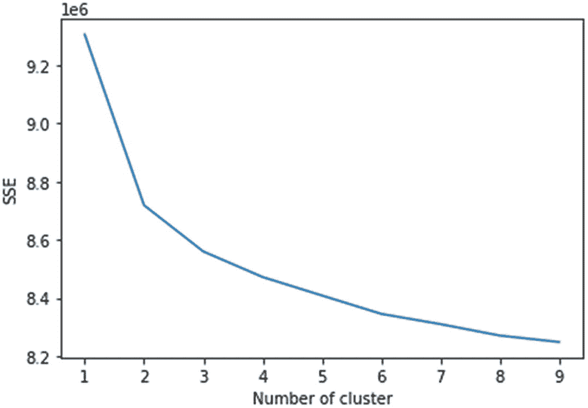

**图 3-8** 输出结果

#### 轮廓系数

```python
from sklearn.metrics import silhouette_score
from sklearn.cluster import KMeans
for n_cluster in range(2, 15):
    kmeans = KMeans(n_clusters=n_cluster).fit(cv_tedfeatures)
    label = kmeans.labels_
    sil_coeff = silhouette_score(cv_tedfeatures, label, metric='euclidean')
    print("For n_clusters={}, The Silhouette Coefficient is {}".format(n_cluster, sil_coeff))
```

图 3-9 展示了轮廓系数的输出结果。

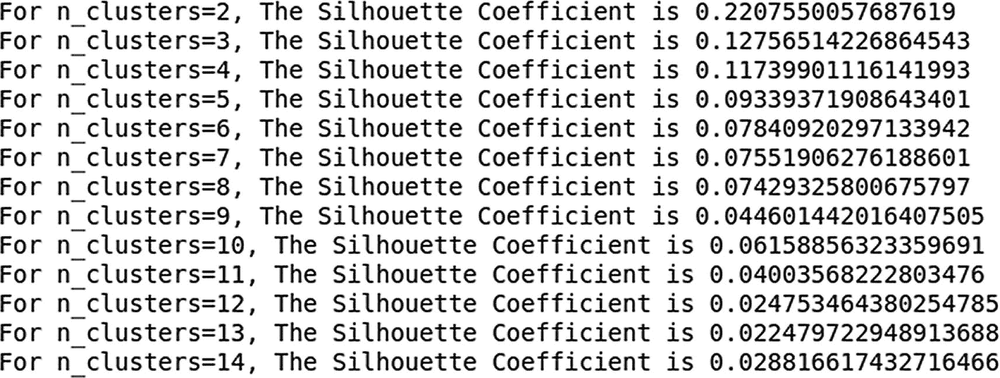

**图 3-9** 输出结果

所有方法都表明，两个聚类是最理想的聚类数量。

接下来，我们实现其他方法并查看结果。我们可以沿用与词频向量化相同的代码，只需相应更改输入特征。先从输出结果开始。

### 以 TF-IDF 为特征

#### 肘部法

图 3-10 展示了轮廓系数的输出结果。

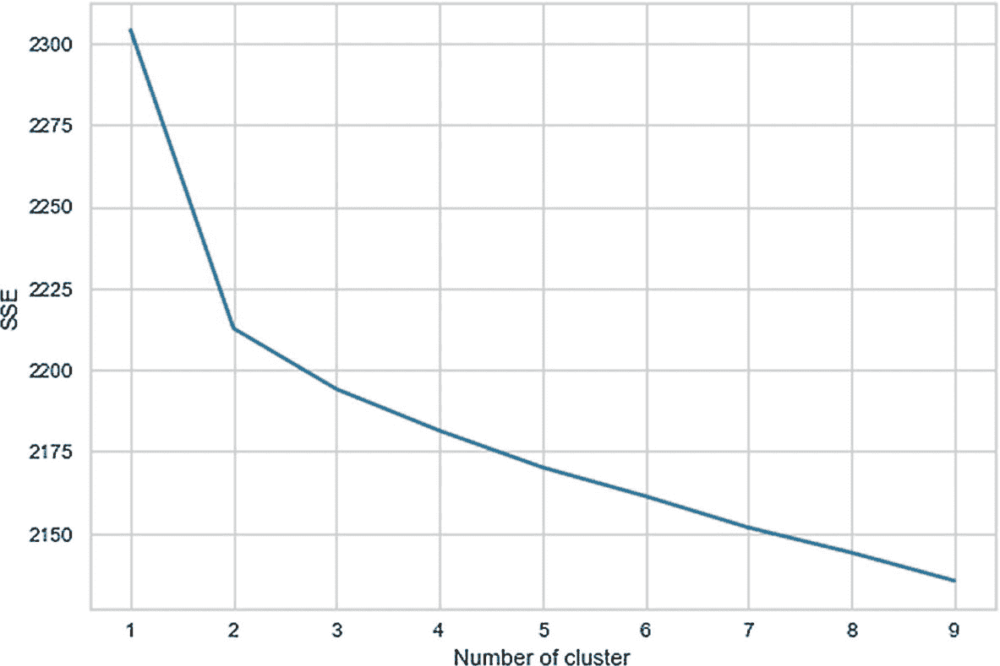

**图 3-10** 输出结果

#### 轮廓系数

图 3-11 展示了轮廓系数的输出结果。

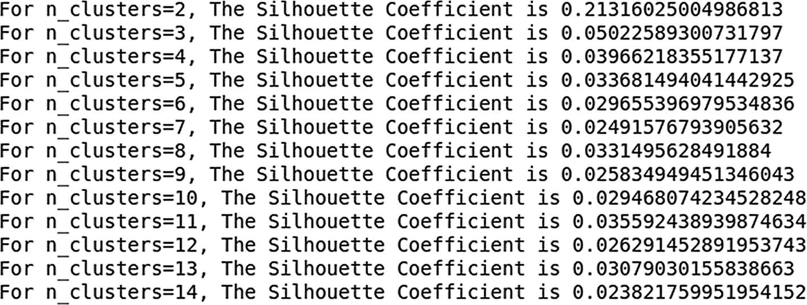

**图 3-11** 输出结果

尽管该方法建议使用两个聚类，但两个聚类之间的数据分布并不理想。其中一个聚类的数据量非常少。在做出进一步决策之前，我们还可以使用词嵌入来构建聚类。

### 以词嵌入为特征

以下是使用词嵌入作为特征的结果，代码同样与词频向量化所使用的代码保持一致。

#### 肘部法

图 3-12 展示了轮廓系数的输出结果。

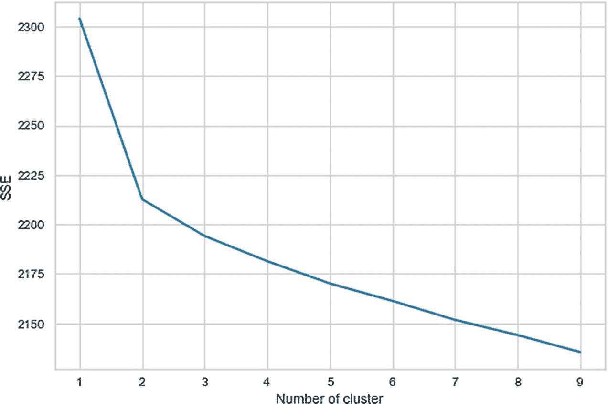

**图 3-12** 输出结果

#### 轮廓系数

图 3-13 展示了轮廓系数的输出结果。

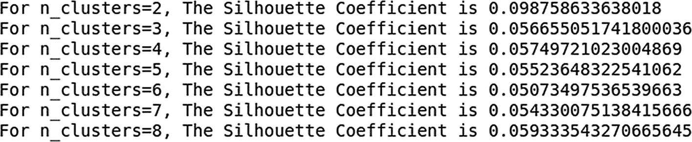

**图 3-13** 输出结果

最佳聚类数量为两个。我们选择 `word2vec` 作为最终的文本特征提取工具，因为它能最好地捕捉语义和上下文。

## 构建聚类模型

现在我们来构建一个 k-means 聚类模型。更多相关信息，请参考第 1 章。

直接进入实现环节。

```markdown
# 聚类可视化

每个聚类通过一元词云进行可视化。

```python
# cluster 1 visualization
from wordcloud import WordCloud, STOPWORDS
# Mono Gram
wordcloud = WordCloud(width=1000, height=500, collocations=False).generate_from_text(' '.join(cluster_1['transcript']))
# Generate plot
plt.figure(figsize=(15,8))
plt.imshow(wordcloud)
plt.axis("off")
plt.show()
```

图 3-14 展示了一个聚类的词云。

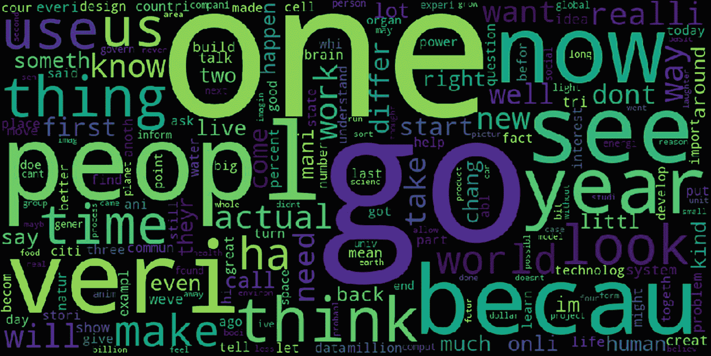

**图 3-14** 输出结果

```python
# Similarly for segment 0 visualization
wordcloud = WordCloud(width=1000, height=500, collocations=False).generate_from_text(' '.join(cluster_0['transcript']))
# Generate plot
plt.figure(figsize=(15,8))
plt.imshow(wordcloud)
plt.axis("off")
plt.show()
```

图 3-15 展示了另一个聚类的词云。

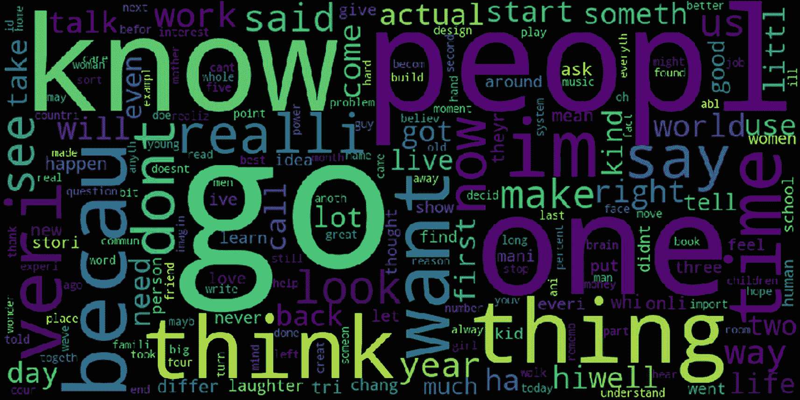

**图 3-15** 输出结果

我们已经成功构建了聚类并对其进行了可视化。虽然我们无法从词云中解读或得出太多结论，但在理想情况下，词云是可视化文本的最佳方式。

接下来，我们进行主题建模，并进一步解读这些聚类。

# 主题建模

主题建模是一种从文本语料库中提取主题的方法。一篇文档可能涵盖任意数量的主题，例如板球、娱乐等。使用 LDA，你可以提取文档中存在的所有此类主题。

让我们开始构建一个模型。

首先，创建主题建模所需的文本处理函数。

```python
def process(doc):
    toks = [w for s in nltk.sent_tokenize(doc) for w in nltk.word_tokenize(s)]
    filt_toks = []
    for i in toks:
        if re.search('[a-zA-Z]', i):
            filt_toks.append(i)
    post_process = [st.stem(t) for t in filt_toks]
    return post_process
```

## 聚类 1 的主题建模

```python
#import
from enism import corpora, models, similarities
toks = [process(a) for a in cluster_1.transcript]
talks = [[x for x in y if x not in sw] for y in toks]
#dictionary from text
dictionary = corpora.Dictionary(talks)
#bow
doc = [dictionary.doc2bow(text) for text in talks]
#topic modeling
tm = models.LdaModel(doc, num_topics=5, id2word=dictionary)
tm.show_topics()
```

图 3-16 展示了主题建模的输出结果。

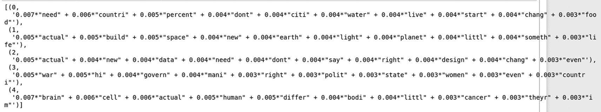

**图 3-16** 输出结果

```python
import pyLDAvis.gensim
pyLDAvis.enable_notebook()
import warnings
warnings.filterwarnings("ignore", category=DeprecationWarning)
pyLDAvis.gensim.prepare(tm, doc, dictionary)
```

图 3-17 展示了主题建模的可视化结果。

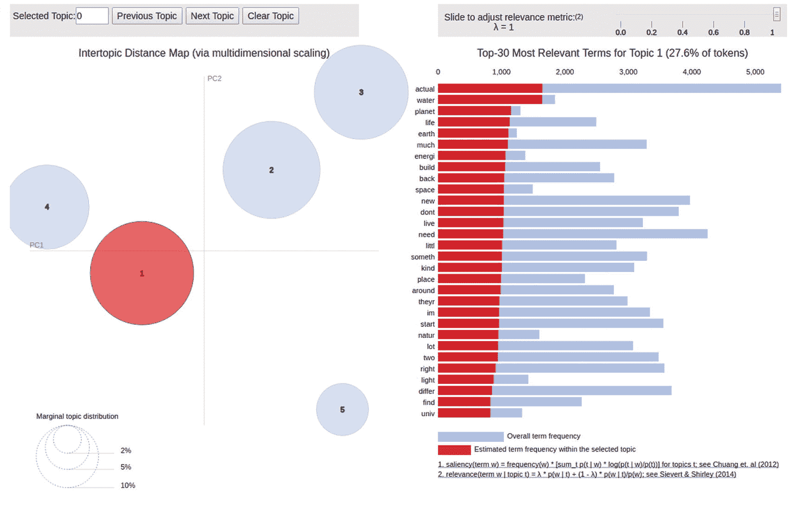

**图 3-17** 输出结果

## 聚类 0 的主题建模

```python
# 字典
dictionary1 = corpora.Dictionary(talks)
# 词袋
doc1 = [dictionary1.doc2bow(text) for text in talks]
tm2 = models.LdaModel(doc1, num_topics=6,
id2word=dictionary)
tm2.show_topics()
```

图 3-18 展示了主题建模的输出结果。

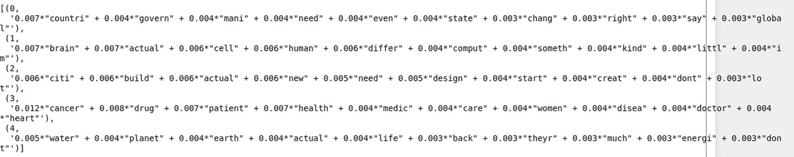

**图 3-18** 输出结果

```python
pyLDAvis.gensim.prepare(tm2, doc1, dictionary1)
```

图 3-19 展示了另一个聚类的主题建模可视化结果。

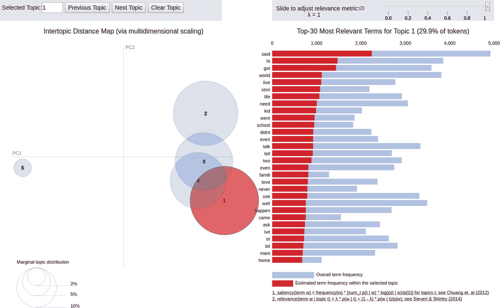

**图 3-19** 输出结果

我们最终从两个聚类中提取了主题并进行了可视化。这充当了聚类属性，因为我们分析的结构化数据可用于解释、聚类命名和制定业务策略。

该数据集似乎不适合文档聚类任务。理想情况下，我们会有两个以上的聚类，并且聚类应能进行细分，使得每个聚类的主题和词云包含相关且独特的主题。

假设你构建了一个文档聚类模型，用于将在线图书馆的书籍文档分割到相应的类别中。假设有 10,000 个这样的文档。这些书籍可以是任何类型——Java/Python 等技术类书籍、法律书籍、漫画、体育杂志、商业书籍和历史书籍。

类似地，正如你在本章中学到的，我们执行文本处理和文本到特征转换，并在找到最佳聚类数量后，使用这些特征通过 k-means 或层次聚类算法构建聚类模型。例如，输出结果为七个聚类。

最后，当我们使用词云进行可视化并执行主题建模时，以下是可能的结果。

*   聚类 1 的主题和词云包含诸如 Python、`data science`、代码、实现、项目、OOPS 和编程等词汇。

*   聚类 2 的主题和词云包含诸如 Virat Kholi、`cricket`、`football`、`top` runs、`goals`和`wicket`等词汇。

*   聚类 3 的主题和词云包含诸如零售、营销、管理、利润、亏损和收入等词汇。

通过查看主题和词云，你可以得出结论：聚类 1 主要包含与技术相关的主题，因此相应地标记所有聚类 1 的文档。聚类 2 包含与体育相关的主题，因此相应地标记所有聚类 2 的文档。聚类 3 包含与商业相关的文档，因此相应地标记所有聚类 3 的文档。

# 结论

总结一下，本章涵盖了以下内容。

*   理解业务问题

*   从开源数据源收集数据

*   理解数据，并仅考虑包含原始 TED 演讲的列，为另一个用例创建单独的数据框

*   文本预处理

*   特征工程技术，如计数向量化、词级 TF-IDF、词嵌入

*   在模型构建阶段，采用 k-means 无监督学习方法

*   考虑了三种方法：肘部法、轮廓系数和树状图来确定聚类数量

*   通过单字词云对聚类进行可视化，以更好地理解聚类并进行聚类解释

*   使用 LDA 技术从每个聚类中提取主题，以进一步增强聚类解释

*   使用`pyLDAvis`分别对每个聚类的主题模型进行可视化

*   从聚类的词云及其对应的主题模型中提取洞察
```