# 4. 利用高级搜索引擎和推荐系统增强电子商务

几十年前，没有人能想象我们可以在午夜时分坐在家里看着 22 英寸电视的同时，购买一台 55 英寸的电视。感谢互联网和电子商务，我们可以随时随地购买任何商品，并且商品能快速送达。这种灵活性使得电子商务业务呈指数级增长。你无需前往商店，产品有无限选择，价格更低，无需排队付款等等。

鉴于电子商务的蓬勃发展，许多知名企业纷纷参与其中。公司在运营、供应链和营销的同时，也注重技术。为了在竞争中生存，还需要正确运用数字营销和社交媒体。此外，最重要的是，企业必须利用数据和技术来个性化客户体验。

## 问题陈述

这个时代最常被讨论的问题之一是推荐系统。个性化是下一个大数据科学难题。它几乎无处不在——电影、音乐、电子商务网站等等。

由于应用范围广泛，我们选择电子商务产品推荐作为问题陈述之一。推荐系统有多种类型。但处理文本的是基于内容的推荐系统。例如，如果你查看图 4-1 所示的图表，系统会根据点击产品的产品描述推荐相似产品。让我们在本章中探讨如何构建这种推荐系统。

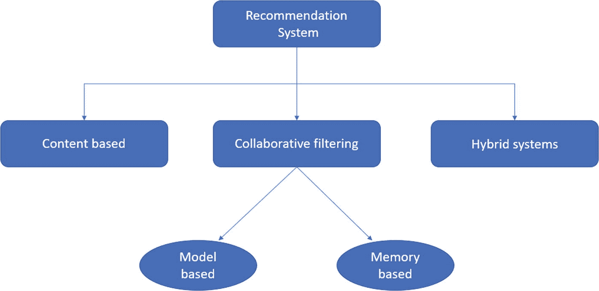

**图 4-1** 推荐引擎的类型

同样，电子商务网站中的搜索引擎在用户体验和增加收入方面也扮演着重要角色。搜索栏应针对搜索查询提供相关匹配，错误的结果最终会导致客户流失。这是我们要解决的另一个问题。

总结一下，在这个项目中，我们的目标是构建一个搜索和推荐系统，该系统能够基于电子商务数据集搜索和推荐产品。

## 方法

我们的主要目标是根据用户的历史兴趣推荐产品或项目。推荐引擎使用不同的算法，向用户推荐最相关的项目。它首先捕获用户过去的行为，然后基于此推荐产品。

在进一步讨论之前，让我们简要介绍各种类型的推荐引擎。图 4-1 展示了推荐引擎的类型。

以下是各种类型的推荐引擎。

*   购物篮分析（关联规则挖掘）

*   基于内容的推荐

*   协同过滤

*   混合系统

*   基于机器学习聚类的推荐

*   基于机器学习分类的推荐

*   基于深度学习和自然语言处理的推荐

### 基于内容的过滤

内容过滤算法会推荐或预测与客户曾喜欢或表现出任何兴趣的商品相似的商品。图 4-2 展示了基于内容过滤的示例。

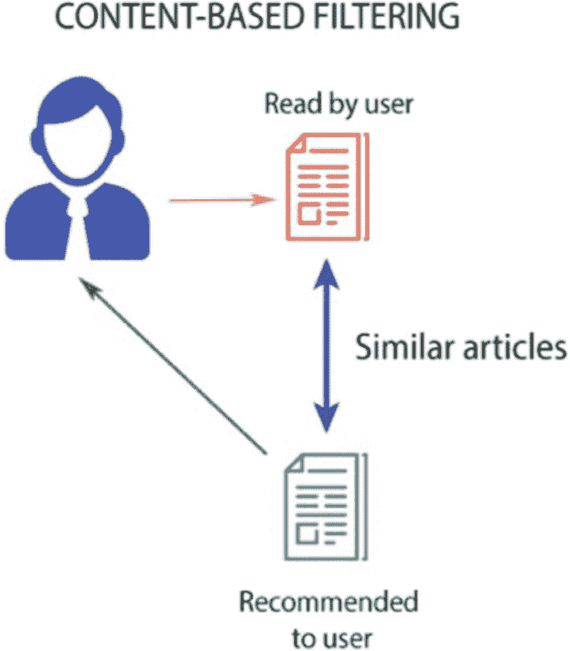

图 4-2

基于内容的过滤

该项目旨在使用深度学习技术进行信息检索，而非传统的单词比较方法，以获得更好的结果。同时，它也关注无处不在的推荐系统，并创建个性化推荐以提升用户体验。

该方法涉及以下步骤。

1.  数据理解

2.  预处理

3.  特征选择

4.  模型构建

5.  返回搜索查询

6.  推荐商品

图 4-3 展示了基于词频-逆文档频率（TF-IDF）向量的方法，用于构建基于内容的推荐引擎，该方法会生成一个矩阵，其中每个单词为一列。

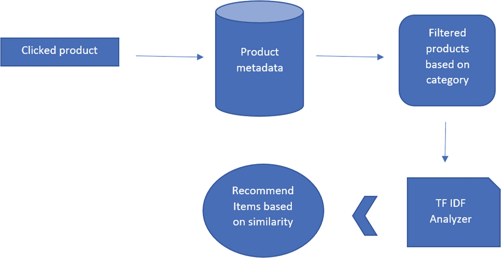

图 4-3

基于 TF-IDF 的架构

图 4-4 展示了商品搜索栏的架构。这里使用了词嵌入。词嵌入是一种语言建模技术，它将文本转换为实数。这些嵌入可以通过多种方法构建，主要使用神经网络。

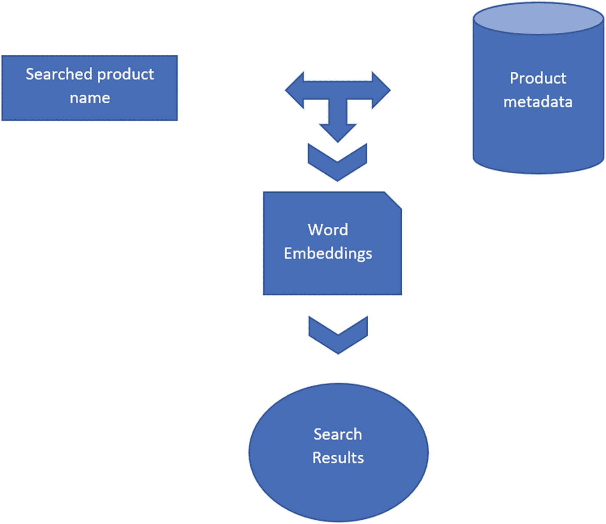

图 4-4

基于词嵌入的架构

### 环境设置

表 4-1 描述了本项目所使用的环境设置。不过，你也可以使用 Linux 或 macOS。要在 Linux 或 macOS 上安装 Anaconda，请访问 [`www.anaconda.com`](http://www.anaconda.com)。

表 4-1

环境设置

| 设置项 | 版本 |
| --- | --- |
| 处理器 | Intel(R) Core(TM) i5-4210U CPU @1.70GHz 2.40 GHz |
| 操作系统 | Windows 10- 64 位 |
| 已安装内存 (RAM) | 8.00 GB |
| Anaconda 发行版 | 5.2.0 |
| Python | 3.6.5 |
| Notebook | 5.5.0 |
| NumPY | 1.14.3 |
| pandas | 0.23.0 |
| scikit-learn | 0.19.1 |
| Matplotlib | 2.2.2 |
| Seaborn | 0.8.1 |
| NLTK | 3.3.0 |
| Gensim | 3.4.0 |

## 理解数据

电商商品推荐数据集包含 20,000 个观测值和 15 个属性。这 15 个特征列于表 4-2 中。

表 4-2

数据集中存在的变量

| 属性名称 | 数据类型 |
| --- | --- |
| `uniq_id` | object |
| `crawl_timestamp` | object |
| `product_url` | object |
| `product_name` | object |
| `Pid` | object |
| `retail_price` | float64 |
| `discounted_price` | float65 |
| `image` | object |
| `is_FK_Advantage_product` | bool |
| `description` | object |
| `product_rating` | object |
| `overall_rating` | object |
| `brand` | object |
| `product_specifications` | object |
| `product_category_tree` | object |

### 探索性数据分析

电商数据集包含 15 个属性，其中包含这些标签，本项目需要商品名称和描述。

让我们导入所有必需的库。

```python
#Data Manipulation
import pandas as pd
import numpy as np
# Visualization
import matplotlib.pyplot as plt
import seaborn as sns
#NLP for text pre-processing
import nltk
import scipy
import re
from scipy import spatial
from nltk.tokenize.toktok import ToktokTokenizer
from nltk.corpus import stopwords
from nltk.tokenize import sent_tokenize, word_tokenize
from nltk.stem import PorterStemmer
tokenizer = ToktokTokenizer()
# other libraries
import gensim
from gensim.models import Word2Vec
import itertools
from sklearn.feature_extraction.text import TfidfVectorizer
from sklearn.decomposition import PCA
# Import linear_kernel
from sklearn.metrics.pairwise import linear_kernel
# remove warnings
import warnings
warnings.filterwarnings(action = 'ignore')
```

让我们加载你已下载并保存在本地的数据集（见图 4-5）。

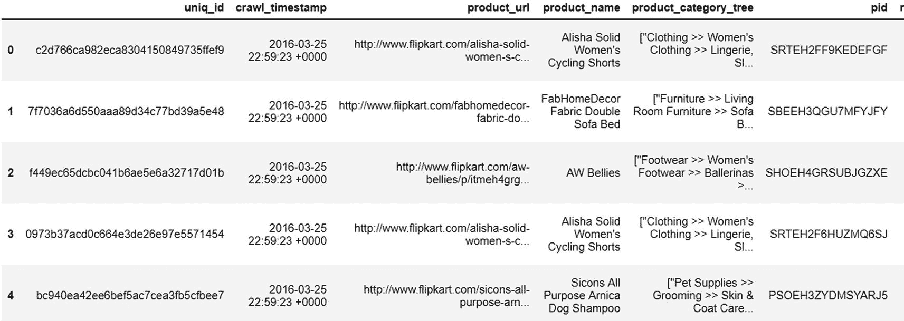

图 4-5

示例数据集

```python
data=pd.read_csv("flipkart_com-ecommerce_sample1.csv")
data.head()
```

```python
data.shape
(20000, 15)
data.info()

RangeIndex: 19998 entries, 0 to 19997
Data columns (total 15 columns):
uniq_id                    19998 non-null object
crawl_timestamp            19998 non-null object
product_url                19998 non-null object
product_name               19998 non-null object
product_category_tree      19998 non-null object
pid                        19998 non-null object
retail_price               19920 non-null float64
discounted_price           19920 non-null float64
image                      19995 non-null object
is_FK_Advantage_product    19998 non-null bool
description                19998 non-null object
product_rating             19998 non-null object
overall_rating             19998 non-null object
brand                      14135 non-null object
product_specifications     19984 non-null object
dtypes: bool(1), float64(2), object(12)
memory usage: 1.2+ MB
```

以下是观察结果。

*   数据集共有 15 列和 20,000 个观测值。

*   `is_FK_Advantage_product` 是布尔型，`retail_price` 和 `discounted_price` 列是数值型，其余列是类别型。

让我们添加一个新的长度列，以给出 `description` 输入变量的总长度。

```python
data['length']=data['description'].str.len()
```

在文本预处理之前，为描述中的单词数量添加一个新列。

```python
data['no_of_words'] = data.description.apply(lambda x : len(x.split()))
```

以下是 `description` 的单词计数分布。

```python
bins=[0,50,75, np.inf]
data['bins']=pd.cut(data.no_of_words, bins=[0,100,300,500,800, np.inf], labels=['0-100', '100-200', '200-500','500-800' ,'>800'])
words_distribution = data.groupby('bins').size().reset_index().rename(columns={0:'word_counts'})
sns.barplot(x='bins', y='word_counts', data=words_distribution).set_title("Word distribution per bin")
```

图 4-6 显示，大多数描述的单词数少于 100 个，20% 的描述有 100 到 200 个单词。

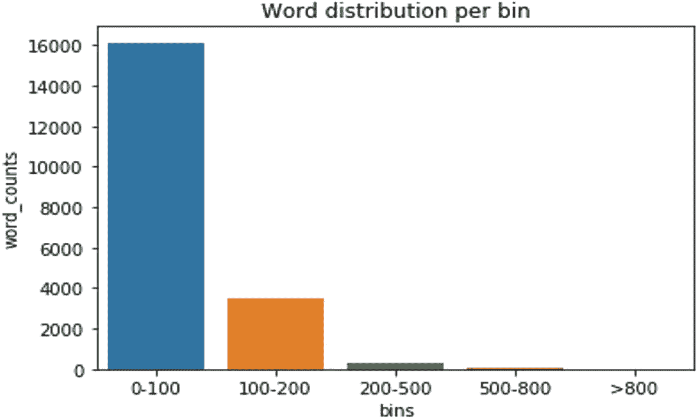

图 4-6

描述列的单词分布

现在，让我们做一些数据预处理。

### 数据预处理

数据预处理包括数据清洗、准备、转换和降维，这些步骤将原始数据转换为适合进一步处理的形式。

```python
# Number of missing values in each column
missing = pd.DataFrame(data.isnull().sum()).rename(columns = {0: 'missing'})
# Create a percentage of missing values
missing['percent'] = missing['missing'] / len(data)
# sorting the values in desending order to see highest count on the top
missing.sort_values('percent', ascending = False)
```

图 4-7 显示，近 30% 的品牌变量存在缺失值。其他变量的缺失值数量可以忽略不计。

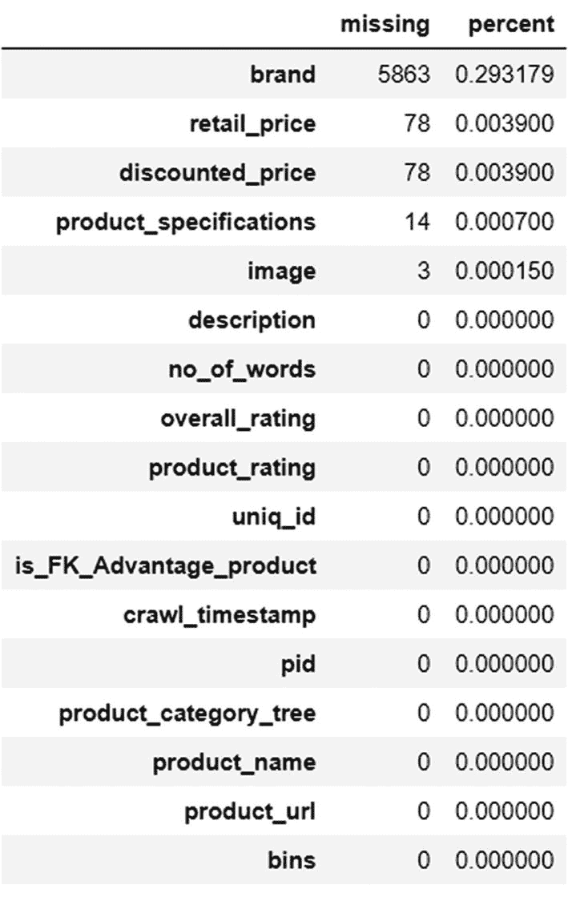

图 4-7

缺失值分布

接下来，让我们使用多种方法进行文本预处理。

## 文本预处理

文本数据中存在大量无用信息。让我们来清理一下。

文本预处理任务包括：

- 将文本数据转换为小写

- 移除/替换标点符号

- 移除/替换数字

- 移除多余空白字符

- 移除停用词

- 词干提取和词形还原

```python
#### 移除标点符号
data['description'] = data['description'].str.replace(r'[^\w\d\s]', ' ')
#### 将词条间的空白字符替换为单个空格
data['description'] = data['description'].str.replace(r'\s+', ' ')
#### 移除首尾空白字符
data['description'] = data['description'].str.replace(r'^\s+|\s+?$', '')
#### 转换为小写
data['description'] = data['description'].str.lower()
data['description'].head()
0    key features of alisha solid women s cycling s...
1    fabhomedecor fabric double sofa bed finish col...
2    key features of aw bellies sandals wedges heel...
3    key features of alisha solid women s cycling s...
4    specifications of sicons all purpose arnica do...
Name: description, dtype: object
#### 移除停用词
stop = stopwords.words('english')
pattern = r'\b(?:{})\b'.format('|'.join(stop))
data['description'] = data['description'].str.replace(pattern, '')
#### 移除单个字符
data['description'] = data['description'].str.replace(r'\s+', ' ')
data['description'] = data['description'].apply(lambda x: " ".join(x for x in x.split() if len(x)>1))
#### 从描述中移除领域相关的停用词
specific_stop_words = [ "rs","flipkart","buy","com","free","day","cash","replacement","guarantee","genuine","key","feature","delivery","products","product","shipping", "online","india","shop"]
data['description'] = data['description'].apply(lambda x: " ".join(x for x in x.split() if x not in specific_stop_words))
data['description'].head()
0    features alisha solid women cycling shorts cot...
1    fabhomedecor fabric double sofa bed finish col...
2    features aw bellies sandals wedges heel casual...
3    features alisha solid women cycling shorts cot...
4    specifications sicons purpose arnica dog shamp...
Name: description, dtype: object
```

我们再来看看语料库中出现频率最高的词汇，以便更好地理解数据。

```
#### 移除领域相关停用词后的高频词
a = data['description'].str.cat(sep=' ')
words = nltk.tokenize.word_tokenize(a)
word_dist = nltk.FreqDist(words)
word_dist.plot(10,cumulative=False)
print(word_dist.most_common(10))
```

图 4-8 显示，数据中像 `women`、`price` 和 `shirt` 这样的词出现频率很高，因为数据集中包含大量时尚相关商品，且其中大部分面向女性。

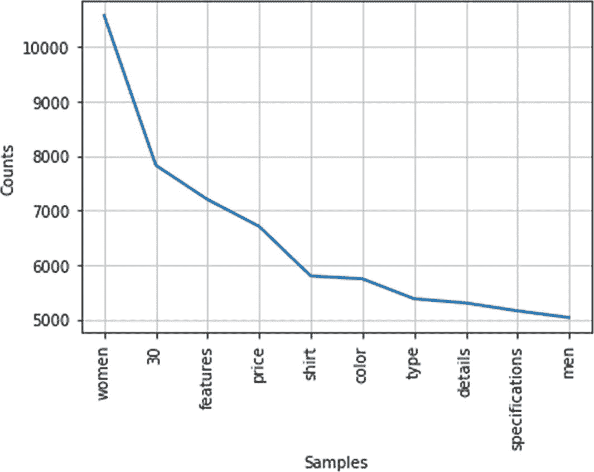

**图 4-8** 高频词

## 模型构建

到目前为止，我们已经尝试理解数据，以便构建更好的解决方案。现在我们需要使用算法来解决问题。

我们要构建两个模型：

- 基于内容的推荐系统

- 产品搜索引擎

让我们使用不同的 NLP 技术，例如 TF-IDF 和词嵌入。`TF-IDF` 和词嵌入都可以用于这两个模型。从实现角度来看，这两个模型几乎相同。但它们各自解决的问题不同。

因此，让我们使用 `TF-IDF` 方法来解决基于内容的推荐系统，并使用词嵌入来解决搜索引擎问题。但请注意，反过来做也是可以的。

让我们从推荐系统开始。

### 基于内容的推荐系统

既然你已经了解了基于内容的推荐系统，那么让我们开始实现一个。

对于基于内容的系统，我们使用 `TF-IDF` 方法。

```
# 文本清洗
data['description'] = data['description'].fillna('')
# 定义向量化器
T_vec =  TfidfVectorizer(stop_words='english')
# 获取向量
T_vec_matrix = T_vec.fit_transform(data['description'])
# 形状
T_vec_matrix.shape
(19998, 26162)
```

描述中共有 26,000 个唯一词汇。

接下来，让我们计算每个组合的相似度分数并生成矩阵。

本项目使用余弦相似度。我们需要编写一个函数，该函数接收产品描述作为输入，并列出 N 个最相似的商品/产品。

我们还需要对产品名称及其索引进行反向映射。

```
# 反转索引和产品的映射
product_index = pd.Series(data.index, index=data['product_name']).drop_duplicates()
product_index
```

图 4-9 显示了输出结果。

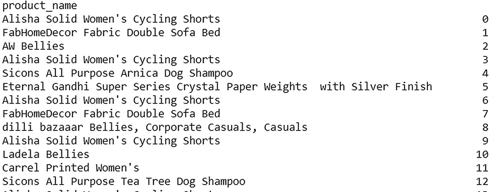

**图 4-9** 带索引的产品名称

在以下步骤中，所有内容都封装在一个函数中，以便于测试。

1.  根据产品获取索引。

2.  获取余弦相似度分数。

3.  对分数进行排序。

4.  从列表中获取前 N 个结果。

5.  输出产品名称。

```
# 函数：输入产品标题，输出最相似的产品
def predict_products(text):
# 获取索引
index = product_index[text]
# 获取成对相似度分数
score_matrix = linear_kernel(T_vec_matrix[index], T_vec_matrix)
matching_sc= list(enumerate(score_matrix[0]))
# 根据相似度分数对产品进行排序
matching_sc= sorted(matching_sc, key=lambda x: x[1], reverse=True)
# 获取前 10 个最相似产品的分数
matching_sc= matching_sc[1:10]
# 获取产品索引
product_indices = [i[0] for i in matching_sc]
# 显示相似产品
return data['product_name'].iloc[product_indices]
recommended_product = predict_products(input("请输入一个产品名称: "))
if recommended_product is not None:
print ("相似产品")
print("\n")
for product_name in recommended_product:
print (product_name)
```


```
请输入一个产品名称: Engage Urge and Urge Combo Set
相似产品
Engage Rush and Urge Combo Set
Engage Urge-Mate Combo Set
Engage Jump and Urge Combo Set
Engage Fuzz and Urge Combo Set
Engage Mate+Urge Combo Set
Engage Urge+Tease Combo Set
Engage Combo Set
Engage Combo Set
Engage Combo Set
```

让我们再看一个例子。


```
请输入一个产品名称: Lee Parke Running Shoes
相似产品
Lee Parke Walking Shoes
N Five Running Shoes
Knight Ace Kraasa Sports Running Shoes, Cycling Shoes, Walking Shoes
WorldWearFootwear Running Shoes, Walking Shoes
reenak Running Shoes
Chazer Running Shoes
Glacier Running Shoes
Sonaxo Men Running Shoes
ETHICS Running Shoes
```

观察结果。如果客户点击了 `Lee Parke Running Shoes`，他们会得到基于其他品牌跑鞋或 `Lee Parke` 其他产品的推荐。

- 出现 `Lee Parke Walking Shoes` 是因为 `Lee Parke` 这个品牌。

- 其余推荐的是不同品牌的跑鞋。

你也可以将价格作为一个特征加入，只获取客户所选产品价格范围内的产品。

这是使用 NLP 的推荐系统的一个版本。为了获得更好的结果，你可以执行以下操作：

- 通过创建用户画像（目前不在数据集的范围内），可以应用更好的基于内容的推荐系统方法。

- 使用词嵌入作为特征。

- 尝试不同的距离度量。

就是这样。我们探索了如何使用自然语言处理构建推荐系统。

现在让我们继续讨论另一个有趣的用例：产品搜索引擎。

### 产品搜索引擎

下一个问题陈述是优化搜索引擎以获得更好的搜索结果。最大的挑战在于，大多数搜索引擎基于字符串匹配，这在所有情况下可能表现不佳。

例如，如果用户搜索“guy shirt”，搜索结果应包含所有与男士、男孩等相关的结果。搜索不应仅基于字符串匹配，还应考虑其他近义词。

解决此问题的最佳方法是*词嵌入*。

词嵌入是每个单词的 N 维向量，它捕捉了单词的含义及其上下文。

`word2vec` 是构建此类嵌入的方法之一。它使用一个浅层神经网络来构建嵌入。构建嵌入有两种方式：跳字模型（skip-gram）和连续词袋模型（CBOW）。

CBOW 方法将每个单词的上下文作为输入，并预测与该上下文对应的单词。网络的输入是上下文，并传递到具有 N 个神经元的隐藏层。最后，输出层使用 `softmax` 层预测单词。隐藏层神经元的权重被视为捕捉了含义和上下文的向量。

跳字模型是 CBOW 的逆向过程。单词作为输入，网络预测其上下文。

以上就是关于词嵌入及其工作原理的简要理论。我们可以自行构建嵌入，或使用现有的预训练嵌入。构建嵌入需要大量的数据和资源，而对于医疗保健等领域，我们需要构建自己的嵌入，因为通用嵌入的表现可能不佳。

## 实现

让我们使用 Google 在新闻数据集上预训练的 `word2vec` 模型。可以导入该训练好的模型，并为每个单词获取向量。然后，可以利用任意相似度度量来对结果进行排序。

```
#创建包含每个产品描述的列表，作为子列表
fin=[]
for i in range(len(data['description'])):
temp=[]
temp.append(data['description'][i])
fin = fin + temp
data1 = data[['product_name','description']]
#导入 word2vec
from gensim.models import KeyedVectors
filename = 'C:\\GoogleNews-vectors-negative300.bin'
model = KeyedVectors.load_word2vec_format(filename, binary=True, limit=50000)
#预处理
def remove_stopwords(text, is_lower_case=False):
pattern = r'[^a-zA-z0-9\s]'
text = re.sub(pattern, '', text[0])
tokens = nltk.word_tokenize(text)
tokens = [token.strip() for token in tokens]
if is_lower_case:
filtered_tokens = [token for token in tokens if token not in stop]
else:
filtered_tokens = [token for token in tokens if token.lower() not in stop]
filtered_text = ' '.join(filtered_tokens)
return filtered_text
# 获取嵌入，我们使用“300”
def get_embedding(word):
if word in model.wv.vocab:
return model[word]
else:
return np.zeros(300)
```

对于每个文档，我们计算文档中所有单词的平均值。

```
# 获取所有文档的平均向量
out_dict =  {}
for sen in fin:
average_vector = (np.mean(np.array([get_embedding(x) for x in nltk.word_tokenize(remove_stopwords(sen))]), axis=0))
dict = { sen : (average_vector) }
out_dict.update(dict)
# 获取查询与文档之间的相似度
def get_sim(query_embedding, average_vector_doc):
sim = [(1 - scipy.spatial.distance.cosine(query_embedding, average_vector_doc))]
return sim
# 根据相似度对所有文档进行排序
def Ranked_documents(query):
global rank
query_words =  (np.mean(np.array([get_embedding(x) for x in nltk.word_tokenize(query.lower())],dtype=float), axis=0))
rank = []
for k,v in out_dict.items():
rank.append((k, get_sim(query_words, v)))
rank = sorted(rank,key=lambda t: t[1], reverse=True)
dd =pd.DataFrame(rank,columns=['Desc','score'])
rankfin = pd.merge(data1,dd,left_on='description',right_on='Desc')
rankfin = rankfin[['product_name','description','score']]
print('排序后的文档：')
return rankfin
# 使用查询调用信息检索函数
query=input("您想搜索什么？")
Ranked_documents(query)
# 输出
```

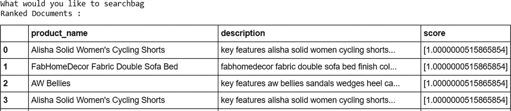

图 4-10

模型输出

## 使用 PyTerrier 和 Sentence-BERT 的高级搜索引擎

让我们介绍几种基于深度学习的先进解决方案来解决这个问题。图 4-11 展示了这种方法的整体框架。

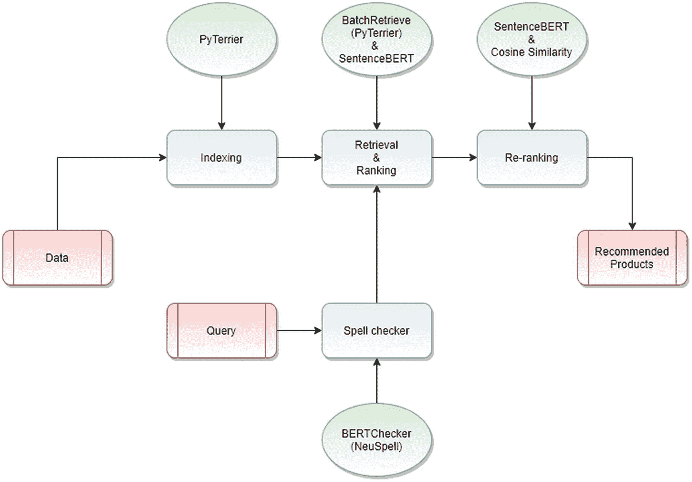

图 4-11

基于 PyTerrier 的搜索引擎实现流程

索引是信息检索系统的重要组成部分。对于索引，我们使用 `DFIndexer`。索引简化了检索过程。

`BatchRetrieve` 是 PyTerrier 中最常用的对象之一。它使用预先存在的 Terrier 索引数据结构。

`NeuSpell` 是一个基于上下文纠正拼写的开源包。该包包含十个基于各种神经模型的拼写检查器。要实现此模型，请从 `NeuSpell` 导入 `BERTChecker` 包。

`BERTChecker` 支持多种语言，包括英语、阿拉伯语、印地语和日语。

让我们使用 `PyTerrier` 和 `Sentence-BERT` 库，并继续实现。

以下内容用于安装所需的包和库。

```
import pandas as pd
import numpy as np
import seaborn as sns
import matplotlib.pyplot as plt
import string
import re
%matplotlib inline
import nltk
nltk.download('punkt')
nltk.download('wordnet')
nltk.download('stopwords')
from nltk.corpus import stopwords
from nltk.tokenize import word_tokenize
from nltk.stem.wordnet import WordNetLemmatizer
lem = WordNetLemmatizer()
stop_words = set(stopwords.words('english'))
exclude = set(string.punctuation)
import string
!pip install python-terrier
import pyterrier as pt
if not pt.started():
pt.init()
!pip install -U sentence-transformers
!pip install neuspell
!pip install -e neuspell/
!git clone https://github.com/neuspell/neuspell; cd neuspell
import os
os.chdir("/content/neuspell")
!pip install -r /content/neuspell/extras-requirements.txt
!python -m spacy download en_core_web_sm
#解压多语言包
!wget https://storage.googleapis.com/bert_models/2018_11_23/multi_cased_L-12_H-768_A-12.zip
!unzip *.zip
#导入 neuspell
from neuspell import BertChecker
from sklearn.metrics.pairwise import cosine_similarity
from sentence_transformers import SentenceTransformer
model = SentenceTransformer('sentence-transformers/bert-base-nli-mean-tokens')
```

加载数据集。

```
df=pd.read_csv(flipkart_com-ecommerce_sample.csv)
df.head()
```

### 数据预处理

让我们进行更多的文本预处理。

首先，将 `'category_tree'` 列转换为简单的列表。

# 构建搜索引擎

让我们使用 `DFIndexer` 对象为关键词创建索引。

```python
!rm -rf /content/iter_index_porter
pd_indexer = pt.DFIndexer("/content/pd_index")
indexref = pd_indexer.index(uniq_prod["keywords"], uniq_prod["docno"])
```

让我们在用户查询上实现 NeuSpell 拼写检查器，并将其保存到一个对象中。

```python
spellcheck = BertChecker()
spellcheck.from_pretrained(
    ckpt_path=f"/content/multi_cased_L-12_H-768_A-12"  # ""
)
X=input("搜索引擎:")
query=spellcheck.correct(X)
print(query
搜索引擎:womns clothing
women clothing
```

使用 PyTerrier 和 Sentence-BERT 执行排序和检索。

```python
prod_ret = pt.BatchRetrieve(indexref, wmodel='TF_IDF', properties={'termpipelines': 'Stopwords'})
pr=prod_ret.compile()
output=pr.search(query)
docno=list(output['docno'])
transform=model.encode(docno)
```

使用 PyTerrier 和余弦相似度创建嵌入并重新排序。

```python
embedding={}
for i,product in enumerate(docno):
    embedding[product]=transform[i]
q_embedding=model.encode(query).reshape(1,-1)
l=[]
for product in embedding.keys():
    score=cosine_similarity(q_embedding,embedding[product].reshape(1,-1))[0][0]
    l.append([product,score])
output2=pd.DataFrame(l,columns=['product_name','score'])
```

让我们查看结果。

```python
output2.sort_values(by='score',ascending=False).head(10)
```

图 4-13 展示了以“women clothing”作为查询的结果。在输出中，有一个属于女装类别的产品列表。相应的分数代表了相关性。请注意，结果与搜索查询高度相关。

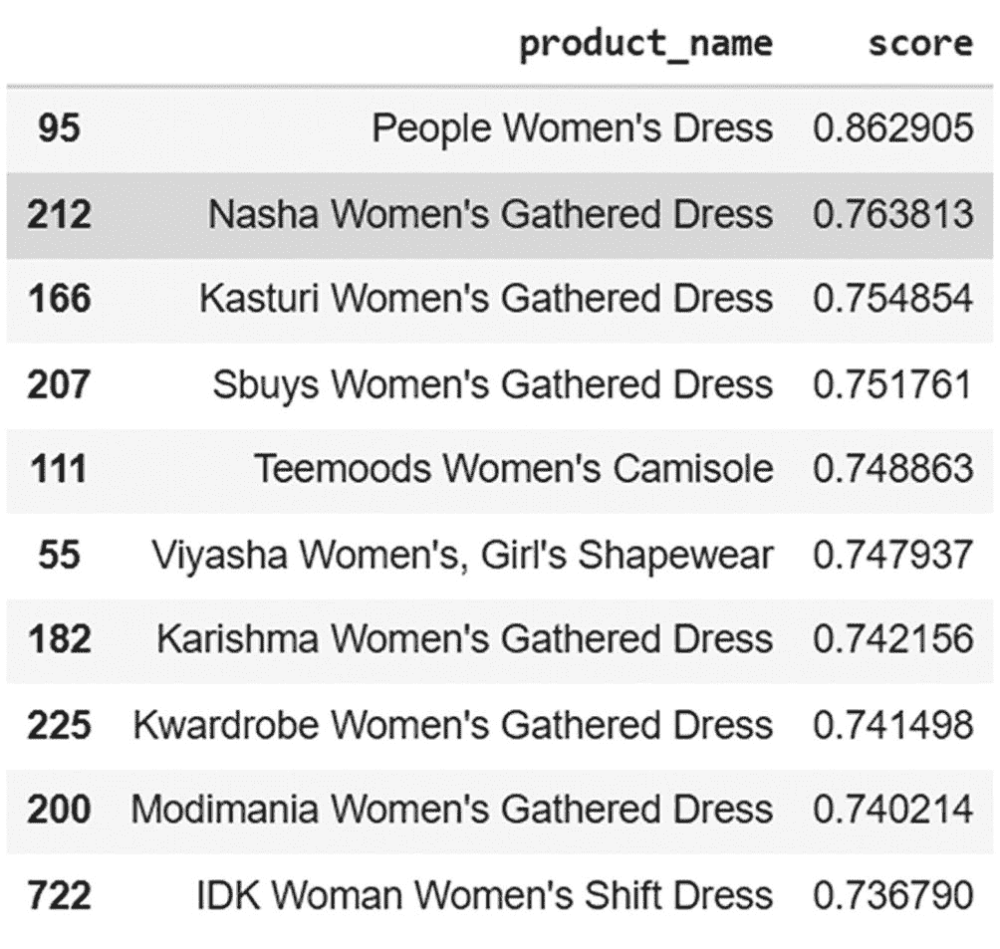

**图 4-13** 模型输出

# 使用深度文本搜索的多语言搜索引擎

这些搜索引擎面临的挑战之一是多语言问题。这些产品具有很强的地域性，而英语并非唯一使用的语言。为了解决这个问题，我们可以使用深度文本搜索（Deep Text Search）。

`Deep Text Search` 是一个基于人工智能的多语言文本搜索引擎，采用了 Transformer 模型。它支持 50 多种语言。以下是它的一些特性。

-   搜索速度更快。

-   推荐结果非常准确。

-   最适合用于实现基于 Python 的应用程序。

让我们使用以下数据集来了解这个库。

-   英文数据集包含 30 行和 13 列。

[`https://data.world/login?next=%2Fpromptcloud%2Fwalmart-product-data-from-usa%2Fworkspace%2Ffile%3Ffilename%3Dwalmart_com-ecommerce_product_details__20190311_20191001_sample.csv`](https://data.world/login%253Fnext%253D%252Fpromptcloud%252Fwalmart-product-data-from-usa%252Fworkspace%252Ffile%253Ffilename%253Dwalmart_com-ecommerce_product_details__20190311_20191001_sample.csv)

-   阿拉伯语数据集是一个与阿拉伯语报纸语料库相关的文本文件。

[`https://www.kaggle.com/abedkhooli/arabic-bert-corpus`](https://www.kaggle.com/abedkhooli/arabic-bert-corpus)

-   印地语数据集包含从印地语新闻网站收集的 900 条电影评论，分为三类（正面、中性、负面）。

[`https://www.kaggle.com/disisbig/hindi-movie-reviews-dataset?select=train.csv`](https://www.kaggle.com/disisbig/hindi-movie-reviews-dataset%253Fselect%253Dtrain.csv)

-   日语数据集包含日本首相的推文。

[`https://www.kaggle.com/team-ai/shinzo-abe-japanese-prime-minister-twitter-nlp`](https://www.kaggle.com/team-ai/shinzo-abe-japanese-prime-minister-twitter-nlp)

让我们从英文数据集开始。

安装所需的包并导入库。

```python
!pip install neuspell
!pip install -e neuspell/
!git clone https://github.com/neuspell/neuspell; cd neuspell
!pip install DeepTextSearch
import os
os.chdir("/content/neuspell")
!pip install -r /content/neuspell/extras-requirements.txt
!python -m spacy download en_core_web_sm
#Unzipping the multi-linguistic packages
!wget https://storage.googleapis.com/bert_models/2018_11_23/multi_cased_L-12_H-768_A-12.zip
!unzip *.zip
# importing nltk
import nltk
nltk.download('punkt')
nltk.download('averaged_perceptron_tagger')
nltk.download('maxent_ne_chunker')
nltk.download('words')
nltk.download('wordnet')
#import DeepTextSearch
from DeepTextSearch import TextEmbedder,TextSearch,LoadData
from nltk.corpus import wordnet
import pandas as pd
from neuspell import BertChecker
```

让我们使用 `BERTChecker` 进行拼写检查。它也支持多种语言。

```python
spellcheck = BertChecker()
spellcheck.from_pretrained(
    ckpt_path=f"/content/multi_cased_L-12_H-768_A-12")
# ""
```

让我们输入查询并检查其工作方式。

```python
X=input("Enter Product Name:")
y=spellcheck.correct(X)
print(y)
Enter Product Name: shirts
shirts
```

让我们也使用词性标注（POS tagging）从给定的查询中选择相关词汇。

```python
#function to get the POS tag
def preprocess(sent):
    sent = nltk.word_tokenize(sent)
    sent = nltk.pos_tag(sent)
    return sent
sent = preprocess(y)
l=[]
for i in sent:
    if i[1]=='NNS' or i[1]=='NN':
        l.append(i[0])
print(l)
['shirts']
```

下一步，让我们使用查询扩展来获取词汇的同义词，这样我们可以获得更相关的推荐。

```python
query=""
for i in l:
    query+=i
    synset = wordnet.synsets(i)
    query+=" "+synset[0].lemmas()[0].name()+" "
print(query)
shirts shirt
```

我们创建了这个字典，以便根据描述中的推荐来显示产品名称。

```python
#importing the data
df=pd.read_csv("walmart_com-ecommerce_product_details__20190311_20191001_sample.csv")
df1=df.set_index("Description", inplace = False)
df2=df1.to_dict()
dict1=df2['Product Name']
```

将数据嵌入到一个 pickle 文件中，因为库要求数据采用这种格式。

```python
data = LoadData().from_csv("walmart_com-ecommerce_product_details__20190311_20191001_sample.csv")
TextEmbedder().embed(corpus_list=data)
corpus_embedding = TextEmbedder().load_embedding()
```

基于查询搜索最相关的十个产品。

```python
n=10
t=TextSearch().find_similar(query_text=query,top_n=n)
for i in range(n):
    t[i]['text']=dict1[t[i]['text']]
    print(t[i])
```

图 4-14 显示了针对“shirts”搜索查询的结果。

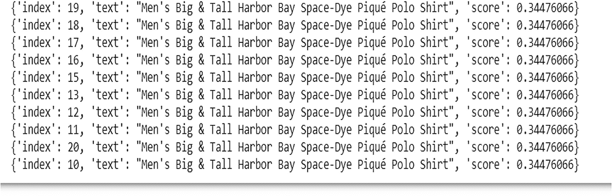

图 4-14

模型输出

现在让我们看看搜索在阿拉伯语中是如何工作的。

```python
X1=input("Search Engine:")
y1=spellcheck.correct(X1)
print(y1)
```

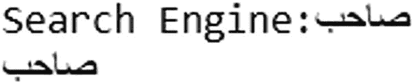

让我们导入阿拉伯语数据语料库来执行搜索。

```python
# import library and data
from DeepTextSearch import LoadData
data1 = LoadData().from_text("wiki_books_test_1.txt")
TextEmbedder().embed(corpus_list=data1)
corpus_embedding = TextEmbedder().load_embedding()
```

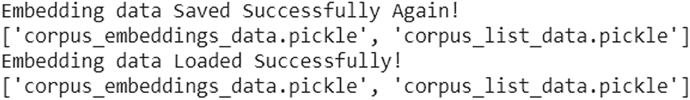

让我们使用 `textseach` 函数查找最相关的 10 个文档。图 4-15 显示了输出结果。

```python
TextSearch().find_similar(query_text=y1,top_n=10)
```

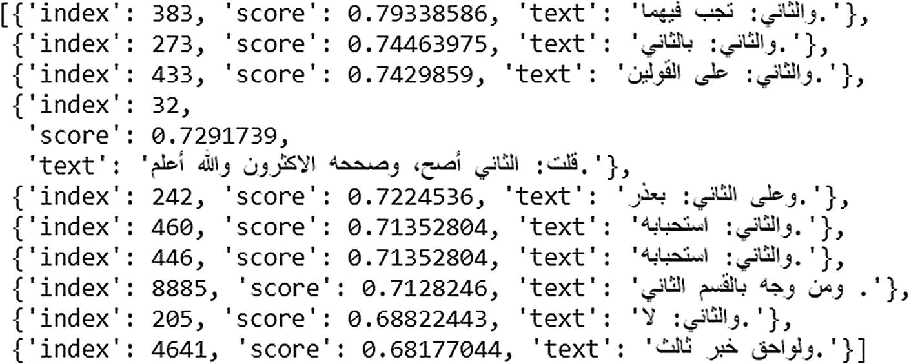

图 4-15

模型输出

现在让我们看看搜索在印地语中是如何工作的。

```python
X_hindi=input("Search Engine:")
y_hindi=spellcheck.correct(X_hindi)
print(y_hindi)
```


```python
#loading the Hindi data corpus
data_hindi = LoadData().from_csv("hindi.csv")
TextEmbedder().embed(corpus_list=data_hindi)
corpus_embedding = TextEmbedder().load_embedding()
```

让我们查找最相关的 10 个结果。图 4-16 显示了输出结果。

```python
TextSearch().find_similar(query_text=y_hindi,top_n=10)
```

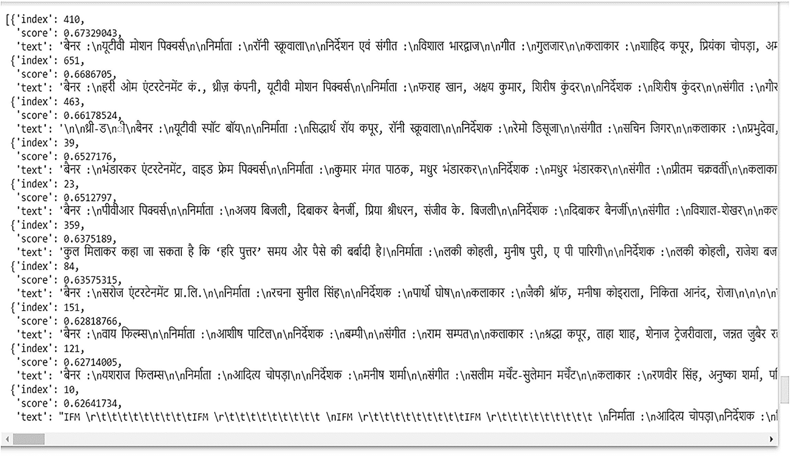

图 4-16

模型输出

让我们再尝试一种语言，日语。

```
X_japanese=input("Search Engine:")
# y_japanese=spellcheck.correct(X_japanese)
print(X_japanese)
```


```
#loading the data
data_japanese = LoadData().from_text("Japanes_Shinzo Abe Tweet 20171024 - Tweet.csv")
TextEmbedder().embed(corpus_list=data_chinese)
corpus_embedding = TextEmbedder().load_embedding()
```

根据搜索查询查找最相关的十条推文。图 4-17 显示了输出结果。

```
TextSearch().find_similar(query_text=X_japanese,top_n=10)
```

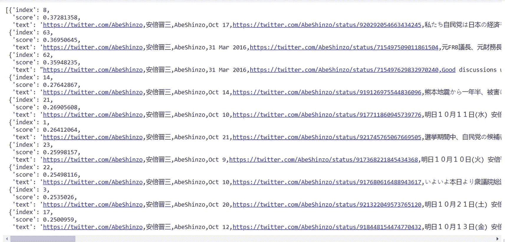

图 4-17

模型输出

## 总结

在本章中，我们使用多种模型实现了一个搜索引擎和推荐系统。我们从一个简单的推荐系统开始，采用`TF-IDF`方法计算所有产品描述的相似度得分。根据描述，产品被排序并展示给用户。随后，我们探索了如何使用词嵌入构建一个简单的搜索引擎，并对结果进行排序。

接着，我们深入研究了诸如`PyTerrier`和`Sentence-BERT`等高级模型，这些模型利用预训练模型提取向量。由于这些模型基于深度学习，其结果相比传统方法要好得多。我们还使用了`Deep Text Search`，这是另一个适用于多语言文本语料库的深度学习库。