# 5. 创建简历解析、筛选与入围系统

本项目的目标是利用自然语言处理创建一个简历入围系统。

## 背景

面对数百万求职者，要从成百上千份简历中筛选出最佳应聘者几乎是不可能的。大多数简历没有标准格式；也就是说，市面上几乎每份简历都有其独特的结构和内容。人力资源人员必须亲自审阅每份简历，以确定最符合职位描述的人选。这一过程既耗时又容易出错，因为合适的候选人可能会在此过程中被忽略。

企业目前面临的挑战之一，是在有限的时间和资源下为职位挑选合适的候选人。在挑选最佳候选人时，招聘人员必须考虑以下几点：

-   从数据库中的简历集合里，手动逐一筛选，找出与给定职位描述最匹配的简历。

-   在选出的简历中，根据与职位描述的相关性进行排序。

-   排序完成后，需要提取姓名、联系电话和电子邮件地址等信息，以便进一步推进候选人流程。

为了克服这些挑战，让我们看看 NLP 如何构建一个简历解析和入围系统，该系统能够根据职位描述（JD）从海量简历中解析、匹配、筛选和排序。

## 方法与步骤

解决此项目的关键需求是职位描述和简历，它们作为模型的输入，然后根据格式（Word 或 PDF）传递给文档读取器，该读取器从 Word/PDF 文档中提取所有文本内容。

现在我们有了文本数据，对其进行处理以去除噪声和不需要的信息（如停用词和标点符号）就变得至关重要。

一旦简历和职位描述处理完毕，我们需要使用计数向量化器或`TD-IDF`将文本转换为特征。对于这个用例，`TD-IDF`可能更有意义，因为我们希望强调简历中提到的每个关键词（技能）的出现频率。之后，我们使用*截断奇异值分解*来降低特征向量的维度。

然后我们进入模型构建阶段，在此阶段我们有一个相似度引擎，用于捕获两个文档（简历和职位描述）在关键词方面的相似程度。利用相似度得分，我们对系统中每个职位描述对应的每份简历进行排序。例如，有两个职位描述（数据科学和分析）以及 50 份来自不同技能领域的简历。那么，在这 50 份简历中，该模型将为数据科学和分析分别提供排名靠前的简历。

模型构建完成，并且我们为给定的职位描述选出了排名靠前的简历后，提取相关信息（如姓名、联系电话、地点和电子邮件地址）就变得至关重要。

最后，我们汇总所有结果，并以表格形式呈现，招聘人员可以访问该表格并继续进行招聘流程。验证和可视化层有助于招聘人员进一步验证，并在无需打开简历了解候选人背景的情况下，查看简历中的核心技能。

图 5-1 展示了解决此问题的方法流程图。

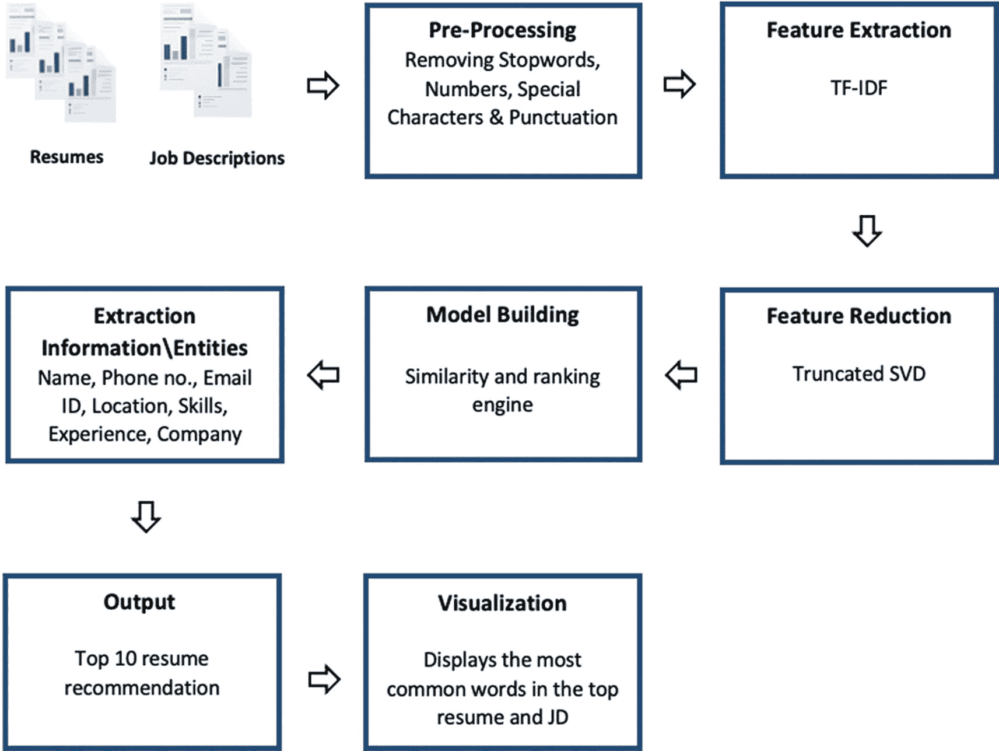

图 5-1

展示了模型的完整框架

**注意** 信息与实体的提取是在原始文本（未经预处理）上进行的。

## 实现

我们考虑的数据集包含来自不同领域的 32 份不同简历和三个不同的职位描述。该数据集是开源的。这里使用的数据集包含不同文件格式的简历和职位描述。以下是数据集的链接。（本章演示仅考虑了部分数据集，但每个领域档案都有数千份简历。）

数据收集完成后，让我们开始实现。

### 安装与导入所需库

```
# 安装所需库
!pip install textract
!pip install -U nltk
!pip install pdfminer3
!pip install mammoth
!pip install locationtagger
# 导入所需库
import pandas as pd
from google.colab import drive
from pdfminer3.layout import LAParams
from pdfminer3.pdfpage import PDFPage
from pdfminer3.pdfinterp import PDFResourceManager
from pdfminer3.pdfinterp import PDFPageInterpreter
from pdfminer3.converter import TextConverter
import io
import os
import nltk
nltk.download('stopwords')
from nltk.corpus import stopwords
import re
nltk.download('punkt')
nltk.download('averaged_perceptron_tagger')
from sklearn.feature_extraction.text import TfidfVectorizer
from sklearn.metrics.pairwise import cosine_similarity
import en_core_web_sm
nlp = en_core_web_sm.load()
import matplotlib.pyplot as plt
from wordcloud import WordCloud
import mammoth
import locationtagger
nltk.download('maxent_ne_chunker')
nltk.download('words')
from nltk.corpus import wordnet
nltk.download('wordnet')
from sklearn.decomposition import TruncatedSVD
```

### 阅读简历与职位描述

现在，让我们从创建简历和职位描述目录的路径开始。

```
# 创建简历和职位描述目录
directory = '/content/drive/MyDrive/'
resume_path = directory + 'Resumes/'
jd_path = directory + 'JD/'
```

接下来，让我们从简历和职位描述中提取所有文本信息。我们来编写一个函数，用于提取 PDF 格式的简历。它也可以提取表格中的数据。这里我们使用了 `pdfminer3` 中定义的 `PDFResourceManager`、`PDFPageInterpreter` 和 `TextConverter` 函数。

```
#此函数用于从 PDF 文件中提取文本。它也可以从 PDF 文件中提取表格
def pdf_extractor(path):
r_manager = PDFResourceManager()
output = io.StringIO()
converter = TextConverter(r_manager, output, laparams=LAParams())
p_interpreter = PDFPageInterpreter(r_manager, converter)
with open(path, 'rb') as file:
for page in PDFPage.get_pages(file,caching=True,check_extractable=True):
p_interpreter.process_page(page)
text = output.getvalue()
converter.close()
output.close()
return text
```

以下函数用于读取以下任意格式的文档。

*   PDF

*   DOCX

*   DOC

*   TXT

```
# 用于读取 pdf、docx、doc 和 txt 文件的函数
def read_files(file_path):
fileTXT = []
# 此 for 循环用于读取函数中 file_path 指定的所有文件
for filename in os.listdir(file_path):
# 如果文档是 pdf 格式，则执行此代码
if(filename.endswith(".pdf")):
try:
fileTXT.append(pdf_extractor(file_path+filename)) # 此处使用 pdf_extractor 函数提取 pdf 文件
except Exception:
print('读取 pdf 文件时出错 :' + filename)
# 如果文档是 docx 格式，则执行此代码
if(filename.endswith(".docx")):
try:
with open(file_path + filename, "rb") as docx_file:
result = mammoth.extract_raw_text(docx_file)
text = result.value
fileTXT.append(text)
except IOError:
print('读取 .docx 文件时出错 :')
# 如果给定文档是 doc 格式，则执行此循环
if(filename.endswith(".doc")):
try:
text = textract.process(file_path+filename).decode('utf-8')
fileTXT.append(text)
except Exception:
print('读取 .doc 文件时出错 :' + filename)
# 如果给定文件是 txt 格式，则执行此文件
if(filename.endswith(".txt")):
try:
myfile = open(file_path+filename, "rt")
contents = myfile.read()
fileTXT.append(contents)
except Exception:
print('读取 .txt 文件时出错 :' + filename)
return fileTXT
```

`resumeTxt` 是一个包含所有候选人简历的列表。

```
# 调用 read_files 函数读取所有简历
resumeTxt = read_files(resume_path)
# 显示第一份简历
resumeTxt[0]
```

图 5-2 显示了输出结果。

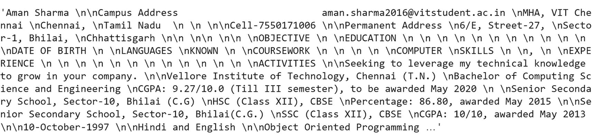

图 5-2

显示 `resumeTxt` 的输出结果

`jdTxt` 是所有职位描述的列表。

```
# 调用 read_files 函数读取所有职位描述
jdTxt = read_files(jd_path)
# 显示第一份职位描述
jdTxt[0]
```

图 5-3 显示了输出结果。

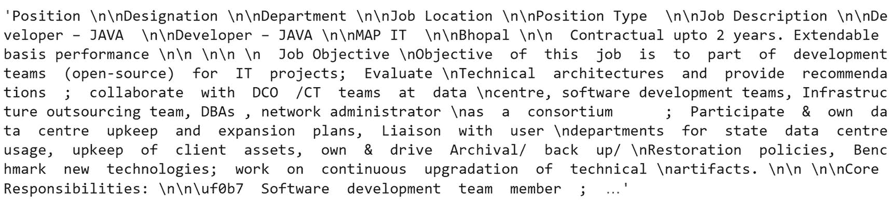

图 5-3

显示 `jdTxt` 的输出结果

### 文本处理

你必须处理文本以去除噪声和其他无关信息。让我们遵循一些基本的文本清洗步骤，例如将所有单词转换为小写、移除特殊字符（`%`、`$`、`#` 等）、剔除包含数字的单词（例如 `hey199` 等）、删除多余空格、移除停用词（例如重复出现的单词，如 *is*、*the*、*an* 等）等等。

```
# 此函数帮助我们移除停用词、标点符号、特殊字符、多余空格和数字数据。它还将所有文本转换为小写。
Def preprocessing(Txt):
sw = stopwords.words('english')
space_pattern = '\s+'
special_letters = "[^a-zA-Z#]"
p_txt = []
for resume in Txt:
text = re.sub(space_pattern, ' ', resume) # 移除多余空格
text = re.sub(special_letters, ' ', text) # 移除特殊字符
text = re.sub(r'[^\w\s]','',text) # 移除标点符号
text = text.split() # 将文本中的单词拆分
text = [word for word in text if word.isalpha()] # 仅保留字母单词
text = [w for w in text if w not in sw] # 移除停用词
text = [item.lower() for item in text] # 将单词转换为小写
p_txt.append(" ".join(text)) # 将所有单词重新连接
return p_txt
```

`p_résuméTxt` 包含所有预处理后的简历。

```
# 调用 preprocessing 函数来清洗所有简历
p_resumeTxt = preprocessing(resumeTxt)
# 显示第一份预处理后的简历
p_resumeTxt[0]
```

图 5-4 显示了输出结果。

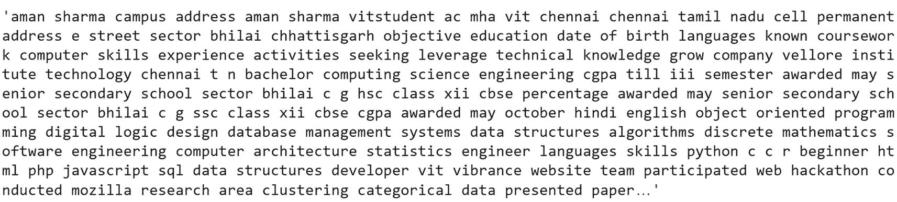

图 5-4

显示 `p_résuméTxt` 的输出结果

`jds` 包含所有预处理后的职位描述。

```
# 调用 preprocessing 函数来清洗所有职位描述
jds = preprocessing(jdTxt)
# 显示第一份预处理后的职位描述
Jds[0]
```

图 5-5 显示了输出结果。

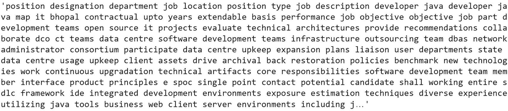

图 5-5

显示 `JDs` 的输出结果

你可以清楚地看到预处理文本与原始文本之间的差异。一旦有了处理后的文本，将其转换为机器可以理解的特征就很重要了。

### 文本到特征

TF-IDF 衡量一个词对特定文档的重要程度。

这里我们使用 `sklearn` 中的默认 `TfidfVectorizer` 库。

```
# 合并简历和职位描述以计算 TF-IDF 和余弦相似度
TXT = p_resumeTxt+jds
# 计算所有简历和职位描述的 TF-IDF 分数
tv = TfidfVectorizer(max_df=0.85,min_df=10,ngram_range=(1,3))
# 将 TF-IDF 转换为 DataFrame
tfidf_wm = tv.fit_transform(TXT)
tfidf_tokens = tv.get_feature_names()
df_tfidfvect1 = pd.DataFrame(data = tfidf_wm.toarray(),columns = tfidf_tokens)
print("\nTD-IDF 向量化器\n")
print(df_tfidfvect1[0:10])
```

图 5-6 显示了输出结果。

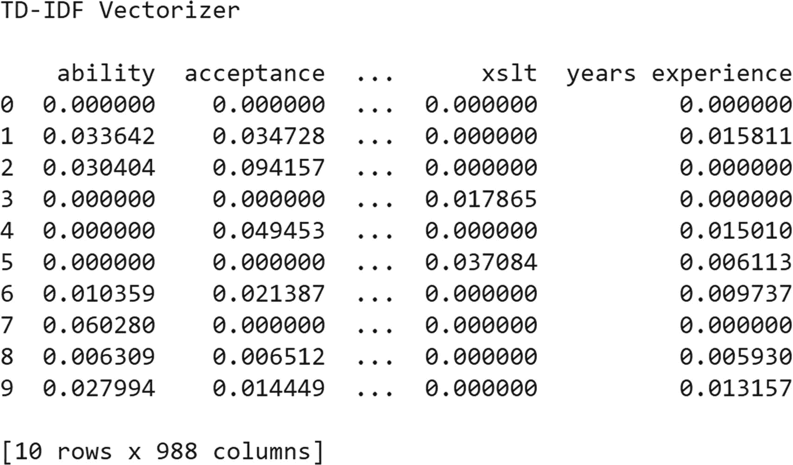

图 5-6

TF-IDF 的输出结果

根据文档的大小，这可能会产生一个巨大的矩阵，因此使用特征降维技术来降低维度非常重要。

### 特征降维

截断*奇异值分解*（SVD）是最著名的降维方法之一。它将矩阵 `M` 分解为三个矩阵 `U`、`Σ` 和 `V^T` 以生成特征。`U`、`Σ` 和 `V^T` 描述如下。

*   `U` 是左奇异矩阵

*   `Σ` 是对角矩阵

*   `V^T` 是右奇异矩阵

截断 SVD 产生一种分解，我们可以指定想要的列数，从而保留最相关的特征。

```
# 定义变换
dimrec = TruncatedSVD(n_components=30, n_iter=7, random_state=42)
transformed = dimrec.fit_transform(df_tfidfvect1)
# 将变换后的向量转换为列表
vl = transformed.tolist()
# 将列表转换为 DataFrame
fr = pd.DataFrame(vl)
print('SVD 特征向量')
print(fr[0:10])
```

图 5-7 显示了输出结果。

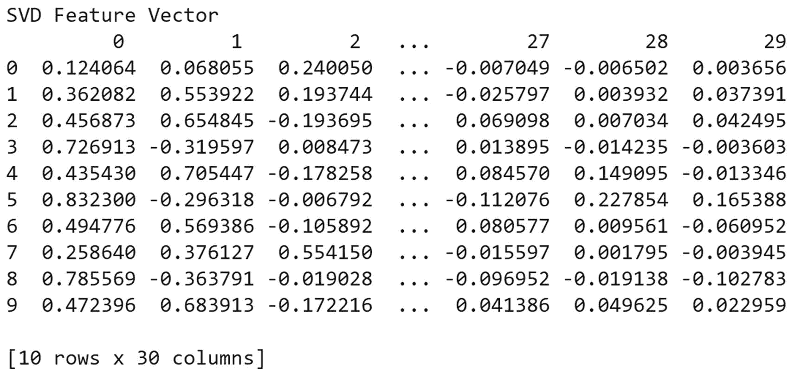

图 5-7

SVD 的输出结果

## 模型构建

这是一个相似度度量问题，系统会向招聘人员推荐前 N 个（N 可自定义）最匹配的简历。为此，我们采用余弦相似度，它用于衡量两个向量的相似程度。

公式如下：

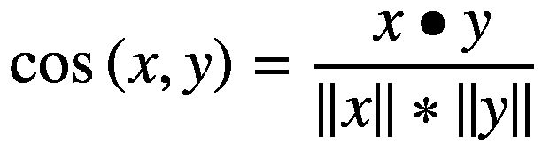

- `x` ⋅ `y` 是向量 `x` 和 `y` 的点积

- `||x||` 和 `||y||` 是向量 `x` 和 `y` 的长度

- `||x||` ∗ `||y||` 是向量 `x` 和 `y` 的叉积

```
# 计算职位描述与简历之间的余弦相似度，以找出最适合某职位描述的简历
similarity = cosine_similarity(df_tfidfvect1[0:len(resumeTxt)],df_tfidfvect1[len(resumeTxt):])
# 职位描述的列名
abc = []
for i in range(1,len(jds)+1):
abc.append(f"JD {i}")
# 相似度得分的 DataFrame
Data=pd.DataFrame(similarity,columns=abc)
print('\n 余弦相似度\n')
print(Data[0:10])
```

图 5-8 显示了输出结果。

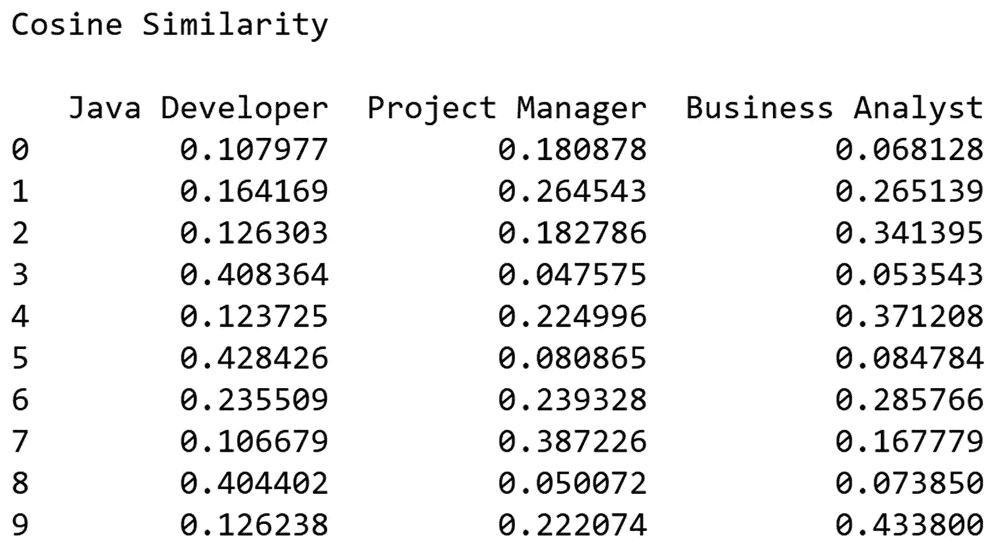

图 5-8

输出结果展示了每份简历（代表每一行）与相应职位描述之间的相似度得分。

# 提取实体

现在我们已经得到了每份简历相对于各职位描述的相似度得分，接下来提取所需实体，例如候选人姓名、电话号码、电子邮件地址、技能、工作年限以及前雇主信息。

我们编写正则表达式来提取电话号码：

```python
# 原始简历的 DataFrame
t = pd.DataFrame({'原始简历':resumeTxt})
dt = pd.concat([Data,t],axis=1)
# 查找电话号码的函数
def number(text):
    # compile 帮助我们定义在文本中匹配的模式
    pattern = re.compile(r'([+(]?\d+[)\-]?[ \t\r\f\v]*[(]?\d{2,}[()\-]?[ \t\r\f\v]*\d{2,}[()\-]?[ \t\r\f\v]*\d*[ \t\r\f\v]*\d*[ \t\r\f\v]*)')
    #  findall 查找 compile 中定义的模式
    pt = pattern.findall(text)
    #  sub 替换文本中匹配的模式
    pt = [re.sub(r'[,.]', '', ah) for ah in pt if len(re.sub(r'[()\-.,\s+]', '', ah))>9]
    pt = [re.sub(r'\D$', '', ah).strip() for ah in pt]
    pt = [ah for ah in pt if len(re.sub(r'\D','',ah))  3: continue
    for x in ah.split("-"):
        try:
            #  isdigit 检查文本是否为数字
            if x.strip()[-4:].isdigit():
                if int(x.strip()[-4:]) in range(1900, 2100):
                    #  移除提到的文本
                    pt.remove(ah)
        except: pass
    number = None
    number = list(set(pt))
    return number
```

`dt['电话号码']` 包含候选人的所有电话号码。

```python
# 调用 number 函数获取候选人号码列表
dt['电话号码']=dt['原始简历'].apply(lambda x: number(x))
print("从数据框列中提取号码：")
dt['电话号码'][0:5]
```

图 5-9 显示了输出结果。

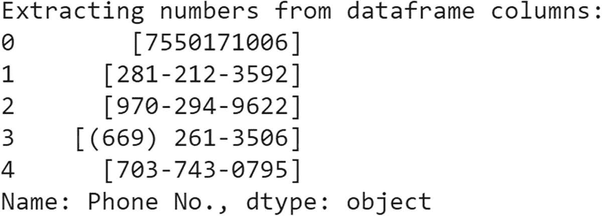

图 5-9

显示从简历中提取的前五个号码。

现在，我们使用正则表达式提取每位候选人的电子邮件地址。

```python
# 这里我们从简历中提取电子邮件
def email_ID(text):
    # compile 帮助我们定义在文本中匹配的模式
    r = re.compile(r'[A-Za-z0-9_.+-]+@[a-zA-Z0-9-]+\.[a-zA-Z0-9-.]+')
    return r.findall(str(text))
```

`dt['电子邮件 ID']` 包含候选人的电子邮件地址。

```python
#  调用 email_ID 函数获取候选人电子邮件列表
dt['电子邮件 ID']=dt['原始简历'].apply(lambda x: email_ID(x))
print("从数据框列中提取电子邮件：")
dt['电子邮件 ID'][0:5]
```

图 5-10 显示了输出结果。

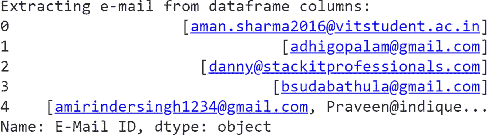

图 5-10

显示从简历中提取的前五个电子邮件。

接下来，我们从简历语料库中移除候选人的电话号码和电子邮件地址，因为我们要提取工作年限和候选人姓名，而电话号码中的整数可能会被误认为是工作年限，或者干扰识别候选人姓名的函数。

```python
# 移除电话号码以提取工作年限和候选人姓名的函数
def rm_number(text):
    try:
        # compile 帮助我们定义在文本中匹配的模式
        pattern = re.compile(r'([+(]?\d+[)\-]?[ \t\r\f\v]*[(]?\d{2,}[()\-]?[ \t\r\f\v]*\d{2,}[()\-]?[ \t\r\f\v]*\d*[ \t\r\f\v]*\d*[ \t\r\f\v]*)')
        #  findall 查找 compile 中定义的模式
        pt = pattern.findall(text)
        #  sub 替换文本中匹配的模式
        pt = [re.sub(r'[,.]', '', ah) for ah in pt if len(re.sub(r'[()\-.,\s+]', '', ah))>9]
        pt = [re.sub(r'\D$', '', ah).strip() for ah in pt]
        pt = [ah for ah in pt if len(re.sub(r'\D','',ah))  3: continue
        for x in ah.split("-"):
            try:
                #  isdigit 检查文本是否为数字
                if x.strip()[-4:].isdigit():
                    if int(x.strip()[-4:]) in range(1900, 2100):
                        #  移除提到的文本
                        pt.remove(ah)
            except: pass
        number = None
        number = pt
        number = set(number)
        number = list(number)
        for i in number:
            text = text.replace(i," ")
        return text
    except:
        pass
```

`dt['原始']` 包含移除候选人电话号码后的所有简历。

## 调用函数 `rm_number` 移除电话号码

`dt['Original'] = dt['Original Resume'].apply(lambda x: rm_number(x))`

现在我们来移除电子邮件地址。

```python
# 定义移除电子邮件的函数，用于提取候选人的工作年限和姓名
def rm_email(text):
    try:
        email = None
        # compile 帮助我们定义用于在文本中匹配的模式
        pattern = re.compile('[\w\.-]+@[\w\.-]+')
        # findall 查找 compile 中定义的模式
        pt = pattern.findall(text)
        email = pt
        email = set(email)
        email = list(email)
        for i in email:
            # replace 会用另一个字符串替换给定的字符串
            text = text.replace(i, " ")
        return text
    except:
        pass
```

`dt['Original']` 包含了移除候选人电话号码和电子邮件地址后的所有简历。

```python
# 调用函数 rm_email 来移除电子邮件
dt['Original'] = dt['Original'].apply(lambda x: rm_email(x))
print("从数据框列中提取数字：")
dt['Original'][0:5]
```

图 5-11 显示了输出结果。

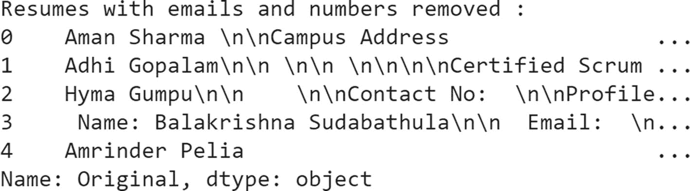

图 5-11 展示了移除数字和电子邮件后的前五份简历

现在我们已经移除了电子邮件地址和电话号码，接下来使用词性标注来提取候选人姓名。关于 NLP 中词性标注的更多信息，请参考我们的书籍《自然语言处理实战：使用 Python 和机器学习与深度学习解锁文本数据》（Apress，2019）。

```python
# 提取候选人姓名的函数
def person_name(text):
    # 将整个文本分词为句子
    Sentences = nltk.sent_tokenize(text)
    t = []
    for s in Sentences:
        # 将句子分词为单词
        t.append(nltk.word_tokenize(s))
    # 为每个单词标注词性
    words = [nltk.pos_tag(token) for token in t]
    n = []
    for x in words:
        for l in x:
            # match 将单词的词性标签与给定的标签进行匹配
            if re.match('[NN.*]', l[1]):
                n.append(l[0])
    cands = []
    for nouns in n:
        if not wordnet.synsets(nouns):
            cands.append(nouns)
    cand = ' '.join(cands[:1])
    return cand
```

`dt['Candidate\'s Name']` 包含了所有候选人的姓名。

```python
# 调用函数 name 来提取候选人姓名
dt['Candidate\'s Name'] = dt['Original'].apply(lambda x: person_name(x))
print("从数据框列中提取姓名：")
dt['Candidate\'s Name'][0:5]
```

图 5-12 显示了输出结果。

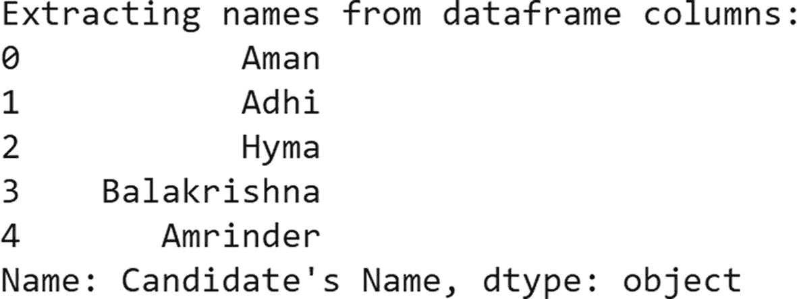

图 5-12 展示了从简历中提取的前五位候选人姓名

现在，我们再次使用正则表达式来提取工作年限。

```python
# 查找工作年限的函数
def exp(text):
    try:
        e = []
        p = 0
        text = text.lower()
        # 搜索与给定模式相似的文本字符串
        pt1 = re.search(r"(?:[a-zA-Z'-]+[^a-zA-Z'-]+){0,7}experience(?:[^a-zA-Z'-]+[a-zA-Z'-]+){0,7}", text)
        if(pt1 != None):
            # 将匹配到的所有字符串分组
            p = pt1.group()
        # 搜索与给定模式相似的文本字符串
        pt2 = re.search(r"(?:[a-zA-Z'-]+[^a-zA-Z'-]+){0,2}year(?:[^a-zA-Z'-]+[a-zA-Z'-]+){0,2}", text)
        if(pt2 != None):
            # 将匹配到的所有字符串分组
            p = pt2.group()
        # 搜索与给定模式相似的文本字符串
        pt3 = re.search(r"(?:[a-zA-Z'-]+[^a-zA-Z'-]+){0,2}years(?:[^a-zA-Z'-]+[a-zA-Z'-]+){0,2}", text)
        if(pt3 != None):
            # 将匹配到的所有字符串分组
            p = pt3.group()
        if(p == 0):
            return 0
        # findall 查找 compile 中定义的模式
        ep = re.findall('[0-9]{1,2}', p)
        ep_int = list(map(int, ep))
        # 此 for 循环用于过滤，然后追加包含工作年限的字符串
        for a in ep:
            for b in ep_int:
                if len(a) <= 2 and b < 30:
                    e.append(a)
        ep = ''.join(e[0])
        # findall 查找 compile 中定义的模式
        p1 = re.findall('[0-9]{1,2}.[0-9]{1,2}', p)
        exp = []
        if not p1:
            exp.append(ep)
            exp = ''.join(ep)
        else:
            exp.append(p1)
            exp = ''.join(p1)
    except:
        exp = 0
    return exp
```

`dt['Experience']` 包含所有候选人的工作年限。

```python
# Calling the function exp to extract the year of experience of the candidate
dt['Experience'] = dt['Original'].apply(lambda x: exp(x))
print("Extracting e-mail from dataframe columns:")
dt['Experience']
```

图 5-13 显示了输出结果。

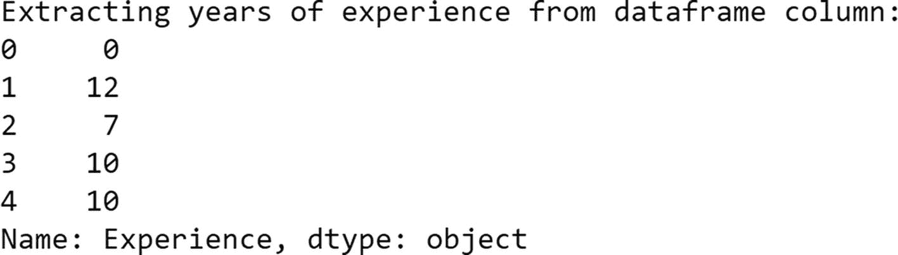

图 5-13 显示从简历中提取的前五位候选人的工作年限。

使用预定义的技能集提取技能。

```python
# Importing a file of pre-defined skills & Converting DataFrame to list
skills = pd.read_excel('/content/drive/MyDrive/skills.xlsx')
skills = skills.values.flatten().tolist()
i = 0
skill = []
for z in skills:
    r = z.lower()
    skill.append(r)
    i += 1
```

将简历中的技能映射到预定义的技能集并进行提取。

```python
# Function to extract skills from candidate's resume
def skills(text):
    sw = set(nltk.corpus.stopwords.words('english'))
    tokens = nltk.tokenize.word_tokenize(text)
    # remove the punctuation
    ft = [w for w in tokens if w.isalpha()]
    # remove the stop words
    ft = [w for w in tokens if w not in sw]
    # generate bigrams and trigrams (like Machine Learning)
    n_grams = list(map(' '.join, nltk.everygrams(ft, 2, 3)))
    fs = set()
    # we text for each token in our skills database
    for token in ft:
        if token.lower() in skill:
            fs.add(token)
    # we text for each bigram and trigram in our skills database
    for ngram in n_grams:
        if ngram.lower() in skill:
            fs.add(ngram)
    return fs
```

`dt['Skills']` 包含所有候选人的技能。

```python
# Calling the function skills to extract the skills of a candidate
dt['Skills'] = dt['Original'].apply(lambda x: skills(x))
print("Extracting Person Name from dataframe columns:")
dt['Skills']
```

图 5-14 显示了输出结果。

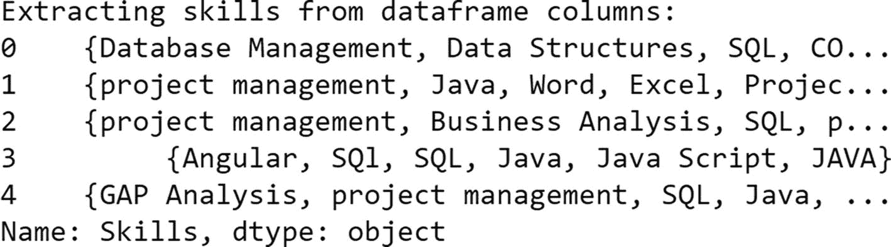

图 5-14 显示从简历中提取的前五位候选人的技能。

对于招聘人员来说，在继续处理候选人资格之前，了解候选人来自哪个地点是另一个重要参数。让我们使用实体提取器来提取地点。

```markdown
# 排名

现在我们已经提取了关于候选人的所有重要信息，我们将展示针对所有不同职位描述的候选人简历排名列表。现在，只需根据给定职位描述的相似度得分按降序排列，即可对项目进行排序。

以下是针对项目经理职位的最终结果。

```python
# Final result for Project Manager profile
pm = dt[['Project Manager', "Candidate's Name", 'Phone No.', 'E-Mail ID', 'Skills', 'Experience', 'Location', 'Company Name']]
pm = pm.sort_values(by='Project Manager', ascending=False)
pm[0:10]
```

图 5-17 显示了输出结果。

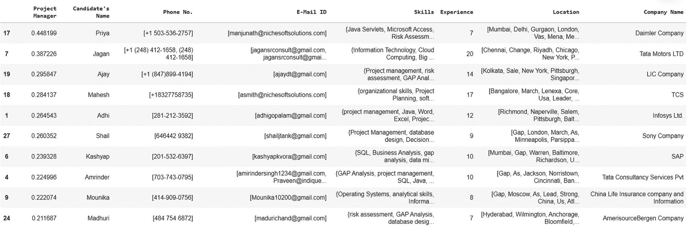

**图 5-17** 显示项目经理职位排名前 10 的简历表格。

`Project Manager` 列表示特定简历与项目经理职位描述的相似度得分。

以下是针对商业分析师职位的最终结果。

```python
# Final Result for Business Analyst
ba = dt[['Business Analyst', "Candidate's Name", 'Phone No.', 'E-Mail ID', 'Skills', 'Experience', 'Location', 'Company Name']]
ba = ba.sort_values(by='Business Analyst', ascending=False)
ba[0:10]
```

图 5-18 显示了输出结果。

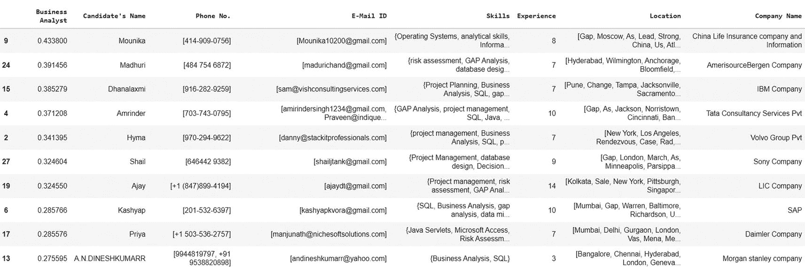

**图 5-18** 显示商业分析师职位排名前 10 的简历表格。

`Business Analyst` 列表示特定简历与商业分析师职位描述的相似度得分。

以下是针对 Java 开发人员职位的最终结果。

```python
# Final Result for Java Developer
jad = dt[['Java Developer', "Candidate's Name", 'Phone No.', 'E-Mail ID', 'Skills', 'Experience', 'Location', 'Company Name']]
jad = jad.sort_values(by='Java Developer', ascending=False)
jad[0:10]
# Here "Java Developer" column indicates similarity score of that particular resume with Java Developer JD
```

图 5-19 显示了输出结果。

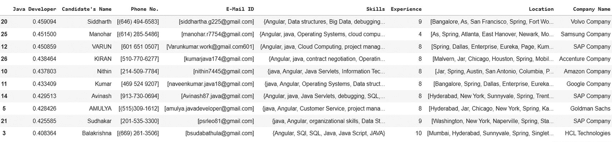

**图 5-19** 显示 Java 开发人员职位排名前 10 的简历表格。

# 可视化

现在我们已经找到了排名前 10 的简历，接下来为给定职位描述中匹配度最高的简历生成一个词云。这有助于招聘人员通过快速浏览与职位描述相关的简历，进一步验证候选人。

```python
# 为项目经理的最佳候选人创建并生成词云图像
wordcloud = WordCloud(width = 800, height = 500,background_color ='white'
,min_font_size = 10).generate(resumeTxt[17])
# 显示生成的图像
plt.figure(figsize = (20, 5), facecolor = None)
plt.imshow(wordcloud)
plt.axis("off")
plt.tight_layout(pad = 0)
plt.show()
```

图 5-20 显示了输出结果。


图 5-20

这是索引为 17 的简历的词云，因为它是项目经理职位的最佳匹配简历

该简历包含*管理*、*计划*、*范围*、*流程*、*交付*、*需求*和*风险*等词汇，这些都与项目经理的职位描述相关。这表明我们的模型表现良好。

```python
# 为商业分析师的最佳候选人创建并生成词云图像
wordcloud = WordCloud(width = 800, height = 500,background_color ='white',
min_font_size = 10).generate(resumeTxt[12])
# 显示生成的图像
plt.figure(figsize = (20, 5), facecolor = None)
plt.imshow(wordcloud)
plt.axis("off")
plt.tight_layout(pad = 0)
plt.show()
```

图 5-21 显示了输出结果。


图 5-21

索引为 12 的简历的词云。它是商业分析师职位的最佳匹配简历

```python
# 为 Java 开发人员的最佳候选人创建并生成词云图像
wordcloud = WordCloud(width = 800, height = 500,background_color ='white',
min_font_size = 10).generate(resumeTxt[23])
# 显示生成的图像
plt.figure(figsize = (20, 5), facecolor = None)
plt.imshow(wordcloud)
plt.axis("off")
plt.tight_layout(pad = 0)
plt.show()
```

图 5-22 显示了输出结果。


图 5-22

索引为 23 的简历的词云——Java 开发人员职位的最佳匹配简历

同样，这份简历中的重要词汇包括 Java、CSS、app、framework 等，这些都与 Java 开发人员的职位描述相关。

让我们通过最佳候选人简历的词云进行可视化和比较。模型根据职位描述识别出 Java 开发人员。

```python
# 创建 Java 开发人员职位描述的词云
wordcloud = WordCloud(width = 800, height = 500,background_color ='white',min_font_size = 10).generate(jds[0])
# 显示生成的图像
plt.figure(figsize = (20, 5), facecolor = None)
plt.imshow(wordcloud)
plt.axis("off")
plt.tight_layout(pad = 0)
plt.show()
```

图 5-23 显示了输出结果。


图 5-23

Java 开发人员职位描述的词云

哇，两个词云中有很多相似的技能。同样，你可以将其余的职位描述和各自的最佳匹配简历进行比较。

# 结论

我们实现了一个基于 AI 的简历筛选和入围模型的基础版本，并得到了合理的输出。请注意，在此基础上你还可以做很多事情来进一步扩展它。重点不在于获得完美的输出，而在于理解如何解决问题以及我们需要遵循的步骤。让我们继续学习后续章节中更令人兴奋的项目。
```