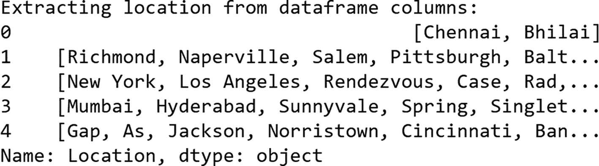
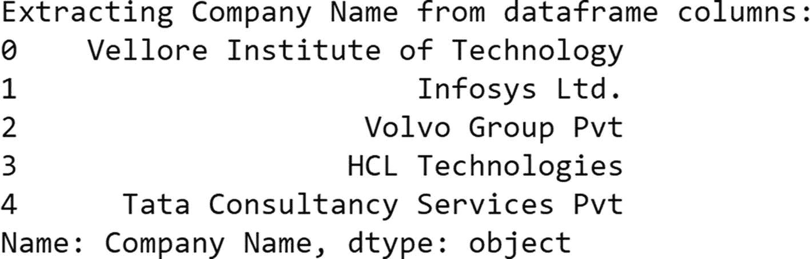

# 调用函数 `rm_number` 移除电话号码
`dt['Original'] = dt['Original Resume'].apply(lambda x: rm_number(x))`

现在我们来移除电子邮件地址。

```
# 定义移除电子邮件的函数，用于提取候选人的工作年限和姓名
def rm_email(text):
    try:
        email = None
        # compile 帮助我们定义用于在文本中匹配的模式
        pattern = re.compile('[\w\.-]+@[\w\.-]+')
        # findall 查找 compile 中定义的模式
        pt = pattern.findall(text)
        email = pt
        email = set(email)
        email = list(email)
        for i in email:
            # replace 会用另一个字符串替换给定的字符串
            text = text.replace(i, " ")
        return text
    except:
        pass
```

`dt['Original']` 包含了移除候选人电话号码和电子邮件地址后的所有简历。

```
# 调用函数 rm_email 来移除电子邮件
dt['Original'] = dt['Original'].apply(lambda x: rm_email(x))
print("从数据框列中提取数字：")
dt['Original'][0:5]
```

图 5-11 显示了输出结果。


**图 5-11** 展示了移除数字和电子邮件后的前五份简历

现在我们已经移除了电子邮件地址和电话号码，接下来使用词性标注来提取候选人姓名。关于 NLP 中词性标注的更多信息，请参考我们的书籍《自然语言处理实战：使用 Python 和机器学习与深度学习解锁文本数据》（Apress，2019）。

```
# 提取候选人姓名的函数
def person_name(text):
    # 将整个文本分词为句子
    Sentences = nltk.sent_tokenize(text)
    t = []
    for s in Sentences:
        # 将句子分词为单词
        t.append(nltk.word_tokenize(s))
    # 为每个单词标注词性
    words = [nltk.pos_tag(token) for token in t]
    n = []
    for x in words:
        for l in x:
            # match 将单词的词性标签与给定的标签进行匹配
            if re.match('[NN.*]', l[1]):
                n.append(l[0])
    cands = []
    for nouns in n:
        if not wordnet.synsets(nouns):
            cands.append(nouns)
    cand = ' '.join(cands[:1])
    return cand
```

`dt['Candidate\'s Name']` 包含了所有候选人的姓名。

```
# 调用函数 name 来提取候选人姓名
dt['Candidate\'s Name'] = dt['Original'].apply(lambda x: person_name(x))
print("从数据框列中提取姓名：")
dt['Candidate\'s Name'][0:5]
```

图 5-12 显示了输出结果。


**图 5-12** 展示了从简历中提取的前五位候选人姓名

现在，我们再次使用正则表达式来提取工作年限。

```
# 查找工作年限的函数
def exp(text):
    try:
        e = []
        p = 0
        text = text.lower()
        # 搜索与给定模式相似的文本字符串
        pt1 = re.search(r"(?:[a-zA-Z'-]+[^a-zA-Z'-]+){0,7}experience(?:[^a-zA-Z'-]+[a-zA-Z'-]+){0,7}", text)
        if(pt1 != None):
            # 将匹配到的所有字符串分组
            p = pt1.group()
        # 搜索与给定模式相似的文本字符串
        pt2 = re.search(r"(?:[a-zA-Z'-]+[^a-zA-Z'-]+){0,2}year(?:[^a-zA-Z'-]+[a-zA-Z'-]+){0,2}", text)
        if(pt2 != None):
            # 将匹配到的所有字符串分组
            p = pt2.group()
        # 搜索与给定模式相似的文本字符串
        pt3 = re.search(r"(?:[a-zA-Z'-]+[^a-zA-Z'-]+){0,2}years(?:[^a-zA-Z'-]+[a-zA-Z'-]+){0,2}", text)
        if(pt3 != None):
            # 将匹配到的所有字符串分组
            p = pt3.group()
        if(p == 0):
            return 0
        # findall 查找 compile 中定义的模式
        ep = re.findall('[0-9]{1,2}', p)
        ep_int = list(map(int, ep))
        # 此 for 循环用于过滤，然后追加包含工作年限的字符串
        for a in ep:
            for b in ep_int:
                if len(a) <= 2 and b < 30:
                    e.append(a)
        ep = ''.join(e[0])
        # findall 查找 compile 中定义的模式
        p1 = re.findall('[0-9]{1,2}.[0-9]{1,2}', p)
        exp = []
        if not p1:
            exp.append(ep)
            exp = ''.join(ep)
        else:
            exp.append(p1)
            exp = ''.join(p1)
    except:
        exp = 0
    return exp
```


`dt['Experience']` 包含所有候选人的工作年限。

```python
# Calling the function exp to extract the year of experience of the candidate
dt['Experience'] = dt['Original'].apply(lambda x: exp(x))
print("Extracting e-mail from dataframe columns:")
dt['Experience']
```

图 5-13 显示了输出结果。


**图 5-13** 显示从简历中提取的前五位候选人的工作年限。

使用预定义的技能集提取技能。

```python
# Importing a file of pre-defined skills & Converting DataFrame to list
skills = pd.read_excel('/content/drive/MyDrive/skills.xlsx')
skills = skills.values.flatten().tolist()
i = 0
skill = []
for z in skills:
    r = z.lower()
    skill.append(r)
    i += 1
```

将简历中的技能映射到预定义的技能集并进行提取。

```python
# Function to extract skills from candidate's resume
def skills(text):
    sw = set(nltk.corpus.stopwords.words('english'))
    tokens = nltk.tokenize.word_tokenize(text)
    # remove the punctuation
    ft = [w for w in tokens if w.isalpha()]
    # remove the stop words
    ft = [w for w in tokens if w not in sw]
    # generate bigrams and trigrams (like Machine Learning)
    n_grams = list(map(' '.join, nltk.everygrams(ft, 2, 3)))
    fs = set()
    # we text for each token in our skills database
    for token in ft:
        if token.lower() in skill:
            fs.add(token)
    # we text for each bigram and trigram in our skills database
    for ngram in n_grams:
        if ngram.lower() in skill:
            fs.add(ngram)
    return fs
```

`dt['Skills']` 包含所有候选人的技能。

```python
# Calling the function skills to extract the skills of a candidate
dt['Skills'] = dt['Original'].apply(lambda x: skills(x))
print("Extracting Person Name from dataframe columns:")
dt['Skills']
```

图 5-14 显示了输出结果。


**图 5-14** 显示从简历中提取的前五位候选人的技能。

对于招聘人员来说，在继续处理候选人资格之前，了解候选人来自哪个地点是另一个重要参数。让我们使用实体提取器来提取地点。

```python
# Function to extract Location
def location(text):
    place_entity = locationtagger.find_locations(text=text)
    return place_entity.cities
```

`dt['Location']` 包含所有候选人的地点信息。

```python
# Calling the function location to extract the location of a candidate
dt['Location'] = dt['Resume'].apply(lambda x: location(x))
print("Extracting cities from dataframe columns:")
dt['Location']
```

图 5-15 显示了输出结果。



**图 5-15** 显示从简历中提取的前五位候选人的地点。

类似地，让我们使用*命名实体识别*（NER）来提取公司名称。有关 NER 的更多信息，请参考我们的书籍 *Natural Language Processing Recipes: Unlocking Text Data with Machine Learning and Deep Learning Using Python*（Apress，2019）。

```python
# Function to extract Company name
def CompanyName(text):
    # for tagging each entity with its labels
    tokens = nlp(str(text))
    x = []
    # for loop for extracting company names
    for ent in tokens.ents:
        if ent.label_ == 'ORG':
            return ent.text
```

`dt['Company Name']` 包含所有候选人的公司信息。

```python
# Calling the function CompanyName to extract past companies of a candidate
dt['Company Name'] = dt['Original Resume'].apply(lambda x: CompanyName(x))
print("Extracting Person Name from dataframe columns:")
dt['Company Name']
```

图 5-16 显示了输出结果。



**图 5-16** 显示从简历中提取的前五位候选人的过往公司。

### 排名

现在我们已经提取了关于候选人的所有重要信息，我们将展示针对所有不同职位描述的候选人简历排名列表。现在，只需根据给定职位描述的相似度得分按降序排列，即可对项目进行排序。

以下是针对项目经理职位的最终结果。

```python
# Final result for Project Manager profile
pm = dt[['Project Manager', "Candidate's Name", 'Phone No.', 'E-Mail ID', 'Skills', 'Experience', 'Location', 'Company Name']]
pm = pm.sort_values(by='Project Manager', ascending=False)
pm[0:10]
```

图 5-17 显示了输出结果。


**图 5-17** 显示项目经理职位排名前 10 的简历表格。

`Project Manager` 列表示特定简历与项目经理职位描述的相似度得分。

以下是针对商业分析师职位的最终结果。

```python
# Final Result for Business Analyst
ba = dt[['Business Analyst', "Candidate's Name", 'Phone No.', 'E-Mail ID', 'Skills', 'Experience', 'Location', 'Company Name']]
ba = ba.sort_values(by='Business Analyst', ascending=False)
ba[0:10]
```

图 5-18 显示了输出结果。


**图 5-18** 显示商业分析师职位排名前 10 的简历表格。

`Business Analyst` 列表示特定简历与商业分析师职位描述的相似度得分。

以下是针对 Java 开发人员职位的最终结果。

```python
# Final Result for Java Developer
jad = dt[['Java Developer', "Candidate's Name", 'Phone No.', 'E-Mail ID', 'Skills', 'Experience', 'Location', 'Company Name']]
jad = jad.sort_values(by='Java Developer', ascending=False)
jad[0:10]
# Here "Java Developer" column indicates similarity score of that particular resume with Java Developer JD
```

图 5-19 显示了输出结果。


**图 5-19** 显示 Java 开发人员职位排名前 10 的简历表格。


### 可视化

现在我们已经找到了排名前 10 的简历，接下来为给定职位描述中匹配度最高的简历生成一个词云。这有助于招聘人员通过快速浏览与职位描述相关的简历，进一步验证候选人。

```
# 为项目经理的最佳候选人创建并生成词云图像
wordcloud = WordCloud(width = 800, height = 500,background_color ='white'
,min_font_size = 10).generate(resumeTxt[17])
# 显示生成的图像
plt.figure(figsize = (20, 5), facecolor = None)
plt.imshow(wordcloud)
plt.axis("off")
plt.tight_layout(pad = 0)
plt.show()
```

图 5-20 显示了输出结果。


图 5-20

这是索引为 17 的简历的词云，因为它是项目经理职位的最佳匹配简历

该简历包含*管理*、*计划*、*范围*、*流程*、*交付*、*需求*和*风险*等词汇，这些都与项目经理的职位描述相关。这表明我们的模型表现良好。

```
# 为商业分析师的最佳候选人创建并生成词云图像
wordcloud = WordCloud(width = 800, height = 500,background_color ='white',
min_font_size = 10).generate(resumeTxt[12])
# 显示生成的图像
plt.figure(figsize = (20, 5), facecolor = None)
plt.imshow(wordcloud)
plt.axis("off")
plt.tight_layout(pad = 0)
plt.show()
```

图 5-21 显示了输出结果。


图 5-21

索引为 12 的简历的词云。它是商业分析师职位的最佳匹配简历

```
# 为 Java 开发人员的最佳候选人创建并生成词云图像
wordcloud = WordCloud(width = 800, height = 500,background_color ='white',
min_font_size = 10).generate(resumeTxt[23])
# 显示生成的图像
plt.figure(figsize = (20, 5), facecolor = None)
plt.imshow(wordcloud)
plt.axis("off")
plt.tight_layout(pad = 0)
plt.show()
```

图 5-22 显示了输出结果。


图 5-22

索引为 23 的简历的词云——Java 开发人员职位的最佳匹配简历

同样，这份简历中的重要词汇包括 Java、CSS、app、framework 等，这些都与 Java 开发人员的职位描述相关。

让我们通过最佳候选人简历的词云进行可视化和比较。模型根据职位描述识别出 Java 开发人员。

```
# 创建 Java 开发人员职位描述的词云
wordcloud = WordCloud(width = 800, height = 500,background_color ='white',min_font_size = 10).generate(jds[0])
# 显示生成的图像
plt.figure(figsize = (20, 5), facecolor = None)
plt.imshow(wordcloud)
plt.axis("off")
plt.tight_layout(pad = 0)
plt.show()
```

图 5-23 显示了输出结果。


图 5-23

Java 开发人员职位描述的词云

哇，两个词云中有很多相似的技能。同样，你可以将其余的职位描述和各自的最佳匹配简历进行比较。

## 结论

我们实现了一个基于 AI 的简历筛选和入围模型的基础版本，并得到了合理的输出。请注意，在此基础上你还可以做很多事情来进一步扩展它。重点不在于获得完美的输出，而在于理解如何解决问题以及我们需要遵循的步骤。让我们继续学习后续章节中更令人兴奋的项目。

