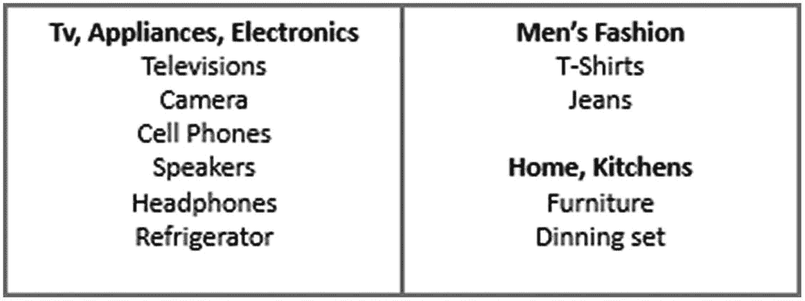
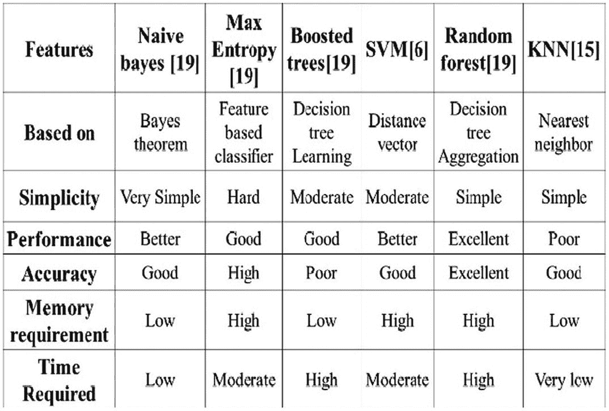
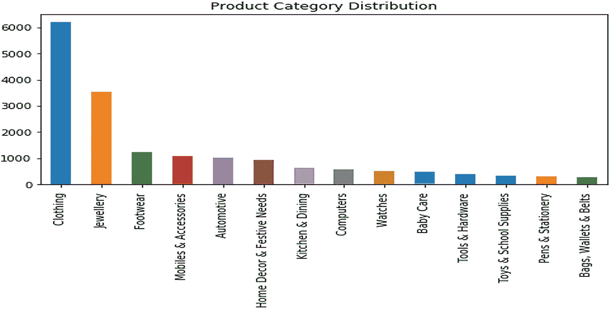
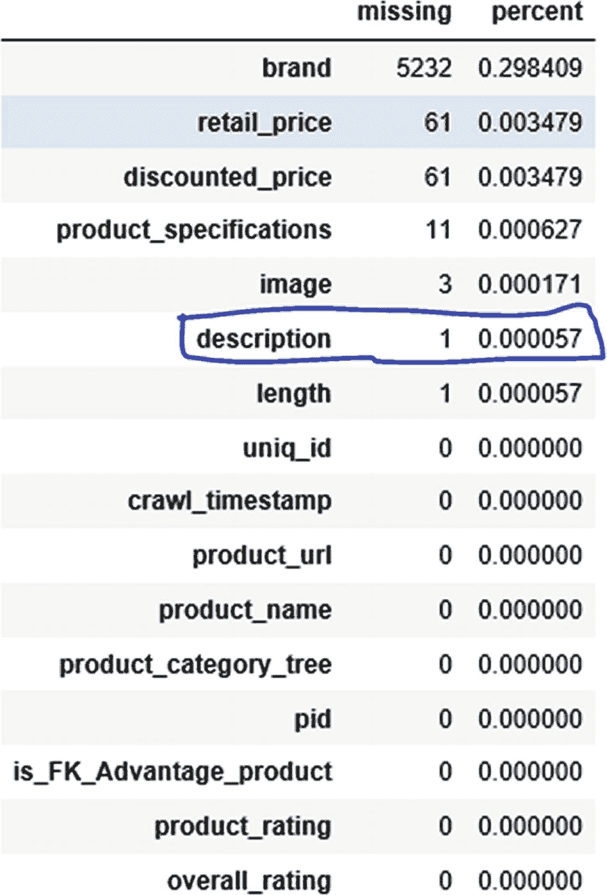
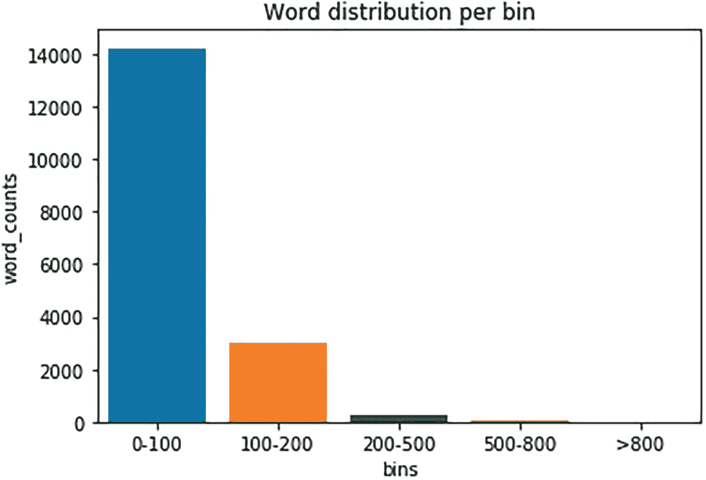
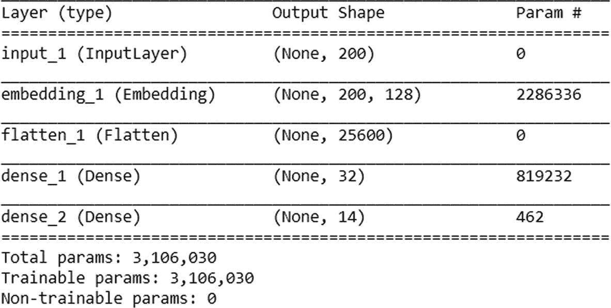
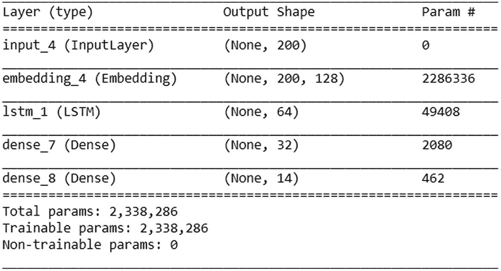
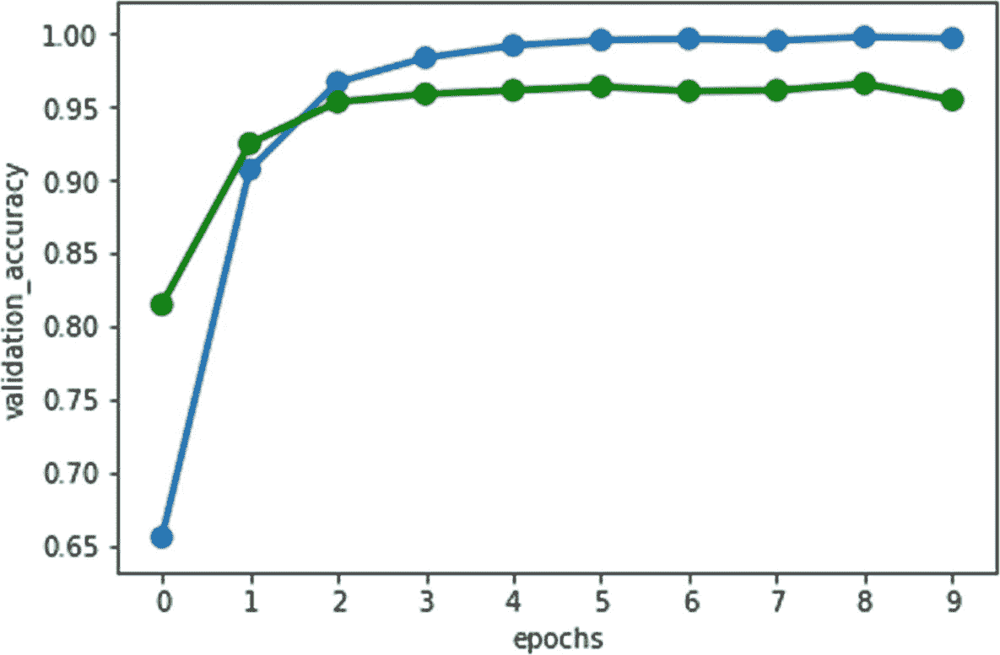
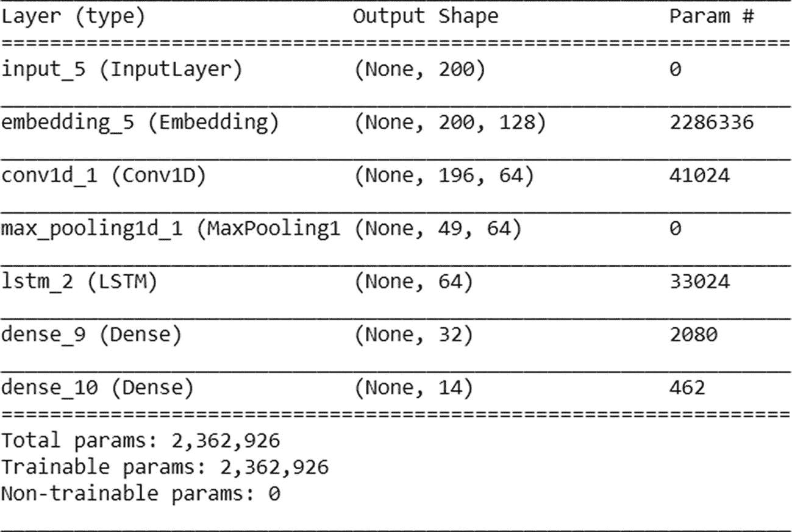
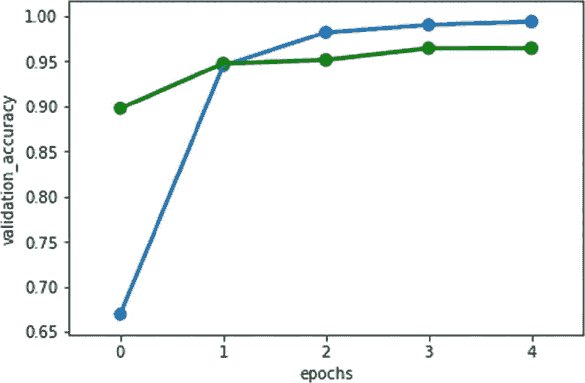

# 6. 使用深度学习创建电子商务产品分类模型

本章探讨使用深度学习进行多类别分类。你将了解不同的深度神经网络，如 CNN、RNN 和 LSTM，以及调整和评估它们的方法。

## 问题陈述

在电子商务和零售时代，最大的挑战是将特定产品或 SKU 标记到其所属类别。有数十亿件商品，手动标记效率低下且成本高昂。这项工作必须智能且快速地完成。每天都有新商品添加到网站或商店，检测其类别至关重要。机器学习和自然语言处理可以解决这个问题，并节省大量时间和金钱。

图 6-1 是一个类别层次结构的示例。有类别、子类别，以及其中的产品/商品。整个结构是分层的。



图 6-1 类别详情

在这个项目中，我们构建一个预测模型，对电子商务数据集中的产品进行分类。产品分类是一个监督分类问题，其中产品类别是目标类，特征是从产品描述或图像中提取的词汇。

目标是使用先进的机器学习和深度学习技术，以高精度成功地对产品类别进行分类。

## 方法与途径

产品分类是电子商务行业中的经典问题之一，有多种方法可以解决。让我们采用以下方法。

*   图像分类

*   文本分类

这个问题可以通过两种方式解决。每个映射到特定类别的商品都有对应的图像。我们需要训练深度学习算法，并在出现新产品图像时使用该模型预测其类别。但挑战在于，并非每次卖家都提供图像，这就会成为一个问题。

另一种方法是多类别文本分类。我们需要考虑将产品描述作为特征，产品类别作为标签来构建分类器，而不是使用图像。其思路是，产品描述包含特定产品的详细信息，并且描述中的文本可以在一定程度上预测其类别。

图 6-2 展示了使用文本分类方法对电子商务产品数据集进行分类所采用的方法。


图 6-2 流程图

该模型可以使用传统的机器学习算法（朴素贝叶斯分类器、逻辑回归、支持向量机分类器、随机森林分类器）和深度神经网络来构建。

图 6-3 展示了算法的类型。



图 6-3 算法类型

我们使用不同的深度神经网络算法来实现多类别文本分类，这些算法基于 Keras 顺序库，底层后端为 TensorFlow 框架。

### 环境设置

表 6-1 描述了本项目所使用的环境设置。

| 设置项 | 版本 |
| --- | --- |
| Anaconda Distribution | 5.2.0 |
| Python | 3.6.5 |
| Notebook | 5.5.0 |
| NumPy | 1.14.3 |
| pandas | 0.23.0 |
| scikit-learn | 0.19.1 |
| Matplotlib | 2.2.2 |
| Seaborn | 0.8.1 |
| NLTK | 3.3.0 |
| Tensorflow | 1.12.0 |
| Tensorboard | 1.12.0 |
| Keras Preprocessing | 1.0.5 |

我们使用的电子商务产品分类数据集包含 17,533 个观测值和 15 个属性，详见表 6-2。这是一个多分类问题，目标变量标记为`product_category_tree`，描述作为自变量（特征从文本中提取）。该数据集为免费开源数据集，可从[`https://data.world/promptcloud/product-details-on-flipkart-com`](https://data.world/promptcloud/product-details-on-flipkart-com)下载。

表 6-2 数据详情

| 属性名称 | 数据类型 |
| --- | --- |
| `uniq_id` | Object |
| `crawl_timestamp` | Object |
| `product_url` | object |
| `product_name` | object |
| `Pid` | object |
| `retail_price` | float64 |
| `discounted_price` | float65 |
| `image` | object |
| `is_FK_Advantage_product` | bool |
| `description` | object |
| `product_rating` | object |
| `overall_rating` | object |
| `brand` | object |
| `product_specifications` | object |
| `product_category_tree` | object |

## 理解数据

在对现有数据进行任何处理之前，建议先进行探索性数据分析。该过程包括数据可视化以便更好地理解、识别异常值和偏态预测变量。这些任务有助于你理解和检查数据，并识别数据集中的缺失值和无关信息。

让我们导入所需的库。

```python
# 数据操作
import numpy as np
import pandas as pd
### 可视化
import matplotlib.pyplot as plt
import seaborn as sns
import keras
from keras.preprocessing.text import Tokenizer
from keras.models import Sequential
from keras.layers import Dense
from keras.preprocessing.sequence import pad_sequences
from keras.layers import Input, Dense, Dropout, Embedding, LSTM, Flatten, Conv1D, MaxPooling1D
from keras.models import Model
from tensorflow.keras.utils import to_categorical
from keras.callbacks import ModelCheckpoint
from keras import layers
# 用于文本预处理的 NLP
import nltk
from nltk.corpus import stopwords
from wordcloud import WordCloud, STOPWORDS
# 用于数据集分割和评估指标
from sklearn.model_selection import train_test_split
from sklearn.metrics import accuracy_score
# 处理不平衡数据
from imblearn.over_sampling import SMOTE
# 在行内显示图表
%matplotlib inline
```

让我们导入数据并理解各列的含义。

```python
# 加载数据集
Prod_cat_data = pd.read_csv('ecommerce.csv')
Prod_cat_data.shape
```

输出如下。

```
(17533, 15)
```

该数据集包含 15 列和 17533 个观测值。实际上，我们可能拥有比这更多的产品。

```python
Prod_cat_data.info()
```

输出如下。

```
RangeIndex: 17533 entries, 0 to 17532
Data columns (total 15 columns):
uniq_id                    17533 non-null object
crawl_timestamp            17533 non-null object
product_url                17533 non-null object
product_name               17533 non-null object
product_category_tree      17533 non-null object
pid                        17533 non-null object
retail_price               17472 non-null float64
discounted_price           17472 non-null float64
image                      17530 non-null object
is_FK_Advantage_product    17533 non-null bool
description                17532 non-null object
product_rating             17533 non-null object
overall_rating             17533 non-null object
brand                      12301 non-null object
product_specifications     17522 non-null object
dtypes: bool(1), float64(2), object(12)
```

该电子商务数据集包含 15 个属性；在这些列中，我们仅提取了以下元素用于进一步分析：`description`和`product_category_tree`。其余列不用于构建文本分类模型。因此，仅`description`列被认为是有用的。

### 探索性数据分析

在继续之前，让我们查看每个类别的分布情况。

```python
Prod_cat_data['product_category_tree'].value_counts()
```

输出如下。

```
Clothing                       6198
Jewelry                        3531
Footwear                       1227
Mobiles & Accessories          1099
Automotive                     1012
Home Decor & Festive Needs      929
Kitchen & Dining                647
Computers                       578
Watches                         530
Baby Care                       483
Tools & Hardware                391
Toys & School Supplies          330
Pens & Stationery               313
Bags, Wallets & Belts           265
Name: product_category_tree, dtype: int64
```

让我们绘制产品类别分布图，以便更好地可视化和理解。

```python
fig, ax = plt.subplots(figsize=[8,4], nrows=1, ncols=1)
Prod_cat_data['product_category_tree'].value_counts().plot(ax=ax, kind='bar', title='Product Category Distribution')
```

图 6-4 展示了产品类别分布。



图 6-4 输出

大多数产品属于服装或珠宝类别，其次是鞋类、手机及配件。箱包、钱包和腰带类别的产品非常少。

### 数据预处理

在本项目中，我们必须执行某些数据预处理步骤，包括数据清洗、准备、转换和降维。

首先，我们进行常规的数据集级别清洗，然后进入文本预处理阶段。

让我们检查`description`列中是否存在缺失值。

```python
# 每列缺失值的数量
missing = pd.DataFrame(Prod_cat_data.isnull().sum()).rename(columns = {0: 'missing'})
# 创建缺失值百分比
missing['percent'] = missing['missing'] / len(Prod_cat_data)
# 按降序排列，以便在顶部看到最高计数
missing.sort_values('percent', ascending = False)
```

图 6-5 是上述代码的输出结果。



图 6-5 输出

`description`特征存在一个缺失值。让我们从数据集中删除该缺失值观测。

```python
# 删除 description 中的缺失值
Prod_cat_data=Prod_cat_data[pd.notnull(Prod_cat_data['description'])]
```

让我们查看词分布，以了解语料库中存在哪些类型的词。

```python
# 在文本预处理前，添加新列记录描述中的词数
Prod_cat_data['no_of_words'] = Prod_cat_data.description.apply(lambda a : len(a.split()))bins=[0,50,75, np.inf]
Prod_cat_data['bins']=pd.cut(Prod_cat_data.no_of_words, bins=[0,100,300,500,800, np.inf], labels=['0-100', '100-200', '200-500','500-800' ,'>800'])
words_distribution = Prod_cat_data.groupby('bins').size().reset_index().rename(columns={0:'word_counts'})
sns.barplot(x='bins', y='word_counts', data=words_distribution).set_title("Word distribution per bin")
```

图 6-6 展示了词的分布情况。



图 6-6 输出

大多数描述包含少于 200 个词。超过 80%的描述包含少于 100 个词。

## 文本预处理

您已经看到了文本预处理为许多文本相关任务带来的价值。现在让我们进入实现环节。

以下是文本预处理前的数据。

```python
Prod_cat_data['description'][4]
```

以下是输出结果。

```
'Key Features of dilli bazaaar Bellies, Corporate Casuals, Casuals Material: Fabric Occasion: Ethnic, Casual, Party, Formal Color: Pink Heel Height: 0,Specifications of dilli bazaaar Bellies, Corporate Casuals, Casuals General Occasion Ethnic, Casual, Party, Formal Ideal For Women Shoe Details Weight 200 g (per single Shoe) - Weight of the product may vary depending on size. Heel Height 0 inch Outer Material Fabric Color Pink'
```

```python
#### 移除标点符号
Prod_cat_data['description'] = Prod_cat_data['description'].str.replace(r'[^\w\d\s]', ' ')
# 将术语之间的空白替换为单个空格
Prod_cat_data['description'] = Prod_cat_data['description'].str.replace(r'\s+', ' ')
# 移除开头和结尾的空白
Prod_cat_data['description'] = Prod_cat_data['description'].str.replace(r'^\s+|\s+?$', '')
#### 转换为小写
Prod_cat_data['description'] = Prod_cat_data['description'].str.lower()
# 将价格等数字替换为 'numbr'
Prod_cat_data['description'] = Prod_cat_data['description'].str.replace(r'\d+(\.\d+)?', 'numbr')
Prod_cat_data['description'][4]
```

以下是输出结果。

### 移除停用词

停用词从 `NLTK` 库中导入，并从描述中移除。停用词有两种类型。

- 通用停用词，如 `an` 和 `in`，无论领域如何都会出现。文本来源无关紧要。
- 还有少量领域特定的停用词。例如，`buy`、`com` 和 `cash` 可能只出现在某些特定领域，如电子商务和零售。我们也需要移除它们。

```python
#### 移除停用词
stop = stopwords.words('english')
pattern = r'\b(?:{})\b'.format('|'.join(stop))
Prod_cat_data['description'] = Prod_cat_data['description'].str.replace(pattern, '')
Prod_cat_data['description'] = Prod_cat_data['description'].str.replace(r'\s+', ' ')# 移除单个字符
Prod_cat_data['description'] = Prod_cat_data['description'].apply(lambda a: " ".join(a for a in a.split() if len(a)>1))
Prod_cat_data['description'][4]
```

以下是输出结果。

```
'key features dilli bazaaar bellies corporate casuals casuals material fabric occasion ethnic casual party formal color pink heel height numbr specifications dilli bazaaar bellies corporate casuals casuals general occasion ethnic casual party formal ideal women shoe details weight numbr per single shoe weight product may vary depending size heel height numbr inch outer material fabric color pink'
```

让我们在描述上绘制词云，以了解出现次数最多的词汇。

```python
wordcloud = WordCloud(background_color="white", width = 800, height = 400).generate(' '.join(Prod_cat_data['description']))
plt.figure(figsize=(15,8))
plt.imshow(wordcloud)
plt.axis("off")
plt.show()
```

图 6-7 展示了描述的词云，其中突出了频繁出现的词汇。


图 6-7

输出

语料库中存在大量与领域相关的词汇，它们对任务没有价值。例如，单词 `rs` 是印度货币，出现在大多数文档中，但并无用处。让我们移除这些领域相关的停用词，并再次绘制。

```python
#### 从描述中移除领域相关的停用词
specific_stop_words = ["numbr", "rs","flipkart","buy","com","free","day","cash","replacement","guarantee","genuine","key","feature","delivery","products","product","shipping", "online","india","shop"]
Prod_cat_data['description'] = Prod_cat_data['description'].apply(lambda a: " ".join(a for a in a.split() if a not in specific_stop_words))
```

以下是移除领域相关停用词后的词云。

```python
# 移除领域相关停用词后的词云
wordcloud = WordCloud(background_color="white", width = 800, height = 400).generate(' '.join(Prod_cat_data['description']))
plt.figure(figsize=(15,8))
plt.imshow(wordcloud)
plt.axis("off")
plt.show()
```

图 6-8 展示了移除领域相关停用词后的词云。


图 6-8

输出

请注意，存在与产品类别相关的词汇。

数据清理完成后，我们可以继续进行特征工程。

### 特征工程

为了构建文本分类模型，我们首先需要将文本数据转换为特征。有关特征工程的详细说明，请参考第 1 章。在本项目中，我们只考虑一个特征：文本预处理后从描述中提取的词汇，并将其用作词汇表。

我们使用深度学习算法来构建分类器，并且需要相应地执行特征提取。我们使用 `Keras` 的 `Tokenizer` 函数来生成特征。我们将 `max_length` 设置为 200，这意味着我们只为分类器考虑 200 个特征。这个数字也决定了准确率，理想数值可以通过超参数调优获得。

```python
MAX_LENGTH= 200
prod_tok = Tokenizer()
prod_tok.fit_on_texts(Prod_cat_data['description'])
clean_description = prod_tok.texts_to_sequences(Prod_cat_data['description'])
# 填充
X = pad_sequences( clean_description, maxlen= max_length)
```

与特征类似，我们也需要转换目标变量。我们使用标签编码来实现。使用的函数是来自 `sklearn` 的 `LabelEncoder`。

```python
# 目标变量的标签编码器
from sklearn.preprocessing import LabelEncoder
num_class = len(np.unique(Prod_cat_data.product_category_tree.values))
y = Prod_cat_data['product_category_tree'].values
encoder = LabelEncoder()
encoder.fit(y)
y = encoder.transform(y)
```

### 训练-测试集划分

数据被分为两部分：一部分用于训练模型，另一部分用于评估模型。

导入来自 `sklearn.model_selection` 的 `train_test_split` 库来划分数据框。

```python
# 训练测试集划分
from sklearn.model_selection import train_test_split
indepentent_features_build, indepentent_features_valid, depentent_feature_build, depentent_feature_valid = train_test_split(X, y, test_size=0.2, random_state=1) #训练集 80%，测试集 20%
print(indepentent_features_build.shape)
print(indepentent_features_valid.shape)
print(depentent_feature_build.shape)
print(depentent_feature_valid.shape)
```

以下是输出结果。

```
(14025, 200)
(3507, 200)
(14025,)
(3507,)
```

### 模型构建

以下分类器列表用于创建各种分类模型，这些模型可进一步用于预测。

- 简单基线人工神经网络（ANN）
- [循环神经网络](http://adventuresinmachinelearning.com/recurrent-neural-networks-lstm-tutorial-tensorflow/)（RNN-LSTM）
- 卷积神经网络

#### 人工神经网络

让我们从使用不平衡数据的基础神经网络开始。你在第 1 章学习了神经网络的功能。我们针对这个多分类问题实现相同的网络。我们将同时使用不平衡数据和平衡数据，看看哪种表现更好。

以下是神经网络的架构。输入神经元是之前定义的 `max_length`。然后是一个嵌入层或隐藏层，默认使用线性激活函数，但我们也可以使用 `ReLU`。最后，由于有 14 个类别，因此有一个包含 14 个神经元的 `softmax` 层。我们使用 `rmsprop` 优化器，并将分类交叉熵作为损失函数。

```python
model_inp = Input(shape=(MAX_LENGTH, ))
object_layer = Embedding(vocab_size,100,input_length=MAX_LENGTH)(model_inp)
a = Flatten()(object_layer)
a = Dense(30)(a)
# 默认激活函数是线性函数，我们可以使用 relu。
model_pred = Dense(num_class, activation='softmax')(a)
output = Model(inputs=[model_inp], outputs=model_pred)
output.compile(optimizer='rmsprop',
loss='categorical_crossentropy',
metrics=['acc'])
output.summary()
```

图 6-9 展示了人工神经网络的输出。



图 6-9

输出

```python
filepath="output_ANN.hdf5"
x = ModelCheckpoint(filepath, monitor='val_acc', verbose=1, save_best_only=True, mode='max')
# 拟合模型
out = output.fit([indepentent_features_build], batch_size=64,
y=to_categorical(depentent_feature_build), verbose=1, validation_split=0.25,
shuffle=True, epochs=5, callbacks=[x])
# 预测
output_pred = output.predict(indepentent_features_valid)
output_pred = np.argmax(output_pred, axis=1)
accuracy_score(depentent_feature_valid, output_pred)
```

以下是输出结果。

```
0.974337040205303
```

该网络在不平衡数据上达到了 97.4%的准确率。让我们在平衡数据上尝试相同的网络，看看结果是否有任何改进。

#### 长短期记忆网络：循环神经网络

我们尝试了无法捕捉数据序列的普通神经网络。现在让我们尝试一种长短期记忆网络，它在训练模型时也能捕捉序列信息。这非常适合文本数据，因为文本数据是序列化的。

以下是神经网络的架构。输入神经元是我们之前定义的 `max_length`。一个 `LSTM` 层紧随嵌入层之后。最后，有一个包含 14 个神经元的 `softmax` 层。我们使用 `rmsprop` 优化器，并将分类交叉熵作为损失函数。

```python
model_inp = Input(shape=(MAX_LENGTH, ))
# 定义嵌入层
object_layer = Embedding(vocab_size,100,input_length=MAX_LENGTH)(model_inp)
# 添加 LSTM 层
a = LSTM(60)(object_layer)
# 添加全连接层
a = Dense(30)(a) # 默认激活函数是线性函数，我们可以使用 relu。
# 最终层
model_pred = Dense(num_class, activation='softmax')(a)
output = Model(inputs=[model_inp], outputs=model_pred)
# 编译
output.compile(optimizer='rmsprop',loss='categorical_crossentropy',metrics=['acc'])
output.summary()
```

图 6-10 展示了 LSTM 的输出。



图 6-10

输出

```python
filepath="output_LSTM.hdf5"
# 模型检查点
x = ModelCheckpoint(filepath, monitor='val_acc', verbose=1, save_best_only=True, mode='max')
# 拟合
out = output.fit([indepentent_features_build], batch_size=64, y=to_categorical(depentent_feature_build), verbose=1, validation_split=0.25,
shuffle=True, epochs=5, callbacks=[x])
output.load_weights('output_LSTM.hdf5')
# 在验证数据上进行预测
output_pred = output.predict(indepentent_features_valid)
output_pred = np.argmax(output_pred, axis=1)
# 评分
accuracy_score(depentent_feature_valid, output_pred)
```

以下是输出结果。

```
0.9714856002281153
```

该 LSTM 网络在不平衡数据上达到了 97.1%的准确率。让我们看看随着轮次增加，准确率和验证准确率如何变化。

```python
dfaccuracy = pd.DataFrame({'Number of epoch':out.epoch, 'Model hist': out.history['acc'], 'Model Perd': out.history['val_acc']})
# 训练准确率折线图
g = sns.pointplot(x="Number of epoch", y="Model hist", data=dfaccuracy, fit_reg=False)
# 测试准确率折线图
g = sns.pointplot(x="Number of epoch", y="Model Perd", data=dfaccuracy, fit_reg=False, color='Red')
```

图 6-11 展示了随着 LSTM 轮次增加，准确率和验证准确率如何变化。



图 6-11

输出

#### 卷积神经网络

我们要构建的最后一种网络是卷积神经网络。这类网络主要用于图像处理。但最近的趋势表明，如果使用正确的参数，CNN 在文本数据上也能表现良好。让我们看看它在这种情况下表现如何。

以下是神经网络的架构。输入神经元是我们之前定义的 `max_length`。其他部分保持不变。只是在嵌入层和 `LSTM` 层之间增加了卷积层和最大池化层，最后是一个包含 14 个神经元的 `softmax` 层。我们使用 `rmsprop` 优化器，并将分类交叉熵作为损失函数。

```
model_inp = Input(shape=(MAX_LENGTH, ))
# 定义层
object_layer = Embedding(vocab_size,100,input_length=MAX_LENGTH)(model_inp)
# 卷积层
a = Conv1D(60, 10)(object_layer) # 默认激活函数是线性函数，我们可以使用 relu。
# 添加池化层
a = MaxPooling1D(pool_size=2)(a)
# 添加 LSTM
a = LSTM(60)(a)
a = Dense(30)(a)
# 最终层
model_pred = Dense(num_class, activation='softmax')(a)
output = Model(inputs=[model_inp], outputs=model_pred)
# 编译
output.compile(optimizer='rmsprop',loss='categorical_crossentropy',metrics=['acc'])
output.summary()
```

图 6-12 展示了 CNN 的输出。



图 6-12

输出

```
filepath="output_CNN.hdf5"
x = ModelCheckpoint(filepath, monitor='val_acc', verbose=1, save_best_only=True, mode='max')
out = output.fit([indepentent_features_build], batch_size=64, y=to_categorical(depentent_feature_build), verbose=1, validation_split=0.25,
shuffle=True, epochs=5, callbacks=[x])
output.load_weights('output_CNN.hdf5')
predicted = output.predict(indepentent_features_valid)
predicted = np.argmax(predicted, axis=1)
accuracy_score(depentent_feature_valid, predicted)
```

以下是输出结果。

```
0.9663530082691759
```

该 CNN 网络在不平衡数据上达到了 96.6%的准确率。让我们看看随着轮次增加，准确率和验证准确率如何变化。

```
dfaccuracy = pd.DataFrame({'epochs':out.epoch, 'accuracy': out.history['acc'], 'validation_accuracy': out.history['val_acc']})
# 绘图
g = sns.pointplot(x="epochs", y="accuracy", data=dfaccuracy, fit_reg=False)
# 绘制测试准确率
g = sns.pointplot(x="epochs", y="validation_accuracy", data=dfaccuracy, fit_reg=False, color='green')
```

图 6-13 展示了随着 CNN 轮次增加，准确率和验证准确率如何变化。



图 6-13

输出

### 评估模型

为了评估分类器的性能，*k 折交叉验证* 被广泛使用。

这里将数据划分为 *k* 个大小相等的子集。对于每次 *k* 迭代，使用 *k*-1 个子集进行训练，剩余的一个子集用于评估模型。每次迭代的误差都用于计算整体误差估计值。

这种方法的优势在于，每个观测值在训练数据和测试数据中至少出现一次。

#### 超参数调优

*随机搜索* 是一种参数调优方法，它会为网格中指定的每种算法参数组合构建并评估一个模型。

我们使用 Keras 分类器和随机搜索交叉验证方法对 CNN 算法进行了超参数调优。

以下是超参数调优的步骤。

```
def build(num_filters, kernel_size, vocab_size, embedding_dim, maxlength):
output = Sequential()
#add embeddings
output.add(layers.Embedding(vocab_size, embedding_dim, input_length=maxlength))
output.add(layers.Conv1D(num_filters, kernel_size)) #default activation function is linear, we can make use of relu.
output.add(layers.GlobalMaxPooling1D())
output.add(layers.Dense(20))
#default activation function is linear, we can make use of relu.
output.add(layers.Dense(num_class, activation='softmax'))
output.compile(optimizer='rmsprop',loss='categorical_crossentropy',metrics=['accuracy'])
return output
```

运行随机搜索。

```
from keras.wrappers.scikit_learn import KerasClassifier
from sklearn.model_selection import RandomizedSearchCV
#build the models with parameters
output = KerasClassifier(build_fn=build,
epochs=5, batch_size=64,
verbose=False)
out = RandomizedSearchCV(estimator=output, param_distributions={'num_filters': [30, 60, 100],'kernel_size': [4, 6, 8],'embedding_dim': [40],'vocab_size': [17862],
'maxlength': [180]},cv=4, verbose=1, n_iter=5)
out_result = out.fit(indepentent_features_build, depentent_feature_build)
```

找到模型的最佳参数。

```
# Evaluate testing set
test_accuracy = out.score(indepentent_features_valid, depentent_feature_valid)
print(out_result.best_params_)
```

输出如下。

```
{'vocab_size': 16553, 'num_filters': 128, 'maxlength': 200, 'kernel_size': 5, 'embedding_dim': 50}
print(out_result.best_score_)
```

输出如下。

```
0.980473461948488
```

运行随机搜索交叉验证后，我们发现具有以下参数的模型达到了最佳准确率 98.04%。

#### 结果

准确率指标用于评估模型的性能。我们从 ANN 开始构建了多种类型的神经网络。随后，我们使用了 LSTM 网络，最后使用了 CNN。让我们比较所有准确率，并选择准确率最高的模型。表 6-3 汇总了所有结果。

表 6-3.

输出摘要

| 分类器 | 准确率 |
| --- | --- |
| 简单基线 ANN | 0.97434 |
| RNN-LSTM | 0.97149 |
| 一维 CNN | 0.96635 |
| 超参数调优后的一维 CNN | **0.98047** |

与其他模型相比，具有以下参数的一维 CNN 模型表现更佳。

*   词汇表大小为 16553。

*   CNN 的滤波器数量为 128。

*   最大输入长度或特征数为 200。

*   卷积核大小为 5。

*   嵌入层维度为 50。

## 总结

本章使用不同的深度学习算法实现了多类分类。

从已实现的项目中，您了解到一维卷积神经网络的性能优于简单的基线 ANN 模型。您可以尝试使用预训练嵌入（如 word2vec 和 GloVe）以获得更准确的结果。您可以应用更多的文本预处理步骤，例如词形还原、拼写纠正等。本章仅使用了“描述”特征，但您也可以使用产品规格来评估其是否能增加更多价值。