# 7. 预测 Quora 中的重复问题

Quora 是一个供人们联系并获取各种主题知识的问答平台。任何人都可以提问，任何人都可以回答这些问题，从而带来多样化的观点。

## 问题陈述

每天都有大量问题涌入，并有成千上万的人回答它们。问题在字面上或意图上很可能相同，这会在系统中产生不必要的重复问题和答案。这可能导致数据量庞大，并影响用户体验。

例如，“谁是当今世界上最好的板球运动员？”和“目前，哪位板球运动员排名世界第一？”它们是同一个问题，但提问方式不同。因此，识别给定的问题是否相似是问题的主要目标。如果我们能借助 NLP 解决这个问题，就能显著减少重复并提升用户体验。

## 方法

这是一个直接的句子比较 NLP 任务。我们使用无监督和有监督两种方法来解决这个问题。

### 无监督学习

让我们使用各种预训练模型，如 `Sentence-BERT`、`GPT` 和 `doc2vec` 来解决这个问题。图 7-1 是无监督学习过程的流程图。

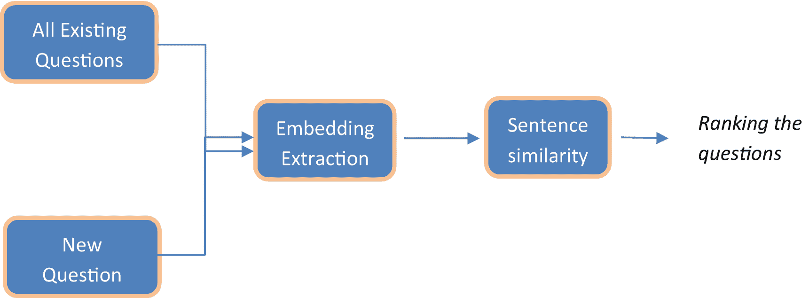

图 7-1

无监督学习流程

以下是无监督学习的步骤。

1.  将问题 1 和问题 2 列垂直堆叠，以获取所有问题的嵌入。

2.  使用各种句子嵌入技术（如 `Sentence-BERT`、`OpenAI GPT` 和 `doc2vec`）对问题进行编码。

3.  使用输入向量与原始数据集之间的余弦相似度查找相似问题，并返回余弦相似度得分最高的前 N 个问题。

### 有监督学习

在有监督学习中，我们训练深度学习分类器来预测两组问题是否相似。输出是两个问题之间的概率得分。图 7-2 说明了该过程的流程。

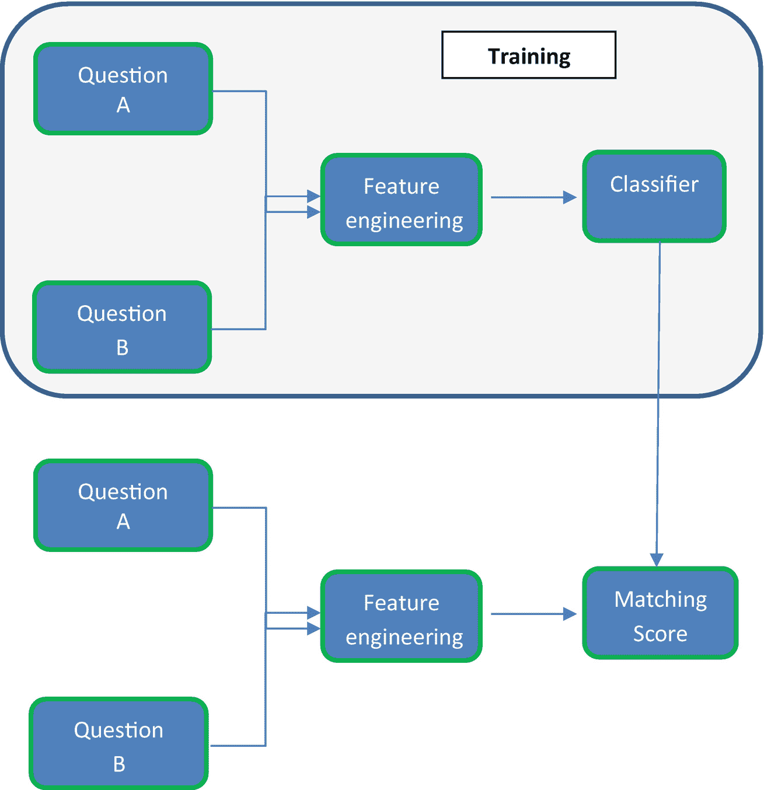

图 7-2

有监督学习流程

## 数据集

我们使用来自 Kaggle 的 Quora 问题对数据集。您可以从 [`www.kaggle.com/c/quora-question-pairs/data`](http://www.kaggle.com/c/quora-question-pairs/data) 下载数据。

数据包含 ID 和问题。它还包含一个标签，用于指示两个问题是否为重复问题。如果是重复问题，则值为 1，否则为 0。

图 7-3 显示了输出。

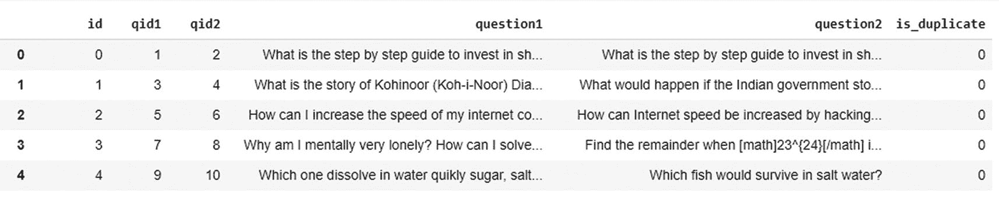

图 7-3

输出

现在我们已经理解了问题陈述，让我们进入实现环节。

## 实现：无监督学习

### 数据准备

首先导入所需的库。

```python
import pandas as pd
import numpy as np
import os
import scipy
import string
import csv
#import nltk
import nltk
nltk.download('stopwords')
nltk.download('punkt')
nltk.download('wordnet')
#immport tokenize, stopwords
from nltk.tokenize import word_tokenize
from nltk.corpus import stopwords
from nltk.stem import WordNetLemmatizer
#import warnings
import warnings
#import sklearn and matplotlib
from sklearn import preprocessing
import spacy
import matplotlib.pyplot as plt
import plotly.graph_objects as go
#import warning
warnings.filterwarnings('ignore')
import re
#import the data
train=pd.read_csv('quora_train.csv')
train1=train.copy()
train.head()
```

图 7-4 展示了输出结果。


图 7-4

输出

```python
#append the both set of questions in dataset
Q1=train1.iloc[:,[2,4]]
Q2=train1.iloc[:,[1,3]]
df = pd.DataFrame( np.concatenate( (Q2.values, Q1.values), axis=0 ) )
df.columns = ['id','question' ]
df
```

图 7-5 展示了输出结果。

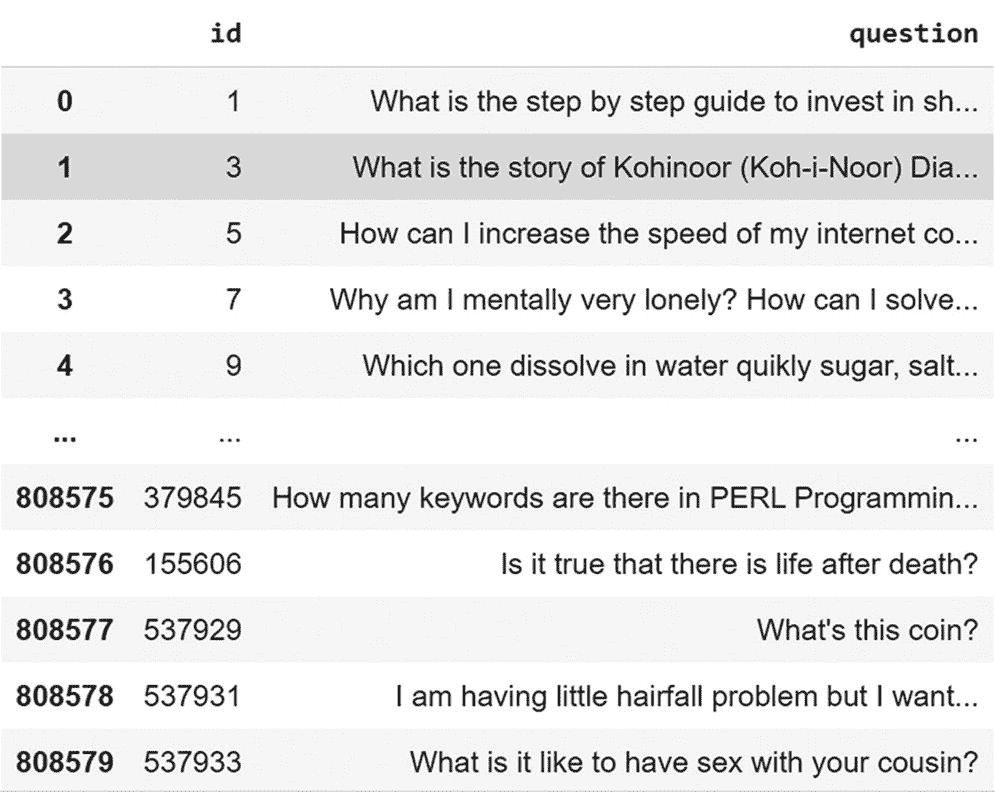

图 7-5

输出

### A. 使用 `doc2vec` 构建向量

`doc2vec` 与 `word2vec` 类似。在 `word2vec` 中，每个单词或词元都有一个向量。但如果我们需要一个句子或文档的向量，则需要计算所有单词向量的平均值。在这个过程中，文档可能会丢失一些信息或上下文。

因此，我们转向 `doc2vec`，其中每个文档都作为唯一输入传递给模型，并找到其向量。

让我们导入所需的库并开始构建模型。

```python
# importing doc2vec from gensim
from gensim.models.doc2vec import Doc2Vec, TaggedDocument
# tokenizing the sentences
tok_quora=[word_tokenize(wrd) for wrd in df.question]
#creating training data
Quora_training_data=[TaggedDocument(d, [i]) for i, d in enumerate(tok_quora)]
```

以下是输出结果。

```
[TaggedDocument(words=['What', 'is', 'the', 'step', 'by', 'step', 'guide', 'to', 'invest', 'in', 'share', 'market', 'in', 'india', '?'], tags=[0]),
TaggedDocument(words=['What', 'is', 'the', 'story', 'of', 'Kohinoor', '(', 'Koh-i-Noor', ')', 'Diamond', '?'], tags=[1]),
TaggedDocument(words=['How', 'can', 'I', 'increase', 'the', 'speed', 'of', 'my', 'internet', 'connection', 'while', 'using', 'a', 'VPN', '?'], tags=[2]),……
# trainin doc2vec model
doc_model = Doc2Vec(Quora_training_data, vector_size = 100, window = 5, min_count = 3, epochs = 25)
```

让我们构建一个函数来获取每个句子的嵌入向量。同时，确保我们只使用句子中存在于词汇表中的单词。

```python
#function to get vectors from model
def fetch_embeddings(model,tokens):
tokens = [x for x in word_tokenize(tokens) if x in list(doc_model.wv.vocab)]
#if words is not present then vector becomes zero
if len(tokens)>=1:
return doc_model.infer_vector(tokens)
else:
return np.array([0]*100)
#Storing all embedded sentence vectors in a list
#defining empty list and iterating through all the questions
doc_embeddings=[]
for w in df.question:
doc_embeddings.append(list(fetch_embeddings(doc_model, w)))
#conveting it into array
doc_embeddings=np.asarray(doc_embeddings)
#shape
Shape=(10000,100)
#Output:
```

图 7-6 展示了输出结果。

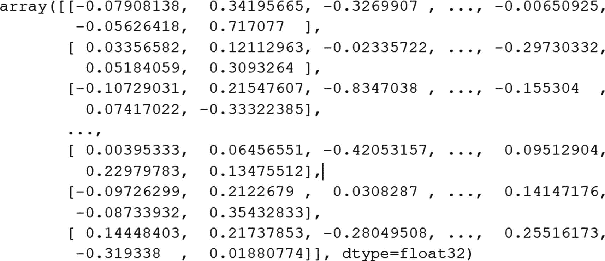

图 7-6

输出

### B. 使用 `BERT` 模型的句子变换器

`Sentence-BERT` 是 `BERT` 针对句子的改进版本。在这个新模型中，传入两个句子以获取嵌入，并在其之上构建一个层。它最终使用[孪生网络](https://arxiv.org/abs/1908.10084)来寻找相似度。

图 7-7 展示了两个句子通过 `BERT` 和池化层，最终找到相似度的过程。

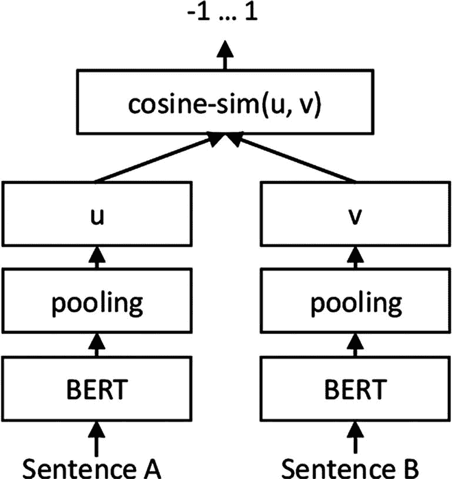

图 7-7

来自 `https.//arxiv.org/pdf/1908.10084.pdf` 的 `SBERT` 架构

那么，让我们来实现 `SBERT`。

```python
#install SBERT
!pip install sentence-transformers
#import the SBERT
from sentence_transformers import SentenceTransformer
#let use paraphrase-MiniLM-L12-v2 pre trained model
sbert_model = SentenceTransformer('paraphrase-MiniLM-L12-v2')
x=[i for i in df.question]
#lets get embeddings for each question
sentence_embeddings_BERT= sbert_model.encode(x)
#lets see the shape
sentence_embeddings_BERT.shape
(10000, 384)
```

嵌入的形状是 `(10000, 384)`，因为它生成 384 维的嵌入。以下是输出结果。

```python
sentence_embeddings_BERT
```

图 7-8 展示了输出结果。

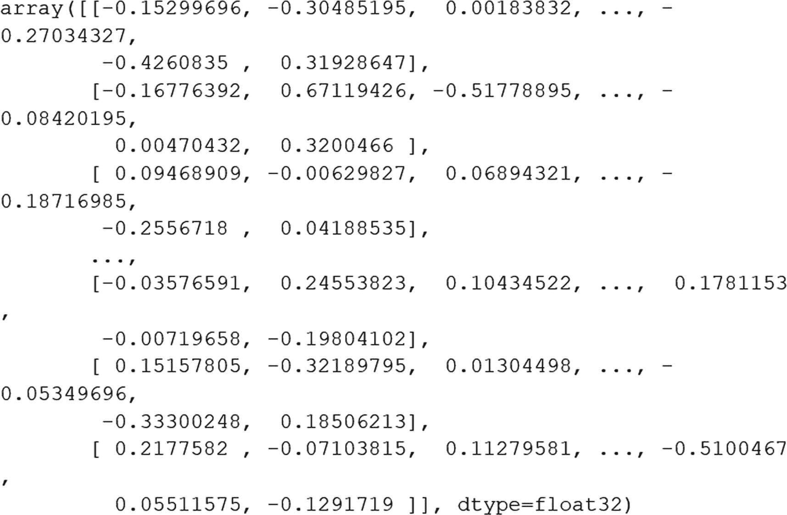

图 7-8

输出

### C. `GPT`

`GPT`（生成式预训练变换器）模型来自 `OpenAI`。它是一种非常有效的语言模型，可以执行诸如摘要和问答系统等多种任务。

图 7-9 展示了 `GPT` 架构。

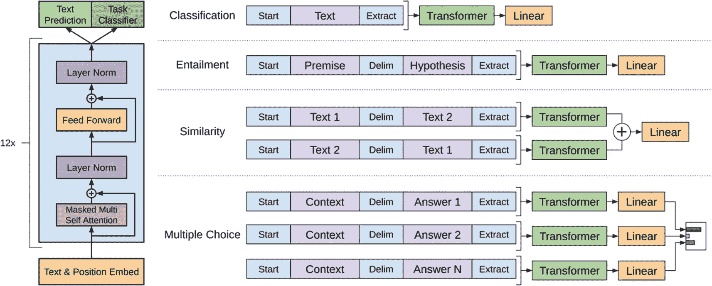

图 7-9

`GPT` 架构

```python
#Installing the GPT
!pip install pytorch_pretrained_bert
#Importing required tokenizer, OpenAiGPT model
import torch
from pytorch_pretrained_bert import OpenAIGPTTokenizer, OpenAIGPTModel
#initializing the tokenizer
tok_gpt= OpenAIGPTTokenizer.from_pretrained('openai-gpt')
#Initializing the gpt Model
model_gpt= OpenAIGPTModel.from_pretrained('openai-gpt')
model_gpt.eval()
```

现在我们已经导入了 `GPT` 模型，让我们编写一个函数来获取所有问题的嵌入。

```python
def Fetch_gpt_vectors(question):
#tokenize words
words = word_tokenize(question)
emb = np.zeros((1,768))
#get vectore for each word
for word in words:
w= tok_gpt.tokenize(word)
indexed_words = tok_gpt.convert_tokens_to_ids(w)
tns_word = torch.tensor([indexed_words])
with torch.no_grad():
try:
#get mean vector
emb += np.array(torch.mean(model_gpt(tns_word),1))
except Exception as e:
continue
emb /= len(words)
return emb
```

我们已经有了这个函数。让我们将其应用于问题数据集，并将向量保存到大小为 1000, 768 的给定数组中。

```python
gpt_emb = np.zeros((1000, 768))
# get vectors
for v in range(1000):
txt = df.loc[v,'question']
gpt_emb[v] = Fetch_gpt_vectors(txt)
gpt_emb
```

图 7-10 展示了输出结果。

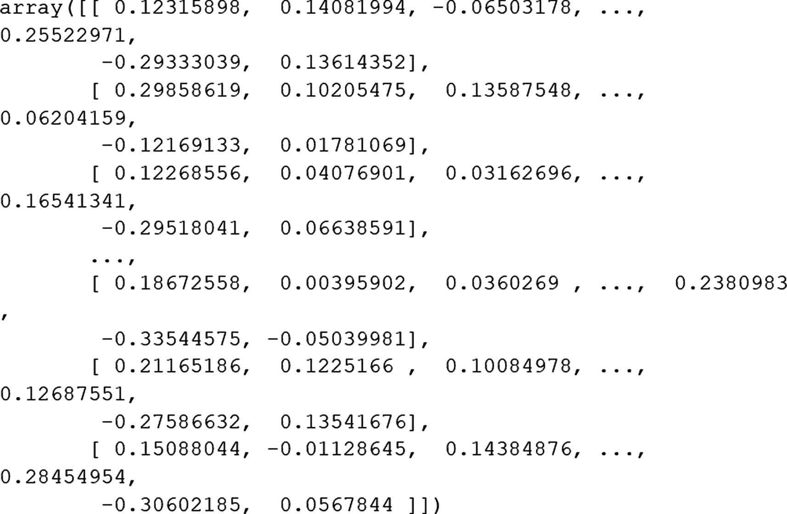

图 7-10

输出

### 查找相似问题

现在我们已经有了各种类型的嵌入向量，是时候使用相似度度量来查找相似问题了。

让我们构建一个函数来获取输入向量的嵌入。我们需要输入句子和模型，它会返回嵌入向量。

```python
#定义计算余弦相似度的函数
#导入
from sklearn.metrics.pairwise import cosine_similarity
from numpy import dot
from numpy.linalg import norm
def cosine_similarity(vec1,vec2):
#计算得分
return dot(vec1, vec2)/(norm(vec1)*norm(vec2))
```

在这个函数中，我们按如下方式提供输入。

```python
User: 来自用户的输入查询
Embeddings: 我们需要从中查找相似问题的嵌入向量
df: 用于推荐问题的数据集
#从数据中获取前 N 个相似问题的函数
def top_n_questions(user,embeddings,df):
#计算整个数据集与用户输入查询的余弦相似度
x=cosine_similarity(user,embeddings).tolist()[0]
temp_list=list(x)
#排序
sort_res = sorted(range(len(x)), key = lambda sub: x[sub])[:]
sim_score=[temp_list[i] for i in reversed(sort_res)]
#打印
print(sort_res[0:5])
#获取索引
L=[]
for i in reversed(sort_res):
L.append(i)
#从数据框中获取索引
return df.iloc[L[0:5], [0,1]]
#根据所选模型获取结果的函数
def get_input_vector(query,model):
print(query)
#Doc2vec 模型
if model=='Doc2Vec':
k=fetch_embeddings(doc_model,query)
k=k.reshape(1, -1)
# sbert 模型
elif model=='BERT':
k=sbert_model.encode(str(query))
k=k.reshape(1, -1)
# gpt 模型
elif model=='GPT':
k=Fetch_gpt_vectors(query)
return k
```

所有函数都已就位。让我们看看结果是什么样的。

```python
# 示例 1 - Doc2vec 模型
top_n_questions(get_input_vector('How is Narendra Modi as a person?','Doc2Vec'),doc_embeddings,df)
```

图 7-11 显示了输出结果。

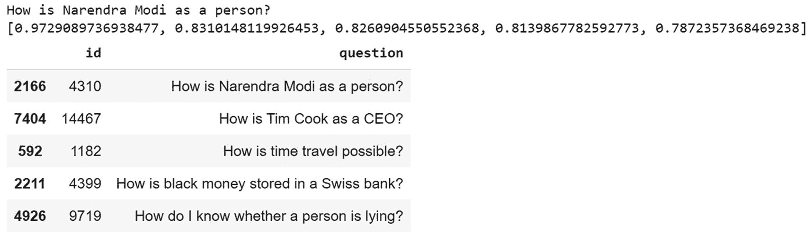

## 实现：监督学习

让我们使用监督学习来实现相同的问题。在数据中，有两个问题和一个目标变量，用于指示这些问题是否相似。我们可以使用这些数据来构建一个文本分类器。

让我们开始吧。

## 理解数据

```python
# 导入所需包。
import pandas as pd
import numpy as np
import scipy
import os
import string
import csv
#导入 nltk
import nltk
nltk.download('stopwords')
nltk.download('punkt')
nltk.download('wordnet')
#导入分词器
from nltk.tokenize import word_tokenize
from nltk.stem import WordNetLemmatizer
#导入警告
import warnings
#导入 sklearn 和 matplotlib
from sklearn import preprocessing
import spacy
import matplotlib.pyplot as plt
import plotly.graph_objects as go
#导入警告
warnings.filterwarnings('ignore')
import re
from string import punctuation
from nltk.stem import SnowballStemmer
from nltk.corpus import stopwords
stop_words = set(stopwords.words('english'))
#从 keras 导入分词器
from keras.preprocessing.text import Tokenizer
from keras.preprocessing import sequence
from sklearn.model_selection import train_test_split
#导入 Keras 必要库
from keras.models import Sequential, Model
from keras.layers import Input, Embedding, Dense, Dropout, LSTM
```

让我们导入之前下载的整个数据集。

```python
#导入训练数据 - 导入完整数据
quora_questions=pd.read_csv('Quora.csv')
```

### 预处理数据

让我们创建一个文本预处理函数，该函数稍后可用于数据集中的所有列以及来自用户的新输入数据。

```python
#数据清洗函数
def txt_process(input_text):
# 从输入文本中移除标点符号
input_text = ''.join([x for x in input_text if x not in punctuation])
# 清洗文本
input_text = re.sub(r"[^A-Za-z0-9]", " ", input_text)
input_text = re.sub(r"\'s", " ", input_text)
#### 移除停用词
input_text = input_text.split()
input_text = [x for x in input_text if not x in stop_words]
input_text = " ".join(input_text)
# 返回单词列表
return(input_text)
```

让我们对 `question1` 和 `question2` 都调用数据文本清洗函数，以便我们获得干净的文本。

```python
#对两个问题 ID 应用上述函数
quora_questions['question1_cleaned'] = quora_questions.apply(lambda x: txt_process(x['question1']), axis = 1)
quora_questions['question2_cleaned'] = quora_questions.apply(lambda x: txt_process(x['question2']), axis = 1)
```

### 文本到特征

让我们将两个问题 ID 堆叠在一起，以便覆盖两列中的所有单词。然后我们可以对这些单词进行分词，将它们转换为数字。

```python
#堆叠
question_text = np.hstack([quora_questions.question1_cleaned, quora_questions.question2_cleaned])
#分词
tokenizer = Tokenizer()
tokenizer.fit_on_texts(question_text)
#为两个 ID 创建新列，其中包含句子的分词形式
quora_questions['tokenizer_1'] = tokenizer.texts_to_sequences(quora_questions.question1_cleaned)
quora_questions['tokenizer_2'] = tokenizer.texts_to_sequences(quora_questions.question2_cleaned)
quora_questions.head(5)
```

图 7-14 显示了输出结果。

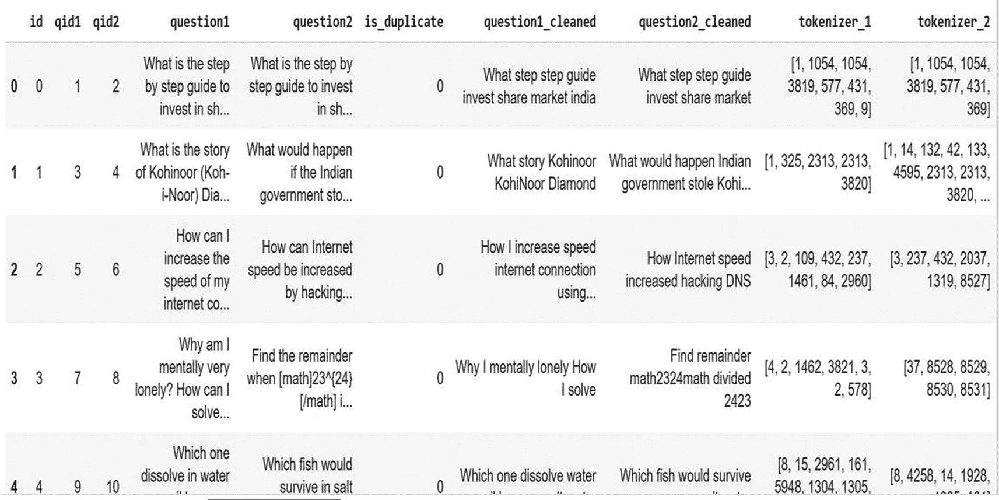

**图 7-14** 输出结果

```python
#将两个标记合并到一个列表中，question1 后跟 question2
quora_questions['tokenizer'] = quora_questions['tokenizer_1'] + quora_questions['tokenizer_2']
#定义最大长度
m_len = 500
#最大标记数
max_token = np.max(quora_questions.tokenizer.max())
```

## 模型构建

我们将数据划分为测试集和训练集，并构建一个 LSTM 分类器。除了 LSTM，我们还将使用 dropout 层来减少过拟合。由于是二分类问题，这里使用了 sigmoid 层。

```python
#定义 X 和目标数据
y = quora_questions[['is_duplicate']]
X = quora_questions[['tokenizer']]
#对 X 进行填充，使其达到最大长度
X = sequence.pad_sequences(X.tokenizer, maxlen = m_len)
#将数据划分为训练集和测试集
X_train,X_test,y_train,y_test=train_test_split(X, y, test_size=0.25, random_state=10)
```

接下来，我们使用 LSTM 模型在训练数据上训练模型。

```python
#定义 LSTM 模型
quora_model = Sequential()
#添加嵌入层
quora_model.add(Embedding(70000, 64))
#添加 dropout 层
quora_model.add(Dropout(0.15))
#LSTM 层
quora_model.add(LSTM(16))
#添加 sigmoid 层
quora_model.add(Dense(1, activation = 'sigmoid'))
#定义损失函数和优化器
quora_model.compile(loss='binary_crossentropy', optimizer='SGD', metrics=['accuracy'])
quora_model.summary()
```

图 7-15 展示了输出结果。

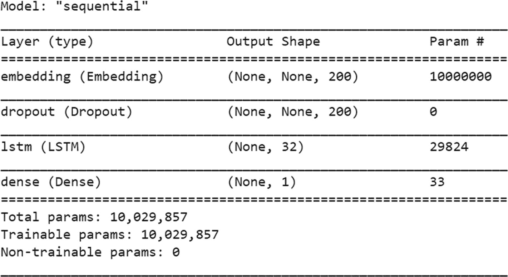

**图 7-15** LSTM 模型摘要

```python
#训练模型并在测试数据上进行验证
quora_model.fit(X_train, y_train, epochs = 2, batch_size=64,validation_data=(X_test,y_test))
Epoch 1/2
2527/2527 [==============================] - 2342s 927ms/step - loss: 0.5273 - accuracy: 0.7398 - val_loss: 0.5014 - val_accuracy: 0.7571
Epoch 2/2
2527/2527 [==============================] - 2307s 913ms/step - loss: 0.4874 - accuracy: 0.7670 - val_loss: 0.4781 - val_accuracy: 0.7701
```

### 评估

让我们使用混淆矩阵和 F1 分数等各种参数，看看模型在训练集和测试集上的表现。

```python
# 模型评估
import sklearn
from sklearn.metrics import classification_report
#对训练数据进行预测
tr_prediction=quora_model.predict(X_train)
#将概率大于 0.5 的替换为 1，其余替换为 0
tr_prediction[tr_prediction>0.5]=1
tr_prediction[tr_prediction<0.5]=0
tr_prediction
#训练数据的真实值
tr_true=y_train.values
#准确率
Accuracy=sklearn.metrics.accuracy_score(np.array(tr_true),
np.array(tr_prediction))
print(Accuracy)
0.7811906400332337
#包含 F1 分数的分类报告
print(classification_report(tr_true, tr_prediction, target_names=['不相似','相似']))
```

图 7-16 展示了输出结果。

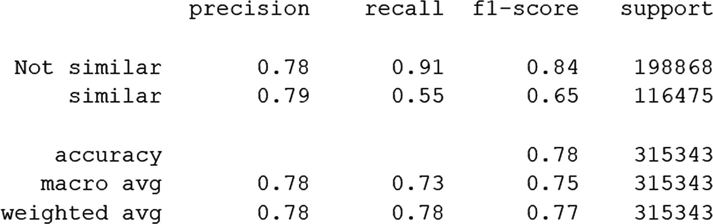

**图 7-16** 输出结果

我们在训练数据上得到了 78% 的 F1 分数。让我们看看模型在测试数据上的表现。

```python
#对测试数据进行预测
test_prediction=quora_model.predict(X_test)
#生成类别
test_prediction[test_prediction>0.5]=1
test_prediction[test_prediction<0.5]=0
test_prediction
#测试数据的真实值
test_true=y_test.values
#测试数据上的准确率
Accuracy=sklearn.metrics.accuracy_score(np.array(test_true),
np.array(test_prediction))
print('准确率为 %f'%(Accuracy*100)+' %')
准确率为 78.152545 %
print(classification_report(test_true, test_prediction, target_names=['不相似','相似']))
```

图 7-17 展示了输出结果。

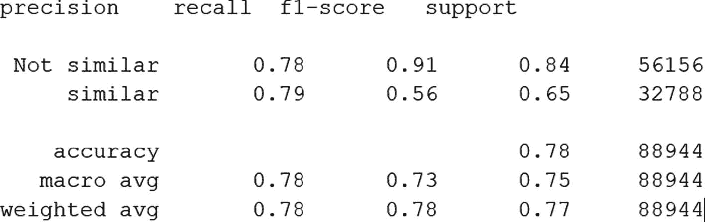

**图 7-17** 输出结果

我们在测试数据上也得到了 78% 的 F1 分数，这是一个很好的迹象。这意味着模型没有过拟合，准确率看起来很有希望。通过进一步微调和增加训练轮数，我们可以尝试提高这个分数。

### 对新问题对的预测

让我们构建一个函数，用于计算给定问题对的概率分数。

```python
def find_similarity_score(q1,q2):
#清洗第一个问题
Q1_C=  txt_process(q1)
#print(q1)
#清洗第二个问题
Q2_C = txt_process(q2)
#print(q2)
#将第一个问题转换为 token
Q1_C = tokenizer.texts_to_sequences([Q1_C])
#将第二个问题转换为 token
Q2_C = tokenizer.texts_to_sequences([Q2_C])
#合并两个 token，就像我们对训练数据所做的那样
Q_final = Q1_C[0] + Q2_C[0]
#将合并后的序列填充到最大长度
Q_Test = sequence.pad_sequences([Q_final], maxlen = 500)
#预测给定问题对的概率
Prob=quora_model.predict(Q_Test)
print(Prob)
#如果 p>0.5 则相似
if Prob[0]>0.5:
return 'Quora 问题相似'
else:
return 'Quora 问题不相似'
#示例 1
find_similarity_score('Who is Narendra Modi?','What is identity of Narendra Modi?')
[[0.70106715]]
Quora 问题相似
#示例 2
find_similarity_score('is there life after death?','Do people belive in afterlife')
[[0.550213]]
Quora 问题相似
#示例 3
find_similarity_score('Should I have a hair transplant at age 24? How much would it cost?','How much cost does hair transplant require?')
[[0.17271936]]
Quora 问题不相似
```

你可以看到这些概率值有多好。在前两个示例中，概率大于 0.5，并且问题是相似的。示例 3 是问题不相似的情况。

## 结论

我们成功构建了两种模型来查找相似的 Quora 问题：监督学习和无监督学习。我们探索了各种最新的预训练嵌入来解决这个问题。在监督学习中，我们训练了一个深度学习分类器，在不使用任何嵌入的情况下预测相似性。

接下来，让我们尝试以下步骤进行改进。

1.  我们可以采用混合方法。我们可以使用预训练嵌入作为基础向量，并在其之上构建一个分类器——这是一种迁移学习方法。我们将在本书后面的章节中探讨这个概念。

2.  我们还可以尝试不同的、先进的深度学习架构，例如注意力机制，而不是简单的带有 dropout 的 LSTM。

3.  对任何架构中的参数进行超参数调优都可以提高准确率。