# 8. 使用 CRF 和 BERT 进行命名实体识别

命名实体识别（NER）是一种自然语言处理技术。它也被称为*实体识别*或*实体提取*。它识别文本中的命名实体，并将其分类到预定义的类别中。例如，提取的实体可以是文本中存在的组织名称、地点、时间、数量、人物、货币价值等。

通过 NER，通常可以提取关键信息来了解给定文本的内容，或者用于收集重要信息并存储在数据库中。

NER 被广泛应用于许多领域的应用程序中。NER 在生物医学数据中得到了广泛的应用。例如，它用于 DNA 识别、基因识别以及药物名称和疾病名称的识别。图 8-1 展示了一个与医学文本相关的 NER 示例，该示例提取了症状、患者类型和剂量。

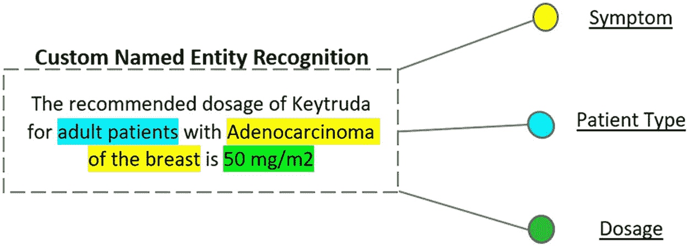

图 8-1

对医学文本数据进行 NER

NER 还用于优化搜索查询和排序搜索结果。它有时与主题识别结合使用。NER 也用于机器翻译。

有许多使用 NER 的预训练通用库。例如，spaCy——一个用于各种 NLP 任务的开源 Python 库。而 NLTK（自然语言工具包）有一个用于 Stanford NER 的包装器，这在许多情况下更简单。

这些库只能提取特定类型的实体，例如名称、地点等。如果你需要提取非常特定领域的内容，例如治疗方法的名称，这是不可能的。在这些情况下，你需要构建自定义的 NER。本章将解释如何构建自定义的 NER 模型。


## 问题陈述

目标是从电影冷知识中提取命名实体。例如，标签包括电影名称、演员姓名、导演姓名和电影情节。通用库可能能够提取名称，但无法区分演员和导演，并且提取电影情节也颇具挑战性。我们需要构建一个定制模型，用于预测电影相关句子的这些标签。

本质上，我们拥有一个关于电影的数据集。它包含关于电影的句子或问题，并且句子中的每个单词都有一个预定义的标签。我们需要构建一个命名实体识别（NER）模型来预测这些标签。

在此过程中，我们需要理解以下概念：

1.  使用各种算法构建模型。
2.  设计一个衡量模型性能的指标。
3.  理解模型在何处失效以及失效的可能原因。
4.  微调模型。
5.  重复这些步骤，直到在测试数据上达到最佳准确率。

## 方法论与方案

NER 可以识别文本中的实体，并将其分类为预定义的类别，例如地点、人名、组织名称等。但对于这个问题，我们需要为句子中的实体标记导演姓名、演员姓名、类型和电影角色（类似地，数据集中定义了 25 个这样的标签）。因此，仅靠 NER 是不够的。这里，我们将构建定制模型，并使用条件随机场和 BERT 对其进行训练。

解决此问题的步骤如下：

1.  数据收集
2.  数据理解
3.  数据预处理
4.  特征映射
5.  模型构建
    -   条件随机场
    -   BERT
6.  超参数调优
7.  评估模型
8.  对随机句子进行预测

图 8-2 展示了产品在高级别上的工作方式。

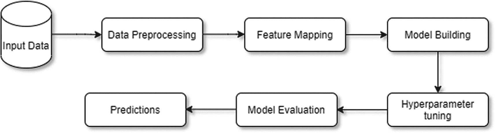

图 8-2

方案流程

## 实现

我们已经理解了问题陈述以及解决该问题的各种方法。现在开始项目的实现。我们首先导入并理解数据。

### 数据

我们使用了来自 MIT 电影语料库的数据，该数据采用 `.bio` 格式。从 [`https://groups.csail.mit.edu/sls/downloads/movie/`](https://groups.csail.mit.edu/sls/downloads/movie/) 下载 `trivia10k13train.bio` 和 `trivia10k13test.bio` 数据集。

现在，我们使用以下代码将数据转换为 pandas 数据框。

```python
#创建一个函数，添加一个名为 sentence 的列，该列指示每个 txt 文件的句子 ID，作为预处理步骤。
import pandas as pd
def data_conversion(file_name):
df_eng=pd.read_csv(file_name,delimiter='\t',header=None,skip_blank_lines=False)
df_eng.columns=['tag','tokens']
tempTokens = list(df_eng['tokens'])
tempSentence = list()
count = 1
for i in tempTokens:
tempSentence.append("Sentence" + str(count))
if str(i) == 'nan':
count = count+1
dfSentence = pd.DataFrame (tempSentence,columns=['Sentence'])
result = pd.concat([df_eng, dfSentence], axis=1, join='inner')
return result
#将文本文件传递给函数
trivia_train=data_conversion('trivia10k13train.txt')
trivia_test=data_conversion('trivia10k13test.txt')
```

### 训练数据准备

让我们查看训练数据的前五行。

```python
trivia_train.head()
```

图 8-3 显示了训练数据前五行的输出。

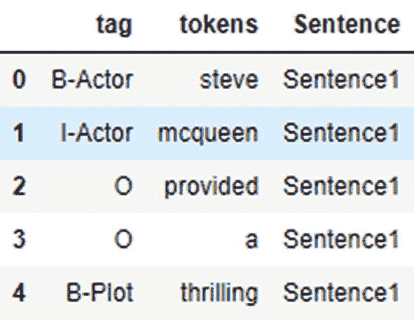

图 8-3

训练数据样本

接下来，我们检查训练数据集中行和列的数量。

```python
trivia_train.shape
```

输出如下：

```
(166638, 3)
```

总共有 166,638 行和三列。让我们检查训练数据集中有多少个唯一单词。

```python
trivia_train.tokens.nunique()
```

输出如下：

```

```

训练数据共有 10,986 个唯一单词和 7816 个句子。现在，让我们检查训练数据集中是否存在空值。

```python
trivia_train.isnull().sum()
```

输出如下：

```
tag         7815
tokens      7816
Sentence       0
dtype: int64
```

有 7816 个空行。让我们使用以下代码删除空行。

```python
trivia_train.dropna(inplace=True)
```

### 测试数据准备

让我们查看测试数据的前五行。

```python
trivia_test.head()
```

接下来，我们检查测试数据集中行和列的数量。

```python
trivia_test.shape
```

输出如下：

```
(40987, 3)
```

总共有 40,987 行和三列。让我们检查测试数据集中有多少个唯一单词。

```python
trivia_test.tokens.nunique()
```

输出如下：

```

```

测试数据共有 5,786 个唯一单词和 1953 个句子。现在，让我们检查测试数据集中是否存在空值。

```python
trivia_test.isnull().sum()
```

输出如下：

```
tag         1952
tokens      1952
Sentence       0
dtype: int64
```

有 1952 个空行。让我们使用以下代码删除空行。

```python
trivia_test.dropna(inplace=True)
```

提取后的数据集包含三列。

-   `tag` 是单词的类别
-   `tokens` 包含单词
-   `sentence` 是单词所属的句子编号

给定的训练数据集中共有 24 个（不包括 `O` 标签）唯一标签。它们的分布如下。

```python
#以下是获取标签分布图的代码。
trivia_train[trivia_train["tag"]!="O"]["tag"].value_counts().plot(kind="bar", figsize=(10,5))
```

图 8-4 显示了标签分布的输出。

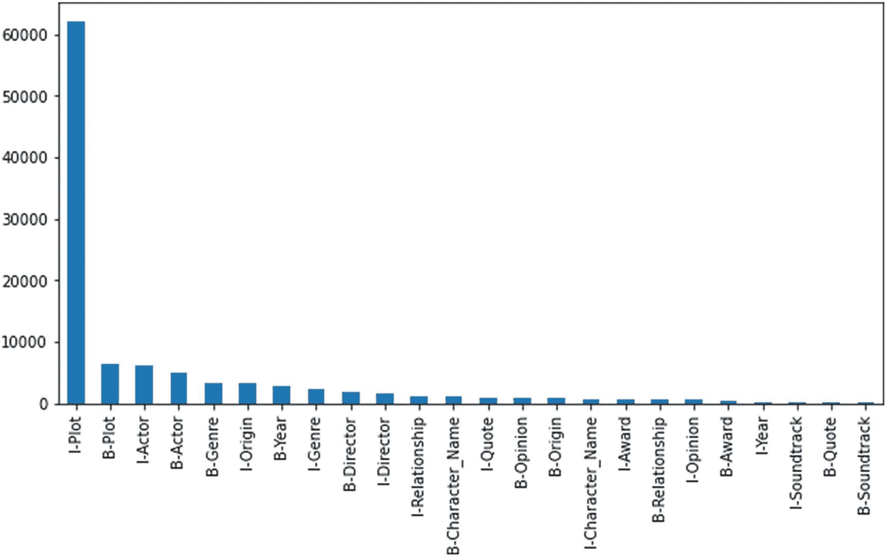

图 8-4

标签分布

现在，让我们为后续分析和模型构建创建训练数据和测试数据的副本。

```python
data=trivia_train.copy()
data1=trivia_test.copy()
```

让我们使用以下代码重命名列。

```python
data.rename(columns={"Sentence":"sentence_id","tokens":"words","tag":"labels"}, inplace =True)
data1.rename(columns={"Sentence":"sentence_id","tokens":"words","tag":"labels"}, inplace =True)
```

## 模型构建


#### 条件随机场（CRF）

CRF 是一种条件模型类，最适合于邻居状态或上下文信息影响当前预测的预测任务。

CRF 的主要应用包括命名实体识别、词性标注、基因预测、降噪以及目标检测问题等。

在序列分类问题中，最终目标是给定输入序列向量 `x` 的情况下，找到 `y`（目标）的概率。

由于条件随机场是条件模型，它们将逻辑回归应用于序列数据。

条件分布基本上是：

`Y = argmax P(y|x)`

这会在给定序列 `x` 的情况下找到最佳输出（概率）。

在 CRF 中，输入数据预期是序列化的，因此我们必须将我们正在预测的数据点标记为位置 `i`。

我们为每个变量定义特征函数；在这种情况下，没有词性标签。我们只使用一个特征函数。

特征函数的主要目的是表达数据点所代表的序列的一个特征。

每个特征函数都相对地基于前一个词和当前词的标签。它的值要么是 0，要么是 1。

因此，为了像在其他模型中那样构建 CRF，需要为每个特征函数分配一些权重，并通过优化算法（如梯度下降）来更新权重。

使用最大似然估计来估计参数，我们对分布取负对数，以便更容易计算导数。

总的来说：

1.  定义特征函数。
2.  将权重初始化为随机值。
3.  对参数值应用梯度下降以使其收敛。

CRF 与逻辑回归更为相似，因为它们都使用*条件概率分布*。但是，我们通过将特征函数作为序列输入来扩展该算法。

我们的目标是使用 CRF 模型从给定的句子中提取实体并识别其类型。现在，让我们导入所需的库。

我们使用了以下库。

```python
# 用于可视化
import matplotlib.pyplot as plt
import seaborn as sns
sns.set(color_codes=True)
sns.set(font_scale=1)
%matplotlib inline
%config InlineBackend.figure_format = 'svg'
# 用于建模
from sklearn.ensemble import RandomForestClassifier
from sklearn_crfsuite import CRF, scorers, metrics
from sklearn_crfsuite.metrics import flat_classification_report
from sklearn.metrics import classification_report, make_scorer
import scipy.stats
import eli5
```

让我们将分组的词及其对应的标签创建为元组。同时，使用以下句子生成器函数将同一句子的词存储在一个列表中。

```python
class Get_Sent(object):
def __init__(self, dataset):
self.n_sent = 1
self.dataset = dataset
self.empty = False
agg_func = lambda s: [(a, b) for a,b in zip(s["words"].values.tolist(),
s["labels"].values.tolist())]
self.grouped = self.dataset.groupby("sentence_id").apply(agg_func)
self.sentences = [x for x in self.grouped]
def get_next(self):
try:
s = self.grouped["Sentence: {}".format(self.n_sent)]
self.n_sent += 1
return s
except:
return None
# 调用 Get_Sent 函数并传入训练数据集
Sent_get= Get_Sent(data)
sentences = Sent_get.sentences
```

因此，句子看起来像这样。

图 8-5 显示了训练数据的 `Get_Sent` 函数输出。

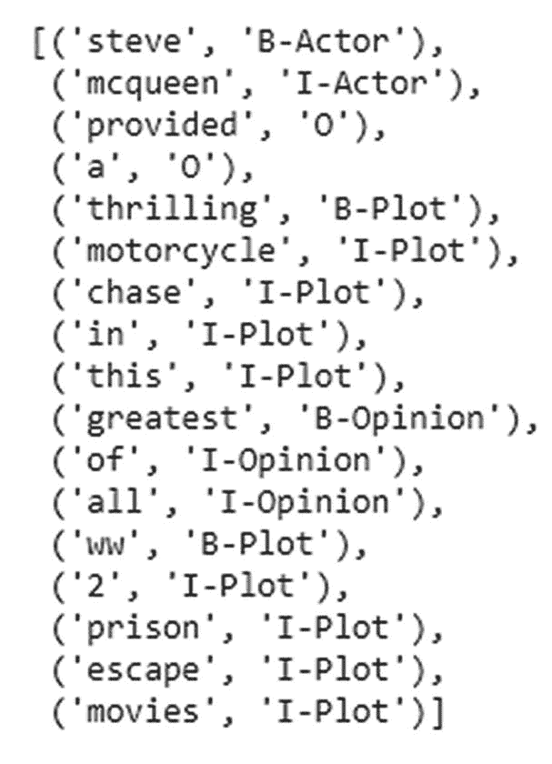

**图 8-5** 输出

```python
# 调用 Get_Sent 函数并传入测试数据集
Sent_get= Get_Sent(data1)
sentences1 = Sent_get.sentences
# 这就是一个句子的样子。
print(sentences1[0])
```

图 8-6 显示了测试数据的 `Get_Sent` 函数输出。

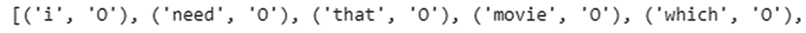

**图 8-6** 输出

为了将文本转换为数值数组，我们使用了简单和复杂的特征。

#### 简单特征映射

在此映射中，我们考虑了简单的词映射，并且只考虑了每个词的六个特征。

*   词首字母大写
*   词全小写
*   词全大写
*   词的长度
*   词是否为数字
*   词是否为字母

让我们看一下简单特征映射的代码。

```python
# 分类器的特征映射。
def create_ft(txt):
return np.array([txt.istitle(), txt.islower(), txt.isupper(),
len(txt),txt.isdigit(),  txt.isalpha()])
# 使用上面创建的函数来获取训练数据的词映射。
words = [create_ft(x) for x in data["words"].values.tolist()]
# 让我们获取唯一的标签
target = data["labels"].values.tolist()
# 打印几个词及其数组
print(words[:5])
输出：
我们得到了如下词的映射（针对前五个词）
[array([0, 1, 0, 5, 0, 1]), array([0, 1, 0, 7, 0, 1]), array([0, 1, 0, 8, 0, 1]), array([0, 1, 0, 1, 0, 1]), array([0, 1, 0, 9, 0, 1])]
```

同样，我们对测试数据使用创建的函数。

```python
# 使用上面创建的函数来获取测试数据的词映射。
words1 = [create_ft(x) for x in data1["words"].values.tolist()]
target1 = data1["labels"].values.tolist()
```

对随机分类器模型应用五折交叉验证，得到如下结果。接下来，使用 `cross_val_predict` 函数。该函数定义在 `sklearn` 中。

```python
# 导入包
from sklearn.model_selection import cross_val_predict
# 训练 RF 模型
Ner_prediction = cross_val_predict(RandomForestClassifier(n_estimators=20),X=words, y=target, cv=10)
# 导入库
from sklearn.metrics import classification_report
# 生成报告
Accuracy_rpt= classification_report(y_pred= Ner_prediction, y_true=target)
print(Accuracy_rpt)
```

图 8-7 显示了分类报告。

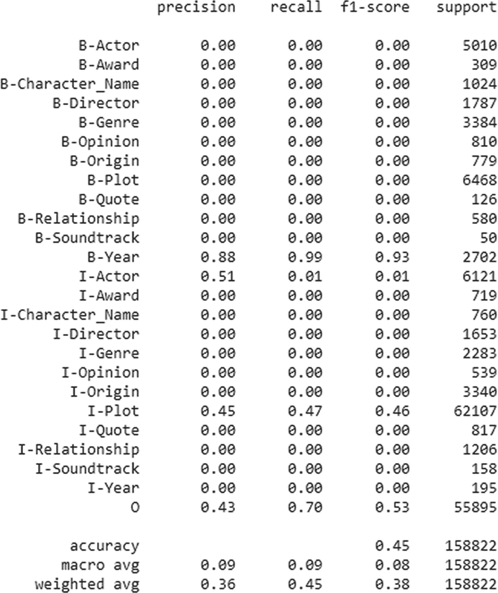

**图 8-7** 分类报告

准确率为 45%，总体 F1 分数为 0.38。性能不太好。现在让我们进一步利用更多特征（例如“前一个”和“后一个”词）来提高准确率。


#### 通过添加更多特征进行特征映射

在此案例中，我们考虑给定单词对应的下一个词和上一个词的特征。

1.  如果单词位于句首，则在句子开头添加一个标签。
2.  如果单词位于句尾，则在句子末尾添加一个标签。同时，还要考虑上一个词和下一个词的特征。

接下来导入特征映射的代码。

首先，将 Python 文件上传到 Colab 或任何可用的 Python 环境中，如图 8-8 所示。

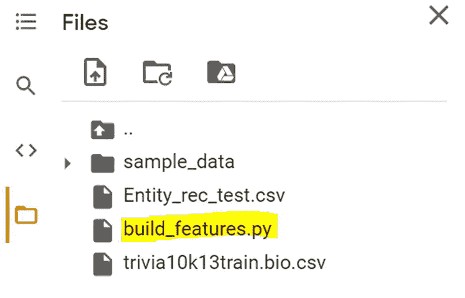

图 8-8：上传 Python 脚本

```
from build_features import text_to_features
# function to create features
def text2num(wrd):
return [text_to_features(wrd, i) for i in range(len(wrd))]
# function to create labels
def text2lbl(wrd):
return [label for token,label in wrd]
```

让我们使用 `sent2features` 函数来准备训练数据特征，该函数内部调用了 `text_to_features` 函数。

```
X = [text2num(x) for x in sentences]
```

使用 `text2lbl` 函数准备训练数据标签，因为句子是由单词和标签组成的元组。

```
y = [text2lbl(x) for x in sentences]
```

类似地，准备测试数据。

```
test_X = [text2num(x) for x in sentences]
test_y = [text2lbl(x) for x in sentences]
```

现在训练数据和测试数据都已准备就绪，让我们初始化模型。首先，初始化并构建一个不进行超参数调优的 CRF 模型。

```
#building the CRF model
ner_crf_model = CRF(algorithm='lbfgs',max_iterations=25)
#tgraining the model with cross validation of 10
ner_predictions = cross_val_predict(estimator= ner_crf_model, X=X, y=y, cv=10)
```

让我们在训练数据上评估模型。

```
Accu_rpt = flat_classification_report(y_pred=ner_predictions, y_true=y)
print(Accu_rpt)
```

图 8-9 显示了训练数据的分类报告。

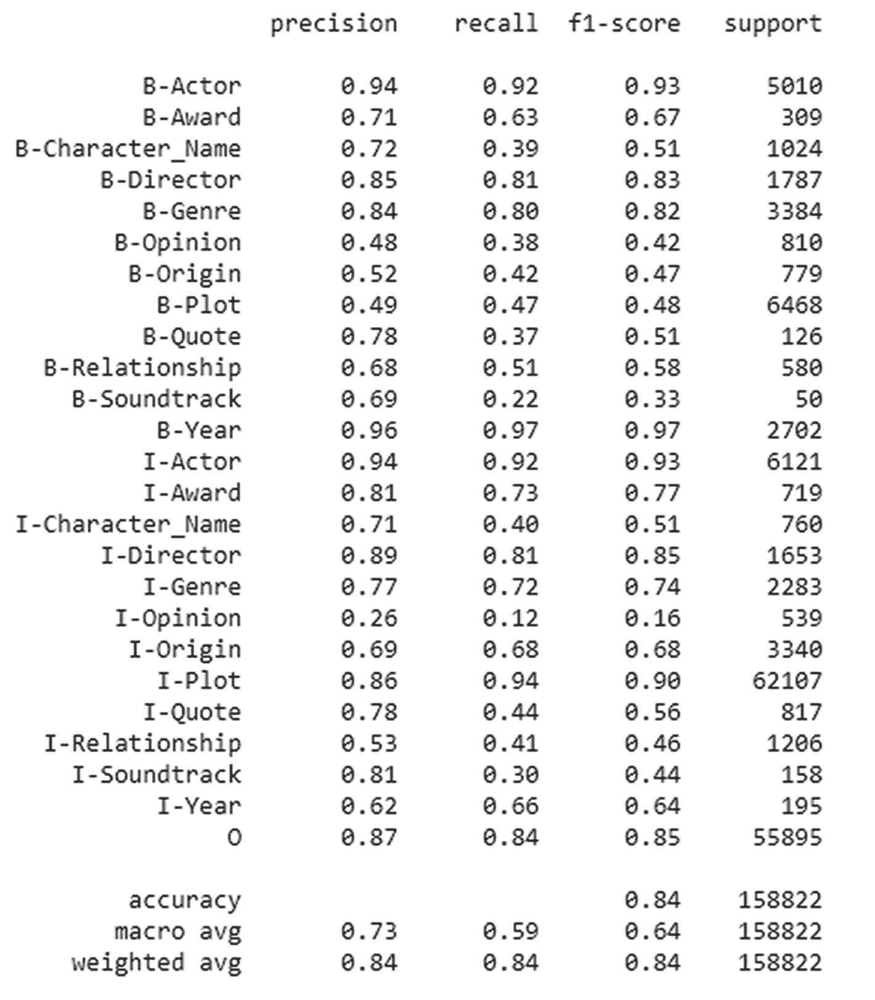

图 8-9：训练数据的分类报告

训练数据结果：总体 F1 分数为 0.84，准确率为 0.84。

让我们在测试数据上评估模型。

```
#building the CRF model
crf_ner = CRF(algorithm='lbfgs',max_iterations=25)
#Fitting model on train data.
crf_ner.fit(X,y)
# prediction on test data
test_prediction=crf_ner.predict(test_X)
# get labels
lbs=list(crf_ner.classes_)
#get accuracy
metrics.flat_f1_score(test_y,test_prediction,average='weighted',labels=lbs)
Ouptut:
0.8369950502328535
#sort the labels
sorted_lbs=sorted(lbs,key= lambda name:(name[1:],name[0]))
#get classification report
print(metrics.flat_classification_report(test_y,test_prediction,labels=sorted_lbs,digits=4))
```

图 8-10 显示了测试数据的分类报告。

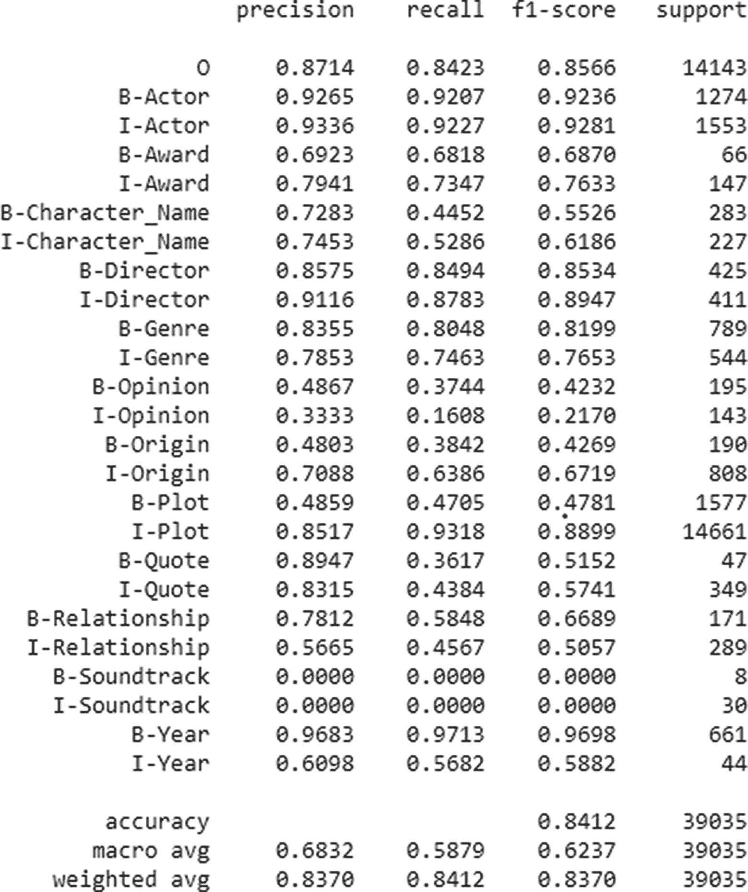

图 8-10：测试数据的分类报告

测试数据结果显示，总体 F1 分数为 0.8370，准确率为 0.8412。通过添加更多特征，准确率提升了近 40%，F1 分数提升了 0.5。我们可以通过执行超参数调优来进一步提高准确率。

让我们随机选取一个句子，并使用训练好的模型预测其标签。

1.  像处理训练数据一样，使用 `word2feature` 函数为输入句子创建特征映射。
2.  转换为数组，并使用 `crf.predict(input_vector)` 进行预测。

接下来，将每个单词转换为特征。

```
def text_2_ftr_sample(words):
return [text_to_features(words, i) for i in range(len(words))]
```

拆分句子并将每个单词转换为特征。

```
#define sample sentence
X_sample=['alien invasion is the movie directed by christoper nollen'.split()]
#convert to features
X_sample1=[text_2_ftr_sample(x) for x in X_sample]
#predicting the class
crf_ner.predict(X_sample1)
```

以下是输出结果。

```
[['B-Actor', 'I-Actor', 'O', 'O', 'O', 'O', 'O', 'B-Director', 'I-Director']]
```

现在，让我们尝试 BERT 模型，看看它是否比 CRF 模型表现更好。

#### BERT 变换器

BERT（来自变换器的双向编码器表示）是一个在大型数据集上训练的模型。这个预训练模型可以根据需求进行微调，并用于情感分析、问答系统、句子分类等不同任务。BERT 实现了 NLP 中的迁移学习，是一种最先进的方法。

BERT 使用变换器，主要是编码器部分。注意力机制学习单词和子词之间的上下文关系。与其他模型不同，变换器的编码器一次性学习所有序列。输入是一个单词（词元）序列，这些词元被嵌入到向量中，然后输入到神经网络。输出是与给定序列的输入词元相对应的词元序列。

让我们实现 BERT 模型。

导入所需的库。

```
#importing necessary libraries
from sklearn.preprocessing import LabelEncoder
from sklearn.model_selection import train_test_split
from sklearn.metrics import accuracy_score
from sklearn.metrics import classification_report, make_scorer
#importing NER models from simple transformers
from simpletransformers.ner import NERModel,NERArgs
#importing libraries for evaluation
from sklearn_crfsuite.metrics import flat_classification_report
from sklearn_crfsuite import CRF, scorers, metrics
```

让我们使用 `LabelEncoder` 对句子列进行编码。

```
#encoding sentence values
data["sentence_id"] = LabelEncoder().fit_transform(data["sentence_id"] )
data1["sentence_id"] = LabelEncoder().fit_transform(data1["sentence_id "] )
```

让我们将所有标签转换为大写。

```
#converting labels to upper string as it is required format
data["labels"] = data["labels"].str.upper()
data1["labels"] = data1["labels"].str.upper()
```

接下来，分离训练数据和测试数据。

```
X= data[["sentence_id","words"]]
Y =data["labels"]
```

然后，创建训练和测试数据框。

```
#building up train and test data to dataframe
ner_tr_dt = pd.DataFrame({"sentence_id":data["sentence_id"],"words":data["words"],"labels":data["labels"]})
test_data = pd.DataFrame({"sentence_id":data1["sentence_id"],"words":data1["words"],"labels":data1["labels"]})
```

同时，让我们存储唯一标签的列表。

```
#label values
label = ner_tr_dt["labels"].unique().tolist()
```

我们需要微调 BERT 模型，以便使用参数。这里，我们更改了轮次数和批量大小。为了进一步改进模型，我们也可以更改其他参数。

```
#fine tuning our model on custom data
args = NERArgs()
#set the # of epoch
args.num_train_epochs = 2
#learning reate
args.learning_rate = 1e-6
args.overwrite_output_dir =True
#train and evaluation batch size
args.train_batch_size = 6
args.eval_batch_size = 6
```

我们现在初始化 BERT 模型。

```
#initializing the model
Ner_bert_mdl= NERModel('bert', 'bert-base-cased',labels=label,args =args)
#training our model
Ner_bert_mdl.train_model(ner_tr_dt,eval_data = test_data,acc=accuracy_score)
```

`eval_data` 是用于计算损失的数据。图 8-11 显示了训练 BERT 模型的输出。

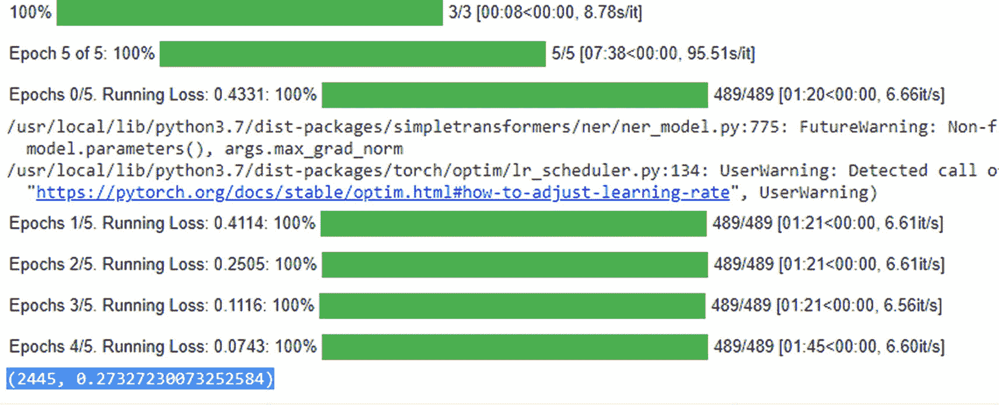

图 8-11：训练 BERT 模型

以下是输出结果。

你可以观察到在最后一个轮次中损失为 0.27。


