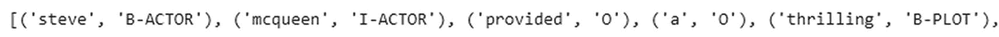
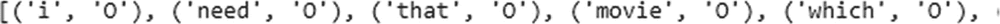
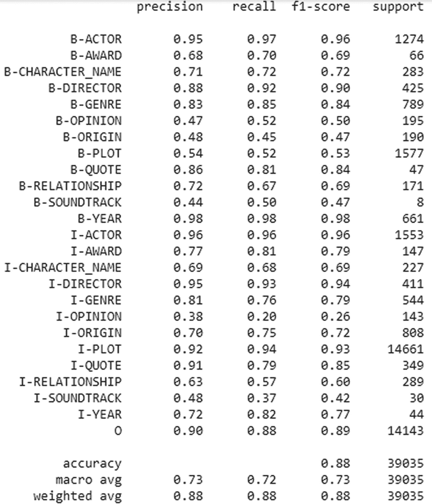
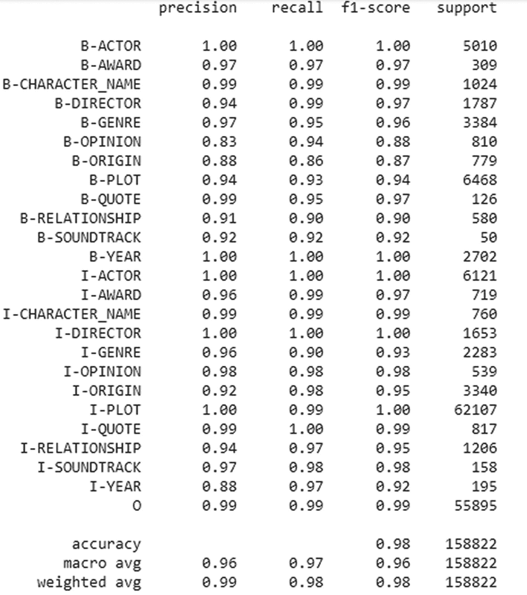
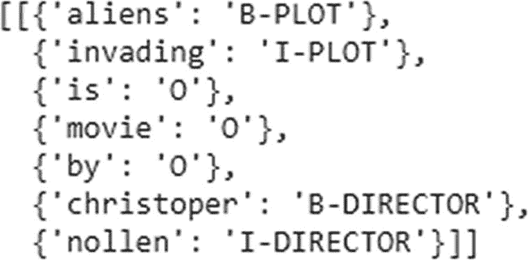

# 将每个句子的标签和单词存储到列表中的函数

```python
class sent_generate(object):
    def __init__(self, data):
        self.n_sent = 1.0
        self.data = data
        self.empty = False
        fn_group = lambda s: [(a, b) for a, b in zip(s["words"].values.tolist(), s["labels"].values.tolist())]
        self.grouped = self.data.groupby("sentence_id").apply(fn_group)
        self.sentences = [x for x in self.grouped]
```

将训练数据中每个句子的单词和标签存储到单个列表中：

```python
Sent_get = sent_generate(ner_tr_dt)
sentences = Sent_get.sentences
# 以下是一个句子的示例。
print(sentences[0])

def txt_2_lbs(sent):
    return [label for token, label in sent]

y_train_group = [txt_2_lbs(x) for x in sentences]
```

图 8-12 展示了训练数据中 `sent_generate` 函数的输出结果。



**图 8-12** 输出结果

将测试数据中每个句子的单词和标签存储到单个列表中：

```python
Sent_get = sent_generate(test_data)
sentences = Sent_get.sentences
# 以下是一个句子的示例。
print(sentences[0])

def txt_2_lbs(sent):
    return [label for token, label in sent]

y_test = [txt_2_lbs(x) for x in sentences]
```

图 8-13 展示了训练数据中 `sent_generate` 函数的输出结果。



**图 8-13** 输出结果

现在，让我们在测试数据上评估模型。

```python
# 在测试数据上评估
result, model_outputs, preds_list = Ner_bert_mdl.eval_model(test_data)
# 单个分组的报告
accu_rpt = flat_classification_report(y_pred=preds_list, y_true=y_test)
print(accu_rpt)
```

图 8-14 展示了训练数据的分类报告。



**图 8-14** 分类报告

测试数据的准确率为 88%。我们也在训练数据上评估模型，以检查是否存在过拟合。

```python
# 在训练数据上评估
result_train, model_outputs_train, preds_list_train = Ner_bert_mdl.eval_model(ner_tr_dt)
# 训练数据的单个分组报告
report_train = flat_classification_report(y_pred=preds_list, y_true=y_train_group)
print(report_train)
```

图 8-15 展示了训练数据的分类报告。



**图 8-15** 分类报告

训练数据的准确率为 98%。与 CRF 模型相比，BERT 模型表现非常出色。

现在，让我们随机选取一个句子，并使用构建的 BERT 模型预测其标签。

```python
prediction, model_output = Ner_bert_mdl.predict(["aliens invading is movie by christoper nollen"])
```

这里，模型会生成预测结果，对每个句子中的给定单词进行标注，而 `model_output` 则是模型生成的输出。

图 8-16 展示了使用随机句子进行的预测结果。



**图 8-16** 模型预测

## 后续步骤

- 为模型添加更多特征，例如，对于 CRF 模型，可以组合能表达恰当含义的单词。
- 当前实现仅在 CRF 模型的交叉验证搜索中考虑了两种超参数；然而，CRF 模型提供了更多可进一步调整以提升性能的参数。
- 使用 LSTM 神经网络，并与 CRF 构建集成模型。
- 对于 BERT 模型，我们可以添加一个 CRF 层，以构建更高效的网络，因为 BERT 能高效地发现单词间的模式。

## 总结

我们通过简要介绍 NER 和用于提取主题的现有库开始了这个项目。鉴于其局限性，您需要构建自定义的 NER 模型。在定义问题之后，我们提取了电影名称和导演名称，并构建了解决问题的方法。

我们尝试了三种模型：随机森林、CRF 和 BERT。我们从文本中创建特征，并将它们传递给具有不同特征的 `RandomForest` 和 CRF 模型。如您所见，特征越多，准确率越高。

我们没有手动构建这些特征，而是使用了深度学习算法。我们采用了一个基于 BERT 的预训练模型，并在其基础上训练了 NER。我们没有使用任何手动创建的特征，这是深度学习模型的优势之一。另一个优点是预训练模型。您知道迁移学习有多么强大，本项目的结果也证明了这一点。与使用手动特征结合 CRF 相比，我们能够从 NER BERT 模型中获得良好的结果。

