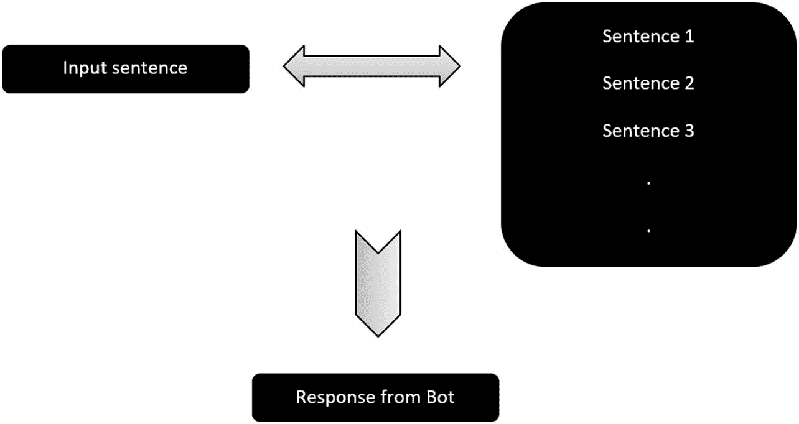
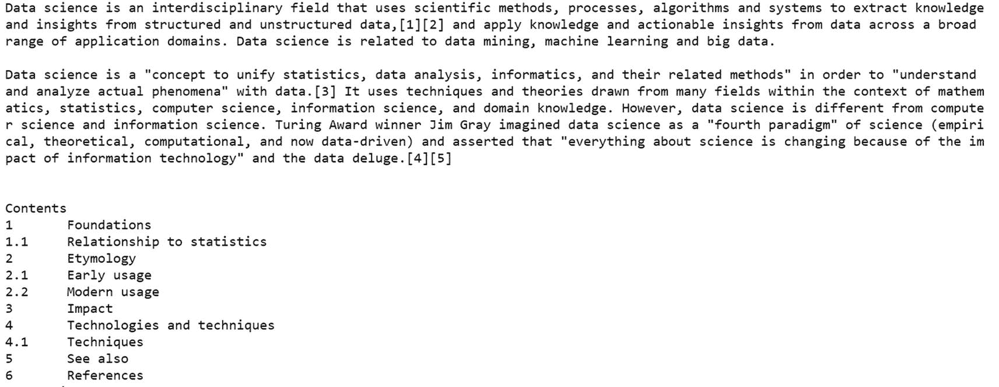
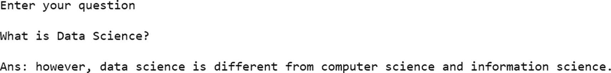
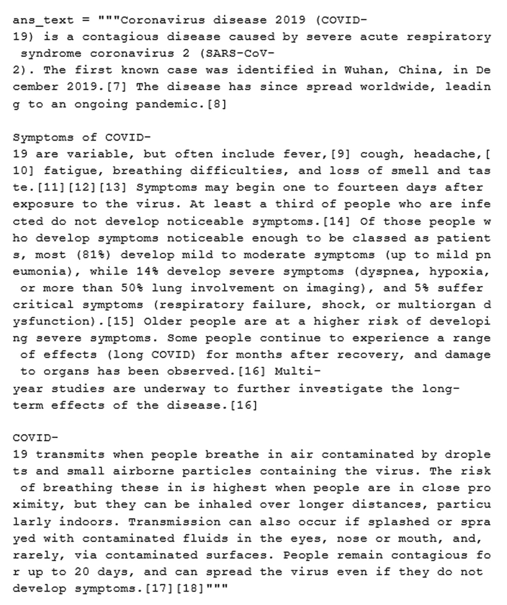
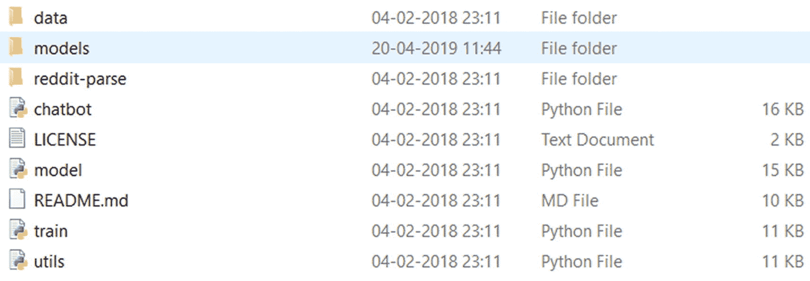
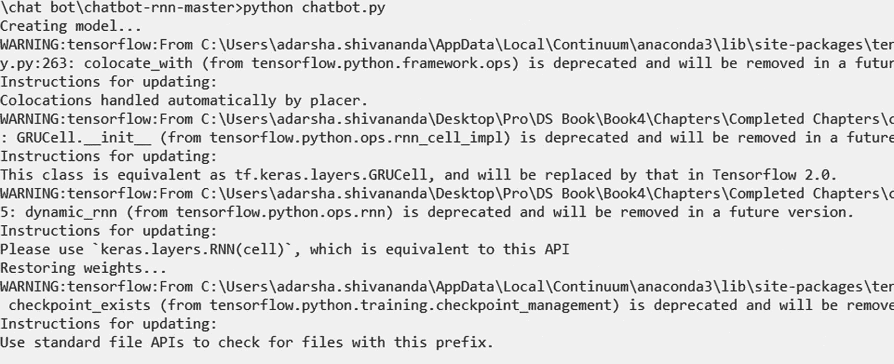
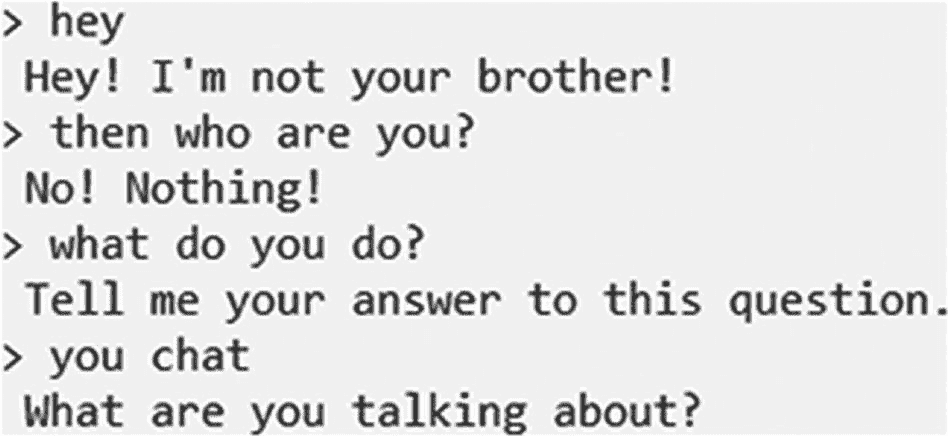

# 9. 使用迁移学习构建聊天机器人

在当今世界，大多数企业都需要为其产品和服务提供客户支持。随着电子商务、电信服务、互联网相关产品等的增长，对客户服务的需求只增不减。在大多数对话中，客户服务支持查询的性质是重复的。客户支持对话可以实现自动化。

以下是需要客户服务的几个行业：

- 电子商务
- 电信
- 医疗保健
- 制造业
- 电子设备

随着领域的发展，这个列表只会越来越长。那么，解决方案是什么呢？图 9-1 展示了聊天机器人在客户服务中的应用。


**图 9-1** 聊天机器人的应用

任何专注于提供下一代客户体验的企业都需要卓越的售后服务。提供可靠的客户服务呼叫中心来解答客户的问题，这在几年前还行得通。随着最新技术的兴起，在当今的现代世界中，客户追求更大的便利性和速度。在人力资源有限的情况下，速度和客户体验是最大的挑战。

如果实施得当，这些问题大部分都可以通过聊天机器人解决。

那么，什么是聊天机器人？

维基百科将聊天机器人（也称为间谍程序、对话机器人、聊天机器人、交互式代理、对话界面、对话式 AI、聊天机器人或人工智能间谍实体）定义为：“一种通过听觉或文本方式进行[对话](https://en.wikipedia.org/wiki/Conversation)的[计算机程序](https://en.wikipedia.org/wiki/Computer_program)或[人工智能](https://en.wikipedia.org/wiki/Artificial_intelligence)。”

*机器人*是计算机理解人类语音或文本的能力。*聊天机器人*是一个从根本上模拟人类对话的计算机程序。它是*聊天机器人*的简称。

聊天机器人通过自动化客户支持来节省时间和精力。它们也用于其他业务任务，例如收集用户信息和组织会议。如今，它们可以做很多事情，让生活更加顺畅。

以下是一些统计数据：

- 2020 年，超过 85% 的客户交互是在无人参与的情况下管理的。
- 拥有 AI 系统来协助客户支持的公司已经看到了积极的投资回报率、更高的员工和客户满意度，以及更快的解决问题时间。

因此，在本章中，让我们探索构建聊天机器人的多种方法，并了解如何实施它们来解决业务问题。根据问题陈述和数据，我们可以通过多种方式构建聊天机器人。即使不能面面俱到，也让我们构建其中的几个。


## 方法

构建聊天机器人的方法有很多种，这取决于它要解决的问题的复杂程度以及可用的数据。基于这些考量，主要有以下几种类型的聊天机器人。

### 基于规则的聊天机器人

这类机器人能理解预定义的关键词。这些命令必须在编码时使用正则表达式或任何其他文本分析方法显式编写。它非常依赖规则，如果用户提出任何超出预设范围的问题，机器人的响应将是静态的，这表明它无法理解该输入。

尽管它非常简单，但对于重复性任务（例如取消订单或申请退款）来说，它能够解决大部分问题。

### 生成式或智能聊天机器人

这些是基于深度学习的先进上下文感知聊天机器人。它们没有预定义的句子，但应该能够回答大部分（如果不是全部）问题。鉴于该领域面临的挑战，现阶段我们无法构建完美的聊天机器人。但这是一个活跃的研究领域，随着时间的推移，我们可以观察到更好的结果。

我们还可以根据用途将这些聊天机器人进一步分为两种类型。

- **垂直聊天机器人**是特定领域的聊天机器人，专注于特定应用，跨行业表现不佳。例如，我们为医生构建一个聊天机器人，用于回答关于市场上产品的问题。然而，我们不能将其用于电信行业的应用。

- **水平聊天机器人**是一个通用的开放领域机器人。最好的例子是 Siri、Alexa 和 Google Assistant。这些聊天机器人在高层面上工作，不能用于领域级别的精细任务。它能完成大部分任务，并作为大多数垂直机器人的起点。

鉴于聊天机器人内部的这些分类，实现这些机器人的方法有很多。有相当多的框架可用于构建垂直和水平聊天机器人。但让我们深入一层，学习如何使用自然语言处理从头开始实现这些聊天机器人。

另外，鉴于基于规则的聊天机器人易于实现，我们就不深入探讨了。让我们研究一下高级聊天机器人的不同变体。我们可以根据业务问题选择使用其中任何一种。

那么，让我们开始吧。

## 聊天机器人 1：使用相似度评分的问答系统

构建聊天机器人的一种方法是利用句子之间的相似度评分。我们知道机器人总是从用户那里获取一个句子。我们需要利用这个句子，并给出相关的回答。

它必须在数据中找到相似的句子并显示响应。同样，基于特征工程技术以及计算相似度评分的公式，有多种方法可以实现这一点。图 9-2 展示了这个简单聊天机器人的架构。



图 9-2

简单的聊天机器人流程

要将文本转换为特征，我们可以使用计数向量化器或 TF-IDF 向量化器。在本练习中，我们使用 TF-IDF，因为我们知道它的性能会更好。我们也可以使用词嵌入。

那么，让我们来实现它。

```
#import packages
import pandas as pd
import numpy as np
#import nltk
import nltk
#import other
import string
import random
#importing the data
data=open('data.txt','r',errors = 'ignore')
text=data.read()
print(text)
```

图 9-3 显示了从维基百科导入的文本，其中包含所有句子。由于我们在句子级别进行操作，让我们将它们转换为句子。然后将它们转换为单词，以便使用 TF-IDF 获取特征。

```
# to lower  case
text=text.lower()
# tokenize the words
wr_ids = nltk.word_tokenize(text)
# tokenize the sent
st_ids = nltk.sent_tokenize(text)
wr_ids[0]
'data'
st_ids[0]
```



图 9-3

来自维基百科的文本

以下是输出结果。

```
'data science is an interdisciplinary field that uses scientific methods, processes, algorithms and systems to extract knowledge and insights from structured and unstructured data,[1][2] and apply knowledge and actionable insights from data across a broad range of application domains.'
```

我们需要计算句子之间的相似度，为此，距离度量是必需的。最常用的距离度量是余弦相似度。让我们导入相关的库并使用它们来计算距离。

```
#import libraries for distance calculation
from sklearn.feature_extraction.text import TfidfVectorizer
from sklearn.metrics.pairwise import cosine_similarity
```

以下代码是响应函数，一旦机器人有输入就会被调用。首先，代码获取输入并将其附加到文本语料库中。然后，使用 `TfidfVectorizer` 计算所有词元的 TF-IDF。接下来，使用余弦相似度计算输入与语料库中所有句子之间的相似度评分。然后，机器人会给出相似度最高的句子作为响应。

如果 TF-IDF 为 0，则给出标准响应。

```
#define function for response
def get_output(user_input):
#define the output
output=''
#append input to text
st_ids.append(user_input)
#define tfidf
txt_v = TfidfVectorizer(stop_words='english')
#get vector
vec_txt = txt_v.fit_transform(st_ids)
#get score
rank_score= cosine_similarity(vec_txt[-1], vec_txt)
idx=rank_score.argsort()[0][-2]
ft_out = rank_score.flatten()
ft_out.sort()
final_v = ft_out[-2]
if(final_v==0):
output=output+"Dont know this annswer, Ask something else"
return output
else:
output = output+st_ids[idx]
return output
```

最后一段代码激活机器人，获取输入，调用响应函数，并给出输出。

```
# Final code to run the bot
print("Enter your question")
print("")
in_txt = input()
in_txt=in_txt.lower()
print("")
print("Ans:", get_output(in_txt))
print("")
st_ids.remove(in_txt)
```

以下是输出结果。

完成。图 9-4 显示了针对问题“什么是数据科学？”的模型输出。



图 9-4

模型输出

我们使用 TFIDF 和相似度评分实现了一个简单的聊天机器人。在此基础上可以实施许多改进，但这些都是这类机器人背后的基本原理。之后，需要创建 API。前端必须集成并托管在仓库中。所有这些都属于工程或开发运维方面。

以下是这类问答系统的缺点。

- 聊天机器人只能回答代码初始阶段使用的输入文本中存在的数据相关问题。它无法回答超出此范围的问题。

- 由于我们没有使用任何高级的文本到特征技术，因此无法捕捉问题的完整上下文。

但这些非常适合垂直聊天机器人，因为我们知道后端数据是什么，并且确信问题都在该范围内。可以使用所有可能的法律文档作为训练数据，为法律活动构建一个聊天机器人。

这样就介绍完了一种聊天机器人的实现方式。它无法理解上下文。这是一个问题，因为聊天机器人必须理解问题的上下文；否则，用户不会对它感兴趣。

这引出了我们使用深度学习构建的第二个聊天机器人，它能够捕捉上下文。


## 聊天机器人 2：基于预训练模型的上下文聊天机器人

让我们探索另一种聊天机器人的变体。这是一种通用型机器人，它基于海量数据集构建，并经过长时间使用 GPU 训练而成。但假设我们没有资源这样做，那么迁移学习的概念就派上用场了。让我们使用一个预训练模型来解决当前的问题。

我们已经见识过深度学习在捕捉上下文和提高准确性方面的能力。现在来看另一个例子，使用基于深度学习的预训练模型来改进聊天机器人。那么，让我们开始探索吧。

### Hugging Face Transformers

让我们使用最先进的 Hugging Face 库来完成这个任务。`transformers`是一个开源库，其中包含出色的预训练模型，可以直接下载并用于构建任何下游应用——就是这么简单。它非常易于使用，而且效果显著。

那么，让我们安装并开始使用它。

```
#安装 transformers
!pip install transformers
```

接下来是模型选择。我们都知道 BERT 架构在生成出色的上下文输出方面有多么有效。让我们为这个任务选择一个基于 BERT 的模型。

让我们导入模型和分词器。

```
#导入模型和分词器
from transformers import BertForQuestionAnswering
from transformers import BertTokenizer
# 导入 torch
import torch
```

让我们加载预训练模型。我们可以简单地将这些基于问答的预训练模型替换为 Hugging Face 网站上存在的任何其他模型，它都能正常工作。

```
#加载预训练模型
qna_model = BertForQuestionAnswering.from_pretrained('bert-large-uncased-whole-word-masking-finetuned-squad')
#为同一模型加载分词器
qna_tokenizer = BertTokenizer.from_pretrained('bert-large-uncased-whole-word-masking-finetuned-squad')
```

要提问，我们首先需要文本。让我们从维基百科中选取一段关于板球运动员维拉特·科利的文字。图 9-5 显示了该文本的快照。


图 9-5

维基百科文本

现在让我们构建一个函数，它接收用户输入的问题，处理文本，并预测答案。

```
#函数用于获取用户给定问题的答案
def QnA(user_input_que):
#对文本进行分词
in_tok = qna_tokenizer.encode_plus(user_input_que, ans_text, return_tensors="pt")
#从分词中获取分数
ans_str_sc, ans_en_sc = qna_model(**in_tok,return_dict=False)
#获取位置
ans_st = torch.argmax(ans_str_sc)
ans_en = torch.argmax(ans_en_sc) + 1
#然后将 ID 转换为分词
ans_tok = qna_tokenizer.convert_ids_to_tokens(in_tok["input_ids"][0][ans_st:ans_en])
#获取答案
return qna_tokenizer.convert_tokens_to_string(ans_tok)
```

让我们提几个问题来看看它的效果。

```
示例 1：
que = "kohli 什么时候赢得了世界杯"
QnA(que)
2011 年世界杯
示例 2：
que = "kohli 什么时候出生"
QnA(que)
1988 年 11 月 5 日
```

两个答案都完全正确。这就是这些能出色捕捉上下文的预训练模型的强大之处。

现在让我们从另一个领域再举一个例子，看看它是否能达到同样的水平。我们选取一段与医疗保健相关的文本。这段文本也来自维基百科。图 9-6 显示了该文本的快照。



图 9-6

维基百科上关于 covid19 的文本

现在让我们提问。

```
问题 1：
que = "covid 起源于哪里？"
QnA(que)
中国武汉
问题 2：
que = "covid19 的症状是什么？"
QnA(que)
发烧、[9]咳嗽、头痛、[10]疲劳、呼吸困难、以及嗅觉和味觉丧失
```

这些答案很棒，不是吗？我们可以查看不同的预训练模型并比较结果。

现在，让我们继续学习另一个基于 RNN 的预训练模型。

## 聊天机器人 3：使用 RNN 的预训练聊天机器人

在数据较少的情况下，机器人的响应不会太好，因为它难以理解上下文。此外，为每个用例用大量数据训练机器人也是一个挑战。这就是我们使用迁移学习的地方。

有人已经用一定量的数据训练好了算法。这个模型可供所有人使用。通用的预训练模型解决了跨行业的许多问题。

其中一个例子是使用语言模型训练的聊天机器人。解决这个问题的一种方法是，根据所有先前的单词和字符生成文本序列或下一个单词/字符。这些模型被称为*语言模型*。

通常，循环神经网络（RNN）用于训练模型，因为它们通过高维隐藏状态单元记忆和处理过去信息，非常强大且富有表现力。

有两种类型的模型。

* **词级别**：使用单词作为输入来训练模型。如果语料库中不存在某个特定单词，我们就无法获得该单词的预测。
* **字符级别**：训练在字符级别进行。

在这种架构中，有一些预训练模型。让我们将它们用于我们的应用。

接下来，让我们探索如何实现 RNN。以下是使用字符级 RNN 的预训练聊天机器人的 GitHub 链接。它使用大量 Reddit 数据进行了训练。

GitHub 链接：[`https://github.com/pender/chatbot-rnn`](https://github.com/pender/chatbot-rnn)

克隆此仓库或下载整个项目并将其保存在本地。

以下是使用此具有 RNN 架构的预训练模型的步骤。

1. 下载预训练模型。

首先，让我们下载预训练模型，该模型是在 Reddit 数据上训练的。

链接：[`https://drive.google.com/uc?id=1rRRY-y1KdVk4UB5qhu7BjQHtfadIOmMk&export=download`](https://drive.google.com/uc%253Fid%253D1rRRY-y1KdVk4UB5qhu7BjQHtfadIOmMk%2526export%253Ddownload)

2. 解压下载的预训练模型。

3. 将解压后的文件夹放入下载项目中的`models`文件夹中，如图 9-7 所示。



图 9-7

仓库结构

4. 打开终端并导航到项目本地保存的文件夹。

5. 运行 Python 聊天机器人模型，如图 9-8 所示。



图 9-8

加载模型

```
python chatbot.py
```

让我们问几个问题来看看它的效果。图 9-9 显示了输出。



图 9-9

模型输出

同样，这是一个基于 Reddit 数据构建的通用机器人。我们需要根据我们使用的任何领域对其进行重新训练。我们可以使用`train.py`在我们的数据集上训练这个模型。

关于训练此模型的 RNN 的信息，请访问[`http://karpathy.github.io/2015/05/21/rnn-effectiveness/`](http://karpathy.github.io/2015/05/21/rnn-effectiveness/)。

## 未来展望

我们尝试了各种模型来构建后端的聊天机器人。但聊天机器人还需要框架来使对话流畅且合乎逻辑。我们可以使用以下框架进行实现。


### RASA

`RASA` ([`https://rasa.com`](https://rasa.com)) 是一个用于构建聊天机器人的 AI 框架。它是一个开源且低代码的框架，只需很少的工作量就能构建聊天机器人。它既能理解文本，也能创建聊天流程。

`RASA` 技术栈包含一系列用于构建高效聊天机器人的功能。它允许用户训练自定义模型，利用行业特定数据来构建聊天机器人。`RASA` 已经完成了构建框架的大部分繁重工作。

`RASA` 的架构有两个主要组件：`RASA NLU` 用于理解输入的文本并识别意图，以及 `RASA CORE` 用于针对用户提出的问题给出输出。

### Microsoft Bot Framework

`MS bot framework` 是另一个用于创建机器人并将其部署到 Azure 服务的框架。它拥有构建机器人并连接到任何平台（如 Skype、短信等）所需的所有端到端组件。

该框架是开源的。您可以使用位于 [`https://github.com/microsoft/botframework-sdk`](https://github.com/microsoft/botframework-sdk) 的 SDK 来创建聊天机器人。

`bot builder SDK` 还有另外两个组件：一个开发者门户和一个目录，可帮助您轻松开发和部署。

它能创建非常有效的对话流程。例如，机器人的主要目标之一是记住之前操作中发生的事情。它必须记住历史流程才能给出上下文相关的答案。

## 结论

在本章中，我们探讨了利用自然语言处理和深度学习的力量构建聊天机器人的多种方法。这是聊天机器人的后端，将其与前端集成是一项任务。

我们使用相似度评分构建了一个简单的聊天机器人，其中句子被转换为 `TF-IDF` 特征，并使用余弦相似度计算距离。在另一种方法中，我们利用深度神经网络来构建基于上下文的聊天机器人。最后，您了解了 `RNN` 如何预测下一个单词，以及它如何在聊天机器人中使用预训练模型工作。该领域的研究非常活跃，我们可以期待更多突破性的成果，将客户体验提升到一个新的水平。

鉴于聊天机器人已经证明了其可靠性，其市场非常巨大。未来几年，随着其在纵向和横向应用上的发展，它只会不断增长，让客户的生活变得更加轻松。

