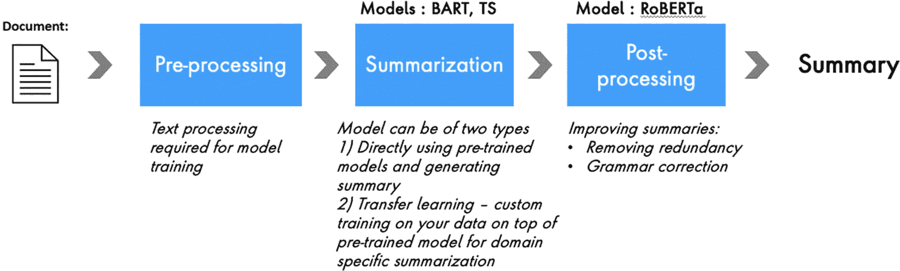
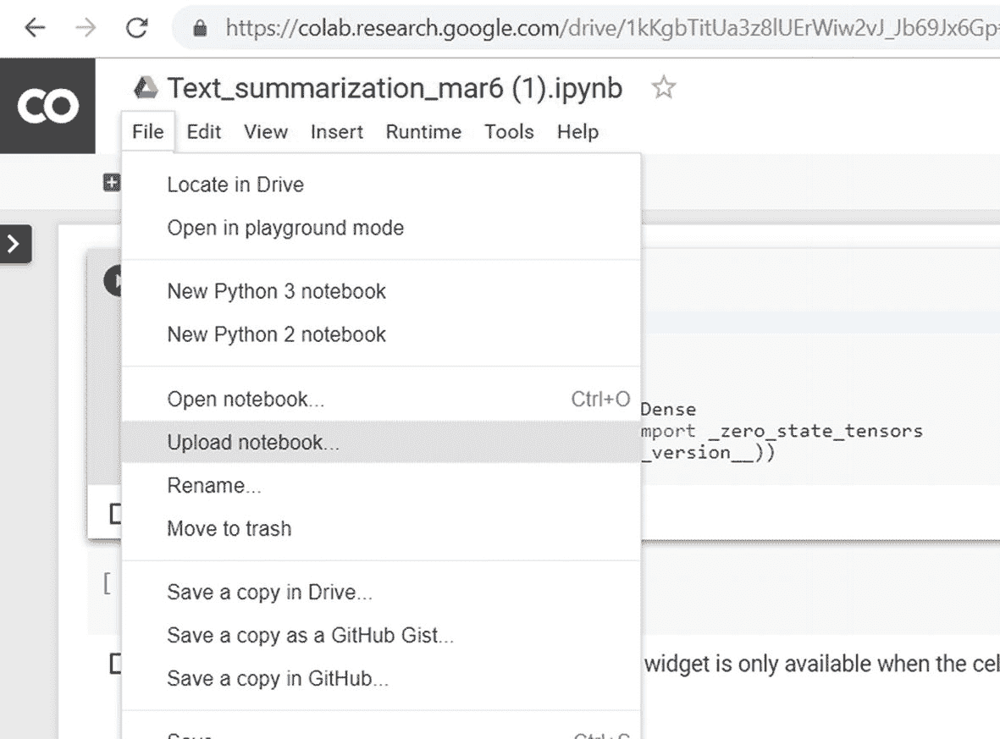
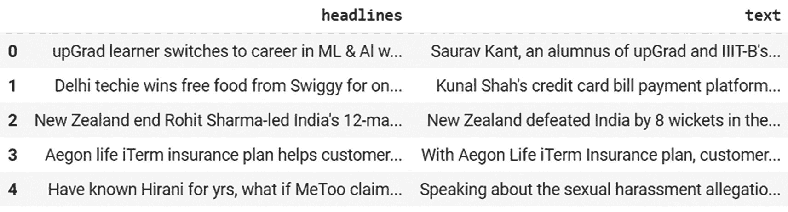
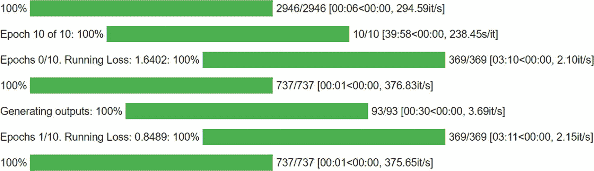
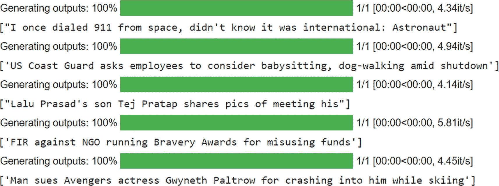

# 10. 新闻标题摘要

文本摘要就是将大量段落转换成能够解释整个文档要点的几句话。鉴于文本数据的数量，每个行业都有数百种应用。文本数据正在呈指数级增长。分析、理解和总结每一段文本都需要大量时间。

在某个时间点，我们可能需要一种智能的方法来总结文本数据，这就是为什么它是一个非常活跃的研究领域。我们可以取得一定程度的成功，但还有很长的路要走，因为像人类一样捕捉上下文说起来容易做起来难！

根据篇幅，摘要可以分为两种类型。

- **长摘要**：包含 10 个或更多句子的段落。
- **短摘要**：包含 10–20 个单词的一两个句子。

摘要技术在各个行业都有丰富的应用。它可以在多种场景中使用，包括以下方面。

- 总结新闻文章以丰富用户体验
- 法律文档摘要
- 临床研究文档摘要
- 从多个数据源获取产品评论洞察
- 呼叫中心数据摘要以了解高层原因
- 总结教育笔记和书籍以便快速复习
- 转录文本摘要
- 社交媒体分析

让我们在本章中了解文本摘要的各种方法及其挑战，并实现一些最先进的技术。

## 方法

在进入实现之前，让我们先了解不同类型的摘要技术。

在 NLP 中，有两种主要的文本摘要方法：*抽取式摘要* 和 *生成式摘要*。

### 抽取式摘要

抽取式摘要是一种简单的技术，它从文档中选择重要的句子来生成摘要。在抽取式文本摘要技术中，重复最多的句子获得更高的权重并生成摘要。原始文本保持不变，在不做任何更改的情况下生成摘要。但缺点是摘要可能不如人类写得那么完美。

以下是一个简单的例子。

- **源文本**：Varun 去班加罗尔参加了一个关于数据科学的活动。该活动讨论了机器学习的工作原理，以及 AI 和 ML 在零售行业的应用，包括客户流失预测、推荐系统和购买倾向模型。最后，会议以下一代 AI 结束。
- **抽取式摘要**：Varun 去参加了一个关于数据科学的活动。它从源文本中提取了一些重要的词语，仅此而已。

根据所使用的算法，有不同类型的抽取式摘要技术。

- **基于图的算法**，使用图技术，利用文档创建节点和边，最终找到关系来总结它。`TextRank` 和 `LexRank` 是基于图的算法的例子。
- **基于特征的算法**从文档的每个句子中提取某些特征，然后根据这些特征决定重要的句子。特征可以是词频、动词的存在等。`TextTeaser` 和 `Luhn 算法` 是不同的基于特征的算法。
- **基于主题的算法**使用奇异值分解等算法从文档中提取主题，并根据提取的主题对句子进行评分。`Gensim` 具有 `lsimodel` 函数来执行基于主题的摘要。

实现抽取式摘要技术很简单。更多信息，请参考我们的书 *《自然语言处理食谱：使用 Python 的机器学习和深度学习解锁文本数据》*（Apress，2019）。

### 生成式摘要

生成式技术涉及解释和缩短源文档的部分内容。该算法创建新的句子和短语，这些句子和短语涵盖了原始文本的大部分上下文。开发这类算法更加困难，因此抽取式仍然非常流行。

以下是一个简单的例子。

- **源文本**：Varun 去班加罗尔参加了一个关于数据科学的活动。该活动讨论了机器学习的工作原理，以及 AI 和 ML 在零售行业的应用，如客户流失预测、推荐系统和购买倾向模型。最后，会议以下一代 AI 结束。
- **生成式摘要**：Varun 参加了一个数据科学活动，讨论了机器学习及其应用，包括如何预测零售行业的客户流失、构建推荐系统以及 AI 的未来。

所以，如果你看一下，摘要是使用源文本的上下文手工制作的。它不仅仅是提取了几个重要的句子，就像在抽取式摘要中那样。

构建生成式摘要的方法有很多。随着深度学习的进步，我们现在能够取得良好的结果。

本章将介绍如何使用深度学习算法实现生成式摘要技术。您还将学习如何利用预训练模型来提高准确性。

图 10-1 说明了解决文本摘要问题的方法设计。



**图 10-1** 方法设计

随着我们的深入，将揭示更多关于模型和过程的信息。


## 环境搭建

由于训练模型需要大量资源，本次体验我们将使用 Google Colaboratory（Colab）（见图 10-2）。



图 10-2

Google Colab

搭建和使用过程非常简单。访问 [`https://colab.research.google.com/notebooks/welcome.ipynb`](https://colab.research.google.com/notebooks/welcome.ipynb) 即可启动 Colab。然后复制粘贴代码，或导入笔记本。

点击“文件”并选择**上传笔记本**，上传从本章 Github 链接下载的练习用笔记本。

## 理解数据

我们将使用新闻数据集来生成标题。该数据集包含超过 3000 条记录的文本和标题。

首先导入所需的包。

```
#导入包
#数据处理
import pandas as pd
import numpy as np
#文本提取
import re
from bs4 import BeautifulSoup
from nltk.corpus import stopwords
import time
pd.set_option("display.max_colwidth", 200)
#建模
#import tf
import tensorflow as tf
# import keras
from keras.preprocessing.text import Tokenizer
```

在将数据导入当前实例之前，我们需要通过一组代码将数据导入 Colab。

按照以下步骤导入数据。

```
# 导入数据
from google.colab import files
uploaded = files.upload()
```

此时会弹出如图 10-3 所示的窗口。选择目录以上传本次练习的文件。


图 10-3

选择文件弹出窗口

```
#将文件导入当前会话
#导入数据
df=pd.read_csv('sum1.csv')
df.head()
```

图 10-4 显示了 `df` 的输出结果。



图 10-4

输出结果

注意

每次会话重启后，都需要重新导入数据。

```
# 数据集的行数和列数
df.shape
(3684, 2)
# 检查空值
df.isnull().sum()
headlines    0
text         0
dtype: int64
```

数据集包含 3684 行和两列，且没有空值。

## 文本预处理

文本数据中存在大量噪声。文本预处理至关重要。让我们进行清理。

文本预处理任务包括：

*   将文本转换为小写
*   移除标点符号
*   移除数字
*   移除多余空白

让我们创建一个包含所有这些步骤的函数，以便在未来的实例（模型训练）中需要时使用。

```
#文本预处理函数
def txt_preprocessing(txt):
txt = re.sub(r'[_"\-;%()|+&=*%.,!?:#$@\[\]/]', ' ', txt)
txt = re.sub(r'\'', ' ', txt)
txt = txt.lower()
return txt
headlines_processed = []
clean_news = []
# 标题文本清洗
for z in df.headlines:
headlines_processed.append(txt_preprocessing(z))
# 新闻文本清洗
for z in df.text:
clean_news.append(txt_preprocessing(z))
```

现在大部分数据理解和预处理工作已经完成，让我们进入模型构建阶段。

## 模型构建

在开始构建模型之前，我们先讨论一下迁移学习。

模型被训练用于执行特定任务，并且该模型获得的知识被用于在不同数据集上执行另一任务的过程，称为*迁移学习*。

语言模型需要海量数据和资源才能获得更好的准确性，而并非每个个人或公司都能获得这些资源。像 Google、Microsoft 和 Facebook 这样的大公司利用其丰富的数据和研究团队训练这些算法，并将其开源。我们可以直接下载并开始使用这些预训练模型来完成特定任务。

但挑战在于，由于这些模型是在广泛多样的数据上训练的，特定领域的任务可能效果不佳。这时，我们就需要使用特定领域的数据，在现有模型的基础上重新训练或定制模型。

整个过程就是迁移学习。

在本项目中，我们使用两个基于 LSTM 的预训练模型。2019 年，Google 和 Facebook 发布了关于 T5 和 BART 的新 Transformer 论文。两篇论文都报告了在抽象式摘要等任务上的出色表现。我们使用这两个 Transformer 模型来观察它们在数据集上的结果。

首先，直接使用一个预训练模型为任何输入简报（一个小型演示）生成摘要。在本例中，我们生成一个新闻摘要。

```
#连接到 hugging face
!git clone https://github.com/huggingface/transformers \
&& cd transformers \
#安装
!pip install -q ./transformers
#导入
import torch
import transformers
from transformers import BartTokenizer, BartForConditionalGeneration
torch_device = 'cpu'
tokenizer = BartTokenizer.from_pretrained("facebook/bart-large")
model = BartForConditionalGeneration.from_pretrained("facebook/bart-large")
#摘要函数
def summarize_news(input_text, maximum_length, minimum_length):
#分词
input_txt_ids = tokenizer.batch_encode_plus([input_text], return_tensors='pt', max_length=1024)['input_ids'].to(torch_device)
#生成摘要
ids_sum = model.generate(input_txt_ids, max_length=int(maximum_length), min_length=int(minimum_length))
#获取文本摘要
output_sum = tokenizer.decode(ids_sum.squeeze(), skip_special_tokens=True)
return output_sum
input_text = "据《印度斯坦时报》报道，这 14 名喀拉拉邦人是从巴格拉姆监狱被塔利班释放的恐怖分子和武装分子之一。截至目前，未经证实的报道称，两名巴基斯坦居民因试图在 8 月 26 日喀布尔机场爆炸案后，在土库曼斯坦驻喀布尔大使馆外引爆简易爆炸装置而被逊尼派普什图恐怖组织拘留。情报报告显示，在喀布尔机场爆炸案发生后不久，从这两名巴基斯坦国民身上缴获了一个简易爆炸装置。据报道，一名喀拉拉邦居民联系了家人，而其余 13 人仍在喀布尔与 ISIS-K 恐怖组织在一起。在叙利亚和黎凡特于 2014 年占领摩苏尔后，来自马拉普兰、卡萨拉戈德和坎努尔地区的人们离开印度，加入了西亚的圣战组织，其中一些喀拉拉邦人后来来到了阿富汗的楠格哈尔省。"
#使用函数生成摘要
summarize_news(input_text,20,10)
#输出
14 名喀拉拉邦人是从巴格拉姆监狱被塔利班释放的恐怖分子和武装分子之一
```

看起来不错；预训练的 BART 模型确实提供了合理的摘要。但是，如果你想进一步改进它，并引入特定领域的上下文以获得更好的摘要，你可以使用这个预训练模型作为基础，进行迁移学习（在你的数据集上进行自定义训练）。让我们在下一节探讨如何做到这一点。

如何训练摘要模型？首先，让我们再讨论一些概念。

广义上，序列模型可以分为三种类型。

*   seq2num
*   seq2class
*   seq2seq


由于在摘要任务中，输入是序列文本形式（新闻），甚至输出也是序列文本形式（新闻标题），因此这属于一种**序列到序列（seq2seq）**模型。该模型在文本摘要、文本生成、机器翻译和问答系统中应用广泛。

现在我们来讨论 seq2seq 模型的构建模块。

提到序列，我们首先想到的是 LSTM。LSTM 架构能够捕捉序列信息。因此，将其作为基础。以下是其中一些构建模块。

-   **双向 LSTM**：将循环网络的第一层复制，形成另一种架构，其中输入的逆序通过该层，以捕捉单词和上下文在两个方向上的关系，从而获得更好的上下文理解。
-   **自编码器**：编码器-解码器架构。编码器对输入文本进行编码，生成固定长度的向量，该向量被输入解码器层进行预测。其主要缺点是解码器只能看到固定长度的向量，可能受限于某些上下文，并且重要信息丢失的可能性很高。因此，注意力机制应运而生。
-   **注意力机制**：注意力机制捕捉每个单词对生成期望结果的重要性。它提高了对生成期望输出摘要或序列起关键作用的少数单词的重要性。

此外，还有自注意力和 Transformer。深入探讨所有这些概念超出了本书的范围。请参考相关研究论文以更深入地理解这些概念。

现在你已经了解了 seq2seq 模型是如何构建的，让我们讨论如何搭建它们。有三种选择。

-   从头开始训练（需要大量数据和资源才能达到较好的准确率）
-   仅使用预训练模型
-   迁移学习（在预训练模型上进行自定义训练）

让我们深入了解 BART，它是基于我们讨论过的构建模块构建的。

### BART：简单 Transformer 预训练模型

双向编码器构成了 BART Transformer 架构的第一部分。自回归解码器构成了第二部分。它们被整合在一起，设计出了 seq2seq 模型。因此，BART 也可以用于许多基于文本到文本的应用，包括语言翻译和文本生成。

BART 中的 AR 代表*自回归*，即模型在每一步都将先前生成的输出作为额外的输入。

这使得 BART 在文本生成任务中特别有效。我们对 BART 进行了微调，用于抽象式文本摘要。BART 提供了一个抽象式摘要器，能够智能地根据上下文重叠进行释义、捕捉和组合信息。你还可以尝试调整波束宽度超参数，以优化生成能力，同时最大限度地减少错误信息的可能性。

BART 预训练模型是在 CNN/*每日邮报*数据上针对摘要任务进行训练的。

请注意，你也可以直接使用此预训练模型而不进行自定义，直接生成摘要输出。

让我们开始使用此模型进行实现。首先，安装必要的库。

```
#安装 transformers
!pip install simpletransformers
!pip install transformers
#从 simple transformers 导入必要的库
import pandas as pd
from simpletransformers.seq2seq import Seq2SeqModel,Seq2SeqArgs
```

BART 接受两列：`target_text` 和 `input_text`。让我们重命名现有列以匹配 BART 的要求。

```
#根据预训练模型要求的格式重命名列
df=df.rename(columns={'headlines':'target_text','text':'input_text'})
model_args = Seq2SeqArgs()
#初始化训练轮数
model_args.num_train_epochs = 25
#初始化 no_save 参数
model_args.no_save = True
#初始化评估参数
model_args.evaluate_generated_text = True
model_args.evaluate_during_training = True
model_args.evaluate_during_training_verbose = True
```

让我们使用 `Seq2SeqModel` 函数在训练数据上训练 BART 模型。这里我们使用的是 BART-large 预训练模型。

```
# 使用类型为 'bart' 初始化模型，并提供模型参数
model = Seq2SeqModel(
encoder_decoder_type="bart",
encoder_decoder_name="facebook/bart-large",
args=model_args,
use_cuda=False,
)
#将数据拆分为训练集和测试集
from sklearn.model_selection import train_test_split
train_df, test_df = train_test_split(df, test_size=0.2)
train_df.shape, test_df.shape
#训练模型，并将评估数据集设为测试数据
model.train_model(train_df, eval_data=test_df)
```

图 10-5 展示了模型训练过程。



图 10-5

输出

```
#在新闻测试数据上生成摘要
results = model.eval_model(test_df)
#打印损失值
results
{'eval_loss': 2.0229070737797725}
```

损失值为 2.02。模型已训练完成。现在让我们查看一些结果来评估性能。让我们同时打印原始摘要和机器生成的摘要。

```
#前 10 条新闻的原始测试数据文本摘要
for i in test_df.target_text[:10]:
print(i)
宇航员透露他曾误从太空拨打 911
美国海岸警卫队建议员工靠做保姆度过政府停摆
在关系不和的传闻中，特贾什维触碰了哥哥特杰的脚
政府对组织勇气奖的非政府组织提起 FIR
男子因滑雪事故起诉复仇者联盟女演员格温妮丝，索赔 2200 万卢比
伊朗：希望印度寻求美国新豁免以购买我们的石油
伊尔凡·帕坦对喷子说：我凭自己的本事打拼
前印度空军军官之子因在推特上评论先知被沙特判处 10 年监禁
新西兰女板球运动员在 T20 锦标赛中收入低于评论员
载有阿根廷足球运动员加盟新球队的飞机失踪
#预测的摘要
for i in test_df.input_text:
print(model.predict([i]))
```

图 10-6 展示了模型训练过程。



图 10-6

输出

我们成功使用迁移学习训练了模型。这里我们使用了 BART。类似地，让我们使用另一个 T5 模型来看看输出是什么样的。


### T5 预训练模型

`T5` 是 *text-to-text transfer transformer*（文本到文本迁移变换器）的缩写。它是谷歌推出的一种变换器模型，以文本作为输入，并输出修改后的文本。该模型易于在任何文本到文本任务上进行微调，这使得它非常特别。

该变换器模型是在海量干净通用爬虫（`C4`）数据集上训练的。其架构被整合以设计出 `text2text` 模型。因此，`T5` 也可用于许多基于文本到文本的应用。

图 10-6 展示了任务名称必须位于输入序列之前，这些序列进入 `T5` 模型，输出则为文本。

现在，让我们看看如何使用 Hugging Face 的 `transformers` 库，并利用文章信息作为输入来实现新闻标题生成。

首先，通过运行以下命令安装 `T5`。

```
#安装 simple-T5
! pip install simplet5 -q
#导入库
from simplet5 import SimpleT5
```

让我们按照模型期望的格式准备数据。

| source_text | target_text |   |
| 0 | 摘要：Saurav Kant，upGrad 和 IIIT-B 机器学习与人工智能研究生课程的校友，曾是 Infosys 的高级系统工程师，拥有近 5 年工作经验。... | upGrad 学员转行机器学习与人工智能，薪资涨幅达 90% |
| 1 | 摘要：Kunal Shah 的信用卡账单支付平台 CRED 为用户提供了赢取 Swiggy 一年免费餐食的机会。德里技术专家 Pranav Kaushik 在花费 20... 后赢得了这一奖励。 | 德里技术专家在 CRED 上赢得 Swiggy 一年免费餐食 |
| 2 | 摘要：周四在汉密尔顿举行的第四场 ODI 比赛中，新西兰以 8 个 wickets 击败印度，赢得了五场 ODI 系列赛的首场胜利。印度在 Rohit Sh... 的带领下输掉了一场国际比赛。 | 新西兰终结了 Rohit Sharma 带领的印度队 12 连胜纪录 |
| 3 | 摘要：通过 Aegon Life iTerm 保险计划，客户可享受已缴保费的税收优惠，并在税收上节省高达 ₹46,800。该计划提供至 100 岁的人寿保障。... | Aegon Life iTerm 保险计划帮助客户节省税款 |
| 4 | 摘要：在谈及针对 Rajkumar Hirani 的性骚扰指控时，Sonam Kapoor 表示：“我认识 Hirani 多年……如果指控不实，[#MeToo] 运动将受到... | 认识 Hirani 多年，如果 MeToo 指控不实怎么办：Sonam |

```
# 模型期望数据框包含两列名称
# 输入为 "source_text"，摘要为 "target_text"，我们据此重命名
df = df.rename(columns={"headlines":"target_text", " input_text":"source_text"})
df = df[['source_text', 'target_text']]
# 让我们为所有源文本添加前缀 "summarize: "
df['source_text'] = "summarize: " + df['source_text']
df
```

```
# 将数据拆分为训练集和测试集
from sklearn.model_selection import train_test_split
train_df, test_df = train_test_split(df, test_size=0.2)
train_df.shape, test_df.shape
# 初始化模型
model = SimpleT5()
# 导入预训练的 t5 模型
model.from_pretrained(model_type="t5", model_name="t5-base")
# 导入 torch，因为此模型基于 pytorch 构建
import torch
torch.cuda.empty_cache()
```

现在我们已经导入了所有必要的库，让我们开始训练模型。

```
# 使用 5 个 epoch 训练模型
model.train(train_df=train_df,
eval_df=test_df,
source_max_token_len=128,
target_max_token_len=50,
batch_size=8, max_epochs=5, use_gpu=True)
# 每个 epoch 生成的模型
! ( cd outputs; ls )
SimpleT5-epoch-0-train-loss-1.5703  SimpleT5-epoch-3-train-loss-0.7293
SimpleT5-epoch-1-train-loss-1.1348  SimpleT5-epoch-4-train-loss-0.5978
SimpleT5-epoch-2-train-loss-0.902
# 加载损失最低时保存的模型
model.load_model("t5","outputs/SimpleT5-epoch-4-train-loss-0.902", use_gpu=True)
```

模型现已训练完成。让我们看看一些预测结果。

```
# 原始标题
test_df['target_text']
# 输出
2249      击球手在 BBL 中因一局第 7 球出局，裁判未察觉
62       女子因 CEO 在面试中欺凌而拒绝工作；CEO 道歉
1791     最高法院允许孟买舞厅重新开放；禁止抛洒现金
2341             总理惊慌失措：前北阿坎德邦首席部长谈 Alok Verma 被免职
91       发明婚姻的人真是 creepy：Sushmita 发帖开玩笑
...
294              Honor View20 发布，将于 1 月 30 日在印度开售
3319     印度强制执行后续击球，澳大利亚在受降雨影响的一天后落后 316 分
813      Bharat 需要开斋节上映，来不及赶上 ABCD 3：Katrina
1974           GST 委员会成立小组解决房地产行业问题
2891     法院：Vinta 可能为了自身利益诬告 Alok 强奸
# 模型生成的标题摘要
for doc in test_df['source_text']:
print(model.predict(doc))
['裁判计数失误后，Klinger 在第 7 个合法投球出局']
['我被欺负到流泪：22 岁作家拒绝工作机会']
['最高法院为孟买舞厅重新开放扫清道路']
['总理恐惧惊慌：CBI 局长被免职后 Harish 表态']
['发明婚姻的人真是 creepy：Sushmita Sen']
['不想谈论 Hirani 性骚扰风波：Nawazuddin']
['一名涉嫌走私 144,000 毒品的走私犯在曼尼普尔邦被捕']
```

结果还不错，对吧？现在让我们在测试数据以及互联网上的一些随机句子上进行预测。


## 从互联网文本生成随机新闻摘要

`model.predict('summarize: As many as 32 died following a landslide in Taliye village in Mahad Taluka, Raigad on Thursday. Around 35 houses were buried under debris and several people were still feared to be missing or trapped under it. In another landslide, four people died in Poladpur, which is also a landslide-prone area.')`

`['32 dead in landslide in Raigad village; 35 houses buried under debris']`

## 检查测试数据的标题

```
for doc in test_df['source_text']:
    print(model.predict(doc))
    print()
```

`['Punjab minister upgraded to Z plus, gets bullet-proof Land Cruiser']`

`summarize: Punjab minister Navjot Singh Sidhu's security cover has been upgraded to Z plus and a bullet-proof Land Cruiser from CM Captain Amarinder Singh's fleet has been given to him. Punjab government also asked Centre to provide Sidhu with Central Armed Police Forces cover, claiming that the "threat perception" to Sidhu increased after he attended Pakistan PM Imran Khan's swearing-in ceremony.`

`['Asthana appointed chief of Bureau of Civil Aviation Security']`

`summarize: After the Appointments Committee of the Cabinet curtailed his tenure as the CBI Special Director, Rakesh Asthana has been appointed as the chief of Bureau of Civil Aviation Security. Asthana and three other CBI officers' tenure was cut short with immediate effect. Last week, CBI Director Alok Verma was moved to fire services department, following which Verma announced his resignation.`

`['Marriage of Muslim man with Hindu woman merely irregular marriage: SC']`

`summarize: Citing Muslim law, the Supreme Court has said the marriage of a Muslim man with a Hindu woman "is neither a valid nor a void marriage, but is merely an irregular marriage". "Any child born out of such wedlock is entitled to claim a share in his father's property," the bench said. The court was hearing a property dispute case.`

`["I'm uncomfortable doing love-making scenes: Amrita Rao"]`

`summarize: Amrita Rao has said she's uncomfortable doing love-making scenes, while adding, "Love-making is so personal to me...if I do it on screen, it's like I'm leaving a part of my soul. I cannot do that," she added, "I'm not saying it's wrong...it's the reflection of how our society has changed." "It's just about a choice...we all make," Amrita further said.`

`['11-hr bandh across northeastern states on Jan 8 against Citizenship bill']`

`summarize: Student organisations and indigenous groups have called for an 11-hour bandh across the northeastern states on January 8 from 5 am-4 pm in protest against Centre's decision to table Citizenship (Amendment) Bill, 2016 in Parliament. The bill seeks to grant citizenship to minority communities, namely, Hindus, Sikhs, Christians, Parsis, Buddhists and Jains from Bangladesh, Pakistan and Afghanistan.`

`['Ex-Gujarat CM joins Nationalist Congress Party']`

`summarize: Former Gujarat Chief Minister Shankersinh Vaghela joined the Nationalist Congress Party (NCP) on Tuesday in presence of party chief Sharad Pawar. The 78-year-old who left Congress in 2017, on Friday said, "In public life, a good platform is required to raise issues." "Vaghela...is a dynamic leader who knows the pulse of...the country," Gujarat NCP chief Jayant Patel had said.`

结果看起来很有希望。我们可以进一步改进和优化摘要，以处理输出中的噪声。首先，让我们评估一下摘要模型。

## 摘要的评估指标

- **ROUGE 分数**：基本上，是指人工生成的摘要中出现在机器提取摘要中的单词数量。它从机器学习评估的角度衡量了输出的召回率。

- **BLEU 分数**：该分数使用以下公式计算。

`Score = number of words in the machine-generated summary that appeared in the human-created summary.`

BLEU 分数给出了模型的精确度。

让我们快速计算一下 T5 模型的 BLEU 分数。

让我们导入库。

```
from nltk.translate.bleu_score import sentence_bleu
```

让我们对新的源文本进行预测。

```
x = [x for x in df.headlines]
y = [model.predict(p)[0] for p in df['source_text']]
# Function to calculate the score
L = 0
for i, j in zip(x, y):
    L += sentence_bleu(
        [i],
        j,
        weights=(0.25, 0.25, 0.25, 0.25),
        smoothing_function=None,
        auto_reweigh=False,
    )
# Average blue score of whole corpuses
L / df.shape[0]
0.769163055697453
```

整个语料库的平均分数为 77%。

## 未来展望

输出必须语法正确、可读性强且格式良好。为了在生成摘要后也能实现这一点，我们需要进行输出处理。这种后处理是在单词或句子级别进行的，以使输出易于理解。

以下是我们可以在流程中添加的一些后处理步骤。

1. **检查语法**。鉴于输出是机器生成的，我们可以预期会有很多语法错误。在向用户展示之前，我们需要清理它们。

   我们可以使用像 Grammarly 的 GECToR（语法错误纠正：标记，而非重写）这样的库（`https://github.com/grammarly/gector`）。

2. **删除重复内容**。摘要中的另一个最大挑战是重复——单词和句子的重复。我们也需要删除它们。

3. **删除不完整的句子**。我们需要过滤掉模型生成的不完整句子（如果有的话）。

## 结论

随着来自各类媒体和社交媒体的内容和新闻不断增加，文本摘要是 NLP 和深度学习应用最广泛的领域之一。我们探讨了如何构建从导入原始数据、清洗数据、使用预训练模型进行自定义训练、评估，到最终预测（生成摘要）的完整流程。在添加更多数据、更改参数以及使用一些高端 GPU 进行更好训练方面，还有很大的空间，这将产生出色的结果。

应用在各个行业都非常广泛，我们已经可以通过该领域正在进行的几个研究项目看到其发展势头。强化学习与深度学习的结合有望带来更好的结果，相关研究也在朝着这个方向继续推进。目前已有许多用于文本摘要的 API，但它们还不够准确和可靠。随着所有这些进步，文本摘要很快将达到一个全新的水平。

