# 11. 文本生成：下一个词预测

本章探讨了在给定前序词序列的情况下，如何生成文本或预测下一个词。用例或应用包括在 Gmail 中撰写电子邮件或在 LinkedIn 中发送文本消息时的单词/句子建议，以及机器写诗、文章、博客、小说章节或期刊论文。

图 11-1 显示了一封写给 Adarsha 的电子邮件。当输入单词 *Hope* 时，Gmail 会推荐下一组单词 *you are doing well*。这是文本生成的最佳应用。

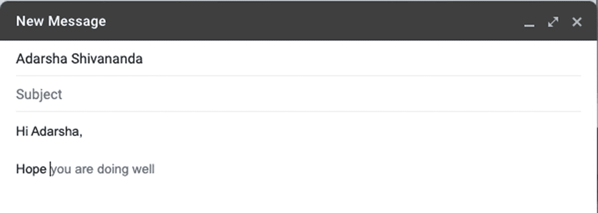

**图 11-1** 文本生成示例

文本生成模型是使用最先进的深度学习算法构建的，尤其是 RNN 和注意力网络的变体。

文本生成是一个序列到序列（seq2seq）建模问题。这些生成模型可以在字符级别、单词级别、词组级别、句子级别或段落级别构建。

本项目探讨了通过实现和构建最先进的循环网络变体及预训练模型来创建能够生成文本的语言模型。

## 问题陈述

探讨如何为文本生成应用（例如基于前一个词或一组词进行下一个词预测或句子预测）构建一个序列到序列模型。


## 方法：理解语言建模

`seq2seq` 模型是许多自然语言处理模型的关键组成部分，例如翻译、文本摘要和文本生成。

在此，模型被训练用于预测下一个单词或单词序列。

让我们看看如何为文本生成任务（如下一个单词预测）构建一个 `seq2seq` 模型。假设这是用于训练模型的数据。理想情况下，源数据应非常庞大，包含所有可能的句子和单词组合。

以下是一个输入示例：

`I use a MacBook for work, and I like Apple.`

表 11-1 展示了如何将这些数据转换为下一个单词预测模型所需的格式。

**表 11-1.** 数据转换

| 输入 | 输出（目标） |
| --- | --- |
| `I` | `use` |
| `Use` | `MacBook` |
| `MacBook` | `for` |
| `For` | `my` |
| `My` | `work` |
| `Work` | `and` |
| `And` | `I` |
| `I` | `like` |
| `Like` | `Apple` |
| `I use` | `MacBook` |
| `use MacBook` | `for` |
| … |  |
| `I use` | `MacBook for` |
| … |  |

我们按顺序为一元组、二元组等所有组合创建输入和输出。它可以是一对多、多对一或多对多，以相应地表示输入和输出；因此，它被称为 `seq2seq` 模型。

由于捕捉上下文至关重要，我们首先想到的模型是 `RNN` 及其变体。因此，我们可以从基本的 `LSTM` 架构开始，然后探索诸如双向 `LSTM`、自编码器、注意力机制和 Transformer 等架构。

此外，让我们看看一些最新的、最先进的用于 `seq2seq` 和文本生成模型的预训练模型。

以下是针对 `seq2seq` 或文本生成模型不同训练方式的三个逻辑流程图。

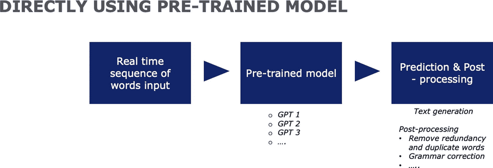

**图 11-4** 使用预训练模型

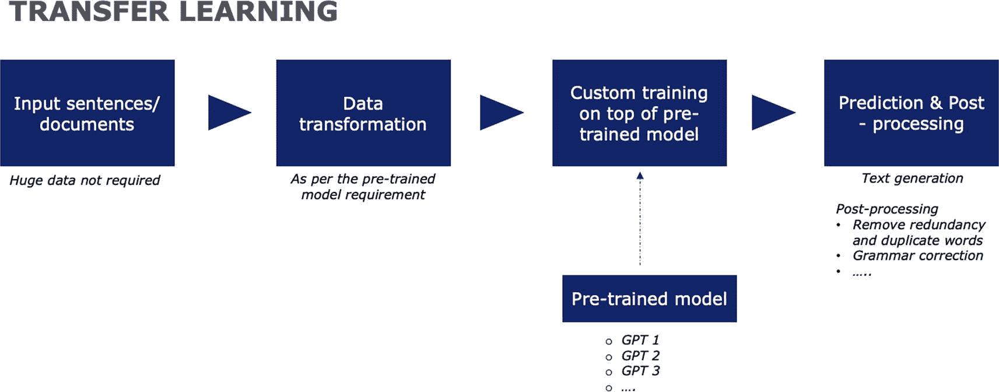

**图 11-3** 迁移学习

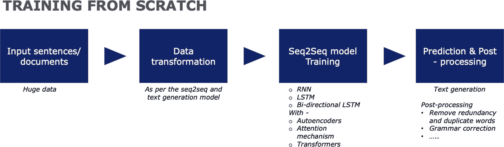

**图 11-2** 从头开始训练

*   从头开始训练模型（见图 11-2）
*   迁移学习（见图 11-3）
*   直接使用预训练模型（见图 11-4）

现在你已经了解了如何处理文本生成模型，让我们进入不同的实现方式。

## 实现

首先，让我们探索几种不同的方法，使用深度学习从头开始开发一个基于文本的语言模型。

### 模型 1：词到词的文本生成

模型被训练用于捕捉两个单词序列之间的关系，将第一个单词视为输入，第二个单词视为目标（输出）。注意：导入所有必需的库。

第一步是将源文本中的每个小写文本的输入序列转换为向量。

```python
# 训练数据（我们从互联网（博客）中随机选取了几个段落）
#数据源链接 1: maggiesmetawatershed.blogspot.com
#数据源链接 2: www.humbolt1.com
text = """She's a copperheaded waitress,
tired and sharp-worded, she hides
her bad brown tooth behind a wicked
smile, and flicks her ass
out of habit, to fend off the pass
that passes for affection.
She keeps her mind the way men
keep a knife—keen to strip the game
down. The ladies men admire, I've heard,
Would shudder at a wicked word.
Their candle gives a single light;
They'd rather stay at home at night.
They do not keep awake till three,
Nor read erotic poetry.
They never sanction the impure,
Nor recognize an overture.
They shrink from"""
# 文本编码
# 为了对句子进行分词，我们使用 Tokenizer 函数
token = Tokenizer()
token.fit_on_texts([text])
#将文本转换为特征
ohe = token.texts_to_sequences([text])[0]
```

让我们构建词汇维度。

```python
# 文本词汇维度
text_dim = len(token.word_index) + 1
```

然后我们需要创建包含输入和输出单词的训练数据。

```python
# 词到词序列
#创建空列表
seq = list()
for k in range(1, len(ohe)):
    seq1 = ohe[k-1:k+1]
    #追加到列表
    seq.append(seq1)
# 将文本转换为输入和输出
seq = np.array(seq)
I, O = seq[:,0], seq[:,1]
```

让我们对输出进行编码。

```python
# 编码 y 变量
O = keras.utils.np_utils.to_categorical(O, num_classes=text_dim)
```

现在让我们定义一个 `seq2seq` 模型。

```python
#初始化
mod = Sequential()
#添加嵌入层
mod.add(Embedding(text_dim, 10, input_length=1))
#添加 LSTM 层
mod.add(LSTM(50))
#添加密集层
mod.add(Dense(text_dim, activation='softmax'))
print(mod.summary())
```

图 11-5 显示了模型训练输出。

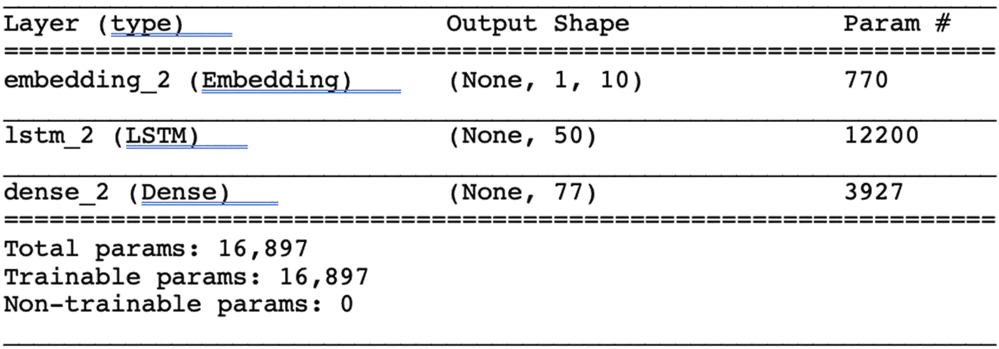

**图 11-5** 输出

从技术上讲，我们模拟了一个多类分类问题（预测词汇表中的单词），因此让我们使用带有交叉熵损失的分类函数。这里我们使用 `Adam` 优化器来优化成本函数。

```python
# 运行网络
mod.compile(loss='categorical_crossentropy', optimizer='adam', metrics=['accuracy'])
#训练
mod.fit(I, O, epochs=600)
#输出
```

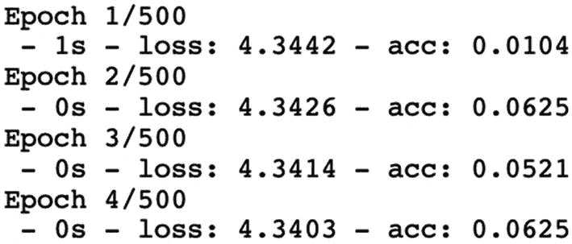

调整模型后，我们通过传入词汇表中的单词并预测下一个单词来测试它。我们得到完整的预测输出。

```python
#预测输入
inp = 'ladies'
#转换为特征
dummy = token.texts_to_sequences([inp])[0]
dummy = np.array(dummy)
#预测
y1 = mod.predict_classes(dummy)
for word, index in token.word_index.items():
    if index == y1:
        print(word)
#输出
men
```

现在让我们预测单词序列。

```python
# 预测单词序列
def gen_seq(mod, token, seed, n):
    inp, op = seed, seed
    for _ in range(n):
        # 将文本转换为特征
        dummy = token.texts_to_sequences([inp])[0]
        dummy = np.array(dummy)
        # 预测
        y1 = mod.predict_classes(dummy)
        outp = ''
        for word, index in token.word_index.items():
            if index == y1:
                outp = word
                break
        # 追加
        inp += ' ' + outp
    return inp
```

让我们使用一些输入元素来获得合理的序列输出。

```python
print(gen_seq(mod, token, 'wicked', 1))
#输出:
wicked word
```

当输入单词 `wicked` 时，模型预测出下一组序列单词：`word their candle gives a`。

考虑到训练规模较小，这个结果是合理的。如果你在更大的数据和 GPU 上进行训练，准确率会提高。


### 模型 2：逐句处理

另一种方法是将输入划分为一个词序列（逐句处理）。这种方法有助于更好地理解上下文，因为我们使用的是词序列。这样做是为了避免跨多行预测单词。如果我们只想建模和生成文本行，那么这些词目前可能适用。

首先，进行分词。

```python
# 句子到句子序列
# 创建空列表
seq = list()
for tex in text.split('\n'):
# 将文本转换为特征
dum = token.texts_to_sequences([tex])[0]
for k in range(1, len(dum)):
seq1 = dum[:k+1]
# 追加到列表
seq.append(seq1)
```

得到序列后，我们对其进行填充，使其长度固定一致。

```python
# 填充
length = max([len(s) for s in seq])
seq = pad_sequences(seq, maxlen=length, padding='pre')
```

然后，将序列划分为输入和目标。

```python
# 划分
seq = np.array(seq)
I, O = seq[:,:-1],seq[:,-1]
# 对输出变量进行编码
O = keras.utils.np_utils.to_categorical(O, num_classes=text_dim)
```

模型定义和初始化代码与之前的方法相同，但输入序列不再只是单个词。因此，将 `input_length` 改为 `len-1`，并重新运行相同的代码。

图 11-6 显示了模型训练的输出。

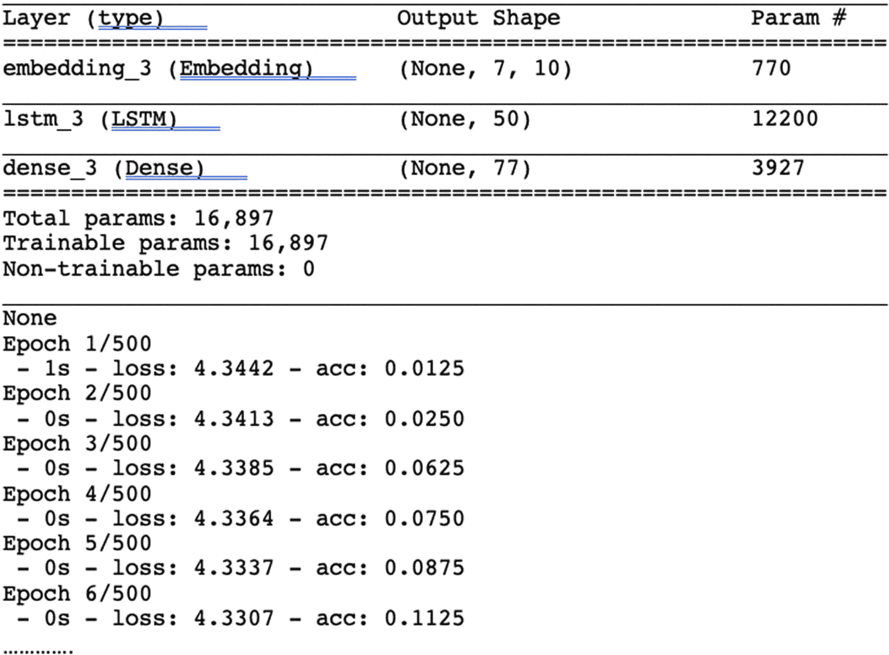

**图 11-6** 输出

现在，像之前一样，使用这个训练好的模型来生成新的序列。

```python
# 预测下一个词
def gen_seq(mod, token, length, seed, n):
inp = seed
for _ in range(n_words):
# 将文本转换为特征
dum = token.texts_to_sequences([inp])[0]
dum = pad_sequences([dum], maxlen=length, padding='pre')
# 预测
y1 = mod.predict_classes(dum)
outp = ''
for word, index in token.word_index.items():
if index == y1:
outp = word
break
inp += ' ' + outp
return inp
print(gen_seq(mod, token, length-1, 'she hides her bad', 4))
print(gen_seq(mod, token, length-1, 'hides', 4))
# 输出
she hides her bad the way men i've
hides bad shudder at a
```

### 模型 3：输入词序列与输出词

我们使用三个输入词来预测一个输出词，如下所示。

```python
# 编码 2 个词 - 1 个词
# 创建空列表
seq = list()
for k in range(2, len(ohe)):
seq1 = ohe[k-2:k+1]
# 追加到列表
seq.append(seq1)]
```

模型初始化和构建步骤与之前相同。

让我们看看预测结果如何。

```python
# 预测
print(gen_seq(mod, token, len-1, 'candle gives', 5))
print(gen_seq(mod, token, len-1, 'keeps her', 3))
```

输出：

```
candle gives a a wicked light light
keeps her mind the way
```

如果你留意输出或下一个词的预测，效果并不理想。在某些情况下，它会预测相同的词。然而，如果我们在拥有海量数据的大型机器上训练这个模型/框架，我们可以期待良好的结果。此外，如第 10 章所述，还需要对输出进行后处理。

为了克服任何问题，我们可以利用迁移学习的概念，使用预训练模型，就像我们在文本摘要中所做的那样。

在此之前，让我们探索一些稍大的数据集，使用已构建的框架来构建一个文本生成模型。

该数据集包含莎士比亚先生的十四行诗。

图 11-7 显示了整个数据集中出现频率最高的词：

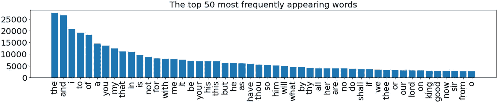

**图 11-7** 输出

在这里，你可以看到像 *the*、*end* 和 *i* 这样的常见词在输入数据中被大量使用。因此，你可以有把握地假设模型对这些词存在偏差。

图 11-8 显示了数据集中出现频率最低的词。

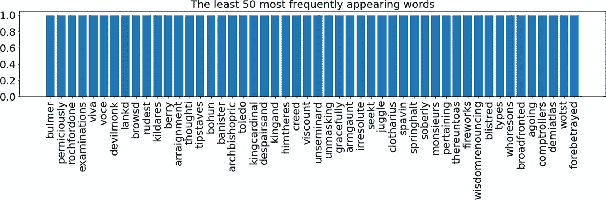

**图 11-8** 输出

图 11-8 显示了在数据集中极少使用的词，因此模型很少从这些词中预测单词。

与之前的框架一样，这包括文本的分词、词汇表和逆词汇表的构建，以及输入文本序列批次的构建。

```python
## 我们使用这个函数来清洗文本并进行分词。
def clean_text(doc):
toks = doc.split()
tab = str.maketrans('', '', string.punctuation)
toks = [words.translate(table) for words in toks]
# 只考虑包含字母的词。
toks =[words for words in toks if words.isalpha()]
#### 转换为小写
toks = [words.lower() for words in toks]
return toks
```

词汇表被构建，其中每个词根据句子集合映射到一个索引。`counter` 为文本中的每个词形成键/值对。`counter` 是一个容器，它将词存储为键，将其计数存储为值。

逆词汇表被维护，其中存在从索引到词的映射。这是通过使用 `enumerate` 函数完成的。这会以计数器和元素的形式生成元组。

我们可以利用上一节中使用的相同模型定义代码，并根据此数据集更改 `input_length` 和 `vocab_size`。

图 11-9 说明了模型的工作原理。

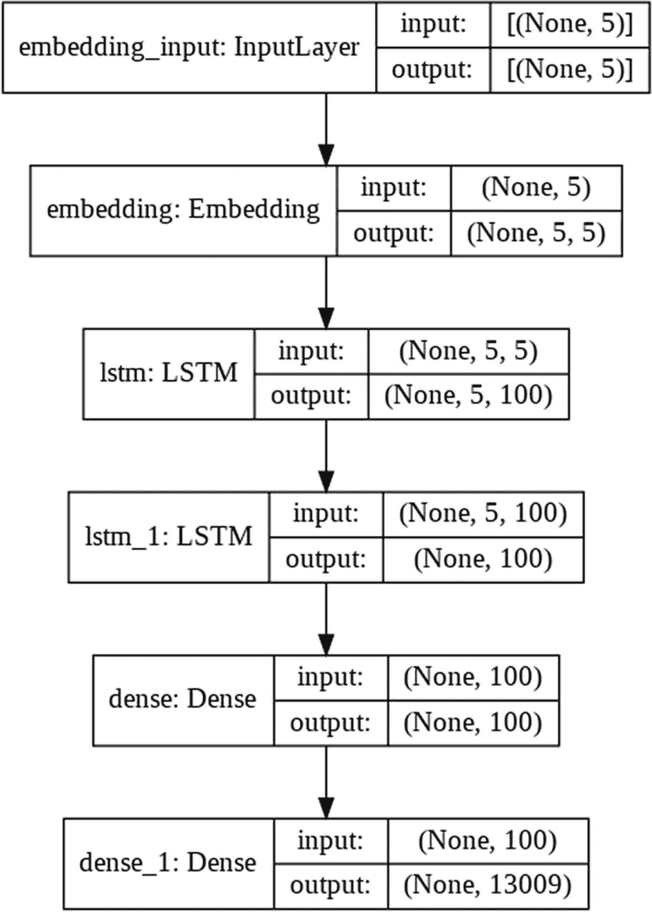

**图 11-9** 输出

采样后，使用输入文本中的词生成新文本，如模型中所示。由于模型是在莎士比亚十四行诗上训练的，因此模型可以生成后续的词。

图 11-10 显示了输出。

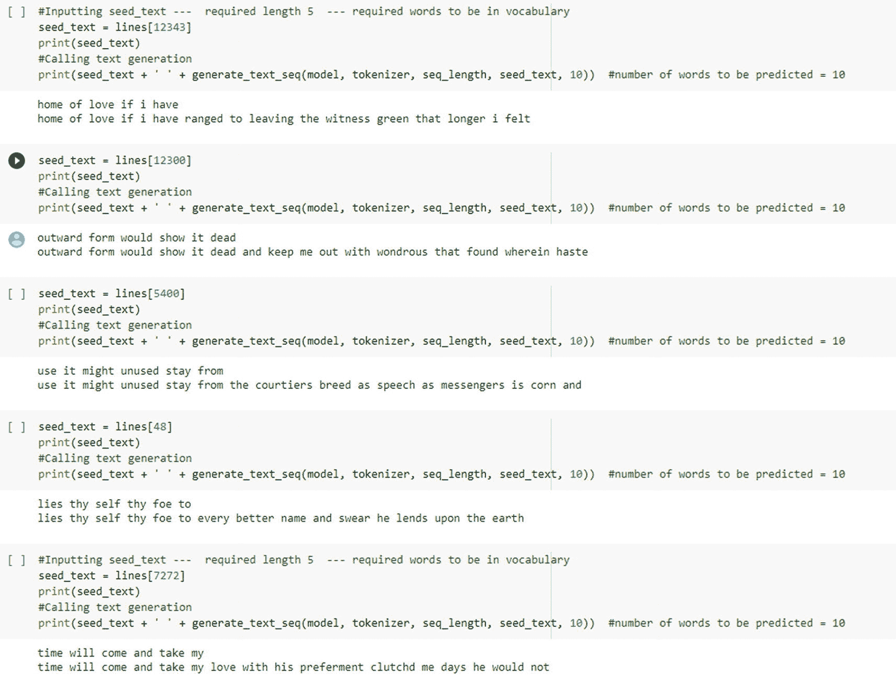

**图 11-10** 输出

到目前为止，你已经了解了如何训练一个 seq2seq 模型用于文本生成任务。我们可以利用相同的框架在海量数据和 GPU 上进行训练以获得更好的结果，并向模型架构中添加更多层，例如双向 LSTM、Dropout、编码器-解码器和注意力机制。

接下来，让我们看看如何利用一些最先进的预训练模型来完成文本生成任务。


### GPT-2（高级预训练模型）

`GPT-2` 代表生成式预训练 Transformer 第二版。它是一个基于 Transformer 构建的庞大架构，拥有数十亿个超参数，并在互联网上 50 GB 的文本数据上进行了训练。`GPT-2` 模型专为文本生成任务而设计。`GPT-2` 是 `GPT-1` 的改进版本。`GPT` 在性能上优于其他特定领域的模型。

有关 `GPT` 及其版本的更多信息，请参考我们的书籍 *《自然语言处理实战：利用机器学习和深度学习解锁文本数据》*（Apress，2021 年）。

对 `GPT` 的详细解释超出了本书的范围。有关 `GPT-1`、`2`、`3` 的更多信息，请参阅 [`https://openai.com/research/`](https://openai.com/research/) 上的研究论文。

`GPT-2` 有四种不同的版本可供使用。

本章使用的是一个拥有约 7 亿参数的大型模型。该模型的 `transformers` 库包含了其不同版本的权重。这是一个最先进的模型，我们希望尽可能通用地使用它，因此我们不会在此进行自定义训练。我们将使用它，并创建一个自定义函数，根据给定的输入词生成输出。

```
Import and initialize gpt2
!pip install transformers
import torch
import transformers
#import tokenization and pre trained model
ftrs = transformers.GPT2Tokenizer.from_pretrained('gpt2')
pre_g_model = transformers.GPT2LMHeadModel.from_pretrained('gpt2')
#input text
input_text="We are writing book on NLP, let us"
# tokenization for input text
input_tokens = ftrs.encode(input_text,return_tensors="pt")
#sequences generated from the model
seq_gen = pre_g_model.generate(input_ids=input_tokens,max_length=100,repetition_penalty=1.4)
seq_gen = seq_gen.squeeze_()
# predicted sequences
seq_gen
tensor([ 1135,   389,  3597,  1492,   319,   399, 19930,    11,  1309,   514,
760,   644,   345,   892,    13,   198,   464,   717,  1517,   356,
761,   284,   466,   318,   651,   262,  1573,   503,   546,   340,
290,   787,  1654,   326,   661,  1833,   703,  1593,   428,  2071,
1107,   373,   329,   606,   526, 50256])
# lets get the words from decoder
txt_gen = []
for i, j in enumerate(seq_gen):
j = j.tolist()
txt = ftrs.decode(j)
txt_gen.append(txt)
# final text generated
text_generated = ''
text_generated.join(txt_gen).strip('\n')
#output
```

We are writing a book on NLP; let us know what you think.

The first thing we need to do is get the word out about it and make sure that people understand how important this issue is to them."<|endoftext|>

这个示例给出了有意义的输出。我们没有对模型进行微调或重新训练任何数据，它就能推导出上下文并预测下一组词。你可以根据需要更改参数，其中 `max_length` 指的是要预测的最大单词数，`n_seqs` 指的是不同序列的数量（即根据需求，从同一输入生成的不同输出的数量）。我们得到的结果相当有趣。

总而言之，这个模型在文本生成任务上的表现超出了我们的预期。

**注意**

`GPT-3` 的架构与 `GPT-2` 相似。主要区别在于注意力层、词嵌入大小和激活函数参数。

现在，让我们继续探讨另一个有趣的库，它可以在大多数需要文本输入的应用中发挥作用。例如，这个智能系统通过推荐在搜索引擎或 WhatsApp 消息中要写的内容来节省时间。

### 自动补全/建议

我们已经研究过几个文本生成模型，其中一些是在相对非常小的数据库上进行本地训练的。另一个是 `GPT-2`，这是一个最先进的 NLP 通用模型，用于逐词生成文本。现在是时候根据不完整/拼写错误的字符来预测下一个词了。最终，我们想要寻找的是“增量搜索，又称自动补全，又称自动建议”。在这里，当你输入文本时，系统会找到可能的匹配项并立即呈现给你。大多数此类应用都在搜索引擎中启用。

图 11-11 展示了自动单词建议的工作原理。


**图 11-11** 自动建议示例

#### 快速自动补全

`Fast Autocomplete` 库（由 zepworks 开发）能够高效地搜索词库。该库完全基于 Python 语言。在内部，它为词库中的每个唯一单词构建了一个字典树。该库中使用的数据结构称为 `Dwg`，代表*有向词图*。

```
Install the library:
!pip install fast-autocomplete
```

要使用这个库，我们需要从数据中提取词元，并将其放入特定格式，作为模型在用户输入时提供建议的上下文。

让我们使用之前用过的相同数据，其中包含莎士比亚的十四行诗，并编写函数从中提取单词。

以下是从语料库中提取唯一词元的函数。

```
def unique_tokens(location):
to_doc = read_csv_gen(location, csv_func=csv.DictReader)
toks = {}
for row in to_doc:
distinct_words = row['distinct_words']
index = row['index']
if distinct_words != index:
local_words = [index, '{} {}'.format(distinct_words, index)]
while local_words:
w = local_words.pop()
if w not in toks:
toks[w] = {}
if distinct_words not in toks:
toks[distinct_words] = {}
return toks
print(toks)
```

图 11-12 显示了词元输出。

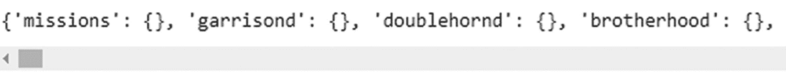

**图 11-12** 输出

类似地，如果有同义词，我们可以提供一个预定义的字典。

最后，我们初始化自动补全模型。

```
from fast_autocomplete import AutoComplete
autocomplete = AutoComplete(words=toks)
```

现在我们已经向模型提供了数据上下文，只需调用 `autocomplete` 库中的 `search` 函数，即可根据提供的上下文/数据获得自动单词建议。它只需要三个参数。

*   `Word`：你想要输入的单词
*   `Max_Cost`：距离度量成本
*   `Size`：建议的单词数量

图 11-13 展示了搜索像 *straw* 这样的单词。建议包括 *straws* 和 *strawberry*。类似地，我们尝试了 *tr*、*hag*、*sc* 和 *mam*。

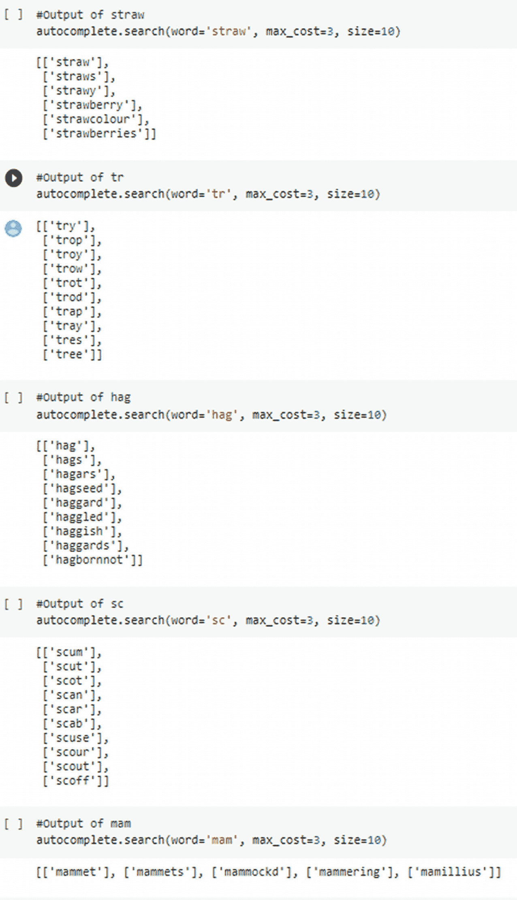

**图 11-13** 输出

你看到了单个单词建议是如何工作的。类似地，你可以实现多个单词序列的建议。有关更多信息，请参考 [`https://pypi.org/project/fast-autocomplete/`](https://pypi.org/project/fast-autocomplete/)。

## 结论

我们使用不同的技术和库实现了多种语言建模方法，用于文本生成。所有这些模型都是基线模型，可以通过使用更大的训练数据和更强大的 GPU 进行改进。

文本生成有广泛的应用，我们可以利用本章讨论的框架，并根据用例使用特定领域的训练数据。有一个很棒的 Git 应用程序可以从注释生成代码，反之亦然。

你已经看到并实现了一些复杂的算法，并学习了一些 NLP 和深度学习领域的最先进算法。第 12 章将讨论 NLP 和深度学习的下一步发展方向。接下来该往哪里走？我们将揭示一些有趣的研究领域。


