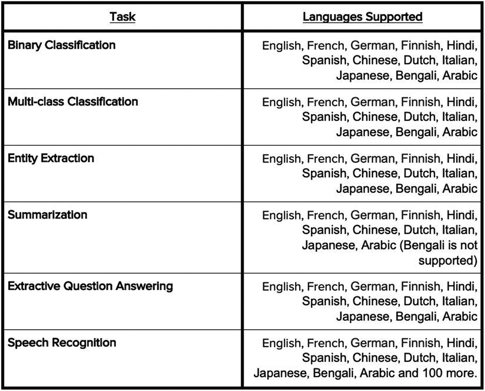
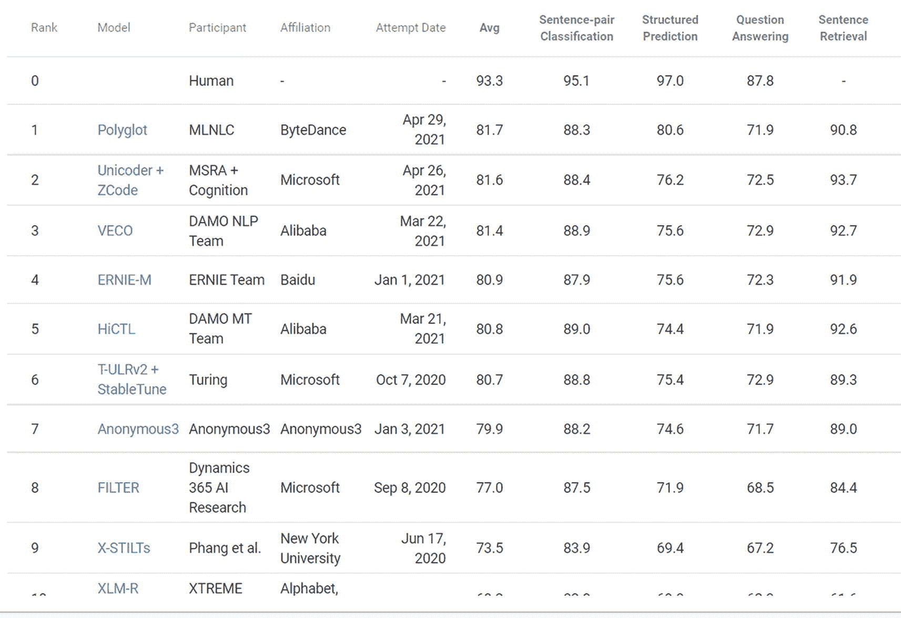

# 12. 结论与未来趋势

你已经学会了如何利用机器学习和深度学习的力量构建不同的自然语言处理（NLP）应用和项目，这有助于解决跨行业的业务问题。

本书重点介绍了以下方面：

-   分类（电商产品分类、投诉分类、Quora 重复问题预测）
-   聚类（TED 演讲分割及其他文档聚类）
-   摘要（新闻标题摘要）
-   主题提取（简历解析与筛选）
-   实体识别（使用`CRF`从电影情节中提取自定义实体）
-   相似度（简历筛选与排序）
-   信息检索（基于 AI 的语义搜索，智能搜索引擎如何提升电商客户体验）
-   生成（下一个词预测、自动补全）
-   信息抽取（简历解析）
-   翻译（多语言搜索）
-   对话式 AI（聊天机器人与问答）

你还了解了部分最新的 SOTA（最先进）算法如何构建更健壮的模型和应用。

## 接下来该往哪走？

NLP 和深度学习在研究领域非常活跃。在你阅读本文时，许多新算法正在被设计出来，以提升应用的智能水平，并使 NLP 更高效、更用户友好。

关于下一代 NLP 的更多信息，请参阅我们的书籍 *《自然语言处理实战：利用 Python 和机器学习与深度学习解锁文本数据》*（Apress，2019 年）。

围绕 NLP 的最新及未来趋势可分为两个方面：

-   深度（技术与算法）
-   广度（应用与用例）

本书简要介绍了一些活跃的研究领域（深度方面）：

-   **词嵌入的进展**：你了解了`word2vec`、`GloVe`、`BERT`、`Transformers`和`GPT`。我们可以关注这一领域，期待更多基于 Transformer 和 Reformer（最新、最先进的 Transformer 变体，具有可逆层）改进的 SOTA 文本特征算法。
-   **用于 NLP 的先进深度学习**：当前主流技术围绕`LSTM`、`GRU`、双向`LSTM`、自编码器、注意力机制、Transformer 和自回归层。未来几年，我们可以期待为 NLP 任务设计出更高效、更完善的深度学习和 Transformer 架构。
-   **强化学习在 NLP 中的应用**。
-   **迁移学习与预训练模型**：我们使用了许多 SOTA 预训练模型来解决摘要、生成和搜索问题。在不久的将来，我们可以期待更多通用、健壮、高效且更准确的预训练模型和迁移学习框架。
-   **NLP 中的元学习**。
-   **用于 NLP 的胶囊网络**：以其多任务处理能力而闻名，单个训练好的模型可以解决多样化的问题并执行多项 NLP 任务。
-   **集成/结合监督与无监督方法**：为任何任务训练模型都需要大量数据，尤其是标注数据。这个时代最大的挑战之一是获取准确标注的数据。这通常是一个手动过程，但在海量数据上执行需要大量的时间和资源。因此，结合无监督和监督方法来解决模型训练中标注数据挑战的研究非常活跃。

除了这些技术深度领域，从更广泛的 NLP 视角来看，还有几个领域：

-   NLP 自动化：`AutoNLP`
-   文本可以是任何语言：多语言 NLP
-   对话式 AI
-   特定领域和行业的训练模型
-   NLP 与计算机视觉的结合

让我们逐一了解。

## AutoNLP

作为一名数据科学家，创建优秀的机器学习和深度学习模型来训练和实施各种 NLP 相关任务需要大量的技能和时间。在选择正确的参数、优化、调试以及在新数据上测试时，可能会面临挑战。对于熟练的数据科学家来说，这不算大问题，但仍然很耗时。如果我们能使用某种框架来自动化所有流程，提供可视化，并以最小的误差获得出色的结果，那会怎样？

Hugging Face 的`AutoNLP`就是答案！

### 什么是 AutoNLP？

它让你能够轻松地预处理、训练、调优和评估用于各种任务的 NLP 模型或算法，省去诸多麻烦。

Hugging Face 是一家下一代 NLP 初创公司，帮助专业人士和公司轻松构建和实验最先进的 NLP 和深度学习模型。你可以在[`https://huggingface.co/`](https://huggingface.co/)上进行大量探索和研究。

以下是`AutoNLP`的主要特点：

-   根据你的数据自动选择最佳模型
-   自动微调
-   自动超参数优化
-   训练后模型比较
-   训练后立即部署
-   提供`CLI`和 Python API

它支持二分类、多分类、实体抽取、文本摘要、问答和语音识别。

图 12-1 展示了 Hugging Face `AutoNLP`在其可执行任务和支持语言方面的能力。

**图 12-1** Hugging Face

因此，它支持多种语言，这是另一个趋势。

`AutoNLP`可以通过最少的人工干预执行各种 NLP 相关任务，让我们的生活变得更加轻松。我们正处于技术日新月异的时代。通过 NLP，我们正在使人与机器的交流变得像人与人交流一样个性化。因此，在未来几年，有许多 NLP 趋势值得我们期待。

除了`AutoNLP`，Hugging Face 还拥有多个其他自定义的 SOTA 预训练模型、框架和 API。

在`AutoNLP`中，你还可以微调托管在 Hugging Face Hub 上的模型。那里有超过 14,000 个可用模型，可以根据你想要执行的任务、偏好的语言或你想使用的数据集（如果托管在 Hugging Face 上）进行筛选。

Hugging Face 数据集库目前拥有超过 100 个公共数据集。

以下是 Hugging Face 的一些模型：

-   `BERT-base`
-   `RoBERTa`
-   `DistilBERT`
-   `Sentence Transformers`
-   `GPT-2`
-   `T5-base`
-   `ALBERT`

大约有 14,000 个模型（每天都在增加）。你可以应用过滤器来获取符合你需求的模型。

以下是 Hugging Face 的一些摘要任务模型：

-   `Distilbart-xsum`
-   `Bart-large-cnn`
-   `Pegasus-large`
-   `Mt5`

让我们进入下一个趋势技术。

## 多语言自然语言处理

以下是最突出的多语言模型。

- `mBERT`
- `XLM`
- `XLM-R`
- 多语言 BERT（`mBERT`）：该模型与 BERT 一同发布，支持 104 种语言。本质上，它是在多种语言上训练得到的 BERT。
- `XLM` 和 `XLM-R`：`XLM-R` 在规模庞大的多语言数据集上以巨大规模训练了 `RoBERTa`。

直到最近，大多数自然语言处理领域的进展都集中在英语上。像谷歌和 Facebook 这样的大型科技组织正在推出预训练的多语言系统，其整体性能与英语系统相当。

在 Facebook 上，如果有人在时间线上发布了中文内容，可以选择将其翻译成英语。

最初，亚马逊的 Alexa 只理解英语。现在，它已扩展到支持印度市场的印地语版本。

因此，这两个例子都使用了多语言自然语言处理模型来理解不同的语言。

图 12-2 展示了多语言自然语言处理领域最新创建的一些模型，以及根据 Google XTREME 得出的最佳结果。

图 12-5

示例（照片由 Digital Marketing Agency NTWRK 提供，来自 Unsplash [`unsplash.com/license`](https://unsplash.com/license)）

图 12-4

示例（照片由 Harley-Davidson 提供，来自 Unsplash [`https://unsplash.com/license`](https://unsplash.com/license)）

图 12-3

示例（照片由 XPS 提供，来自 Unsplash [`https://unsplash.com/license`](https://unsplash.com/license)）

图 12-2

多语言自然语言处理

截至 2021 年 8 月，`Polyglot` 在 Google XTREME 排行榜上位居榜首，与其他多语言模型相比得分最高。

## 对话式人工智能

几年前，完成工作（如客户支持中心）还需要依赖多个领域的人类智能。

而现在，出现了人工智能驱动的智能系统聊天机器人，它可以完成许多人类所做的工作。

如今，亚马逊 Alexa、苹果 Siri 和谷歌 Home 几乎进入了家家户户。无论是获取每日新闻、天气更新、娱乐信息还是交通状况，我们几乎都在与这些智能系统互动。随着时间的推移，它们的性能只会不断提升。

没错，这正是当下热议的话题之一。

## 行业特定预训练模型

行业或领域特定的模型开始受到广泛关注。尽管有许多通用的预训练模型，但它们有时在特定领域的问题上表现不佳（这些领域的数据在互联网上不易大规模获取）。

例如，80% 的医疗保健数据被锁定在非结构化数据中。其应用包括以下方面。

- 从临床笔记和报告中提取信息
- 患者试验中的自然语言处理

有几种预训练的 AI 模型。

- 预训练情感模型
- 预训练聊天机器人模型
- 预训练文本生成或摘要模型

这些模型在医疗保健领域可能表现不佳。因此，需要进行定制训练并使其具有领域特异性。有一种名为 `bioBERT` 的预训练模型，它是针对医疗数据的领域特定语言表示。

## 图像描述

当两种最先进的技术相结合时，想象一下它们能创造怎样的奇迹。计算机视觉和自然语言处理为许多类人智能系统形成了强大的组合。

其中一个应用是图像描述生成或图像到文本的摘要。同样，也可以实现视频摘要，用于总结视频场景。

图 12-3 展示了示例 1。

图 12-4 展示了示例 2。

图 12-5 展示了示例 3。

在这个范畴下将会有许多应用。

我们希望您喜欢这本书，并准备好利用所学知识，使用自然语言处理解决现实世界中的业务问题。

我们下一本书/版本再见。